# 前  言

厚德载物

佛法告诉我们一个宇宙秘密：依报随着正报转。

“依报”是指我们所追求的自然环境和人事环境。也就是普通人日夜想念的名利权位、吉祥平安、健康长寿、恩爱夫妻、孝子贤孙等。这些都是《易经》上“厚德载物”的“物”。

“正报”是指我们的知识能力、道德修养、爱心智慧、阴德福气、心胸境界等。这些都是“厚德载物”的“厚德”。

所以，人应把心放在正报上，而不是放在依报上。正报是形，依报是影。影之随行。正报是花，依报是蝶。蝶围花飞。

只顾追求依报是迷惑，定会苦海无边。念念完善正报是觉悟，就是回头是岸。由此足见清华大学用“厚德载物”作校训意深智睿。

冷眼看股市

看似高深的金融理念，终归是朴素的和简单易懂的，复杂的是人。人的妄想。

一句南无阿弥陀佛念起来简单，但除了佛与佛，谁又知了？

小时看《飘》，南北战争，白瑞德初期做战争物资生意发财，他是个坦率、毫不造作的家伙，因为心里非常清楚，难免玩世不恭。郝思佳天生直觉精明，当看着南方人因州权谈论战争而狂热，心里在想，这些人的面部表情真蠢啊。白瑞德对战争的看法直截了当，无论政治家如何慷慨激昂，为了解放黑奴、为了和平、为了州权、为了棉花、为了从异教徒手中夺回土地，战争的目的只有一个，为了金钱和利益！

现在美国人还在伊拉克继续这个游戏，为了解放被奴役的伊拉克人民，绝口不会提为了对中东土地下面流动的石油。

自有了股票市场，人类就多了一个无形而残酷的争夺利益的战场。大小诸侯、各路内、外人马，都是为了金钱和利益！所以表面是市场，背面实在是战场。

除了真实少数优秀公司企业的结果，K线长年是假象和谎言，这恐怕正是所谓市场最大的风险。证券市场表面喧嚣，背后商业逻辑却是简单的。除了大部分K线波段玩法儿，这一行还有另一种玩法，孙子兵法曾曰过的玩法儿，不战而屈人之兵！长期持有少数优秀企业会有真实的结果。

大部分K线的折腾最好不要参与，不是我军无能，实在是K线太诡异，这里一定会发生很多事情，你得明白，这里是战场。弄不好倾家荡产。

好企业长年走出来的股价是什么？企业纯利润！投资的窍门就是企业的纯利润，股价是市赢率放大的纯利润，10、20倍股是靠这个走出来的。

历史上我们早就有股份制，胡雪岩的丝生意和票号、乔家大院茶生意和票号、大染坊陈六子染厂，几个人一起合伙投本钱做生意、开厂子，能参与的是核心圈子，外人想要进来当股东，别说门儿基本上连窗户都没有。

证券市场是欧美聪明人一代代设计完善的金钱游戏，这一行用放大纯利润来玩。商品交易要求平等，打破了只有核心圈子才能参于的规则，只要你有点钱，热烈欢迎你参与。

天下从来没有免费的午餐，你得支付比核心圈子（原始股东）更高的溢价。最赚钱的一定是“提供”午餐的人，一级、一级半跟着吃些肉，二级市场是剩下的是一锅汤。这锅汤聪明人把它设计的也能生利，玩的基础是税后纯利润，用市赢率放大的游戏。业绩复合增长率预期，未来现金折现，显然诱人着迷和付出更多的溢价。股市生利的游戏规则这么建立起来的，要玩也是按这个游戏规则玩，它比现实商业舍得付出更高的溢价，经常超出商业逻辑的理解。

秘诀？其实金融的本质是再简单不过的了，只需基本常识就可分析。要真说有秘诀，这些华尔街的‘高手们’擅长将非常简单的东西复杂化，故意把本来用75％的加减法，加上24％的乘除法，外带1％的微积分便能说清楚的事情，刻意地加以包装，要不然哪会有这么多人进场呢。

金融归根到底是一种供求关系。华尔街是靠交易量生存的，‘供’的是各种股票和债券。而人的本性是贪婪的，股市就是要设法将他们的贪婪转化为需求。股市的设计是真实和谎言的连续剧。学佛的人最好远离。感谢我的上师早年喝斥，我才改了做护理一行。

当一个人想要从股市或别人身上多得到什么时，那是一种妄想。学佛信佛，深信因果的话，就不会从那里捞钱了。

因为因果实建立于“众生平等”上的，有付出，才能回收自己所付出的部分。没有付出，又那来的回收呢？今世的大款，股市大鳄，也是无量劫来种下了大布施的福报，只不过是通过股市来取回自己曾经的投资“而已，他那里赚了钱呢！

人的付出，只是建立在互助互利上的，说穿了，都是自己帮自己。想赚钱就拼命地去研究K线，查资料，读投资大师的秘诀，以为想赚就能赚到钱，赚到的也是自己过去世布施出去的，并不是想有就有的。想多赚，那是一种妄想，妄念。

不是你在股市上投资一毛钱，即可得好几千元，那除非你的一毛钱曾做过大功德，让无数人得了大利益，现在又回来落到你的手里。否则，是妄想，白日梦。

就是有人来故意让你赚这个不该赚得钱，发心帮你，未来还得还，连本带利，可能会在你最不想还的时候还这个钱。故种树，才有果子吃，有付出，才有得，且常是羊毛出在羊身上。

我们现在所用的，常是过去世所种的。所以在吃，穿，用时少花，省着用。少欲，知足，福报才不需耗得太多，将来没得用时，更苦。嘿嘿，这时你不会再笑俺儿子们衣服上的小补丁了吧！

故今日西方百年不遇的的金融危机发生了，老公的上司PAUL昨天被炒，下午老公同事的叔叔因赔了大量的银子承受不了而去世了。

我的家人没有受到丝毫损失，还准备卖个超级豪华别墅呢！大概无量劫前没有那个受损的“因”吧，才得了今天没赔的果。

佛在三世因果文里讲：

有吃有穿为何因，前世茶饭施贫人。

无食无穿为何因，前世不舍半分文。

高楼大厦为何因，前世造庵起凉亭。

福禄俱足为何因，前世施米寺庵门。

故学佛人自问自己，付出了多少努力，对这个地球有益了多少，有害了多少，有损的多，未来更苦。你布施得越多，获得的回报也越多。种瓜得瓜，种豆得豆

以“布施的快乐”为你布施的动机。反过来，如果你期待着“获得”，你就破坏了布施的动机——宇宙可不是那么容易被欺骗的。

以期待“获得”的心理去布施，这本身就是“贫乏”的表现，它向宇宙发出这样的信息：“我需要‘获得’，因为我拥有的太少”。你的这个信念会很快得到确认——贫乏的能量震动只会吸引更多的“贫乏”。实际上是《华严经》“万法唯心”的一个简单推论。这才是真正的“种瓜得瓜，种豆得豆”。

有不少人在布施的时候很不情愿，或在奉献了自己的时间或金钱后感到贫乏。如果你是出于不得已的“义务”而布施，或者将布施看成一种“牺牲”，你深层的感觉其实就是“贫乏”。

不要将布施看成一种可以获得回报的投资，那只会浪费你的时间——老天爷不是一只你可以在纳斯达克股市上进行交易的股票。“如果我布施，我最好能得到回报或什么的”——这种想法根源于“我很贫乏/贫穷”。

信念每时每刻都在创造着你的现实世界。 人得到应得到的一切，而不是想得到的一切。老天爷很公平 。

云谷禅师对了凡先生所说的拥千金者值千金，应饿死者必饿死，就是这个道理。愿所有佛子远离贪心，远离股市。南无阿弥陀佛！

序言

经典回放：G股就是G点，市场的原理和性的原理是一样的

(2006-11-27 12：10：52)

今天必须把这帖子在博客里回放，否则过两天都给删光了，都没证据表明本ID曾写过该文了。本ID没博客以前的帖子都是先发在强国论坛，那是本ID的大爷，最近强国论坛换新版，很多老帖都查不到了，包括这帖子，二爷天涯杂谈、三爷猫眼、四爷猫扑竟然也没了，现在就剩下天涯的经济版上还残留了一个，马上复制过来。各位看到没有，当时本ID的名字还叫“喜欢数学的女孩”。帖子最早应该在2005年7月中旬，当时正在二次探底考验1000点，但就算现在保留下来的2005年8月5日，刚好是二次探底成功突破双底颈线的那天中午，也足够早了。现在回头去看，有谁能在那么早提出“大行情”三个字，又有谁能对这行情开始的性质给一个这么鲜明的定义“G股就是G点”？

说这个不是要显摆本ID如何有先见之明，这根本无须显摆。关键是对现在走势给一个明确的说明。在博客里，5月份给出了一个新的命题，就是“大牛不用套”，而且特别强调这个“不用套”最重要的是不能套用原来的走势，为什么？因为“G股是G点”这个命题在2006年的5月份已经即将完成历史使命，后面就是“大牛不用套”的延伸，目前为什么不再提出新的命题、口号？就因为这个“命题”继续有效。用面首来比喻，“G股是G点”是把一个雏男变成一个面首很关键的一步，就是要他先认识G点，先有了G点，先让他开窍，在开窍之前，面首还不能算面首，只能算准面首。行情也一样，当完成“G股是G点”前，中国股市只是从一个准股市变成一个符合国际规范股市的过程，从“大牛不用套”开始，大牛市的第一阶段才算真正的开始，这也是为什么本ID反复强调目前只是大行情展开的第一阶段的一个理由。

对大盘的走势，本ID从2005年6月重新天天看盘以后，就从来没怀疑过。这大盘还早着呢，想想，96年的行情，实实在在地走了5年，即使按照96年的标准，现在难道不还早吗？当然，短线走势会调整会反复，但真正的行情还没有真正的展开，让本ID给各位回忆一下96年到2001年行情的走势吧：第一阶段，走得最牛的都是成分股票，这也是为什么本ID反复强调让大家现在注意成分股的理由，而事实上，现在的走势就是这样。第二阶段走得最牛的是所谓的成长股，第三阶段走的是所谓的重组股，等大盘大面积地炒所谓的重组股时，这大盘的大牛市才有结束的风险，也就是2001年见顶的时候发生的事情，这也是为什么本ID2001年能从容退出且4年不看股市一眼的理由，连续三次高潮之后，再牛的面首也有一个大的不应期了。

股市是有规律的，本ID现在已经把这N年大牛市的最重要节奏告诉各位了，本ID已经把股市像面首一样扒个精光给各位了。等着吧，不久以后，这就会被人抄袭，接着被市场所抄袭。现在市场上流行的不少概念，就是在N年前从本ID这里流传开去的，这些陈年谷子就不说了。这里，还是重温一下G股成为G点的故事。G股已经过去，但G点依然需要，就像面首随着年龄的增加，G点会变化的，这和股市里G股以后，从成分股到成长股到重组股G点变化是一个原理，市场的原理本来就和性的原理一样，这也是本ID名言“像做爱一样做股票”其中一方面的含义。

G股就是G点，市场的原理和性的原理是一样的

作者： HYPERLINK "http://www.tianya.cn/browse/listwriter.asp?vwriter=%C3%8F%C2%B2%C2%BB%C2%B6%C3%8A%C3%BD%C3%91%C2%A7%C2%B5%C3%84%C3%85%C2%AE%C2%BA%C2%A2&idwriter=0&key=0" \t "_blank" 喜欢数学的女孩 提交日期：2005-8-5 12：15：00

本女和证监会从一开始就有打交道，从第一届到现在，都很熟悉。以前从来没有称赞过证监会，但对这一届是感觉最好的。前段时间就发过几个帖子，例如：“为尚福林鼓掌-------不会挑逗各方利益的战争不是一个好的调控者 (喜欢数学的女孩： 2005-06-20 20：17：51)”、“为尚福林鼓掌-------必须对企图用股权分置问题要挟政府的用法律制裁之 (喜欢数学的女孩： 2005-05-16 12：06：07)”等。当然，市场总是后知后觉者占大多数，否则先知先觉的怎么挣钱？当看到一些左派或名嘴继续按老思维对证监会大放厥词时，就知道又一批傻瓜在表演了。

G股当然是G点，这次是为证监会能对市场G点的充分摸索后加以引导而鼓掌。本女对山东人一向印象比较好，当然，生意上一般不要和山东人弄，但管理上，山东人确实比较厉害，看看现在一些大企业的头，山东人还是很多的。现在证监会的山东特色已经有点当时家电突起时候一种大刀阔斧的感觉，熟悉了以前证监会妞妞捏捏的人，当然是处处看错。

市场的原理和性的原理是一样的，所谓世界都是相通的。市场需要的是G点，没有G点就没有性，没有G点也没有市场。而G股当然是G点，现在所有的事情都是围绕这个G点来，这样就对路了。市场兴奋了，一切都好办；市场没感觉，一切都瞎掰。

这届证监会和以往的思路、特别是风格上都有了极大的改变，这种新气象是必须的，这也是本女为什么一开始就看好他们的关键。一场大行情是需要各方面的配合的，没有配合，没有共同的G点认识，行情就只能是空话。没有行情，市场也就是空话。

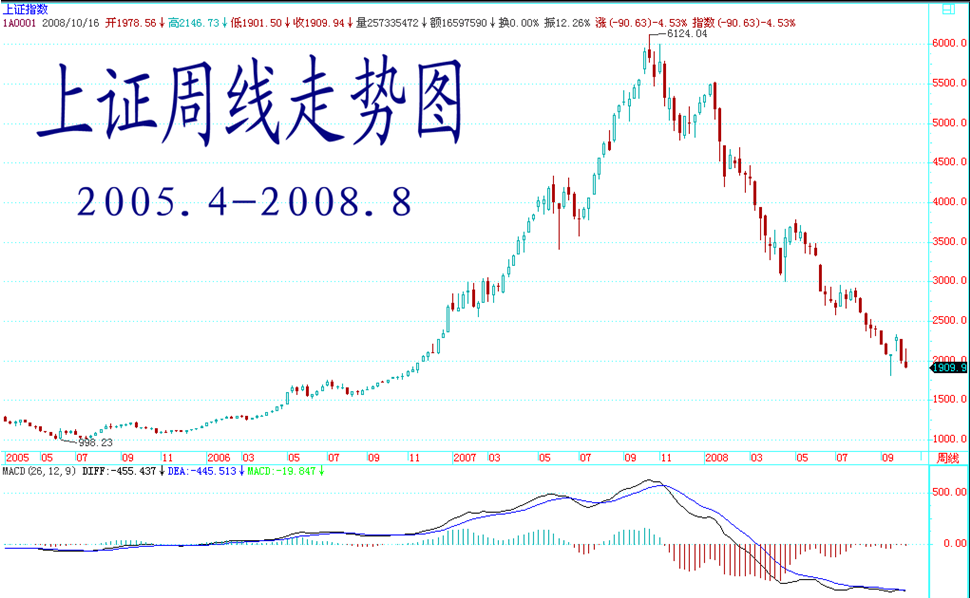

股市闲谈：G股是G点，大牛不用套！(2006-05-12 19：02：25)

能和本ID聊股市的，如果有，最多就处在精子或卵子状态，连受精卵都算不上。而且股市游戏是靠干出来而不是说出来的，因此一般都不说。但看到有些人被这股市折腾得厉害，出于同情，又周末了，也就说两句。

一年前股市跌到1000点最腥风血雨时，当时看到很多人在网上很可怜，就用老ID给了一个明确的说法，叫“G股是G点”，越腥风血雨就机会越大了。现在这个G点已经弄得让很多人受不了，绝大多数在市场中的人都是很犯贱的，跌也怕，涨也怕，真是可怜。为此，今天再给一句话，叫“大牛不用套”。

这个不用套，最关键的意思就是不要用老思路来套用走势，特别是那些对市场了解不多的。例如那天看到有人说什么五粮液的权证疯了，都3、4元了，这些人就是对市场了解不多。知道以前宝安权证给干到多少吗？知道深圳市场受香港影响一直都有玩权证的传统吗？知道在香港比这疯多的权证遍地都是吗？市场总是要超越一般人想象的，3、4元就贵？为什么股价就不能比酒价贵？哪一天，按复权算，一瓶茅台、五粮液买不来一股相应股票又有什么可奇怪的？

当然，对于极少数的人来说，市场就是一个提款机，想提就提，这怎么才能办到？就是要对市场充分地了解，真了解市场的人，就知道市场都是一样的，就像穿着各种衣服的人，扒光了都一样。真明白市场的，就无所谓牛熊，市场永远都是提款机。当然，如果市场只能是单边的，那么唯一的区别就是在熊市中，投入的资金以及摆动频率要小。

不过，即使在牛市中，高手和低手之间的赢利程度也是区别很大的。一个股票如果上涨1倍，低手最终落袋的最多就是1倍，而高手搞出3、4倍来是一个很简单的事情。其实，股票投资十分简单，最关键的就是成本，而时机其实就是成本，如果你有本事能比市场的平均成本要低，就永远立于不败之地。既然波动是市场风险所在，那么相应地就提供了利用市场的风险，利用一切值得利用的波动把持有成本往0甚至负数干下去的机会，这样，无论牛熊，都无所谓了。有波动就有风险，相应就有利润，对于一个高手来说，只要有足够的时间，一个下跌股票弄出来的利润一定比一个低手在一个上涨股票弄出来的大，当然这只是举例，真正的高手当然不会故意逆着趋势干。

投资是一门艺术，而投资的艺术归根结底是资金管理的艺术，这就像歌唱的艺术，归根结底是呼吸的艺术一样。而市场的波动，归根结底是在前后两个高低点关系构成的一个完全分类中展开的，明白了这一点，市场就如同自己的掌纹一样举手可见了。以上这些，不但对于散户，对于庄家其实也是一样的，能明白这一点的，就可以在市场中游刃有余了。当然，这个境界还有向上一路，这就不是能对一般人说的，而且说了也白说，就不说了。

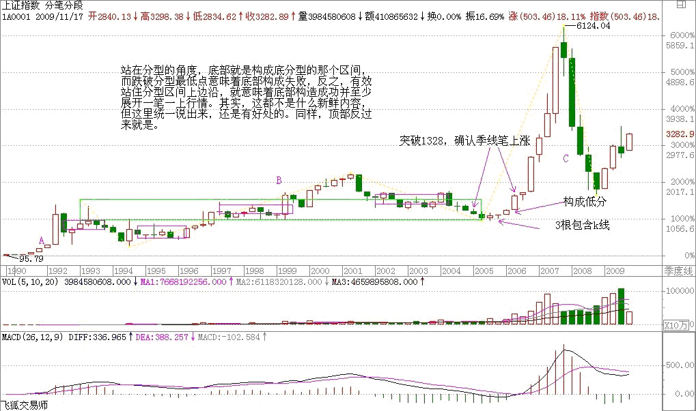

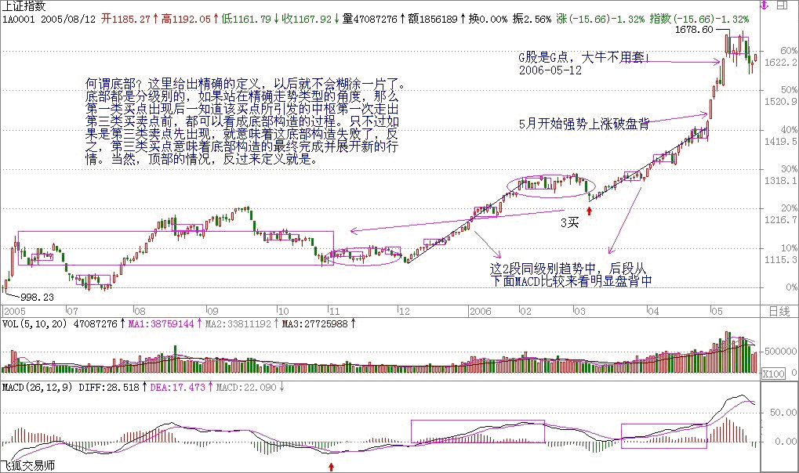

## 教你炒股票1：不会赢钱的经济人，只是废人！ (2006-06-07 18:08:15)

“教你炒股票”这样的题目，全中国不会有第二人比本ID更适合写的。当然，股票是炒出来的，不是写出来的，因此也从未想过写这样的题目。但任何事情都是有缘起的，缘分到了，也不妨写上一写。

人，总是很奇怪的，就算是很聪明的人，或者在其他行业很成功的人，一旦进入资本市场，就像换了人。虚拟和现实的鸿沟使得干实业的，且不说期货了，就算到风险小多的股市，也很少能干好的。而习惯在虚拟市场玩游戏的，基本很难回头去弄实业，这些例子都太多了。

周围朋友和经济有关的，干金融的比较多，也有几个干实业的。去年人民币放开后，有次和他们一起玩，偶然聊起股票。当时给他们的意见是，由于资源的全球化升势及人民币的升值，国内实业将有很大的困难，而虚拟市场由于对资本的吸纳作用将大有改观，会出现一个至少是大X浪级别的行情，劝他们应该分流部分资金到资本市场来。由于前几年资本市场上出事的人一拨接一拨，这帮家伙很犹豫，一晃就把时间过了。

今年，过完春节，这帮家伙突然开始不断骚扰本ID，说要入市。本ID当时已经忙得无暇分身，对他们一番数落，然后告诉他们，现在是个人都能挣钱，自己玩去，没空理你们。

进入三、四月份，当时有色等行情已经很火爆，这帮家伙想大进又怕风险，一直在小打小闹。有一天，又在一起玩，他们一定要本ID选择一些具体的股票。因为这两年一直有很多外资大基金进来接触要收中国快速消费品的企业，还有就是一些大的周期行业将面临重组，就让他们去关注这两类股票和权证。

五月份后，股市大涨，大家都很忙，中旬时又有机会碰头，一问之下，基本都没怎么大买，买了的也没几个站就下车了。他们都显得很烦躁，不断问有什么可买的。既有点可怜又有点烦他们，怎么在市场外弄得好好的，一到市场里都成这样了？就有点敷衍地告诉他们，去买深沪两地3元上下的本地股，而且告诉他们，这样下去肯定要出问题的，最好自己好好学学，别人怎么厉害也不可能整天像照顾小孩一样看着。

上周日，又碰在一起。这几位，大概都一肚子股票了，这次个个神采飞扬；大概又都刨了几本书，听了几股评，看了几杂志，更是口水喷喷地这面那面、一线二线地专家了，1800、2000、2500点地牛人了。这市场，还真能改造人！只是这市场的绞肉机，又有新货了。

有人说，市场是老人挣新人的钱，而市场中的老人，套个10年8年的一抓一大把。其实，市场从来都是明白人挣糊涂人的钱。在市场经济中，只要你参与到经济中来，就是经济人了，经济人当然就以挣钱为目的，特别在资本市场中，没有慈善家，只有赢家和输家。而不会赢钱的经济人，只是废人！无论你在其他方面如何成功，到了市场里，赢输就是唯一标准，除此之外，都是废话。

## 教你炒股票2：没有庄家，有的只是赢家和输家！(2006-06-07 22:41:27)

庄家这种动物对大多数人来说很神秘，对本ID来说就太稀松平常了。庄家和散户这种二元对立，大概比较适合现代中国人的思维模式，因此就变得如此的常识，但常识往往就是共同谬误的同义词，不仅是所谓的散户，而且很多的所谓庄家，也就牺牲其中。

一般定义中的所谓庄家，就是那些拿着大量资金，能控制股票走势的人。在有关庄家的神话中，庄家被描述成无所不能的，既能超越技术指标、更能超越基本面，大势大盘就更不在话下了。这里说的还只是个股的庄家，至于国家级的庄家，更成了所谓散户的上帝。关于这些庄家上帝的传闻在市场中一秒钟都不曾消停，构成了常识的谬误流播。

但所谓的庄家，前赴后继，尸骨早堆成了山。前几天在一个私人聚会里，还碰到一个50年代的老大叔，说已经准备了二十亿，要坐庄，让本ID去联系一下某某公司的头。那人也是有头有脸的人了，不想当众奚落他，暗地里把他嘲笑了一番，简直是脑子锈着了。

当然，即使庄家的神话已经如此常识，这种傻人还是一直、也会继续前赴后继的。而正因为这种傻人如此的多，猎人打起猎来才能收获丰富。看到越摆庄家谱的，猎人就越高兴，反正这类型的，基本在市场上混个几年就基本尸骨无存了。

市场没有什么庄家，有的只是赢家和输家！有的只是各种类型的动物，还有极少数的高明猎手。市场就是一个围猎的游戏，当你只有一把小弓箭，你可以去打野兔；当你有了屠龙刀，抓几条蛇来玩当然就没劲了，关键你是否有屠龙刀！

## 教你炒股票3：你的喜好，你的死亡陷阱！(2006-06-09 17：03：48)

要世界杯了，在世界杯时谈论股票是一件很无趣的事情，而且，全世界的人都知道，世界杯前后，股票市场几乎都要大跌，这个常识，虽然并不比所有有关所谓庄家的常识更值得常识，但至少有趣，并不像所谓庄家一般无聊。还可以增加一句的是，足球至少有帅男，而见过的如此之多的所谓庄家里，连长得不那么歪瓜裂枣的都少，这的确是实际情况，并不是开玩笑。

但你的喜好，就是你的死亡陷阱！在市场中要生存，第一条就是在市场中要杜绝一切喜好。市场的诱惑，永远就是通过你的喜好而陷你于死亡。市场中需要的是露水之缘而不是比翼之情，天长地久之类的东西和市场无关。市场中唯一值得天长地久的就是赢钱，任何一个来市场的人，其目的就是赢钱，任何与赢钱无关的都是废话。

必须明白，任何让你买入一只股票的理由，并不是因为这股票如何好或被忽悠得如何好，只是你企图通过买入而赢钱，能赢钱的股票就是好的，否则都是废话。因此，市场中的任何喜好，都是把你引入迷途的陷阱，必须逐一看破，进而洗心革面，才能在市场上生存。

当然，能看清楚自己周围的市场陷阱，还只是第一步，更进一步，要学会利用市场陷阱来赢钱。当你要买的时候，空头的陷阱就是你的最佳机会，当你要卖的时候，多头的陷阱当然就是你的天堂。这市场，永远不缺卖在最低点，买在最高点的人，这世界上没有什么是可以让所有人赢钱的，连大牛市中都有很多人要亏损累累。而市场中的行为，就如同一个修炼上乘武功的过程，最终能否成功，还是要落实到每个人的智慧、秉性、天赋、勤奋上来！

## 教你炒股票系列4：什么是理性？今早买N中工就是理性！

一 鄙视对N中工15元不敢买50元就吃醋的人！(2006-06-19 16:45:17)

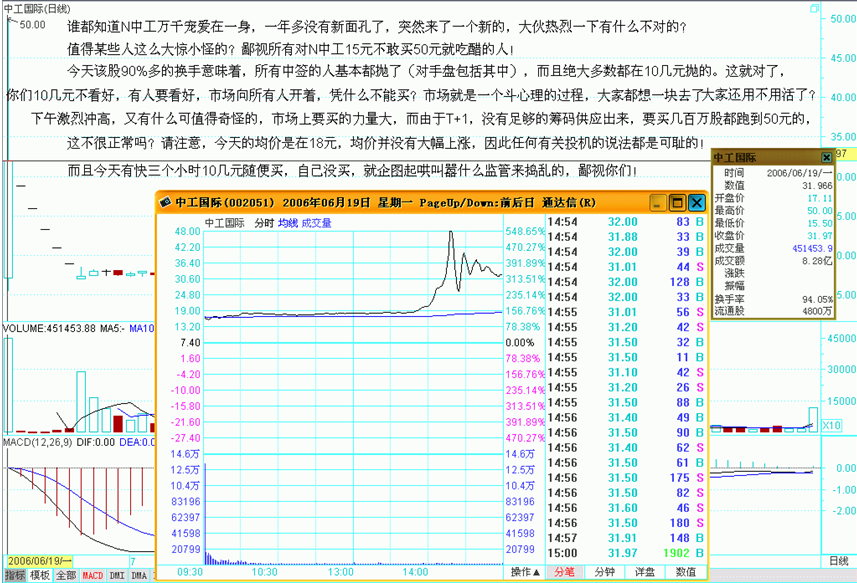

谁都知道N中工万千宠爱在一身，一年多没有新面孔了，突然来了一个新的，大伙热烈一下有什么不对的？值得某些人这么大惊小怪的？鄙视所有对N中工15元不敢买50元就吃醋的人！

今天该股90%多的换手意味着，所有中签的人基本都抛了（对手盘包括其中），而且绝大多数都在10几元抛的。这就对了，你们10几元不看好，有人要看好，市场向所有人开着，凭什么不能买？市场就是一个斗心理的过程，大家都想一块去了，大家还用不用活了？

下午激烈冲高，又有什么可值得奇怪的，市场上要买的力量大，而由于T+1，没有足够的筹码供应出来，要买几百万股都跑到50元的，这不很正常吗？请注意，今天的均价是在18元，均价并没有大幅上涨，因此任何有关投机的说法都是可耻的！而且今天有快三个小时10几元随便买，自己没买，就企图起哄叫嚣什么监管来捣乱的，鄙视你们！

中国资本市场中有过太多无聊无端的干预，像327的最后交易不算之类的事情真是世界罕有。市场最关键的就是大家都要遵守规则，这包括管理层，不能按自己的一时喜好而干预市场。就算交易有问题，只能根据交易的问题来处罚，而不是突然改变规则来显示自己的无能。

只要符合市场交易规则，包括N中工在内的所有走势，都应该受到法律保护，由于现在的法律观念太淡薄，往往有按个人喜好代替法律判断的倾向，所以必须再次强调。至于市场中的人，不要自己没份就瞎起哄，看不得别人好不是一个好的市场参与者应有的心态。首先有了一花盛放才可能百花盛开，维护一个只按法律办事的环境，对大家都有好处！

2006-6-19　15：41：04

10元随便买，自己没买，就企图起哄要监管捣乱的，鄙视你们！

2006-6-19　15：46：33

汗颜啊，今天散户誰低价购进它了？？？？

===

可笑，今天有三个小时，随便你买！

2006-6-19　16：00：01

什么叫理性，今天早上买N中工的就是理性！

2006-6-19　21：48：39

股民是什么玩意？

2006-6-19　22：35：51

这就是政府想要的理性投资，纯粹一个屠宰场，肮脏

-----

开玩笑，就这水平？

2006-6-19　22：38：03

你知不知道这只股要死多少人？

======

谁不要死？人只会死在自己手上！

二 什么是理性？今早买N中工就是理性！(2006-06-19 21：41：14)

很奇怪，在资本市场中经常有人在教导别人要理性。而所有理性模式后面，都毫无例外地对应着一套价值系统为依据，企图通过这所谓的依据而战胜市场，就是所有这些依据最大的心理依据，而这，就是所有资本谎言和神话的基础。真正的理性就是要去看破各色各样的理性谎言，理性从来都是人YY出来的皇帝新衣，这在哲学层面已不是什么新鲜的事情。

更可笑的是，被所谓理性毒害的人们，更经常地把理性当成一种文字游戏，当文字货币化以后，这种文字游戏就以一种更无耻的方式展开了。但真正的理性从来都是当下的，从来都是实践的，而实践，从来都是当下的理性。就像性是干出来的而不是说出来的，理性也一样。

站在资本市场的角度，就是所有的介入都是可介入从而被介入地介入着。也就是所有的介入，当你介入时，市场与你就一体了，你创造着市场，从而市场也创造着你，而这种创造都是当下的，从而也是模式化的。真正的理性关心的不是介入的具体模式如何，而是这种模式如何被当下着，最重要的是，这种模式如何死去。

生的，总要死去，如果自然真有什么法则，这就是唯一的法则，市场上的法则也一样。所谓法则，就是宿命。在市场中，死亡是常态，也是必然，而生存，必须以生为依据，所谓生生不息，其实就是死死不息，当你被依据所依据时，其实已在死亡之中。而生死，从来都是被当下所模式，资本市场也一样，以为离了生死也就无生死可了，这不过是所谓理性的妄想。任何市场中人，都是被生死了的，生死无处可离，生死就在呼吸之间，不离生死而从容于生死，没有这种大勇猛，一切的理性都不过垂死的哀鸣。对于市场来说，介入就是介入生死，无所依据地从容于各种模式之间，无所往而生其心，而心实无所生，方可于生死而从容。

对于市场的参与者来说，首要且时刻必须清楚自己目前介入模式的当下，而市场中的绝大多数人，是不知道自己在干什么的，狠一点说，就是死都不知道怎么死就死了，市场基本由这种人构成。这种构成与资金实力无关，大资金死起来更快，一夜之间土崩瓦解的事情，本ID见得多了。此外，如果你一定要很习惯地、理性地追问什么是理性，那么，相对那些光说不干的所谓理性，今早15元多买N中工就是理性！理性是干出来的，今天，你干了吗？

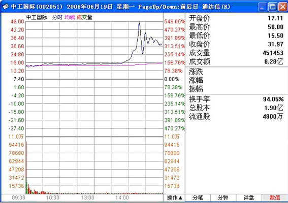

缠中说禅：2006-11-22 12：25：08

非常欣赏楼主的新思维和大智慧，但有一点不明白，楼主为何说15元多买N中工就是理性?现在我不是想问N中工值不值这个价，我是想知道假如我在那个位置买了，后面的情况大家也知道了，我的问题是在这个长达几个月的过程中应该如何处理才是最佳的操作手法?

===

开盘就买中工当然是理性的，因为第一只，(注：IPO重新开闸后的第一只股票）而且开盘的位置也不太高。后面之所以出现如此走势，是中国特色的管理层所造成的，但开盘15元多买的，后面18、19元随便你出，由于情况发生了意外，当然就要选择退出，这还是上面的原则，买股票一定不能追高，这样一旦发生意外，退出也简单。

三 为管理层对N中工走势的回应热烈鼓掌！(2006-06-20 11：51：24)

如今盛行网络舆论暴力，最近那闹得沸沸扬扬的某事件只不过一个很普通的事例。昨天N中工走势引发网络暴民一阵喧嚣，本ID不愿意看到这种暴力哲学得逞，收市后马上写了“鄙视所有对N中工15元不敢买50元就吃醋的人！”，里面强烈呼吁必须以法律和现行规则来评价该走势，不能重回诸如327之类的老路。

本ID从来不爱对管理层说什么好话，从来觉得对管理层应如小孩般，多多斥责才会有进步。以前唯一一次大力为管理层鼓掌是去年公布股改大跌那最腥风血雨时，连续三个帖子对管理层下大决心解决问题的态度大力鼓掌，而今天，必须再次为管理层鼓掌，为的是其对N中工走势的回应：深交所称中工国际表现属于正常，不会进行调查。

首先，由交易所而不是证监会来回应这事，符合规则。对一个股票的一天走势这么小的事情，如果都要动用证监会，那就像小孩玩泥沙这么小的事情都要告法院一样无聊。其次，表现属于正常，这是一个规则可以检验的概念，只要符合买卖规则，资金上有没有出现过度集中的异常情况，任何走势都是应该被允许的。最后，从这事情可以看出，现在的管理层已经越来越成熟，而现在的很多所谓股民，还是相当不成熟，为一点芝麻小事就一惊一咋的，惹人笑话。

至于N中工其后怎么走，就更是市场化的事情，管理层当然就更不应该太多干预，这次N中工为其后的监管提供了一个最好的榜样，希望能继续发扬，这样中国资本市场才会少闹点笑话。

## 教你炒股票5：市场无须分析，只要看和干！(2006-06-21 20:52:02)

喜欢吹牛皮的，在市场里最常见，例如一种以分析市场、吹牛皮为生的职业，叫什么股评、专家的。此类人不过是市场上的寄生虫，真正的猎手只会观察、操作，用嘴是打不了豺狼的。

市场就是一个狩猎场，首先你要成为一个好猎手，而一个猎手，首先要习惯于无言。如果真有什么真理，那真理也是无言的。可言说的，都不过是人类思想的分泌物，臭气熏天。真不可言说了，就无不可言，言而无言，是乃真言。

一个好的猎手，可以没有嘴巴，但一定会有一双不为外物所动的眼睛，在这眼睛下，一切如幻化般透明。要不被外物所动，则首先要不被自我所迷惑，其实无所谓外物、自我，都不过幻化空花，如此，方可从容其中。

猎手只关心猎物，猎物不是分析而得的。猎物不是你所想到的，而是你看到的。相信你的眼睛，不要相信你的脑筋，更不要让你的脑筋动了你的眼睛。被脑筋所动的眼睛充满了成见，而所有的成见都不过对应着把你引向那最终陷阱的诱饵。猎手并不畏惧陷阱，猎手只是看着猎物不断地、以不同方式却共同结果地掉入各类陷阱，这里无所谓分析，只是看和干！

猎手的好坏不是基于其能说出多少道道来，而是其置于其地的直觉。好的猎手不看而看，心物相通，如果不明白这一点，最简单就是把你一个人扔到深山里，只要你能活着出来，就大概能知道一点了。如果觉得这有点残忍，那就到市场中来，这里有无数的虎豹豺狼，用你的眼睛去看，用你的心去感受，而不是用你的耳朵去听流言蜚语，用你的脑筋去抽筋！

中国人的中国企业，明年还有吗？(2006-09-11 18:10:41)

前段时间写过一些文章，前面都冠以“收购中国”，最近和搞企业的混了一混，发现这个问题已经有点超出可接受的范围了。以下几个事例都是本ID这段时间亲身经历的，由于涉及的公司都相当出名，基于商业秘密，必须连行业都隐去。

1、亚洲某国资本市场某人，第一次碰面是在长安街北侧某饭店内，探讨的话题是如何收购中国某行业的龙头企业，然后在两国资本市场上嫁接出一通道，还可以说的是，该企业在上交所有上市，目前股票价格在3、4元上下。

2、还是在北京，涉及资金N十亿美金，这资金分成两部分运用，其中一部分针对某目前被严重调控的行业在某特大城市的项目，另一部分在南方某出名沿海城市建造一个特别的东西。该资金背景来自某大国的某沙漠上的绿洲。

3、还是离不开北京，这项目首期涉及资金M十亿美金，针对行业被称为21世纪最朝阳行业之一。背景外资是该行业世界排第二的，第一那个已经基本完成相应的最初步骤，第二这个已经算是后来者了。他们的策略是针对两种类型中国企业，其中一类型已经初步接触的是最近在市场上最多新闻之一的，另外一个，可以很明确地告诉，是某特大型的国企，在香港和内地交易所控制着N家的上市公司。

上面这些都是本ID最近参与其中的部分事情，本ID的原则其实很简单，这些事情都是符合法律的，符合商业原则的，反正这种事情，本ID不去撮合，自然还有其他人去，大势如此，现在探讨的是，为什么会出现这种大势？这种大势难道就有必须性？难道这种事情一定要发生才符合中国的国家利益？

为了对比，不妨举一件同样亲身经历的相反事情：

某奖得主的得意弟子，在高科技某最热之一的产业中有着世界领先的技术基础，回来后，并没有得到足够的应有支持。由于该产业的研发费用惊人，而人才要求特高，该公司里随便抓一个人都是博士，但最近因为某种特殊原因陷入困局，原来支持他们的资金出了事。其实，本来这种关系到国家科技前途的东西，就应该国家大力支持的。

本ID看到他们很无奈的样子，真有出钱给他们的冲动。但本ID一直以来的原则都是除了股票、期货，一律不投资，以前曾两次违反了这个原则，都是因为碍于情面，结果都很无聊，所以只能祝他们好运了。但这种情况的出现，真的是必然的？当然，投资是不会投了，忙，本ID是决定帮了。这帮人有时候真是书呆子，为了他们，本ID还刚干了一件平时最讨厌干的事情：打麻将。硅谷是硅谷，不是全世界都是硅谷的。

其实，本ID根本就不愿意去和这帮搞企业的人混，一般有点笨的人才搞企业的，而搞企业的真搞好了，周围的狼就围过来了，何必呢？本ID还是坚持自己的原则，除了股票、期货一律不投资。因此，站在个人的角度，即使所有中国企业都非中国化了，其实也无所谓，反正鬼佬的钱咱是赢定了，以前鬼佬的钱咱也没少赢。但如果有一天，已经完全分不清楚中国的资本市场和美国的或欧洲的有什么区别了，看看那些所谓中国企业的大股东名字都不用中文写了，这是不是也有点太恶心了？中国人的中国企业，明年还有吗？

仇富，是因为像本ID这样的富人太少了！(2006-09-13 10:54:37)

这又是一个招所有人恨的题目，一个富人非富人都不乐意、两边不讨好的题目。但用财富把人分类，本来就忒无聊。财富，生不带来，死不带走，典型人类YY的产物。如果连这点都看不明白，真是白活了。当然，非富人会说这都是便宜话，如果连病都看不起、饭都吃不上，说这些有意义吗？人首先要活着，如果社会的贫富对立已使得部分人的生存都出问题，“打土豪分田地”就绝对不是一个不可能的事情。写这，当然不是为了去填平贫富的鸿沟，一个客观的东西是不可能靠主观去填平的，只是用这个题目来引出富人应该采取的态度问题。

很坦白，无论按哪国的标准，本ID都属于富人了，这没有什么可害羞的，从来没觉得富人就一定要有什么原罪，那种认为富人就一定满手鲜血的想法是很无聊的。除了小量的资产是北京、上海、广州、深圳等地自住的房子，本ID所有资产都配置在股票和期货上，本ID所有的财产都是从股票和期货上得到的，交易是要自动交税的，想偷税都没机会，如果说这种资产都有原罪，那原罪大概是一个褒义词。本ID认识很多别人千方百计想认识的人，但本ID从来没有想过去利用他们的权力，因为本ID根本不需要：本ID又不搞房地产、又不搞实业、又不想当官员，股票和期货，特别在外盘上，靠的是智力和经验，权力是没用的。

本ID在资本主义制度下可以如鱼得水，但本ID会写“捍卫马克思”的帖子，因为社会制度的变迁不是一个喜好问题，而是一个客观的历史现象，资本主义必然灭亡就像熊市的尽头是牛市一样自然。本ID并不觉得捍卫“资本主义必然灭亡”与大赚资本主义的钱之间有什么矛盾，大家都去大赚资本主义的钱了，资本主义的灭亡才会早日到来！要灭亡资本主义，就要大力发展资本主义，让资本主义精尽人亡，资本主义自然就灭亡了！你连资本主义的游戏都玩不好，天天叫嚣资本主义灭亡只能显示你的无能和YY！

富人里面，最下贱的就是把钱画在脸上，天天围着钱转，成了钱奴才的一群。现在的富人，这种人太多了。包二奶、玩二爷，飞扬跋扈，还养一群如主流经济学家般的狗腿子狂吠“富人的天下到了”，正因为这种人的泛滥，才有打土豪分田地的轮回。这世界上，大概没有比在封建劣根上的资本积累更能制造恶心事的了。“打土豪分田地”是一个客观的可能，因为这群最下贱的富人的主观能动性，在历史上已经足够多次地把这可能发挥成现实了。

还有一种富人，就是所谓有钱才有闲的一群，这群人玩的是文化之类的所谓高雅的东西，要包二奶、玩二爷也是往梨园里玩。现在能玩的东西更多了，古玩、服装、电影、流行音乐等等，制造一个个流行热点，制造各种资本主义的麻醉剂，让穷人为了诸如所谓的“美国梦”之类的YY而有了盼头。资本主义社会的稳定，这帮人居功至伟。如果说上一种人是制造仇富情绪的一群，这种人就是制造财富幻想的一群，但有一个事实是永远掩盖不了的：买鸦片是需要钱的！资本主义的鸦片也不例外，站在这个意义上，后者比前者更可恶！

在资本主义社会，钱不过给了你一种自由的可能，至少你不需要像马克思一样为吃饭而犯愁。而即使站在社会、政治之外，单纯探求个体生命的意义，生命也和贫富无关。人，首先是人，也只是人，而不是什么穷人、富人。如果真要说什么人性的废话，一个使得“首先是人，也只是人”分化出穷人、富人的社会一定不是什么符合人性的社会，因为即使有所谓的人性，人性也是没有贫富的。资本主义社会是非人的，一切阶级社会都是非人的，一个富人，如果不能超越财富，不能超越贫富，只不过是被财富绑着的奴才。站在这个意义上，任何基于贫富的慈善都不过是为了维护贫富制度的伪善，因为真正的慈善，就是消灭所有制造穷人和富人的制度！

资本主义社会的最高生存原则！(2006-09-14 11:37:47)

没有生存，一切瞎掰！要在资本主义社会生存，像陶渊明那样是没用的（设计拼音输入的一定是个文盲，竟然陶渊明不是一个词组？！）。陶渊明不为那几斗米折腰，回老家还经常能找个人弄点酒喝，还有地去种种豆子、采采菊花。现在有可能吗？只有脑子锈着的才会觉得有可能！

在封建社会，有闲是可以没钱的，那时候说“莫非王土”，其实随便找个山头，当绿林大盗也行，当采薇之人也行；而现在，就是真真正正的“莫非王土”了，这个王就是资本，就是MONEY，就是钱。这个王比封建时代的皇帝可要厉害多了，每一寸土地都在它的统治下。

在资本主义时代，你的每一秒都生活在钱眼里，上网不会免费，连你睡觉的床也等价于一叠厚薄不一的钱。想采菊、采薇？那是私有财产，没钱、没门！陶渊明来到这个时代，活不了7天。一个破人，叫唤几句破诗，凭什么给饭你吃，给酒你喝？

资本主义社会的最高生存原则：必须有钱！钱是衡量资本主义社会中人的生存能力的唯一标准，是一切前提的前提。你可以找出一万条道德、哲学、宗教的理由来反对这个，但很不幸，本ID要告诉你，你这些道德、哲学、宗教的理由的获得，也是以钱为前提的，没有钱，你连生下来都没可能，生一个孩子要多少钱，这种事情本ID不大清楚，但肯定不是零，这就够了！

在资本主义社会，谈论陶渊明是需要经济基础的，资本主义社会就是要把一切彻底简单化，货币化，全球化，正是这种最残酷、最机械性的简化，才构成了资本主义发展的最终动力，同时也是资本主义最终自杀的最好武器。还是那句话，要让资本主义精尽人亡，唯一途径就是让它高潮不断！

四川，别给中国丢人！(2006-10-18 16:16:23)

本ID曾以“收购中国”为题写过几篇文章，力陈中国将面临被收购的现实风险。几年前，本ID著名网文“货币战争与人民币战略”中，对这种局面已有所告戒。后来在人民币放开那天，本ID写到“中国终于世界了，但世界还能中国吗？”，不到两年，对目前的中国企业，要面临的却已是“世界依然世界，中国还能中国？”

对中国企业的非中国化，早已麻木。在另一帖子中也说过，反正鬼佬的钱也是钱，以后就吸鬼佬血了，看谁比谁狠。但这几天，对有关四川某著名白酒企业将被世界第一大酒业集团收购的事，还是有点不能接受。白酒，中国的国粹，英国佬为了他们的“英国病”可以把威士忌搞得更GAY，但凭什么让白酒威士忌？谁有这个权力？

四川，别给中国丢人！李白曾喝过的酒、杜甫曾喝过的酒，东坡曾喝过的酒。没有酒，哪有中国的文化？没有酒，你让李白如何去“对影成三人”？让杜甫如何去“白日放歌”？又让东坡如何去“问青天”？就算全中国的酒都给卖了，四川的酒又如何能忍心卖？某酒，凭洋人的一个奖就成了国酒，但它有李白、杜甫、东坡吗？它有什么资格当国酒？要卖就把它卖了，但不要卖四川的酒，因为那是李白、杜甫、东坡！

就让威士忌更GAY，让波尔多更SEX，但四川的酒一定要中国，一定要李白、一定要杜甫、一定要东坡！在没有李白、杜甫、东坡的年代，这大概是一个中国人最基本、最底线的要求了。人，可以没道德，但一定要有底线。四川，别给中国丢人！

## 教你炒股票6：本ID如何在权证上提款的！(2006-10-24 12:45:16)

最近忙着和孔二爷闹，满博客都是孔二爷，前两天耍了一下鲁超女活跃一下气氛，今天想继续说说这“教你炒股票”系列。总不能整天都是孔二爷，也要照顾一下孔方兄，都是姓孔的，一碗水要端平。

股票上永远不缺英雄，更永远不缺死去的英雄，最近的英雄们都又在吹投资，但投资这内裤永远掩盖不了股票扒光后赤裸裸的投机。阴符云：“ 天性，人也；人心，机也；立天之道以定人也。天发杀机，斗转星移；地发杀机，龙蛇起陆；人发杀机，天地反覆；天人合发，万化定基。”不投这个机，又如何夺天地之造化？股票市场也是一样的。

对于本ID来说，这股票市场就如同提款机，时机到了，就去提款，时机不到，就让他搁在那。市场就如同男人，整天管他就会犯贱，就会咬你。所以男人不能经常搞，这市场也一样，必须耐心等待他的骚动，他不骚动，是不能搞的。本ID曾写帖子“G股是G点，大牛不用套！”，连G点都不明白，是没资格谈论股票的。

如同要找到男人的G点，就要对这男人充分了解，要找到这市场的G点，其道理是一样的。但就像光知道男人有G点还是不能乱搞，首先要了解他是干净的，是安全的，否则高潮还没有就翘了，那不麻烦大了？这市场也是一样的，不是什么机会、G点都要搞的，首先的前提要安全，要像去银行提款一样安全。就像又有G点又干净的男人才值得搞，市场上也只有这样又安全又能G点的机会，才值得投机。

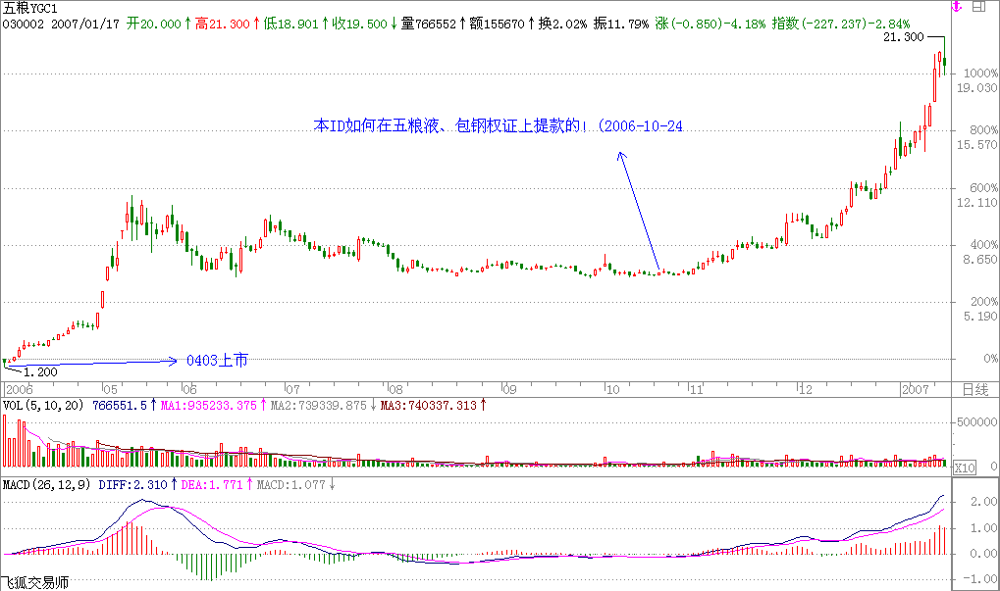

就像四月份时本ID在五粮液、包钢认购权证上的布局。为什么选择他们而不是其他，道理很简单，因为他们既有认购又有认沽，而对于企业来说，除非行情特别不好，否则是不会让认沽兑现的，因为不兑现，这就是一个空头支票，而兑现是要掏真金白银的。因此，对既有认购又有认沽的认购权证来说，认沽和认购的行权价之间的差价，就是认购权证最安全的底线。对于五粮液、包钢认购权证，这个底线就分别是1.02和0.43元。而本ID当时分别在1元多和4毛多吃他们，是不是和去银行提款一样安全？唯一遗憾的是，他们的盘子都太小，属于小男人的类型，容纳不了太大的资金。小男人，没什么劲；小盘的股票，也一样。

投机不是瞎搞，是要清清楚楚地搞。要清清楚楚，就要对市场充分地理解，要明白其道道。本ID曾发明了一个口号在私下流传，就是“像搞男人一样搞股票，像做爱一样做股票。”不明白这，没资格谈论股票。关于这个话题，今天就到这，有时间、有心情，继续。

说明：

认购权证是股票衍生性金融商品，发行人发行一定数量、特定条件的有价证券，投资者付出权利金持有该权证后，有权在某一特定期间（美式权证）或特定时点（欧式权证），按一定的履约价格，向发行人买进一定数量之标的股票.

认沽权证即认售权证，就是看跌期权，具体地说，就是在行权的日子，持有认沽权证的投资者可以按照约定的价格卖出相应的股票给上市公司。

认购权证持有人有权按约定价格在特定期限内或到期日向发行人买入标的证券，认沽权证持有人则有权卖出标的证券。

认购权证的价值随相关资产价格上升而上升，认沽权证则随相关资产价格下降而上升。

缠中说禅：2006-10-24 12：51：13

这个算一个调剂，不能都是说《论语》的，不能太“同”了。

缠中说禅：2006-10-24 19：36：57

问一个“调剂”的问题，咱也调剂调剂：

男G点在哪儿里？

=====

你没手？实践是检验真理的唯一标准。自己检验去！

缠中说禅：2006-10-24 21：14：19

佩服。好文章。我都不好意思写字咧。阴符没你读的好。惭愧啊。

=====

过谦了。

## 教你炒股票7：给赚了指数亏了钱的一些忠告(2006-11-16 12：00：01)

今天不宠幸孔二爷了，宠幸一下股票。早就说过，中国没有人有资格和本ID谈论股票。国庆前，香港有几个大的基金经理过来，吃饭时让本ID给修理了一通，屁颠屁颠回去了。本ID和他们说了大的国际经济趋势以及大中国区的金融前景还有内地的政治经济形势，坚定他们的信心，他们主要是对内地的情况不了解，所以有所狐疑。最近这伙人干得不错，在市场里，干就往死里干，不干白不干。把锅炒热了才有好菜吃，这道理不很简单？

但这几个月还是有点烦，就是整天给一大叔骚扰。他钱不多，也就千万级别的资金规模，这种人本ID从不搭理，但这大叔有点特殊，有些渊源，人家年纪又这么大，40好几了，怎么都给点面子。但有时候，真想踹他两脚。4月份，本ID布局权证时，他就不敢买，后来权证疯了，他就后悔。然后告诉他，年纪大了就不要玩太高风险的，买银行股吧，民生，4块钱附近买了就搁着，结果赚了几毛钱就跑，真没出息。最可气的是，国航跌破发行价时告诉他去买，他自己也当过兵，特别提醒他国航的李总当兵出身的，怎么可能让自己的股票跌破发行价这么没面子？这大叔犹犹豫豫，N天时间也就买了点，长起来几毛钱又走了。最近，让他在3元多吸纳北辰实业，4块不到就跑了，本ID简直对他彻底绝望。不过他还算好，有部分钱在年初3、4块买了一只自己十分熟悉的北京股票，现在已经10块了，但这大叔最麻烦的是，上下一波动就紧张，就打电话来骚扰本ID，本ID教他怎么在箱型盘整时弄短差，这大叔，涨的时候不敢卖，跌的时候不敢买，本ID真服了他。

之所以说这，因为这种情况在散户中太常见。散户就如浮萍，没根，没主意，这样不给屠杀才怪了。大概最近比这大叔更惨的，赚了指数亏了钱的也不在少数，本ID也废话一下，让有缘者得之。去年破1000点前，本ID曾写“G股是G点”，今天5月刚突破后，本ID又写“大牛不用套！”，但为什么有人竟然可以不挣钱？最主要是对牛市没信心，对牛市的节奏没把握。5月份前有色等的上涨，不过是牛市的预热阶段，而目前以金融股等为代表的指数股上涨，是牛市的第一阶段。96年的时候，深发展长了N倍了，很多股票还没怎么动。牛市的第一阶段都是这样的，一线股先长，它们不到位，其他股票怎么长？全世界的牛市都基本这样子，没什么新鲜的。

错过了这个节奏怎么办？如果你跟盘技术还行的，就要在回档的时候跟进强势股票。散户就怕跌，但牛市里，跌就是爹，一跌就等于爹来了，又要发钱了。如果跟盘技术不行，有一种方式是最简单的，就是盯着所有放量突破上市首日最高价的新股以及放量突破年线然后缩量回调年线的老股，这都是以后的黑马。特别那些年线走平后向上出现拐点的股票，一定要看好了。至于还在年线下面的股票，先别看了，等他们上年线再说。其实，这就是在牛市中最简单可靠的找所谓牛股的方法。

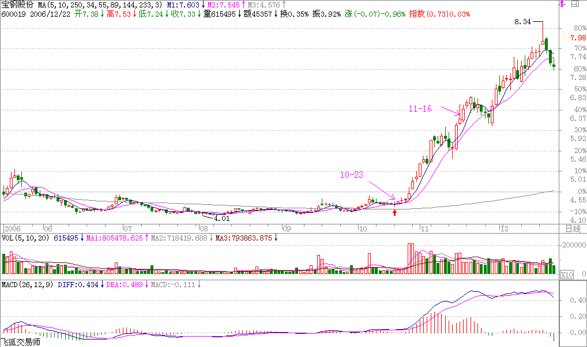

举一个例子，去看看宝钢，突破年线后缩量回调，10月23日回调4.20元，当时年线就在4.17元，然后再放量启动，今天，11月16日，已经6元多了，50%就这么完成了。从年线上启动，先长个50%，不像玩一样？本ID一般只看大盘股票，小盘股没法进去，但散户可以看小盘股，原则是一样的，不过小盘股可要留意，一般大盘股启动的骗线比较少，小盘股可不一定，这都要自己好好去揣摩。散户就当好散户，别整天想着抄底、逃顶，底都让你抄了，顶都让你逃了，不是散户的人吃什么去呀？散户，一定要等趋势明确才介入或退出，这样会少走很多弯路。

一只股票长起来千万别随意抛了，中线如果连三十天线都没跌破，证明走势很强，就要拿着。当然，如果你水平高一点，在上涨的时候，根据短线指标可以打短差，这样可以增加资金的利用率，但高位抛掉的，只要中线图形没走坏，回挡时一定要买回来，特别那些没出现加速的股票。有一个抛股票的原则，分两种情况，一种是缓慢推升的，一旦出现加速上涨，就要时刻注意出货的机会；另一种是第一波就火暴上涨，调整后第二波的上涨一旦出现背弛或放巨量的，一定要小心，找机会走人。具体的操作是一个火候的问题，必须自己用心去体会，就像煲汤，火候的问题是没法教的，只能自己在实践中体会。还有，对抛弃的股票一定不能有感情，股票就像男人，玩过就扔，千万别有感情。

还有一点必须提醒，在牛市中，一定要严重关注成分股，特别有一定资金规模的，成分股都是大部队在战斗，别整天跟那些散兵游勇玩，那些人自己都自身难保，本ID看这种所谓游资被消灭的都看到麻木了，大资金就爱吃他们，几个亿几个亿吃他们，这才有点意思，否则吃小散户的几万几千，累不累呀？牛市中，最终所有股票都会有表现的机会，只是掌握了节奏，资金的利用率就高，一个牛市下来，挣的钱如果不超出指数最终涨幅的几倍，指数长一倍，不挣个4、5倍，那就算废物点心了。要达到这种水平，其实很简单，就一个原则：避开大的回挡，借回挡踏准轮动节奏。千万别相信什么基本面的忽悠，特别对于散户来说，最多也就一亿几千万的钱，有必要研究什么基本面吗？所谓基本面，只是一个由头，给自己壮胆和忽悠别人用的。对基本面，只要知道别人心目中的基本面以及相应的影响就可以了，自己千万别信。

本ID还是那句话，玩资本主义的游戏就要用资本主义的原则，既然玩股票了，就要心狠手辣，市场从来不同情失败者，市场不需要焚尸炉，失败者的尸体在市场中连影子、味道都不会留下。别给自己的失败找任何理由，失败只能是你自己的失败，失败就找机会扳回来，但前提是必须找到失败的真正原因，否则不过是延续不同的情节、相同的悲剧。希望来本博客的人，除了学《论语》、听音乐、看文章，还都能学会挣钱。这个世界上最无耻下流的就是不会挣钱的人，你说钱是孙子，而你连孙子都搞不掂，那你最多就是龟孙子，有什么资格说话？有钱不是大爷，没钱更不是大爷。在市场挣钱就如同打仗，九死一生，而最终能活着的，就是牛人，牛人就要牛，这又有什么可说的？

2006-11-20回复：

作者：缠中说禅　回复日期：2006-11-20　15：49：54

楼主认为大盘能涨到多少点？

==

预测是股评干的事情，本ID只对赚钱感兴趣。而且大盘跌也可以挣钱，预测它干什么？

缠中说禅：2006-11-16 12：04：37

《论语》已经三十期，歇一天庆祝一下，明天继续。

缠中说禅：2006-11-16 12：07：13

本ID这里是杂货铺，什么都有，就怕你承担不起。

缠中说禅：2006-11-21 22：00：12

“高禅”，听了你的股道禅论，真的很佩服！但还是云里雾里的，我是一个刚起步的散户，我问一个简单的问题，K线图中哪条是年线？千万别大笑，我只认得5，10，20日线，请指教！另外我买的东方金钰（原G多佳600086）什么时候会涨啊？能否借喝水的功夫分析分析，谢谢，等回信！

==

本ID不是股评，说股票只是本博客的一个方面，纯粹是希望来这里的人能学点东西。本来你的问题是不应该回答的，因为本ID怕一旦开始回答问题，这里就成了咨询台了。但看你说的诚恳，本ID破例一次。年线一般指250日的均线，但在各种周期的图表上都可以用上。例如分钟图、小时图、周线图、月线图等都可以。

具体如何设置找附近的人问问。

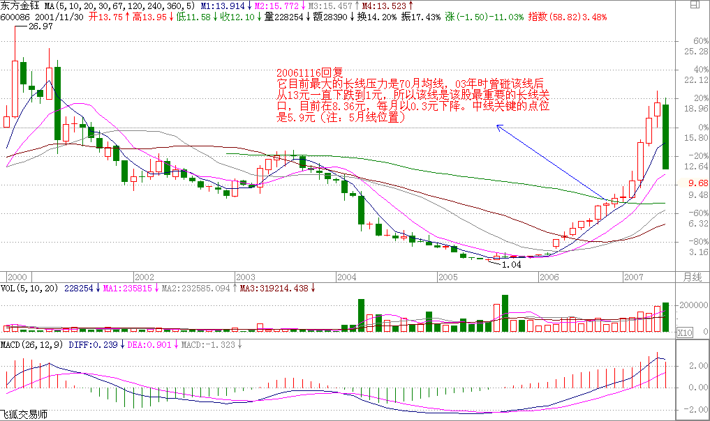

至于你说的600086，它已经长了很多了，连续拉了8个月的阳线从1块多长到7块多，出现调整是最正常不过了。关键是你买的位置，如果你是最近才买的，对面临的调整风险就要有所承受。本ID现在只能告诉你它现在的具体状况。它目前最大的长线压力是70月均线，03年时曾碰该线后从13元一直下跌到1元，所以该线是该股最重要的长线关口，目前在8.36元，每月以0.3元下降。中线关键的点位是5.9元，该位置不能有效跌破，否则调整的幅度会很大。目前可以看成是5.9元到7.2元的一个箱形调整，可以按照箱型进行短线操作，就是所谓的高抛低回补。中线等待突破方向的选择。

但还是请各位注意，不要轻易介入涨幅过大的股票。要从最开始就学会用尽量小的风险换取尽量大的利润。

缠中说禅：2006-11-21 22：07：06

但还是请各位注意，不要轻易介入涨幅过大的股票。要从最开始就学会用尽量小的风险换取尽量大的利润。

=

我还以为高人都是只做最后的疯涨那一段呢。没想到楼主这样的大侠也这么规避风险。

==

要长期胜利，就一定要坚持用最小风险换取最大利润，风险是第一的，这里没有什么高低之分。亏损是按百分比的，一百亿和一百万，亏了百分百，都是零。

人弃我不一定取，人抢我一定给。

读后感：

1、一位久经沙场老战士的经验之谈，胜读10本战术理论。

2、“在市场挣钱就如同打仗，九死一生，而最终能活着的，就是牛人，牛人就要牛，这又有什么可说的？”

3、“所谓基本面，只是一个由头，给自己壮胆和忽悠别人用的”。

4、“散户就怕跌，但牛市里，跌就是爹，一跌就等于爹来了，又要发钱了。”回挡是高抛过补仓时机。

## 教你炒股票8：投资如选面首，G点为中心，拒绝ED男！ (2006-11-20 12：00：31)

中国人喜欢说反话，面首，“面”，绝不是首位的。选面首，先看面，终要看“里子”。何谓“里子”？就是“G点为中心，拒绝ED男！”这也是本ID关于投资的警世之言。拿投资来忽悠的人，总爱编一些关于“面”的神话。诸如基本面、技术面、心理面、资金面，这面那面，都如同面首之“面”，不过是进而“里子”的借口。没有“G点为中心，拒绝ED男！”的“里子”，这面那面又有何意义？

投资的结果很简单，就“输、赢”两种。所有关于投资的理论把戏，都企图通过控制某种“输入”而把“输”这结果给去了。因此一切相关的理论前提就必然建立在这样一个逻辑假设之上：输入与输出间被某种必然的逻辑关系和因果链条所连接。而该逻辑假设，相当于说“面首的面和其里子有着必然的逻辑关系。”如果这都能成立，那么帅男就一定G点澎湃、满面胡子的糙爷就一定非ED男，出去扒几个面首看看就知道这类假设是何等荒谬。然而，现实中，企图跳过“面”而直捣“里子”，同样是一种荒谬的幻想。即使“面”和“里子”没有任何必然的联系，但现实依然只能从“面”到“里子”。那种企图否定一切“面”的，企图直接就“里子”就G点的，不过是把某种“面”当“里子”了。这种人，终生被骗而不知，就像把“叫床分贝”当高潮指标一样可笑。

投资领域，没有任何理论可以描述这种从“面”的输入到“里子”输出的必然关系，因为这种关系根本不存在。但人只要介入这种投资游戏，其介入就必然要以某种方式进行，相应地，其后必然有着某种理论、信念的基础。而正因为绝对正确的不存在，因此反而使得各种理论、信念基础之间有了比较的可能。任何好的投资理论，最终都只面向“里子”，就如同一个好面首，必须最终以其G点的澎湃度来证明其优秀。相应的，投资市场最重要的指标就是高潮度，一个长期没有高潮的市场，就如同没有G点的石男，是不值得任何关注的。期待一个石男变成一个优秀的面首，那是牧师的工作，而投资市场不需要牧师。一个市场能进入可投资的视界，首先要显示其G点的萌动，否则还是一边凉快去吧。

世界，永远不缺G点萌动的男人去面首，同样，在世界总的市场体系中，永远不缺高潮萌动的市场。但大多数的散户，就喜欢泡石男，以为石男没有攻击性就安全了，以为长期没有高潮的市场就一定安全。有多少人因此而独守空房、耗费青春，整天听着看着别人高潮不断，最终寂寞难耐，走向另一个极端，见高潮就扑上去，如飞蛾一样死掉。本ID曾言“像搞男人一样搞股票，像做爱一样做股票”。搞男人、做爱，最终都是要获得其高潮，最终采阳而补。投资也一样，通过市场的高潮是要赚取其利润，是采利而补。可惜，市场上的人，大多数都让人当阳给采了，可笑可怜。要采阳而不要被采，这就是和面首游戏的第一准则，而投资市场的道理也是一样的。

采阳，过熟不行，过生也不行，必须把握其火候。阳生，必有其萌动，必须待其萌动之后才可介入。具体对于股票来说，按其是否萌动的标准把所有股票动态地进行分类，一种是可以搞的，一种是不能搞的，将你参与的股票限制在能搞的范围内，不管任何情况，这是必须遵守的原则。当然，搞的分类原则，各人可以有所不同。例如，250天线以及周线上的成交量压力线的突破；资金量不大且短线技术还可以的，可以把250天线改成70天线、35天线，甚至改为30分钟图里的相应均线；对新股，可以用上市第一日的最高价作为标准；还有，就是接近安全线的股票，例如在第六期里，本ID给出的一个带认沽权怔的认购权怔介入的安全线标准；而对于有一定水平的人，识别各种空头陷阱，利用空头陷阱介入是一个很好的方法，这种方法比较专业点，以后专门说。

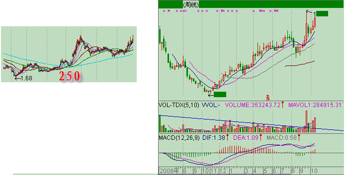

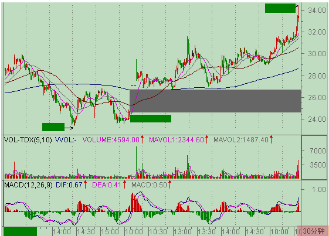

男人只有两种，能搞的和不能搞的；市场也只有两种，能搞的和不能搞的。必须坚持的是，不能搞的就无论发生什么情况都不能搞，除非能达到某种能搞的标准而自动成为能搞的对象，就像用ED把男人进行分类一样，ED男只有非ED后才有进入被搞侯选集合的可能。一旦被搞的分类原则确定，就一定要严格遵守“只搞能搞的”原则。可惜，这样一个简单的原则，绝大多数的人即使知道也不能遵守。人的贪婪使得人有一种企图占有所有机会的冲动，就如同看到街上的所有男人都企图上去扒光他们一样，这种人叫“花痴”，“花痴”在投资市场的命运一定是悲惨的。

在投资市场，定好“能搞”的“G点萌动”标准，相应选出来的，至少不是ED男了。而接下来，就要防止其“早泄”。这里找到有关“早泄”的医学定义：男子性功能障碍中仅次于阳痿的最常见的症状，是射精障碍中最常见的疾病，发病率占成人男性的35%一50%。投资市场里，这“早泄”的比例和市场总体强度有关，在熊市中这比例至少是80%以上，而牛市中这个比例就小多了，大概就30%。无论是选一个好面首还是一个好股票，把“早泄”的一类给筛出去可是最重要也是最困难的一步，很多所谓的高手，就死在这一步上。关于这问题，将在下一讲中详细论述。

### 2006-11-20解盘：

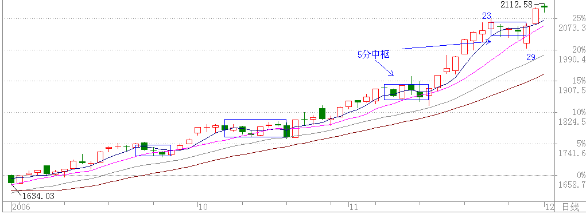

缠中说禅：2006-11-20 12：07：13

今早上2000点了，抛弃孔二爷一天也是应该的。孔二爷明天继续。

缠中说禅：2006-11-20 12：09：30

那些赚了指数亏了钱的，少安毋躁，前面说过了，这只是牛市的第一阶段，以后机会多了去了，还是先把技术学好，否则死都不知道怎么死的就不好了。

缠中说禅：2006-11-20 12：44：11

不要用你的想象代替现实。股市里的牛人每年都有，死去的牛人更多，市场的第一原则就是生存，只要你30年后还能活下来，自然就是最大的牛人。

本ID2001年到2005年，4年，从来不看股票。但从2005年6月以后天天看，等哪天本ID不看了，你们可要小心了。

2006-11-20回复：

楼主认为大盘能涨到多少点？

==

预测是股评干的事情，本ID只对赚钱感兴趣。而且大盘跌也可以挣钱，预测它干什么？

缠中说禅：2006-11-20 15：45：29

10000点！！！！！！！！冲

====

那是迟早的事情

缠中说禅：2006-11-20 16：00：45

这不像《论语》详解，说好要出书的，所以谢绝转载。但各位如果转载，也请注明出处，好勾引更多的人来这里。本ID从不虚伪，本ID当然不介意来这里的人比去孔男人那里还多。

缠中说禅：2006-11-20 20：18：20

请教楼主：“只要你30年后还能活下来，自然就是最大的牛人。”，假如一个人生存了30年，但前25年都是残败，就是后5年风光，这也叫牛人吗？不好意思我这问题有点钻牛角尖。

=

牛人，一般是指站在潮流之巅的。在投资市场里，整体的失败是一次都不能发生的，只要发生一次，基本就翻不了身了。个别的失败是允许的，但不能影响大局。

最早时几千万就可以当庄家了，现在几千万连大散户都算不上，在投资市场中，一次的跌倒，终生都追不回来，基本只能在后面跟着玩了。而在后面跟着玩，怎么都算不了牛人。

读后感：

1、把股票与性比较只是个比喻。股票市场是人参与的，其特征必有人性的特点。

2、选股很重要，选股的原则更重要。

3、花心大罗卜，就是所谓的“花痴”在“投资市场的命运一定是悲惨的”。

4、“市场也只有两种，能搞的和不能搞的。必须坚持的是，不能搞的就无论发生什么情况都不能搞，除非能达到某种能搞的标准而自动成为能搞的对象，就像用ED把男人进行分类一样，ED男只有非ED后才有进入被搞侯选集合的可能。”如何识别？这就需要一双火眼金睛。

5、采阳，过熟不行，过生也不行，必须把握其火候。阳生，必有其萌动，必须待其萌动之后才可介入。

## 教你炒股票9：甄别“早泄”男的数学原则！(2006-11-22 12：00：00)

设计一个程序，将所有投资对象进行分类，只搞那些能搞的，这是投资的第一原则。在分类中，所应用的程序可以各色各样，但有一点是肯定的，即没有任何一个程序可以使得所选能搞的最终都百分百能被搞得高潮迭起，就像没有任何一个挑选面首的程序使得所选能搞的最终都能百分百被搞得高潮迭起。因为任何操作程序都必然面对“早泄”问题，就像任何关于面首的选择都必然面临“早泄”男的甄别问题。

而甄别“早泄”之所以困难重重，使得无数所谓高手死无葬身之地，是因为“早泄”这事还真得真刀真枪地实干才能发现，这比ED的甄别可复杂多了、风险大多了。ED，不需要深入介入就可趁早发现，但“早泄”不可以，怎么都要试上一试，而这玩意是一锤子的买卖，这次行还不能保证下次就一定行，因此要有效甄别、及早发现而减少损失就成了一个头号难题。许多所谓高手会宣称，出现什么情况，这股票就会长。但实际上，任何一种情况，都有着极高百分比的可能会出现“早泄”，确定能搞的突然就变成不能搞了，使得介入变成了套牢。这种情况，在投资里简直太常见了。

那么，如何甄别“早泄”男？首要的就是严格的资金管理，一旦出现“早泄”现象，必须马上退出，即使下面突然又不“早泄”了，又强力高潮了，也必须这样干。而且“早泄”特敏感，一个偶尔的因素就可能导致，而要重新再来，还要等待一个长的不应期，一个长的调整过后，即使会高潮不断，也浪费了时间，有这时间，可搞的东西多了去了，这世界又不只有一个面首、一只股票。当然，这里说的只是基本原则，如果有一套严格的分批介入和退出程序，这一切都变得简单。资金管理问题，涉及面很广，以后会专门分析介绍，这里说的是另一个方面，就是如何能在投资领域尽量避免碰到“早泄”男。

“早泄”出现的根本原因在于介入程序出现破缺，出现程序所不能概括的异常情况，这对于所有程序都是必然存在的。而一个程序出现异常，也就是出现“早泄”的概率有多大，这是可以通过长期的数据测试来确定的。最简单的就是抛硬币，正面买、背面不买，这样也算一个介入程序，但这样一个程序的“早泄”率，至少是50% 以上。现在的问题其实很简单，就是如何发现一个“早泄”率特别低的介入程序。但答案很不幸，任何一个孤立的程序都不会有太低的“早泄”率，如果一个程序的“早泄”率低于10%，那就是超一流的程序了，按照这个程序，你投资10次，最多失误1次，这样的程序是很厉害的，基本没有。

但问题不像表面所见那么糟，在数学中，有一个乘法原则可以完全解决这个问题。假设三个互相独立的程序的“早泄”率分别为30%、40%、30%，这都是很普通的并不出色的程序。那么由这三个程序组成的程序组，其“早泄”率就是30%*40%*30%=3.6%，也就是说，按这个程序组，干100次，只会出现不到4次的“早泄”，这绝对是一个惊人的结果。即使对于选面首来说，有这样的高效率，大概连武则天大姐都要满意了。

现在，问题的关键变成，如何去寻找这三个互相独立的程序。首先，技术指标，都单纯涉及价量的输入而来，都不是独立的，只需要选择任意一个技术指标构成一个买卖程序就可以。对于水平高点的人来说，一个带均线和成交量的K线图，比任何技术指标都有意义。其次，任何一个股票都不是独立的，在整个股票市场中，处在一定的比价关系中，这个比价关系的变动，也可以构成一个买卖系统，这个买卖系统是和市场资金的流向相关的，一切与市场资金相关的系统，都不能与之独立；最后，可以选择基本面构成一个甄别“早泄”男程序，但这个基本面不是单纯指公司赢利之类的，像本ID在前几期所说，国航李总当兵出身不会让自己的股票长期跌破发行价这么没面子，还有认沽权证基本不会让兑现等等，这才是更重要的基本面，这需要对市场的参与者、对人性有更多的了解才可能精通。

当然，上面这三个独立的程序只是本ID随手而写，任何人都可以设计自己的独立交易程序组，但原则是一致的，就是三个程序组之间必须是互相独立的，像人气指标和资金面其实是一回事情，各种技术指标都是互相相关的等等，如果把三个非独立的程序弄在一起，一点意义都没有。就像有人告诉你，面首的鼻子大就不会“早泄”，另一个告诉你耳朵大不会“早泄”，第三个告诉你胡子多不会“早泄”，如果真按这三样来选人，估计连武则天大姐的奶妈的邻居的奶妈的邻居的奶妈的奶妈的奶妈，都会不满意的。

借地说说如何看本ID的文章，本ID不是股评，不会推荐什么股票，所以希望来本ID这里知道什么具体股票的，就不要浪费时间了。试想，真有本事的人，挣钱都忙不过来，怎么会当股评。本ID这里，股票只是其中一个小项目，只是希望来这里的人也学会怎么挣钱。所谓六艺，不会挣钱，在经济社会里还算人吗？看本ID的文章，要学会方法，当然，本ID有时候可能有意无意就会透露点东西，但你必须有分析能力，要吃透方法。

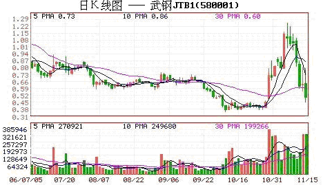

就像10月24日告诉你认购权证介入的一个原则，26日武钢认购权证就大幅启动，2周从3毛多长到1块多，翻了快4倍，如果你真能吃透本ID所说的方法，这种机会是可以把握的。

至于现实的股市，本ID在前面已经反复说了，只要是牛市，股票都要表现的，前几天大家可能都很烦银行股，因为大家都没有，但昨天开始大家就高兴了，因为银行股不动，其他股票开始动。别恨银行股，哪天它们真见顶了，市场也好不了，它们是红旗，各位只要看着红旗还在打，各根据地就可以继续轮动大干了。股票的运动是有规律的，好好学习，这一切都能在你的把握中。至于说本ID想炫耀自己，这种废话根本不值得反驳。本ID在投资市场曾干过事情牛的程度超过你们所有人的想象，本ID还用向你们炫耀？本ID现在只是把东西抖点出来，活跃一下博客的气氛，没有其他任何想法。

### 2006-11-22解盘：

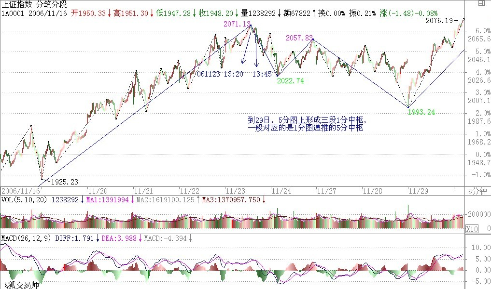

缠中说禅：2006-11-22 14：27：22

友情提醒，大盘短线最大的风险是1972到1977的缺口，短线在所有板快都轮动一次后，短线的震荡在所难免。应有一定的心理准备。

### 2006-11-23解盘

昨天本ID在盘中友情提醒要对震荡要有心理准备，大盘经过昨天下午随后的跳水与今早的震荡，越来越接近真正的调整。注意，本ID说的调整只是短线的，好的个股甚至会借调整启动。

大盘在进入调整前有极大可能先制造一个多头陷阱，大盘在1923-1925留下突破缺口，1972到1977留下中继缺口，如果是多头陷阱，一旦出现衰竭性缺口，就是警报拉响。

缠中说禅：2006-11-23 12：09：31

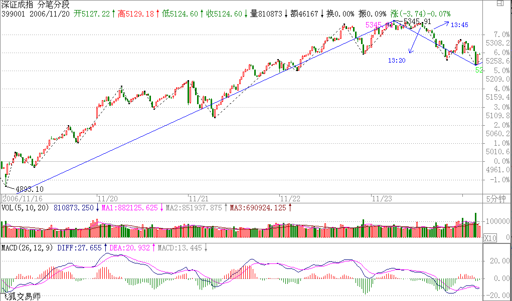

缠中说禅：2006-11-23 13：42：46

再次友情提醒，目前深成指数与沪指已出现背离，这是一个很不好的信号，如果2点以后还不改变，盘中震荡不可避免。而且指数进入调整的可能进一步加大。

缠中说禅：2006-11-23 15：11：58

大盘如上友情提示盘中出现大幅震荡，震荡中新板块借机启动，这就是典型的轮动，短线技术好的在其中可以玩得不亦乐乎。

但大盘今天终显疲态，两地指数出现背离，成交量也有所萎缩，预示真正的调整迫在眉睫。注意，盘中震荡和调整可不是一回事，即使最短线的调整也至少要去考验5天甚至10天线的。

还是像中午所说的，对调整无须恐惧，技术好的人最喜欢调整了，调整正是寻找下一次上涨好股票的时候，至少可以利用调整换股或打差价，前期没动的股票也会借调整启动的。

读后感：

1、“如何甄别“早泄”男？首要的就是严格的资金管理，一旦出现“早泄”现象，必须马上退出，即使下面突然又不“早泄”了，又强力高潮了，也必须这样干。”一只PP从能搞突然变成不能搞了，唯一的选择是退出。这是原则，是纪律。

2、不经过“干”是不能识别“早泄”男的。

3、交易系统是需要设计和创造的。

4、“早泄”出现的根本原因在于介入程序出现破缺，出现程序所不能概括的异常情况，这对于所有程序都是必然存在的。

## 教你炒股票10：2005年6月，本ID为何时隔四年后重看股票(2006-11-24 12:02:50)

2001年6月后，本ID就从未看过股票，直到2005年6月。本ID是严重反对人民币升值的，曾写有“货币战争和人民币战略”在网上广泛流传。但到2005年6月，本ID知道有些事情不是人力可为的，天要下雨、娘要嫁人，LET IT BE吧。所以2005年6月，本ID时隔四年后重看股票。

在强国论坛的人都知道，2005年6月最暴跌时，本ID连续三次罕有地表扬一个政府官员，就是股市当时的新人、如今那位著名的山东人。其后还专门写文章为他说股改“开弓没有回头箭”而热烈鼓掌。同时，本ID却曾写过这样的文章“群狼争肉----国有股流通与国有资产蚕食、瓜分游戏！”。这，难道是本ID逻辑混乱、前后矛盾吗？

非也，这就是昨天本ID所解释的〈论语〉里“子曰：众，恶之，必察焉；众，好之，必察焉”的完美应用。确实，从好恶角度，本ID严重反对人民币升值、反对国有股流通，而且深刻地分析了这些玩意后面的现实逻辑关系和严重后果。但在股市里，本ID从来没有好恶。只要有点金融常识的人都知道，本币的历史性升值所带来历史性牛市曾被太多国家所经历。本ID只知道，一旦人民币升值、国有股流通，股市将大涨。知识分子为什么可笑，就是有好恶而无“察”，企图以理论来理论现实，十足脑子水太多了。

书呆子是不适宜投资市场的，错了，应该是投机市场。别相信这世上有什么投资市场，世界本身都是投机的，还有什么资可投？就像有人号称所谓爱情，而所有的爱情，都不过是遮掩性游戏谎言的一条内裤而已。所有的性游戏都可以用这样的数学表达式表示：4N9。N代表从0到无穷的自然数，0等于没搞上，无穷等于天长地久也就是废话，1等于一夜情419，所有的性游戏包括爱情，都被这样一个数学表达式表示了。那么，任何一个投资者和股票的性关系，也完全可以以此表示。任何股票和你，都不过是一个4N9的关系，可以投机的就是这个N，如果你能在这个N里把一只股票当面首一样采尽他的精气，那你就是高手了。其后再换一个继续N2的游戏，如果该游戏可以新戏不断，而你又能采之而不被采，那你就是高手中的高手了。世界就那么简单，别把自己搞糊涂了。

股票，恶之，必察焉；股票，好之，必察焉。由孔子的话，不难明白以上的道理，而明白这道理，就明白投机市场第一原则“只搞能搞的”所依。智慧都是相通的，“只搞能搞的”，而不是“只搞喜欢的”。能搞是需要“察”而得之，不是靠喜好厌恶而来的。随便在市场里抓一个人，问他为什么买手里的股票，一万个人有9999个告诉你因为他的股票如何如何好，这种人能在市场上长久活下来就世界最大奇迹了。本ID从来不觉得自己手里的股票有什么好，只知道他们能搞。

但几乎所有的人，包括庄家、散户，都喜欢为自己股票的好找理由。别以为庄家就不这样，庄家里的傻人从来不比散户少，本ID见多了。这些人，拿了股票就到处找理由为其持有、上涨编故事，就算股票已经从10跌到1了，还乐此不疲。市场里所有亏损，都是因为持有了不能搞的股票而造成的。但无论任何股票，能搞总是相对的，不能搞却是绝对的，就像4N9里，如果你为了某面首把N设成无穷，那么劝你自杀吧，因为你活也白活了，你已经不是人，而是某面首的附属物。N只能有限地给予一个固定的能搞对象，有N1，就要有N2，这样才能生生不息，才能风生水起。

但在4N9任意一段N中，这面首、这股票就是你的全部，你要全身心地投入去“察”去“采”，投机市场，机会总是一闪而过，别到白天才问夜的黑，那什么菜都凉了。能搞是相对的，意味着随时能搞就会变成不能搞。一旦这“机”失去了，就会在不能搞的泥潭难以自拔。无论对面首或股票，都要全身心地往死里干然后抛弃，这是不能偏废的两方面，任何的失败者都一定是至少在其中一面失败了。

在4N9的任何一段N中，可以有世界上最浪漫的故事、最火热的缠绵，有无数的细节，从前戏到缠绵到进入到高潮到不应到抛弃，所有的故事只是唯一的故事，就像所有的AV都只有同一的情节。从下一期开始，我们将仔细分析同一AV情节的每一个细节，让每一细节深入你心，成为本能的反应，然后才能成为AV主角，在每一段4N9中高潮迭起，采阳不休。

### 2006-11-24解盘：

缠中说禅：2006-11-24 12:15:10

大盘如期调整，请自己密切关注逆市不跌的股票，下轮的黑马由此产生的可能性很大。

目前正在5日线的多空争夺中，多头胜则会出现最强走势，当天调整完成，否则调整时间将大幅度延长。但个股表现不会差，密切关注未启动的、逆势走强的股票。

缠中说禅：2006-11-24 12:17:20

本ID有空会在最新帖子里即时有关大盘走势的提示。是否准确，各位可以自行判断。

昨天的提示转录如下：

2006-11-23 13:42:46

再次友情提醒，目前深成指数与沪指已出现背离，这是一个很不好的信号，如果2点以后还不改变，盘中震荡不可避免。而且指数进入调整的可能进一步加大。

2006-11-23 15:11:58

大盘如上友情提示盘中出现大幅震荡，震荡中新板块借机启动，这就是典型的轮动，短线技术好的在其中可以玩得不亦乐乎。

但大盘今天终显疲态，两地指数出现背离，成交量也有所萎缩，预示真正的调整迫在眉睫。注意，盘中震荡和调整可不是一回事，即使最短线的调整也至少要去考验5天甚至10天线的。

还是像中午所说的，对调整无须恐惧，技术好的人最喜欢调整了，调整正是寻找下一次上涨好股票的时候，至少可以利用调整换股或打差价，前期没动的股票也会借调整启动的。

缠中说禅：2006-11-24 13:34:49

五日线压力不少，站稳前应多观察，密切注意不随大盘而动的股票。

缠中说禅：2006-11-24 13:50:35

重新突破5日线，14点的回试确定站稳，大盘将展开反攻。

缠中说禅2006-11-24 14:14:17

反攻力度有点弱。个股表现不错，房地产股票但上面所说的，一线然后二线接着三线，现在连天鸿这种三线亏损房地产股票也启动了，但这时候，房地产板块短线压力就开始增加了，中线暂时问题不大。

缠中说禅2006-11-24 15:00:18

如期反攻，力度有问题，下周反复难免。短线5日线是关键，不能跌破，跌破则重新考验2000点下缺口支持。

缠中说禅：2006-11-24 21:46:39

这是今天在盘中的一些即时提示，好好研究一下，以后指数期货用得着。

### 2006-11-27解盘

缠中说禅：2006-11-27 12:18:55

今天的反复折腾在上周已经明确指出。本结论继续有效。

缠中说禅：2006-11-27 12:19:44

还是那话，短线继续板块轮动，没动的都要动。调整是短线高手的天堂，当然，中线的也可以打点短差，技术一般的就看着吧，这“上上下下”的享受，也可以继续享受享受。

缠中说禅：2006-11-27 15:10:23

今天大盘的走势十分规范，最终就刚好收在本ID所强调的5日线上，其实，目前大盘并不太重要，关键是把握好个股轮动，本ID每次都反复强调这一点，强调不用怕调整，调整就是机会。

大盘结束调整后的这次上攻一旦完成，下一轮的调整将比较大，是全面性的，大多数个股都会跟着调，而不像这次，就大盘股调，这点是必须注意的，本ID事先告诉各位了。

### 2006-11-28解盘

缠中说禅：2006-11-28 12:15:13

今天走势很正常，关键还是这两天一直强调的5日线，目前最稳妥的走法就是让5日线和10日线来个接吻的前戏，然后再次高潮。但必须再次指出，这次高潮过后，相应的不应期要比这次长。

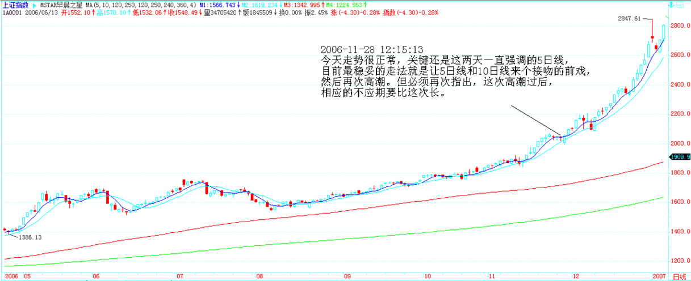

缠中说禅：2006-11-28 12:37:43

和各位说说银行股，不是让各位现在买，只是银行股是大盘风向。

目前最重要的是招商，他突破历史天价后回试。整个大盘和银行股的走势与之极为密切，一旦他能真正突破历史天价，所有银行股都会进一步扩展上升空间。所以他的走势对短、中线大盘的力度十分关键。

试想，一个站在25-30元的招行，为所有股票打开了多大的上升空间。更别说50元的了。

招行最终能否上50元，这点本ID不愿意预测。但本ID只知道，每次大行情，深发展都上50元。招行也是深圳的，他的行长姓马。

缠中说禅：2006-11-28 14:56:17

这大盘够有表演欲的，中午本ID说最稳妥的走法就是让5日线和10日线来个接吻的前戏，结果下午就来了一次表演，把那些装纯情的吓了一跳。

上面还说了，吻有三种：

如果是飞吻，就这一下就没了，明天直接攻上5日线，扬长而去；

如果是唇吻，那今天下午的表演还会有的。5日线是压力。

如果是湿吻，10日线一定要破的，那种火辣辣的镜头会不断出现，把所有纯情分子羞跑了，高潮才会出现。是什么吻，判断很简单，看住5日线就行了。

下午马上有应酬，晚上不一定能上来，尽量争取吧。

各位，看多点AV，不纯情了，股票自然能做好。纯情的人，连吻都怕看的，是股票不好的。

缠中说禅：2006-11-29 09:36:47

大盘受外围影响选择湿吻方式，短线急跌，选择好不跌的股票，有机会。技术不好的，就等最近反复强调的5日线站稳以后再说了。

读后感：

1、“只搞能搞的”，而不是“只搞喜欢的”。喜欢与能不能搞是两码事。

2、“但无论任何股票，能搞总是相对的，不能搞却是绝对的”

3、“能搞是相对的，意味着随时能搞就会变成不能搞”。机会会转瞬即失。

4、一旦能搞，对于“这面首、这股票就是你的全部，你要全身心地投入去“察”去“采”，投机市场，机会总是一闪而过。”“无论对面首或股票，都要全身心地往死里干然后抛弃，这是不能偏废的两方面，任何的失败者都一定是至少在其中一面失败了。”

5、时而是个花心大箩卜（寻找能搞的），时而是个情有独钟的有情人（能搞就一心一意的搞）。

6、4N9。N代表从0到无穷的自然数。0等于没搞上无穷等于天长地久也就是废话，1 等于一夜情419，所有的性游戏包括爱情，都被这样一个数学表达式表示了。那么，任何一个投资者和股票的性关系，也完全可以以此表示。任何股票和你，都不过是一个4N9 的关系，可以投机的就是这个N，如果你能在这个N里把一只股票当面首一样采尽他的精气，那你就是高手了。其后再换一个继续 N2 的游戏，如果该游戏可以新戏不断，而你又能采之而不被采，那你就是高手中的高手了。世界就那么简单，别把自己搞糊涂了。

股票，恶之，必察焉;股票，好之，必察焉。由孔子的话，不难明白以上的道理，而明白这道理，就明白投机市场第一原则“只搞能搞的”所依。智慧都是相通的，“只搞能搞的”，而不是“只搞喜欢的”。能搞是需要“察”而得之，不是靠喜好厌恶而来的。随便在市场里抓一个人，问他为什么买手里的

股票，一万个人有 9999 个告诉你因为他的股票如何如何好，这种人能在市场

上长久活下来就世界最大奇迹了。本 ID 从来不觉得自己手里的股票有什么好，

只知道他们能搞。

但几乎所有的人，包括庄家、散户，都喜欢为自己股票的好找理由。别以为庄家就不这样，庄家里的傻人从来不比散户少，本ID 见多了。这些人，拿了股票就到处找理由为其持有、上涨编故事，就算股票已经从10跌到1了，还乐此不疲。市场里所有亏损，都是因为持有了不能搞的股票而造成的。但无论任何股票，能搞总是相对的，不能搞却是绝对的，就像4N9 里，如果你为了某面首把N设成无穷，那么劝你自杀吧，因为你活也白活了，你已经不是人，而是某面首的附属物。N只能有限地给予一个固定的能搞对象，有N1，就要有 N2，这样才能生生不息，才能风生水起。

但在4N9 任意一段N中，这面首、这股票就是你的全部，你要全身心地投入去“察”去“采”，投机市场，机会总是一闪而过，别到白天才问夜的黑，那什么菜都凉了。能搞是相对的，意味着随时能搞就会变成不能搞。一日这“机”失去了，就会在不能搞的泥潭难以自拔。无论对面首或股票，都要全身心地往死里干然后抛弃，这是不能偏废的两方面，任何的失败者都一定是

至少在其中一面失败了。

在4N9的任何一段N中，可以有世界上最浪漫的故事、最火热的缠绵，有无数的细节，从前戏到缠绵到进入到高潮到不应到抛弃，所有的故事只是唯一的故事，就像所有的 AV都只有同一的情节。从下一期开始，我们将仔细分析同-AV情节的每一个细节，让每一细节深入你心，成为本能的反应，然后才能成为 AV 主角，在每一段 4N9 中高潮迭起，采阳不休。

PAGE

本文由公众号 “三思复盘”  整理

炒股，要顺着大盘走。

散户就怕跌，但牛市里，跌就是爹，一跌就等于爹来了，又要发钱了。如果跟盘技术不行，有一种方式是最简单的，就是盯着所有放量突破上市首日最高价的新股以及放量突破年线然后缩量回调年线的老股，这都是以后的黑马。

散户，一定要等趋势明确才介入或退出，这样会少走很多弯路。

一只股票长起来千万别随意抛了，中线如果连三十天线都没跌破，证明走势很强，就要拿着。当然，如果你水平高一点，在上涨的时候，根据短线指标可以打短差，这样可以增加资金的利用率，但高位抛掉的，只要中线图形没走坏，回挡时一定要买回来，特别那些没出现加速的股票。有一个抛股票的原则，分两种情况，一种是缓慢推升的，一旦出现加速上涨，就要时刻注意出货的机会；另一种是第一波就火暴上涨，调整后第二波的上涨一旦出现背弛或放巨量的，一定要小心，找机会走人。具体的操作是一个火候的问题，必须自己用心去体会，就像煲汤，火候的问题是没法教的，只能自己在实践中体会。还有，对抛弃的股票一定不能有感情，股票就像男人，玩过就扔，千万别有感情。

三个互相独立的程序。首先，技术指标，都单纯涉及价量的输入而来，都不是独立的，只需要选择任意一个技术指标构成一个买卖程序就可以。对于水平高点的人来说，一个带均线和成交量的K线图，比任何技术指标都有意义。其次，任何一个股票都不是独立的，在整个股票市场中，处在一定的比价关系中，这个比价关系的变动，也可以构成一个买卖系统，这个买卖系统是和市场资金的流向相关的，一切与市场资金相关的系统，都不能与之独立；最后，可以选择基本面构成一个甄别“早泄”男程序，但这个基本面不是单纯指公司赢利之类的，像本ID在前几期所说，国航李总当兵出身不会让自己的股票长期跌破发行价这么没面子，还有认沽权证基本不会让兑现等等，这才是更重要的基本面，这需要对市场的参与者、对人性有更多的了解才可能精通。
