## 教你炒股票11：不会吻，无以高潮！

(2006-11-29 12:00:00)

甄别“早泄”男，必须要选择三个独立的系统。其中一个最常用的，就是所谓的技术派玩意。单纯的技术派是不行的，单纯的非技术派也是不行的。技术派的玩意，必须也只能在三个独立系统里，才会有大的功效。

技术分析，最核心的思想就是分类，这是几乎所有玩技术的人都搞不清楚的一点。技术指标发出买入信号，对于技术派来说，就以为是上帝给了暗示一般，抱着如此识见，几乎所有技术派都很难有大的成功。技术指标不过是把市场所有可能的走势进行一个完全的分类，为什么技术派事后都是高手，真正干起来就个个阳痿，就是这个原因。

技术分析可说的东西太多了，这指标那指标，如何应用，关键就是上面所说的分类问题。任何技术指标，只是把市场进行完全分类后指出在这个技术指标的视角下，什么是能搞的，什么是不能搞的，如此而已。至于这个指标对应的情况是否百分百反映在实际的走势上，这个问题的答案肯定是否定的，否则所有的人都可以按照这指标操作，哪里还有亏钱的人？然而，只要站在纯粹分类的角度考察技术指标，那么，技术指标就会发挥他最大的威力。

最简单又最实用的技术指标系统就是所谓的均线系统。均线系统显然不是一个太精确的系统，太多的骗线。如果你按照突破某条均线就买入操作，反之卖出，那你的成功率绝对不会高，特别当这条均线是短期的。真正有用的是均线系统，也就是由若干条代表短、中、长期走势的均线构成的技术评价系统。注意，任何技术指标、系统，本质上都是一个评价系统，也就是告诉你在这个系统的标准下，评价对象的强弱。例如，一条5日均线，站在上面，代表着用5日均线对市场所有情况进行分类，目前站在5日均线上这种情况意味着是强势。然而，站在5日均线上的同时，可能对于10日均线是在其下，那对于10日均线的系统评价，这种情况就是弱势了，那究竟相应的走势是强还是弱？

其实，强弱都是相对的，关键是你操作所介入的标准。对于超超短线来说，在1分钟钱上显示强势就可以介入了，特别在有T+0的情况下，这种操作是很正常的。但对于大资金来说，就算日线上的5日强势也不足以让他们感兴趣。任何技术指标系统的应用，首要的选择标准都和应用的资金量和操作时间有关，脱离了这个，任何继续的讨论都没有意义。因此，每个人都应该按照自己的实际情况来考虑如何去选择相应的参数，只要明白了其中的道理，其应用完全在于一心了。

均线系统，必然有着各条均线间的关系问题，任何两条均线的关系，其实就是一个“吻”的问题。按“吻”的标准，可以把相应的关系进行一个完全分类：飞吻、唇吻、湿吻。把短期均线当成是女王，长期均线当成面首，那么“男上位”意味着空头市场，而“女上位”意味着多头市场，要赚钱，就要多来点“女上位”。

飞吻：短期均线略略走平后继续按原来趋势进行下去。

唇吻：短期均线靠近长期均线但不跌破或升破，然后按原来趋势继续下去。

湿吻：短期均线跌破或升破长期均线甚至出现反复缠绕，如胶似漆。

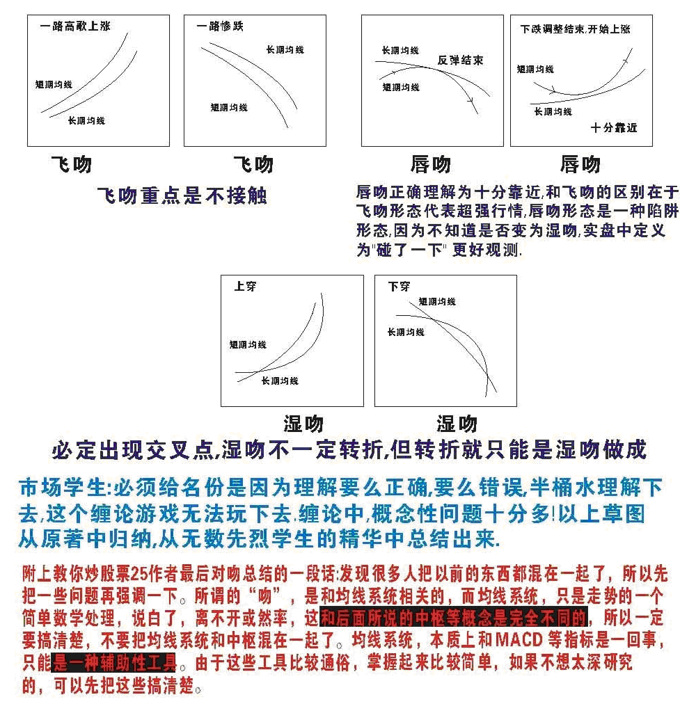

飞吻出现的几率比较少，一般都是在趋势特别强烈的时候，而太火暴的趋势是不可能太长久的，所以其后的震荡经常出现；唇吻，任何一段基本的趋势过程中最常见到的方式，特别在“男上位”的情况下，基本都是这种方式，一旦出现唇吻反弹基本就该结束了，在“女上位”的情况下，调整结束的概率也是很大的，但也要预防唇吻演变成湿吻；湿吻，一段趋势后出现的较大调整中，还有就是在趋势出现转折时，这种情况也很常见，特别是在“男上位”的情况下，如果出现短、中、长各类均线来一个NP的湿吻，这么情色的AV场景往往意味着行情要出现重大转折，要变天了，“男上位”要变成“女上位”了。

注意，任何的行情转折，在很大几率上都是由湿吻引发的，这里分两种情况：一种是先湿吻，然后按原趋势来一个大的高潮，制造一个陷阱，再转折；另一种，反复湿吻，构造一个转折性箱型，其后的高潮，就是体位的转化了。在“男上位”的情况下，一旦出现湿吻，就要密切注意了，特别是这个湿吻是在一个长期“男上位”后出现的，就要更加注意了，其后的下跌往往是介入的良机，因为空头陷阱的概率简直太大了。必须提醒，这一点对趋势形成的第一次湿吻不成立。但湿吻之后必有高潮，唯一的区别只是体位的区别，关键判断的是体位而不是高潮的有无。

会吻，才有高潮，连吻都不会，怎么高潮呢。

读后感：

1、这是缠师以常用的一个技术指标举的例子，与后面的形态学构建关系不大。

2、由于均线系统骗线的存在，因此中长期均线系统才有一定的参考意义。

3、所谓之“吻”与性相关，与股性相关，但精度较差，就像男女之热吻并不一定就代表忠贞的爱情一样。

4、分类是个重要概念。

2006-11-29－30解盘

缠中说禅：2006-11-29 12:03:27

下面的判断继续有效。

缠中说禅：2006-11-29 09:36:47

大盘受外围影响选择湿吻方式，短线急跌，选择好不跌的股票，有机会。技术不好的，就等最近反复强调的5日线站稳以后再说了。

缠中说禅：2006-11-29 15:14:38

今早刚开盘时就让技术好的选择不跌的股票，有机会；技术不好的就看5日线。一般来说，技术不好的，这类震荡就上上下下享受一下就完了。技术好的，这是打短差降低成本或者换股的好机会。

目前走势很简单，就是5日线能否站稳的问题，站稳就继续冲击一波，因此明天的震荡依然难免，强的就在5日线站整固，一般就围绕5日线折腾，弱的还要跳跳水、吓吓人。

但对于个股来说，大盘怎么走都不是问题，下一波是个股普遍有表现的一波，很多前期没大动的，都要好好表现一把，其实这次调整，很多股票都创新高，个股比大盘重要得多。

如果一定要看指数，就看深圳成分指数，这比上海的敏感有效。

至于上海指数，5日、10日线唇吻还是湿吻，其实都不大重要，但这次调整后再上一波后的那次调整，规模就会大多了，这已经反复说过。

从大盘健康的角度说，本ID给大盘的建议是：先深成指突破6103点的历史高位，然后上海跟上，突破以后再调整，这样更健康。不知道大盘有没有兴趣听本ID的意见了。

缠中说禅：2006-11-30 11:43:54

该结论继续有效

缠中说禅：2006-11-30 11:45:32

今天大盘有点接受了本ID的建议

==

为标题图片送一句诗:花径不曾缘客扫，蓬门今始为君开.

请教女禅师银行股会在12月11日前基本调整到位吗?

==

其实让他们调整时间更长会更健康，这一波就让别的股票表现，他们在这里进行上升三角型或旗型的整理，这样对大盘中线走势更有利。昨天说的，目前关键看招行，他率先突破历史天价，他的走势，就是大盘的风向标。总之 线股是下面最多表现的，然后是三线，把握还节奏。

缠中说禅：2006-11-30 13:03:57

开盘了，先下。突破的有效性在今天下午和明后两天需要确认。其后走势是否能如本ID建议那样，就继续看了。

缠中说禅：2006-11-30 15:13:57

今天大盘走势十分规范，下午两点如期一波跳水确认突破的有效性后，继续上扬，唯一不足的是启用了银行股冲关，这与深沪两市的资金争夺有关，这在每次的行情中都有体现。谁先突破历史新高，对两个市场的管理者的好处是很大的。

明天出现震荡很正常，只要5日线不破，本ID给市场的建议能够成为现实的可能性将继续增加。个股还是看好二线股，而三线股的蓄势补涨依然可期。

缠中说禅：2006-11-29 12:33:44

权证天天都可以介入，天天都有机会，关键是你是否有这样的技术。580002震荡区间不断缩小，湿吻不断，高潮快到了，先关注体位吧。

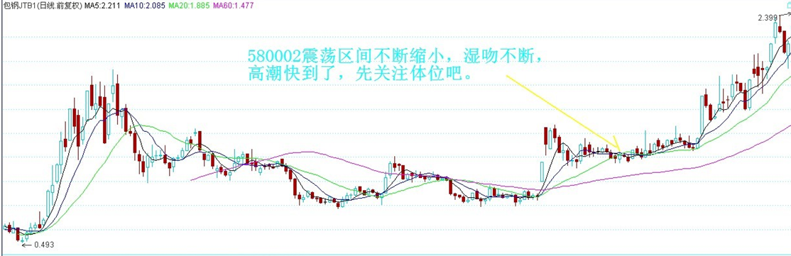

## 教你炒股票12：一吻何能消魂？

(2006-12-01 12:03:48)

就算是看AV，最终也是为了实战。上章说了那么多关于“吻”的知识，目的是为了干而不看，光看不干，那不成了阴九幽？AV看多了而不实践，绝对有损健康。但干，马上要遇到的就是风险问题。任何一个位置介入，都存在风险，而且除非行情走出来了，否则即使最简单的均线系统，也没人能事先百分百地确认究竟采取怎样的方式去“吻”。熟悉本ID所解《论语》的都知道，风险是“不患”的，是无位次的，任何妄求在投资中的绝对无风险，都是痴心妄想。唯一的办法，就是设置一个系统，使得无位次、“不患”的风险在该系统中成为有位次，“患”的系统，这是长期战胜市场的唯一方法。

必须根本自己的实际情况，例如资金、操作水平等等，设置一套分类评价系统，然后根据该系统，对所有可能的情况都设置一套相应的应对程序，这样，一切的风险都以一种可操作的方式被操作了。而操作者唯一要干的事情，就是一旦出现相应的情况，采取相应的操作。对于股票来说，实际的操作无非三种：买、卖、持有。当然，在实际中，还有一个量的问题，这和资金管理有关，暂且不考虑。那么，任何投资操作，都演化成这样一个简单的数学问题：N种完全分类的风险情况，对应三种（买、卖、持有）操作的选择。

例如，对于一个简单的，由5日均线与10日均线构成的买卖系统，首先，两者的体位构成一个完全分类，女上位是牛，男上位是熊，还有一种是互相缠绕的情况，这种情况最终都要演化成女上位或男上位，只有两种性质：中继或转折。相应，一个最简单的操作系统就此产生，就是在体位互相缠绕完成后介入，对于多头来说，这样一个系统无非面临两个结果，变为女上位成功，变为男上位失败。由于缠绕若是中继就延续原体位，若转折就改变体位，因此对多头来说，值得介入的只有两种情况：男上位转折，女上位中继，空头反之。

对于任种走势，首要判断的是体位：男上位还是女上位。这问题只要有眼睛的都能判断出来，对于5日、10日的均线系统来说，5日在上就是女上位，反之就是男上位，这在任何情况下都是明确的。如果是女上位的情况，一旦出现缠绕，唯一需要应付的就是这缠绕究竟是中继还是转折。可以肯定地说，没有任何方法可以百分百确定该问题，但还是有很多方法使得判断的准确率足够高。例如，女上位趋势出现的第一次缠绕是中继的可能性极大，如果是第三、四次出现，这个缠绕是转折的可能性就会加大；还有，出现第一次缠绕前，5日线的走势必须是十分有力的，不能是疲软的玩意，这样缠绕极大可能是中继，其后至少会有一次上升的过程出现；第三，缠绕出现前的成交量不能放得过大，一旦过大，骗线出现的几率就会大大增加，如果量突然放太大而又萎缩过快，一般即使没有骗线，缠绕的时间也会增加，而且成交量也会现在两次收缩的情况。

女上位选择第一次出现缠绕的中继情况，而男上位的就相反，要寻找最后一次缠绕的转折情况，其后如果出现急跌却背弛，那是最佳的买入时机。抄底不是不可以，但只能选择这种情况。然而，没有人百分百确认那是最后一次缠绕，一般，男上位后的第一次缠绕肯定不是，从第二次开始都有可能，如何判断，最有力的就是利用好背弛制造的空头陷阱。关于如何利用背弛，是一个专门的话题，以后会详细论述。

综合上述，利用均线构成的买卖系统，首先要利用男上位最后一次缠绕后背弛构成的空头陷阱抄底进入，这是第一个值得买入的位置，而第二个值得买入或加码的位置，就是女上位后第一次缠绕形成的低位。站在该系统下，这两个买点的风险是最小的，准确地说，收益和风险之比是最大的，也是唯一值得买入的两个点。但必须指出的，并不是说这两个买点一定没有风险，其风险在于：对于第一个买点，把中继判断为转折，把背弛判断错了；对于第二个买点，把转折判断成中继。这些都构成其风险，但这里的风险很大程度和操作的熟练度有关，对于高手来说，判断的准确率要高多了，而如何成为高手，关键一点还是要多干、看参与，形成一种直觉。但无论高手还是低手，买点的原则是不变的，唯一能高低的地方只是这个中继和转折以及背弛的判断。

明白了这一点，任何不在这两个买点买入的行为都是不可以原谅的，因为这是原则的错误，而不是高低的区别，如果你选择了这个买卖系统，就一定要按照这个原则了。买的方式明白了，卖就反过来就可以了，这是十分简单的。一吻而消魂，学会这消魂之吻，就能在动荡的市场中找到一个坚实的基础。当然，相应的均线的参数可以根本资金量等情况给予调节，资金量越大，参数也相应越大，这要自己去好好摸索了。这点，对于短线依然有效，只是把日线改为分钟线就可以了。而一旦买入，就一直持有等待第一个卖点，也就是女上位缠绕后出现背弛以及第二个卖点也就是变成男上位的第一个缠绕高点把东西卖了，这样就完成一个完整的操作。

注意，买的时候一般最好在第二个买点，而卖尽量在第一个卖点，这是买和卖不同的地方。补充一个例子让不习惯抽象的人能理解：

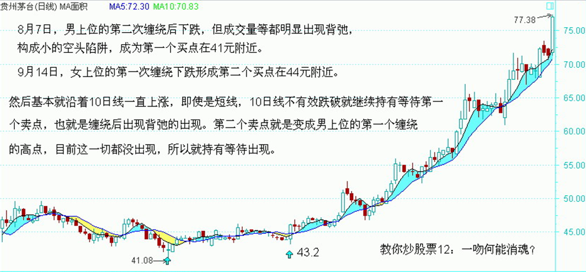

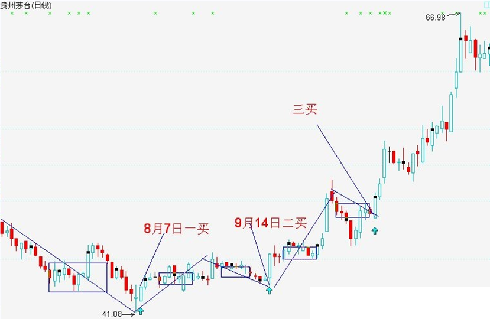

对于喜欢用日线的，用茅台为例子给一个分析，5日和10日。

8月7日，男上位的第二次缠绕后下跌，但成交量等都明显出现背弛，构成小的空头陷阱，成为第一个买点在41元附近。

9月14日，女上位的第一次缠绕下跌形成第二个买点在44元附近。

然后基本就沿着10日线一直上涨，即使是短线，10日线不有效跌破就继续持有等待第一个卖点，也就是缠绕后出现背弛的出现。第二个卖点就是变成男上位的第一个缠绕的高点，目前这一切都没出现，所以就持有等待出现。

再补充一句：

希望来这里的人，以后慢慢少点诸如要涨多少要跌多少之类的问题，因为这类问题都是错误的思维下产生的。本ID不是股评，不是算命先生，才没兴趣猜测上升、下跌的空间，本ID只是一个观察者，只在买点出现时介入，然后持有等待卖点的出现，其他本ID一律没兴趣。

来这里，如果最终不能脱胎换骨，在投资上换一副眼睛，那你就白来了。

HYPERLINK "http://blog.sina.com.cn/u/1215172700" \t "_blank" 缠中说禅：2006-12-01 09:13:03

这个对下午判断继续有效2006-12-01 09:13:03 大盘今天出现震荡是正常的，关键是5日线。只要5日线站稳，板块会继续轮动表现的

缠中说禅：2006-12-01 12:10:55

本ID对大盘的建议继续有效，引用如下：该结论继续有效 缠中说禅 2006-11-29 15:14:38 从大盘健康的角度说，本ID给大盘的建议是：先深成指突破6103点的历史高位，然后上海跟上，突破以后再调整，这样更健康。不知道大盘有没有兴趣听本ID的意见了。

HYPERLINK "http://blog.sina.com.cn/u/1215172700" \t "_blank" 缠中说禅：2006-12-01 12:16:49

现在大盘最大的风险是上海人比较小气，因为深圳先突破历史新高几乎是不可改变的了。上海有可能故意捣乱，让大家都突破不了。这种事情听起来像天方夜谈，但历史上出现过不止一次了。但历史却一次次地证明，只要是大牛市，深圳就是比上海牛，这也是判断行情的一个很重要的经验。当深圳比上海弱时，是大行情的机会很小的。现在看到深圳比上海强，即使是上海人，也应该为此高兴。

缠中说禅：2006-12-01 15:02:23

大盘今天如期出现震荡，目前大盘最大的危险就是前面所说的沪深之间的竞争，特别上海历史上有故意拆台的前科，这一点必须有所警惕。

技术上，今天深圳成指留下的缺口十分重要，如果很快回补，则技术上发出不好的信号。

下周一依然有震荡的需要，但各股行情依然继续。由于11月是巨阳，12月上冲后出现大幅震荡不可避免，这必须要清醒。

缠中说禅：2006-12-01 12:26:27

好的，就用刚才糊涂蛋 所的000958分析一下。随便就用5、10的系统，先看周线，如果资金大的，可以先看月线。周线上，5周10周的第一个买点出现在7月22日的2.2元附近，有一个典型的背弛，具体自己去研究。第二个买点就是11月3日的2.6元附近，那是女上位后出现的第一次缠绕。现在不是不可以买，只是最好的位置过去了。中线给股票没问题，短线可以参照日线的该种方法操作。

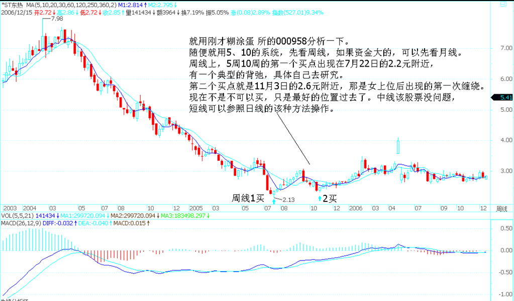

## 教你炒股票13：不带套的操作不是好操作！

(2006-12-04 12:08:28)

不带套的男人是否好男人，这个问题暂且不说，不带套的操作一定不是好操作票，特别对于资金量大的！带套有两种，一种是主动、一种是被动。何谓被动带套？就是介入时根本不知道为何介入，在一种盲目的状态下被套了，然后还有一种很错误的理论，认为亏损多少就要止蚀，按这种方法来操作，最终都不可能大成功的。几乎所有的投资者，都是这种被动带套的，这种人，都是被套所套。

其实，从来不存在真正的止蚀问题，只存在股票是否依然在能搞的范围内的问题，只有这种意义下才存在止蚀：一只股票的走势从能搞变成不能搞。请注意，站在盈亏的，这时并不意味着操作是失败了，可能已经大大赢利了，唯一退出的原因只是股票的走势已经不能搞了。投资市场中一个最坏的毛病就是根据盈亏进出，而盈亏不是先验的，是根据当下的走势当下决定的，是被动的，根据盈亏进出，就是根据被动的因数进出，这不是被动带套是什么？

何谓主动带套？这里有两层意思。其一，介入不可能一下子完成，特别对于大资金来说，如果不采取主动带套的方法，怎么可能买到足够的货？那种号称从来不带套的，肯定从来没操作过大资金。但更重要的是，任何的介入，都有一个主动的防护加入其中，这个防护就是从一旦变为不能搞，就立刻从买入程序中此退出，这个防护的启动是和任何盈亏无关的，只和当下的走势有关。

例如，在上一章所说的买入程序里，对于第一个买点，一旦上涨时依然出现男上位的缠绕，那么一定要退出，为什么？因为第一个买点买入的基础在于男上位最后一个缠绕后出现背驰，而现在又出现男上位的缠绕，意味着前面引导买入程序启动的缠绕并不是最后一个缠绕，也就是程序判断上出现问题，因此必须退出。一般情况下，这种退出一定是赢利的，但这并不能成为不退出的理由。甚至不排除这种情况，就是退出后，缠绕经过以时间换空间的折腾慢慢变成女上位，最后还大幅上涨了（这种情况即使出现，也可以根据第二个买点的原则重新介入，所以真正的机会并不会丢失），但即使这样，也绝对不能因为这种可能的情况有侥幸心理。因为还有更大的可能是缠绕后出现加速下跌。对于走势，可能是无位次的，而实现是有位次的，而任何的操作，只能建立在有位次的基础上，这对于熟悉本ID所解《论语》的人应该能理解。半部《论语》治天下，就别说股市了，要股市上脱胎换骨，多看本ID说的《论语》，那是源泉。

而对于上一章所说的第二个买点，一旦该缠绕中出现跌破前面男上位的最低位，就意味着买入程序出现问题，必须在任何一个反弹中把股票出清，在这种情况下，不排除后面出现上涨，但理由如上，任何操作，没有百分百准确的，一旦出现特殊情况，一定要先退出来，这是在投资生涯中能长期存活的最重要一点。当然，有经验的人，即使退出，也会按部就班，很有秩序，这和打仗是一个道理，一发现战机不对，就要撤，不能硬抗，否则不给灭了才怪了。

投资是一个长期的事业，别抱着赌博的心态企图一次成功，只要有这种心态，最终的结局一定悲惨，这已经被无数事例所验证。为什么要研究符合自己的买卖程序？就是因为这是市场风浪中唯一安全的港湾，港湾有时候也会有台风，但不能因为有时候有台风就不要港湾了。还有一点，就是买入程序的成功率和市场的强度有关，在强的市场里，买入程序的成功率基本都在90%以上，但在弱的市场里，这成功率就要低多了。

任何根据均线等技术系统构成的买卖程序，都只是一个综合判断的一个子判断，并不是说这一招就可以了。至少有一点是任何技术的买卖程序不能解决的，就是相同程序选出来的股票，为什么有些涨得多、有些涨的少，能不能就此而选出最有力度的，这在实际的操作中是很有意义的问题。用一个庸俗的比喻，技术系统是“海选”，而其后需要的是“复赛”、“PK”，这才能选出真正可以介入的股票。关于这个问题，在后面会逐步展开。

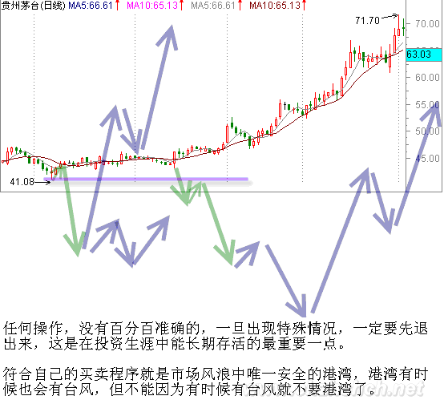

读后感：

1、主动买套与被动买套之不同。

2、买入程序的建立和退出程序的必要性。

3、“任何操作，没有百分百准确的，一旦出现特殊情况，一定要先退出来，这是在投资生涯中能长期存活的最重要一点。当然，有经验的人，即使退出，也会按部就班，很有秩序，这和打仗是一个道理，一发现战机不对，就要撤，不能硬抗，否则不给灭了才怪了。”

4、建立起一个完整的投资决策系统实属不容易，特别是正确的理念。

### 2006-12-04解盘

缠中说禅：2006-12-04 12:15:49

本ID对大盘的建议继续有效，引用如下：该结论继续有效 2006-11-29 15:14:38 从大盘健康的角度说，本ID给大盘的建议是：先深成指突破6103点的历史高位，然后上海跟上，突破以后再调整，这样更健康。不知道大盘有没有兴趣听本ID的意见了

缠中说禅：2006-12-04 12:37:10

本月大盘走势，以下话依然有效：2006-12-01 15:02:23由于11月是巨阳，12月上冲后出现大幅震荡不可避免，这必须要清醒。

缠中说禅：2006-12-04 13:24:23

短线判断大盘调整的一个最简单方法就是深沪指数的背离，一旦出现，调整或至少是震荡将很快发生。方法说了，具体就自己马上实践一下，不能什么都说好了，这样永远无法提高。

缠中说禅：2006-12-04 15:35:32

今天下午走势，前面的判断依然有效，只要两市不互相拆台，本ID如下建议将如期很快实现，所以现在只要看好两市是否背离就可以，一旦背离就要特别小心了。

## 教你炒股票14：喝茅台的高潮程序！

(2006-12-05 11:35:20)

前面说了很多理论上的东西，现在用一个实际的股票来说明一下具体的用法。就用茅台吧，边喝茅台边上课。这里先假设所有看的人都能找到茅台上市以来的周线和日线图。前面说过两条均线间“吻”的三种方式，其中的湿吻是最明显的缠绕例子，而飞吻和唇吻是缠绕的特殊例子，在均线操作系统中所指的缠绕，包括这三种吻。而从实际的比例看，湿吻出现的几率是最大的，但在长期均线系统中，例如周线、月线等，唇吻的例子比例也很大。先复习一下相关定义：

飞吻：短期均线略略走平后继续按原来趋势进行下去。

唇吻：短期均线靠近长期均线但不跌破或升破，然后按原来趋势继续下去。

湿吻：短期均线跌破或升破长期均线甚至出现反复缠绕，如胶似漆。

女上位：短期均线在长期均线之上。

男上位：短期均线在长期均线之下。

第一类买点：用比较形象的语言描述就是由男上位最后一吻后出现的背驰式下跌构成。

第二类买点：女上位第一吻后出现的下跌构成。

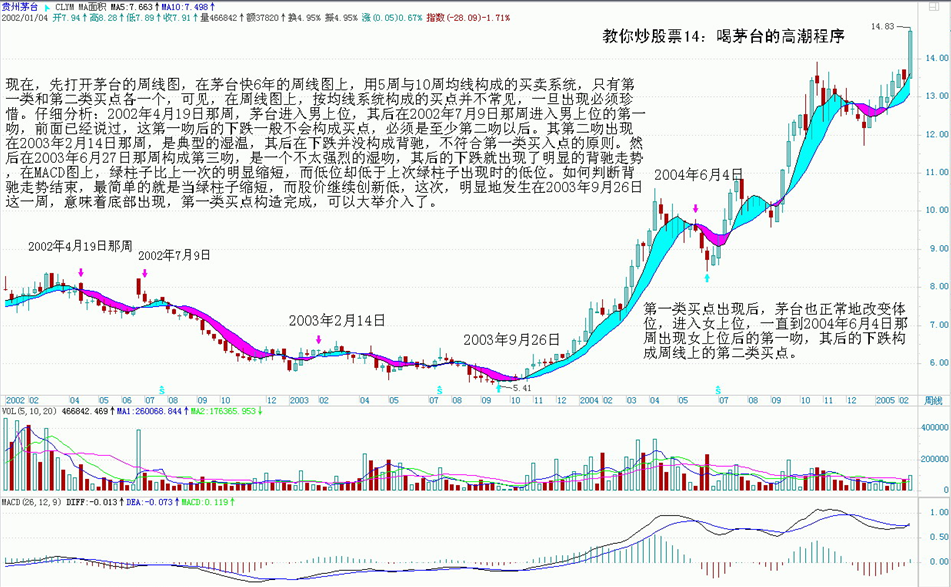

现在，先打开茅台的周线图，在茅台快6年的周线图上，用5周与10周均线构成的买卖系统，只有第一类和第二类买点各一个，可见，在周线图上，按均线系统构成的买点并不常见，一旦出现必须珍惜。仔细分析：2002年4月19日那周，茅台进入男上位，其后在2002年7月9日那周进入男上位的第一吻，前面已经说过，这第一吻后的下跌一般不会构成买点，必须是至少第二吻以后。其第二吻出现在2003年2月14日那周，是典型的湿温，其后在下跌并没构成背驰，不符合第一类买入点的原则。然后在2003年6月27日那周构成第三吻，是一个不太强烈的湿吻，其后的下跌就出现了明显的背驰走势，在MACD图上，绿柱子比上一次的明显缩短，而低位却低于上次绿柱子出现时的低位。如何判断背驰走势结束，最简单的就是当绿柱子缩短，而股价继续创新低，这次，明显地发生在2003年9月26日这一周，意味着底部出现，第一类买点构造完成，可以大举介入了。

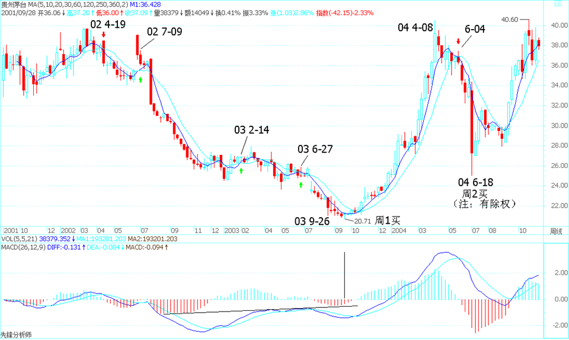

第一类买点出现后，茅台也正常地改变体位，进入女上位，一直到2004年6月4日那周出现女上位后的第一吻，其后的下跌构成周线上的第二类买点。这里有一个很重要的技巧，就是第二类买点如何精确地把握，由于在周线女上位后第一吻的调整不构成明显的下跌走势，因此对于第一类买点的背弛走法就无法出现，这时候就要降低K线级别，从日线图上寻找最佳买点，这里给出一个缠中说禅买点定律：大级别的第二类买点由次一级别相应走势的第一类买点构成（该定律是有专利的，发明权一定要明确，这一点必须明确，否则以后本ID不会再说任何定律了，该定律一定没有任何人发现过，其他本ID已发现的定律也一样，哪天本ID心情好再说几个，但前提是不能让本ID发现有盗版的，各位也应该和本ID一起监督）。例如，周线上的第二类买点由日线上相应走势的第一类买点构成。有了这个缠中说禅买点定律，所有的买点都可以归结到第一类买点。

对于茅台，2004年6月4日那周出现女上位后第一吻，对应在日线图上是明显的男上位走势，该走势其中出现三次吻，分别在2004年4月29日、5月18日、6月1日，都是典型的湿吻，但前两次其后的下跌都没有出现背驰，只有第三次，出现明显的背驰性走势，6月18日创下低点后，MACD的绿柱子明显比前面的要缩短，这就构成了日线上的第一类买点，而这个买点，在周线上就是第二类买点。注意，后面由于除权，价位上似乎比这个要低了，其实并没有。

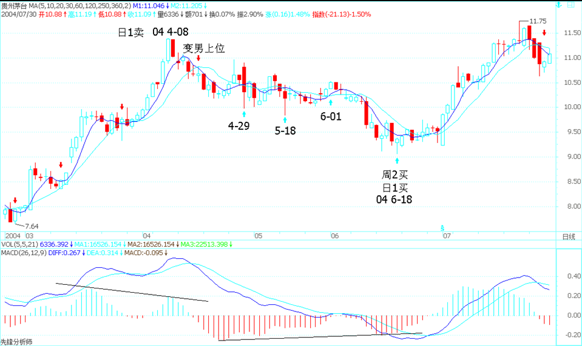

站在周线角度，茅台的买点就这两个了，而其后的卖点至今没出现，如果当时根据这两个买点介入的，目前应该继续持有，直到卖点出现。但是，这是一种针对特别大资金的玩法法，例如50亿以上，对于资金量一般的，例如10亿以下的，有一种增加资金流动性的玩法，就是充分利用日线的卖点回避大的调整，虽然这种调整站在周线的角度不一定要参与。缠中说禅短差程序就是：大级别买点介入的，在次级别第一类卖点出现时，可以先减仓，其后在次级别第一类买点出现时回补。对于周线买点介入的，就应该利用日线的第一类卖点减仓，其后在第一类买点回补。对于茅台，分析如下：

在周线2003年9月26日这一周根据第一类买点介入的，其后的女上位出现九次吻，前八次都没构成背驰走势，而第九次出现在2004年3月26日，其后的上涨出现明显背驰，4月8日的高位对应的MACD红柱子并没有相应创出新高，这就构成日线上的第一类卖点。

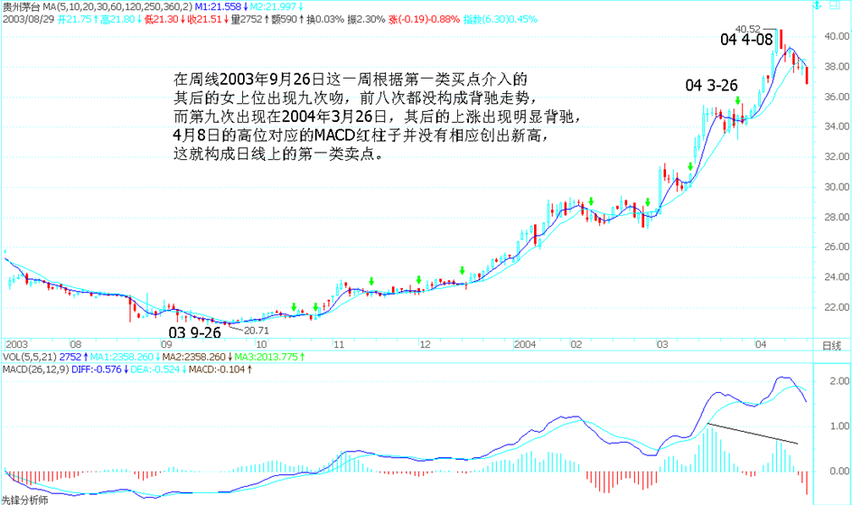

其后的第一类买点出现在6月18日，然后的第一类卖点出现在10月27日，然后第一类买点出现在12月22日，下一个第一类卖点出现在2005年4月26日，接着的第一类买点出现在2005年12月13日，下面的第一类卖点至今没出现，也就是说，即使是站在日线的角度，2005年12月13日介入的茅台，根本就没有出现卖点，唯一正确的就是坚决持有。当然，如果资金量小，不是按周线的，第一类、第二类买点都是最多按日线的，就可以相应在30分钟等更小的级别内找到第一类卖点而弄出短差来，那就太细了，各位自己研究去。

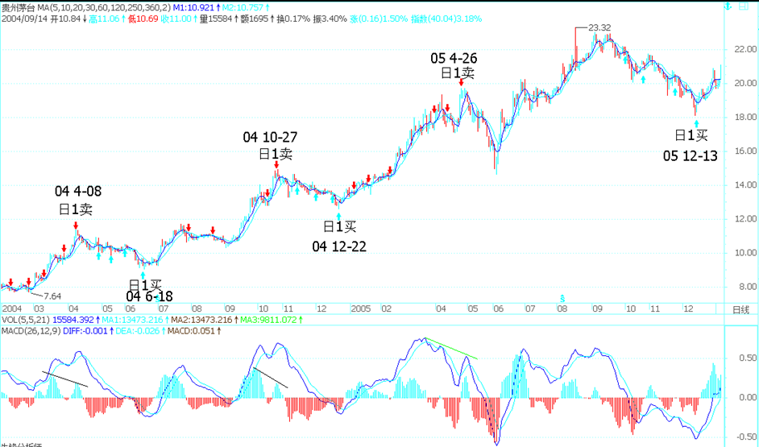

要把握好这个均线构成的买卖系统，必须深刻理解缠中说缠买点定律：大级别的第二类买点由次一级别相应走势的第一类买点构成。如果资金量不特别巨大，就要熟练缠中说禅短差程序：大级别买点介入的，在次级别第一类卖点出现时，可以先减仓，其后在次级别第一类买点出现时回补。这样才能提高资金的利用率。注意，该定律和程序都要注意版权，任何人都可以用，也不收任何版权费，但这个版权必须要明确，否则本ID心情不好，就没兴趣再说任何定律、程序了。严惩所有企图盗版去招摇撞骗的人。各位要多看图，根据相应的资金量以及性格去定自己的操作级别，然后具体是熟练，否则就是纸上谈兵，毫无意义了。

读后感：

这是缠师用的均线构成的买卖系统进行操作的示例，操作思想可参考。

HYPERLINK "http://blog.sina.com.cn/u/1215172700" \t "_blank" 缠中说禅：2006-12-05 22:12:54

请教缠姐:关于茅台12月22日买点至2005年4月26的卖点，买点好理解，卖点有点疑问，为什么不是4月13，那天它的MACD明显背驰了啊，我理解是其后才出现第一次湿吻，(对这一次的买卖)，但其后4月26的MACD又明显放大了，按当时来看应该不算背驰啊，请指教! 

=

本ID用的MACD周期比普通的要长一倍.按普通的指标，4月13日的背驰构成的是MACD双头走势，一般到零轴后都有双次拉回，这次才是构成最终的背弛.有关背弛的课上会详细说.

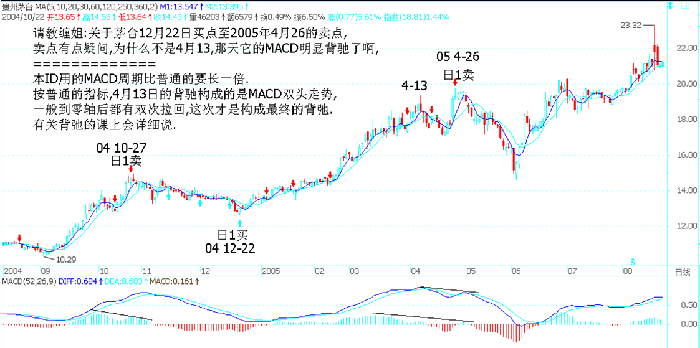

HYPERLINK "http://blog.sina.com.cn/u/1215172700" \t "_blank" 缠中说禅：2006-12-05 22:18:03

我的分析：000530经过长期的纠缠上涨，相信庄家已经收足筹码，这两日放量上涨之后即将回调。短线高手可以介入，中长线时机已经错过。

==

可以.但最好习惯用第一\二类买点来分析.周线就不说了，自己去分析.日线上，最近一次的第一类买点在9月26日，第二类买点在10月23日，这是根据日线图介入的最好两个位置，至于后面的介入，要根据30分钟图了.

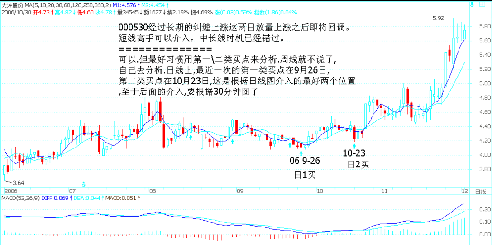

对四川提出最强烈的抗议.

2006-12-6 15:16:00

虽然本ID消息极端准确，今天本ID手里的某酒厂股票还在大盘大跌时涨停了，本ID还是要抗议.本ID之所以买他的股票，就是要抽他的血，他们把厂家卖给外国人，本ID就是要抽他们的血.这事情可能已经无法更改，准确的消息说这几天就要停牌，大概两周，然后就宣布外国鬼子进村，气愤!

还有中国一个最大的药厂之一正被国外最大药厂之一收购，方案在报批中，该股票正停牌，本ID也按照抽血的原则大量持有该股票.但ID只希望把这事情搞黄!反正即使黄了，本ID也不会亏钱，成本低着了.最近听说也要宣布了，除了让医药板块折腾一下，中国一个大企业又就此沦落，值得吗?当然，本ID钱是挣的\血是要抽的，但还是要表示气愤!

抗议还是用原来的文章.

四川，别给中国丢人！

作者：缠中说禅　回复日期：2006-12-6　15:23:40

看中国如何被收购.

作者：缠中说禅　回复日期：2006-12-6　16:03:50

数学妹妹支持你!!!!!!!

=

不是支持本ID的问题.

作者：缠中说禅　回复日期：2006-12-6　17:08:09

请问楼主说的医药股票是四川的吗？我怎么没找到现在停牌的四川医药股啊？

==

本ID没说医药股是四川的.停牌的就那一只，还有谁?

就某酒类股票对所有散户的严重提示!

(2006-12-07 10:00:31)

本ID昨天写的"对四川提出最强烈的抗议."纯粹是就该公司进行抗议，不涉及任何股票走势.本ID强烈希望把这事情搞黄，因为本ID不希望去喝英国人造的中国酒.本ID昨天的文章，只是对某些人的警告，所有散户不要在其中参合.

本ID在昨天本博客已经明确表示这点，请看:

缠中说禅2006-12-06 16:20:48

请问lz你说的那瓶酒俺也想买点，抽他们的血，可乎？

=

这个抽血的繁重任务还是让本ID来完成吧，现在中线买点早过了，风险太大，本ID持有的成本不同，不建议任何人追高买入.

有些事情不是散户该干的，今天也不写什么文章了，就是这声明，注意，散户不要瞎搞，风险第一.补充一句:打仗就会飞沙走石，谢绝散户参与，参观无妨，别到时候伤着，来本ID这里吵闹，本ID没这时间接待.

2006-12-05－07解盘

缠中说禅：2006-12-05 11:53:53

本ID对大盘的建议继续有效，引用如下：该结论继续有效 2006-11-29 15:14:38 从大盘健康的角度说，本ID给大盘的建议是：先深成指突破6103点的历史高位，然后上海跟上，突破以后再调整，这样更健康。不知道大盘有没有兴趣听本ID的意见了

缠中说禅：2006-12-05 22:23:28

各位，好好去研究一下，真明白了，终生受益.一定要看图研究清楚.不明白的本ID都尽量解释明白的.大盘如期进入震荡，5日线是短线关键，但个股问题不大，特别没动的二\三线股.

缠中说禅：2006-12-06 12:09:47

这震荡很正常，下午关键看深圳补完缺口后的表现，如果就此止住，就很快恢复上攻，否则还要折腾几天。赢利的股票关键看你是短线还是中线了，如果是短线，前两天开始就应该有所动作，中线正好利用这震荡弄短差。

缠中说禅：2006-12-06 12:34:01

大盘跌破5日均线，主力无护盘，放量杀跌，看起来很象顶啊 实在是晕啊，等小妹指点。

==

事情要有预见性，这震荡上周五收盘时已经说过了，昨天中午又强调了一次，如果没动，那就上上下下享受一下。5日线是否有效突破要看下午走势，不要太快下结论。心态要好点。

现在，如果没及早准备，反而要稳住自己，如果大满仓，那下午或明天的反抽时可以适当减低仓位。由于大盘中线问题不大，如果短线技术不好的，也不一定玩短线。

缠中说禅：2006-12-06 15:01:20

今天大盘没什么新意，都是预料中的事情，中午说了，没走的就上上下下享受一下，短线行的就忙忙弄点短差，5日线是调整的关键。

(2006-12-07 15:06:53)

公告

以后本ID这里不准备对具体个股与大盘走势发表任何具体意见，免得各位狐疑.所有走势与本ID无关，别瞎闹了.对大盘，最后把前面说的强调一次:

中长线:目前是牛市的第一轮，主要涨的是大盘成分股.大调整后的第二轮，涨的是成长股，最后是重组股.这个节奏的完成大概需要几年时间.

中短线:大盘11月是长阳，本月上涨前出现震荡积聚能量是理所当然的(这在12月1日就说了，现在继续有效.)

## 教你炒股票15：没有趋势，没有背驰。      (2006-12-08 11:55:57)

有人很关心诸如庄家、主力之类的事情，但散户、庄家的位次分野这类事情不过是市场之“不患”下的“患”，对本ID所解《论语》熟悉的，对此都很容易理解。有些东西是超越散户、庄家的位次分野的，这是市场之根，把握了，所谓散户、庄家的位次分野就成了笑话。如果真喜欢听有关庄家的逸事、秘闻，以后有空本ID可以说点，而且还可以告诉你如何阻击、搞死庄家，这一点，环视国内，没有比本ID更有经验的了。

对于市场走势，有一个是“不患”的，就是走势的三种分类：上涨、下跌、盘整。所有走势都可以分解成这三种情况。这是一个最简单的道理，而这才是市场分析唯一值得依靠的基础。很多人往往忽视最简单的东西，去搞那些虚头八脑的玩意。而无论你是主力、散户、庄家，都逃不过这三种分类所交织成的走势。

那么，何谓上涨、下跌、盘整？下面给出一个定义。首先必须明确的是，所有上涨、下跌、盘整都建立在一定的周期图表上，例如在日线上的盘整，在30分钟线上可能就是上涨或下跌，因此，一定的图表是判断的基础，而图表的选择，与上面所说交易系统的选择是一致的，相关于你的资金、性格、操作风格等。

上涨：最近一个高点比前一高点高，且最近一个低点比前一低点高。

下跌：最近一个高点比前一高点低，且最近一个低点比前一低点低。

盘整：最近一个高点比前一高点高，且最近一个低点比前一低点低；或者最近一个高点比前一高点低，且最近一个低点比前一低点高。

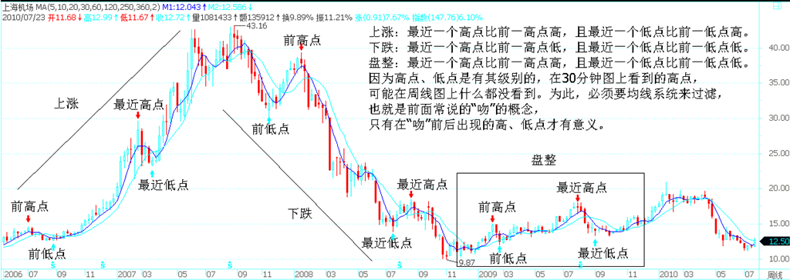

操作的关键不是定义，而是如何充分理解定义而使得操作有一个坚固的基础。其中的困难在于如何去把握高点和低点，因为高点、低点是有其级别的，在30分钟图上看到的高点，可能在周线图上什么都没看到。为此，必须要均线系统来过滤，也就是前面常说的“吻”的概念，只有在“吻”前后出现的高、低点才有意义。

这里，首先要搞清楚“吻”是怎样产生的。如果一个走势，连短线均线都不能突破，那期间出现的高、低点，肯定只是低级别图表上的，在本级别图表上没有意义。当走势突破短期均线却不能突破长期均线，就会形成“飞吻”；当走势突破长期均线马上形成陷阱，就会形成“唇吻”；当走势突破长期均线出现一定的反复，就会形成“湿吻”。由此可见，“吻“的分类是基于对原趋势的反抗程度，“飞吻”是基本没有任何反抗力，“唇吻”的力度也一般，而“湿吻”，就意味着力度有了足够的强度，而一切的转折，基本都是从“湿吻”开始的。

转折，一般只有两种：一、“湿吻”后继续原趋势形成陷阱后回头制造出转折；二、出现盘整，以时间换空间地形成转折。第二种情况暂且不说，第一种情况，最大的标志就是所谓的“背驰”了。必须注意：没有趋势，没有背驰。在盘整中是无所谓“背驰”的，这点是必须特别明确的。还有一点是必须注意的，这里的所有判断都只关系到两条均线与走势，和任何技术指标都无关。

如何判断“背驰”？首先定义一个概念，称为缠中说禅趋势力度：前一“吻”的结束与后一“吻”开始由短线均线与长期均线相交所形成的面积。在前后两个同向趋势中，当缠中说禅趋势力度比上一次缠中说禅趋势力度要弱，就形成“背驰”。按这个定义，是最稳妥的办法，但唯一的缺点是必须等再次接吻后才能判断，这时候，走势离真正的转折点会已经有一点距离了。如何解决这个问题：第一种方法，看低一级别的图，从中按该种办法找出相应的转折点。这样和真正的低点基本没有太大的距离。

还有一种方法，技巧比较高，首先再定义一个概念，称为缠中说禅趋势平均力度：当下与前一“吻”的结束时短线均线与长期均线形成的面积除以时间。因为这个概念是即时的，马上就可以判断当下的缠中说禅趋势平均力度与前一次缠中说禅趋势平均力度的强弱对比，一旦这次比上次弱，就可以判断“背驰”即将形成，然后再根据短线均线与长期均线的距离，一旦延伸长度缩短，就意味着真正的低部马上形成。按这种方法，真正的转折点基本就可以完全同时地抓住。但有一个缺陷，就是风险稍微大点，且需要的技巧要高点，对市场的感觉要好点。

纯粹的两条均线的K线图，就足以应付最复杂的市场走势了。当然，如果没有这样的看图能力，可以参照一下技术指标，例如MACD等，关于各技术指标的应用，以后会陆续说到。

读后感：

1、从此文开始，缠师开始陆续介绍起一些概念，当然，还是一些粗糙的，容易理解的方式推出的。

2、“没有趋势，没有背驰”，画龙点睛之笔再次出现。

缠中说禅：2006-12-11 15:25:14

你不说盘，让我更郁闷....主席不也说过:不管风吹浪打.胜似闲庭信步嘛!~~~不过.我尊重你的决定.再次多谢你..来这里.已经成了我的一个习惯

=

大盘已经说的够清楚的，中长线走势早说了，1日说了中短线，12月要出现大幅震荡。这种大幅震荡正是短线的好机会。

而大盘的旗帜也很明确，就是银行股、地产股为代表的成分股，只要他们不倒，牛市的第一轮就不会结束。所以没必要每天都说一次大盘，自己也要慢慢学会看。

本ID如此精确地知道消息，依然要抗议！

(2006-12-12 09:38:38)

本ID如此精确地知道消息，

依然要抗议！

缠中说禅2006-12-11 13:44:29

抗议！抗议！抗议！

为了不影响散户操作，抗议什么暂且不说，明天就知道了。

2006-12-12刊登重大事项公告，上午停牌一小时

水井坊重大事项公告

四川水井坊股份有限公司接第一大股东四川成都全兴集团有限公司(下称：全兴集团)通知，其控股股东成都盈盛投资控股有限公司已于2006年12月11日签署《股权转让协议》，将其所持全兴集团43%的股权转让给帝亚吉欧高地控股有限公司(下称：Diageo 公司)。上述股权交易将报经政府商务部门批准后实施，全兴集团将相应变更为从事商业经营的外商投资商业企业，为 Diageo 公司提供采购服务并进行其他经营活动。

事情回顾：

对四川提出最强烈的抗议.

四川，别给中国丢人！

就某酒类股票对所有散户的严重提示!

2006-12-07　10:00:31

本ID在昨天本博客已经明确表示这点，有些事情不是散户该干的，今天也不写什么文章了，就是这声明，注意，散户不要瞎搞，风险第一.

缠中说禅　2006-12-12　10:14:39

这不仅是企业的沦陷，还是酒业药业文化的沦陷，美国人能够注册我们的人参蜂王浆，韩国人能够注册我们的牛黄丸，日本人能够仿我们的六神丸造的救心丸，一年在国际上的市场就有一个多亿美圆的销售额.

当哪天我们在酒吧喝上日本人的注册我们的国酒牌子名酒的时候，才明白数学妹妹今日的一番良苦用心.

==

知道就好

作者：缠中说禅　回复日期：2006-12-12　12:37:59

这事没完，还有一个就是这个 还有中国一个最大的药厂之一正被国外最大药厂之一收购，方案在报批中 玩一个游戏 有兴趣的可以猜是谁，明天公布答案。

缠中说禅：2006-12-12 20:11:39

谢谢你楼主，我明白了就是如果股价或指数创新高而MACD的红柱子却低于前一天也就有可能产生背驰对吗?还有如果产生背驰股价下跌5日和10日接吻后，会不会还有一个冲高有一个相对的高点可出，还是就一路下跌了？谢谢你！！！！

==

理解错误。柱子出现今天比昨天短，昨天比前天长的情况，证明柱子的一波出现转折，转折这一天的高度如果比上一波转折高度低，就形成柱子上的背驰。

但对于MACD，单纯看柱子上的背驰还不行，还要看黄线DEA和白线DIFF的走势，特别对于通道式，一定要看。这个问题以后说技术指标时再说。

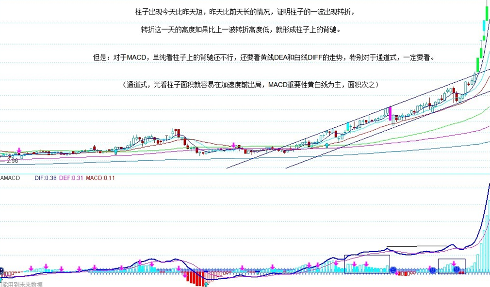

HYPERLINK "http://blog.sina.com.cn/u/1215172700" \t "_blank" 缠中说禅：2006-12-13 12:17:52

关于038004的作业，回答比较正确的是下面这位。但还是有点出入。10月23到25日是本ID的见仓期，第一波上去后，11月8日减了一半，后来在60天线附近一路回补，加仓是在12月6日、7日两天，比第一次买的，加了1/2的仓位。这里的理由除了第二类买点，还有一个现在没说到的，就是三角形整理的第五波末段。该走势十分标准，自己去研究一下。昨天根据5分钟线的背弛出了大半，把剩下的成本是0了。本ID作权证，特别是认沽，第一轮上去都会这样减仓操作，只持有成本是0的仓位等待第二波，第二波是否有，这已经问题不大了，这样就绝对立于不败之地了。

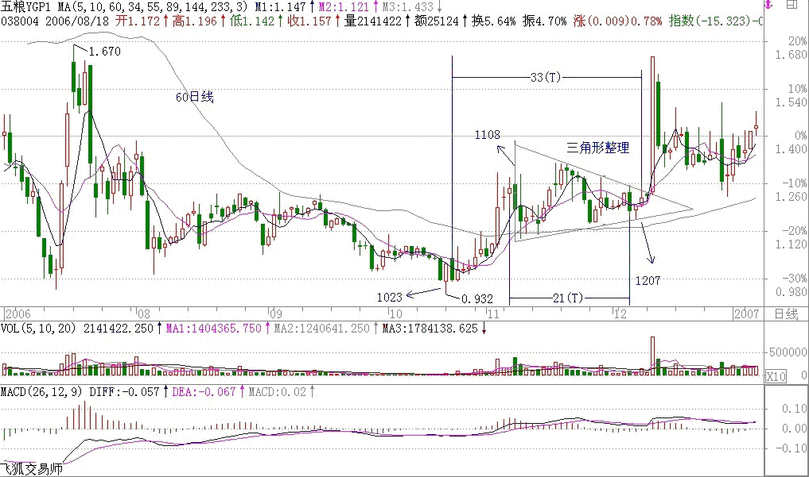

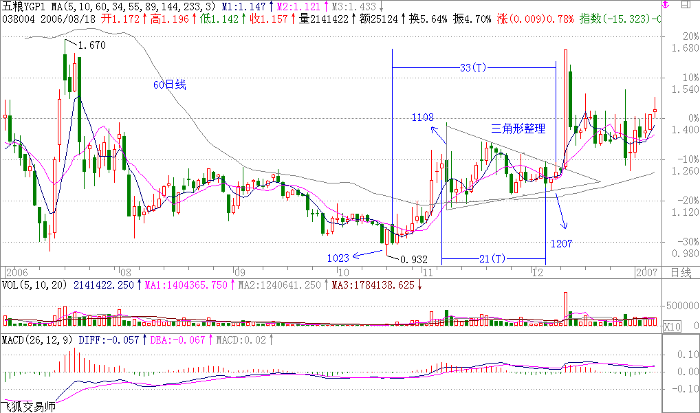

三角形的判别不看均线，直接看图形。11月8日到12月7日，是一个完美的三角形，还告诉你一个秘密，这刚好是一个时间周期点。这就是为什么本ID能十分准确地加仓的原因。几个因数都结合在一切了。

好好研究一下038004日线的第二类买点构成，这是一个用三角形构造第二类买点的完美例子。

[匿名] 在路上 2006-12-12 23:48:54 我先来回答禅姐的038004的问题,以检验最近向禅姐学习的成绩,无论对错,望禅姐和各位同道指正,以求共同步.

日线图:(5/10日均线)

一、038004的强力上升结束后,于06年5月26进入男上位,其后于7.3来了一个很浅的湿吻,按照禅中说禅定律,后面的下跌(7.12)不是第一类买点.7.17来了第二次湿吻,但其后并未出现背驰(中间几次反复缠绕均未突破最高\低价,属于缠姐说的盘整).

10.12又来了湿吻,这次湿吻后的下跌至10.31形成的面积小于上次下跌的面积而形成背驰,构成第一类买点,而最佳位置我在30分钟图上看的不太确定,还有就是这次背驰的面积是和5.26至7.3的那次下跌对比还是和9.18至10.12那次对比,虽然这次背驰比那二次都小,这二个问题请禅姐和各位指教.

另外可以得到证实的是这次的背驰在MACD中可明显看出绿柱比前二次下跌都短,面积也小很多,黄白线也在0轴以下金叉且并未创最近一次下跌的新低.这确实是一个完美的例子,我相信缠姐会买在10.23那天。

二、找到了第一类买点，第二类买点就容易多了（这也是我最近的体会，如果第一类买点找错，那第二类买点也容易错），是在11.14那天女上位后的第一次缠绕,也许是12.7日那天,因为11.14那天30分钟图同样出现盘整,而12.7比较像背驰但未创新低,对比缠姐曾解说过的MACD的M头后再背驰的说法(虽然我也不太懂).应该是12.7那天是加仓的位置,那也是第一类买点出现后MACD黄白线冲0轴后的第一次回抽并且已经走平了.

望禅姐指正,并希望能回答其中的不明之处,不胜感激!!!

HYPERLINK "http://blog.sina.com.cn/u/1215172700" \t "_blank" 缠中说禅：2006-12-13 12:21:37

本ID的权证不止038004。还有一个的典型例子，又是一个作业。

请用昨天回复里说的缠中说缠的MACD定律好好分析一下580991，为什么本ID能在10月23到25日坚决建仓。

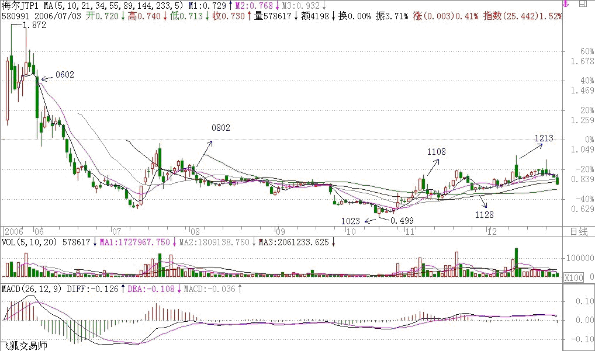

告诉大家一个缠中说缠的MACD定律：第一类买点都是在0轴之下背驰形成的，第二类买点都是第一次上0轴后回抽确认形成的。卖点的情况就反过来。

HYPERLINK "http://blog.sina.com.cn/u/1215172700" \t "_blank" 缠中说禅：2006-12-13 12:37:50

“禅主”，上文所说的“三角形整理的第五波末段。”在已知的情况下看038004清楚，可是正确的从哪个“吻点开始计算？ ==

三角形的判别不看均线，直接看图形。11月8日到12月7日，是一个完美的三角形，还告诉你一个秘密，这刚好是一个时间周期点。这就是为什么本ID能十分准确地加仓的原因。几个因数都结合在一切了。

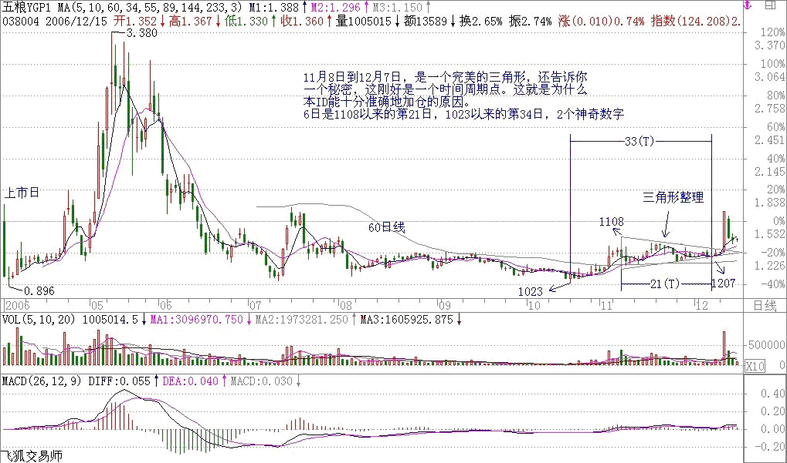

HYPERLINK "http://blog.sina.com.cn/u/1215172700" \t "_blank" 缠中说禅：2006-12-13 21:01:50

2006-12-13 16:01:38 

请教禅女：000928现在是否面临三角形整理突破？

分钟、日线图很好看，但是周线图不好看。 

==

这不是三角形，而是一个典型的平台式调整。而且恰好相反，他的周线走得还可以，不过下面关键是250周线的支持，该位置不能有效跌破。

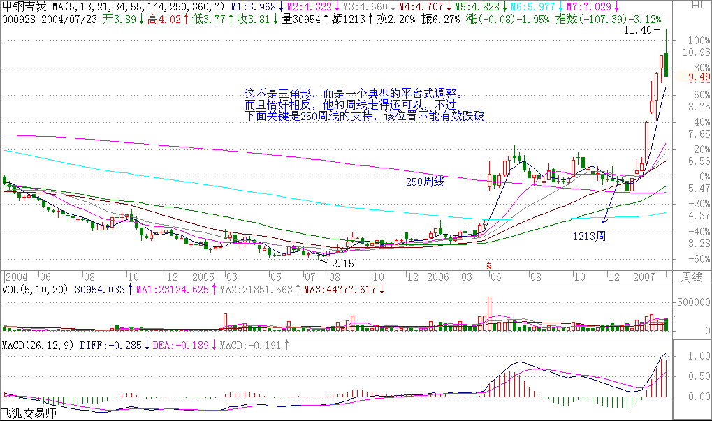

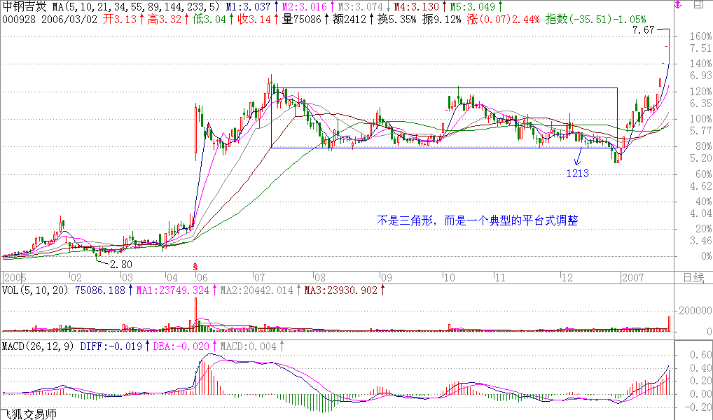

## 教你炒股票16：中小资金的高效买卖法。

(2006-12-14 12:06:47)

上章说过，市场任何品种任何周期下的走势图，都可以分解成上涨、下跌、盘整三种基本情况的组合。上涨、下跌构成趋势，如何判断趋势与盘整，是判断走势的核心问题。一个最基本的问题就是，走势是分级别的，在30分钟上的上涨，可能在日线图上只是盘整的一段甚至是下跌中的反弹，所以抛开级别前提而谈论趋势与盘整是毫无意义的，这必须切实把握。注意，下面以及前面的讨论，如没有特别声明，都是在同级别的层面上展开的，只有把同级别的事情弄明白了，才可以把不同级别走势组合在一切研究，这是后面的事情了。

上涨、下跌、盘整三种基本走势，有六种组合可能代表着三类不同的走势：

陷阱式：上涨+下跌；下跌+上涨。

反转式：上涨+盘整+下跌；下跌+盘整+上涨。

中继式：上涨+盘整+上涨；下跌+盘整+下跌。

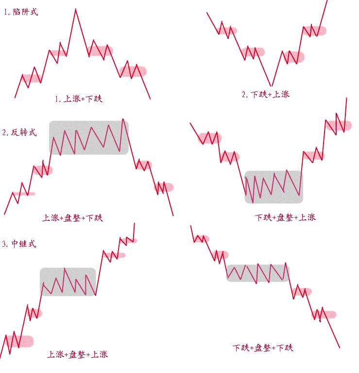

市场的走势，都可能通过这三类走势得以分解和研究。站在多头的角度，首先要考虑的是买入，因此，上面六种最基本走势中，有买入价值的是：下跌+上涨、下跌+盘整+上涨、上涨+盘整+上涨三种。没有买入价值的是：上涨+下跌；上涨+盘整+下跌；下跌+盘整+下跌。由此不难发现，如果在一个下跌走势中买入，其后只会遇到一种没买入价值的走势，就是下跌+盘整+下跌，这比在上涨时买入要少一种情况。而在下跌时买入，唯一需要躲避的风险有两个：一、该段跌势未尽；二、该段跌势虽尽，但盘整后出现下一轮跌势。

在上一章没有趋势没有背驰中，对下跌走势用背驰来找第一类买点，就是要避开上面的第一个风险。而当买入后，将面对的是第二个风险，如何避开？就是其后一旦出现盘整走势，必须先减仓退出。为什么不全部退出，因为盘整后出现的结果有两种：上涨、下跌，一旦出现下跌就意味着亏损，而且盘整也会耗费时间，对于中小资金来说，完全没必要。这里有一个很重要的问题留待后面分析，就是如何判断盘整后是上涨还是下跌，如果把握了这个技巧，就可以根据该判断来决定是减仓退出还是利用盘整动态建仓了。这是一个大问题，特别对于不想坐庄的大资金来说，这是一个最重要的问题，因为不想坐庄的大资金的安全建仓在六种走势中只可能在下跌+盘整+上涨这一种，其他都不适用。至于坐庄的建仓方法，和这些都不同，如有兴趣，本ID以后也可以说的。

根据上面的分析，可以马上设计一种行之有效的买卖入方法：在第一类买点买入后，一旦出现盘整走势，无论后面如何，都马上退出。这种买卖方法的实质，就是在六种最基本的走势中，只参与唯一的一种：下跌+上涨。对于资金量不大的，这是最有效的一种买卖方法。下面重点分析：

对于下跌+上涨来说，连接下跌前面的可能走势只会有两种：上涨和盘整。如果是上涨+下跌+上涨，那意味着这种走势在上一级别的图形中是一个盘整，因此这种走势可以归纳在盘整的操作中，这在以后对盘整的专门分析里研究。换言之，对于只操作“下跌+上涨”买卖的，“上涨+下跌+上涨”走势不考虑，也就是说，当你希望用“下跌+上涨”买卖方法介入一只出现第一类买点的股票，如果其前面的走势是“上涨+下跌”，则不考虑。注意，不考虑不意味着这种情况没有赢利可能，而只是这种情况可以归到盘整类型的操作中，但“下跌+上涨”买卖方法是拒绝参与盘整的。如此一来，按该种方法，可选择的股票又少了，只剩下这样一种情况，就是“盘整+下跌+上涨”。

从上面的分析可以很清楚地看到，对于“下跌+上涨”买卖方法方法来说，必须是这样一种情况：就是一个前面是“盘整+下跌”型的走势后出现第一类买点。显然，这个下跌是跌破前面盘整的，否则就不会构成“盘整+下跌”型，只会仍是盘整。那么在该盘整前的走势，也只有两种：上涨、下跌。对于“上涨+盘整+下跌”的，也实质上构成高一级别的盘整，因此对于“下跌+上涨”买卖方法方法来说也不能参与这种情况，因此也就是只剩下这样一种情况：“下跌+盘整+下跌”。

综上所述，对于“下跌+上涨”买卖方法方法来说，对股票的选择就只有一种情况，就是：出现第一类买点且之前走势是“下跌+盘整+下跌”类型。因此这里就得到了用“下跌+上涨”买卖方法方法选择买入品种的标准程序：一、首先只选择出现“下跌+盘整+下跌”走势的。二、在该走势的第二段下跌出现第一类买点时介入。三、介入后，一旦出现盘整走势，坚决退出。注意，这个退出肯定不会亏钱的，因为可以利用低一级别的第一类卖点退出，是肯定要赢利的。但为什么要退出，因为它不符合“下跌+上涨”买卖不参与盘整的标准，盘整的坏处是浪费时间，而且盘整后存在一半的可能是下跌，对于中小资金来说，根本没必要参与。一定要记住，操作一定要按标准来，这样才是最有效率的。如果买入后不出现盘整，那就要彻底恭喜你了，因为这股票将至少回升到“下跌+盘整+下跌”的盘整区域，如果在日线或周线上出现这种走势，进而发展成为大黑马的可能是相当大的。

举一个例子：

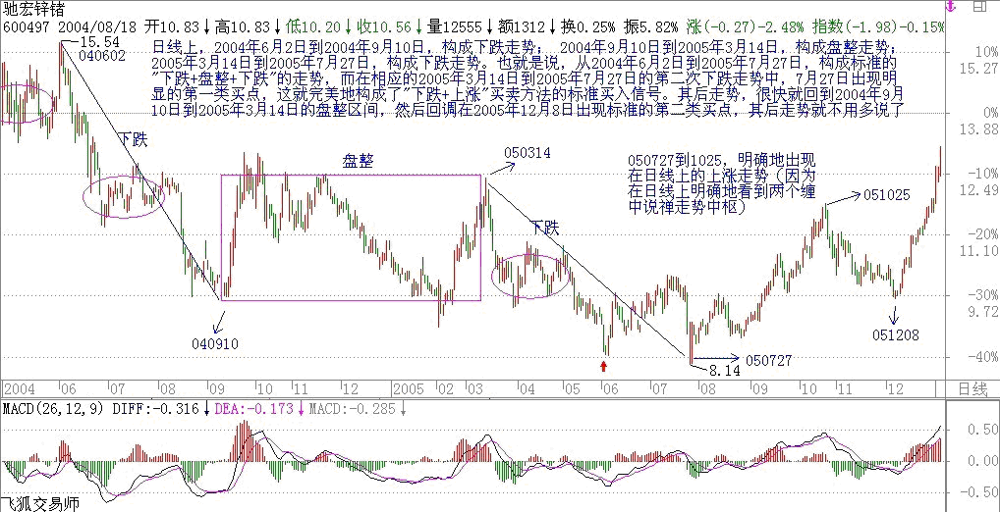

驰宏锌锗：日线上，2004年6月2日到2004年9月10日，构成下跌走势； 2004年9月10日到2005年3月14日，构成盘整走势；2005年3月14日到2005年7月27日，构成下跌走势。也就是说，从2004年6月2日到2005年7月27日，构成标准的“下跌+盘整+下跌”的走势，而在相应的2005年3月14日到2005年7月27日的第二次下跌走势中，7月27日出现明显的第一类买点，这就完美地构成了“下跌+上涨”买卖方法的标准买入信号。其后走势，很快就回到2004年9月10日到2005年3月14日的盘整区间，然后回调在2005年12月8日出现标准的第二类买点，其后走势就不用多说了。

该种方法反过来就是选择卖点的好方法了，也就是说前面出现“上涨+盘整+上涨”走势的，一旦第二段升势出现第一类卖点，一定要走，因为后面很可能就是“上涨+下跌”的典型走势。对此，也举一个例子：北辰实业，在30分钟图上，11月7日10点30分到11月22日10点，构成上涨；11月22日10点到11月30日11点构成盘整；11月30日11点到12月7日10点构成上涨。而在第二段上涨中，30分钟图上的3次红柱子放大，一次比一次矮所显示的严重背离，就完美地构成了“上涨+盘整+上涨”后出现第一类卖点的“上涨+下跌”型卖出。如果以后学了时间之窗的概念，对该股的卖点就更有把握了，各位注意到11月7日10点30分和12月7日10点之间的关系没有。

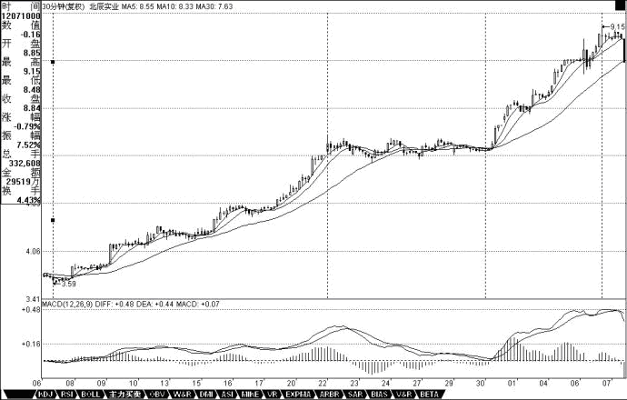

这种方法，无论买卖，都极为适用于中小资金，如果把握得好，是十分高效的，不过要多多看图，认真体会，变成自己的直觉才行。另外请多看文章后面的跟贴，ID的一些回复都是针对一些主帖没所到的细节东西，而且都是针对各位提出的不同问题的。还有多看前面的章节，把所有问题都搞懂，参与市场是不能有半点糊涂的。

读后感：

1、走势类型的判别和组合是要功力的事，对于中小资金的高效操作方法，其前提是有较深厚的走势分析的功力。

2、能准确的把握了转折，就等于找到了股市提款机的密码。

### 2006-12-14解盘

缠中说禅：2006-12-14 12:38:11

从大盘健康的角度说，本ID给大盘的建议是：先深成指突破6103点的历史高位，然后上海跟上，突破以后再调整，这样更健康。不知道大盘有没有兴趣听本ID的意见了。楼主，觉得大盘听从你的意见了吗

==

其实上海、深圳谁先突破都不重要，大盘现在只是牛市的第一阶段，关键心态要好。别大盘晃两下就怕。本ID再把一句说过的话再说一次：牛市里，跌就是爹。还要严重再次反复说：第一阶段主力是成分股，看看1000点上来，是不是这样！

缠中说禅：2006-12-14 15:10:16

创历史新高这种无聊事情就别想那么多了，随着行情的展开，不断往上就不断创历史新高。心态平稳点，牛市的第一轮行情就受不了，那到第三轮垃圾股漫天飞时，那不找不到站的地方？

缠中说禅：2006-12-14 16:49:31

580991作业

从日线图上看,9.22开始下跌趋势,5和10日均线程男上位缠绕,以10.17为分界点,后面的面积较前面小不少,可判断为背弛,MACD上绿柱变短,黄白线在0线以下,均支持背弛的判断,最好的买点在下跌中的低点10.23,是缠理论中第一类买点

从30分种图上,看得更清楚,从9.22的11:00到10.23的11:00是很明显的"下跌盘整下跌"走势,10.23的11:00处是最好的买点.

以上分析是否对路

==

完全错误，请好好体会这一句：没有趋势，没有背驰，背驰是趋势与趋势之间的比较，你不先找出两段趋势来，哪里有背驰可言？

===

补充一句，你所的那段走势力，(指9月22--10月23那段走势）在5分钟图上是对的，是"下跌盘整下跌"，但在30分钟上就只是一个下跌。请好好想明白这个区别。

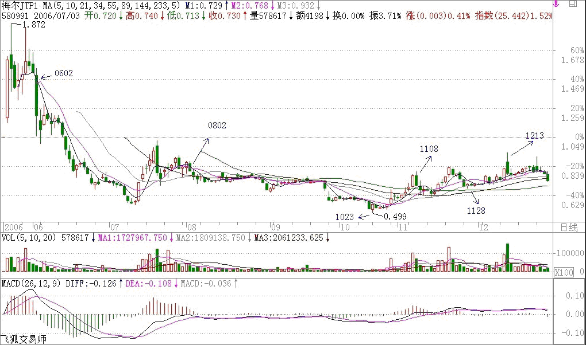

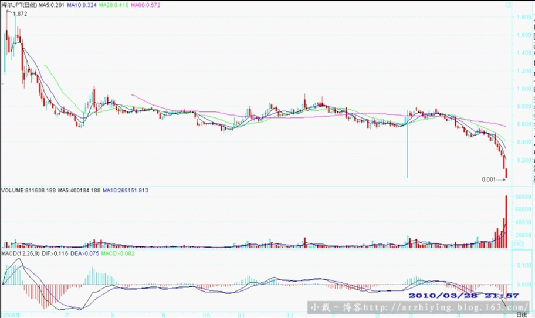

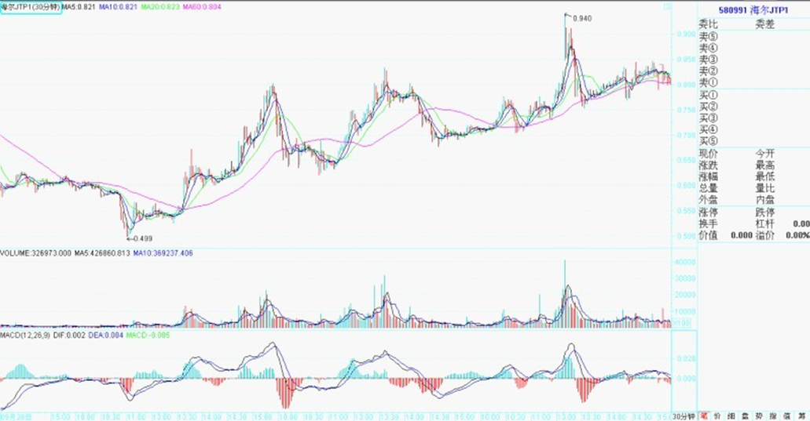

2006-12-24- 16：40

还没想明白,请问,580991的30分种图上,9月28日14:30到10月20日的11:30这段不算盘整吗?我看从9月22日到10月23日的30分钟和5分钟图是一样的形态呀,请指教其区别,

另外,日线图上是5.31-7.11和9.21-10.23两段趋势比较,对吗

==

知道为什么吗？因为他的下跌在30分钟图上根本没有出现高、低点，也就是说根本就是一条直线下来的，连5-30分钟线都突破不了，这种只能算是低一级别里的下跌。

注意，在一个级别的趋势里，必须出现明显的高、低点，这在30分钟里是没有的，而5分钟或者1分钟里是明显的。所以说在5分钟里是"下跌盘整下跌"，而30分钟里合起来只算一个下跌。

HYPERLINK "http://blog.sina.com.cn/u/1215172700" \t "_blank" 缠中说禅：2006-12-14 17:03:01

再看图，似乎有新的发现，望楼主指教。从日线上看应该是6月1日开始下跌趋势，至7月12日出现第一个低点，之后开始转折形成第一吻，并且是湿吻，9月21日开始形成第二次下跌，并与10月23日出现第二个低点，且比第一点还低，通过比较MACD绿柱及均线形成的面积比较，趋势力度明显减弱，形成背驰。 ==

这个思路是模糊的，习惯于这样的思维将很难面对实时复杂的情况。应该是：首先判别是在哪个级别出现趋势，而且是前后两个趋势，然后才有谈论背驰的可能。

再次强调：没有趋势、没有背驰，先把趋势搞明白。

背驰是两个前后趋势之间的比较。

思维要转过来，这里的思维和其他地方完全不同的。别以为看到绿柱子就知道背驰，那只是辅助手段，首先要搞清楚趋势。

驰宏锌锗：为什么从2004年6月2日到2005年7月27日，构成标准的“下跌盘整下跌”的走势（见16课配图），而类似的图形在580091上不算，这唯一的原因就是因为后者在日线的下跌中并不构成日线级别的缠中说禅走势中枢，而在30分钟线上，这个中枢是明确的。所以580091只构成30分钟级别上的“下跌盘整下跌”。

而580091从2006年10月23日到12月13日，只构成日线上的盘整走势（为什么？因为在日线上明确地看到一个缠中说禅走势中枢）（11月8日到11月28日，是三个次级趋势构成）。

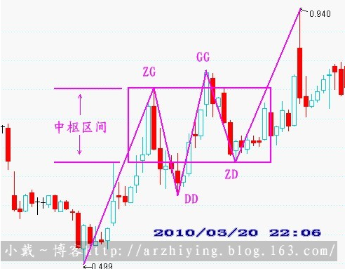

2006-12-19 22:04:51

580991，从上市到10月23日，在日线上构成“下跌”走势，(注：禅师严格中枢定义出现前的下跌定义为510均线湿吻后的低点比前低点低，高点比前高点低，所以580991在日线上为下跌走势）其后是一个未完成的走势类型，暂时只构成一个中枢。

而在30分钟线上，6月2日至10月23日是典型的“下跌盘整下跌”，是三种完成的走势类型的连接，好好把这里面的区别理解，才算有点真明白。

## 教你炒股票17：走势终完美

(2006-12-18 11:52:42)

任何级别的所有走势，都能分解成趋势与盘整两类，而趋势又分为上涨与下跌两类。以上结论，不是从天而降的，而是从无数图形的分析实践中总结出来的，正如《论语》所说“由诲女，知之乎！知之为，知之；不知为，不知；是知也。”（请看本ID相应系列的解释）这个从实际图形中总结出来的简单经验，却是一切有关技术分析理论的唯一坚实基础。这个基础，所有接触技术分析的人都知道，但可惜没有人能深究下去，然后就沉入技术指标、交易系统等苦海不能自拔。试想，基础都没搞清楚，又有什么可立起来？而基础稳固了，技术指标、交易系统等都是小儿科了。

由上可得到“缠中说禅技术分析基本原理一”：任何级别的任何走势类型终要完成。后面一句用更简练的话，就是“走势终完美”。这个原理的重要性在于把实践中总结出来的、很难实用的、静态的“所有级别的走势都能分解成趋势与盘整”，转化成动态的、可以实用的“走势类型终要完成”，这就是论语所说的智慧：“所有级别的走势都能分解成趋势与盘整”是“不患”的，是无位次的，而“走势类型终要完成”的“走势终完美”以“所有级别的走势都能分解成趋势与盘整”的无位次而位次之，而“患”之。

因为在实际操作中，面对是都是鲜活的、当下的，而正如《论语》所说的，“由知、德者，鲜矣！”，必须直面这种当下、鲜活，才能创造。而在任何一个走势的当下，无论前面是盘整还是趋势，都有一个两难的问题：究竟是继续延续还是改变。例如，原来是在一个趋势中，该趋势是否延续还是改变成相反的趋势或盘整，这样的问题在当下的层次上永远是“不患”的，无位次的。任何宣称自己能解决这个两难问题的，就如同在地球上宣称自己不受地球引力影响一样无效，这是任何面对技术图形的人都必须时刻牢记的。但这个两难的“不患“，在“所有级别的走势都能分解成趋势与盘整”的“不患”下，又成了其“患”，就因此可以位次（该问题的理解，可以参考本ID关于《论语》相关章节的解释）。正因为当下的走势是两难的，也就是在不完美到完美的动态过程中，这就构成了其“不患”而位次的基础。“走势终完美”，而走势“不患”地可以分解成趋势与盘整，换言之，“趋势终完美，盘整也终完美”。

“走势终完美”这句话有两个不可分割的方面：任何走势，无论是趋势还是盘整，在图形上最终都要完成。另一方面，一旦某种类型的走势完成以后，就会转化为其他类型的走势，这就是“不患”而有其位次。在技术分析里，不同的位次构成不同的走势类型，各种位次以无位次而位次。而如何在不同位次之间的灵活运动，是实际操作中最困难的部分，也是技术分析最核心的问题之一。

为了深入研究这复杂问题，必须先引入缠中说禅走势中枢的概念：某级别走势类型中，被至少三个连续次级别走势类型所重叠的部分，称为缠中说禅走势中枢。换言之，缠中说禅走势中枢就是至少三个连续次级别走势类型重叠部分所构成。这里有一个递归的问题，就是这次级别不能无限下去，就像有些半吊子哲学胡诌什么“一分为二”，而“分”不是无限的，按照量子力学，物质之分是有极限的，同样，级别之次也不可能无限，在实际之中，对最后不能分解的级别，其缠中说禅走势中枢就不能用“至少三个连续次级别走势类型所重叠”定义，而定义为至少三个该级别单位K线重叠部分。一般来说，对实际操作，都把这最低的不可分解级别设定为1分钟或5分钟线，当然，也可以设定为1秒种线，但这都没有太大区别。

有了上面的定义，就可以在任何一个级别的走势中找到“缠中说禅走势中枢”。有了该中枢，就可以给“盘整”、“趋势”给出一个最精确的定义：

缠中说禅盘整：在任何级别的任何走势中，某完成的走势类型只包含一个缠中说禅走势中枢，就称为该级别的缠中说禅盘整。

缠中说禅趋势：在任何级别的任何走势中，某完成的走势类型至少包含两个以上依次同向的缠中说禅走势中枢，就称为该级别的缠中说禅趋势。该方向向上就称为上涨，向下就称为下跌。

那么，是否可能在某级别存在这样的走势，不包含任何缠中说禅走势中枢？这是不可能的。因为任何图形上的“向上+向下+向上”或“向下+向上+向下”都必然产生某一级别的缠中说禅走势中枢，没有缠中说禅走势中枢的走势图只意味着在整张走势图形上只存在两个可能，就是一次向下后永远向上，或者一次向上后永远向下。要出现这两种情况，该交易品种必然在一定时期交易后永远被取消交易，而这里探讨走势的一般情况，其前提就是该走势可以不断延续下去，不存在永远取消交易的情况，所以，相应有

“缠中说禅技术分析基本原理二”：任何级别任何完成的走势类型，必然包含一个以上的缠中说禅走势中枢。

INCLUDEPICTURE "http://bbs.chzhshch.net/attachment.php?aid=22655&k=9417fefd14963ad9f6c020fc56dc26d9&t=1279855599&noupdate=yes&sid=d6fb8NkjpDT9H6j6r%2F9O34IrfffnnRDL3Cz9vZLp%2BzsmudY" \* MERGEFORMATINET 

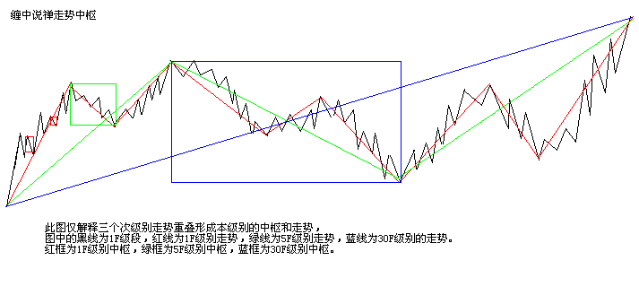

由原理一、二以及缠中说禅走势中枢的定义，就可以严格证明：

“缠中说禅走势分解定理一”：任何级别的任何走势，都可以分解成同级别“盘整”、“下跌”与“上涨”三种走势类型的连接。

“缠中说禅走势分解定理二“：任何级别的任何走势类型，都至少由三段以上次级别走势类型构成。

这些证明都很简单，就和初中几何的证明一样，有兴趣自己来一下。由上面的原理和定理，就可以严格地给出具体操作唯一可以依赖的两个坚实的基础。因为某种类型的走势完成以后就会转化为其他类型的走势，对于下跌的走势来说，一旦完成，只能转化为上涨与盘整，因此，一旦能把握下跌走势转化的关节点买入，就在市场中占据了一个最有利的位置，而这个买点，就是前面反复强调的“第一类买点”；而因为无论是趋势还是盘整在图形上最终都要完成，所以在第一类买点出现后第一次次级别回调制造的低点，是市场中第二有利的位置，为什么？因为上涨和盘整必然要在图形上完成，而上涨和盘整在图形上的要求，是必须包含三个以上的次级别运动，因此后面必须还至少有一个向上的次级别运动，这样的买点是绝对安全的，其安全性由走势的“不患”而保证，这，就是在前面反复强调的第二类买点。买点的情况说了，卖点的情况反之亦然。

综上所述，就不难明白为什么本ID在前面反复强调这两类买卖点了。因为该两类买卖点是被最基础的分析所严格保证的，就如同几何中严格定理一样，只要找准了这两类买卖点，在市场的实际走势中是战无不胜的，是波涛汹涌的市场中最坚实的港湾。关于该两类买卖点与走势及上述原理、定理间密不可破的逻辑关系，必须切实理解体会，这是所有操作中最坚实、最不能混淆的基础。

由上面的原理、定理，就可以继续证明前面已经说过的“缠中说禅买卖点定律一”：任何级别的第二类买卖点都由次级别相应走势的第一类买点构成。

这样，就像前面曾说过的，任何由第一、二类买卖点构成的缠中说禅买卖点，都可以归结到不同级别的第一类买卖点。由此得到“缠中说禅趋势转折定律”：

任何级别的上涨转折都是由某级别的第一类卖点构成的；任何的下跌转折都是由某级别的第一类买点构成的。

注意，这某级别不一定是次级别，因为次级别里可以是第二类买卖点，而且还有这种情况，就是不同级别同时出现第一类买卖点，也就是出现不同级别的同步共振，所以这里只说是某级别。

本ID以上对技术分析的理论构建，绝对前无古人，就像欧几里德之于几何一样。这是为纷繁的技术分析找到了一个坚实的理论基础，由这些原理、定理，可以继续引申出不同的定理，就像几何里面一样。这些定理，都是抛开一切偶然因数的，而实际的操作，必须建立在此之上，才会长期立于不败之地。

这些问题以后还要逐步展开，这里先把两个前面已经让各位思考例子来分析一下，让各位对趋势、级别、走势中枢等概念有一个感性的认识，毕竟上面抽象的方法并不是每个人都能理解的：

驰宏锌锗：为什么从2004年6月2日到2005年7月27日，构成标准的“下跌+盘整+下跌”的走势，而类似的图形在580991上不算，这唯一的原因就是因为后者在日线的下跌中并不构成日线级别的缠中说禅走势中枢，而在30分钟线上，这个中枢是明确的。所以580991只构成30分钟级别上的“下跌+盘整+下跌”。

其后的上涨，对600497驰宏锌锗，2005年7月27日到10月25日，明确地出现在日线上的上涨走势（为什么？因为在日线上明确地看到两个缠中说禅走势中枢）。而580991从2006年10月23日到12月13日，只构成日线上的盘整走势（为什么？因为在日线上明确地看到一个缠中说禅走势中枢）。

两者力度上有如此区别的技术上的原因就是上面两个：一、“下跌+盘整+下跌”走势的出现级别不同，一个是日线，一个是30分钟的。二、其后的第一段走势，一个是日线上涨，一个是日线盘整。

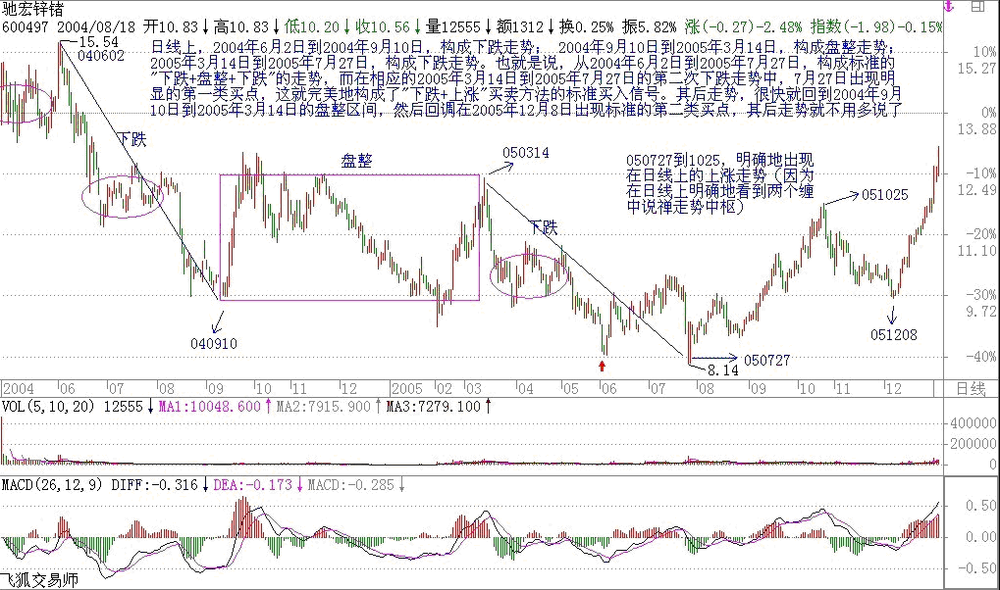

INCLUDEPICTURE "http://static1.photo.sina.com.cn/orignal/4aeb5d15n8cf6bbba9620&690" \* MERGEFORMATINET 

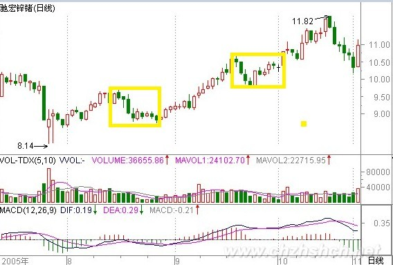

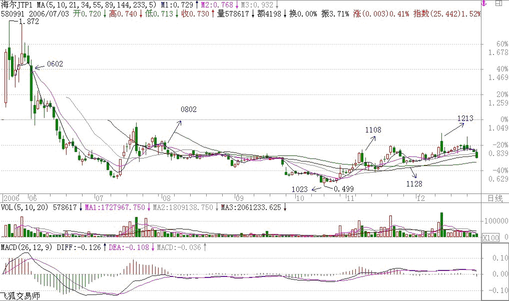

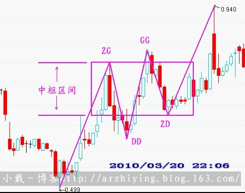

以上内容，足够各位消化几天了。后面还有很多内容，逐一写来。但请注意版权，发现抄袭的本ID要抓来狗头铡给铡了。最后布置几条思考题：

连接两相邻同级别缠中说禅走势中枢的一定是趋势吗？一定是次级别的趋势吗？

2、背驰是两相邻同向趋势间，后者比前者的走势力度减弱所造成的，如果用均线或MACD等判断其力度，一定要在同级别的图上吗？同级别的MACD红绿柱子背驰一定反映某级别趋势间出现背驰吗？是相应级别的趋势出现背驰吗？

3、盘整的高低点是如何造成的。（这个问题有点难度，提示，用缠中说禅走势中枢以及级别等进行分析。）

读后感：

1、“走势终完美”。，“趋势终完美，盘整也终完美”。缠论之核心。

2、“走势终完美”这句话有两个不可分割的方面：任何走势，无论是趋势还是盘整，在图形上最终都要完成。“”另一方面，一旦某种类型的走势完成以后，就会转化为其他类型的走势，这就是“不患”而有其位次。

3、缠中说禅走势中枢的概念：”某级别走势类型中，被至少三个连续次级别走势类型所重叠的部分，称为缠中说禅走势中枢“。

4、“这里有一个递归的问题，就是这次级别不能无限下去”。

5、缠中说禅技术分析基本原理一：任何级别的任何走势类型终要完成。

缠中说禅技术分析基本原理二：任何级别任何完成的走势类型，必然包含一个以上的缠中说禅走势中枢。

6、“缠中说禅走势分解定理一”：任何级别的任何走势，都可以分解成同级别“盘整”、“下跌”与“上涨”三种走势类型的连接。

“缠中说禅走势分解定理二“：任何级别的任何走势类型，都至少由三段以上次级别走势类型构成。

7、“缠中说禅买卖点定律一”：任何级别的第二类买卖点都由次级别相应走势的第一类买点构成。

8、“缠中说禅趋势转折定律”：任何级别的上涨转折都是由某级别的第一类卖点构成的；任何的下跌转折都是由某级别的第一类买点构成的。

9、无语。用任何语句来表达课文中的思想都显得苍白。原文语意深刻、精准无误。

10、2010年8月21日：“实际操作中，面对是都是鲜活的、当下的”。“而在任何一个走势的当下，无论前面是盘整还是趋势，都有一个两难的问题：究竟是继续延续还是改变。例如，原来是在一个趋势中，该趋势是否延续还是改变成相反的趋势或盘整，这样的问题在当下的层次上永远是“不患”的，无位次的。”“正因为当下的走势是两难的，也就是在不完美到完美的动态过程中，这就构成了其“不患”而位次的基础”。走势分解画龙点睛之笔。

2006-12-19－25解盘

缠中说禅：2006-12-19 12:12:29

那几个作业请各位认真思考，一定要多从中枢的概念出发，因为有了中枢的概念，盘整、趋势都没包含其中的，那是比盘整、趋势更基本的概念。

大盘走势没什么特别的，还是沿用以前的老招数，一旦两市走势背离就会出现震荡，而且深圳走势更明确，这些都在以前反复说过的，自己以后都可以继续灵活应用。

还有就是缺口的问题，一旦在下方留下缺口，对短线就有考验，能不补当然是强势的，但考验是必须的。像上海昨天、今天连续出现缺口的走势，出现震荡是理所当然的。

大盘本月目前的走势，基本按前段时间本ID所给建议走，唯一有点不太给面子的是，上海比深圳先创新高。目前是突破后的惯性上攻，这个惯性一旦耗尽，必然有一个回试以前历史高位的确认过程，这构成短线最大的压力。

中长线就不用说了，牛市的第一阶段还没结束，中长线没什么可谈的。至于有人问什么是成分股，本ID真不知道如何回答，本ID不喜欢小孩，不大适合教幼儿园，所以如果有类似的问题，各位请帮个忙。

缠中说禅：2006-12-25 15:37:17

大盘的走势没什么说的，牛市第一阶段，涨成分股，这强调过无数次了，别用自己的想象来想象牛市的顶部。再强调一次，现在只不过是牛市的第一阶段。

缠中说禅：2006-12-18 15:27:52

缠姐, 给举个例讲一下吧,什么样叫重叠??

=

580991从11月8日到11月28日，三个次级趋势构成的日线中枢 。

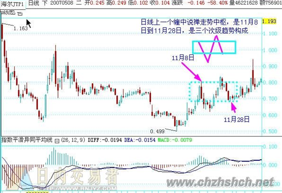

## 教你炒股票18：不被面首的雏男是不完美的。

(2006-12-26 15:05:58)

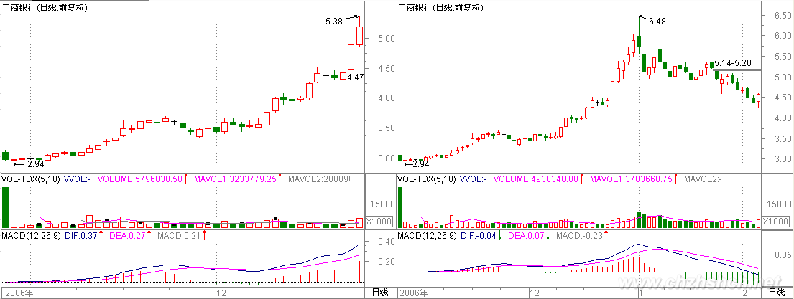

缠中说禅：2006-12-25 15:32:17 上周的作业，明天帖子里回答：

1、连接两相邻同级别缠中说禅走势中枢的一定是趋势吗？一定是次级别的趋势吗？

2、背驰是两相邻同向趋势间，后者比前者的走势力度减弱所造成的，如果用均线或MACD等判断其力度，一定要在同级别的图上吗？同级别的MACD红绿柱子背驰一定反映某级别趋势间出现背驰吗？是相应级别的趋势出现背驰吗？

3、盘整的高低点是如何造成的。（这个问题有点难度，提示，用缠中说禅走势中枢以及级别等进行分析。）

首先把前面一些最基本的概念、原理、定理列举如下：

走势：打开走势图看到的就是走势。走势分不同级别。

走势类型：上涨、下跌、盘整。

趋势：上涨、下跌。

缠中说禅走势中枢：某级别走势类型中，被至少三个连续次级别走势类型所重叠的部分。具体的计算以前三个连续次级别的重叠为准，严格的公式可以这样表示：次级别的连续三个走势类型A、B、C，分别的高、低点是a1\a2，b1\b2，c1\c2。则，中枢的区间就是（max（a2，b2，c2），min（a1，b1，c1））而实际上用目测就可以，不用这么复杂。注意，次级别的前三个走势类型都是完成的才构成该级别的缠中说禅走势中枢，完成的走势类型，在次级别图上是很明显的，根本就不用着再看次级别下面级别的图了。

缠中说禅盘整：在任何级别的任何走势中，某完成的走势类型只包含一个缠中说禅走势中枢，就称为该级别的缠中说禅盘整。

缠中说禅趋势：在任何级别的任何走势中，某完成的走势类型至少包含两个以上依次同向的缠中说禅走势中枢，就称为该级别的缠中说禅趋势。该方向向上就称为上涨，向下就称为下跌。注意，趋势中的缠中说禅走势中枢之间必须绝对不存在重叠。

“缠中说禅技术分析基本原理一”：任何级别的任何走势类型终要完成。

“缠中说禅技术分析基本原理二”：任何级别任何完成的走势类型，必然包含一个以上的缠中说禅走势中枢。

“缠中说禅走势分解定理一”：任何级别的任何走势，都可以分解成同级别“盘整”、“下跌”与“上涨”三种走势类型的连接。

“缠中说禅走势分解定理二“：任何级别的任何走势类型，都至少由三段以上次级别走势类型构成。

原理一“任何级别的任何走势类型终要完成”，这最简单的话，却包含着技术分析最基本的东西，其哲学和灵魂都在此，否则就不可能被列为原理一了，这是最重要的。一个最简单的问题，如何判断一个走势类型完成了？这是技术分析里最核心的问题之一，例如，一旦判断知道了 “下跌”的结束，就知道随后必须要面对的是“盘整”与“上涨”，而后两种走势，对于多头来说，都必然产生利润，唯一区别，就是大小与快慢的问题。如果在市场中能找到一种百分百确定的赢利模式，那就是最伟大的成就了，至于大小、快慢，可以继续研究出新的标准来进行判断，而在逻辑上，这是后话了。

这里最大的也是唯一的难点在于“走势类型的延伸”。例如一个盘整，三个重叠的连续次级别走势类型后，盘整就可以随时完成，也就是说，只要三个重叠的连续次级别走势类型走出来后，盘整随时结束都是完美的，但这可以不结束，可以不断延伸下去，不断围绕这缠中说禅中枢上上下下地延伸下去直到无穷都是可以的。这有点像一个雏男在某种标准达到后就具有立刻成为面首的条件，随时可以被面首，但却也可以一直坚持下去，一直自我封闭，一直不让消费，最后把自己给浪费掉了，直到最后变成一个烂苹果。

同样，面对趋势，形成两个依次同向的缠中说禅走势中枢后，任何趋势都可以随时结束而完美，但也可以不断地延伸下去，形成更多的中枢。这种情况在实际操作中太常见了，如果这趋势是向上的，会不断上涨，看看600519之类的图，如果把复权算上，就可以看到一个标准的不断延伸的上涨。大盘2005年见底后的30分钟图上，同样可以看到这种情况。很多人抓不住牛股，经常在第一个中枢时就被震下马，最主要就是对此没有明确的认识。反之，对于下跌的延伸，是所有抄底者的噩梦。逃顶、抄底为何难？归根结底就是这“走势类型的延伸”闹的。

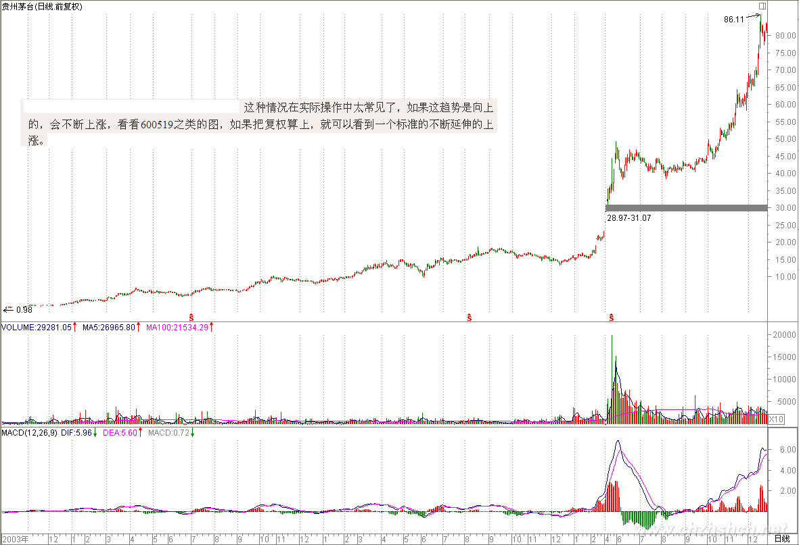

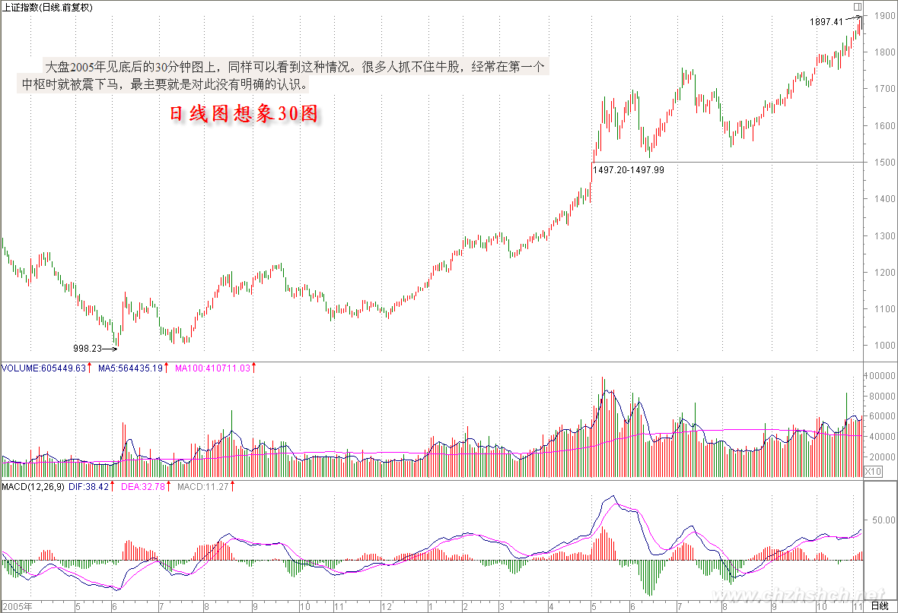

如何判别“走势类型延伸”是否结束？这里，必须首先搞清楚，“走势类型延伸”的实质是什么？对于趋势来说，其“延伸”就在于同级别的同向“缠中说禅走势中枢”不断产生；而对于盘整来说，其“延伸”就在于不能产生新的“缠中说禅走势中枢”。由于“走势类型延伸”意味着当下的“走势类型”随时可以完成，因此相应的“类型”必然是确定的，因此“走势类型延伸”是否结束的判断关键就在于是否产生新的“缠中说禅走势中枢”。此外，由于趋势至少包含两个“缠中说禅走势中枢”，而盘整之有一个，因此趋势与盘整的判别关键也就在于是否产生新的“缠中说禅走势中枢”。由此可见，“缠中说禅走势中枢”的问题是技术分析中的核心问题，该问题一旦解决，很多判断上的大难题也将引刃而解。

“缠中说禅走势中枢定理一”：在趋势中，连接两个同级别“缠中说禅走势中枢”的必然是次级别以下级别的走势类型。

用反证法，该定理的证明是很简单的，而这也回答了上一章中的作业一“连接两相邻同级别缠中说禅走势中枢的一定是趋势吗？一定是次级别的趋势吗？”首先，这不必然是趋势，任何走势类型都可能，最极端的就是跳空缺口后形成新的“缠中说禅走势中枢”；其次，也不一定是次级别的，只要是次级别以下，例如跳空缺口，就属于最低级别，如果图上是日线、周线，就不会是次级别了；最后，往往相连走势类型的级别越低，表示其力度越大，这也就是为什么缺口在分析中有比较强技术含义的理论依据所在。

由定义知道，“缠中说禅走势中枢”的产生原因以及判断标准，也就是其“生”问题已经解决，那余下的就是其“住、坏、灭”的问题。也就是说，一个“缠中说禅走势中枢”是如何“维持”以及最终被“破坏”进而废弃的。先考虑其“维持”的问题。维持“缠中说禅走势中枢”的一个充分必要条件就是任何一个离开该中枢的走势类型都必须是次级别以下的并以次级别以下的走势类型返回，该问题很容易证明，因为无论是离开还是返回，只要是同级别的走势类型，就意味着形成新的“缠中说禅走势中枢”，这与原中枢的维持前提矛盾。该命题表述成如下定理：

“缠中说禅走势中枢定理二”：在盘整中，无论是离开还是返回“缠中说禅走势中枢”的走势类型必然是次级别以下的。

由此，上一章作业三“盘整的高低点是如何造成的”就有了相应的答案：无论离开与返回的走势类型是何种级别的，在站最低级别上看，例如把1分钟图当成最低级别，那么最后连接离开与返回走势类型连接处的最低级别图，只能有两种可能：三根以上1分钟K线的来回重叠震荡后回头；二、1分钟K线无三根以上K线重叠的V型走势。对于第一种情况，这几根重叠K线最极端那根的极端位置，就构成盘整中的高低点，一般来说，这种情况比较少见；对于第二种情况，这个V型尖顶那根K线的极端位置就构成盘整中的高低点，这种情况十分常见。这也是为何真正的低点和高点总是盘中一闪而过的理论依据。本ID的理论能解释技术图表上任何细致的问题，这才是一种真正理论所应该具有的品质。这种的理论，不需要什么诺贝尔的奖励，那一百万美圆在市场上算得了什么？精通这样的理论，市场会给予你多得多的回报。

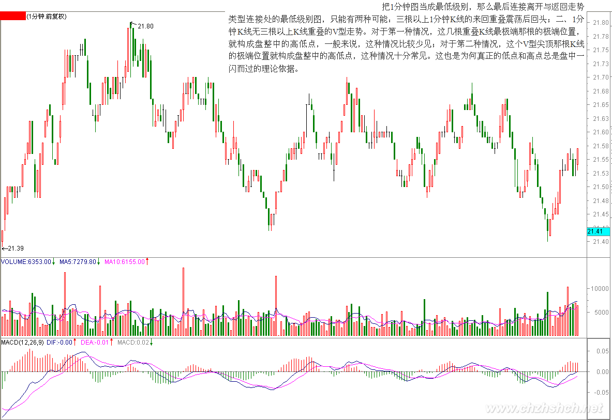

有了上面两个“缠中说禅走势中枢”定理，不难证明定理三：

某级别“缠中说禅走势中枢”的破坏，当且仅当一个次级别走势离开该“缠中说禅走势中枢”后，其后的次级别回抽走势不重新回到该“缠中说禅走势中枢”内。

这定理三中的两个次级别走势的组合只有三种：趋势+盘整，趋势+反趋势，盘整+反趋势。其中的趋势分为上涨与下跌，分别代表从上方突破与下方跌破两种情况。而站在实用的角度，最用力的破坏，就是：趋势+盘整。例如在上涨中，如果一个次级别走势向上突破后以一个盘整走势进行整理回抽，那其后的上涨往往比较有力，特别这种突破是在底部区间。这种情况太常见了，其理论依据就在这里。

读后感：

1、课文有的是对前面提过的概念的复习，也提出了一些新的概念。

2、走势、走势类型、趋势、盘整之定义

3、如何判别“走势类型延伸”是否结束？这里，必须首先搞清楚，“走势类型延伸”的实质是什么？对于趋势来说，其“延伸”就在于同级别的同向“缠中说禅走势中枢”不断产生；而对于盘整来说，其“延伸”就在于不能产生新的“缠中说禅走势中枢”。由于“走势类型延伸”意味着当下的“走势类型”随时可以完成，因此相应的“类型”必然是确定的，因此“走势类型延伸”是否结束的判断关键就在于是否产生新的“缠中说禅走势中枢”。

4、“缠中说禅走势中枢定理一”：在趋势中，连接两个同级别“缠中说禅走势中枢”的必然是次级别以下级别的走势类型。

5、“缠中说禅走势中枢定理二”：在盘整中，无论是离开还是返回“缠中说禅走势中枢”的走势类型必然是次级别以下的。

6、“缠中说禅走势中枢”定理三：某级别“缠中说禅走势中枢”的破坏，当且仅当一个次级别走势离开该“缠中说禅走势中枢”后，其后的次级别回抽走势不重新回到该“缠中说禅走势中枢”内。

7、定理三中的两个次级别走势的组合只有三种：趋势+盘整，趋势+反趋势，盘整+反趋势。最用力的破坏，就是：趋势+盘整。

8、定理三中的两个次级别走势的组合是指以级别递归起始后的扩展中枢而言的。以次级走势类型组成的中枢所对应的则有所不同。

### 2006-12-26解盘

缠中说禅：2006-12-26 15:12:05

大盘现在的走势十分正常，96年那次，发展涨了N倍了，很多股票都没涨，工行现在连一倍都没到，算得了什么？成分股就是牛市第一轮的最重要股票，多次说了，就不要埋怨了。

缠中说禅：2006-12-26 15:09:24

对不起，有一个重要的谈判，要去中关村，必须马上走，有问题请放在这，晚上回来回答。

缠中说禅：2006-12-26 21:28:26

今天回来太晚了，各位好好自己研究一下，别没怎么认真思考就随便发问，这样是学不到东西的。晚安，再见。

## 教你炒股票19：缠中说禅技术分析理论的关键 (2006-12-27 15:18:10)

本ID看了看各位的问题，发现前面说了那么多，似乎真能看明白的没几个。为什么？很简单，估计来这里的人都没受过太严格的数学训练，如果受过严格的数学训练，本ID现在所说的，简直就是最简单不过的东西。这里的整个推导过程，和几何里的毫无区别，初中学过几何的，都应该能明白。所以要看明白，最好先把自己的数学神经先活动起来。有一句不大中听的话，像孔男人之类的文科生，是很难炒什么股票的。别说一般的散户了，就算当庄家，本ID所见过的庄家肯定是全国最多的，有一个很明显的规律，就是文科生当庄家，基本死翘翘。这可不是玩笑话，是直接经验的总结。孔男人之类的文科生最大特点就是脑子缺根筋----数学思维的筋。

其次，请把以前学过的一切技术分析方法先放下，因为本ID这里所说的，和所有曾有的技术分析方法的根本思路都不同。一般的技术分析方法，或者用各种指标，或者用什么胡诌的波段、波浪，甚至江恩、神经网络等等，其前提都是从一些神秘的先验前提出发。例如波浪理论里的推动浪5波，调整浪三波之类的废话，似是而非，实战中毫无用处，特别对于个股来说，更是没用。至于什么江恩理论，还有什么周期理论、神经网络之类的，都是把一些或然的东西当成必然，理论上头头是道，一用起来就错漏百出。那些支持位、阻力位，通道线、第三浪之类的玩意，只能当庄家制造骗线的好工具。

如果真明白了本ID的理论，就会发现，其他技术分析里所说的现象，都能在本ID的理论中得到解释，而且还可以给出其成立的相应界限。例如，一个股票新上市后直接向下5波后反手就向上5波形成V字型，按波浪理论，就无法得到解释，而用缠中说禅走势中枢的定理，这是很容易解决的问题。那些理论都是把复杂的走势给标准化成某种固定的模式，就如同面首宣称不带套的爱不是爱一样可笑。对于庄家来说，对一般人所认识的所谓技术分析理论，早就研究得比谁都精通，任何坐过庄的人都知道，技术图形是用来骗人的，越经典的图形越能骗人。但任何庄家，唯一逃不掉的就是本ID在分析中所说的那些最基本的东西，因为这些东西本质上对于市场是“不患”的，只要是市场中的，必然在其中，庄家也不例外。就像任何的大救星，都逃不掉生老病死。

这里必要强调，技术分析系统在本ID的理论中只是三个独立的系统之一，最基础的是三个独立系统所依据的概率原则所保证的数学上的系统有效性。但技术分析系统之所以重要，就是因为对于一个完全没有消息的散户来说，这是最公平、最容易得到的信息，技术走势是完全公开的，对于任何人来说，都是第一手，最直接的，这里没有任何的秘密、先后可言。技术分析的伟大之处就在于，利用这些最直接、最公开的资料，就可以得到一种可靠的操作依据。单凭对技术分析的精通与资金管理的合理应用，就完全可以长期有效地战胜市场，对于一般的投资者来说，如果你希望切实参与市场之中，这是一个最稳靠的基础。

本ID觉得，如果你光只是想挣点钱，那么没必要学什么技术分析，在牛市里，买基金就可以了，特别是和指数相关的基金，你就至少能跟上指数的涨幅。但市场不单单是为挣钱而存在的，市场是一个最好的修炼自己的地方，人类的贪婪、恐惧、愚蠢，哪里最多？资本市场里，每时每刻都在演绎着。在这个大染缸里修炼自己，这才是市场最大的益处。战胜市场，其实就是战胜自己的贪婪、恐惧、愚蠢，本ID的理论只是把市场拔光给各位看，而拔光一个人并不意味着就等于征服一个人，对于市场，其道理是一样的。不干，不可能征服市场。对于市场来说，干就是一切。技术分析的最终意义不是去预测市场要干什么，而是市场正在干什么，是一种当下的直观。在市场上所有的错误都是离开了这当下的直观，用想象、用情绪来代替。例如现在，还有多少人为工行的上涨而忿忿不平，却不能接受这样一个当下最直观的事实。多次反复强调，牛市第一波涨的就是成分股，工行这最大的成分股不涨，还有谁涨？96年的牛市，最大的成分股就是发展，那时候比这不更厉害多了，工行这又算得了什么？

INCLUDEPICTURE "http://bbs.chzhshch.net/attachment.php?aid=22417&k=d427d1e99350d0696b23111fc575cf8c&t=1279847870&fid=84&noupdate=yes&sid=bc37UJx%2B6h9YBFQMUv9LrFUKqR8r8wNdOT31KmfhkOv1g%2Fs" \* MERGEFORMATINET 

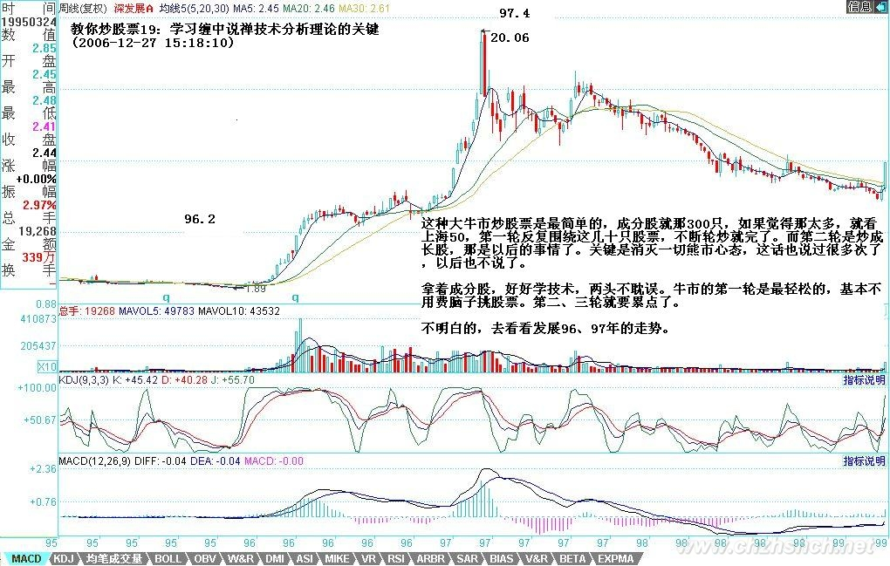

市场是有规律的，但市场的规律并不是显而易见的，是需要严格的分析才能得到。更重要的是，市场的规律是一种动态的，在不同级别合力作用下显示出来的规律，企图用些单纯的指标、波段、波浪、分型、周期等等预测、把握，只可能错陋百出。但只要把这动态的规律在当下的直观中把握好、应用纯熟，踏准市场的节奏，并不是不可能的。最后布置一个作业：在所谓的波浪理论里，有一个所谓的结论，大概意思是说第四浪的调整一般在第三浪的第四子浪范围内，用缠中说禅走势中枢的相关定理分析该结论成立的范围以及局限性，相应给出类似走势的一个更合理的理论分析与实际操作准则。

解盘：

大盘没什么可说的，选股就更没什么可说的，就是成分股，没动的都要动的。这话说了无数遍了，以后不说了。

HYPERLINK "http://blog.sina.com.cn/u/1215172700" \t "_blank" 缠中说禅：2006-12-27 15:29:37

这种大牛市炒股票是最简单的，成分股就那300只，如果觉得那太多，就看上海50，第一轮反复围绕这几十只股票，不断轮炒就完了。而第二轮是炒成长股，那是以后的事情了。关键是消灭一切熊市心态，这话也说过很多次了，以后也不说了。

缠中说禅：2006-12-28 15:45:14

成分股的威力，各位会继续看到的。有人说现在涨的很离谱，本ID怎么一点感觉都没有？比起96年那次，差远了。比起91年甚至93年那次，更差远。年94年8、9月那次的反弹，从指数的速度上也比这次快。没什么可说的，只不过以前的龙头叫发展、长虹。现在换成了工行之类的，一点新意都没有。

本ID已经不想说第一波是成分股这种话了，说得太多，没意思了。如果要和96年比，见4500点前就不该有大的调整。明年、最迟后年怎么都应该见6000点。否则，本ID简直对这次的行情失望之极。

元旦后，以及特别在人寿上市前后出现平台式快速震荡是必要的。这是短线最大的风险，至于中长线，又是一句说过无数次的话，现在才是牛市的第一阶段。

缠中说禅：2007-01-04 15:28:42

LZ今天600832算不算离开了30分钟级别的中枢，而且5分钟一个走势类型的回调没有回到中枢内。我判断的中枢是11.55--10.96

-----------

LZ能不能评判一下对错,好有所领悟

====

这个问题，你必须学了明天的帖子才能真搞清楚，本ID要说清楚，就要把明天的帖子抄出来了。

给你一个思考，请看，该股在5分钟图上，今天早上9点半到10点，就是一个典型的离开中枢进一步形成趋势的走势，相应在10点，有一个的典型的5分钟上的第三类买点。后面5分钟图上的上升就是很自然的，由于这个买点是5分钟，所以可操作的空间不大，如果是T+0当然没问题，所以1分钟、5分钟的图，一般都只能用来每天的对冲操作。真正有隔天操作意义的，至少是30分钟图。

在30分钟图上，并没形成中枢的离开，因为有重叠。站在5分钟图的角度，11。58元是一个关键位置，该位置不能触及，这样就能形成一个5分钟的上涨，进而逐步带出30分钟走势的变化。否则，就要玩盘整转上涨的游戏，这样，至少在5分钟图上又开始盘整，等待下一个突破契机了。

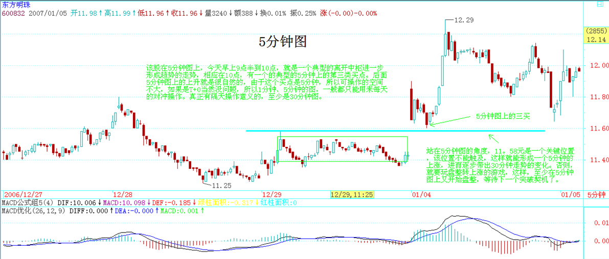

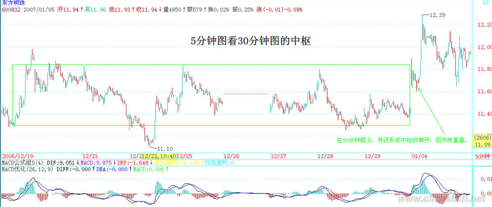

## 教你炒股票20：缠中说禅走势中枢级别扩张及第三类买卖点

(2007-01-05 15:23:22)

前面已经很明确地指出，缠中说禅走势中枢由前三个连续次级别走势类型的重叠部分确定，其后的走势有两种情况：一、该走势中枢的延伸。二、产生新的同级别走势中枢。而在趋势里，同级别的前后缠中说禅走势中枢是不能有任何重叠的，这包括任何围绕走势中枢产生的任何瞬间波动之间的重叠。因此，如果三个连续次级别走势类型的重叠区间虽然不和前面的走势中枢有任何重叠，但围绕该中枢产生的波动触及前面走势中枢延续时的某个瞬间波动区间，这时候，就不能认为该走势类型是趋势，而只是产生一个更大级别的缠中说禅走势中枢。

这里，必须把两种情况严格区分。一、走势中枢及其延伸。这种情况下，所有围绕走势中枢产生的前后两个次级波动都必须至少有一个触及走势中枢的区间。否则，就必然产生一个新的三次连续次级走势类型的重叠部分离开原来的走势中枢，这与走势中枢的延续矛盾。二、一个走势中枢完成前，其波动触及上一个走势中枢或延伸时的某个瞬间波动区间，由此产生更大级别的走势中枢。

一个简单的例子就能区别以上的情况，例如，一个股票开盘立刻封涨停，那么，只能算是一分钟级别上出现了走势中枢的延伸，无论这个延伸有多长时间，都不可能产生更大级别的走势中枢。如果该股票第二天开始继续开盘涨停，那么就形成一个一分钟级别上的趋势，这个趋势可以无限延伸下去，但只要依然只是只形成一分钟的走势中枢，无论能连续涨停多少天，都不足以形成即使是五分钟的走势中枢，除非中途有打开涨停的时候。还有一种特殊的情况，就是所谓的庄股，如果有一个庄家特别有毛病，每天就成交一次，每天的价位都一样，这样也只形成一个一分钟的走势中枢，大级别的中枢都不能形成。

换言之，走势中枢的延伸与不断产生新的走势中枢并相应围绕波动互不重叠而形成趋势，在这两种情况下，一定不可能形成更大级别的走势中枢。而要形成一个更大级别的走势中枢，必然要采取第三种的方式，就是围绕新的同级别走势中枢产生后的波动与围绕前中枢的某个波动区间产生重叠。由此可马上得到一个重要的定理：

缠中说禅走势级别延续定理一：在更大级别缠中说禅走势中枢产生前，该级别走势类型将延续。也就是说，只能是只具有该级别缠中说禅走势中枢的盘整或趋势的延续。

看看去年指数的走势，就知道该定理的重要。很多人总是说，怎么都涨那么多了还涨，明白这个定理，就知道，要这个市场跌，现在这种最多只出现过日线走势中枢的走势，在周线走势中枢出现前，不可能结束。而且，从去年8月份开始的走势，甚至连日线的走势中枢都没形成过，最多就是30分钟的，要结束这种走势，首先要形成日线的中枢。明白这个定理，就不会整天自己吓自己。这里由定理一很简单就能证明一个更重要的定理对走势改变给一个更精确、预先的界定：

缠中说禅走势级别延续定理二：更大级别缠中说禅走势中枢产生，当且仅当围绕连续两个同级别缠中说禅走势中枢产生的波动区间产生重叠。

这里来一个比喻就好理解了，缠中说禅走势中枢就如同恒星，和围绕该恒星转动的行星构成一个恒星系统。而两个同级别恒星系统要构成一个更大级别的系统，首先必然要至少是其中的外围行星之间发生关系，这就是定理二说的东西。

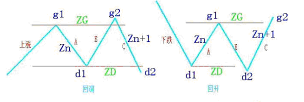

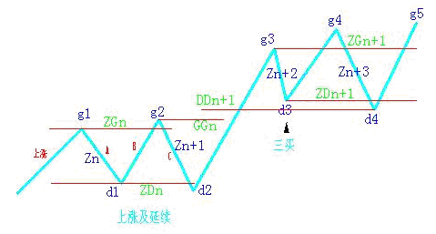

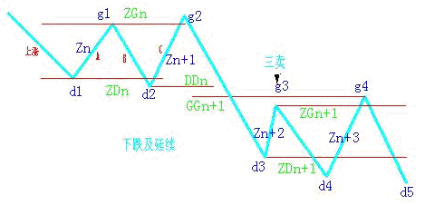

有了上面的定理，就可以很精确地讨论走势中枢的问题了：根据走势中枢的数学表达式：A、B、C，分别的高、低点是a1\a2，b1\b2，c1\c2，则中枢的区间就是[max（a2，b2，c2），min（a1，b1，c1）]。而中枢的形成无非两种，一种是回升形成的，一种是回调形成的。对于第一种有a1=b1，b2=c2；对第二种有a2=b2，b1=c1。但无论是哪种情况，中枢的公式都可以简化为[max（a2，c2），min（a1，c1）]。显然，A、C段，其方向与中枢形成的方向是一致的，由此可见，在中枢的形成与延伸中，由与中枢形成方向一致的次级别走势类型的区间重叠确定。例如，回升形成的中枢，由向上的次级别走势类型的区间重叠确定，反之依然。为方便起见，以后都把这些与中枢方向一致的次级别走势类型称为Z走势段，按中枢中的时间顺序，分别记为Zn等，而相应的高、低点分别记为gn、dn，定义四个指标，GG=max(gn)，G=min(gn)，D=max(dn)，DD=min(dn)，n遍历中枢中所有Zn。特别地，再定义ZG= min(g1、g2)，ZD=max(d1、d2)，显然，[ZD，ZG]就是缠中说禅走势中枢的区间，由此有了如下定理：

缠中说禅走势中枢中心定理一：走势中枢的延伸等价于任意区间[dn，gn]与[ZD，ZG]有重叠。换言之，若有Zn，使得dn>ZG或gn<ZD，则必然产生高级别的走势中枢或趋势及延续。

缠中说禅走势中枢中心定理二：前后同级别的两个缠中说禅走势中枢，后GG〈前DD等价于下跌及其延续；后DD〉前GG等价于上涨及其延续。后ZG<前ZD且后GG〉=前DD，或后ZD〉前ZG且后DD=<前GG，则等价于形成高级别的走势中枢。

INCLUDEPICTURE "http://static8.photo.sina.com.cn/orignal/4aeb5d15n8cb8f3fc99c7&690" \* MERGEFORMATINET 

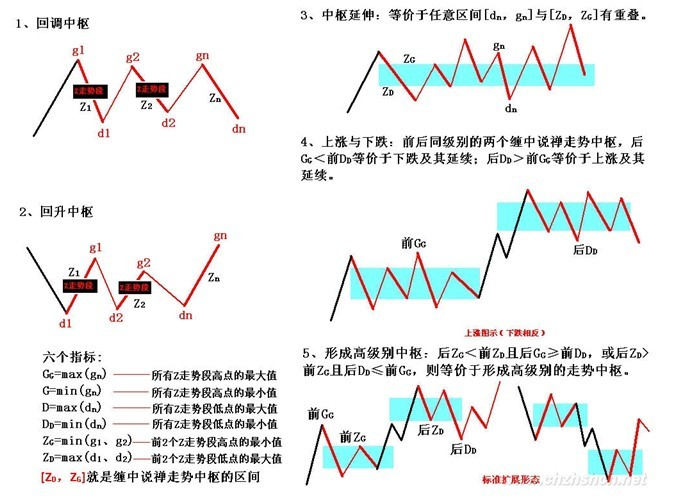

INCLUDEPICTURE "http://static8.photo.sina.com.cn/orignal/4aeb5d15n8cb8f6234037&690" \* MERGEFORMATINET 

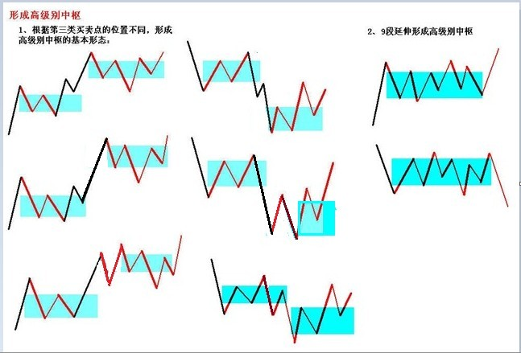

由定理一，可以得到第三类买卖点定理：一个次级别走势类型向上离开缠中说禅走势中枢，然后以一个次级别走势类型回试，其低点不跌破ZG，则构成第三类买点；一个次级别走势类型向下离开缠中说禅走势中枢，然后以一个次级别走势类型回抽，其高点不升破ZD，则构成第三类卖点。

例如，工商银行在12月14日构成典型的日线级别第三类买点；北辰实业在11月14日构成典型的日线级别第三类买点；000803在1月20日构成典型的日线级别第三类卖点。

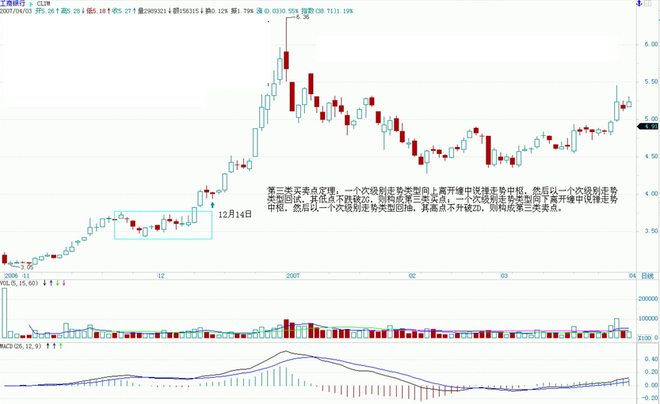

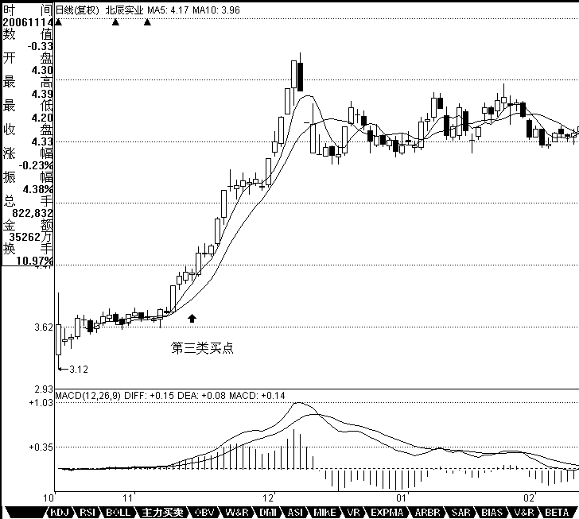

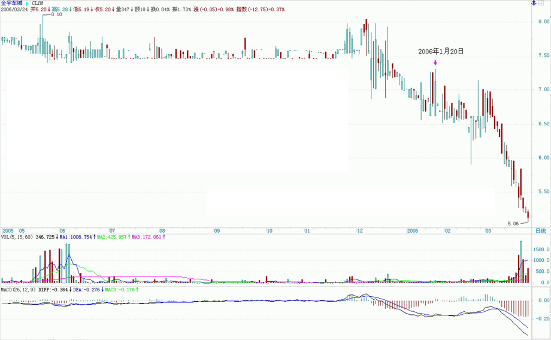

注意，第三类买卖点比第一、二类要后知后觉，但如果抓得好，往往不用浪费盘整的时间，比较适合短线技术较好的资金，但一定要注意，并不是任何回调回抽都是第三类买卖点，必须是第一次。而且，第三类买卖点后，并不必然是趋势，也有进入更大级别盘整的可能，但这种买卖之所以必然赢利，就是因为即使是盘整，也会有高点出现。操作策略很简单，一旦不能出现趋势，一定要在盘整的高点出掉，这和第一、二类买点的策略是一样的。

思考题一：第三类买卖点有可能和同级别的第二类买卖点重合吗？

思考题二：工商银行在12月22日构成日线级别第三类买点吗？

读后感：

1、本课理解的一些附图：

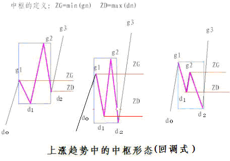

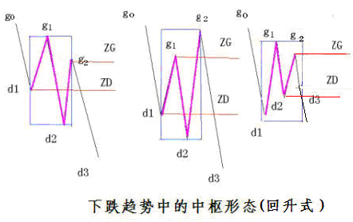

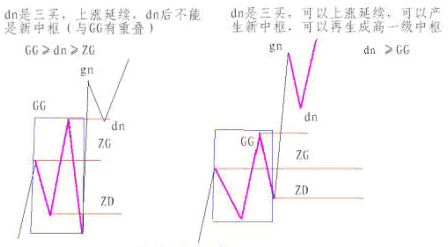

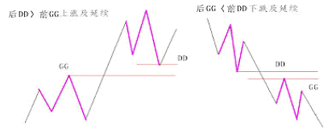

2 HYPERLINK "http://photo.blog.sina.com.cn/showpic.html" \l "blogid=6223e8fb0100gu4i&url=http://static16.photo.sina.com.cn/orignal/6223e8fbt79795b26d0df&690" \t "_blank"  HYPERLINK "http://photo.blog.sina.com.cn/showpic.html" \l "blogid=6223e8fb0100gu4i&url=http://static7.photo.sina.com.cn/orignal/6223e8fbt79795bdfc466&690" \t "_blank"  HYPERLINK "http://photo.blog.sina.com.cn/showpic.html" \l "blogid=6223e8fb0100gu4i&url=http://static8.photo.sina.com.cn/orignal/6223e8fbt79795c8fcd77&690" \t "_blank"  HYPERLINK "http://photo.blog.sina.com.cn/showpic.html" \l "blogid=6223e8fb0100gu4i&url=http://static3.photo.sina.com.cn/orignal/6223e8fbt728c22ec40d2&690" \t "_blank" 、“该走势中枢的延伸”与“产生新的同级别走势中枢”的区别。

3、“走势中枢以及其延伸”与“一个走势中枢完成前，其波动触及上一个走势中枢或延伸时的某个瞬间波动区间，由此产生更大级别的走势中枢”的区别。

4、缠中说禅走势级别延续定理一：在更大级别缠中说禅走势中枢产生前，该级别走势类型将延续。也就是说，只能是只具有该级别缠中说禅走势中枢的盘整或趋势的延续。

5、缠中说禅走势级别延续定理二：更大级别缠中说禅走势中枢产生，当且仅当围绕连续两个同级别缠中说禅走势中枢产生的波动区间产生重叠。

6、缠中说禅走势中枢中心定理一：走势中枢的延伸等价于任意区间[dn，gn]与[ZD，ZG]有重叠。换言之，若有Zn，使得dn>ZG或gn<ZD，则必然产生高级别的走势中枢或趋势及延续。

7、缠中说禅走势中枢中心定理二：前后同级别的两个缠中说禅走势中枢，后GG〈前DD等价于下跌及其延续；后DD〉前GG等价于上涨及其延续。后ZG<前ZD且后GG〉=前DD，或后ZD〉前ZG且后DD=<前GG，则等价于形成高级别的走势中枢。

8、第三类买卖点定理：一个次级别走势类型向上离开缠中说禅走势中枢，然后以一个次级别走势类型回试，其低点不跌破ZG，则构成第三类买点；一个次级别走势类型向下离开缠中说禅走势中枢，然后以一个次级别走势类型回抽，其高点不升破ZD，则构成第三类卖点。

9、

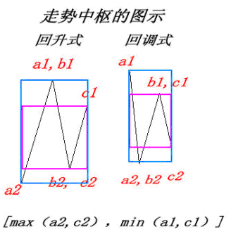

### 2007-01-05解盘

缠中说禅：2007-01-05 15:30:38

这新浪是不是人太多了，上来都困难。发了好几次都不行。

大盘今天走势十分良好，典型的补涨走势。关键还是成分股，成分股也分一线、二线、三线的。现在一线的银行股等休息，二线就启动，十分正常，把握这节奏，就能玩多了轮，资金利用率也高了。

缠中说禅：2007-01-05 17:25:31

请问缠姐，“工商银行在12月14日构成典型的日线级别第三类买点”；是不是说工商银行在30分钟线上12.12,10:00-12.15,10:00形成了一个中枢，再根据“由定理一，可以得到第三类买卖点定理：一个次级别走势类型向上离开缠中说禅走势中枢，然后以一个次级别走势类型回试，其低点不跌破ZG，则构成第三类买点；一个次级别走势类型向下离开缠中说禅走势中枢，然后以一个次级别走势类型回抽，其低点不升破ZD，则构成第三类卖点。”12.14号如果是第三类买点的话，在30分钟线这天应该是离开中枢后的一个回试，我怎么看不出来啊。并没有离开中枢阿。请缠姐指教。

====

临走回答你，搞清楚，是看哪个级别的。

对日线中枢来说，次级别是30分钟，而次级别的完成，需要再次级别，也就是5分钟图上呈现3段走势类型。这在工行14那天有着完美的表现。那天14。40左右刚好完成这三段5分钟的走势类型，你可以精确地找到4。2元的买点。请把这三层次的级别关系搞清楚。再见。

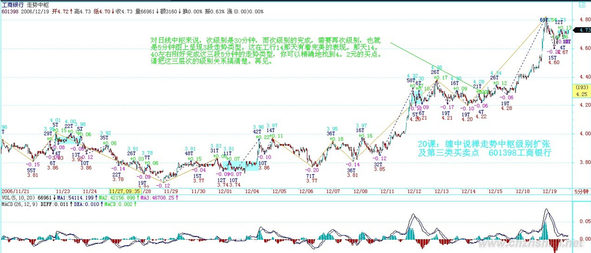

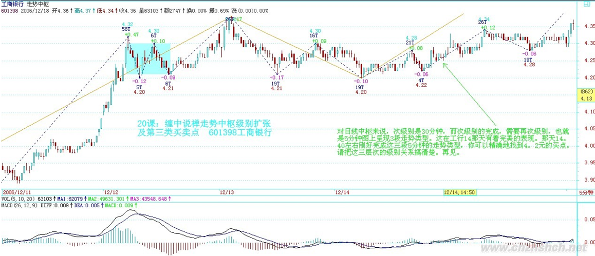

PAGE

PAGE  81

本文由公众号 “三思复盘”  整理

如何判断“背驰”？首先定义一个概念，称为缠中说禅趋势力度：前一“吻”的结束与后一“吻”开始由短线均线与长期均线相交所形成的面积。在前后两个同向趋势中，当缠中说禅趋势力度比上一次缠中说禅趋势力度要弱，就形成“背驰”。按这个定义，是最稳妥的办法，但唯一的缺点是必须等再次接吻后才能判断，这时候，走势离真正的转折点会已经有一点距离了。如何解决这个问题：第一种方法，看低一级别的图，从中按该种办法找出相应的转折点。这样和真正的低点基本没有太大的距离。
