## 教你炒股票31：资金管理的最稳固基础

对于小资金来说，资金管理不算一个特别大的问题，但随着赢利的积累，资金越来越大，资金管理就成了最重要的事情。一般来说，只要有好的技术，从万元级到千万元级，都不是什么难事情。但从千万以后，就很少人能稳定地增长上去了。所有的短线客，在资金发展到一定程度后，就进入滞涨状态，一旦进入大级别的调整，然后就打回原形，这种事情见得太多了。因此，在最开始就养成好的资金管理习惯，是极为重要的。投资，是一生的游戏，被打回原形是很可悲的事情，好的资金管理，才能保证资金积累的长期稳定，在某种程度上，这比任何的技术都重要，而且是越来越重要。对于大资金来说，最后比拼的，其实就是资金管理的水平。

资金，必须长期无压力。有人借钱投资，然后赢利后还继续加码，结果都是一场游戏一场梦。96年，本ID认识一东北朋友，大概是不到10万元开始，当时，可以高比例透资，1比2、3很普通，1比10也经常见，当时的疯狂，不是现在的人能想象的。在96年的牛市中，他很快就从不到10万变成2千多万，当时，透资的比例也降下来，大概就1比1多点，如果当时把所有透资还了，就没有后来的悲剧了。对于他来说，96年最后三周一定是最悲惨的，股票从12元在三周内急跌到6元以下，有人可能要问，那他为什么不先平仓？老人都知道，那次下跌是突然转折，瀑布一样下来的，如果没有走，根本没有走的机会，最后能走的时候，由于快触及平仓点，他的仓位在6元多往下一直平下去，根本没有拒绝的可能，证券部要收钱，最后，还了透资，只剩下不到20万，真是一场游戏一场梦，又回到原点。但这还不是最戏剧性的，最悲惨的是，这股票从他平完仓的当天开始到97年5月，不到5个月的时间，一直涨到30元以上，成了最大的黑马，这股票是深圳本地股，后来从30多元反复下跌，05年到了3元以下，目前价位在他被开始平仓的位置，6元多点。

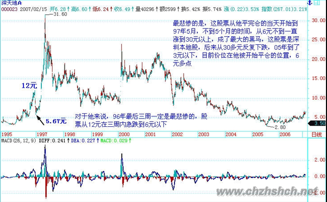

自己的资金，一定不能交给别人管理。一个无压力的资金，是投资的第一要点，虽然前面反复说过，但说完上面的例子，还是要再次强调。另外一个重要的，就是自己的资金，一定不能交给别人管理，自己的盘子，一定要自己负责，不能把自己的命运交给别人。又是一个故事，时间要提早4、5年，92年的事情了。这朋友，92年已经有几千万的资金，在当时也算可以了。结果，因为家里有事处理，把盘子交给一个朋友管理，那人还是后来特别出名的人，说出来，市场里的老人都知道，当时大盘从1400多点回跌，已经跌了很多，以为到底部了，结果这家伙自作主张透资抄底，大盘却一直下跌，等这朋友过了两、三周回来，一切早已灰飞湮灭。那次大盘一直跌破400点才到底部，半年内一共下跌了1000多点，后来从400点以下不到4个月又创出1558点的历史高位，市场就是这么残酷，把命运交给别人，就是这样了。

不能把自己放置在一个危险的境地，所谓背水一战、置之死地而后生，都不是资本市场应该采取的态度。这样的态度，可能一时成功，但最终必然失败。技术分析的最重要意义在于，让你知道市场究竟在干什么，市场在什么位置该干什么，让你知道，一个建立的仓位，如何持有，如何把一个小级别的持有逐步转化为大级别的持有，又如何退出，这一切，最终都是为资金管理服务的，投资最终的目的不是股票本身，而是资金，没收回资金，一切都没意义。股票都是废纸，对资金的任何疏忽，都会造成不可挽回的损失。任何人，必须明确的是，多大的资金，在市场中都不算什么，而且，资金是按比例损失的，一万亿和一万元，按比例损失，变成0的速度是一样的。无论多大的资金，要被消灭，可以在举手之间，因此，永远保持最大的警觉，这是资金管理最大的、最重要的一点，没有这一点，一切管理都是无用的。

一个最简单又最有效的管理，就是当成本为0以前，要把成本变为0；当成本变成0以后，就要挣股票，直到股票见到历史性大顶，也就是至少出现月线以上的卖点。一些最坏的习惯，就是股票不断上涨，就不断加仓，这样一定会出问题。买股票，宁愿不断跌不断买，也绝对不往上加码。投入资金买一只股票，必须有仔细、充分的准备，这如同军队打仗，不准备好怎么可能赢？在基本面、技术面等方面都研究好了，介入就要坚决，一次性买入。如果你连一次性买入的信心都没有，证明你根本没准备好，那就一股都不要买。买入以后，如果你技术过关，马上上涨是很正常的，但如果没这水平，下跌了，除非证明你买入的理由没有了，技术上出现严重的形态，否则都不能抛一股，而且可以用部分机动的资金去弄点短差（注意，针对每只买入的股票，都要留部分机动的资金，例如1/10），让成本降下来，但每次短差，一定不能增加股票的数量，这样，成本才可能真的降下来，有些人喜欢越买越多，其实不是什么好习惯。这股票该买多少，该占总体资金多少，一开始就应该研究好，投入以后就不能再增加。

股票开始上涨后，一定要找机会把股票的成本变成0，除了途中利用小级别不断弄短差外，还要在股票达到1倍升幅附近找一个大级别的卖点出掉部分，把成本降为0。这样，原来投入的资金就全部收回来了。有人可能要说，如果那股票以后还要上涨10倍呢？这没问题，当股票成本为0以后，就要开始挣股票。也就是利用每一个短差，上面抛了以后，都全部回补，这样股票就越来越多，而成本还是0。这样，这股票就算再上涨100倍，越涨你的股票越来越多，而成本永远为0，这是最可怕的吸血，庄家、基金无论如何洗盘，都使得你的股票越来越多，而你的成本却是0，然后，等待一个超大级别的卖点，一次性把他砸死，把那庄家、基金给毁了。想想，成本为0的股票，在历史大顶上砸起来是最爽的。

这就是资金管理中针对每只股票的最大原则，按照这原则，你不仅可以得到最安全的操作，而且可以赢得最大的利润。特别挣股票的阶段，一般一个股票，盘整的时间都占一半以上，如果一个股票在上涨后出现大型盘整，只要超大级别卖点没出现，这个盘整会让你的股票不仅把抛掉的全挣回来，而且比底部的数量还要多，甚至多很多。一旦股票再次启动，你就拥有比底部还多的但成本为0的股票，这才是最大的黑马，也是最大的利器。一个合理的持仓结构，就是拥有的0成本股票越来越多，一直游戏到大级别上涨结束以后，例如这轮大牛市，直到牛市结束前，才把所有股票全部清仓。而资金，就可以不断增加参与的股票种类，把这程序不断下去，这样，操作资金不会增加，特别对大资金，不会经常被搞到去当庄家或钱太多买了没人敢进来，这样就不会增加操作的难度，但股票种类越来越多，但成本都是0。这样，才会有一个最稳固的资金管理基础。

(2007-02-15 15:16:12)

### 2007-02-15解盘

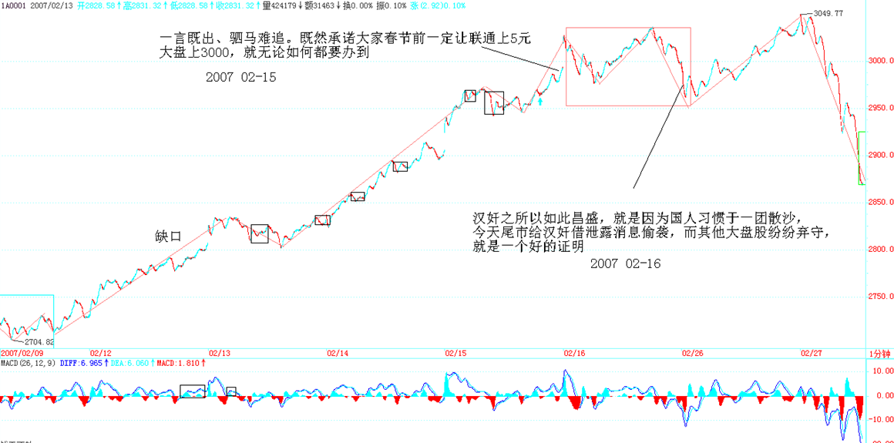

一言既出、驷马难追。既然承诺大家春节前一定让联通上5元，大盘上3000，就无论如何都要办到。当然，这不是本ID一个人能办到的，但在北京，又有什么不能办到的？中国的中心是北京，北京人最讨厌汉奸，汉奸既然在3000点之前捣乱，就要让红旗放上3000点过年，中国的世纪，哪里有汉奸说话的地方？血战，快意恩仇，就这么简单了。该看到的大家都看到的，不能看到的也没必要说了。对于本ID曾说过的10多只股票，除了一些前期涨幅过大的，都创出新高了，当然，有些涨得快点，有些慢的，但中线肯定都没问题。

不过，本ID在这里公布说阻击的目标，确实让本ID操作上增加很大难度，这里汉奸的眼线肯定不少了，现在本ID说的股票，本ID不动好象就没人动了，这样不好，本ID又不是庄家，这样搞下去没意思了。所以，里面的庄家也别太偷懒，虽然你们肯定是本ID的后辈，但你们的年龄估计都比本ID大，尊敬长辈也没有这样的，自己看着办吧。

以市场老人的口吻教训一些这些懒人，市场是需要口碑的，吃点小亏，立个金字牌子，有什么不好的。举一个本ID在N年前干过的最小的事情，把一只股票从14元，两周多点阻击上25元全出掉，时间也是春节前后，一分钱没花，靠的是什么？自己去想想吧。

明天，汉奸还有可能发难，所以，大家还需要努力。

### 2007-02-16解盘

放假公告 过年好 24日重新开博 汉奸之所以如此昌盛，就是因为国人习惯于一团散沙，今天尾市给汉奸借泄露消息偷袭，而其他大盘股纷纷弃守，就是一个好的证明，但联通已经干了他该干的事情，没有丢人。除了本周的联通，本ID以前说过的14只股票，除了2只，全部今天都见到过本轮行情的新高，而那没见新高的两只，都和一个有着汉奸名字的基金有关，本ID不待见他们。前面说过，就算突破3000点，震荡还是必须的，这场多空的绞杀战，依然要继续。

放假了，少谈股票，多谈面首。先和各位拜年了，在炮竹声中，听听自己在哪里？

回复

今天看见女王在联通博杀，和大盘多方的共同努力，说声，你们辛苦了！感谢你们让我们能过个开心年！拜你们所赐，我的几个股票也都启动了（我只买了女王的紫光股份，其他的都是我自己选的股票）。

对于紫光股份，我强烈抗议这个懒庄，真是动一天，歇一周，非典型性老年痴呆症，本来还有更难听的，我实在不好意思再骂您啦。希望您利用好节前的最后一个机会，创立一个金字招牌吧！等了年还有一段时间可以上冲，别等着大家都看跌的时候，你才出来，让人人喊打！

另外一个问题，今天大盘的跳空缺口会以什么用方式补上呢？

==

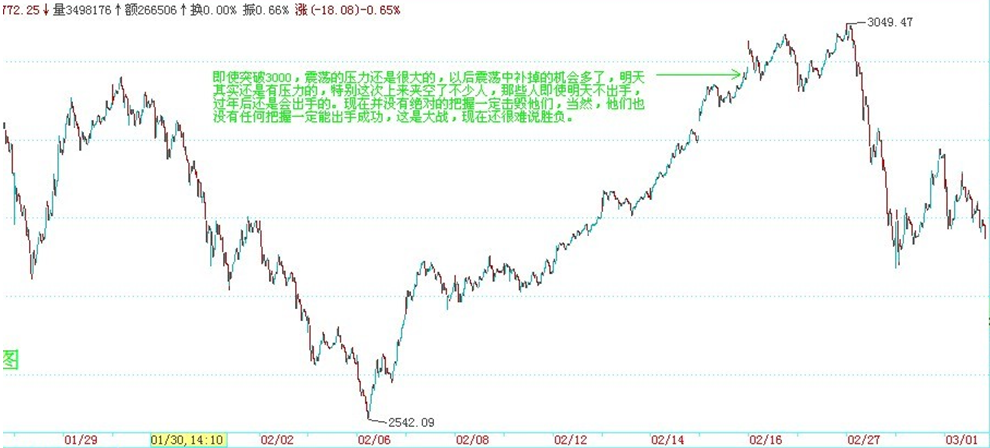

即使突破3000，震荡的压力还是很大的，以后震荡中补掉的机会多了，明天其实还是有压力的，特别这次上来夹空了不少人，那些人即使明天不出手，过年后还是会出手的。现在并没有绝对的把握一定击毁他们，当然，他们也没有任何把握一定能出手成功，这是大战，现在还很难说胜负。

缠中说禅：2007-02-15 16:44:42

各位注意，这才是正确的

――――

不好意思，再问一个关于找中枢有个问题：

妹妹说要看图上有明显的高低点，举个例子：今天大盘1分钟图上，从11：10到14：08这一段中间，应该怎么看高低点呢？

是11：10上升到11：15下跌到13：00，再上升到13：26下跌到13：36上升到14：08；

还是11：10上升到13：26下跌到13：36，再上升到14：08？

==

1048到1129，一个明显的上升中调整形成的中枢，三段很明显的，后面是该中枢的延伸。1413是第三类买点，确认中枢的完结。

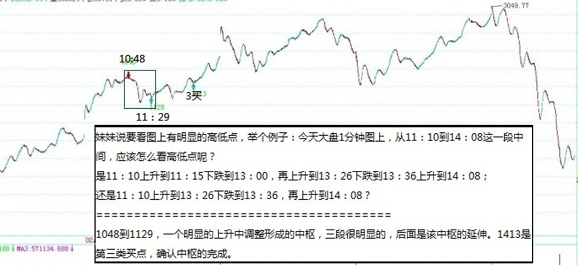

上次说的大盘2980开始的5分钟下跌

第一个中枢为什么不是从1301035开始的，而是从1301055开始算起的呢？

1301055至1301310是不是这个中枢的前三段，之后是中枢的延伸？

==

35那个是前面走势类型的中枢，同一个走势类型的中枢，和下跌+盘整里盘整的中枢，要搞清楚区别。

一般标记中枢，都说前三段，后面的延伸，可说可不说，关键你知道是延伸就行，否则每个中枢都说那么仔细，这文章就没法写，太长了。

==

1301055当时的价位不是低点啊.1120有新低.它属于下跌过程中的一点啊.按定义是否要从1120算起呢?学生迷惑中....

==

B段低点不能跌破A段的？中枢的定义里可没有这个要求。请把29课的第二种情况：该级别更大级别的盘整、好好看看。

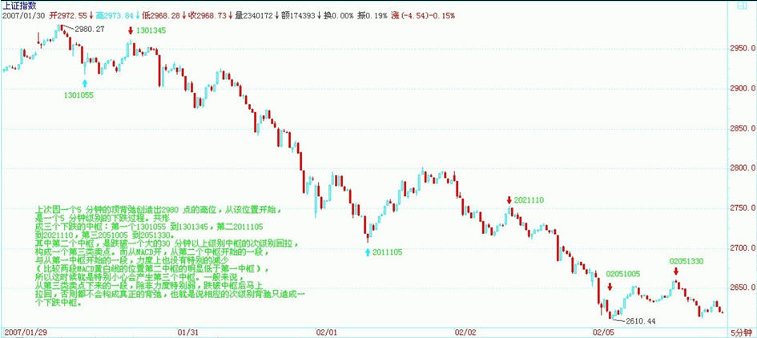

### 2007-02-27解盘

大盘调整的必然性，在周线中枢必须有第三段，这叫走势必完美了。所以震荡是不可避免的，就算大盘站稳3000，也就是进入日线的背弛段。今天一个短线背弛引发的单边下跌，没什么可奇怪的，都是计划之中。（注:2007年2月6日有日中枢的划分，后面走势走出来后，中枢后移，保留前趋势。)

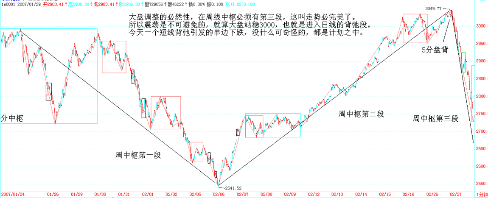

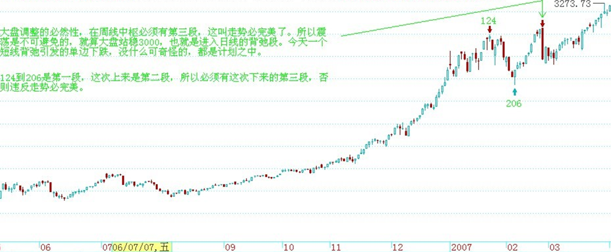

本ID的理论永远都是按图办事，没有死多、死空这些无聊玩意。这次下跌，在中午形成第一个1分钟的中枢，明天只要开盘不马上回到2869之上，那必然要有第二个，然后再进入背弛段，所以，按图操作，走了的，就要继续按图，把该买的买回来。本ID的理论的有效性，通过每一次的震荡，都会无情地告诉你。

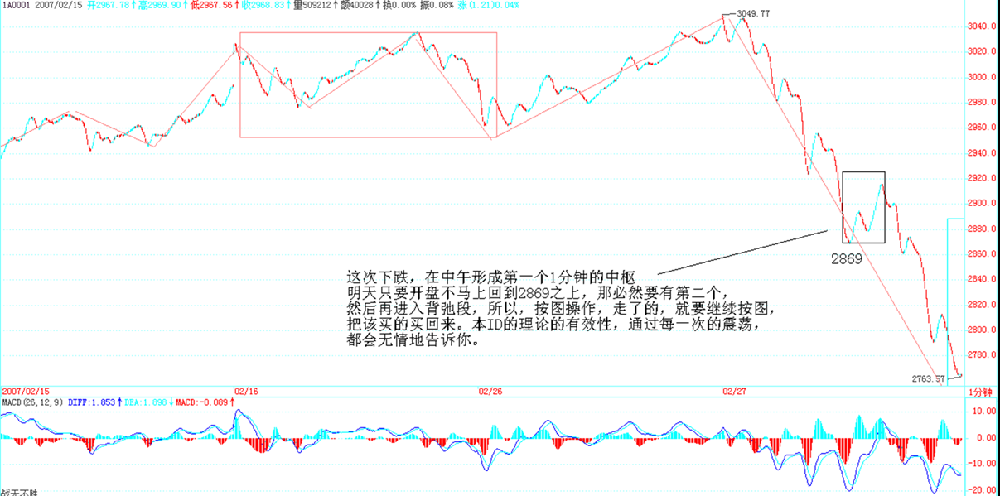

楼主好！今天过得不容易啊，本来留了一半的清醒想高位出掉手中的货的，可一时犹豫下下午又进了，郁闷ING！另外，请问楼主是否真有市场传闻的重大利空啊？

==

第一个中枢才刚出现，回补什么？按图操作，利空是无意义的。 (前期的1分中枢，为递归后的笔中枢）

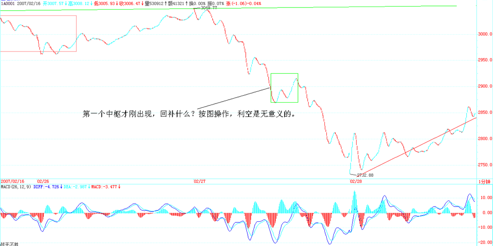

## 教你炒股票32：走势的当下与投资者的思维方式

所有非汉奸、非奸细的各位请注意了，这里奸细少不了，如果你把这里当成一个纯粹的课堂，那就太小看这里了。但，有一点是无疑的，就是一旦你掌握本ID的理论，你根本无须听任何话，无论谁的话，任何话都是废话，走势永远第一。牛顿不能违反万有引力，本ID也不能违反本ID的理论，这才是最关键的地方。而只有这样，才有可能有一个正确的思维基础。你无须尊重本ID，甚至，你学会本ID的理论，还可以专门和本ID作对，企图在市场上挣本ID的钱，但你必须尊重本ID的理论，就像你必须尊重万有引力一样，否则市场的走势每分每秒都会给你足够的教训。

牛市是快跌慢涨、熊市是快涨慢跌。投资者最大的毛病，就是只有一种思维方式，把自己的喜好当成了市场的现实。按这种逻辑，做多的就永远要做多，做空的就永远要做空，那不有毛病吗？好象这次，春节前的走势，为什么要做多，因为技术上有形成中枢第二段的要求，这就是做多的客观条件，而当第二段出现背弛，就意味着做多的客观条件没有了，继续硬撑着不是有毛病吗？牛市是快跌慢涨、熊市是快涨慢跌，这最基本的节奏不应该不知道。

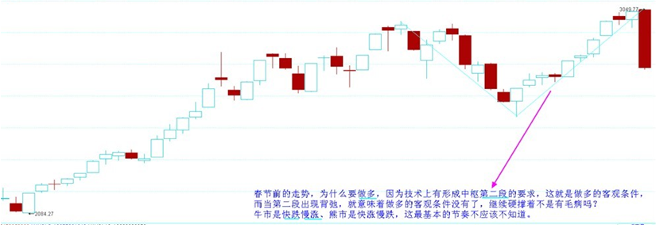

有一种更坏的毛病就是涨了才高兴，一跌就哭着脸。请问，光做多，怎么把成本降为0？股票都是废纸，光涨光做多，永远顶着一个雷。在前面的文章已经多次强调，只有0成本的股票才是真正安全的。如果死多死空思维不改变，永远都是股票的奴隶。而且，跌完以后涨得最快的是什么？就是跌出第三类买点来的股票，看看000416上次的那一跌，一个完美的第三类买点，后面是一个月100%幅度的上涨，中间还带了一周的假期。大跌，就把眼睛放大，去找会形成第三类买点的股票，这才是股票操作真正的节奏与思维。本ID的理论里没有风险的概念，风险是一个不可操作的上帝式概念，本ID的眼里只有买点、卖点，只有背驰与否，这些都是有严格定义的、可操作的，这才是让股票当你奴隶的唯一途径。

如果你，严格按买点买、卖点卖，那你就是股票的主人。有人可能要反问本ID，你不是说中国的地盘中国人做主吗？请问，难道中国人做主，就只能做多的主，不能做空的主？这还算什么主？如果你把握了本ID的理论，严格按买点买、卖点卖，那你就是股票的主人。所谓汉奸，不过是希望通过他们的伎俩来把中国的血给吸走，而如果你有本事让汉奸低卖高买，那汉奸就死定了。就像这次，去问问联通上谁吃了哑巴亏。前面本ID说过，N年前干过一个阻击，从14元一直阻击上25全出掉，也是春节前后的，算起来就10来个交易日，一分钱没花，为什么？就是把某些人的节奏给搞乱了，大家应该记得赵本山和范伟拍卖那场对话，有点类似。具体怎么样，以后和大家说如何阻击的时候再说。不过可以告诉大家最终的结果，那股票最终跌回3元多。

股票，如同跳舞，关键是节奏，节奏一错，就没法弄了。买点买、卖点卖，就是一个最合拍的节奏，任何不符合这个节奏的，都要出乱子。例如，你是按30分钟级别操作的，明明顶背驰了，你不卖，一定要想着还要高，然后底背驰的时候忍不住了，杀出去，这样下来，你很快就不用玩股票了，因为股票很快就玩死你。走势有其节奏，你操作股票，如同和股票跳舞，你必须跳到心灵相通，也就是前面说的，和那合力一致，这样才是顺势而为，才是出色的舞者。如果不明白的，今天去跳一下舞，找一个舞伴，把他的节奏当成股票的节奏，感应一下。

感应，是当下的，如果当下你还想着前后，那你一定跳不好舞。股票也一样，永远只有当下的走势状态，股票的走势，没有一个必然的、上帝式的意义，所有的意义都是当下赋予的。例如，一个30分钟的a+A+b+B+c的向上走势，你不可能在A走出来后就说一定有B，这样等于是在预测，等于假设一种神秘的力量在确保B的必然存在，而这是不可能的。那么，怎么知道b段里走还是不走？这很简单，这不需要预测，因为b段是否走，不是由你的喜好决定的，而是由b段当下的走势决定的。如果b段和a段相比，出现明显的背驰，那就意味着要走，否则，就不走。而参考b段的5分钟以及1分钟图，你会明确地感觉到这b段是如何生长出来的，这就构成一个当下的结构，只要这个当下的结构没有出现任何符合区间套背驰条件的走势，那么就一直等待着，走势自然会在30分钟延伸出足够的力度，使得背驰成为不可能。这都是自然发生的，无须你去预测。

详细说，在上面例子30分钟的a+A+b+B+c里，A是已出现的，是一个30分钟的中枢，这可以用定义严格判别，没有任何含糊、预测的地方。而b段一定不可以出现30分钟的中枢，也就是只能最多是5分钟级别的。如果b段一个5分钟级别的开始上涨已经使得30分钟的图表中不可能出现背驰的情况，那么你就可以有足够的时间去等待走势的延伸，等待他形成一个5分钟的中枢，一直到5分钟的走势出现背驰，这样就意味着B要出现了，一个30分钟的新中枢要出现了。是否走，这和你的资金操作有关了，如果你喜欢短线，你可以走一点，等这个中枢的第一段出现后，回补，第二段高点看5分钟或1分钟的背弛出去，第三段下来再回补，然后就看这个中枢能否继续向上突破走出c段。注意，c段并不是天经地义一定要有的，就像a也不是天经地义一定要有的。要出现c段，如同要出现b段，都必须有一个针对30分钟的第三类买点出现，这样才会有。所以，你的操作就很简单了，每次，5分钟的向上离开中枢后，一旦背驰，就要出来，然后如果一个5分钟级别的回拉不回到中枢里，就意味着有第三类买点，那就要回补，等待c段的向上。而c段和b段的操作是一样的，是否要走，完全可以按当下的走势来判断，无须任何的预测。不背驰，就意味着还有第三个中枢出现，如此类推。显然，上面的操作，不需要你去预测什么，只要你能感应到走势当下的节奏，而这种感应也没有任何的神秘，就是会按定义去看而已。

那么，30分钟的a+A+b+B+c里，这里的B一定是A的级别？假设这个问题，同样是不理解走势的当下性。当a+A+b时，你是不可能知道B的级别的，只是，只要b不背驰，那B至少和A同级别，但B完全有可能比A的级别大，那这时候，就不能说a+A+b+B+c就是某级别的上涨了，而是a+A+b成为一个a`，成为a`+B的意义了。但，无论是何种意义，在当下的操作中都没有任何困难，例如，当B扩展成日线中枢，那么就要在日线图上探究其操作的意义，其后如果有c段，那么就用日线的标准来看其背驰，这一切都是当下的。至于中枢的扩展，其程序都有严格的定义，按照定义操作就行了，在中枢里，是最容易打短差降成本的，关键利用好各种次级别的背驰或盘整背驰就可以了。

所以，一切的预测都是没意义的，当下的感应和反应才是最重要的。你必须随时读懂市场的信号，这是应用本ID理论最基础也是最根本的一点。如果你连市场的信号、节奏都读不动，其他一切都是无意义的。但，还有一点很重要，就是你读懂了市场，但却不按信号操作，那这就是思维的问题了，老有着侥幸心理，这样也是无意义的。按照区间套的原则，一直可以追究到盘口的信息里，如果在一个符合区间套原则的背驰中发现盘口的异动，那么，你就能在最精确的转折点操作成功。本ID的理论不废一法，盘口工夫同样可以结合到本理论中来，但关键是在恰当的地方，并不是任何的盘口异动都是有意义的。本ID的理论由于是从市场的根子上考察市场，所以把握了，你就可以结合各种理论，什么基本面、政策面、资金面、庄家等等因数，这些因数如何起作用、有效与否，都在这市场的基本走势框架上反应出来。

由于市场是当下的，那么，投资者具有的思维也应该是当下的，而任何习惯于幻想的，都是把幻想当成当下而掩盖了对当下真实走势的感应。这市场，关键的是操作，而不是吹嘘、预测。有人可能要反问，怎么这里也经常说些类似预测、吹嘘的话，例如前两天本ID说让汉奸砸盘联通。请问，汉奸可能有几十亿股的联通吗？汉奸砸盘本ID就要接？本ID为什么不可以先砸？为什么一定要在顶背弛接砸盘？本ID又没毛病，汉奸如果有爱好，最好在底背弛的时候砸盘，本ID一定欢迎。而对于本ID来说，如果有些话能当百万兵，本ID凭什么不说？本ID也没兴趣知道，联通昨天936到945推出5.52元是谁中风了，竟然勇敢地顶出一个顶背弛来，那时候，本ID只看到了卖点，如此而已。就算不知道本ID的理论，最简单的，难道连1月4日和1月30日的连线在哪里都看不清楚？

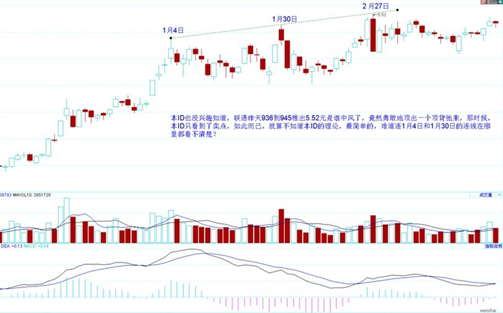

所有非汉奸、非奸细的各位请注意了，这里奸细少不了，如果你把这里当成一个纯粹的课堂，那就太小看这里了。但，有一点是无疑的，就是一旦你掌握本ID的理论，你根本无须听任何话，无论谁的话，任何话都是废话，走势永远第一。牛顿不能违反万有引力，本ID也不能违反本ID的理论，这才是最关键的地方。而只有这样，才有可能有一个正确的思维基础。你无须尊重本ID，甚至，你学会本ID的理论，还可以专门和本ID作对，企图在市场上挣本ID的钱，但你必须尊重本ID的理论，就像你必须尊重万有引力一样，否则市场的走势每分每秒都会给你足够的教训。

(2007-02-28 08:44:37)

读后感：

1、走势的当下性、感应市场的节奏。

2、a+A+b+B+c是如何变成a’`+B’

3、课文学习用图：

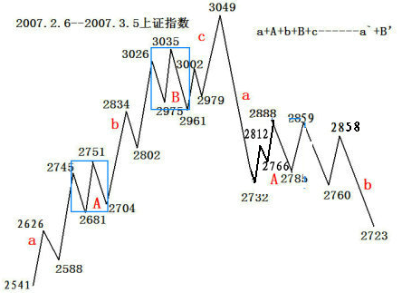

 HYPERLINK "http://photo.blog.sina.com.cn/showpic.html" \l "blogid=6223e8fb0100gwia&url=http://static2.photo.sina.com.cn/orignal/6223e8fbt79f28cee7e71&690" \t "_blank"  HYPERLINK "http://photo.blog.sina.com.cn/showpic.html" \l "blogid=6223e8fb0100gwia&url=http://static5.photo.sina.com.cn/orignal/6223e8fbt79f29c905b44&690" \t "_blank"  HYPERLINK "http://photo.blog.sina.com.cn/showpic.html" \l "blogid=6223e8fb0100gwia&url=http://static2.photo.sina.com.cn/orignal/6223e8fbt79f55b3a4fe1&690" \t "_blank"  HYPERLINK "http://photo.blog.sina.com.cn/showpic.html" \l "blogid=6223e8fb0100gwia&url=http://static5.photo.sina.com.cn/orignal/6223e8fbt74e9f7d71274" \t "_blank"

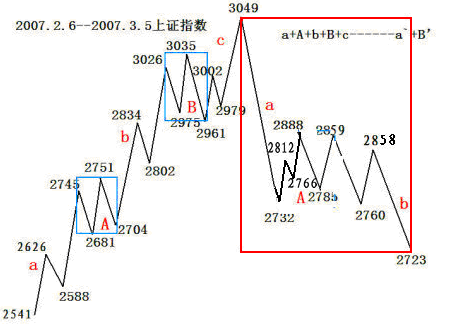

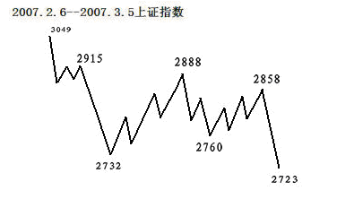

4、牛市是快跌慢涨、熊市是快涨慢跌。

5、大跌，就把眼睛放大，去找会形成第三类买点的股票，这才是股票操作真正的节奏与思维。

6、和那合力一致，这样才是顺势而为。

7、股票只有当下的走势状态，股票的走势，没有一个必然的、上帝式的意义，所有的意义都是当下赋予的。

8、那么，怎么知道b段里走还是不走？这很简单，这不需要预测，因为b段是否走，不是由你的喜好决定的，而是由b段当下的走势决定的。如果b段和a段相比，出现明显的背驰，那就意味着要走，否则，就不走。------这个走是指卖出操作。

9、注意，c段并不是天经地义一定要有的，就像a也不是天经地义一定要有的。要出现c段，如同要出现b段，都必须有一个针对30分钟（中枢）的第三类买点出现，这样才会有。

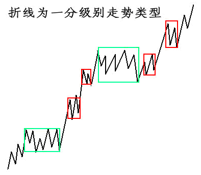

### 2007-02-28解盘

缠中说禅：2007-02-28 08:50:44

市场的任何走势都是最好的免费训练，纸上谈兵没用的，关键是实际操作，心手合一才可以，否则就是浪费时间。市场只认识走势本身，其他一切都是多余的，不经过一番修炼，是不能成器的，各位好自为之吧。今天早点把文章贴出来，也希望各位在大的震荡中，能有一个顿悟，这样，就真的对得起这震荡与本ID的文章了。

缠中说禅：2007-02-28 15:15:26

今天之所以如此早就发课程，就是让各位现场学习。看看a+A+b+B+c是如何变成a`+B，如果早上不敢回补，那么1351的第三类买点，怎么都应该回补了。而且个股与大盘的节奏不同，这两天深圳低价本地股表现怎样，今天哪个板块先涨停的，除非你的眼睛有毛病，大概都应该能看明白了。如果今早没看到课程的，那么就好好对照这两天的1分钟图研究一下。如果把本课程吃透，那你的水平可以上初二了。

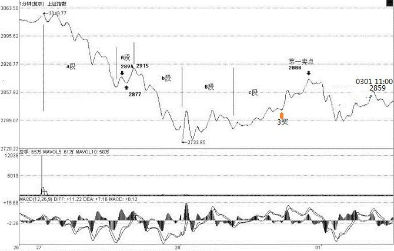

大盘后面的走势很简单，就是2915，昨天一分种中枢的高点。如果看不懂的，就看5日线。上不去，那就要二次探底，否则就V型反转，重新攻击3000点。

至于个股方面，没什么可说的，今天的课程里专门让大家去找第三类买点的：“大跌，就把眼睛放大，去找会形成第三类买点的股票，这才是股票操作真正的节奏与思维。”不仅是思维本身，心态如何调整，有了这次现场直播，大家对这节奏，不知道有没有感觉。今天一早看课程又能理解的，有福了。

表扬一下CCTV，为了这几句话：[匿名] CCTV 2007-02-28 10:20:59

[匿名] 老新手 2007-02-28 09:53:25

第二个1分钟中枢形成，就看后面是否背驰了。

==

不一定，你仔细研究一下妹妹今天举的两个例子。

[匿名] CCTV 2007-02-28 10:24:40

我觉得，大盘还存在一种可能，就是形成妹妹文章里说的a`+B，然后突破B直接上去。现在应该按a`+B来看了。

HYPERLINK "http://blog.sina.com.cn/u/1215172700" \t "_blank" 缠中说禅2007-02-28 15:29:13 [举报]

妹妹来了吗？现在是5分钟中枢第一段吧？

==

现在的走势很简单，今天早上就是一个5分钟的中枢，下午出现第三类买点后离开，现在问题的关键就是在上面是否能再出现一个中枢，如果这中枢能站稳5天线以及2915，那么就可以期待再冲3000了。如果不行，那就下来形成一个30分钟的中枢。

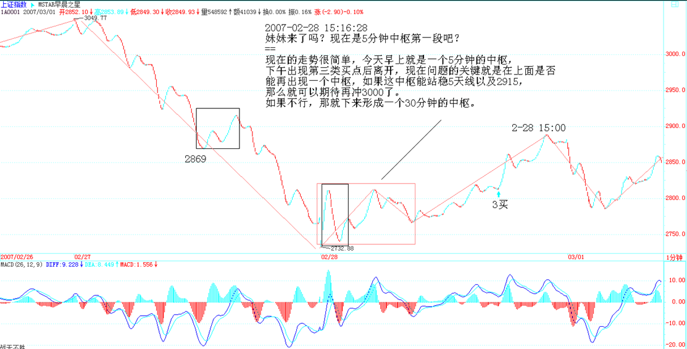

缠中说禅：2007-02-28 15:35:28

今天早上看了缠JJ的课程，虽然没有立即领悟是什么意思.但是今天确实有不小的收获，特别是1351的第三买点.不过还有问题需要JJ 指教1335的那个回抽到2809的为什么不是第三买点.是不是跌回2811的中枢波动区间里去了.所以后来的那个1351再次回抽，然后形成第三买点.如果JJ能把这个告诉我答案的话，我想我对第三类买卖点应该有个全新的认识了.

希望JJ 能够指导!谢谢!!!

==

你至少是一个次级别的回抽，所以至少在分时图上有三段下上下。

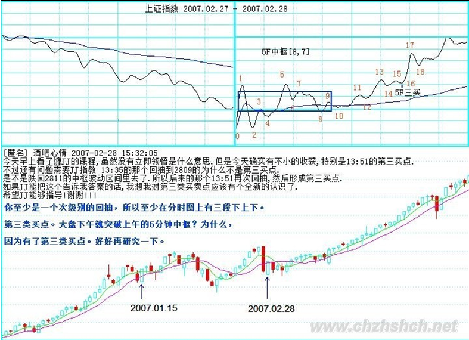

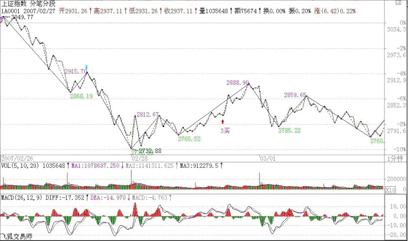

汉奸，本ID就把你们像面首一样玩弄！

(2007-03-01 15:42:20)

汉奸，本ID就把你们像面首一样玩弄！

百团大战以后是什么，熟悉中国历史的没有不知道的，除非他是汉奸或鬼佬并且脑子进满了水。显然，中国的金融市场的很重要部分，被汉奸与鬼佬把持着，这一点已多次指出。不承认这一点，不是别有用心就是瞎了眼。用最简单的板块论，例如金融板块显然就是汉奸与鬼佬围剿的重灾区。特别，由于金融股多数都同时在其他市场上交易，因此更容易成为他们企图控制中国金融市场的利器。

有些幼稚的人，例如一个叫什么水皮的，昨天还傻忽忽地说，谁谁谁发表什么文章，就要涨了。中国最可怕的不是汉奸，而是那些弱智的所谓爱国者，喊两句口号就等于爱国，这爱国也太没技术含量了。喊口号是赶不走日本人的，同样杀不死汉奸和鬼佬。在金融市场中哪里有什么和谐，那是血和肉！别老大不小的还装天真！

本ID承认，本ID现在所能集合的力量，还不足以和汉奸与鬼佬进行全方位大集团的会战，这都是前期保守的金融政策所导致的！那种希望杀光大鳄的政策，只是为外国大鳄的入侵制造良好的环境。没有2000年前后可笑的金融政策，没有某些人中了海龟的迷幻。中国民间的力量也足以和外国鬼子在最大层面上进行会战了。

这就像百团大战一样，一个中级规模的阻击就会引发后面残酷的围剿。但历史却是这样发展的，所谓的围剿并没有达到任何目的，日本人最终还是滚出去了。确实，汉奸们可以不断打压金融股来控制走势，就像日本人占据着大中小城市。但二、三线股有着广阔的纵深空间，这就是本ID们的地盘，没汉奸、鬼佬们什么事情。

在大跌前一天，本ID说了深圳本地低价股，大跌又有什么影响？不照样连续涨停？同时还强调了农业、环保的股票，怎么样大家都有眼睛看。注意，各位没必要一定要看本ID所说那14只股票里的农业、环保，只要是这个板块，只要是低价，走势有买点出现的都没问题。环保其实还包括新能源。

本ID最近的口号就是，对5元上下的三线股发动最残酷的攻击，汉奸、鬼佬最好把工行砸回4元，把人寿砸回20元，那时候自然去接管你们，让你们永远滚出中国。游击战，把汉奸和鬼佬像面首一样玩弄。

N年前，本ID已经到处呼吁，中国人的盘子要中国人控着，现在还不是最可怕的情况，毕竟，大的国有股还抓在手里，但如果还不警惕，汉奸自然有办法把那些都蒙掉。温先生的文章不是说要金融安全吗？盘子控在汉奸与鬼佬手里，是没有安全可言的，这就是最简单的道理。

今天的盘子没什么可说的，上不了5日线就要二次探底，就这么简单。现在就看这在2800附近的30分钟中枢如何演化的，这是最近的一个唯一的主题。

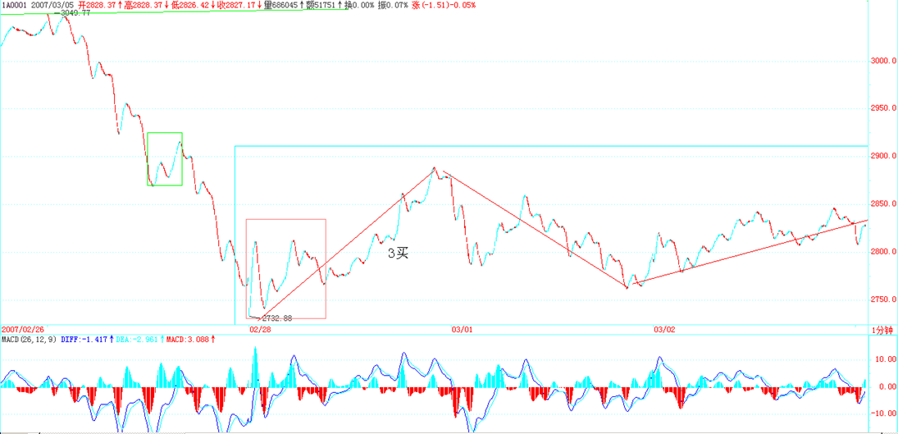

### 2007-03-01解盘

HYPERLINK "http://blog.sina.com.cn/u/1215172700" \t "_blank" 缠中说禅2007-03-01 16:00:35 [举报]

妹妹，我觉得今天大盘1分钟怎么和昨天是一样的，只是级别更低

下跌时a+A+b+B+c因为b背驰了所以转化为a~+B。请问是这样的吗？

==

昨天下午的是1分钟级别的上涨，昨天收盘前是一个1分钟以下级别的顶背驰，今天早上1006附近是一个1分钟以下级别的底背驰，然后出现一个大的中枢，上下震荡，收盘勉强拉回这个中枢。明天，如果大盘在这中枢下出现第三类卖点，那大盘就会继续探下去。否则依然围绕这中枢震荡。

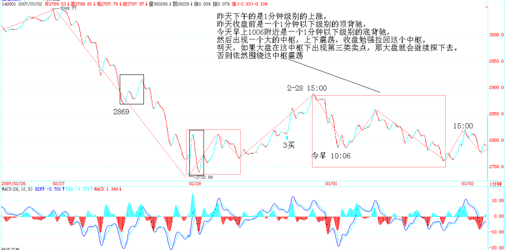

缠中说禅：2007-03-01 16:42:03

一分钟以下的背弛怎么分辨？

==

看分时图。或者看1分钟MACD，直接看红绿柱子，不看黄白线。

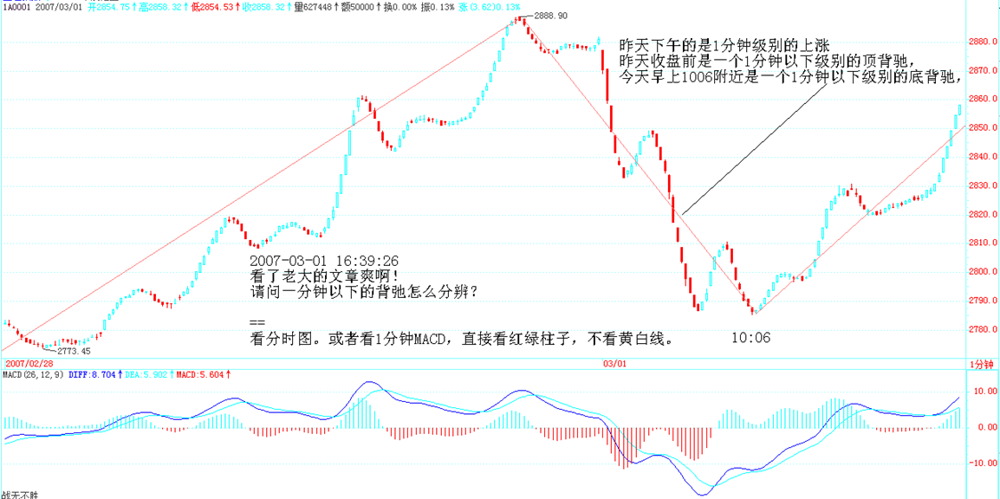

## 教你炒股票33：走势的多义性

(2007-03-02 15:20:37)

如果市场都是标准的a+A+b+B+c，A、B的中枢级别一样，那这市场也太标准、太不好玩了。市场总有其复杂的地方，使得市场的走势呈现一种多义性，就好象诗词中文字的多义性一样。如果没有多意义性，诗词都如逻辑一样，那也太没意思了。而所有走势的多义性，都与中枢有关。

例如，5分钟级别的中枢不断延伸，出现9段以上的1分钟次级别走势。站在30分钟级别的中枢角度，3个5分钟级别的走势重合就形成了，而9段以上的1分钟次级别走势，每3段构成一个5分钟的中枢，这样也就可以解释成这是一个30分钟的中枢。这种情况，只要对中枢延伸的数量进行限制，就可以消除多义性，一般来说，中枢的延伸不能超过5段，也就是一旦出现6段的延伸，加上形成中枢本身那三段，就构成更大级别的中枢了。

另外一种多义性，是因为模本的简略造成的。不同级别的图，其实就是对真实走势不同精度的一种模本，例如，一个年线图当然没有1个分笔图的精确度高，很多重要的细节都不可能在大级别的图里看到。而所谓走势的级别，从最严格的意义上说，可以从每笔成交构成的最低级别图形不断按照中枢延伸、扩展等的定义精确地确认出来，这是最精确的，不涉及什么5分钟、30分钟、日线等。但这样会相当累，也没这个必要。用1分钟、5分钟、30分钟、日线、周线、月线、季线、年线等的级别安排，只是一个简略的方式，最主要是现在可以查到的走势图都是这样安排的，当然，有些系统可以按不同的分钟数显示图形，例如，弄一个7分钟的走势图，这都完全可以。这样，你完全可以按照某个等比数列来弄一个级别序列。不过，可以是可以，但没必要。因为，图的精确并没有太大的实质意义，真实的走势并不需要如此精确的观察。当然，一些简单的变动也是可以接受的，例如去掉30分钟，换成15分钟和60分钟，形成1分钟、5分钟、15分钟、60分钟、日线、周线、月线、季线、年线的级别安排，这也是可以的。

虽然没有必要精确地从最低级别的图表逐步分析，但如果你看的图表的缩放功能比较好，当你把分笔图或1分钟图不断缩小，这样，看到的走势越来越多，而这种从细部到全体的逐步呈现，会对走势级别的不断扩张有一个很直观的感觉，这种感觉，对你以后形成一种市场感觉是有点帮助的。在某个阶段，你可能会形成这样一种感觉，你如同站在重重叠叠的走势连绵中，而当下的趋向，仿佛照亮着层层叠叠的走势，那时候，你往往可以忘记中枢之类的概念，所有的中枢，按照各自的级别，仿佛都变成大小不同的迷宫关口，而真正的路只有一条，而你的心直观当下地感应着。说实在，当有了这种市场清晰的直觉，才算到门口了。那时候，就如同看一首诗，如果还从语法等去分析，就如同还用中枢等去分析一样，而真正的有感觉的读者，是不会计较于各种字句的纠缠的，整体的直观当下就呈现了，一首诗就如同一自足的世界，你当下就全部拥有了。市场上的直观，其实也是一样的。只要那最细微的苗头一出来，就当下地领悟了，这才算是对市场走势这伟大诗篇一个有点合格的的阅读。

在一名能充分直观的阅读者眼里，多义性是不存在的，而当这种最明锐的直觉还没出现时，对走势多义性的分析依然必要，因此也必须继续。换句话说，如果玩不了超逻辑的游戏，那只能继续在逻辑的圈子里晃悠。除了上面两种多义性，还有一种有实质意义的多义性，也就是走势分析中的多种合理释义，这些释义都符合理论内在的逻辑，因此，这种多义性反而不是负担，而是可以用多角度对走势进行一个分析。

例如，对a+A+b+B+c，a完全可以有另一种释义，就是把a看成是围绕A这个中枢的一个波动，虽然A其实是后出现的，但不影响这种看法的意义。同样c也可以看成是针对B的一个波动，这样整个走势其实就简化为两个中枢与连接两者的一个走势。在最极端的情况下，在a+A+b+B+c的走势系列类型里，a和c并不是必然存在的，而b完全可以是一个跳空缺口，这样，整个走势就可以简化为两个孤零零的中枢。把这种看法推广到所有的走势中，那么任何的走势图，其实就是一些级别大小不同的中枢，把这些看成不同的星球，在当下位置上的星球对当下位置产生向上的力，当下位置下的产生向下的力，而这些所有力的合力构成一个总的力量，而市场当下的力，也就是当下买卖产生的力，买的是向上的力，卖的是向下的力，这也构成一个合力，前一个合力是市场已有走势构成的一个当下的力，后者是当下的交易产生的力，而研究这两种力之间的关系，就构成了市场研究的另一个角度，也就是另一种释义的过程。这是一个复杂的问题，以后会陆续说到，算是高中的课程了。

现在先别管什么力不力的，可以从纯粹中枢的角度对背驰给出另外的释义。对a+A+b+B+c，背驰的大概意思就是c段的力度比b的小了。那么，站在B这个中枢的角度，不妨先假设b+B+c是一个向上的过程，那么b可以看成是向下离开中枢B，而c可以看成是向上离开中枢B。所谓顶背驰，就是最后这个中枢，向上离开比向下离开要弱，而中枢有这样的特性，就是对无论向上或向下离开的，都有相同的回拉作用，既然向上离开比向下离开要弱，而向下离开都能拉回中枢，那向上的离开当然也能拉回中枢里，对于b+B+c向上的走势，这就构成顶背驰，而对于b+B+c向下的走势，就构成底背驰。对于盘整背驰，这种分析也一样有效。其实，站在中枢的角度，盘整背驰与背驰，本质上是一样的，只是力度、级别以及发生的中枢位置不同而已。

同样，站在纯中枢的角度，a+A+b+B，其中B级别大于A的这种情况就很简单了，这时候，并不必然地B后面就接着原方向继续，而是可以进行反方向的运行。例如，a+A+b+B是向下的，而a+A+b其实可以看成是对B一个向上离开的回拉，而对中枢来说，并没要求所有的离开都必须按照上下上下的次序，一次向上的离开后再一次向上的离开，完全是被允许的，那站在这个角度，从B直接反转向上，就是很自然的。那么，这个反转是否成功，不妨把这个后续的反转写成c，那么也只要比较一下a+A+b与c这两段的力度就可以，因为中枢B对这两段的回拉力度是一样的，如果c比a+A+b弱，那当然反转不成功，也就意味着一定要重新回到中枢里，在最强的情况下也至少有一次回拉去确认能否构成一个第三类买点。而a+A+b与c的力度比较，与背驰的情况没什么分别，只是两者的方向不同而已。如果用MACD来辅助判别，背驰比较的黄白线和柱子面积都在0轴的一个方向上，例如都在上面或下面，而a+A+b与c就分别在不同的方向上，由于这，也不存在黄白线回拉的问题，但有一点是肯定的，就是黄白线至少要穿越一次0轴。这几天大盘的走势，就对这种情况有一个最标准的演示。简略分析一下。

由于相应的a+A+b是一个1分钟的走势，那天故意提早开盘前发帖子，等于是现场直播B的形成，但1分钟的走势，估计能看到或保留的不多，那就用15分钟图来代替。02270945到02280945，刚好4小时，构成a+A+b，其中的A，在15分钟图上看不清楚，在1分钟图上是02271306到02271337，中枢的区间是2877到2894点，中枢波动的高点也就是b的起跌点是2915点。c段大致从02281100算起，这个c要反转成功，在相同级别内至少要表现出比b的力度不能小，这可以从MACD来辅助分析，也可以从一个最直观的位置来分析，就是必须能重新回来b的起跌点，这就如同向天上抛球，力度大的如果还抛不高，那怎么能算力度大？至于c能不能回到b的起跌点，那可以分析c内部的小级别，如果c出现顶背驰时还达不到该位置，那自然达不到了，所以这种分析都是当下的，不需要预测什么。有人问为什么要看2915点，道理就是这个。至于还让大家看5日线，只是怕大家看不懂的一个辅助办法，有了这么精确分析，所有的均线其实都没什么意义了。而c的力度不够，那就自然要回到B里，所以后面的走势就是极为自然的。站在这个角度，2888点的第一卖点没走，那么03011100的2859点也该走了，那也可以看成是对B的再次离开，这力度显然更小，当然要走了等回跌以后看情况再回补，而后面又出现了100点的回跌，然后出现底背驰，当然就是一个完美的回补点了。

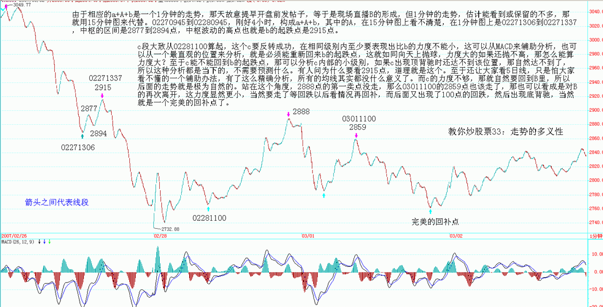

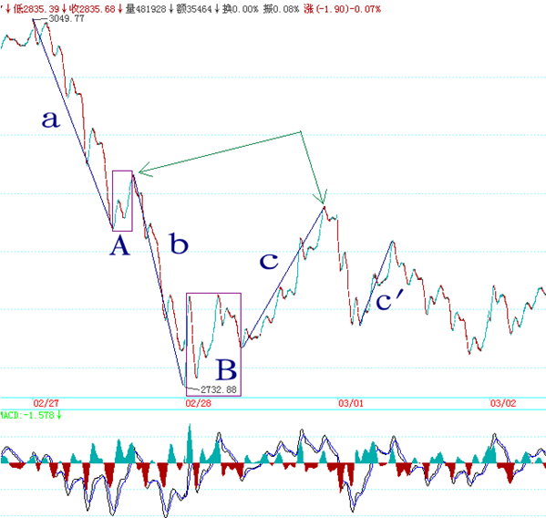

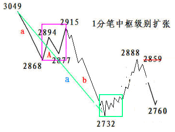

总体围绕中枢的操作原则很简单，每次向下离开中枢只要出现底背驰，那就可以介入了，然后看相应回拉出现顶背驰的位置是否能超越前面一个向上离开的顶背驰高点，不行一定要走，行也可以走，但次级别回抽一旦不重新回到中枢里，就意味着第三类买点出现了，就一定要买回来。而如果从底背驰开始的次级别回拉不能重新回到中枢里，那就意味着第三类卖点出现，必须走，然后等待下面去形成新的中枢来重复类似过程。围绕中枢的操作，其实就这么简单。当然，没有本ID的理论，是不可能有如此精确的分析的，就像没有牛顿的理论，人们只能用神话去讲述一切关于星星的故事。

不过，这些分析都是针对指数的，而个股的情况必须具体分析，很多个股，只要指数不单边下跌，就会活跃，不爱搭理指数，所以不能完全按指数来弄。其实。对于指数，最大的利益在期货里。不过，期货的情况有很大的特殊性，因为期货是可以随时开仓的，和股票交易凭证数量的基本稳定不同，所以在力度分析等方面有很多不同的地方，这在以后再说了。

读后感：

1、所有走势的多义性，都与中枢有关。

2、中枢的延伸不能超过5段，也就是一旦出现6段的延伸，加上形成中枢本身那三段，就构成更大级别的中枢了。

3、走势的级别，从最严格的意义上说，可以从每笔成交构成的最低级别图形不断按照中枢延伸、扩展等的定义精确地确认出来，这是最精确的，不涉及什么5分钟、30分钟、日线等。

4、另外一种多义性，是因为模本的简略造成的。

5、只要那最细微的苗头一出来，就当下地领悟了，这才算是对市场走势这伟大诗篇一个有点合格的的阅读。

6、除了上面两种多义性，还有一种有实质意义的多义性，也就是走势分析中的多种合理释义，这些释义都符合理论内在的逻辑，因此，这种多义性反而不是负担，而是可以用多角度对走势进行一个分析。

7、在最极端的情况下，在a+A+b+B+c的走势系列类型里，a和c并不是必然存在的，而b完全可以是一个跳空缺口，这样，整个走势就可以简化为两个孤零零的中枢。

8、盘整背驰与背驰本质，相同点与不同点。其实，站在中枢的角度，盘整背驰与背驰，本质上是一样的，只是力度、级别以及发生的中枢位置不同而已。   

9、站在纯中枢的角度，a+A+b+B，其中B级别大于A的这种情况就很简单了，这时候，并不必然地B后面就接着原方向继续，而是可以进行反方向的运行。例如，a+A+b+B是向下的，而a+A+b其实可以看成是对B一个向上离开的回拉，而对中枢来说，并没要求所有的离开都必须按照上下上下的次序，一次向上的离开后再一次向上的离开，完全是被允许的，那站在这个角度，从B直接反转向上，就是很自然的。

10、而a+A+b与c的力度比较，与背驰的情况没什么分别，只是两者的方向不同而已。如果用MACD来辅助判别，背驰比较的黄白线和柱子面积都在0轴的一个方向上，例如都在上面或下面，而a+A+b与c就分别在不同的方向上。

11、a+A+b-----B’，a+A+b-----A’，无非是个制造高级别中枢的过程，C走势的反转不成功，生成的是纯中枢扩张式中枢，C走势的反转成功，生成的是走势类型扩展式中枢。

12、走势多义性的存在，使走势五彩缤纷、绚丽多彩。看走势如看花开。

13、期货与股票的不同点.

2007-03-02－06解盘

缠中说禅：2007-03-02 15:21:15

今天军工意料之中的利好使得打击汉奸又多了一重利器，中信的即将发行，使得汉奸对金融股的打压也不再肆无忌惮。目前关键是心理面的修复，通过震荡把不坚定分子洗干净。

大盘的技术走势，有了今天的课程，自己就可以分析了。如果看不明白，那还是5日线，两会结束是一个敏感时间，下周初是一个心理敏感时间，因为听说汉奸和面首都有周经现象。

个股没什么可说的，现在学得多了，就要自己去找股票，不要扎堆，虽然本ID不介意操作难度加大，但这样其实是害了大家。自己找的才最好吃，学的是方法。低价股里，像科技（包括3G）、旅游等等历史上活跃的，都是找股票好的板块。但选股票一定要按技术来找，找有第三类买点的，或至少是刚从第三类买点起来的。

估计现在999没几个人有了，被抛下车的也不用伤心，你们的水平和某著名的、有着汉奸名字的基金一样，有数以千万计的筹码因为被赎回而丢失了。这简直是太令人高兴的事情，343的情况也一样，就要害一下这些汉奸。但汉奸还有筹码，本ID现在就是要挑逗他们，最好都砸出来。

缠中说禅：2007-03-05 11:56:42

下午要去钓鱼台一趟，所以把帖子提前发出来。学了上次走势多义性的课程，早上10点17分的1分钟级别以下背驰不会走，只能证明还没学过关。已经说过这种盘整的操作方法，就是高位离开出现背驰走，下来出现背驰再回补，如果出现第三类卖点，就要等跌透再说。

现在平安成了汉奸的武器，不仅在香港作空，在这里也不断打压。而今天有关查资金的消息，对心理面的修复不利。其实这种走势，只有不断上下的震荡，才能更好地清洗。让大众恐惧心理多点释放，将有利于以后行情的展开。

技术不好的，在这里行情中就减少操作与仓位。对本ID的理论能掌握的，这种行情就是最好的游戏，卖点卖了，就等着跌出买点再进去，把中线有潜力的股票当成自选，不断的反复操作。本ID的理论可是最灵活的，还有，千万不能追高买股票，没有股票是值得追高买的，当然也没必须杀跌卖股票。

下午有重要的会面，就来不了了，先下，再见。

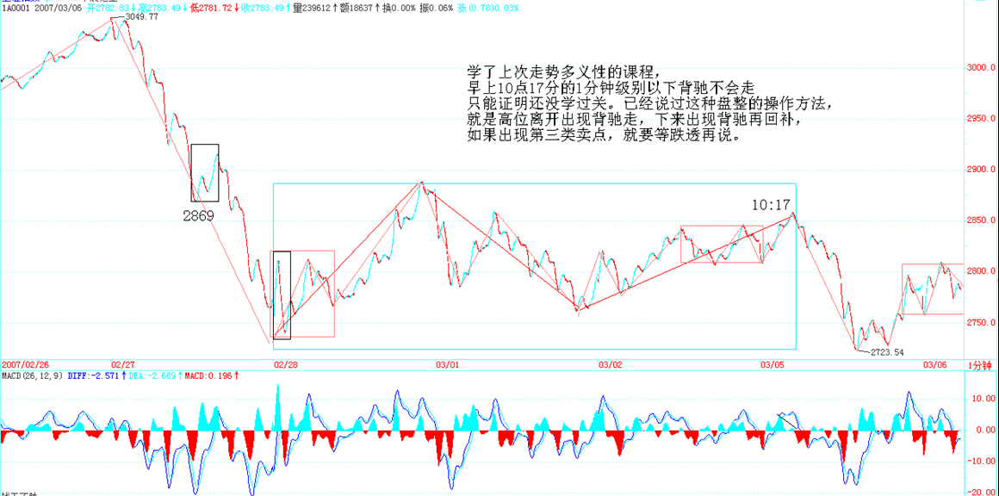

缠中说禅：2007-03-05 21:14:20

刚回来，今天大盘的走势，完全在理论所规划的范围内，早上一个顶背驰、下午一个底背驰，基本就是今天走势的全部。但今天的底背驰创出本次调整的新低，而28日的2888点与今天的2858点的连线，就构成后面走势的关键压力，如果后面的顶背驰出现位置不能突破该线，则大盘将继续盘弱直到该线被突破。

在盘整中，绝对不能小看小级别的背驰，特别是那种离开中产生的背驰，例如今天一顶一底，幅度足有130点，很多股票的振幅超过10%，这就是减低成本的好机会，大盘在这里震荡的机会已经超过3次，如果都能按技术要求把握，对于散户来说，你的成本足可以减低30%了。盘整总占居大多数的交易时间，不会利用盘整，基本还是属于不入流的。

技术不过关的，在盘整时完全可以离开，等大盘走强再说。例如一个周线中枢的形成，怎么都弄好几个月，你完全可以回家抱孩子去。但真正的杀手，盘整就是天堂，盘整往往能创造比上涨更大的利润，抛了可以买回来，而且可以自如地在各板块中活动，但能达到这种境界，必须刻苦的学习与训练，如果学不了，就先离开，本ID教你一种最简单的办法，就是等大盘周线出现底背驰在来，这样，你N年才需要看一次盘，多轻松？

盘整就要敢抛敢买，一旦出现第三类卖点进入破位急跌，就要等跌透，有一点级别的背驰再进入，这样才能既避开下跌，又不浪费盘整的震荡机会，如果技术不熟练的，就减少仓位操作。大盘没什么可说的，一个绝佳的练习盘整操作的运动场，要珍惜。

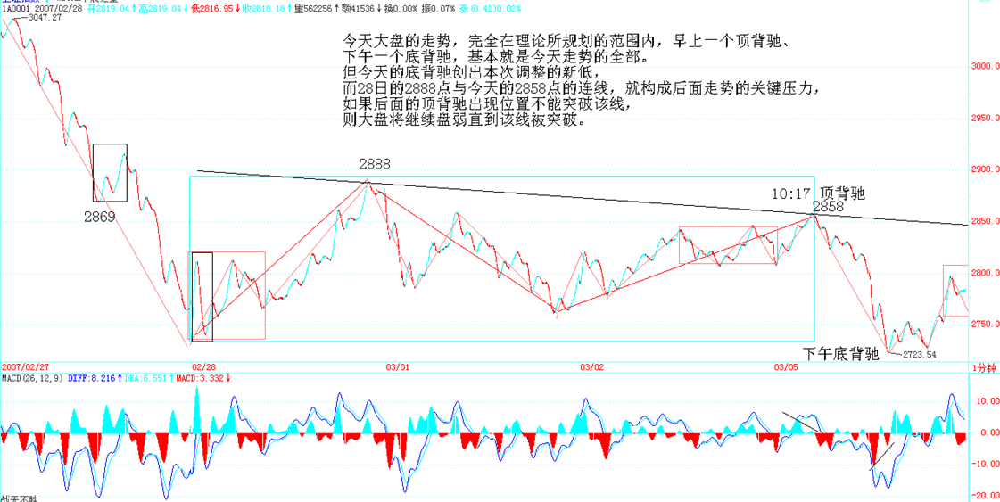

缠中说禅：2007-03-05 21:20:30

尊敬的博主：我是您的一名忠实的读者，自从我发现您的ＢＬＯＧ后，每天有空就上来拜读你的文章已几乎成了我每天的必修课，目前仍在努力之中，因为基础理论还没学好，所以也不敢轻易给您发信息．这几天（特别是今天）看看股市的行情，周边国家甚至全球的股市都处于大跌之中，上证Ａ股的日线已明显呈大大Ｍ状态，我们很是担心这轮的牛市是不是就这样已被Ｍ掉了？！很想知道博主对这轮行情是怎么看的．

==

对大盘的判断，很久以前已经说过了，现在不过是特大牛市第一波中的一个调整，可能会演化成周线中枢，前提是这次盘整后不出现向上突破走势，因为目前的走势，完全还有一种可能就是只在第一段的日线延伸后，所以大盘依然有只是一个日线调整后继续创新高的可能，这调整的级别就是去年5月以后那次一样。

如果大盘真的延伸出6段形成周线盘整，也就是比去年5月后那次更大级别的调整，那也没什么大不了的，一个周线结束后，意味着一个向上的波动至少是上次上来波动的级别的，也就是一个1500点以上的向上过程将是可以预期的。

至于大盘的牛市，还早着，上一个牛市走是13年，现在才2年不到，尾数还没走完。

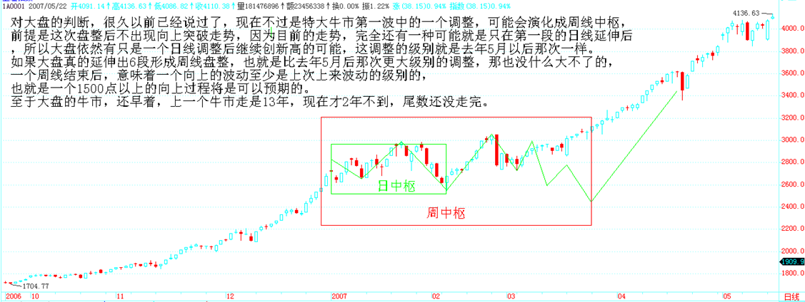

HYPERLINK "http://blog.sina.com.cn/u/1215172700" \t "_blank" 缠中说禅2007-03-06 15:22:36 [举报]

今天大盘在昨天底背驰的基础上展开，大家有点观察的，都能发现这围绕中枢的震荡，基本都至少是三波完成的，例如从底背驰到顶背驰，都有上下上的过程，今天早上就是这下的一段。由于大盘突破了2888与2858的连线，所以还是走得比较强的，明天的问题很简单，只要不跌回今天早上的区间，就是强势，后面行情依然有潜力。

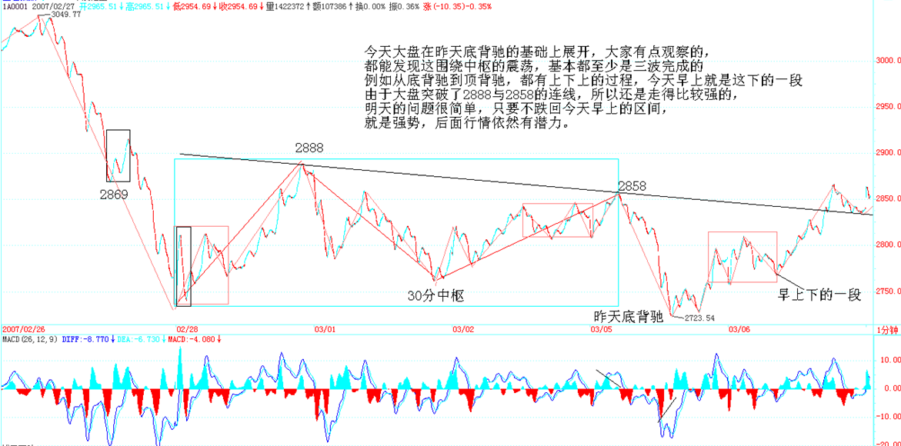

如果看不明白，就看15分钟上的120均线，今天的高位正好在这个位置，明天的最直接压力就在此，下一个在2888，然后是2915。对于，围绕中枢的震荡不需要预测什么，例如，当走势的级别提升，就看大一点的背驰才决定进出，现在5分钟到15分钟的图都开始修复好，只要1分钟上的走势不破坏这种走好，那就没问题了，行情就在级别的图上继续构成。

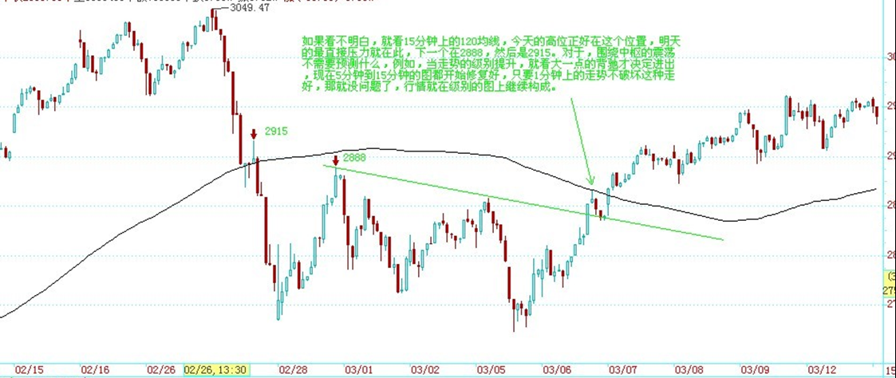

个股方面，依然是板块轮动，中信要发行，汉奸不敢乱砸金融股，所以就起来了，就这么简单，而且今天的金融股还有稳定的任务，毕竟香港的股市最近也不太平。散户没必要理会这些，根据当下的走势就可以。注意，板块轮动很快，千万不能追高买，应该找没动的有买点的买，这样才能占据先机。

HYPERLINK "http://blog.sina.com.cn/u/1215172700" \t "_blank" 缠中说禅2007-03-06 16:07:29 [举报]

现在5分钟到15分钟的图都开始修复好，只要1分钟上的走势不破坏这种走好，那就没问题了，行情就在级别的图上继续构成。

---------

缠姐，我看大盘5分钟线上，03051325-03061000这段跟03061100-03061405这一段比是背驰了啊？可你说是“现在5分钟到15分钟的图都开始修复好”，请问缠姐我是那里判断出错了阿？

==

用MACD辅助判断，背驰必须有MACD明显的回拉0轴，MACD如果刚上0轴，至少在这个级别上不存在背驰的问题。大盘下午是一个1分钟级别以下的背驰。

(注：这里的MACD没有明显的离开0轴后回拉0轴）

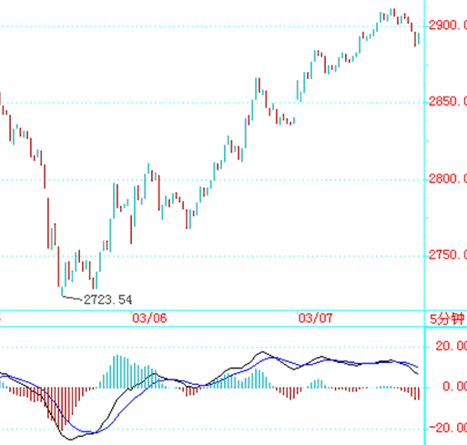

HYPERLINK "http://blog.sina.com.cn/u/1215172700" \t "_blank" 缠中说禅2007-03-06 16:26:06 [举报]

下面是您对大势的评价：对大盘的判断，很久以前已经说过了，现在不过是特大牛市第一波中的一个调整，可能会演化成周线中枢，前提是这次盘整后不出现向上突破走势，因为目前的走势，完全还有一种可能就是只在第一段的日线延伸后，

------

缠姐你所指＂第一段的日线＂具体为哪一段？

==

日线的完整中枢，其实是1月4日到2月6日，虽然在上面可以看到有明显的9段，但都不是30分钟级别的，都是5分钟级别，所以到2月6日才严格地构成日线的中枢所需要的三段，当然，你也可以看成是由5分钟中枢延伸而来的。三个5分钟是30分钟，9段以后就成日线了。

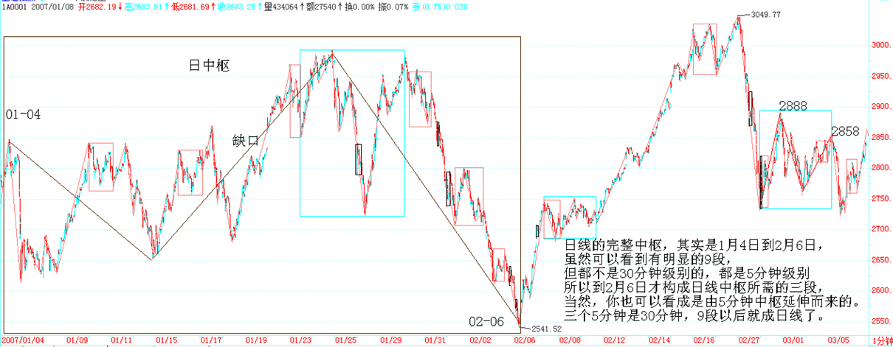

而这，如果是周线的中枢看，这只能算第一段，如果这位置要真的构成周线中枢，那至少要在这里盘到4月以后。而现在，完全可以直接突破上去，这样就不构成周线的中枢了。所以，站在当下的走势上，其实，还有这种强势的选择。(注：缠早年前提到的走势必完美的周中枢该是日中枢）

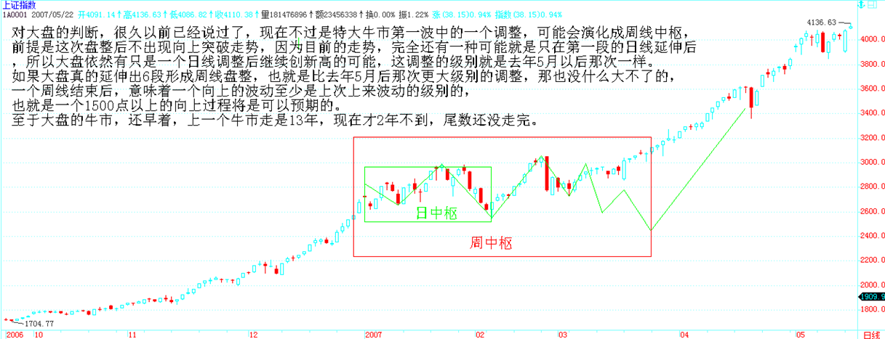

## 教你炒股票34：宁当面首，莫成怨男(2007-03-07 15:09:54)

面首，一种职业；怨男，一种自虐。面首常有，怨男更常有。怨男，无分贵贱，无关学问。李后主，一国之君，人生长恨水长东地成就一代怨词，也算怨得有点声色；以后主为隔代知己的王某，一头扑入不能长东只能长恨的死水里，比起清华园后来那些因阴阳失调而成就的千万怨男，也算怨得有点动静。清华男的脑子多不好使，在逻辑与数据的迷宫中迷失自我，是否与此阴阳失调相关且不论，但北大男如面首，清华男如怨男，却是不争的事实。宁要面首，莫要怨男，这也是北大比清华出色的地方。站在消费者的角度，面首总比怨男可爱得多。最不可爱的，当然就是怨男里的面首或面首中的怨男。那一片记录着中国人耻辱的残园附近的两种男人，就如同股市中的失败男人一样。股市中的失败男人，只有两种，面首与怨男，当然也就包括其中最不可爱的两者交集。

面首，被股票所消费者，被股票所玩弄者，被股票忽悠着从阳亢到阳痿间不断晃悠者。非怨男的面首有一好处，就算不太精液了也还很敬业，到处想方设法也要找点这鞭那鞭嚼嚼又可以继续傻忽忽、乐呵呵地敬业了。怨男，有两种，一种是当面首时被用废的，能用的只剩下嘴了，或者去当当股评卖卖假阳具去骗骗人，或者每天对着股市这镜子顾影自怜，或者就编编故事对着往昔的梦境再梦里阳亢一把；另一种是拍AV的、说评书的、当狗崽的、玩裸聊的，总之，都不是能玩真的，都是些企图用口眼就能制造快感的发育不良者。要快感就玩真的，真刀真枪来，总是当医疗器械的免费宣传者那算什么事？

无论面首或怨男，最大的共同点就是喜欢被玩，当一种面首或怨男的密码被输入后，这面首或怨男的程序就自动运行。其人，不过是傀儡而已，但竟然也乐在其中，也算天下之奇事。不摆脱这各种情绪操控的傀儡命运，就无人可言，但更可怕的的是，很多人却深陷其中而不能自拔，甚至不能自知。很多人，从一开始就自闭其路，一开始就是死路一条。例如，自以为高明地把股市当赌场，这样，一双赌眼看股市，怎么闹都是一条赌命，其命运就由其最开始的所谓高明所决定了。“闻见学行”，有如此闻，而有如此见，复有如此学，终有如此行，如此股市就以各人自渎的想象成为众多股市参与者的坟墓。

正闻、正见、正学、正行，无此四正，要在股市里终有成就，无有是处。正，不是正确的意思，所谓正确，不过是名言之争辩。正，是正是，是当下，只有当下，才是正是，才是这个。要当下闻、当下见、当下学、当下行，才是正闻、正见、正学、正行。而对于股市来说，只有走势是当下的，离开走势，一切都与当下无关。一切“闻见学行”，只能依走势而“闻见学行”，离开此，都是瞎闹。不符合当下走势的，上帝说正确也白搭。由此，入股市者，首先就要把所有面首、怨男的情绪、基因抛掉，化掉，如何能办到？也离不开当下，离不开在当下的走势中磨练。当下的走势就是一切，一切股市的秘密就在其中。这秘密，是大道，没有任何的遮掩，对任何人都一视同仁、明明白白地彰显，你还向外求什么？而无数的人，还是要争着玩骑驴找驴的游戏。

在股市中，钱的大小根本不重要，亏损是按百分比的，所有的钱，无论你是从哪里涨起来的，在任何一个位置，变成0的几率是一样的。这个几率是当下存在的，任何人、任何时候都不可能摆脱，这是“不患”的。当下的走势，就如同一把飞速滚动的屠刀，任何与之相反的，都在屠杀之列，而与之顺着的，那被屠的血就成了最好的盛宴。也就是说，一旦你的操作，陷入一种与当下走势相反的状态，任何该种状态的延续就意味着死亡，一旦进入这种状态，唯一正确的选择就是离开。当然，走势是千变万化而有级别性的，任何的当下，并不就意味着1秒种的变化，而是根据你的资金以及承受所可能的操作级别来决定的。一直所说的操作级别，就是针对此而说。例如，你根据资金等情况，决定自己的操作级别是30分钟的，那30分钟所有可能发生的走势都在你的计算之中，一旦你已有的操作出现与30分钟实际当下走势相反的情况，那么就意味着你将进入了一个30分钟级别的屠杀机器里。这种情况下，只有一种选择，就是用最快的时间退出。

注意，这不是止蚀，而是一种野兽般的反应。走势如同森林，野兽在其中有着天生般的对危险的直觉，这种危险的直觉总是在危险没发生之前，而野兽更伟大的本事在于，一旦危险过去，新的觅食又将开始，原来的危险过去就过去了，不会有任何心理的阴影，只是让对危险的知觉更加强大。没有任何走势是值得恐惧的，如果你还对任何走势有所恐惧、有所惊喜，那么，你还是面首、怨男级别的，那就继续在当下的走势中磨练，让这一切恐惧、惊喜灰飞湮灭。这里，只需要正闻、正见、正学、正行，而不要面首与怨男，即使面首比怨男要可爱一丁点。

读后感：

1、宁当面首，莫成怨男。

2、正闻、正见、正学、正行。正，是正是，是当下，只有当下，才是正是，才是这个。要当下闻、当下见、当下学、当下行，才是正闻、正见、正学、正行。

3、没有任何走势是值得恐惧的，如果你还对任何走势有所恐惧、有所惊喜，那么，你还是面首、怨男级别的，那就继续在当下的走势中磨练，让这一切恐惧、惊喜灰飞湮灭。

4、哀怨误国，更误人。

5、CCTV：2007-03-08 17:13:18

这很简单呀。a+B+b，就是用盘整背驰判断b是不是背驰。中枢看法，像B里有三段，那a和B里的前两段也构成中枢，那就可以把B余下部分和b都看成是前三段的震荡，那就可以用离开的力度来判断，多义性那节课说的很清楚，这两种方法都得到同样的结论。我的理解就是这样，我相信我是理解对了，没什么困难呀。

6、缠中说禅2007-03-06 16:39:55 [举报]

缠姐姐，请问用MACD辅助判断顶背驰，是否存在红柱子长度、红柱子面积、黄白线判断的优先次序？例如600598北大荒5分钟图上，3月5日9：45分创新高9.24，红柱子也比3月2日11：15的高，黄白线却没创新高，背驰段红色柱子面积相比A部分减少了。好像不符合缠理论的限制条件：红柱子、黄白线没有创新高。我怎么选择优先次序？谢谢哈

==

一般来说，最重要的是黄白线，柱子面积之和一般在复杂走势里重要。当其实这都不是最关键的，最关键是要各级别配套地看，才能知道哪个背驰的力度大，否则，每一个1分钟以下的背驰都要动，那就会累死。但如果中枢就是5、30分钟的，每次离开都是1分钟的，那1分钟以下的背驰当然就很重要，因为根据中枢的回拉力，1分钟以下背驰就引发大的回拉，这几天大盘的高低点都是由1分钟以下背驰构成的，原因就在这里。

如何判断背驰只是最基础的，关键是如何明确地根据综合的情况来利用背驰，这才是需要不断实践、提高的。

2007-03-07－08解盘

缠中说禅：2007-03-07 15:12:14

大盘没什么可说的，上下午分别在2858、2915下震荡，十分标准。注意，来这里别把本ID当股评，现在是指导各位根据当下的情况培养自己的当下判断。如果真有心学习的，今天盘中1、5、15、30、60分钟等级别之间的综合关系，以及相应的判断，就有一个最直接的感觉了，这才是真工夫。

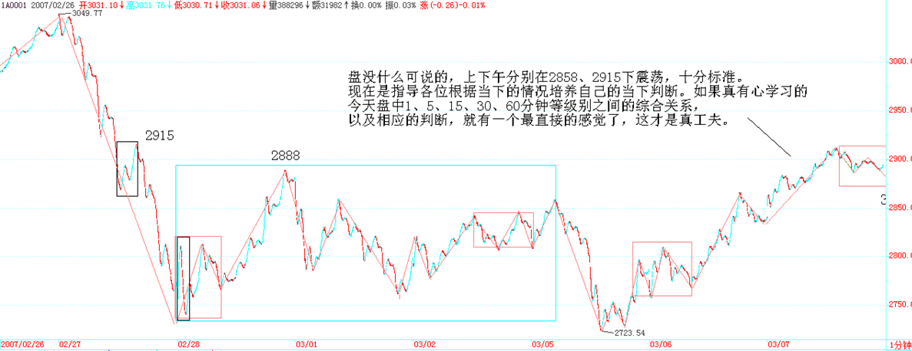

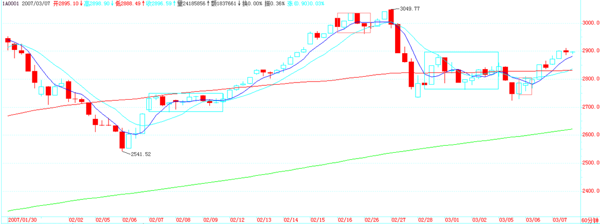

大盘只要不有效站稳2915，最终形成第三类买点，则下面这中枢依然不能摆脱。说得简单点，现在大盘无非两种盘整方式，一种就在2915附近重新回跌，甚至继续破底形成之字型，一种就是先上3000，然后再回拉形成平台型，这些都不用考虑，当下就知道了。

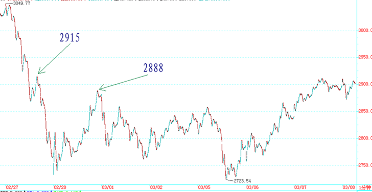

缠中说禅：2007-03-07 15:16:36

a+A+b+B+c 中 A B是中枢？那a＋A＋b 和 b＋B＋c 是不是中枢那？？？

=

前面是，后面不是。

HYPERLINK "http://blog.sina.com.cn/u/1215172700" \t "_blank" 缠中说禅2007-03-08 15:30:24 [举报]

昨天尾盘与今天早盘构成的5分钟回试，没有重新跌回2858原30分钟中枢，就构成完美的第三类买点，其后的走势都很规范。2915点的压力在尾盘突破，但还需要确认。从纯技术的角度，现在依然存在重新跌回这5分钟中枢，从而扩展成新的30分钟中枢的可能，所以2915是不能有效跌破的，否则将扩展出新的30分钟中枢，这样走势的演化就复杂了。

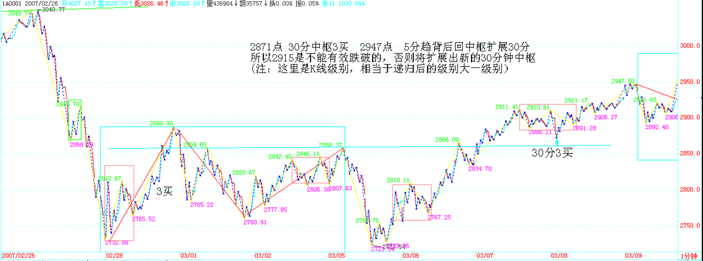

个股没什么可说的，还是板块轮动，每个板块的时间都不长，所以千万不能追高，一定要在买点买。对于散户来说，没必要参与板块的调整。不过，也不能太短，要把握其度，例如5分钟上还是主升，见一个1分钟以下的背驰就跑，这样大的利润可能都吃不到了，所以必须综合地判断，这是一个艰苦的磨练过程，必须不断交易而达到技术的完美。

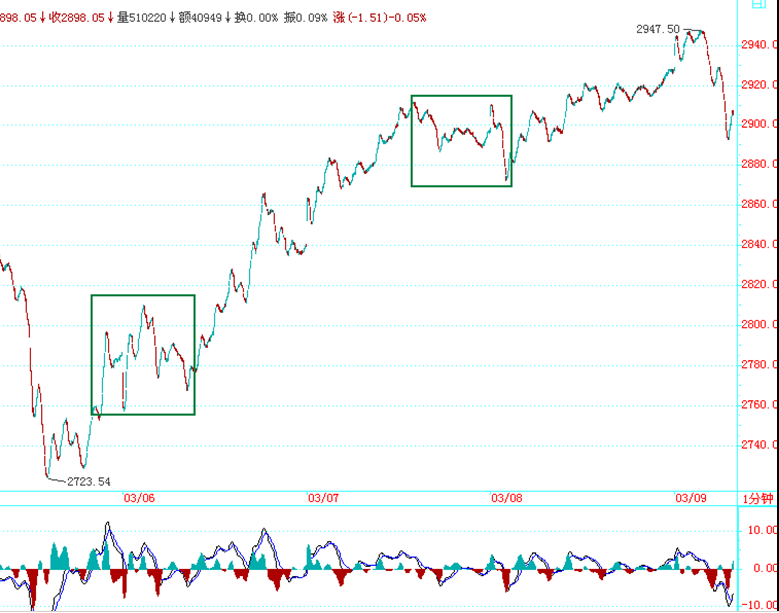

最近现实中，正构建一个传媒平台，和汉奸打仗，必须对舆论有所引导，这些事情是必须干的。

HYPERLINK "http://blog.sina.com.cn/u/1215172700" \t "_blank" 缠中说禅2007-03-08 16:10:43 [举报]

引用：“昨天尾盘与今天早盘构成的5分钟回试”分析：我认为这是个2个一分钟中枢由于波动区间重叠而形成的5分钟的盘整走势。问题：请问缠师，这个盘整走势的背弛我怎么看不明白啊，今早的下跌一段力度明显大于昨天刚开始下跌的力度，怎么也转折了呢？

==

从a+B+b的角度，是算柱子的面积而不是长度的最长处，看5分钟图就更明显了。从纯中枢的角度，5分钟中枢，昨天尾盘就形成，后面的拉以及今早的跳都是围绕的震荡。

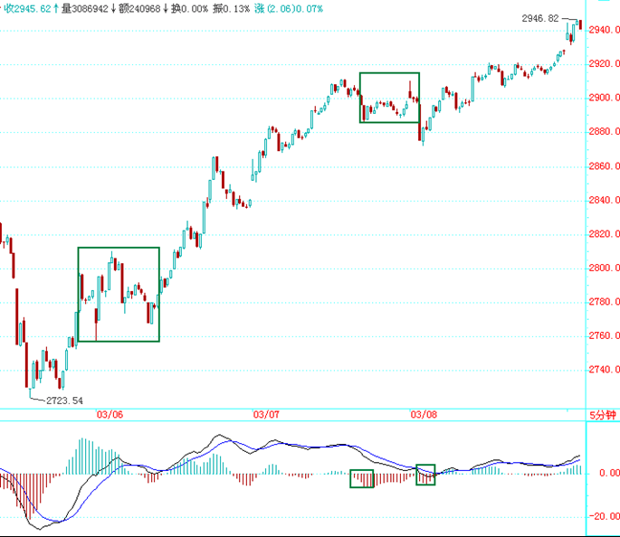

缠中说禅：2007-03-08 16:38:56

楼主好！关于走势和中枢的级别问题，经反复阅读原文和大家讨论，有以下结论，请楼主指正：同级别的三个走势的连接，比如“趋势＋盘整＋趋势”，盘整的中枢级别高于趋势的中枢级别。为方便清晰起见，不用次级别等概念，用实际级别举例来说如下：

“日线趋势＋日线盘整＋日线趋势”组合中，日线趋势至少包含两个“日线中枢”，而日线盘整只包含一个“周线中枢”。进一步推论有日线盘整至少包含三个“日线中枢”。

根据以上结论，按中枢的定义，周线中枢的组合可以有：

“日线趋势＋日线反趋势＋日线趋势”， “日线趋势＋日线盘整＋日线反趋势”，

“日线趋势＋日线盘整＋日线趋势”，“日线盘整＋日线盘整＋日线盘整”，。。。。。。等等

但从周线级别角度看，上述组合如果是一个完成的次级走势的话，仅仅是一个日线盘整！这个组合中只包含了一个周线中枢！

其中“日线趋势＋日线盘整＋日线趋势”组合，站在周线角度看如果是一个未完成的走势的话，则可能是周线趋势的一部分，也可能是周线盘整中的一段。

所以日线走势组合连接的含义，只有在周线级角度看才有意义。站在两个级别角度分别看，则有多义性。

以上走势组合只考虑了同级走势组合连接的情况。对于不同级别走势的连接情况怎么分析，还请楼主指教。

==

临走回答一下。你不能把两种不搭界的看法混在一起。按中枢看，就严格按中枢的定义来，其后在中枢结束前的所有走势，都可以看成是围绕中枢的震荡过程。至于仔细的分类，以后会说到。

这个问题，上面回答，昨天开始的这个5分钟中枢时已经有所回答。这个中枢，可以有两种看法，a+B+b，这样就是走势组合的看法，这样有一种判断。而单纯从中枢看，前三段就是中枢，后面是震荡，这又是一种看法，这就用离开的力度来判断。两种方法如果都有同样的结论，那自然就是最准确的结论，这个区间套的方式是一样的。具体以后课程都会说到，必须走了，再见。

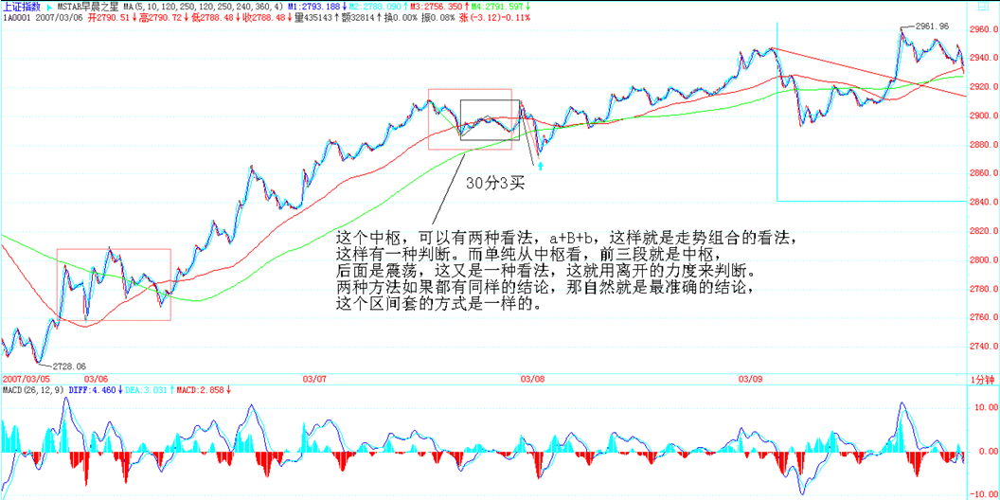

## 教你炒股票35：给基础差的同学补补课

(2007-03-09 11:51:34)

下午，那媒体要开组建筹划会，本ID必须参加，先把帖子放上来。大盘走势昨天已提示“现在依然存在重新跌回这5分钟中枢，从而扩展成新的30分钟中枢的可能，所以2915是不能有效跌破的，否则将扩展出新的30分钟中枢”。早上一典型的5分钟顶背驰让这情况变得天经地义。昨天第三类买点后，理论上两种可能之一就是演化成大级别中枢，今天就是一经典演示。该中枢从7日13点多的2911算起，形成后，和前几天下面那30分钟中枢操作一样，市场又给一次相同类型的操作机会。不多说，最近很忙，对大家照顾不周，抱歉了。

个人的理解能力之间相差太大，自然就有先后之别，因此用一堂课给基础差的同学补补课也是应该的，而且很多自以为基础好、明白的，看看也有益，有些细微处的理解也不一定能完全到位。前面课程，最基础的无非两方面，一、中枢；二、走势类型及其连接。这两方面相互依存，如果没有走势类型，中枢也无法定义；而没有中枢，走势也无法分出类型。如果理论就此打住，那么一个循环定义就不可避免。要解决该循环，级别的概念是不可缺少的。有了级别，一个严格的递归式定义才可以展开。

所谓的最低级别，就如量子力学的量子概念，物理世界不是想当然地无限连续的，而市场的交易同样如此。最严格去定义，每笔的交易是最低级别的，连续三笔相同价位的交易，就构成最低级别的中枢。有一个最低级别中枢的走势，就是最低级别的盘整走势类型；有两个最低级别中枢的走势，就是最低级别的趋势走势类型，如果第二个中枢比第一个高，那就是上涨走势类型，反之就是下跌走势类型。一般来说，假设依次存在着N（N>2）个中枢，只要依次保持着第N个中枢比N-1个高的状态，那么就是上涨走势类型的延续；依次保持着第N个中枢比N-1个低的状态，就是下跌走势类型的延续。显然，根据上面的定义，在最低级别的上涨里，只要也只有出现依次第N个中枢不再高于、即等于或低于第N-1个的状态，才可说这最低级别的上涨结束。最低级别下跌的情况与此相反。

上面就用最低级别的中枢把走势在最低级别上进行了完全分类，而三个连续的最低级别走势类型之间，如果发生重叠关系，也就是三个最低级别走势类型所分别经过的价格区间有交集，那么就形成了高一级别的缠中说禅中枢。有了该中枢定义，依照在最低级别上的分类方法，同样在高级别上可以把走势进行完全的分类，而这个过程可以逐级上推，然后就可以严格定义各级别的中枢与走势类型而不涉及任何循环定义的问题。但如果按严格定义操作，必须从最低级别开始逐步确认其级别，太麻烦也没多大意义，所以才有了后面1、5、15、30、60分钟，日、周、月、季、年的级别分类。在这种情况下，就可以不大严格地说，三个连续1分钟走势类型的重叠构成5分钟的中枢，三个连续5分钟走势类型的重叠构成15或30分钟的中枢等话。在实际操作上，这种不大严格的说法不会产生任何原则性的问题，而且很方便，所以就用了，对此，必须再次明确。

以上这些，都在前面反复提到，但很多人好象还是糊涂，不妨最后再说一次。显然，站在任意一个固定级别里，走势类型是可以被严格划分的。例如，说一个5分钟的走势类型，显然不可能包含一个30分钟的中枢，因为按定义，一个单独的5分钟走势类型无论如何延续，也不可能出现一个30分钟的中枢。要形成一个30分钟的中枢，显然只能是3个以上5分钟走势类型的连接才可能。走势类型与走势类型的连接，这两个概念不可能有任何含糊的地方。5分钟走势类型，必须包含也最多包含5分钟级别中枢，至于是1个还是5个，都不影响是5分钟走势类型，只不过可被分类成是5分钟级别的盘整类型还是趋势类型而已。

显然，一个高级别的走势类型必然就是由几个低级别的走势类型连接而成，但不一定都是次级别的走势类型，例如，a+B+b，B是30分钟中枢，由3个5分钟走势类型构成，a、b是1分钟走势类型，那么a+B+b这个30分钟走势类型就能分解成2个1分钟走势类型和3个5分钟走势类型的连接。但我们还可以通过拆散重分，使得一个高级别的走势类型必然就是由几个次级别的走势类型连接而成，由于中枢里至少有三段次级别走势类型，所以就有了 “缠中说禅走势分解定理二“：任何级别的任何走势类型，都至少由三段以上次级别走势类型构成。

例如，还是上面a+B+b的例子，估计很多人怎么都看不出为什么这分解定理一定成立。其实，不妨假设B中有三段5分钟走势类型，分别表示为B1、B2、B3，那么a+B+b=a+ B1+B2+B3+b=（ a+ B1）+B2+（B3+b），显然（ a+ B1）、B2、（B3+b）都是5分钟走势类型，这就是该分解定理所说的东西。学过一点抽象代数的都容易理解上面的话，用抽象的话说，就是走势类型连接这种运算是符合结合律的。但走势类型的连接运算不符合交换率，这就是该运算的特别之处。只要明白了走势类型连接运算的结合性，那就不难同时明白 “缠中说禅走势分解定理一”：任何级别的任何走势，都可以分解成同级别“盘整”、“下跌”与“上涨”三种走势类型的连接。

其实，就像量子力学有多种数学的处理形式，本ID的理论，同样可以用抽象代数的方法来处理，只是那样的话，就更少人能看懂了。而抽象的方法，不仅简洁，而且更能暴露其实质。这些以后再说了，现在还是用比较简单的、类似几何的方法去理解吧。

注意，走势是客观的，而用什么级别去分析这走势却是主观的。根据“缠中说禅走势分解定理一”，任何级别的任何走势，都可以分解成同级别“盘整”、“下跌”与“上涨”三种走势类型的连接，那么就意味着，按某种级别去操作，就等于永远只处理三种同一级别的走势类型及其连接。还是上面a+B+b的例子，站在5分钟级别的角度，这里有三个走势类型的连接，站在30分钟级别的角度，就只有一个走势类型。那么，前面反复说的，确定自己操作的级别，就是确定自己究竟是按什么级别来分析、操作。例如，5分钟级别上下上三段，意味着在5分钟级别上有2个底背驰、2个顶背驰，按买点买、卖点卖的原则，就有2次的完整操作；而按30分钟级别看，这里就没有买卖点，所以就无须操作。

从纯理论的角度，操作级别越低，相应的效率越高，但实际操作级别是不可能随意低的，而究竟按什么级别来分析、操作，和你的资金等具体条件相关。例如，T+1的情况下，按1分钟以下级别的操作，就面临着不能顺利兑现的风险，而系统的操作，要把所有可能的情况都考虑其中，因此完全按1分钟以下级别的操作是不可能的，除非是T+0。此外，级别越小，平均的买卖点间波幅也越小，因此，那些太小的级别，不足以让交易成本、交易误差等相对买卖点间波幅足够小，这样的操作，从长期的角度看，是没有意义的。所谓的交易误差，可以包括很多，例如你看见买点到你实际操作完成，必然有一个时间差，因此也就有了价位上的差别，这对于大级别无所谓，但对特小级别，那就需要特别精确，而这是不可能长期达到的。

因此，根据各种情况，你就可以相应定好自己的操作级别，这样就可以按照相应的级别分析、操作。也就是说，一旦该级别出现买卖点，你必须进入或退出。也就是说，在你的操作级别上，你是不参与任何调整或下跌走势类型的。有人曾问本ID为什么2001年后四年都不看股票，那很简单，就因为在本ID的操作级别上出现卖点，所以就全部退出，等有相应买点再说。制定了相应级别，是否按照次级别以下进行部分操作，那是操作风格问题，而实际上是应该安排这种操作的，特别当进入一个你的操作级别的次级别盘整或下跌，这是你可以忍受的最大级别非上涨走势，当然要操作一下来降低自己的成本。如果你的操作级别很大，那么其次级别的次级别，也可以用来部分操作的。这样，整个操作就有一定的立体性，从而更降低其风险，也就是能进行把成本降低这唯一能降低风险的活动，只有当成本为0时，才算真正脱离风险。

根据“缠中说禅走势分解定理”，很容易就证明“缠中说禅买卖点级别定理”：大级别的买卖点必然是次级别以下某一级别的买卖点。

这个证明很简单，具体就不写了，还用上面的例子来说明：a+B+b=a+ B1+B2+B3+b=（ a+ B1）+B2+（B3+b），最后的（B3+b）形成30分钟的买卖点，那么自然其极限点在b上，对b进行分解，如果该极限点不是b的买卖点，那么就意味着b还没完成，还要延伸下去，那么这极限点自然也不会是（B3+b）的极限点，这就矛盾了。但注意，大级别的买卖点不一定就是次级别的买卖点，在这个例子里，b可以是1分钟级别的，就不是30分钟级别的次级别了。所以只能说是次级别以下某一级别的买卖点。这也是为什么有时候，有时候一个1分钟的背驰就会引发大级别下跌的原因。在最规范的走势中，该大级别的买卖点刚好是下面所有级别的买卖点。当然，这还是一个很粗糙的定理，在以后的课程里，还有更精细的，这以后再说了。

读后感：

1、所谓的最低级别，每笔的交易是最低级别的，连续三笔相同价位的交易，就构成最低级别的中枢。

2、有一个最低级别中枢的走势，就是最低级别的盘整走势类型；有两个最低级别中枢的走势，就是最低级别的趋势走势类型，如果第二个中枢比第一个高，那就是上涨走势类型，反之就是下跌走势类型。

3、三个连续的最低级别走势类型之间，如果发生重叠关系，也就是三个最低级别走势类型所分别经过的价格区间有交集，那么就形成了高一级别的缠中说禅中枢。

4、走势类型与走势类型的连接，是不同的概念。

5、要形成一个30分钟的中枢，显然只能是3个以上5分钟走势类型的连接才可能。

6、一个高级别的走势类型必然就是由几个低级别的走势类型连接而成，但不一定都是次级别的走势类型。

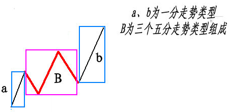

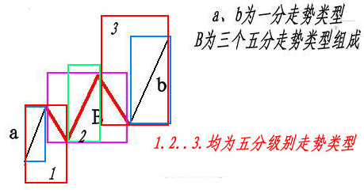

一个高级别的走势类型必然就是由几个低级别的走势类型连接而成，但不一定都是次级别的走势类型，例如，a+B+b，B是30分钟中枢，由3个5分钟走势类型构成，a、b是1分钟走势类型，那么a+B+b这个30分钟走势类型就能分解成2个1分钟走势类型和3个5分钟走势类型的连接。

但我们还可以通过拆散重分，使得一个高级别的走势类型必然就是由几个次级别的走势类型连接而成，由于中枢里至少有三段次级别走势类型，所以就有了 “缠中说禅走势分解定理二“：任何级别的任何走势类型，都至少由三段以上次级别走势类型构成。

例如，还是上面a+B+b的例子，估计很多人怎么都看不出为什么这分解定理一定成立。

其实，不妨假设B中有三段5分钟走势类型，(如上图）分别表示为B1、B2、B3，那么a+B+b=a+ B1+B2+B3+b=（ a+ B1）+B2+（B3+b），显然（ a+ B1）、B2、（B3+b）都是5分钟走势类型，这就是该分解定理所说的东西。学过一点抽象代数的都容易理解上面的话，用抽象的话说，就是走势类型连接这种运算是符合结合律的。但走势类型的连接运算不符合交换率，这就是该运算的特别之处。

7、“缠中说禅走势分解定理一”：任何级别的任何走势，都可以分解成同级别“盘整”、“下跌”与“上涨”三种走势类型的连接。

8、“缠中说禅走势分解定理二“：任何级别的任何走势类型，都至少由三段以上次级别走势类型构成。

9、缠中说禅买卖点级别定理”：大级别的买卖点必然是次级别以下某一级别的买卖点。

10、用抽象代数的方法来处理。这些以后再说了

11、确定自己操作的级别，就是确定自己究竟是按什么级别来分析、操作。

12、对特小级别，那就需要特别精确，而这是不可能长期达到的。(交易误差)

(2007-03-09 11:51:34)

下午，那媒体要开组建筹划会，本ID必须参加，先把帖子放上来。大盘走势昨天已提示“现在依然存在重新跌回这5分钟中枢，从而扩展成新的30分钟中枢的可能，所以2915是不能有效跌破的，否则将扩展出新的30分钟中枢”。早上一典型的5分钟顶背驰让这情况变得天经地义。昨天第三类买点后，理论上两种可能之一就是演化成大级别中枢，今天就是一经典演示。该中枢从7日13点多的2911算起，形成后，和前几天下面那30分钟中枢操作一样，市场又给一次相同类型的操作机会。不多说，最近很忙，对大家照顾不周，抱歉

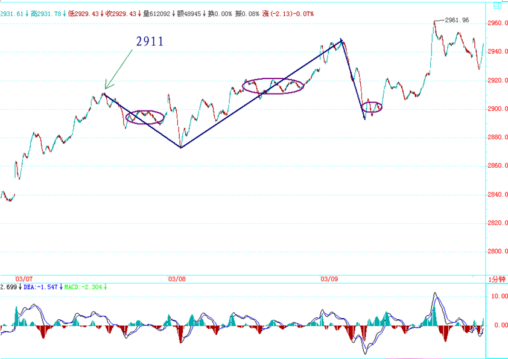

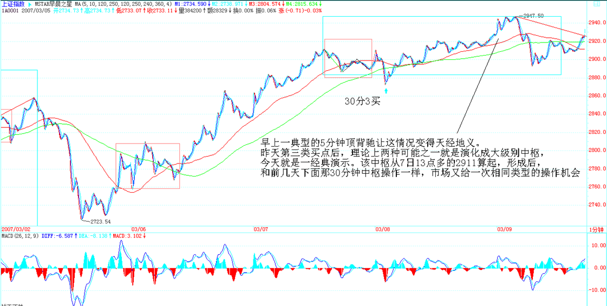

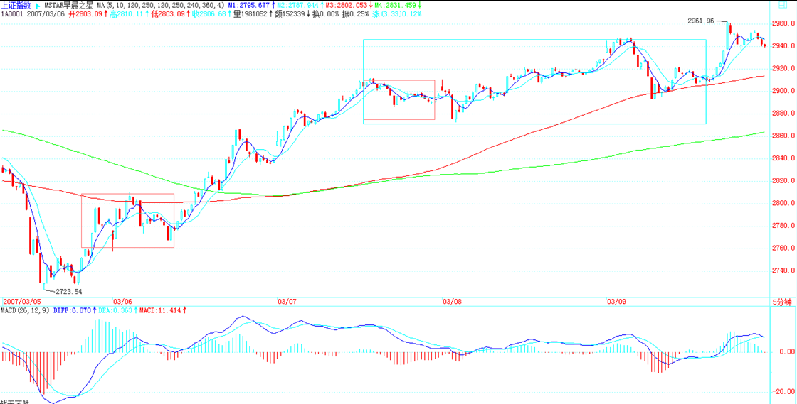

对不起，太忙，马上要外出。

(2007-03-11 11:15:55)

今天还有三个会面，晚上回来，有时间再补今天的帖子，好消息是上传的网站好象可以了。先下，再见。

刚回来，写不了什么，上次周末音乐会29：没有音乐的声乐时代 还有欠帐补上，但网站不稳定，可能听有点困难。恰好看到“大盘”一些中枢相关图链接被新浪删了，本ID抢救上来，可以去看看，各位之间能互相帮助是最好的，本ID最近太忙，可能照顾不周。晚，下了，再见。

HYPERLINK "http://blog.sina.com.cn/u/1215172700" \t "_blank" 缠中说禅2007-03-12 15:42:41 [举报]

今天的大盘没什么可说的，今天上周五完成的30分钟中枢的延伸过程，只要5分钟的回试不跌破2911的中枢上沿，那么就要形成第三类买点，至于后面是形成中枢新生而延续上涨，还是中枢的扩展成日线级别，自然就走出来了，无须预测。还不会看图的，就看5日线，只要5日线不破，就是强势，就没问题。

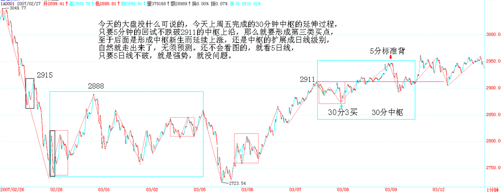

各股也没什么可说的，以前说的板块都没问题，现在关键是心理面上的影响，对3000点有点心理阴影，慢慢修复。而汉奸也企图利用两会结束，人们普遍的见好就收心理发难，所以这方面的斗争还将延续。深圳由于接近外边，所以受的影响更大，也走得弱点，如果深圳重新走强，那问题就简单了。汉奸做空也只为了买回来，现在世界上没有任何有实力的机构敢说完全放弃中国市场，别说5年，2年都不敢，这样，你说汉奸又能翻多大的浪？甚至一个周中枢都不一定给他们面子。

缠中说禅：2007-03-12 15:52:31

缠姐，为什么到目前位置还拿2911 是的中枢来判定。而不拿临近的中枢呢??

==

这次上来就是两个中枢2858下面一个，2911下面一个，从而形成30分钟级别的上涨，(注：这两个30分中枢震荡高点有重叠，后面走势完成后第二个中枢后移，满足不叠的要求）现在的问题是这个上涨是否延续，还是最后演化成a`+B型。

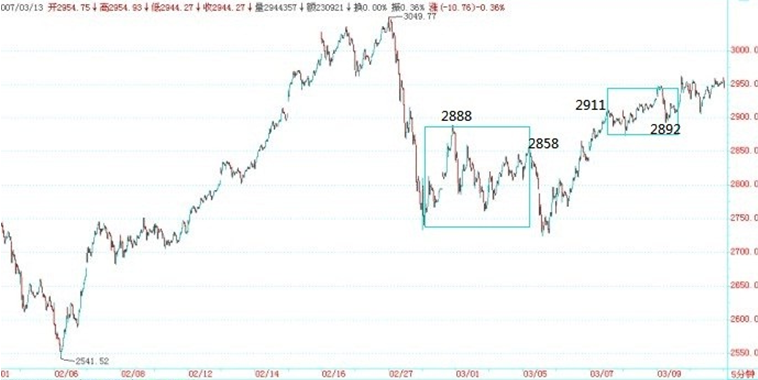

HYPERLINK "http://blog.sina.com.cn/u/1215172700" \t "_blank" 缠中说禅2007-03-12 16:28:30 [举报]

强烈呼吁：禅主：最近有些迷惑，连以前学的也有些吃不准了。希望您花一点时间，把最近的走势，从5分钟到30分钟都给说一次，中枢在哪里形成，怎么上去，怎么盘整的。接下来是怎么判断。学的东西有些回退。希望禅主给一次清晰的讲解。群里很多同学也跟我一样。谢了！

==

每天都在说，像8日2892形成第三类买点，然后上去最后扩展成30分钟中枢，那天还特意中午上来发帖子，告诉新的中枢是从7日的2911算起。注意，本ID的话都是有针对性的，当下的指出才是最有学习效果的，现在回头看，又变成理论干巴巴的分析。当下的理解，你整个身心都会关注着，这样的理解对形成直觉是有好处的。

任何走势都逃不过本ID的理论，大盘每天的走势就是免费的、最鲜活的教程。你必须随时能回答，现在大盘在干什么，例如，今天整天就对2911中枢上的震荡，早上的跳水看似恐怖，但却在2911附近止住，证明其向上的动力还是强的。但由于没在2911之上，所以还不能算是第三类买点。然后又是一个5分钟的上去，明天只要任何5分钟的回拉不跌破2911，又形成新的第三类买点。但后面并不意味着一定继续上扬，特别是第二个中枢后，演化成更大级别的中枢，也就是日线中枢的可能是存在的。这一切不用预测，当下看就可以。

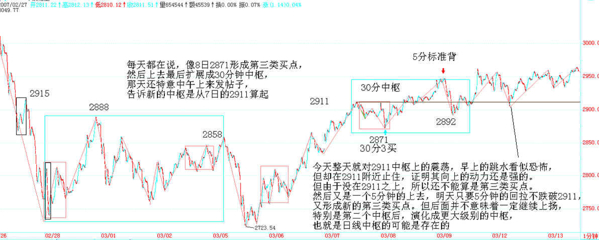

缠中说禅：2007-03-12 16:31:55

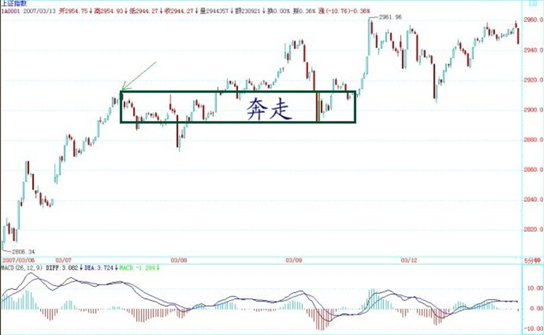

对于奔走型，我常识着说下自己的看法.就是不断的进行中枢延伸.......然后一旦有突破中枢，然后回抽不破最高点ZG， 就说明有第三买点，对于大盘来说，就是上攻.现在关键就是对ZG的判断，从2911来看的话，应该是从第一段的那个最高点算的.不知道JJ的意思如何.请JJ 明教

==

对，第二个30分钟中枢从2892到2911。这次上来的走势，如同标准的教科书，好好仔细研究中枢的扩展、延伸等问题。

缠中说禅：2007-03-12 16:33:45

我仍的是不是就是 你说的那种奔走型的 向上突破了？

==

奔走型向上，就是第二段特别高，第三跌跌破一点第一段高点那种。

## 教你炒股票36：走势类型连接结合性的简单运用

(2007-03-13 09:00:49)

上堂课提到走势类型连接运算的结合性，也就是走势类型的连接符合结合律，即A+B+C=（A+B）+C=A+（B+C），A、B、C的走势类型级别可以不同。因此，站在多义性的角度，根据该结合律，就不难知道，任何一段走势，都可以有很多不同的释义。必须注意，多义性不是含糊性，一个含糊的理论，其分类、概念等呈现的含糊性，只是证明该理论基础的含糊。而多义性，是站在一个严格、精确的理论基础上，用同一理论的不同视角对同一现象进行分析。

一个最简单的释义角度，就是级别，任何一段走势，都可以根据不同的级别进行分解，不妨用An-m的形式表示根据n级别对A段进行分解的第m段，就有， A=A1-1+A1-2+A1-3+…+A1-m1=A5-1+A5-2+A5-3+…+A5-m5=A30-1+A30-2+A30-3+…+A30-m30= A日-1+A日-2+A日-3+…+A日-m日等等，显然这些分解都符合本ID理论。而根据某级别进行操作，站在纯理论的角度，无非等价于选择该等式列中某个子式子进行操作，这在上一课中已经有具体说明。

还有一种应用，就是关于走势的当下判断。当下判断，其基础在于采取的分解方式。例如，一个按5分钟分解的操作角度与一个按30分钟分解的操作角度，在同一时间看到的走势意义是不同的。更重要的是，在5分钟分解中完成的走势，在30分钟却不一定完成。例如A+B，A、B都是5分钟的走势类型，那么A+B走势，对于30分钟的分解就是未完成的。根据走势必须完美的原则，未完成的走势必完成，也就是，在不同的分解角度，可以在当下看到不同级别的未完成走势根据走势必完美原则产生的运动，这方面的仔细分析留待专门的课程。

还有一种应用，就是把走势重新组合，使得走势更加清晰。很多人一看走势就晕，最主要是不了解走势连接的结合性，任何的走势，在结合律上，都可以重新组合，使得走势显示明显的规律性。假设A+B+C+D+E+F，A、C、E是5分钟级别的，B、D、F是30分钟级别的，其中还有延伸等复杂情况。这时候，就可以把这些走势按5分钟级别重新分解，然后按中枢的定义重新组合走势，按结合律的方法，把原来的分解变成A`+B`+C`+D`+E`+F`，使得A`、B`、C`、D`、E`都是标准的只是30分钟级别，而最后的F`变成在30分钟意义上未完成的走势，这样进行分析，就会很明晰了。当然，具体的组合有很多可能，如何根据当下的走势选择一种最有利指导操作的，就是考功夫的事情。

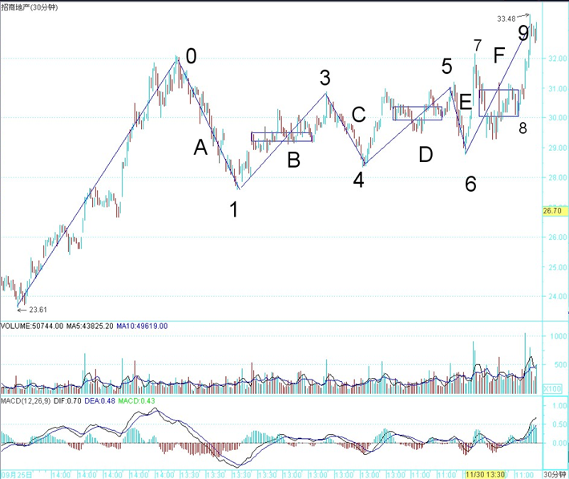

而这种根据结合律的最佳组合，是根据市场当下的走势随时变化的，而所有的变化，都符合理论要求且不会影响实际操作，是对实际操作起着更有力的帮助。例如，在最近走势中，30分钟图上，2760到2858这30分钟中枢，03081000的5分钟回抽确认了一个第三类买点，然后其后就继续走出一个新的30分钟中枢，而030810005分钟回抽低点2871点比上一中枢的最高点2888点要低，而后来关于03071330开始的这个30分钟中枢出现延伸，这样，我们就可以对这个分解进行重新组合，给出一个更清晰的组合方法，把03081000的5分钟回抽组合到03051330开始的这段5分钟走势中，形成一个5分钟的上涨，然后新的30分钟中枢就从03091030，这样的好处在于，这个中枢震荡的低点2892点比2888点高，如果其后的震荡不出现跌破2888的走势，那么就是一个30分钟的上涨走势形成了。但在这个新的中枢被一个新的第三类买点有效突破前，依然存在震荡跌破2888点甚至最终确认中枢扩展。但这样的重新组合，对看图就有了帮助。当然，站在纯中枢的角度，依然可以坚持让新中枢从03071330开始，这样对具体的操作也没有太大影响，但在判断上就没有重新组合的看起来方便了。

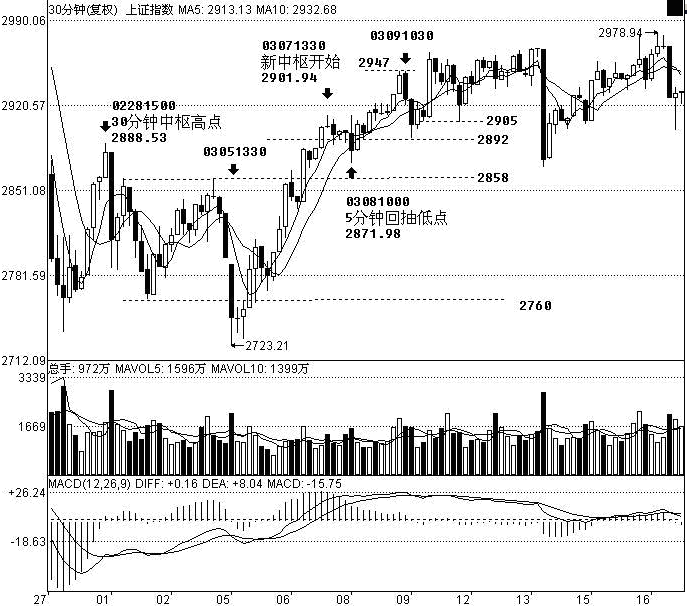

注意，这种重新组合，不涉及任何预测性，有人可能要问，那么为什么不一开始就把03081000的5分钟回抽组合到03051330开始的这段5分钟走势中？因为这种组合不利于操作，站在这种组合下，030810005分钟回抽的第三类买点意义并没有被揭示，是仅仅被局限在一个小的5分钟走势范围内，按照这种组合，就会很恐慌地等待背驰，之所以这样，是因为对走势的理解不够深刻，看不到不同组合反映的意义。而任何组合的反映都是有意义的，对这些组合意义的全面把握，就是一个工夫上的长进了。此外，组合的一个要点在于，尽量避繁就简，因为中枢扩展比较复杂，如果有组合使得不出现扩展，当然就采取该种组合更有意义。有人可能要问，那么中枢扩展的定义是否不适用？当然适用，中枢扩展的定义是在两个中枢都完全走出来的情况下定义的，而实际操作中，往往第二个中枢还没有走完，还在继续延伸中，所以，除非出现明确的、符合理论定义的破坏，就可以根据有利于判断、操作的原则，对走势进行当下的组合。但必须强调的是，当下采取什么组合，就要按该种组合的具体图形意义来判断、操作，例如，现在把03091030当成新30分钟中枢的起点，那么中枢的位置就变成2947到2905，这样后面第三类买点的位置就有了新的标准。当然，你依然可以还是按03071330开始30分钟中枢，这样，中枢的位置就是2911到2892，这样，第三类买点的可能位置就不同了。

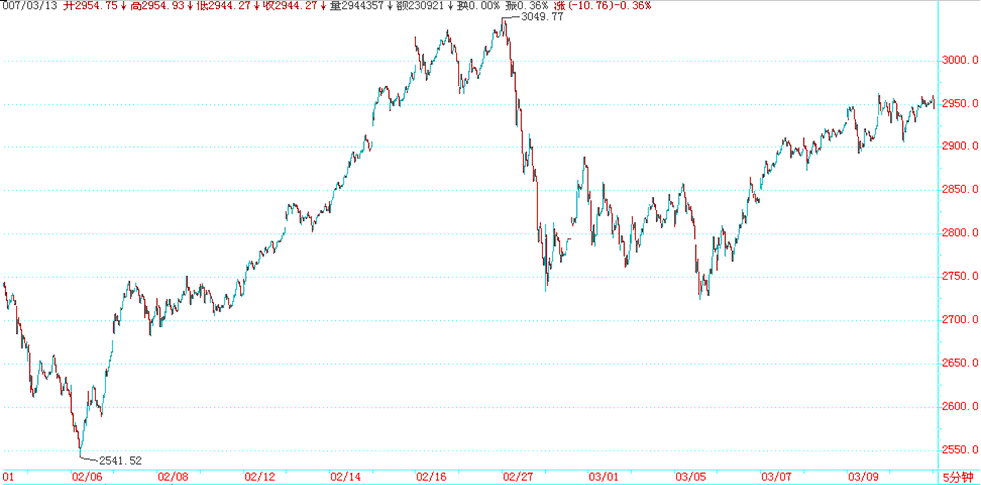

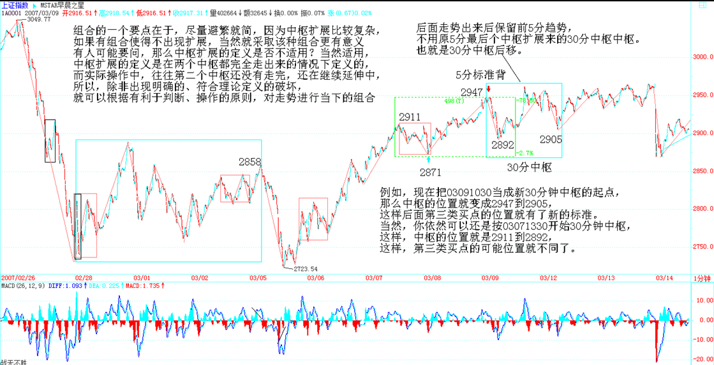

还有一种更重要的应用，就是在中枢的震荡中。围绕中枢的震荡，不一定都是次级别的，例如，一个日线中枢，围绕他的震荡，完全可以是30分钟以下的任意级别，甚至是一个跳空缺口，例如有些股票，完全可以今天一字涨停，明天一字跌停，跳来跳去的。一般这种走势，一般人看着就晕了。但如果明白走势连接的结合性，就知道，无论怎么跳，最终都要形成更大级别的，只要不脱离这日线中枢，最后都至少会形成30分钟级别的走势。任何围绕日线级别的震荡，最终都必然可以按如下方式进行分解：A30-1+A30-2+A30-3+…+A30-m30+a，a是未完成的30分钟走势类型，至少a依然围绕日线中枢继续震荡，那a一定最终会完成30分钟的走势类型。显然，这里，m30<9，否则就会变成周的中枢了，这样整个的分解就要按日线来，而道理是一样的。

不过，更有实际意义的是，上面的a如果不再围绕日线震荡，例如，假设 a是一个5分钟级别的，而其后一个5分钟级别的反抽也不回到中枢里，按照日线中枢，这并不构成第三类买卖点，但对于A30-m30，可能就构成30分钟的第三类买卖点。由于走势都是从未完成到完成，都是从小级别不断积累而来，因此，对于真正的日线第三类买卖点来说，这A30-m30的第三类买卖点，肯定在时间上要早出现，对于A30-m30，这绝对安全，但对日线却不一定，因为这A30-m30的第三类买卖点后完成的30分钟走势，可以用一个30分钟走势又重新回到日线中枢里继续中枢震荡。但这个A30-m30的第三类买卖点依然有参与的价值，因为如果其后的30分钟出现趋势，最后如果真出现日线的第三类买卖点，往往就在30分钟的第二个中枢附近就形成了，根本回不到这A30-m30的第三类买卖点位置，因此，这样的买卖点，即使不符合你的操作级别，例如，如果你是日线级别操作的，但一旦这样的A30-m30的第三类买卖出现，至少要引起你充分的重视，完全可以适量参与了，一旦其后出现趋势走势，就要严重注意了。

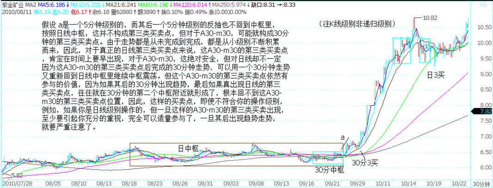

不应该对走势进行任何的预测，但所有已走出来的走势，却可以根据级别与结合律等随意组合，无论任何组合，在该组合下，都必然符合本ID的理论，而任何最终的走势，都在所有组合中完全符合本ID的理论，这也是本ID理论的神奇之处，无论你怎么组合，都不会出现违反本ID理论的情况。但能否找到最合适的组合以适应操作，以及根据不同的组合，对走势进行综合分析，这就和经验有关了。这些最适合的分解，都是有相应答案的，关键是你能否看出来，而这根本不涉及任何的预测，只是对已有走势的分解，与对理论的把握与图形的熟悉度相关。而这些都是一些最基本的工夫，但必须在当下的走势中不断磨练才能真正掌握。如果真能把握这些最基本的当下走势的最合理组合以及用不同组合进行综合分析，那就可以开始继续读初三了。

读后感：

1、多义性不是含糊性。

2、多义性，是站在一个严格、精确的理论基础上，用同一理论的不同视角对同一现象进行分析。

3、根据结合律的最佳组合，是根据市场当下的走势随时变化的，而所有的变化，都符合理论要求且不会影响实际操作，是对实际操作起着更有力的帮助。

4、课文学习用图：

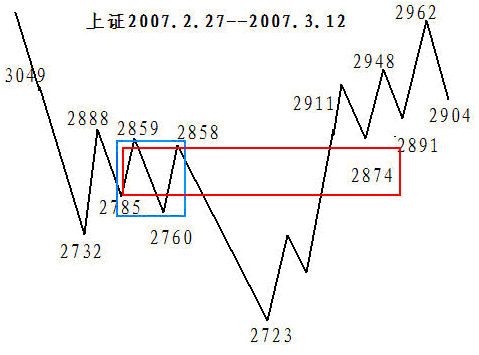

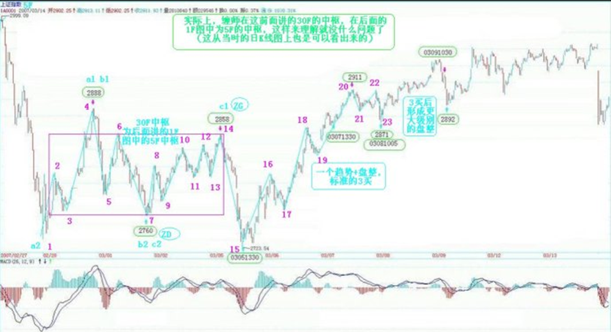

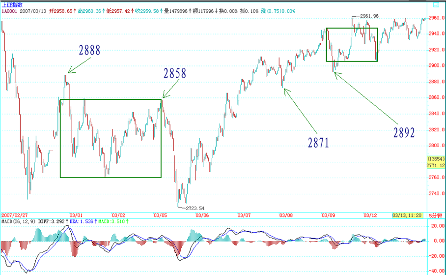

5、不同级别对同一走势的行进有不同的视角。

6、A+B+C=（A+B）+C=A+（B+C），A、B、C的走势类型级别可以不同。

7、用An-m的形式表示根据n级别对A段进行分解的第m段，就有， A=A1-1+A1-2+A1-3+…+A1-m1=A5-1+A5-2+A5-3+…+A5-m5=A30-1+A30-2+A30-3+…+A30-m30= A日-1+A日-2+A日-3+…+A日-m日等等

8、当下判断，其基础在于采取的分解方式。

9、不同的释义---一个最简单的释义角度，就是级别，还有一种应用，就是关于走势的当下判断，还有一种应用，就是把走势重新组合，使得走势更加清晰。还有一种更重要的应用，就是在中枢的震荡中。不过，更有实际意义的是，上面的a如果不再围绕日线震荡。

缠中说禅：2007-03-13 09:03:17

今天很忙，没时间上来了，课程下贴出来，各位先研究。先下，再见。

关于大盘个股说几句闲话

(2007-03-14 08:58:13)

昨晚汉奸他爸大跌，汉奸很兴奋地要为他爸下半旗，所以就出现今天的走势。本来，大盘就需要震荡，而今天汉奸为他家拉的阴线，依然在围绕新中枢震荡的范围里，只要第三类买卖点不出现，这种震荡就将延续。现在的问题是，难道以后汉奸家的姨丈姑父们有什么烂事都要中国股市陪着他们一惊一乍？所以，一个以反汉奸为任务的传媒就是必须的。

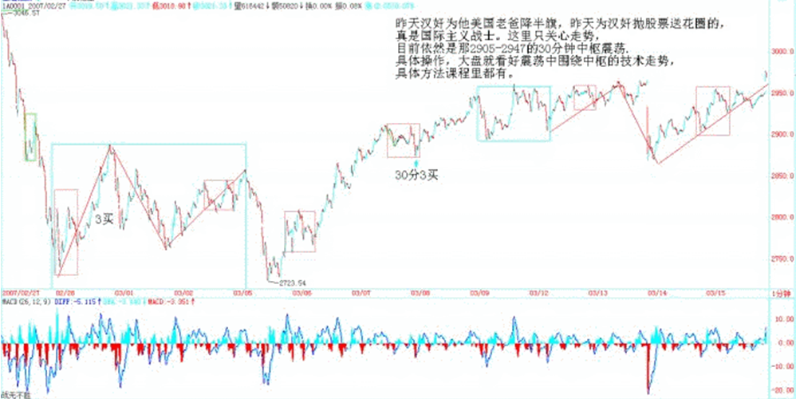

忙，昨天收盘没发帖，今早补几句。目前大盘中线就是一个日、周中枢的问题，刀没两头利，如果这里是日中枢，现在就直接上去，那么就进入背驰段；如果在这里继续震荡弄周中枢出来，其后可预期的上涨幅度就更可观一点。不过无论是什么中枢，大盘牛市第一波远没结束。

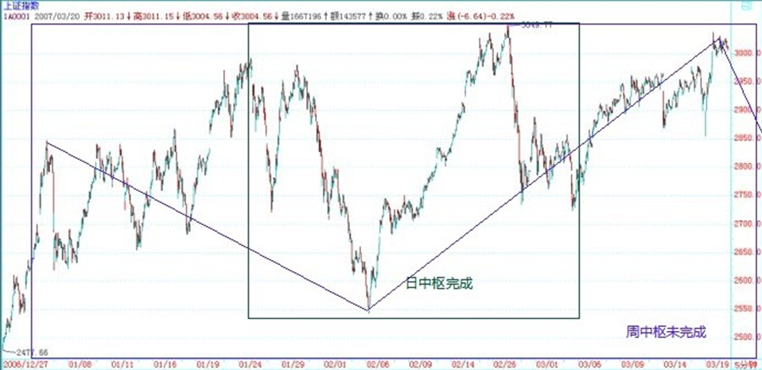

个股方面，从元旦开始一路出大型成分股、力挺二、三线股，春节前后更强调在低价三线股，目前，4元以下的非ST三线股基本没有了，前段说对5元上下的发动最残酷的进攻，很快也没进攻对象了。三线股的行情已经进入值得反思的阶段，除了真有题材与业绩支持的，已经进入短线的压力阶段，可以持有等卖点，但以没必要追高介入，特别那些业绩特差的。三线股上台阶后，其他股票就显示其价值。大型股票的启动还需要契机，资产注入等在前期强调的军工等板块中将继续蕴藏中线机会，农业、环保、科技之类的价值将逐步挖掘。

现在特别强调一个新板块，就是深圳中小板里的新上市小盘股票，一般流通都在2000万上下，总盘6000万上下，这类股票，即使在熊市中都不会有问题，牛市中就更有大的中线机会。回顾所有中小板的股票，在上市阶段介入的，最终有哪个不是获利多多的，因此中线的资金，可以多关注，比现在还去追三线股的尾巴行情有意义得多，具体介入看图就可以。

2007-03-14－15解盘

缠中说禅：2007-03-14 15:18:22

昨晚汉奸他爸大跌，汉奸很兴奋地要为他爸下半旗，所以就出现今天的走势。本来，大盘就需要震荡，而今天汉奸为他家拉的阴线，依然在围绕新中枢震荡的范围里，只要第三类买卖点不出现，这种震荡就将延续。

各股早上已经说了，现在的问题就在于，三线股的潜力有缩水，不可能把所有三线股都弄到比二线股还高，这样就乱套了。大盘现在最大的问题是，板块需要转换，一些有巨大中线潜力的二线股，将是主要目标。像今天早上说的那些，二线股还包括一些有高送配的股票，这在业绩公布时，都是常规性被操作的。

袖珍中小板的，值得中线关注。无非两种走势，一种是在开盘附近震荡出一个中枢后向上，一个是向下，向下的其实更有潜力，向下无非就两波，一旦出现日线背驰，就是中线大牛股。看看以前中小板中的走势就明白。向上突破的，可以在中枢震荡低点介入，来回弄短差直到出现第三类买点后就可以长抓一下，中小板一旦出现开盘后中枢的第三类买点，其后都有可观升幅。不明白的，把前面一些已经走出来的研究一下，对新股如何把握就有一个大概了。

缠中说禅：2007-03-15 08:57:05

最近特忙，收盘就一大堆事等着，早上才有时间发帖子。先下，再见。

缠中说禅：2007-03-15 15:23:22

马上要走，简单说两句。昨天汉奸为他美国老爸降半旗，昨天为汉奸抛股票送花圈的，真是国际主义战士。这里只关心走势，目前依然是那2905-2947的30分钟中枢震荡。明天两会要结束，汉奸是有以此发难的企图的，因此，相应的战斗还将延续。

汉奸认了这么多干爸，实力还是有点的，否则早就突破3000点一飞冲天。在这里不断震荡，就是要消耗汉奸的实力，壮大自己。汉奸现在的地盘也就剩下大盘金融等少数几个了，今年来这轮三线股的独立牛市行情，基本与汉奸无关，像昨天说的小盘股，也基本没汉奸什么事。汉奸有本事就压着金融股送终吧，指数不涨，一样天天大牛市，等哪天，工行中行有几乎变成最便宜的股票，本ID倒要看看汉奸还怎么压着。

具体操作，大盘就看好震荡中围绕中枢的技术走势，具体方法课程里都有。另外，具体还要看好个股，毕竟现在指数的意义不太大，只要不是最恶劣的单边走势，个股机会依然。

对不起，先下，再见。

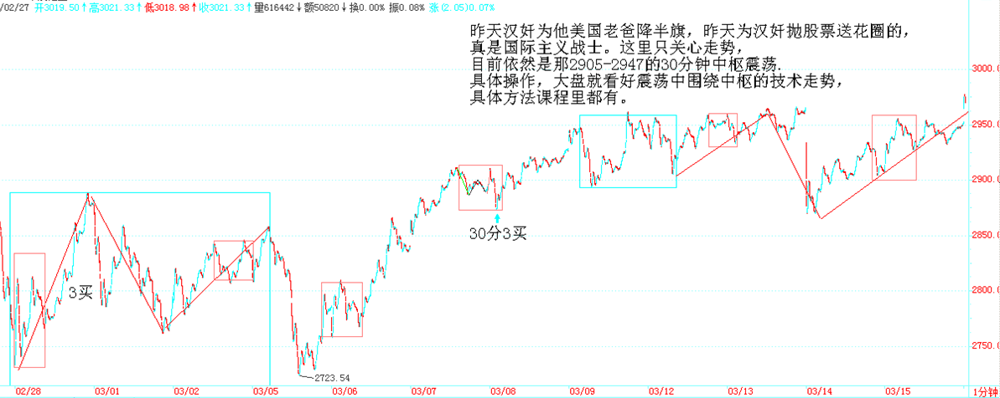

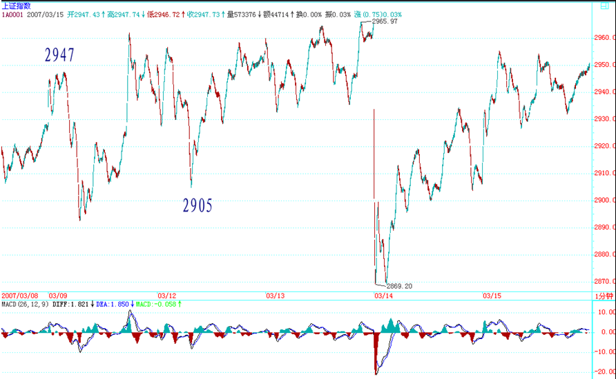

## 教你炒股票37：背驰的再分辨                                        (2007-03-16 11:51:32)

背驰问题说过多次，但发现还有很多误解。不妨用最典型的a+A+b+B+c为例子把一些经常被混淆的细节进行说明。

INCLUDEPICTURE "http://static3.photo.sina.com.cn/orignal/4ee974cbg71e40359c472&690" \* MERGEFORMATINET 

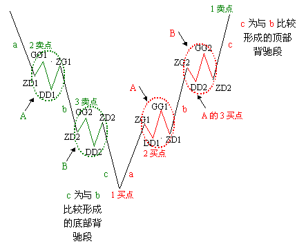

INCLUDEPICTURE "http://static6.photo.sina.com.cn/orignal/4ee974cbg71e403a5ff35&690" \* MERGEFORMATINET 

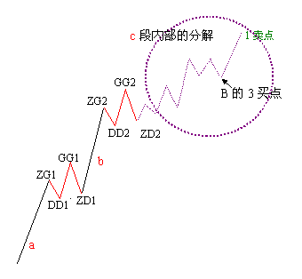

没有趋势，没有背驰，不是任何a+A+b+B+c形式的都有背驰的。当说a+A+b+B+c中有背驰时，首先要a+A+b+B+c是一个趋势。而一个趋势，就意味着A、B是同级别的中枢，否则，就只能看成是其中较大中枢的一个震荡。例如，如果A的级别比B大，就有a+A+b+B+c=a+A+（b+B+c），a与（b+B+c）就是围绕中枢A的一些小级别波动。这样，是不存在背驰的，最多就是盘整背驰。当然，对于最后一个中枢B，背驰与盘整背驰有很多类似的地方，用多义性，可以把b、c当成B的次级波动。但多义性只是多角度，不能有了把b、c当成B的次级波动这一个角度，就忘了a+A+b+B+c是趋势且A、B级别相同的角度。多义性不是含糊性，不是怎么干怎么分都可以，这是必须不断反复强调的。

其次，c必然是次级别的，也就是说，c至少包含对B的一个第三类买卖点，否则，就可以看成是B中枢的小级别波动，完全可以用盘整背驰来处理。而b是有可能小于次级别的，力度最大的就是连续的缺口，也就是说，b在级别上是不能大于c的。例如，如果b是次级别，而c出现连续缺口，即使c没完成，最终也延续成次级别，但c是背驰的可能性就很小了，就算是，最终也要特别留意，出现最弱走势的可能性极大。

还有，如果a+A+b+B+c是上涨，c一定要创出新高；a+A+b+B+c是下跌，c一定要创出新低。否则，就算c包含B的第三类买卖点，也可以对围绕B的次级别震荡用盘整背驰的方式进行判断。对c的内部进行分析，由于c包含B的第三类买卖点，则c至少包含两个次级别中枢，否则满足不了次级别离开后次级别回拉不重回中枢的条件。这两个中枢构成次级别趋势的关系，是最标准最常见的情况，这种情况下，就可以继续套用a+A+b+B+c的形式进行次级别分析确定c中内部结构里次级别趋势的背驰问题，形成类似区间套的状态，这样对其后的背驰就可以更精确地进行定位了。

最近太忙，不能写太长了。补充两句关于大盘目前的走势，说实在，现在如果要摆脱目前的中枢，没有金融股的配合基本是不可能的。但金融股由于某类人掌握得比较厉害，短线的攻击没问题，但一个持续的攻击，就有点困难了。不过金融股在中线角度，依然还是一大早的观点，用工行为例子，就是围绕5元上下的一个大级别震荡，要大跌，打压的人是要付出代价的。顺便说一句，中行里的汉奸实力小点，中行有奥运概念、业绩也较好一点，能否改造成一个反汉奸的武器，成为一个突破口，还需要很大的努力。其实这改造已经不是一天两天的事情，中行这几天已经连续比工行股价要高了，这就是成绩。具体的细节就不说了，总之，斗争是残酷的，是复杂的，不能赤膊上阵，要用最充分的耐心去消耗汉奸的实力。

下午一收盘就要去开反汉奸利器出炉的最后一次会议，就来不了了。大盘走势，很简单，在第三类买点出现前，继续震荡，这种走势已经反复很多次了，应该熟练应对了，所以也没必要多说了。

（注：例图节选2010年上证 2319-2681 1分趋势背驰区间套5分趋势背驰）

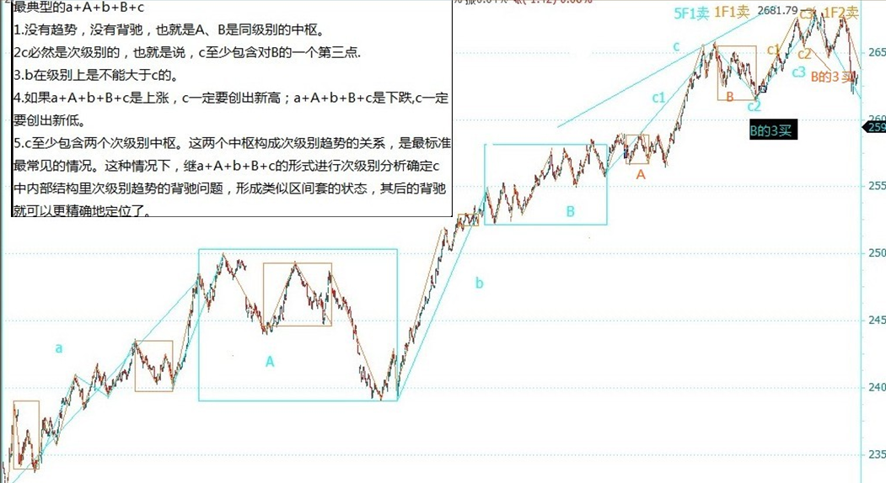

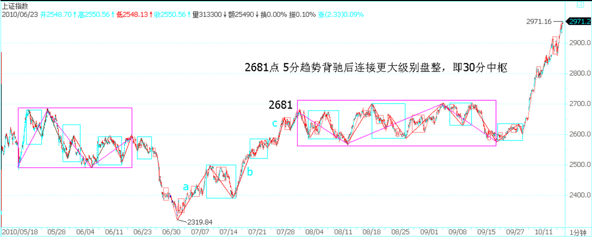

缠中说禅：2007-03-16 11:54:37

汉奸企图用两会结束打压的表演还会继续，这在昨天已经说了，所以斗争依然继续，结果不好说，努力吧。反正有的是时间，不会硬扛，但也不会放过任何一个契机的。先下，再见。

读后感：

1、没有趋势，没有背驰。

2、其次，c必然是次级别的，也就是说，c至少包含对B的一个第三类买卖点，否则，就可以看成是B中枢的小级别波动，完全可以用盘整背驰来处理。

3、如果a+A+b+B+c是上涨，c一定要创出新高；a+A+b+B+c是下跌，c一定要创出新低。

4、次级别震荡用盘整背驰，逐级定位。

5、注意非标准状态。

6、课文学习用图：

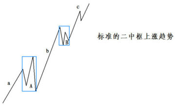

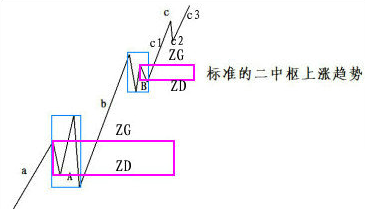

7、还有，如果a+A+b+B+c是上涨，c一定要创出新高；a+A+b+B+c是下跌，c一定要创出新低。否则，就算c包含B的第三类买卖点，也可以对围绕B的次级别震荡用盘整背驰的方式进行判断。对c的内部进行分析，由于c包含B的第三类买卖点，则c至少包含两个次级别中枢，否则满足不了次级别离开后次级别回拉不重回中枢的条件。这两个中枢构成次级别趋势的关系，是最标准最常见的情况，这种情况下，就可以继续套用a+A+b+B+c的形式进行次级别分析确定c中内部结构里次级别趋势的背驰问题，形成类似区间套的状态，这样对其后的背驰就可以更精确地进行定位了。

### 2007-03-16解盘：

现在如果要摆脱目前的中枢，没有金融股的配合基本是不可能的。但金融股由于某类人掌握得比较厉害，短线的攻击没问题，但一个持续的攻击，就有点困难了。不过金融股在中线角度，依然还是一大早的观点，用工行为例子，就是围绕5元上下的一个大级别震荡，要大跌，打压的人是要付出代价的。顺便说一句，中行里的汉奸实力小点，中行有奥运概念、业绩也较好一点，能否改造成一个反汉奸的武器，成为一个突破口，还需要很大的努力。其实这改造已经不是一天两天的事情，中行这几天已经连续比工行股价要高了，这就是成绩。具体的细节就不说了，总之，斗争是残酷的，是复杂的，不能赤膊上阵，要用最充分的耐心去消耗汉奸的实力。

缠中说禅：2007-03-16 11:54:37

汉奸企图用两会结束打压的表演还会继续，这在昨天已经说了，所以斗争依然继续，结果不好说，努力吧。反正有的是时间，不会硬扛，但也不会放过任何一个契机的。先下，再见。

神州自有中天日，万国衣冠舞九韶

(2007-03-19 08:52:42)

以美欧日为动力源的全球化经济在2000年网络泡沫后出现历史性的发展瓶颈，而中国经济的崛起，是资本全球化历史与现实的必然要求，是一个有别于欧美日的全球经济新动力源的必然选择，是一个拥有最多人口、最大潜在市场的新兴经济体的必然承担，是不以任何人的意志为转移的必然趋势。当中国经济成为全球化新动力源时，中国股市也应当成为世界股市的新龙头，成为面向世界的超级大市场。中国的交易所，必将成为世界性交易所，世界上的公司必将以能到中国上市为荣。这一切，将成为中国新一轮特大型牛市真正的动力源泉。对此的任何短视，都将错失这一历史性机遇。

从1986年9月26日延中实业上柜交易始，到2001年6月14日2245.42点止，近15年充满曲折的第一轮大牛市带来了其后一轮长达四年、幅度超过50%的全面调整，也留下了一个制度上存在严重缺陷的市场与无数的争论。所有的争论最终达成一个最基本的共识：股票，作为一种交易凭证，其最基础的制度必须保证所有股票都有相同的流通属性。2005年6月6日，六六大顺，以全流通为标志的制度性改革拉开新一轮大牛市的序幕。而中国股市的制度性改革，归根结底是顺应经济全球化背景下中国经济历史性崛起的必然抉择。

这一轮特大型牛市，至少同级别于第一轮大牛市。后者，即使从1990年的95点算起，最终涨幅也超过22倍。而世界股市的历史表明，第二轮大牛市的时间与幅度都无一例外地远远超越第一轮，即使按照最保守的1.5比例，由此可以推断，从998点起步已延续两年、上升2千点的新一轮特大型牛市，仍将至少再延续20年、上升3万点。站在中国成为全球经济新动力源的历史背景上，可以预言，这轮波澜壮阔的特大型牛市行情将分为三大阶段：

第一阶段行情，伴随着中国股市本身的制度性、结构性完善，其后，中国股市才真正具备参与全球化盛宴的资格。全流通、整体上市、两大交易所的功能重组、人民币逐步可自由兑换等，都不过是这种制度性、结构性完善的必然步骤。这一阶段，行情最主要体现在以权重股为代表的成分股上。在总市值超越GDP之前谈论股市的泡沫是可笑的，在中国股市总市值超越其GDP之前，第一阶段行情不会结束。

第二阶段行情，伴随着中国参与全球化进程的深入，越来越多的中国公司将逐步成长为全球化公司、中国市场将逐步成长为全球化市场、中国股市也将成长为与中国国际地位相匹配的全球化股市、大中华圈股市的一个彻底的结构性重组将成为现实。这一阶段，行情最主要体现在那些拥有全球成长性的股票上，以全球成长性为标志。在中国股市成为亚洲市值最大、最重要的股市之前，第二阶段不会结束。

第三阶段行情，伴随着世界全球化格局的历史性变化，中国经济将从新动力源变成最重要的动力源，中国市场也将成为世界上最重要的市场，正像中国GDP必将超越美国GDP，中国股市也将成为世界上最重要的股市，中国股市将成为整合、重组世界经济资源的最重要场所。这一阶段，行情最主要体现在那些拥有全球整合、重组能力的股票上，以全球整合、重组为标志。在中国股市成为世界上市值最大、最重要的股市之前，第三阶段不会结束。

中国需要世界，而全球化经济下的世界更需要中国，这是现实要求也是历史必然。在这样一个历史性背景下，即使出现所谓的泡沫，也只能是阶段性泡沫。让中国经济成为世界经济的新动力，让中国金融市场成为世界金融市场的新龙头，这就中国成为负责任大国所应该负起的历史性责任。而这一轮历史性大牛市，不过是这历史性责任的一个必然的历史性呈现。这历史性的舞台，将赋予所有参与者历史性的机会，激发其最大的潜能与创造。

正是：

西海东瀛涨落潮，商林股道冷炎飙。

神州自有中天日，万国衣冠舞九韶。

缠中说禅：2007-03-19 15:18:14

今天大盘走势，完全在设计之中。中行的启动，在周五已经提示。但对汉奸的战争，并不会因此而结束，更艰苦的斗争还在后面。3000点并不会因为一天的上攻而站稳。一个重要的问题就是，如果还是以老思维或者汉奸思维来统治市场的思维，那么罗杰斯之流最近的怪叫你就愿意听还是愿意听还是愿意听了。

(注：再次说明，禅师58课分段前后的级别不同，下图30分中枢为递归后的5分中枢。下图为递归级别1分趋势背驰后连接5分中枢的典型图）

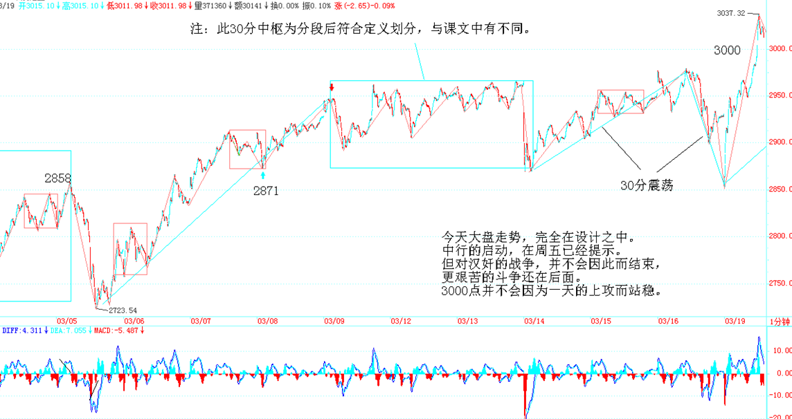

这次大盘成分股的启动能否成功，其实取决于市场的每个参与者，火点起来了，但是否燎原，这不是本ID能决定的，市场是大家的，不是本ID一个人的。本ID已经干了所有该干的事情，当然，本ID只会根据当下的情况采取不同的手法，一定不会狂接硬撑。只要火真的燎原了，什么汉奸都是白费的。

个股没什么说的，中国经济的大局在新的经济结构，所谓改变经济增长方式，因此站在中长线角度，前期一直强调的环保（特别强调过包括新能源）、农业、军工、科技等等板块都是值得中长线关注的，这是中国经济发展的新方向。

当然，短线决战在金融股，银行、保险等，都是决战场所。显然，汉奸目前的实力还是很厉害的，本ID已经有了长期抗战的准备，越震荡，成本越低，没什么大不了的。不过，一旦有机会突破，这机会是不会放过的。大盘具体走势，按照中枢自己就可以分析，本ID要先下，还有会议在后面。再见。

### 2007-03-20解盘

缠中说禅：2007-03-20 15:24:15

大盘今天的走势是最恰当的，上次上3000是一日游，现在至少是两日游了，缩量在这里整理站稳再谋求上攻，这样是最稳妥的。其实3000点什么都不是，只是一个心理问题，包括散户与管理层。管理层的水平，其实经常连散户都不如。

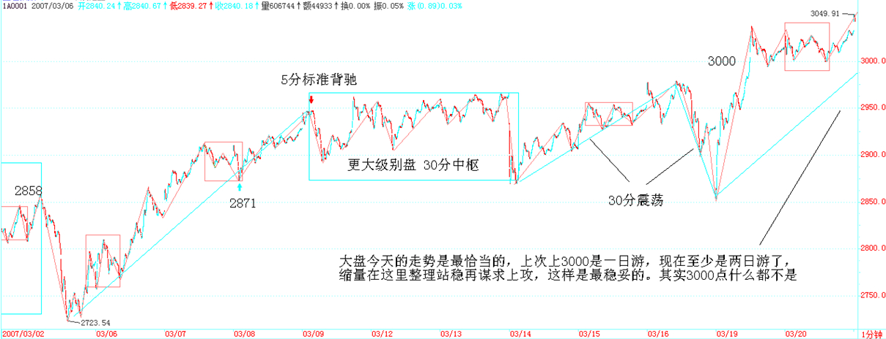

汉奸在这里肯定是要干活的，前几次喜欢用嘴配合，这次还这样就太没意思了。难道汉奸用嘴就能得到快感？总之，在这里等汉奸看能出些什么花招，最好把所有花招都使出来，让散户也多点见识，心理承受得到锻炼。

个股没什么可说的，中行等休息，其他股票活跃，这是最好的情况。不过还是要提醒，如果是中线持股，除了用部分筹码打短差，就要持得住。并不是敢涨停的就一定是好股票。涨停算什么，最后能涨多少才是真实的。像前面说过某大叔抓不住的股票，就是600195的中牧，从去年4月中3元多开始到11元，从来就没涨停过，也没阻止他一年不到翻了5倍。如果一个股票涨了2倍还从来没涨停过，只有一种可能，就是他要涨5倍甚至10倍，因此根本不屑于用涨停来现眼。

反复震荡爬升的股票是股票中的极品，可以弄出无数的短差来，问题不是这股票有没有涨停，而是这股票波动大吗？最终潜力大吗？一定要把问题搞清楚。天天追涨停的，永远只能是散户，大一点的资金都根本不可能这样操作的。

大盘2007-03-20 10:07:27 [举报]

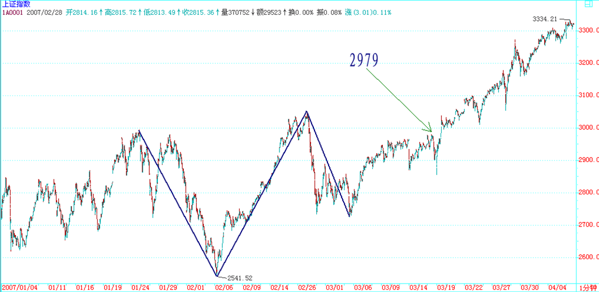

由于目前的上证指数已经突破3000点，也就是突破了上周的2978高点，因此从走势组合来看，似乎完全可以说周线中枢并没有最终形成，因为如果看作周线中枢，似乎日线的下走势没有走完，因此站在60分钟角度来看，1.24-3.5日形成日线中枢，目前是60分钟的上走势，因此今天15分钟回试低点不跌破2979就可构成60分钟3买，如果上去后60分钟或者30回试不跌破1.24日高点2922.66，就构成日线3买，当然不能有效突破3050，反复盘整成周线中枢仍然有可能。博主不在，大家有时间讨论讨论目前这个调整大中枢的具体情况

## 教你炒股票38：走势类型连接的同级别分解                            (2007-03-21 15:23:21)

站在纯操作的角度，由于任何买卖点，归根结底都是某级别的第一类买卖点，因此，只要搞清楚如何判断背驰，然后选好适合的级别，当该级别出现底背驰时买入，顶背驰时卖出，就一招鲜也足以在市场上混好了。不过，任何事情都应该究底穷源，这有点像练短跑，跑到最后，提高0.01秒都很难，所以越往后，难度和复杂程度都会越来越深，如果一时啃不下来，就选择可以把握的，先按明白的选择好操作模式，等市场经验多了，发现更多需要解决的问题，有了直观感觉，再回头看，也不失为一种学习的办法。当然，都能看懂并能马上实践，那最好。

前面谈了有关走势类型连接结合的多义性问题，虽然已多次强调多义性不是含糊性，但不少人依然产生误解，认为走势就可以胡乱分解了，这是不对的。多义性是与走势的当下性密切相关的，但对已完成走势类型连接进行相应的分解，就如同解问题设定不同的参数，虽然参数的设定有一定的随意性，但一个好的参数设定，往往使得问题的解决变得简单。根据结合律，如何选择一种恰当的走势分解，对把握当下的走势极为关键。显然，一个好的分解，其分解规则下，必须保证分解的唯一性，否则这种分解就绝对不可能是好的分解。其中，最简单的就是进行同级别分解。所谓同级别分解，就是把所有走势按一固定级别的走势类型进行分解。根据“缠中说禅走势分解定理”，同级别分解具有唯一性，不存在任何含糊乱分解的可能。

同级别分解的应用，前面已多有论述，例如，以30分钟级别为操作标准的，就可用30分钟级别的分解进行操作，对任何图形，都分解成一段段30分钟走势类型的连接，操作中只选择其中的上涨和盘整类型，而避开所有下跌类型。对于这种同级别分解视角下的操作，永远只针对一个正在完成着的同级别中枢，一旦该中枢完成，就继续关注下一个同级别中枢。注意，在这种同级别的分解中，是不需要中枢延伸或扩展的概念的，对30分钟来说，只要5分钟级别的三段上下上或下上下类型有价格区间的重合就构成中枢。如果这5分钟次级别延伸出6段，那么就当成两个30分钟盘整类型的连接，在这种分解中，是允许盘整+盘整情况的。注意，以前说不允许“盘整+盘整”是在非同级别分解方式下的，这在下面的课中会讲到，所以不要搞混了。

有人可能马上要问，同级别分解的次级别分解是否也是同级别分解的。答案是，不需要。这里在思维上可能很难转过弯，因为一般人都喜欢把一个原则在各级别中统一运用，但实际上，你完全可以采取这样的分解形式，就是只要某级别中进行同级别分解，而继续用中枢扩展、延伸等确定其次级别，这里只涉及一个组合规则的问题，而组合的规则，是为了方便操作以及判断，只要不违反连接的结合律以及分解的唯一性，就是允许的，而问题的关键在于是否明晰且易于操作。

说得深入一点，走势分解、组合的难点在于走势有级别，而高级别的走势是由低级别构成的，处理走势有两种最基本的方法，一种是纯粹按中枢来，一种是纯粹按走势类型来，但更有效的是在不同级别中组合运用。因此，完全合理、不违反任何理论原则的，可以制定出这样的同级别分解规则：在某级别中，不定义中枢延伸，允许该级别上的盘整+盘整连接；与此同时，规定该级别以下的所有级别，都允许中枢延伸，不允许盘整+盘整连接；至于该级别以上级别，根本不考虑，因为所有走势都按该级别给分解了。

按照以上的同级别分解规则，用结合律很容易证明，这种分解下，其分解也是唯一的。这种分解，对于一种机械化操作十分有利。这里，无所谓牛市熊市，例如，如果分解的级别规定是30分钟，那么只要30分钟上涨就是牛市，否则就是熊市，完全可以不管市场的实际走势如何，在这种分解的视角下，市场被有效地肢解成一段段30分钟走势类型的连接，如此分解，如此操作，如此而已。

注意，这种方法或分解是可以结合在更大的操作系统里的。例如，你的资金有一定规模，那么你可以设定某个量的筹码按某个级别的分解操作，另一个量的筹码按另一个更大级别的分解操作，这样，就如同开了一个分区卷钱的机械，机械地按照一个规定的节奏去吸市场的血。这样不断地机械操作下去，成本就会不断减少，而这种机械化操作的力量是很大的。

其实，根本无须关心个股的具体涨幅有多少，只要足够活跃，上下震荡大，这种机械化操作产生的利润是与时间成正比的，只要时间足够长，就会比任何单边上涨的股票产生更大的利润。甚至可以对所有股票按某级别走势的幅度进行数据分析，把所有历史走势都计算一次，选择一组历史上某级别平均震荡幅度最大的股票，不断操作下去，这样的效果更好。这种分解方法，特别适合于小资金又时间充裕的进行全仓操作，也适合于大资金进行一定量的差价操作，更适合于庄家的洗盘减成本操作。当然，每种在具体应用时，方法都有所不同，但道理是一样的。

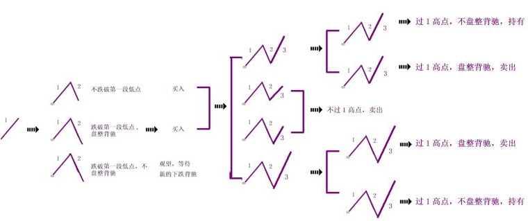

具体的操作程式，按最一般的情况列举如下，注意，这是一个机械化操作，按程式来就行：不妨从一个下跌背驰开始，以一个30分钟级别的分解为例子，按30分钟级别的同级别分解，必然首先出现向上的第一段走势类型，根据其内部结构可以判断其背驰或盘整背驰结束点，先卖出，然后必然有向下的第二段，这里有两种情况：1、不跌破第一段低点，重新买入，2、跌破第一段低点，如果与第一段前的向下段形成盘整背驰，也重新买入，否则继续观望，直到出现新的下跌背驰。在第二段重新买入的情况下，然后出现向上的第三段，相应面临两种情况：1、超过第一段的高点；2、低于第一段的高点。对于第二种情况，一定是先卖出；第一种情况，又分两种情况：1、第三段对第一段发生盘整背驰，这时要卖出；2、第三段对第一段不发生盘整背驰，这时候继续持有。这个过程可以不断延续下去，直到下一段向上的30分钟走势类型相对前一段向上的走势类型出现不创新高或者盘整背驰为止，这就结束了向上段的运作。向上段的运作，都是先买后卖的。一旦向上段的运作结束后，就进入向下段的运作。向下段的运作刚好相反，是先卖后买，从刚才向上段结束的背驰点开始，所有操作刚好反过来就可以。

2007-03-21-22解盘                                                    2007-03-21 15:24:07

大盘走势没什么可说的，如果不会看的，就看好5日线，5日线不破，什么问题都没有。当然，汉奸还会发难的，汉奸特别喜欢周四发难，本ID很欢迎汉奸出手，汉奸最好就把货都倒到3000点以下去，然后离开中国去美国当孙子。

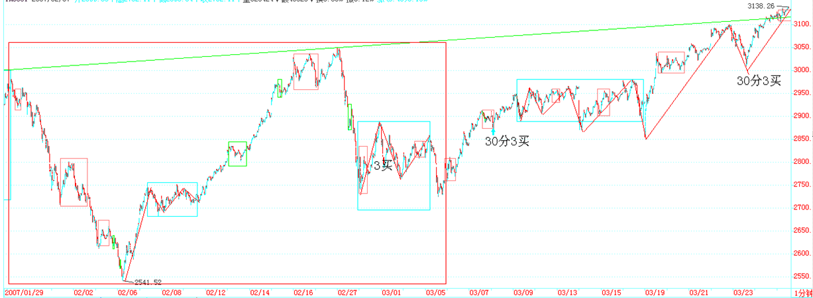

中行今天继续休息等5日线上来，这种大盘股票，不可能太远离5日线，毕竟金融股是汉奸的老巢，上攻过激汉奸会发情的，到时候呕吐一地，让大家恶心就不好了。

各股没什么可说的，板块依然那些板块，个股依然那些个股。当然，除了那14只股票，联通、中行，本ID最近又独自去偷欢了几只，用本ID减成本的方法，最终的结果就是钱越来越多，而筹码不见少，所以必须多看几个仓才能满足。具体就不说，基本都是北京本地股，熟人多，消息也有保障。

那14只个股，元旦前后的前8只，都基本翻倍了，有些已经开始向翻两倍进军，其他的也会跟上来的，关键是你能否按本ID的建议，持有并用部分打短茶，如果能，那你的成本应该不断减，这样就永远不败了。

周四、周五，血战少不了，就看汉奸如何出手了，本ID再等着，大不了再震荡一次，本ID陪着汉奸玩20年，一直玩上30000点，时间多的是，本ID不急。

HYPERLINK "http://blog.sina.com.cn/u/1215172700" \t "_blank" 缠中说禅2007-03-21 16:13:10 [举报]

楼主，从大盘日线上看，macd是不是已经算双０轴回试了？　有点形成日线上涨背驰的可能，对吗？ 

==

可能当然有，124与227的连线，现在也没突破，所以汉奸在技术上是有发难的条件的。大盘从从去年上来，算上去年5月份后的日中枢，也有两个了，上涨形态出现背驰也是很合理的，除非能在上面再延伸一个日中枢。形态是走出来的，没必要预测什么，而且大盘指数并不太重要。元旦到现在，指数没涨多少，但为什么本ID元旦前后说的8只股票都基本翻倍了？

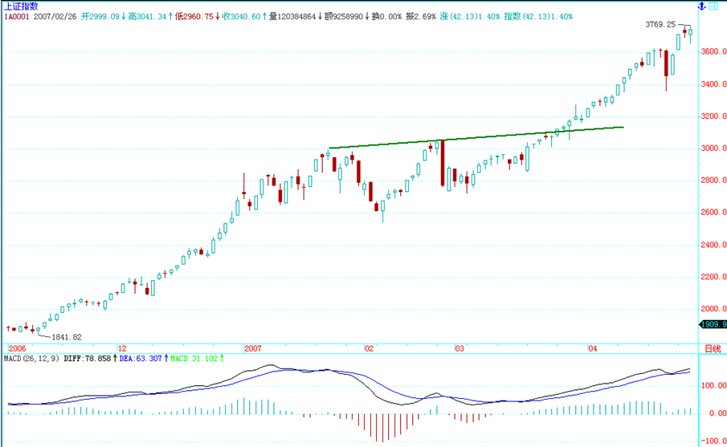

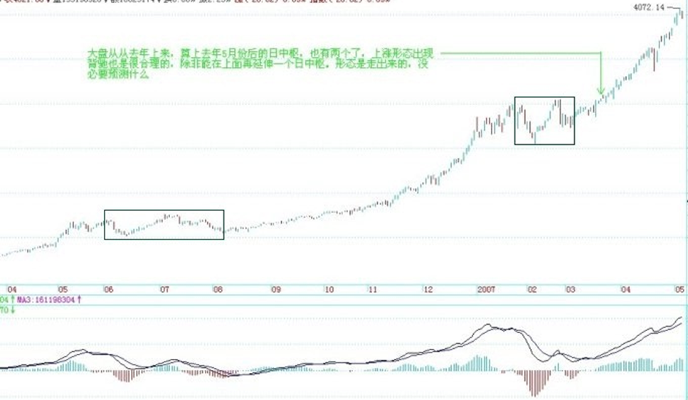

缠中说禅：2007-03-22 15:29:02

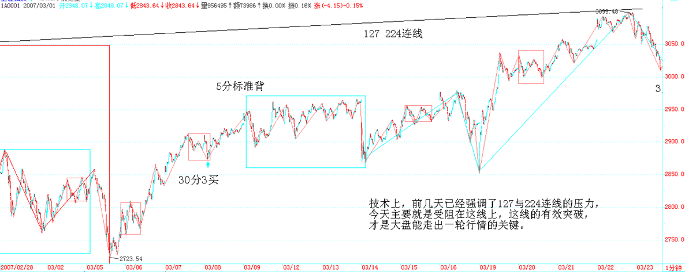

对汉奸的周四发难，昨天已经明说。汉奸总是很听话的，而本ID的股票，除了些新进的北京股，今天基本上一大早就开始主动调整，就是不想让汉奸有发力的机会。汉奸也特没力，只能选择尾盘偷袭，一点新意都没有。后面三天特别关键，只要这三天能在前期高位上收住，那突破的有效性就有保障了，很多心态不稳的人也会重新回来。技术上，前几天已经强调了127与224连线的压力，今天主要就是受阻在这线上，这线的有效突破，才是大盘能走出一轮行情的关键。

现在的走势很微妙，汉奸也有机会，毕竟现在很多人的心态不稳，但汉奸的机会并不会对本ID造成任何损害，本ID的原则是，稳打不冒进，如果机会不成熟，就反复震荡等机会成熟，绝对不给汉奸好的下手机会。不过，现在有些多头太冒进、太急功近利，并不是什么好事，本ID只管好自己这一拨就可以，别人爱干什么可管不住。只要实力不断增长，试看几年后是谁的天下？

HYPERLINK "http://blog.sina.com.cn/u/1215172700" \t "_blank" 缠中说禅2007-03-22 15:42:32 [举报]

禅妹，这样的尾盘杀跌，没有你我们靠什么预料？又怎样躲开？今天我的股票都走得很好，大盘跌也跟着跌，没出来啊。。。

=

124和227的连线不是一次能突破的，就算你看看1分钟或5分钟的MACD，也知道这里会有一个小的盘整背驰。14：30后，上海、深圳走势背离，这就是最好的信号。

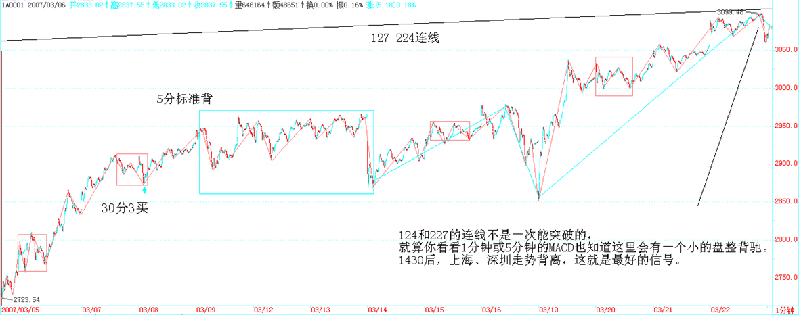

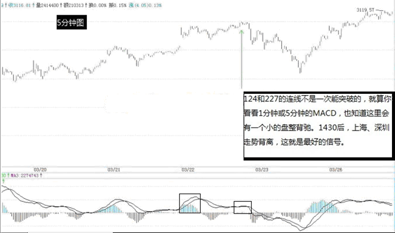

## 教你炒股票39：同级别分解再研究                                     (2007-03-23 15:16:51)

（注：38课针对后期递归级别的5分同级别分解，39课针对后期递归级别的1分同级别分解）

股票都是废纸，还怕有钱买不着废纸？因此，对于任何操作来说，只要赚钱卖出，是无所谓错误的；反过来，股票是吸血的凭证，没这凭证，至少在股票市场里是真吸不了血的，因此，只要卖了能低价位回补，就无所谓错误。至于卖了可能还涨，回补可能还跌，这是技术的精确度问题，就像练短跑，如果你永远只会撒腿乱跑，那你不可能达到高层次，而基础的练习都很枯燥，甚至100米，每段怎么跑，多少步，可能都要按一个机械的要求来，最终形成一个韵律，这才有可能达到高层次。股票的操作一样，首先就要培养这样一个韵律，不排除在这个培养、训练的过程中，开始还比不上以前撒腿乱跑的速度，但坚持下去，等韵律感形成，那进步就不是撒腿乱跑的能比了。

上节说了一个机械的操作程式，这就有一个基本的韵律，其中最大的就是向上段先买后卖与向下段先卖后买的韵律，如果这个韵律都错了，那操作就一团糟。很多人的买卖其实都是靠天吃饭，买了，赌的就是上下两面，因此不管位置、不管时间、不管当下的走势结构，胡乱瞎买，然后又胡乱瞎卖。大的韵律把握了，还有就是每向上向下段中每小段间操作的韵律，显然，只要其中一步错了，这舞步就乱了。这时候，唯一正确的选择就是停止操作，先把心态、韵律调节好了才继续。而且，当你按这个机械节奏不断操作下去，人身体的生物节奏都会慢慢有所感应，甚至可以达到这种程度，就是那种该操作的图形出现时，生理上就仿佛有感应一般。其实，这一点都不神秘，就好象有些人睡觉，无论多晚，早上到点都会自动醒来，而股票的操作，都有一定的紧张度，而同级别走势类型分解的节奏，大致有一定的周期性，长期下来，生理上有自然的反应就一点都不奇怪了。

注意，下面的分析，如果对数学推理陌生的，大概要迷糊透，所以请先准备纸和笔，对着画图，才能搞清楚。

按同级别分解操作，还可能有更广泛、更精确的操作。对5分钟的同级别分解，以最典型的a+A为例子，一般情况下，a并不一定就是5分钟级别的走势类型，但通过结合运算，总能使得a+A中，a是一个5分钟的走势类型，而A，也分解为m段5分钟走势类型，则A=A1+A2+..+Am。想考虑a+A是向上的情况，显然，Ai当I为奇数时是向下的，为偶数时是向上的，开始先有A1、A2出现，而且A1不能跌破a的低点，如果A2升破a的高点而A3不跌回a的高点，这样可以把a+ A1+A2+A3当成一个a`，还是5分钟级别的走势类型。因此，这里可以一般性地考虑A3跌破a的高点情况，这样，A1、A2、A3必然构成30分钟中枢。因此，这一般性的a+A情况，都必然归结为a是5分钟走势类型，A包含一30分钟中枢的情况。

把a定义为A0，则Ai与Ai+2之间就可以不断地比较力度，用盘整背驰的方法决定买卖点。这和前面说的围绕中枢震荡的处理方法类似，但那不是站在同级别分解的基础上的。注意，在实际操作中下一个Ai+2是当下产生的，但这不会影响所有前面Ai+1的同级别唯一性分解。这种机械化操作，可以一直延续，该中枢可以从30分钟一直扩展到日线、周线甚至年线，但这种操作不管这么多，只理会一点，就是Ai与Ai+2之间是否盘整背驰，只要盘整背驰，就在i+2为偶数时卖出，为奇数时买入。如果没有，当i为偶，若Ai+3不跌破Ai高点，则继续持有到Ai+k+3跌破Ai+k高点后在不创新高或盘整顶背驰的Ai+k+4卖出，其中k为偶数；当i为奇数，若Ai+3不升破Ai低点，则继续保持不回补直到Ai+k+3升破Ai+k低点后在不创新低或盘整底背驰的Ai+k+4回补。

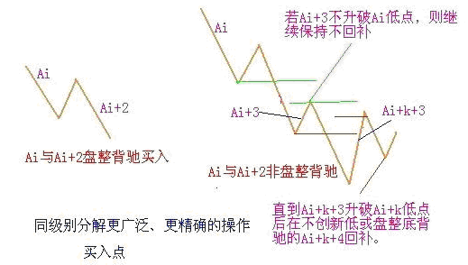

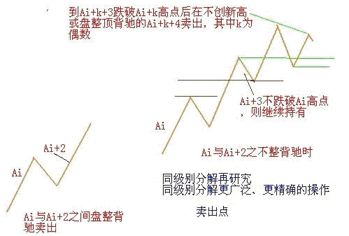

看完上面这段，至少90%以上的人都心跳加速，头晕眼花。不过没办法，这是最精确的表述，画着图应该不难明白。以上的方法，最大的特点是，就是在同级别分解的基础上将图形基本分为两类，一类是“当i为偶Ai+3不跌破Ai高点”或“i为奇数Ai+3不升破Ai低点”；一类是“Ai与Ai+2之间盘整背驰”。对这两种情况采取不同的操作策略，构成了一种机械的操作方法。

读后感：

1、股票都是废纸。

2、机械的操作程式。

3、课文学习用图：

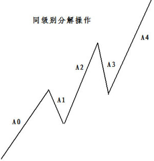

4、Ai与Ai+2之间就可以不断地比较力度(纯中枢方法），用盘整背驰的方法决定买卖点。

2007-03-23-26解盘                                                    2007-03-23 15:18:15

今天大盘没什么可说的，周四、周五的血战已经在周三提前预告。今天中行主动示弱，不让汉奸有借利好出货的机会，为大盘以后的发展留下很大的余地。不过汉奸不会因为这两天的折腾而死心，那两个高点的连线依然在上面，没有效突破前，依然会人心浮动，汉奸依然会随时发难，所以耐心是最重要的，而震荡是稳定人心的最好办法。

各股方面，具体的不能说了，免得汉奸有口实，最近打小报告的人忒多，而这又是汉奸的强项。反正前面说的那五个板块，加上最近说的旅游、科技之类的都会陆续表现的。瓜田李下，本ID就不多说，说的都是梦话，如此而已。

缠中说禅2007-03-23 15:38:46 [举报]

缠妹妹，我是新手，今天大盘5分钟级别13：25那个地方是不是背驰啊？谢谢

=

不是，是一个最小级别的背驰，然后是一个对称走势拉回中枢，可以看成是原来中枢的一个小级别震荡

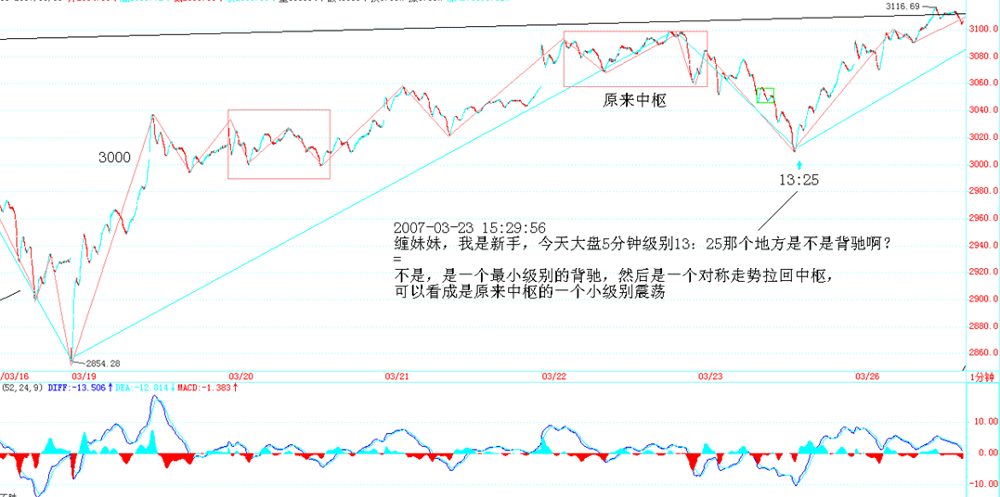

缠中说禅：2007-03-26 15:20:49

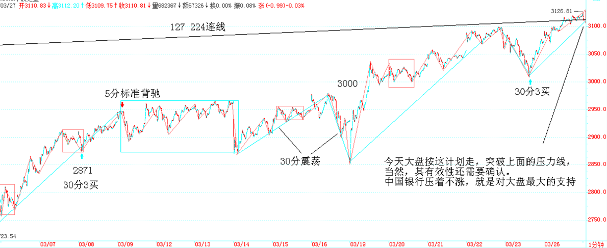

今天大盘按这计划走，突破上面的压力线，当然，其有效性还需要确认。中国银行压着不涨，就是对大盘最大的支持，汉奸想捣乱也没机会，其他板块不断轮动，今天10元上下的二线股表现很好，这个势头应该延续。

一个最好玩的事情，今天已经有人通过某些渠道散风给本ID，说明天是上次大跌的一个月纪念，又是星期二，明天要全力砸盘，把本ID给毁了，本ID等着，本ID只点火，决不死顶，今天是全民启动，就看汉奸明天怎么表演。

个股不说了，三线里有真正题材的还会涨，其他风险，最主要是监管风险比较大。二线是目前最好的选择，10元上下，如果业绩特别好的，在15元上下也可以，都是今后行情的重点。如果不会找，看300成分股，在相应区间不难找到。

## 教你炒股票40：同级别分解的多重赋格                                (2007-03-27 12:53:22)

投资，往往碰到这样两难的事情，就是一个小级别的进入，结果出现大级别的上涨，这时候怎么办？这时候有两个选择：一、继续按小级别操作，这样的代价是相当累，而且小级别操作的问题是对精确度要求比大级别高，而且资金容纳程度低；二、升级为大级别操作基础上部分保持小级别操作。对于资金比较大的投资，后者是比较实用的。

上节中的“Ai与Ai+2之间盘整背驰”，将演化出“当i为偶Ai+3跌破Ai高点”或“i为奇数Ai+3升破Ai低点”；因而相应演化出高一级别的中枢，例如在该例子里，Ai+1、Ai+2、Ai+3就是30分钟的中枢，而所有更大的中枢，当然是先有高一级别才可能有，否则连30分钟的中枢都没有，哪里来日、周、月的？但这个现象就保证了，在同级别分解下，一个小级别的操作是可以按一个自动模式换档成一个高级别的操作。

一般情况下，在上面5分钟同级别分解的例子中，只要从A0开始到某个At，使得A0+A1+….+At=B1+B2，后者是30分钟级别的同级别分解，这时候就可以继续按后一种分解进行相应的操作。当然，是否换档成后一种级别的操作，与你的时间、操作风格、资金规模有关。但本ID还是建议，可以进行这种短线变中线的操作，即使你的资金量很小，但如果出现一种明显的大级别走好，这种操作会让你获得稳定的大级别波动利益，因此，根据当下的情况去决定是否换档，就如同开车时根据路况等决定档位一样。

对于大资金来说，这种级别的操作可以一直延伸下去，可以变成N重层次的操作，每一重都对应着一定的资金与筹码，而相应对应着不同的节奏与波动。如果对古典音乐有点了解的，就知道，这如同赋格曲，简单的动机、旋律在N个层次上根据不同的转位、移位、对位等原则运动着，合成统一的乐曲。市场的走势，其实就是这样的多重赋格，看似复杂，其实脉络清晰，可以有机地统一在多层次的同级别分解操作中。

在这种同级别分解的多重赋格操作中，可以在任何级别上进行操作，而且都遵守该级别的分解节奏与波动，只是在不同级别中投入的筹码与资金不同而已。对于大资金所具有的整体筹码与资金来说，就永远在一种有活动的多重赋格，实际的市场操作，成了一首美妙的乐曲演奏，能应和上的知音，就能得到最大的利益与享受。而每一层次的操作都是独立又在一个整体的操作中，对这种操作如果没有什么直观感觉，那就去听听巴赫的音乐，那不仅是音乐的圣经，对股票的操作同样有益。

读后感：

1、市场的走势，其实就是这样的多重赋格，看似复杂，其实脉络清晰，可以有机地统一在多层次的同级别分解操作中。

2、每一层次的操作都是独立又在一个整体的操作中。

3、同级别分解操作也必须有大盘局观念。

4、一般情况下，在上面5分钟同级别分解的例子中，只要从A0开始到某个At，使得A0+A1+….+At=B1+B2，后者是30分钟级别的同级别分解，这时候就可以继续按后一种分解进行相应的操作。

2007-03-27-29解盘                                                    2007-03-27 12:57:02

下午收盘后有一个重要的谈判，不能上来，先把帖子发了。早上已经击退汉奸的一次进攻，下午，还会折腾，只要板块继续轮动，银行股能保持低姿态，汉奸就没有大机会。先下，再见。

缠中说禅：2007-03-27 21:29:47

对不起，来晚了。大盘今天走势继续呈现多空拉锯，目前正在一个敏感的时间之窗，前次高点21天前后，而突破前期高点连线，对于很多所谓技术派的人，还有三天的确认要求，因此市场难免犹豫。本周余下三天，关系到月线的收盘，因此激烈的争斗、震荡不可避免。

但由于目前启动的二线股都有比较强的业绩等支持，比前期三线股的要稳健，而银行股的低调又使得汉奸打压无处发力，这就是最近汉奸比较痛苦的地方。

目前多头一定要耐心，用文火熬，才能把汉奸煮烂，否则汉奸的脸皮这么厚，大火没用。个股不多说了，反正还是那些，如果技术好的找好买卖点，不行的就看均线系统，如果5日线都不破，就拿着，这样省心、不用一惊一乍。

HYPERLINK "http://blog.sina.com.cn/u/1215172700" \t "_blank" 缠中说禅2007-03-27 21:41:16 [举报]

缠妹妹对今天大盘在13：38分的处没有形成背驰而上涨有何看法，我今天全部做空了，没有跌，因为也没发现底背，在低位也没有补回，后来全涨了又觉得可惜，所以追高买回来了，象这个时候应该怎样操作？你对600961和600713怎么看，后市还可以看好吗，600961是不是一个30分钟的三买。学艺不精，请多指点，谢谢！ 

==

今天是一个标准的平衡市，就是围绕一个中枢在震荡，哪里存在上涨？背驰不是这样用的。站在中枢震荡的角度，下午没创新低，就证明这向下的力度没有上午强，那当然就要拉回去。所以应该先把理论搞清楚。至于你说那两只股票，中线都可以。

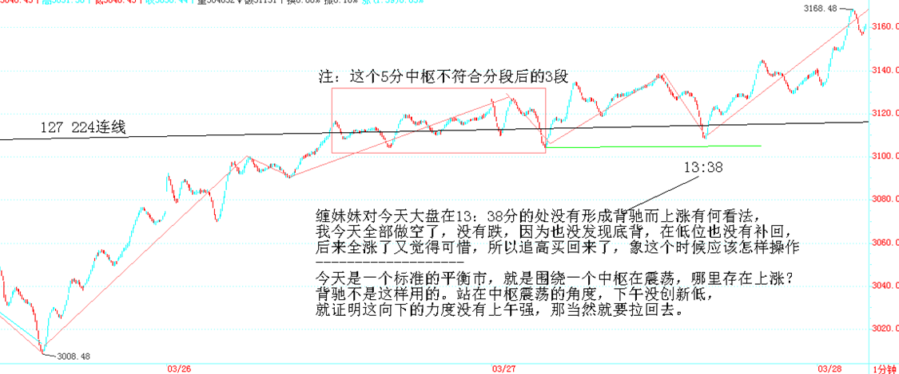

缠中说禅：2007-03-28 15:24:11

汉奸越来越听话，具体的细节就不说了，这里耳目可众多。经过今天的震荡，那条线已经第二天站稳，那些非汉奸的空头是否要投降，自己看着办吧。

当然，汉奸还有机会，如果换着本ID来做空，现在肯定已经3000以下了，可惜汉奸技术比较差，期货一开，汉奸这种水平，怎么玩呀。别输得内裤都没了，漂洋过海到汉奸他爸那里裸奔就不好了。

最后两天，关系到月线，还关系到季线收盘，看K线图的都知道，一个光头阳线与带长上影的对下月、下季走势的影响，所以这两天虽然短，但却十分重要。这两天走好了，空头翻多的力量会越来越大。个股就不用说了，今天不说唾液，只说体液。

HYPERLINK "http://blog.sina.com.cn/u/1215172700" \t "_blank" 缠中说禅2007-03-28 21:13:40 [举报]

缠姐好！检讨一下这两天的操作，比较失败，节奏把握不住。 上午11：20那个低点根本没任何背驰迹象，怎么就上去了

==

1分钟以下级别的，比较1分钟MACD的柱子面积就可以。前面是有两个绿柱子面积之和，后面是1个，这是恐慌性假突破中经常看到。另外，用中枢震荡的角度就更简单。不过，这都不是最重要的，最重要是节奏，如果早上5分钟明显的顶背驰能先卖出，那么下面的回补，早点晚点都不是最重要的。而且，个股方面就更明显，例如000802，1分钟上破15元后，那底背驰就是最明显的了。

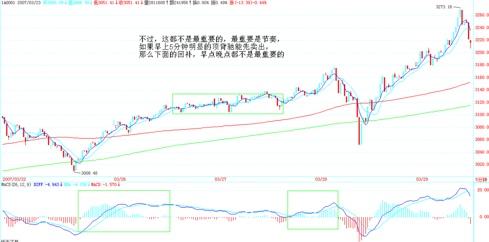

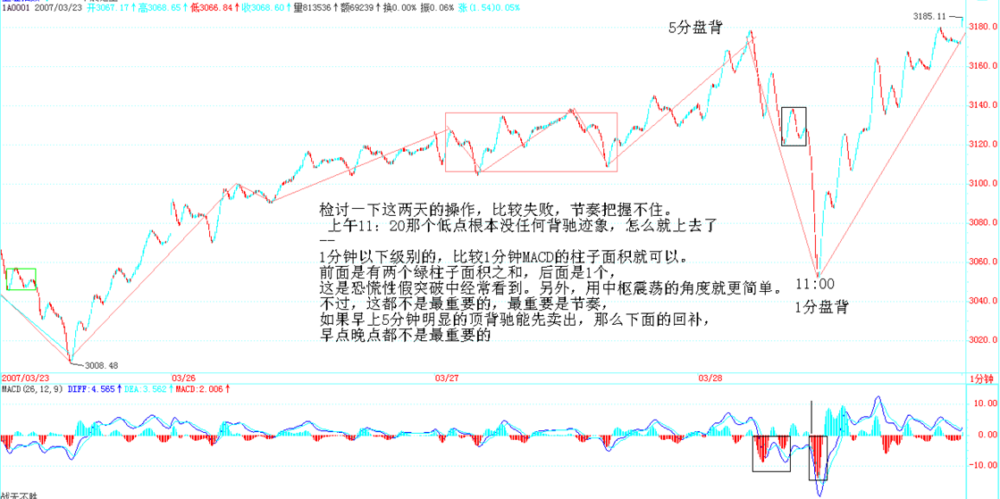

缠中说禅：2007-03-29 12:41:24

下午收盘有事，不能上来，先说两句。这两天关系月、季收盘，激烈的争斗本在计划中。今天出现如此走势，就是这种争斗的结果。打不下去，先拉起来，这也是汉奸唯一的途径，如果换了本ID，也会这样。对银行股不可能压盘，本ID不可能在今天去压制中行，只可能顺势而为，先买后卖也是对的。

当然，大盘股打仗，其他股票就要受累，这是不可避免的，市场不是慈善场所，如果看不懂的，就看深圳指数，以此为进出，上海指数在这段时间的失真是不可避免的。个股要习惯根据个股本身的图形进出，特别股指期货出来后，指数对个股的指导意义更弱。

对于本ID来说，中行、联通就是其中的组合而已。等大盘股的争斗有方向了，其他股票自然重新走好，其实，完全可以以板块轮动来看。

晚上9点再来，再见。

缠中说禅：2007-03-29 21:44:58

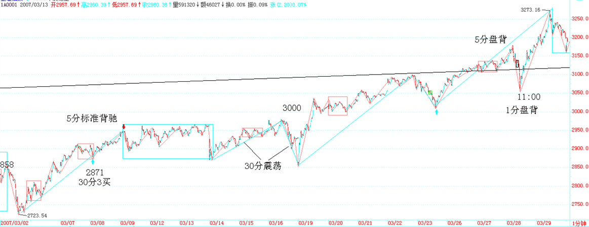

今天的争斗对于散户来说，确实是一个心理考验，但这是必须的。对于本ID来说，正如中午所说，对金融股先买后卖是唯一正确的选择。汉奸这一招本在预计之中，也是汉奸唯一能使用的招数。如果汉奸连今天这一招都使不出来，本ID会更加蔑视他们。

汉奸要阻击上涨，唯一的途径就是昨天说的，让月、季留下长上影，关于最后这两天的斗争，本ID已经提前预告。大部队打仗，伤及无辜，那是没办法的事情。明天是最后一天，汉奸当然希望就势打出长阴，其实，无论什么走势，对于本ID来说都无所谓，因为本ID今天采取了最正确的策略，先买后卖金融股，同时从昨天起对二、三线股进行清洗。对于本ID来说，明天以静制动，先让汉奸出手，大不了再来一次如3000点下的反复震荡，这种活动，汉奸们已经输过一次，不妨再来一次。

现在，争夺的市场控制权，丧失筹码不行，唯一正确的就是通过震荡把筹码成本降低，由此可见，本ID理论，其实对大资金一样有效。股票都是废纸，只是吸血凭证，关键是能本成本降低为0才是真正的安全，0以下的，才是真正的利润，才是真正的血。无论散户还是主力，这都是一样的。

缠中说禅：2007-03-29 22:06:35

照妹妹的意思，明天是一场血战，大盘明天有可能会大跌？

==

不排除这种可能，特别如果是本ID来做空，明天是最好的机会，一个长上影K线后，拉一条长阴，至少可以让很多所谓的技术派痛苦半个月。当然，汉奸有没有这本事是另外的事，市场不是一个人、一个派别的市场，而且市场的走势，很多都是当下发生的，这如同打仗，战机难道能预先知道吗？像今天，汉奸突然发疯，这时候如果去压盘，那就傻了，而是要比汉奸更疯，而当汉奸想回砸时比他砸得更快，这就如同剑客过招，错一步就是万劫不复。里面的工夫深着，哪里有这么简单。

本文由公众号 “三思复盘”  整理
