## 教你炒股票41：没有节奏，只有死               (2007-03-30 15:17:22)

市场的节奏，只有一个：买点买、卖点卖。这么简单的问题，但从来能遵守的人，能有几个？是什么阻止你倾听市场的节奏？是你的贪婪与恐惧。买点，总在下跌中形成，但恐惧阻止了你；卖点，总在上涨中，但贪婪阻止了你。一个被贪婪与恐惧所支配的人，在市场中唯一的命运就是：死！

市场中，买点上的股票就是好股票，卖点上的股票就是坏股票，除此之外的好坏分类，都是瞎掰。你的命运，只能自己去把握，没有任何人是值得信任的，甚至包括本ID。唯一值得信任的就是，就是市场的声音、市场的节奏，这需要你用心去倾听，用一颗战胜了贪婪与恐惧的心去倾听。

市场的声音，永远是当下的，任何人，无论前面有多少辉煌，在当下的市场中，什么都不是，只要有一刻被贪婪与恐惧阻隔了对市场的倾听，那么，这人，就走入鬼门关。除非，此人能猛醒，否则，等待的只有：死亡。记住，1万亿与1万，变成0的速度是一样的，前者甚至可以更快。

买点买，买点只在下跌中，没有任何股票值得追涨，如果你追涨被套，那是活该；卖点卖，没有任何股票值得杀跌，如果你希望瘦身，那就习惯砍仓杀跌吧。即使你搞不懂什么是买点卖点，但有一点是必须懂的，就是不能追涨杀跌。就算是第三类买卖点，也是分别在回调与反弹中形成的，哪里需要追涨杀跌？

买卖点是有级别的，大级别能量没耗尽时，一个小级别的买卖点引发大级别走势的延续，那是最正常不过的。但如果一个小级别的买卖点和大级别的走势方向相反，而该大级别走势没有任何衰竭，这时候参与小级别买卖点，就意味着要冒着大级别走势延续的风险，这是典型的刀口舔血。市场中不需要频繁买卖，战胜市场，需要的是准确率，而不是买卖频率，只有券商与税务部门才喜欢买卖高频率。

市场不是赌场，市场的操作是可以精心安排的。当你买入时，你必须问自己，这是买点吗？这是什么级别的什么买点？大级别的走势如何？当下各级别的中枢分布如何？大盘的走势如何？该股所在板块如何？而卖点的情况类似。你对这股票的情况分析得越清楚，操作才能更得心应手。

至于买卖点的判断，如何提高其精确度，那是一个理论学习与不断实践的问题，但这一套程序与节奏，是不会改变的。精度可以提高，但节奏不可能乱，节奏比精度更重要。无论你对买卖点判断的水平如何，即使是初学者，也必须以此节奏来要求自己。如果你还没有市场的直觉，那么就强迫自己去执行，否则，就离开。

对于初学者，一定不能采取小级别的操作，你对买卖点的判断精确度不高，如果还用小级别操作，不出现失误就真是怪事了。对于初学者，按照30分钟来进出，是比较好的，怎么也不能小于5分钟，5分钟都没有进入背驰段，就不能操作。级别越小，对判断的精确要求越高，而频繁交易而导致的频繁失误只会使心态变坏，技术也永远学不会。先学会站稳，才考虑行走，否则一开始就要跑，可能吗？

节奏，永远地，只有市场当下的节奏，谁，只要与此节奏对抗，只有痛苦与折磨在等待。注意，一定要注意，所谓的心态好不是如被虐狂般忍受市场节奏错误后的折磨，这一定要注意。很多人，错了，就百忍成钢，在市场中是完全错误的。市场中，永远有翻身的机会，那前提是，你还有战斗的能力。一旦发现节奏错误，唯一正确的就是跟上节奏，例如，错过第一买卖点，还有第二买卖点，如果你连第三买卖点都错过，连错三次，死了也活该。

为什么有三类买卖点？市场太仁慈了，给你三次改错的机会，你如果连这都不能改正，那就休息去，喝茶去，三次都不能改错，还犯同样的错误，不休息、不喝茶，还能干什么？那些一个股票上涨N倍后还问能不能买，甚至还追高买，这种人，还能说什么？难道上涨N倍还看不到买点吗？看着很多散户，在连续拉升后还赌后面的所谓涨停，只能好不客气地说：死了活该。

市场是残酷的，对于企图违反市场节奏的人来说，市场就是他们的死地；市场是美好的，市场就是巴赫的赋格曲，那里有生命的节奏。节奏，永远是市场的节奏，一个没有节奏感的市场参与者，等待他的永远都是折磨，抛开你的贪婪、恐惧，去倾听市场的节奏。周末了，放下一切，却倾听大自然的节奏，生命的节奏，音乐的节奏，然后再回来倾听，这市场的节奏。与市场共舞，你的贪婪与恐惧一一剥落，你会变得光明无比。

读后感：

1、没有节奏，只有死。

2、市场的节奏，只有一个：买点买、卖点卖。

3、市场中，买点上的股票就是好股票，卖点上的股票就是坏股票。

4、市场的声音，永远是当下的。

5、市场中不需要频繁买卖，战胜市场，需要的是准确率，而不是买卖频率。

6、市场不是赌场，市场的操作是可以精心安排的。

7、买卖点的判断，如何提高其精确度，那是一个理论学习与不断实践的问题，但这一套程序与节奏，是不会改变的。

8、精度可以提高，但节奏不可能乱，节奏比精度更重要。

9、节奏，永远地，只有市场当下的节奏，谁，只要与此节奏对抗，只有痛苦与折磨在等待。

10、节奏，永远是市场的节奏，一个没有节奏感的市场参与者，等待他的永远都是折磨，抛开你的贪婪、恐惧，去倾听市场的节奏。

### 2007-03-30解盘

缠中说禅：2007-03-30 15:25:08

今天大盘对市场双方都可接受，汉奸无法如愿拉长阴，而月、季略带上影，也是本ID可接受的。后面震荡依然，毕竟，汉奸还是有实力去制造下一月、季的下影。

对于本ID来说，在3000点上再玩一次3000点下的震荡盘整，是最有利的。玩震荡，汉奸没什么水平，而现在管理层、散户都有恐高，需要时间治疗。

个股方面，三线已经被管理层监管警告，一线大盘打架不可能被散户接受，这两天就是例子，因此，二线是最好的平衡，谁都能接受，一些有中线潜力的二线已创新高，这就是点火，能否燎原，那是另外的问题。今天4点有会，必须走，先下，再见。

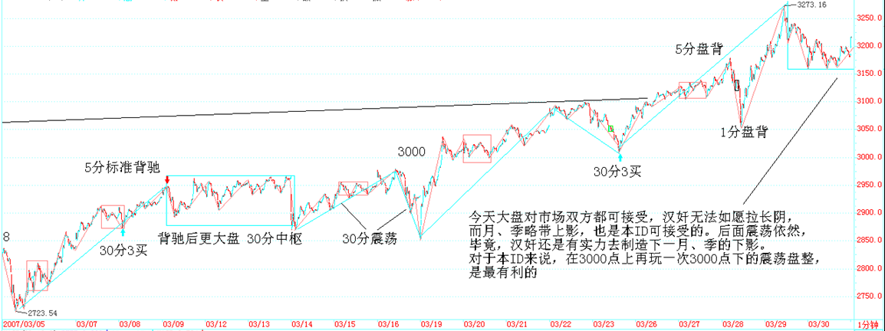

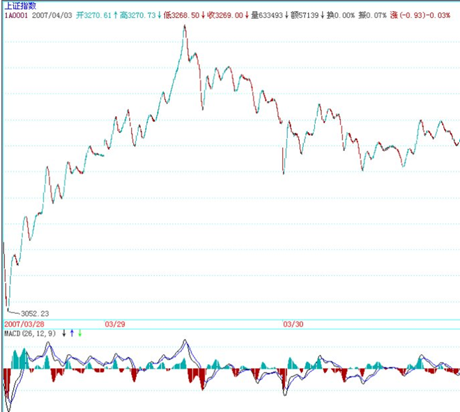

缠中说禅：2007-04-02 15:14:44

前面已经说过，如果看不明白上海指数，就看深圳的。深圳今天的走势只表明一点，优质二线股还是得到更多人的认同。深圳成分股里，基本都是优质二线股。其实，今天最终能收成这样，也是经过刀光血影的。早上汉奸曾又使出拉金融股的一招，结果被破坏，没什么效果，才有后面二线股的整体走强。

个股方面，看看上海、深圳今天涨停的，基本都是二线股与有真正题材的三线股，特别是上海，很多都是10元上下的，就知道后面真正可以产生利润的股票还是本ID前段时间已经明确指出的那些。具体就不说了，现在监管风暴下，少说点不会错。

如果不会挑的，就去看300或深圳成分股，就那些股票，当然，金融股、特大盘股也会有表现的，但这类股票还是以打仗为主，如果资金量比较大的，组合部分也是可以的。

现在的走势肯定是进二退一甚至是进三退二，快速拉升只可能对汉奸有利，把握节奏就很重要了。真看不明白的，就看5日线，你看这段时间这么折腾，其实都没破过5日线，看着不用闹心。

缠中说禅：2007-04-03 15:36:57

女王好！今天同学们都很担心明日大盘的走势啊！！

==

没什么可怕的，涨也怕、跌也怕，盘也怕，那来股票市场就成受罪了。

## 教你炒股票42：有些人是不适合参与市场的                            (2007-04-04 15:31:30)

06年在中国证券市场竟然可以亏损累累，最后被迫转战香港，这种奇人绝对是06年市场的最大奇迹，前几天，本ID有幸听闻此人后，真有一睹为快的冲动。当被告知此人为一50岁的北京老男人后，才打消此念头。细想，这其实也不奇怪，一个极端心态有问题的人，确实是不难创造06年全年严重亏损奇迹的。例如，一洗盘就砍仓，开涨的时候不敢买，一买就买个顶，然后又砍，这样来回几次，不严重亏损就怪了。最奇的是，此人到香港后竟然能挣点钱了，他的招数就是，一旦看到国内拉某股票，就去买香港相应的股票，然后T+0出来，绝对不敢过夜，这市场还有这样的妙人，也算有趣。

曾反复说过，心态的磨练对于市场操作的重要性，但这事情要分开看。有些人，心态就是这样的，改无可改，天性如此，到了关键时刻就是顶不住，例如，明明脑子里知道不能买了，但手就是发痒，像毒瘾发作一般，不受控制。现在的买卖操作又特简单，以前最早时，无论机构大户，都有报单、红马甲之类的东西，现在随便一个散户，在网上1秒种就可以完成买卖，只要扛不住那1秒，什么技术、理论都白搭。这时候怎么办？最好的办法，当然是去“戒毒”，这必须从最基础的心理训练开始，但这不是任何人都有条件办到的。还有，就是远离股市，股市只是生活的一部分，一个没有股市的生活依然是生活，活着就好。还有，就是换一个环境，例如像上面那奇人那样，到了香港，找到一个偏方，病虽好不了，也至少不那么难受了。

从某种意义上说，操作并不一定能磨练心态的，这事就如同治疗某种男性隐疾一样，根子上病了，那是很难有好办法的。最好的办法，就是退出，至少不会被江湖郎中反复欺骗而花冤枉钱。当然对于是否适合市场，也只有当下的意义，并不是说真是永远没救了，但有些特别严重的，确实不适宜留在市场中治疗的，必须先远离市场一段时间，彻底洗心革面，才有可能改善。

这里不妨给出几种不适合在市场上：

1、耳朵控制大脑型。这种人，一旦听到什么，就可以完全不经过大脑，立即由耳朵就直接操纵手，如果你每一次的买卖几乎都是这样完成的，那么，你根本不适合在市场上。

2、疯狂购物型。这种人，最大的特点就是可能只有几万元的资金，竟然可以拥有十几甚至几十只股票，什么股票都想拥有，什么股票涨了，都说我也有，以此来安慰自己，这种人，根本不适合在市场上。

3、不受控制型。每次操作，明明知道不对，就是控制不住自己，心里有一股顽劲，一到需要抉择的关键时刻，永远掉链子，这种人，根本不适合在市场上。

4、永远认错型。典型的永远认错，死不改错，同样的毛病，可以永远犯下去却永远改不了。而在市场中，一个毛病就足以致命，一个死不改错的人，是不适合市场的。

5、祥林嫂型：这种人，永远就是哀声叹气，甚至会演变成特别享受这种悲剧情调，市场中不是受罪来的，何必这么折腾，市场外的天空广阔着，离开吧。

6、赌徒型：对于他来说，市场就是赌场，这种人根本没必要在市场里，不说远的，现在澳门新来不少赌场，珠海的某个岛建桥连过去，该岛将建成大型度假地，白天过桥就可以赌，晚上回来睡觉，参与该建设的、其背景是美国某大型集团的人，在国内刚收购某大型旅游企业，以后是一条龙服务，很方便的。

7、股评型。市场中喜欢吹嘘的人多了去了，有些人，明明亏的一塌糊涂，就是爱吹，市场对于他来说不是用来操作的，是用来侃用来吹的，这种人，不适合在市场，当股评去吧。八、入戏太深型。这种人，把股市的波动当成电视连续剧，每一个细微的变动都可以让他情绪失控，上涨也失控、下跌也失控、盘整也失控，开盘4小时，就煎熬4小时，这种人，在市场上太累，还是回家看肥皂剧好。

九、偏执狂型。这种人，就爱认死理，万牛拉不回。偏执，对搞理论或其他事情可能影响不大，甚至有好处，但在万变的市场中，偏执狂是没有活路的。

十、赵括型。市场操作，不同于纯粹的理论研究。市场就是市场，就如同战场，赵括之流同样是没有活路的。

以上十种，是特别不适合在市场中的，当然，并不是有这种表现的就一定要永远离开市场，关键是先要调节过来，所谓功夫在诗外，市场中也一样的，真正能在市场上登顶并长期领先的，有可能是一个大傻瓜、心理有顽疾的吗？

所谓性格决定命运，这两节没讲有关技术的问题，说了些似乎无关的东西，其实是大有相关的。要认清市场，首先要认清自己，知道自己的弱点在哪里，自己在市场中的每个行为，都要清楚地意识到。每天收盘后，都找十分钟，把自己当天的操作以及看盘时的心理过程复一次盘，这是十分必要的。

读后感：

学缠论就是学佛，就是去贪嗔痴，就是修心态。

2、认清自己比认清市场更加重要。

缠中说禅：2007-04-04 15:33:12

今天的市场没什么可说的，该说的昨天已经说了，今天的走势就如同照抄本ID昨天的剧本一样，如果你连剧本都先看了还操作不好，那就没法子了。从纯技术上，深圳基本达到目前在9200点附近的上两高点连线，这里存在技术压力很正常。上海最近走不强，原因很简单，就是一时没目标了，深圳还存在那线可以攻击，上海上面无限宽广，但反而找不着北了。当然，更重要的是，深圳指数更代表优质二线股，最近这板块得到越来越多的认同，所以深圳走强，其实就代表本ID的优质二线股剧本被市场在演绎。

个股不说了，目前这位置，追高，一点必要都没有，只要能保持买卖节奏，问题就不大，震荡是好事，对于节奏好的人，越震荡成本越低，最好天天震，那才好。技术不好的，还是看5日线，如果中线的，看10日线，你看去年8月开始的那一波，10日线基本就没破过，如果真破，那就是级别较大调整了，反之，如果5日线都不破，就不用担心什么。板块轮动，只要不是太垃圾的股票，都会轮到的。

缠中说禅：2007-04-05 15:34:37

今天继续10元上下二线股行情，看看今天涨停股票有多大比例落在该区间就清楚了。尾盘一线大盘的偷袭，其实也不算太大问题，现在这种走势，对某些人确实够煎熬的。

深圳由于已经离那条压力线很近，所以今天走的已经有点沉重，如果真能突破站稳该线，那深成指的1万点，就在多方炮火下了。所以对于这条线，汉奸是不会轻易罢休投降的。1万点，其实不算什么，以后上海的指数也会有这一天，只是内地指数从来没有这样的位置，让散户、管理层接受，还需要一定的前戏。

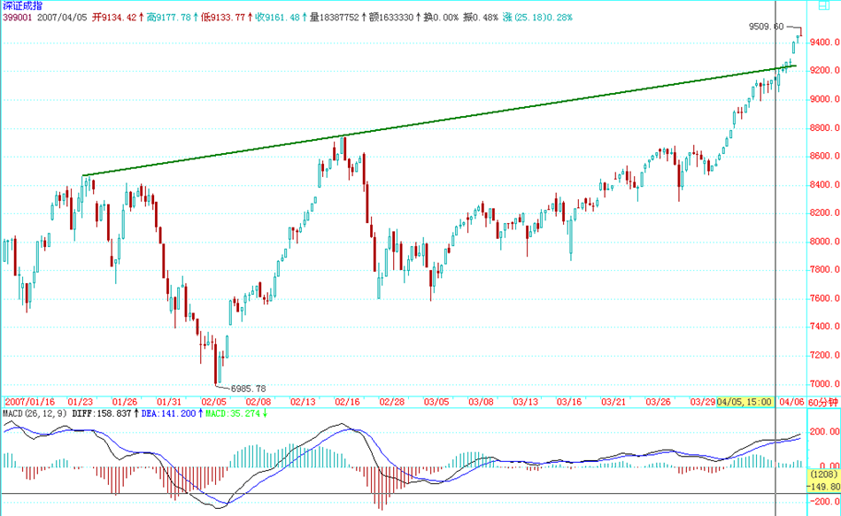

目前管理层的心态也很微妙，而且中国的事情，经常搞平衡，汉奸现在也在到处哭诉，是否能打动某些地方，这种事情就不好说了。所以，太过乐观的情绪是要不得的，目前最好的策略还是以稳为住，这不仅是对多方的正规军，对民兵、敌后武工队等等，也是一样的。

板块轮动，稳健地走，通过不同级别的震荡消除各种压力的，才是正路。像某些股票瞎搞乱来，这只会对汉奸有利。

缠中说禅：2007-04-05 16:24:41

如你文章回复所述，现在的确是个除了您这样的人或集体，大家都整体洗脑的时间段。各种力量在表演，在让领导层观摩，看领导的眼色，在给领导灌输一些景象；机构在给我们散户洗脑，告诉我们怎么下去的就怎么上来，没啥好怕的，于是，后续的新股民和资金源源不断。

散户也在给散户洗脑，互相抱团取暖。。。。。。只有在你这里才能认识市场，了解当下。

有一点不解，现在力量的权衡还是不懂，权重上，大盘就上，就会招来非议。但是，权重股也不会一直趴着，都是为利益来的。为股指期货，他们或许在等机会。这样下去是否会把他们弄急了，报复性的爆发？什么时候、什么环境下能达到一个平衡，形成共振？ 我问题比较愚蠢。谢了！

=

没有说大盘股就不涨，只是大盘股启动消耗太多能量，而且还需要一个好的理由，例如如果期货开了，要把空头打暴，那把中行夹上20又有什么大不了的。

## 教你炒股票43：有关背驰的补习课                                     (2007-04-06 15:31:28)

发现很多人对最基础的背驰问题还是不大清楚，周末，来一补习。关于如何判断背驰，背驰与盘整背驰的区别之类问题就不说了，这个太基础，连这都没搞清楚，那最好的办法就是重修，而不是补习。

转折必然由背驰导致，但背驰导致的转折并不一定是同一级别的。在“教你炒股票29：转折的力度与级别”中有“缠中说禅背驰-转折定理：某级别趋势的背驰将导致该趋势最后一个中枢的级别扩展、该级别更大级别的盘整或该级别以上级别的反趋势。”这是一个十分重要的定理，这定理说明了什么？就是某级别的背驰必然导致该级别原走势类型的终止，进而开始该级别或以上级别的另外一个走势类型。

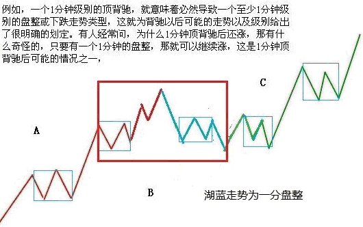

由于不允许“上涨+上涨”、“下跌+下跌”的情况，所以，这定理对实际操作就很有意义了。例如，一个1分钟级别的顶背驰，就意味着必然导致一个至少1分钟级别的盘整或下跌走势类型，这就为背驰以后可能的走势以及级别给出了很明确的划定。

有人经常问，为什么1分钟顶背驰后还涨，那有什么奇怪的，只要有一个1分钟的盘整，那就可以继续涨，这是1分钟顶背驰后可能的情况之一，当然，还有其他可能的情况，例如，最极端的，制造出一个年线级别的下跌，但不能说这个制造是由于1分钟顶背驰造成的，因为这是1分钟顶背驰后，形成的盘整或下跌逐步级别扩张，最后才慢慢形成的，如果随便看到一个1分钟顶背驰就说要形成年线级别大调整，那就是脑子水太多了。如果市场的转折与背驰都有这在级别上一一对应关系，那这市场也太没意思、太刻板了，而由于这种小级别背驰逐步积累后导致大级别转折的可能，才使得市场充满当下的生机。

注意，这两种不同的转折方式的区分是十分关键的。所有的转折都与背驰相关，但加上背驰的级别与当下走势级别的关系，就有了这两种不同的转折方式。由于背驰的级别不可能大于当下走势的级别，例如一个30分钟级别的背驰，只可能存在于一个至少是30分钟级别的走势类型中，所以就有这两种不同转折方式的明确分类。

一、背驰级别等于当下的走势级别

例如，一个30分钟的走势类型，出现一个30分钟级别的背驰，那么这个背驰至少把走势拉向该30分钟走势最后一个中枢，当然就会跌破或升破相应的高点或低点。注意，这种情况包括进入背驰段的情况，例如，一个30分钟的走势类型，在30分钟级别进入背驰段，当然，这个背驰段并不一定就演化成背驰，因为，小级别的延伸足以使得大级别最终摆脱背驰，这与当下的走势判断相关。

二、背驰级别小于于当下的走势级别

这种情况下，是走势已经明显没有相应级别的背驰，例如，一个30分钟的走势类型，明确显示没有出现30分钟的背驰，也就是背驰段最终不成立，但却出现一个1分钟级别的背驰，用一个最简单的形式向上的a+A+b+B+c，A、B是30分钟中枢，在c中出现1分钟背驰，而c对b在30分钟级别并没有出现背驰，这时候并不必然保证c的1分钟转折的最终走势就一定不跌回B里，但即使这个回跌出现，其形式也和第一种情况不同。这第二种情况，必然要先形成一个比1分钟级别要大的中枢，然后向下突破，最终形成回跌到B中的走势。

有人可能要问，第一种情况中如果是5分钟级别的回跌，也会形成一个比1分钟级别大的中枢，那和第二种情况有什么区别？这区别太大了，在第一种情况中，其回跌是必然的，而第二种情况，在形成一个比1分钟大的中枢后，并不必然回跌，可以往上突破，使得a+A+b+B+c继续延伸。这种小级别背驰最终转化成大级别转折的情况，最值得注意的，是出现在趋势走势的冲顶或赶底之中，这种情况一般都会引发大级别的转折，这种例子前面都说过，例如20070104的工行，20061207的北辰实业、20070122的水井坊等。

以上两种情况，对走势的分解也是很有意义的，例如对一个30分钟的走势类型，其完结也同样有相应的两种情况，最普通的一种，例如出现一个30分钟的背驰，从而完成一个30分钟级别走势类型，在这种情况下，对该走势类型的分解就不存在任何含糊的地方，前后两个走势类型，就以该背驰点为分界；至于小级别背驰引发大级别转折的情况，这种情况比较复杂，但分解的原则是一致的，就是：缠中说禅走势类型分解原则：一个某级别的走势类型中，不可能出现比该级别更大的中枢，一旦出现，就证明这不是一个某级别的走势类型，而是更大级别走势类型的一部分或几个该级别走势类型的连接。

这里，把上面第二种情况下的分解可能分析如下：

不妨还是以上面向上30分钟级别的a+A+b+B+c为例子，在c中出现一个1分钟级别背驰，不妨假设后面演化出一个30分钟中枢C，如果C和B没有任何重叠，那就意味着原来的a+A+b+B+c并不是一个完成了的30分钟走势类型，该走势类型将延伸为a+A+b+B+c+C，相应的分解要等到该走势类型完成了才可以进行；如果C和B有重合，那么a+A+b+B+c+C=a+A+b+（B+c+C），其中（B+c+C）必然演化成一个日线中枢，那么a+A+b+B+c只是一个日线级别走势类型的一部分，如果一定要按30分钟级别来进行同级别分解，那么该分解点就是那1分钟的背驰点，a+A+b+B+c+C=（a+A+b+B+c）+C。

有了以上的例子，就对如何用背驰对走势分解的基本原则有一个大概的了解了，熟悉了这些分解方法，市场的走势图就不会是天书了，而是如自己的掌纹一样清晰可辩。

读后感：

1、转折必然由背驰导致，但背驰导致的转折并不一定是同一级别的。

2、所有的转折都与背驰相关，但加上背驰的级别与当下走势级别的关系，就有了这两种不同的转折方式。

3、一、背驰级别等于当下的走势级别

二、背驰级别小于于当下的走势级别

4、缠中说禅走势类型分解原则：一个某级别的走势类型中，不可能出现比该级别更大的中枢，一旦出现，就证明这不是一个某级别的走势类型，而是更大级别走势类型的一部分或几个该级别走势类型的连接。

5、走势类型分解点，一般取背弛点为界。

缠中说禅 2007-04-06 15:32:12

今天深圳已经实现对那条压力线的冲击，不过还没有突破站上去，某种程度上，这是汉奸最后的防线了，一旦突破站稳，那深圳的1万点就在本ID的强大炮火下了。

昨天说了，汉奸现在也到处哭诉，在市场上没法成功，就在市场下努力，也亏汉奸干得出。希望下周汉奸能倾其所有，在这里大打一战，别搞到本ID都没兴趣搭理你们就没意思了。

目前，二线股的行情已经有点不可阻挡了，由于10元上下的股票不断往上顶，就促使整个股价结构发生松动，15、20、30、甚至更高的二线股都被带动起来，由此也就知道本ID当时特别从10元上下二线股下手的深意。

现在，本ID的星火已经有点燎原，也就不必要一定是什么10元上下的，只要盘整到位，业绩支持的二线股，都要启动，从而整个股价结构上一台阶，为下一轮三线股的再启动腾出空间。

不过，任何时候都不应该追高，应该选择好买卖点，特别对于散户来说，否则，一个小的震荡就足以出问题。目前，在政策上存在微妙的地方，汉奸的哭诉能起多大作用，谁都说不准，那是另外一个战场的战争，这里就不方便说了。

缠中说禅2007-04-09 15:33:39 [举报]

大盘继续按剧本演绎，汉奸今天被打成了缩头乌龟，除了搞些小动作，没什么作为。上周上海一直在等深圳突破该高点连线，今天深圳以缺口形式突破，上海也就顺势起来。不过缺口的留下，也为后面的震荡留下借口，深圳对该线突破的有效性也需要确认，从纯技术的角度，这缺口回拉的力量是短线最主要的压力。

个股方面，二线继续强悍，一线大盘，由于中石化等将有很好的业绩公布，所以太压制，估计也有一点难度。目前这种良性的板块轮动只要保持，大盘的问题就不大。但短线的技术震荡是难以避免的，这可以根据短线指标进行一点的短线操作。当然，如果技术不好的，就别乱忙了，5日线都不破的走势，看着就可以。

目前唯一可能引发大盘大震荡的，就是管理层的态度问题，但除非有人脑子进汉奸的水太多了，否则太严厉的转变是不可能出现的，这么好的局面，大家都要珍惜，尤其是管理层，别刚好了伤疤就忘了疼，折腾来折腾去，最多就害了散户，难道还能害得了像本ID这样的人吗？所以，听话，汉奸上门哭诉都给踢走算了。

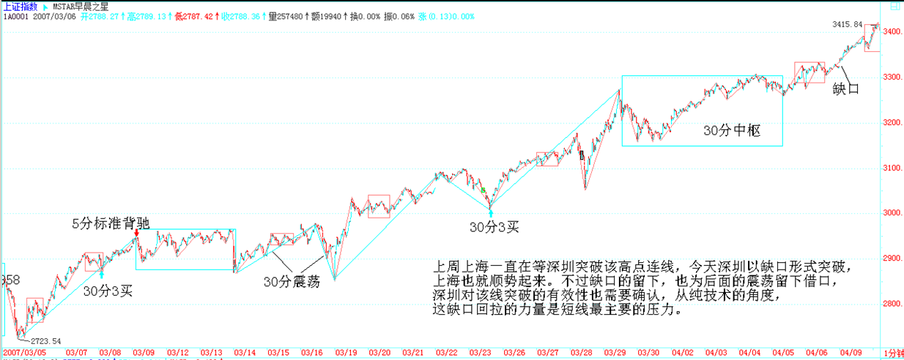

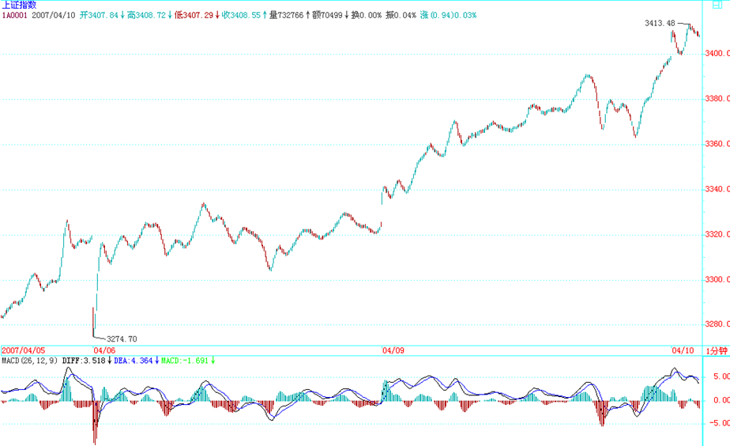

## 教你炒股票44：小级别背驰引发大级别转折

(2007-04-10 15:23:46)

有了上一课，对“背驰级别等于当下的走势级别”这最一般的情况，应该是很好把握了，唯一可能出现困难的，就是“背驰级别小于于当下的走势级别”这种情况，也就是所谓的小级别转折引发大级别转折，对这种情况，还要进行进一步的分析。

还是用上次的例子，向上30分钟级别的a+A+b+B+c，如果c是一个1分钟级别的背驰，最终引发下跌拉回B里，这时候，c里究竟发生了点什么事情？

首先，c至少要包含一个5分钟的中枢，否则，中枢B就不可能完成，因为这样不可能形成一个第三类的买点。不妨假设c`是c中最后一个5分钟的中枢，显然，这个1分钟的顶背驰，只能出现在c`之后，而这个顶背驰必然使得走势拉回c`里，也就是说，整个运动，都可以看成了围绕c`的一个震荡，而这个震荡要出现大的向下变动，显然要出现c`的第三类卖点，因此，对于那些小级别背驰后能在最后一个次级别中枢正常震荡的，都不可能转化成大级别的转折，这个结论很重要，所以可以归纳成如下定理：

缠中说禅小背驰-大转折定理：小级别顶背驰引发大级别向下的必要条件是该级别走势的最后一个次级别中枢出现第三类卖点；小级别底背驰引发大级别向上的必要条件提是该级别走势的最后一个次级别中枢出现第三类买点。

(注：小转大注意点1：小级别背驰引发大级别转折可以转2级，转3级，转4级.....原理相同。1分背驰转5分级别就看最后个1分中枢的3卖，1分背驰转30分级别就看最后个5分中枢的3卖，1分背驰逐渐扩展转日线级别的就看最后个30分中枢的3卖.....。

注意点2：这个该级别走势最后个次级别中枢是动态的，不一定为小级别背驰点前的中枢。

注意点3：本课文讲解为为1分背驰转30分级别转3级，43课举例601588为1分背驰转5分级别转2级------非分段后递归级别）

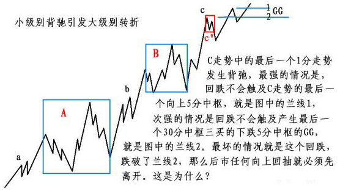

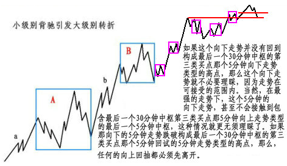

注意，关于这种情况，只有必要条件，而没有充分条件，也就是说不能有一个充分的判断使得一旦出现某种情况，就必然导致大级别的转折。小级别顶背驰后，最后一个次级别中枢出现第三类卖点并不一定就必然导致大级别的转折，在上面的例子里，并不必然导致走势一定回到最后的该级别中枢B里。

显然，这个定理比起“背驰级别等于当下的走势级别”必然回来最后一个该级别中枢的情况要弱一点，但这是很正常的，因为这种情况毕竟少见点而且要复杂得多。因此，在具体的操作中，必须有更复杂的程序来对付这种情况。而对于“背驰级别等于当下的走势级别”，如果你刚好是该级别为操作级别的，只要在顶背驰时直接全部卖出就可以。

对于“背驰级别小于当下的走势级别”的情况，为了简单起见，不妨还是用上面的为例子。如果一个按30分钟级别操作的投资者，那么，对于一个5分钟的回调，是必然在其承受的范围之内，否则可以把操作的级别调到5分钟。那么，对于一个30分钟的走势类型，一个小于30分钟级别的顶背驰，必然首先至少要导致一个5分钟级别的向下走势，如果这个向下走势并没有回到构成最后一个30分钟中枢的第三类买点那个5分钟向下走势类型的高点，那么这个向下走势就不必要理睬，因为走势在可接受的范围内。当然，在最强的走势下，这个5分钟的向下走势，甚至不会接触到包含最后一个30分钟中枢第三类买点那5分钟向上走势类型的最后一个5分钟中枢，这种情况就更无须理睬了。如果那向下的5分钟走势跌破构成最后一个30分钟中枢的第三类买点那个5分钟回试的5分钟走势类型的高点，那么，任何的向上回抽都必须先离开。

以上这种是全仓操作的处理方法，如果筹码较多，那么当包含最后一个30分钟中枢第三类买点那5分钟向上走势类型的最后一个5分钟中枢出现第三类卖点，就必须先出一部分，然后在出现上一段所说的情况时在出清。当然，如果没有出现上一段所说的情况，就可以回补，权当弄了一个短差。

有人可能问，为什么那1分钟背驰的时候不出去，这是与你假定操作的级别相关的，而走势不能采取预测的办法，这是不可靠的，由于没有预测，所以不可能假定任何1分钟顶背驰都必然导致大级别的转折，其实这种情况并不常见，你不可能按30分钟操作，而一见到1分钟顶背驰就全部扔掉，这就变成按1分钟级别操作了。如果你的资金量与操作精度能按1分钟操作，那就没必要按30分钟操作，而按1分钟操作，操作的程序和按30分钟的是一样的，不过相应的级别不同而已。

当然，对于有一定量的资金来说，即使按30分钟操作，当见到1分钟的顶背驰时，也可以把部分筹码出掉，然后根据后面的回调走势情况决定回补还是继续出，这样的操作，对一定量的资金是唯一可行的，因为这种资金，不可能在任何一定级别的卖点都全仓卖掉。至于底背驰的情况，将上面的反过来就可以。

读后感：

1、缠中说禅小背驰-大转折定理：小级别顶背驰引发大级别向下的必要条件是该级别走势的最后一个次级别中枢出现第三类卖点；小级别底背驰引发大级别向上的必要条件提是该级别走势的最后一个次级别中枢出现第三类买点。

2、第三类买卖点的出现是小转大的必要条件而非充分条件。

3、这个1分钟的顶背驰，只能出现在c`之后，而这个顶背驰必然使得走势拉回c`里，(注：在五分级别也是背弛时才行，否则只有在一分走反趋势时才是）

4、对于一个30分钟的走势类型，一个小于30分钟级别的顶背驰，必然首先至少要导致一个5分钟级别的向下走势（这是指五分顶背弛时;在一分顶背弛是不一定会有五分级别向下）

缠中说禅：2007-04-10 15:25:20

昨天说了，由于中石化等业绩很好，大盘股是压不住了，那些说现在市赢率如何如何的人，算一下中石化现在是多少？且不说今年依然可以高速增长。其实探讨这些没什么意义，只是汉奸总是拿这些说事，不妨也说说。

今天的震荡，就是对昨天缺口压力的一个反应，这在技术上很简单的情况，没什么特别的。现在，以前说的深圳1万点已经在眼前，当然，现在主要考验管理层智慧的时候，一个连深圳1万点都接受不了的管理层，绝对是历史性的笑话，谁愿意当这个笑话的主角，请便。

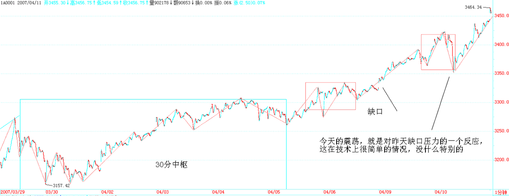

纯操作上，1根5日线，反复强调，看好这就足够了，至于那些喜欢测顶的人，从2000点就测到现在，劝一句，千万别玩期货，否则死都不知道怎么死的。

不过，即使在最有利于多头时，也绝对不能得意忘形，任何时候都不能追高，在这种走势中，如果技术不好，用均线控制持有，这是最简单且有效的办法。如果要换股操作，一定要注意节奏，必须在某级别顶背驰抛了，然后盘中回跌确实站稳后再换，这样才风险小。一般情况下，技术不好的，最好别随便换股，轮动走势，只要是本ID反复强调的优质二线成分股以及那些业绩、送配优良的二线股票，肯定都会启动的。

HYPERLINK "http://blog.sina.com.cn/u/1215172700" \t "_blank" 缠中说禅2007-04-11 15:38:12 [举报]

前两天经常说中石化，就如同过年前经常说联通，后面经常说中行一般，由此，这剧本的有趣地方，应该有点感觉了。汉奸原来不是很多工行要打压吗？那他们现在能对工行干点什么呢？把工行打压下5元？拉起来？现在中行已经成龙头了，看看两者的差价。其实，现在大盘的走势，就是一个现场直播，就那几只大盘股票，对指数起着关键作用，如何应用，什么时候用什么，大家应该好好体会，从过年前开始，慢慢体会，这样会学到点东西。

至于大盘，没什么可说的，测顶的人是最无耻的，按他们的预测，他们早就尸骨无存了，还好意思出来晃？顶是干出来的，而不是测出来的，连这个最简单的道理都不懂？还是那句话，看不明白的就看5日线，技术好的，可以充分利用震荡先卖后买打短差、换股，但绝对不能追高。现在能打住大盘的，只能是管理层的大棒，否则，大盘将继续走到资金与筹码的能量平衡位置才能停下来休整，而这个位置是不可预测的，是干出来的。心态不好、心脏不好的，就半仓，这样出现什么情况都好办了。

个股就不说了，反正都是以前说的，现在是瓜田李下，只干不说。

## 教你炒股票45：持股与持币，两种最基本的操作。

(2007-04-12 15:39:04)

发现很多人都有这样的糊涂概念，以为买入卖出才是股票的操作，是股票操作的所有了。其实，对于每一笔交易来说，买入卖出，1秒都不用就完成了，更多、更长时间的，填充在买入与卖出之间两种最基本的操作：持股与持币，才是更重要的操作。

假设你是按30分钟级别操作的，那么，在一个30分钟的买点买入后，就进入一个持股的操作中，根据本ID的理论，你很明确地知道，一个30分钟的卖点必然在前面等着，这卖点宣告从那30分钟买点开始的走势类型的结束。在这个卖点到来之前，你就只在持股这唯一的操作里。当这个30分钟的卖点出现时，卖出，然后就进入持币的操作里，直到一个30分钟的买点出现。持股与持币，归根结底就是一种等待，等待那个被理论绝对保证的买卖点。所有股票的操作，归根结底，只有两个字：等待。

等待市场的买卖点，和等待彗星的到来不同，后者，可以很精确地知道具体的时间，而市场的买卖点是生长出来的。买卖点的生长过程，就是一个具体的走势类型的生灭过程。这些过程，不妨用一个30分钟第一类买点a开始的30分钟走势类型如何生灭为例子进行说明。

一个30分钟的走势类型，最低标准，就要形成一个30分钟的中枢，一旦这中枢形成，该走势类型随时结束都是符合理论的。这样，最弱的走势类型，就是该中枢一完成就结束，在该例子里，就是从a点开始，三段重叠的5分钟走势类型结束后，该30分钟走势类型就结束了。用A1、A2、A3来依次代表这三段5分钟走势类型，显然，从a开始的这30分钟走势类型就可以用A1+A2+A3表示。那么，在实际操作中，如何事先知道，是否真的将形成这种最弱的走势？答案是否定的，不仅不可能事先知道是否真的要出现这种最弱的走势类型，而且走势类型的任何可能性都不可能被事先确认，这说明什么？说明预测是毫无意义的，走势是干出来的，是市场合力的结果，而不是被上帝所事先确定的，市场中没有上帝，市场的方向只有所有参与者的合力决定，大资金或高技巧，可以用自己的力量去引导市场，按照自己的剧本来演绎，但没有上帝可以完全事先确定市场走势类型完成的所有细节。

那么，如果一切都不可以预测，那本ID理论的意义何在？一切虽然不可以预测，但一切走势类型的可能结构与类型，却是可以分类的，每一类之间都有着明确的界限，因此，你唯一需要的，就是观察市场当下的走势，让市场去选择可能的结构与类型，然后根据市场的选择来选择。注意，这对于大资金来说一样的，无论任何规模的资金，归根结底都只是市场的分力，不是合力本身，企图把自己当合力本身，把自己装扮成上帝的，最终的结局都是死无葬身之地。只要是分力，就要观察市场当下的反应，根据市场反应的当下选择来选择。

例如，本ID可以点火二线股，可以把超级大盘股编写在剧本里，但本ID从来就不会觉得自己是上帝在操控市场，本ID不过是在和市场互动，一旦市场某方面的能量被引导耗尽，自然就要选择相反的操作来互动市场，这是一个复杂的当下感应过程，必须最敏锐地察觉市场能量的变动。

当第一个中枢形成后，走势类型可以随时结束，后面的分类比较复杂，今天时间太紧，写不完，在下堂课中将详细论述。但今天的课程，是一个思维上的关键，必须明确两点：一、买卖点操作后，等待是一个最关键的过程，必须密切关注相应的走势类型的生长与分类选择，这一切都是当下的。二、买卖点本质上是走势类型的生长状况与分类决定的，反过来，某些买卖点的出现，又使得走势类型的生长状况分类有一个明确的界定，这些都是观察市场细节的关键之处。

读后感：

1、持股与持币，才是更重要的操作。

2、所有股票的操作，归根结底，只有两个字：等待。

3、最弱的走势类型，就是该中枢一完成就结束。

4、一切虽然不可以预测，但一切走势类型的可能结构与类型，却是可以分类的，每一类之间都有着明确的界限。

5、唯一需要的，就是观察市场当下的走势，让市场去选择可能的结构与类型，然后根据市场的选择来选择。

6、当第一个中枢形成后，走势类型可以随时结束。

7、一、买卖点操作后，等待是一个最关键的过程，必须密切关注相应的走势类型的生长与分类选择，这一切都是当下的。二、买卖点本质上是走势类型的生长状况与分类决定的，反过来，某些买卖点的出现，又使得走势类型的生长状况分类有一个明确的界定，这些都是观察市场细节的关键之处。

缠中说禅：2007-04-12 15:40:48

在一片恐惧与测顶的大师忽悠下，本ID剧本中的深圳1万点，已经在指边。前几天说了，连深圳1万点都接受不了的管理层，可以回家洗洗睡了。别把管理层看得过高，特别他们的智力，本ID和他们打了十几年的交道，他们是什么水平，心里有数。现在，是考验他们的水平是否有所提高的时候，如果还按以前的水平，那么，这几天，就是他们被汉奸忽悠成功的时候。当然，本ID2005年6月曾大肆称赞某山东人确实是山东人，从此，一轮牛市开始，到今天，希望山东人继续要像山东人，梁山可是在那旮旯的，别屁点小事就撑不住。

站在20年大牛市的视角下，深圳这1万点就是屁点的小事，20年的剧本，本ID已经写好，3月19日加息那天开盘前，本ID贴出“神州自有中天日，万国衣冠舞九韶”这文章，从此，这行情走到现在，那就是剧本，当然，中途出现一定调整是正常的，甚至会有周线、月线级别的调整，但大方向是不可改变的。

任何企图阻挡中国崛起的人，最终都只能是历史的笑话，让市场按自己的节奏走，管理层先把自己管好，把随意干预市场的冲动给阳痿掉。市场要调整，也按市场自己的节奏来。

个股就不说什么了，百花齐放、百家争鸣，二线股拉开空间，三线跟上，没什么大不了的。怕的，就半仓；胆子大点的，就看5日线；技术好的，天天都是本ID理论利用震荡的天堂。真正的，从2005年下半年就开始的，如本ID一样的坚定多头，那就继续20年的剧本，把戏一直演到2225年以后再说。

今天扯点闲话。(2007-04-13 15:31:25)

现在来这里的人，虽然还达不到去孔男人那里的三分之一，但也是越来越多。本ID开这个博客，并不是因为无聊没事干，主要的原因如下：

一，为了让自己写点东西，像解释《论语》这种东西，如果没有这样一天天坚持写下来，是很难完成的。本ID目前也不适宜抛头露脸，资本市场这行业是一个寂寞的行业，只有失去能力才去抛头露脸，就离死不远了。等本ID哪天决定完全离开资本市场第一线时，才会出版了。

二、现在，众声喧哗，皆为贩卖，本ID这里什么都不卖，这里无法可传、无门可入，幻网之中起幻事，密在汝边自珍重。

三、至于说到股票，也是希望各位能自立，本ID将市场那点破事说说，有缘得之。本ID这里，股票是末事，金钱对于本ID来说，10几年前就是末事了，但这点生存的小技巧，如果能被有心者用去，解去一点生存压力，于金钱而自由，在这现实中，也是一条方便之路。

四、现在蠢人太多，中国之崛起，气运在，蠢人多虽不妨大事，但凭空多了点波折，折腾的可是所有的人。最好的办法，就是先把蠢人的蠢行和谎言一一戳穿，大道流行，自有开花结果日。

五、本ID这里有很多CD，有机会和各位分享一下，顺便卖个广告，去本ID的播客多下载，本ID以后上传的空间才大，大家可以听到的音乐就多，本ID对电脑如对面首，不想太深入研究，那播客用着还顺手，就不换了，更不会自己去弄一个私人空间。就像在这里，诸多问题，但本ID是到一地方就不爱挪了。

六、没什么理由，既然已经有了，就继续有下去，就像买点已经买入，现在是持有阶段，卖点出来之前，就继续持有吧。

最后补充几句，本ID这里的东西，不排除有人会拿出去贩卖。现在说股票的人，那些靠收别人钱而活的人，不能便宜了他们。在市场里，有本事就挣市场的钱，注意，所有要收钱的，都一定是市场的失败者，给钱他们，还不如去澳门赌了算了。

自立，不能靠任何人，连本ID都不能依靠。人人是佛，别憋屈自己了。

缠中说禅2007-04-13 15:33:16 [举报]

正如昨天所说，目前是考验管理层智慧的时候，今天的走势很正常，尾盘的下来就更正常了，这种2点45分的跳水走势，又不是第一次了，技术上不难把握。这也是本ID反复强调的，利用技术先卖后买降成本的好机会。

基本面上，所有人对管理层可能的态度有点担心，而且深圳1万点、上海3500的第一攻击目标已经到，进行震荡稳固本就是应该的事情，以退为进是最好的选择。现在就看管理层的短期态度，20年的牛市，来日方长，本ID从来都反对急功近利。在目前位置展开整固，将有利于大盘以后的走势。

个股依然活跃，但本ID反对乱炒，这已多次说过，这样只会增加汉奸没哭诉的口实，而管理层的智力与经验都有限，最终将损害市场本身。今天有些股票的表现就有点过分了，这样，市场本身也要给予降温，让大家都冷静一下。本ID不愿意看到因为某些人的急功近利，损害都市场所有人的利益。

缠中说禅2007-04-13 16:19:51 [举报]

各位，在市场中反复磨练，一个能在市场中自如的人，没有什么能打扰了。如果你的情绪，能让你看不到买卖点，那么什么技术都是没用的，一定要感觉市场的节奏，这样才能降低成本。大牛市里，筹码是不能丢的，但成本一定要不断下降，这已经反复说了。成本不降，就抗拒不了短线震荡的风险。技术好的，见到震荡就高兴，成本又可以降下来。否则就是坐电梯，上上下下享受。好了，周末，本ID要去腐败了，周日回来放“四季”再见。

缠中说禅2007-04-16 15:25:25 [举报]

管理层是不能太表扬的，虽然这次上1万，表现得还很山东人，但还是不能表扬。周末没有任何消息就是最好的消息，所以今天的走势就极为正常了。那些测定的大师们，如果弄期货，早破产几百次了，所以期货还是不要出来了，免得汉奸都去跳楼。

多次强调，一条5日线就比所有测顶大师要厉害1万倍，连5日线都不破的走势，你还有什么可担心的？当然，如果你技术可以，每天都可以利用震荡来换股、打差价。如果技术不行，就看5日线吧。至于那些测顶大师，那就继续伸长脖子等大阴线吧，真出大阴线，你们也不敢买，最多就忽悠自己怎么厉害，知道一定会调整，可惜，这些人从2000点、3000点就一直说调整，2月27日也只让你们高兴了一天，你们那天敢买吗？大阴线又和你们有什么关系？现在空仓的，唯一办法就去反省，看是什么心态造成的。偷心不死，自然有这样的结果。有这么大的头，才带那么大的帽子，顶都给你们测去了，本ID之类的人吃什么？

本周当然会有震荡，这就像说面首都是男的一样没意义，关键是如何通过震荡减低成本，而不是把震荡当成自己预测如何准确的谈资。股票如面首，是用来操作的，不是用来谈论的。目前，关键还是管理层的态度，只要他们的态度没有明确的打压，那就不会有任何大问题。操作上，追高就没必要了，空仓的就看着吧，好好反省；其余技术不好的，继续看5日线，技术好的，看好1分钟、5分钟的小背驰做震荡。

HYPERLINK "http://blog.sina.com.cn/u/1215172700" \t "_blank" 缠中说禅(2007-04-16 21:59:44)

管理层是不能太表扬的，虽然这次上1万，表现得还很山东人，但还是不能表扬。周末没有任何消息就是最好的消息，所以今天的走势就极为正常了。那些测定的大师们，如果弄期货，早破产几百次了，所以期货还是不要出来了，免得汉奸都去跳楼。

多次强调，一条5日线就比所有测顶大师要厉害1万倍，连5日线都不破的走势，你还有什么可担心的？当然，如果你技术可以，每天都可以利用震荡来换股、打差价。如果技术不行，就看5日线吧。至于那些测顶大师，那就继续伸长脖子等大阴线吧，真出大阴线，你们也不敢买，最多就忽悠自己怎么厉害，知道一定会调整，可惜，这些人从2000点、3000点就一直说调整，2月27日也只让你们高兴了一天，你们那天敢买吗？大阴线又和你们有什么关系？现在空仓的，唯一办法就去反省，看是什么心态造成的。偷心不死，自然有这样的结果。有这么大的头，才带那么大的帽子，顶都给你们测去了，本ID之类的人吃什么？

本周当然会有震荡，这就像说面首都是男的一样没意义，关键是如何通过震荡减低成本，而不是把震荡当成自己预测如何准确的谈资。股票如面首，是用来操作的，不是用来谈论的。目前，关键还是管理层的态度，只要他们的态度没有明确的打压，那就不会有任何大问题。操作上，追高就没必要了，空仓的就看着吧，好好反省；其余技术不好的，继续看5日线，技术好的，看好1分钟、5分钟的小背驰做震荡。

缠中说禅2007-04-16 21:59:44 [举报]

老师您好！　周线上看　用波浪理论　是不是正在运行第5浪？如果是的话走完后　会构成周线级别的背离吗？

==

现在连周线的中枢都没形成过，怎么会有周线的背驰？要背驰也最多是日线的，而且能不能形成还要打个问题，这没必要预测，看市场自己走出来。本ID这里没有什么子浪，只看中枢的运动。

缠中说禅2007-04-16 21:17:11 [举报]

感觉今天那个一分钟的下跌勉强还能看出来，回补的位置就毫无征兆了。我用两秒钟图都看不出来有回补的信号

=

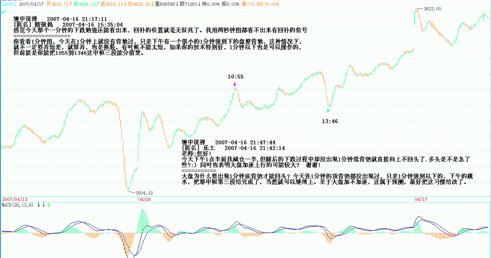

你看看1分钟图，今天在1分钟上就没有背驰过，只是下午有一个很小的1分钟级别下的盘整背驰，这种情况下，就不一定要弄短差，就算弄，也是换股。有时候不能太短，如果你的技术特别好，1分钟以下也是可以操作的，但前提是你能把1055到1346这中枢三段能分清楚。

缠中说禅2007-04-16 21:47:44 [举报]

老师:您好!今天下午1点半前我减仓一半，但随后的下跌过程中却没出现1分钟低背弛就直接向上不回头了.多头是不是急了些?:) 同时也表明大盘加速上行的可能较大?

谢谢!

==

大盘为什么要出现1分钟底背弛才能回头？今天连1分钟的顶背弛都没出现过，只是1分钟级别以下的，下午的跳水，把那中枢第三段给完成了，当然就可以继续上。至于大盘加不加速，这属于预测，最好把这习惯给改了。

缠中说禅2007-04-17 15:38:56 [举报]

今天，你爽了吗？这样的震荡，就是本ID理论的天堂，打开1分钟图，看看1030和1340分这两个点是什么，如果还看不明白，更重要的是，如果当时还没有反应，那你还需要多学习。暂时学不会的，本ID已经给了一个最简单的武器，5日线，当然，这会错过很多短差机会，但比那些测顶大师要厉害多了。

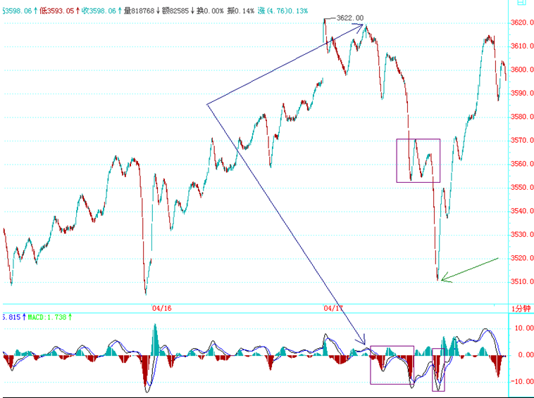

今天之所以有这样的震荡，其实很简单，因为明天有重要数据公布，但今天有一个更重要的消息，就是以后到香港上市，一定要10亿美金以上，这就充分说明了，目前的管理层依然山东人，这么好的市场，能解决大问题，不充分利用，那真傻了，希望管理层继续山东人下去，但本ID依然不准备表扬他们。当然，今天还有人忽悠到某日报上写文章了，这种破伎俩都要使用，汉奸也真窝囊。

但在最顺利时，也必须谨慎，市场永远是风险市场，股票永远是废纸，任何追高杀跌的行为都是自寻死路。明天的数据影响短期走势，如果数据不好，有大的加息预期，则继续震荡也是很正常的，但大方向是不变的，而且，加息是一件很无聊的事情，如果还用，真有病了。

个股方面，没什么可说的，二线拉开空间三线继续，这早说过了。但必须指出，有些人的操作太乱，如果技术不行，难道持有都办不到？像那14只里的，今天还一大半再创新高，有多少人拿住了？600578、600777、000915这些前面特慢的，还有人有吗？前面反复强调过不在14只里的那VC股，估计没人拿住了吧？中小板的小盘股，中线如何关注，大概也没有人有耐心了。

注意了，那些股票涨太多没买就算了，本ID是反对任何追高的，昨晚说过，如果有耐心的，可以去选择估计把业绩搞坏的那些股票，如果公布坏业绩反而走好的，就好好看着，特别那些价位不高的，这种手法，并不难发现，找好买点进去就可以。现在，监管时段，本ID也不好说具体的，只能描述一下方向。

## 教你炒股票46：每日走势的分类

(2007-04-18 15:36:09)

本来要继续写上节所遗留的第一个中枢形成后走势类型的分类问题，但发现太多人，连每天如何看盘都搞不清楚，这事情可能更迫切，所以先说一下。

当然，如果是按某级别的严格操作，每天具体怎么走是关系不大的，走势不会因为交易是按天来的就有什么本质的不同。但针对每天的走势进行一些分类，至少是一个好的辅助。

一天的交易是4小时，等于有8个30分钟K线组成的一个系统。把3个相邻30分钟K线的重叠部分当成一个每天走势上的一个中枢，那么，一般来说显然，任何一天的走势，无非只有三类：一、只有一个中枢；二、两个中枢。三、没有中枢，其力度依次趋强。

一、只有一个中枢

这种走势，是典型的平衡市，一般情况下，开盘后前三根30分钟K线就决定了全天的波动区间，而全天的极限位置，基本上，至少有一个都出现在这前三根30分钟K线上，不是创出当天高点，就是创出当天低点。当然，这不是完全绝对的，因此可以对这种情况进行更细致的分类。

1、在前三根30分钟K线出现当天高点

这可以称为弱平衡市，其中最弱的是当天低点收，注意，这和当天是否红盘无关，高开最后红盘收也可以形成这种最弱的弱平衡市。次弱是收在中枢之下，收在中枢是一般的弱平衡市；收在当天高点附近的是最强的一种。

2、在前三根30分钟K线出现当天低点

这可以称为强平衡市，其中最强的，就是以当天高点收，同样，这与当天是否红盘无关。次强是收在中枢之上，收在中枢是一般的强平衡市；收在当天低点附近的是最弱的一种。

3、在前三根30分钟K线不出现当天高低点

这可以称为转折平衡市，同样可以像上面情况一样根据收盘位置定义其强弱。

注意，以上三种情况中枢的位置不一定是前三根30分钟K线的重叠，可以是后面几根的。

二、两个中枢

显然，这根据两中枢的前后方向可以分为向上、向下两种，一般地，讨论向上的情况，向下的情况反过来就是。

两个中枢，显然不能有重叠的地方，否则就会转化成上面的情形。因此，这种形态，最大的特点就是这两个中枢之间有至少有一个30分钟K线，其中有部分区间是不属于两个中枢的任何一个，这个区间，成为单边区间，这是这种走势最重要的特点，是其后走势的关键位置。注意，具有单边区间的K线不从属任何一个中枢。

由于只有8根30分钟K线，根据单边区间所在位置，无非是两种可能： 1、单边区间在第四根30分钟K线。2、单边区间在第五根30分钟K线。由此就知道，为什么所有出现单边走势的，变盘时间都在中午收盘的前后30分钟之内。

当然，第4第5根30分钟K线可以同时具有单边区间。如果只有第4根K线具有单边区间的情况，那么第八根K线，有可能出现穿越单边区间的情况，例如，昨天200070417的走势。

显然，对于上涨的情况来说，最强的就是收盘在第二中枢的上方，最弱的，就是出现第八根K线出现穿越单边区间的情况，最终收在第一个中枢的之下。然后根据收盘的位置，可以依次定出其他的强弱。

三、没有中枢

这是最强的单边走势，8根K线，没有相临3根是有重叠部分的，一旦出现这种情况，就是典型的强烈走势，一旦出现这种走势，该日K线都是具有重要意义的。一般来说，这种走势很不常见。例如，227那天就是。但别以为出现这种走势就一定会继续趋势，往往很多骗线就是故意用这类走势构成，特别是在大的日K线中枢中出现这种情况，更大可能是骗线，例如227。当然，如果是在一个第三类买卖点后出现这种走势，出现大级别的强势趋势的可能性就极大了。

时间紧，不能写太多，如何利用每天走势图进行辅助操作，在周五的下节课中说。

读后感：

1、如果是按某级别的严格操作，每天具体怎么走是关系不大的。

2、针对每天的走势进行一些分类，至少是一个好的辅助。

缠中说禅：2007-04-18 15:38:33

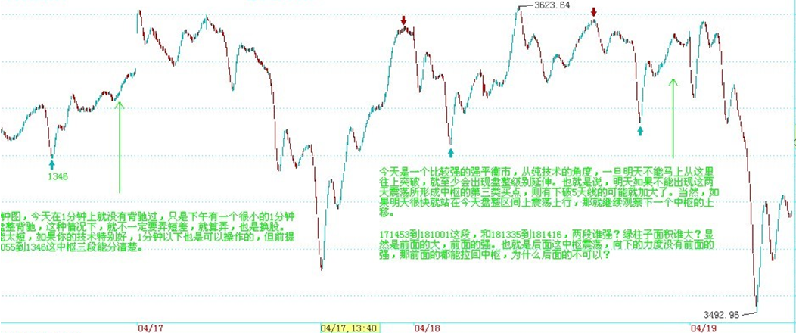

今天是一个比较强的强平衡市，从纯技术的角度，一旦明天不能马上从这里往上突破，就至少会出现盘整级别延伸。也就是说，明天如果不能出现这两天震荡所形成中枢的第三类买点，则有下破5天线的可能就加大了。当然，如果明天很快就站在今天盘整区间上震荡上行，那就继续观察下一个中枢的上移。

上面说的是纯短线技术方面的问题，基本面上，该出的消息被推迟，也是造成今天走势的直接原因，但这东西本周一定出来，但究竟有多大意义，估计只对基金等有影响，但这轮行情，基金丑态毕现。

今天最好玩的是事情就是那汉奸基金的破事被公开了，当然，这事情本ID早知道，而且本ID那14只股票里有两只999、343，那汉奸都有，所以当时999打回14元下时，本ID就说过，不想让汉奸以及老鼠仓出太高了。本ID以前说过，要实验一下阻击基金，探讨一下把基金给清盘的可能，本ID的话不是白说的。文章还在，有兴趣者可以去复习一下。

今天，本ID有点想八卦一下，因为今天000416第一个翻出两倍多，这是元旦后说的三只里的一只，调查一下，有谁能从3元拿到现在？其他，000777等很快也两倍了，还有人拿着吗？如果都没有，那么为什么？是不是操作上有些问题需要解决？那14只个股，平均涨幅，从元旦开始，超过100%了，如果元旦到现在不超过100%的，必须彻底反省自己的操作。

HYPERLINK "http://blog.sina.com.cn/u/1215172700" \t "_blank" 缠中说禅2007-04-18 16:41:09 [举报]

缠姐老大，我怎么觉得是下午的看ｍａｃｄ的要强一点呢？１７日的那段离开力度反倒弱一些呢。而下午的柱子是大力放长了。感觉是力度大了。根据中枢震荡力度比较，怎么觉得今天该是更往下一些呢？请缠姐明示，小弟看了很久都还不能明白。

==

171453到181001这段，和181335到181416，两段谁强？绿柱子面积谁大？显然是前面的大，前面的强。也就是后面这中枢震荡，向下的力度没有前面的强，那前面的都能拉回中枢，为什么后面的不可以？这在关于中枢震荡的课程里都有，请再次研究一下。

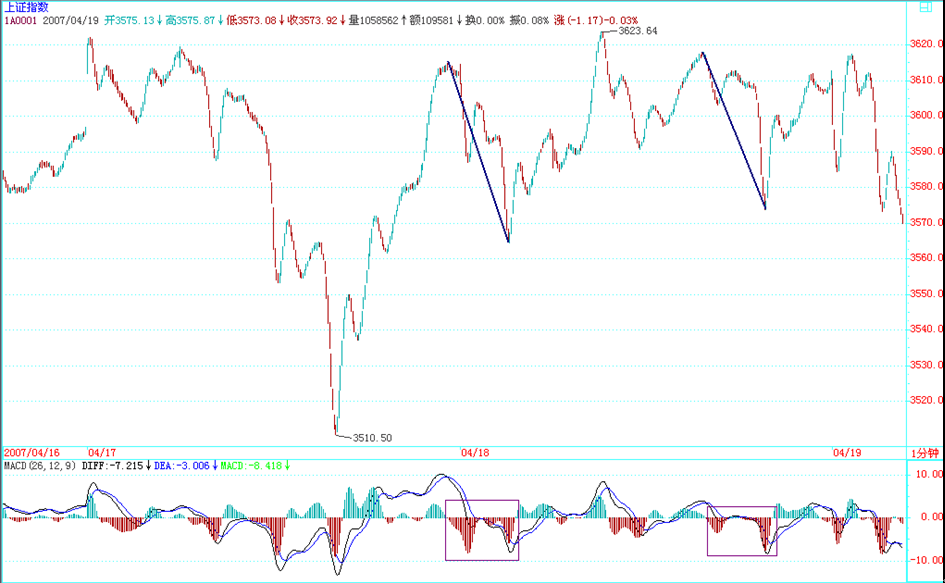

缠中说禅：2007-04-19 15:37:29

今天走势很正常，技术上的道理，昨天已经说了，就算搞不清楚昨天说的，5日线下破以及04191108昨天中枢的第三类卖点，都足以让你有足够时间去反应。牛市就是快跌慢涨，卖了就要找机会买回来，否则，牛市与你无关。基本面上，数据最终如何，问题都不大，就算是加息，也没什么大不了的。

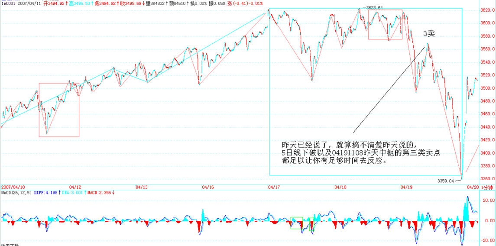

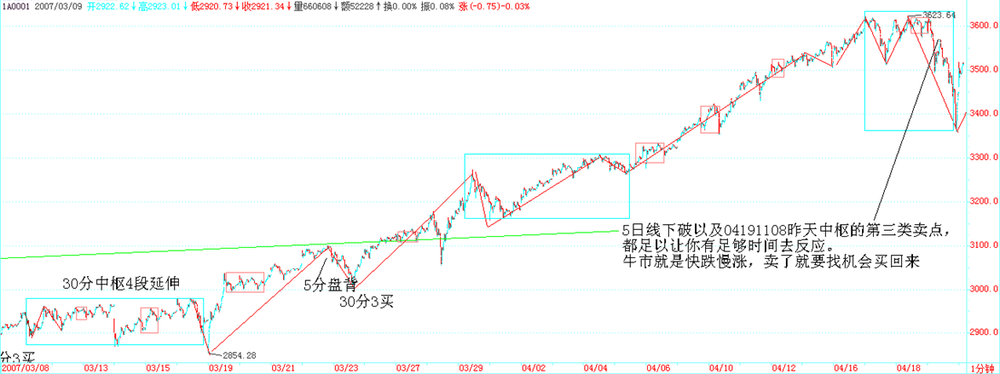

今天1030到1330，三K线形成3520上下的中枢，短线就看这能否重新上穿，一旦上穿站稳，就继续原来走势。当然，站在本ID的角度，完成深圳1万，上海3500的第一目标，是希望在这里出现一个整固过程，这在前面也说过，这样才会比较稳健。当然，目前资金流入太快，本ID这类稳健的想法，不一定能得到市场的认可，本ID只看市场的反应，市场想干什么都可以。个股方面，补涨的、故意玩坏业绩的，都会继续表现。

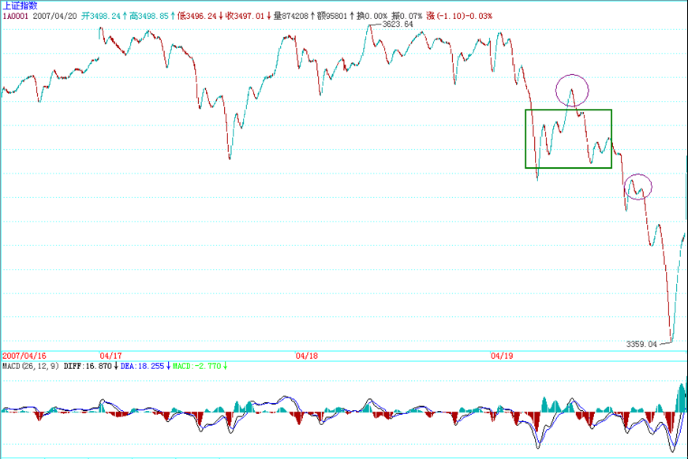

继续八卦一下，今天这样的走势，可以把人分为几类：一、吓傻了。二、被夹空在说，我都说要调整的，其实从3000点开始就说了，今天终于可以自渎一下。三、实干型，一看早上开盘没有形成第三类买点可能，就先走，最迟在04191108懂得把有卖点的股票走掉的，然后等待买点回补的。四、激进型，在大跌中还敢于对有买点的股票发动进攻的。真正做到只关心买卖点，有卖点就卖，有买点就买，不会被大盘的波动而影响。

请问，你属于哪一种？

缠中说禅：2007-04-19 22:16:50

今天的速度太慢，很难把回复贴上去，大概今天震荡厉害，把人都震到新浪上来了。市场经验是需要磨练的，平等对待买卖点，这样你的技术会提高一个层次。

如果技术不好的，例如本ID让你看5日线，如果连5日线都看不好，那就是心态问题了，这就要彻底反省了。心态不好，脑子里总是有幻想，而不是根据市场实际走势来，这样，学什么技术都没用的。

知道，明白，看得懂，和能操作好，这里的差距大了去了，所以，以前本ID就说过，都学本ID的理论，并不会影响本ID，最后比的是人本身。

如果连最基本的，永远不追涨杀跌都做不到，那就没什么可说的。先下，再见。

## 教你炒股票47：一夜情行情分析

(2007-04-20 08:51:58)

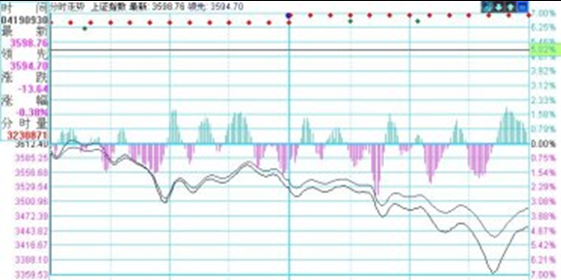

一个很显然的道理，对市场了解越多，对走势的把握越精确。例如，昨天20070419的2007年一夜情行情，跌破5日线后有一个反抽，在11点08刚好构成对前一天中枢的第三类卖点，这就是最后的、被本ID理论所保障的离开机会。那么，后面去走，就完全与本ID的理论无关了，在一个下跌里，除了最后那一个位置，所有的卖出都是对的，但这和本ID的理论无关，这类似赌博，就赌不是最后的位置。当然，赌博也是一种方法，但这种把握，不在本ID的讨论范围内。

有人可能要问，就算跌破5日线，也可能很快就拉起来，确实，存在这种可能性，但市场是否选择这种可能性，就是当下的。如果很快拉起来，那自然会有一个符合本ID理论的买点出现，这只要市场自己去选择，既然已经卖出，就耐心等待。而其中，当然与分析的精确度有关，有些人分析不到位，会回补早了，那这很正常，技术更熟练的，当然应该享受更精确的买点。但节奏是重要的，站在小级别操作的角度，就算你补早了，也比没走傻看着强。补早了，就以后多总结经验，使自己的技术精度更高。

不过，必须强调的是，上面说的，都是针对资金比较小，操作级别比较小的说的。如果是按日线级别操作，那这些震荡根本无须理会。如果真按日线操作的，就应该从1000多点一直拿到现在，因为日线级别的卖点并没有出现，等出现再说。而用周线级别操作的大资金，那就更无所谓了。此外，这里只是以指数为代表来说一种方法，个股在自己的图上是一样分析的。

其实，如果你对市场理解更多点，就知道，这一夜情走势的当天低点，其实是很容易把握的。这就和上节所说的当日走势分类有关。最后一个第三类卖点对5日线进行反抽出现在11点08。前面3个30分钟K线，没有重叠。也就是说，下面走势显然不可能出现存在两个中枢的单边走势，三大类里，第二类是不可能出现了。对于第一类，平衡市的走势，最好的情况，也只能是当日中枢在11点后那个K线范围内。至于出现第三类，也是就没中枢的走势，那意味着后面有巨大跌幅。而第三类卖点后面，至少都会出现一个次级别的跌势，也就是一个1分钟以下级别的向下走势是必须完美的。所以，站在纯理论推理的角度，可以100%确定地安排后面可能的回补，也就是，从11点08开始的向下走势至少要出现走势的完美。注意，这些分析，在1108后就马上可以给出，并不需要预测或事后编排，都是根据可以根据本ID理论严格分析出来的。

下午开盘后，到1330点，就知道，第三类可能不存在了，因为当日一个连续3个30分钟K线的重合已经出现，也就是当日的中枢出现了，也就是说，到1330分钟，市场已经自己给出了选择，市场不可能出现227那天的无中枢下跌，最多就是一个弱的平衡市，因此，1030到1330这个中枢，就是最值得关注的。用中枢震荡的观点，需要比较的就是1030前的下跌与1330点后的下跌。这时候，大盘还没有真正对该中枢破位，但已经可以100%肯定地知道一旦破位，需要去看什么来决定买卖点。用MACD辅助，显然1分钟图并不适合看，因为1030到1330分钟前，这个MACD已经有绿柱子了，这样看起来费劲，可以选择更大级别的图，5分钟的。在5分钟图上，1030前的下跌刚好构成一个绿柱子面积，而1030到1330刚好出现回拉，所以黄白线没有明显到0轴，但红柱子是有了，所以，用中枢震荡的看法，后面的下跌，出现的背驰不会是5分钟级别的，只能是5分钟以下级别的，甚至就是分笔级别的最小背驰，然后引发大幅度回拉该中枢附近。当然，如果是特小级别的背驰，并不一定有足够力度决定其一定能拉回该中枢，但由于这中枢的存在，其力度是可预期的。

上面的分析，在大盘1330没真正继续破位前，就可以100%明确地给出，里面都是纯逻辑的推理，和任何预测无关。假设你已经在1108的第三类卖点出去了，而且你又是小级别操作者，那你需要的就是回补，所以有了如上分析，你就可以耐心等待，看5分钟图去比较其力度了。而且，你应该知道，强力回拉，并不一定需要一个1分钟的背驰，在大幅度下跌后，一个分笔的背驰就足以引发盘中大幅回拉该中枢，特别，由于1030前下跌引发的反抽也是一个分笔的背驰造成，一般来说，中枢震荡都有对称性，虽然不是绝对，但已经足以让你不会忽视分笔背驰引发小级别转大级别的极大可能。（分笔背驰，一般可以用1分钟MACD柱子的长度来辅助）

在大盘进入再次下跌时，你已经有足够的准备去等待。而且，你可以很明确地知道，在跌破1030到1330的中枢后，首先会有一个小的第三类卖点，小的第三类卖点后，有两种演化的可能，一是变成一个大一点级别的盘整，一个是形成下跌，至少再有两段向下。对第一种情况，在这盘整出现后，有足够的时间去选择介入，所以不用着急。而后面市场的真实选择，现在都很清楚了，就是第二种，在一个小的第三类卖点后，再出现两波下跌。

对于一个跌破中枢的下跌来说，第三类卖点后再来两波就可以随时完美。这个完美，由于该下跌是1分钟以下级别的，因此从该下跌的细部，是找不到根据1分钟背弛去确认的买点的，只可能根据分笔背驰。而根据预先知道的中枢震荡看法，唯一需要确认的是，1330后的下跌与1030前下跌的力度比较。从5分钟MACD两柱子面积的比较可以看到，前者并不比后者的力度大，这一点，参考看深圳成指的图就更明显了（请看下图）。所以，可以断言，这1330开始的下跌，一定会有强力回拉。

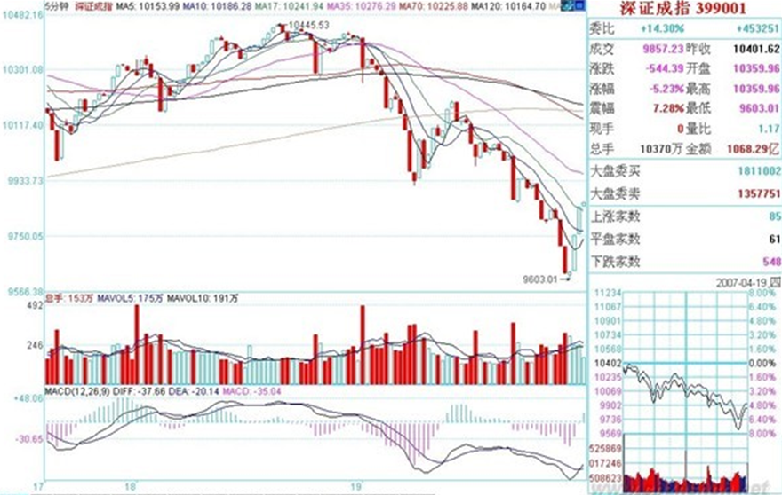

实际走势，在该第二波的分笔背驰（看1分钟图1443的MACD柱子，该K线还是所谓的早晨之星）后，大盘出现大幅度回拉，这其实是理论100%保证的事情。注意，并不是下跌的分笔背驰就一定存在大幅回拉，而是这天的当日平衡市的走势类型的中枢位置与时间决定的。而且，反抽的最低位置也很清楚，就是这下跌最后一个反弹处，结果收盘也真的是在该位置，这其实也是理论所保证的。

当然，如果你懂的东西更多点，对该最后位置的确定是可以很精确的。首先，日线的布林通道中轨和20天线都在3351点，按一般的技术分析，这是一个强力支持位置，而实际低点在3358点。另外，在1分钟图上的下降通道下轨，也在该位置，几个因数相配合，该位置出现反抽就完全在把握中了。

后面的走势很简单，关键是那中枢，由于分笔背驰只保证回抽到下跌最后一个反弹处，收盘已达到，而分笔背驰并不100%支持对该中枢的完全回拉，所以理论上，依然完全存在继续跌出一个更大级别的背驰再回拉的可能，当然，也可以直接上去，这必须由市场来选择。但无论哪种情况，该中枢都是一个新的中枢形成前的判断关键。而420当天中枢的位置，就决定了今后走势可能的演化。

以上，是一个分析的范本，这些分析，都是可以当下进行的，里面不涉及任何预测，市场当下的每一步走势，都相应给出分析的选择。对本ID理论熟悉的，其实1秒就可以把当下情况分析清楚，然后采取最正确的操作。但必须强调，这只是为了说明如何去分析，并不是鼓励所有人都去弄这种超级短线。当然，如果你连这么精确的分析都能当下完成并指导自己的操作，那么那些大级别的操作，就更没问题了。如果有T+0，对于小资金来说，这些就是有绝对实战意义的事情，当然，在T+1的环境下，就算3358买的，在第二天，还有出不掉的风险。而如果是T+0，那就不存在了，因为对于超级短线来说，回拉最后反弹位置就可以出来，然后看市场下一步的选择再选择下一买点。再次强调，这只是为了说明理论，并不说都要按这么小级别去操作，只不过大级别的分析是一样的，切记。

当然，如果你对当日走势的辅助判断有更深的了解，那么用当日对冲等方法来降低成本，也是可以做到的，但这只能在下节继续了。有时间，可以去研究一下与大盘节奏不同个股的走势，感受一下大盘这外在因数对个股的影响是如何首先必须有个股的内在原因的，例如，大盘的下跌反而使得某些股票构造出第二、三类买点，而在中枢上移强力延伸的股票，甚至不搭理大盘。也可以去参考一下，那些随大盘下跌的股票，是本来就存在卖点，大盘只是加大了卖点后向买点运动的幅度，但并不会改变卖点与买点的内在逻辑结构，明白了这一点，对本ID理论的理解会更深点。

读后感：

1、中枢震荡都有对称性。虽然不是绝对。

2、一夜情行情的特征。

缠中说禅：2007-04-20 08:53:33

今天下午一收盘就有一个会议，收盘分析只能在晚上9点半写，抱歉。先下，再见。

抓紧时间写两句，今天晚上有两拨事情，9点半回不来。

大盘今天的走势太正常不过了，今天，几乎就是一个无中枢的上扬走势，昨天已经说了，今天只要重新站稳3520，就继续原来走势。今天前1小时就确认了这点，今天这种走势还害怕，那就是心态问题了。整天惊弓之鸟一样，怎么参与市场？

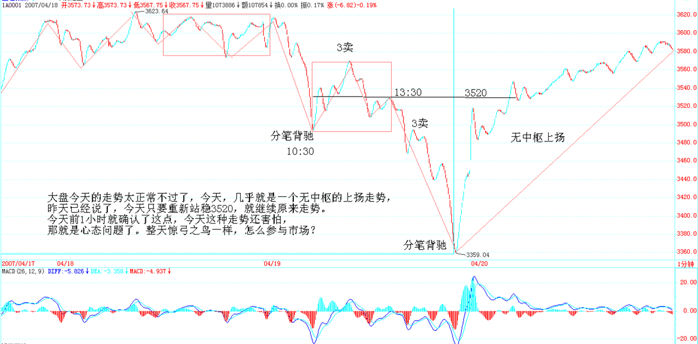

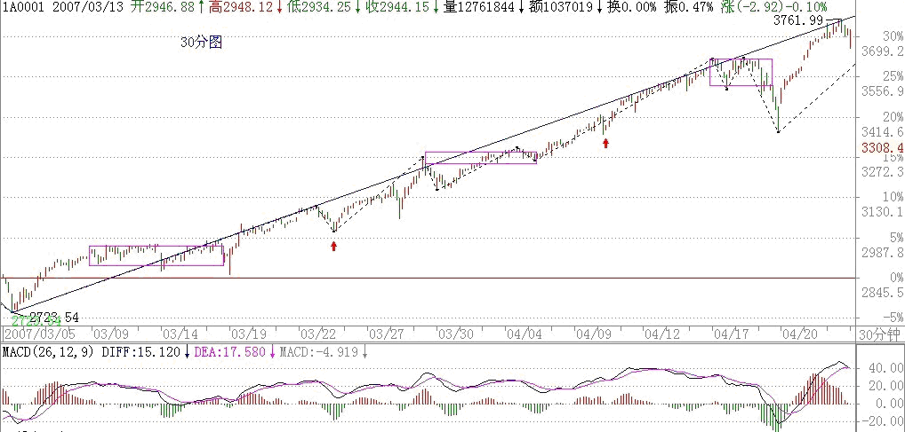

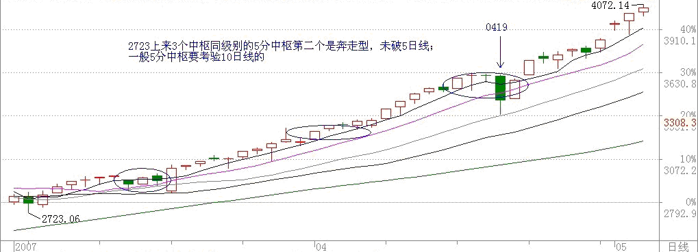

当然，为了让稍微中线点的人安心点，就看5周均线，这线不破，稍微中线点的人基本可以不看盘。当然短线还要去确认5日线的重新站稳，这是下周的主要任务，站不稳，还继续震荡，对于短线，只要看好5日线就可以。

当然，如果技术好点的，可以继续用中枢震荡的方法来看大盘走势。马上要开会了，就不多说了，请把本文好好研究一下，方法是一样的。周末腐败快乐。

“全民炒股”，市场经济走向成熟的必由之路

(2007-04-23 08:53:46)

最近，随着A股开户数、指数、成交量连创新高，“全民炒股”又成了某些习惯于全天候指责股票市场的人手中不断摆弄的大帽子、大棍子。那么，究竟何谓“全民炒股”？“全民炒股”意味着什么？真如某些人所说的就是洪水猛兽吗？

首先，必须对所谓的“全民炒股”进行概念上的界定。如果说“全民炒股”意味着所有人放弃一切工作都到证券部上班，社会一切正常活动都被买卖股票这唯一的活动所中断，那么这种所谓的“全民炒股”不仅以前没出现、目前不存在、而且以后也不会有。谁用这种含义的“全民炒股”来指责目前的市场，都不值一驳。如果说“全民炒股”意味着社会上越来越多人开始把自己的资产快速转化为股票等虚拟资产，那么，该种含义下的“全民炒股”恰好代表了市场经济发展的正确方向，是市场经济走向成熟的必由之路。在市场经济的发育阶段，社会与个人的财富都以实物、货币等非虚拟资产为计算，而当资本市场逐步成为社会经济结构最重要的基础部分时，股票等虚拟资产的价值将逐步成为财富最主要组成部分。在一个资本市场逐步强大的经济体中，无论是社会与个人的财富，都必然出现一个实物、货币等资产形式被快速转化为股票等虚拟资产形式的历史过程，从而也就相应形成上述所定义的“全民炒股”现象。

站在市场发展的历史趋势上看，目前这种“全民炒股”不是过分了，而是远远不够。目前国内，无论社会还是个人资产，其中的股票等虚拟资产所占比例，与市场经济发达国家还有着极大的距离，在股票等虚拟资产占到社会与个人总体资产的30%之前，“全民炒股”只能算是初级阶段，必然需要一个大的快速发展，才能满足市场经济发展的最低要求。目前，国内资本市场逐步出现的“全民炒股”现象，不仅符合市场经济发展的内在逻辑，而且具有历史必然性与广阔发展前景。“全民炒股”，使得社会上的任何企业与个人，都可以通过资本市场这公开平台，公平地选择、参与市场经济中最有价值的投资机会，让社会与个人资源得到最公正合理的配置。而在股票等虚拟资产占到社会与个人总体资产的50%之前，一切对于“全民炒股”的指责都是可笑、短视的。

显然，“全民炒股”有着各种不同实现形式，不可能都由每一个具体参与。因此，基金等各类间接投资渠道的大发展，将成为实现“全民炒股”这历史大趋势的必然选择。由此，各种金融创新、技术创新、制度创新，才能在一个大的经济新格局中得以更好地实现。资本市场所带来的财富效应，也将成为人们投资、创业的最大动力。所谓榜样的力量是无穷的，最近中小板企业上市，平均每11天创造一个亿万富翁，这种速度不是太快，而是太慢了。中国的崛起，中国经济的崛起，必将导致中国成为资本大国，而日益强大的中国资本市场也必将制造出越来越多的财富拥有者。美国人比尔•盖茨，巴菲特等之所以能拥有世界级的个人财富，对于个人来说，可能具有偶然性，但对于具有强大世界性资本市场的美国来说，这却是必然的。世界性的资本市场，必然创造世界性的财富拥有者，而中国资本市场成为世界上最重要资本市场的历史必然性也就意味着，大量的世界级财富拥有者必将在中国的资本市场不断涌现。显然，中国资本市场制造世界首富的一天，并不遥远。

站在中国市场经济发展的历史趋势上，目前的股票热度不是太高，而是远未达到应有水平。市场当然会有中短期调整，但长期趋势无可改变，任何级别的调整，只会引来更大级别上涨。有着100多年历史，经历过1929年、1987年等大暴跌调整的美国股市，至今还继续创出历史新高。各国资本市场发展历史表明，股票市场是长期投资平均回报最高的地方，市场走势无一例外总体向上，调整都是次要的。高速增长、转型能量巨大的中国经济，其带来的财富与投资机会，需要通过资本市场让所有国人得以分享。“全民炒股”，不是洪水猛兽，而是利国利民、顺应市场经济发展的大好事。

缠中说禅：2007-04-23 08:57:32

最近收盘都有事，都早上发帖子，没什么特别的，不用疑神疑鬼。走势的判断，在周五说得很清楚了，这里没什么补充的。

下午收盘会把评论写上，但回答问题可能要晚上9点回来了，抱歉。先下，再见。

缠中说禅：2007-04-23 15:19:01

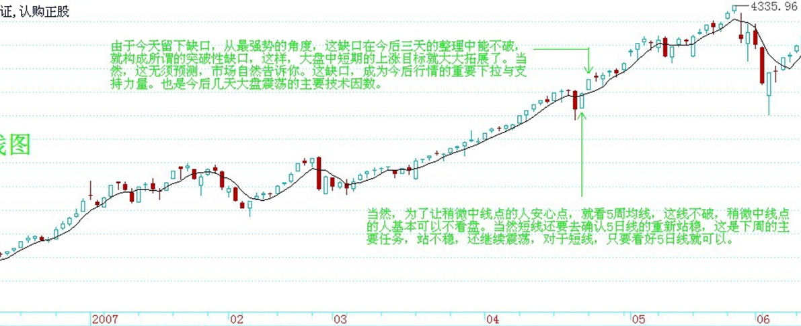

大盘今天走得很正常，没有形成任何中枢的单边上涨，周五站稳3520点后就继续原来的上涨走势，所以就创新高，这在技术上100%没什么可说的。这种走势还惊弓之鸟的，那心态绝对有问题了。对于技术不行的，本ID已经给出一个最简单的方法，中线看5周均线，短线看5日线，这都操作不好，那就没办法了。

有些人整天换股，这其实没问题，但这需要好的技术支持，如果你经常换股后，被换的股票大涨而换的不涨，那就证明你没资格去换股，乖乖拿着等着，你的技术达不到换股、弄短差的水平。人，贵有自知之明，市场操作，这点更重要。不是什么活都适合所有人的，如果你希望能达到更高的水平，就需要更刻苦的学习，在每学好之前，就采取相对保守的做法，这才是可行的。

由于今天留下缺口，从最强势的角度，这缺口在今后三天的整理中能不破，就构成所谓的突破性缺口，这样，大盘中短期的上涨目标就大大拓展了。当然，这无须预测，市场自然告诉你。这缺口，成为今后行情的重要下拉与支持力量。也是今后几天大盘震荡的主要技术因数。

缠中说禅：2007-04-23 21:15:39

由于今天留下缺口，从最强势的角度，这缺口在今后三天的整理中能不破，就构成所谓的突破性缺口，这样，大盘中短期的上涨目标就大大拓展了。当然，这无须预测，市场自然告诉你。这缺口，成为今后行情的重要下拉与支持力量。也是今后几天大盘震荡的主要技术因数。

----

ＭＭ给调整定的时间是三天？为什么

==

这不是绝对的，是一个大统计概念。一般有缺口后，三天内回补，不回补，就基本是突破性缺口，如果从技术上解释，其实也很简单，因为5日上三天后一定在缺口上，如果不有效跌破5日线，当然就不会去补缺口，而5日线有上推的力量，自然就会继续走势，直到跌破5日线形成较大调整才会有补缺口的机会，当然，如果走得比较远，就要更大级别的调整才有机会去补缺口了。

缠中说禅：2007-04-23 22:05:36

缠姐好 请问，1、30分钟图上，如果一段5分钟走势中有三根K线有重叠，是否这三根K线可以看成是5分钟级别走势的一个中枢？

2、这三根K线是否必须红绿相间，如果是三根红线有重叠可不可以算成一个中枢？

3、这三根K线重叠部位是否必须为实体，如果是一根的最高价和另外的最低价处有重叠，是否可以算？

==

5分钟中枢需要三段1分钟级别走势重合，这两节说的是如何看分时，里面的中枢概念和前面的不同，只是借用一下，别搞混了。

重叠，就是三个区间有共同的部分，就这么简单，哪里有这么复杂的事情。另外，像今天这种重叠区间很小的，可以忽略不算。当然，严格算也可以，但意义不大。不过也可以参考，例如今天的3688到3692，就可以当成明天强弱的一个参考，不破就是强，破了站不稳，就有问题。

缠中说禅：2007-04-23 22:15:48

今天的新浪太慢，经常好几次才能发出来。看来股市一火，新浪也要瘫了。各位，心态好点，这市场还长着。今天本ID吃饭时还和别人说，现在不算疯狂，想当年，甚至从900多到6000多，用了不到一年半时间，现在快两年了，同样从900多起步的上海还没到4000，简直太理性了。不多说了，子时快到，今天不是周末，要严格遵守纪律。先下，再见。

## 教你炒股票48：暴跌，牛市行情的一夜情

(2007-04-24 08:52:02)

前面在每天的行情分析中，曾不客气地说到，对于空头日夜盼望的暴跌，其实永远与空头无关，因为真跌了，空头就只会口头上快感一下，心理上满足一下，但人的思维惯性，使得空头永远没机会在他们满意的地方获得满意的筹码。暴跌，对于牛市行情来说，就如同一夜情，猛烈而刺激，但实质上，一夜情就是一夜情，419后，该干什么还是什么。

就如同性能量的积聚，牛市调整能力的积聚，也需要宣泄。这种宣泄，与熊市最大的不同，就是419化。419，总是猛烈而疯狂，否则就没必要419了。牛市中的调整也一样，来就狂风暴月，这和熊市中的大反弹是一样的。最出名的熊市大反弹，大概就是停国债期货那次，三天，指数从550不到翻上920上，结果，后面依然继续下跌回来。而牛市中的暴跌，最出名的算是96年12月那次，由于政策打击，连续跌停下来，1250点上几天跌到850点附近，结果依然继续上涨。所有真正的大顶，都是反复冲击出来的，有足够的时间让你去反应判断，那种V型顶，在大型走势中基本不会构成真正的顶部，就如同一夜情最后天长地久的机会基本为0。所以，那些天天希望暴跌的人，就如同天天期望一夜情的人一样，都有着滥交的潜意识倾向，滥交之人，最终都会给废掉，不会有好结果的。

有一种对风险的错误观点，仿佛股价、市赢率高了才风险大，股价、市赢率低了就风险小了，却不知道股价、市赢率都是些变动的因数，并没有任何绝对的意义。本ID曾多次强调，风险对于市场是绝对的，任何时候都在风险之中，如果你对本ID的理论能有所理解，那么，不仅能让风险在操作级别的绝对控制之中，而且还能利用风险达到降低成本。无风险是可以创造出来的，0成本就是绝对的无风险。如果不理解，那么最简单均线系统就可以控制住风险。

但站在社会财富增长的绝对性上，最大的风险就是你的财富增长赶不上社会平均财富的增长，站在资本市场这个子系统，道理是一样的。因此，在一个大牛市中，筹码的积累甚至更重要。一个大的上涨，3元有1万股，到4元只有1千股，后来到了30，一股没有，这就是最大的风险，因为市场的上涨并没有为你制造应该的总体利润，你的筹码丧失了，没有筹码，在市场中就没有赢利的准入证，在没有做空机制的市场中，做空最后还是为了做多，除非你永远退出市场，特别在牛市行情依然的情况下，这点更重要了。没有筹码，用嘴是赢利不了的。

最好的情况，当然就是前面所说的，在成本为0前不断降低成本，在成本为0后不断挣筹码，这样股价越上涨，你的筹码越多，你的真正市值才会越来越大。有人问本ID，你以后怎么出货，本ID反问，为什么要出货？每一次震荡，都成了本ID降低成本、增加筹码的机会，知道最高的境界是什么吗？就是等大牛市真正结束那天，你拥有股票的数量最多而成本是0，然后，（后面删去419字）。市场从来不是慈善场所，要战胜市场，必须有正确的大思路与总体的方法。

正确去对待震荡、调整，显然，在大盘中短线能量耗尽后，大盘会出现大规模的调整，如果说227、419都是在日线上一夜情，那么在周线上、月线上、季线上、甚至年线上出现一夜情的可能性在这长达至少20年以上的大牛市中，都是绝对存在的。但这决不是空头用嘴欢呼的借口，而是真正操作者减低成本、增加筹码的大好时机。当然，操作的精确度是一个技术问题，技术高的，就能把成本降更低，筹码增得更多，这是绝对正常的事情，技术高的就该有更好的收益，这是天经地义的。但精确度是可以用市场磨练来达到的，而思路、方法的错误，则是不可救药的，这才是问题的根源。

站在纯技术的角度，把握一夜情的级别很重要。一个日线上的一夜情与一个年线上的一夜情，显然力度上不一样。在这次从2005年中开始的大牛市行情中，至今为止，本质上，在周线上都没有出现过一夜情的暴跌，周线上两次大的调整，周跌幅都是7%，还赶不上227的日一夜情，月线上更是连一次真正有意义的下跌都没有。但为什么这么多人，天天依然如惊弓之鸟一般？

如果你把握不住日线的一夜情，证明你的技术程度达不到把握日线一夜情的程度，那么就去把握周线、月线的，那对技术精确的要求要低。给自己安排一些力所能及的活动，一夜情也是有级别的，能否在各级别的一夜情中游刃有余，是对你技术把握度的考验。

事情往往相通，无论技术还是其他，精度都是干出来的。今晚，是否也要419一把？

读后感：

1、一夜情最后天长地久的机会基本为0。

2、在成本为0前不断降低成本，在成本为0后不断挣筹码，这样股价越上涨，你的筹码越多，你的真正市值才会越来越大。

缠中说禅：2007-04-24 08:55:19

本文不针对任何具体日子走势，当日走势分析3点收盘给出。先下，再见。

缠中说禅：2007-04-24 15:23:54

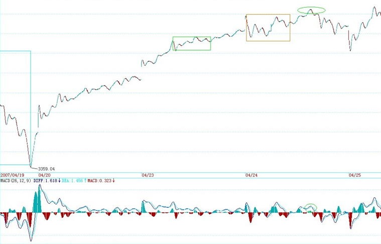

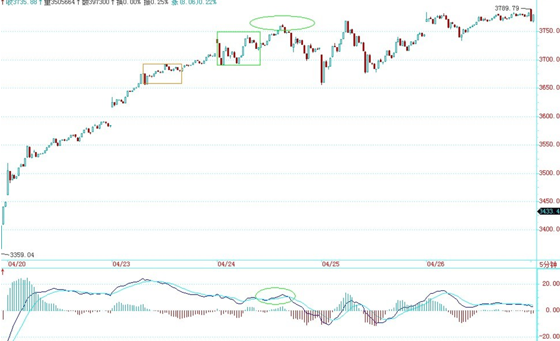

今天大盘在昨天的一个小中枢3688到3692受到支持，下午的5分钟盘整顶背驰，应该不难把握。从这就知道，每天之间的当日走势，还是有一定技术意义的。今天，一个平衡市，收得一般，由于5日线明天就上来了，所以关键还是5日线，站稳就寻机上攻，否则就要受到昨天缺口的吸引。今天这种平衡市却是巨量的走势，关键就是要有效向上突破今天的中枢，否则大幅震荡不可避免。今后两天走势十分关键。睁大眼睛看好明后两天的走势，下面3688到3692小中枢不能有效被跌破。

目前就是前面本ID所说，二线拉开空间，三线补上来的走势，但这种走势，必须有一个转换，使得成分股能重新启动，否则也是震荡难免。目前走势，不要随意换股，该换的早该换了，如果是短线的，就要注意今天中枢最后的演化方向来决定进出，中线的就无所谓了，看5周均线。今天很忙，马上有事情要谈，晚上9点再上来回答问题，先下，再见。

缠中说禅2007-04-25 09:06:54 [举报]

丑的鲁尼战胜帅的卡卡；喜欢的英超战胜讨厌的意假。世界就是如此。先下，15点看给出当日评论，再见。

缠中说禅：2007-04-25 15:25:17

就算你对本ID的理论只有幼儿园水平，那今天的走势都一定难不到你。一开盘的低开，然后很快拉回3688到3699的前天小中枢，这就意味着，中枢震荡依然继续，没什么大问题。前三30分钟走出来后，这平衡市的形态以及震荡幅度就基本确立了，今天属于最平衡市那种，前三30分钟就确立全天高、低点，下午那下探，对于短线对冲的，就像送钱一样。

纯技术上，04241335和04251030的连线必须突破，否则就会被技术派看成是所谓的喇叭形态，从大点看，从04240931开始的3689到3745的5分钟中枢延伸什么时候结束，就看明后两天是否形成第三类买卖点了，这一切无须预测，大盘自然告诉你。

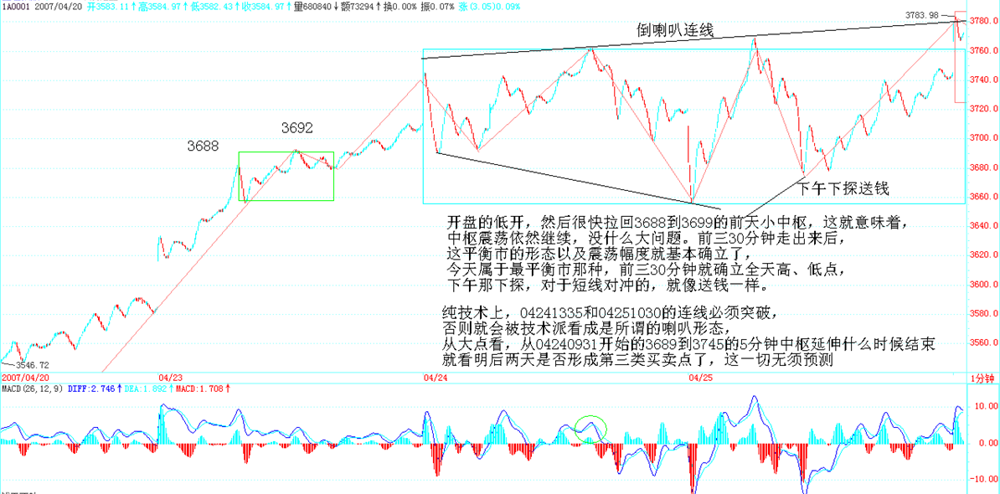

板块方面，昨天已经说了，今天需要一个板块的切换，成分股要重新走起来，这切换还可以，毕竟基金也要面子，51前也需要一个好的市值，做人不能打击面太宽了。

但是，大盘最近一点都不疯狂，反而最近汉奸有点疯狂，自编社论到处流传，还在国外金融报纸上大声漫骂，这种人，该怎么处理，各位可以讨论。有事，必须先下，晚上9点回来回答问题。再见。

## 教你炒股票49：利润率最大的操作模式

(2007-04-26 08:16:56)

本周就不解《论语》了，并不是本ID不想写，而是51长假，对那些希望多学点本ID理论的人，是一个好的机会，本ID也就多写点这方面的，给有需要的多准备点，毕竟，这对于大多数人来说更迫切。前面说了那么多情况，从实用角度，为了理清实际操作中的基本思路，先穿插这堂课。

一个人，拿着本来想去419的钱准备入市，那么，首先要明确，自己要按什么级别来操作，这个问题，前面已经反复说过了，不妨假设这级别是30分钟。那么，进到市场，打开走势图，首先要找什么？就是找当下之前最后一个30分钟中枢。这其实对任何新进的股票，道理是一样的。例如，你出了某股票，重新选择一只新的，那就会面对相同的情况。

INCLUDEPICTURE "http://static4.photo.sina.com.cn/middle/4aeb5d15n8d9cd3ece663&690" \* MERGEFORMATINET 

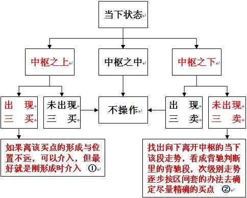

(注：注意中枢指重叠区间）

显然，这将会出现三种情况：一、当下在该中枢之中。二、当下在该中枢之下。三、当下在该中枢之上。注意，这最后的30分钟中枢，是一定可以马上确认的，无须任何预测，当然，前提是你首先要把本ID前面说的理论学好，如果连中枢都分不清楚，那就没办法了。

第一种情况，显然，这中枢在延伸中，而后两种情况，分别可以用第三类买卖点分为两小类。对第二种，有1、当下之前未出现该中枢第三类卖点。2、当下之前已出现该中枢第三类卖点（正出现也包括在这种情况下，按最严格的定义，这最精确的卖点，是瞬间完成的，而具有操作意义的第三类卖点，其实是一个包含该最精确卖点的足够小区间）。对于第三种，类似有1、当下之前未出现该中枢第三类买点。2、当下之前已出现该中枢第三类买点。

对于第一大类，因为在中枢里，由于这时候怎么演化都是对的，不操作是最好的操作，等待其演化成第二、三类，当然，如果你技术好点，可以判断出次级别的第二类买点，这些买点很多情况下都是在中枢中出现的，那当然也是可以参与的。但如果没有这种技术，那就有了再说了。只把握你自己当下技术水平能把握的机会，这才是最重要的。

对于第二种第1类，由于中枢震荡依旧，因此，先找出该中枢前面震荡的某段，与之用类似背驰比较力度的方法，用MACD辅助判断，找出向下离开中枢的当下该段走势，看成背驰判断里的背驰段，然后再根据该段走势的次级别走势逐步按区间套的办法去确定尽量精确的买点。注意，用来比较的某段，最标准的情况，当然是前面最近向下的，一般情况下，中枢震荡都是逐步收敛的，这样，如果继续是中枢震荡，后面的向下离开力度一定比前一个小。当然，还有些特殊的中枢震荡，会出现扩张的情况，就是比前一个的力度还要大，但这并不必然就一定会破坏中枢震荡，最终形成第三类卖点，这个问题比较复杂，在后面谈论中枢的各种图形形态时，才能详细说到。一般来说，这种情况，用各种图形分解与盘整背驰的方法就可以完全解决。

对于第二种第2类，由于该中枢已经结束，那就去分析包含该第三类卖点的次级别走势类型的完成，用背驰的方法确定买点。当然，还有更干脆的办法，就是不参与这种走势，因为此后只能是形成一个新的下跌中枢或者演化成一个更大级别的中枢，那完全可以等待这些完成后，再根据那时的走势来决定介入时机。这样，可能会错过一些大的反弹，但没必要参与操作级别及以上级别的下跌与超过操作级别的盘整，这种习惯，必须养成。

对于第三种第1类，这时候不存在合适的买点，等待。对于第二种第2类，如果离该买点的形成与位置不远，可以介入，但最好就是刚形成时介入，若一旦从该买点开始已出现次级别走势的完成并形成盘整顶背驰，后面就必须等待，因为后面将是一个大级别盘整的形成，按照上面的习惯，可以不参与的，等待该盘整结束再说。当然，如果整个市场都找不到值得介入的，而又希望操作，那么就可以根据这些大点级别的中枢震荡来操作，这样，也可以获得安全的收益。

上面已经把一个固定操作级别的可能操作情况进行了完全分类与相应分析，显然，对于一个中枢来说，最有价值的买点就是其第三类买点以及中枢向下震荡力度出现背驰的买点。前者，最坏的情况就是出现更大级别的中枢，这可以用其后走势是否出现盘整背驰来决定是否卖出，一旦不出现这种情况，就意味着一个向上走势去形成新中枢的过程，这种过程当然是最能获利的。至于后面一种，就是围绕中枢震荡差价的过程，这是降低成本、增加筹码的。

注意，一定要注意，很多人不知道怎么去弄差价，似乎所有机会都可以去弄。但如果从最严格的机械化操作意义上说，那么只有围绕操作级别中枢震荡的差价才是最安全的，因为肯定能做出来，而且绝对不会丢失筹码。在成本为0后的挣筹码操作中道理是一样的。也就是说，在确定了买卖级别后，那种中枢完成后的向上移动时的差价是不能做的，中枢向上移动时，就应该满仓，这才是最正确的仓位。而在围绕中枢差价时，在中枢上方仓位减少，在中枢下方仓位增加，注意，前提是中枢震荡依旧，一旦出现第三类卖点，就不能回补了，用中枢震荡力度判断的方法，完全可以避开其后可能出现第三类卖点的震荡。

那么，如果这个中枢完成的向上移动出现背驰，就要把所有筹码抛出，因为这个级别的走势类型完成，要等待下一个买点了。如果不背驰，就意味着有一个新中枢的形成，注意，小级别转大级别其实并不复杂，一样可以看成一个新中枢，只是该中枢有可能和前面的重合，而趋势中是不可能出现的。该中枢，就可以继续用中枢震荡的方法短差，然后再继续中枢完成向上移动，直到移动出现背驰。

其实，可以用严格的方法证明

缠中说禅第一利润最大定理：对于任何固定交易品种，在确定的操作级别下，以上缠中说禅操作模式的利润率最大。

该模式的关键只参与确定操作级别的盘整与上涨，对盘整用中枢震荡方法处理，保证成本降低以及筹码不丢失（成本为0后是筹码增加，当然，对于小级别的操作，不会出现成本为0的情况），在中枢第三类买点后持股直到新中枢出现继续中枢震荡操作，中途不参与短差。最后，在中枢完成的向上移动出现背驰后抛出所有筹码，完成一次该级别的买卖操作，等待下一个买点出现。

这里必须注意，中枢震荡中出现的类似盘整背驰的走势段，与中枢完成的向上移动出现的背驰段是不同的，两者分别在第三类买点的前后，在出现第三类买点之前，中枢未被破坏，当然有所谓的中枢震荡，其后，中枢已经完成就无所谓中枢震荡了，所以这问题必须清楚，这是有严格区分的，不能搞糊涂了。

还有，在中枢震荡中，本质上是应该全仓操作的，也就是在中枢上方全部抛出筹码，在下方如数接回，当然，这需要高的技术精度，如果对中枢震荡判断错误了，就有可能抛错了。所以对不熟练的，可以不全仓操作。但这有一个风险，就是中枢震荡后，不一定就能出现第三类买点，可以直接出现第三类卖点就下跌，这在理论与实际中都是完全允许的。这样，如果在中枢震荡上方没完全走掉，那有部分筹码就可能需要在第三类卖点处走，从而影响总体利润。如果完全按照以上缠中说禅操作模式，就不存在这个问题了。至于能否达到这缠中说禅操作模式的要求，是技术精度的问题，需要在实际中磨练的问题。

当然，有一种磨练方式是可行的，就是宁愿抛错了，也要严格按方法来，毕竟就算你的技术判断能力为0，抛错的几率也就是50%，后面还有一个第三类买点可以让你重新买入，如果抛对了，那可能每次的差价就是10%以上，别小看这中枢震荡的力量，中枢震荡弄好了，比所谓的黑马来钱快而且安全，可操作的频率高多了，实际能产生的利润更大。

以上的方法是对固定操作品种来说的，也就是不换股。还有一种更激进的操作方法，就是不断换股，也就是不参与中枢震荡，只在第三类买点买入，一旦形成新中枢就退出。例如操作级别是30分钟，那么中枢完成向上时一旦出现一个5分钟向下级别后下一个向上的5分钟级别走势不能创新高或出现背驰或盘整背驰，那么一定要抛出，为什么？因为后面一定会出现一个新的30分钟中枢，用这种方法，往往会抛在该级别向上走势的最高点区间。当然，实际上能否达到，那是技术精度的问题，是需要干多了才能干好的。

其实，同样可以用严格的方法证明

缠中说禅第二利润最大定理：对于不同交易品种交易中，在确定的操作级别下，以上激进的缠中说禅操作模式的利润率最大。

注意，并不是说第二定理就比第一定理更牛更有意义，这里所说的利润率，是指每次操作的平均利润/需要占用资金的平均时间，但，真正能产生总体利润的，还与操作的频率有关，第二虽然激进，但也需要有激进的市场机会，如果这市场就没有可操作级别的第三类买点，那也只能干等，而第一不需要这么强的市场条件，基本上，除了最恶劣的连续单边下跌、连大点的中枢都没有的，都可操作，所以在实际操作中，两者不能偏废。

显然，对于大资金，以上的方法需要有特殊的处理，资金越大，利润率显然越低，因为很多级别的操作不可能全仓参与，就影响资金的总体利用率。一般来说，小资金增长可以极为迅速，用本ID的方法，无论牛市熊市，最笨的人，完全随机挑股票，完全找不到所谓的黑马，每年保持200%以上利润是一点问题都没有。如果你技术精度高，即使在熊市里，每年来个500%的增长，也是不难的，因为熊市里，中枢震荡的机会反而多，而且大反弹，本质上也就是大级别中枢震荡的机会不少，处理好了，并不比牛市来钱慢。但这种增长只能维持几年，一旦资金大到一定程度，就会遇到资金增长瓶颈。如何突破该瓶颈，这是另一个问题，以后会说到。

归纳：

打开走势图，找当下之前最后一个操作级别中枢。

一、当下在该中枢之中。

处理：因为在中枢里，由于这时候怎么演化都是对的，不操作是最好的操作，等待其演化成第二、三类，当然，如果你技术好点，可以判断出次级别的第二类买点，这些买点很多情况下都是在中枢中出现。

二、当下在该中枢之下。

1类当下之前未出现该中枢第三类卖点处理：中枢震荡依旧，先找出该中枢前面震荡的某段，与之用类似背驰比较力度的方法，用MACD辅助判断，找出向下离开中枢的当下该段走势，看成背驰判断里的背驰段，然后再根据该段走势的次级别走势逐步按区间套的办法去确定尽量精确的买点。注意，用来比较的某段，最标准的情况，当然是前面最近向下的那段。（当下1段和往前的第3段或第5段比较）。

2类当下之前已出现该中枢第三类卖点处理：由于该中枢已经结束，那就去分析包含该第三类卖点的次级别走势类型的完成，用背驰的方法确定买点。背后只保证有一次级别走势类型。更干脆的办法，不参与这种走势，因为此后只能是形成一个新的下跌中枢或者演化成一个更大级别的中枢，那完全可以等待这些完成后，再根据那时的走势来决定介入时机。这样，可能会错过一些大的反弹，但没必要参与操作级别及以上级别的下跌与超过操作级别的盘整，这种习惯，必须养成。

三、当下在该中枢之上。

1类当下之前未出现该中枢第三类买点处理：这时候不存在合适的买点，等待。

2类当下之前己出现该中枢第三类买点处理：如果离该买点的形成与位置不远，可以介入，但最好就是刚形成时介入，若一旦从该买点开始已出现次级别走势的完成并形成盘整顶背驰，后面就必须等待，因为后面将是一个大级别盘整的形成，按照上面的习惯，可以不参与的，等待该盘整结束再说。(不参与中枢震荡，只在第三类买点买入，一旦形成新中枢就退出。例如操作级别是30分钟，那么中枢完成向上时一旦出现一个5分钟向下级别后下一个向上的5分钟级别走势不能创新高或出现背驰或盘整背驰，那么一定要抛出，为什么？因为后面一定会出现一个新的30分钟中枢，用这种方法，往往会抛在该级别向上走势的最高点区间)当然，如果整个市场都找不到值得介入的，而又希望操作，那么就可以根据这些大点级别的中枢震荡来操作，这样，也可以获得安全的收益。

读后感：

1、没必要参与操作级别及以上级别的下跌与超过操作级别的盘整，这种习惯，必须养成。

2、确定了买卖级别后，那种中枢完成后的向上移动时的差价是不能做的，中枢向上移动时，就应该满仓，这才是最正确的仓位。

3、如果从最严格的机械化操作意义上说，那么只有围绕操作级别中枢震荡的差价才是最安全的，因为肯定能做出来，而且绝对不会丢失筹码。而在围绕中枢差价时，在中枢上方仓位减少，在中枢下方仓位增加，注意，前提是中枢震荡依旧，一旦出现第三类卖点，就不能回补了，用中枢震荡力度判断的方法，完全可以避开其后可能出现第三类卖点的震荡。

4、中枢震荡中出现的类似盘整背驰的走势段，与中枢完成的向上移动出现的背驰段是不同的，两者分别在第三类买点的前后，在出现第三类买点之前，中枢未被破坏，当然有所谓的中枢震荡，其后，中枢已经完成就无所谓中枢震荡了，所以这问题必须清楚，这是有严格区分的，不能搞糊涂了。

5、参与中枢振荡是降成本的好时机。

缠中说禅：2007-04-26 08:19:44

下午收盘再把今天走势分析附录上。先下，再见。

缠中说禅：2007-04-26 15:21:18

大盘今天又是一个典型的平衡市，高低都在前三30分钟K线出现，这种走势的处理很简单，就不多说了。明天只要能站稳3745，就继续向上发展，现在这种5日线都不破的走势，确实没有什么可说的。

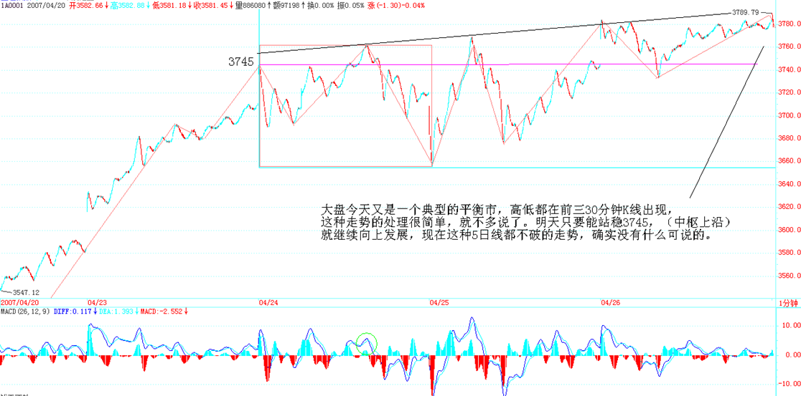

说实话，本ID现在就想放假了，那交易所也够混的，下周一还单独开一天，这样周线上就有一个量特别小，看起来一点都不美观，还不如明天结束，7号开盘。你说你还开盘，本ID又不能离开，免得被人捣乱，大概很多人都有这种想法，简直无聊透了。

今天有空，可以研究一下上面的文章，真掌握了，就算初步有点结果了。本ID马上要去中关村谈件VC方面的事情，约好4点，不能不走，晚上回来回答问题。9点再见。

## 教你炒股票50：操作中的一些细节问题

(2007-04-27 08:42:51)

51前都说股票了，51后再恢复正常，继续解〈论语〉还有诸如419、体液之类的东西。今天说点实际的问题，因为，什么理论，最终都要落实到操作。而操作中一些细节问题，是必须要搞清楚的。

首先，你无论如何都应该能看到走势图，至于最小只能看到1分钟还是分笔图，甚至连5分钟都看不到，这问题都不是太大。其次，只要是正常的软件，没有不能看MACD的，有一个很重要的问题，很多人搞不清楚，就是怎么选择看几分钟的MACD。必须明白一个道理，就是MACD的计算方法决定了，1分钟和30分钟MACD之间并没有实质的区别，只是计算的周期不同而已，而相应的计算是线性的，只是稍微灵敏与迟钝的区别，没有太大的区别。问题的关键是，MACD只是力度比较的辅助，因此，是先定好比较哪两段走势，然后才去选择看是1分钟的还是30分钟的更适宜辅助判断（关系到灵敏度），例如，两段走势，在1分钟上形成很复杂的MACD柱子和黄白线变化，而在30分钟上是很明显的两个柱子面积以及标准的黄白线变化，那当然就选择用30分钟看。虽然由于MACD与K线价格相关，所以一般情况下，30分钟级别的走势变化，经常对应在30分钟的MACD上，但这不能因此而改变先根据中枢与走势运动的分析，然后选出需要比较力度的走势段，最后才用MACD辅助判断的顺序原则。

以上是些小的技术细节，但更重要的，是一些操作心理上的细节。操作上，最开始，一定都是患得患失的。为什么一定要把理论搞清楚？就是先从根子上解开自己的疑惑，知道为什么本ID的理论是如几何般严格精确的，否则，例如你对平面三角形内角之和为180度的证明有疑惑，一定要去丈量每一个平面三角形去证明才舒服，这样，就永远有心理阴影，是无法去进行正常操作的。理论的探讨，是为了树立操作的信心，当然，还为了对走势有一个精确的分析去指导操作，但其心理层面的意义也是极为重要的。这绝对不能迷信，因为相信本ID而相信本ID的理论，那就是绝对的脑子进水了。而是要从道理、逻辑等方法彻底搞清楚，这样才能无疑地去操作，而不用瞻前顾后。

对本ID理论对走势分析以及操作的绝对性有把握后，以后解决的都是一个操作精确度的问题。一个正确的理论，应用到实践中，特别是面对瞬息万变的市场，因为应用的人的经验与心理状态，其结果自然有很大差异。如何提高操作的精确度，就是一个长期实践的问题。但无论如何，只有在操作中才能解决这个问题，否则永远都在纸上谈论，那是毫无意义的。

一个最常见的心理就是，看到是买点或卖点了，但买了还跌、卖了还涨，所以下次就不敢尝试了。这在操作不熟练的人中，太正常了。因为，对买卖点的判断，开始时，一定都达不到理论所确立的精确度。毕竟是人，人总有盲点与惯性。例如对于习惯性多头来说，经常就是买早卖晚；而习惯性空头，就是买晚卖早。就算对理论在认识上没问题了，这种习惯性因数也会导致真正的操作与理论所要求的操作时间有偏差。要改变这种习惯性力量，不可能是一天两天的事情。

一般来说，应用理论开始实际操作前，要先看懂所有曾有的走势，能用理论对已有的走势进行分析，如果这都达不到，那当下去操作一定乱。这一步基础达到后，可以先不用真正买卖，可以进行一定的模拟，市场一周5天开着，当下去模拟操作，每次的操作都记录下来，然后不断根据后面的走势来总结，然后发现自己对理论当下理解上的问题，不断修正。当模拟操作有足够把握后，才开始真正的买卖操作。如果一开始就真正买卖，由于绝大多数人，在真的钱上都会方寸大乱，无论操作成功、失败，都会迷失上输赢上，而忽略了操作上的问题。

所以，首先要把静态的、已有的图形分析清楚，然后在进行动态的、当下的分析把握，最后才是实际的操作，这样就比较稳妥了。当然，这过程不是一两天完成的，所以，本ID在12月下旬开始就说了些股票，当时是让各位学习时，能安心，买了就扔那里，边赚钱边学习，本ID不需要各位的学费，但各位实际操作的时候，可能会交给市场一些学费，本ID告诉点股票让各位拿着，就是把可能要交给市场的学费都给各位准备好了，因为，毕竟最后都要靠各位自己，而在市场上学习，先教点学费，然后不断进步，最后应用自如，都是很正常的过程。

所以心态要平稳点，不要整天去计算今天少挣多少诸如此类的问题，说白了，如果你没有一套有效的方法，只要你在市场里，你赚的钱从本质上就不是你的，只是暂时存在你那里。而要把自己培养成一个赚钱机器，就如同前锋把自己培养成射门机器一样，方法学了都会，但神射手却不一定都是，这需要更多的努力。市场的技术，是需要磨练的。关键是真正掌握技术，只要掌握了，赚钱就成了自然的事情，只要有足够的时间，就自然产生足够的钱，为什么？因为这已经被本ID的理论如几何般严密地保证了。

另外，学本ID的理论，并不荒废任何其他的东西，但那些东西都只能是辅助，甚至，你可以去听消息，去追炒概念，怎么都可以，但必须不能违反本ID的理论。为什么？因为本ID的理论是这市场真实的直接反映，违反本ID的理论，最终都会被市场教训。如果不相信，那你就在本ID理论的第一买点卖，第一卖点买，来回坚持，如果按一个较大级别去操作，一般来说，N次以后你就可以离开市场了。有了本ID的理论，就算去跟风，追炒，都会有章法，都会进退自如。

缠中说禅：2007-04-27 15:14:36

今天大盘跌破3745点，所以就形成不了第三类买点，大盘的震荡依旧，因此下午的突然拉起，就是一个好的短差机会。下午的冲高力度，技术上应该和04260930那次比，显然MACD没有同时创高，所以那就是一个震荡的卖点。当然，这都是很短线的活动了。只是用当下的例子说明一下理论的用法。

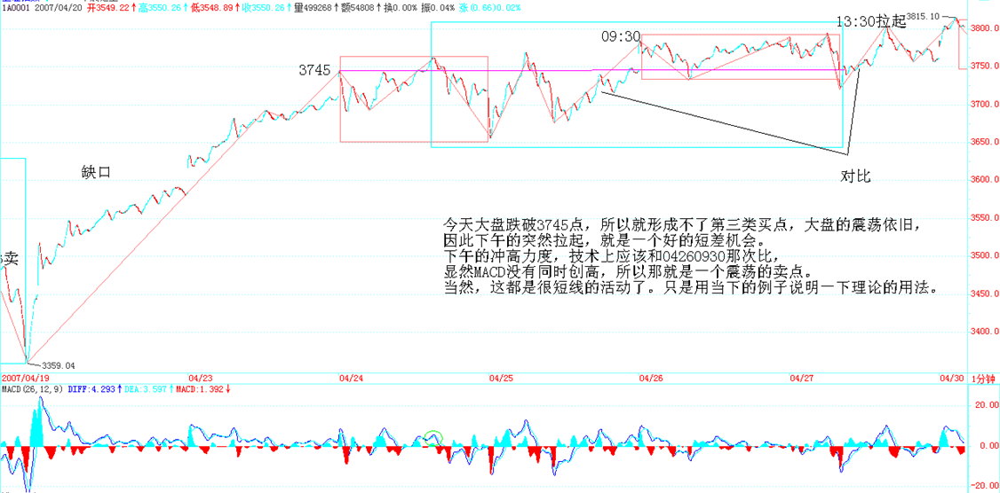

目前3745为上边的5分钟中枢已经扩展为30分钟的，3720到3761，短线就是这中枢的突破方向。虽然放假前只有一天，并不意味着就天下太平，春节前，汉奸最后一天最后十几分钟还发难，所以最后一天的走势，并不是高枕无忧的。

本ID真想现在就出去玩去了，那一天爱怎么走就怎么走，本ID都不想管了。汉奸都算短期利益，本ID根本就不想看短期利益，最后一天还想干活，真无聊。

周末，都腐败去吧。先下，再见。

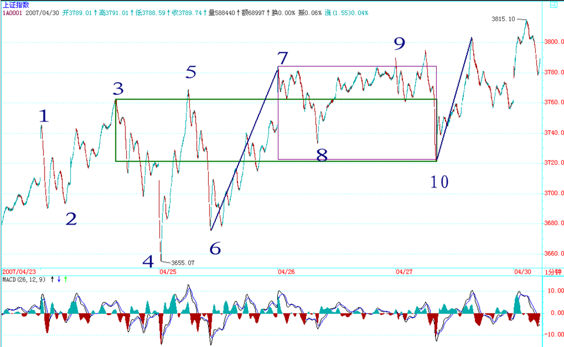

空头肆意妄为，必须依法严惩

(2007-04-30 08:36:12)

一个无聊的交易日，把一个原本10天的假期断成两截，所以必须找人骂上几句。这两天，N个熟人来电问本ID是否要开征资本利得税，就像前几天，N平方的人来问本ID是否人民日报又要社论了。N个版本空头编造的所谓社论，都流传到本ID这里，这绝对可以当罪证了。

227暴跌希望把股市砸下去的、最近特郁闷的一群，当然不一定都是汉奸，但在被夹空1000点后，配合国外舆论、伪造社论，大造声势，对中国股票市场的指责与诽谤达到空前地步，这难道是巧合？这几天，无数人跳出来，唯一的主题就是探讨如何把股市打下去。本ID就奇怪了，当年纳指涨得更没道理，市梦率都解释不了，但所谓新经济的神话又是谁在传送？现在，市场又凭什么要按他们的估值去标准自己？他们是上帝？最主要是，这些汉奸豢养的，有些从1300就开始唱空，说到现在，竟然还有脸出来晃？看来，股指期货确实早该出，1300就该出来，让这些空头破产N次，人间蒸发算了。

一个很奇怪的问题，就是某些人，一点都不参与这市场，却整天围着市场喷口水，如果这些人只在自己的博客吠两句，那无所谓。但这些人，占用着最重要的媒体资源。更有些人在暗地里日以继夜编造文件、打黑枪。这些人，无论中国股市的点位是多少，即使是300点，他们也会有足够的任务去任务。他们的任务归根结底只有一个，就是捣毁中国资本市场。因为一个强大的中国资本市场，会令世界上某些人、某些国家不安、恐惧。

其他言论且不说，编造人民日报社论这样的事情，绝对已经严重触犯法律。相信，按照现在的技术，不难查出是谁制造这样的违法事件。证监会，如果连这都不监管，那至少是大大失职了。至于像资本利得税，涉及制度的根本改变，是一个小小的证监会能定的？制造这些谣言的人，是否也需要法律来制裁一下？本ID觉得，对汉奸以及造谣生事的空头，没什么道理可讲，中国的国家机器如果对这种人都不开动一下，就要生锈了。

市场可以正常震荡、回调，甚至月线、季线、年线419、一夜情，但绝对不允许有人惟恐天下不乱，造谣生事。那些在市场中失败的孬种，就玩阴的，但无论怎么样，被夹空1000，是铁一样的事实，吠也没用。

前几天，本ID还写了让央行别脑子进水的文章，结果，央行的行为却继续证明，如果央行有脑子，那这央脑里的水确实太多了。现在的困境难道不是他们自己造成的？既然让人民币升值，最猪的脑子都会想到，70%的美圆资产必然会带来现在面对的烦恼，难道2005年到现在，没有足够的时间让他们去调整外汇资产的结构？就算按最平衡的资产配置比例，凭什么美圆资产达到70%的比例？是谁的决定，是不是要负责？现在的所有行为，不过是为了去掩盖一个愚蠢的错误。

一个无人敢说，但本ID必须说的事实就是，目前人民币的所谓升值，并不是人民币的单独行为，因为问题的实质是美国危机导致的美圆在贬值，很多货币都跟着升了，就如同一个投资组合里，你故意或因为失误拿着70%的贬值股票，其他30%并没有跌，这是投资失误，按照美圆的比重，该占多大的比例，难道整个央行，这么多留美博士就没有一个人能算清楚？大概不是算不清楚吧。是谁天生对美国忒好感天生就看美圆亲？本来，这种比例的调配，完全就可以在升值前完成的，升值的决定又是自己出的，难道出消息之前先把该干的活干了都不知道？不是不知道，而是有其他本不该是问题的问题吧。

从最善良的角度看，知道空头和央行的共同特点是什么吗？就是知错不改，还要以错饰错，当然，这是最善良的解释了。还有一大堆问题，本ID都不想说了，放假了，本ID要去腐败去，懒得理这种人。

最后，为所有被市场所折腾的人五言一首：

尘心自波动，泛绿又飘红。临屏迷鹿马，入市苦牛熊。

无国商潮外，全民股海中。乾坤虚涨跌，几梦几多空。

缠中说禅2007-04-30 08:38:59 [举报]

看图操作，不要先入为主。收盘分析，然后腐败去也。先下，再见。

附录：

本来，本ID早上不想多说的，后来还是八卦一下，让大家别先入为主，以为有什么大幅低开。想想周五那些跑消息的人，为什么让他们能回补？

估计51，汉奸们会到处哭诉，汉奸存在的最大好处，就是让不坚定的人跑出跑入，为券商贡献，从而让与券商相关的股票有更大的基本面支持，所以，站在这个角度，汉奸真是功劳大大的。

今天，999也翻两倍了，这本来早该完成的任务，就是因为那汉奸基金的老鼠闹迟了，这些事情就不说了。给各位一句话，就是，花心大萝卜是需要有技术、有实力的，如果没有，就专一点。如果你想当花心大萝卜，但收益竟然没有专一的好，那你就没资格当花心大萝卜。

放假了，从今天起，本ID也要连续七天将股票抛弃，去有甲骨文的地方游荡一下，博关几天，7号回来重新开张。各位51腐败快乐。先下，再见。

周行长的尴尬

(2007-05-08 08:56:50)

这注定是吃力不讨好的文章，题目就有毛病，那些对于常人来说尴尬或者应该尴尬的事情，在周行长那里可能恰好是最值得炫耀的。当然，需要指出的是，写这样的文章，并不是因为周行长在51假期在各洋行长面前袒露心迹“担心中国股市泡沫的累积”，这不算什么，完全是就事论事，怎么都比消消气强点。更需要指出的是，这里的尴尬不涉及周行长还是周主席时，股市一片混乱中从此进入四年大熊市，特别无关于周主席变成尚主席后，这股市突然翻天覆地变成了大牛市。周行长何等人物，怎么会为如此小事尴尬？

确实，又有什么大事值得周行长如此人物去尴尬，越来越觉得这题目太错误了，周行长没什么可尴尬的，债转股般地无可尴尬，银行没贱卖地无可尴尬。就算发了一大堆票据，美圆资产依然高比例大规模地超配，存款准备金继续负债下去，顶着中美利差压力继续挥舞加息棒槌，让不健全的利率体系下继续吃美式汉堡等等等等，这又和周行长有什么关系，现在的人民银行本来就独立性不强，不能太强求，中国经济这么好，很多该干的事情，就算不干，也没什么大不了的。

人民银行也就一部级单位，不当龟孙子已经很好，想当格老子是彻底没门了，不过，这更构不成尴尬的原因，从来就是这样，看来，本ID要开始同情周行长了。既然这样，本ID知错就改，债转股银行没贱卖般宣布，本文题目改成“周行长的无可尴尬”。

缠中说禅：2007-05-08 15:28:53

今天的走势，用脚趾都能预测到，但依然无须预测。而实际出现的走势，却并不想所表现的那么强，因为大盘只是出现一个强的平衡市，这种留下大的缺口后的放量平衡市，意味着，今后几天，下面的缺口都是大盘短线一个挥之不去的心病，大盘震荡难以避免。

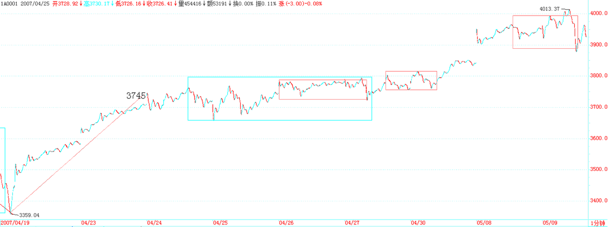

当然，这里讨论的都是很短线的走势，一般地，短线还是继续看5日线，中线看5周线，不破就拿着。而对技术有更高精确度追求的，就可以关注其后短线上出现的背驰进行操作，而不是去预测大盘是否真的要去补缺口，还是那句话，不是等跌了再找卖点，涨了再早买点，那就晚了。大盘中线的走势以及具体的点位意义，综观现在所有人，都搞不清楚大盘在纯技术上究竟在干什么。本ID已经写好一文章，有些特殊的原因，现在不能发出来，等该发的时候，本ID会发的。

个股没什么可说的，而且具体的个股也要根据自己的走势来决定进出，很多比大盘要强的个股，就算大盘要补缺口，反而要大幅上扬。个股操作上一定要注意，技术不好的，即使是短线，也就看5日线，不破，就拿着，不要习惯性乱跑，否则大盘一震荡，左右挨巴掌。另外，心态一定要好，如果卖早卖错了，也没必要追高去买，等一个短线买点再介入不迟，大盘震荡中，这种买点不难发现。

本文由公众号 “三思复盘”  整理
