## 教你炒股票51：短线股评荐股者的传销把戏    (2007-05-09 08:30:16)

国人，赌博心理特重，一个六合彩就可以横扫大半中国，那些偏僻的山村都可以为之痴狂，而这里包含的某种特点，正是任何群体性运动的基础。股票市场中，那些短线股评荐股者，如传销般，也就利用这种群体性癫狂来达到目的。

有一种最弱智的，就是为所谓的庄家出货卖嘴的，这种长久不了，一两次后就没戏，只能改换门庭，由于没有可持续性，所以不值得专门研究，而且靠找人卖嘴才能出货的庄家，智力水平太低，没资格让本ID去谈论。

现在说的是这样一种具有可操作性的把戏，不妨假设有一痴呆儿，在一每天浏览量超过10万的网站或电视上随机地推荐短线的股票，有5%的人相信并尝试第二天开始半小时内买入，也就是有5000人，每人平均的买入量是2000股，也就是有1000万的买入量，这个买入量，对于绝大多数的股票来说，足以使得该股票具有了极大的支持而呈现大涨。而对于另外的95%，有些因为高了而拒绝买入，但至少有一个印象会留下，这股票推荐得真准，在下次荐股游戏中，这就是新的资源。而有一部分胆子大的，会在更高的价位买入，这样，一个资金的流动输入就产生了，而买入挣钱的，都爱到处忽悠，所以，相应人群就会不断增加，直到资金流入与筹码的松动达到平衡。

这样一个系统，可改进成组织更严密的传销：先建核心的第一级会员，会员，当然都要交会费，得到的回报是可以先买到第一批的货，在广泛向外推荐前，可以优先得到购买权。而更精细的系统，可以把会员分为不同的等级，这样，可以让购买流量得到一个更好的控制，一个逐步扩散的传销效果。这种有精细结构的传销系统，可以支持一个较长时间的操作，大致就演化成一个庄家行为，只是这庄家是很多不同等级的人构成的一个有联系的组织，这比一般的庄家有一个好处，就是不存在一个人挂一大堆虚帐号的监管风险，坏处之一，就是这样一个结构，其稳定性是有问题的，一有困难，很容易树倒猢狲散。

对于特别短线，经常换股的传销系统，由于最终必然最大量的人被套，这样来回几次后，就会使得外围的传销者资源逐步枯竭，最终整个系统崩溃，所以，那些经常在电视、网站上，每天N股的人，一般来说其流传寿命都不会长，一轮大的调整，就可以消灭一大批。当然，每轮行情起来，都可以看到类似的人出现，然后消失，如此而已。而比较长线，有着精细结构的传销系统，就会逐步演化成所谓的私募基金，这是比上述传销系统更稳定、更能长久的结构，这就是市场里这类无聊把戏的生命演化进程。

而市场中绝大多数的，都不过是在参加一种无意识的传销游戏，为最终的炮灰提供足够的人肉人骨。而在基金等层面上，那是另一种游戏，但其天生的弱点，有着许多可攻击的地方。因此，基金会逐步演化成对冲基金或更稳定的合伙制结构，这里的赎回或对风险的忍受程度有着更大回旋余地，因此有着更高层次的市场生命。

市场如同大海，这里有各种的生命形态，本ID之所以说这些，是要让各位对市场中各类资金的生存状态有一定的认识，这些生存方式，都会存在，不会出现某种形式一统天下的状态。有人可能要问本ID属于哪种形态，本ID哪种形态都不是，如果一定要说，那本ID属于猎鲸者的那种，你必须对所有猎杀对象有着最清楚的认识，才能对此找到最好的攻击点，然后杀之，而本ID只对大海里最大的生物感兴趣，本ID只猎鲸，特别对鲸群有兴趣，一次只杀一鲸的游戏，早玩腻了。

有人又要问本ID不也推荐过股票吗？那只是本ID希望各位能专心学习，除了那十四只，还有一些最大盘的但告诉各位只是用来打架散户没必要介入的，最后明确说过的，就是VC股600635（5元多说的）和北京旅游股000802（10元多说的）， 3月19日加息后1个多月到现在，从来不说具体股票了。为什么？因为这里的人越来越多，本ID再说具体股票，就成了传销或被人利用成传销了，本ID又不需要任何人来抬轿子，注意，本ID是猎鲸的，而不是那鲸鱼。

当然，本ID说过的，都会负责到底，因为本ID自己依然在猎鲸中。但绝对不是说让各位现在才去追高买，其实，对本ID猎鲸中的或不是猎鲸中的，方法是一样的，本ID是要把渔的方法告诉各位让各位自己去找鱼吃，关键是有什么级别的买卖点而不是对象。至于刚好发现本ID也在猎着的有买点，那当然也可以介入，但不是让各位集体无意识地都聚集在本ID的猎鲸对象上，这不又成了变相的基金了？猎鲸船本来就比鲸鱼大，把本ID变成鲸鱼那不太小看本ID了？

本ID做事情从来都不想含糊，加上600635、000802，总共16只，依然是本ID猎鲸船所追杀的物体，当然，实际上，这猎鲸船追杀的目标还不只这16只，具体的结构，当然不能说了，这里汉奸这么多，记得2000多点那美国老头胡诌本ID说要把他打到满地找牙夹死他时说过什么吗？把这16只分类一下，最早一批是去年12月底，最后一只是3月中旬，现在是5月初，按说过以后的涨幅大致分类一下，这不是为了炫耀，而是让后面来的知道本ID猎杀的介入位置，从中也可以发现一些技巧性的问题。本ID介入的位置和说的位置大致一样，先来的当时买的，基本和本ID的成本是一样的，因为本ID的货多，当然成本不可能比各位低。但是，现在可就不一样了，因为本ID的成本不断在下降，这种最厉害的方法，本ID在课程里可是毫无保留地说过的，就不知道有多少人能办到了。

基本200%及以上：000416、000777、000999、600432、600635、600578、000099

150%以上：000778、600777、000915

100%以上：000600、600649

50%以上：000802、600343、000938、000998

股票不过是小道，但条条小道通大道，本ID在这里费口舌，有一个目的，是希望这里至少能有人通过学习以及自我磨练，最终能成为猎鲸者。其次，更重要的，要小道而大道，这才不枉来这里一趟。至于想把这个变成传销场所或来这里希望找点传销玩意的，那就入错门了，本ID这里不需要这么多人，至于那些希望小道而大道或至少有志于成为猎鲸者的，如果觉得有更好的地方，也没必要留在本ID这里。本ID只对面首感兴趣，而且只在419时候对面首感兴趣，对徒子徒孙，从来没兴趣。各位自便吧，本ID这里门前草深三尺也无妨。

[解盘]缠中说禅：2007-05-09 15:25:06

各位今天爽吗？这样的震荡简直是一个最好玩的游戏，这一点，昨天已经给予最大的提示了。今天没把缺口完全补上，这问题不太大，主要是今天看着缺口来的人太多了，个个争着提前量。至于技术不好的，昨天也说了，看5日线，不破就上上下下享受一下，也不错。

当然，4000点的突破不可能一下就确认完成，这里的震荡依然少不了，技术点说，就是要在这里形成一个有效的有点级别的中枢，然后出现该中枢的第三买点，才能确认突破的有效性。这个过程在理论上当然有失败往下形成第三卖点的可能，所以一切无须预测，看图操作是唯一正确的。

个股没什么可说的，只是想很八卦地提一个问题，你说，那些在春节前后，号称5元都不上本ID的联通上的人，今天会想点什么问题？关于春节前联通在这里的现场直播，不会都忘了吧？

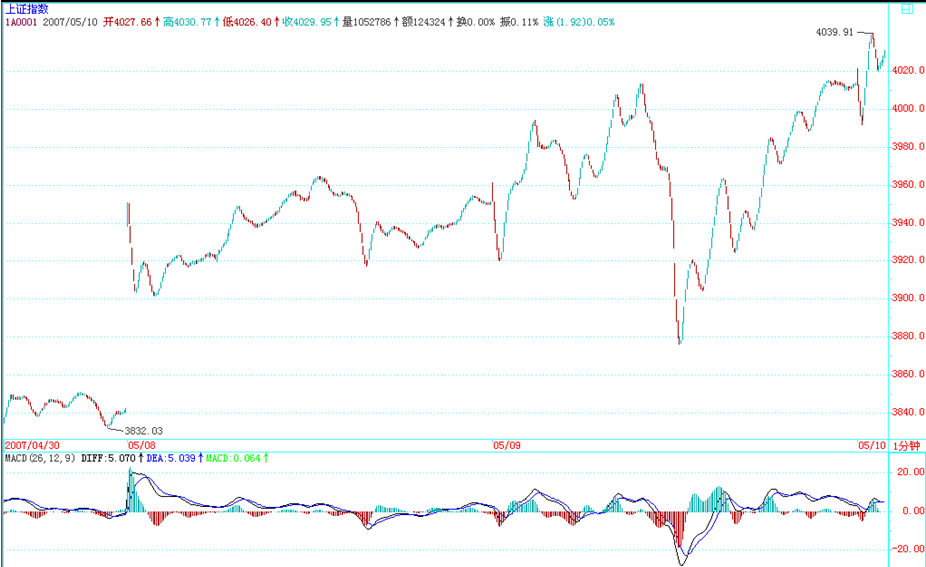

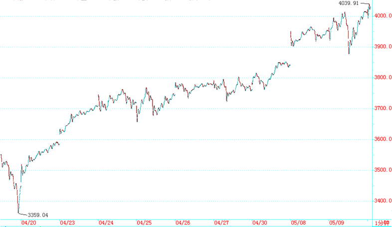

缠中说禅：2007-05-09 15:38:29

姐姐好:)天天在电脑旁炒股会受到辐射的呀，姐姐怎么保护皮肤呢?呵呵，很八卦，还请姐姐别介

==

打坐。顺便预告一下，本ID明天开一个新系列，教各位打坐。

缠中说禅：2007-05-09 16:56:39

自接触股票以来，感觉自己的脾气越来越难已控制，赢利就手舞足蹈，觉得自己很英明，输了就愤怒无比，看谁都不顺眼，时间长了，渐渐明白股市涨跌属正常，关键把握好趋势，学习好技术，但是还是和以前心平气和.爱怜悯人的我不一样，希望老师的打坐功能帮我们消除浮燥的心态，更冷静的学习.犹其能在精神层次上有一个提高.

==

所以本ID要开讲打坐，当然，不单纯为了股票。

缠中说禅：2007-05-09 17:00:58

看来，股票的煞气比较厉害，所以必须要开讲打坐了。本ID晚上又很不幸地被人抢占大搞腐败，推都推不掉，只好先下了。再见，明早发帖。

大牛市的序幕，还未真正拉开。(2007-05-10 15:56:10)

股市走势看似复杂，其实有规律可言。这轮已延续两年的上涨行情，在技术上其实十分简单，为了能清楚说明，必须先揭示一个上证指数的历史走势规律。为了简单起见，只以月线为例子。1992年5月，上证指数创出1429点的第一个历史高点，其后的历史高点，都与该点位及时间有着密切关系。

1993年2月，上证指数1558点的历史性大顶，恰好触及1429点开始，每年上涨180点，每月上涨15点的压力线，当月该线在1429+15X9=1564点。

2001年6月，上证指数2245点的历史性大顶，恰好触及1429点开始，每年上涨90点，每月上涨7.5点的压力线，当月该线在1429+109X7.5=2246.5点

以上两个历史大顶都是上证指数历史上最重要的顶部点位，都与1429点开始的按某速率上涨的压力线高度相关，这显然不能以巧合来敷衍解释。有人可能要问，相应速率是否随便设置？答案是否定的。

任何人都知道，圆周是360度，这构成分析的基础。以每天上涨360点为基准，相关压力线速率以其1/4、1/2、3/4等比例构成。显然，在上述两例子中，压力线速率分别由1/2和1/4构成。

由此不难理解，从2007年1月开始的3000点下盘整，不过是突破1/4线后的强势回调整理，3月，该线在1429+178X7.5=2764点。经过1-3月的调整，在3月初确认对该线突破的有效，而所谓的227大暴跌，不过构成对该线的最后一次回抽确认，其后出现的大幅上涨，在技术上理所当然，不过是1/4线突破确认后，展开对1/2线顺理成章的攻击。只是不学无术的空头，对此茫然不知，演出了一场企图在2700点放空的闹剧。

5月，1/2线在1429+180X15=4129点，该点位在技术上有强烈意义。从时间上看，1429点开始有着同样重要的历史规律。1558点与1429点相差9个月，2245点与1429点相差9年，而今天5月，是1429点以来的180个月，360的一半，一个极为重要的时间之窗，其后，不发生点事情，显然是不可能的。

从纯技术的意义上，1/2线能否有效突破，是考验本轮大牛市的真正试金石，不能有效突破该线，将使得受制于十几年来1/2压力线的运行模式依然延续。反过来说，到目前为止，这两年股市的上涨极端温和，是旧有的股市运行内在速率引导下的恢复性上涨，没什么可大惊小怪的。从某种意义上说，只有真正有效突破1/2线，一轮脱胎换骨的大牛市，才真正拉开序幕，否则，不过是以前节奏、速度与模式的重复而已。

因此，能否有效突破该线，构成对多头的真正考验，而空头，必然以此为屏障展开反攻。围绕该线的争夺，将构成两年以来第一次真正有分量的多空对决，一场决定行情新旧模式的大对决。相应走势，只有三种可能的演化：

一、在该线前止步或在该线上形成多头陷阱进而形成一个大级别顶部；

二、突破该线并围绕该线进行强势的、如1-3月在突破1/4线后进行的类似盘整，然后寻机突破。

三、强力突破并远离该线后，以一个强势的回调来确认对该线的突破，然后再展开对3/4线的攻击，目前该线的位置在1429+270X15=5479点。

无论市场采取哪种选择，对该线的突破、回试、确认等，都至少需要3个月的时间，因此至少在7月之前，该线将主导着大盘的走势。至于大盘究竟采取哪种选择，无须预测。一切市场走势都是市场所有参与者合力的结果，并没有上帝事先确定。而市场的选择，当下地在走势中呈现，只要对市场日线以下级别的走势规律有足够认识，不难从中提前发现。

无论市场最终如何选择，都不过构成超级大牛市的一个小片段。该1/2线是新旧两种模式的分水岭，一旦有效突破这每年上涨180点、一直控制大盘十几年的压力线，就能把该线有效转化成其后行情发展最坚实的底部支持。突破是迟早的事，而基础打得越扎实，对行情发展越有利。

2007-05-10

本ID昨天说，今天要继续震荡。但估计到14点45分前，所有人都以为本ID说错了，以为那些忽悠今天要冲多少多少点的股评对。结果怎么样，就不用本ID说了。震荡，不一定是绿盘狂跌才是震荡，就像一个中枢，在下面震也是震，。上面震难道就不是震了？今天尾盘的下来，在技术上严格保证，小级别的背弛当然是原因，还有一条就是中枢的走势必完美原则，不明白的，要加倍学习。

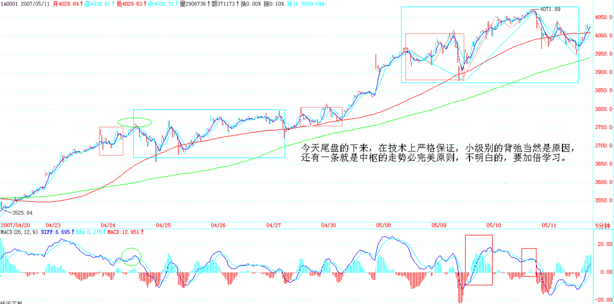

关于4000上下的震荡形成的中枢，要突破，向上要有第三类买点，否则，依然存在向下变盘的机会。在第三类买点出现，中枢完结前，震荡继续。用分时中枢概念看，昨天是一平衡市，今天也是，但今天中枢的位置向上移了，明天就面临三种选择，强的继续上移，中的围绕今天中枢震荡，弱的回试昨天中枢，从而让一般概念意义上的中枢形成级别扩展。根据明天开盘的走势，这一点不难分辨。

这些都是很短线的活动，脑子不够使的，就看5日线就可以，本ID说过多次，要量力而为，用自己最精通最有能力控制的方法，花心萝卜不是人人能干的，要成为花心萝卜，要学很多工夫的。

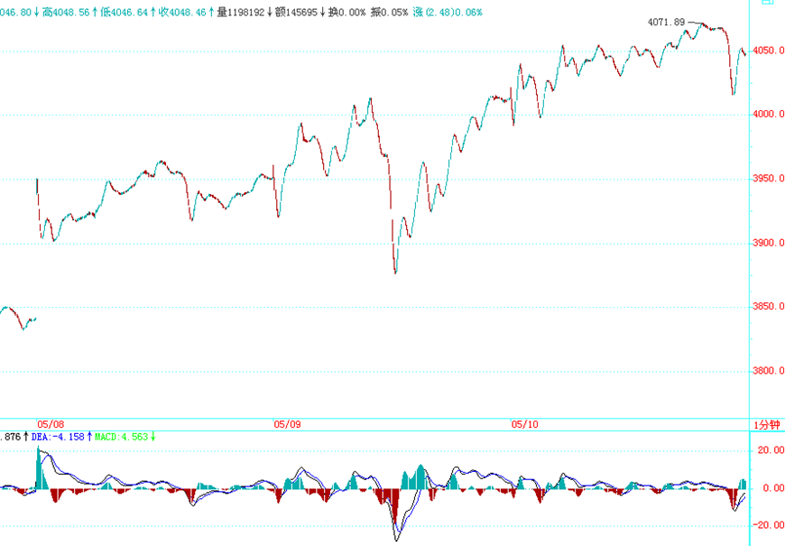

2007-05-11

本ID人在外地，但看盘不一定都在北京的。昨天承诺各位要收盘解盘，当然要执行。

昨天说的三种当日中枢情况，一开盘就确认是最弱一种，因此，在这里形成中枢扩张就是理所当然的。知道比空头、汉奸更可恶的是什么吗？就是不学无术的多头，那些号称破多少冲多少多少的傻瓜。本ID前几天已经明确说过，4000点不是怎么容易站稳的，必须是一个中枢后一个第三类买点才能确认，没出现之前，就是中枢的形成与震荡。在本ID的理论里，没所谓空头多头，只有见买点买卖点卖，这是必须知道的。那么为什么本ID长线是多头，因为长线没有卖点，这就是技术上唯一的原因。哪天连季度线上都有卖点，那么，本ID是最狰狞的空头。

后面走势很简单，继续中枢震荡等待市场自己去选择方向。而这种震荡，就是玩技术的最好场合，多多练习，那才是真工夫。

今天416第一个翻300%了，今年从2元多到现在，有多少个股票比他厉害的，请告诉本ID。国安永远争第一，让本ID也有一个努力的目标。

在外，事忙，周一收盘再解盘。有一公告在外面，请看。先下，再见。

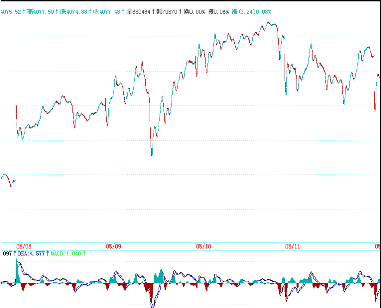

对证监会的警示，请充分理解!

(2007-05-12 17：57：25)

今天，N的N次方的人通过各种渠道骚扰本ID，为的是证监会的警示，估计来这里的人也是六神无主的多，本ID趁着宴会前的N分钟，在深南路上某五星级宾馆为各位写两句。

对证监会的警示，请充分理解!前面，本ID已经说过，无论山东人后面因为各种压力\原因干出些什么事情，大家都应该原谅，毕竟是这一期的证监会摆脱原来的思维定式，为中国资本市场的最终破题给出了一个大的突破，就算后面有多少不得不为之之事，怎么也是功七分，过三分了。一个大国，任何事情都是一个平衡的结果，这点也多次指出，没有任何人，可以完全不理会这种平衡，必要的姿态，就是对股市最大的关心，如果这都体会不到，像那些不学无术的多头这两天还叫嚣直接突破4000点冲多少多少，这就是本ID前面给他们的定义，是比空头和汉奸更可恶的人，是典型的左派幼稚病。

本ID反左反右反中，对中期的走势，本ID说了有一篇文章，将在适当的时候给出，5月10日，那文章出来了，在里面最主要的话就是"因此，能否有效突破该线，构成对多头的真正考验，而空头，必然以此为屏障展开反攻。围绕该线的争夺，将构成两年以来第一次真正有分量的多空对决，一场决定行情新旧模式的大对决。"

空头的这种反攻，当然不纯粹在市场面上，还有政策上的反攻，这完全都在本ID的剧本之中，大家现在可以再次体会10日文章中的这句话："而今天5月，是1429点以来的180个月，360的一半，一个极为重要的时间之窗，其后，不发生点事情，显然是不可能的。"

注意，本ID在这里只是强调，这种寒流是理所当然，完全在剧本之中的。不妨在告诉各位一个秘密，本ID的一个老熟人，10日也同时发布了一篇文章被各大媒体传播，当然，本ID文章的立足点和他完全不同，但各位如果对此人背景有了解，不难知道点什么。

5月开始展开多空大对决，这不仅仅是市场上的，还有是市场的政策\指导思想等方面。由此可见，技术分析的意义可以深入到事物的底层，为什么和360有关?想想人的身心波动周期吧。

必须再提醒，关于那三种震荡模式的选择，目前并没有任何上帝已经给出答案，本ID事先告诉你将发生事情的基本模式，而具体的选择，市场自己会有答案，并没有市场的上帝就选择了这三个月就一定要选择其中的第一种，一切都在市场各方力量的平衡中。而有了本ID的理论，任何的震荡，都是天堂，这里一样会产生和单边走势一样大的利润。关键不是走势，而是你的技术。那种只有单边才有快感的，一定成不了猎鲸者。

请再次重温本ID10日文章的最后一段："无论市场最终如何选择，都不过构成超级大牛市的一个小片段。该1/2线是新旧两种模式的分水岭，一旦有效突破这每年上涨180点、一直控制大盘十几年的压力线，就能把该线有效转化成其后行情发展最坚实的底部支持。突破是迟早的事，而基础打得越扎实，对行情发展越有利。"

请用你的眼睛去警惕这几类人：

1 从1000\2000多点就开始叫嚣崩盘，每次一夜情就兴奋异常的。

2 只会在市场上火上添油的，以散户为冲锋队，把散户当炮灰的。(想想为什么本ID在9日要写"教你炒股票51：短线股评荐股者的传销把戏"，本来希望新浪能放到主页，让更多人看到，包括10日的文章。)

3 出货后就叫嚣要把资金拿出国，散布要秋后算账的。(今天在北大，就上演了这样一场闹剧，本ID耳目众多，这倒是知道的。)

4 带着捣毁中国资本市场任务的。

5 任何要向你收费的。

有本事到市场上去拿，市场是干出来的。

缠中说禅：2007-05-12 18：03：14

本ID有时间会尽量上来的，马上有应酬，先下，再见。

再见，这美食多于美男的城市

(2007-05-14 15:23:24)

马上要离开深圳去长沙，然后有人在机场接本ID去某市，临走前，按承诺，对今天的走势说两句。

大盘今天就是一个典型的震荡，深圳强点，但也就是一个强点的平衡市，对于上海来说，今天的中枢就在2040上下，这是明天的一个很重要参照，站稳或围绕震荡都没问题，否则将再次去考验4000点。

4000点不是这么容易站稳的，这还不单单是技术上的原因，心理\政策等等，没有足够的震荡去消化，根本不可能有效站稳。今天大盘创新高而量萎缩，证明一直有点习惯的利空当利好游戏有点审美疲劳了。那种叫嚣今天就要站上多少多少的不学无术\只会把散户当炮灰的无良

头，是必须严惩其扰乱市场的行为。当然，空头也是垃圾一堆，周末空头到处乱吠，竟然有的跑到北大对着所谓总裁班的人狂吠，这种人，早该抓起来卖去当面首了。

本ID这里无所谓空头多头，只看市场的信号。再次声明，中线那三种震荡模式，是需要市场各种力量综合对比的结果，没必要去预测。操作上，只需要按照中枢震荡的原则，在第三类买卖点出现前，不断上卖下买就可以，一旦出现第三类买卖点，就根据相应趋势采取对应操作，例如，第三类卖点出现后，当然就看着，等到一个够级别的底背弛出现后再说了。再次提醒，震荡的利润绝对不会少于单边的，但这需要技术，技术不行，就看均线吧。

有很多事情都不方便这里说，一个历史事件，隐藏着后面的事情从来都不是表面所显示的。就像股改，现在都当一个历史功绩了，又有多少人知道，其中有多少次夭折的风险?很多事情都没必要说了。各位只要记住。一切表面的事情都是合力对抗的结果，而对于一般投资者，要冷静\冷静再冷静，按照一套行之有效的技术模式来，这样才能不被人当枪使了。

全世界的城市，多数既没有美食，也没有美男，深圳至少还有美食，就知足吧。这次，没碰到美男，只好对美食说:再见!

偶见湘火炬广告牌，口占五绝。

(2007-05-15 15:14:19)

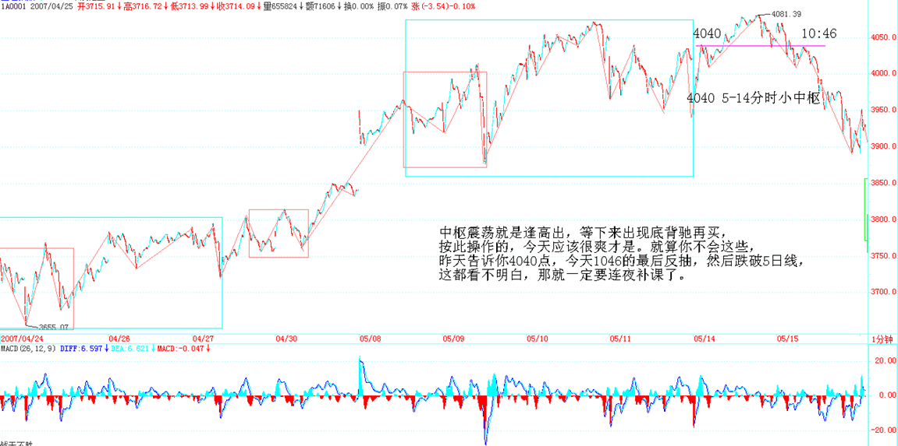

今天的走势没什么可说的，连续在这里提醒了N天了，中枢震荡就是逢高出，等下来出现底背驰再买，按此操作的，今天应该很爽才是。就算你不会这些，昨天告诉你4040点，今天1046的最后反抽，然后跌破5日线，这都看不明白，那就一定要连夜补课了。

今天，给那些冲多少点的无良多头沉重打击，活该，不过这些人还是会有脸出来晃悠的，多头无耻起来，和空头一样。

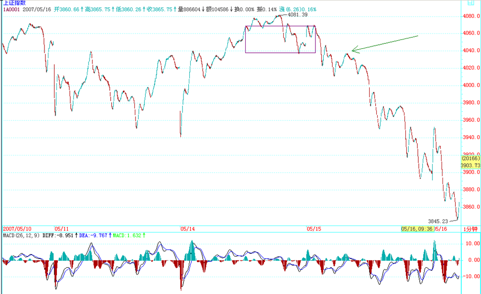

本ID这里没有什么多头空头，本ID横刀立马在此，告诉你4000点不会也不允许这么快突破，要震荡，就这样了，其他没必要废话，看买点买，卖点卖，选好级别就可以。

今天偶然在这里看到湘火炬广告牌，想起97年就提醒唐家兄弟的老皇历，感触良多，这种废人，不听好人言，死了活该。忙，马上有谈判，先下，再见。

偶见湘火炬广告，口占五绝。

曾经湘火炬，今已鲁潍柴。十载风云客，七尺老残骸。

各位，今天爽了吗?(2007-05-16 15:26:10)

各位，今天爽了吗?如果10点17添补周线缺口的底背驰你竟然还看不明白，还不会操作，那么就必须继续挑灯学习去。中枢震荡，直到出现第三类买卖点，这就是5月以后一直的说法，一个不会中枢震荡的操作者，注定是蹩脚的。一个完美的中枢震荡，会让多头空头同时挨嘴巴，当多头兴奋时，就让他痛苦，当空头要把419天长地久时，就让他哭，这就是中枢震荡，一个完美的中枢震荡，要多头和空头的血同时抽干，这就是中枢震荡。

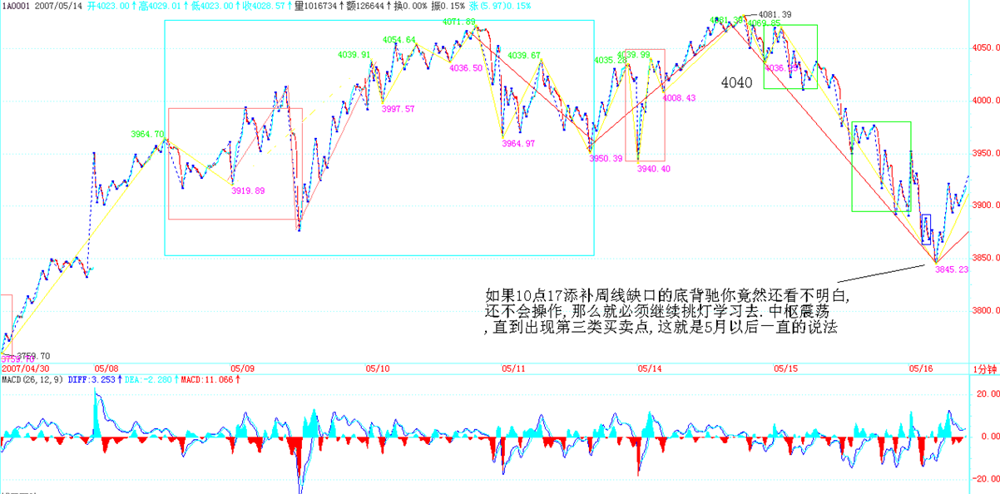

中枢震荡的操作要领在课程里都有，不会的学，不熟练的继续练习。

在本ID这里，首先要打破的一个概念就是走势是被上帝决定的垃圾概念，走势，从来都是市场各方力量综合的结果，管理层也不一定能随时决定走势，而所有的走势，最终都是技术性的，都被本ID的理论所包含着。不明白，不深切地体会这一点，那么，就要继续学习。再次提醒，那围绕1/2线的大的中枢震荡，其形式依然形成中，没有上帝，包括你在内的任何一个参与者都在创造着历史。

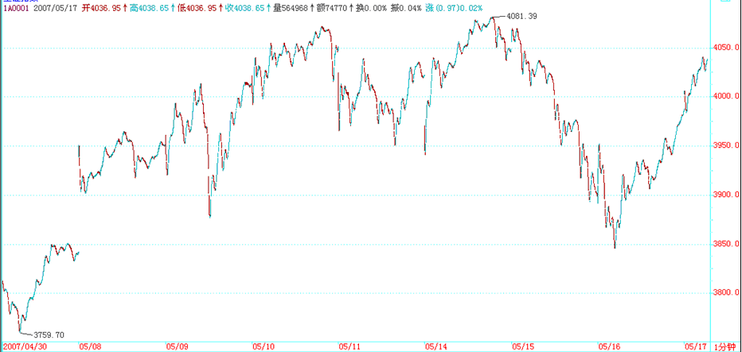

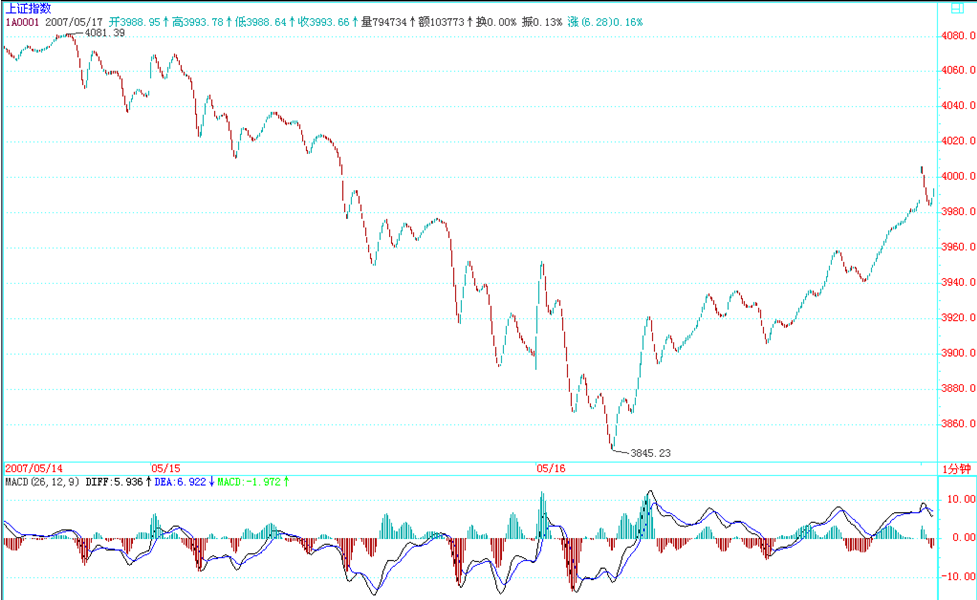

本ID这里不需要太多人，来这里的，就应该有志成为猎鲸者。就像本ID学作曲时老师说的，他只是一个训练者，真正的曲子只能自己写出来。本ID在这里也只是一个训练者，引导者，真正月亮靠自己去发现。八卦问一句，谁还和本ID一样继续抽那汉奸上实医药的血?

外面，车正等着本ID去机场。各位，北京见。

受传销蛊惑的，绞肉机最好的货！

(2007-05-17 15:27:16)

回到北京，还是不错的。今天还有不错的，就是看到还有人一直拥有600607，13元上下到现在，1个来月，其实没什么厉害的，最厉害的，这是汉奸的船，本ID比较高兴的，是能让这里的人能一起乘乘汉奸船、抽抽汉奸血，这种感觉和那16只股票是不一样的。

关于大盘，给那些不学无术的多头空头上上课。今天最重要的位置，还是前几天说的4040点，早上受压制，下午受支持，都是这个位置，那么这个位置就是决定中枢震荡是否能级别扩展的关键位置，站稳，就会形成中枢震荡的级别扩展，否则还在这级别的中枢里进行延伸。

关于中枢延伸与扩展的定义，在课程里都有，自己学去。

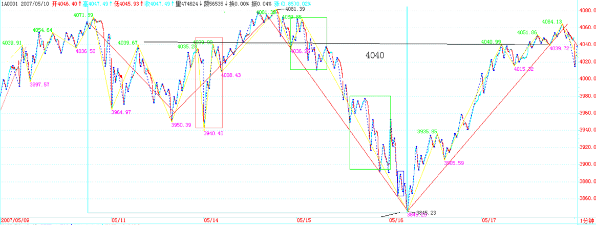

本ID反复强调，关于1/2线最终的震荡级别与形式，都是形成中的，而现在，只是其中的一部分，这就是种子，不断延伸、扩展下去，而大盘，永远都只是本ID理论的注释。实际的操作，特别对于散户的操作，你只要知道这个大概的框架，根据短线的背弛进出，这个就能创造出比单边更厉害的利润。当然，这需要技术，技术是靠磨练的。

今天为什么用这个题目？因为刚进来时发现一个传销广告，是这门户和某某联合推荐股票如何厉害如何收费之类的。好好去看看本ID前面关于这个问题的文章，本ID早知道这种垃圾活动会不断出现，绞肉机的货将足够新鲜。

记住：任何向你收费的，或部分收费的，都是垃圾。只要市场的垃圾才需要参与这种收费的垃圾活动。

市场里有金山银山，有本事有技术就去拿，否则，市场迟早让这些垃圾吐出来！

对不起，刚回来，很多腐败活动要补课，这两天各位就让本ID去补习一下腐败。今晚有三拨活动，最早的4点开始。先下，再见。请原谅。

缠中说禅：2007-05-17 15:29:44

对不起，刚回来，很多腐败活动要补课，这两天各位就让本ID去补习一下腐败。今晚有三拨活动，最早的4点开始。先下，再见。请原谅。

## 教你炒股票52：炒股票就是真正的学佛(2007-05-18 08:49:05)

本ID一直强调无须预测，并不是说市场走势就绝对不可预测，相反，市场走势当然可以绝对预测。不过，这里的预测和一般所说的预测并不是同一意义，一般的预测是建立在一个机械的、上帝式思维基础上，这种思维，把市场当成一个绝对的、不受参与者观察所干扰的系统，由此而行为一套所谓的预测标准，一个建立在错误的思维基础上的标准。这种预测，本来就不存在。关于这点，如果你对量子力学的历史发展有点了解，不难理解。

市场的预测、观察、参与者，恰好又是市场走势的构成者，这就是市场预测的最基本起点。因此，市场的走势模式，归根结底就是市场预测、观察、参与者行为模式的同构，这意味着，唯一并绝对可以预测的，就是市场走势的基本形态。不学无术之辈，喜欢谈论所谓的点位，却不知道，点位只是基本形态演化的一个结果，是当下中形成了，形态是“不患”的，点位是“不患”之“患”，只要把握了这“不患”，其“患”自然就在当下的把握中。那种追求对点位的非当下把握，绝对是脑子进水，因为点位都是当下形成中的，这是一个“不患”，企图逃离这个“不患”而谋其“患”，不是脑子进水是什么？正因为点位都是在基本形态的演变中当下形成的“不患”，才有点位的“不患”之“患”。

明白了这个道理，才算是有了市场预测的“正眼”，无此“正眼”，都是瞎掰。而实际操作中，最基础的，就是对基本形态的最基本把握，这是“不患”的，只有立足于这“不患”上，才有对点位之“患”当下的把握。说白了，所有的操作练习，归根结底就是在此之上。所以，本ID说自己只是一个训练者，引导者，因为当下，只能是你的当下，离开你的操作当下，根本是不存在的。由此，不难理解另外一个操作上的“不患”，就是你事先确立的操作级别，这是“不患”的。市场，归根结底只是你的市场，就像，一个看花只能看到花的眼睛，那自然看花就是花，不会把花看成猴子，科学的把戏，就是要先假设所有的被科学定义为眼睛的物体，都只能把花看成花，所以科学在股市上注定死无葬身之地。

所有的市场，都必然只能是你当下观察、操作中的市场，离开你当下的观察、操作，市场对于你来说并不存在，或者说毫无意义。而你的观察、操作，必须有一个“不患”的前提，就是你的操作级别。这操作级别，就等于一个把花看成花或把花看成猴子的眼睛，在你的世界里，把花看成花与把花看成猴子所包含的基本模式是同构的，关键是这个模式，而不是花还是猴子的不同设定。所以，本ID的理论里，可以适用于任何操作级别的人，因为不同级别之间的基本模式是同构的，这就是市场的一个基本特征。注意，这特征不是理所当然的，这个特征之所以存在，归根结底，就是市场参与者有着基本相同的结构，这结构，归根结底，就是贪嗔痴疑慢。甚至可以这样说，在六道轮回中，任何的类市场形态，本ID的理论都适用其中，因为，这贪嗔痴疑慢是同构的。所以，如果本ID这理论的种子种下后，就算你轮回到其它道上，那里恰好有一个股票市场，你也可以在其中如鱼得水。

那么，市场的基本形态是什么，最基础的，就是反复说的以中枢、级别为基础的趋势与盘整。而背驰的级别一定不小于转折的级别，是市场预测的最基础手段。例如，你是一个30分钟级别的操作者，那么，任何30分钟级别下跌及30分钟级别以上的盘整，你都没必要参与。因此，当一个30分钟的顶背驰出现后，你当然就要绝对退出，为什么？因为这个退出是在一个绝对的预测基础上的，就是后面必然是一个30分钟级别下跌或扩展成30分钟级别以上的盘整，这就是最有用、最绝对的预测，这才是真正的预测，这是被本ID的理论绝对保证的，或者说这是被市场参与者的贪嗔痴疑慢所绝对保证的。

本ID的理论，归根结底，就是研究这贪嗔痴疑慢的。由此也就知道，为什么市场的操作，归根结底就是人自身的比较，为什么本ID可以把理论大肆公开而不会影响本ID自己的操作，因为，只要这世界依然有这贪嗔痴疑慢，本ID就如鱼得水。有人整天痴谈学佛，其实，炒股票就是真正的学佛，不在这贪嗔痴疑慢的大烦恼中如鱼得水、得大自在，你那佛，顶屁用！

盘后解盘缠中说禅：2007-05-18 15:39:06

今天，只有脑子都是水的人，才会觉得上海要新高。用脚指头思维都知道，周末消息面的压力会让走势在这里犹疑。今天的平衡市走势，无非就是对此的一种正常反应。技术上，管了指数已经N天的4040点依然站不住，当然，这只是为了对中枢不了解的人给出的点，如果熟悉正常分析，可以找到更精确的点。

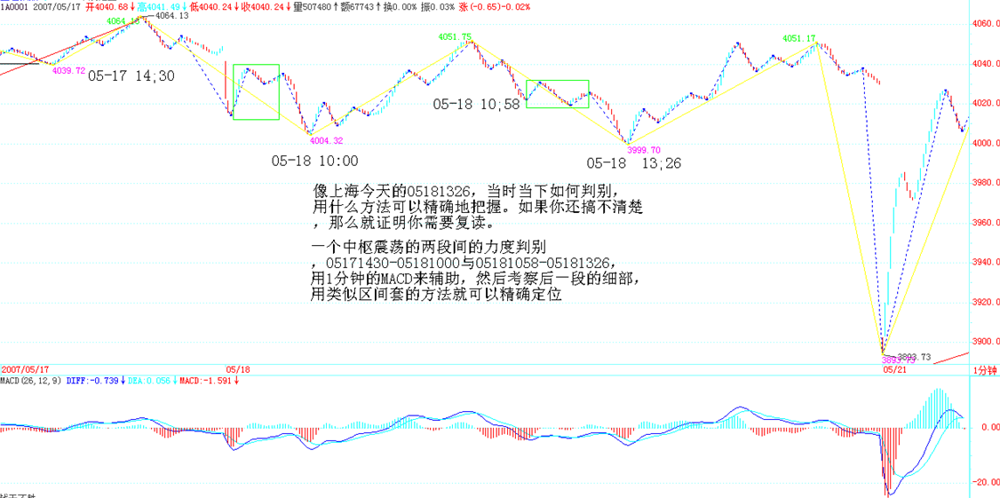

下周初，大盘的这种震荡一定要选择方向了，一个最简单的原因，就是5日线对10线之吻已经春情荡漾了。这种方向的选择，最终将导致震荡区间的加大，技术点说，就是形成一个更大级别的震荡。

深圳最近之所以比上海强，只是因为对应上海1/2线的深圳成指数的1/2线在13700点，还有较大空间的。所以，后面走势无非两种选择，深圳把上海带起来或相反，这种两个市场的背离走势，是不可能再延续的。

大盘每天的走势都是本ID理论的最好注释，像上海今天的05181326，当时当下如何判别，用什么方法可以精确地把握。如果你还搞不清楚，那么就证明你需要复读。答案很简单，一个中枢震荡的两段间的力度判别，05171430-05181000与05181058-05181326，用1分钟的MACD来辅助，然后考察后一段的细部，用类似区间套的方法就可以精确定位。注意，这一切都可以当下完成的，无须事后解释。如果上述方法你一无所知或根本搞不清楚，那放假两天继续补课。

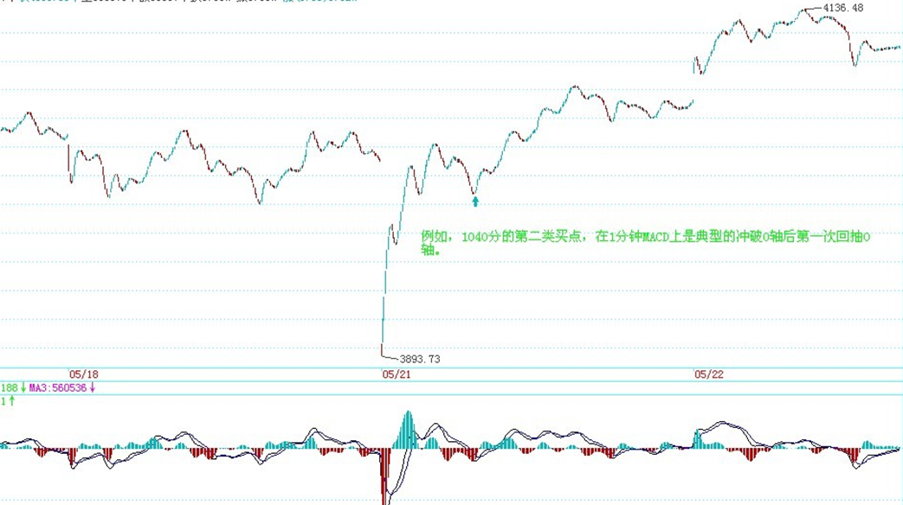

本ID最近比较无聊，放假是有点不可能了，今晚、明后两天都排满了。为了高兴一下，八卦一个消息，就是5月10日写文章那老熟人，结婚了，这消息今天应该公布了，网络上应该都有，由此就知道此人文章的分量。最后再八卦一下，本ID国安永远争第一的股票，究竟在今年涨幅排第几了？前面还有多少先进需要超越，让本ID也有个努力的目标。

缠中说禅：2007-05-21 15:42:35

今天的走势，在技术上十分规范，早上先冲到最近反复强调的4040上，然后回调，并在第四根30分钟K线突破向上，并在下午确认4050上下单边区间的有效性。明天的走势就很简单了，如果这单边区间不被跌破，大盘将继续向上拓展区间，否则就再次陷入原中枢的延伸震荡中。

本ID反复强调，关于1/2线大震荡的三种具体形式在形成、选择中，这是市场各种力量合力的结果，不管是管理层还是所谓的经济雪茄，以及市场参与者，并没有一方有绝对的力量，因此才构成最终具体的形式。对此必须有最清醒的认识，而最理想的方式，就是在充分的震荡中，不断让市场统一在本ID所指出的方向上来。管理层恐高，也应该给他们以适应的时间，因此还是本ID5月份后常说的那句话，反左反右，对空头与多头里的极端分子采取强硬措施，更要在市场中让他们左右挨巴掌。当然，震荡的区间可以加大，并不是说一定要限制在目前的区间中。但用震荡消化市场、政策压力的本ID剧本，必须成为市场的共识，否则就让市场对极端分子进行强行教育。

在这种震荡中，充分利用本ID的理论来操作，是一个最好的选择。当然，如果你技术不过关，那就看5周均线，甚至10周均线，从去年8月以来，后者就从未被跌破过，看这足够在各种大震荡中心理减震了。对于短线，看不明白用不好本ID理论的，可以看5日均线，这两天关键看这5日与10日之吻能否再次女上位。个股方面没什么可说的，还是那句话，大盘震荡，有些股票反而会大幅上涨，前面说的这句话依然有效。具体板块，本ID去年底说的医药，今年最牛的几只股票里，002019、000416等，显然都是这个板块的；还有钢铁，最近可以关注有关中小公司整体上市的，具体的本ID知道，但不好说出来，免得被监管，其中有一地方本ID好象曾419过。至于军工、公用等等，都会继续表现的，你看本ID16只股票里相应的都知道了。还有就是上月反复强调的故意亏损的那些，例如本ID就知道某故意亏损还星号ST、代码还是等比数列的其实后面就有两个铜矿装进去，这种把戏，如果有可能就去挖掘。

算了，本ID不希望这里被监管，所以绝对不说具体股票了。而且大家也不能养成听消息的习惯，最终解决问题的，还是要技术过关。

缠中说禅：2007-05-22 08:49:55

各位请注意，本ID昨天说的股票只是举例子，由于有些盘子太小，例如本ID就在摆弄着一只和那锌锗内容一样的股票，但盘子确实太小，根本就没法说，一说就乱。现在不是2000点了，任何股票都要首先注意风险，必须按照大级别的买点进入。盘子小的，不能乱买，否则盘子就乱，就要洗。各位最好就是按思路去买股票，最好就是继续持有原来已经获利丰厚而依然有大潜力的股票，这样可以减少震荡的风险，否则一窝蜂地去换股票，那就乱套了。

注意，来这里是学技术的，有技术，操作什么股票都可以，没必要养成听消息的坏习惯。如果说消息，本ID这里绝对是全中国最大的消息集散地，但本ID不愿意说，就是怕害了各位，养成坏习惯。解盘收盘后附录上，先下，再见。

缠中说禅：2007-05-22 15:28:48

昨天说了，只要不跌破4050的昨天单边区间，大盘就继续向上拓展。今天的大盘走得太技术了，全天基本就在磨那条最重要的1/2压力线，早上先冲到4129这线的位置上，然后在上面来一个小多头陷阱，然后一路下来考验缺口支持，尾盘再拉回，是否感觉到其中的美感？明天，依然是该线与今天缺口间的震荡活动，然后再选择短线突破的方向，具体可参照今天开始形成小中枢的震荡与第三类买卖点选择。

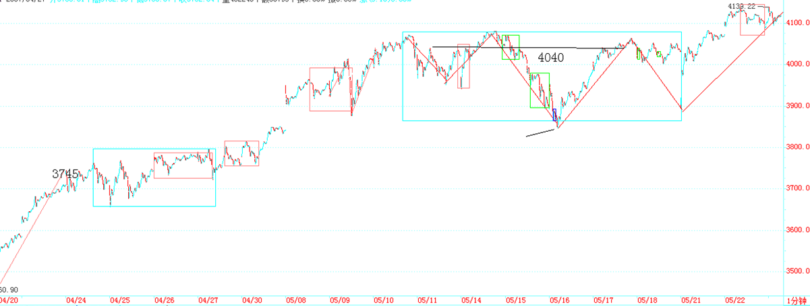

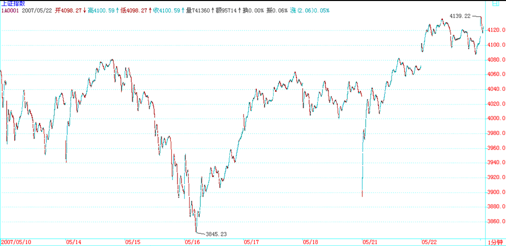

大方面看，关于该1/2的震荡形式，依然继续选择中，虽然今天是历史上第一次突破过该1/2，但并不能绝对地否定第一种震荡形式的可能。当然，操作上并不需要预测，只需要看好短线的突破方向，看不懂的，就是5、10日线，不破就拿着，连短线的震荡都无须考虑。技术好的，可以继续用短线背驰做震荡，但一定要针对具体个股来，大盘只要平稳，个股行情将不断。

至于个股，本ID真不能说任何东西了，反正昨天本ID也没说什么，只是说了几句梦话，如果因为本ID的几句梦话，大家明白了点什么，那是大家的够狡猾，和本ID可无关。这种梦话，估计最变态的管理层也不能对本ID发飙，本ID说而不说，不说而说，想抓本ID的把柄，可需要证据。

## 教你炒股票53：三类买卖点的再分辨(2007-05-23 08:47:18)

由于新来的人越来越多，请都先把课程认识从头看一遍再讨论问题。另外，在分析一定要搞清楚中枢的递归定义，这是基础中的基础，连这都搞不清楚，没有彻底明白，那根本就不可能继续下去。

再者，关于级别的问题，如果想不明白，可以当成用不同倍数的显微镜去看一滴水，由此当然会看出不同的精细度，级别之与走势也一样。一个最简单的例子，三个5分钟级别的走势重叠构成一个30分钟中枢，站在30分钟级别的角度，5分钟的走势都可以看成就是一个线段，没有内部结构的，这线段的高低点就是对应5分钟走势的高低点；而站在5分钟的次级别1分钟上看，每段5分钟的高低点都不绝对是在5分钟走势的结束或开始位置，当然，按1分钟的级别重新用结合律重新组合，总能让高低点分别在开始或结束的位置，但站在分笔的级别上，这又不行了。为什么？因为当我们用1分钟的级别重新组合时，其实就先把分笔上的级别都看成没有结构的线段了。这是十分自然的，就像我们研究猴子的行为时，如果还考虑其中的每个细胞里包含的分子里的原子里的电子的走势问题，那猴子就不是猴子了。所以，这个原则是必须明确的，例如你决定用30分钟来操作、观察时，其实就已经先假定把所有完成的5分钟走势都看成线段了。

注意，这里和区间套定理是没有冲突的，当30分钟进入背驰段，为了更精细的定位，用倍数更大的显微镜去看这段走势，这是极为自然的。只要知道该在什么时候用什么倍数的去看就可以。再例如，在看30分钟的第三买卖点时，由于要涉及次级别5分钟的判断问题，所以那时候就不能光用30分钟级别的显微镜，同样要转换成5分钟的。但无论这些显微镜如何转换，一个原则是不变的，就是当你用一个级别的显微镜时，就等于先把次级别的当成线段了，也就是说次级别不在该级别的观察中。

当然，有这最精细最严格的方法，就是从最低级别的分笔中逐步组合分析上来，这样就不存在上面的问题，但这样太累，而且毫无必要。理论是用来用的，只要不违反理论的基础与绝对性，当然要选择更简单的用法。对这个问题，必须要了解，否则一下30分钟、一下1分钟、一下又年线，非把自己换晕了。

其次，对于背驰与盘整背驰，前者是有着最基础意义的，而后者，只是利用前者相应的力度分析方法进行的一个推广用法，主要用在与中枢震荡相关的力度比较中。注意，a+B+c中，a和c的盘整背驰，其实都可以看成是B的中枢震荡，虽然a存在时，B还没出现，但也不妨这样看。

至于第一、二、三买卖点，归根结底都可以归到第一类买卖点上，只是级别不同。那么为什么不就说第一类买卖点，因为这样，就会涉及不同的级别，等于同时用不同级别的显微镜去看，太乱，实际用起来更乱，因为不同级别的买卖点意义是不同，因此要同一在一个级别上研究，这个才有三类买卖点的分别。当然，最充分的操作，就是按分笔的买卖点，这样所有波动的最细微波动都可以把握了，但这在实际中是不可能的，人需要反应的时间、有交易成本等等。因此，忽略掉某些波动，按更大的级别同一操作，就是客观条件的必然要求。本ID的理论可不是什么先验理论，而是根本客观条件充分反映当下可能的充分可操作性的理论，这必须要彻底明确。因此，三类买卖点，都不能偏废，不能说哪一个更重要，站在同一级别上，三者都重要。

第一类买卖点，就是该级别的背驰点，这足以应付最大多数的情况，但有一种情况是不可以的，就是前面反复强调的小级别转大级别的情况。为什么？因为当小级别背驰时，并触及该级别的第一类买卖点，所以就无须操作。对这种情况，就需要第二类买卖点来补充。该买卖点，不是专门针对这小转大情况的，一般说，高点一次级别向下后一次级别向上，如果不创新高或盘整背驰，都构成第二类卖点，而买点的情况反过来就是了。所以，在有第一类买卖点的情况下，第一类买卖点是最佳的，第二类只是一个补充；但在小级别转大级别的情况下，第二类买卖点就是最佳的，因为在这种情况下，没有该级别的第一类买卖点。

第二类买卖点，站在中枢形成的角度，其意义就是必然要形成更大级别的中枢，因为后面至少还有一段次级别且必然与前两段有重叠。而对于第三类买卖点，其意义就是对付中枢结束的，一个级别的中枢结束，无非面对两种情况，转成更大的中枢或上涨下跌直到形成新的该级别中枢。第三类买卖点就是告诉什么时候发生这种事情的，而在第二、三买卖点之间，都是中枢延续，这时候，是不会有该级别的买卖点的，因此，如果参与其中的买卖，用的都是低级别的买卖点。

实际操作中，最干脆的做法，就是不参与中枢震荡，只在预先设定的买卖点上买卖。但对于大资金来说，或者对于有足够操作时间和熟练度的资金来说，中枢震荡当然是可以参与的，而且如果中枢级别足够，其产生的利润往往更大而且稳定。而在趋势的情况下，一般小级别的买卖点并一定要参与，但如果技术特别好或大资金，同样可以参与，这只是为了提高资金的利用率，加快成本变0或增加筹码的过程。当然，这种小级别的参与，就与该级别能容纳的资金量有关，这就涉及仓位调配控制的问题了，这问题以后再说。

缠中说禅：2007-05-23 15:33:27

今天大盘没什么可说的，一开盘就去再次考验昨天的缺口位置，然后回来。你只要看看0945以及1045这两个时间在4129点的表现，就知道大盘走势是有语言的，这么清楚的语言，要必要看懂。1045后在4129横拉了7、8分钟，然后就义无返顾地往上去了，这看懂了没有？当然，对4129的突破，还需要确认等，但现在大盘的走势就十分简单了，看着5日线就可以。

个股方面，更没什么说的，只是如果有人辜负了本ID昨天一大早的提醒，那是有点不好，本ID一大早可一般都不说什么的。

## 教你炒股票54：一个具体走势的分析(2007-05-24 01:37:31)

今天本不该说股票，连续两天都说股票也太浪费资源，不过回帖里有人提出这个问题很有代表性，所以有必要回答一下。今天等着看足球，十分无聊，上网419，还不如把这帖子给写了，先贴出来，让等看球的先消耗点无聊的时间。

注意，看下面分析之前，不能太饿也不能太饱，不能太兴奋不能太不兴奋，否则一定晕。由于一般的图都没有这么复杂，所以看完之后千万别信心受到打击，而是应该信心百倍，知道只要精通本ID的理论，这么细微、古怪的图，都可以当下精确分析并指导操作，从而对本ID理论关于走势的绝对把握性有一个更清楚的认识。后面就是要多看图，多磨练的问题了。

如果概念不清，看到这样的图，基本都要晕头转向。好了，大家开始深呼吸，放松脑筋，别抽筋了。

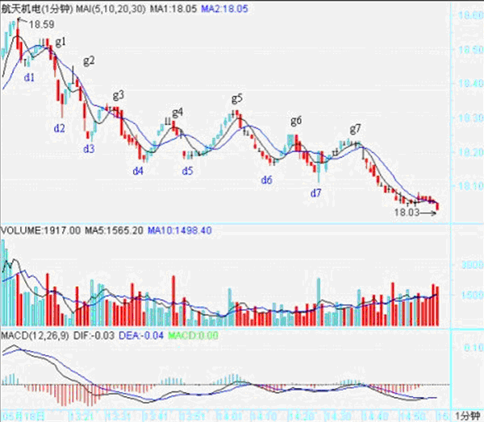

这图有个条件，就是d1=g2，d2=g4。其实这条件有还是没有，并不影响分析，但有这些条件，就会增加分析的难度。这里，就从18.59元（设为g0）开始分析。

昨天刚好谈到，当你以某级别分析图形时，就先假设了次级别是线段。这图里，除了最后一个，其余每一个dngn、gndn+1都是1分钟以下级别的，所以都可以看成没有内部结构的线段。

我们就从g0开始，当下地进入图形中。显然，当下走到g1时，由于只有两段，所以不形成任何中枢，当然，如果你是一个分笔操作者，那么g1就构成一个第二类卖点了。当走势发展到d2时，一个1分钟级别的中枢就形成，区间是[d1，g1]。后面出现的线段，就要以该区间来决定是中枢震荡还是第三类买卖点。由于d1=g2，那么d2g2这段就属于[d1，g1]中枢的震荡。而到d3g3这段，显然已经不能触及[d1，g1]，所以g3就是第三类卖点。当然，如果前面d1>g2，那g2就是第三类卖点了。

其实，由于d1=g2，所以当行情发展到d3，就可以当下地用结合律对走势进行多样性分析。这时候，有如下等式：

g0g3=(g0d1+d1g1+g1d2)+d2g2+g2d3=g0d1+(d1g1+g1d2+d2g2)+g2d3

括弧里的是中枢。在后一式子看来，该中枢就是[d1，g2]，也就是一个价位，这时候，也并不影响前面关于g3就是第三类卖点的分析。而这种分解，比较符合一般的习惯，所以是可以采取的。

显然，以MACD辅助判断，力度上，g1d2>g2d3>g3d4，相对来说，后者都是前者的盘整背驰。当然，在1分钟图上，这种背驰都没有什么操作意义，但如果是日线、甚至年线图上，就有了。

分解图形，有一个原则是必须知道的：两个同级别中枢之间必须有次级别的走势连接，例如，g0d4= g0d1+(d1g1+g1d2+d2g2)+（g2d3+d3g3+g3d4）这样的分解是不被允许的，因为括弧中的两个同级别中枢之间没有次级别的连接。（注意，这与下面三次级别构成中枢的情况不同，那种情况下，是允许三个括弧相加而之间没有次级别，因为那是扩展成高一级别中枢的情况，和这里两个同级别的情况不同。）

当行情当下走到d4点时，根据上面的原则，无非有下面两种可能的分解：

g0d4= g0d1+（d1g1+g1d2+d2g2）+g2d3+d3g3+g3d4

= g0d1+d1g1+g1d2+（d2g2+g2d3+d3g3）+g3d4

d4g4是盘整背驰后的正常反弹，针对上面第一种分解，这只是第三类卖点后向一个新的同级中枢移动或形成更高级别中枢的一个中间状态，g4d5这段也是；针对第二种分解，由于g4=d2，所以d4g4是（d2g2+g2d3+d3g3）的中枢震荡，d5g5这段也是。

有人可能要问，在这种情况下，采取哪种分解？其实，哪一种都可以，但第一种，由于在中间状态中，没有一个确定的标准，所以对短线操作指导不足，而第二种，由于是中枢震荡，操作起来就指导明确了，所以从方便操作的角度，就可以用第二种。这就是反复强调的分解多样性的好处，一般来说，对于具体操作，一定要选择当下有明确意义的分解，例如是中枢震荡的，或有第三类买卖点的，但一定要注意，所有的分解必须符合分解的原则，否则就乱套了。

对于第二种分解，d5g5这段属于中枢震荡，但对于第一种分解，d5g5这段就有了一个重大的意义。因为那种第三类卖点出现后的中间状态，在d5g5这段出现后就彻底消除了，一个更大级别的中枢就给确定了。具体如下：

g0g5= g0d1+{（d1g1+g1d2+d2g2）+（g2d3+d3g3+g3d4）+（d4g4+g4d5+d5g5）}

三个小括弧里的1分钟中枢重叠构成了大括弧里的5分钟高一级别中枢。中枢的区间是[d2，g5]，注意，这时候，就要把1分钟的走势当成线段，小括弧里的都是线段，高低点就是这线段的端点。这样一来，后面的走势就十分简单了，例如，g7就是一个第三类卖点（d7g7，其中2、3根K线有一个较大的回试，然后有5、6两个小十字星停在该区域，由此就知道这肯定构成1分钟中枢了，也就是内部可以画出一个1分钟以下级别的三段来，当然，具体的如果有1分钟以下图看就可以把握，特别对于级别大的图，这些时候都可以看小级别的图去确认，如果经验多的，一般看到这种情况，不用看小级别的都知道这么回事情。）

按照第二种分解，相应的5分钟中枢要到g6点才完成，这样g0g6= g0d1+d1g1+g1d2+{（d2g2+g2d3+d3g3）+（g3d4+d4g4+g4d5）+（d5g5+g5d6+d6g6）}

相应的5分钟中枢区间就是[d3，g5]，在这种情况下，d7g7也是一个中枢震荡，但不构成第三类卖点，因为不符合条件。（为什么？本ID写了这么多，这么简单的问题，就当成作业请各位回答。）

注意，并不是说一定要形成该级别第三类卖点后才能大幅度下跌，完全可以用该级别以下小级别的第三类卖点就突破中枢，但有一点是肯定的，就是只要足够长时间，该级别的这第三类卖点一定会出现的，当然，在最极端的情况下，这个卖点离中枢很远的位置了，但有一点是肯定的，就是该卖点后一定继续向下。而上涨的情况相反，第三买点后一定继续向上，一个最好的例子就是600477在20070409日这个小级别的第三类买点，这买点离2月分的中枢很远了，但依然有效，而且还是在这么大监管的条件下，本ID的理论继续发挥作用，为什么？因为那些监管并没有破坏本ID理论成立的两个最基本的前提。还有的可以看600837在20070206的例子。至于暴跌的例子，现在很难找到，老一点的投资者应该都记得庄股跳水后，第一次反抽后再继续更大幅度下跌的例子，那就是第三类卖点。

必须注意，在这种大幅快速波动的情况下，一个小级别的第三类买卖点就足以值得介入。例如对一个周线中枢的突破，如果真要等周线级别的第三类买卖点，那就要一个日线级别的离开以及一个日线级别的反抽，这样要等到何年何月？因此，一个30分钟甚至5分钟的第三类买卖点都足以介入了。但这里有一个基本的前提，这种小级别的大幅突破必须和一般的中枢波动分开，这种情况一般伴随最猛烈快速的走势，成交量以及力度等都要相应配合。这种操作，如果理论把握不好，有一定风险，就是和一般的中枢震荡搞混了，因此理论不熟练的，还是先按最简单的来，例如对周线中枢的突破，就老老实实等周线的第三类买点。注意，卖点的情况，即使理论不熟练的，宁愿按小的来，因为宁愿卖早，决不卖晚。不过，对于大级别中枢来说，如果还要等到第三类卖点才卖，那反应已经极端迟钝了，那第一、二卖点去哪了？市场里可不能随地睡觉。

还有一种极端的例子，就是大幅度的中枢震荡，例如5分钟的中枢在10000元，最极端的，甚至可以次级别以下震荡到0.01元，又拉回来，即使连续跌停到0.01元，然后连续涨停到100000000元，再跌回来10000元，这也是5分钟的中枢震荡。当然，这么有病的例子也只能是理论中的，但由此可见本ID理论的涵盖面之广。所以中枢震荡的操作，一定是向上时力度盘整背驰抛，向下力度盘整背驰回补，而不是杀跌追涨，否则真出现这么有病的情况，那就真有病了。

关于追涨杀跌，如果在中枢震荡中，一定死定。但如果是在第三类买卖点后，却不一定，因为中枢的移动，并不一定恰好就是你买卖的位置就结束了，就算是，后面也还有中枢震荡出现，因此，在这种情况下追涨杀跌，也有活的机会，但这都不是长远之计，为什么有好好的第三类买卖点不用，一定要追涨杀跌？就算是追涨杀跌，也可以利用小级别的买卖点进去，为什么一定要瞎蒙？

回到上面的两种分解，其实这两种分解对于g7点来说，结论是一样的，而从MACD辅助看，这种两次拉回0轴都冲不上去的走势，而且第二次红柱子还面积小了，这种情况也预示者后面有麻烦。但多种分解，其实并不是什么麻烦事，反而是相互印证的好办法。不过一定要再次强调，分解必须符合规范，不能胡乱分解。

按严格标准说，如果你能熟练地，无论任何图形，都能当下快速地按以上标准来分解并指导操作，那么对于本ID理论的学习，就大致可以小学毕业了。不过这样可能对信心不足或学习时分析能力比较一般的人打击过大，所以为了鼓励大家，本ID决定向教育部门学习学习，也来一个扩招，达到这种水平的，都统一发本科毕业证书，又鉴于最近北大已经堕落到连孔男人、李男人之流都可以教授教授了，所以决定毕业证书都统一成北大牌的，一律免费，这样大家应该可以放心学习了。

废话少说，本ID要去夜宵夜宵，然后看球看球。

读后感：

1、中枢样式确定：回升式，g0d1+(d1g1+g1d2+d2g2)+g2d3括弧里的是中枢。

2、分解图形，有一个原则是必须知道的：两个同级别中枢之间必须有次级别的走势连接。

3、这与下面三次级别构成中枢的情况不同，那种情况下，是允许三个括弧相加而之间没有次级别，因为那是扩展成高一级别中枢的情况，和这里两个同级别的情况不同。

4、不同的分解方法提供了不同的视角。

2007-05-24 15:34:20

虽然今天本ID见到什么股票都想当AC给揍扁，但如果你学了上面的课程连今天的图都看不明白，那自己也要揍扁自己了。10点的第一卖点与1115的第二卖点，就和上面图上的g0\g1是一回事情，只是上面是1分钟以下级别的，而这是1分钟级别的。从1115到1412，就是第三段，从而构成一个大的5分钟中枢，第三段是一个典型的趋势，二个中枢，最后一段在1分钟图上标准的1分钟以下级别背驰（看其中MACD的绿柱子面积），后面的拉回，就是对这5分钟中枢的震荡。就这么简单，看不明白的，对着今天的分时图，和上面的图，请好好研究。

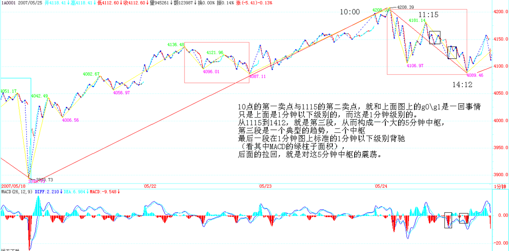

明白了上面，明天的走势就太简单了，就是关于这中枢的震荡直到出现第三类买卖点，就这么简单，简单得像昨天首发就应该是克劳奇，但竟然没有，你说是不是某些人脑子进水了。至于大的走势，就还是4129点的1/2线问题，一定要震荡给站住才谈论向上发展，这是一个大前提。

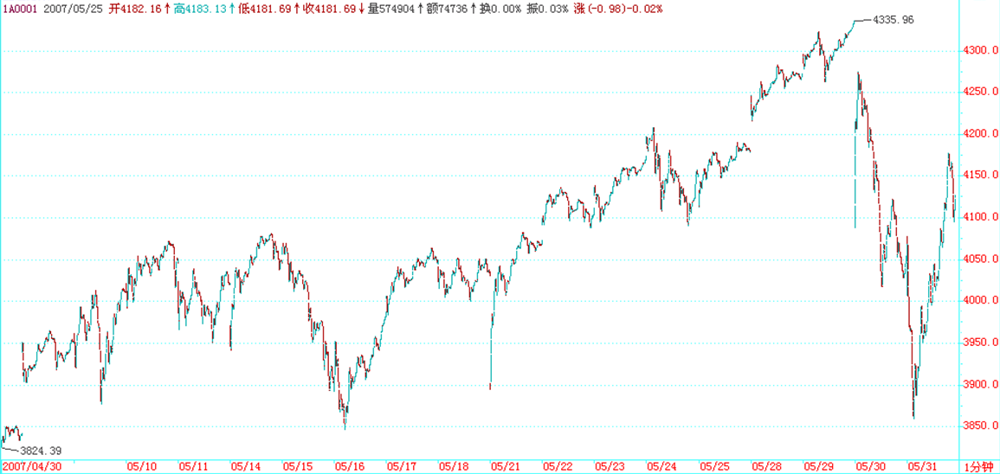

个股不想说什么了，千万别问本ID，今天635涨停究竟买不买。一定要在买点买，短线也是一样的。就像本ID那16只里前期最弱的998和343，998在3、4月分盘整的时候，无数人在叨唠，有那时间叨唠，还不如问自己，那盘整究竟是什么级别的第三类买点，然后去分析细部，找出启动的点。按照本ID的理论，3月30日的那个点根本就不难找，请看看日线下的MACD变化。其他个股也是一样的。343，3月份的盘整是什么？MACD刚回拉0轴就起来，这够标准没有？为什么有时间埋怨没时间研究？有时间，请多研究，功夫是要花工夫的。

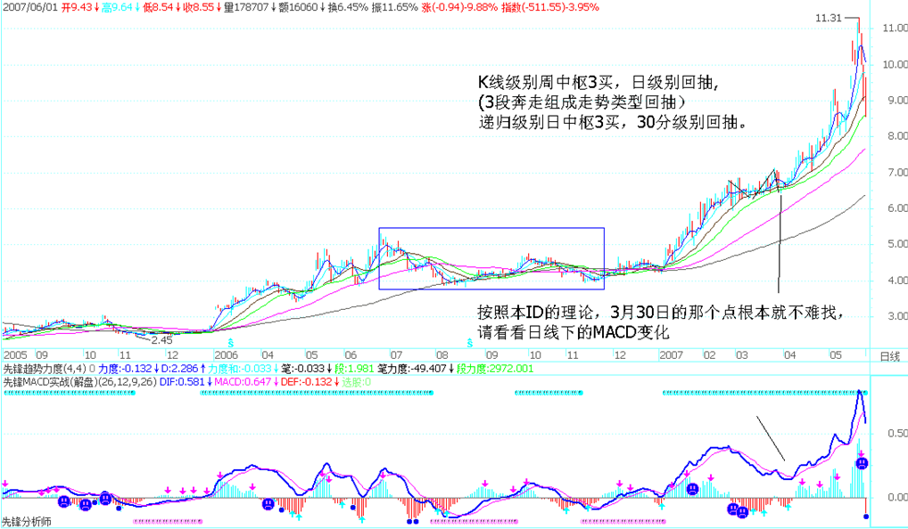

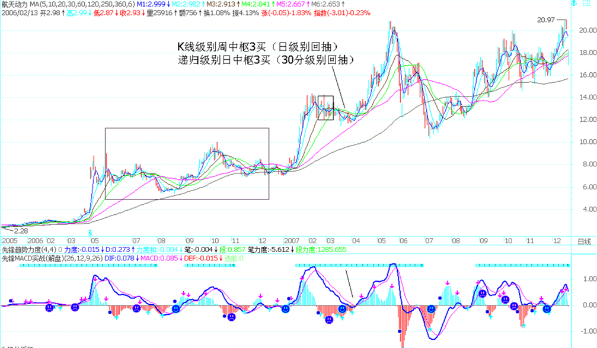

缠中说禅：2007-05-24 15:50:05

请问博主 大盘今天一分图上 10。38 -- 11。16 这段 也没有形成盘整背驰啊？

想这样 11。16 这样的点 该怎么分析？

==

为什么一定要盘整背驰？那只是一种多数的情况。为什么不可以是小级别转大级别。而且参照第一段的中枢，刚好就回拉到相应的位置，而用前面05221100开始的一个大中枢的一个震荡，就更容易判别。

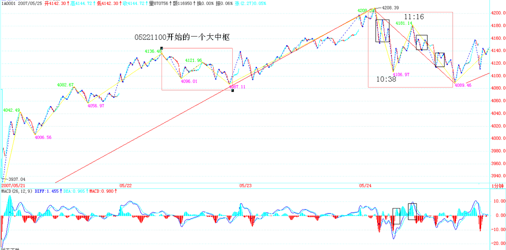

图形是在一个系统里的，必须综合看大下级别的中枢关于当下走势的意义，才有全面的把握。当然，这暂时有点要求高，但必须努力才行。

请远离所有借股票收费者！2007-05-25 08:52:29

上周突破孔男人1/3线后，本ID这里成交屡创天量，比平时6、7千的浏览翻了近6、7倍，这轮行情过后，本ID这里指数上台阶，但也有太多新人加入，人心难免中枢震荡，为此废话几句。

首先，现在来此的多为股票，原来这里是不说股票的，只谈诗赋歌乐、众哲诸子、吃喝玩闹、经济数理等等，但本ID唯一能谋生的就是股票之类的活动，本ID所有资产，都是从市场中抽血收刮而来，虽然十多年前已不再为阿堵物烦恼添堵，但2005年六月后，本ID又重新出来折腾，看着那些忽悠传销之辈到处瞎人正眼、害人财物，本ID也就不能置身度外了。

当然，本ID是谁并不重要，本ID的年龄也无须公开，至于本ID干过什么事情，就更没有必要说了，不过可以100%负责地说，本ID呼风唤雨时，现在市场上99%的所谓人物可能还没解决温饱问题。股票，无论对本ID还是本博客，都是末事，从某种意义上说，股票之类的，不过是本ID接触社会的一个方便途径，如果不在市场上玩玩，那本ID就要与世隔绝了，按本ID现在的年纪，这也太年轻了，这也是05年本ID重新出来的一个原因，之前最多就在网上游逛，那有关人民币与货币战争的帖子就是05年之前网络游逛时随手写的。当然还有一个原因，就是本ID知道人民币升值将带来一轮前所未有的大牛市，比本ID折腾过的都要大，而且，在2001年大盘见顶，本ID休息时，本ID就曾和朋友说，中国今后最大的问题之一，就是中国人是否还是中国资本市场的主人，这也是本ID要重新出来的原因。

对于一般投资者，请远离所有借股票收费者，这是给来这里的所有人，无论是常住还是过客的一个最基本忠告。市场中，真正值得本ID去接触的所谓牛人，有哪个是靠收费出来的？收费那点钱都要吆喝的人，能是什么牛人？有那吆喝收点小钱的工夫，还不如去419一把爽。把自己的身家性命交付给那些自己都不能自保的人，那真是抱团死了。说实在，这世界上最不值钱的就是关于股票的信息，股票本质上就是废纸一张，当然，为关于废纸的信息付钱，比起为关于上帝的信息献身，那还是脑子的水少点。

本ID眼里不喜欢沙子，所以，现在这里人多了，鱼龙混杂，以前这里是不删帖子的，但以后，这里要删帖子了，但只删一类，就是卖广告骗钱的，其余的，爱干什么干什么，本ID一视同仁，如果你骂本ID能心情愉快，本ID也会觉得心情不错。

本ID这里一不收费，二不收徒子徒孙，你是佛，本ID顶礼，别憋屈了自己。本ID这里如空谷，任尔云来风动、虎啸龙吟， 各位不用客气了。来这里，股票只是一个小道，最终如果能小道而大道，那才算有小得，否则只是一场儿戏。非离股票而觅什么大道，如果你那大道连股票都不能折腾一把，那你的是垃圾道。有些人看不得本ID这里写股票，以为这就俗了、堕落了，就是如此之辈。本ID这里横天横地，天堂地狱一把捏，不要画地自囚。

看了一下昨天的回帖，发现对连接同级别中枢的次级别有疑问，注意，这问题以前其实都说过，一个次级别，连接两同级别中枢，这其实就是趋势，所以分解时，那连接的次级别当然要和趋势本身是同向的，否则就不是趋势了。所以，在那图上，（g0d1+d1g1+g1d2）+d2g2+（g2d3+d3g3+g3d4）就是不允许的，因为这两个同级别中枢间有重叠，而且d2g2的方向不对。

刚才看到那老熟人，有如下发言：“很多人都认为中国股市目前已经发展到'全民炒股'，但我的观点是，中国还远未到'全民炒股'的程度。毕竟，现在开户数不到1亿，而且一般都会在两个市场开户，那么差不多只有5000万户。就算一家有三到四口人，那也不过是一亿多人，不到中国人口的十分之一。而在发达国家，这一比率是三分之一甚至一半对一半。”

对比一下本ID四月份的文章“站在市场发展的历史趋势上看，目前这种“全民炒股”不是过分了，而是远远不够。目前国内，无论社会还是个人资产，其中的股票等虚拟资产所占比例，与市场经济发达国家还有着极大的距离，在股票等虚拟资产占到社会与个人总体资产的30%之前，“全民炒股”只能算是初级阶段，必然需要一个大的快速发展，才能满足市场经济发展的最低要求。目前，国内资本市场逐步出现的“全民炒股”现象，不仅符合市场经济发展的内在逻辑，而且具有历史必然性与广阔发展前景。“全民炒股”，使得社会上的任何企业与个人，都可以通过资本市场这公开平台，公平地选择、参与市场经济中最有价值的投资机会，让社会与个人资源得到最公正合理的配置。而在股票等虚拟资产占到社会与个人总体资产的50%之前，一切对于“全民炒股”的指责都是可笑、短视的。”

管理层要逐步统一到这个认识上来，否则要干傻事情。

缠中说禅：2007-05-25 08:53:55

大盘今日分析收盘附上，先下，下午再见。今天大盘没什么可说的，就是在昨天那5分钟中枢上晃荡，周五，由于对周末消息面的犹疑，尾盘只能横着。下周依然只要看这中枢震荡直到第三类买卖点出现。大的方面，还是突破4129的1/2线后的反抽确认活动，没什么特别的。下周很关键，因为涉及月线收盘，月线如果留下长上影，那下月一个弱走势盘整走势就很难避免。如果收光头阳线，那么后面继续强势的可能就很大了。

前面突破3000点时，有人问5浪如何如何，本ID回帖反问，为什么不能是3浪3？当然，本ID的剧本是这样设计的，能否最终完成，这要看很多方面的配合，不是本ID一个人能完全决定的，但从春节前直播上3000点，到319一大早用神州自有中天日，万国衣冠舞九韶发总攻号令，这3之3的游戏，也算有点意思了。不是汉奸说3个月之内回3000之下吗？那就让他在3000下等着吧。

回想319在3000点之下的情况，后面大盘走成怎样，怎么都比那时候要上了一个大台阶了，这个局面来之不易，大家是珍惜的，也希望管理层珍惜，脑子尽量干燥点。当然，管理层也不是一言堂的，所以，一切都是合力的结果，多一个人出力，才可能走出剧本所描画的蓝图。

## 教你炒股票55：买之前戏，卖之高潮(2007-05-28 08:12:41)

人的行为同构性，把性研究清楚，人的行为也就略知一二了。股票买卖，不过是人的行为之一，当然也不例外。这里极为严肃地讨论这个问题。

首先，先给股票定性别，为什么本ID总爱说股票是面首，因为他确实是面首，他是他，而不是她，股票的性别是男的，所以难。难什么？难在高潮之不可持续，高潮之后必有不应。而投资者应该是什么性别，投资者应该是她而不是他，投资者的投资能力就应该如女性性能力般可持续，无不应。以女“性”可持续之洪大去折服男“性”不可持续之弱小，这就是投资之道。

投资的关键就是女性，就是可持续，这与股票本身的男性，不可持续构成了投资中最大的矛盾。投资之道，就是驾御面首之道，就是御男之术，就是采阳补阴之方。采阳，要讲究其火候，火候太嫩，采之难以成丹，太老，同样是废物，如果是阳气外泄，化为污浊之精，则更是大煞风景。股票也一样，太早买入，一阳未生，则纯粹折腾，毫无趣味；待到高潮之刻不能及时采补，则阳气尽去，污精尽泄，烂蛇死鳝，反受其困。由于男“性”之不持续，则女“性”采补之关键，就是要取其精华，何谓其精华？一阳复始采之，阳极阴生弃之。用更通俗的话说，就是买之前戏，卖之高潮。

买和卖，是不对等的，相应的策略也是不一样的，为什么？因为买卖的前后状态是不同构的。在市场里，买是钱换筹码，卖是筹码换钱，钱是与时间无关的，1元，今天是，明天还是，只要还是钱，就是不变的。而筹码不是，今天的筹码价值与明天的就不同，而筹码的数量不变是没意义的，因为最终算的还是钱。而由于时间的不可逆转，因此（钱-筹码）与（筹码-钱）这两个结构，就不是同构的。这道理十分简单，谁都明白，但却是操作逻辑的基础，最基础的往往最简单。

因此，对于一个大级别的买的过程，或者说一个大的建仓过程，买必然是反复的，买中有卖，不断灵活地根据当下的走势去调整建仓的成本与数量，底部区域可以进行最复杂的中枢延伸与扩展，唯一的目的只有一个，取得足够的、成本不断降低的筹码。这不一定和坐庄有关，当然也可以相关。一个大级别的买的过程，某种程度上还兼备着改造这股票股性的任务，而且这也是一条底线，也就是能顺利退出的底线，在这个底部区域的股性改造中，也就是一个前戏的过程，没有好的前戏，不会有好的高潮。注意，底部不一定就是在一个平衡的水平线上中枢震荡，还可以是比较复杂的通道式上升，当然，一般来说，这种通道都是斜率很小的，充满激烈的震荡，具体的以后再说。

一个好的、具有诱人前戏的买，当脱离底部区域时，其成本应该早在该区域之下。而在大级别中枢上移中，只会减少成本，只有最愚蠢的拉抬，才会增加其成本。其后的活动，本质上只是股“性”不断激发，如同蜂王散发那诱惑引发那群雄蜂的追逐，这更如同一个壮观的NP过程，N不断增大，各种裂口、长阳，将这NP活动推向高潮。对于刚脱离底部的股票，第一次的高潮就如同一个淫乱狂欢夜的序幕，只不过是为第二、第三、第四、第五、第六、甚至第10次高潮进行铺垫。第一次高潮后的不应期往往不长，但可能很猛烈，震荡很激烈，不应期中还有继续高潮的冲力。这种股票，就如同刚被开发的面首，只有第二、三次，甚至第四、五次的高潮才会渐入佳境。而一个出色的卖，就是在那大级别高潮的后继乏力、背驰中退出，一个好的庄家或大资金操作者，最好的状态就是在那大级别的最后疯狂中被疯狂的雄蜂把货给抢光了，那种所谓筑平台出货的傻瓜，死去吧。

注意，本ID在上面是否正在进行一个AV的解说，这并不重要，重要的是，股票就是这样每天现场直播着这NP级别的AV。对于一般的散户投资者，在一些较大级别的介入中，例如日线以上的介入中，并不一定都要在第一类买点介入，因为，其后的前戏过程，并不一定是一般的散户可以忍受的，一般地，可以在第二类买点出现后才考虑介入，或者更干脆的，是第三类买点出现再介入。但如果资金有一定规模，需要一定数量的筹码，或者要为以后的猎鲸活动储备经验，一个至少从第二类买点开始利用部分前戏的介入是必须的，其中也要如大资金一样，有利用前戏的震荡降低成本、增加筹码的必要。这有什么好处？最重要的一个好处，就是熟悉其股性，一个前戏都不参与的，怎么可能在后面的N次高潮与不应中得心应手？

性，说白了就那么一回事，所有人的基本运转模式都是一样的，也就是前戏-高潮的模式。股票也一样，其运转的模式，归根结底，就是不同级别的中枢震荡与移动的组合最终构成相应的前戏-高潮模式，都一样，但在一样之中，每个股票都有其股性，涉及频率、幅度、形态复杂度等等，这些，对于每只股票都是独特的，这也就是为什么，依据同一模式展开的走势，却呈现千差万别的最终图形。

读后感：

1、投资之道，就是驾御面首之道，就是御男之术，就是采阳补阴之方。

2、买之前戏，卖之高潮。

3、了解股性很重要。

缠中说禅：2007-05-28 15:37:32

周末没什么消息，憋了两天的能量在今天爆发，所以就搞出一个大缺口来，但其后的走势，并不是太强，依然只是一个平衡市，所以这缺口的吸引力以及该平衡市所构造的新的中枢的引力，使得后面三天的技术压力不可忽视。周四是月线收盘的位置，刚好也是缺口在技术上需要三天考验的时间，所以后面三天，多空的搏杀将极为惨烈。

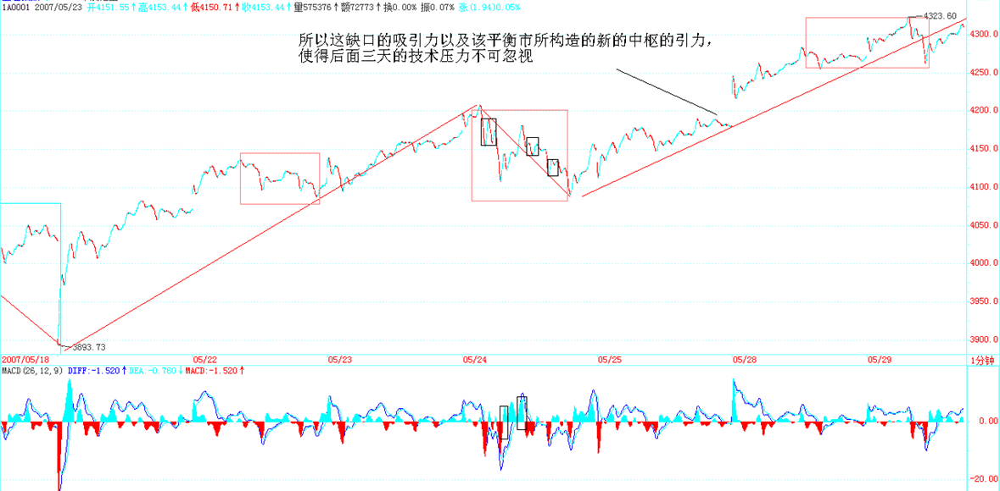

大的方面看，4129点的1/2线在六月份将上移到4144点，该线的突破在日线上的回试确认并不能完全保证周线、月线上的回试确认，从最严格的意义上，在月线上至少需要3个月才能确认该线的真正有效突破。这就像1-3份在1/4线时所呈现的走势一样。当然，最理想，最强的走势就是，5月收光头阳线，六月以下影线的方式是确认该线的突破，七月继续长阳最终确认该突破的完全有效，但这只是最理想的情况，市场最终并不一定能走出来。

政策方面，关于操纵的条例周末已经在报纸上有所暴光，说实话，这条例才是一个真正的狠招，其中有些规定，对市场的格局有严重的影响，在本ID看来，这才是这两年来市场上飘来的真正的第一朵黑云，只是现在市场中散户太多，一般反应比较迟钝，所以没什么感觉。由于该条例只是一个草案，所以还有纠正的可能，下面，真正有意义的事情，就是对该条例进行无情打击，深入揭发，让该条例中严重危害市场的条款不能实施。

如果大盘本月不能收出光头阳线，该条款以及今后几天的一些政策面动态是主要的原因。但大家的心态要平和点，毕竟政策也是市场合力的一部分，他们也不容易，就原谅他们吧。

两年来股市晴空飘过的第一朵黑云

(2007-05-29 08:16:51)

关于《操纵市场指引》草案周末已经在报纸上有所暴光，说实话，这指引若被实施，绝对是针对目前市场一个真正的狠招，其中有些规定，对市场的操作格局有着严重影响，如果说以前加息之类的玩意不过是向烈日的天空吹了口气，那么，这指引，才是两年来股市晴空飘过的第一朵黑云，只是现在市场中散户太多，一般反应比较迟钝，没什么感觉，把一个真正的隐患给忽略了。

先回顾一下历史，2001年股市的历史大顶，就是在亿安科技那轰动市场，空前绝后的近9亿罚单后引发的，当然，市场的最终反应有所迟缓，那是正常的，因为一个突然的事件，让市场有一个理解、反应的过程，是很正常的，别以为市场就能够最快速最充分反应的，市场往往特别地迟钝。

不妨摘抄两条这闭门造车的所谓指引里的无聊条款：

“在一个交易日交易某一证券两次以上，或在两个交易日交易某一证券三次以上，即构成连续买卖。”（“最重要的，按照新的认定指引，没有成交的买卖申报也可以算做连续买卖；再比如约定交易，只要双方买入申报和卖出申报的价格相近，就可以构成该项操纵的条件。”）

==

如果上面句子正描述某面首或者指引草拟者的生理状态，那么本ID没什么意见，但用来规范市场每一个人的行为，那就不行。首先，市场的参与者并不都是面首，就算是面首，也不一定就是一天不能两次、两天不能三次的超级弱男，这条款有超级严重的重男轻女倾向，而且重的还是弱男，简直太过分了。说点实际的，如果你当天要买1万股，结果9元没买着，然后撤单9.01元再买，这就构成连续买卖？或者说，当天要买100万股，分10张单，那就更是连续买卖了？难道买100万股，只能填一张单，还不能撤单，那一定能买到？那么还不如干脆规定每天买卖不能超过多少股算了。难道以后买卖股票都只能每天一单，而且只能一个固定的价位，因为按照这个垃圾指引，在不同的价位填单就已经违规。显然，制订所谓指引的人不仅下半身功能有可疑之处，上半身功能已是无可质疑地极端可疑。

“同一交易日内，在同一证券的有效竞价范围内，按照同一方向，连续、交替进行三次以上频繁申报和撤销申报的行为将被认为是“虚假申报操纵”。”

==

制订这条款的人大概从来没有交易过股票，就算是一个散户，如果一股票突然拉起来，他要去追买，连续三次都买不着都要撤单重新填高价位去买，这种情况难道很不常见吗？此外，这指引不是标榜自己如何如何细化吗？那么什么叫频繁？1秒还是1分钟？如何是1分钟，那么61秒就不频繁了？申报和撤消难道不都是交替的，难道可以不申报就可以撤消？买的申报撤单后难道为了不同一方向，就只能进行卖的申报？这种无聊的指引就如同在某类活动中规定只能男上位一样极端地无耻。

本ID对这类无聊指引的态度很明确，由于这关系到根本的市场交易制度，本ID不喜欢这种规定只能男上位的垃圾制度，因此，一旦这种制度被实施，本ID将彻底离开这个市场。本ID挣的钱，够花天酒地、天天换面首，玩个一百几十辈子了，凭什么受这份鸟指引的鸟束缚？而且世界那么大，全世界的市场都没有这样的垃圾指引，本ID去哪里不一样挣钱？一定要一棵树吊死？或者本ID干脆就转玩文化圈子，把什么孔男人、李男人之类的砸成个面首之膜简称面膜算了。

更重要的问题是，这个无聊的指引，最终必然堕落为权力寻租的有力工具，指引越细化，这工具越有力。说实话，这些破指引，最终都是杀鸡给猴看，和本ID都毫无关系，你说狮子、鳄鱼会看这类把戏吗？不过，本ID看不起这种无聊游戏后的无聊勾当和无聊后果，这种无聊把戏为了什么，这就更不用本ID说了。

由于该条例只是一个草案，所以还有纠正的可能，下面，真正有意义的事情，就是对该条例进行无情打击，深入揭发，让该条例中严重危害市场的条款不能实施。别以为这事情和散户没关系，你看看你自己平时的操作中，有多少次违反了上面的规定？还有更多更无聊的规定本ID都没有援引，上面这两条一般化的已经够恶心的，本ID都不想把各位恶心掉了。

当然，必须明确的是，黑云不等于一定有暴雨，但黑云晃荡在这明朗的天空中，确实够恶心。而即使在这种交易条件下，本ID的理论依然有效，只是相应的操作级别必须大幅度提高。站在纯技术的角度，管他什么风什么雨，一切尽在操作中！

但本ID还是不得不提醒，股票都是废纸，如果你在股票中已经获得利益，那首先去改善自己的生活条件，去孝敬那些值得孝敬的人，本ID看到昨天帖子的有博友“白玉兰”说拿钱出来买房子给父母，那就是很好的事情。赚钱不花，当守财奴，脑子有水呀？先把自己以及家人的生活安置好，把本金拿出去，用股市挣的钱继续股市的游戏，这样无论那天空有多少黑云，多少风雨，你都可以毫无顾忌了。

但无论如何，中国大牛市的格局是不会因此改变的，而荒谬的东西，也是不可能真正实施的。

缠中说禅：2007-05-29 15:31:36

离月线收盘还有两天，这两天极为关键，今天全天在昨天的中枢之上，因此技术上没有任何问题。今天走的是前三个30K的高低点都被打破的平衡市，明天要考验4323点早上高点的支持，如果不有效跌破该位置，大盘就超强，跌破，则形成新的中枢，该中枢基本以4300点为中线，然后又是中枢震荡直到第三买卖点出现的游戏。

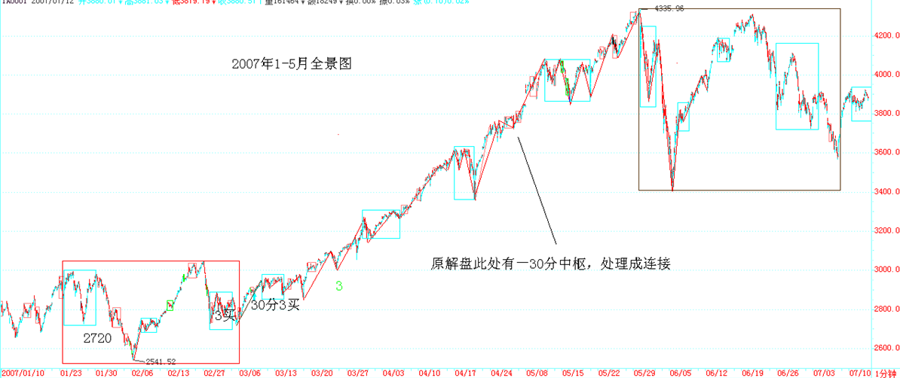

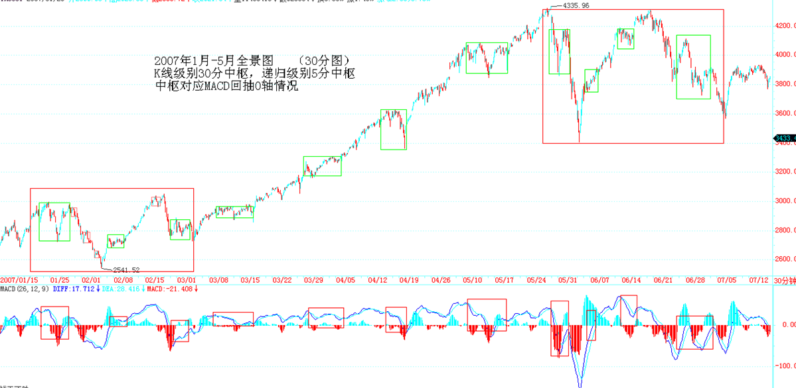

前面已经反复说过，本ID的剧本是3之3，是否能最终成功，需要各方努力，这其中一方面，就对任何对市场有损害的东西，一定要及时全面地回击，例如昨天的解盘以及今天的文章，主要的目的就在此。如果人人都不说话，那么有些恶果就要种下。当以后品尝这些恶果时，就不要后悔当时为什么不一起努力把这恶种子给废了？市场是大家的，不是本ID一个人，也不是管理层的，恶草就要拔，这样市场才可能如剧本般发展下去。

刚才看了看回帖，有人觉得本ID要逃跑，还看空。真不知道这些人的语文是怎么学的。本ID哪个字说了要逃跑了，本ID说如果那东西成真了，本ID就不玩了，但那东西现在成真了？关键在于，那东西是否成真，是合力的结果，本ID的意思很明显，就是要一起来让那东西给废了。本ID早上还担心有人理解错误，9点还专门上来加了红字的一句：

“但无论如何，中国大牛市的格局是不会因此改变的，而荒谬的东西，也是不可能真正实施的。”

知道孔子为什么是孔子吗？有一条就是最重要的，明知不可为而为之，现在，根本不存在不可为的前提，为什么不一起努力？剧本写好了，也要人来演的。

从容面对突发事件是投资的基本素质

(2007-05-30 06:53:34)

本ID虽然在大牛市的序幕，还未真正拉开说过，“5月，是1429点以来的180个月，360的一半，一个极为重要的时间之窗，其后，不发生点事情，显然是不可能的”；虽然前天已说过：“在某一级以上的，今天应该已经收到一些东西，具体的本ID不能说，内容当然也是和调控股市有关的，估计这几天就会出来了”，昨天更劝告“如果你在股票中已经获得利益，那首先去改善自己的生活条件，去孝敬那些值得孝敬的人，...赚钱不花，当守财奴，脑子有水呀？先把自己以及家人的生活安置好，把本金拿出去，用股市挣的钱继续股市的游戏”，但本ID绝对不会说关于早已传闻的印花税增加在今天凌晨公布的准确时间，本ID已事先知道。

显然，这事情公布的最终确认就在昨晚，所以各位也没必要拿23日管理层的澄清说事，更不能说管理层朝令夕改，毕竟30日和23日已经相隔一周了。这种凌晨才发布的消息，在中国证券历史上也算开先河了。这里，首先必须表扬管理部门目前的操作程序与保密级别上比以前有了很大的进步，这对市场的所有参与者更加公平；其次，这政策本身也符合目前管理部门的认识水平；最后，收到的钱应该多照顾几个该照顾的人，这也算是大牛市对全中国贫苦人的一点贡献。所以，对该政策，本ID没什么意见，该来的都要来的。至于政策市这样的帽子，本ID觉得没必要给他们戴上，毕竟，提高税收，并不是中国才有的事情，这比那什么指引要强10000倍，那才是本ID最反感的。

好，现在回到具体的操作上。首先必须再次明确，要改变大牛市性质的只有经济的倒退，否则都不过是造成市场不同级别震荡的诱因，一个正确的操作，足以应付。其次，面对突发事件，仓位、成本控制比较重要，这也是本ID为什么反复强调股票是废纸，必须成本为0的原因，因为突发事件，本来就是市场中不可避免的，一个良好的操作习惯，足以应付任何突发事件，一个成本为0的筹码，是应付突发事件最好的工具。

在投资市场上，必须大气点，无论这次震荡的级别有多大，你走了没走，都不过是一个小事情，走了不是胜利，没走也不是末日，关键的是你正确的操作习惯与长期的坚持。1996年12月，连续的跌停后，市场最终5个月后依然重新创出新高。1987年的美国股市大跌，在现在看来，只不过是在山脚上的一次小颠簸。从容面对突发事件，这才是投资的基本素质。

技术上，这几天反复强调的月线收盘将引发多空相争的惨烈，当然也包括政策面这市场合力之一。相应的分析依然有效，如果月线留下长上阴，则6月份调整压力就大了，显然，管理层也知道这技术上的意义，在这最关键的最后两天出手。这里，必须表扬一下管理层，不像以前一样一点技术都不懂了。站在大的技术层面，本来那关键的1/2线就需要更多的考验，该线将至少影响3个月走势的结论依然有效，而那三种模式的选择，现在依然没有最后确认。这里无须预测什么，看图操作就可以。

本ID知道，昨天有人看了本ID的帖子阴错阳差就清了仓的，有些把本金拿走了，这都很好，虽然这里有点阴错阳差，但也算孝顺者得好报，这和本ID无关。至于仓位依然比较重，如果一直从低位守着均线等上来的，有足够多的利润空间，特别成本已经是0的，就更无所谓了，只要按正常的操作，无论什么情况，就算没在第一卖点走，也可以在第二、三卖点走，这没什么难的。至于最近追高买股票的，那就得一个教训，然后才能刻骨铭心地记住本ID的话：股票都是废纸，必须选好级别买点买、卖点卖，把成本降为0，只有成本为0的股票才是真正安全的。

由于以后的交易成本大幅度提高，因此相应的操作级别必须大幅度提高，最低的操作级别至少是5分钟甚至30分钟以上，至于按买点买、卖点卖的原则永远不变。有了相应级别的买点，就要重新介入，这一点是没什么可说的。短线技术上，30分钟上本来就形成的顶背驰段的区间套确认极可能因为这突发事件而被粗暴地确认，以此为起点，参照其后相应的当下走势，去逐步确认今后的买卖点进行相应的操作。

至于本ID的仓位，可以很公开地说，除了永远保持的协调应急保证金，目前大概是70%仓位成本为0的老股票，还有5%是新建仓的新股，其余25%都是现金。这两天本ID的减磅也有点阴错阳差，但都不是为了这印花税，小部分是技术上的原因，大部分是为了那可恶的指引，当然还有一点是为了本来知道也和各位暗示过的一些消息，当然，那些消息的力度与印花税的这个不可比较。本ID的观点依然如故：除非那可恶的指引被实施，否则本ID不会走人，至于减磅这种活动，只要有卖点，本ID都会参加的，只是数量多少的问题，但本ID会在适当的买点重新买入。

最后，把昨天的话重申并延伸一下，这也是本ID的一贯态度：但无论如何，中国大牛市的格局是不会因此改变的，震荡级别越大，不过提供降低成增加筹码的机会越大。至于本ID一直设计的剧本，依然没有任何放弃和修改的理由，因为3之3已经走出来，这一段已经比上一段的1500点要长了，符合最严格的理论条件，至于能否走得更长，那并不重要。更重要的是，这个剧本已经给在2000多点开始的参与者带来巨大的回报，这个回报已经锁定，成本已经为0，谁都抢不走，而这，又是展开新一轮行情的能量储备，该来的，必将要来，现在需要的，只是等待买点的出现。

缠中说禅：2007-05-30 06:56:09

管理层加班，本ID也不能闲着。7点半有一个会议，所以花了十五分钟把帖子写好放上来。

先下，下午收盘后解盘，再见。

缠中说禅：2007-05-30 15:38:29

从今天的走势，就知道为什么本ID的理论里要分第一、二、三买卖点。例如像今天这种突然的事情，可能让第一卖点给错过了，但第二卖点是不会错过的。因此早上本ID专门提醒第二、三卖点走，实际图形上，如果你认不出05300947这个第二类卖点，或者知道没操作，那么学习就比较失败了，还要努力。本ID的理论是实战的，在第二类卖点走，即使不知道什么消息，和高位比也差不了多少，有些股票今天还新高，可以对照不同股票的图形感受一下第二类卖点在这种突发事件中的实用之处。

对一个操作者来说，不要这么多抱怨，第二类卖点不走，那就是节奏错误，那后面就没有资金等待买点，不过，市场的机会多了，经历一次这样的，也会得点经验。这30分钟的顶背驰压力，怎么都需要一个至少1分钟的底背驰才能有比较有力度的反弹，而且还要参考5分钟、30分钟等的走势。真正的底部构筑，必须让这些级别的图形重新走出买点来。

长线看，本ID说那1/2线，还是对大盘有着极大的吸引，深圳对应的线在13700点，没有突破，因此，上海对该线的走势就更有指导性。5月份这180月时间之窗的压力，同样构成了今后行情发展的最主要技术压力。目前的调整是针对2月6日2541点上来1800点上涨的，这是必须明确的。

从中枢的角度，一个30分钟顶背驰，按理论的要求，重新拉回5月8日到5月21日构成的30分钟中枢，因此，可以继续参照该中枢来考察今后的中枢，可以中枢震荡的观点进行。

对于短线有能力的，可以参照短线指标回补第二卖点卖掉的股票，然后进行中枢震荡操作。本ID的所有观点，没有任何变化，就不多说了。

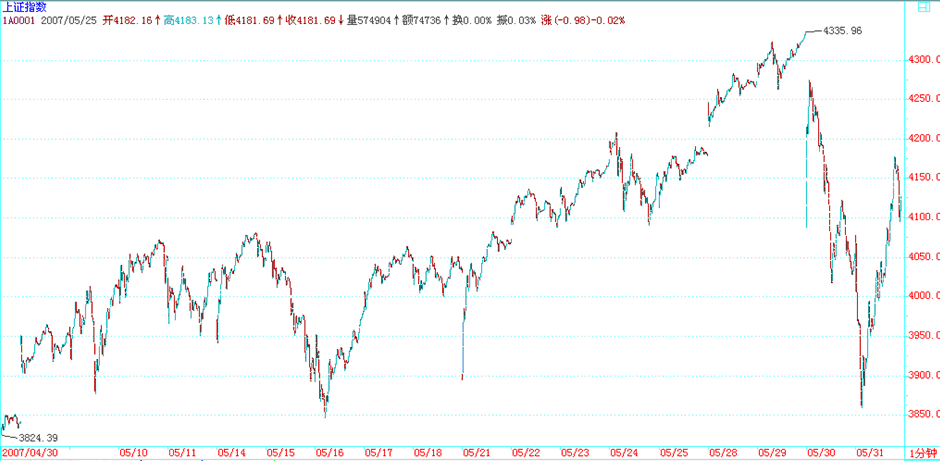

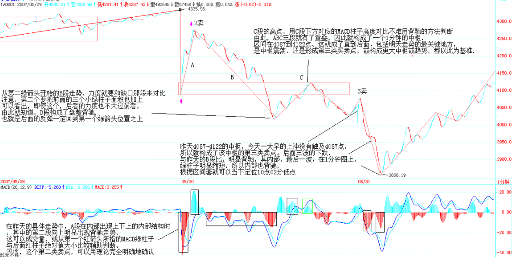

## 教你炒股票56：530印花税当日行情图解

(2007-05-30 22:49:10)

本来不想说股票的，但知道现在说其他，大多数人也反应迟钝，被股票所迷惑了，所以还不如将错就错，就继续股票一把，说说昨天这530印花税当日行情如何去当下地分析。

本来这个问题十分简单，而且本ID一大早7点不到就发帖子提醒要在第二、三卖点把仓位减掉，很高兴看到不少人都能发现9点48那第二类卖点。注意，为什么同时强调第三类卖点，因为有些特别弱的股票，可能就是一个第三类卖点，大盘的走势是一个平均走势，而且当天比很多个股都强，所以大盘是第二类卖点，并不意味着个股是第二类卖点。

很多人大概到现在都不明白为什么本ID的理论中要有三类卖点，其实，第二类卖点除了在小级别转大级别上比第一类卖点优越，在一些特殊的突发情况下，就是最佳的卖点。例如这次，就是一个很好的例子。因为529那天，虽然30分钟明显进入背驰段，但由于当天尾盘是高收的，所以用区间套定理并不能确认当时就是背驰了，毕竟还有第二天的走势。而晚上的突发消息，使得这个背驰被立刻确认，这时候，第一类卖点已经不可能在实际操作中存在，那么，唯一可以进行操作的，只能是第二或第三类卖点。这，在开盘前就可以有一个确定，也就是说，一旦大幅度低开，现实的、能被理论完全保证的卖点就是第二类或第三类卖点。

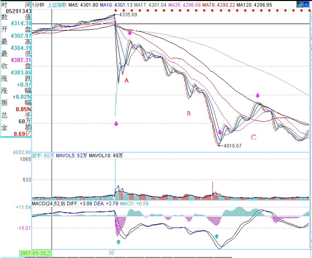

上图就是昨天走势的1分钟图。缺口，被看成最低级别的，而1分钟以下级别，在1分钟图上，被看成没有内部结构的线段，所以缺口和1分钟以下级别在1分钟图上是同级别的。图上绿尖头都指着两个1分钟以下级别的分界点，两相邻绿箭头之间都是1分钟以下级别的走势类型。其中B段，看似要形成3个1分钟的中枢，但由于每一个的第三段其实都是向下倾斜下去的，其实都是第二段向下的一部分，不能算是形成中枢。昨天走势其实就这么简单，就是5个1分钟以下走势类型的组合。

显然，这第一段的1分钟以下级别走势类型是以向下缺口的形成构成的，根据第二类卖点的定义，就知道，一旦一个1分钟以下级别的向上过程不能创新高或背驰，都将构成第二类卖点。因此，当图中A段走势出现时，一个构成第二类卖点的走势就当下地形成中。

有人可能有疑问，那怎么知道这A段一定构成第二类卖点而不是直接创新高强烈上升，这很简单，具体的方法和区间套定理是一样的，就是看A段的内部结构，一旦内部出现背驰而当时位置没创新高或与前面走势产生盘整顶背驰，那么就一定是第二类卖点。在昨天的具体走势中，A段在内部出现上下上的内部结构时，其中的第二段向上明显出现背驰走势，这可以成交量，或从第一个红箭头所指的MACD绿柱子与后面红柱子绝对值大小比较辅助判断。因此，这个第二类卖点，可以用理论完全明确地确认，一点含糊的地方都不会有。如果当时当下不能明白，那就要抓紧学习了，因为这个问题确实太简单了。

第二类卖点后，从第二绿箭头开始的B段走势，其力度就要和缺口那一段来对比，比较MACD上两个红箭头指的绿柱子面积，注意，第二个要把前面的三个小绿柱子面积也加上，可以看出，即使这个，后者的力度也不大过前者，由此就知道，B段构成了盘整背驰，也就是后面的反弹一定回到第一个绿箭头位置之上。（注意，这里是1分钟以下级别的力度对比，只需要比较柱子面积，如果是1分钟级别的，就要同时考虑黄白线回抽0轴的情况。）而后面C段的走势也证明了这一点。此外，C段的高点，用C段下方对应的MACD柱子高度对比不难用背驰的方法判断。由此，ABC三段就有了重叠，因此就构成了一个1分钟的中枢，区间在4087到4122点。这就成了直到后面、包括明天走势的最关键地方，究竟是中枢震荡，还是形成第三类买卖点，进而构成更大中枢或趋势，都以此为基准。而这是被理论所当下严格保证，毫无可以含糊的地方。

有些更细致的地方，其实还可以说的。例如，C段的高点，没有重回B段内部最后一个反弹的启始位置，这并不违反理论，因为在B段内部，最后一段向下并没有背驰，他的转折，完全是小级别转大级别造成的（由于级别太小，可以从柱子的缩短参考看出），这自然就不一定能回到最后一个反弹的启始位置。而在B段内部，从绿柱子一个比一个面积大，就知道前面的向下都不会形成背驰而使B段结束，因此就可以当下地等待最后跌破A段低点，形成B段与缺口段的盘整背驰。这个例子说明，一个大的盘整背驰段的内部结构，完全可以不必有该级别的背驰，完全可以小级别转大级别，昨天的图上就有这样一个标准的例子。

实际操作中，第二类卖点后，B段盘整背驰造成的买点是否要参与回补，这和你的操作级别有关，如果是股指期货，这对应的是100点的空间，当然是可以参与的，但由于T+0，而且现在交易成本提高了，对于股票是否参与，这就与你实际操作的股票有关了，这必须根据自己的情况灵活处理。但只要你明白了小级别的情况，大级别的操作是一样的，而且大级别的安全性、可操作性更高，操作的频率也更低而已。本ID说这里的例子，只是让大家对理论能更清楚地了解。

读后感：

1、二类卖点在突发事件中的作用。

2、中枢振荡中作差价是缠论的天堂。

缠中说禅：2007-05-30 22:54:41  [举报]

明白了上面的文章，今天的走势如果都不能把握，那就要继续加班学习了。昨天4087-4122的中枢，今天一大早的上冲没有触及4087点，所以就构成了该中枢的第三类卖点。后面三波的下跌，与昨天的B段比，明显背驰，其内部，最后一波，在1分钟图上，绿柱子明显缩短，所以内部也背驰，根据区间套就可以当下定位10点02分低点。这是本ID理论中最简单的技术的，如果今天没能这样的分析的，请好好研究补习。

后面的反弹，如本ID所指出的，第三卖点后不趋势就构成更大中枢，所以现在原来的1分钟中枢已经扩张到5分钟中枢。区间是4015点到4122点，后面就是该中枢的震荡直到第三类买卖点出现。就这么简单，一点难度都没有。

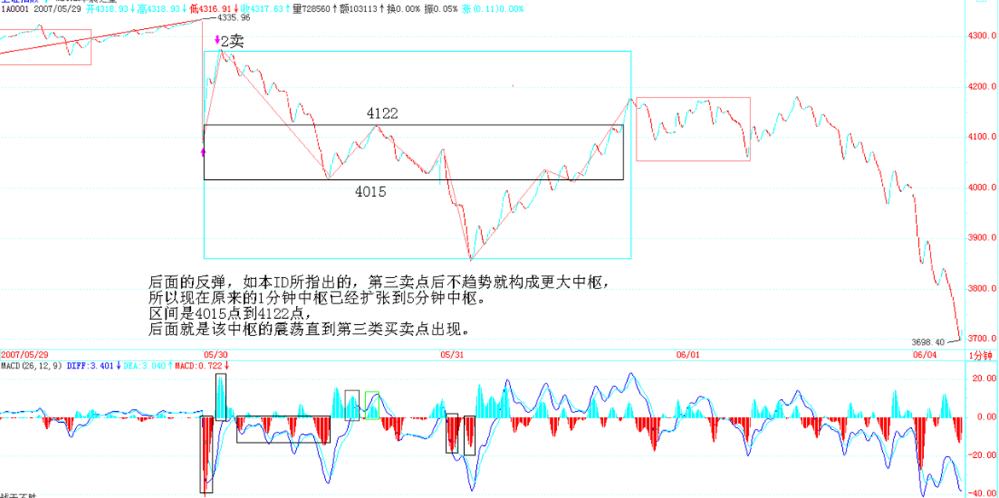

大方面看，本ID反复强调的1/2线，依然是最重要的位置，大盘的强弱，以此为标准。目前，该线刚好在这次大震荡的中间位置上，由此就知道该线的意义有多大。在5月初的文章里已经明确说过，该线至少要管大盘3个月，这观点不变。

今天的月线收盘，已经足够好了，至少上影线不太长，比最恶劣的倒T要好多了，因此下月，至少有了很大的画图回旋的余地。注意，最近的行情，又将以质优的一、二成分股为主，三线股一定要等到大盘基本稳定下来，才会慢慢恢复元气。但明天和周一，今天反弹比较弱的，会逐步表现，这和轮动是一个道理。

明天是周五，消息面又成了最大的心理压力，整个市场震荡要稳定下来，要等到下周了。当然，这种大幅震荡，就是本ID理论的天堂，在这里可以得到比单边更大的利润。注意，别以为本ID的理论只会震荡，而是该震荡的时候震荡，该单边的时候单边，这都不明白，就白学了。

缠中说禅：2007-05-31 16:17:53

老大，为什么中枢不是4027-4077啊？

==

先把中枢的三段搞清楚，提示一下，昨天的C段是这种分解的新中枢的第一段。当然，可以按照另一种分解去定中枢的位置，那么谈论就要按那种分解说了，这样，本ID的讲解就太长了。关于这问题，本ID不是已经专门示范过？请参考课程。（注：指定位ABC中枢，后面为中枢震荡，比较力度）

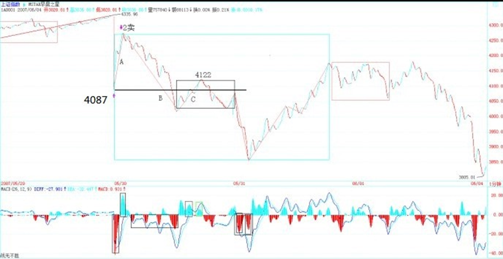

## 教你炒股票57：当下图解分析再示范

(2007-05-31 22:35:44)

部分由于管理层的夜半歌声，本周已经说了4天股票，本ID就来一个大满贯，再说一天，不过下不为例，天天说股票，一周说5天，各位不审美疲劳，本ID也烦了。

看到很多人还是发蒙，因此，就用这两天的1分钟图，继续说说怎样进行图解。当然，这些图解都是可以当下进行的。今天看回帖，好象有人希望本ID在什么QQ上即时发布什么提示之类的，这绝对不可以，QQ对于本ID来说只是用来419的，用来说股票也太浪费了，而且，本ID那4小时是天王老子都不能打扰的，说句不太客气的话，本ID的资金，大概比来这里所有人的资金之和都多，本ID忙着上QQ，出问题了谁负责？所以，最多就这样形式了，很多事情，还是要靠自己多练习，本ID最多就是一个陪练的。

必须要再次强调，不熟练的投资者，一定不能全仓进行操作，基本的仓位应该拿着中长线的股票，部分仓位可以用来练习，否则全仓操作，一旦来几次半生不熟的折腾，到时候连本都没了。而且一定要注意，卖点是在涨的时候出现的，不是追杀出来的，如果你砍了地板价，那一定不是在卖点上。只要是赚钱的，就没有卖错，宁愿卖早，不要卖晚。如果卖错了，就不看这股票，除非有新的买点。

还有，有人误解，认为本ID的方法就是拼命弄短线，这些人大概是跟孔男人学的中文，所以就这水平了。用本ID的方法，如果你选择年线级别操作，那比巴菲特还巴菲特，大概一个年线的买点后，至少到等几十年才有卖点，你就拿几十年吧，就怕你拿不住。还有，如果你是按周线级别操作，那这两年，至少指数上你根本没有卖点。至于按30分钟操作的，在一个30分钟第三买点后的中枢上移中，如果这上移是从10元开始，只要不形成新的30分钟中枢，那么就算到了100000元，你还是要拿着，为什么？没有卖点。所以那些说学了本ID理论就拿不住股票的，自己好好反思一下，究竟你学了什么？闲话少说，看图解图。

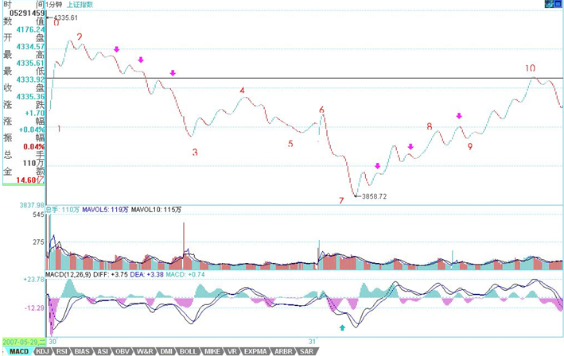

对着图，首先要确定最小分析级别，也就是说，这级别以下的都可以看成是线段，而站在最小分析级别的角度，每一线段就是其次级别走势类型，三个线段重合部分就构成最小分析级别的中枢。

当然这些线段本身，可能都属于不同级别，这问题在前面已经说过了。例如本图，最小分析级别先规定为1分钟级别的，所以所有1分钟级别以下的，都是线段，在图上标记着数字，所有的[N，N+1]，都是线段。有人可能要问，01段是跳空缺口，23段上上下下，很复杂，怎么都是线段？因为这都不是1分钟的走势类型，里面没有1分钟的中枢，所以都是1分钟以下级别的，虽然缺口是最低级别的，当然比23段这种要低级别，但在1分钟级别显微镜下，没有区别，都可以看成是没有内部结构的线段。当然，如果你要考察23段的内部结构，也是可以的，但那就不是站在1分钟级别的基础上了。

由此可见，上图可以看成是10段线段构成的，线段中的波动，至少在分析1分钟级别的角度，就是可以忽略不计的。这里有一个地方是可能有疑问的，在23、78段5个带绿箭头指着的地方，似乎可以看成是一线段，但为什么没有？因为在这似乎是三段的结构中，第三段的都太微弱，把图形缩小后几乎就看不到了，对比一下89段带绿箭头的地方，这第三段就明显不同了，所以这是一个1分钟以下级别的上下上结构，而前面的不是。当然，如果你一定要说78段那箭头的地方很明显，那么78、89就合成一线段的上涨趋势了，这也可以，只是如果你是按这个标准的，那么所有和78段箭头位置微弱程度一样的，都要这样处理。本ID还是按图上的标记线段。

线段有了以后，一切都好分析了。当然，在当下时，例如在今早9点30分钟，是没有后面的线段的，但线段的标准，是一样的。你可以很精细地分析56段，是一个上下上的内部结构，其中下一段是跳空缺口，但无论如何，这就是一个线段。不过，由于前面12、23、34构成的中枢只有1分钟级别的，那么其构成第三类卖点的次级别就是1分钟以下级别的线段，这时候，就要考察一个有上下上结构的1分钟的次级别结构了，而56段显然符合这个结构，有明显的上下上，而45段也是符合1分钟次级别的要求的，注意，当考察1分钟的次级别时，就不能笼统地把所有1分钟以下的都看成1分钟的次级别了，因为这里的视点已经不同。显然，这个的45、56，就构成了标准的次级别离开中枢与反抽中枢，而这1分钟中枢的区间是[4087，4122]，而56段只到了4077，所以这就是第三类卖点了。

当然，在具体操作中，还可以特别精细地去分析这个问题，56段里的上下上，后上对前上的力度，从下面对应的MACD的柱子面积比就可以判断出不足来，因此这里就有很小级别的背驰，这都可以用当下分析的，当然，这样的精确度，需要操作者十分熟练并且反应与通道都十分快，并不要求每个人都有这个可能，这里只是进行分析，对大的级别，道理是一样的。

同样道理，67段里的内部结构下上下，后下力度也比前下弱，这从下面红箭头所指两绿柱子面积的对比就可以知道，所以这内部就有了背驰。注意，这67中的上，幅度上也很微弱，但时间比较长，是一个小的时间换空间的反弹，所以是可以看成一个上的，更重要的是，这上使得绿柱子回缩到0轴，这就更证明了这是一个不能忽视的有技术分析意义的反弹。

当行情走到6点时，34、45、56这三段，就可以看成是一个1分钟中枢了，当然，这种分法和原来[4087，4122]中枢的分解不同，但站在多义性的角度，这是绝对符合结合律的，当然是一个分解的方法。这分法，就使得23、67成为这中枢的一个震荡，从而可以用力度的方法来发现背驰。对于23、67下所有绿柱子面积之和，显然后者小，所以就知道，67只是针对[34、45、56]中枢的一个震荡，必然至少回抽中枢附近，而对67内部用区间套的方法进行精确定位，具体的看上一自然段的分析。按这种方法，7那买点的把握，就是很简单的事情了。注意，这都是可以当下分析的，根据当下的走势，自然就能把握。如果那7当成是第一类买点，那么9就是第二类买点了，这符合次级别上，次级别下，不创新低或盘整背驰的定义，对比一下2点和9点，一卖一买，都是第二类的。当然，在78里，其中的下也是一个第二类买点，但该买点的级别比9这点要低。

显然，这10个线段，已经组成了一个更高级别的5分钟中枢，结合方式如下：（12+23+34）+（45+56+67）+（78+89+910），该中枢的区间是[4015，4122]。这一点其实由6这个第三类卖点的存在以及后面的背驰，就可以知道，这中枢级别的扩展，是必然的。

注意，这是为了示范才分析1分钟的图，这类图是最复杂的，一般来说，级别越大的图越简单，而操作上，技术不好，通道不好的，一般不用1分钟的图，把级别放大点，这点必须明确。

读后感：

1、图解中的线段标准与后面引入的标准，不太严格。

2、中枢级别递归的示例。

缠中说禅：2007-06-01 15:47:14

今天的走势就是[4015，4122]的中枢震荡，至少指数是不难看明白的。周五出现这样的走势很正常，各种心怀鬼胎的到处散播这消息那消息，散户当然如惊弓之鸟了。但今天的走势，对今后是有利的。这次的问题并不在于国家公布了什么，而是其公布的手法，如此手法，必须得到严惩，一个最直接的压力必须让用这种恶劣手法的人承担：一个骂名。周五开始，舆论将逐渐转向，一轮新的反思将开始，注意，管理层也不是一言堂。还要注意一点，这两天同时公布的是财政部国债的发行，所以，经过这次风险教育，应该能分流些人去买国债了。

不过散户确实需要有点教育，前段时间，不是有人叫嚣散户已经统治市场了？但跌两天，散户就蔫了。大资金永远都是市场的中流砥柱，没有大资金，没有这几天的聚会，像这几天北京股的走势能出现？看那些企图限制大资金的政策还出不出？有些大资金，那些管理层换了几茬了，依然屹立不倒，不断壮大，这些脑子进水的政策，除了害散户，能害得了谁？周末，这样的局面，就让管理层去收烂摊子，如果他们还喜欢这边打压，后面又来救市的游戏，那就玩吧，这种游戏已经10几年了，真正的牛人，只会在这种游戏中越来越牛。

但对于散户，这几天确实心里压力大了点，但这其实也没什么，本ID前面反复提到这样的典故：96年连续3天指数跌停，后来还创出新高。所以，那天公布消息，本ID一大早7点不到就上来，告诉一定要在第二、三类卖点卖掉，没卖的，那就算了，到今天还卖什么？大反弹是必然有的，以后的位置一定比这个位置高，关键是该走的时候，就不要有幻想。

注意，那种杀已经跌了30%，去追买不跌反涨的所谓强势股，知道有补跌这种概念吗？在混乱的市场中，更应该专一。可以很理性地讨论这个问题，一个股票下跌40%，第一次反弹回20%，出一半或2/3，下来再买回来，在一次反弹上去，基本走的位置，就和没跌的时候差不多了，如果你现在有资金，在一股票下跌40%时补仓。这股票又不是什么被查庄股，那么，这种的操作基本风险很小，如果技术再好一点，看准一些买卖点，那么基本就等于高位走掉了。当然，以后再碰到这种情况，一定要在第二、三卖点出掉，那天，有多少人辜负了本ID7点不到就上来发帖子？

缠中说禅：2007-06-01 15:47:30

其实，纯技术上，现在的大走势并不坏，六月的调整没什么可说的，本ID那1/2线，现在也在4144点了，下面，这次上涨1/3的位置在3734点，这位置是第一支持位。没有特别的事情，这位置有很强支持。否则就要考验一半的位置，3434点。但至少现在，没有任何看到该位置的理由。

从短线上看，还是[4015，4122]的中枢震荡，有技术的，继续按这震荡操作。下周最大的机会，就是暴跌个股的大反弹，特别注意那些下跌到年线、半年线等关键位置的个股，这些反弹的力度会厉害点。

大浪淘沙，能从容面对本周情况的，是你投资生涯重要的一课，好好珍惜、体会。周末，腐败去吧。

必须建立与资本市场发展阶段相适应的监管、调控体系

(2007-06-04 07:53:44)

上周五，在每日3点后都附录在当天文章教你炒股票57：当下图解分析再示范后的解盘中，本ID明确指出：“周五开始，舆论将逐渐转向，一轮新的反思将开始，”、“周末，这样的局面，就让管理层去收烂摊子，如果他们还喜欢这边打压，后面又来救市的游戏，那就玩吧”这几天舆论的发展，特别是周一几大重要传媒统一口径的文章都证明了本ID判断的正确。为什么本ID能如此判断，很简单，和管理层打了十几年交道，他们脾性还能不熟悉？当然，本ID也有所谓的消息来源，但本ID的判断还是早于消息的。消息，归根结底只是辅助与证明。不过，这鲜活的例子里却有着值得深思的地方。

虽然本ID在5月初已明确指出“5月，是1429点以来的180个月，360的一半，一个极为重要敏感的时间之窗，其后，不发生点事情，显然是不可能的”，而且4341点，2月6日2541点上来1800点本就构成强大的技术调整压力，但像5月30日这样依然重复十几年来用“政策市”对市场进行人为干预的做法，是值得商榷的。这再次表明，与资本市场发展阶段相适应的监管、调控体系依然未被建立。而没有成熟的监管、调控体系，没有成熟的市场管理者，就不会有真正成熟的市场与市场参与者。

且不说在市场交易费用不断下降的世界潮流下大幅增加投资者交易成本是如何短视并将对中国资本市场发展造成多大损害，就说在一个不恰当时间发布一条如此重要的政策变动，其严肃性与谨慎性显然要被严重质疑。这里涉及管理者与投资者关系的深层次问题，两者不是主仆、不是父子、更不是不共戴天的仇人。市场各方归根结底都是市场建设者，其地位在法律面前一律平等，投资者的违法行为应受到严惩，而管理层也不例外。和谐社会，市场管理者与投资者更应该学会和谐共处，多沟通、多了解，都不应该把对方当成对手，甚至玩伏击、搞暗算。这一点与个人实际的操作效果无关，虽然本ID不曾为这种伏击、暗算给伤害，但这是个人能力问题，而市场的整体是被伏击、暗算了，这才是问题所在。

即使是一件好事，如果所用手法与时机选择有问题，其效果将适得其反，而监管与调控，无论对市场违规与违法行为采取多么严厉的措施，但都有一个最基本的底线，就是不能打击投资者的信心。市场管理者更应该明确自己裁判身份，不能人为去干预比赛进程，甚至成为其中的一员参与比赛。不能多头管理、政出多门；任何对市场有影响的政策、言论，都必须由统一的部门进行协调、制订、发布、实施，任何政策的制订、发布都应该有一套规范、透明的程序，尽量杜绝人为的非系统政策风险；监管与调控应该以科学发展观统领，切记情绪化、短期化，这是投资者信心的最大来源。否则，管理者的行为都情绪化、短期化，又如何要求投资者的行为不情绪化、短期化？此外，监管与调控是有本质区别的，一个成熟的市场管理者，必然是重监管，少调控，甚至不调控，一个以调控为主的市场不可能成为一个成熟市场。如何逐步加大监管的比重，并尽量杜绝调控市场的冲动，这是市场管理者走向成熟的关键所在。

中国资本市场对社会发展的影响将越来越深远，原有的监管与调控体系已不适应中国资本市场发展的现实需要，当务之急，是必须建立与资本市场发展阶段相适应的监管、调控体系。对市场进行监管与调控的最终目的，只能有一个，就是发展市场而不是要摧毁市场。中国经济的转型与发展决定了中国资本市场必须发挥应有的、不可替代的历史作用，任何违背这一大方向的行为，都将负有不可饶恕的历史责任。在资本全球化的大趋势下，国内资本市场的稳定与安全，是和国防有着同等重要的大事。本ID在5月初所指出的1/2线不仅有技术上的含义，还是新旧两种运行模式的分水岭，其中最重要方面就和监管、调控的模式能否与时俱进密切相关。如果说上市公司的业绩提升为市场的发展提供了足够的基本面支持，那么监管、调控模式的与时俱进，将为市场发展提供更大的基本面支持。站在某种意义上，这才是市场最大的基本面。

而5月初给出的技术面分析依然有效，目前这1/2线已经上移到4144点，深圳成分指数相应位置在13700点，能否最终有效站稳该线，是判断中期走势是否重新趋强的关键。在此之前，大盘走势将以震荡形式逐步消化技术面、政策面的压力。其中，目前在3600点附近的5月均线将是判断大盘是否正常调整的关键，只要该线不有效跌破，那么大盘的调整在正常的范围内，否则大盘的调整时间将大为增加。由于6、7月开始进入中期业绩主导时段，因此一、二线的绩优成分股就有一定的基本面支持，这对指数的稳定起着关键作用。而三线题材股，将出现分化，只有那些有真正基本面好转支持的股票才会重新走强，而其余的股票，在一定的技术反弹后，大多数都将进入较大级别的调整中。

最后，必须用早被反复引用但依然要再次引用的《论语》中的一段话与所有的市场各方共勉：

子贡问政。子曰：“足食，足兵，民信之矣。”子贡曰：“必不得已而去，於斯三者何先？”曰：“去兵。”子贡曰：“必不得已而去，於斯二者何先？”曰：“去食；自古皆有死；民无信不立。”

缠中说禅：2007-06-04 15:43:40

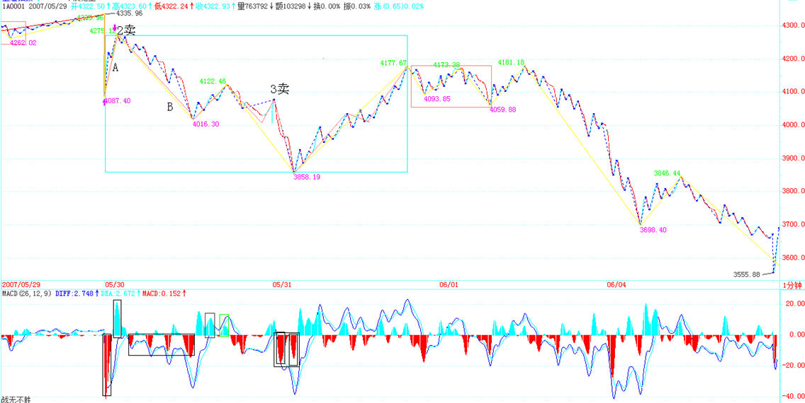

各位散户，为了中国资本市场的明天，为了以后不再有这样的暗算，为了有让管理层知道他们的权力不是可以任意挥舞的，今天，这样一个特殊日子里的特殊走势，是必须忍受的。今天收盘后，全世界的目光都会聚焦到这里来，虽然管理层今天早上的统一口径的在各大传媒中文章已经有点那意思，但还不够，认识不够深刻，用词依然有父母教育孩子的味道，投资者是需要被教育，但管理层同样需要。

技术上，上面的文章已经说得很清楚，看5月均线，经过今天的下跌，该线已经到了3540点。短线的角度，在该线附近的介入，问题不大。周末说一定注意补跌，不能买所谓抗跌的股票，今天，那些股票都下来了。现在，站在反弹的角度，一定只能介入那些跌幅40%以上，已经跌到半年，最好是年线的股票，一旦大盘有所稳定，其反弹的力度会较大。

至于现在依然没走的，依然全仓的，第一，现在走意义已经不大，不说什么技术，就算是看历史数据，以后肯定有比现在位置要好得多的位置。对于最不幸的满仓的朋友，目前一定要忍住，在第一次大反弹出现后，一定先把一半筹码先兑现出来，下来再找机会回补，这样才能把成本摊低。因为这样的走势后，中线的震荡不可避免，有资金才会有机会。

当然，在30日第二卖点走掉的，仓位不重的，目前的任务就是好好把握住本周必然出现的大反弹，注意，如果你技术不好，就要对超跌个股逐步买入，而且必须要有针对性，集中力量，在反弹中，如果还拿着几十只股票，那是操作不过来的。

具体点位，还是上文中说的，5月均线是一个关键的位置，跌破该位置，站在短线角度，将是空头陷阱，至于能不能跌破该位置，就看下面的短线背驰点出现在什么位置上，这是技术比较好的最主要参考位置。由于今天大盘股已经补跌，因此必须密切注意大盘动向。又由于目前30分钟呈现的走势，所以反弹最直接的效果，就是把30分钟的MACD拉回0轴，该0轴是反弹的最大压力。

这样的市场，是对所有市场参与者的考验，能经受住，也就成熟点了。有些经验是必须记住的：对下跌不能有幻想，像30日这种第二类卖点，一定要走，否则就没有反手之力了。

## 教你炒股票58：图解分析示范三

(2007-06-04 22:34:47)

明天收盘后要出一次差，去一趟曾419赋诗的地方，所以，先把课程送上，今后几天都没时间写帖子，但每天收盘后的解盘，都会尽量按时附上。至于其他内容的帖子，等出差回来再说了。

大盘大跌，除了清洗筹码，还可以清洗一下人。本ID说过，这里没必要有这么多人，来这里的，如果不是希望成为猎鲸者的，就没必要来了。那种跌个40%就惊慌失措的，也不大适合市场。市场从来都是血腥场所，这点在前面已经反复说到，见不了血腥场面的，还是把钱好好去买国债，这样比较安心。股票就是废纸，该卖的时候不卖，把股票当宝，这就是投资的最大软肋。如果你看图形操作时，做不到无我无股票，只有走势图形，那基本可以不看图了，因为有我有股票，被自己的贪婪恐惧所牵引，你看的图，也不过就是自己的贪婪与恐惧，那何必看图？

说一个最简单的例子，就算你没技术，只按最简单的跌破5日线走，那请看看你该在什么时候走，且不说对于具体的个股了。这次是一个很好的实习机会，请回想一下那些卖点时，你自己究竟在干什么？心里是不是有很多幻想，被幻想蒙蔽了眼睛？看图操作，唯一的对象只有图，谁说都没用，市场是当下发生着的，没有人能替你去反应。先把市场放一边，继续图解分析，把这次跌势的图形连续分析下去，这样大概对各位的理解与分析有一定的帮助。请看下图：

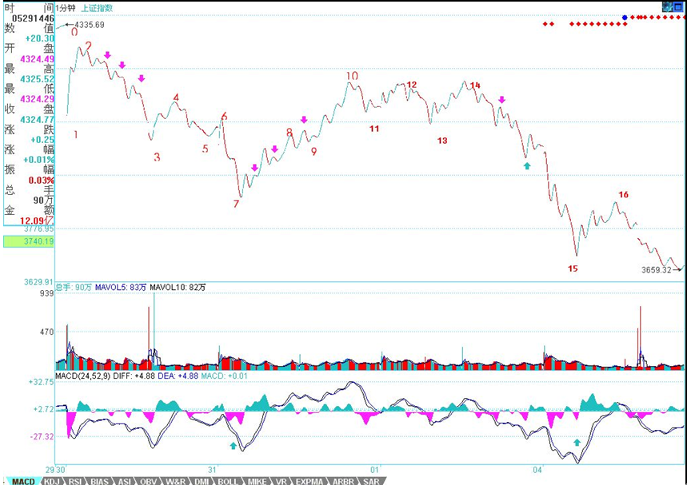

各位可能还会对如何去确定线段有很大疑惑，图上已经用数字标记了从30日开始的1分钟图上的线段。为什么这样标记？例如14-15间带红绿箭头这一段为什么不是线段？这很简单，因为这段中的下-上-下-上-下中，没有任何的重合，也就是第二个上的终点没有触及第一个上的起点，这种图形，和直接的一个下没有任何区别。而一个线段，除非是缺口，否则必须由至少上-下-上或下-上-下的三折组成，只要互相相邻的上或下不重合，则这个模式可以一直延伸下去而依然还是一个线段。这里就不难明白14-15为什么只是一段线段了。

那么为什么14-15这线段不构成合适的买点，因为在下面的MACD辅助中，可以看出这一段的力度比前面所有的都大（这从黄白线就一目了然了），那当然不构成任何的1分钟以上的背驰，最多就是1分钟以下最小级别的背驰。在15下MACD小红箭头处，比较绿柱子的面积，就可以发现这个小的背驰，因此就有了15-16的反弹，该反弹在14-15最后一个上附近受阻，十分技术。

而站在10-13构成的1分钟中枢来看，15-16这反弹反而是构成一个第三类卖点，本ID看了一下留言，有叫CCTV也看出这个是一个第三类卖点，但他的理由好象是这反弹没突破7这点所以是第三类卖点，这是不对的，因为如果是那一点，那对应的中枢就乱了。注意，第三类买卖点必须是次级别离开，次级别反抽，而且是针对该级别中最近那个中枢，而以前也曾说过，对于一些快速变动的行情，往往第三类买卖点离开的距离会很远。

从16开始的一段，有进入背驰段的可能，但由于明天的行情没有开始，所以如果明天突然加速下跌，就可以破坏这可能，所以具体是否背驰成立，还要看明天走势的内部区间套的当下定位。如果出现背驰，那么一个反弹至少重新回到15这点上，这样就从15这点开始至少形成一个1分钟的中枢了。

而对于1-10这个5分钟中枢，该反弹如果不能重新回到4015之上，那就会形成一个5分钟的第三类卖点。从目前的情况看，这种可能性有很大，所以这也预示着，今后几天，任何在4000点下的反弹，都会构成一个卖点并至少引发一个更大级别的中枢，甚至是新一轮的下跌，除非这反弹能重回4000点之上。显然，从中枢的分析中，可以很绝对地分析出今后一段走势的一些操作性质。

站在更大的层面上，大盘要重新站稳，就要形成一个较大级别的中枢，而从10开始，一个新的5分钟中枢都没形成，如果新的5分钟中枢最终和1-10这个5分钟中枢没有重合，那么就形成一个5分钟级别的下跌，那其后的压力就更大了，所以，那CCTV也蒙对了一点，就是7这点有这极强的技术含义，如果一个5分钟背驰引发的反弹都能重回该点之上，那么大盘的走势就会有好转的可能，否则短线压力依然。

别看本ID理论的分析似乎很复杂，但其中绝对条理清晰，每个结论都是严格，没有任何含糊的。但关键，首先要把图给分解对，否则就乱套了。这点必须多看图，多实践。所以，今后一段课程，都继续把这图分解下去，至少看到一个日线中枢的生成为止，有这样的具体分析，对各位的理解和把握应该有所帮助。

缠中说禅：2007-06-04 22:38:00

明天收盘就要开车走，所以解盘附录上后就不能和各位多聊了。今后几天，尽量收盘后写解盘，如果有时候要晚上写，也请原谅。先下，再见。

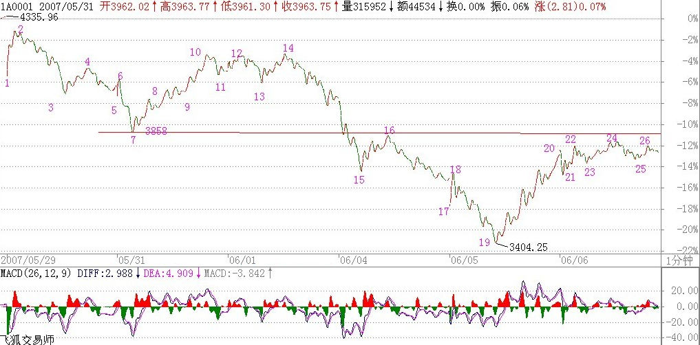

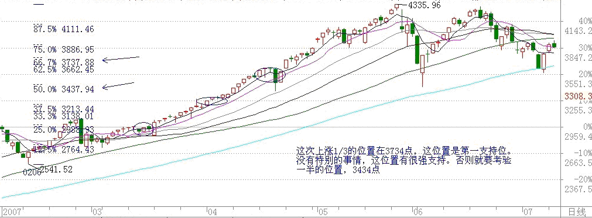

附录：本ID要马上开车去419的地方，不能多说。今天，如果你还看不明白昨天说的背驰段，然后今天如何精确定位的，那就好好学习吧。上图的19段结束位置是3404点（为什么，如何当下去判断，好好研究好，这是真工夫），后面的走势，上面已经提及，下午走的是第20段，该段结束后，就进入上面说的中枢震荡中。明天的任务，就是看好这第20段的结束。

大走势，就是月线的5均线，今天盘中假突破，而且还是3434点一般的位置，这不难看出来。对不起，不能多说了，本ID该干的干了，该说的说了，是否能成为你自己的东西，那就不是本ID能决定的。

抓紧说两句(2007-06-06 16:52:09)

刚才还和当地的领导谈事，马上又要宴会，抓紧说两句。今天就是受制于3858点的第7那点，这在前两天的分析已经说到该点的技术意义，具体可以看当时的分析。深圳强，看能否带动上海，目前，压力不在盘里，而是在盘外，斗争激烈，不能多说。现在，下面这中枢已经形成，就用中枢震荡看。个股向前面说到的一\二线集中的趋势明显，但即使是最好的股票，也不能追高买，一定要在震荡的低点介入。安全，永远都是第一位的。

不能多说了，离开这里，还要去一次杭州见个有分量的人，估计周一才能回北京了。

先下，再见。

说两句(2007-06-07 15:04:21)

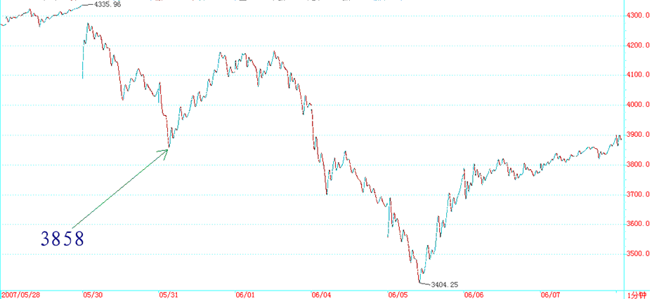

3858的技术意义在今天表现无遗，突破就意味着一个大的中枢在形成，这样是大盘拨乱反正的第一步，这样，大盘就有了一个可以依赖的波动中心，但这中心在形成中。4015点是下一个位置，这位置如果不能突破，大盘还有严重变坏的可能，否则，大盘就有重新挑战1/2线甚至创新高的可能。

其他不能多说，马上要去看一个企业，明天主要看3858能否站稳。走了，再见。

周末腐败去吧!(2007-06-08 15:13:42)

3858点，昨天给今天的任务，完成得不错，但对周末消息面上的担忧，使得今天十字星充满了“六桥烟柳”的味道。周末腐败去吧。 断桥边，苏堤上，相逢何必曾相识。

全流通后最大的投资机会

(2007-06-10 08:40:52)

刚从安徽回到苏州，明天很忙，如果没有时间写评论，就在后天早上补上。注意，本ID这里指的最大机会是私人股权投资这一块，但一般人没机会参与，所以可以关注中国最大VC（现在主要做私人股权）公司的股东600635以及其他有相关题材的公司。这题材，目前市场还不大了解，等市场了解了，就不是这个价格了。可以明确告诉各位，创业板明年一定出来。635、潍柴动力都是从中线角度说的，没必要追高买，如果是中线的资金，可以耐心等待好的买点。当然，如果以前已经有的，就拿着。今天跑了不少地方，本ID也累了，先下，再见。

昨晚已到苏州，等一下要去安徽，去看一个准备私人股权投资的项目，N1千万，占10%，好象有点贵。明天可能还要回杭州，这几天看了不少企业，看到真正的企业，就知道中国的资本市场有多大的潜力，就知道本ID说20年的大牛市至少上30000点可能都有点保守了。像安徽这企业，今年的净利润已经N2个亿了，具体不能说，涉及商业秘密。

600635是本ID那十几只股里的VC股，说的时候，当然也是本ID大举介入的时候，是5元多点。为什么本ID要当时要大力买入并让这里的人都去买？因为他是中国最大的VC企业20%的股东。知道全流通最大的投资机会是什么？就是VC，更准确说，是私人股权投资这一块。知道635的那VC企业对潍柴动力2000万的投资，几年时间，现在已经快100倍的收益了吗？知道本ID为什么要为潍柴动力写了一首诗？看看当时该股多少钱，现在多少，有受大盘影响吗？知道潍柴动力占有中国5000亿重汽市场的多少分额吗？当然，本ID不是让你现在去买，当时写诗的时候，潍柴动力60不到，不过，就算现在去买，站在中线的角度，绝对一点问题都没有，但就怕你没有这个耐心。就像本ID4月前后让各位注意002100后的6000万总盘，2000万以下流通的中小板，看看后来都走成什么？如果两年后再看看，你会更H，本ID就奇怪了，怎么总是有人说本ID的理论是短线的，有些股票，本ID绝对可以拿10年以上，关键是他值得本ID拿吗？本ID可以419，当然也可以4N9，关键是你的N是多少。谁告诉你本ID只看技术面买股票的？只看技术面买股票就等于只看上半身找面首一样，只有上半身没有下半身的能是好面首吗？

昨天，央行的吴大姐已经在说大力支持私人股权投资的事情，本ID在这事上的布局早就完成了，可以预言，这是今后最大的热点，注意，这不单单指二级市场，而是股权投资本身，本ID只等着坐轿子了。现在ID已经开始布局一个更新的事情，不走在所有人前面，那是本ID吗？

今天违反规定，周末说股票，对不起了，车子来了，马上去安徽，不能多说了。最后重温一下潍柴动力那五绝：曾经湘火炬，今已鲁潍柴。十载风云客，七尺老残骸。

刚回北京再说私人股权投资

(2007-06-11 20:50:14)

刚从南京飞回来，说句南京人不爱听的话，苏州比南京真是好太多了。这次去苏州，金鸡湖一带也比上次好多了，南京给人的感觉，一如既往地乱，杭州也不行，现在的杭州，完全没有特色，如果没有西湖，真不知道杭州算什么了。当然，从南京开车，一进入安徽，之间的对比也是明显的，现在的中国，真是众声喧哗。

这次出去，跑了五个省，累，今晚要好好休息。不过，一路上，开盘的时间依然是不会耽误的，要感谢现在发达的通信手段，科技是让人自由而不是束缚人的，这点很重要。

今天的大盘走得很正常，周末没消息就是好消息，因此大盘当然要尝试对4015点进入攻击。前面说了，这一段都是深圳带着上海走，前者的1/2线在13700点，这没碰到过，所以有空间，只要这节奏不变，大盘总体上就没大问题。现在，5日线也成功拐头向上了，如果不会看短线走势的，就看5日线，不破就没问题。现在印花税太贵，短线不要太频繁，把操作级别放大点，人也轻松。

至于私人股权投资，和传统的VC不同，只投那些马上可以上市的，更重要的是，可以在大的产业结构上进行大布局，目前的中国，正走向一个产业大综合的阶段，这里的机会大锝惊人。具体有时间再说，一般投资者没有参与这大机会的机会，现在私人股权投资基金也没有被发展起来，所以一般投资者只能在二级市场上受累了。

不能多说了，本ID要休息了，先下，再见。

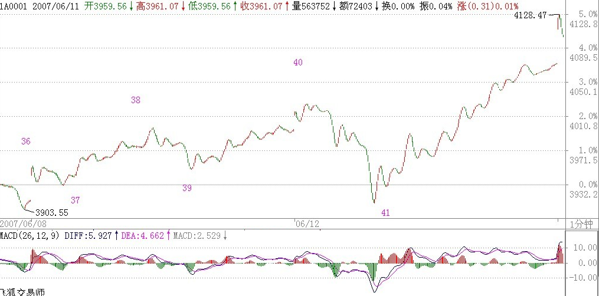

今天的震荡都受不了的，就要好好补补心，买个猪心、牛心之类的回家啃啃。今天突破4015点后回抽5日线，技术上极端标准，现在是前面说的大盘拨乱反正走势的第二步，第三步就是4144点的1/2线，第四步是创新高。而深圳是13700点，现在应该明白深圳带着上海走的意义了。深圳已经创新高，那么上海呢？当然，剧本能否一幕幕最终完成，必须依赖各方面的配合，如果再来一次半夜鬼哭狼嚎的，那只能再来一次悲惨世界，正如本ID上次说的，这样只能害散户，大资金砸狠，回补也狠，怎么会有事情？当然，现在谁还敢玩这样的夜半游戏，是要负历史责任的。

个股上，要知道，在这拨乱反正的过程中，有先有后，前面已经说了，先是所谓的绩优，现在，这些很多都新高上下了，而其他股票，搞个双底、头肩底的，总可以吧？最终，只要指数没问题，绝大多数，都会轮动到的。目前人心还在狐疑中，所以关键是通过震荡去让各位安心，今天深圳先冒头，也是测试一下各方的反应，这心理、政策层面的测试，还是必须的。还是昨天的话，如果看不明白的，就看5日线，不破就拿着，这样也不累。大盘真站稳4000点后，三线也会逐步活跃的，特别有题材的。

缠中说禅：2007-06-13 08:24:47

今天解盘3点半附录本文后，先下，再见。

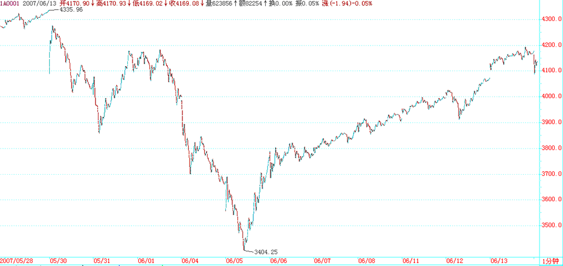

附录：今天是一个大换防，空翻多的，解套先出来的，这都是极为正常的。今天大盘的走势十分技术化，13700点对于深圳的吸引，4144点在上午和下午都分别对上海起着作用，由于短线留下缺口，因此本周余下时间里，这缺口发挥着最重要的短线技术意义，后面的震荡难免。当然，站在纯技术的角度，这种震荡是必须的，没有一个充分的换防，行情要继续发展是不可能的。另外，心理面、政策面，也需要考验，这也配合了技术的走势。

个股方面，昨天已经说了，4000点站稳，三线股会逐步活跃，今天已经有些三线股开始动起来，只要大盘能保持围绕4144点的震荡，这种个股轮动会继续。技术上，关键是看好各种底部形态的颈线位置的具体走势，这对短线发现好股票有帮助。在震荡中，要注意千万别追高。另外，特别要注意深圳走势，如果深圳在下周初还能站稳新高位置，将鼓励上海以及绝大多数没有创新高的股票走出新高行情，因此，目前关键看深圳成指能否在今后几天震荡中站稳，这在短线技术与心理上意义巨大。

今天，那关住的钢铁出来，这股票，这里很多人是停牌前一天9元多点买的，至少让各位少了被震的痛苦，逃过一次大跌，如果今天早上反应快的，还能有10%以上的收益。本来，如果没这次大跌，这股票肯定是要连续涨停的，现在只能先清洗一下，让需要用钱的先出来，这也是市场操作中经常要面对的事情，剧本，偶尔也要修改一下的。至于后面的走势，看好技术图形就不难发现了。

缠中说禅：2007-06-15

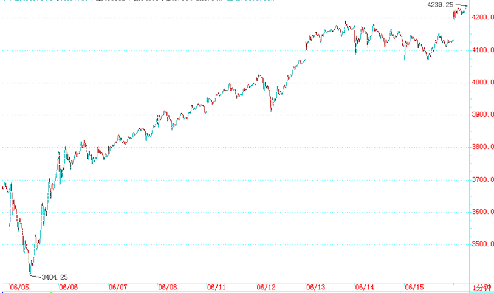

今天的走势依然没什么可说的，把下面的缺口补了后，就继续中枢震荡，关键是都在等周末的消息面，其实，不管周末有什么消息，这两天都消化了。因此，尾盘重新冲上4144点，收在其下面不远的地方，也就是很正常的。目前，拨乱反正行情第三目标已经达到，后面将为第四目标的创新高而努力，当然，前提是先把4144点的1/2线给站稳了。

个股方面，那16只股票里，600432已经新高，其他会慢慢跟上的，这种事情肯定有先后的，否则根本忙不过来。如果大盘能如期重新新高，那么绝大多数仍未新高的股票，都会为此而表现的，这是今后一段时间内一个重要的利润点。另外，那些创新高后没有大级别背弛，并且能回试站稳前期高位的，是另一种可关注的利润点。

站在中线的角度，对环保股票的重视将比本ID年初强调时有更多的认同，这是国家大的方向，依然值得中长线关注的。除了那16只里的环保新能源股，像600636也可以中线关注，该股在环保股里属于已经有一定业绩支持的，不像很多股票暂时还是概念，因此对中长线资金可以关注。该股票在一个月线双底的颈线位上整理，回试时可以找买点介入，千万别一窝蜂追高，否则就等着受刑折磨。周末，腐败去吧。

## 教你炒股票59：图解分析示范四                                 (2007-06-14 08:23:43)

出差，必须用三张图才能把落下的走势补上。对于初学分析的人，最难搞的就是分清楚线段，所以，在每张图上，都继续用数字标记每一段线段，从中不难学会究竟线段是如何分的。

有人可能要问，为什么有些线段延续上百点甚至更多，而有些很短。这没什么奇怪的，是否线段，关键看走出来的形态，如果任何低点比前一个高点都高，那么即使这情况无限延续下去，也依然只是一线段，这和幅度没关系。还有，前后两线段间，不可能是同向的，同是向上或向下不可能构成两个前后相邻的线段。而且，由于线段都至少呈现上下上或下上下，所以线段不存在一条直线走平的可能，由此也知道，为什么一字涨停，无论如何延续，还是低于线段的级别，是最小级别的。

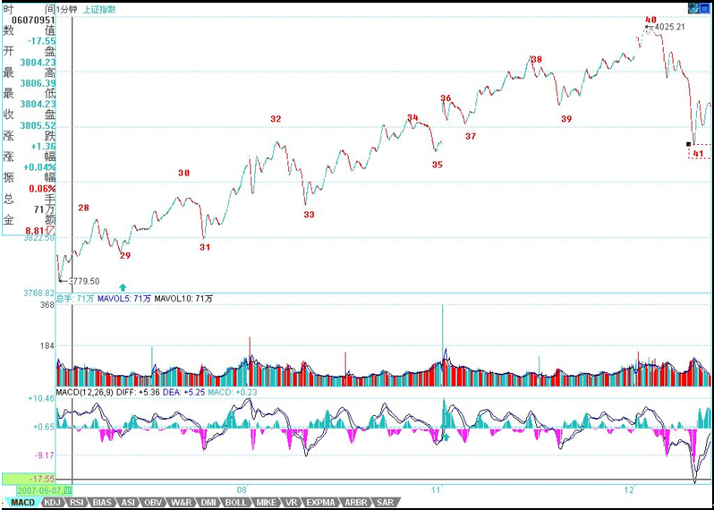

下面，先把三张图列出来，三者之间是连续的，根据上面的标记可以明白。由于K线太多，不能放到一张图上，否则看不清楚。

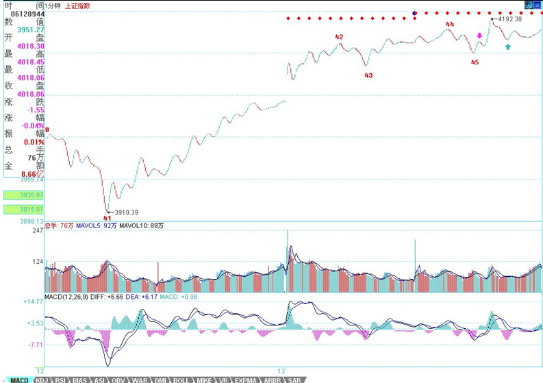

图一中，20-23构成的1分钟中枢产生延续，29是这中枢的第三类买点。图二中，33是28-31，37是32-35的1分钟中枢第三类买点。图三中，由于红箭头处比绿箭头高，所以不能确定该线段已经完成，还要看后面走势，由此可以知道如何去把握线段的结束：一般来说，线段的结束与大级别的走势段是一样的，在趋势中用背驰来确认，其他情况用盘整背驰来确认，如果有突发性事件，就要看第二类的买卖点，其道理是一样的，只是所用到的级别特别小而已。而对于图三，后面的走势，与42-45的1分钟中枢相关，无非就是中枢震荡直到出现其第三类买卖点。

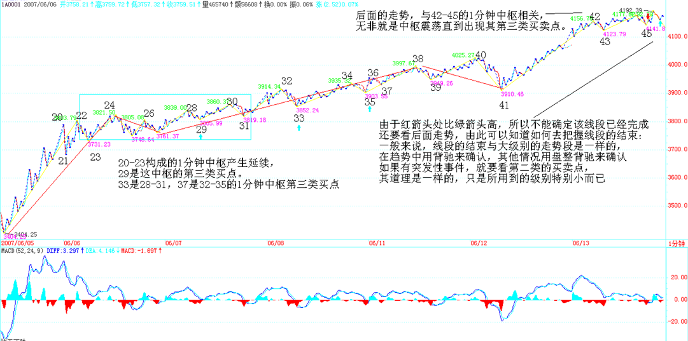

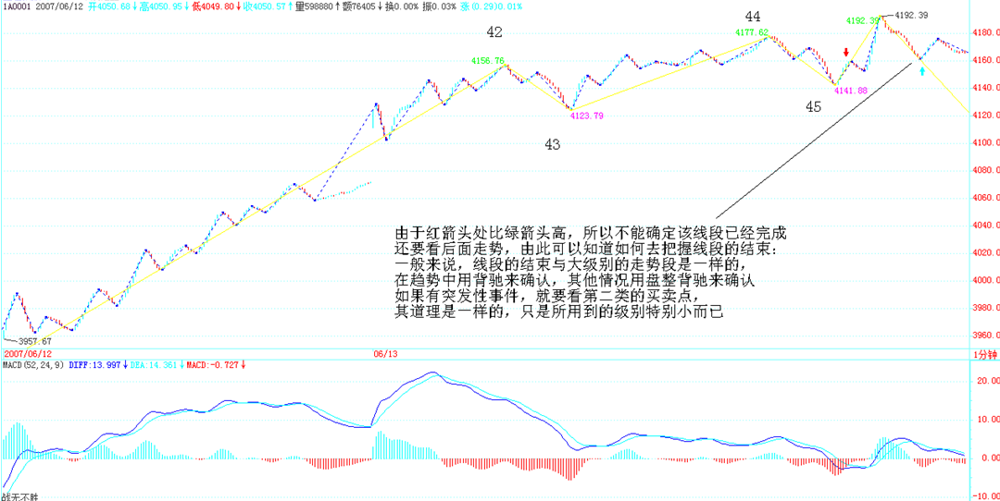

注意，在前面一课的7-8-9中，由于8下来的低点3994.57与7中最后一个高点3994.21极为相近，如果点数只用到个位的精度，两者就完全一样的，所以在这种情况下可以看成是有重合的，因此可以分成三个线段。当然，如果精度要求到小数点后两位，那么这7-8-9其实可以看成是一个线段。一般来说，如果这两者如此相近，而且8中也带着明显的下上下，所以还是看成三线段比较好。当然，如何看，关系到你事先确认的精度，关键是统一去看，至于按哪种精度，都没有任何实质影响。

有人可能又要问，怎么总是说1分钟的图？其实，看什么图并不重要，从1分钟图看起，只不过意味着这分析的基础有一个1分钟图的精度前提，在这个前提下，当然要看1分钟的图，而这不影响对大级别的分析。例如，1-19，就构成一个5分钟的走势类型，而这走势，最终确认并没有形成两个5分钟的中枢，所以只能算是一个盘整。而从19开始到45，由于41低于32，所以这走势至少有一个5分钟的中枢，但这新的5分钟走势类型并没有最终完成。

对于19-45这个未完成的5分钟走势类型，可以进行仔细的研究。由于29比24低，则22-31也构成一个5分钟中枢，而该中枢，就对应着另一种分解。但无论如何分解，19-45至少是一个未完成5分钟走势类型的结论不变。当然，站在这种分解下，41就是22-31这5分钟中枢的第三类买点。因此，如果41开始的上升最终形成5分钟中枢后不与22-31这5分钟中枢重叠，那么这19开始的走势类型就是5分钟的上涨趋势了。

由上面的分析，对短线的走势就有一个明确的结论，只要关于42-45的1分钟中枢的震荡不出现第三类卖点，或者即使出现，但其后扩张的走势不触及22-31这5分钟中枢震荡区间，那么大盘的震荡就是强势的，即使最终形成30分钟以上级别中枢，也是至少是围绕42-45的1分钟中枢发展而来。否则，大盘将以22-31这5分钟中枢震荡区间为基础扩张出30分钟级别的中枢来，相应的走势就比较弱了。而具体的操作，可以按照中枢震荡的手法，根据自己操作的级别，选择相应的中枢级别进行操作。

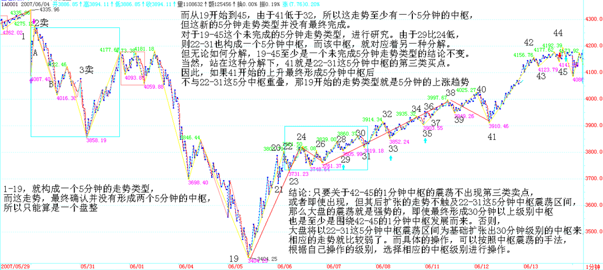

### 2007-06-14解盘

缠中说禅：2007-06-14 15:33:09

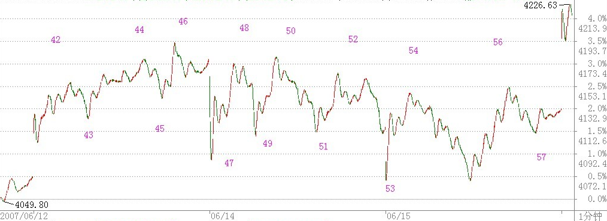

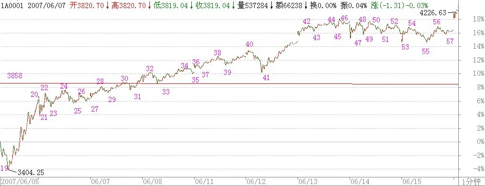

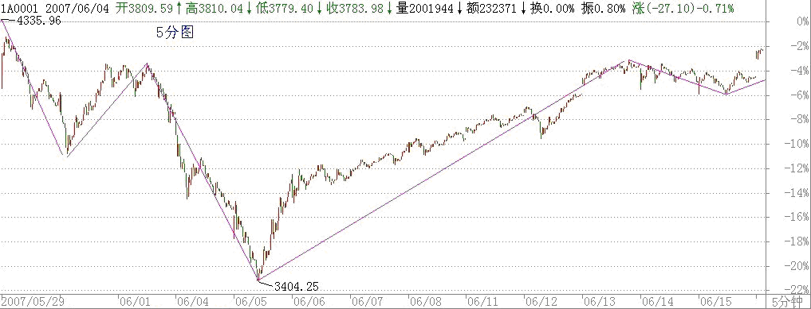

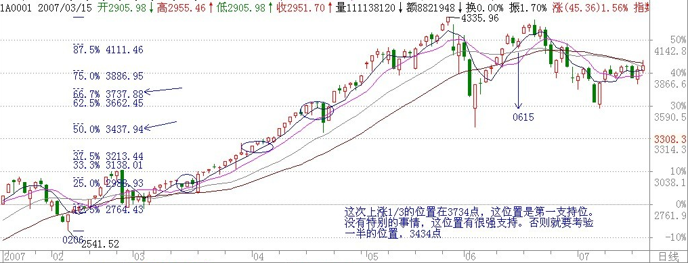

今天的走势没什么可讲的，昨天都已经描述得很清楚了。技术、心理、政策等压力，都需要在这里震荡消化。由于今天没完全补上缺口，因此该位置依然是短线的关键，当然，上面说的42-45的1分钟中枢，已经延伸9段，成为一个5分钟中枢了，后面具体的分析，在上面的文章里已经写了，就不再多说。深圳受到13700点的吸引，短线，能否站稳该线对大盘走向有极大的引导作用。

注意，在中枢震荡中，安全的作法应该是先卖后买、形成节奏。其实这问题很简单，从低位上来的筹码，当发现单边走势结束，进入较大级别震荡时候，其标志就是出现顶背驰或盘整背驰，这就要求减磅，然后等震荡下来，出现底背驰或盘整背驰再回补，这样差价才出来，成本才下降。如果是先买后卖，那唯一可能就是在单边的时候，你的仓位不高，所以才会不卖股票也有资金，这其实是节奏先错了的表现。

当然，这些都需要通过练习才能熟练。而且必须注意，一旦震荡的力度大于前面有可能形成第三类卖点时，就一定要停止回补，等待第三类卖点引发的下跌出现买点时再介入，很多人经常出问题，就是心里先假设一个可能的跌幅，觉得肯定跌不深，这都是大毛病。一定要养成只看图形操作的习惯。

还是那句话，无论是政策、心理、消息等，都是市场的分力，而走势是合力的结果，这才是问题的关键之处。

对不起，今天不能回答各位的问题了，下午有一拨人，晚上有两拨都需要腐败活动的，本ID必须去补课，先下，明早见。

缠中说禅：2007-06-15

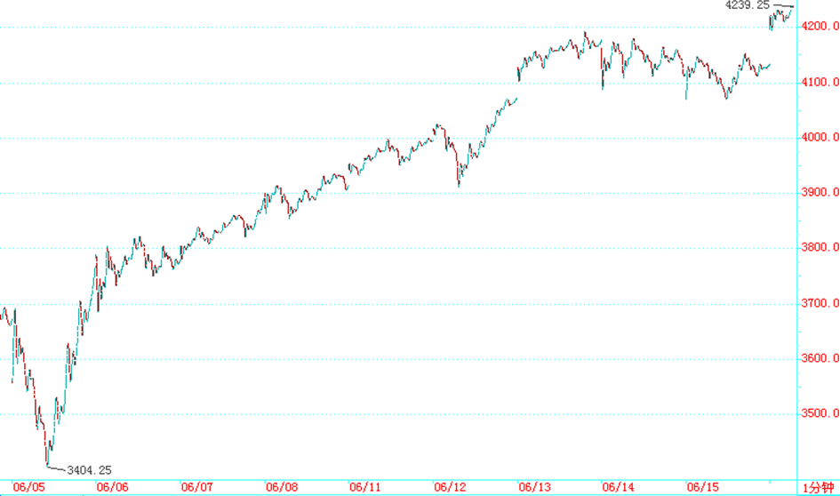

今天的走势依然没什么可说的，把下面的缺口补了后，就继续中枢震荡，关键是都在等周末的消息面，其实，不管周末有什么消息，这两天都消化了。因此，尾盘重新冲上4144点，收在其下面不远的地方，也就是很正常的。目前，拨乱反正行情第三目标已经达到，后面将为第四目标的创新高而努力，当然，前提是先把4144点的1/2线给站稳了。

个股方面，那16只股票里，600432已经新高，其他会慢慢跟上的，这种事情肯定有先后的，否则根本忙不过来。如果大盘能如期重新新高，那么绝大多数仍未新高的股票，都会为此而表现的，这是今后一段时间内一个重要的利润点。另外，那些创新高后没有大级别背弛，并且能回试站稳前期高位的，是另一种可关注的利润点。

站在中线的角度，对环保股票的重视将比本ID年初强调时有更多的认同，这是国家大的方向，依然值得中长线关注的。除了那16只里的环保新能源股，像600636也可以中线关注，该股在环保股里属于已经有一定业绩支持的，不像很多股票暂时还是概念，因此对中长线资金可以关注。该股票在一个月线双底的颈线位上整理，回试时可以找买点介入，千万别一窝蜂追高，否则就等着受刑折磨。周末，腐败去吧。

### 2007-06-18解盘

缠中说禅：2007-06-18 15:16:38

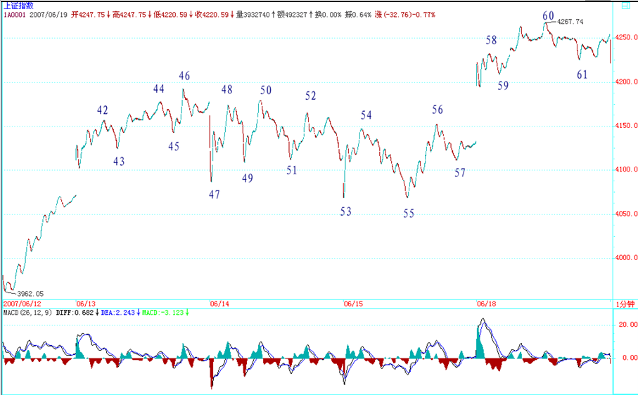

4144点站稳后，剧情就是去继续创新高的努力，因此今天的走势十分正常，不过是这种努力的一部分。由于今天留下缺口，因此后面几天就要震荡去确认这缺口的性质。短线震荡的判断，已经有很多次的经验了，所以不难把握。只要该震荡不出现1分钟的第三类卖点有效跌破4224点，那么就是强势震荡，否则，缺口被补的压力就大了。如果不会看的，可以看5日线。个股，那16只里，今天600635也创新高了，其他会陆续跟上的，因此也没什么可说的。

## 教你炒股票60：图解分析示范五

(2007-06-19 08:04:06)

其实，枯燥的图形，里面包含着很深的心理学意义。走势，本质上是预期的合力。而预期，本质上是心理层面的。只不过对于市场来说，可以被当成分力去形成市场合力的预期，都是被外化为市场买卖行为的。你的恐惧，如果光是在那里恐惧而没有实际的行动，那并不构成市场的交易行为。因此，所有市场行为，其实已经被如此的心理模式给过滤一遍了。

举一个简单的例子，同级别走势从B0下跌到A1反弹到B1，再跌破下跌到A2，再反弹到B2，这可以分为两类：一、B2低于A1，二、B2不低于A1。显然，第二种情况，会构成某更大级别的中枢，而第一种情况没有，因此这两种情况是有着本质区别的。在心理层面上，A1这第一个反弹的起点，有着很强的心理暗示意义，而再次的跌破，使得这A1的价格成了一个很重要的心理位，而交易本质上都是预期的，这价位就构成了一种实在的预期分类：一、预期能重新上去A1并实际交易，二、预期不能重新上A1并实际交易、三、观望。第三种，在实际的走势中不产生实际的交易，因此一、二种心理预期构成了市场合力，而市场的走势是这合力的当下痕迹，因此这两种心理预期的大小，并不需要实际去测量，因为市场的走势就实际反映出来了。例如，如果实际上不能重新上去，出现第一种B2低于A1的情况，那么显然在当下的情况下，第二种心理预期大于第一种。

消息面、政策面、资金面，这面那面，最终作用的都是人心，人心因预期而交易，这里关系的就是人的贪婪与恐惧、人的贪嗔痴疑慢。而本ID的理论从不预测，没有预期，只跟随着市场合力、市场走势而行，这里无须贪婪恐惧，看图作业，如此而已。但光知道这点还远远不够，因为没有预期可能就是最大的预期，没有贪婪恐惧可能就是最大的贪婪恐惧。不预测、不预期，并不是不可预测、不可预期，而是不为贪婪恐惧而预期、预测，是根据走势的自身规律来。

走势是有规律的，这规律是不患的，这不患的根源在于人贪嗔痴疑慢的不患。为什么本ID要强调当下分解的多样性？因为走势本身就是当下形成中的，是市场各种预期的合力当下画出来的，而每种画法都是不患的，都是源自人的贪嗔痴疑慢，因此每种多样性的分解都是符合理论的，多样性不是模糊性，而是多角度去让市场本身自己去画地为牢，由此使得市场的走势万变不离本ID理论的控制之中，而这，恰好是市场自身的规律之一。

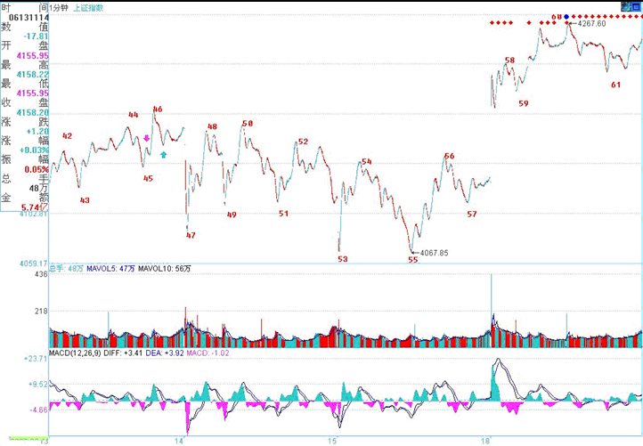

不妨看看上图，上一课刚好说到“红箭头处比绿箭头高，所以不能确定该线段已经完成，还要看后面走势，由此可以知道如何去把握线段的结束”，有人可能问，为什么在这个位置不可以去预测、预期？因为市场自身并没有完成。但这里的未完成，是站在人观察的级别上说的，因为所谓的走势，首先是你观察的走势，没有离开你观察的走势。不同倍数的显微镜下的世界是不同的，但市场操作的成本、交易通道、资金规模等限制了人观察并能实际操作走势的显微镜倍数不可能无限小下去，所以必须确定一个最低级别的线段，把其下一切波动给抹平了。当然，根据严格的理论，用每笔成交当成最低级别，然后以此构筑线段，这样可以严格地分辨任何级别的走势，但这根本不具有操作性，特别现在交易成本增加，可操作的级别必然要增大，因此，一些可操作级别下的波动，必须要忽视掉。

站在最严格意义上，45-46线段构成43-44线段的盘整背驰（注意，力度比较的是下面所有红柱子的面积之和。）而细致分别线段以下级别，就知道45-46其实是一个小级别转大级别，而红箭头后第一次拉起不创新高，就可以出掉了，为什么，因为后面必然形成下上下的重叠结构，也就是有一个小中枢了，而线段以下级别的同级别操作，是不参与这类中枢的。当然，这是按最严格的，并没有太大操作意义的分析。而实际的操作中，大概真在有意义的操作，都至少是1分钟以下线段级别的。因此，在该图中，如果你是按30分钟级别操作的，46-47的波动就可以不管的，从3404开始的反弹，一个标准的5分钟级别的上涨，因此你的持有就至少一直等待这5分钟级别的上涨出现背驰或突发破坏为止。

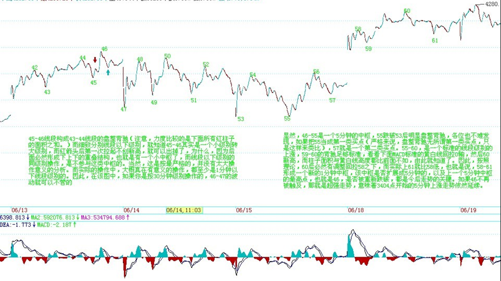

显然，46-55是一个5分钟的中枢，55跌破53后明显盘整背驰，各位也不难发现，如果把55当成第一类买点（严格来说，盘整背驰无所谓第一类买点，只是这样来类比），57就是一个第二类买点。55-60，是一个标准的线段级别的上涨，59-60的背驰足够标准，看看下面MACD标准的黄白线回拉0轴，然后60新高，而柱子面积与黄白线高度都比前面不如，由此就知道了。因此，按照理论，60后必然有调整回拉58之下，而实际上61就比58低，也就是说，58-61形成一个新的1分钟中枢，该中枢是否扩展成5分钟的，以及上一个5分钟中枢的最高点，也就是46，是否被重新跌破，都是今后走势的关键。如果46不再被触及，那就是超强走势，意味着3404点开始的5分钟上涨走势依然延续。

这里必须强调突发消息对市场走势以及操作的影响是不必过于在意的，本质上，任何突发的消息，不过增加了一个市场预期的当下分力，因此，最终还是要看合力本身，或者说是市场走势本身。一般情况下，由于背驰的精确定位需要用区间套的方法，所以突发消息，最不幸的，就是在这精确定位期间出现，例如这次530，就是这样。当然，这是一种小概率事件，更多情况，突发消息在背驰的精确定位后出现，这样突发消息对操作的影响就是0了。而对于那种最不幸的情况，用一个第二类卖点就足以应付，因此，突发消息出来后，在实际的操作中就不能放过这第二类卖点。不过要注意，并不是任何第二类卖点都需要反应的，这和级别有关，例如你是月线级别的，那这次所谓的大跌，看都不用看，爱跌不跌，随他去。即使你是5分钟级别操作的，如果某突发消息连一个1分钟的中枢都没破坏，只制造了1分钟以下级别的震荡，那么在所谓的第二类卖点，也是不用管的。原则很简单，任何消息，都只是分力，关键是看对合力的影响，看他破坏了多大级别的走势，这一切都反映在实际走势中，看图作业就可以了。

注意，突发消息破坏的级别越大，越不一定等相应级别的第二类卖点。例如，一个向下缺口把一个日线级别的上涨给破坏了，那么，消息出来当天盘中的1分钟，甚至线段的第二类卖点，都是一个好的走人机会，如果要等日线级别的第二类卖点，可能就要等很长时间、而且点位甚至还比不上这一点，因为走势是逐步按级别生长出来的。还有，级别只是区分可操作空间的，为什么按级别？因为级别大，操作空间按通常情况下就大。但在快速变动的行情中，一个5分钟的走势类型就可以跌个50%，例如这次大跌，因此，一个这样的5分钟底背驰，其反弹的空间就比一般情况下30分钟级别的都大，这时候，即使你是按30分钟操作的，也可以按5分钟级别进入，而不必坐等30分钟买点了。

第60课读后感：

1、市场的走势万变不离本ID理论的控制之中，而这，恰好是市场自身的规律之一。

2、来这里，如果希望一点脑子都不动，那是不行的。动脑子得到的东西是你自己的，否则永远都不行。

### 2007-06-19解盘

缠中说禅：2007-06-19 15:48:00

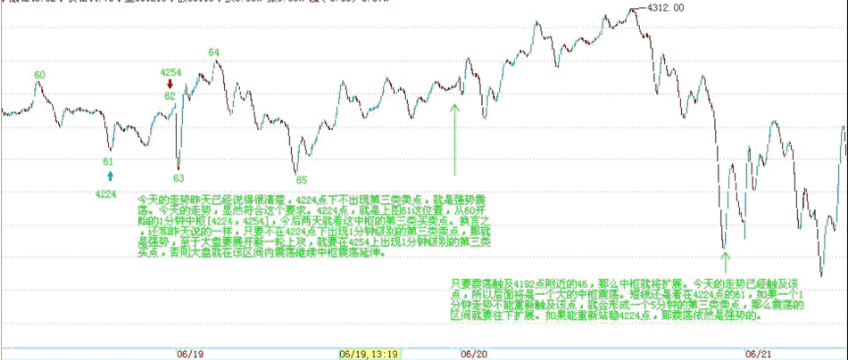

今天的走势昨天已经说得很清楚，4224点下不出现第三类卖点，就是强势震荡。今天的走势，显然符合这个要求。4224点，就是上图61这位置，从60开始的1分钟中枢[4224，4254]，今后两天就看这中枢的第三类买卖点。换言之，还和昨天说的一样，只要不在4224点下出现1分钟级别的第三类卖点，那就是强势，至于大盘要展开新一轮上攻，就要在4254上出现1分钟级别的第三类买点，否则大盘就在该区间内震荡继续中枢震荡延伸。

关于大盘的剧本不变，但个股之间显然会有分化，因此不能光看大盘，现在的股票，在技术上无非几类：一、创新高后回试的，这可以用第三类买点来把握；二、在前期高位下盘整蓄势的，这可以用小级别的第三类买点把握其突破，或在震荡低点介入；三、反弹受阻拉平台整理的，这个第二同样处理，只是位置与前期高位有距离；四、依然在底部构筑双底、头肩底之类图形的，这可以用第一、二类买点把握。

具体个股就不说了，来这里，如果希望一点脑子都不动，那是不行的。动脑子得到的东西是你自己的，否则永远都不行。

缠中说禅：2007-06-19 15:58:26

女王好，最近两天死抱安阳，发现这个股真垃圾啊，这两天常见到的万手买盘是您在点火么？庄家真是强啊，这样也拉不起来，洗盘这么久不知道干净了没有。

另外今天生物偶拿到了涨停，谢谢女王。

==

那钢铁本ID前几天已经说了要改变剧本先让想走的人出来，你还以为本ID是说着玩的？本ID那16只股票，加上钢铁、139、338、636，总共也就20只，找一个合适的买点应该不费劲，为什么不等到有买点再介入？000777、000416如果不敢买，难道600635本ID还说得还不够清楚？上周初洗盘的时候，难道没机会买？不说了，本ID下午晚上还有事情，要去一趟西三环外某街道，先下，明早见。

### 2007-06-20解盘

缠中说禅：2007-06-20 15:36:32

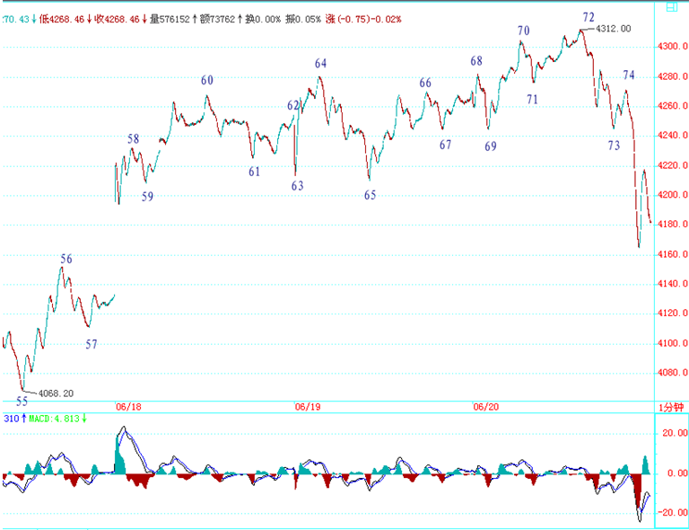

今天走势十分正常，一个正常的中枢震荡，下午13点半附近的背弛如果还不能当下看出，那么就要抓紧学习了。具体的分析，将在课程61里。如果当下没能分析出来的，请先自己分析一下，然后对照明早的课程，这样才能提高。

由于周一那缺口还在那里，因此成为行情发展的一个隐患，前面已经说过，只要震荡触及4192点附近的46，那么中枢就将扩展。今天的走势已经触及该点，所以后面将是一个大的中枢震荡。短线还是看在4224点的61，如果一个1分钟走势不能重新触及该点，就会形成一个5分钟的第三类卖点，那么震荡的区间就要往下扩展。如果能重新站稳4224点，那震荡依然是强势的。中线看，4144点的1/2线十分关键，如果该线站不稳，那么大盘的调整级别就加大，否则就问题不大。不会看的，短线还是看5日线，中线看5周线，不破就问题不大。

个股方面，那16只里继续有几只新高了，其他在震荡后也会跟上的。昨天说那四种技术形态的个股，必须按照技术图形分别对待。特别是创新高的股票，必须注意有没有大级别背驰，有的，一定要小心，小心中了多头陷阱。如果没有背驰，或者盘整背驰最终转化为第三类买点，才可以介入。至于，其他形态的，看好技术图形就行。

[2007-06-20]2007，人民币私人股权投资基金元年

(2007-06-20 08:13:50)

经过20余年的改革开放，一大批优秀的企业不断涌现。这些企业在各自行业实现快速发展，成为人民币私人股权投资基金的最佳投资对象。但在股权分置改革之前，没有良好的退出渠道，因此，该类基金只能停留在理论探讨阶段，不具备太大的实际操作价值。

而股权分置改革之后，上市公司股份有了一个通畅的退出渠道，加之目前公司上市的日益市场化，中国资本市场的超常规发展需要更多优质的上市资源，这些都形成人民币私人股权投资基金的历史发展机遇。由于人民币非控股发起人股东股票禁售期为12个月，而外资非控股发起人股东股票禁售期36个月，客观上形成外资进入门槛较高，加之政府对外资并购“国计民生”行业的忧虑，为人民币私人股权投资基金的发展壮大提供了更宽松的环境。

由于前期对资本市场角色的定位存在严重误区，使得中国资本市场的名声并不大好，而对上市指标的严控，让上市成为一场马拉松式的公关比赛，往往花费大量财力精力而一无所获，使得许多没有太大背景的优秀企业，对上市都心存疑虑，甚至有很强的抵触情绪。另一方面，由于中国经济高速发展的大环境，使得企业的发展机遇众多，并没有太大的危机意识，而且很多企业都以实体经济模式发展起来，甚至有些民营企业依然停留在家族式经营的模式下，对上市成为公众公司，有着巨大的观念鸿沟。

但中国实体经济的长足发展，已使得多层次资本市场的大发展成为必不可少的一环。而资本市场的基础是其中交易的上市公司，上市公司的质量成为资本市场发展是否基础牢靠的关键。一个起点就有原罪的市场不可能有正常的发展，解决上市公司的质量，最根本的就是要确立市场化的原则，让所有符合上市条件的公司都能在市场化的原则下、根据企业发展的实际选择合适时机上市，然后通过严格监管、市场淘汰，让已不达标的公司坚决退市，这样才能确保上市公司的质量。这里最重要的前提，就是让所有符合上市条件的公司都能按照市场化的原则上市。可以断言，这一前提正逐步变成现实，这也是中国资本市场成为全球性资本市场的一个必不可少的前提。而该前提的确立，同样为人民币私人股权投资基金的健康发展提供了最基本的保证。

另一方面，中国企业在实体经济中普遍进入发展瓶颈，必须与资本市场结合去获取新的发展动力。那些没有资本市场支持的企业，越来越面临着被有资本市场强大资金支持的企业挤压、打跨、并购的风险。对于那些依然企图逃避资本市场的企业来说，在今后将越来越面临生存压力，在这种压力下，生存还是毁灭，是每一个企业必须面对的头等问题，而充分利用资本市场发展壮大自己，是所有符合上市条件的企业一个不能回避的必然选择。可以断言，越来越多的企业将把自己的命运与资本市场结合在一起，这就为人民币私人股权投资基金的发展提供充足的可开采资源。

对于管理层来说，一批有社会公信力、规范运作的人民币私人股权投资基金的大发展，使得未上市资源能得到专业化、市场化、产业化、国际化的整合，为资本市场提供足够的优质上市公司。更重要的是，该类基金的发展，使得资本市场的资源配置功能得到更有效的发挥，由此发展出的并购基金，将为市场的生态平衡起着关键的作用，有着极为广阔的发展空间。

2006年12月28日，中国银监会颁布了新的《信托公司集合资金信托计划管理办法》，“集合资金信托计划”成为在中国从事资产管理和结构融资的重要工具。2007年6月1日实施的《合伙企业法》，为人民币私人股权投资基金提供了完备的法律架构和立法保障。换言之，2007年6月以后，人民币私人股权投资基金的发展已经不可阻挡，2007年，必定作为人民币私人股权投资基金元年记入中国资本市场发展史。

最后，将深圳中小版的基本上市条件附录如下：

发行前总股本不低于3000万元人民币；发行前净资产在总资产比例中不低于30%；发行前无形资产在净资产比例中不高于20%（不含土地使用权、采矿权、水面养殖权）；发行前连续3年盈利，3年累计净利润不低于3000万元人民币，在扣除非经常性损益后以孰低为准；发行前3年经营活动累计产生的现金流量不低于5000万元人民币，或者3年累计销售收入不低于3亿元人民币。

### 2007-06-20解盘

今天走势十分正常，一个正常的中枢震荡，下午13点半附近的背弛如果还不能当下看出，那么就要抓紧学习了。具体的分析，将在课程61里。如果当下没能分析出来的，请先自己分析一下，然后对照明早的课程，这样才能提高。

由于周一那缺口还在那里，因此成为行情发展的一个隐患，前面已经说过，只要震荡触及4192点附近的46，那么中枢就将扩展。今天的走势已经触及该点，所以后面将是一个大的中枢震荡。短线还是看在4224点的61，如果一个1分钟走势不能重新触及该点，就会形成一个5分钟的第三类卖点，那么震荡的区间就要往下扩展。如果能重新站稳4224点，那震荡依然是强势的。中线看，4144点的1/2线十分关键，如果该线站不稳，那么大盘的调整级别就加大，否则就问题不大。不会看的，短线还是看5日线，中线看5周线，不破就问题不大。

个股方面，那16只里继续有几只新高了，其他在震荡后也会跟上的。昨天说那四种技术形态的个股，必须按照技术图形分别对待。特别是创新高的股票，必须注意有没有大级别背驰，有的，一定要小心，小心中了多头陷阱。如果没有背驰，或者盘整背驰最终转化为第三类买点，才可以介入。至于，其他形态的，看好技术图形就行。

本文由公众号 “三思复盘”  整理

为什么不是对1F的振荡？
