## 教你炒股票61：区间套定位标准图解（分析示范六）

(2007-06-21 08:13:21)

有人经常担心，万一人人都学会本ID的理论，那么本ID的理论还有用吗？问这种问题的，基本就没搞明白本ID的理论。而且，人人都学会本ID的理论，这本来就是一个假命题，像孔男人这样的文科生，本ID从来都觉得他们能学会的机会比较渺茫。注意本ID这里是有定语的，没有打击所有文科生，而是说孔男人这样的文科生。当然，如果有人爱自己往孔男人这样的文科生的套里去，本ID没什么意见。

有些无聊问题总是被提着，诸如中枢的意义是什么？对于一个实际操作者来说，中枢的意义就是没有意义，而没有意义就是最大的意义，因为你只要根据中枢的实际走势去反应，问题的关键是你去看明白走势的分解而不是中枢的意义，更重要的就是根据走势的分解去采取正确的反应。如果孔男人之类的文科生想探讨什么中枢意义，那么就让他们探讨去好了，就如同基督教的神甫千百年来YY上帝的意义一样，对于本ID来说，上帝有什么垃圾意义并不重要，关键是如果真有什么上帝，那么也只是被面首的对象。股票是用来操作的，而不是用来意义的。

还有些人不断地问，为什么1分钟的顶背驰，有时候跌幅很大，有时候很小，究竟什么时候该走？这种问题是典型的垃圾问题。如果你的操作级别是1分钟级别的，那么1分钟的顶背驰你就该走了，至于后面的跌幅是大是小，和你有什么关系？你只要耐心等待市场走出新的1分钟底背驰就可以。反之，如果你的操作级别是月线的，那么1分钟的顶背驰和你有什么关系？你既然已经决定是按月线进出的，那么1分钟级别的所有震荡都是可以接受的，可以忽略的。别说1分钟的，就算这次530所谓的大跌，如果你真是月线级别操作的，看都不用看，这种级别的震荡根本就在月线可忍受的范围内，只有那些如孔男人那样的文科生才会认为本ID的理论只能看1分钟的图，本ID已经多次说过，如果你按年线的级别，那么你比巴菲特还要巴菲特，关键是你有没有这样的耐心。

好了，没必要为孔男人这样的文科生浪费时间，看看下图，一个区间套定位的标准图解。如果上学时学过基本的数学分析课程，应该不难明白区间套定位，如果没学过的，那就费点劲，虽然前面的课程已经反复说过，但当昨天2007年6月20日13点30前后大盘走势实际地走出来时，能当下看明白的有几个人？因此，以下的分析请仔细研究。

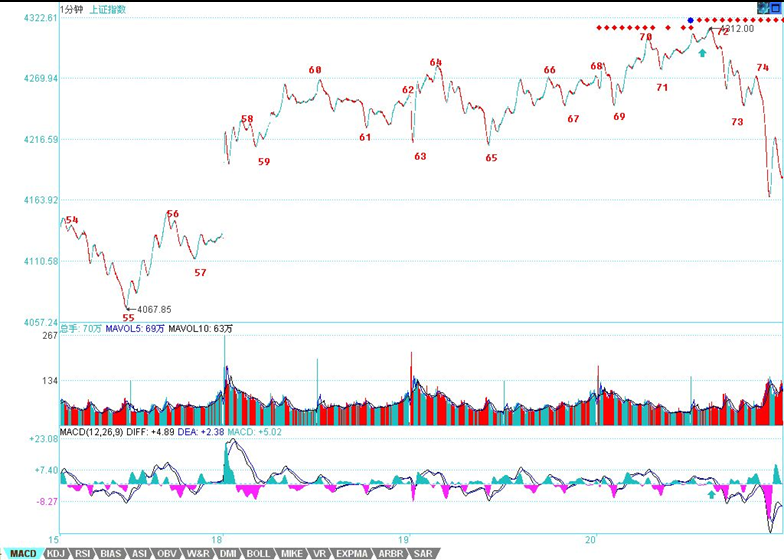

要比较力度，发现背驰，首先要搞清楚是哪两段比较，其实，只要是围绕一中枢的两段走势都可以比较力度。显然，对于60-65这个1分钟中枢，55-60与65开始的一段之间就可以比较。在实际操作中，65开始的走势，由于没实际走出来，所以在和55-60比较时，都可以先假设是进入背驰段。而当走势实际走出来，一旦力度大于前者，那么就可以断定背驰段不成立，也就不会出现背驰。在没有证据否定背驰之前，就要观察从65开始的一段其内部结构中的背驰情况，这种方法可以逐次下去，这就是区间套的定位方法，这种方法，可以在当下精确地定位走势的转折点。

对于65开始背驰段的内部走势，当下走到69时，并不构成任何背驰，为什么？因为背驰如果没有创新高，是不存在的。所以，只有等70点出现时，大盘才进入真正的背驰危险区。由于69-70段与67-68段比并没有盘整背驰，所以70点并没有走的理由，除非你是按线段以下级别操作的。而71点，构成对66-69这1分钟中枢的第三类买点。按照本ID的理论，其后无非只有两种情况，中枢级别扩展或者走出新的中枢上移。对后者，一个最基本的要求就是，从71点这第三类买点开始的向上段不能出现盘整背驰，而在实际中，不难发现，71点开始的走势力度明显比不上69-70段，而对于65-66段，69开始的走势力度也明显比不上，这从两者下面对应的MACD红柱子面积之和可以辅助判断。

因此，65开始的走势是第一重背驰段，69开始的是第二重背驰段，也就是65开始背驰段的背驰段，而71开始的是第三重背驰段，也就是65开始背驰段的背驰段的背驰段，最后当下考察71开始的走势，从走势上红尖头以及MACD上红尖头可以当下知道，71的内部背驰也出现，也就是第四重的背驰段出现了。由此可见，72点这个背驰点的精确定位，是由65开始背驰段的背驰段的背驰段的背驰段构成的，这就构成一个区间套的精确定位，这一切，都可以当下地进行。

对于实际的操作，72四重背驰点出现后，卖是唯一的选择，而区别只在于卖多少。当然，如果是按5分钟级别以及以下级别操作的，当然就全卖了，因为后面至少会形成5分钟的中枢震荡，实际上，60-69就是一个5分钟中枢。而对于大级别操作的，显然不可能因一个5分钟震荡而清仓，所以可以根据5分钟震荡可以容纳的数量进行对冲操作。小资金的利润率，在相同操作水平下，显然要远高于大资金的，例如像这样的卖点，小资金就可以全仓操作，大资金是不可能的。

如果说72的判断有点难度，需要知道区间套的精确定位，那么74的第二类卖点，就一点难度都没有了。唯一有点需要分辨的就是，这第二类卖点，同时又是一个1分钟中枢的第三类卖点，究竟哪个中枢？显然不是70-73这个，因为这里需要满足结合律。一个第三类买卖点，至少需要有5段次级别的，前三段构成中枢，第四段离开中枢，第5段构成第三类买卖点。其实，这里的答案很简单，74点是69-72这个中枢的第三类卖点。也就是说，74点既是一个第二类卖点，又是一个第三类卖点，以前的课程已经说过，一旦出现二、三类买卖点同时出现的情况，往往后面的力度值得关注。实际上，74后面出现更大力度的下跌，这并没有任何奇怪的地方。

对于60-69这个5分钟中枢，69的4244点是一个关键位置，如果在其下出现第三类卖点，那么走势至少将扩展成一个30分钟中枢，调整的幅度与压力就大了。而对于72开始的走势，73很重要，要重新走强，必须冲破73这一点，该点位置恰好也是4244点。因此，短线的4244点十分关键，重新站稳，则大盘将最多是5分钟中枢的延伸震荡，否则即使不演化成5分钟级别的下跌，也将扩展成30分钟级别的中枢震荡。

不管学什么，是否愿意学，首先请先把学的东西搞明白，否则浪费的是自己的时间，还不如不学。本ID的理论，你爱学不学，就像无论你是否相信万有引力，无论你是上帝还是小布什，该存在的依然存在。本ID的理论亦如此，无论任何人学与否，无论你是庄家、管理层还是什么玩意，都不增一分、不减一分，都一样。

因此，千万别学孔男人而成为如孔男人那样的文科生，究竟孔男人那样的文科生是一种什么玩意，看看下面两个连接就明白了。

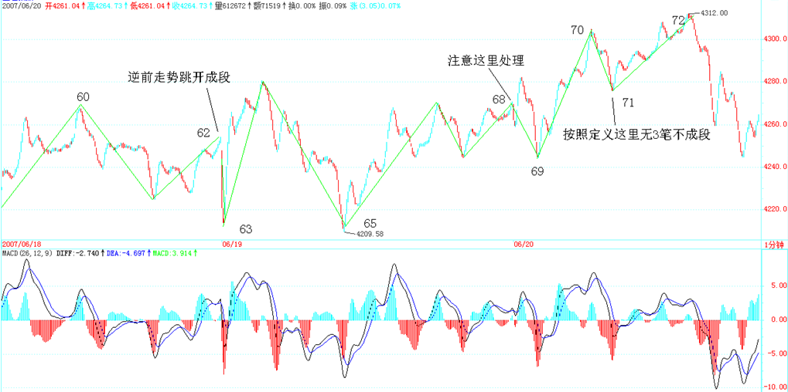

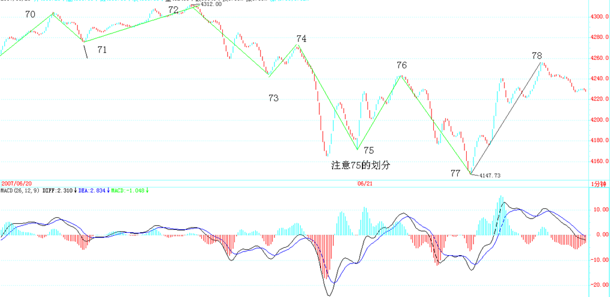

第61课读后感：

1、中枢的意义是什么？对于一个实际操作者来说，中枢的意义就是没有意义，而没有意义就是最大的意义，因为你只要根据中枢的实际走势去反应，问题的关键是你去看明白走势的分解而不是中枢的意义，更重要的就是根据走势的分解去采取正确的反应。

2、股票是用来操作的，而不是用来意义的。

缠中说禅：2007-06-21 15:25:18

如果在看过上面的课程，今天的走势都看不明白不会操作，那你大概要面临两种选择：一、去和孔男人为伍；二、洗心革面、好好学习。上面说到的4244点的技术意义，在今天走势中表露无疑，早上的杀跌补缺口，这次是一个明显的区间套底背驰定位，如果还看不明白，继续加倍努力学习或者放弃孔男人去，自己选择吧。

明天还是这个4244点，站稳就走强，否则继续5分钟的中枢震荡，并且要小心出现第三类卖点。明天又是周末，利空又准备漫天飞，本ID早在前面说过，这里必须用震荡来化解技术、心理、政策的压力，如果整天还是周一看没消息就跳空，然后继续不断震荡等周五，然后周末等消息，这样轮回下去，是走不出坚定有力的行情的，所以关键还是心态，整个市场的心态必须在震荡中修复。今天最低4147点，和本ID反复说的1/2线4144点相差不远，中线关键还是看这线，不破就是强势。

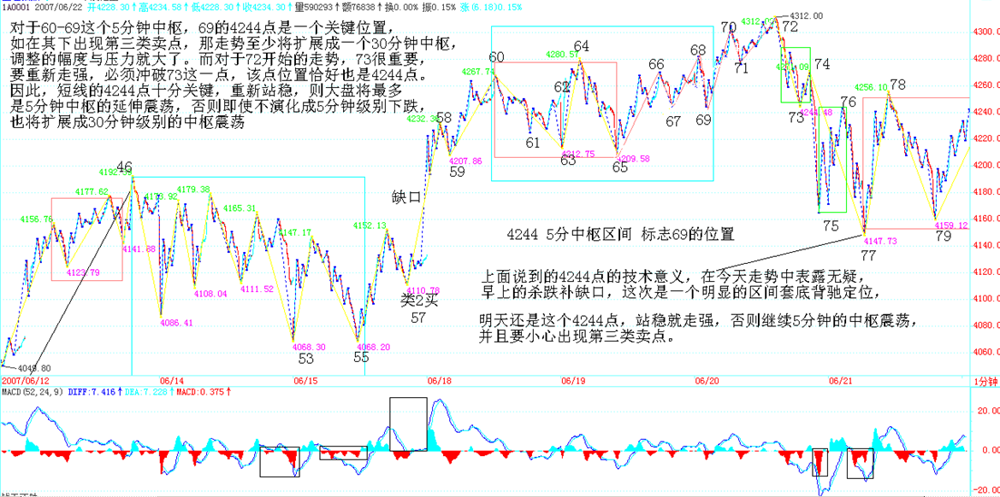

个股方面，本ID那16只股票的剧本一大早就告诉大家了，本ID说的是16只，已经有8只创新高，今天还3只涨停的。为什么不16只一起来，首先这操作不过来，其次，这样是资金利用率最高的，如果你按照这节奏去轮动操作，对于小资金，你这次反弹的收益率如果少于100%，那你的毛病就大了。为什么要看买卖点，为什么要强调节奏，最终都是为了资金的安全与利用率，这对大资金同样的，而对小资金，掌握了节奏，你的效率更高。

注意，本ID的意思不是你一定要买本ID这16只股票，只是事先告诉并直播本ID的操作节奏，让大家去把握其中资金运用的道理。要有效率，必须有节奏，要有节奏，就首先要把握好买卖点，这里的逻辑关系，请好好思考明白。

今天下午有一个聚会，谈谈心、统一一下思想，必须下了，明早见。

[2007-06-22]股市里不动脑子只有死路一条

(2007-06-22 08:30:44)

由于今天收盘后要去出差，第一站湖南，然后还要跑几个省，所以就不想写新东西了。最近这里很热闹，好象有10万的日成交天量出现过，有点不大正常，新人太多，大概也需要风险教育一把了。“股市里不动脑子只有死路一条”这题目，适合一切风险市场，而不光是股市，例如人生就是一个大的风险市场。

可是这世界尽是些不动脑子的人，这些人的心态就是，企图找一个所谓的先知、上帝，然后借着他力就飞上天去了。所以，在股票市场中，那些所谓的股评、黑马推荐到处泛滥，养活这些人的都是这些不动脑子的人。但这世界上，从来没有任何一个搞股评、黑马推荐能成为市场的真正成功者，更不用说那些听股评、黑马推荐而不动脑子的一群。

任何东西，都要经过自己的大脑，就算是本ID的理论，你也必须经过自己的大脑，用自己的脑子去判断。如果某些人的水平还暂时太孔男人，那完全可以对本ID的理论敬而远之，当然不敬而远之也可以，甚至破口大骂都可以，例如可以很孔男人地说“我炒股到你这个水平的时候，你全家都没出生呢？你也敢跟我谈股票？无耻！”。本ID理论的正确，又不在乎有多少人相信，就像即使没有人相信费马大定理是对的，但该定理依然是对的，关于该定理的证明，没几个人能看懂，但对就是对，没任何改变。

学任何东西，都必须究底穷源，如果你还有疑惑，怎么可能操作起来得心应手？特别像本ID的理论，实战性如此强，不透彻理解，怎么可能与走势本身过招？当然，没有任何人有义务去学本ID的理论，甚至本ID一直都建议，如果你对本ID的理论在理解上还有疑问，就别用本ID的理论去操作，特别不能进行级别太小的操作。当然，本ID的理论有很多方面，如果你彻底明白其中一方面，例如同级别分解，那也可以按此操作，前提是你真明白了。

本ID这里不是股评，也没有黑马。本ID在这里说的股票，都是本ID自己实际操作的股票，而且本ID说的时候，基本就是同时在买的时候，那种自己先买后说的活动，本ID才没兴趣干。为什么？因为只要精通本ID的理论，任何股票在任何价位买，其实都不是问题，通过震荡，通过不断差价，本ID总能把他们的成本变成0，只是时间长短的问题。

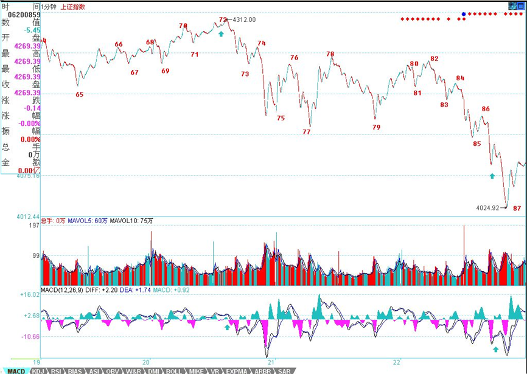

现在本ID做盘已经很温和了，N年前，本ID的风格可不是这样的。例如，有一只东北的股票，当时本ID抢筹码，从9元开始，一直抢到26元，然后展开大幅震荡，N家人在里面打架，成本也大幅度减少，最后拍上38元飞流直下三千尺，前后不过N月。这只是本ID干过的一件小事，那次，基本没散户什么事，谁告诉你股票一定要有散户才好玩的？

去年底开始来这里的人都知道，本ID在这里说股票，第一只就是000999，当时是12月20日前后，价格在6元，本ID也就是同时进去的，后面000416在3元，600635在5元，600777在4元等等，本ID说的时候，也就是本ID开始买的时候。所以，本ID持有股票的时机、成本是完全公开的，但成本只是当时的，现在这些股票的成本都是0。

至于16只股票外3、4月以后说的股票，一只是600607，当时说是抽点汉奸血，当时是13元，后来翻倍后砸出部分让成本变0，这在当天也顺口提醒过了；000338，写诗那天是5月15日，本ID是写完诗后第二天开始进去的，看图形就知道；600139，这股票说的第二天一大早，专门上来说这股票盘子太小，不能乱买，本ID当然也没乱买，可以看看当时本ID说的话，请问够清楚没有？

“缠中说禅2007-05-22 08:49:55

各位请注意，本ID昨天说的股票只是举例子，由于有些盘子太小，例如本ID就在摆弄着一只和那锌锗内容一样的股票，但盘子确实太小，根本就没法说，一说就乱。现在不是2000点了，任何股票都要首先注意风险，必须按照大级别的买点进入。盘子小的，不能乱买，否则盘子就乱，就要洗。各位最好就是按思路去买股票，最好就是继续持有原来已经获利丰厚而依然有大潜力的股票，这样可以减少震荡的风险，否则一窝蜂地去换股票，那就乱套了。”

还有一只是600569，也是5月21日说的，22日就停牌，本ID也都是21、22两天买的，不过这股票有点背，本来要大涨的结果停牌碰上530大跌，所以本ID在复牌6月13日那天明确说：“今天，那关住的钢铁出来，这股票，这里很多人是停牌前一天9元多点买的，至少让各位少了被震的痛苦，逃过一次大跌，如果今天早上反应快的，还能有10%以上的收益。本来，如果没这次大跌，这股票肯定是要连续涨停的，现在只能先清洗一下，让需要用钱的先出来，这也是市场操作中经常要面对的事情，剧本，偶尔也要修改一下的。至于后面的走势，看好技术图形就不难发现了。”如果你在6月13日后还追高买入而不是等待买点再说，那本ID严重怀疑你是孔男人的嫡传弟子。至于本ID自己，去看看60分钟图，这么大一个顶背驰，本ID会麻木不仁吗？对于有大卖点的股票，最大的仁慈就是砸死他，先卖后买，注意节奏，这样成本才能降低，否则成本怎么去变成0？至于600636，本ID也正在慢慢建仓中。

当然，本ID还有几只股票没说过的，600839、000021、000001，这都是本ID在96年那次大牛市中大抽其钱血的股票，买他们纯粹是怀旧，而且参与程度有限，都是元旦前后买的，现在也都成本为0了。002121、002123，这是本ID曾多次说的中小板里6000万总盘，2000以下流通的股票，还有一个002114，都是上市就买，盘子太小，买不了多少，也花不了什么钱，这些依然没完全成本为0，但也快了。

由于很多新来的，都不知道这么多典故，例如还发纸条问“緾姐好！经常前来学习，在你的文章中总提到16只股票，能否告知？昐！”所以就把本ID最早那16只股票列出来，括弧里是说时的价位，也就是本ID自己最开始买时的价位，方便起见，都四舍五入，取整数了。

注意，本ID又不是庄家，虽然比庄家还残暴，但根本不需要任何人抬轿子，本ID现在吸的是庄家血，现在的庄家，都是本ID的晚辈了。所以没有的，最好就是观赏，千万别追高买，技术不好的，就更应该这样。当然，如果低位一直拿着的，当然可以继续玩下去，把这些股票面首玩到精尽人亡为止。但最终，都要自己找吃去，这才不枉来学本ID的理论一场。

000999（6）、000600（5）、000777（8）、600777（4）、000778（5）、000416（3）、000915（3）、000099（4）、600635（5）、600649（6）、600578（5）、600343（11）、000938（10）、600432（19）、000998（9）、000802（10）

出差，主帖就不写了，但每天解盘还是可以继续的，大概下周末能回北京，本周的音乐会就自由活动吧。

### 2007-06-22 解盘

缠中说禅：2007-06-22 15:47:44

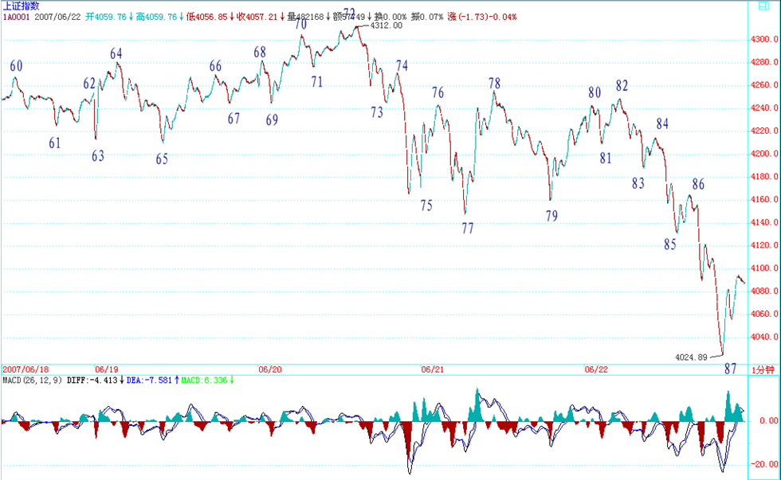

由于要出差，先把这线段图贴出来，否则回来就积累一大堆K线，要分很多张图了。昨天说的很清楚了：“明天还是这个4244点，站稳就走强，否则继续5分钟的中枢震荡，并且要小心出现第三类卖点。”今天的走势在4244点上精确地被再次压制，然后出现大幅度跳水，这些在今天走势的当下都很容易分析。81-82的盘整背驰、84点的第二类卖点，后面走出一个线段的标准下跌，以红箭头所指微型中枢前后出现背驰，然后有87的转折，但这个转折，由于86-87没有背驰，所以，只能是线段下级别的，因此，并不能现在就确定该线段就走完了，除非重新突破85的4131一点。

站在中枢的角度，76-84这个5分钟中枢下边在4188点，如果后面的走势不能重新站上去，就要提防形成5分钟第三卖点。而前面已经说过，现在的情况46-87已经构成一个30分钟的中枢，短线的问题只是这中枢的第三段是否完成。其后就是该中枢的一个中枢震荡，该中枢区间在[4067，4192]，该中枢要管大盘一段时间直到出现30分钟的第三类买卖点。

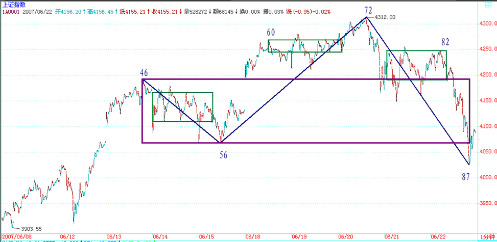

下周走势十分关键，由于关系到月线、特别是季线的收盘，季线如果留出很长上影，则7月到9月的行情压力都很大。所以，对于多方来说，下周的任务就是不让季线留下长上影。只要收在4144点的1/2线上，就是多方最大的胜利。本ID在5月初关于4144点的1/2线要管大盘至少3个月的断言，看来肯定是成立了。

个股方面，就看图作业吧，各位可能都发现，本ID一出差，本ID那些股票都走得没什么力，这也怪不了本ID，大家就当成是巧合，希望里面的大小庄家也别老是这样，这样有意思吗？希望这次有点改变。下周收盘都会解盘的，周末，各位腐败去吧。本ID要去机场，先下了，再见。

[2007-06-23]周末，用股票长沙各位一把

(2007-06-23 16:15:21)

长沙，一个正被一群女性化幼男折腾着的城市，到处散发着腐烂的气息。本ID虽然喜欢腐败，但对女性化幼男的腐烂没兴趣。企图以贩卖中性男女糜烂中国的长沙，最近还有一个娱乐，就是关于所谓中国地王的。相比之下，曾剃头已经算是忒可爱了。

中午刚腐败结束，晚上接着来，接着的一周转战N省，腐败到底。有点空闲，学着画了两图，周末音乐会开不了，就用股票长沙各位一把。图一里的图形都是等价的，都是一线段；图二里，区分了一些容易混淆的。随手画的，各位凑合看吧。

长沙，最大的好处，就是没有任何419的诱惑，至少按照本ID的审美标准，这里是最安全的城市了。在这里还要度过两个安全的、没有诱惑的夜晚。那些没有诱惑的街道，如同卖点过后的下降通道。今晚，湘江上是否有一叶扁舟，浮着轻凉的月光，让本ID去私人股权投资一把？

INCLUDEPICTURE "http://s12.album.sina.com.cn/pic/486e105c02000z9b" \* MERGEFORMATINET 

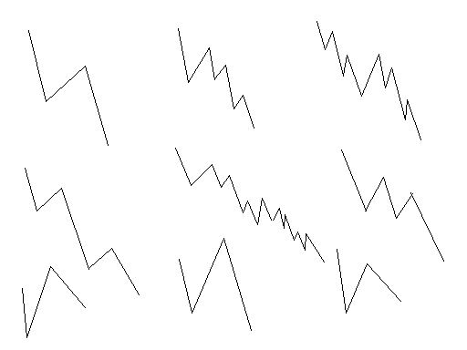

INCLUDEPICTURE "http://s1.album.sina.com.cn/pic/486e105c02000z9c" \* MERGEFORMATINET 

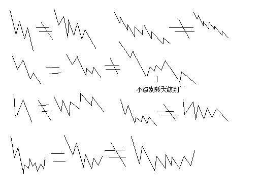

### 2007-06-25解盘

索道复栈道，风雨XX行(解盘附录)

(2007-06-25 19:03:22)

刚游山回来，当地最大几位头正在迎宾馆等着宴会。趁着换衣服的时间和各位打个招呼。本ID今天根本没看盘，两年来头一次，好好地游玩了一下。解盘等应酬后再写。对不起。

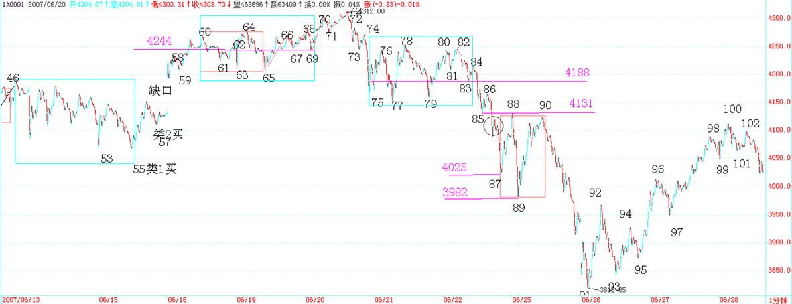

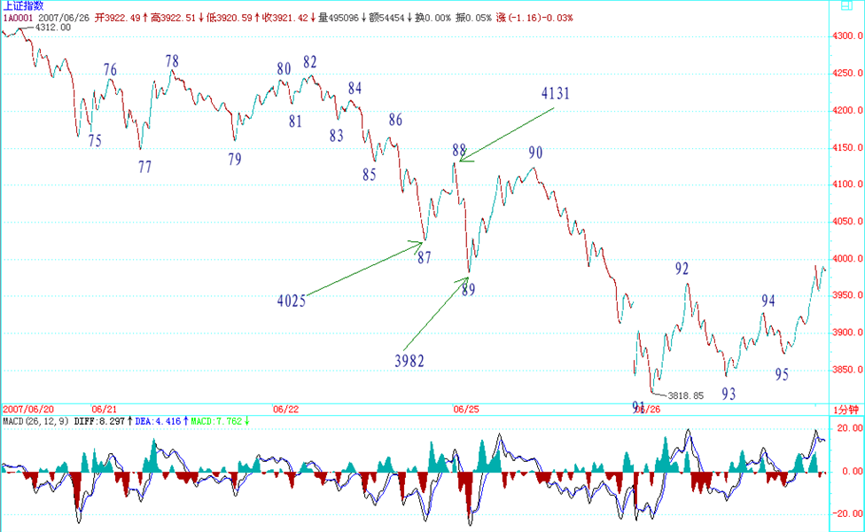

对不起，刚回来，看来和实业沾边的事情都是累人的，哪里有二级市场里杀进杀去来得好玩，至少不用应酬人，一个人，在一个光明或黑暗的角落，就可以呼风唤雨，管你天王老子，本ID该干什么是什么。但和实业相关的事情，就不是这样了。本ID今天游山的兴致，被这晚上的无聊应酬给消磨掉了，看来本ID的性格还是比较适应二级市场。

今天，留守的人都受苦了。本ID上周五说，本ID一出差，股票就不行了，希望这次有点改变，看来还是没戏。技术上，本ID在周五已经说得很清楚了“因此，并不能现在就确定该线段就走完了，除非重新突破85的4131一点。站在中枢的角度，75-84这个5分钟中枢下边在4188点，如果后面的走势不能重新站上去，就要提防形成5分钟第三卖点。”今天的反抽，就像上周的4244，极端精确地最高到4131点，这就是一个很明确的信号，后面的下跌理所当然。目前最关键的位置是4025点，该位置是新的1分钟中枢的下边，这位置不重新站住，大盘还有继续变坏。而3982点也是很重要，如果能重新回到上面，那至少将演化成一个新的5分钟中枢。如果连上面这个最基本的条件都不能满足，那大盘就一定以线段的形式下移到形成一个新的1分钟中枢为止，至于这个位置是多少，没必要预测，当下用背驰的方法很容易判断。

个股没什么可说的，卖点卖了，当然希望下一个买点的距离长点，这样差价才能大点，那些卖点不卖的，只能上上下下去享受了，本ID对电梯没兴趣，本ID只知道卖点出来了要卖，买点要买，你看看现在砸得狠的，日线上有哪个是好的？就看MACD也就知道有麻烦，就别说其他了。当然，跌多了，就要考虑密切关注回补的时机了，买点出现不懂得买，一根筋思维，同样是脑子水太多了。

本ID今天豪饮一把，把加起来N百岁的男猿人给震住，现在脑子里的水分也开始增加，所以不能多说了，明天，解盘时间不能定，但只要有时间，一定第一时间上来的。

看来脑子水有点多了，不是明天，已经是今天了，先下，再见。

### 2007-06-27解盘

对不起刚回宾馆，解盘洗澡后附录上

(2007-06-27 00:20:58)

今天可是看盘了，但一收盘，马上被接去给N百人搞了一场演讲，然后轮番应酬，刚才回宾馆，解盘洗澡后附录上。

本ID已经有点厌倦私人股权投资了，大概需要想想，怎么可以不应酬，也可以私人股权投资一把。最让本ID信心崩溃的，是晚上竟然给拉去卡拉OK，听着那些面首们无数次走调的演唱，本ID给彻底折磨到想见人就痛扁一轮。在卡拉OK里，本ID唯一听过一个人是能让本ID满意的，一个60来岁老男人，80年代初就是师长，现在可以很轻松地唱出高音降E，王宏伟的《西部放歌》随时可以一音不落轻松唱出，本ID觉得他没学歌唱简直太浪费资源了。相貌堂堂，特爷们，可惜年纪偏大，否则，真有面首一把的冲动。

喝多了，废话就多，还是说大盘吧。今天的大盘，哦，对不起，应该是昨天的大盘，一点都没逃离昨天凌晨的解盘所画的圈。大盘就是以线段的形式下移到形成背驰后构成一个新的1分钟中枢，昨天说的3982、4025依然是今天的最关键位置，相应的分析，依然和昨天的一样。

个股方面，昨天已经说了“当然，跌多了，就要考虑密切关注回补的时机了，买点出现不懂得买，一根筋思维，同样是脑子水太多了”，具体没什么可说的，按图操作吧。

明天又要去另一个省，这是本次出来的第三站了，用大幅度震荡来清洗，消化政策等的压力，这近期的策略，前面已经说过，现在依然如此。这是一个练习技术的好机会。本周站在中线角度十分关键，这在上周解盘中已经说过，月线、季线收盘，这对中线走势，有着一定的指导意义。

对不起，现在脑子不好使，被那些五音不全的男猿人折磨得脑子生锈了，先下，再见。

离开某地前解解今日的盘

(2007-06-27 15:29:56)

今天一开盘就突破3982，所以就奠定了全天的强势基础，后面的洗盘不过是突破4000点后的一次回洗，让不坚定分子最后下车，然后就展开一路的上攻。1340的回调刚好在这几天强调的4025，这信号也太明显了。明天，下面看4025点能否继续站稳，上面看上周强调，周一刚好被阻击的4131点能否继续构成阻力。周四，是一个爱震荡的日子，而对周末效应的恐惧，也让明天走势震荡难免。而站在新的5分钟中枢角度，后面的走势，在该中枢第三类买点出现前，都可暂时归于中枢震荡。不会看的，就看4131点，该点没被有效突破前，关键是站稳5日线，这是今后三天大盘的关键，就是5日线要站住，否则还要大幅度震荡。

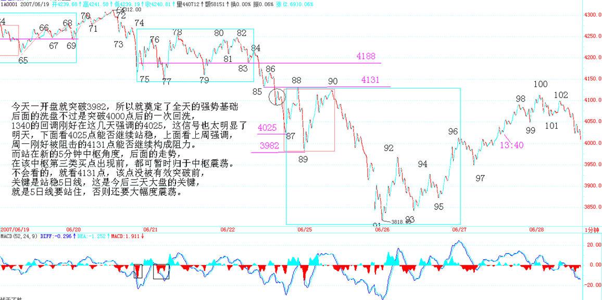

中线，留给多头去修复季度K线的时间只有两天了，这两天很关键，本ID上周就说过，如果能收在4144点1/2线上是最理想的。两天，什么事都可能发生，尽力而为吧。

个股，本ID要提出抗议了，那十几只股票，本ID不看盘就全面堕落，一看盘就兴奋，这也太不地道了。里面的其他人也要干活，别都那么好吃懒做，这样身体会变胖的。一年半载下来，就会和猪八戒为伍了。本ID什么都不会干，就是该砸的时候砸，该买的时候买，现在，这些股票都是在保持0成本赚筹码的阶段，这种游戏很好玩，各位学会的一定会上瘾的，本ID就喜欢上上下下地抽血，是不是本ID的基因里有些残暴的残留？各位，什么时候也能一起残暴，那才是炒股票而不是被股票炒。车来了，马上要走，先下，再见。

### 2007-06-28解盘

一根筋是不适合玩震荡行情的

(2007-06-28 15:53:15)

应酬前抓紧时间说两句。震荡行情是最容易玩出利润来的，但这绝对不适合一根筋思维的人。大盘的中线走势，在前面6月4日的文章里已经明确说过“而5月初给出的技术面分析依然有效，目前这1/2线已经上移到4144点，深圳成分指数相应位置在13700点，能否最终有效站稳该线，是判断中期走势是否重新趋强的关键。在此之前，大盘走势将以震荡形式逐步消化技术面、政策面的压力。其中，目前在3600点附近的5月均线将是判断大盘是否正常调整的关键，只要该线不有效跌破，那么大盘的调整在正常的范围内，否则大盘的调整时间将大为增加。”本月的走势，基本就是在这5月均线与1/2线之间的震荡，而7月，这判断依然成立，但要密切注意突破的方向，因为7月时，5月均线将上移，空间压缩，最迟8月初就要选择突破方向了。之前，就是大玩震荡，狠拉狠砸，把利润给洗出来，把差价打出来。

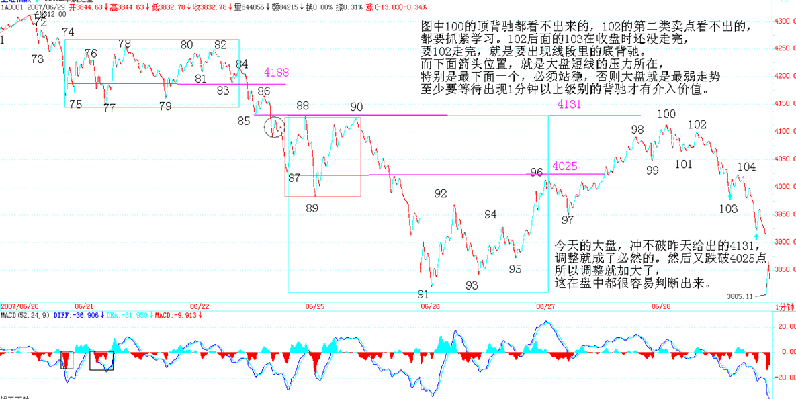

今天的大盘，冲不破昨天给出的4131，调整就成了必然的。然后又跌破4025点，所以调整就加大了，这在盘中都很容易判断出来。实际操作，特别对待震荡行情，就是要敢卖敢买，该卖一定要卖，反而买却不一定，特别对技术有点问题的，仓位可以控制好。当然，技术没问题的，这里就是天堂，一定要记住本ID的多次忠告：股票都是废纸，只有能弄出差价来才是抽血，否则上涨下跌不过是坐电梯，和你有什么关系？而要弄差价，用中枢震荡的手法，就是最好的，这需要刻苦的学习和练习。

把图弄上来花了点时间，图中100的顶背驰都看不出来的，102的第二类卖点看不出的，都要抓紧学习。102后面的103在收盘时还没走完，要102走完，就是要出现线段里的底背驰。而下面箭头位置，就是大盘短线的压力所在，特别是最下面一个，必须站稳，否则大盘就是最弱走势，至少要等待出现1分钟以上级别的背驰才有介入价值。

忙，晚上又有应酬，下周才能回北京，季K线收得不会太好看了，这中线的大震荡延续时间不会短，学会震荡操作，将让你在这中线大调整中获利良多，好好学吧。

多说句废话，中国第一只在德国交易所交易的股票将在7月初挂牌，这是中国第一创投公司的杰作，7月底还有韩国交易所的第一只股票，这两枪打响后，估计私人股权投资要加温了。

先下，再见。

解盘：

刚打开电脑，上来看看，发现有人对昨天的线段分法有疑问，这问题以前说过，就是关键是看你用多大的精确度。下图中，红箭头处是4022.69，绿箭头处是4022.42，按最严格的标准，精确到小数点后两位，这就没破坏原来的线段，所以就不是新的线段。当然，如果统一按个位数是精确度，直接取整，那么这就等于两处有重合，那按这标准，就可以定义为新线段（像下图一样）。但如果按四舍五入，那前面是4023，后面是4022，就不能这样定义了。

新线段的一个最重要标准就是一定要破坏老线段的结构，例如下跌的线段，后高点一定低于前低点。

为了照顾各位的习惯，也为了简单，以后就统一标准，用直接取整的办法来确认。所以，线段分类就可以改用下图了。先下，下午收盘后见。

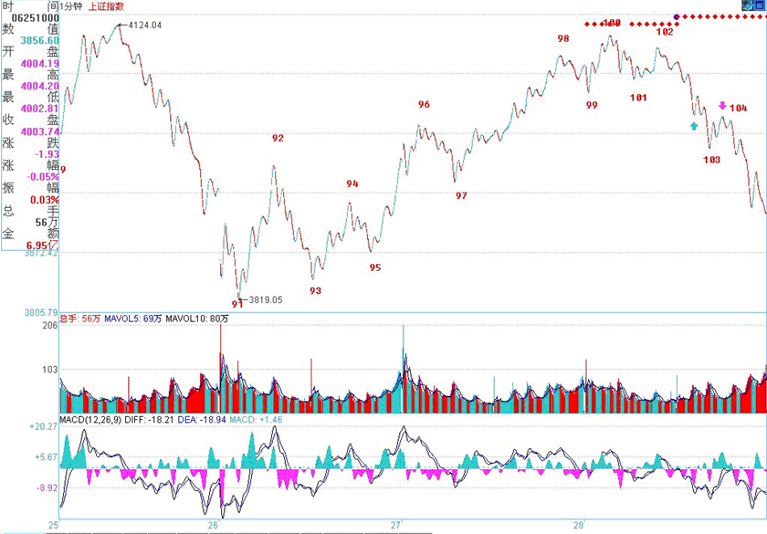

### 2007-06-29解盘

解盘并说说中短线走势

(2007-06-29 15:45:10)

昨天解盘中已经说到，如果图中红箭头所指位置不能突破，那么大盘就是最弱走势，今天，大盘盘中的反弹就刚好被这位置3919点所压制，一点都不差，这就如同前面的4244、4131等一样，都是极端精确的。谁告诉你本ID理论没有预测功能的，只是预测都是无聊玩意，没必要浪费时间。关键还是当下的操作。

今天105的背驰十分简单，但由于前面没有明确的1分钟中枢，所以这种背驰一般都只构成盘中的意义，昨天已经说过，只有1分钟以上级别的背驰才有参与意义。目前交易成本这么贵，又不是T+0，所以不熟练的，一定只能参与一些大级别的活动，太小的，估计只能用在权证或特别强势的股票上。但技术好的除外。今天，这样的震荡可以又吸出不少的血。

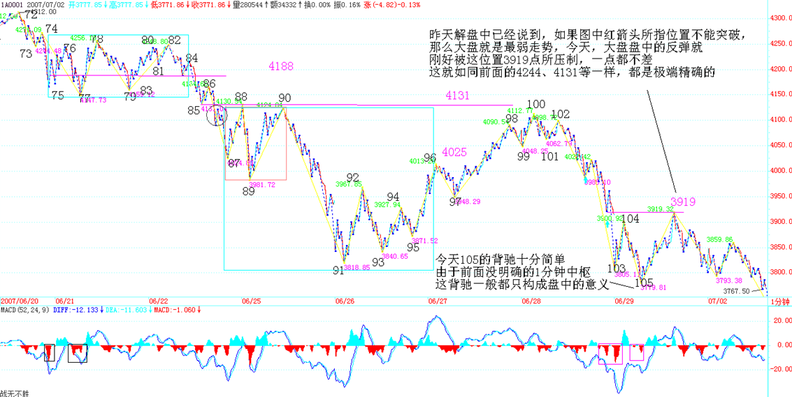

由于季线有500点的上影，所以该上影将一路压制7-9月的走势，本ID的那条1/2线，下月将上移到4159点，在站稳该线之前，大盘不可能展开象样的行情，只能如本ID6月4日文章所说，就是一个大震荡。下月的关键是5月均线，如果不破，那么大盘还有机会走三角形的整理，否则，一个平台型是不可避免的。本ID在6月5日反弹时已经明确说过，这个反弹最终不可能演化成V型，现在看来，最强的也就是三角形，其次是平台型，所谓平台型，就是要再次考验6月5日的低点。

当然，现在大盘依然存在走三角形的可能，下周是关键，5月均线不能有效跌破，而好的介入时机，还是至少是1分钟以上级别的背驰，反弹的压力，3919以及最重要的是5周均线。对于技术不好的，对震荡行情没把握的，在5周均线重新站稳之前，都可以不参与任何活动，多读点本ID的帖子更好。但是，像技术好的，如同本ID般经常要活动一下才舒服的，就可以在震荡行情中大吸其血。

注意，玩震荡一定要等适合自己资金的针对具体个股的较大买点，然后到较大级别卖点一定要卖，否则就是坐电梯，没意义了。这种活动必须多练习才有感觉的，如果觉得自己没有这方面的天赋，那就少弄，上网多弄419算了。

晚上还有应酬，先下了，本周的音乐会也没法开，就用各自猛烈的腐败活动去替代。周末，腐败快乐。

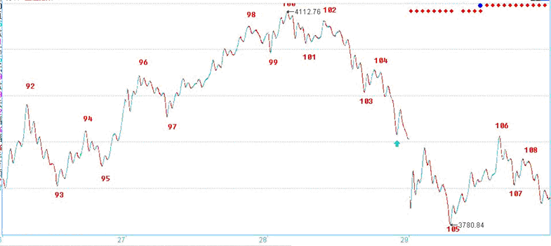

## 教你炒股票62：分型、笔与线段

(2007-06-30 09:49:51)

在宾馆里闲着等着10点开始的腐败，半个小时，找个面首来面首有点时间紧张，还不如给各位写个主贴，来个课程，耗费一下各位周末腐败的时间。

瞧了一下，有位叫石猴的网友写了帖子来解释什么是线段，他的理解还行，但不够严密。其实，本ID的线段是可以最精确定义的，本ID的理论，本质上是一套几何理论，其有效性就如同几何一般，本ID理论当然有失败不严谨的时候，但这前提是几何的基础失败不严谨，不明白这一点，就不明白本ID的理论。这里，就把本来是后面的课程提前说说。

下面的定义与图，都适合任何周期的K线图。先看图中的第1、2，图中的小线段代表的是K线，这里不分阳线阴线，只看K线高低点。

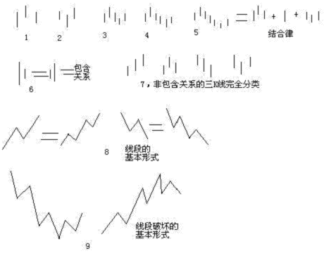

像图1这种，第二K线高点是相邻三K线高点中最高的，而低点也是相邻三K线低点中最高的，本ID给一个定义叫顶分型；图2这种叫底分型，第二K线低点是相邻三K线低点中最低的，而高点也是相邻三K线高点中最低的。看不明白定义的，看图就明白了，这么直观都不明白，那去和孔男人为伍吧。

顶分型的最高点叫该分型的顶，底分型的最低点叫该分型的底，由于顶分型的底和底分型的顶是没有意义的，所以顶分型的顶和底分型的底就可以简称为顶和低。也就是说，当我们以后说顶和底时，就分别是说顶分型的顶和底分型的底。

两个相邻的顶和底之间构成一笔，所谓笔，就是顶和底之间的其他波动，都可以忽略不算，但注意，一定是相邻的顶和底，隔了几个就不是了。而所谓的线段，就是至少由三笔组成。但这里有一个细微的地方要分清楚，因为结合律是必须遵守的，像图3这种，顶和底之间必须共用一个K线，这就违反结合律了，所以这不算一笔，而图4，就光是顶和底了，中间没有其他K线，一般来说，也最好不算一笔，而图5，是一笔的最基本的图形，顶和底之间还有一根K线。在实际分析中，都必须要求顶和底之间都至少有一K线当成一笔的最基本要求。

当然，实际图形里，有些复杂的关系会出现，就是相邻两K线可以出现如图6这种包含关系，也就是一K线的高低点全在另一K线的范围里，这种情况下，可以这样处理，在向上时，把两K线的最高点当高点，而两K线低点中的较高者当成低点，这样就把两K线合并成一新的K线；反之，当向下时，把两K线的最低点当低点，而两K线高点中的较低者当成高点，这样就把两K线合并成一新的K线。经过这样的处理，所有K线图都可以处理成没有包含关系的图形。

而图7，就给出了经过以上处理，没有包含关系的图形中，三相邻K线之间可能组合的一个完全分类，其中的二、四，就是分别是顶分型和底分型，一可以叫上升K线，三可以叫下降K线。所以，上升的一笔，由结合律，就一定是底分型+上升K线+顶分型；下降的一笔，就是顶分型+下降K线+底分型。注意，这里的上升、下降K线，不一定都是3根，可以无数根，只要一直保持这定义就可以。当然，简单的，也可以是1、2根，这只要不违反结合律和定义就可以。

至于图8，就是线段的最基本形态，而图9，就是线段破坏，也就是两线段组合的其中一种形态。有人可能要说，这怎么有点像波浪理论，这有什么奇怪的，本ID的理论可以严格地推论出波浪理论的所有结论，而且还可以指出他理论的所有不足，波浪理论和本ID的理论一点可比性都没有。不仅是波浪理论，所有关于股市的理论，只要是关系到图形的，本ID的理论都可以严格推论，因为本ID的理论是关于走势图形最基础的理论，谁都逃不掉。

不能再废话了，下面车来了，腐败开始，大家也腐败去吧。

第62课读后感：

K线顶分型、底分型：

第二K线高点是相邻三K线高点中最高的，而低点也是相邻三K线低点中最高的，本ID给一个定义叫顶分型”；“底分型，第二K线低点是相邻三K线低点中最低的，而高点也是相邻三K线高点中最低的”。

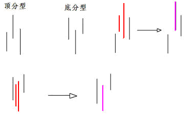

2、顶分型的最高点叫该分型的顶，底分型的最低点叫该分型的底。顶分型的顶和底分型的底就可以简称为顶和低。也就是说，当我们以后说顶和底时，就分别是说顶分型的顶和底分型的底。

3、笔：两个相邻的顶和底之间构成一笔，所谓笔，就是顶和底之间的其他波动，都可以忽略不算，但注意，一定是相邻的顶和底，隔了几个就不是了。一笔的最基本的图形，顶和底之间还有一根K线。在实际分析中，都必须要求顶和底之间都至少有一K线当成一笔的最基本要求。

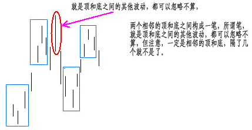

4、新笔定义：本ID想了想，计算了一下能量力度，觉得以后可以把笔的成立条件略微放松一下，就是一笔必须满足以下两个条件：1、顶分型与底分型经过包含处理后，不允许共用K线，也就是不能有一K线分别属于顶分型与底分型，这条件和原来是一样的，这一点绝对不能放松，因为这样，才能保证足够的能量力度；2、在满足1的前提下，顶分型中最高K线和底分型的最低K线之间（不包括这两K线），不考虑包含关系，至少有3根（包括3根）以上K线。显然，第二个条件，比原来分型间必须有独立K线的一条，要稍微放松了一点，这样，象今天绿箭头所指的地方，就是一笔了，相应那三笔下来就构成一段了，整个划分就不会出现比较古怪的线段。

5、上升K线、下降K线：

K线的顶点和底点越来高的几根K线称上升K线。一般第二根K线的高点比第一根的K线的顶点高，就视为上升K线。

K线的顶点和底点越来低的几根K线称下降K线。一般第二根K线的低点比第一根的K线的低点低，就视为下降K线。

6、包含处理：实际图形里，有些复杂的关系会出现，就是相邻两K线可以出现如图6这种包含关系，也就是一K线的高低点全在另一K线的范围里，这种情况下，可以这样处理，在向上时，把两K线的最高点当高点，而两K线低点中的较高者当成低点，这样就把两K线合并成一新的K线；反之，当向下时，把两K线的最低点当低点，而两K线高点中的较低者当成高点，这样就把两K线合并成一新的K线。

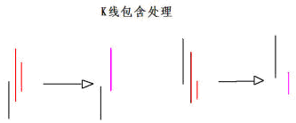

 HYPERLINK "http://photo.blog.sina.com.cn/showpic.html" \l "blogid=6223e8fb0100gza6&url=http://static2.photo.sina.com.cn/orignal/6223e8fbt7a7d70e1feb1&690" \t "_blank"

7、笔的基本形态：

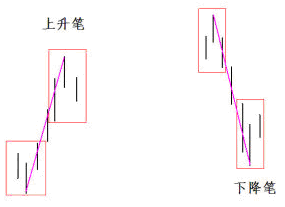

8、新笔定义与老笔定义的细微差别：

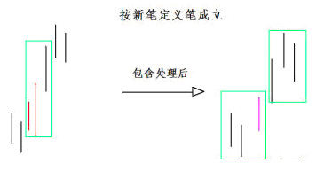

9、不能成立的笔：

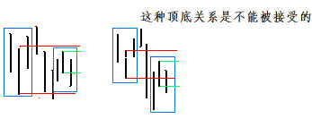

[2007-07-01]必须和企图捣毁共和国基础的舆论进行坚决斗争

(2007-07-01 12:06:06)

本ID眼里揉不进沙子，汉奸配合美国人对中国的颠覆是全方位的，趁着午饭前的十分钟，必须写几句。

最近，有人开始有计划地去反思所谓土改的旧帐，说什么分地即全体犯罪、土改是忽悠农民造反、地主其实都是老好人，诸如此类。任何人要摧毁一个国家，最简单就是从其历史下手，美国这面首的历史，从来都是最肮脏的，但谁在粉饰？历史本来就是铁和血，用某种绝对的道德标准来摧毁历史，就是这些人的一贯伎俩。但历史从来不是道德的，历史无法摧毁，所有对历史的谈论、摧毁，都不过为了现实的利益服务。

新中国当然要砸破一切旧的法律，这有什么可说的？企图用旧中国法律来规定新中国的行为，无聊且可笑。农民，把一切现存的当成天经地义的，就是要忽悠他们，告诉他们没有任何现存是天经地义的，一切生产关系，都是要被历史所打破的。地主，被个体的消灭，无须什么矫柔造作的眼泪，历史就是这样，历史就是铁和血。

被忽悠的，都是能被忽悠的。历史的真理就是：被忽悠的都是能被忽悠的。谁有本事，现在忽悠大家重新回到原始社会吧，看能还是不能？历史的另一条真理就是：对待忽悠，可以用忽悠对待，也可以用枪杆子对待，而且历史最终都在证明着，不懂得枪杆子，放弃枪杆子的，不是别有用心，就是天字一号的大傻蛋。

好了，十分钟快到了，先下，再见。

## 教你炒股票63：替各位理理基本概念

(2007-07-02 00:07:39)

在外面时间有点长，再好的宾馆也没家里好，有点想北京。明天就可以回北京了，3号还要去听一场音乐会。不过在北京也待不了几天，下周又要去一次深圳，唯一希望就是能赶上最后的荔枝，糯米糍、桂味什么的，在北京吃不到好的，不知道是否过了季节。闲着没事，就随手写一课程，希望对各位有帮助。

一个对象的确立，特别是一个数学和几何对象的确立，首先要证明其存在性，如果你说的那东西根本就不存在的，那还说什么？例如中枢或走势类型这对象，如果不能证明其一定存在，而且是按级别存在的，那谈论就没意义了。所以，前面关于中枢的递归定义，就是解决这个问题的，是解决存在性问题。也就是说，中枢是可以递归式地定义出来的，而该定义是可操作性的，该定义实际上是如何找出中枢的一种方法，按照这种方法，就肯定能找出定义中的中枢。

但是，光是存在性定义或定理没什么意义，所谓的可操作性，有时候只是理想化或者数学化的，例如，可以证明自然数的质数分解是唯一的，而且可以很理想化地去设计这种寻找，但实际上用最大的计算机也往往不可能完成，因此就需要变通的方法来方便实际操作。同样道理，对于中枢和走势类型，也就有了关于不同级别的图形的研究。否则，都从最原始的分笔成交去逐步定义、寻找，那这可操作的操作也没什么操作性了。

进而，就有了不同级别显微镜的比喻。而实际上，一般能得到的图，最多也就是1分钟级别的，因此，可以从这个图入手。当然，也可以从5分钟，甚至更高入手，但这就等于把显微镜倍数弄小了，看到的东西自然没有1分钟的多且清楚。再次强调，什么级别的图和什么级别的中枢没有任何必然关系，走势类型以及中枢就如同显微镜下的观察物，是客观存在的，其存在性由上面所说最原始的递归定义保证，而级别的图，就如同显微镜，不同倍数的看这客观的图就看到不同的精细程度，如此而已。所以，不能把显微镜和显微镜观察的东西混在一起了。

如果我们首先确立了显微镜的倍数，也就是说，例如我们把1分钟图作为最基本的图，那么就可以开始定义上一课程说的分型、笔、线段等等。有了线段，就可以定义1分钟的中枢，然后就是1分钟的走势类型，然后按照递归的方法，可以逐步定义5分钟、30分钟、日、周、月、季度、年的中枢和走势类型。而有的人总是不明白，例如总是在问，5分钟图怎么看，30分钟怎么看，其实，如果你选择5分钟或30分钟为最基本的图，那么和1分钟的看法一样，只不过你的显微镜倍数比较小，看起来比较粗糙而已。而如果你已经选择1分钟作为最基本的图，也就是选定了1分钟这个倍数的显微镜，那么看1分钟图就可以，所以，本ID也就不断在1分钟图上进行线段的记号来示范。

那么，有人可能要问，如果用1分钟图这显微镜，5、30分钟等图还有用吗？当然也是有用的，例如走出一个1分钟的走势类型，已经完成了，就可以在5分钟图上相应记号上，这样的一个好处就是帮助记忆，否则当1分钟图上的线段成千上万时，肯定要抓狂的。而有了5、30、日等图，就把相应已经完成的走势类型记号上，实际上，在1分钟图上需要记住的，只是最近一个未完成的1分钟走势类型。当然，由于分解的多样性，实际上需要知道的要多点，这里只是站在一种分解的角度说的。另外一个好处就是看MACD辅助判断时，不用对太多的柱子面积进行相加，可以看大级别的MACD图，这样一目了然。日线的背驰，其实在1分钟图上也可以看出来，只不过是需要把所有相应对比段的MACD都加起来进行处理，这样当然是不切实际的，因此就可以看日线图的MACD，在理论上没有任何特别之处，只是为了方便，如果用1分钟的MACD把参数调到足够大，效果其实是一样的，而实际上不可能，一般软件上，MACD的参数有上限限制，所以实际上也限制了日线的背驰不能用1分钟的图解决。

有人可能又要问，为什么5分钟图上不记号5分钟的走势类型？因为，在大级别图上记号次级别的走势类型有一个好处，就是能让你清晰地看到该级别的中枢和走势类型是如何形成的，这样会更直观。当然，如果在5分钟图上，你愿意记号30分钟甚至年线的走势类型也没什么，这是个人爱好问题。如果你有超强的记忆和分析力，甚至就在1分钟上记号就可以，如果你更牛一点，对图形过目不忘，像计算机一样自动就可以分类合并，那你在1分钟图上连记号都不用了。

说点更实际的问题，一般人面对一只股票，不可能就先看1分钟图，大概都是先从日线，甚至周、月、季、年入手，这样等于先用倍数小的显微镜，甚至是肉眼先看一下，然后在转用倍数大的，进行精细的观察。因此，对于大级别的图，上一课中的分型、笔、线段等同样有用，不过，一般这个观察都是快速不精细的，所以大概精确就可以，而且，一般看图看多了，根本就不需要一步步按定义来，例如，打开日线图，1秒钟如果还看不明白一只股票大的走势，那就是慢的了。基本上说，如果图看多了，成了机械反应了，一看到可搞的图，就如同看到可搞的面首一样。一见钟情，科学研究说大概不需要1秒，股票如同面首，如果不能1秒之内一见钟情，估计这股票也和你没什么缘分，最多就是有缘无分空折腾了。

别觉得本ID整天把股票和面首联系在一起有点不太地道，但人这身体都是从性而来，股票的道理和性的道理没什么区别当然也没什么可奇怪的，这道理在前面的课程里已经说过。如果，你能把你的性能量转化到股票上，有了那种一见钟情的直觉，那么就算是有点入门了。而前面的理论分析，最终还是要归到这种直觉上去。说得更直接一点，例如在419这种事情上，无论男女，其实决定是否419，都是在1秒内决定的，股票同样，是否和股票419，也一样。当然，有些419让后悔终生，有些让你怀念终生，这和股票是一个道理。而真正的419高手，就是一眼就要把一个人给看透，而且知道自己需要什么，该要什么，什么不该要，要了的要甩得开，如雁过长空，否则就不是419了。股票也一样，股票的走势如同面首在搔首弄姿，一眼要看穿其把戏。当然，股票比面首可爱的地方在于，面首的搔首弄姿只有一个方向，而股票有三种可能的状态，这也决定了，面首面首是有厌倦的时候，而股票股票则不一定。

但在没有这看破一切的一眼前，就别把自己当情圣了，老老实实在家里抱孩子吧，花心萝卜是需要功力的。股票也一样，没有这超越的直觉，还是老老实实去分析，在大级别图粗略选定攻击目标后，就要选好显微镜，进行精细的跟踪分析，然后定位好符合自己操作级别的买点建仓，按照相应的操作级别进行操作，直到把这股票玩烂、直到厌倦或者又发现新的更好的可玩弄对象为止。而站在纯理论的角度，没有任何股票是特别有操作价值的，中枢震荡的股票不一定比相应级别单边上涨的股票产生的利润少。

只有坏的操作者，没有坏的股票。股票只是废纸，本质上都是垃圾，如果技术、心态不到位，任何股票都可以让你倾家荡产。当然，对于小资金来说，一定要选择股性好的股票；而对于大资金来说，股性是可以改造的，就如同没有面首是不可以面首的，只是代价不同而已，股票也一样，任何股票的股性都可以被改造，只不过需要的能量不同而已。

不写了，已经又一天开始了，本ID也要洗洗睡了，先下，今天收盘后解盘见，然后本ID晚宴后赶最后的班机回北京，归心似箭，周二，盘就可以在北京看了，再见。

第63课读后感：

1、中枢的递归定义，是解决中枢或走势类是按级别存在的存在性问题。

2、不同级别显微镜的比喻。

3、只有坏的操作者，没有坏的股票。

4、股票只是废纸。

### 2007-07-02解盘

解盘：今天看不明白的都请严重补课。

(2007-07-02 15:32:58)

今天的走势，简直是标准教科书，连这都看不明白，你要严重补课了。下图中110点的线段里的小顶背驰，111点的小底背驰，都是极端标准的。111点，看不明白的，看看MACD里那两个红箭头指着的绿柱子面积比。如果还有人问，为什么前面的不是，就一定要把分型、笔、线段那课以及63那课好好看了。图中红箭头处，趁着现在1分钟图还能看到，请去好好研究那为什么是一笔，那底分型是怎么构成的，这都有最严格的标准。

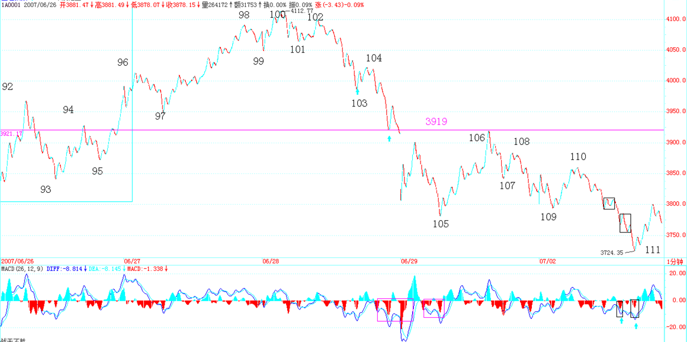

至于走势，没什么可说的，就是震荡，这里是本ID理论的天堂，如果说单边势傻瓜都能赚钱，那么这种市场，就不是一般人能把握的了。能把握，就有了一个好的吸血机器，练习好了，那算有点模样。具体的中枢分析，本ID不准备说了，有这么明确的线段划分，按照递归定义，答案不难得到，如果这都不练习一下，那就没法学了。大的技术位，和周五说的没什么不同，唯一需要补充的，就是图中107这一点，如果能站稳，至少这中枢震荡是有保证的，上面还是3919点是第一压力，现在，等于成了一颈线位置了。再上面，就是5周均线的位置。大图上说，今天是受到5月均线的支持产生的反弹，这线最重要，三角形还是平台型，就看这5月均线是否有效跌破了。

注意，再次强调，这种震荡行情，没什么基础的，最好就观望，半仓、空仓都无所谓，没这本事，就不一定玩这游戏，当然，如果你要学习，要练习，可以用少量资金。对于初学者，震荡的原则就是，宁愿卖早，一定不卖晚，有钱，还怕买不到股票？

个股方面，本ID那些股票各位都知道，除了新进去的二、三只，本ID现在是在保持0成本赚筹码阶段，震荡幅度越大越高兴，技术不好的、心脏不好的，千万别参与，找些脾气好点的股票，本ID的股票，一般脾气都不大好。先下，下午、晚上，忙，还要赶回北京。明天见。

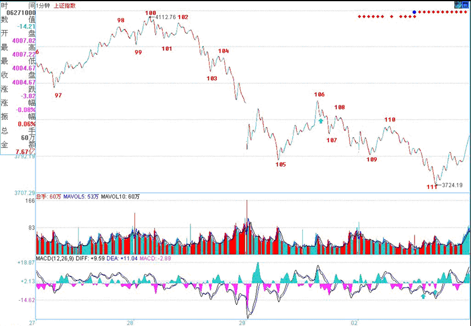

## 教你炒股票64：去机场路上给各位补课

(2007-07-02 21:37:44)

现在的课已经越来越精细，特别用的是最小的1分钟，一般的理论，在这么精细、偶然性那么大的图上都要乱套了，但却恰好能显示本ID理论的有力。别说1分钟图，分笔图也没问题，这就是本ID理论所构筑几何结构的力量。世界都是几何的，别说那几张无聊的走势图了。

看下图，为什么下午的分段是这样？大概很少人现在就能全部搞清楚，所以，为了让各位能睡一个塌实觉，也为了免得等一下飞机万一不听话，到时候只留下各位在这里争论不休没人再给解答，所以本ID在去机场的路上用本本给各位补上一课。

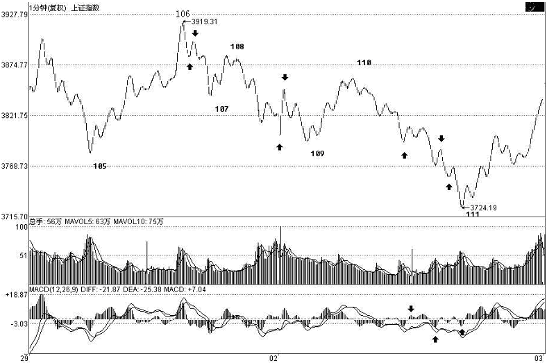

106到107这一段箭头所指的那一笔，用的是取整的前提，所以，只要你仔细去分析，就知道那一定是一笔。这个问题，本ID瞧了一下，见一位叫 HYPERLINK "http://blog.sina.com.cn/u/1224589325" \t "_blank" 快乐vs菜虫的网友已说到。当然，你可能要问为什么一定要取整？这没有什么必然性，只是预设的前提，你可以采取严格到小数后两位的精确度，但其实不同软件，对1分钟这么精细的图，都会有数值上的细微差别，所以，所谓的精确，往往不一定就是，而在这么快速变动的市场中，数值有点细微差别，其实没什么不同，例如，还可以用这样的区别方式，就是两者相差0.5点内的看成是一样的。所有预设精度，唯一必须遵守的，就是精度一旦预设，就一定要一路保持。

注意，没有什么精度是十全十美的，例如用相差0.5内看成是相同的，那么如果是0.51呢？这和0.49也没有多大区别。所以这些细节，其实问题都不大，关键是要统一，不要变来变去。由于现在只是示范，为了方便各位学习，就一直继续采用取整的精度，各位可以根据自己的情况来调整。

至于108-109，带箭头那笔为什么不被算成一段？也就是108-109为什么不是三段？这很简单，因为段必须是至少三笔构成，缺口如果包含在一笔中的，像今天早上低开的缺口，没有破坏昨天那笔，是顺着昨天那笔下来的，所以这种缺口和一般的走势没什么区别，缺口还是包含在昨天的一笔里。但有些突然性的逆着走势来的缺口，就像530那个，就必然要当成一段，而不能光当成一笔或一笔里的了。有人可能说，缺口没有三笔？那你可以这样去看，就像0=0+0+0，缺口可以看成是三个缺口的迭加，这样就有三笔以上了。还有，有位叫袖手旁观的网友理解得也不错，线段必须要被破坏才算结束，但必须要强调的是，线段必须要被线段破坏才算是真破坏，单纯的一笔是不能破坏线段的，这就避免了一些特偶然因数对走势的干扰。

至于110-111。红箭头那两个为什么不是最终精确定位的背驰点？这都是些以前就应该解决的简单问题。像第一个红箭头位置，第一次略微跌破109那位置，这时候把已经出现的面积和前面108-109的对应面积之和比，已经十分接近，也就是说110-111，刚起跌，这力度已经和前面的108-109差不多，这恰好说明这一段的力度是很强的，不但不可能是对108-109背驰，而且站在中枢震荡的角度，这种力度，一定是小级别转大级别以时间换空间或与更大力度的对比产生的背驰才能化解的。后面这种情况，在这个实际的图形中，就是与前面104-105的下跌力度比。110-111这段，相比较的，是104-105这段，中间的中枢震荡的中枢，是105到110这个。因此，这里根本不存在与108-109对比的问题。站在105-107这个中枢的角度，110虽然不构成第三类卖点，但也极为接近，这种对中枢的离开，力度一般都很大，所以就算你搞不清楚和哪段比，也至少要等这段的结构被破坏，才有介入的可能，而后面，上下上的两次反抽，根本就没有破坏其结构，因此后面的破位下跌就是天经地义的。

机场到了，先保存起来。

挺好玩的，帖子分两段写，中间过一安检。继续。

至于第二红箭头那个，就更不可能是了。绿箭头那次反抽，等于对前面破位前那上下上的微型类中枢（注意，站在严格意义上，线段以下是没有中枢的，所以说是类中枢）的一个类第三类卖点，后面有两种变化，就是转大级别类中枢或类中枢移动直到形成新类中枢为止。而下面的黄白线，是一个典型的下上下结构中的第二下刚破上的低点，这是力度最大的一下，怎么可能有背驰出现？MACD第一个红箭头就指这大的下上下破的一下，这时候除非出现线段结构的突发性破坏，否则不可能有什么背驰出现。而后的回拉，其实刚好构成一个奔走型的上下上结构（也就是第二上刚和第一上的低点稍微重合），这其实也就构成另一个微型类中枢。这和第一个红箭头指的那个一起，刚好构成两个类中枢的下跌走势。然后，后面的背驰判断就很简单了，和一般的趋势中背驰的判断一样。针对第二那奔走型的微型中枢的前后两段，MACD两个红箭头对应的绿柱子的比较，一目了然。（千万别再问这时候为什么不看黄白线之类的问题，这类问题回答过N次了。）

请各位好好把各类情况消化好，特别一些最基本的知识，一定要掌握，62、63课，要完全吃透，而且能当下应用。当然，这需要不断练习，不断研究不同的图形。

本ID就不再说什么了，准备登机。回到北京，也快第二天了。先下，明天见。

### 2007-07-03解盘

今日解盘：3919颈线折磨你

(2007-07-03 15:30:02)

一回来，N多的腐败活动，今晚又要看演出，所以只能粗略说说。今天的大盘，就是在这N天反复强调的3919颈线下进行的蓄势，现在，图形上头肩底的雏形已经基本按剧本构造完毕，但如果颈线突破不了，那还是白搞。现在，人心涣散，谋事能成的概率，当然没有前面的多了。现在，剧本中最好的情节，就是走三角形，这次上去是D段。但这次的把握性，比上次B段那次要差，剧本只能按每天一步步演，下面最关键的就是这颈线的突破与回抽确认，但现在人气涣散，最主要是现在有些人，不断放暗枪，特别那些等额度的，肯定不想上，希望走平台型，因此不断捣乱。而走三角形的，又不一定很团结，只能见一步走一步，但本ID会尽力的，能走到哪里算哪里。

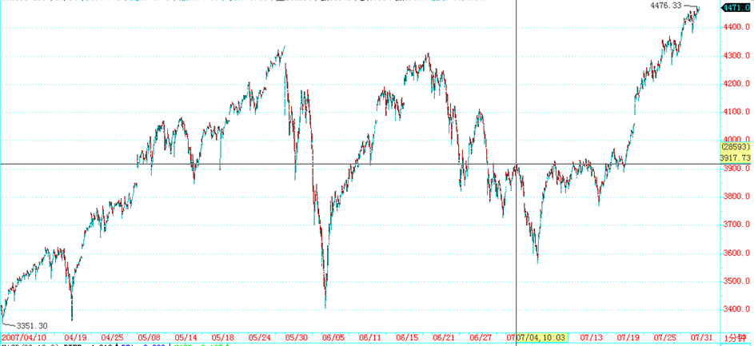

今天本ID已经足够出力了，16只里3只9%以上，而且还有其他活不能公开的，也算本ID回北京第一天的一个见面礼了，但本ID从来不当解放军，只是煽风点火、顺势而为，别指望本ID当举杠铃的。那种一根筋的多头思维，是典型的散户思维。

注意，一旦大盘不配合，本ID依然如前面那些，砸起来比谁都凶。本ID现在是保持0成本赚筹码阶段，最喜欢的就是砸盘。当然，只要大盘人气配合，本ID依然会轮动，但一定不会当解放军。

废话不想说了，今天的分段太简单，具体的明天一起给出。先下，4点有一个会，沟通一下思想，然后晚上看演出，明早见。

### 2007-07-04解盘

有些市是必须逆着而为的。

(2007-07-04 15:45:01)

散户多是墙头草，但如果所有的中国人都成了墙头草，那么，中国金融市场等着被人宰割的日子就不远了。昨天已经说了，那些正在等额度的，都希望走平台型，3000点下的时候，本ID也逆过一次市而为，当时博客都有部分记录，那次，这些汉奸与目前等额度的一批，希望从3000点下一直回到2000点下做一个大差价，但最终他们没有得逞。看看这里春节前后的帖子，就知道斗争的激烈。

这次，道理一样，那些等额度的，希望他们新增加的额度能够买到他们所谓符合投资价值的股票，而国内配合他们的，其他跟着他们的，都在暗地里使坏，这在昨天的解盘里已经说过。这时候，必须有人站出来，就像春节前3000点以下，那罗美国老头忽悠时，必须有人站出来。那次，本ID站出来了，这次也一样，现在的战役，就是不能让汉奸与等额度的人得逞，3000点那次，汉奸和等额度的人大败，这次，条件更险恶，但有些事情是必须干的，就像上次在3000点下，本ID就说过，有些事只能北京人干，北京人就是牛B，就像昨天在人民大会堂唱响国际歌。

技术上，压力惊人，但有些事情，就是要逆市而为。今天早上，两次的冲击，完全没有任何人跟进，所有的散户都落荒而逃，汉奸和等额度的不断犯坏，看看今天中石化等指标股上，再看看今天代表指标股的白线一直在黄线之下就知道了。但这次，汉奸和等额度的还是落空了，指数是跌了，但今天的游击战术还是成功了。

现在，就是要放弃指数，对所有有中长线价值的股票进行战略性建仓，让汉奸们、等额度的人，就算真打出平台型，也买不到好股票。整体上市、大重组、中小盘成长股票，都是可以游击战的领域，就让汉奸们去砸指标股好了，指标股不是不出手，而是要等待时机，时机一到，游击战就要转化为大兵团作战，就像3000点那次本ID演示的联通与中行一样。

对于散户来说，你们那些都是糊口的钱，没必须在这么血腥的斗争中坚持，就像八年抗战，在上海，不一样有很多面首活得很好？这样，抗战胜利不一样能分点好？这世界上，除了当汉奸，还可以当顺民，管他是日本人还是美国人。但本ID不可以，真正的北京人都不可以，本ID就是看不了汉奸和等额度的鬼子得逞，本ID的钱都不等着花，钱是留着买子弹，打鬼子和汉奸的。

现在的环境有什么可怕的，95年那么凶横的环境下，一样能掀起一轮轰轰烈烈的重组行情，而带头的，还记得是哪里的股票吗？昨天，在人民大会堂可以唱响国际歌，在最凶险的走势中，一样可以唱响游击队之歌。

技术没什么可说的，颈线不能放量突破，图形自然受到破坏，大盘最坏的情况，就是进入缩量阴跌，散户的对策，本ID已经多次说过了，如果你没有技术、没有资金实力，那就半仓甚至空仓去当顺民，等待抗战胜利的机会然后再出来。

而对于有一定实力的资金，就选好目标，现在的股票也不过就1000来只，难道中国还没有1000多的游击队，在每个适合的股票上进行游击战？本ID已经选好目标了，你们呢？

好，不说了，没有资金实力的，就按技术来，唯一需要再次提醒的，就是要放大操作的级别，特别技术好不太好的。

但，只要给本ID一个机会，反攻是必然的，在拉锯中消耗汉奸和鬼子，这就策略。

先下，后面还有一大堆事情等着，不能多说了，再见。

[2007-07-04]告全国散户、大股东、庄家、基金及管理层书

(2007-07-04 23:34:45)

中国的资本市场，必将成为世界性的市场，因此，必然将吸引世界性的资金参与其中，但所有参与中国资本市场的资金，都必须按中国人制定的规则办事，任何企图通过收买、使诈、玩坏来达到不可告人目的的，都应得到应有惩罚。

管理层最重要的任务是什么？就是保证金融市场的绝对安全，这是和国防同等重要的事情。而中国金融市场绝对安全的最基本标志是什么？就是中国的金融市场是掌握在中国人手里的，是任何外国势力都不能攻陷的，这是不允许有租界、不允许0.00001%的殖民色彩、不允许金融市场的任何一个山头去飘扬任何非中国的旗帜，无论那是太阳还是星条。

但众所周知的，2005年中的1000点飘扬着各色的旗帜，汉奸及其主子晃悠着各色的旗帜永远历史地在2005年的上海指数1000点处显摆，2007年春节前的3000点下，他们出手了，企图把中国资本市场的轮盘永远控制在自己手里，不过，那次，一场血与火的战争，他们失败了，1997年后，汉奸及其主子的嚣张气焰又一次被打击，但他们从来都不会死心。这次，分配给他们的额度一下大幅度增加，但任何对这个市场有一点了解的人都知道，其实，这连冰山一角都算不上，躲藏其后的资金，比这多得多。但，额度的增加，给了他们一个新的借口，他们又有了新的目标。

虽然中国人好客，1000点可以先让客人吃，甚至这次也可以弄个2000点再让客人先吃，好的都先让客人吃，但是，某些客人绝对不光光只想当客人，他们不光光只想吃几个底部，卖几个顶部，他们窥视的是整个中国的资本市场，他们现在的所有行为，不过是在预演，不过是要去培养一种习惯、一种情绪，一种潜移默化、不断积聚的习惯，最终，当他们发动致命一击时，这些习惯、情绪将起着关键作用，那时候才警觉，就太晚了。

必须如3000点下那次一样，打乱其节奏、打乱其计划，不能让其得逞，否则，一旦让他们得逞一次，以后就永远落入其圈套、节奏之中。一个最简单的问题，请问，难道他们每一次提高额度，市场都要回调60%来等他们买入，这才是中国人的好客之道？要表现好客，2005年的1000点已经够了，以后还有，那不是傻蛋就是别有用心。

任何的资本市场，都有大鳄，如果杀光了本国的大鳄，那不过是让外国大鳄横行。中国的金融市场，也需要自己强大的海陆空三军，在现代社会里，这甚至是更为重要的国防力量。只有脑子都是废水的人才会认为，只有上涨才有操控，难道下跌就不可以操控？但现实却是，只有因拉抬坐牢的，却没有因打压坐牢的，还是问一个最简单的问题，导致2001年后，在中国经济飞速发展的背景下打压4年，近60%去请外国人客的人，是否要背负法律责任？是否需要去彻查某些外国资金违反中国法律的勾当？是否要对某些有罪恶勾当的资金全部没收、永远禁入？管理层的监管系统能不能环保一点，别光看着红，涨得多的，需不需要监控一下主要针对指标个股刻意打压的帐号？难道你们的分辨力连刻意打压与正常卖出都分不清楚？对那些大各大传播途径散播胡乱编造消息的是否要采取必要措施？难道在发生灾害时能允许人随意散播恐慌言论吗？现在的手段，难道还不足以对此进行有效措施吗？

对于全流通后的大股东，好好管好你们的企业，只要你的企业能在世界上为中国人扬眉吐气，那你的股价、财富自然也扬眉吐气，中国的资本市场会为所有有能力、有抱负的中国企业提供最强大的能量，这是你们最坚强的后盾，让你们去征服世界。一个没有征服世界雄心的中国企业，不配当中国资本市场的上市公司。

对于各路庄家，你们辛苦了，任何行业都有害群之马，庄家必须得到正名，不能因为少数的害群之马而败坏了整个行业。没有任何资本市场是不存在庄家的，但庄家的形式，也必须与时俱进，像以前那种老模式，路子将越来越窄。必须实现庄家新的模式，但无论模式如何，有一点是必须知道的，请管好自己的一亩三分地，别让鬼佬抄了后路。现在不过就1000来只股票，难道中国连1000来个合格的庄家都没有？任何一个中国庄家，最基本的标准就是，不能让鬼佬抄了后路，宁愿当山大王，也决不当汉奸头子吃鬼佬的屁。

对于基金，因为有些基金的汉奸背景，就不说他们了。所有不想汉奸化的基金，必须树立有中国特色的投资理念为己任，一个被鬼佬完全洗脑的基金，是没资格管理中国老百姓的钱的。

对于散户，一定只能拿出空闲的钱来参与资本市场，任何有压力的钱，都不能也不应该来这个战场中。对于个人来说，资本市场不过是生活的一部分，没必要为此而付出所有的生活。如果你市场中的钱不符合以上要求，那么请等待一个好的机会，把该留的钱留好，绝对不能因为股票而影响正常的生活。而对于那些无压力的钱，也不能去当炮灰了，风险太大的活动是绝对不能参加的。而且，大兵团作战，其实你们也帮不上什么忙，一定要等到买点，特别是大级别的买点出现后才介入，市场是合力的结果，等大兵团作战打出结果来，大合力合力出方向来，才好介入，否则刀光剑影、飞机导弹，弄伤了就不好了。像本ID这种人，就算打败了，也是好吃好住，一生无忧，但散户就不同了，所以一定记住下面几点：

散户三大纪律

一、只用空闲的钱参与市场

二、必须等大兵团作战有结果才介入，要等大级别的买点。即使是本ID输了，汉奸鬼佬赢了，他们最终也是要搞上去的，这种，复仇的种子才能保存，楚虽三户可亡秦，有种子就有希望。

三、坚决不抬汉奸鬼佬的高位轿子，要练好技术，从底位开始，逐步抽光他们的血。

盘子控在汉奸与鬼佬手里，是没有金融安全可言的，这需要中国的散户、大股东、庄家、基金及管理层共同的努力。为了打乱汉奸鬼佬的节奏，本ID可以牺牲掉，但希望能换来国的散户、大股东、庄家、基金及管理层共同的努力，一致对外。中国的资本市场，只能中国人说了算。

[2007-07-05]凭空接坠石，依然开弓没有回头箭

(2007-07-05 15:43:43)

所有的战役都不是一天能完成的，现在，进行的是一项不可能完成的任务，谁都知道，技术上周线刚破位，所以的技术指标与大的环境都不可能让这样的任务完成，但本ID既然这样选择了，就义无返顾。今天，是指标股被全面打压的一天。上下午两次的介入，同样50点的反弹，都以失败告终，但开弓没有回头箭，抗战必须坚持而且继续坚持，每一次的阻击，都是一次拉锯与消耗。没有正面的阻击，游击战争是开展不起来的。看看今天中石化等放出的量就知道了，虽然这是凭空接坠石，但必须接。而且，这也是以后需要的一些基本筹码。

今天的能量消耗不大，只属于试盘阶段，现在重点在三大领域，就是整体上市、大重组、中小成长股，这是与指数无关的。技术上，必须依靠年线，那些没有回到年线的股票，都不足以支持。但，这样的战役，靠一方力量是不足以完成的，像今天的两次反抽，最后都是因为没有呼应而夭折。但，明知道失败也要干，对技术指标上的战术准备，这两次反弹也是必要的。

但战争有其规律，不能莽撞，技术上，所有的因数都有利于汉奸与等额度的，但所有技术都是合力的结果，本ID站出来，而且将继续义无返顾地干下去，就是要改变着合力，这合力是由每个人组成的，这是一场成功率只有1%的战争，每多一份努力，都是值得的。而改变合力，最终都反映在某级别的买点上，本ID就是要在逐步的分级抵抗中，把大级别的买点给构造出来，这就是今后一段时间的任务。

好了，最终需要的工作太多，不能多说了，先下，再见。

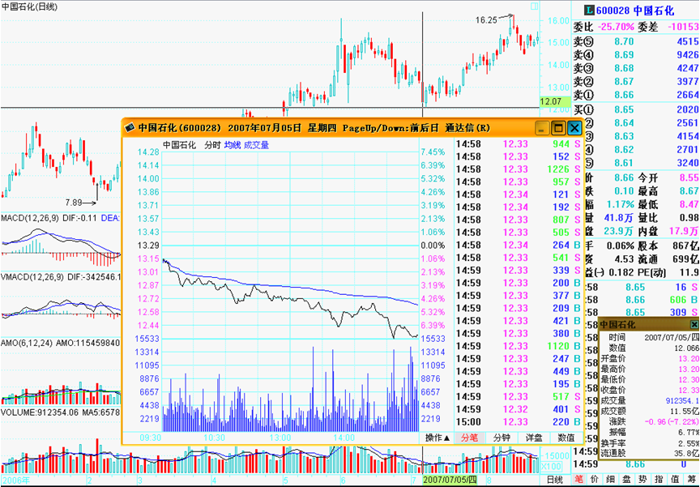

中石化在汉奸的打压下大跌7。22%，并带动大盘大跌5。25%。

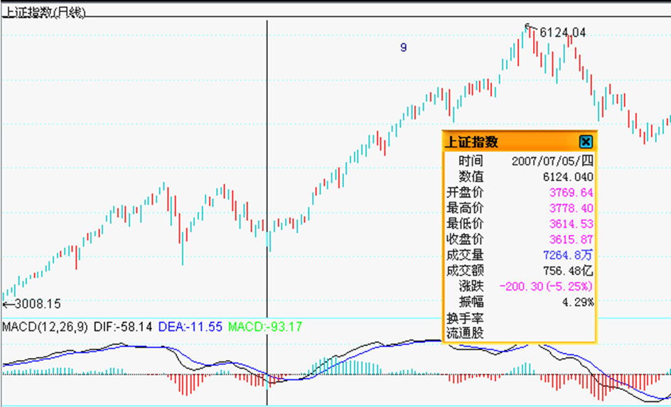

汉奸在3000点下出货，妄想到2000点回接，结果在以缠师为旗帜的本土力量捍卫下，大盘返身向上。汉奸控制的金融股在低位无法施力，无奈只好高位买入600028并用之作为砸盘工具。比较下面几张走势图，便对当时的情形有些理解了。

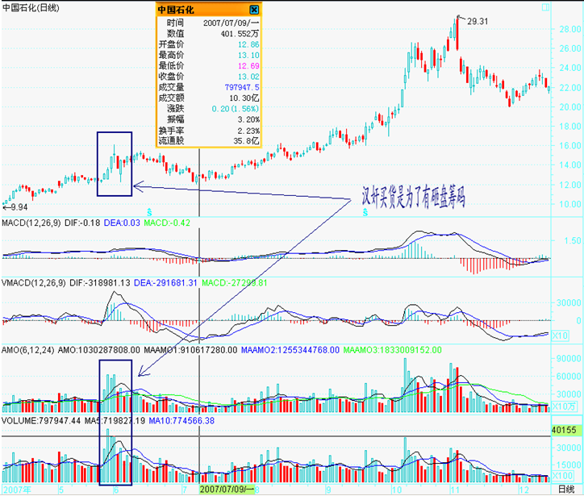

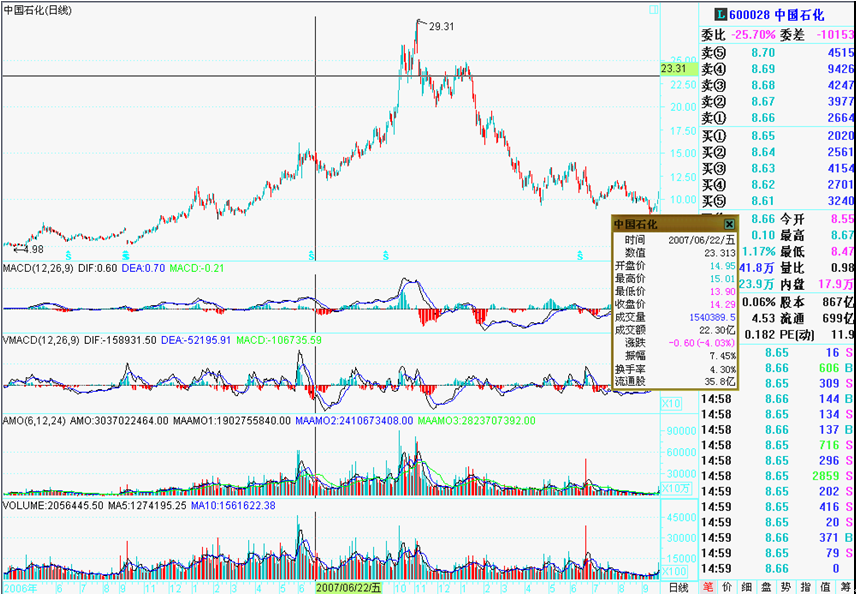

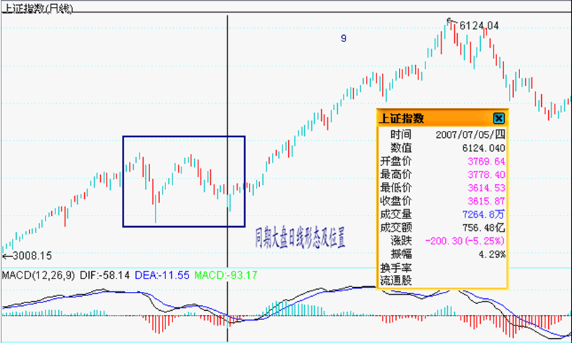

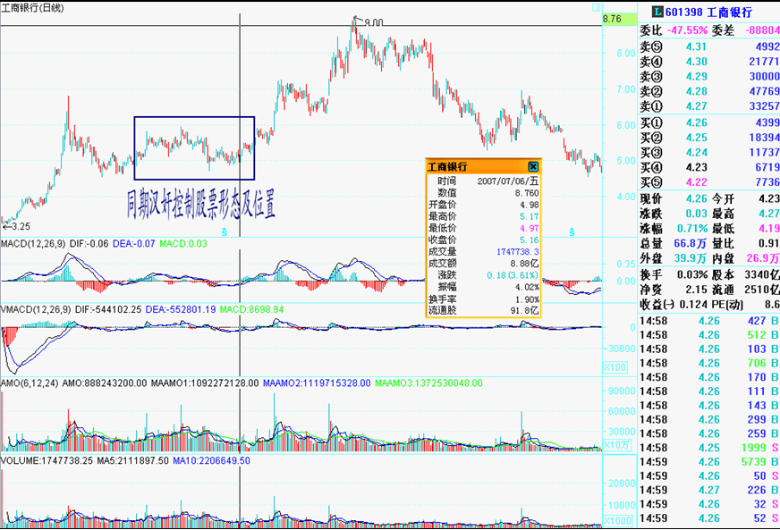

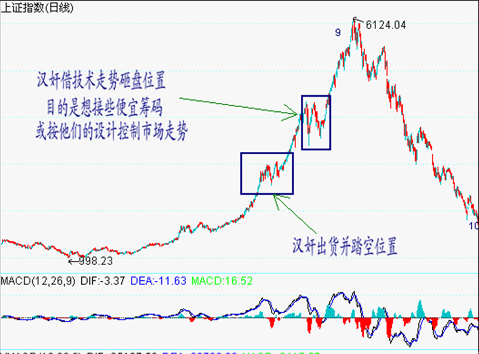

[2007-07-05]和散户网友说说现在的形势与任务

(2007-07-05 23:04:16)

首先，必须要明确，各位的状况和本ID有很多本质的不同。各位也知道，本ID6月后就忙于PE的事情，可以很明确地说，本ID一部分资金已经分流到PE上去，也就是说，就算本ID这次大败，依然有翻身重来的机会，而且一定可以翻身重来。正因为有这样的背景，所以各位第一不用为本ID担心，第二必须知道，本ID这样干并不是不顾后果的意气之举，而是进退有度的。

其次，本ID必须在这时候站出来，败了，大不了当股东，哪天本ID心情不好，找一个面首收购了自己当大股东算了，当然，这就成了走唐家兄弟的老路，没什么意思。或者，再折腾几年，等本ID厌倦了，就不玩了，出来玩文化也很好。而各位并没有本ID如此自如的进退之路，所以，一定要量力而行。

因为本ID知道的太多，所以必须要干上这一仗，当然，这里不光是本ID自己的，本ID在市场上干过这么多事情，联合点人干点事，还是没问题的。站在纯技术的角度，这样干，绝对是脑子进水，但人，有时候脑子就是要进点水，特别当这事必须干时就更应义无返顾。本ID当然知道自己理论中耐心等待买点的道理，但站在实际层面，本ID必须追究，这个买点不能如1000点那样被汉奸了。站在纯技术的角度，本ID现在的所有行为都是错误的，正如站在所谓纯人性的角度，用胸口顶枪口肯定是有病的，但人，有时候就是要病上一病。

但对于一般的散户，完全没必要参与这种活动，各位应该利用市场机会去壮大自己，没必要干用胸口顶枪口的傻事。对于各位来说，根本不需要知道这市场的买卖点是如何合力构成的，你们只需要知道合力的结果，根据结果进行操作。

目前的技术形态，站在最恶劣的角度，如果是对整轮行情的一个中级调整，比较极端的幅度是2/3，也就是说，调整到2100点也是毫不奇怪的，所以，没必要有任何站岗的无聊思想。学了本ID的理论，唯一需要坚持的就是根据自己操作级别，买点买，卖点卖。等各位有这个能力后，才学本ID如此一病吧。

市场就是战场，一旦开战，在战场上，就是无情的，本ID只考虑如何去夺取战争的主动权，这里，一切手法都可以用上，本ID不希望在打仗时有什么顾虑，在战场上，分不清什么散户、机构。而且本ID这次战役的目标，也不是当什么解放军，只是要打乱某些人的节奏，让某些人的目的不能得逞。如果一定要硬加上一个解放军的任务，只能是两头不着边。解放军只能是一个顺带的任务，而不是战役的前提。所以这盆冷水，本ID是一定要泼的，本ID从来都实话实说，不想让人有任何不切实际的误解。

对于散户来说，市场中的真正的解放军，只能是你自己，你要掌握好技术，要对股市有充分的理解，要明白股票都是废纸，要知道，股票只是抽血的凭证。然后，放下一切幻想，如果有可能就学好本ID的理论，看图作业，这才是散户战胜市场之道，只有自己壮大了，才是对汉奸和鬼子最大的打击。而本ID有这个能力，当然需要更多的承担，这必须要分清楚。

本ID这次的任务，不是原来那16只股票可以完成的（这些股票，中长线的角度依然会关照的，对他们，都是保持0成本增加筹码的阶段），本ID现在正在开辟新的战场，介入一些对股市更有影响的品种，大致方向本ID已经说了，就是整体上市（包括中字头）的、大重组（包括老树发新枝那种）、中小成长。技术上，都是有年线可以依托的。本ID不可能去接什么基金、甚至汉奸的高位股票，那真有病了。但像中石化、联通等指标股，当然是需要慢慢控制的，否则，就没有话语权了。逐步，将慢慢掀起整体上市、大重组、中小成长的行情，把整个不利的局面扭转过来。

现在，要把人心扭转，不是一天半天的事情，必须有股票，逐步走出有号召力的行情来，才会得到市场的响应。当然，这市场不是本ID的，其他有实力的，如果都能选择好攻击对象，为市场的稳定和对汉奸的阻击给出自己的贡献，那么本ID的星火最终就可以燎原。而市场好了，解放军自然就来了，这才是根本之道。

光有热血，当义和团，是打不赢汉奸鬼子的。先下，再见。

散户三大纪律

一、只用空闲的钱参与市场

二、必须等大兵团作战有结果才介入，要等大级别的买点。即使是本ID输了，汉奸鬼佬赢了，他们最终也是要搞上去的，这种，复仇的种子才能保存，楚虽三户可亡秦，有种子就有希望。

三、坚决不抬汉奸鬼佬的高位轿子，要练好技术，从底位开始，逐步抽光他们的血。

[2007-07-06]以黄河名字展开的绝地反击

(2007-07-06 15:50:50)

今天一大早，本ID先把博客的个性图片换成了本ID写的《满江红》，再把《黄河大合唱》中选了四段，按交响乐的形式组成一四乐章的曲子放到背景音乐上，然后就开始了开盘前的一切准备。本ID知道，明天是7月7日，70年前的英灵在天上看着。

具体的盘中事情，各位就没必要知道了，各位只需要知道结果，而结果是什么，已经永远刻在中国证券历史的K线图上。当然，如果要学技术，要当猎鲸者的，请好好去研究一下，从昨天凭空接坠石的两波反抽，到今天早上一开始的急拉，到后面的下跌，是如何构筑一个良好的技术反攻图形的，例如可以看看5分钟图，是如何用钱把这个底背驰给构造出来的。本ID也不能违反本ID的理论，就像牛顿也不能让苹果尽往天上飞。

当然，本ID没可能干完所有的事情，只不过点了一把火，后来就星火燎原了。市场是大家的，不是本ID一个人的。至于具体的个股，就不方便说了，免得给人以把柄。不过，这里的人都这么冰雪聪明的，不说而说最终都是说了。

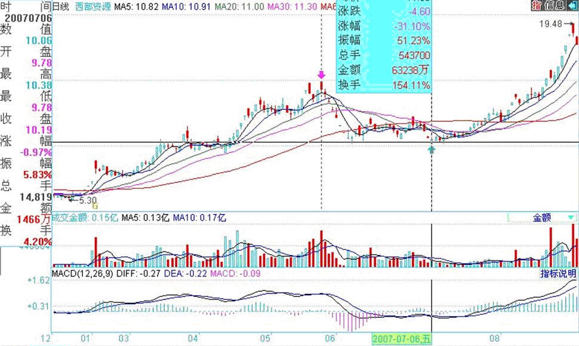

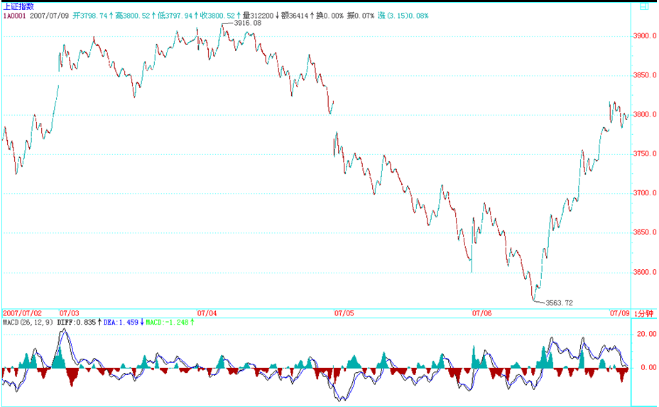

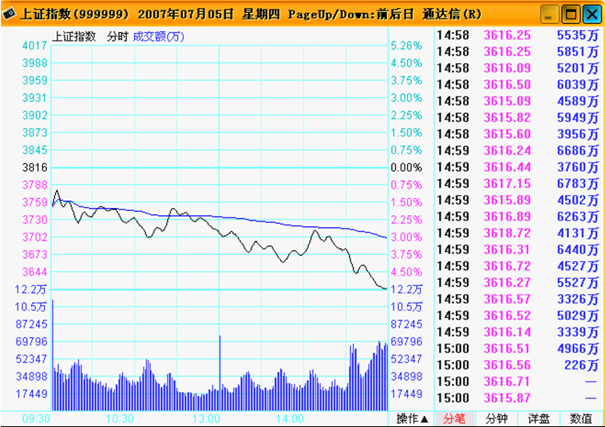

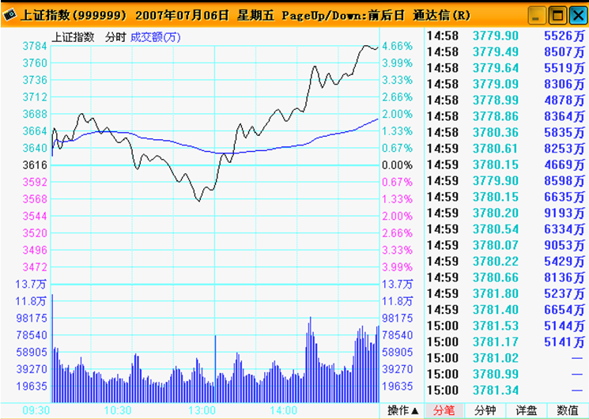

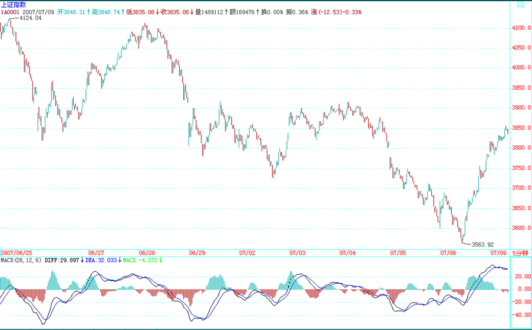

大的技术形态上，依然有利于某些人，所以，一切并不会因为一根阳包阴就天下太平，这就当是平型关一战吧，但已足以向某些人表明最基本的态度了，特别在这样一个特殊的日子里。

对于散户来说，一定要坚持按自己的级别买点买、卖点卖，这样才是取胜之道。特别在这种震荡市中，一定要把握好节奏。本ID也累了，不想多说什么了，周末腐败去吧，周日继续音乐会。

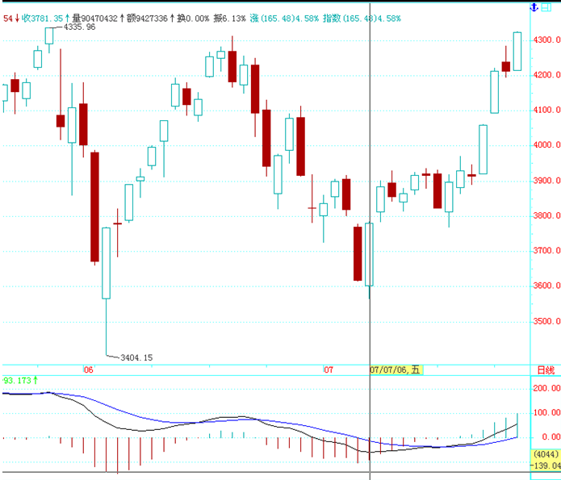

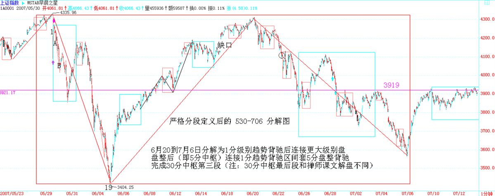

最后，各位如果还有兴趣，请再读读这首词。

满江红

万古长空，今犹昔，一朝风月。何处住？春花夏雨，秋鸿冬雪。百代浮华皆作土，千江吸尽无堪说。问世间，多少梦消磨、英雄血。

星旋轨，天补裂，山崩柱，河倾缺。捣神宫鬼府，凤巢龙穴。怒剑穿云惊浩宇，狂涛卷日横孤筏。纵生死，劫火洗乾坤，齐欢悦。

[2007-07-08]大盘长中短走势略说

(2007-07-08 22:16:44)

市场走势是合力的结果，市场不是本ID一个人的，本ID这一方的力量也不可能就是合力本身。目前市场走势，存在三种选择，而每一种选择对应着不同的多方能量要求，依次如下：

一、三角形调整

这种走势，要求的多方能量最大，具体走势分析，从530开始，大盘完成了三角形的前三段，目前正走三角形的第四段向上。这种走势要成立，前提就是要重新有效突破3919点的颈线，否则，如果没有足够能量达到这一点，大盘的三角形形态最终不可能成立。

二、平台型调整

不能重新站稳3919点，然后再逐步积聚空方能量，再次考验3400点低位，最强的平台型可以在3400点上完成，而一般地，将跌破3400点形成空头陷阱，极限位置可以达到2800点附近。

三、大平台型调整

这种情况下，大盘的调整时间将大幅度增加，也就是说第二种的平台形成后，形成一个大的反弹段后重新进入跌势，整个调整就是针对1000点上来的两年行情的大调整，极限位置，可以达到2100点附近。

前两种调整，时间都不会太长，最快的情况下，7月份就可以完成调整。而后一种情况，调整至少延续半年。注意，市场的任何走势都是当下形成的，并没有任何上帝规定现在就要选择哪一种调整方式，市场最终走势是合力的结果，所以，本ID上周的努力，并不是毫无用处的，所谓绝地反击，就是要在最合适的时机，四两拨千斤，用分力去改变合力，让合力按更好的选择去选择。

当然，所有的分力，无论多强大，最终都是分力，任何分力，把自己当合力了，就是脑子水太多的表现。世界上没有什么救世主、大救星，因为世界上没有任何分力就是合力本身，那种把自己当救世主、大救星，或者企求救世主、大救星的，都是脑子注水了。

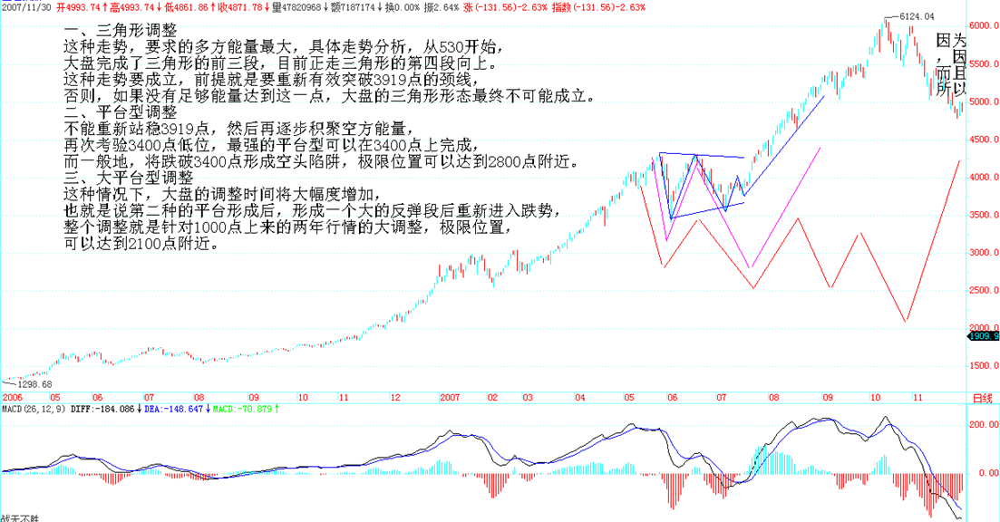

对于一般散户来说，只需要根据本ID的理论来，根据合力本身的轨迹来。有人可能疑问，如果人人都根据合力来，等市场选择方向，那么市场还会波动吗？这是典型的脑子进水想法。市场有各种不同的利益，不同的利益构成不同的分力，任何时候都不缺乏不同的分力，除非这世界上没有了利益的分歧。但没有利益分歧的世界，至少不是目前的世界。

不用讳言，打击汉奸，不让鬼子霸占中国的金融市场，这也是一种利益，这也是一种利益驱动，所以就有了本ID上周的分力，就这么简单。这种利益是和鬼子、汉奸的根本对立的，所以要打仗，而打仗，没有任何上帝保证谁谁谁一定赢，所以本ID已经很明确地说，这次比春节前后本ID现场直播那次困难大多了，但本ID即使只有1%的把握也要干，这和任何技术无关，只是利益驱动，只是不希望鬼子汉奸横行的利益驱动。

但，对于散户来说，就像战场上打仗，散户就是一般的老百姓，哪里有让老百姓直接上战场打阵地战的？散户就算打，也只能打游击战，阵地战不仅打不起也输不起。散户和本ID这种人是有本质区别的，本ID阵地战打败了还可以打游击战，等大机会一到，随时又可以招兵买马、找到大量新的资金来大打战略大反攻，不是本ID看不起散户，而且很客观现实地根据不同的存在状态给出的客观建议。

所以，对于散户来说，究竟最终选择哪种调整方式根本不重要，最重要的就是要用本ID的理论，根据自己的操作级别，买点买、卖点卖，大打游击战，这才是散户该干的事情。

当然，如果你是散户，又没有打游击战的胆识，那么你就当顺民，就把仓位空掉，完全不参与这市场的操作，等市场调整完再说。

还有一种，就是干脆全仓不动，反正无论哪种调整，最终还是要结束的，最终还是要重新开始行情，中国股市大牛市的基础一点都没改变，20年3万点这过于保守的结论依然成立、甚至要大大向4万、5万点修正，只要拿着有着大潜质的股票，这些小波动根本不算什么。例如，本ID告诉各位的年线附近，中字头、大重组、整体上市、中小成长等股票，任何大盘的调整，只是提供一个中长线建仓的机会。

例如，那只中字头的唐家兄弟的老股票，如此大力度的重组（以后就知道，现在没必要说），如此深厚的大股东背景，如此完美的图形，虽然本ID很讨厌唐家兄弟，很鄙视他们智力低下的游戏技巧，但最近还是对这股票上下其手？而这种股票，就算是15.19元买了，解套挣大钱，还不是迟早的事情？问题不是你什么价格买，而是你是否有技术把成本降下来，或者，即使你没那技术，那你是否有持股的耐心与决心。否则，整天贪嗔痴疑慢中当惊弓之鸟、追涨杀跌，上帝他姥姥的姥姥都救不了你。

注意，本ID这只是举例，本ID最近上下其手的又不仅仅是这股票，而且更重要的是，并不是本ID上下其手的股票才是好股票，别的，有大买点、大题材、大背景的股票，都必须中长线密切关注。但最重要的，还是你的技术与心态，如果是烂技术加烂心态，任何股票都成了烂股。

股票，是废纸，玩不好，就是股票吸你血而不是相反；但站在国家的金融战略的大背景下，股票又是维护国家金融安全的关键筹码，一场虚拟战争的光剑。这两者，来自对股票观察的两个不同视角，没有对错，关键你的实力与位置。只有认清楚自己的实力与位置，才可能采取相应合适的操作，没有任何操作是适合所有人的。好了，太晚了，先下，明天见。

[2007-07-09]中国股市前途的大决战

(2007-07-09 15:35:37)

大决战的第一目标，今天已经达到，就是用比下跌更低级别、更猛烈的方式重新回来前面3900点下的中枢里。只要回到该中枢里，一切都可以下回分解了，多空都将有一个喘息的时间去思考下一步的走法。

由于现在是打仗时期，本ID的分段就不要放上来了，免得汉奸鬼子从中揣测本ID的意图。但根据本ID前面给的分型、笔、段的原则，其实并不难解决。昨天的大盘长中短走势略说 已经把大盘的长中短走势按纯理论分析得十分清楚了，各位根据实际走势，不难发现最终合力选择的结果。

本ID这分力，当然是要选择第一种走法，而且三角形这选择，本ID也不是现在才说的，这也是上周出手的主要技术上理由。当然，由于本ID现在是身在此山中，所以多说也没用。

从今天下午开始，汉奸鬼子就开始加大反击力度了，明天，这力度会更加大，不过这都是在本ID的预料中，大不了，就再玩玩中枢震荡。从纯图形看，汉奸鬼子肯定不希望现在的大头肩底最终能成立，这就是斗争的关键所在。

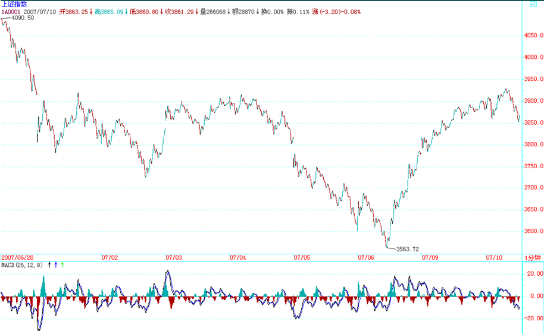

个股方面，本ID的股票都是中长线介入的，都有足够的基本面和战略面的理由才介入的。当然，对于本ID这种资金来说，有时候介入的股票，不一定是基本面很明确的，但本ID可能是先介入，再改造其基本面。例如，最近在年线附近介入的一只股票，现在才7、8元，但他将生产的产品，比三一重工的最大利润的拳头产品成本低30%以上，马上就开始生产，三一这次可麻烦大了。本来这样的股票是很好的，但该股票在基本面上有些很不明朗的因数，所以本来这股票，应该现在就应该在30元以上位置的，就因为这基本面上的某个因数，所以不能太用力玩弄这面首。而这个因数能否解决，本ID也没把握，也只能看一步走一步，所以这种股票，也就只能让本ID自己独自去偷欢了。

总之，股票这种面首，一定要控制成本，不要追高，有技术的，一定要通过震荡把成本往0甚至负处玩弄下去，这才是玩弄股票之道。

最近太忙，没时间和各位回答问题了，对不起，先下，再见。

[2007-07-10]3919点继续折磨你

(2007-07-10 15:43:11)

今天的调整如期而至，这点在昨天已经说了。这种调整，无论多头空头，都是需要的，所以可以说是众望所归。今天由于金融股的超好业绩，引发大盘瞬间突破3919点，这并没有改变该位置的强大压制作用。

现在本ID与汉奸鬼子的分歧在于，这个3919点颈线下的头肩底是否能形成。所以，真正的鏖战还在后面。当然，其实最后是什么图形并不重要，最终都要归结到3919点颈线的有效突破，如果这一点达不到，其他一切都没意义。

对于散户来说，本ID已经多次强调，你们只需要知道游击战怎么打，看着市场的最终合力划出的轨迹、根据自己设定的级别来操作，最后就算本ID打败了，你们也没必要陪本ID一起去失败，该卖就卖，该买就买，根据图形来，而不是根据其他任何原因来。

个股方面的选择，从纯技术的角度，一种就是已经下跌50%上下，在年线、至少是半年线附近，有明显新资金介入的有题材、有潜质的中低价股票，另一种就是超强势的股票，但这种股票，一旦大盘逆转，就有补跌的可能，因此对技术的要求特别高。现在对个股，一定要抱着中长线建仓的心态，当然，有些短线题材股，会继续表现的，但这里的风险比上半年要大多了。

注意，对于散户来说，建仓完全可以是动态的，也就是说，你可以反复操作一只股票，这样把成本减下去，反复强调，在市场上要生存，关键的就是成本，一般股票在构筑底部时，一般震荡都比较大，其实是很容易把握的。而且，万一大盘逆转，有些股票会顺势砸出空头陷阱，如果不会动态建仓，就会有短线被套的痛苦，所以，如果你技术还可以，就要让自己动态起来，这样才是真工夫。

当然，如果你没什么技术，那就分析好基本面，研究透了，然后就靠熬的工夫，逐步建仓后就熬着，把牢底坐穿了，自己就解放赚大钱了。每个人的操作方法，必须根据自己的实际情况来，千万不要硬来。

最后再强调一次，市场操作，最终都要归于自己，只有自己提高了，才是最终的。千万别依靠任何人，连本ID都不要依靠，你可以学习本ID的理论，因为那是几何的、是不患的，谁都必须遵守，但千万别有依靠本ID的想法，本ID可不是慈善家，在残酷的市场中，宣称自己是慈善家的，肯定只能是骗子。

市场就是火与血，没有温情与慈善，就别偷心不死了。至于那些被传销者骗的，那是自作自受，市场没有眼泪给这些人，自己反省去吧。先下，再见。

[2007-07-11]3850点，残酷的多空无量鏖战

(2007-07-11 15:41:38)

由于本ID身在此山中，因此评论难免有本方色彩，为了尽量客观点，所以以后的评论都换一种说法，这样就不至于干扰散户的自我判断。

昨天说了，真正的鏖战还在后面，今天，是一个地量，却是多空间一场残酷的无量鏖战，其他大多数的市场参与者都采取一种观望的态度，有点像古代战场上，对敌双方的主将在那里大战300回合，周围N万的人在那里观战，一旦一方取对方首级，后面就可以掩杀过来，来次大胜了。

当然，股票市场还要复杂点，有时候对方可能是九头虫，砍一个又冒一个出来，所以需要极端的耐心，不要期望一次搞掂。今天的无量与震荡幅度极端收窄，只不过意味着更大规模的、在更广空间上的对攻战的开始。

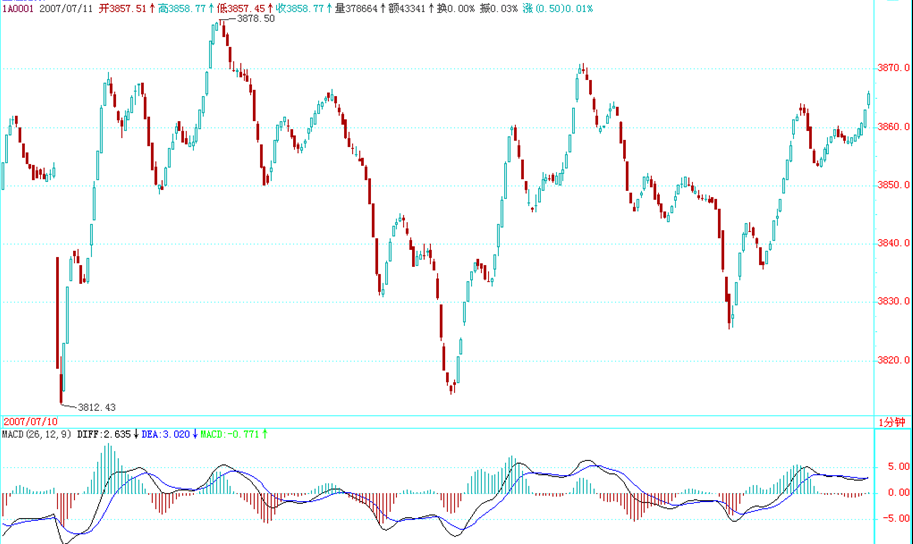

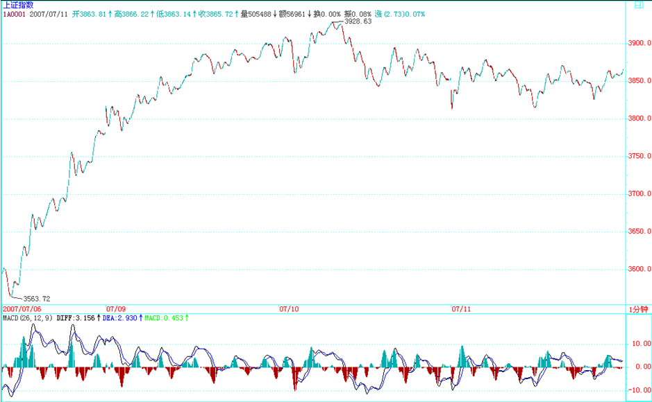

这是一场中国资本市场的斯大林格勒保卫战，对其残酷性要有最充分的准备。

中短线来说，3919点不能有效突破站稳，那么多方的中短线战略就没有得到真正的胜利；中长线来说，目前在4159点的1/2线不被有效突破站稳，多方的中长线战略也只能是空想，所以，对于多方来说，胜利还很遥远，还需要加倍的努力。1%的可能，也要付出100%的努力。

个股没什么说的，也不方便说。有人整天说本ID这里爱出谜语，这是自然的。本ID当然要根据法律来办事，本ID说的股票，都只是梦话，因为本ID白天自己买了，日有所思、夜有所梦而已。有时候操作多了，白天也说梦话，所以各位千万就当梦话听，千万要自己看图操作，一定要根据图形，在大级别的买点去介入。

当然，本ID有时候也会显摆一下，例如本ID3元上下买的000416，同时也就说梦话了，后来涨到18元，本ID显摆一下，是理所当然的。再说一遍，本ID说梦话的，一定自己刚买的，一般涨了本ID就不再说梦话了，最多就显摆一下，就像000999，6元说的梦话，后面都是显摆。当然，有时候梦话了，并不一定都如000999、000416、000777之类都一开始就梦想照进现实，有时候，梦里的剧情也会改变一下，但梦想总是要照进现实的。

好了，废话就不说了，本ID今天心情还不错，晚饭才有事，就回答各位的问题到4点半，不过一定是可以回答的问题，本ID可没有回答间谍问题的癖好。

[2007-07-11]为中国股票的投资价值正名

(2007-07-11 23:47:16)

回来晚了，花了18分钟，随手写的文章，各位将就看吧，先下，再见。

在某些被华尔街洗脑的人的忽悠下，中国股票的投资价值，从中国资本市场诞生那天起，就长久地成了被质疑的对象，中国资本市场，被某些人有预谋地描述成垃圾股漫天飞，投机倒把的场所，还有所谓的中国股市赌场论大行其道。

这种说法，不过是利用信息不对称制造的经济殖民话语。世界上所有资本市场，都存在严重的投机行为，不说别的，就说香港股市，那些所谓的“仙股”、还有各类权证，其投机性比中国股市那些厉害一百倍，在那里，一天涨几倍、跌80%，从几分钱涨到几块甚至更高又跌回0，这难道很难见到吗？至于欧美股市，这种现象一样存在。而且在欧美股市发展的历史中，严重的投机行为比中国曾存在的厉害一万倍，就算现在，请问中国股市中有从2毛飞涨到几百美圆然后回跌到6毛的股票吗？欧美市场上就有，而且最近就有。可以很严肃负责地说，中国股市中的投机行为，只能说是在资本市场正常机制的平均水平之下，中国资本市场，从来没出现过超过任何一个国家或地区投机平均水平之上的投机现象。

对待华尔街的洗脑，就是要用洗脑对洗脑，本ID比较懒，也没太多时间，如果有谁有兴趣，写一篇数据详实的文章，对比各国资本市场投机行为的历史与现状，揭露某些人粉饰所谓成熟市场的谎言，这将是一件有意义的事情。

有人可能说，我们要取法其上，不要学别人不好的。那没问题，我们就考察好的方面。这里，必须首先区分，所有资本市场，考察其市盈率，都是以成分股为对象的，像在香港股市里，其“仙股”里的市盈率比中国股市里的垃圾股高多了，说香港股市的市盈率，不过是考察其成分股，欧美的股市也一样。

在国际市场上，考察一个股票的投资价值，最典型的不是市盈率，而是用市盈率/增长率这指标为标准，一般来说，只要市盈率/增长率<1，这股票就被看成存在合理的价格。而目前，中国股市中的成分股，其增长率平均在50%以上，那么，在中国股市，一个50倍的市盈率是绝对合理的。换另外一种算法，由于现在的利率在3%左右，也就是一个33倍的市盈率意味着和利率的水平相匹配，而一个50%的增长率，将使得一个50倍市盈率的股票在一年后的市盈率变成33倍，因此，这也反证了，50倍市盈率对中国股票的合理性。

有人可能反驳说，你说的是动态市盈率。废话，股票价格就是各种预期的合力，反映的是对价格的预期，哪天中国企业的增长率下来了，可以接受的市盈率自然就下来，在这趋势没有出现之前，当然就是按现有的可预期的增长率作为参考的标准，没有谁是上帝，也别把自己当上帝去规定未来。

上面说的都是些最简单的道理，但某些人故意不承认，不过是别有用心而已。可以很明确地说，中期业绩出来后，沪深300的平均市盈率将远远低于50倍，中国股市目前的投资价值是被大大低估了。

站在更大的层面上，由于中国目前的企业，代表着中国经济的未来，而中国成为世界经济强国的历史趋势不可逆转，因此，现有的上市公司里，将出现以后世界上一些最大的公司，中国的企业也将跨国化，现在，很多的中国上市公司，即使是盘子最大那些，站在成为世界上最大公司的角度，都只能算是中小盘股，都是成长股。只要看好中国经济的未来，就没有理由对中国的企业失去信心，谁又能说，21世纪最伟大的公司不能是中国公司？而且可以肯定的预言，21世纪世界最伟大的500家公司里，至少有100家是中国公司，而这100家公司就在现在深沪交易所交易的股票里。

当然，中国的企业，有着各种毛病，但所有的发展都是在毛病下出现的，没有毛病的企业早死了。而经济资本化带来的历史性动力，将让中国的企业走上一个伟大的历史性发展时期，这才是中国资本市场发展的核心动力，没有这样的历史眼光，只不过是被人洗脑的可怜虫。

[2007-07-12]坠石化光剑，兵临3919点颈线

(2007-07-12 15:38:28)

看完今天的走势，各位重新去看N天前的 凭空接坠石，依然开弓没有回头箭，大概都有别样感觉了。今天，坠石化为星球大战中的光剑，挥舞出雄兵亿万，直指3919点颈线，关于这光剑的道具，前面的帖子里也提过了。

当然，昨天说的更大规模、更广空间上的多空对攻战，今天不过是开始，后面的困难，还是想多点，准备充足点，毕竟现在，技术指标没被完全修复，人气还没被有效聚拢，后面的路还长着，路漫漫其修远兮吾将上下而求索。

个股方面，前面说了两类股票是必须关注的，一种就是中低价的已经受到年线支持的有题材、有潜力的股票，一种就是强势股票，这种股票的代表，就是昨晚为中国股票的投资价值正名中说的沪深300，原话是这样的“可以很明确地说，中期业绩出来后，沪深300的平均市盈率将远远低于50倍，中国股市目前的投资价值是被大大低估了。”

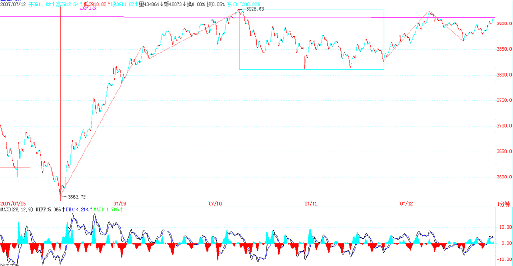

这里的老人都知道，本ID把中国的牛市分为三阶段，第一阶段是成分股行情，而这个第一阶段的行情还远为结束，站在20年以上大牛市的角度，现在不过是第一阶段成分股行情中的一个小修正，没什么大不了的。所以，在第一阶段行情中，任何一波有实在性意义的行情，都必须有成分股的加盟，否则都是白搞。中期业绩开始后，大家会发现如昨晚文章中说的，中国最好的300只股票的投资价值已经被大大低估了。

注意，本ID这博客说的话，如果梦想照进现实了，那请找王朔去，和本ID无关。本ID只是梦想，至于那现实那么不争气，愣要死皮赖脸地跟着本ID的梦想，就去把那死皮赖脸的剥皮拆骨吧。

忙，先下，再见。

[2007-07-13]私募变乌龟，制造成交地量

(2007-07-13 15:36:38)

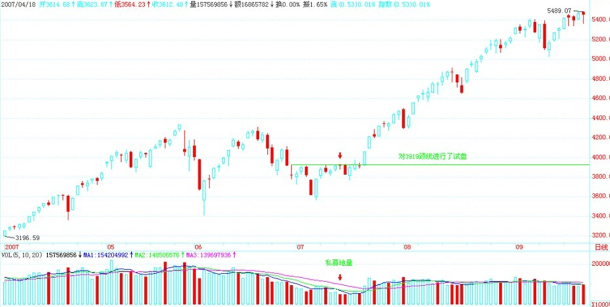

这两天，很多所谓的私募都开始自我检查，变缩头乌龟去了，乌龟多了，今天自然就地量了。在二级市场，本ID从来不和什么私募玩，也最反感那些所谓的私募，特别是其中最下等那些，简直就是偷摸拐骗、五毒俱全，对这些人不进行全面清理，就不会有中国资本市场健康发展的良好环境。

本ID的观点一向很明确，就是自己的钱自己干，真没这天分的，就把钱给特别好的公募基金，最好就是指数型基金，这样至少不会跑输指数。至于那些私募，最终的命运就是被收编或阳光化，还有，就是要加强对新投资者的基本知识教育，被这么低劣的骗术也能骗倒一片，简直给中国人丢脸。

大盘今天，在这么恶劣的环境下，还是对颈线进行了试盘，现在最大的问题，还是人气的聚拢，这需要反复的震荡才能完成，而对中国股票投资价值的再认识，是新一轮行情能否展开的理念基础，中期业绩的逐步公布，会让更多人认清中国股票的投资价值，当然，一些理论上的工作，还需要各方去努力。下周，由于有宏观数据的公布，让行情的发展存在变数，但这都不是核心的问题，关键是要有新理念，有新理念，才有新行情，一切不过是唯心所造，而这心，在投资市场中，就是理念。

个股方面，还是一直强调的那两类，中低价位的一类，都处在换庄或筹码收集的过程，所以短线不一定会有火暴表现，而沪深300，由于有长线资金一直关照，所以会有轮动表现，先让成分股轮动起来，然后延伸到大盘，一旦这个良性循环能形成，一切关于资金、人气的担心都无须担心了。路还很长，慢慢走吧。

终于又是周末了，终于可以腐败、419了，各位就各取所需去吧。

[2007-07-16]无论多空，都必须要退的一步。

(2007-07-16 15:43:17)

上周五已经说了，由于本周有宏观数据的公布，让行情的发展存在变数，而周末所有的消息面，都对该数据有着最不利的版本，这时候，硬顶在颈线上，已经变得毫无意义，只能让有生力量被无谓地消耗。这些数据，从本质上说，只是为了让靴子落下，目前，地球人都知道的那几条利空，如果不落地，只能让行情的发展变得不可控制，无论多空，这一步都是必须要退的。

现在，确实是一个多空大对决的阶段，本ID已经很明确地说，从纯技术的角度，空头占着绝对优势，而从宏观面的角度，空头在短期上也占着绝对优势，这也就是为什么本ID一直强调路长着的原因。现在，就是要有不断的阻击战、阵地战、突击战，不断消耗空方的力量，通过在不同空间的震荡来让筹码与人气得到梳理。这是一个残酷而漫长的过程。

本周，借助宏观面数据的发布，空方的能量已经并继续会得到大力释放，而如何借力打力，用最小的消耗去消化这空方能力的宣泄，是短线摆在多方面前最重要的课题。而今天的走势，也正是该解决方案中必不可少的一步。

明天有可能到深圳出一次差，具体还没定好，如果走得太急来不及解盘，请原谅，有时间会补上的，对于散户的操作原则，本ID已经反复说过多次了，不用关心走势的合力是如何构成的，只要关系合力所画出的轨迹，看图操作，不要受任何的影响。而对于中短线操作的、技术又不好的投资者，在5周均线重新站稳之前，没必须参与市场的买入。而对于中长线的投资者，继续可以利用市场下跌的机会，震荡式对前面提到的两类股票进行中长线的建仓。

由于可能要出差，有几天帖子不能正常发，所以今天可以回答问题到4点半。

## 教你炒股票65：再说说分型、笔、线段

(2007-07-16 22:14:16)

如果真明白了前面的，这课就不必再说了。本ID反复强调，本ID理论的关键是一套几何化的思维，因此，你需要从最基本的定义出发，而在实际操作的辨认中，这一点更重要。所有复杂的情况，其实，从最基本的定义出发，都没有任何的困难可言。

例如，对于分型，里面最大的麻烦，就是所谓的前后K线间的包含关系，其次，有点简单的几何思维，根据定义，任何人都可以马上得出以下的一些推论：

1、用[di，gi]记号第i根K线的最低和最高构成的区间，当向上时，顺次n个包含关系的K线组，等价于[maxdi，maxgi]的区间对应的K线，也就是说，这n个K线，和最低最高的区间为[maxdi，maxgi]的K线是一回事情；向下时，顺次n个包含关系的K线组，等价于[mindi，mingi]的区间对应的K线。

2、结合律是有关本ID这理论中最基础的，在K线的包含关系中，当然也需要遵守，而包含关系，不符合传递律，也就是说，第1、2根K线是包含关系，第2、3根也是包含关系，但并不意味着第1、3根就有包含关系。因此在K线包含关系的分析中，还要遵守顺序原则，就是先用第1、2根K线的包含关系确认新的K线，然后用新的K线去和第三根比，如果有包含关系，继续用包含关系的法则结合成新的K线，如果没有，就按正常K线去处理。

3、有人可能还要问，什么是向上？什么是向下？其实，这根本没什么可说的，任何看过图的都知道什么是向上，什么是向下。当然，本ID的理论是严格的几何理论，对向上向下，也可以严格地进行几何定义，只不过，这样对于不习惯数学符号的人，头又要大一次了。

假设，第n根K线满足第n根与第n+1根的包含关系，而第n根与第n-1根不是包含关系，那么如果gn>=gn-1，那么称第n-1、n、n+1根K线是向上的；如果dn<=dn-1，那么称第n-1、n、n+1根K线是向下的。

有人可能又要问，如果gn<gn-1且dn>dn-1，算什么？那就是一种包含关系，这就违反了前面第n根与第n-1根不是包含关系的假设。同样道理，gn>=gn-1与dn<=dn-1不可能同时成立。

上面包含关系的定义已经十分清楚，就是一些最精确的几何定义，只要按照定义来，没有任何图是不可以精确无误地、按统一的标准去找出所有的分型来。注意，这种定义是唯一的，有统一答案的，就算是本ID，如果弄错了，也就是错，没有任何含糊的地方，是可以在当下或任何时候明确无误地给出唯一答案的，这答案与时间无关，与人无关，是客观的，不可更改的，唯一的要求就是被分析的K线已经走出来。

从这里，本ID理论的当下性也就有了一个很客观的描述。为什么要当下的？因为如果当下那些K线还没走出来，那么具体的分型就找不出来，相应的笔、线段、最低级别中枢、高级别走势类型等就不可能划分出来，这样就无从分析了。而一旦当下的K线走出来，就可以当下按客观标准唯一地找出相应的分型结构，当下的分析和事后的分析，是一样的，分析的结果也是一样的，没有任何的不同。因此，当下性，其实就是本ID的客观性。

有人可能要问，如果看30分钟图，可能K线一直犬牙交错，找不到分型。这有什么奇怪的，在年线图里，找到分型的机会更小，可能十几年找不到一个也很正常，这还是显微镜倍数的比喻问题。确定显微镜的倍数，就按看到的K线用定义严格来，没有符合定义的，就是没有，就这么简单。如果希望能分析得更精确，那就用小级别的图，例如，不要用30分钟图，用1分钟图，这样自然能分辨得更清楚。再次强调，用什么图与以什么级别操作没任何必然关系，用1分钟图，也可以找出年线级别的背驰，然后进行相应级别的操作。看1分钟图，并不意味着一定要玩超短线，把显微镜当成被显微镜的，肯定是脑子水太多了。

从分型到笔，必须是一顶一底。那么，两个顶或底能构成一笔吗？这里，有两种情况，第一种，在两个顶或底中间有其他的顶和底，这种情况，只是把好几笔当成了一笔，所以只要继续用一顶一底的原则，自然可以解决；第二种，在两个顶或底中间没有其他的顶和底，这种情况，意味着第一个顶或底后的转折级别太小，不足以构成值得考察的对象，这种情况下，第一个的顶或底就可以忽略其存在了，可以忽略不算了。

所以，根据上面的分析，对第二种情况进行相应处理（类似对分型中包含关系的处理），就可以严格地说，先顶后底，构成向下一笔；先底后顶，构成向上一笔。而所有的图形，都可以唯一地分解为上下交替的笔的连接。显然，除了第二种情况中的第一个顶或底类似的分型，其他类型的分型，都唯一地分别属于相邻的上下两笔，是这两笔间的连接。用一个最简单的比喻，膝盖就是分型，而大腿和小腿就是连接的两笔。

有了笔，那么线段就很简单了，线段至少有三笔，线段无非有两种，从向上一笔开始的，和从向下一笔开始的。

对于从向上一笔开始的，其中的分型构成这样的序列：d1g1d2g2d3g3…dngn（其中di代表第i个底，gi代表第i个顶）。如果找到i和j，j>=i+2，使得dj<=gi，那么称向上线段被笔破坏。

对于从向下一笔开始的，其中的分型构成这样的序列：g1d1g2d2…gndn（其中di代表第i个底，gi代表第i个顶）。如果找到i和j，j>=i+2，使得gj>=di，那么称向下线段被笔破坏。

线段有一个最基本的前提，就是线段的前三笔，必须有重叠的部分，这个前提在前面可能没有特别强调，这里必须特别强调一次。线段至少有三笔，但并不是连续的三笔就一定构成线段，这三笔必须有重叠的部分。由上面线段被笔破坏的定义可以证明：

缠中说禅线段分解定理：线段被破坏，当且仅当至少被有重叠部分的连续三笔的其中一笔破坏。而只要构成有重叠部分的前三笔，那么必然会形成一线段，换言之，线段破坏的充要条件，就是被另一个线段破坏。

以上，都是些最严格的几何定义，真想把问题搞清楚的，就请根据定义多多自己画图，或者对照真实的走势图，用定义多多分析。注意，所有分析的答案，只和你看的走势品种与级别图有关，在这客观的观照物与显微镜倍数确定的情况下，任何的分析都是唯一的，客观的，不以任何人的意志为转移的。

如果分型、笔、线段这最基础的东西都没搞清楚，都不能做到在任何时刻，面对任何最复杂的图形当下地进行快速正确的分解，说要掌握本ID的理论，那纯粹是瞎掰。

第65课读后感：

1、前后K线间的包含关系。

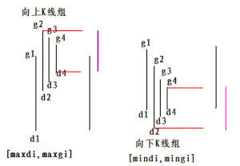

2、上升K线与下降K线：假设，第n根K线满足第n根与第n+1根的包含关系，而第n根与第n-1根不是包含关系，那么如果gn>=gn-1，那么称第n-1、n、n+1根K线是向上的；如果dn<=dn-1，那么称第n-1、n、n+1根K线是向下的。

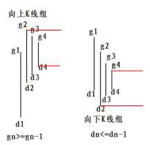

3、两个顶或底中间有其他的顶和底

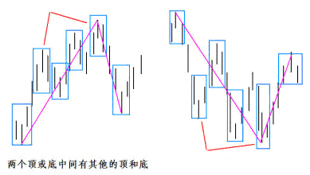

4、两个顶或底中间没有其他的顶和底

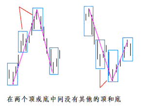

 HYPERLINK "http://photo.blog.sina.com.cn/showpic.html" \l "blogid=6223e8fb0100gzbe&url=http://static4.photo.sina.com.cn/orignal/6223e8fbt72a65723b2d3&690" \t "_blank"

5、向上笔和向下笔：

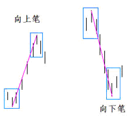

6、线段被笔破坏：

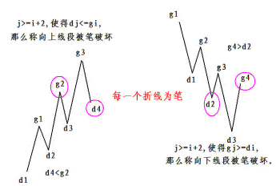

7、缠中说禅线段分解定理：线段被破坏，当且仅当至少被有重叠部分的连续三笔的其中一笔破坏。而只要构成有重叠部分的前三笔，那么必然会形成一线段，换言之，线段破坏的充要条件，就是被另一个线段破坏。

[2007-07-17]人气，在震荡中汇聚

(2007-07-17 15:40:05)

昨天晚上才临时决定不出差了，而大盘也在昨天的一退后，给自己留出了再进的空间。本ID在前面已经反复说过，现在就是要在震荡中把人气汇聚。市场，最重要的就是人气，只要有人气，其他都不是问题。人气汇聚，人心修复，这就是多方在技术与基本面极端不利的条件下，唯一能干的事情。而技术，都是合力的结果，只要人气改变，合力自然就变，技术面就会改变过来。

各位大概已经发现，在昨天和今天的一退一进间，日的MACD已经金叉了，当然，这金叉需要确认，但至少让完全不利于多头的技术面有了一线生机。为了这线生机，付出的努力太惨烈了。

目前，所有的中短期均线都缠绕在3900上下，这在技术上就完全具备了变盘的条件，现在，可谓万事具备，只欠东风，而这东风，就是某些利空的兑现。现在，市场就需要某些利空的兑现来让靴子落地，让空头整天忽悠的那些火星人都知道的利空去兑现，兑现了，就不是事了，而人气与走势，就可以形成有利多方的正反馈了，一旦这正反馈形成，空头就可以一边凉快去了。

当然，正如本ID一直强调的，现在的一切，都有利于空头，多方现在的努力，只是无中生有，逆势而为，其困难可想而知，路还很长，但只要走了，只要有人走了，路，总有一天会走出来的。至于政策面，一旦走势与人气回来，政策面也是可以改变的，政策，不过是合力的一部分，政策，不是天上掉下来的，也脱离不了现实。

所以，现在多方从事的，是一项大的系统工程，要在技术、人气、心理、政策等等方面，把本来完全有利于空头的局面彻底扭转。正若本ID一早所说，只要有1%的可能，就要付出100%的努力。

个股方面，本ID在前面已经十分明确地反复指出了，就是两类，第一是300成分股，这会出现轮动，例如今天的房地产动了，过两天可能就换别的，这就是轮动。轮动是带动人气的基本方法，这点在前面已经说得很清楚了。第二种就是经过充分调整的，有题材有潜力的中低价股，这类股票，本ID也说了，现在正在收集、换防中，要动态建仓。

当然，如果这次多方努力失败，成分股会有比较大的补跌风险，这是必须注意的。不过，谁说多方就一定要失败的？为什么不可以多方大胜，结果成分股又走出一轮波澜壮阔的行情？本ID身在此山中，也不能也不必多说了。

还有事，必须先下了，再见。

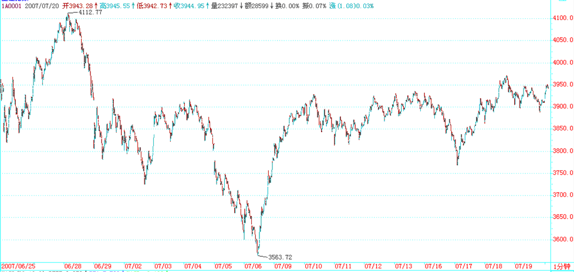

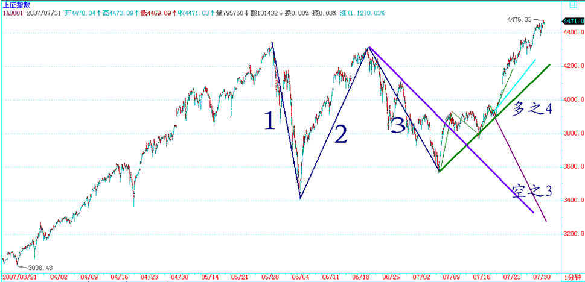

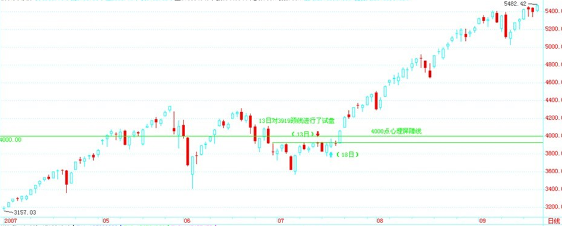

[2007-07-17]出题考考各位，有空的都请进来。

(2007-07-17 22:34:40)

回来晚了，累，不想写文章。不如就出道题考考各位。顺便说句，昨天的课程应该是65，匆忙中搞错了，已经更正。

请各位看看下图，里面有12种走势，其中每种走势中的每一划都代表实际走势中的一笔，请问，里面构成一线段走势的有多少种？换一种问法，就是有多少个图是不构成一线段，有多少个图刚好是一线段，有多少个至少是2个线段的连接？

问题很简单，请各位仔细分辨，这些图形，在实际走势中都会经常碰到的。另外，像分型、笔、线段这些的分辨，只能根据定义，不断看图，熟能生巧，没有任何其他办法。这是有标准答案的东西，定义就是权威，其他一切都没意义。

还有，根据最严格的定义，对背驰等概念，一定要存在最低级别的中枢后，才有最低级别的走势类型，才会有背驰等概念的存在，一般来说，在线段之下讨论背驰概念是没意义的，但可以根据类似背驰的力度比较方法来讨论线段之下类背驰的现象，但这和背驰是两回事情。而用区间套的方法，在定位线段之下的精确买卖点时，实际上用到的就是类背驰的力度比较，一般来说，对于大资金，其精确定位不需要用到线段之下的，例如1分钟甚至30分钟级别的区间，对于大资金就是精确定位了。当然，对于散户来说，用类背驰的方法，甚至可以把定位定到精确的分笔图上某个价位，但这在实际操作中没多大意义，特别对通道不顺的散户，就算你看到那价位，也不一定能买卖到。因此，不要用太低级别去操作，这样太累，特别在交易成本大幅度增加的今天，更没意义。

好了，本ID要休息了，各位有时间就回答问题吧，再见。

INCLUDEPICTURE "http://s6.album.sina.com.cn/pic/486e105c020011xh" \* MERGEFORMATINET 

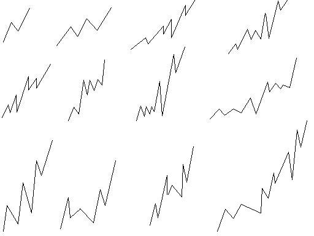

[2007-07-18]正在去机场的路上

(2007-07-18 21:09:33)

有急事紧急出差，本来早要去的，推迟了，今天不得不去。最后一班，机型还是今天巴西毁掉那种，本ID受飞机煎熬，各位就继续收中国队的煎熬吧。

问题的答案：都是一线段，不明白的以后有时间再解释。明天见。

[2007-07-18]无论多空，都必须要进的一步。

(2007-07-18 15:47:50)

前几天，本ID写了“无论多空，都必须要退的一步。”，今天却要写“无论多空，都必须要进的一步。”这一进一退间，正好说明了本ID所说的路之艰难。而今天的走势，就是现在多空对战的一个最好演绎。

由于在多方的反复努力下，昨天在技术面上出现日MACD的金叉，使得今天的突破成了必然。现在，不妨让本ID换了身份，如果本ID是空头，本ID要阻击多方的进攻，最简单的就是先让一步，利用4000点和60天线的心理屏障，通过震荡，破坏日MACD的金叉信号，最终让金叉变死叉，如果本ID是空头，一定是这样干。否则，在技术面金叉情况下一味在3919点颈线下打压，只能让多方高兴，空头最不利的，当然就是在技术面转向多方时在低位损失打压的筹码。

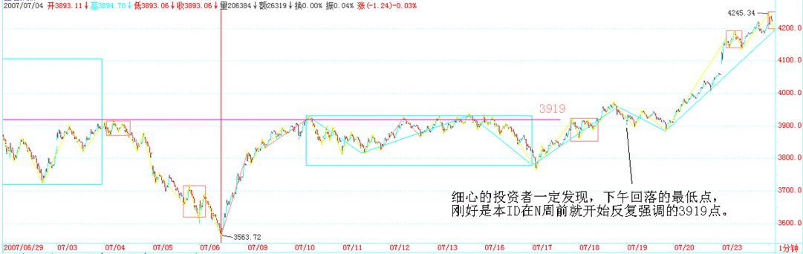

而对于本ID的多方立场，如果不利用技术上的金叉信号进行颈线的突破，那前面的震荡都白搞了，因此，突破是必须的，至于突破是否有效，这是后话，突上去再说。而突上去后，对于多方，需要对3919点的颈线进行反抽，而空方，需要出手打压制造假突破，因此，下午的回落，同样是多空双方都乐意看到的。细心的投资者一定发现，下午回落的最低点，刚好是本ID在N周前就开始反复强调的3919点。

现在，对于短线走势，消息面有着决定性的意义，在技术上，对颈线突破后需要三天的回抽确认，而刚好本周的最后两天和下周第一天是消息面上最大的动荡期，技术与消息，在这里产生完美的碰撞。

本ID虽然站在多方立场上进行战略部署、战术安排，但对空头的所有伎俩，当然也分析得底朝天。站在大的角度，本ID也可以分析一下空头可以采取的最好策略，就是同样搞三角形，但这三角形和本ID为代表的多方要搞的不同，对于本ID来说，现在是三角形的第四段，而对于空头来说，现在是他们的三角形的第三段，就是这三、四之争，将构成后面技术上的最大分歧。多方搞的三角形，最后是要往上突破的，而空头搞的，是要往下突破的。

今天，一个多空共同合力下走出的完美图形，而明天开始，这种一致将被打破，而关键之处，就在消息面的配合。个股方面，今天成分股的轮动有了新的发展，但还没把人气充分激发，更多的股票里的人，都采取观望，甚至有些还采取借机逃跑的策略，这都是正常的。天上打架，没打出结果，下面的当然只能这样了。一旦天上打架有了结果，地下的自然就有了方向。主力、庄家的资金，也是分级别的。

对于散户来说，本ID已经说得很明确了，在有效站稳目前在4159点的1/2线之前，都以震荡行情看待，按自己的级别，顶背驰出，底背驰买，这样就不会左右挨巴掌。

有事忙，先下，再见。

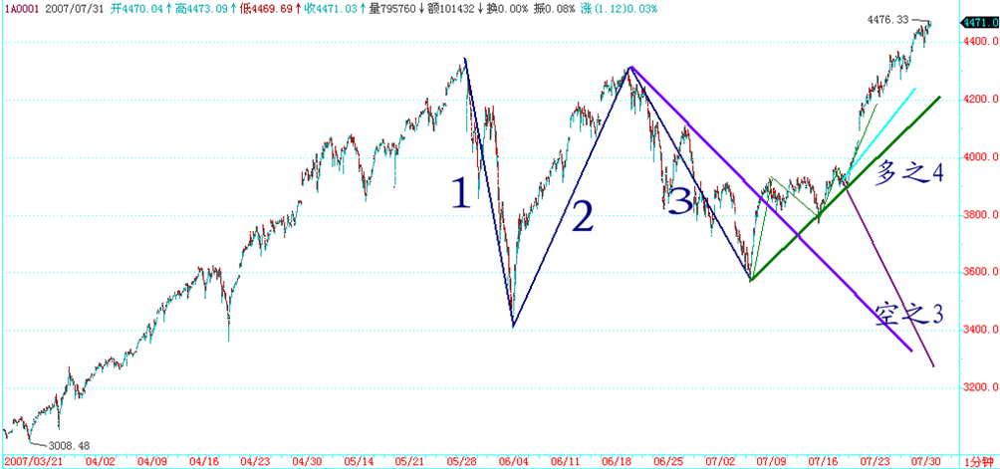

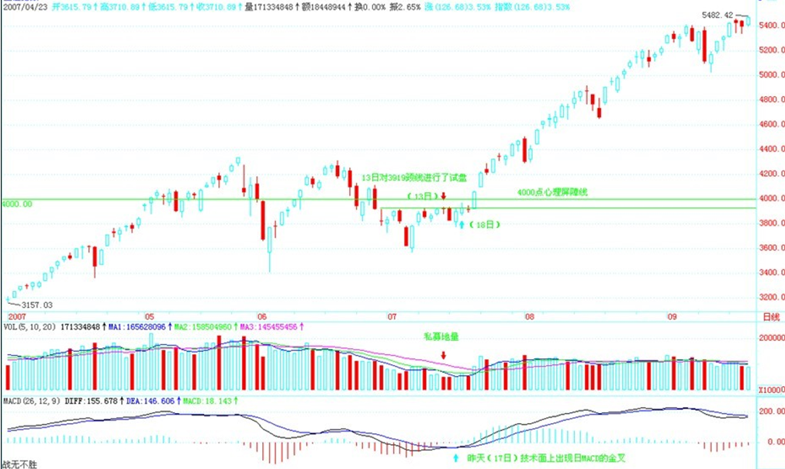

[2007-07-19]在等待利空落地的日子里

(2007-07-19 15:29:28)

其实，无论本ID出差还是在北京，和各位的距离都是相等的，也就是一层网络而已。所以，虽然每次本ID出差，大盘就有病一般，但本ID利用战事的空闲处，也要干点别的事情，二级市场的事情，不是光二级市场决定的，所谓工夫在诗外矣。

现在科技那么发达，在哪里看盘都一样，别说深圳了。本ID在N多年前，就熟悉深圳的大小证券部，里面留下无数故事，有时候只能说给星星听了。在这样一个等待利空落地的日子里，说点闲话也不是多余的。

但，就算在这样一个日子里，汉奸鬼子还没罢休。看看尾盘最后十来分钟的窄幅波动，斗争一直到最后1秒。有时候，真觉得这种事情有点无聊，至于吗，汉奸鬼子们？最后几分钟不晃悠一下，你们会死呀？当然，这也是可以理解的，换着本ID当空头，只会更残忍。

现在，其实没什么可说的，在等待利空落地的日子里，大家就去倾听那落花飘落的声音，本ID有足够的耐心，等待那些火星人都知道的利空影子一样摔碎。所有爱当捕风蚊子、捉影苍蝇的，就继续吧！

虽然，写相信未来的人，最后成了疯子，但并不需要疯子才可以相信未来。特别对中国资本市场的未来，可以断言的是，所有用最疯狂的愚昧去断送中国资本市场前途的人，无论是谁，都只能是民族和历史的罪人。

在外，课程没法写了，但还是可以继续考考各位的学习程度的，今天又来一道题目，下面，每一划依然代表实际的笔，请问，站在线段的角度，这两者是否相同？为什么？

各位就请好好回答问题，回答不出的，就请继续学习。本ID要忙去了，先下，再见。

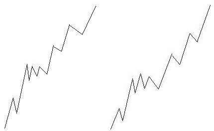

[2007-07-20]刚起来，下午解不了盘。

(2007-07-20 08:26:20)

刚起来，下午收盘马上有事，盘是解不了了，周六、日有空再补上。反正在外面，音乐会也没法开。刚才扫描了一下回帖，很多网友的答案都是对的，站在线段角度，那两图是有本质的区别的，但如果里面的每一划不是笔而是线段，那么这两图就是没区别的。这是为了说明，笔、线段，和中枢、走势类型是有区别的。笔、线段是为了在实际操作中构成最小级别的中枢，在笔和线段中，连中枢都谈不上，只能用类似中枢以及相应的背驰力度方法去确认笔与线段的结束，但这只是类似，并不是说笔与线段里就真有什么中枢与背驰。严格意义上说，把线段当成最小级别走势类型的次级别是不对的，当然，在不严格的意义上，可以类似地这样认为，但两者是有本质区别的。这两个图就区分出两者的区别来了。

请注意中枢的递归定义的存在性意义，与分型、笔、线段的操作性意义的区别。当然，如果我们能找到交易中每一分笔（注意，不是上面说的笔，而是实际交易中的每一分笔）的成交，然后按照递归定义，就可以构造出整个走势类型与中枢的级别序列来，但这没实际操作意义，只是理论上的。而分型、笔、线段，并没有违反中枢的递归意义，只是用一种方法来确认具有操作意义的最小级别中枢与走势类型，其后的一切，依然按照递归的定义来。如果对数学有点了解的就知道，两者在递归的形式上是一样的，都是an=f(an-1)，唯一不同的就是预先给出的a0，纯理论上的，这a0就是从每一分笔的成交开始的，但这没有实际可操作性；所以，就要用分型、笔、线段来确认这个a0。而站在递归的程序上，这两者没有本质区别。其实，这些都是最简单的数学，除了孔男人类的，全宇宙的人都应该明白。

还有，本ID画图只是随手画，但市场的图是合力的结果，不是任何人可以随手画的，要真把握本ID的理论，不预测、只看当下走势，这是必须首要记住的。

听说黄油蟹当季节了，可惜没有菊花酒可以对影成三人。先下，明后两天有时间再见。

2007-07-20晚上解盘

该来的都来了，你还需要什么?

(2007-07-20 21:33:08)

在车上和各位打招呼，今天的走势无须多说，今天的消息也说得太多，该来的都来了，你还需要什么?

当然，空头没有完全打死，本ID需要痛打落水狗，因为本ID知道，有些狗不打死，就要咬人，如此而已。

一切不用多说，本ID喜欢干，不喜欢说。干的已经成为历史，永远K线了，如此而已。

周末，腐败去吧，本ID还要忙，今晚的黄油蟹不错，可惜没有菊花酒。先下，再见。

[2007-07-23]打狗棒下，星火正燎原。

(2007-07-23 15:25:57)

对不起，这两天确实太忙，没有新帖子，趁着收盘说两句。其实今天的走势，没什么可说的，周末，本ID在这里已经明确说了，要痛打落水狗。有些狗般的思维不是说要低开吗？不是说有回补的机会吗？当然，本ID尊重这种思维。但按本ID痛打落水狗的思维，就是没有低开，没有回补的机会。要回补可以，当轿夫吧！

当然，这里说的是那些在3600点下狂砸诸如中石化等要把多方弄死去舔他们主子的洋狗，这次激战，在这里全程直播了，就像春节前后那次，最后，一阵打狗棒下，星火正燎原。本ID在开战时就说了，本ID只点火，本ID不当解放军，但一旦星火燎原，解放军自然就来。好了，本ID该干的已经干了，后面，就看有多少草可以燎原了。对于多方来说，现在已进退自如。对于本ID，拂身白云外，回首大江横，点火事了，谁爱当火炬手就当去吧。

技术上，4159点的1/2线将决定整个中线走势。

由于二级市场战事已经稳定，本ID将花更多时间去为一个更大的战争作准备。这战争的意义在于，让中国人永远当中国资本市场的主人，而这不是光从二级市场下手就可以的。好了，事忙，先下。

[2007-07-25]说说昨天的走势

(2007-07-25 08:54:22)

对不起，今天收盘后解不了盘。(2007-07-24 08:46:06)

对不起，今天收盘后解不了盘。有一个N百人参加的腐败活动，忙完，晚上有时间再说。特此说明，免得各位收盘后空等。

---

对不起，实在太忙，现在刚起来，抓紧时间说说昨天走势。昨天其实没什么可说的，技术上碰到前面两个高点连线，站在本ID三角形整理的最低要求上，昨天的回落理所当然。本ID前面说了，现在至少对本ID来说早已进退自如，所以要花多点时间在别的地方。本ID最低的要求就是三角形的第四段，昨天碰到前两高点连线，就完全达到本ID的要求，所以本ID完全不会再作为。也就是说，如果大盘出现比三角形更好的走势，例如从这里直接突破，对于本ID来说是锦上添花，本ID乐于坐轿子。如果大盘继续按三角形走，出现一个回调的第5段，那么即使大盘重新回到目前位于3700点下的下面两低点连线，本ID也是可以接受的，大不了到时候本ID再出手。

本ID这次出手的目的在出手时已经公开说了，就是不让汉奸鬼子买到便宜的筹码，不让他们平台型的阴谋得逞，现在已经完全达到。本ID的行动，只针对汉奸、鬼子，不当解放军，这也是一大早说了的。而本ID目前的资金、筹码配制，在这两天已经完全调配到符合这种两者皆可的程度。这点，在周一收盘时，本ID已经明确说了“对于本ID，拂身白云外，回首大江横，点火事了，谁爱当火炬手就当去吧。”

站在纯技术的角度，4159点的1/2线是关键，现在的火炬手们，如果有能力扛住该线，那么大盘将继续创新高，否则就去补缺口，考验4000点支持，甚至考验下面两低点连线。由于本ID现在已经退居二线，只坐轿子不冲锋，所以以后可以多说技术的问题，分段也可以提供了。当然，前提是本ID有时间。

个股方面，本ID那些中长线的面首依然会继续宠信，前提是你要有足够的耐心。例如，像本ID4月说的6000万总盘，2000万以下流通的深圳新上中小盘，当时一直不动，你看现在的002121，看看是不是符合本ID当时说的中长线价值？大盘震荡下跌这么多，对他又有什么影响？对其它股票也是一样的，面首，有中长线搞才有味道的，整天对股票面首419，小心得爱滋。

中长线运作，专一点，把成本降到0，这才是股票中永远不败之道。前面说002121，本ID的成本还没到0，经过这1月的运作，也0了，注意，现在各位就千万别买了，30元下不买，现在买，那是有病，只是有的，可以继续按本ID的方法运作下去，成本为0后就是保持0成本增加筹码了。对于其他所有股票，这方法是一样的。

对不起，今天依然忙，收盘后可能没时间解盘。但只要有时间，本ID会上来说两句的。

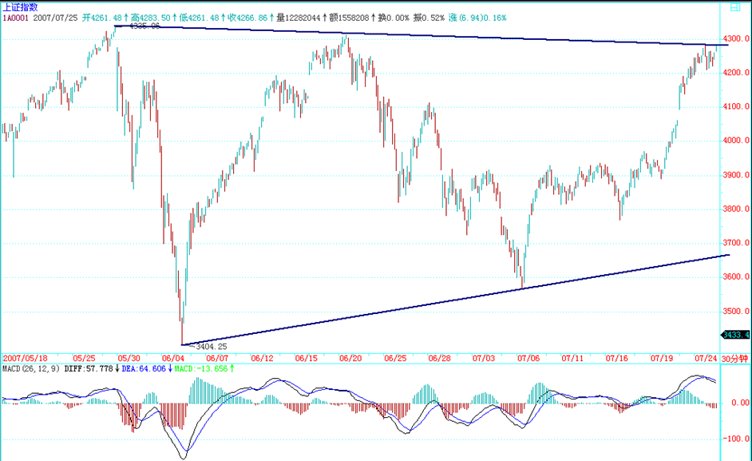

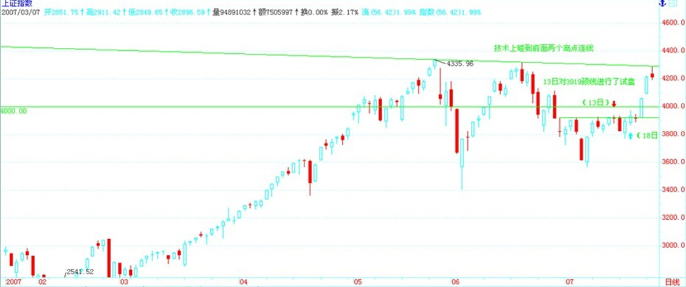

[2007-07-25]应酬前，说说今天的大盘

(2007-07-25 18:31:21)

首先说一句，刚上来，发现系统警告好友数量已经到极限，所以请各位不要再申请本ID为好友，等新浪的数量限制扩大再说。

应酬前，抓紧时间说两句。今天，各路火炬手们都很兴奋，本ID坐轿子，当然要表扬一下抬轿子的。站在纯技术的角度，4159点站稳后，就攻击前期高位，这在昨天和早上都说了。当然，现在的上攻有点急，但被压抑了许久的多头力量，尽情释放一次，也是无可厚非的。

技术上，4335点是否明天突破，其实一点意义都没有，早一天晚一天并不重要，重要的是突破后，在适当的回抽确认后，能释放出更大的能量。否则，就要面临假突破的风险。所以，现在，在技术上，主要要面对这个问题，一旦确认假突破不成立，那么大盘就会走出一段坚定有力的行情；否则，大盘依然有考验4000点等可能。是否假突破，是今后两周行情演化的关键点。

本ID今天早上已经宣告，本ID现在在轿子上，所以绝对不出力了，只会享受本ID应该享受的成果。别人想羡慕也没用，本ID前段时间冒着枪林弹雨换来的成果，当然要好好享受，否则本ID怎么能不断壮大？怎么能在下次出手时更强劲有力？所有如本ID般以抗击外敌为使命的资金的壮大，就是对汉奸鬼子最大的打击，这没什么可说的。

个股方面，本ID前面已经反复说过，先成分股。这几天成分股轮番表演，就是本ID前面说的轮动。目前各路诸侯纷纷上场，互相配合良好，也就是所谓的星火燎原了。至于非成分股，肯定会轮动到的，特别是有题材、基本面支持的，更会有中长线价值。

基本面上，现在最大的努力方向，就是争取单边印花税，全世界，只有香港、深沪、澳大利亚等少数几个市场双边印花税，现在，深沪交易所难道不应该和国际接轨？这次，国际接轨应该成为保护国人利益的武器。那种老让国人不爽的国际接轨已经太多，早该来一次能让国人爽的国际接轨了。

不管什么面，一切都是合力，没有任何上帝，一切都在合力之中，即使没有回报，但该努力的必须努力，3600点汉奸鬼子叫嚣平台型时如此，现在亦如此。明天，本ID就回北京了，估计又是最后一班飞机，后天才能在北京和各位相见。

北京的天空，无论白天黑夜，也是天空、只是天空而已。

[2007-07-27]大盘周线上的四种演化分析

(2007-07-27 08:01:59)

对不起，昨天回京太晚，没写帖子。现在补上。还要道歉一下，在外，只能说股票，其他东西没时间写。回来，下周还是按正常来。

大盘无分歧地创新高，才会导致真正的分歧。前天说了，现在最大的分歧就在于真假突破。但无论真假突破，突破后的调整、回抽、确认等是必然要发生的。站在周线的角度，无非四种：一种是本周的上影线调整；二是下周的周K线调整。前者是弱的，后者是强的。当然，还有一种更强的，就是下周继续拉长阳，中间有日的跳水洗盘，再下周才真调整。最强的就是强力夹空，连收N根周阳，全部调整以日线完成。

一切都由市场合力决定，只要按本ID的理论当下去判断市场的选择就可以。例如，今天就面临第一种情况是否出现的选择，这由今天当下的走势就可以判断。从管理层的角度，如果出现第三、四种的走势，那么基本面上的可能变化，例如单边印花等，就会受到更大阻力，站在对股市中长线健康的角度，本ID反对后两种走势。当然，本ID只是市场分力之一，而且，本ID现在轿子坐得舒服，因此这种反对最多是口头上的，如果有哪些无聊的火炬手们一定要搞第三、四种，本ID站在短线利益的角度，确实也没理由反对。本ID唯一可以干的，就是等这些疯狂抬轿子的火炬手抬到没力气时，一棍子把他们打晕，给他们上上市场风险课，配合一下管理层的风险教育。

至于第一、二种，本ID都可以接受，说实在，本ID更喜欢上下震荡，越震荡，差价越多，单边其实没什么意思。站在纯技术的角度，目前的5日线是判断能否直接真突破的关键，一旦在下周初之前5日线上移到目前位置指数依然不能脱离目前区间，大盘重新回跌的机会就不可避免了。

归纳上述，第二种走势是最有利于多头的，而第一种走势，则给空头一个喘息的机会。至于第三、四种走势，那是纯粹找死，为本ID做嫁衣裳，当然，这世界上想死的人很多，本ID当然也不讨厌这些死都这么有性格的。

对于本ID来说，前两天已经宣布退居二线，所以只会按市场的选择来当下选择自己的操作，而不会主动去引导市场的方向。3700点上，市场爱干什么，什么资金干的，本ID都可以接受。

个股方面，成分股的拉升轮动后，如果没有其他股票的呼应，大盘走势不会太健康，所以各位要看这轮动是否能蔓延，如果不行，那么大盘的走势就要变局。现在的节奏就是一二三，等三线都轮动到了，就看一线是否能重新启动，不行，大盘就要休息了。

下午收盘后，本ID要开始补腐败课，晚上有时间再解盘，先下，再见。

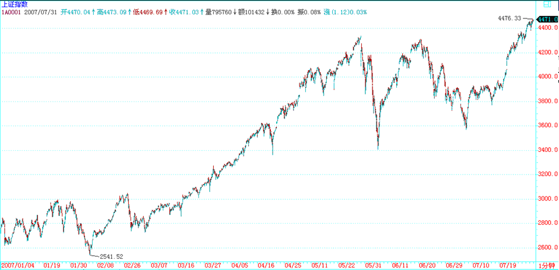

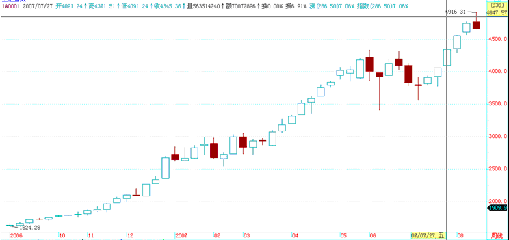

2007-07-27晚上解盘

对不起，刚回，说两句。

(2007-07-27 23:09:24)

收盘就开始补腐败课，刚回，明天还要继续腐败，周末这两天闲不了。早上说了，对于多头来说，最好是第二种，今天，在外围股市大跌下，能走成这样，各路火炬手是出力了，搞得本ID都有点怪不好意思的，当然，这也只是口头上，本ID赚钱坐轿子，从来都是心安理得，没什么不好意思的。

由于各路火炬手很多在4000点以上才逐步重新介入，所以现在火炬手变举重选手的机会大增，下周初就看这些举重选手举杠铃的能力了。举住了，自然更大面积的空翻多，否则，就假突破引发一轮雪崩。本ID没有举杠铃的爱好，倒是如果某些人举不住，本ID顺势踢上两脚的兴趣更大。当然，如果各路举重选手都能更高更快更强一把，那本ID也乐意在轿子上多晃悠晃悠。

可能有人又要骂本ID卑鄙无耻，为什么光点火不举杠铃，一直冲上去。本ID脑子里还没有水太多，只爱点火，不举杠铃。而且本ID已经多次说过，只要在3700点上，大盘怎么走，本ID都没意见。现在，那些在3600点还鬼哭狼嚎的，突然都成了多头首脑，都在宣称自己以前多么英明神武，多么先知先觉。本ID只干，这些无聊的帽子，谁想戴就去套上吧。

除非大盘有能力以最强劲的动力一口气走到6000-8000点，否则，这一段，在日MACD没突破前期高位之前，本ID只能认为现在是处在背驰段中，对于本ID来说，除非背驰段被破坏，否则一切就处在区间套的精确定位过程中。而要避免背驰段，就需要对日线的MACD走势进行周密的控制，这对于本ID当然不是一个问题，但对于那些众多举重选手，能否最终完成，本ID会在轿子上好好看着，一旦他们弄不好，本ID就会狠狠踢他们两脚，给个教训这群面首让他们长点见识。

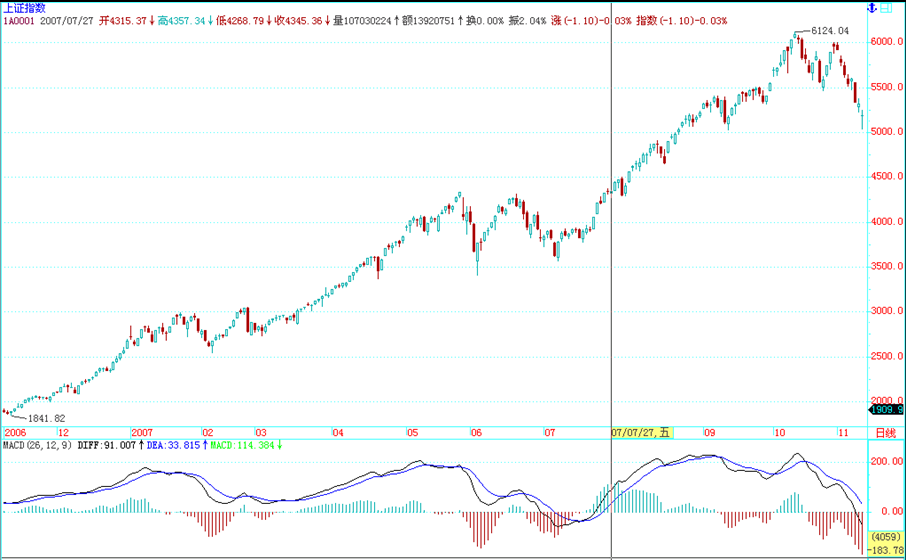

对于散户来说，一旦行情展开，就一定要按照行情自身的规律，喊口号不是操作，股票是用来操作而不是用来喊口号的。如果大盘能保持基本在前期两高位连线上进行震荡整理，那么就将走强，否则就要面对假突破后的猛烈清理。

而由于今天没有出现早上分析的第一种走势，因此，后面可以选择的就只能是二、三、四种了。而其中的第二种，下周线无非三种：长阴线、十字星或小阴小阳、带长上影的K线。而其中，只有长阴线这种是有巨大风险的。因此，只要看住5日线或前期两高点连线，只要这些线能守住，长阴线是不可能的。而相应的走势，都可以持股或用部分筹码进行中枢震荡的操作来处理。

总之，下周初走势十分关键，如果先扬后抑，一旦再次上攻失败或15分钟以上短线背驰，将引发一次有力度的调整，反而先抑后扬能使得走势更轻松点。个股方面，今天热点开始向非成分股蔓延，这是比较好的现象，如果这现象能维持，那大盘即使调整，后面的行情也会有可期待的地方，否则就要小心了。

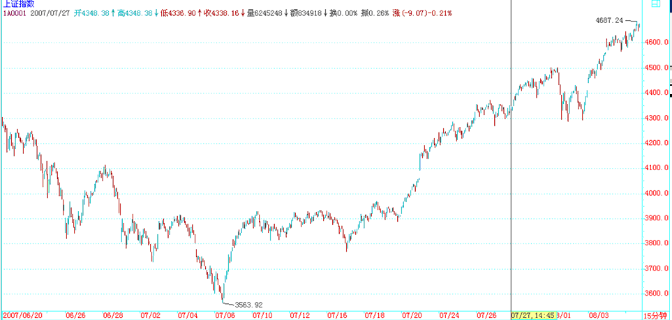

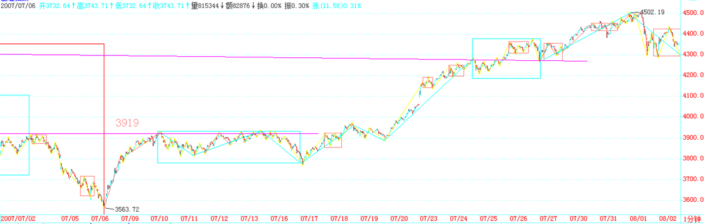

[2007-07-30]先扬后抑，酝酿震荡。

(2007-07-30 15:19:35)

上周说得很清楚，只要现在的举杠铃者能顶住，空翻多就更多了。今天，昨晚伊拉克的精神大概也给了举杠铃者一点血性，所以今天，这群人动用所有力量，最终把该顶住的顶住了。

市场就是这样的一个生物链，本ID这种第一波进去的，等着4000点上进去的抬，而4000点进去的，顶住4300点，自然有新一波人进来。所以，现在4000点进来的也进退自如了，当然，如本ID者，就更自如了，上面已经有了两层保护膜。

但上周说得很清楚，本周周线上是选择第二还是第三种走势，是一个关键，如果是第二种，那么周线上将有长上影，而第三种，调整也会以日线形式产生。所以，正如周末说的，先扬后抑，后面的调整压力就大了，今天的走势，就为后面酝酿震荡。

月线上，明天是收盘，所以，站在第三波4300点进来资金的角度，一个十字星是最理想的。而对于第二波4000点进来的，一个阴线也是可以接受的，只要不破4335点就可以。当然，对于本ID这种3600点进来的，大阴线也无妨，不过又提供一个短差机会而已。因此，明天开始的三天，就是4300点进来与4000点进来两波资金的游戏，本ID继续看戏，偶尔三国演义一把。

个股方面，今天轮动可以，但地产等有调整压力，目前，关键看成分股里未启动的，和有题材的成分股能否跟上。换言之，就是4300点进来的一批，能否坚决顶住，他们顶住，前两波也不会故意害他们，因为他们顶住，就有第四波进来，要害，也害那第N波的。当然，这N是可以等于3的。忙，要先下，再见。

## 教你炒股票66：主力资金的食物链

(2007-07-30 22:42:05)

因为要画图要浪费时间，下一课再说有关线段的问题。今天，说一些宏观点的东西，说说主力资金的食物链。

市场每一时刻的走势，都由当下的合力构成，如果1亿人参加的市场，每一分力都是相等的、都是独立的，那么市场的整个运转和现实的情况，当然有所不同。现实的情况是，有些分力是特别巨大于其他的分力，在这种情况下，对合力的分析，不能脱离对这些特别巨大分力的分析。

如果现实的系统中这种特别巨大的分力只有一个，其他分力与之相比都可以忽略不算，那么市场的所谓合力，就与这分力基本无异了。例如，在那些控盘程度极端高的股票中，就往往呈现这种情况。而这种一个分力远大于其他分力的系统，其稳定性是会产生突变的。关于个股的情况，以后会说到，这里先说说关于大盘合力与分力的关系。

有一种很流行却纯粹出于想象的说法，是关于所谓市场主力资金的。在这种流行的谬误中，似乎市场中的主力只有一拨人，他们控制着市场的走势，画着每天大盘的分时图中每分每秒。而事实上，这种所谓的主力，从来没存在过。市场从来都分裂着不同的利益集团，所谓的主力资金，从来都是分派别的，各派别之间，会有联手，会有默契，但也有暗算、互相拆台等等，黄雀、螳螂、蝉的游戏也一点都不新鲜。

主力资金层面的运作，当然也不是单纯的技术分析可以包括的。用打仗来比喻，技术分析，不过是一些战术性问题，而战略性问题，就不是技术分析可以解决的。例如，如果你是一个散户，你只要把本ID的技术理论搞清楚，那在市场中就可以游刃有余了。但如果光把本ID的技术理论搞清楚，是运作不了主力资金的，当然，技术层面是一个基础，但只是一个方面。但无论什么资金，站在市场走势的角度，不过就是构造出不同级别的买卖点而已。因此，对于散户来说，你无须知道这天上掉下的馅饼是怎么制造的，只需要知道怎么才能吃到这馅饼。

必须明确的，任何的主力资金，无论什么背景、级别，最终都不可能逆整个经济的大势而行。资金不是一拨，山头就那么多，10年前的主力，如果不随着市场去发展，到现在就什么都不是了。所以，任何主力资金，无论什么背景、级别，还有一个特点，就是要折腾。不折腾，就没有江湖地位，唯一不同的，只是折腾什么，只是不同市场、板块的变换。

在单一的股票市场中，不同风格、背景、势力的资金，各自控制着不同的板块，最大的几个，构成食物链的最上层。一般来说，这几拨资金都是老油条，互相也知根底，其根底往往不在市场中，而在市场之外，一般情况下，各方都是保持江湖规矩，不会轻易与某一方开战。但，绝对不是说，最大的家伙间就没有战争，而是这战争无时不在，只是都在等着一方出现破绽，余下的一拥而上，分而吃之。中国资本市场的历史上，出现过好几次这样的事情，都是陈年旧事，不说也罢。

当然，最大的家伙，也不是一成不变的，不同的年代也会改变点包装，换些名头。

从这食物链的最高端开始，逐级下去，到最后的散户个体，分着好几个层次。对于最大的主力来说，对下面几个层次的生态状态，会保持一定的维持。一般来说，一个新的最高级别的势力出现，是没有人愿意看到的。因此，那些在次一级别中特别活跃，特别有上升苗头的，都会被重点绞杀。对于最高级别的主力来说，一个各层次的生态平衡是最有利的。站在这个意义上，如果有些对散户特别恶劣的，要把散户或某层次赶尽杀绝的，那么肯定成为最高级别主力绞杀的对象。这种事情，在资本历史上也太常见了。一般来说，这种绞杀对象，都类似暴发户，最高级别的主力，就如同贵族，贵族当然看不起暴发户，特别当这暴发户影响了整个市场生态的平衡，不对之株连九族，斩草除根，那还怎么当贵族？这种绞杀，当然可以是市场化的，却不一定是市场化的，这就不想多说了。

[2007-07-31]完美的震荡制造完美的月线收盘

(2007-07-31 16:03:53)

今天，有没有消息都要震荡，反而因为消息的出现，使得震荡中，市场各方的心理都比较平稳。盘中的最大一次跳水，刚好去回试确认4335点的突破，为什么？因为4300点刚进来的，要护住他们的成本线，而今天的消息，刚好给了他们这个机会。由于今天又是月线的收盘日，所以前面两拨人也没理由估计去砸坏这图形，毕竟，三拨人，前后时间不同，但至少在做多这点上，暂时还是利益一致的，一个好看的月线，当然对三者来说都是必须的。

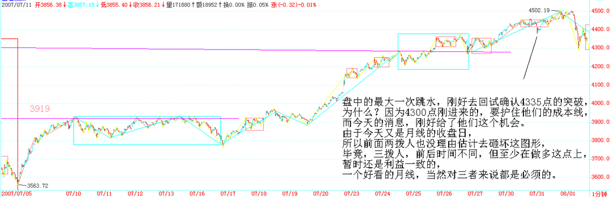

有了月线，那么8月的走势，无非就是长阴线、十字星、长阳线等几种。纯技术的角度，本月K线的一半位置刚好和1/2线的位置差不多，也就是说，这月K线的确立，使得1/2线的突破有了极大的保障，虽然不能说万无一失，但至少对于多头，特别对于前面两拨进去的人来说，已经有了中线运作的第一道防线。短线，还是看4300点进去这一拨，他们最大的愿望，当然是快速拉离目前位置，所以短线做多意愿最大的就是这一拨人。3600点这拨，当然乐见其成，4000点那拨人，也不会有太大分歧。

但是，基本面上依然有不明朗的地方，国家对目前经济形势的判断，依然有可变的地方，这构成影响今后走势最重要的因数。因此，大盘能否把去年8月后的走势复制一次，基本面上还有着极大的不确定因数。这因数，不是哪一拨人可以控制的，那是一个合力的结果，当然，一切都确定了，这市场也太不好玩了，不确定，才有美丽与奇迹可言。

技术上，其实十分简单。前面几次的单边势，都是基本以5日线为支持，基本上，在单边势里，没有3天是收在5日线之下的，因此，如果不会看太复杂图形的，5日线，或者中线的5周均线，就是最简单的判断指标。如果震荡连5日线都不破，那还怕什么？日线上，可以先以背驰段看待，然后根据后面的走势去确认背驰段是否有效。短线，4500点附近如果太快通过，就会为以后的走势埋下技术隐患，本周走势，如果继续长阳，将使得可能的基本面变化埋下政策隐患。但现在急功近利者太多，而本ID也不想浪费筹码进行太严厉的调控，因为本ID并不介意这次真搞成一个背驰段，现在本ID的策略，就是尽量不作为，让各路举重选手自己表现去。

个股方面，还是一早说的两条主线，成分股和超跌股，那些从年线或半年线上来的超跌股，也慢慢把形态走好，一旦大盘中线上升完全确立，那么都会轮动走出行情，但问题的关键是，这个确立依然不完全，所以超跌股的短线表现依然不充分。

一句话，太急功近利，就会把大盘给害了，目前大盘的关键是要走得扎实点。而八月中上旬，基本面上也将有一个中长线的定调，具体到时候就知道，现在还没有结果，这才是必须关注的地方。

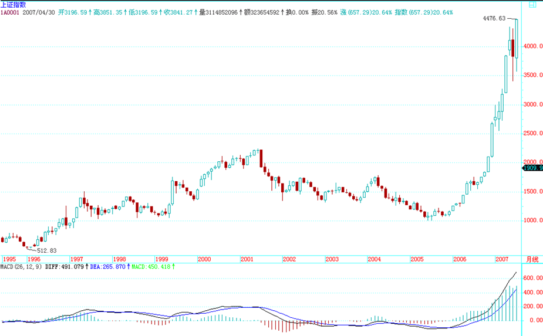

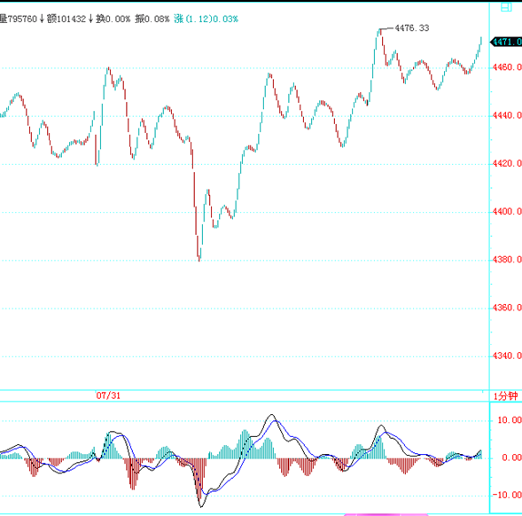

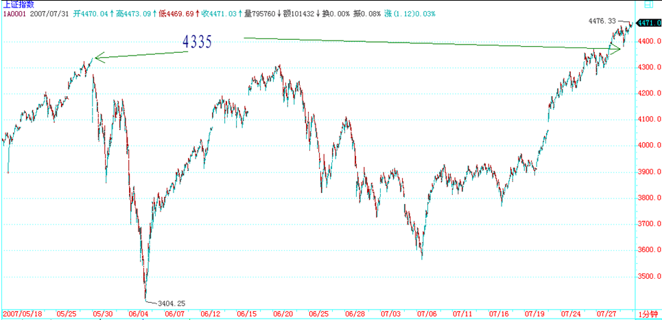

[2007-08-01]该来的调整，必须且及时。

(2007-08-01 15:33:01)

本周的K线，本ID在上周已经明确说过，希望是带上影的第二种情况，否则急功近利，只能害了最终的行情。今天的调整，使得这长上影的小阴线已初显。后面两天，关键是第三拨人的做多决心了，强烈回收上去，则还有走出第三种情况，也就是中阳周线的可能，但这种走势，确实有点急功近利，反正，本ID是绝对不出这手的。本ID已经早说了，震荡，对本ID只是一个先卖后买的短差机会。在这里等5周均线上来，更稳健。

技术上，今天的低点并没有跌破前面两高点连线，所以调整在合理的范围内，该线在4260点附近，目前10日线也在该位置，因此是否有效跌破该线是一个大盘调整强弱的重要指标。一旦有效跌破，上周K线留下的缺口将面临考验。对于第三拨人，该线是他们的生命线，当然，对于前两拨，其实无所谓，就看第三拨人表演吧。

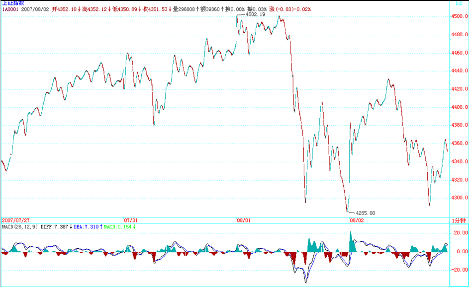

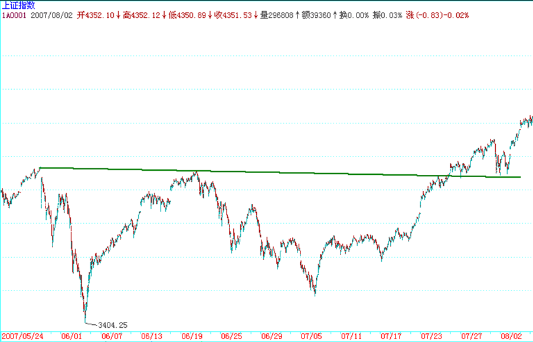

上面，由于今天跌破5日线，因此后面的反抽如果不能上5日线，则大盘的调整将加大，能重新上去，那就将重新挑战4500点。即使能突破4500点，最好能反复震荡，否则，将引起昨天所说的八月中上旬基本面上的重大不稳定因数。还是昨天那句话，不要急功近利，要爱护市场本身。

大的技术上，日线上的背驰段依然成立，如本ID般第一拨进来的，一定不能在这个位置加码，而是用先卖后买打差价的策略，通过震荡把成本降低，万一大盘真不能突破4500点走出多头陷阱，到时候砸起盘来也更爽。大家好好去看看，现在叫嚣冲多少多少点的人，在3600点的时候，是不是那些吼着要跌破多少多少点的。行情是合力的，一步一步走出来的，预测都是忽悠，按照正确的策略去操作才是一切。

如果能看明白线段、中枢、走势类型等的，现在这种行情是最好操作的，注意，节奏一定是先卖后买，卖错了不怕，如果大盘真能突破4500点，很多中低价股都会大幅启动的，还怕买不到好股票？不杀跌、不追涨，按照买卖点来。各位看看今天的高点，是一个15分钟级别的背驰引发的，里面的区间套极端完美，可以仔细研究。由于现在60分钟并没有进入背驰段，因此，不能说日线的背驰段已经被定位。只能看成是一个15分钟卖点引发的。本周注意15分钟以上级别的卖点，这在上周已经提醒，如果没看懂，请好好继续学习。

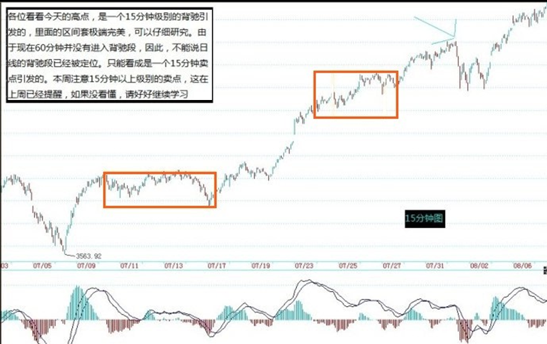

晚上，把关于线段分类的课程放上来。先下，再见。

## 教你炒股票67：线段的划分标准

笔的划分标准在前面已经严格给出，因此，下一关键问题，就是如何划分线段。下面，给出类似笔划分，但有重大区别的划分标准。用S代表向上的笔，X代表向下的笔。那么所有的线段，无非两种：一、从向上笔开始；二、从向下笔开始。简单起见，以向上笔开始的线段为例子说划分的标准。

以向上笔开始的线段，可以用笔的序列表示：S1X1S2X2S3X3…SnXn。容易证明，任何Si与Si+1之间，一定有重合区间。而考察序列X1X2…Xn，该序列中， Xi与Xi+1之间并不一定有重合区间，因此，这序列更能代表线段的性质。

定义：序列X1X2…Xn成为以向上笔开始线段的特征序列；序列S1S2…Sn成为以向下笔开始线段的特征序列。特征序列两相邻元素间没有重合区间，称为该序列的一个缺口。

关于特征序列，把每一元素看成是一K线，那么，如同一般K线图中找分型的方法，也存在所谓的包含关系，也可以对此进行非包含处理。经过非包含处理的特征序列，成为标准特征序列。以后没有特别说明，特征序列都是指标准特征序列。

参照一般K线图关于顶分型与底分型的定义，可以确定特征序列的顶和底。注意，以向上笔开始的线段的特征序列，只考察顶分型；以向下笔开始的线段，只考察底分型。

在标准特征序列里，构成分型的三个相邻元素，只有两种可能：

第一种情况：

特征序列的顶分型中，第一和第二元素间不存在特征序列的缺口，那么该线段在该顶分型的高点处结束，该高点是该线段的终点；特征序列的底分型中，第一和第二元素间不存在特征序列的缺口，那么该线段在该底分型的低点处结束，该低点是该线段的终点；

第二种情况：

特征序列的顶分型中，第一和第二元素间存在特征序列的缺口，如果从该分型最高点开始的向下一笔开始的序列的特征序列出现底分型，那么该线段在该顶分型的高点处结束，该高点是该线段的终点；特征序列的底分型中，第一和第二元素间存在特征序列的缺口，如果从该分型最低点开始的向上一笔开始的序列的特征序列出现顶分型，那么该线段在该底分型的低点处结束，该低点是该线段的终点；

强调，在第二种情况下，后一特征序列不一定封闭前一特征序列相应的缺口，而且，第二个序列中的分型，不分第一二种情况，只要有分型就可以。

上面两种情况，就给出所有线段划分的标准。显然，出现特征序列的分型，是线段结束的前提条件。本课，就是把前面“线段破坏的充要条件就是被另一个线段破坏”精确化了。因此，以后关于线段的划分，都以此精确的定义为基础。

这个定义有点复杂，首先请先搞清楚特征序列，然后搞清楚标准特征序列，然后是标准特征序列的顶分型与底分型。而分型又以分型的第一元素和第二元素间是否有缺口分为两种情况。一定要把这逻辑关系搞清楚，否则一定晕倒。

显然，按照这个划分，一切同一级别图上的走势都可以唯一地划分为线段的连接，正如一切同一级别图上的走势都可以唯一地划分笔的连接。有了这两个基础，那么整个中枢与走势类型的递归体系就可以建立起来。这是基础的基础，请务必搞清楚，否则肯定学不好。

最后，尽量画点图，让各位分清楚上面的一些概念，但最好把定义看清楚，这才是真正理解，图只是一个辅助。前两个图形中标出了线段的划分。

 INCLUDEPICTURE \d "C:\\Users\\574586479\\AppData\\Local\\Temp\\17369\\11222\\12133\\2330857535\\教你炒股票67：线段的划分标准_521.files\\67yy1.jpg" \* MERGEFORMATINET 

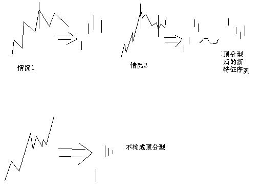

HYPERLINK "http://blog.sina.com.cn/u/486e105c01000c2h" \t "C:/Users/574586479/AppData/Local/Temp/17369/11222/12133/2330857535/_blank"  

[2007-08-02]明天才是大盘短线的关键

今天，没跌破昨天本ID所说的前期两高点连线以及10日线，所以出现反弹就理所当然了，加上外围因素的影响，也给第三拨进来的人壮了胆。今天，也收在昨天特别强调的5日线上，但这并不意味着大盘就平安无事了。大盘在6月20、21日，也走出过类似的K线组合，而且时间上也是周三、四，而周五的下跌，就使得一轮大调整得以确立。当然，一般来说，历史不会简单重复。这只是要提醒，今天的走势其实并不重要，关键是明天，考虑到周末消息面的因素，这个时间还要延伸到下周一，也就是说，下周一前能否确认重新站住5日线，将是短线大盘走势的关键所在。

对于新进的第三拨人，他们不想就此站上N个月的岗，必须要在这里奋力一搏，现在，比6月20、21日有很多有利的条件，技术上，MACD形态好多了，下面有前期两高点的连线，而上周的周线缺口，技术上有三周不补就以后再补的惯例，也就是说，新进来的一拨人，只要能顶住三周，至少可以把某些中线资金给忽悠进来了。因此，对于这拨人来说，别无选择地，必须守住前期高点连线，重新站稳5日线。

但是，这拨人也有可能最终毁了市场，为什么？这拨人如果急功近利地迅速突破4500点，引发大量新资金涌入，那么上半年的单边行情将不可避免。但目前国家对经济的总体判断与相应的对策，都在一个敏感时期，如此走势，必然导致目前对多头有利的舆论、政策环境发生极为不利的变动。目前，比印花税还要严厉的，就是关于交易制度、规则的改变，如果谁最终乱搞，把这东西给搞出来了，那么，才是真正恶劣的事情。

所以，虽然多头目前当然有能力快速突破4500点，但一个稳健的走势依然是必要的。在4500点附近进行合理的震荡，将对市场长远的发展有好处。甚至，在4000点到4500点进行一个长时间的大箱体震荡，也比又掀起一场连续N根周K线长阳的运动要强。

当然，市场往往不会按照理智的方式进行，市场往往就是醉生梦死疯一回，那么，对于如本ID一样第一拨进来的，一定要采取这样的策略，就是绝对不增仓，因为在3600点开始都买够了，现在还买是脑子水太多的表现。其次，采取保持仓位先卖后买打差价的策略，这样成本降低，就永远立于不败之地。第三，一定不要听任何人忽悠马上要冲多少多少，冲是别人的事情，我们的事情就是坐轿子，你有本身把轿子抬到华山顶上，我们也没意见，但只要有人抬不动，就一定要一脚把轿子给踹了。

个股方面，成分股继续打冲锋，一旦确认周线突破成立，二、三线股会跟上的。下面给出这次下来的一个分段。红绿箭头给出的是黄白线或柱子面积等的对比，看看就知道这些买卖点是完全可以当下判断的。现在，一个1分钟中枢已经形成，短线走势，就看这中枢的演化，一切当下判断。

[2007-08-03]醉生梦死疯一回游戏才正式开始

坐轿子的感觉确实不错，坐在轿子上看沿路风景，别有一番情趣。下面，是关于坐轿子上华山的第一天日记。这个日记，将有N日N章。

今天大盘的跳空高开，就使得6月20前后的K线组合不可能出现。昨天已经说过“市场往往不会按照理智的方式进行，市场往往就是醉生梦死疯一回”，站在第三拨人的立场上，尽快远离4300点，吸引第四拨人进来，本来就是急切的事，至于后面将引发什么，他们当然无所谓，而前两拨人就更无所谓。一般来说，越到后面的第N拨，其成分将越来越杂乱，如果说第一拨人的成分是最纯净的，到后来，就三教九流，什么都有了。

今天的大盘开始迎来第四拨人里的先头部队，周末如果没有什么太大的坏消息，那么，第四拨人里的主力部队将在下周大面积进入。这拨人的成分将比第三拨更杂，有前三拨中中途开小差的逃兵，有看所谓周线突破有效进入的技术人士，有在外面卖外卖现再回家开店的、更大面积的是那些被钱烧得发慌的各路男女等等，醉生梦死疯一回游戏正式开始。

对于前三拨进来的人，从现在开始，最后埋单的是谁，是N等于几，已经不重要，关键是如何把这个游戏玩得长一点，但这个时间并没有什么上帝去规定，一个合力的结果下，从下周一开始，这个游戏的时间T开始计算，T从0开始，向着尽可能大的数进发。这就如同玩电子游戏，去预测在第几关结束是脑子有水的表现。

也正如玩游戏，关键是操作的策略，而不是去预测游戏在第几关结束。目前的操作也一样，预测都是无聊把戏，关键是有精密的操作。而操作是针对不同人的，如同玩游戏，高手和低手当然不是同一玩法：

对于低手，本ID反复说过最基本的操作策略，就是短线看5日线，中线看5周线，长线看5月线，只要不有效跌破，相应的操作就不用操作了，持股看着就可以。何谓有效跌破，就是跌破后反抽上不来，这种反抽当然和对应级别有关，例如一个月线的跌破，至少要看下个月反抽的情况，而不是看一日。

对于大资金以及散户里的中高手，就是要利用震荡机会就减低成本，一路上涨，一路把成本减下来但持仓数量不变，这样，你的仓位就自然随着大盘的上涨下降，也就是钱越来越多，但筹码没少，这样，是既回避大盘可能的突发非系统风险，又能完全把握市场利润的有效方法。

对于散户里的高手，就要充分利用大盘震荡中板块的轮动机会，获取市场最大的机会。

有人可能问，做不到高手怎么办？那就做低手，持股都不会，大盘晃悠一下就鸡飞狗跳的，那还炒什么股票，让股票炒你就行了。

昨天已经说了“个股方面，成分股继续打冲锋，一旦确认周线突破成立，二、三线股会跟上的。”这个结论继续有效，而且，只要第四拨资金能被忽悠进来，那些已经消除业绩风险的二、三线股，以及有题材的股票将大肆表现，例如，你没看到这两天，本ID已经大肆引诱各位到北京旅游了吗？注意，题材股的操作，一定不要追高，过了这个村，还有那个店，天天都有新机会，不管谁的股票，都不必追高。

股票都是废纸，一个好的策略与心态，能让你把废纸变黄金。

技术上，把今天的分段放上来，还搞不清楚的，请好好学习。例如下图中的7，这是什么？是下面那1分钟中枢的什么？这么标准的图形，都看不明白，那请把ID的课程重新读去。

## 教你炒股票68：走势预测的精确意义

(2007-08-05 10:36:28)

下午要去小罗、亨利一番，然后还要去酒吧折腾折腾，所以先把课程放上来。

今天说说预测，何谓预测？一般的预测是什么把戏？而科学严密的预测究竟是怎样的，本ID的理论是如何成为最精确最当下预测的，这都要在这里说明。真正的预测，就是不测而测。当然，这和一般通常的预测不是一个概念。在通常预测概念的忽悠、毒害下，很多人那根爱预测之筋总爱不时不自主地晃动几下，这里也算给那些被预测毒害的人治疗治疗，也算死马当活马治一治了。

市场的所有走势，都是当下合力构成。例如，前几天，认沽权证突然停牌导致的走势，就是由于规则分力有了突发性改变当下构成的。由于一般情况下，政策或规则的分力，至少在一个时间段内保持常量，所以，一般人就忘记、忽视其存在。但无论是常量还是随着每笔成交变化的变量，合力都是当下构成的，常量的分力，用F(t)表示，只是表示其值是一个常量或者是一个分段式常量。对于任何一个具体的t来说，这和变化的分量在合成规则与合成的结果来说，没有任何的区别。

但这些常量的分力，并不是永恒的常量，往往是分段式的，其变化是有断裂点的，很多基本面上的分力，都有这个特点，这些断裂点，构成预测上的盲点。当然，进行基本面分析，对宏观面进行大面积的考察，可以尽量减少这些盲点，但不可能完全消除。这因素的存在，已使得所有一般意义上的精确预测可能变成一个笑话。

更重要的是，基本面上的因素，也是合力的结果。政治、经济等等方面，哪个不是合力的结果？现在的世界政治、经济格局，就是众多合力的结果，一个国家里的就更是这样了。很多人一根筋思维，总是假设政策是一个上帝，是不需要合力的，里面没有各种利益的斗争，所有结果都如同一个预设的机器给出的。所有一般意义上精确预测的理论，实质上都是以类似的一根筋思维为前提的。

比前面这些更深刻的，站在哲学的角度，预测也是一个分力，就如同观察者本来就被假定在观察之中，所有观察的结果都和观察者相关、被观察者所干预，以观察者为前提，预测也是同样的方式介入到被预测的结果之中。正如同量子力学的测不准原理，任何关于预测的理论，其最大的原理就是测不准。

有人可能在说，很多人都有预测准确的经历，这是为什么？其实，这不过是一个概率事件。因为走势可以发生的情况，按任何标准来分类，其可能情况都是有限的。一般来说，就是三、四种情况。而喜欢预测游戏，到处宣布自己预测如何如何准的人比全世界正在被面首的人都多，瞎猫还能碰到死耗子，就算有人连续碰对了，也依然在概率的范围内，有什么大惊小怪的。而所有号称自己预测如何如何的人，不过都是玩如此的招数或被如此的招数玩而不自知，至于那些把烂的藏起来，只把忽悠对的到处晃悠，那就更等而下之了。

其实，预测一点都不神秘，甚至连某男都可胜任（注意，这涉及不可知事件预测，本ID对此的准确性没有任何信心）。所有预测的基础，就是分类，把所有可能的情况进行完全分类。

有人可能说，分类以后，把不可能的排除，最后一个结果就是精确的。这是脑子锈了的想法，任何的排除，等价于一次预测，每排除一个分类，按概率的乘法原则，就使得最后的所谓精确变得越不精确，最后还是逃不掉概率的套子。

对于预测分类的唯一正确原则就是不进行任何排除，而是要严格分清每种情况的边界条件。任何的分类，其实都等价于一个分段函数，就是要把这分段函数的边界条件个确定清楚。例如下面的函数：

f(X)=-1，X∈(-∞，0)，f(X)=0，X=0，f(X)=1，X∈(0，∞)

关键要搞清楚f(X)取某值时的X的范围，这个范围就是边界条件。在走势的分类中，唯一可以确定的是不可能取负值，也就是从[0，∞）进行分类，把该区域分成按某种分类原则分为N个边界条件。

有人可能要说，股票怎么可能变到0？这有什么奇怪的，股票停了算什么？别说股票，钱都可以变成0，你说1950年时候的金元券值多少？当然，如果你的子子孙孙能把一张金元券守到宇宙爆炸的最后一刻，那时候，这金元券会值N元的，这个N，大概也会趋向一个恐怖数字的，那就等着吧。

不仅股票是废纸，本质上货币也是废纸，其所谓的价值区间和股票是一样的，0同样是可能的取值。甚至按最精确的理论来说，还可以取负值，例如，如果有某朝或某国政府规定，私藏前朝或别国钱钞股票的一律死罪，那你说这钱钞或股票是不是负值？至于具体股票变0的情况，在权证上就经常发生。

边界条件分段后，就要确定一旦发生哪种情况就如何操作，也就是把操作也同样给分段化了。然后，把所有情况交给市场本身，让市场自己去当下选择。例如，前几天，本ID用前期两高点和10日线进行分类，那自然就把走势区间分类成跌破与不跌破两种。然后预先设定跌破该怎么干，不跌破该怎么干，如此而已。这就是最本质的预测，不测而测，让市场自己去选择。最后市场选择了不跌破，那就继续持有。

有人说，万一他上去后又跌破怎么办？这是典型的脑子水多瞎预测思维。任何一个市场的操作者，一定不能陷入这种无聊思维之中。市场不跌破是一个事实，你的操作只能根据已经发生的事实来，如果跌破，那就等跌破成为事实再说，因此在本ID意义下的预测里，你已经把如果跌破的情况该干什么预设好了，这种情况没成为事实，就是另一种情况成为事实，那就该干什么干什么。

一般来说，喜欢预测的人，通常都是神经过敏，脑子水多，操作低下，喜欢忽悠之辈。那些从2000点就开始测顶的，如果说错一次割一块肉，现在都可以去当假冒羊蝎子了。股票是用来面首的，不面首股票，就被股票面首。面首股票，可不能光是忽悠，而是要实际操作。所有的操作，其实都是根据不同分段边界的一个结果，只是每个人的分段边界不同而已。

因此，问题不是去预测什么，而是确定分段边界。例如，前两天用前期两高点分类有意义，现在再用，就没什么意义了，现在就可以完全用均线系统来分类，所以本ID就接着强调5日、5周、5月的原则。有了分段的边界原则，按着操作就可以，还需要预测什么？又有什么可预测的？

世界金融市场的历史一直在证明，真正成功的操作者，从来都不预测什么，即使在媒体上忽悠一下，也就是为了利用媒体。真正的操作者，都有一套操作的原则，按照原则来，就是最好的预测。

那么，本ID理论中的分型、笔、线段、中枢、走势类型、买卖点等等，是不是预测呢？是也不是。因为本质上本ID的理论，是最好的一套分段原则，这一套原则，可以随着市场的当下变化，随时给出分段的信号。按照本ID理论来的，其实在任何级别都有一个永远的分段： X=买点，买入；X=卖点，卖出；X属于买卖点之间，就持有，而这持有的种类，如果前面买点，卖点没出现，就是股票，反之就是钱。按照分段函数的方法，本ID的理论就有这样一个分段操作的最基本原则。

因此，如果你真学习和按本ID的理论来操作，就无须考虑其他系统，或者说其他系统都只能是参考。本ID解盘的时候，之所以经常说均线，高点连线之类的，只是为了照顾没开始学本ID理论的人，并不是本ID觉得那种分类有什么特殊的意义。本ID的理论，任何时候都自然给出当下操作的分段函数，而且这种给出都是按级别来的，所以本ID反复强调，你先选择好自己的操作级别，否则，本来是大级别操作的，看到小级别的晃动也晃动起来，那是有毛病。

给出分段函数，就是给出最精确的预测，所有的预测都是当下给出的，这才是真正的预测。这种预测，不需要任何概率化的无聊玩意，也没有所谓预测成功的忽悠或兴奋。这种预测的成功每一当下都发生着，每一下都要忽悠兴奋一下，这人脑子早锈掉了。所谓碧空过雁、绿水回风，哪个是尔本来面目？参！

注：

缺口的分类，均线的分类，走势的分类，买卖点的分类。。。。。。

等价于一个分段函数，就是要把这分段函数的边界条件个确定清楚。例如下面的函数：f(X)=-1，X∈(-∞，0)，f(X)=0，X=0，f(X)=1，X∈(0，∞)边界条件分清楚，触发条件使等式成立才是真正的预测。

第68课读后感：

1、真正的预测，就是不测而测。

2、量子力学的测不准原理，任何关于预测的理论，其最大的原理就是测不准。

3、所有预测的基础，就是分类，把所有可能的情况进行完全分类。

4、对于预测分类的唯一正确原则就是不进行任何排除，而是要严格分清每种情况的边界条件。任何的分类，其实都等价于一个分段函数，就是要把这分段函数的边界条件个确定清楚。

5、边界条件分段后，就要确定一旦发生哪种情况就如何操作，也就是把操作也同样给分段化了。然后，把所有情况交给市场本身，让市场自己去当下选择。

6、最本质的预测，不测而测，让市场自己去选择。

7、所有的操作，其实都是根据不同分段边界的一个结果，只是每个人的分段边界不同而已。

8、问题不是去预测什么，而是确定分段边界。

9、真正的操作者，都有一套操作的原则，按照原则来，就是最好的预测。

10、给出分段函数，就是给出最精确的预测，所有的预测都是当下给出的，这才是真正的预测。

11、确立分段函数的边界条件是当下功夫中的功夫。

12、但这些常量的分力，并不是永恒的常量，往往是分段式的，其变化是有断裂点的，很多基本面上的分力，都有这个特点，这些断裂点，构成预测上的盲点。

[2007-08-06]成分股行情的泡沫化阶段正式开始

(2007-08-06 15:58:43)

正如这次在3600点突击时，本ID写了满江红，上次突破3000点的总攻行情，本ID在3月19日写了神州自有中天日，万国衣冠舞九韶，时间上，回头一看，都是很是时间的。在3月19日那篇文章里，本ID宣称“在总市值超越GDP之前谈论股市的泡沫是可笑的，在中国股市总市值超越其GDP之前，第一阶段行情不会结束。”现在，这个目标已经达到，中国股市的总市值已经达到GDP了。本ID在文章里很明确指出，第一阶段“行情最主要体现在以权重股为代表的成分股上。”但，今天这样一个日子里，本ID必须宣布，成分股行情的泡沫化阶段正式开始。

GDP，就是整个股市市值波动的中枢，前面是恢复性上涨，恢复到这个中枢上来。而从今天开始，将是远离该中枢的泡沫化阶段。一般来说，泡沫化阶段的行情，将逐步走向全面疯狂，大笨象们都可以跳出小步舞，疯狂的上涨将如瘟疫般蔓延。这个阶段，可以很短暂、也可以延续相当时间。可以远离中枢30%，也可以远离300%，但最后的结果都是唯一的，回跌到中枢处。

所有如本ID般正在轿子上享受的，首先要在思想上明确这波行情的性质，但不用慌张，能在泡沫中安心享受，在泡沫最后一刻一脚把泡沫踢破，本来就是投机的好境界，好好享受，好好利用，别浪费了疯狂轿夫们的力气。

一般在这种泡沫化阶段，本ID的原则就是只坐轿子不动手。本ID握有大量中字头的大盘股票，基本每一个中字带头的成分股票都有，这在3600点的时候，本ID专门说过的，等这泡沫化打到高潮时，这些都是很好的踢破泡沫的种子好选择。其他就是原来的那十几、二十只成本为0的，这是作为所谓的二、三线股配置的。这些股票，反而有些会长线继续关注，因为第二阶段的成长股行情中，有些会成为种子选手。本ID的仓位都是按20年的思路来建的，对有些股票，本ID绝对要搞他20年以上。

短线走势，看看下图就很明白，8-9形成的线段，和下面6-7的形成线段上类上涨走势，当然，这个走势可以延续下去，直到形成新的1分钟中枢，但前提是后面的上攻不形成类背驰，否则，将至少在目前位置形成一个1分钟级别的中枢震荡。是否背驰，就是明后两天关注的重点。一旦背驰形成，那么一个大的震荡不可避免。

个股方面，成分股的冲锋依然会继续，但二、三线股的行情将逐步加温。今天最大的问题就是，周末第三波人的宣传能力太差，确实是乌合之众，其他方面资源太少，使得被忽悠的第四波人的进入还没达到应有的程度，因此，这几天第三拨人如何在忽悠方面表演，可以继续看戏。如果第四拨人的进入速度太慢，那么大盘必然要背驰而震荡。目前外围股市腥风血雨，如果这两天能止，一定是第三、四拨人最大的利好，那就等着吧。

思考题：看这线段中的类背驰，是用1分钟图上的MACD还是5分钟图上的MACD辅助判断方便？

本ID原想着以下大雨的名义而偷懒不去腐败，结果，去腐败的那区竟然没下雨，而本ID这区的雨也小了，看来没机会，只能先下，再见了。

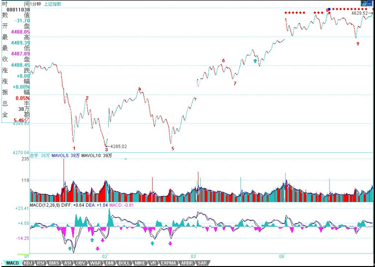

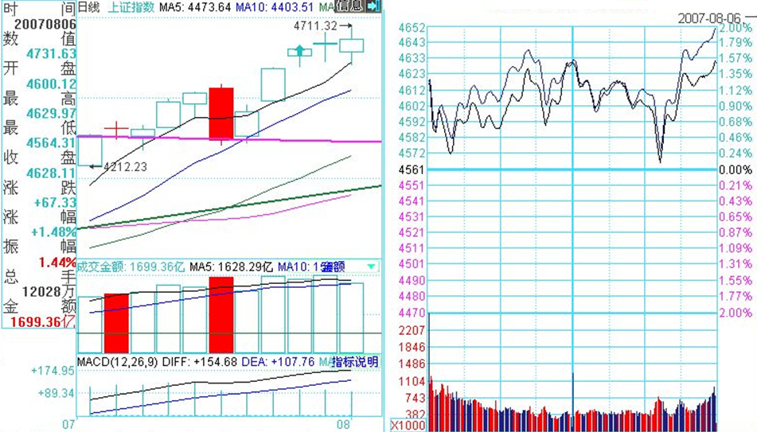

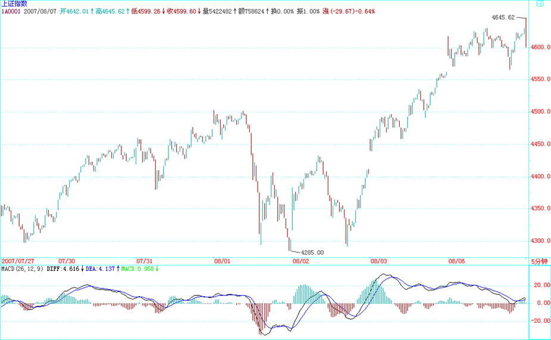

2007-08-06晚上解盘

2007-08-06 22:56:55

今天走的时候发现小丸子、大道等指出原来的分段有问题，因为本ID平时是用别的系统，写帖子才用同花顺，没注意这两个系统数据上的细微差别，就对着标上了。仔细检查同花顺系统里的数据，确实原来的分段有问题，所以马上改了，然后在车上还上来打了一个招呼。新浪的刷新似乎很慢，一般本ID发完帖子，出来也看不到自己发的帖子，要等上一阵，但在“我的所有文章”里能马上看到，只是在首页以及最新文章列表不显示，不知道各位是否也有这个问题。

刚才回来看到有人说别的软件和同花顺的数据不同，那不算的一笔在别的软件上是一笔。这个问题其实很正常，在课程里本ID已经说过，每个软件对数据的反应或处理可能都有点不同，所以，数据有差异是很正常的。这就像同样倍数的显微镜，即使同一厂家都不可能绝对一样。所以，看的时候，坚持用同一显微镜就可以。本ID看盘时用的软件和同花顺不同，以后也注意点，不能照抄过来。但这些细微的地方，并不大影响整体的判断。而且这个分段，比原来的更简单清晰，更美。

因此，各位必须注意，在一个具体的分析中，一定要坚持用同一套软件的同一个数据源，这样，数据的连续性是保持在同一规范下的。不同软件的数据不同导致的不同划分，不会实质影响大的级别划分，站在实际操作层面，至少要在1分钟级别上讨论操作问题，所以这样的测量误差，是在可接受范围内的。测量误差，是不影响理论的统一性与严谨性的。

那么，这样的分歧，究竟有多细微的程度，各位可以看下图。关键是绿箭头指着的两个K线，第一根范围是[4594.91，4597.57]，第二根范围是[4595.19，4597.44]，由于第一根是最高收的，而4597.57与4597.44相差极为细微，所以可能就是0.1秒的数据收集差异，就导致在同花顺中的包含关系，在别的软件中就是第二根的高点比第一根的高一点点，就不是包含关系了，第二根才是分型的顶，这样，笔自然就成立了。如果这里的笔成立，那么整个分段就有一定的变化了。不过，这并不实质影响整个走势的分析，由于各位也应该明白，为什么在实际的分类中，必须要从分型和笔开始，最后由线段构成最小级别的中枢，其中一个原因，就是这样，到了最小级别的中枢的层次，这种微小测量误差造成的差异就可以尽量地抹平了。而到了更大级别的中枢，这些就不再存在。当然，这不是分型、笔、线段的主要功用，但也是其中之一。

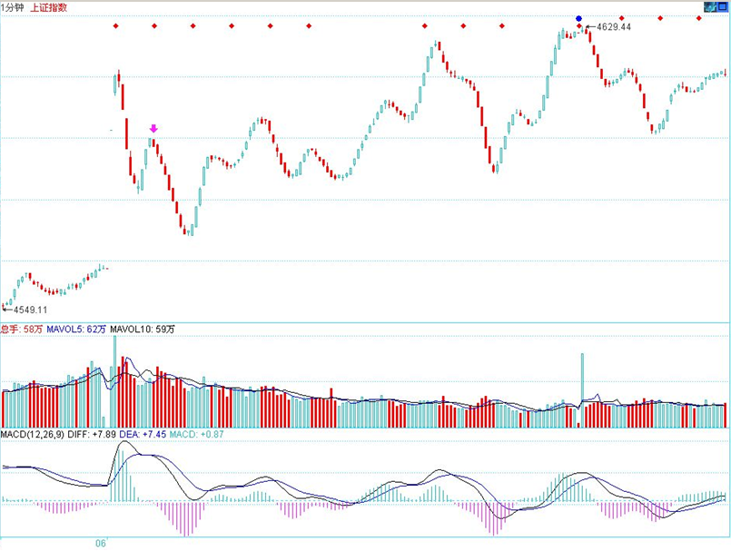

这件事情，可以给出一个结论：本ID的理论是可以进行最精确的研究的，而且这种研究是绝对科学客观的，只和分析的具体图有关，只要是同一个软件的同一张图，就有绝对唯一的答案，在这个答案面前，无论是谁都一样平等。并不因为本ID研究出了这理论，本ID就有任何权威，在理论面前，人人一律平等，本ID也有出错的时候，但本ID的理论是不会错的，结论是唯一客观的，这叫依法不依人。

对任何理论，必须有依法不依人的最基本前提，本ID的理论之所以客观准确，并不是因为本ID的原因，而是该理论是实际走势最可能客观的反映，无关任何人，不管他喜欢不喜欢本ID本人，但只要在市场中，就被本ID的理论所覆盖。就如同一个在欧得里德空间里的人，无论他对180如何厌恶，但任何一个他能测量的三角形，就永远用180去折磨他，无处可逃。本ID的理论也如此，只要你在市场中，无论你知道不知道，喜欢不喜欢，你都无处可逃。

有网友问图怎么才能看清楚，本ID的电脑水平基本在打字阶段，但这个问题还是能回答一下的。请对着图按右键，然后打开属性把地址复制下来在网上打开，就能看到清晰的大图。本ID说电脑，纯粹是胡闹，各位有更好的办法，请提供。

最后给小丸子、大道等人一人一朵大红花。

[2007-08-07]因迎奥运一周年而延迟的震荡只是延迟了

(2007-08-07 22:18:38)

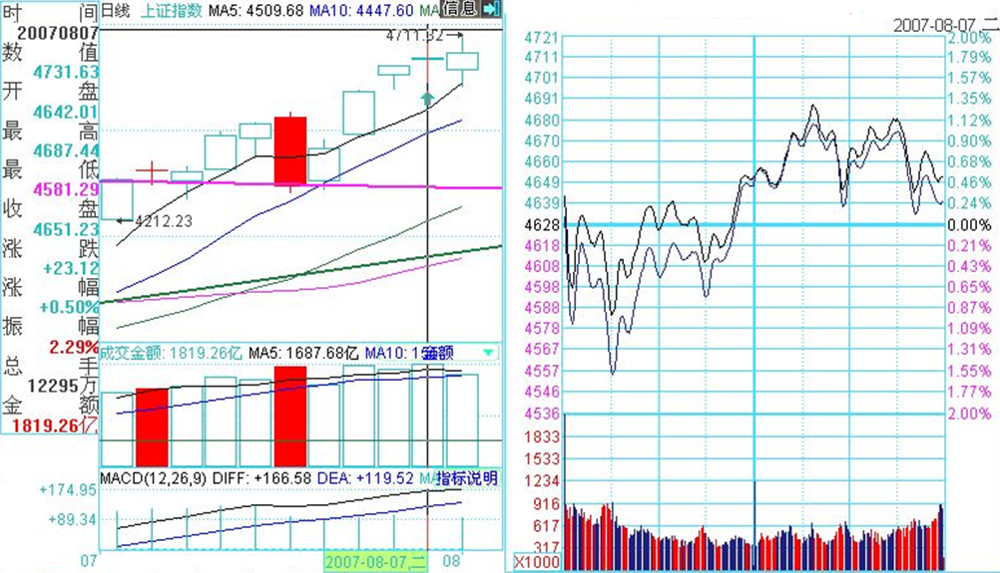

对不起，现在才发帖子，今天其他内容的帖子没法写，只能说说今天的大盘。

显然，8-11已经极为标准地形成1分钟中枢，11-13可以看成该中枢的一个延伸。而13-14，这个对中枢的离开后形成14-15的回抽，构成1分钟中枢的类第三类买点（严格来说，一个线段是不能构成买点的，只能是一个类买点，因为在这种理论前提下，1分钟中枢是最小级别，而最小级别的走势，必须至少包含一个1分钟中枢，因此说1分钟的第三类买点，只是类比地把线段当成了1分钟的次级别，但这只是类比说法，在严格的理论上，不能这样认为。）

由于收盘，使得16开始的17段走势是否完成，无从判断，因此，明天一大早的走势就是决定该线段结束的位置，如果在图中10之下（也就是4645点下），那么将成一个5分钟的中枢，（8-11）+（11-14）+（14-17）。

注意，一定要注意，一般来说，而由于第三类买点后并不必然导致上涨的延续，而是还有第二种选择，就是形成更大级别，也就是5分钟级别的中枢，而一般来说，在走势上，第一个中枢的第三类买点能形成上涨的概率比第二个中枢的要大多了，对于上涨中第二个中枢以后的第三类买点，其后形成上涨继续的概率越来越小，也就是说，这些第三类买点的参与价值越来越小。站在实质操作中，在第一个中枢已经买了，根本没必须等到第二个以后中枢的第三类买点才介入，那是脑子反应慢的表现。 

因此，无论明天开盘后那线段走成怎样，连超短线的介入价值都不高，典型的刀口舔血，明天开始，要关注的反而是因迎奥运一周年而延迟的震荡只是延迟了，但延迟不等于消除了，要发生的一定要发生，昨天留下的两点缺口，也构成技术的吸引力，因此，对于实际操作来说，如何应付好这震荡才是首要关注的事情。当然，不排除明天出于某种原因有护盘力量使得这震荡被减震了，但周四、五，依然有极大的可能补回来。技术上，4500点突破后，还没有一次有力度的震荡去确认突破的有效，一般来说，这种程序是少不了的，人为因素，最多用时间换空间，但能否实现，那还两说呢。

个股方面，本ID让各位来北京旅游，这几天已足够热情了，现在，短线也没有任何参与价值了，该股，是本ID的中线股票，来回折腾到2008，是必然的，但并不意味着就永远不回杀了。 至于那等比，本ID一早就断言，等真启动的时候，肯定都是所有人拿不住的时候。算了，这些小盘股，不会让太多人获利，就那么点筹码，还不够塞牙缝的，千万别追高了，这种小盘股，追的人一多，马上又是一个灾难。 大资金有什么优势？大资金的优势就是可以在一股票上耗上一年半载还能把成本给搞没了，而小资金，没必要把时间浪费其中，有些钱不是和任何人都有缘的。

本ID从3600点开始买股票，只和国资委保持一致，只买中字头，这可在当时暗示过了。最近中船、中铝之类发疯，可别以为是真疯了，当然，这类股票最近都涨多了，就别买了，欣赏吧，顺便去想想国资委为什么前段时间出那减持的规定吧。

对中字头的，本ID只说了一个，原因是那价位低，对于散户合适点。现在走得怎么样，各位也看到了。不温不火，就已经从7元多快到12元了，这就像去年12底，本ID在6元让各位买那只药一样，都是送一个大包子给有各位，让各位挣点学课程的学费。那药，可是本ID准备搞20年的股票，为什么？华润把万科搞到中国老大，为什么不能把药搞到世界老大？现在20元，还S股，本ID6、7元大力抢入的成本早就0了N个月了，不搞他20年怎么对得起自己？现在，本ID对这股票的要求很低，保持0成本，一年增加1到2倍的筹码，别人挣钱，本ID挣筹码。至于那只比三一成本低多的股票，也从7元跑到10元了，这股票基本面有不确定的地方，高了就别追了，对这股票，本ID的信心可不大，只是如打家劫舍的，劫他一票而已。

二、三线股会逐步苏醒，但成分股的疯狂会直到泡沫破裂结束第一阶段的行情。 

不说了，累了，上面的后面关于个股的都是梦话，休息。先下，再见。

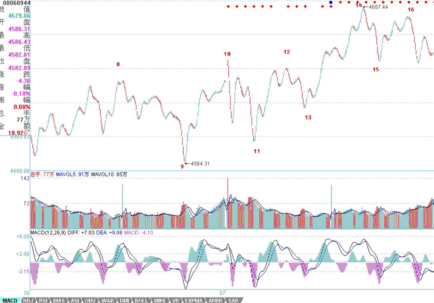

[2007-08-08]当工行都发疯后，轿夫们还有什么把戏？

(2007-08-08 15:44:40)

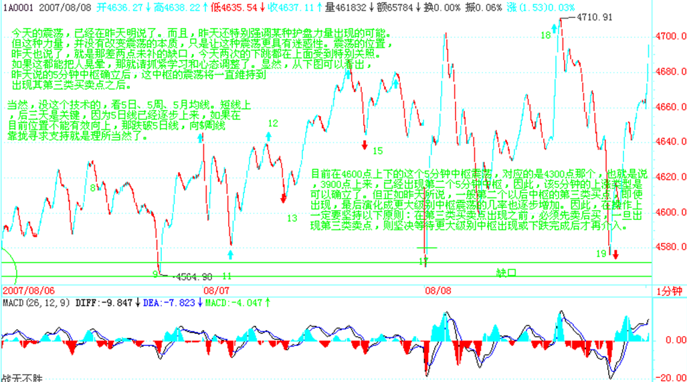

今天的震荡，已经在昨天明说了。而且，昨天还特别强调某种护盘力量出现的可能。但这种力量，并没有改变震荡的本质，只是让这种震荡更具有迷惑性。

震荡的位置，昨天也说了，就是那差两点未补的缺口，今天两次的下跳都在上面受到特别关照。如果这都能把人晃晕，那就请抓紧学习和心态调整了。显然，从下图可以看出，昨天说的5分钟中枢确立后，这中枢的震荡将一直维持到出现其第三类买卖点之后，具体的分析太幼儿园，就不说了。

目前在4600点上下的这个5分钟中枢震荡，对应的是4300点那个，也就是说，3900点上来，已经出现第二个5分钟中枢，因此，该5分钟的上涨类型是可以确立了。但正如昨天所说，一般第二个以后中枢的第三类买点，即使出现，最后演化成更大级别中枢震荡的几率也逐步增加。因此，在操作上一定要坚持以下原则：在第三类买卖点出现之前，必须先卖后买，一旦出现第三类卖点，则坚决等待更大级别中枢出现或下跌完成后才再介入。

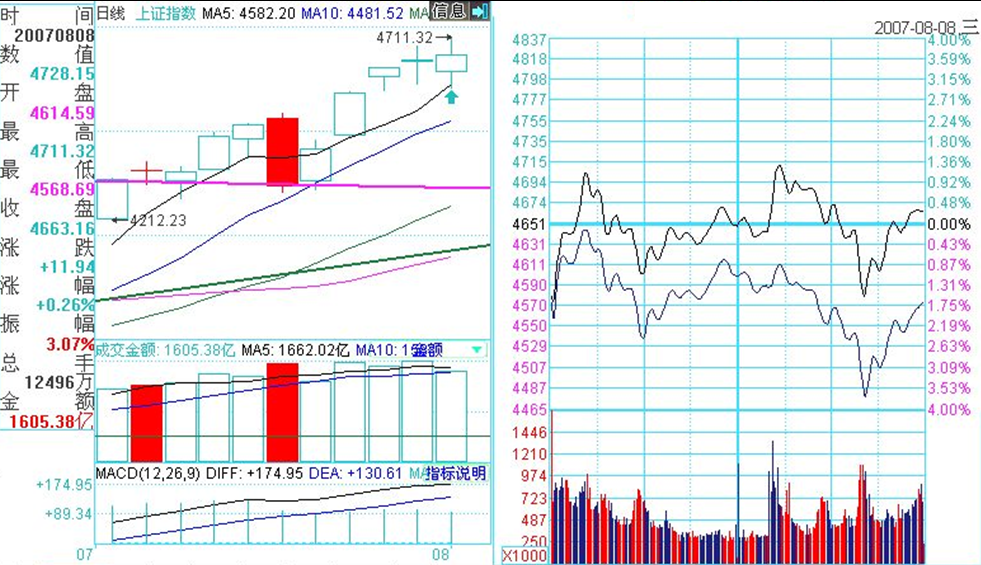

当然，没这个技术的，看5日、5周、5月均线。短线上，后三天是关键，因为5日线已经逐步上来，如果在目前位置不能有效向上，那跌破5日线，向5周线靠拢寻求支持就是理所当然了。

现在，对于第四拨人来说，一个现实的问题就是，当工行都发疯以后，还有什么可折腾的？一个最简单的，就是继续把汽车、交通、能源等最近没特折腾的也折腾一遍，然后再继续原来折腾的轮动再搞一波，把第五批也给诱骗进来。那时候，比本ID前面说的大笨象要跳小步舞还要厉害的是大笨象都变小笨鸟，飞得满天都是了。

当然，这只是第四拨人的如意算盘，能否打响，就走着瞧了。我们只需要坚持前面的买卖原则，边把成本降下来，边耐心看轿夫的表演。至于没这技术的，就看着均线把股票拿住。

下午、晚上都有活动，先下，再见。

[2007-08-09]顶住明天，第四拨人才可能解脱。

(2007-08-09 16:04:24)

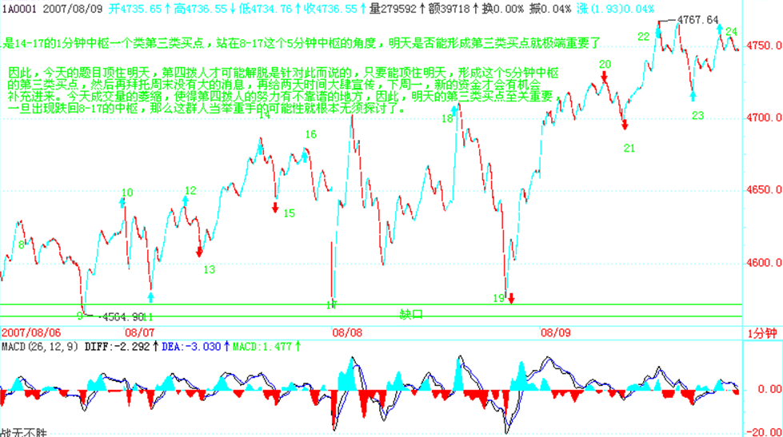

昨天说，工行发疯后，第四拨人只能继续轮动板块把第五拨人蒙骗进来。今天，板块轮动再次展开，当然，本ID已经给这论行情定了一个性，就是成分股的泡沫化行情，最终，大笨象要跳小步舞，甚至都要变小笨鸟飞得满天都是，行情的发展继续按这个性质不断展开。至于哪天才会泡沫爆破，无须预测，市场自然给出。

走势上，下图中20-21是14-17的1分钟中枢一个类第三类买点，站在8-17这个5分钟中枢的角度，明天是否能形成第三类买点就极端重要了。（注意，图形一收放，图中数字会走，本ID今天才发现这问题，昨天图中的17位置移动了，今天这个位置才是对的，其实，这个根据定义就很容易发现，17后向上的中间有一个X，就是因为这不构成一笔，因此，18必须到目前的位置才满足至少三笔的要求。）

因此，今天的题目是针对此而说的，只要能顶住明天，形成这个5分钟中枢的第三类买点，然后再拜托周末没有大的消息，再给两天时间大肆宣传，下周一，新的资金才会有机会补充进来。今天成交量的萎缩，使得第四拨人的努力有不靠谱的地方，因此，明天的第三类买点至关重要，一旦出现跌回8-17的中枢，那么这群人当举重手的可能性就根本无须探讨了。

看不明白上面的，本ID已经给出最简单的方法，就是短线看5日线，但这就可以让你安心持股了。技术高的获取更高的利润，这是天经地义的。复杂的不会，那就玩简单的，千万别吃夹生饭。会就会，不会就学到会，没学会之前，就先用简单的方法操作。对于已经学会的各位，也应该养成好习惯，就是边看盘，边把段给分了，这样操作起来，就一目了然了。这包括大盘和自己操作的个股。

注意，本ID说了只坐轿子，但没有任何地方，本ID曾经说要看空。本ID之所以能在市场中生存十几年而不断壮大，唯一秘诀就是底部之后只坐轿子。本ID的方法很简单，就是留了机动的资金后，把仓位打到最大，然后不断在出现中枢震荡时，保持仓位把差价搞出来。一般情况下，到一段行情顶部的时候，本ID原来的仓位都要下降到70%-75%，注意，筹码不丢失，只是钱多出来，所以仓位自然下来了。这样，无论发生什么，本ID都是大赢了。

在市场中，关键是能长期保持赢利，本ID从来没见过喜欢当轿夫的最终能活下来的。谁爱当轿夫就当去，本ID依然如故。而且本ID还要特不厚道，还要经常批评轿夫的姿势不美、动作恶心。例如，本ID今天就要批评，轿夫们，本ID其他中字头的都不错，就是中石化、中国银行有点蔫，连新高都没创。哪位轿夫有力气的，也来一把吧。另外、抬中铝的，动作优美点，今天走得特恶心，搞了一个双针出来；潍柴动力的轿夫，手脚麻利点，反正都要上100的，就别摆太多姿势了；中国国航，也比较丑陋，连南航都比不上，你们李总怎么见部队的朋友？

股票，要有放松的心态，轿子都不会坐，那就当抬轿的，或者当饺子给人吃了吧。

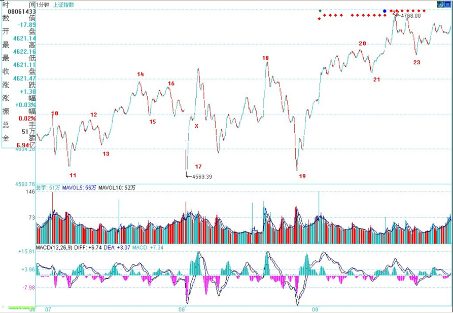

## 教你炒股票69：月线分段与上海大走势分析、预判

(2007-08-09 23:03:22)

分型、笔、线段，在1分钟图上可以分辨，在月线图上的道理是一样的。但用月线图分辨，等于用一个精度超低的显微镜，只能看一个大概，但这个大概，却是最实质性的，是一个大方向。

下面，就是上海指数的月线图。绿箭头指着的是顶分型，红箭头的是底分型。打“X”的就是该分型不符合笔所要求分型的规范。这里，只要是两条：一、顶和底之间没有至少一K线；二、不满足顶必须接着底、或底必须接着顶。 

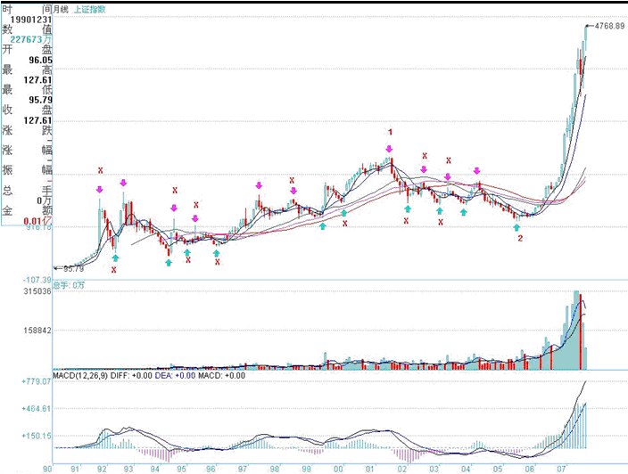

例如，第一个红箭头和第二个绿箭头之间显然不能构成一笔，也就是说，这两个，只能取一个：如果取第一个红箭头，那么第二个绿箭头就不是笔中分型，那么第二个红箭头，显然是一个底分型，因此，就形成两个底分型连续的划分，显然，这时候，第一个就不算了，这和前面说取第一个红箭头对着的底分型矛盾。所以，这里，只能取第二个绿箭头，这时候，第一个绿箭头对应的顶分型，自然就不算笔中的顶了。

后面的各分型，带“X”的，都可以按照上面两个原则去分析。

有人可能要问，这样分型的确定，在当下如何完成？这必须当下去完成。例如，当走势走到第一个红箭头时，显然，第一绿箭头的顶分型也可以暂时看成是确定的顶分型。但当第二绿箭头走出来后，这个问题就有了可修改的地方。

有人可能要疑问，这样分型是否随时可以修改？答案是否定的。一旦完成的图形，这修改就不可能了。分型可修改，证明图形没完成。例如，当第二个红尖头分型出现后，前面三个的分型的取舍就是唯一的。这个分型的可修改性，反而是一个对走势判断极为有利的性质，例如，第二个绿箭头走出来后，这图形未完成的性质就是百分百确定了，但所有图形必然完成，走势必完美。如何才能完美，这样，在理论的框架下，只有极少的可能，而这些可能，就成为综合判断的关键条件。然后根据各级别图形的未完成性质，就可以使得走势的边界条件极端的明确与狭小，这对具体操作，就是极为有利的。注意，这可和概率无关，是百分百的纯理论保证，最终所依据的，就是在本ID理论最早反复强调的走势必完美原则。

其实，本ID的理论的关键不是什么中枢、走势类型，而是走势必完美，这才是本ID理论的核心。但要真正理解这个关键，可不是看字面意思就能明白的。

显然，目前月线上的第1、2段已经走出来，其中，按照线段里笔的类背驰，1的结束那顶与2结束那底都是极为容易判断的。上海指数的历史大顶与底，根据这线段的划分，都不是什么难搞的秘密。那么，对现在依然进行中的第3段走势，有什么可百分百确定的呢？

显然，这一段要成为段，那至少要三笔，而现在连一笔都没走完，因此，这轮行情的幅度，可想而知。也就是说，即使该笔走完，一个笔的调整后，至少还有一个向上的笔。

二、2245到998点是线段的类中枢，也就是说，只要调整那笔不跌破2245点，那么，将构成一个线段的类第三类买点，这也支持至少要走一笔。

（注：不破2245为不碰线段的类中枢强势3买，理论3买位置为不碰1783，当时在2007年8月4300点，禅师按照常理推断月线一笔一般不会破2245，所以这样叙述。结果一笔破1783到1664。）

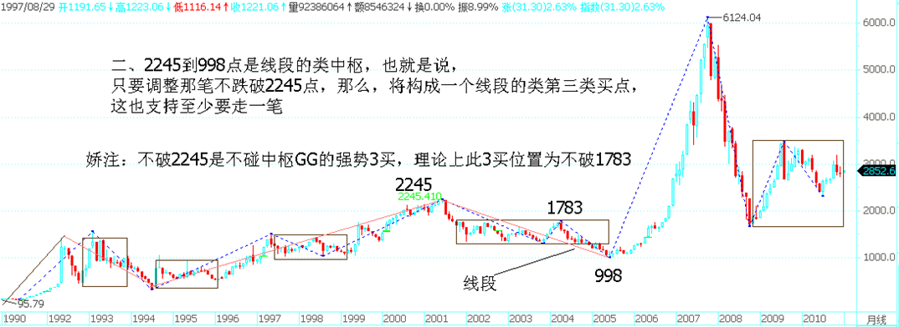

三、笔的完成，必须要构成一个顶分型。而一个月线的顶分型将如何构成？这意味着什么，这个问题就当成是一个作业，各位去思考一下，然后给出这个结论对应的操作策略。从中也可以亲自实践一下，去明白一下理论指导下操作的力量。

最后，再提一个思考题：为什么本ID在7月份要大搞满江红，而8月以后就放手坐轿子，请利用分型的原理给本ID的行为一个技术上的解释。（注：技术解释为使得月线顶分不成立，上升笔延续）

缠中说禅：2007-08-09 16:30:15

标注17-18之间 1122-1312这个为什么不算一段？ 是3笔重合， 而且破坏了上一笔。

还有，18要是没创新高的话怎么分段？

==

这当然不能算，这种情况要看该段特征序列的底分型，而这里没有，不构成。最后新高与否问题并不大，当然，如果不新高，这段有可能成为一个三角形，这在后面段的形态中会说到。

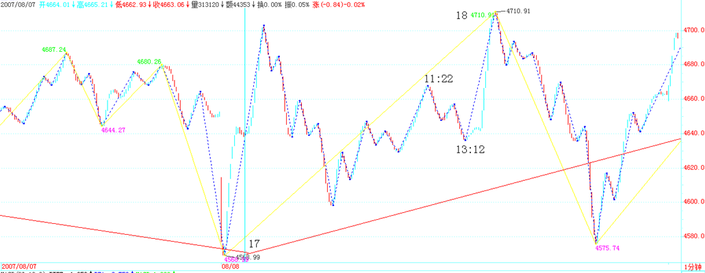

热点在震荡中蔓延

(2007-08-10 15:56:27)

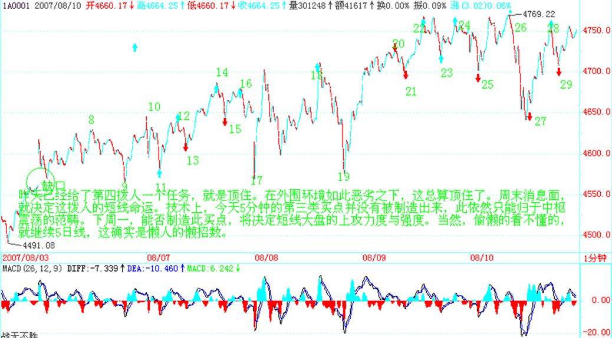

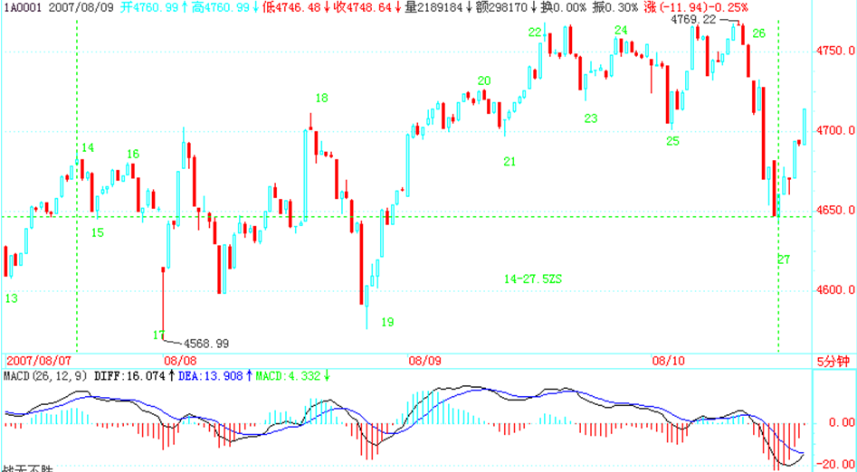

昨天已经给了第四拨人一个任务，就是顶住。可以这样说，在外围环境如此恶劣之下，这总算顶住了。当然，站在本ID不厚道的角度，会说他们姿势不够优美。周末消息面，就决定这拨人的短线命运。

技术上，今天5分钟的第三类买点并没有被制造出来，因此依然只能归于中枢震荡的范畴。下周一，能否制造此买点，将决定短线大盘的上攻力度与强度。当然，偷懒的、看不懂的，就继续5日线，这确实是懒人的懒招数。

个股方面，昨天在回答问题时说了，现在是从大盘50到300的热点蔓延，如果这蔓延能成功，那么大盘的热度还会增加，今天，这迹象已经开始。更重要的是，今天ST大面积启动，也表明短线的投机资金开始蠢动起来，因此，下周的热点蔓延能否成功，是决定行情延续时间的关键。

个股方面，中字头继续是本ID的主力。对那些不启动的中字头，轿夫都应该像777学习。本ID昨天那一通骂还是有点作用的，看看今天的中铝、中国国航，但国航确实恶心，跟着南航后面跑，那李总的军人作风成气了。算了，大周末的，就不想骂人了。其他股票，等大盘炒热后，会逐步补涨。

一到周末，本ID就对股票反胃。各位腐败去吧。

[2007-08-13]公募基金经理“快男”发展模式的不可持续

(2007-08-13 08:29:07)

对于粉丝无数、发行井喷的公募基金，探讨其发展模式的不可持续，似乎有点杞人忧天。但公募基金经理的跳槽比例在今年达到惊人的40%，已明白无误地表明，如今这种基金经理“快男”发展模式的不可持续。

表面上，公募基金经理跳槽是由于个人待遇以及业绩压力等原因。众所周知，公募基金只收取管理费，相对于私募基金的收益提成模式，其分配上的激励机制明显不如后者。但只收管理费模式意味着旱涝保收，收益提成模式在牛市中可能兴旺一时，而在熊市中，则会引发无数法律、经济纠纷，终不是长久之计。

当然，有人可能反驳说，收益提成模式能使得基金管理者的优劣得到更直接地反映，使得优秀的基金管理者能得到更大的发展，因此，公募基金也可以尝试采取相应的模式。但是，在只收管理费模式中的管理资金大小与收益提成模式中的分成收益大小具有同等的赏优汰劣意义，而公募基金占有制度上的先天优势，由于能够合法面向公众募集，其资金规模具有私募基金所不可比拟的优势，至少在目前的经济、法律、社会结构下，只收管理费模式是获取这种募集优势所必须付出的代价，不仅公募基金不可能采取收益提成模式，而且阳光化的私募基金也只能采取只收管理费模式。

募集范围的大小通常正相关于分配比例的大小，例如，私人股权基金，其募集范围在主要针对二级市场的公募与私募基金之间，一般就采取收取管理费与比例较低提成的综合分配模式。如果收取了管理费，那么像私募基金那样根据收益大小最高分成可达到50%的分配模式是不切实际的。公募基金只收管理费模式的不可改变，决定了其内部的分配机理机制也不可能有大的实质改变，因此，企图通过公募基金分配方式私募化而使其可持续发展是不切实际的。

由于个体利益的巨大诱惑，明星式人才必然趋向于高比例分配激励的私募基金，这对公募基金来说，基金经理“快男”模式将形成一个恶性循环，在私人利益驱动下，更多人会把公募基金当成积累个人资源的平台。一旦从这平台得到个人所期望得到的资源，离开就成了他们必然的选择。现在开始采取的双基金经理制，其实更坏，等于把这跳板上的人又增加了一倍，而这些人，站在长远的角度，对于公募基金来说都是狮子虫。

要解开这个恶性循环，就不能培养“快男”式基金经理，而是要依靠集体、团队的力量。要明星化的不是个人，而是团队。要形成这样一个良性循环，就是让优秀的人才能以在明星团队为荣。这有点类似“智库”的品牌建立，一个“智库”是否优秀，从来都不是因为里面有多少“快男”，而是该“智库”的传统、风格、团队的综合研究力。一个更通俗的例子就是，无论北大、清华曾出过多少“快男”，但北大、清华的名声却依然凌驾于一切“快男”之上。

因此，对于公募基金来说，应该淡化基金经理的个人色彩，突出团体的风格，逐步形成自己的特色与传统。一个好的基金，一个能可持续发展的基金，就应该走金融“智库”的品牌之路。另外，在个人经济利益上，对基金管理公司进行适当的股权创新，加大核心团队的持股比例，这也是必要的。

最后，附带说说8月大盘的走势。7月大盘站住了5月均线并突破了4159点的1/2线，目前该线已经上移到4174点，而5月均线也上移到4170点附近，并且7月长阳的一半位置在4136点，因此，4150点附近成了大盘中线能否保持强势的最重要位置。只要能有效站稳该位置，那么大盘的整体走势就能保持向上拓展空间的能力，否则将引发大盘周线指标的走坏，至少要重新陷入新的大震荡中。

但即使大盘能保持强势，本月也一定要注意大盘过分冲高所隐含的月K线上影杀伤力。8月是宏观政策理清思路的关键时间，这方面的变动将对大盘走势起着决定作用。此外，外围股市的走势也会对大盘走势产生影响。全球化社会里，没有哪个股市是可以与世隔绝的。个股方面，一、二线成分股的行情依然会延续，但要注意升幅过大后的短线震荡风险，而当业绩风险释放后，二、三线题材股会找到重新活跃的动力。

[2007-08-13]热点，如期蔓延中

(2007-08-13 15:38:41)

上周末说了，热点会逐步蔓延，从50-300-二、三线，今天，300中已经骚动不断，而二、三线，也已经有不少按捺不住蠢蠢欲动了。今天唯一不完美的，就是第三类买点还没有走出来，所以，明天的走势依然有变数。最简单的，还是看5日线。

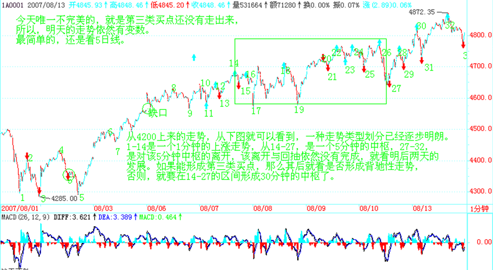

从4200上来的走势，从下图就可以看到，一种走势类型划分已经逐步明朗。1-14是一个1分钟的上涨走势，从14-27，是一个5分钟的中枢，27-32，是对该5分钟中枢的离开，该离开与回抽依然没有完成，就看明后两天的发展。如果能形成第三类买点，那么其后就看是否形成背驰性走势，否则，就要在14-27的区间形成30分钟的中枢了。

个股方面，没什么可说的，还是中字头。N天前，本ID骂中行和中石化连新高都不去太过分，今天，也都基本新高了，这可以看出，中字头就是有力量。当然，所谓的中字头，就是大型国企，只是本ID比较懒，就买其中带中字开头的，这样好记。当然不会有人觉得，如果没有中字头的就不会涨了。原来的那十几只老股里，依然是中字头的000777表现最好，后面，一旦热点蔓延成立，其他都会逐步动起来的。本ID买股票从来都不是乱买的，8元让各位买000777时，各位当然不可能知道该股基本面将会怎样，但本ID就知道，这就是对基本面的把控能力，光技术面，只是一方面。例如，600649，大概到现在，没人知道这股票里卖的什么药，但如果你去研究一下该股是现在管理层的资本运用的辉煌历史，还有上海市对国企重组的计划，那么，当然就明白，本ID当时让各位在6元买入，不是瞎说的。好的剧本，当然是慢慢展开的，本ID经常是在序幕时就告诉各位，所以，如果没耐心的，千万别买本ID说的股票。否则，请问，有谁能把000777从8元拿到现在？大概，除了本ID，来这里的人是不会有了。

（这里原有私人资料已删除，有缘得之，无缘亦不失，梦中游戏，能窥操作之一斑，不枉本ID之冒险一贴。）

下面是分段图，各位研究去吧，有一个谈判在4点，先下，再见。

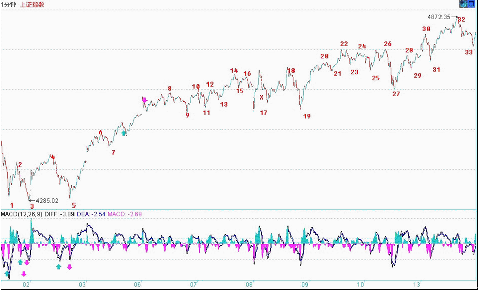

[2007-08-13]41与1，本ID对二级市场兴趣已失

(2007-08-13 21:26:14)

周五，本ID是一边叨唠，一边让人报盘买股票。一个41元的股票，本ID最高买到近43元，心里越买越窝火。看看，里面的人，1元的成本，那种PE游戏，本ID也干着，凭什么让本ID贵了40来倍来买？

今天下午，一个关于PE的谈判，本ID已经决定全面转战PE，当然，撤退是战略性的，本ID决定的原则是：第一，本ID将不会再买入任何二级市场的股票；第二，任何成本不为0的股票，本ID都将把成本逐步抛到0为止；对成本为0的股票，本ID将持有到大牛市结束，有空可以继续玩先砸后买增加筹码的游戏。

本ID已经有了基本的判断，就是谁执PE牛耳，谁得中国资本市场的天下，PE中，除了Pre-IPO等，类似收购基金之类的，在中国依然没有大发展，当然，Pre-IPO这类活动当然不能放弃，但收购基金之类活动，也是可以逐步展开的。在中国，目前类似活动搞得比较好的，是一个生了5个孩子的海龟中男。

当然，完全放弃二级市场是不行的，所以必须留下已经有的根据地。但如果现在不到PE上大发展一把，那么就整天为人做嫁衣裳了。前期，本ID那一顿忙，已经为此铺好了路。

当然，在二级市场中，也有类PE的机会出现，也就是当大的波动让某些大的重组股票达到足够吸引的地步，这也是好的介入机会，在全流通时代，如何用收购基金的模式在二级市场搞上一票，这也是一个有趣的活动。但目前讨论这个问题有点无聊，现在，二级市场之外黄金满地，本ID脑子又没进水，没那闲工夫搞这二级市场了。

以上都是心里话，也是本ID的决定。当然，PE的活，意味着整天要腐败，这是本ID最不喜欢的，当然，有些活可以让别人干，本ID只要有时间，依然会保持每天的解盘。毕竟，对于散户，二级市场是唯一可大面积介入的地方，而且，原始积累也只能靠这地方，山高水长，如果本ID能帮各位一把，也算结一段善缘。

本ID会尽力为之，各位有缘得之吧。

附录：各位请不要胡乱猜疑，本ID关于二级市场20年以上大牛市的判断从来没改变过。本ID春节后说在突破GDP之前，成分股为主的第一段行情一定不会结束，当时，有谁能如此明确的说？又有谁能把20年的大牛市给明确分了段？本ID的这观点从来没改变过。

没有大牛市，PE也白搭，只是现在的二级市场，比起PE，利润太薄，那种能3年翻几十倍的股票越来越难找，但在PE里，一点都不难。

资本都是往利润高的地方跑，本ID也不例外。本ID对大盘没有任何暗示，短线大盘的走势，看分段图甚至5日线就能判断，谁都没必要预测。累了，10点了，先下，再见。

缠中说禅 2007-08-13 21:56:16

老师好。大家现在对今天的32-33为什么不是三段有争论。毕竟符合其中的底分型成立的定义。希望老师能讲讲。

==

请先搞清楚底分型是从哪里开始算起，哪里开始结束。在这种前面是下跌的，对应的第二是上涨的，其特征序列就是看向下的，这第三个向下的，已经跌破原来第一段的底，怎么能属于第二段里的特征序列？

特征序列的底或顶，首先必须要都属于这个特征序列才行，这是前提条件。其实，如果第二特征序列没有三个元素，就根本不存在出现分段中第二种情况的可能

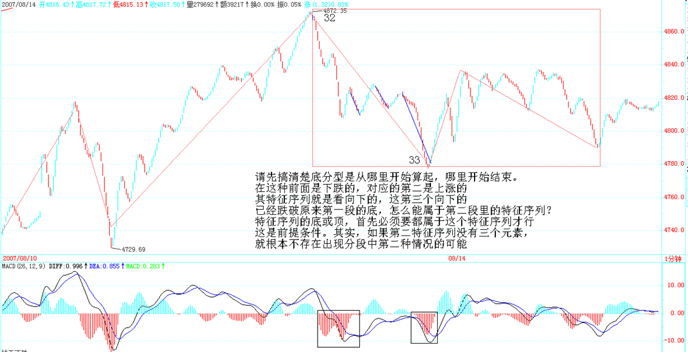

[2007-08-14]热点蔓延，阳光下没有新鲜事。

(2007-08-14 15:49:37)

当然，没有阳光下也同样没有新鲜事。今天的走势，唯一的特点，就是没有新鲜事。从上周起，本ID不断强调热点开始蔓延，今天，这热点已经开始燎原。

50-300-二、三线，本ID已经给股票的热点蔓延画出了线路图，现在，不过是按着线路图的一种演绎，正所谓阳光下没有新鲜事。

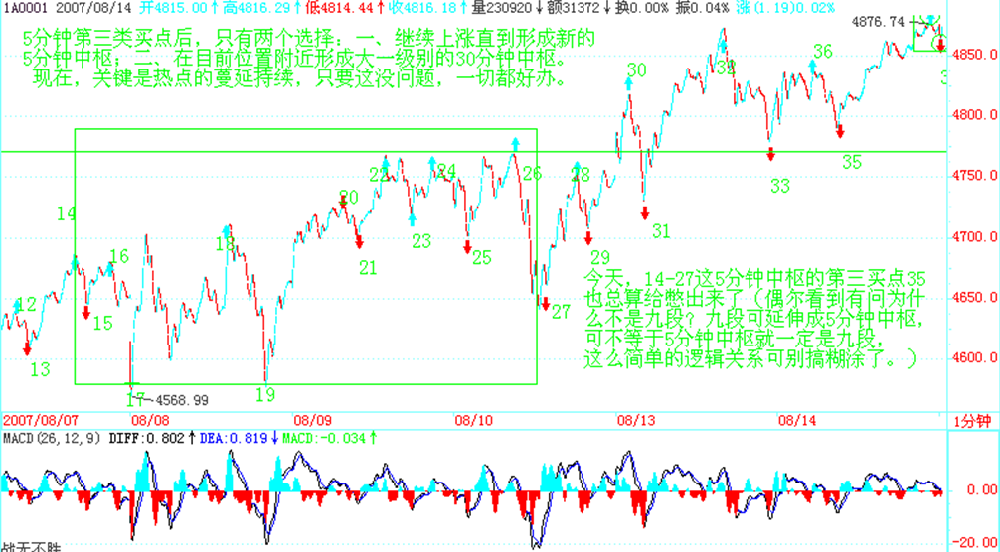

今天，14-27这5分钟中枢的第三买点35也总算给憋出来了（偶尔看到有问为什么不是九段？九段可延伸成5分钟中枢，可不等于5分钟中枢就一定是九段，这么简单的逻辑关系可别搞糊涂了。） 

5分钟第三类买点后，只有两个选择：一、继续上涨直到形成新的5分钟中枢；二、在目前位置附近形成大一级别的30分钟中枢。

现在，关键是热点的蔓延持续，只要这没问题，一切都好办。

站在日线角度，提两个思考题：

1、目前日线的背驰段解除没有？提示，关键是哪段和哪段比，连相比的对象都没分清楚，还谈什么背驰段？更不用说什么精确定位了。

2、4174点的1/2突破后，下一条真正的压力线在哪里？

注意，本ID战略转移，并不会影响博客的一切活动，只是有时候晚上的文章，可能会因为应酬改到早上发，如此而已。而且，本ID现在是战略转移，0成本的股票是不会抛的，没到0成本的，本ID也不会胡乱抛的，没到卖点，凭什么抛？今天，能在49下买到002149的，可要感谢本ID，某人脑子进水，竟然企图让本ID在50下出来，一开盘就企图打压，脑子有水吧？这股票，本ID会抛至少一半的，但想让本ID今早49以下就抛，简直病得不轻。

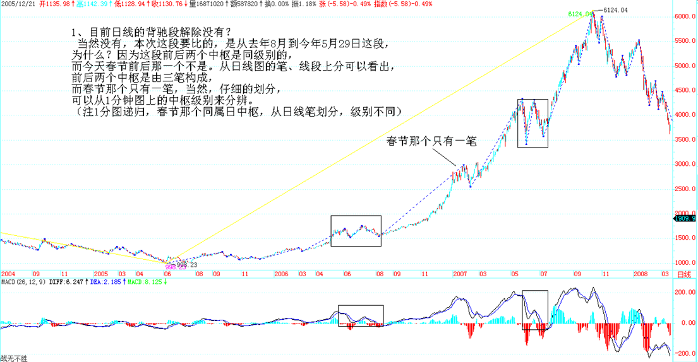

(2007-08-14 22:42:24)

给下午那两个问题的答案：

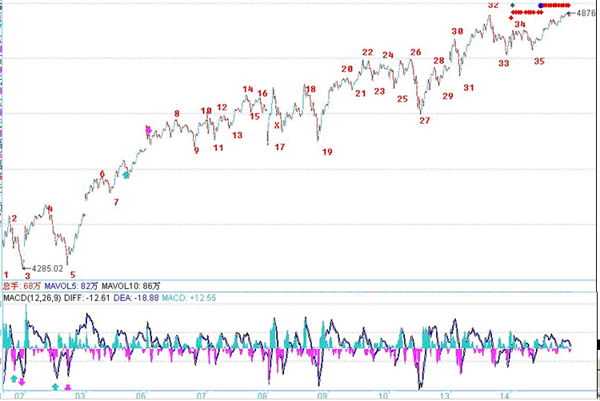

1、目前日线的背驰段解除没有？

当然没有，本次这段要比的，是从去年8月到今年5月29日这段，为什么？因为这段前后两个中枢是同级别的，而今天春节前后那一个不是。从日线图的笔、线段上分可以看出，前后两个中枢是由三笔构成，而春节那个只有一笔，当然，仔细的划分，可以从1分钟图上的中枢级别来分辨。

2、4174点的1/2突破后，下一条真正的压力线在哪里？

是2/3线，目前在哪里，各位自己算算。

还有一个问题请思考，日线图上的笔、线段，和一分钟图上的日中枢有什么关系？

[2007-08-15]外围因素引发今日震荡

(2007-08-15 15:49:33)

先解答一个和打坐有关的疑问，本ID说念想把横隔膜以下气息在横隔膜以上送出，这气肯定不是真正呼吸之气。人体结构里，横隔膜以下哪里有什么呼吸之气？那只是一念，以此一念带动那非气之气之真气。

好，说股票。最近，外围市场鬼哭狼嚎的，弄得全世界的鳄鱼都痛哭流涕。中国市场震荡一下，也很应该。技术上，昨天已经很明确说了，现在，或者继续上涨直到出现新的5分钟中枢，或者就在这里形成一个30分钟中枢，除此之外，别无选择。

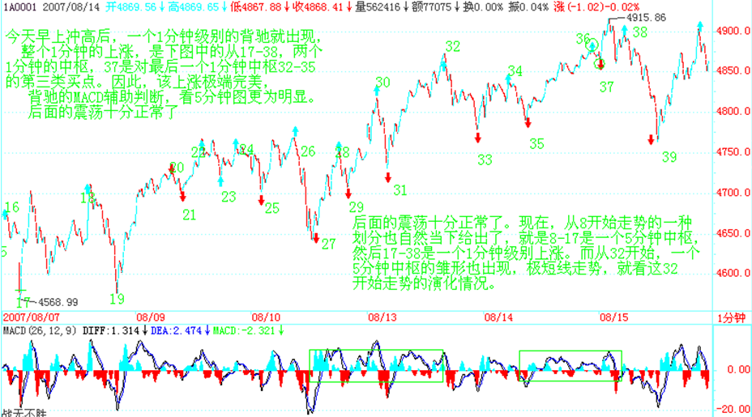

今天早上冲高后，一个1分钟级别的背驰就出现，整个1分钟的上涨，是下图中的从17-38，两个1分钟的中枢，37是对最后一个1分钟中枢32-35的第三类买点。因此，该上涨极端完美，背驰的MACD辅助判断，看5分钟图更为明显。（各位请自己去看，这里的贴图只有200的额度，本ID不能浪费太多空间。在5分钟图中，看对应1分钟图中的走势去比较力度。）这是一个标准的走势，十分教科书。

后面的震荡十分正常了。现在，从8开始走势的一种划分也自然当下给出了，就是8-17是一个5分钟中枢，然后17-38是一个1分钟级别上涨。而从32开始，一个5分钟中枢的雏形也出现，极短线走势，就看这32开始走势的演化情况。

个股方面，请问002149让各位爽了没有？当然，后面的走势和本ID没关系，本ID只在上周五最高买到43元，然后把其中41附近一部分清单在这里放了几个小时。这股票，为什么还有这么多人抢入，最主要是基本面与成长性。本ID在N个月前，强调过中小版成长股的中长线介价值。后来，本ID也告诉过介入了002121，注意，这股票和002149都和600635有关系，那纯属意外。对中小版，一定要看其成长性，而且要有耐心。

注意，任何股票，都不值得追高，包括如002149这样的。

不过，这都是老皇历了，本ID现在不会再买任何二级市场的股票，只会等待机会把成本不为0的的出掉变为0，然后都去干PE去。至于其他股票，本ID说过的任何股票，本ID都持有着，当然，很多都是0成本的，但本ID都会持有到牛市结束。

这前面说过。本ID再强调一次，本ID对大牛市的信心没变，但目前进入成分股泡沫行情的判断也没变。成分股行情结束后，还至少有两轮行情，分别是成长股与重组股带头，这些游戏，至少玩20年，早着呢。

本ID就多累点，PE多点如002149的，让各位在40元买了也不后悔的好股票。

二级市场，咱相信群众。今天有事要去谈，先下，再见。

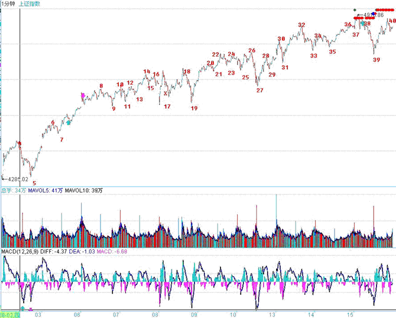

## 教你炒股票70：一个教科书式走势的示范分析

(2007-08-15 22:41:35)

首先，今天下午太匆忙，37后就直接标记39，晚上回来才发现，已经改过来。

在前面的课程里，本ID反复说过，结合律是至关重要的。这里的人，认真学过抽象代数的人少，所以不大明白运算规则的选择对研究对象的决定性意义。对于走势来说，结合律就是连接走势之间关系最重要的规则，不深切明白这一点，如何能明白走势本身？

无论如何结合，本ID的理论对走势的分析原则是不变的。可以这样认为，本ID的理论，就是走势保持结合律下具有变换不变性的一套理论，而且可以严格地证明，是唯一能保持分解变换不变且保持结合律的一套理论。如果有点现代数学常识，对这理论的意义应该能多点了解。

这几天，随着走势的当下发展，本ID不断变换着所看的中枢，这根本的原因就在于结合律，因为结合律，我们可以对走势进行最有利观察的分解，这样，才能更容易明白走势究竟在干什么？

例如，到今天，走势一种最明显的划分已经自动走出来，就是8-17构成5分钟中枢，该中枢是4300点那个5分钟中枢上来后的一个新的5分钟中枢，这个中枢，在刚形成时，我们已经指出，而且任何学过本ID理论的，都可以当下指出。一般来说，形成这个5分钟中枢后，在理论上只有三种走势：

1，向上出现第三类买点，走出1分钟向上走势类型，然后构成新的5分钟中枢；

2，向下出现第三类卖点，走出1分钟线向下走势类型，构成新的5分钟中枢。

3，中枢延伸，或出现第三类买卖点后扩展成大级别的30分钟中枢。

显然，在行情发展中，没必要去预测走势选择什么，走势自然选择，只需要观察着就可以。现在，走势自然选择了第一种，为什么？因为17-38构成完美的1分钟上涨走势，目前，围绕这1分钟上涨走势的最后一个1分钟中枢32-35，正扩展出新的5分钟中枢的雏形。

这个5分钟中枢，最终至少要完成的，至于是否继续扩展出大的30分钟中枢，还是出现新5分钟中枢的第三类买点继续上涨，再形成新的5分钟中枢，这无须预测，与8-17那5分钟中枢一样对待，如此而已。

那么，如果是按30分钟操作的，这些5分钟的中枢移动、震荡之类的活动根本无须理睬，只要看明白就是，根本无须操作；如果是按5分钟级别操作，那么就是不参与大于5分钟级别的震荡，那么就等5分钟上涨出现背驰后走人；如果是按1分钟级别操作，那么今天早上就该先走，为什么？因为1分钟的上涨出现背驰，按照本ID的理论，后面必然回抽到最后一个1分钟的中枢之内，从而至少形成一个新的5分钟中枢。然后根据5分钟震荡的走势进行回补就可以。

注意，按照多样性分解原则，新的5分钟中枢，暂时先从最后一个1分钟中枢开始算起，后面的操作先以此为准，等走势走出最自然的选择再继续更合理的划分。按照这暂时的划分，并不影响任何操作，5分钟中枢该怎么操作就怎么操作，如此而已。

在今天的背驰判断中，关键是知道哪一段相比，显然，27-32与35-38这两段去比。而实际的对比中，看1分钟图，去加两段对应的那些MACD，太麻烦，所以可以看5分钟图。这里，把5分钟图给放上来了，图上，相应对比的两段已经标记出来，下面MACD的红箭头，对应是回抽那一下，对应走势，就是最后一个1分钟中枢形成的时候，前面两段的对比，极为教科书，请好好揣摩。

其实，只要基本概念明确，这些分析，在当下都不是什么难事。这里必须提醒一下，1分钟图上38标记的位置用红箭头给出，显然，那不是最高的位置。为什么？没有人规定分段的结束位置一定是最高、最低的，关键要有至少三笔，因为从37开始到最高的位置，没有三笔，所以不能认为线段已经完成。但在1分钟级别上看，那么37-38这一段，就结束在最高的位置，为什么？线段的存在，是为了让图形规范化，就如同在5分钟中枢里，看1分钟走势类型的重叠，是把整个走势类型的波动区域算在一起看，道理是一样的。

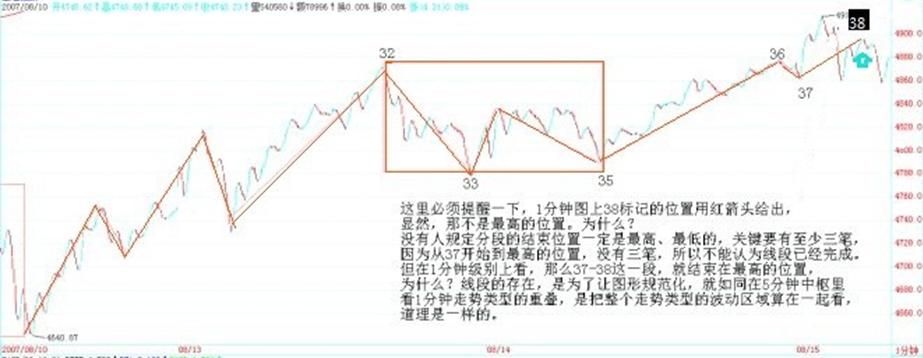

1分钟图

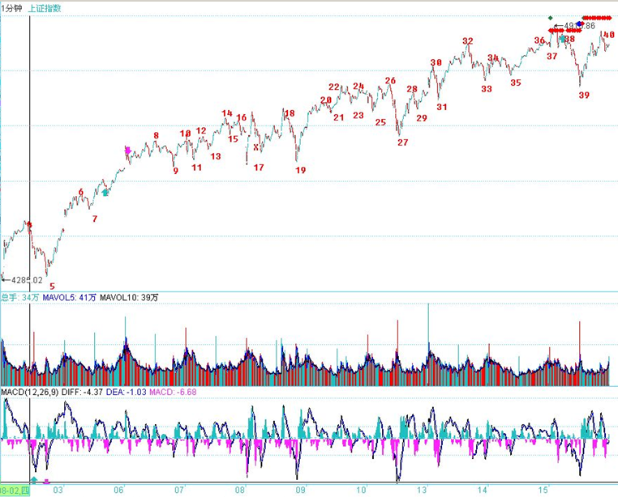

5分钟图

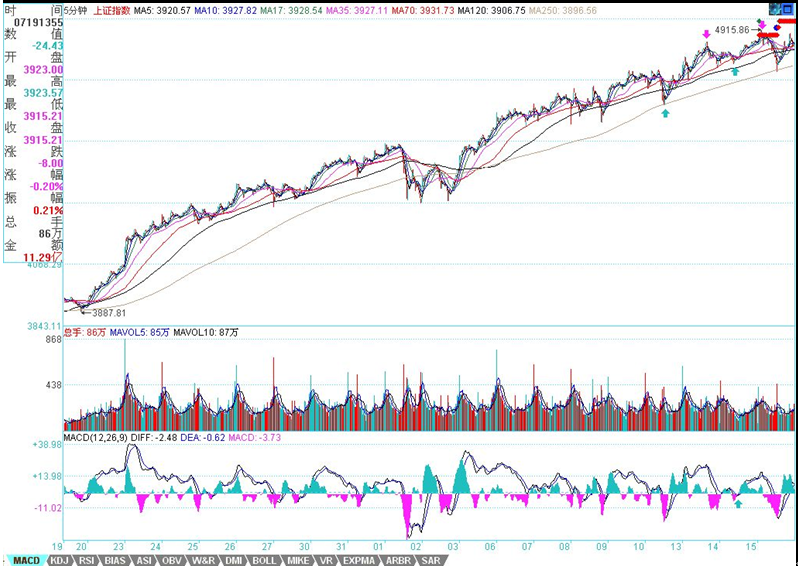

[第70课]读后感：

1、结合律在走势分析中是至关重要的。对于走势来说，结合律就是连接走势之间关系最重要的规则。

2、随着走势的当下发展，本ID不断变换着所看的中枢，这根本的原因就在于结合律，因为结合律，我们可以对走势进行最有利观察的分解，这样，才能更容易明白走势究竟在干什么？

[2007-08-16]全球化，没有市场可与世隔绝

(2007-08-16 15:41:56)

“全球化社会里，没有哪个股市是可以与世隔绝的。”是在本周一的公募基金经理“快男”发展模式的不可持续 上写的，主要是针对八月股市的分析。现在的问题，已经很明确了，还是该文章里说的，要注意月线上影的杀伤力。

当然，没必要预测这个问题，而且本ID从来都认为，美国的事情对中国的影响从来都是战略性的，中美游戏，只看最后结果，中间都是游戏而已。就像原来的蒋委员长，最终只得了个蒋匪而看海水之蓝终老，谁能把美国搞成美匪，显然更牛于将蒋委员长搞成蒋匪。

美国暴风雨，全世界陪着挨冻，但至少今天的中国散户，很多都没这种感觉。为什么？因为二、三线股被热点蔓延了。本ID从上周起，反复用到的就是蔓延这个词，这确实是一个度过风雨时节的好办法，搞工行的被美国搞了，现正痛苦中，那些到香港QDII的，终于知道全世界的乌鸦一般黑了。而这里的二、三线股的火，能否温暖这风雨之夜，就看明天和周一了。

全球化，没有市场可与世隔绝，但可以创造与世隔绝的板块，二、三线股，本来就是给点烛光都能灿烂，关键是，如果烛光都不能给，有点光就把投机大帽子盖上，那就瞎闹了。那些二、三线股一动就忽悠投机的，脑子里肯定水太多。当然，现在不比上半年，这二、三线股之火能否燎原，还真不好说，走着瞧吧。

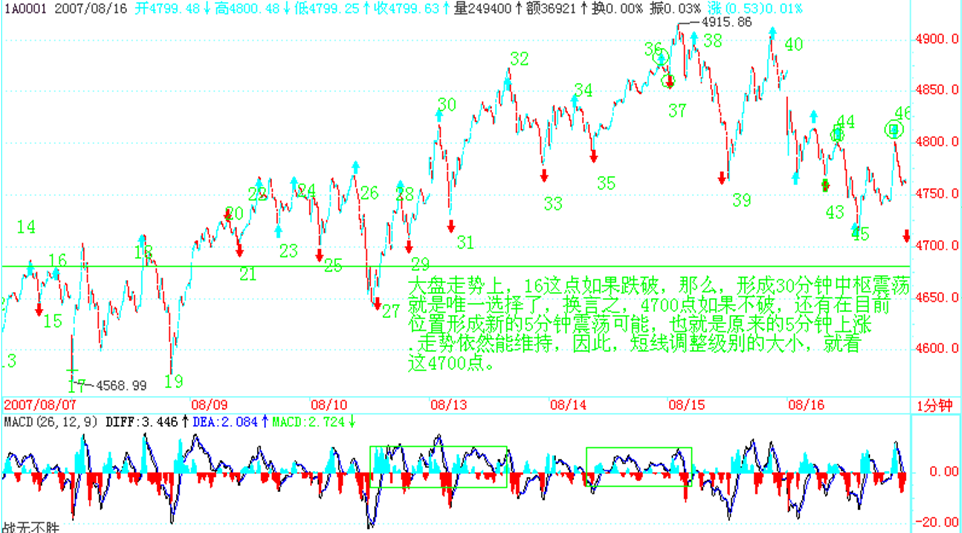

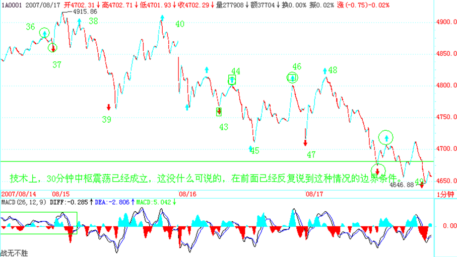

大盘走势上，16这点如果跌破，那么，形成30分钟中枢震荡就是唯一选择了，换言之，4700点如果不破，还有在目前位置形成新的5分钟震荡可能，也就是原来的5分钟上涨走势依然能维持，因此，短线调整级别的大小，就看这4700点。

这，关键还是要看美国这病人还要鬼哭狼嚎几天了，说实在，本ID是宁愿中国这边30分钟甚至日线震荡，也希望看到美国哭个368天算了，为阿富汗、伊拉克死难的人，美国人多些破产，难道不应该？

今天心情大好，看到美国暴跌就开心，虽然会让汉奸不爽，但汉奸不爽的事情，本ID最愿意干。

今天回答问题到5点，因为开心。

注意，下图中的46并不百分百确定，因为如果明天大幅度高开，那就要改变了，这只是大致标记上。

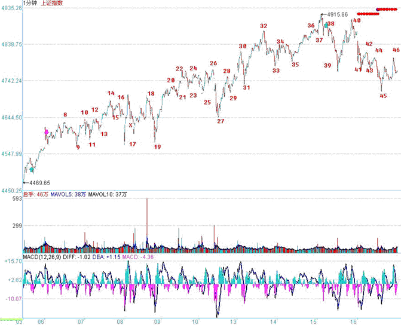

本文由公众号 “三思复盘”  整理
