## 教你炒股票71：线段划分标准的再分辨

(2007-08-16 23:02:06)

虽然67课已经给出了线段划分的标准，但由于那里用的是比较抽象的类数学语言，所以理解上可能还有困难，因此，逐一进行再分辨。

首先要分辨的，是特征序列中元素的包含关系。注意，特征序列的元素包含关系，首先的前提是这元素都在一特征序列里，如果两个不同的特征序列之间的元素，讨论包含关系是没意义的。显然，特征序列的元素的方向，和其对应的段的方向是刚好相反的，例如，一个向上段后接着一个向下段，前者的特征序列元素是向下的，后者是向上的，因此，根本也不可能存在包含的可能。

那么，为什么可以定义特征序列的分型呢？因为在实际判断中，在前一段没有被笔破坏时，依然不能定义后特征序列的元素，这时候，当然可以存在前一特征序列的分型，这时候，由于还在同一特征序列中，因此，序列元素的包含关系是可以成立的；而当前一段被笔破坏时，显然，最早破坏的一笔如果不是转折点开始的第一笔，那么，特征序列的分型结构也能成立，因为在这种情况下，转折点前的最后一个特征序列元素与转折点后第一个特征元素之间肯定有缺口，而且后者与最早破坏那笔肯定不是包含关系，否则该缺口就不可能被封闭，破坏那笔也就不可能破坏前一线段的走势。这里的逻辑关系很明确的，线段要被笔破坏，那么必须其最后一个特征序列的缺口被封闭，否则就不存在被笔破坏的情况。

那么，现在只剩下最后一种情况，就是最早破坏那笔就是转折点下来的第一笔，这种情况下，这一笔，如果后面延伸出成为线段的走势，那么这一笔就属于中间地带，既不能说是前面一段的特征序列，更不能说是后一段的特征序列，在这里情况下，即使出现似乎有特征序列的包含关系的走势，也不能算，因为，这一笔不是严格地属于前一段的特征序列，属于待定状态，一旦该笔延伸出三笔以上，那么新的线段就形成了，那时候谈论前一线段特征序列的包含关系就没意义了。

总之，上面说得很复杂，其实就是一句话，特征序列的元素要探讨包含关系，首先必须是同一特征序列的元素，这在理论上十分明确的。

从上面的分析就可以知道，从转折点开始，如果第一笔就破坏了前线段，进而该笔延伸出三笔来，其中第三笔破点第一笔的结束位置，那么，新的线段一定形成，前线段一定结束。

这种情况还有更复杂一点的情况，就是第三笔完全在第一笔的范围内，这样，这三笔就分不出是向上还是向下，这样也就定义不了什么特征序列，为什么？因为特征序列是和走势相反的，而走势连方向都没有，那怎么知道哪个元素属于特征序列？这种情况，无非两种最后的结果：1、最终还是先破了第一笔的结束位置，这时候，新的线段显然成立，旧线段还是被破坏了；2、最终，先破第一笔的开始位置，这样，旧线段只被一笔破坏，接着就延续原来的方向，那么，显然旧线段依然延续，新线段没有出现。

在67课里，把线段的划分分为两种情况，显然，分清楚是哪种情况，对划分线段十分关键。其实，在那里已经把问题说得很清楚，判断的标准只有一个，就是特征序列的分型中，第一和第二元素间不存在特征序列的缺口。从上面的分析可以知道，这个分型结构中所谓特征序列的元素，其实是站在假设旧线段没被破坏的角度说的，而就像所有的分型一样，就算是一般K线的，都是前后两段走势的分水岭、连接点。这和包含的情况不同，包含的关系是对同一段说的，而分型，必然是属于前后的，这时候，在构成分型的元素里，如果线段被最终破坏，那后面的元素肯定不是特征序列里的，也就是说，这时候，分型右侧的元素肯定不属于前后任何一段的特征序列。

这个道理其实很明白，例如前一段是向上的，那么特征序列元素是向下的，而在顶分型的右侧元素，如果最终真满足破坏前线段的要求，那么后线段的方向就是向下的，其特征序列就是向上的，而顶分型的右侧元素是向下的，显然不属于后一段的特征元素，而该顶分型的右侧元素又属于后一段，那么显然更不是前一段的特征元素。所以，对于顶分型的右侧特征元素，只是一般判断方面的一种方便的预设，就如同几何里面，添加辅助线去证明问题一样，辅助线不属于图形本身，就如同顶分型的右侧特征元素其实不一定属于任何的特征元素，但对研究有帮助，当然是要大力去用的，如此而已。

其实，线段的划分，都是可以当下完成的，无非是如下的程序：假设某转折点是两线段的分界点，然后对此用线段划分的两种情况去考察是否满足，如果满足其中一种，那么这点就是真正的线段的分界点；如果不满足，那就不是，原来的线段依然延续，就这么简单。

特征序列的分型中，第一元素就是以该假设转折点前线段的最后一个特征元素，第二个元素，就是从这转折点开始的第一笔，显然，这两者之间是同方向的，因此，如果这两者之间有缺口，那么就是第二种情况，否则就是第一种，然后根据定义来考察就可以。

这里还要强调一下包含的问题，上面的分析知道，在这假设的转折点前后那两元素，是不存在包含关系的，因为，这两者已经被假设不是同一性质的东西，不一定是同一特征序列的；但假设的转折点后的顶分型的元素，是可以应用包含关系的。为什么？因此，这些元素间，肯定是同一性质的东西，或者就是原线段的延续，那么就同是原线段的特征序列中，或者就是新线段的非特征序列中，反正都是同一类的东西，同一类的东西，当然可以考察包含关系。

估计看了上面的话，很多人更晕了。下面有几个图，各位可以仔细揣摩一下。但最好还是习惯从定义出发。另外，大盘网友问到的那个图，显然，根据定义，是两个线段，而今天42-44的分段，显然也是成立的。

注意，下图最后一个有问题，请看课程81里的更正说明。

INCLUDEPICTURE "http://s4.album.sina.com.cn/pic/486e105c020014p3" \* MERGEFORMATINET 

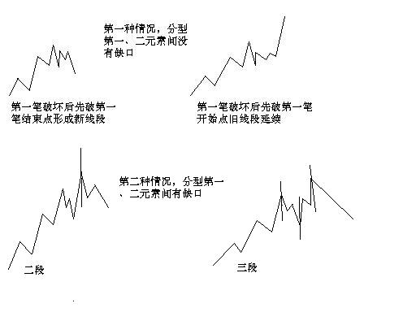

读后感：

线段的特征序列中元素的包含关系：

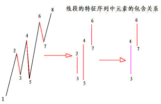

2、前一特征序列的分型

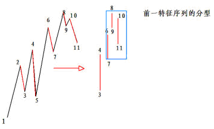

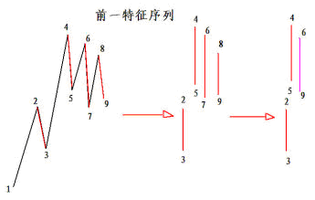

3、最后一种情况，就是最早破坏那笔就是转折点下来的第一笔，这种情况下，这一笔，如果后面延伸出成为线段的走势，那么这一笔就属于中间地带，既不能说是前面一段的特征序列，更不能说是后一段的特征序列，在这里情况下，即使出现似乎有特征序列的包含关系的走势，也不能算，因为，这一笔不是严格地属于前一段的特征序列，属于待定状态，一旦该笔延伸出三笔以上，那么新的线段就形成了，那时候谈论前一线段特征序列的包含关系就没意义了。

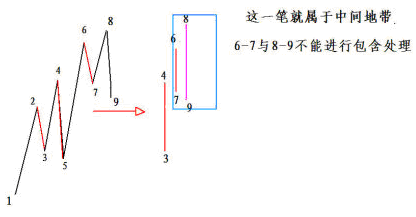

4、第三笔完全在第一笔的范围内，这样，这三笔就分不出是向上还是向下，这样也就定义不了什么特征序列，为什么？因为特征序列是和走势相反的，而走势连方向都没有，那怎么知道哪个元素属于特征序列？这种情况，无非两种最后的结果：1、最终还是先破了第一笔的结束位置，这时候，新的线段显然成立，旧线段还是被破坏了；2、最终，先破第一笔的开始位置，这样，旧线段只被一笔破坏，接着就延续原来的方向，那么，显然旧线段依然延续，新线段没有出现。

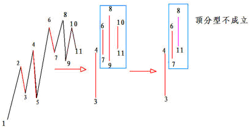

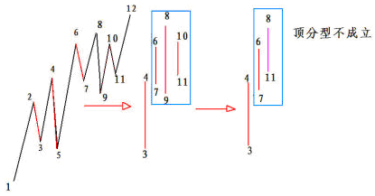

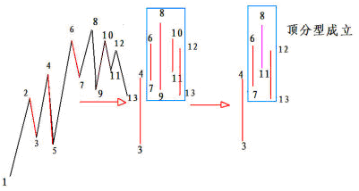

5、但假设的转折点后的顶分型的元素，是可以应用包含关系的。为什么？因此，这些元素间，肯定是同一性质的东西，或者就是原线段的延续，那么就同是原线段的特征序列中，或者就是新线段的非特征序列中，反正都是同一类的东西，同一类的东西，当然可以考察包含关系。

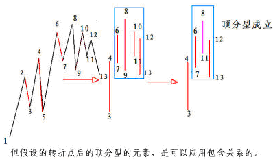

缠中说禅2007-08-16 16:40:06

请问36-37怎么回事，能说说不？看着36-37没有3笔呀，下上下，后面那个下，不能成为1笔。难道是缺口的缘故？另外，发现博客已经一切正常了

==

为什么不是？9点25那一分钟不算了？

==

当然，如果一定要坚持9点25那竞价不算，那么自然不是一笔，那就把36标记到4915点那最高点就可以。

但事实上9点25必须算，竞价是最重要的时刻之一，这里的意义重大，而且，这里刚好形成下面中枢的第三类买点，后面上拉的技术意义更明确了。

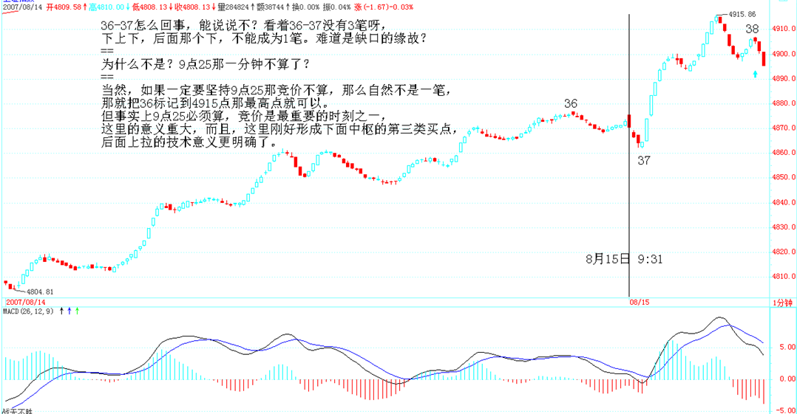

缠中说禅2007-08-16 16:44:08

紧急请教博主：今天上证指数44处根据线段定义，似乎不是顶分型啊，因为随后一笔大幅下跌形成包含关系。这里的疑惑，一定帮忙解答一下，因为这个问题很普遍啊，不搞清楚，很难分好线段

==

这里是第一种情况，也就是特征序列缺口被第一笔就封闭的情况，没必须探讨第二段特征序列分型的问题，那是第二种情况考虑的问题。

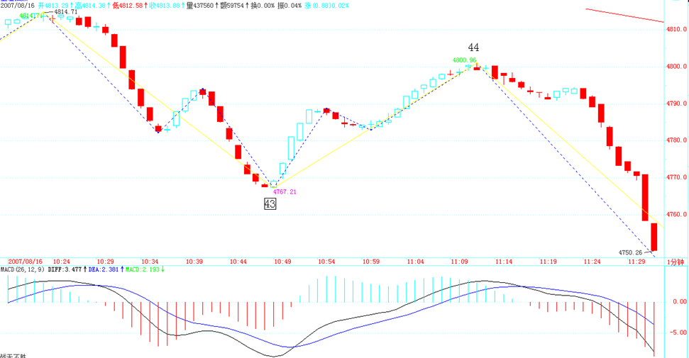

[2007-08-17 ]来自大洋彼岸的暗算

(2007-08-17 15:58:48)

全球资本市场这连续几年的多头氛围，好不容易给空头逮着一机会，各种衍生工具一起作用，大有来一次1987年的味道。或者，至少怎么都来次1997年。其实，2007年要出点事，是天经地义的，看看1987-1997-2007，瞎子都能看出规律来。不过，由于目前的全球化体系，各国间如果能有效配合，震荡的力度是可以充分减少的。例如，1997就比1987要小。

站在货币战争的角度，本ID从来都认为，美国人的这些把戏，不过是让全世界为他们的堕落埋单，所以根本没有任何值得同情的理由。而且，因为美国人在世界资本体系中的位置，他们受到的惩罚其实更多让全世界分享了，站在根本的角度，那不过是美国人的一个暗算，道理很简单，涨不过你，难道不可以拖累你？一起跌下来，让你更惨，或者将自己的烂东西让全世界一起背，你说，最后最大的利益者难道不是美国人？

美国不是泰国，美国就算崩盘了，其中依然会渔利不少，肯定还是大赢家。至于美国的最核心的统治阶级，最核心的利益集团，那更是赢家中的赢家。现在的问题是，这暗算是否把你给暗算了。

当然，对于一般散户来说，这些问题都没必要研究。今天，已经有熟人在说，上周刚过去香港的已经没了一半了。天下乌鸦一般黑，有什么奇怪的。以为QDII就如何有投资价值，那是脑子进水了。

让工行去为美国人下半旗帜吧，二、三线股可不陪你们玩。今天，依然有不少二、三线股企图星火燎原，不和美国人一般见识。这能否成为共识，这就不好说了。毕竟，现在有国外背景的资金，都在夺路而逃，甚至，很多人要把这里的资金拿去填美国月亮的窟窿，那就让他们的资金被资本市场人道毁灭去吧。

可以肯定地说，本周全球的恶劣走势，会引发各国金融当局的强力介入，因此，一个有力的反弹的出现，是很正常的，至于之前是否要制造空头陷阱，那并不重要。站在大方向看，这个反弹后，如果各国金融当局的政策不得力，甚至更大可能的，有某些全球利益集团，故意要政策不得力，那么，更大的下跌还在后面。看看1987年的走势，第一段的下跌并不严重，反而是反弹后的下跌才真正的令人开眼。

所以，这次10年周期的金融风暴的第一次下跌，并不是太重要的，关键是看后面反弹后基本面以及各国玩法的状态，那才是关键所在。

国内市场，本来基本面上就有所不同，如果能在这次波动中，把某些外国资金给清理掉，这也算是一件好事。但如果外面的世界继续狂风暴雨，说这里一点都不受影响，那是脑子进水了。想想那些从非法渠道进来的资金，他们的老家出事了，你说他们能不受影响？他们受影响了，国内的市场能不受影响？

技术上，30分钟中枢震荡已经成立，这没什么可说的，在前面已经反复说到这种情况的边界条件。图就不用贴了，今天的分段太简单，周一一起帖，这样可以节省一个图的上传量，这里的总量只有200，用不了几天。

个股上，一线成分股，将跟随外围，一旦外围走稳，将引发大反弹。二、三线股，关键是看这次资金的流入情况，但无论如何，个股行情将再次活跃。

最后问一句，600139，以前对他仇恨无比的，现在是什么心情？5月28到7月6日，就一个月的洗盘，都受不住，那还玩什么？不过，这也没什么，好象这里没说过的600594。本ID一个文化界的熟人，6月份在11、12元买了，明确告诉至少要翻倍。前两天，在腐败时碰到，说在10元砍掉了，因为听别人说，这公司要破产。本ID只能很有礼貌地无话可说了。

算了，废话就不说了，周末，腐败才是王道。各位，腐败快乐。先下，再见。

[2007-08-20 ]总市值超GDP后的泡沫化生存

(2007-08-20 08:22:59)

本ID在3月19日写的 “神州自有中天日，万国衣冠舞九韶”，给出了本轮大牛市的一个基本判断，就是至少再延续20年、上升3万点，这个观点依然有效，没有任何需要修改的地方。在同一文章中，更给出了本轮行情第一阶段走势的基本特征，现引用如下：

“第一阶段行情，伴随着中国股市本身的制度性、结构性完善，其后，中国股市才真正具备参与全球化盛宴的资格。全流通、整体上市、两大交易所的功能重组、人民币逐步可自由兑换等，都不过是这种制度性、结构性完善的必然步骤。这一阶段，行情最主要体现在以权重股为代表的成分股上。在总市值超越GDP之前谈论股市的泡沫是可笑的，在中国股市总市值超越其GDP之前，第一阶段行情不会结束。”

显然，这个“在中国股市总市值超越其GDP之前，第一阶段行情不会结束。”

的判断已经被今天的事实所证明，因为，目前中国股市总市值已经超越GDP，但第一轮的成分股行情依然在延续中。如果，对何谓第一阶段的成分股行情还有所疑问，那么这段时间，中国股票市场大象狂舞的情形，应该给这种成分股行情一个最好的注释。

在这样一个市值超越GDP的历史性事件如期到来之时，必须给行情今后的发展定一下性。在市值超越GDP后，中国资本市场将进入第一阶段成分股行情的泡沫化阶段，中国资本市场的参与者将进入总市值超GDP后的泡沫化生存状态。

正如上面引文所说“在总市值超越GDP之前谈论股市的泡沫是可笑的”，而在总市值超越GDP之后，谈论股市的泡沫，就是十分必要了。如果把GDP当成总市值波动的中枢，那么在其下，可以说市场被结构性低估，而在其上，就是出现结构性泡沫了。

显然，GDP是变动的，随着中国经济的快速增长，总市值的波动中枢也将不断上移，今天的泡沫，可以就是明天的低估，这一切都必须动态去看。出现结构性泡沫并不意味着市场就没有上涨的理由，而是说这种上涨，其基础上存在被这波动中枢回拉的压力，一旦市场上涨的中短期理由不足以抗拒这种回拉，那么无论上涨使得总市值向上远离GDP30%还是300%，最终的回拉都将导致相应级别的调整。

如果说4500点附近对应目前GDP比较肯定的中枢，那么中国经济的高速发展，将使得20年后的GDP至少达到目前美国的水平，也就是说，一个100万亿人民币的GDP值是十分正常的，相应资本市场的中枢位置至少上移到23000点附近，而那时候，中短期波动让指数上冲到30000多点甚至50000点，都是可以想象的。市场总要波动的，市场可以围绕中枢去波动，但绝对不排除市场的波动大幅度去远离中枢，只是这种远离后都必然导致回拉的修正而已。

远期目标且不讨论，回到第一阶段这种泡沫化生存状态下，唯一能站在长期角度抗拒泡沫的，就是成长性带来的中枢上移，一旦成长性不足以支持这种中枢上移，那么大规模的泡沫破裂就是天经地义的。而且，这种泡沫的破裂，往往导致中短期走势跌破中枢，形成一个新的低估，这又构成良好的中长期介入机会。

中国资本市场目前的泡沫化生存之所以还不构成大规模的压力，就在于，即使是中国资本市场上最大型的成分股，站在世界资本市场的历史发展中，依然属于高速成长股。因此只要这种状态依然存在，那么一个适度的泡沫化生存反而是合理且理所当然的。

不过，市场行情总是从非理性开始，又在非理性中结束，没有疯狂的低估，就没有疯狂的牛市行情；同样，没有疯狂的泡沫，就没有疯狂的熊市造就新的历史性低估介入点。第一段成分股行情，最终必然在疯狂的泡沫中结束，在这疯狂的泡沫被制造过程中，反而能获取高额利润。如果说低估回到中枢可让股票上涨10倍，那么疯狂的泡沫甚至有更强的能力。对于任何市场的参与者，耐心等待市场的疯狂，在市场的疯狂中等待最后的卖点，是一个最重要、最值得培养的能力。

显然，目前市场最疯狂的状态依然没有出现，外围因素制造短期的波动反而有利于市场能量的积累。在泡沫制造能力被充分发挥之前，市场不会最终逆转，第一阶段的成分股行情不会结束。不再战略性买进、只战略性持有，等待市场疯狂、等待第一阶段长线卖点的出现，是泡沫化状态下最应采取的策略。

[2007-08-20]两年最大涨幅拉开泡沫化生存大幕

(2007-08-20 15:48:47)

大盘中长线走势的判断，都在今早的 总市值超GDP后的泡沫化生存 里。其中最后一段有必要引用如下“显然，目前市场最疯狂的状态依然没有出现，外围因素制造短期的波动反而有利于市场能量的积累。在泡沫制造能力被充分发挥之前，市场不会最终逆转，第一阶段的成分股行情不会结束。不再战略性买进、只战略性持有，等待市场疯狂、等待第一阶段长线卖点的出现，是泡沫化状态下最应采取的策略。”今天，大盘以两年最大涨幅拉开泡沫化生存大幕。

至于大盘的中短走势，在上周五已经明确说过“可以肯定地说，本周全球的恶劣走势，会引发各国金融当局的强力介入，因此，一个有力的反弹的出现，是很正常的，至于之前是否要制造空头陷阱，那并不重要。”其后的走势，基本如此，在同一文章里，已经说了，最重要是反弹后的走势，需要关注的是相关政策的有效性，一旦救市政策失效，引发全球资本市场更大规模的杀跌，并不是什么天方夜谈。

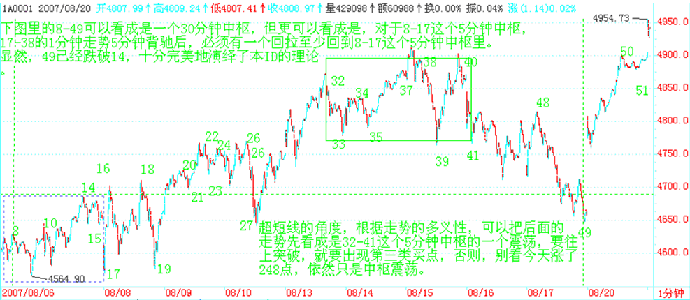

回到上海指数，从纯技术的角度，下图里的8-49可以看成是一个30分钟中枢，但更可以看成是，对于8-17这个5分钟中枢，17-38的1分钟走势5分钟背驰后，必须有一个回拉至少回到8-17这个5分钟中枢里。显然，49已经跌破14，十分完美地演绎了本ID的理论。超短线的角度，根据走势的多义性，可以把后面的走势先看成是32-41这个5分钟中枢的一个震荡，要往上突破，就要出现第三类买点，否则，别看今天涨了248点，依然只是中枢震荡。

个股方面，周五也说得很清楚了“个股上，一线成分股，将跟随外围，一旦外围走稳，将引发大反弹。二、三线股，关键是看这次资金的流入情况，但无论如何，个股行情将再次活跃。”显然，今天的走势完全与此符合。目前，行情要继续发展，必须把二、三线股点燃起来，这是今后行情是否能往纵深发展的关键，否则光拉一线大盘或者普涨走势，都不可能持续。

另外，周五用600139、600594为例子，只是说明持股的重要，如果没有做短线的本事，也没有持股的耐心，怎么可能长期战胜资本市场？不妨再举一个例子，那只唯一本ID明确说过的中字头股票600737，本ID在7月中8元时十分明确地告诉，这股票等于6元告诉你000999，纯粹就是给你准备点学费，可以安心学习。但现在又有多少人能从8元持有到现在？其实，前后也就1个月时间，如果这样都持不住，那就该干什么干什么吧。今天有事，先下，再见。

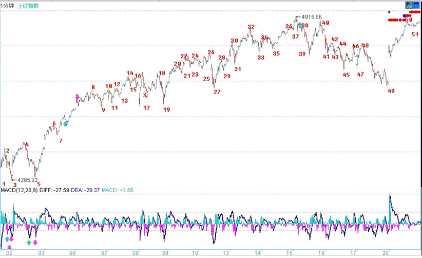

[2007-08-21]热点蔓延渐成潮流

(2007-08-21 15:59:25)

当然，对看不惯、从1000点就开始说地球要毁灭、世界要末日、上海股市100点都没有价值的空头来说，这个题目太粉饰太平了，就是为了骗散户，哪里有什么热点，都是庄家拉高出货。可惜，这庄家拉高，从1000点一直拉了两年多、4000点，还在拉高，还在骗散户，不知道这究竟算是什么了？

本ID这里的逻辑关系十分明确，在总市值超越GDP之前，本ID从来没有谈论过任何有关泡沫的问题，大概从上周起，本ID才开始谈论这个问题，而且给以后的走势一个明确的定义，就是泡沫化生存。如果说，从1000点的严重被低估状态到上周的刚好达到GDP，这个时间有两年，请问，这制造泡沫到泡沫真正破裂，至少要多长时间才合适呢？

所以，如果没有对全局的一个大方向的把握，永远在每天的波动中折腾自己，或者每天就盼望着大跌、熊市、100点，再一次1000点，那是脑子水太多了。以前，本ID已经给这种人一个定性：这种人，真跌了，也和他们没关系，就算有熊市，真正的底部也和他们没关系，真有大调整，也和他们没关系。1000点和他们没关系，3400点和他们没关系，3600点同样和他们没关系。

还是回到今天的走势，现在，十分明确的现象，就是热点在蔓延。本ID以前曾说过，中报出来后，二、三线股会逐步活跃，本月结束，这中报基本就出来了，那些业绩不好，但有题材的股票抛开业绩这个枷锁，会逐步活跃起来的。

其实，这个节奏，并不是什么新鲜事。从来都是在业绩大面积公布时，所谓业绩好的、一线股表现得好一点。等业绩公布完了，业绩作为题材被炒烂了，自然要找新的来替代，否则就维持不住这锅的热度。当然，今年有点例外，就是业绩公布完以后，一线成分也不会太耷拉，为什么？还不是那期货闹的，有那东西在前面晃悠着，一线成分这些大狗小狗，总要不时奔跳折腾几下的。

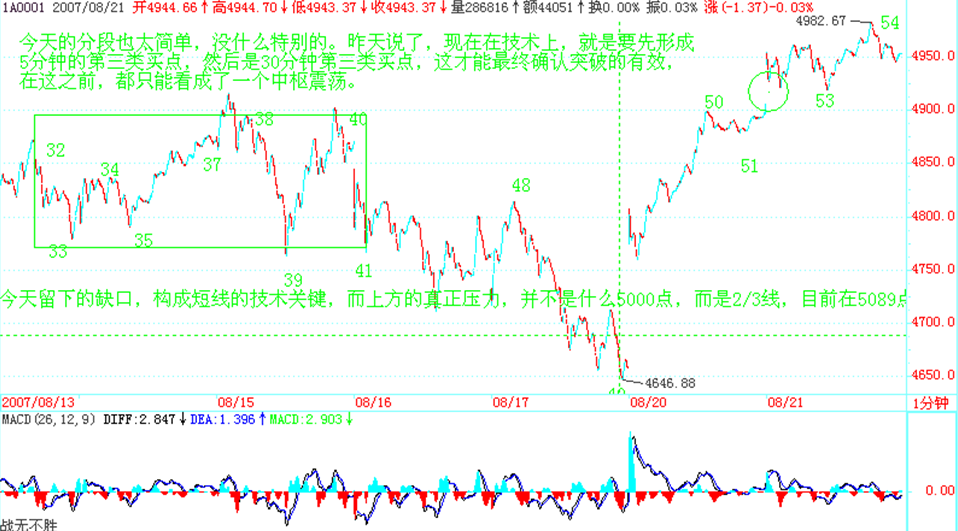

今天涨停的股票里，二、三线已经占了绝大部分，这就是一个热点蔓延的正常现象。这火如果能再坚持几天，就会彻底燎原。

今天，就不帖图了，节省点上传图片的空间。今天的分段也太简单，没什么特别的。昨天说了，现在在技术上，就是要先形成5分钟的第三类买点，然后是30分钟第三类买点，这才能最终确认突破的有效，在这之前，都只能看成了一个中枢震荡。

今天留下的缺口，构成短线的技术关键，而上方的真正压力，并不是什么5000点，而是2/3线，目前在5089点，这在前面曾以问题的形式给各位说过了。突破1/2线，上一条就是2/3线，这涉及预测，但有比较大的经验值保证，但本ID为了彻底反对预测，所以只以问题的形式和各位讲，就是不希望让各位先入为主，影响当下的判断，那才是真工夫。

预测这种东西，不过是按一个模子照套，傻子的干活而已。2/3后就3/4线，目前在哪里，傻子都能干活出来，所以预测都是傻子的干活，还是不要提了。今天可以回答问题到5点。

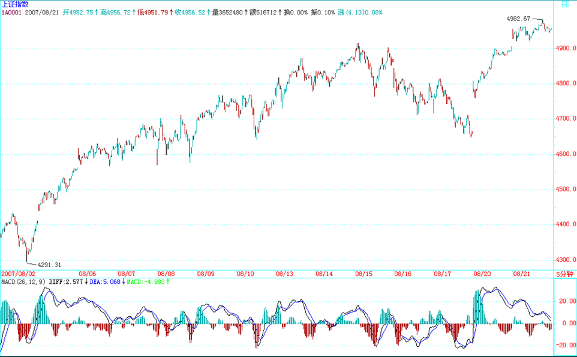

## 教你炒股票72：本ID已有课程的再梳理

(2007-08-21 22:37:20)

任何事情，都有缘起。本ID是个大杂家，本ID现实中最终的落脚处，是文化的总构建，所谓三教九流，彻底穷源地玩弄一把。虽然，经济上，本ID早就可以天天腐败什么活都不干了，但现在又没老到要在书斋里天天写书的地步，本ID觉得，那至少是40岁以后才能干的事情。因此，本ID在网上写东西，纯粹是顺着形势来，并没有什么计划。

写关于股票的事情，对于本ID来说，不过是把本ID这十几年天天干的事情复述一下。正如在课程开头，本ID说的““教你炒股票”这样的题目，全中国不会有第二人比本ID更适合写的。” 当然，这种话招人恨的，不过却是事实。

和股票相关的事情千奇百怪，本ID是什么都经历过，所以，开始写的时候，并没什么主题，只是漫谈。但对一般散户来说，听些掌故没什么实质意义，说消息面，肯定也没什么意义。如果你消息灵通到公布什么利好利空前都是第一时间知道，那么就没什么可说的。而对于散户来说，那种靠拿着原始股就可以翻几十几百几千倍的时代早过去了。靠研究公司基本面买股票，那种积累速度太慢，只适合大资金。其实，一切关于基本面的研究，最终都归于行业或总体经济的发展。最简单、最不伤脑筋的方法，本ID也说过，就是买指数基金、或者具体行业、板块的基金。对于散户来说，你对基本面的研究能力要超过一个好的基金团队的可能性是微乎其微的。至于指数基金，那就更不用说了，至少你肯定不会跑输指数。

对于散户来说，最终能战胜市场、获得超越市场的回报的，只有在本ID所说的乘法原则下的技术面操作。技术面是三个独立系统里的一个，而另外两个，例如比价关系与基本面，可以配合决定你的介入种类。但当介入到一个品种后，技术面在操作上就起着决定性的意义。为什么？因为其他的面，变化的频率都没有技术面高，像基本面，其变化大致是有一定的稳定性的，不可能天天都是奇点、断裂点。比价关系也一样，一种比价确立后，就基本保持稳定了，不可能天天都变化。所以这种变化少的系统，不需要花太多精力去研究，而技术面显然不同。

所以，最终本课程开始说技术面是顺理成章的。而技术方面，本ID的理论，肯定是关于技术方面最好的理论了，本ID本来是想在40岁退休后才写出来的，但大概是缘分到了，本ID也没刻意一定不写出来，所以就慢慢地写出来，而且现在还在写着。

开始时，本ID并没有认真想写整套理论，因为当时好在网上骂男人玩，所以开始写技术的，都是用些损男人开心的招数，当时说的只是均线系统，那东西和本ID的理论没什么关系，只是闹着玩的。当然，如果真掌握了均线系统，也可以应付一定的情况了，例如，在日线单边走势中，最偷懒的方法就是看着一5日线就可以，而5周线就更是中线的关键，5月线是长线的关系。例如，为什么现在牛市的第一轮肯定没走完？很简单，你什么时候见过牛市的第一轮调整不跌破5月线的？这两年多，这5月线被有效跌破过吗？显然没有。而第一次跌破5月线后，下面的10月、30月线上来，自然构成新的调整底部，后面自然还有一波大的。

后来开始写于本ID理论有关的东西，开始，只是想把一些有用的结论告诉各位，因此课程都不是按正式的理论框架写的。本ID的理论，本质上分两部分，一是形态学，二是动力学，当然三就是两者的结合。如果按正式的课程，那肯定要先讲形态学。但如果不说动力学，那至少背驰是没法讲了，然后中枢震荡也不可能用类背驰的方法去判别，第一类买卖点也无法说了。而所有买卖点，归根结底都是第一类买卖点，那这样，要把形态学和动力学都说完，才说第一类买卖点，估计所有看的人都会晕倒。

所以，当时把于初学者有用的一些简单结论先说了，就是让各位有点实践的乐趣，当时000999刚好在6元，还很明确地说了，买这股票，就当本ID把你要给市场交的学费都给各位准备好了，就是让各位耐心学下去，拿着一个长线股票，至少比你到处乱跑要强点。这样安心学习，也是不错的。当然，有能力的，也就可以边学边实践，这没有任何需要统一规划的地方。

站在纯理论的角度，形态学是最根本的。形态学，从本质上就是几何，这部分内容，是无须任何前提的。以前说的本ID理论成立的前提，其实并不是针对这部分的，主要是针对动力学部分。因此，就算一个庄家自己全买了，一个人天天自我交易，也永远逃不出形态学画的圈圈。而动力学方面的东西就不同了，必须有本ID要求的那两个前提：价格充分有效市场里的非完全绝对趋同交易。

动力学，是属于物理范畴的，但站在更高的层次上看物理，物理的本质就是几何，当然，这是所有物理学家都不可能认同的，但如果用一些几何结构就可以把所有物理的常量给搞掂，那物理学家不认同也是白搭。同样道理，本ID理论里的动力学部分，本质上也是几何，只是这种几何比较特别，需要把价格充分有效市场里的非完全绝对趋同交易作为前提转化为某些几何结构，然后构造出理论的证明来。

所以，本ID理论在整体上依然只是几何，只是需要有价格充分有效市场里的非完全绝对趋同交易的前提。而且，最终的理论，当然不会涉及那些基本上谁看都会晕的几何结构，而是谁看都能看明白的当下的走势。理论和理论的证明那是两回事情。费马猜想谁都看得懂，费马猜想的证明，能全看懂的人不会超过1千万分之一。

当然，本ID的课程，基本的逻辑顺序还是一直坚持的，不过，如果是最终的课程，那么最开始的一章，肯定是形态学，和这课程的顺序大为不同。但现在，由于已经写成这样一种形态学和动力学混着说的状态，当然只能一直混着下去。

所谓形态学、动力学，其实很好分辨，任何涉及背驰的，都是动力学的范围，背驰是动力学的基本点之一。另外，中枢、走势的能量结构之类的东西，也属于动力学。而形态学，就是中枢、走势类型、笔、线段之类的东西。

其实，光用形态学，就足以形成一套有效的操作体系。只是在形态学中，由于没有背驰的概念，所以第一买卖点是抓不住了，但第二买卖点是肯定没问题的。单纯用形态学去操作，就是任何对最后一个中枢的回拉后第一个与回拉反向的不创新高或新低的中枢同级别离开，就是买卖段。

就算按照这么简单的方法，也可以很容易判断现在在日线上的操作思路，例如，去年5月和今年5月后的调整，算是同级别的，那么，其后的卖点就是，万一回拉4335点之下，任何第一次向4335点上的与回拉级别相同的不创新高的反抽都是卖点。如果一直没有回拉回到4335点，又在上面形成新的同级别中枢，那么操作的标杆就进一步提到那个中枢上，如此类推。按照这种方法，那么从2005年中到现在，你都应该持股不动，为什么？因为没有卖点。当然，实际操作，要针对具体个股，说指数只是举例子。个股上，看000777在日线，6月20前后的一段，就可以看出类似的效果；但如果你是看周线图的，那么现在的卖段还没有出现，而且可以明确地看出，其6-7月份的调整，不过是突破历史高位后的回抽过程，站在更大的视野上，看到更大的方向，如此而已。

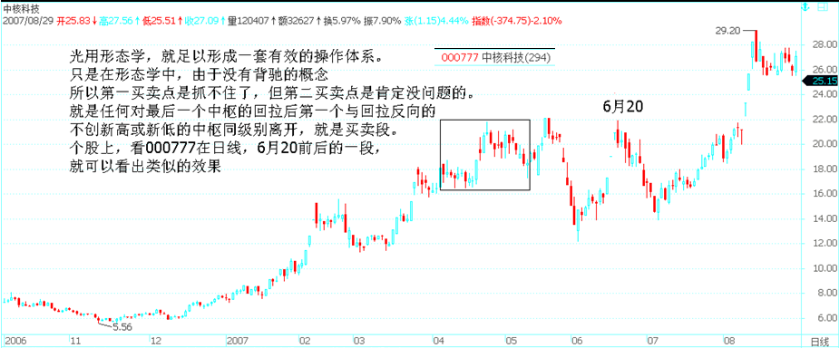

当然，上面只是说如果只用形态学，也可以进行操作，但实际上，当然是动力学、形态学一起用更有效。所以，千万别认为以后就只用形态学了。不过这里有一个用处，就是那些对背驰、区间套没什么信心的，可以先多从形态学着手。而且，形态分析不好，也动力不起来。

站在实际应用的角度，关于中枢的递归定义以及与从分型、笔、线段开始的最小级别定义之间的区别之类的东西，也是可以不管的，但这样，逻辑上就容易乱，所以，搞清楚没坏处。如果你实在特懒，那就从分型学起，这也可以。

下面，本ID给出一个懒人线路图：

分型-笔-线段-最小级别中枢-各级别中枢、走势类型

上面几个东西，是形态学中最基本的，完全没有办法再简略了，所以无论多懒，如果真想学本ID的理论，那请先把这几样东西搞清楚。

关于形态学，后面还有很多内容，最主要是关于各种与结合律相关的问题。当然还包括世界上所有有关股票的理论中关于形态部分的理论，根据本ID的形态学，例如什么K线理论，波浪理论之类的玩意，都可以从本ID的形态学中严格推出，而且，本ID还可以指出他们的缺陷以及原因。这个工作是必须干的，彻底穷源的其中一个方面，就是要包罗万象。

注意，有时候课程是由浅入深，前面不严格的，后面引进新概念后，就可以严格定义了。例如，最开始时，说上涨、盘整，都是用高、低点之类的东西，因为当时没说中枢，所以不可能严格定义，后来说了中枢，就可以给出严格定义。

再例如，64课里，由于没说特征序列的元素之类的概念，所以里面关于线段一些论述都如同用高、低点定义上涨、盘整一样，不太严格，到67课说了特征序列之类的东西后，定义就是严格的，所以在67课里，本ID说“本课，就是把前面“线段破坏的充要条件就是被另一个线段破坏”精确化了。因此，以后关于线段的划分，都以此精确的定义为基础。”

为什么说原来的不精确，因为按照原来没有特征序列的定义，那么线段里都要继续存在类似小级别转大级别的情况，而有了特征序列后，就不再需要这种情况了，这样才能把线段给精确划分。

由于本ID目前的讲课，一开始就没有按正常课程应该的顺序，所以，这种开始不精确后来再精确的情况才会发生。本ID愿意先不引进复杂的概念，先把大方向给说了，然后再说复杂的概念。这样有一个好处就是，如果理解能力差的，可以接受简单，不太精确的方式，这样也没什么问题，也可以用。例如，像特征序列的分型这样的概念，本ID就严重怀疑孔男人能理解的机会能超过10%。所以，如果不能理解精确的，就用不精确的，等有理解力，对市场再了解深了，再学精确的也可以。

例如，如果你现在只能理解男上位、女上位，吻之类的东西，那也很好。关键是精通一样东西，精通就好，就怕半通不通。所以，以后有问题，一定要问，把所有想解决的问题都解决才行。当然，本ID无法回答所有问题，但有代表性的，一定会安排回答的。

第72课读后感：

1、文化的总构建。

2、三个独立系统：技术面、比价关系与基本面。

3、但当介入到一个品种后，技术面在操作上就起着决定性的意义。

4、大概是缘分到了，本ID也没刻意一定不写出来，所以就慢慢地写出来，而且现在还在写着。

5、均线系统，那东西和本ID的理论没什么关系，只是闹着玩的。

6、课程都不是按正式的理论框架写的。

7、本ID的理论，本质上分两部分，一是形态学，二是动力学，当然三就是两者的结合。

8、站在纯理论的角度，形态学是最根本的。形态学，从本质上就是几何，这部分内容，是无须任何前提的。

9、本ID要求的那两个前提：价格充分有效市场里的非完全绝对趋同交易。

10、本ID理论成立的前提，其实并不是针对“形态学”这部分的，主要是针对动力学部分。

11、动力学，是属于物理范畴的，但站在更高的层次上看物理，物理的本质就是几何。

12、本ID理论里的动力学部分，本质上也是几何，只是这种几何比较特别，需要把价格充分有效市场里的非完全绝对趋同交易作为前提转化为某些几何结构，然后构造出理论的证明来。

13、所谓形态学、动力学，其实很好分辨，任何涉及背驰的，都是动力学的范围，背驰是动力学的基本点之一。另外，中枢、走势的能量结构之类的东西，也属于动力学。而形态学，就是中枢、走势类型、笔、线段之类的东西。

14、动力学、形态学一起用更有效。

15、形态分析不好，也动力不起来。

16、懒人线路图。

17、本ID目前的讲课，一开始就没有按正常课程应该的顺序，所以，这种开始不精确后来再精确的情况才会发生。

[2007-08-22]一次值得鼓掌的加息

(2007-08-22 08:37:19)

本来不想为昨天加息的公布说任何话的，因为确实没什么可说的，管理层只是干他们该干的事情，而投资者看着市场的反应去反应，不需要任何预测、猜测。任何的谈论，不过都是忽悠、站在自己利益上的广告而已。现在之所以写，只是站在一个非市场的立场上，为一次值得鼓掌的加息留下一笔。

这次加息，显然时机十分正确。当然，反对加息的人肯定不这样认为。他们的理由无非是，美国人都要减息了，中国凭什么加息？这是典型的脑子进水想法。中美之间保持息差，不过是一种可能的生存状态；不保持息差了，难道就不是一种可能的生存状态。而且，本ID最讨厌看到任何美国怎么了中国人就要怎么的破烂言论，美国还911，你怎么不也跟着去？脑子有锈？

当然，现在并不是说管理层已经放弃了原来中美之间保持息差的基本态度，但这次加息，至少是一次完全以我为主的行为，从而使得管理思路上有了自我的性格，这就是好事情。而且，如果要加，现在的时机是最好的，在世界对美国那些破烂事情反应稍有喘息的时候，效果显然是最好的。这次，本ID给管理层打100分。

当然，对于市场里的人，可能认为这次加息有调控的味道，特别昨天刚出个人到外面买股票的试点，今天又出加息。而现在又面临5000点，这个时机，显然有组合拳的味道。这对也不对，为什么？虽然，理想的状态是少调控多监管，但现实如此，就是调控还是一种自然反应，就必须面对着现实，如果能达到一个调控的高境界，那就是一件可欣赏的事了。

显然，这次组合券，分寸、时机都拿捏得很好，在是不是之间。所谓调控的艺术，就是让市场产生不同的预期，而不是统一的预期，这样的调控，就是最高明的调控。当然，不能说以后的调控都一定能达到这样的水平，但至少现在是这样，所以，本ID要给管理层再加100分。

这次调控，对市场将产生不同的解读与预期，这样，市场的合力就不会产生一边倒的现象，这样，市场就可以在一定的时间内进行一定的磨合，最终去选择自己的方向。

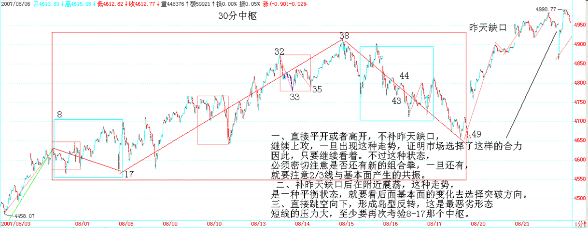

目前，技术上的条件没有任何变化，日线上，背驰段依然成立去等待最后的确认或破坏，短线，30分钟的中枢震荡依然，超短线，最后一个5分钟的中枢震荡依然，按照这些技术界限，与自己的操作级别，不难根据当下的走势去选择自己的操作。

对于技术学习不好的，就看5日线、5周线，不要为市场的消息所动，只看市场最终的反应，这是一个最基本的素质。

至于今天的走势，无非就是强中弱三种：

一、直接平开或者高开，不补昨天缺口，继续上攻，一旦出现这种走势，证明市场选择了这样的合力，因此，只要继续看着。不过这种状态，必须密切注意是否还有新的组合拳，一旦还有，就要注意2/3线与基本面产生的共振。

二、补昨天缺口后在附近震荡，这种走势，是一种平衡状态，就要看后面基本面的变化去选择突破方向。

三、直接跳空向下，形成岛型反转，这是最恶劣形态，短线的压力大，至少要再次考验8-17那个中枢。

其实，这些分类界限，都无须预测，让市场自己去选择，根据市场的选择去反应。另外，一定要注意自己的操作级别，如果你是月线操作，那就看5月线，没有效跌破之前，都可以少管，任何的波动都可以当戏看。

另外，美国那破事，在如期反弹后续的发展，是决定今后走势的一个重要分力，这样因素在前面反复说过了。这可能比加息、组合拳都要根本点，毕竟，管理层的加息、组合拳都要参考这方面的因素综合给出。

[2007-08-22]加息难阻热点蔓延

(2007-08-22 16:10:16)

昨天说热点的蔓延如果能持续几天，就会燎原。而晚上公布的加息产生的新分力，使得大盘最后选择了今早所说的第二种中等力度的走势，这都是自然的选择，无须预测。任何有预测癖好的人，去当火星股评去吧，地球很危险的。

今天的走势，从纯技术的角度，连一个线段都不一定100%确认完成了，为什么？因为都没100%满足线段完成的条件。该线段完成的判断，显然属于第一种情况，本来第一种情况是属于相对简单的。但由于特征序列的分型一直没有最终完成，每一次上冲都新高，而下来都是一笔，形成所谓的向上倾斜三角型走势，该走势的特点就是99%回跌到三角形启动的位置，尾盘的跳水满足这一跌幅，但只是一笔，所以如果明早一下高开在5000点之上猛烈上攻，不再回跌到5000点下，那这线段还真一时完成不了。当然，一般情况下，这线段已经在今天的最高点处完成，所以在上面标记上56，但这是否最终确认，还要上面说的这种情况不发生。

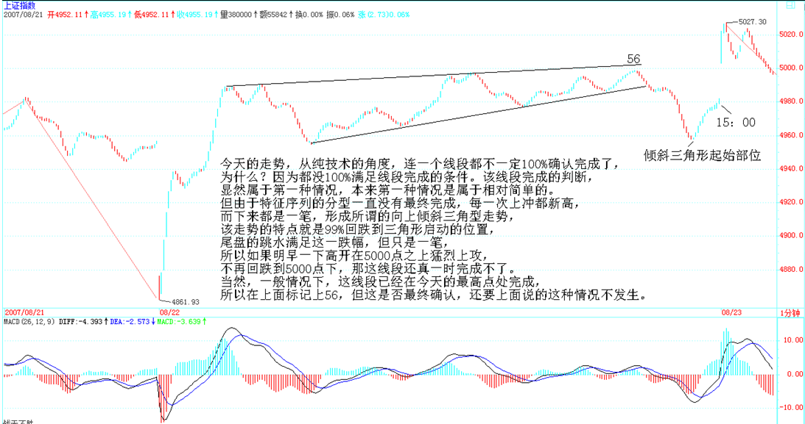

一般来说，1分钟线段都不会延续这么长时间，能延续这么长时间，反而是一个技术上的重要提示，证明多方上5000点的冲动比较大，反复闹，而上面，有人不断压制，所以才会走出向上倾斜三角型的走势。而到尾盘，差不到一点见5000了，多方一股真气突然泻去，回到倾斜三角形起点位置。主要是如530般在亢奋状态突然被惊吓留下了后遗症，因此往往在关键时刻都来这么一下，尾盘收回去一半，只是表明多头上攻的欲望依然没得到满足，如此而已。

今晚的消息面很重要，连续两天有消息了，如果今晚还来什么调控玩意，这走势变数就大了。由于选择了第二种走势，短线政策面的变化起着重要分力的作用。如果今明两天没什么特别消息，使得关于政策面组合拳的猜想暂被搁置，那么，上上5000点去满足一下多头的欲望，也是理所当然的。

本ID早说了，5000点根本什么都不是，关键是5089点的2/3线，这线就如同下面4100多点的1/2，该线反复磨了三个月，上下跳来跳去，2/3线是否历史重演，这才是技术上需要注意的地方。

个股上，加息并没有延缓热点的蔓延速度，反而是加快了。银行股被压制，反而有利于其他股票的表现，本ID反复强调的二、三线股的逐步活跃已经成为现实，看看这几天涨停的都以什么股票为主就知道了。而且，这种蔓延已经逐步偏向三线股，特别是低价股，这是游资重新活跃的迹象。

这里，一个最现实的问题就出现了，银行股、地产股等等基金们玩的股票，和比较正规的大资金玩的一、二线大股，与游资搞的二、三线小股之间争夺话语权的问题。后面，能使大盘大幅度震荡的，一是政策面，二就是这话语权争夺战了。

散户当然喜欢三线股狂飞，像本ID的中铝那样的中字头股票，散户参与的热情也不会太高，特别现在，随便买个1万股就要40万，而一个5、6元的股票只要5、6万，哪个群众基础好就根本不用说了。

本ID对哪类股票飞都无所谓，本ID的持有结构本来就是一、二、三全有，大小通杀，现在又不买了，只持有，所以只有看戏的份。不过，本ID最喜欢的，其实是三线变一线的股票，谁又告诉你，三线不能变一线呢？

今天有事，刚才一路写东西，电话就不断，下面的事够忙一晚上了。晚上回来可能晚点。先下，再见。

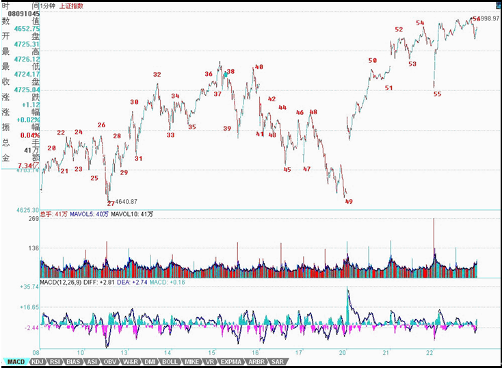

[2007-08-23]行情只会在一地鸡毛中高潮

(2007-08-23 16:08:01)

没有三线股参与的行情，永远都是不完整的，行情只会在一地鸡毛中高潮，没有三线股鸡毛一地的高潮，这种行情，至少在中国特色的市场中，本ID还没见过。这里的原理很简单，一个爱好群众运动的文化中培养起来的投资者，连选秀都可以超女快男一地去鸡毛一把，股票不亦如此，怎么对得起博大精深这四个汉字？

这锅热度如期中升高，三线鸡毛开始满地打滚，这还只是开始，被一线大盘、高价股抛弃了的散户，才正开始撒着步子欢了起来。人类的本质是酒神性的，人的本质中，那酒神的狂欢永远可以战胜太阳的冷酷。狂欢，总是大众的。茅台、五粮液去大众，要困难点，还是二锅头、老白干，更能激发人们心里的野性。如此，股票的高潮，总是老白干的。

有人问，怎么还不说今天突破5000点的历史时刻？5000点算个什么？本ID不是一大早就把股市的20年走势的剧本都告诉各位了？5000点在那剧本中，连一句台词都够不上，有什么可说的？

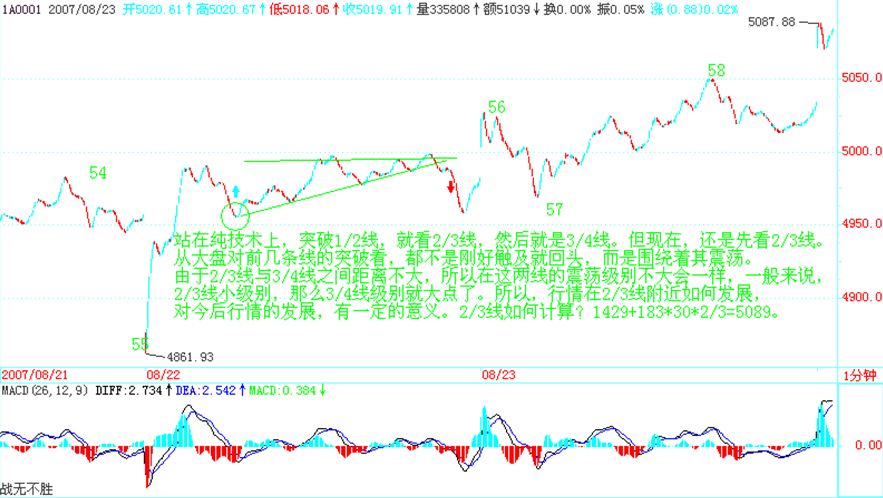

站在纯技术上，突破1/2线，就看2/3线，然后就是3/4线。但现在，还是先看2/3线。从大盘对前几条线的突破看，都不是刚好触及就回头，而是围绕着其震荡。由于2/3线与3/4线之间距离不大，所以在这两线的震荡级别不大会一样，一般来说，2/3线小级别，那么3/4线级别就大点了。所以，行情在2/3线附近如何发展，对今后行情的发展，有一定的意义。2/3线如何计算？1429+183*30*2/3=5089。3/4线，只要把里面的2/3改为3/4就可以。当然，下月计算时，183要变成184，如此类推。

短线技术上，昨天的56，不能100%的那种情况，今天发生了。这说明什么？本ID的理论是几何，没有一种精确的数学态度，是弄不好的。任何有预测癖好的，都离技术之门远着。今天图里，昨天56的位置就要根据这种情况变了。注意，并不是本ID的划分可以随意变，而是因为昨天的走势没有100%满足本ID的划分标准，只是暂时标记。例如，今天59，同样有这个问题，那里标记上59并不是说59在那里已经完成了，因为目前没有满足59段被100%破坏的标准。而58以及以前的所有标准都是唯一的，不可更改的，为什么？因为，符合标准了，就这么简单。这个问题，一就是一，二就是二，没有任何可含糊的地方。

个股方面，给各位一个技术面上的判断标准。现在的个股，日线上无非三种：一、突破530高位；二、没突破530高位但突破530后第一个反弹高位；三、530后第一个反弹高位还没突破。

一般来说，第一种技术条件的股票，注意那些刚突破后回抽确认正再次启动的，这种股票要预防假突破的危险；第二种，属于最有表现欲望的，但这种股票的预防启动突破530高位后有一串洗盘；第三种，最容易吸引踏空资金，但唯一的坏处就是，资金新近来，如果是一个喜欢打压吸货的主，那就要被折磨一段时间，当然，如果是一个喜欢高举高打的，那就祝贺你了。其实，这不难判断，关键是看第一次放量后回抽的位置。

昨天说到本ID更喜欢三线变一线，这种股票，一般人可真拿不住。本ID的股票里就有很多，不过估计没人能真和本ID一样从最低位拿他N年。以后的一线股，都必须是至少是中字头甚至是世界级的公司，要从三线变一线，只有两个途径：一、自己能成长为中字头甚至世界级的公司；二、中字头甚至世界级的公司全面介入。有事，先下，再见。

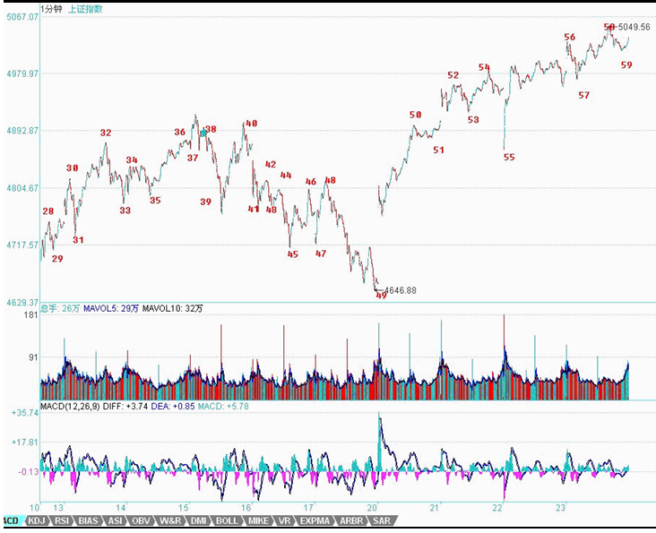

## 教你炒股票73：市场获利机会的绝对分类

(2007-08-23 22:35:20)

说起获利，最一般的想法就是低买高卖就获利，但这是一种很笼统的看法，没什么操作和指导意义。任何市场的获利机会，在本ID理论下，都有一个最明确的分类，用本ID理论的语言来说，只有两种：中枢上移与中枢震荡。

显然，站在走势类型同级别的角度，中枢上移就是意味着该级别的上涨走势，而中枢震荡，有可能是该级别的盘整，或者是该级别上涨中的新中枢形成后的延续过程。任何市场的获利机会，都逃脱不了这两种模式，只是百姓日用而不知，本ID理论而知。

在你的操作级别下，中枢上移中，是不存在着任何理论上短差机会的，除非这种上移结束进入新中枢的形成与震荡。而中枢震荡，就是短差的理论天堂。只要在任何的中枢震荡向上的离开段卖点区域走掉，必然有机会在其后的中枢震荡中回补回来，唯一需要一定技术要求的，就是对第三类买点的判断，如果出现第三买点你不回补回来，那么就有可能错过一次新的中枢上移，当然，还有相当的机会，是进入一个更大的中枢震荡，那样，你回补回来的机会还是绝对的。

很多人，经常说自己按本ID的理论做短差买不回来，这没什么奇怪的。如果你连中枢都没分清楚，级别也没搞懂，中枢上移与中枢震荡也分不清楚，第三类买点就更糊涂，那也能短差成功，只能说你刚好运气好，死耗子摔到瞎猫爪子上了，天上哪能天天掉死耗子？

以上，只是在某一级别上的应用。用同一级别的视角去看走势，就如同用一个横切面去考察，而当把不同的级别进行纵向的比较，对走势就有了一个纵向的视野。

一个月线级别的上涨，在年线级别上，可能就是一个中枢震荡中的一个小段。站在年中枢的角度，如果这上涨是从年中枢之下向中枢的回拉，那么，中枢的位置，显然就构成需要消化的阻力；如果是年中枢之上对中枢的离开，那么中枢就有反拉作用。这都是一个最简单的问题。下面谈论的，是如何选择超大的机会。

人生有限，一个年中枢的上移，就构成了人生可能参与的最大投资机会。一个年的中枢震荡，很有可能就要搞100年，如果你刚好落在这样的世界里，简直是灾难。而能遇到一个年中枢的上移机会，那就是最牛的长线投资了。最牛的长线投资，就是把一个年中枢的上移机会给拿住了。

当然，对于大多数人的生命来说，可能最现实的机会，只是一个季线级别的上涨过程，这个过程没结束，没见到那新的年中枢，人已经没了。这个年中枢的上移过程，有时候需要N代人的见证。看看美国股市的图，现在还没看到那新的年中枢，依然在年中枢的上移中，想想美国股市有多少年了？

所以，对于一个最现实的获利来说，一个季度甚至月线的中枢上移，已经是足够好的一生最大的，在单个品种上的长线获利机会。

一个季度中枢的上移，可能就是一个十年甚至更长的月线上涨，能有如此动力的企业，需要怎么样的素质？即使在全球化的环境下，单个企业的规模是有其极限的。而一个能获取超级上涨的公司，也不可能突破那个极限。因此，顶已经是现实存在了，根据企业的行业，其相应的极限还有所不同。对于操作来说，唯一需要知道的，就是哪些企业能向自己行业的极限冲击。

但针对中国的企业、上市公司，我们还可以给出一个判断，就是几乎所有的行业，都必然有至少一个中国的上市公司会去冲击全球的行业理论极限。这就是中国资本市场的现实魅力所在。因为，几乎有多少个行业，就至少有多少只真正的牛股。

不过，有些行业，其空间是有限的，因此可以筛选出去。这种行业的企业，注定了，是没有季线甚至月线以上级别中枢上移的，除非他转型。因此，远离那些注定没有季线甚至月线以上级别中枢上移的行业，这些行业的企业，最终都是某级别的中枢震荡。这里，就涉及基本面的分析与整个世界经济的综合判断，谁说本ID的理论只管技术的？但任何的基本面，必须在本ID的几何理论的关照下才有意义，在这个视角的关照下，你才知道，究竟这基本面对应的是什么级别、什么类型的获利机会。

找到了行业，就到了具体企业的寻找。对于长线投资来说，最牛的股票与最牛的企业，最终是必然对应的。没有人是神仙，谁都不知道哪个是最后的获胜者。但谁都知道，最终的获胜者最终必然要到，例如10万亿人民币的市值，那么，他的市值必然要经过任何一个低于10万亿人民币的数。

这就足够了，这就马上可以百分百推理出，这个企业，或者是当下的龙头，或者是在今后某一时刻超越当下龙头的企业。有这样一个推论，本ID就可以构建出一个最合理的投资方案。

一、用最大的比例，例如70%，投在龙头企业（可能是两家）中，然后把其他30%分在最有成长性（可能是两三家）的企业中。注意，在实际操作中，如果龙头企业已经在基本面上显示必然的败落，那当然就选择最好的替代者，如此类推。

二、只要这个行业顺序不变，那么这个投资比例就不变，除非基本面上出现明显的行业地位改变的迹象，一旦如此，就按等市值换股。当然，如果技术面把握好，完全可以在较大级别卖掉被超越的企业，在其后的买点再介入新的龙头已经成长企业。

三、这就是本ID理论的独门武器了，充分利用可操作的中枢震荡（例如日线、周线等），把所有投资成本变为0，然后不断增加可持有筹码。注意，这些筹码，可能是新的有成长或低估价值的公司。

四、没有第四，如果一定要说，就是密切关注比价关系，这里的比价关系，就是市值与行业地位的关系，发现其中低估的品种。

注意，任何的投资，必须是0成本才是真正有意义的。

以上这个策略，就是基本面、比价关系，与技术面三个独立系统完美的组合，能这样操作股票，才有点按本ID理论操作的味道。

当然，以上，只适合大资金的操作，对于小资金，其实依然可以按照类似思路，只是只能用简略版，例如，就跟踪龙头企业，或者就跟踪最有成长性的那家。

当然，对于原始资本积累的小资金，利用小级别去快速积累，这是更快速的方法，但资金到一定规模后，小级别就没有太大意义了。

有人可能说，你怎么不说政策面？政策面那种玩意，不过是制造最多是周线级别的震荡，这正是提供技术上降低成本、增加筹码的机会。1929年、二次世界大战，都没改变美国股市年线级别的中枢移动，政策面又算得了什么？

第73课读后感：

1、任何市场的获利机会：中枢上移与中枢震荡。

2、在你的操作级别下，中枢上移中，是不存在着任何理论上短差机会的。

3、中枢震荡，就是短差的理论天堂。

4、用同一级别的视角去看走势，就如同用一个横切面去考察，而当把不同的级别进行纵向的比较，对走势就有了一个纵向的视野。

5、政策面那种玩意，不过是制造最多是周线级别的震荡，这正是提供技术上降低成本、增加筹码的机会。

[2007-08-24 ]不是每个收盘都需要一个题目

(2007-08-24 15:24:47)

今天，一开盘，首先冲到5088点，在5089点的2/3线面前整理了30分钟，然后就就突破该位置，后面基本是一个震荡，毕竟下面缺口的压力在。突破站稳1/2就到2/3，这今天实现了。下面要继续完成的任务是站稳2/3线，这是继续上攻3/4线的前提。

周末消息面很重要，如果没什么特别的东西，那么下周有一个好开头，但下周决定月线收盘，因此，下周的任务是，不能拉太大的阴线，其余的任何情况，都是可以接受的。下周，比较理性的作法，是在目前位置稳固5089点的2/3线，一般来说，这种线的突破，都至少需要周线上的确认，各位可以看看3000点与4000点对1/4与1/2线的突破就知道了。当然，如果大家一定要很冲动，要下周马上就去挑战3/4线，那周末可以先听听那首极端口水的《冲动的惩罚》。

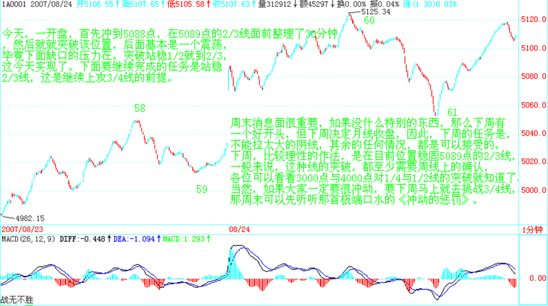

个股方面，热点继续表演。但基金之类正规部队与游资等负规武装之间的争夺资金较量，今天有点火花了。和气生财，都别闹了。排好队，姿势优美点，能面首的自然会被面首的，和为贵。

昨晚说了那课程，可能有人会说本ID自己那10来只股票里没什么行业龙头、高成长性，不符合本ID昨天课程说的。这只是不同的眼睛看出的不同景象。首先，最明显的，000338不是龙头？600649不是？000999不是？000998不是？000777不是？甚至，连600432、600343、000099、000778，哪个不是细分行业的龙头？知道000778是离心球墨铸铁管的世界第一吗？知道离心球墨铸铁管在干什么的吗？知道全世界发达地区，排水管道用的什么？知道全中国就算排水管道更新一次，需要多少吗？知道除了排水，城镇供水输气也用着玩意吗？当然，000778还不止这些东西，知道新兴这两个字代表了多少东西吗？其他股票也一样，就不细说了。

要注意，本ID的股票可都是在极为低的位置说的，例如，000778，说的时候只有5元多，现在再买，同样的钱只能买1/3的股票不到了，这确实没办法，迟来的人，肯定要付出更大的代价，这是天经地义的。而且，这10几只股票都是去年12月底才开始说的，本ID之前买的股票可基本没怎么说过。本ID的原则就是，本ID说的时刻就是自己买的时刻。想想000999，难道忘了，本ID说有一笔新钱，过两天到，还提前先把000999给说了，这里应该有人买得比ID还便宜，例如5。9元买的。当然，本ID买那个量，建仓成本肯定比一般的散户高，早一天晚一天没什么大事。关键是后面把成本变0的本事，这一点，本ID自认天下第二，这天下就没第一了。当然，成本为0，持股决心自然也天下第一，600432，20元这里不少人买过，就半年多时间，现在谁还有？本ID可一股还不少。000338，明确告诉，肯定上100的，现在估计也没人有了，其实，这股票，100根本不值一提，想想他在行业中的地位，想想这个行业的规模，你就知道，为什么他有动力了。

周末，股票是一件最恶心的物件。都别股票了，腐败去吧。祝全世界想腐败的人终能腐败。

腐败快乐万岁万万岁。下了，本ID要去为腐败事业添砖加瓦。再见。

[2007-08-27]资金分歧日益严重的面子与里子

(2007-08-27 16:15:38)

现在，行情已经演化成这样一种格局，基金等正规部队与游资等负规武装之间展开博弈。对于基金来说，由于新鲜血液不断进来，因此，只要坚持自己的板块，就算来个五十年不变，也有新的血液进来筑成他们的长城；而对于游资来说，有不少这次是踏空的。530后，很多游资利用第一次反抽胜利大逃亡，结果不过逃了一个山脚，回头一看，什么都和他们没关系了。由此可见，游资的视角上和基金比起来，是极为短视的。当然，基金都是被正规所忽悠的人的钱，用着不心疼，就算10000倍市赢率买所谓的大盘蓝筹，也可以编出无数的理由，更不用说现在大盘蓝筹的市赢率还有很多连50都不到，至少还有200倍的忽悠空间，所以基金的长视显然是可以有恃无恐的。

游资不愿意为基金抬轿子，只能各自为战去攻击一些所谓的题材股。但这种攻击，还是有效的，因为这些所谓的题材股，基本都是中低价股票，所谓群众基础好。资本市场的管理是绝对不能走群众路线的，一走群众路线，那肯定是垃圾股满天飞。

所有的所谓成熟市场，都是分为泾渭分明的两个世界，就是正规为主的所谓蓝筹世界与负规为主的垃圾世界。这点，不用看远的，看看香港市场就知道。在资本市场，同一世界同一梦想，从来都是笑话。仙股能和汇丰长实同一世界同一梦想吗？这是世界的常态，但中国的资本市场，从大锅饭里来，总还有那无聊的做作。总是有人在资本市场也要一刀切，要问什么蓝筹垃圾，宁有种乎？

但这种游戏，最终都要被改变的。拣垃圾，在垃圾堆里寻宝的是一拨人；拿着蓝筹自渎的是另一拨人。两拨人将越来越老死不相往来，这才是最终的归宿。

现在，正在半路中，那些基金们，其实血液里也没有多少蓝筹的贵族气息，所以，偶尔混在垃圾堆里，反而觉得比较匹配；那些负规们，本来就是开野店的料，却还左摇右摆装名草，这样，行情，依然在这种边界的模糊两可中展开。

基金，不需要在二级市场骗人接筹码，而是公开地，无数人排着队争先恐后地进来成为新的举重能量。其实道理上一样，只是把赤裸裸的变成了道貌岸然的。而负规部队们，注定名声不会好了，但他们也从不在乎这玩意。负规可以潜规则正规，如此的中国特色，怎么也要特色N年，这样的负规，又有什么可抱怨的？

所谓的资金分歧，其实只是表面现象，给分歧掉的资金，不过都是不入流的资金。8228、2882，其实还不都是那唯一的一？

技术上，今天没什么可说的。回抽5089点，如此而已。当然，5089是否一天回抽就能确认，这显然不大可能。但行情完全可以先上攻，再以周线等形式进行回抽确认。当然，行情具体怎么走，没必要预测，看图作业就可以。

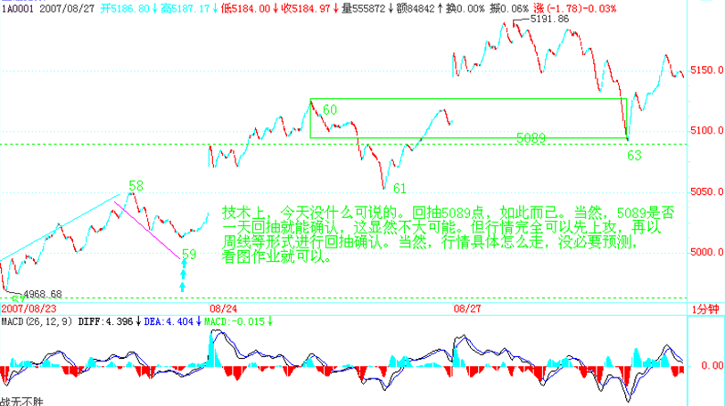

图形上，49点开始的走势简直是教科书。52-55的1分钟中枢，55-58的线段离开，58-59的回抽不跌回形成1分钟的第三类买点。然后，后面唯一的两种可能，更大级别中枢，与继续中枢上移直到出现新的1分钟中枢。显然，走势选择了后者，目前，可以暂时把这新的1分钟中枢看成是60-63。因此，从短线看，从49开始的1分钟上涨走势什么时候结束，就是短线唯一的主题。这相当简单，学过本ID课程的都应该怎么处理，应等待什么，那什么一出现，就该如何。（什么是什么？权当一个作业，这都不会，请复读。）

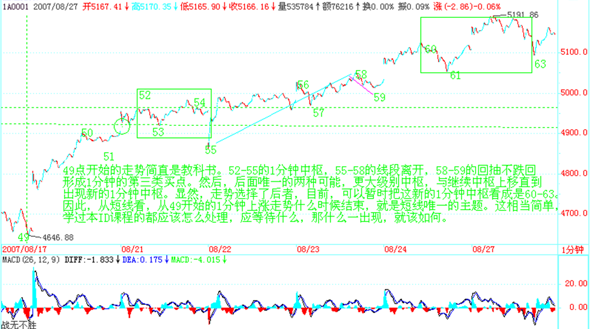

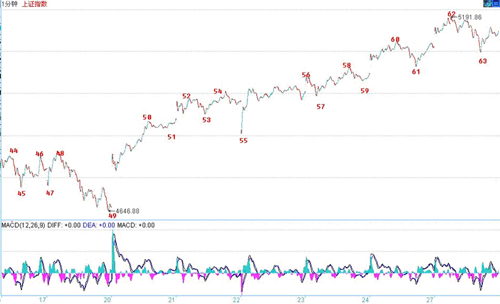

个股方面，有些人相当奇怪。竟然可以有这样的逻辑，例如对600139，他们意思是，如果不被洗干净，就不会有今天了，所以是本ID在犯坏，要把他们都给洗出去。然后这些人又在开始唠叨什么什么怎么还不怎样怎样，这些人，最该干的事情就是拿豆腐撞头去。知道本ID课程里对以前已经有的技术分析系统只说了均线系统吗？知道本ID在课程里说过，没有吻就没有高潮之类的话吗？均线系统没有粘合之前，怎么可能有单边的拉升？600139这种典型的a+A+b调整后，然后一吻高潮的走势，难道本ID在课程里没说过？就算今天的600343、000600，难道没看到前面消魂一吻吗？就算中铝这种上市没多久的，7月20日前后那一吻，请问够消魂否？

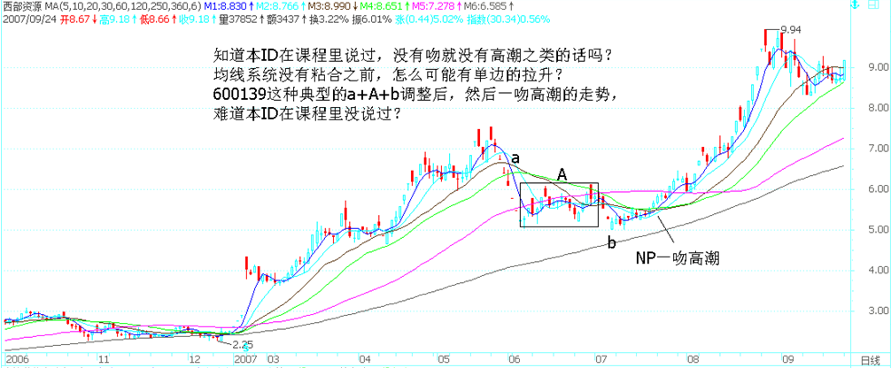

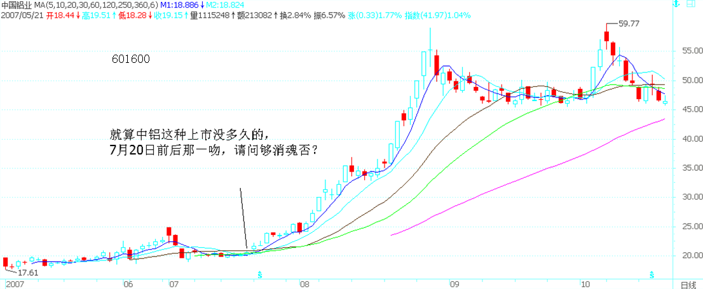

更奇怪，有人怪本ID不提前告诉中铝，30元才开始说。说老实话，本ID确实没有说任何个股的兴趣，任何个股，就算是天天暴涨的，也同样有怨大头。而且本ID现在又不当庄家了，说了明显就给自己添麻烦。有些股票知道为什么洗那么长时间吗？其实可以明确地告诉各位，就是在洗本ID。但那些家伙都是脑子有毛病，你想本ID能被他们洗出去吗？简直脑子锈了。但无论如何，不管是谁干什么，技术是第一的，任何最终都在技术图表上显现出来。如果你能成为吻的高手，那自然就能不断消魂，该说的早说了，如果吻这么私人的事情都想让别人替代去实践，那么还是买块豆腐去吧。先下，再见。

[2007-08-27]冲动的惩罚，基金将成为毁掉市场的那只手

(2007-08-27 20:45:41)

冲动的惩罚

基金将成为毁掉市场的那只手

上周末，本ID说请先听听那首极端口水的《冲动的惩罚》。那么，最近这一轮行情，发展成这样，已经越来越挑战到某些底线。

现在的问题，在下午已经说得很明确，基金利用所谓正规的身份，正制造着泡沫行情。超GDP，就是进入泡沫行情，这点，本ID在前面已经反复说得十分明确。那么这个泡沫如何才会被刺破？

显然，目前的情况下，泡沫不可能因自身破裂，基金目前这种资金正循环关系，使得泡沫可以维持相当长的时间而不破裂。

显然，在中国目前的环境下，刺破泡沫的，只有政策。而最近政策的声音，比起行情超乎寻常的安静，这只有两种可能性：一、政策并没有觉得目前的行情有太大问题。二、暴风雨前的安静。

政策这种东西，无法预测，上周连续两天的调控至少表明，政策面至少没有资金面那样乐观。

本ID在超GDP后，就明确说过，不再买入任何股票，而只是持有，并把可能的资金转向其他领域，最主要的原因，就是这种泡沫行情的破裂方式，其非系统性风险并不在任何人的控制之下。

今天，本ID偶尔发现，有些从1000多点就开始唱空的人，有开始松口的迹象，这给本ID特别不好的感觉，连死空头都开始转向，这风险确实已经开始如一切风险般积聚了。

可以肯定地说，如果没有政策的刺破，一切都会如基金们的如意算盘般继续下去，但冲动总要被惩罚的。惩罚来自明天、后天，还是N天后，那只有天知道了。

但一个市场，如果发展到只有惩罚才会停止下来，那就如同一个失控的车子，究竟要发生什么，那只有天知道了。

一些死空头转向，给了本ID相当不好的感觉，一叶知秋，秋天，大概也不远了。

## 教你炒股票74：如何躲避政策性风险

(2007-08-28 08:41:11)

政策性风险，属于非系统风险，本质上是不可准确预测的，只能进行有效的相应防范。

首先，中国政策性风险将在长时间内存在，这是由目前中国资本市场的现实环境所决定的。一个成熟的资本市场，应该是重监管、轻调控，而目前中国的资本市场，至少将在很长时间内，监管和调控都至少是同等重的，甚至，在一些特定的时期，调控将成为最重要的方向。这是客观现实，是由中国经济目前的发展阶段所决定的，其实并不是任何人故意要这样的，所以，任何对这的指责，其实都是有毛病的。

调控，有硬调控与软调控两种。像发社论、讲话、严查之类的，就是明显的硬调控，这种调控方式是否永远不再发生，这谁都不敢保证；至于软调控，就是调控中不直接以资本价格为最直接的目的，而是结合着更多大的方面考虑，政策上有着温和和连续的特征。

当然，站在调控的角度，如果软调控不得力，那么硬调控成为唯一选择的时候，这其实不是调控者的悲哀，而是市场的悲哀，当市场的疯狂足以毁掉市场时，硬调控也是不得以为之。这方面，也要对调控者有足够的理解。

有一种很错误的说法，就是中国的调控只调控上涨，不调控下跌，其实，站在历史实证的角度，这种说法是没有事实根据的。因为，实际上，调控下跌的情况一点都不少，最著名的，就是1994年的325点，那三大政策的缺口，现在还在那里，这难道不是对过分下跌的调控吗？只不过，那是一次最成功的调控，而对下跌的调控，或者说是救市，经常都很失败，这只能说明调控的水平需要在实践中不断提高。

必须旗帜鲜明地反对这样的观点，就是调控者都是坏蛋，散户都是受害者，机构都是串在一起和调控者一起算计散户的。这不过是一些市场的失败者或别有用心者的无耻谰言，根本没有任何事实的根据，纯粹出于自我想象。

一个政策的出台，决不是任何一个人拍脑袋就可以决定的。任何一个体制下，只要是一个体制，就有均衡，那种个人任意超越体制的事情，已经越来越没有发生的可能。而且，散户、机构都不是一个抽象的名词，企图用抽象的名词掩盖一个个现实的实体而达到互相斗的结果，不过是某些运动逻辑的僵尸版。

其次，必须要明确，政策只是一个分力，政策不可能单独去改变一个长期性的走势。例如，就算现在有一个硬调控使得中短期走势出现大的转折，但最终也改变不了大牛市的最终方向。政策只有中短期的力量，而没有长期的力量，这点，即使对经济也是一样的。经济的发展，由经济的历史趋势所决定。中国经济之所以有如此表现，归根结底，就是因为中国经济处于这样的历史发展阶段，任何国家在这样的阶段，都会有类似的发展。但并不是说政策一无所用，一个好的政策，是促进、延长相应的历史发展进程，是一个好的分力。

所以，政策是一个分力，是作用时间和能量不是无限的，而且，政策也是根据现实情况而来的，任何政策，都有其边界，一旦超越其边界，新的政策就要产生，就会有新的分力产生。而且政策分力，即使在同一政策维持中，也有着实际作用的变化。一个政策，5000点和1000点，效果显示不可能一样。

明白了政策的特点，对政策，就没必要如洪水猛兽，以下几点是可以注意的：

一、一个最终结果决定于价格与价值的相关关系。当市场进入低估阶段，就要更注意向多政策的影响，反之，在市场的泡沫阶段，就要更注意向空调控的影响。

二、最终的赢利，都在于个股，一个具有长线价值的个股，是抵御一切中短分力的最终基础，因此，个股对应企业的好坏与成长性等，是一个基本的底线，只要这底线能不被破坏，那么，一切都不过是过眼云烟，而且，中短的波动，反而提供了长期介入的买点。

三、注意仓位的控制。现在透支已经不流行，但借贷炒股还是不少见。这是绝对不允许的，把资本市场当赌场的，永远也入不了资本市场的门。在进入泡沫化阶段后，应该坚持只战略性持有，不再战略性买入的根本原则，这样，任何的中短波动，都有足够的区间去反应。

四、养成好的操作习惯。本ID反复说了，只有成本为0的，才是安全的，这大概是彻底逃避市场风险的唯一办法。

五、贪婪与恐惧，同样都是制造失败的祸首，如果你保持好的仓位，有足够的应对资金以及低成本，那么，就让市场的风把你送到足够远的地方。你可以对政策保持警觉，但没必要对政策如惊弓之鸟，天天自己吓自己。

六、不要企望所有人都能在硬调控出台前提早一天跑掉。可以明确地说，现在政策的出台的保密程度已经和一切大为不同，很多政策的出台，都是十分高效保密的，当然，一定范围内的预先，那肯定是有的，但这种范围已经越来越小，而且，经常能够反应的时间也越来越小，对于大资金来说，那点时间，基本无效。本ID可以开诚布公地说，现在政策的公平性已经越来越高，有能力预先知道的，资金量小不了，因而也没足够的时间去全部兑现，这在以前，有长长的时间去组织大规模撤退，那决不是一回事了。

七、必要的对冲准备，例如权证等，最近，认沽热销，也和一些资金的对冲预期有关。

八、一旦政策硬调控出现，则要在一切可能的机会出逃，在历史上，任何硬调控的出现，后面即使调整空间不大，时间也少不了。

九、关键还是要在上涨时赚到足够的利润，如果你已经N的平方倍了，即使用一个10-20%地去留给这飘忽不定、神经叨叨的非系统风险，那还不是天经地义的事情？成为市场的最终赢家，和是否提前一天逃掉毫无关系，资本市场，不是光靠这种奇点游戏就能成的。心态放平稳点，关键是反应，而不是神经叨叨的预测。

第74课读后感：

1、政策性风险，属于非系统风险，本质上是不可准确预测的，只能进行有效的相应防范。

2、政策是一个分力。

3、成本为0是防范风险的高效方法。

[2007-08-28]市场与政策的博弈全面展开

(2007-08-28 16:10:20)

今天的市场，在技术上十分简单，就是本ID昨天所说的那1分钟中枢的震荡，而要形成新的上攻，就要看是否形成该1分钟中枢的第三类买点，然后，最关键的，因为从49开始的走势已经是标准的1分钟上涨，所以该上涨结束的信号，就是背驰，因此，背驰段能否被精确定位最终形成背驰，就是今后几天走势的关键。而且，这1分钟的背驰后是否引发更大级别背驰段的精确定位，则是今后几周最关键的问题。

从基本面上看，目前市场与政策的博弈已经全面展开。有些话，不能说、不该说的就不说了，可以说的就是，目前有些后进的资金以及某些用市值营销为幌子的正规基金，正在玩一种危险的游戏，这种游戏的名字，叫与政策博弈。

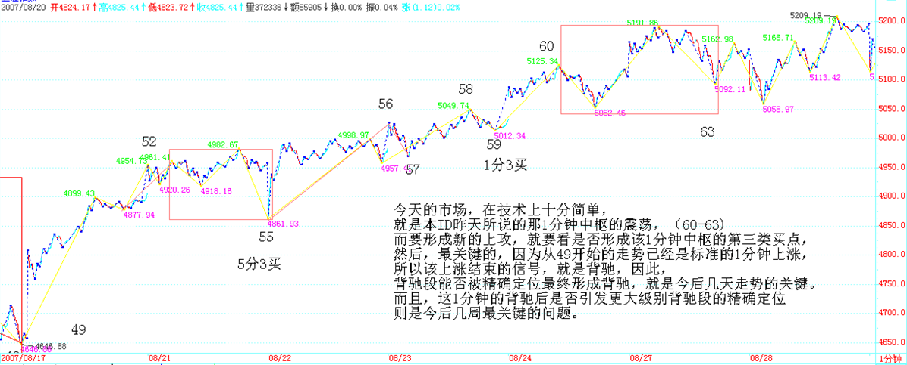

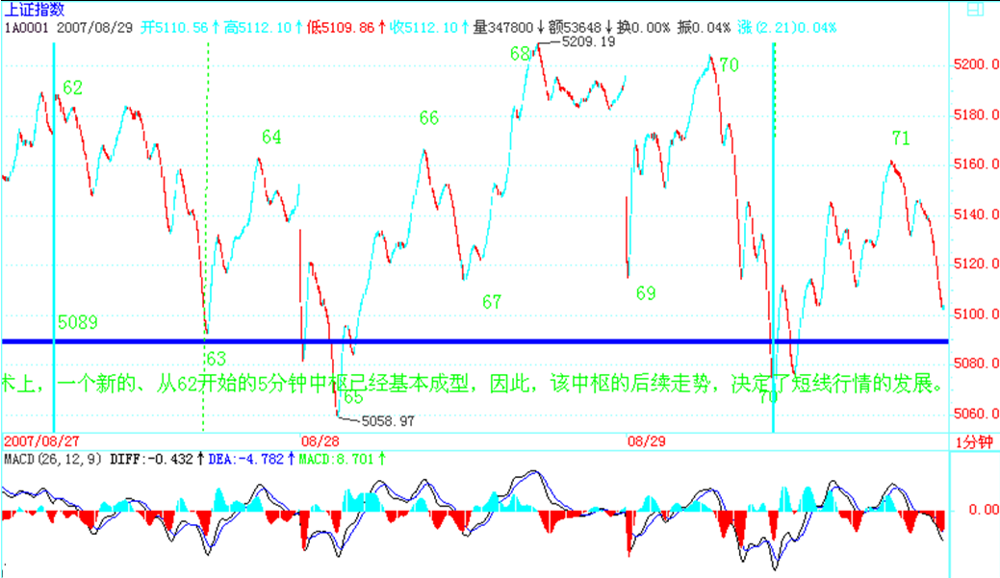

显然，至少在他们看来，现在存在与政策博弈的空间。第一、一个最重要的会议将在不久后展开，他们认为这时候的监管可能会有空隙；第二、目前以一线股行情，最终会有指数期货托底；第三、H股、红筹与A股对做，这样两头促进，两头赢，A股估值高，使得H股、红筹有空间，而后者一涨，前者又有了涨的理由。（当然，这点本ID是同意的，也是乐意，否则本ID为什么要钟情于中字头，今天，最懒之一的中字头中国人寿也动起来，本ID还是比较满意的。）；第四、有些理由，只可意会，不可言传。

而管理层方面，确实存在两难状态。硬调控一旦起用，则又陷入530之类的困局。而软调控，其力度又被市场所藐视，达不到其目的。所以，管理层方面，有时候有些事情也是被迫的，只是那条底线不要被触及，一旦触及，站在公正的角度，本ID觉得，硬调控也是可以原谅的。

现在，这种博弈的难局的化解，靠市场的所谓理智是不现实的。市场从来都不会是理智的，而且某些资金，说白了，花的不是自己的钱，不心疼，只要能潜规则一把，什么不可以？所以，不要冀望于市场的理智。最终的结局，无非两种：

一、市场因为一些因素自动不去触及某些底线。例如，美国的那破事情又起第二波，这样，全世界都自然顺着带下来，这样，死局反而可以自然解开了。

二、市场变本加厉，最终触及某些底线，甚至，有些局面可能是被担保、求情下才出现的，而给脸不要脸，那最终只能搞到翻脸，这又能怪谁呢？

从某种意义上说，现在所有人交易成本的大幅度增加，就是给脸不要脸所制造的结果，现在，虽然指数是上来了，但交易成本的大幅度增加的结果却在可见的将来都改变不了了，最终损害的就是整个市场。

现在，诸如印花税减半的东西，提都没法提了。本来想搞这些提案的人，自己都不好意思了。现在，这么高的印花税，就是中国资本市场所有参与者的共业，这叫自作自受，那么，还要有多少在后面等着？

本ID对目前的状况已经一早说得很清楚，就是那些在3600点要毁掉市场的人、那些3600点要死要活的人，将会在大涨百分之N十后就开始兴奋，开始忽悠他们的英明神武。目前，5200点时，这种情况已经变成现实。特别，一些1000多点就开始死空的翻多更证明了，事情已经到了该警觉的地步。

本ID从本质上只关心市场结构的完整与合理，本ID最不愿意看到市场的结构被有意无意地伤害。市场的伤害，最终都会转嫁到市场参与者头上来。

正像在3600点最恶劣的时候，本ID会出手；当市场发展到完全失控时，本ID一样会出手。本ID有能力在3600点凭空接巨石，当然也有能力干其他活。本ID干活，从来都是明说明干，春节前后和3600点已经成为K线在那里了，本ID无须说明或证明什么。

本ID的目的只有一个，希望本ID能制造一个分力出来，让市场不去触及某些底线，从而使得类似印花税等如此伤害市场的东西不被现实。

有些话，多说也没用，该出手时就出手，本ID有这个权利。

本ID可以把话说得更明白，任何与2/3线相关的活动，本ID都可以接受，任何企图快速抛离3/4线制造多头陷阱的活动，本ID都不能接受。够清楚没有？

不说了，先下，再见。

[2007-08-29]有时候，当乖孩子并不是丢人的事。

(2007-08-29 15:54:01)

昨天说了，如果美国那破事还能搞一次，可能是化解死局的好选择，昨天美国的大跌，来得够及时。本ID说了，任何和2/3相关的活动，本ID都是乐于见到的。

有时候，当乖孩子并不是丢人的事。今天，那漂亮50，集体耷拉，这是好现象。该休息还是要休息，整天瞎搞，小心精尽人亡。

其他个股，借着漂亮50休息而风起云涌一把，这也是天经地义的事情。

技术上，一个新的、从62开始的5分钟中枢已经基本成型，因此，该中枢的后续走势，决定了短线行情的发展。

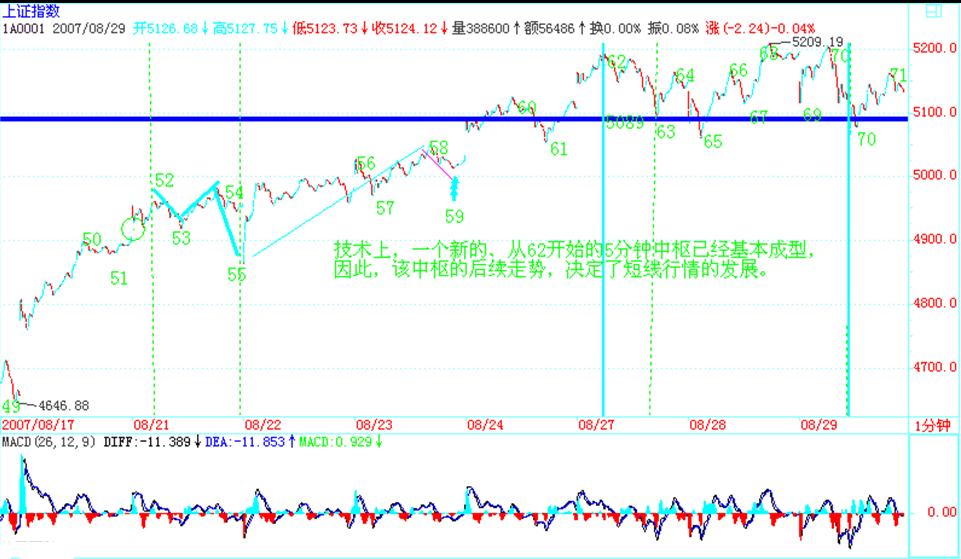

说实在话，除了快速突破3/4线直接上攻6000点形成多头陷阱这样一种走势本ID不能接受外，其他任何的走势，本ID都能接受。

说实在，这两年的行情，根本不火暴，比起1996年，简直没法比。那次，1年半就从1000点冲到6000点上，那次表现的是深成指。这次，走了两年多了才到这个位置，乌龟都不如。但现在市场大了，影响大了，婆婆也多了，所以只能这样。

6000点会有的，10000点会有的，30000点也会有的，但不是一天去完成。欲速则不达，有时候当当乖孩子，作乖乖状，又有什么大不了的？何必一定要去挑起不必要的麻烦？

可以很明确地说，如果不是某些努力，昨天早就已经尸横遍野了。有些事情没必要说，只要知道，一切都是合力而成。但有时候，太过分了，那就只有对立面了，把自己逼到墙角，又何必呢？

目前的市场，成分已经越来越复杂，本ID更相信一件事情，就是任何良好的愿望，在一个市场里，最终都要被践踏的。在现实中，死缓总变有期，在市场里，死缓往往就是绞刑变凌迟，人的贪婪总有最大的疯癫基因。

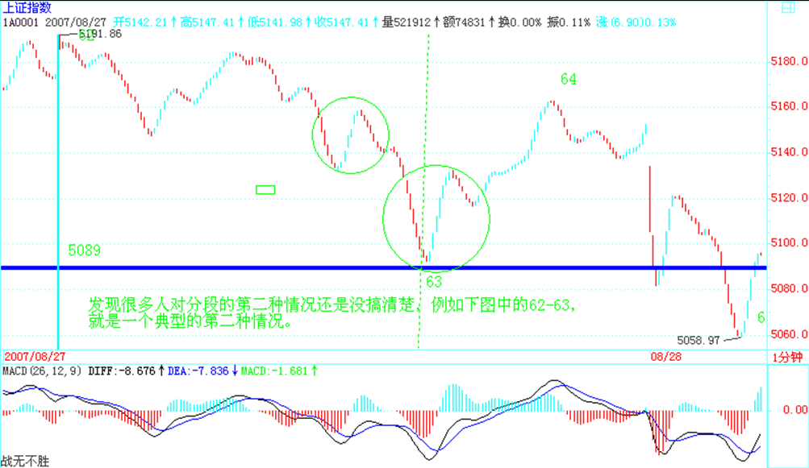

最后说句闲话，发现很多人对分段的第二种情况还是没搞清楚，例如下图中的62-63，就是一个典型的第二种情况，各位请好好研究一下。

最近整天下午晚上都泡在北京那几个高新园区那里看项目、谈项目，有点忙，不能和各位聊天了。先下，再见。

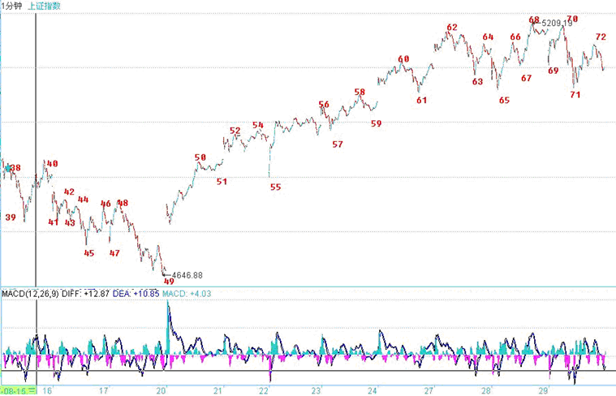

## 教你炒股票75：逗庄家玩的一些杂史1

(2007-08-29 22:00:23)

当然，以下这些，都是本ID胡言乱语，梦话连篇，各位就当笑话看，谁当真谁有毛病。

说故事，不过让各位认识一下市场运行中一些更深层次的东西。走势是由合力构成的，但各分力后面代表的，都是真实的、有思想有感情的人，因此，了解一下一些心理层面的东西，还是有好处的。

当然，对于一般散户来说，多了解一点事情，并不能改变对走势完全严格客观的态度。为什么？因为对于一般的散户，其影响力对于合力可以完全忽略不算，因此，其操作，当然就可以完全只看合力最终的结果，而不需要关心每一刻合力所对应的各分力间的博弈。

但人必须有远大的目标，不想成为大资金的散户，就如同不想成为元帅的士兵。最终能否达到，这和每个人的悟性、修炼、机缘等等密切相关。但有时候结果并不一定太重要，过程往往更加美好。如果说到结果，任何人的结果都是咸鱼一条，因此，任何人都没必要有任何负担与畏惧心理。只要按照正确的道路，就算最终只能登到山腰，也不枉这一行了。

市场上，存在一些资金，是可以影响到最终的合力的。实际操作中，资金量当然很重要，但更重要的是技巧，打仗还有以小胜多的，有时候，1/10资金制造的效果，比10倍资金的都大，这就和操作者密切相关了。简单起见，这里只说在具体个股中的操作，对于大盘的操作，涉及的复杂程度大幅度增加，而且，这一般也不是一个人能完成的，都是一些集团式力量的结果，能领导其中，更需要很大的人格凝聚力与历史信任感，这都不是一年半载能够达到的。

个股操作，涉及对合力产生影响的，无非两类资金，一种就是庄家，一种就是玩庄家的人。一般的误区总是觉得，庄家就最牛了，庄家如何如何凶煞，如何如何吃人不吐葡萄皮，其实，都是人云亦云的无聊玩意。确实，有不少所谓的庄家成功过，但有更多的庄家给搞死了，死的庄家比最终活下来的多得多。庄家被搞死，有很多种原因，其中一种很常见的，就是给玩庄家的人搞死的。

市场里有一种这样的人，这种人的资金实力当个庄家肯定是一点问题都没有，而且一般来说，这种人以前都是牛庄，但后来，因为证券法之类的法律出来，不想惹事，或者就太懒了，天天去算计散户太累，还不如一下算计一个大家伙，吃一顿够N顿了，或者就是无聊，看着别人当庄，就是想搞死，赚不赚钱倒是次要，一般这种人，钱早不是问题，纯粹是为了开心或者就为了教训一下暴发户。

一般来说，这种人在资本市场里都有着最广泛的信息网络，这都是从资本市场从小苗开始就缠上的，如藤倚树，这资本市场的树长多大了，这藤也跟着绕了多少。一般来说，这市场上的大的动静，一般都逃不过这些人的眼线耳线。由此，这些人都能很快知道，又有什么猎物可以爽上一把了。

如何圈定猎物，这并不一定有任何固定的原则。当然，有些人比较死板，或者在这行里还是新手，所以比较注意攻击目标，至少不敢攻击太垃圾的东西，否则万一搞砸了，连回旋的余地都没有。但对于老手来说，其实都无所谓，股票不过是一个游戏的凭证，玩烂了也无所谓，大不了来个凤凰变乌鸡、乌鸡变凤凰地来回折腾几次，还不是越搞越有搞头？

说句实在话，搞股票，归根结底是搞资源组合的能力，功夫在诗外，组合能力强，资金能长期坚持，有什么不能成功的？本ID有一个不大好的习惯，就是对被搞废掉的人，从来都不关心，但这两年，本ID不断发现，有好几个N年前，注意，这个N有的都快到10了，被本ID搞废掉的，竟然都坚持到了大牛市，都成了这两年最牛的股票之一，一打听，人还是那些人，歌还是那些歌，这些人身残志坚地把N年的生命都奉献给了某只股票，连本ID都不得不说，人的无明之力，真是老强大，佩服佩服。

为了表彰这些残废人士的惊人业绩，本ID对其中几只不点名地表扬一下：

一、那年夏天后，最后的一吻，市场就走入漫漫熊途，你也留下一个个向下的惊人缺口，大概除了本ID，没有人知道你的痛苦，那高高的山冈，你只能用一个个除权缺口去追赶大盘下跌的速度，你在最悲壮时，依然站在实际的山腰之上，离那令你疼的顶峰依然不远。终于，你熬过那最后的血腥，春天来了，猫儿又开始叫春了，你跨过那一个个的缺口，冲出那曾经绝望的顶峰，原来，山峰之外依然有山峰，你应该释怀了。

二、山顶到山谷，90%多的落差并不一定是故事的终结。后来，你终于明白，在山谷回到山脚后，继续半年就可以飞升1000%，就可以走上更高的山峰，这时候，这N年的煎熬，大概就是最好的人生回忆了，你现在最感谢的，是否就是那N年前给了你最好回忆机会的人？

三、惨跌80%多依然能站住的，才能引来2000%以上的升腾，本ID不会为曾经的残酷而有丝毫歉疚，但为了这能站住的，本ID给你四字：还算爷们。

四、当你用一字涨停铺起台阶冲破所有顶峰时，又有多少人知道你N年前的痛苦？那些台阶已经名喧天下，而N年的那些日夜，究竟是什么缝补那颗破裂的心？粗略看了一下，最大跌幅94%，真是梅花香自苦寒来啊。

不要以为，庄家就是好差事，一般的散户，有上面四位优秀吃苦耐劳模范的一点功力，你想不成功都难了。看看人家，94%还可以梅花香自苦寒来，那些被N天半月洗盘就搞得精尽人亡的，还不如去买豆腐回家算了。

能熬住的少，熬不住的，最后都给人做嫁衣裳，那些在大峡谷底买货的新人，要知道，这些骨头里，可能最多的，就是所谓庄家的。看着100元的000338，本ID就仿佛看到那铁窗下那唐家兄弟的灰影，这里，就再重温一下，本ID在000338最低那天贴出来的五言诗偶见湘火炬广告牌，口占五绝。 （2007-05-15 15:14:19），有人可能又要问，为什么那天以后，就没有那个位置了？因为，如果还有那个位置，天都要哭老的。

搞死庄家，首先对其资金面、来路等等方面有充分的了解。那些光有几个钱，靠收买了个把刺史、郡守就蚁假猫威的暴发户，是最该收拾、也最容易收拾的。一般来说，资金上的弱点是攻击的最好前提。当然，资金没什么弱点的，也可以攻击，特别是那些水平不高的新庄家。在市场上，新人新猪肉，被吃是天经地义的。还有一种，就是刚成功了一把正在G点上G着的，这种是绝佳的猎杀对象。

当然，有些老狐狸，也是可以攻击的，但一旦介入，就要准备好长期作战。所以，除非有特别的理由或特别没事干，要找点乐，否则，一般不和老狐狸们玩。但实际上，本ID经常不遵守这个所谓的一般。

晕，回头一看，这梦话也说得老长了，下次再继续说吧。

[2007-08-30]还你漂漂拳之风再起时

(2007-08-30 16:05:43)

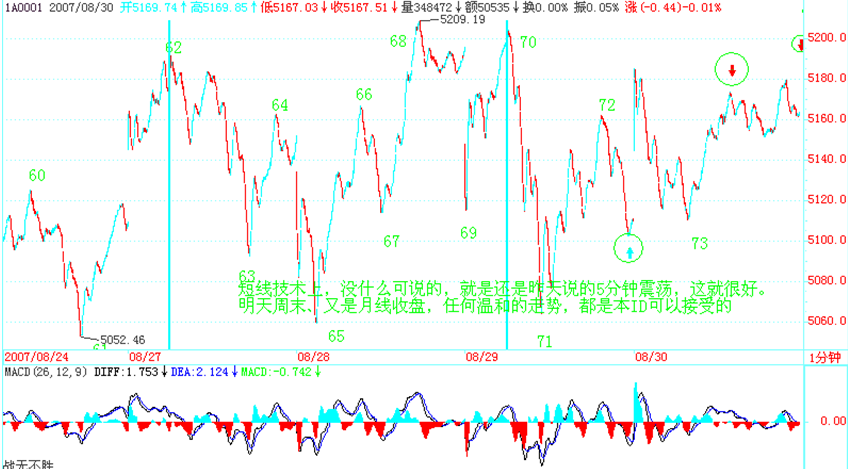

漂亮50歇菜是好事还是坏事，如果昨天早上还没看明白，那还是可以原谅的；看了本ID昨天下午的“其他个股，借着漂亮50休息而风起云涌一把，这也是天经地义的事情。”还不明白，那最好的归宿就是孔男人一把；如果到了今天还不明白，大概连孔男人都对你绝望了。

还你漂漂拳之风再起时，什么风？二、三线股之风，让指数见鬼去，重开上半年二、三线股走势之风。还你漂漂拳，将二、三线股的丑八怪打出一个个大可面首的成熟爷们，这就是还你漂漂拳之风再起时。

什么叫一吻高潮？看看600635、000998、000938、000099、600578、000915等等，哪个不是吻得万草狂舞、风沙走石、天昏地暗、日月无光的？就算最近开始狂动的600008，在8月20前的那一吻，还不够万草狂舞、风沙走石、天昏地暗、日月无光？你去看看今天涨停的股票，有多少是一吻而万草狂舞、风沙走石、天昏地暗、日月无光的？还记得几天前本ID再次强调吻的重要，难道吻都要别人代替？

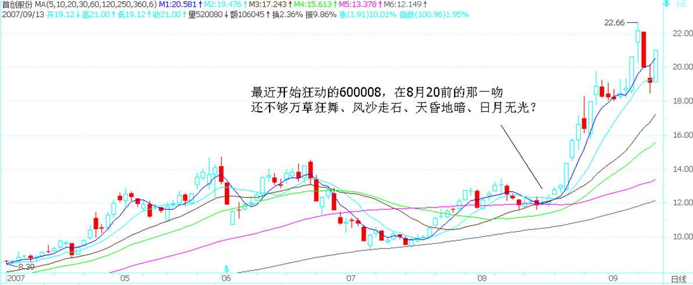

以上只是技术上的一些小技巧，以后不再说了，有缘得之，爱谁谁去。

现在，初步回到本ID希望编排的剧本，这剧本在这一章节只有一句话：指数耷拉，二三雄起。指数耷拉，将使得一些极为迫切解决的矛盾不会一下被激化，而二三雄起，又可以消耗目前一些多余的能量。记得本ID在8月13日的话吗？原文：“个股方面，一、二线成分股的行情依然会延续，但要注意升幅过大后的短线震荡风险，而当业绩风险释放后，二、三线题材股会找到重新活跃的动力。”

现在，中期业绩的公布已经尾声，该发生的就需要发生。而本ID为什么前几天狂批“快男”，就是他们的节奏有打乱本ID剧本的可能，对这种拿着别人钱乱搞之人，不教训一下怎么行？

本ID的持有结构十分明确，就是中字头和那10几只谁都知道的二、三线股，中字头，如中铝者不愿意休息就让他休息，顺便差价一番，这没什么不对的。当然，站在中长线角度，这些中字头的潜力远远没有发挥出来，本ID乐意和他们海枯石烂，但现在，本ID觉得4N9一下二、三线股，难道不是一件很浪漫的事？

大环境，本ID已经说得很清楚，就是警报声声，而且还一度几乎擦枪走火，这时候该干什么，所有对市场的长期有珍惜的人，都应该明白。市场的做多能力没地方宣泄，就找地方让他们宣泄，而不能影响整个大局，这就是目前市场参与者应该有的共识。

当然，市场是所有人的，有些人，拿着别人的钱乱搞，最终搞死市场，这种人一定要受到市场的严重声讨。现在，这伙人好象新钱有点少了，气焰大概也消停一些了，那么就反省去吧。

短线技术上，没什么可说的，就是还是昨天说的5分钟震荡，这就很好。明天周末、又是月线收盘，任何温和的走势，都是本ID可以接受的。周末，究竟会有什么？还是先看看现在都有什么了，最近这温柔的一刀包括：

一、风险提示；二、停发基金；三、直通车；四、6000亿等等。

那么，不温柔的一刀呢？

本ID可以明确地说，那市场的做多冲动引到二、三线股，只是一种最好的选择，但不是一个绝对安全的选择。与其让市场在漂亮50上继续冲动，还不如玩一把还你漂漂拳之风再起时。

请注意，没有任何股票值得追高，而且目前政策面上依然风云多变，更没有追高的必要。

今天既然风再起时了，可以回答问题、还你漂漂拳到5点。

[2007-08-31]刀锋上的行走

(2007-08-31 16:04:19)

目前的状况，已经反复说得很清楚。目前已经给出比较严重泡沫的定性，这可不是本ID说的，至于谁说的，当然也不可能在这里说。在这样一个明确定性的大背景下，任何的行走，都如同在刀锋上的游戏。

指数耷拉、二三雄起，这是目前现实状况下最可行的走法，这剧本显然已经得到足够多的共识。这样，至少能延缓指数上涨的速度，而且能使得受益面能尽可能的广。为什么？因为目前的强劲做多欲望必须被消耗掉，这欲望，来自人的贪嗔痴疑慢共业，如此之强大，必须在疯狂中最终燃烧尽，才有回头的可能。当然，还有一种最干脆的做法，就是再530一番，这一把刀一直悬在头上，铺在脚下。但贪嗔痴疑慢共业如此强大，能否不触及那把刀，又能让贪嗔痴疑慢共业尽情疯狂，这就是目前剧本中最激动人心的篇章。

今天周末的行情，在下午，明显受到对周末消息面的担心而产生震荡，但最终的震荡都在前几天最高位上受到支持，这就充分显示目前做多能量需要消耗的急迫性。如果周末没有任何足够分量的消息，那么下周，这能量将有一个大的爆发。

再一次用一个最直白的话把这N天反复说的话再说一次：打击快男，使得疯狂中的可获利面极大扩大，一句最狠的话就是，就算疯狂过后是无限的地狱，但多数人的疯狂总比单纯漂亮50的疯狂来得更公平、更有趣一些。

下周，绝不排除出现群魔乱舞的状况，如果能尽量减少指数涨幅而带动更大面积的疯狂，这就是最好的状态了。3/4线还有足够远的空间，而且加上突破后的顺势，有足够的空间去完成这种疯狂。但必须明确注意，这疯狂的代价，与刀锋相关。

既然选择了在刀锋上行走，无论市场还是个人，都要明确知道这行走的代价。其实，没有什么是不可以的，但必须知道代价以及能够去承受这代价。那些又要玩刀又怕被刀杀着的，回家玩豆腐吧。

个股方面，没什么可说的，该说的，在8月13日已经全说了：“个股方面，一、二线成分股的行情依然会延续，但要注意升幅过大后的短线震荡风险，而当业绩风险释放后，二、三线题材股会找到重新活跃的动力。”

至于一直有人说本ID原来那10几只股票基本面很差，纯粹垃圾股的，最近的看法也应该有所改变了。本ID从来不乱买股票，如果乱买，那么整个股市中最和VC与PE相关的两只股票600635、000938，为什么都在本ID的组合里？本ID那10几只股票中，业绩暴增百分之几百、甚至一千的，难道还少？当然，这只是冰山一角，就像000938，谁告诉你就是PE、VC这点事情？

长线介入与短线介入是根本不一回事情，本ID已经把最好的方法告诉各位了，就是利用中短走势把长线成本降到0，然后长线持有，对于大资金，这基本是唯一可行又效率最高的方法。如果是小资金，那根本不需要这样，你忙得过来，技术又可行，那么天天都可以419一把，关键是你能否有这时间、通道与技术。

但小资金弄好了，最终都要大资金的，所以最终都要走这条道路。

没有成本，本质上就是没有占用资金，这样才有安心持股的可能以及效率。那些，连几个月都熬不住的，根本就不适宜做股票。例如，000938之类确实很无聊，但如果你0成本长线持有了，那就不无聊了。这股票历史天价是100元，一个清华的股票，大牛市竟然可以不创历史新高，你相信吗？当然，这可能需要1年、2年、N年，但对于0成本后，就无所谓了。而且，清华企业的整合是必须和必然的，这里的空间有多少，本ID不想去预测，没意义。总之，本ID0成本地和他海枯石烂了。那些天天想着涨停短线的，还是去顶豆腐比较有意义。

其实，本ID还有一只独自去偷欢的股票，比000938更无聊，就是000021，原来的深科技，7元时介入的，现在已经三个季度了，除了已经把成本降为0，这股票没有任何值得炫耀的地方，但本ID也和他缘定三生了。

对不起，本ID只会把股票变0成本后海枯石烂地持有，除此之外，对大资金，本ID不知道任何在大牛市里更好的操作方法。当然，在一个大级别的回调中，本ID也会弄一个短差去增加筹码数，这大概就是本ID唯一能再干的活了。周末，腐败比股票可爱。散去吧。

[2007-09-03]目前市场所处阶段

(2007-09-03 08:49:53)

最近，新来的人太多，鱼龙混杂，本ID就入水入泥，再说一下目前市场所处阶段。这些，都在前面反复说过，但为了照顾一般水平的，不妨再明确说一次。

本ID的观点，从来都是一贯的，依照相同的逻辑关系展开：

一、这轮大牛市至少再延续20年，至少再上升3万点以上。这个观点，一直没有改变，包括这大牛市可以划分的三大阶段，已经明确说过。

二、目前的走势处于大牛市第一阶段的泡沫化过程中。由于从低估到回到正常位置的GDP用了2年，上升4点5倍。从纯对称的角度，泡沫化阶段也可以延伸2年，上升4点5倍，也就是在极端情况下，可以到达2万点。但有一点是必然的，就算先到2万点，那么后面泡沫破裂后，必然在回到GDP的位置，也就回到目前以下的位置。

三、泡沫可以自然破裂，也可以人为戳穿，人为戳穿的情况，关系到政策的调控，属于不可系统的风险。面对这种风险，必须要明确，就是这不改变任何长期趋势，最多就是制造一个中线的调整。如果调控相对高明，那么泡沫化阶段可以延续的时间就长点，高度就大点，而且后面的破裂相应的杀伤力就小点，但能否达到这种调控水平，本ID没有任何信心。

四、在泡沫化阶段，就如同在刀锋上行走，既然选择了如此，就只能如此下去，有任何损伤都不能怪任何人，要自我承担。如果没有这心脏，那就退出，也别眼红别人去赚取泡沫化中的超高回报。在泡沫化阶段，需要更好的心态、更高的技术。

五、有些股票是值得持有20年，等待整个牛市结束才抛出的，一旦选择了这种股票，就是天荒地老、海枯石烂地持有，但可以根据中短线的波动去把成本降低、在0成本后再增加持有的筹码。站在大牛市的长线角度，泡沫的破裂，也就是提供一个减低成本、增加筹码的大机会，如果有这技术、心态，就要好好把握，如果没有，就坚定信念，义无返顾地持有20年。

下面是半年报中业绩最好的前10名：

每股收益前十名

证券代码 证券简称 每股收益(元）

600137 *ST浪莎 4.75

000338 潍柴动力 1.87

000623 吉林敖东 1.71

600497 驰宏锌锗 1.70

600109 成都建投 1.50

600993 马应龙 1.45

600432 吉恩镍业 1.43

600030 中信证券 1.41

000592 S*ST昌源 1.34

600677 航天通信 1.29

*ST浪莎只是重组而来的利润，没什么实质意义，因此实质第一名的是潍柴动力，也就是本ID要海枯石烂的10来20只股票中的一只，另外一个吉恩镍业也在十名之内。由此可见，说本ID的股票都是垃圾股的，就是胡说八道。

本ID股票的基本面，过N年以后再评论吧，现在，你又能看到什么？

[2007-09-03]吃得咸鱼抵得渴

(2007-09-03 15:38:43)

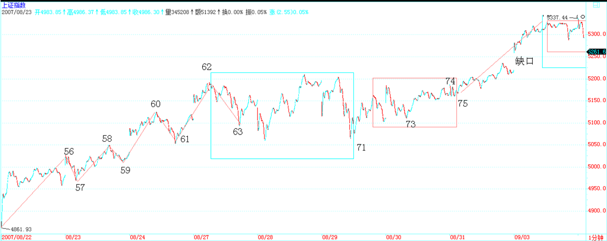

去广东，总能学点古灵精怪的中文，例如本文题目。这句话的意思，用来要求现在的市场参与者，是最恰当不过了。

今天的大盘，如上周五所论，周末没有任何足够分量的消息，因此做多能量如期爆发。但今天有一个有趣的现象，就是大盘在5330点下徘徊许久，就是不敢上去，为什么？因为4330点上曾留下的记忆依然太过深刻。

现在，每天都等于一个对赌，就是赌当晚没有特别的消息。最重要的问题是，现在消息决策的保密程度，已经超过一般人的想象，否则，529怎么可能是最高收盘？因此，市场能量依然强劲与对消息面突发性的担忧，构成目前走势的最大一对矛盾。

在这种情况下，就要发扬“吃得咸鱼抵得渴”的精神，要干就狠干，干到消息出为止，出真家伙时，砸起来，看谁狠了。就算是530，早上大把个股还有红盘的时候，关键是该砸的时候决不手软，这样就有继续疯狂的资格，否则，就退出观望吧。

疯狂是需要资格的，没有这素质，没有这技术，就别疯狂。地球很危险，回火星去吧。而目前的疯狂，已经完全按照剧本来，就是二、三线狂舞。有人叫嚣宁愿蓝筹泡沫，也不让二、三动弹，是典型的脑子有水的表现，现实已经足够严厉地教训这些人了。

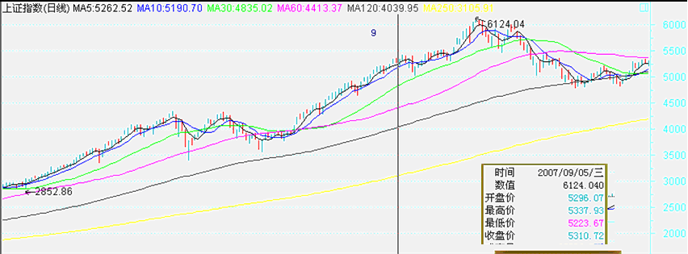

纯技术的角度，今天的缺口是引发短线震荡的技术隐患，因此，这缺口的技术意义必须被短线所重视。

个股方面，可以充分关注技术走势的意义。用本ID有的个股为例子说明：

第一类，如600636，属于最弱的股票，还没有重新站在半年线，这种股票的任务就是先站住半年线，然后再展开。具体到该个股，基本面上不存在任何问题，只是里面的人太杂。

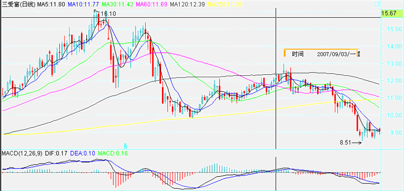

第二类、如600737，前几天刚突破530点后的第一个反弹高位，然后回调，这对于其他股票有同样的意义，这类股票的任务就是通过震荡站稳该位置，然后才会去挑战530的高位。

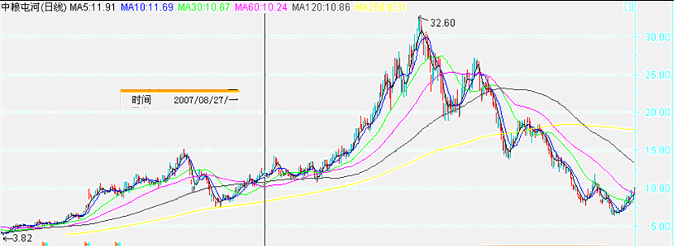

第三类，如000938，突破530高位后出现震荡，这都是最正常的。这类股票，短线能否继续展开行情，关键就是这530高位能否在震荡后站稳。

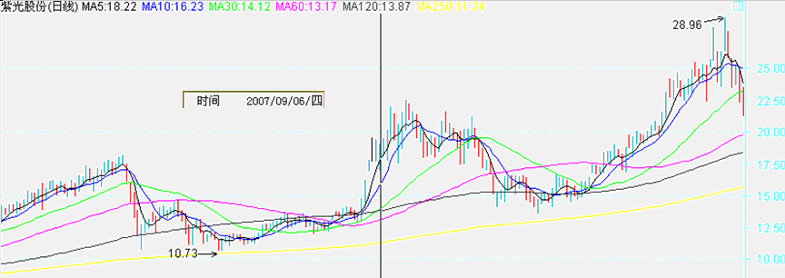

对于补涨的二、三线股票，无非就是这三类，因此可以根据具体的情况，进行相应的短线处理，如果看不明白或没时间短线的，就看5日或5周线进出，这是中短线操作的最懒惰方法了。一般出现相应阻力的震荡，可以在冲高时先退出，下来再回补，用中枢震荡的方法，如果没这判断与技术，就算了。

另外，除非你技术特别过关，否则不建议目前频繁买卖，因为谁都不能保证你今天买的，不会在晚上就碰到一个恶劣的消息，对于心态、技术特别好的，当然无所谓，真出消息，一刀下去千了百了，但一般人可没这心态。

一定要注意，长线介入，一定是在长线买点，如果在一个短线买点介入要持有长线，是绝对地违反本ID的理论的。短线买点的介入就只意味着短线的操作，除非你有最坚强的意志，任何牢底都可以坐穿，否则，就别玩这游戏了。

本ID说的话就是话，例如，现在大盘的走势，是本ID可以接受的，但如果大盘快速突破3/4线后继续快速上涨去构造多头陷阱，那么就算没有政策，本ID也绝对不客气。这几天的中铝只是一个演习，中铝这次的演习，目的完全达到，使得二、三线的切换全面成功，从明天开始，爱谁谁去。

下午、晚上都给PE了，没办法，先下，再见。

## 教你炒股票76：逗庄家玩的一些杂史2

(2007-09-03 19:19:43)

刚忙完一轮，8点半还要到国际俱乐部那边，11点前是肯定回不来了。就抓紧时间说两句。

现在梦话一点杂史，并不是说技术已经说完了，那还早着。只能在说技术中间穿插一下，这样不会让人完全沉浸在技术之中。毕竟，技术只是其中一方面。视角越全面，才会有更大的成就。

以下开始说梦话，谁信谁有毛病。

股票，公开的，谁都可以买卖，这就是其复杂所在。一般来说，单纯犯坏的难度当然比建设的难度小。如果你技术过关，你可能只拥有流通量5%，但你就能阻击一个有流通量50%的人。

玩死一个庄家，归根结底，就是两种：时间上害死他；空间上害死他。有些心理有毛病的庄家，最容易被时间上害死。特别那些有洁癖的，总是希望把盘给洗得一尘不染，这种人，最容易玩了。你只要不断在里面折腾，让他感觉到里面人特乱，筹码特乱，那么这些无聊的家伙就是洗呀洗的，洗到行情都走完了，还在那里洗。很多庄家，就是太有洁癖了而被害死的，特别那些经验不足的，资金实力又有限的。

以前，要玩这些家伙，有一招一直都很有效，不过后来用多了，就不大好用了，现在基本没用。当时，喜欢用一个帐号，齐刷刷就买一个巨大的惹眼的数量。能坐庄的，基本都能打单，这样一个帐号，不可能不知道。一般来说，这样一件事情，对于那些新手，就够他们一阵折腾了。开始，不用在盘面上搞他们，等他们适应一段时间，有点麻木，就要给新的刺激。例如，再找一个新的帐号买一个更大量的数量，注意，这些数量一般都控制在流通量的2%以下，不能大到影响这些家伙坐庄的信心。再折腾一段时间后，就要换手法，例如，在盘面上就要不时神经质地搞他两下，一般都是在他将高潮未高潮的时候，狠狠来一下，让他以后欲高潮时都留下后遗症，这样反复折腾，将他搞成ED男。

注意，折腾人不是靠光砸光买就可以。其实，真干的时候，就是来回弄，那家伙砸的时候，就要敢接，拉的时候就要敢给，但那几个明目装胆的帐号是不能动的，让他们搞不明白水的深浅。一般来说，阻击，只要拿流通的10%以下就足够了，其实，都不需要那么多。原则就是有能力在出手的一天内倒出一个10-20%上下的换手大量来，而且震荡的区间一定要足够大，有可能就涨停到跌停来回N次。一个股票，特别在准备高潮时倒出这样一个大幅度震荡的大量，想不ED都难了。

而倒出这样的量，实际需要的筹码并不要太多，因为，不可能全天的交易都是一方搞出来的。倒的时候，技术高的，完全可以做到顺便就把差价给弄了而筹码尽量不丢。但注意，这种折腾，一定是在底部或相对底部的位置，这样，最好就在庄家成本的附近，这样操作的难度就小多了。如果庄家给你玩恼火了，不玩了，撤了，一定要捣乱，不能让他顺利出去。只要你能让他亏钱出去，就是成功。一句话，就是不能让他挣钱跑。而且，在日常的折腾中，一定要弄各类手段去垫高其成本。

有些手法，和经验有关，不是一般人能干的。例如，要充分利用另外的分力的力量。庄家只是其中的一个分力，如果你能利用好其他分力，那庄家也只有给你折腾的份。

最狠的一种折腾，就是把这股票完全搞臭，也就是所有散户都知道这股票是ED男，然后就搞成两家或N家对垒。一般搞到这种地步，就是完全的强盗逻辑了。或者你就亏钱走，或者就送钱给大家花，否则大家就耗着，看谁怕谁。庄家比你拿得多，占的资金多，而且他的钱可能还来路不明，有期限的，这样折腾，100个至少99个要死掉。

当然还有更狠的，那就是工夫在诗外的玩法了，一般这种招数不能用，这样有点过分，有点不讲江湖规矩了。这种玩法，最普通的就是从资金面下手，只要能断了对方的资金来源，你想搞死谁不可以？当然还有更狠的，就没必要说了。

上面是说在时间上搞死，一般这种，都是走出一个复杂的大级别中枢。而在空间上搞死，那就是另一种玩法了。这种玩法的基本原则就是：庄家要风，就助他风；要雨，就助他雨。这样，先养其骄。等到其觉得不可一世、春风得意时，突然出手，这出手，一定要稳、准、狠，一下就要其命。在纯技术的角度，这就是要先砸出一个相当狠的第一段，然后，引发散户恐慌盘后，回接。这里，出手的位置很关键，太低没有杀伤力，太高又太晚。因此出手的时机决定成败，这需要经验、判断、技术很多综合的因素，不是一般人能干的。

回接后，就是用来阻击庄家反扑的。庄家给第一段出手后，肯定有反扑，这时候，就要有足够的子弹进行塔山阻击战。股票有一个好处，没有子弹，只要有钱，马上就可以采购，所以必须要利用好这一特性，控制好阻击的节奏、能量。

一定要注意，第一段后只能回接散户的恐慌盘，不能接庄家的抛盘。因为你先出手，所以如果庄家跟着也砸，你就要更狠地倒下去。最好直接倒出一个V型反转，这样，连塔山阻击战都省了，这股票，至少残废一年半载，再找一个机会完全把他废了，还不是迟早的事？

不能再说梦话了，快7点半了，等一下还有事忙。先下，再见。

[2007-09-04]技术、心理引发震荡

(2007-09-04 15:12:24)

4点在国贸有会，只能以最快速度说上两句。今天的震荡，在技术上，就是昨天的缺口，这已经明说过；心理上，最近天天报上有提示风险的文章，你说心理上能没压力？

这个震荡明天是否加大，其实都不重要，从纯技术上说，这缺口如果补了后没有有力的回拉，那短线问题就严重了。所以，缺口越不补越不存在技术压力，这叫强者恒强。一旦强者不能恒强，那较大级别的调整就不可避免的。所以从技术上，走得越强越不用担心，一旦有走弱迹象，反而是短线必须小心的。

个股方面，可能会有人骂今天的中石头和联通。这些人都是一点良心都没有的，没有中石头、联通，3600能不能转过来还是问题，最近这俩为大盘已经给了足够贡献了，一直缩着不动。到现在还不让动一下，万一刀子下来，连回跳的空间都没有，那真雷锋了。

闲话不能说了，图明天再贴，今天下午会后，晚上还有一个PE的项目要谈合同，所以晚上可能很晚。

对不起，先下，再见。

[2007-09-05]程式化补缺口震荡如期上演

(2007-09-05 16:10:28)

今天的走势真没什么可说的，周一留下缺口，技术上需要三天时间去考验，今天一个过于程式化的补缺口震荡如期上演，让人误以为在长不安大剧院看一场京剧表演。

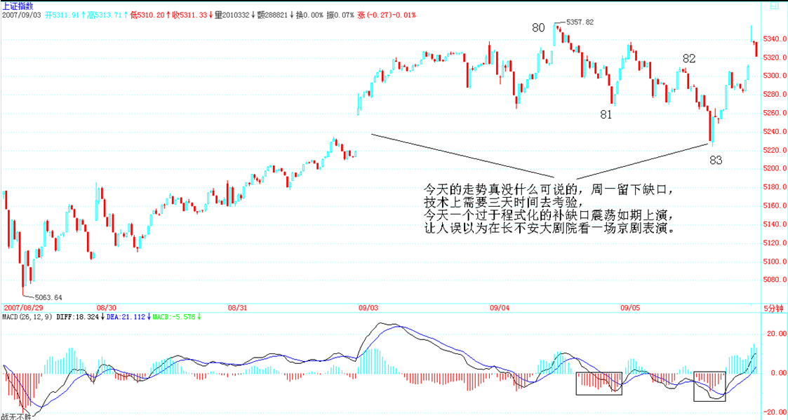

程式化震荡后，才是问题的关键。从纯技术的角度，下图中，62-71的5分钟中枢突破后，71-80是一个标准的1分钟上涨，也就是次级别的离开，而80-83是一个标准的1分钟盘整回拉，也就是说83是教科书式的62-71的5分钟第三类买点，其后的走势无非两种：形成更大级别震荡，或者是5分钟中枢上移的延续。

现在，最坏的情况就是形成一个30分钟的中枢，最好的就是继续5分钟的上涨，直到形成新的5分钟中枢。技术上的形态，就这两种情况，没什么可说的，根据走势当下就可以判断。说得仔细点，就是明天不能新高，或新高后出现1分钟的不构成第三类买点的盘整背驰，那么必须要在目前位置形成新的5分钟中枢了，后面就很简单，就看中枢震荡后是出现第三类买点还是卖点了。至于明天能形成1分钟的第三类买点，那么大盘就将上涨去延续寻找新的5分钟中枢的过程。

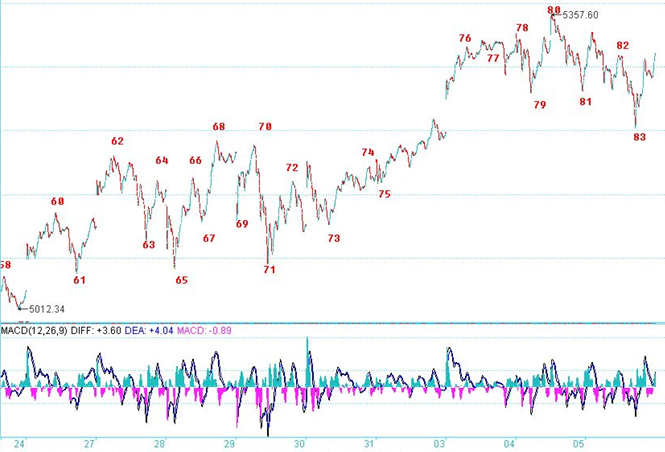

个股方面，二、三线题材股继续发威，这是好现象。而一线大盘，关键就看建行的发行价了，如果搞出一个比现在中行、工行差不多甚至还高的发行价格，那么这些一线大盘就谁都按不住了。这其实也是本ID为什么一手题材股、一手中字头，两手都要硬的原因。你想，如果中移动发30-50元，那么中国联通待在10元之下，他好意思？如果中石油也搞个20-30元的，中石头怎么好意思在20元之下。

目前，这些大石头们最大的支持或动力，就是同类回归的价格，一旦建行出现一个高发行价，后面回来的想低都没门了。这样，各位就继续疯狂吧。

现在，情况很清楚了，本ID也说得很明白，管它明日洪水滔天，如果你心态好、真来家伙时能手起刀落，够恨，那就充分享受这疯狂的游戏吧。

东风吹，战鼓擂，这个世界谁怕谁？

但如果你没这胆子，就把仓位调节好。否则，你又想疯狂，又要疯狂没有任何代价，那还是回火星去吧。

今天可以回答问题到5点。

HYPERLINK "http://blog.sina.com.cn/u/1215172700" \t "_blank" 缠中说禅：2007-09-05 16:24:14 

禅师，能讲一下81、82这个分段为什么中间那个高点不是一个段呢？

==

因为那只是一笔，笔破坏不等于线段破坏。

## 教你炒股票77：一些概念的再分辨

(2007-09-05 23:24:01)

对不起，回家晚了，现在才把课程写好贴上来。

梦话不能连续说，现在回到技术上来。对一些概念进行再分辨，因为有些概念太基础，如果搞不清楚，后面永远就一个字：乱。为了不乱，希望是最后一次再把前面最基础的概念分辨一下。

先用缺口的例子说明基于严格分类基础上正确预测的思维方法。任何预测，都必须基于严格分类的基础上，这是一个最基本的思维，否则，整天陶醉在纯概率的游戏中，只能是无聊当有趣。

例如缺口，用向上的为例子。首先，要给缺口一个明确的定义，这定义是有利于分类的，只有明确的定义才有明确的完全分类。何谓缺口，就是在该单位K线图上两相邻的K线间出现没有成交的区间。例如，在上海指数日线单位的K线图里，1994年的7月29日与8月1日，就出现[339,377]这个区间没有成交。那就说，[339,377]是一缺口。而缺口的回补，就是在缺口出现后，该缺口区间最终全部再次出现成交的过程。这个过程，可能在下一K线就出现，也可能永远不再出现。例如[339,377]这一缺口，虽然不敢说永远不再回补，但到股市被消灭前，大概也没什么机会回补了。像本ID之类有幸经历这一天的人，有福了。本ID还记得，本ID当时在1994年7月29日最大量买入的股票，深圳是老星源，上海是大飞乐。

根据缺口的是否回补，就构成了对走势行情力度的一个分类。一、不回补，这显然是强势的；二、回补后继续新高或新低，这是平势的；三、回补后不能新高、新低，因而出现原来走势的转折，这是弱势的。

一般来说，突破性缺口极少回补，而中继性缺口，也就是趋势延续中的缺口，回补的几率对半，但都一定继续新高或新低，也就是至少是平势的。而一旦缺口回补后不再新高、新低，那么就意味着原来的趋势发生逆转，这是衰竭性缺口的特征，一旦出现这种情况，就一定至少出现较大级别的调整，这级别至少大于缺口时所延续的趋势的级别。也就是说，一个日线级别趋势的衰竭性缺口，至少制造一个周线级别的调整。而一个5分钟级别的衰竭性缺口，至少制造一个30分钟级别的调整。

注意，这里的级别和缺口所在的K线图无关，只和本ID理论中的走势类型级别有关。不同周期K线图和走势的级别，就如同不同倍度数显微镜和显微镜所观察的物体，这个比喻反复说了，不能再混淆了。

显然，日K线图有缺口，在日线以下的任何周期的K线图都会相应有缺口，而回补日线的缺口，不一定能回补日线以下周期K线图上的缺口。另外，在盘整走势中的缺口，与在趋势中的缺口性质不同，属于普通缺口，这种缺口，一般都回补，而且没有太大的分析意义，唯一的意义，就是在中枢震荡中有一个目标，就是回拉的过程中，几乎肯定能至少拉回补掉缺口的位置。

缺口说完了，就再说说，分型、笔、线段的问题。

分型就不用再说了，按定义，只要把包含关系搞清楚，相信连孔男人都应该能描红一番。如果没有包含关系，3个K线就可以决定一个分型，但注意，任何相邻的分型之间必须满足结合律，也就是，不能有些K线分属不同的分型，这样是不允许的。

一般来说，对不熟悉的人，首先应该按定义，把分析的图中的分型按照包含关系以及结合律的最基本处理后给标记好，顶分型可以用向下的箭头、底分型可以用向上的箭头，这样就一目了然了。

有了上面这基础工作，那这个图就可以看成只有这些分型，分型之间的K线都可以暂时不用管。下面的工作，就是确定笔了。笔，必须是一顶一底，而且顶和底之间至少有一个K线不属于顶分型与底分型。当然，还有一个最显然的，就是在同一笔中，顶分型中最高那K线的区间至少要有一部分高于底分型中最低那K线的区间，如果这条都不满足，也就是顶都在低的范围内或顶比底还低，这显然是不可接受的。

因此，在确定笔的过程中，必须要满足上面的条件，这样可以唯一确定出笔的划分。这个划分的唯一性很容易证明，假设有两个都满足条件的划分，这两个划分要有所不同，必然是两个划分从第N-1笔以前都是相同的，从第N笔开始出现第一个不同，这个的N可以等于1，这样就是从一开始就不同。那么第N-1笔结束的位置的分型，显然对于两个划分的性质是一样的，都是顶或底。对于是顶的情况，那么第N笔，其底对于两个划分必然对应不同的底分型，否则这笔对两个划分就是相同的，这显然矛盾。由于分型的划分是唯一的，因此，这两种不同的划分里在第N笔对应的底分型，在顺序上必然有前后高低之分，而且在这两个底之间不可能还存在一个顶，否则这里就不是一笔了。

如果前面的底高于后面的底，那么前面的划分显然是错误的，因为按这种划分，该笔是没有完成的，一个底不经过一个顶后就有一个更低的底，这是最典型的笔没完成的情况。

如果前面的底不低于后面的底，那么如果再下面一个顶分型出现前，如果有一个底分型低于前面的底，那么，这两种划分都是不正确的，所划分的笔都是没完成的；如下面一个顶分型出现前，没有一个底分型低于前面的底，那么下面一个顶分型，必然高于前面的底，因此，前面的底和这个顶分型就是新的N+1笔，因此，第N笔和第N+1笔就有了唯一的划分，这个第N笔开始有不同划分相矛盾。

关于第N-1笔结束的位置的分型是底的情况，可以类似去证明。

综上所述，显然，笔的划分是唯一的。

从上面笔划分的唯一性证明中，其实也知道如何去划分笔的步骤：

一、确定所有符合标准的分型。

二、如果前后两分型是同一性质的，对于顶，前面的低于后面的，只保留后面的，前面那个可以X掉；对于底，前面的高于后面的，只保留后面的，前面那个可以X掉。不满足上面情况的，例如相等的，都可以先保留。

三、经过步骤二的处理后，余下的分型，如果相邻的是顶和底，那么这就可以划为一笔。

如果相邻的性质一样，那么必然有前顶不低于后顶，前底不高于后底，而在连续的顶后，必须会出现新的底，把这连续的顶中最先一个，和这新出现的底连在一起，就是新的一笔，而中间的那些顶，都X掉；在连续的底后，必须会出现新的顶，把这连续的底中最先一个，和这新出现的顶连在一起，就是新的一笔，而中间的那些底，都X掉。

显然，经过上面的三个步骤，所有的笔都可以唯一地划分出来。

有了笔以后，就是线段了。线段划分的最基本原则，就是线段必须至少有三笔，这是十分显然的，否则，一笔都能构成线段，那笔和线段又有什么区别？至于两笔为什么不能构成线段，这理由更简单，因为两笔，那么线段的两段的分型的性质肯定是一样的，和笔一样，一个完整线段的两段的分型不可能是同性质的。也就是说，和笔一样，线段也不可能从一个顶开始结束于一个顶，或者从一个底开始结束于一个底。由此可见，线段中包含笔的数目，都是单数的。

而且，线段开始的那三笔，必须有重合，开始三笔没有重合的，是构不成线段的。

另外，线段必须被线段所破坏才能确定其完成。对于线段划分的第一种情况，如果第一笔出现笔破坏后，接着的一笔就创新高，而且再后一笔，根本就不触及笔破坏那一笔，那么，这时候，显然构成不了线段对线段的破坏，因为后面这这三笔没有重合，不可能构成一线段。

而这，用第一种情况的判断法就更明确了，上面这种情况根本不可能形成特征序列的分型，当然就不可能是线段的完成。

再者，线段被线段破坏，必须不能是被同一性质的线段所破坏，也就是从向上一笔开始的线段不可能被向上一笔的线段所有破坏，必然是被从向下一笔开始的线段所破坏。

线段的第二种情况，其实就包含这种情况。也就是，按第一种情况，线段A没有被接着的线段B破坏，但接着的线段C破坏了线段B，因此，线段B是完成的，当然线段A也应该是完成的。注意，这里的线段A、B、C只是用结合律的原则先划分，括弧里面满足线段的基本性质，在这破坏关系没被确认之前，这只是一个假设的称呼。

各位肯定注意，在第二种情况下特别强调，第二特征序列，其实就是对应着线段C对线段B的破坏，不再分第一、二种情况了。这，其实是一个简化的方法。为什么？

如果我们坚持线段的最终破坏回补特征序列缺口情况，那么，如果线段C对线段B还是第二种情况，那么线段C的区间肯定就在线段A特征序列缺口与线段B特征序列缺口之间，如此类推，总会出现一个线段X，使得对应前面的线段是回补特征序列缺口，否则，这些线段的区间就会无限缩小，最后就会形成一个点，这显然是不可能的，学过极限的都应该能理解。所以，在一串的相对前一线段是第二种情况的线段串中，比如最终会出现第一种情况的破坏，这样倒推回来，必然有这一串假定线段间的连续破坏。

正因为这样，所以在第二种情况中的第二特征序列判断中，就不再分第一、二种情况了，这样是免得有一串线段串不断收敛后倒推回来的麻烦。这在数学上当然是绝对完美，但操作起来太麻烦，而且这种特殊的情况很少见，就更没必要了。

那么，为什么要区分第二种情况，因为是不希望在线段的层次上出现小级别转大级别这样不确定的情况，用第二种情况就能解决这个问题。

有一种复杂的情况，在今天的80-83的划分中就出现了。就是对80-81，出现了第一笔的笔破坏，然后接着是一个符合线段标准的走势A，但没有创新低，这样当然不能算是原线段的延续，但线段的破坏也不能算，为什么？因为没有符合要求的三笔。接着，一个反弹，也满足线段的要求，然后就转头继续创新低。这里有一个细微的区别，如果这个反弹只是一笔，那么就没有破坏走势A，后面接着的新底，就意味着走势A依然延续，所以走势A就是原来80-81的延续。

但现在的问题是，这个反弹把走势A给线段破坏了，因此，说走势A依然延续是显然不对的，所以后面的走势和走势A无关，因此，唯一合理的划分，就是把第一笔的笔破坏、走势A、一个反弹合成一个线段，这完全满足线段的定义，所以就有了81-82。

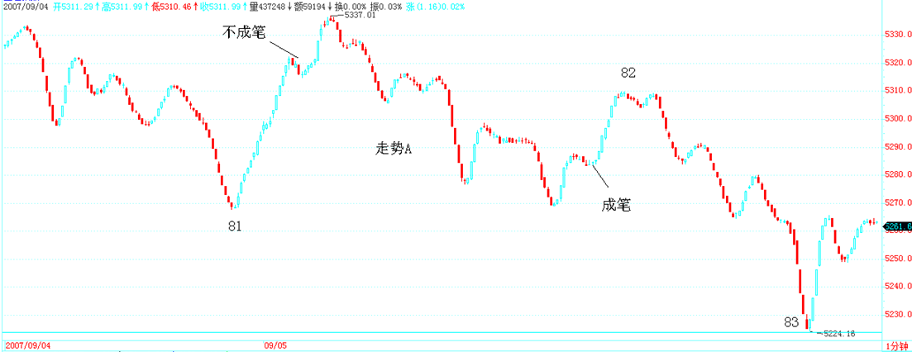

线段的划分，其实一点都不难，关键是要从定义出发。而且用线段划分的两种情况的规定，不难证明，线段的划分也是唯一的。

有什么问题，请继续问，把事情彻底搞明白，才是最重要的。这些补课，会不时展开，但不可能堂堂如此，下一次就要讲新内容了，老问题如果积累到一定程度，会再补课的。

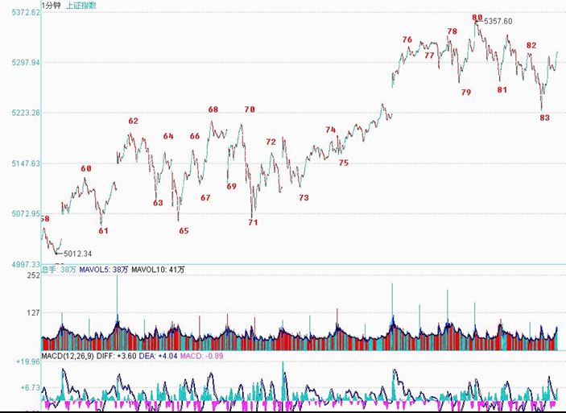

第77课读后感：

1、突破性缺口、中继性缺口、衰竭性缺口的意义。

2、顶底分型的要求：当然，还有一个最显然的，就是在同一笔中，顶分型中最高那K线的区间至少要有一部分高于底分型中最低那K线的区间，如果这条都不满足，也就是顶都在低（底）的范围内或顶比底还低，这显然是不可接受的。

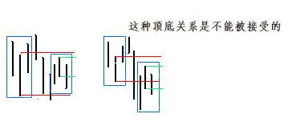

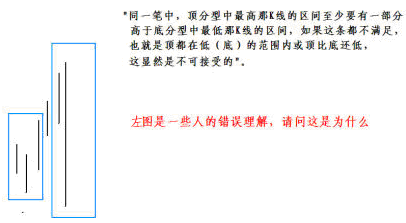

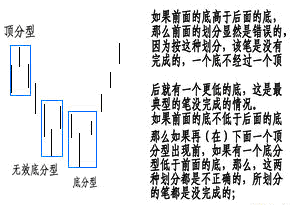

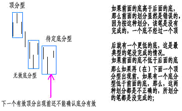

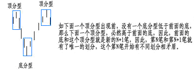

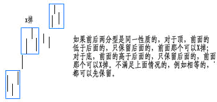

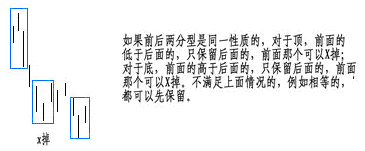

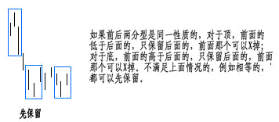

HYPERLINK "http://photo.blog.sina.com.cn/showpic.html" \l "blogid=6223e8fb0100h2g6&url=http://static4.photo.sina.com.cn/orignal/6223e8fbt7b12c080b173&690" \t "_blank"

3、课文学习用图：

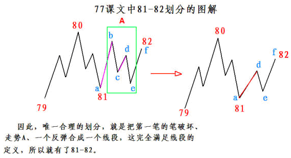

[2007-09-06]建行引领大盘前行

(2007-09-06 15:55:55)

这题目没错，就是建行引领大盘前行，建行发行的意义，在昨天已经说得很清楚了，而建行作为这次大规模回归的首家，其最终的表现，将对后面的回归者有极大的指标意义。因此，像尾盘出现中行等飞速拉起的情形，就一点都不奇怪了。

不过有点必须明确，本ID昨天回答问题时说到中国联通的一些题材，并不是正式的东西，就当成梦话吧。本ID有联通，这里的人应该很多都知道，在春节前后，在这里还连续N天直播过联通上5元的活动。这是本ID要海枯石烂的股票，中移动在香港100元多，如果中移动的GSM业务都给了联通，本ID也不知道联通该多少钱，但联通搞GSM、移动搞大唐玩意、电信搞CDMA，并不是什么正式公告，只是一种还未被最后正式批准的可能方案，其实本ID在以前回答问题的时候也多次说过，但从来没在文章里说过，所以只能当梦话，相信者有毛病。至于整体上市、中移动回归，都是很明确的，只是迟早的事情，所以对联通的判断，要以此为准。

本ID其实不愿意回答个股问题，本ID告诉的股票都是本ID正买着的，当然，本ID建仓的过程可能很长，但本ID在这里第一次说的时间，肯定和本ID第一笔建仓的时间是同一日，甚至更早，这点是没问题的。例如潍柴，5月15日写诗，也是本ID买的第一天，本ID把自己买的股票说出来，不存在推荐的问题，这就如同告诉各位，本ID中午吃了点什么一样。今天中午，本ID只喝了点果汁，就这样了。

大盘没什么可说的，补完缺口后创新高，也就是说周一的缺口依然只是中继性质的，那游戏继续。

下面再次用明确的语言给出目前的操作守则：

一、一旦有致命的消息，手起刀落，让股票见鬼去。

二、没消息就是最好的消息，用尽一切手段疯狂去。

三、最懒的办法，看5日、5周线。

四、针对那三种技术形态的股票，分类操作。（以前用600636、600737、000938为例子说过。）

五、目前位置，就不要抱什么长线打算了，长线打算是在长线买点去打算的。现在只是疯狂的游戏阶段，成功的唯一标准只有一个：把钱赚到袋子里又不被刀子伤着。

六、对于中长线投资者，只战略性持有等待中线卖点的出现，然后用部分仓位去进行降低成本或赚取筹码的操作。

这六点里，对于短线来说，第一条是最重要的，第二条是最实际的。

今天有事要忙，不能回答问题了，对不起，先下，再见。

## 教你炒股票78：继续说线段的划分

(2007-09-06 22:28:31)

注意，各位有时候不要太神经质，本ID现在什么新股票都不会买，要搞也只搞原来低位买的。本ID最后一只股票，这里的人都知道，就是002149，在上市第一天买的，当天贴了点成交记录，几小时后删除，后来怎么样，大家都看见了。本ID从来中午就只喝果汁，而且只喝鲜榨的，和任何牌子无关。

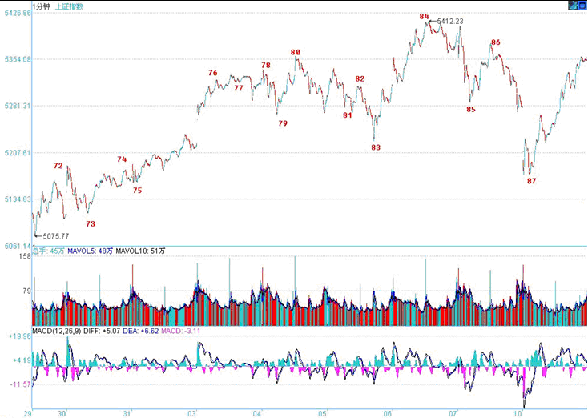

本来说好要开新课，但看到很多人确实还是没搞清楚，而且，今天本来也不是说股票的，等于占用了别的时间来补这一课。

线段的划分，就是上面课程里的两种情况，根据这两种情况的完全分类来，没有不能唯一去划分的。但一到实际划分，很多人就晕，为什么？因为基本的概念还是没搞清楚。

首先，线段和笔，都是有方向的，从顶开始的笔一定结束在底，同样，以向上笔开始的线段一定结束于向上笔，不可能一个线段，开始是向上笔，结束于一个向下笔。由于向上的笔的开始分型是底，而向下笔的结束分型也是底，换言之，一个线段，不可能是从底到底或从顶到顶，这是一个最基本的概念。

同样，正如同一笔不可能出现顶低于底的情况，同一线段中，两端的一顶一底，顶肯定要高于底，如果你划出一个不符合这基本要求的线段，那肯定是划错了。

由于图形不断延续，因此，除非是新股上市后最开始的一段，否则任何一段都是破坏前一段的，如果你的划分，不能保证前面每一段都是被后一段破坏，那么这划分肯定不对。线段的破坏是可以逆时间传递的，也就是说被后线段破坏的线段，一定破坏前线段，如果违反这个原则，那线段的划分一定有问题。

当然，实际划分中没必要都从上市第一天开始，一般都是从图K线中近期的最高或最低点开始，例如，如果你今天才开始进行划分1分钟图，那么，就可以从昨天下午跳水的最低点5224点开始，但这样，肯定对大的走势不可能有正确认识，要对这波行情有明确的分析，即使不从7月6日的3563点开始，也要从8月17日的4646点开始。

选择好了开始点，就可以进行分段了。如果熟练了，就可以直接分段，因为分型、笔都可以心算就知道，直接就可以进行分段；但如果不熟练，还是先从分型开始，然后笔，再线段，这样比较稳妥。

在实际划分中，会碰到一些古怪的线段。其实，所谓的古怪，是一点都不古怪，只是一般人心里有一个印象，觉得线段都是一波比一波高或低，很简单那种，其实，线段完全不必要这样。一般来说，在类似单边的走势中，线段都很简单，不会有太复杂的情况，而在震荡中，线段出现所谓古怪的可能性就大增了。

所有古怪的线段，都是因为线段出现第一种情况的笔破坏后最终没有在该方向由该笔发展形成线段破坏所造成的，这是线段古怪的唯一原因。因为，如果线段能在该方向出现被线段破坏，那就很正常了，没什么古怪的。

注意，这里有一个细节必须注意，线段最终肯定都会被线段破坏，但线段出现笔破坏后最终并不一定在该方向由该笔发展形成线段破坏。

由最简单概念知道，任何线段都有方向的，例如线段B，其方向是下，也就是由向下笔开始的线段，那么其结束笔肯定也是向下笔。因此，线段出现第一种情况的笔破坏，这破坏的一笔肯定是向上笔，但这一笔之后，没有形成特征序列的分型，满足不了第一种线段破坏的情况，因此，就在这个方向上形成不了线段的破坏。

而线段，不可能被同方向的线段破坏，任何同方向的线段，或者互相毫无关系，或者就是其中一线段其实是前一线段的延续，也就是说前一线段其实根本没完成。

但线段出现第一种情况的笔破坏后最终没有在该方向由该笔发展形成线段破坏时，在上面例子中的向上破坏笔完成后，接下来肯定是向下的笔，这笔肯定会形成一个向下的线段，否则，就意味着前面那向上破坏笔能延续出线段，这和假设矛盾。

这个向下的线段，如果破了该向上笔的底，那么，原来的线段B就是没结束，在继续延续。这种情况下，如果那向上笔突破线段B的高点，这时候就会出现，线段的开始点并不是最高点的情况。（注意，和这个情况一样，昨天的贴图里，81那点应该在09051101的5268.74位置上，而82的位置不变，因为原来标记的位置是一个急跌，当时的数据收集可能有点乱，用数据修正功能后发现实际上比09051101时高，因此必须有此修正。）

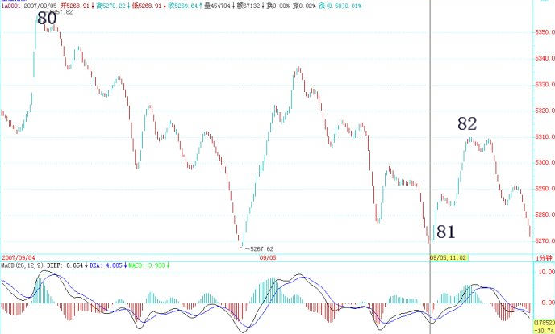

这个向下的线段，如果没破该向上笔的底，那么就可以肯定，由这向上的笔可以延伸出一个线段来，这时候，线段B肯定被破坏了。

注意，这个例子中有一个最关键的前提，就是线段B已经确认线段破坏了他前面的线段，如果线段B对前面线段的破坏都没确认，那就先确认，这里的分析都不适用了。

从这个例子就知道，笔破坏与线段破坏的异同。对于线段破坏的第二种情况，例如线段B对线段A是第二种情况，而线段C没有形成第二特征序列的分型又直接新高或新低了，这时候，不能认为这是三个线段，线段A、B、C加起来只能算是一个线段。

另外，一定要注意，对于第二种情况的第二特征序列的分型判断，必须严格按照包含关系的处理来，这里不存在第一种情况中的假设分界点两边不能进行包含关系处理的要求。为什么？因为在第一种情况中，如果分界点两边出现特征序列的包含关系，那证明对原线段转折的力度特别大，那当然不能用包含关系破坏这种力度的呈现。而在第二种情况的第二特征序列中，其方向是和原线段一致，包含关系的出现，就意味着原线段的能量充足，而第二种情况，本来就意味着对原线段转折的能量不足，这样一来，当然就必须按照包含关系来。

通过上面的讲解，应该没有任何线段问题能难倒各位了，当然前提是能把上面的内容搞明白。

注意，这里必须提醒一句，就是这在以前也曾说过，就是，如果线段中，最高或最低点不是线段的端点，那么，在任何以线段为基础的分析中，例如把线段为基础构成最小级别的中枢等，都可以把该线段标准化为最高低点都在端点。因为，在以线段为基础的分析中，都把线段当成一个没有内部结构的基本部件，所以，只需要关心这线段的实际区间就可以，这样就可以只看其高低点。

经过标准化处理后，所有向上线段都是以最低点开始最高点结束，向下线段都是以最高点开始最低点结束，这样，所以线段的连接，就形成一条延续不断、首尾相连的折线，这样，复杂的图形，就会十分地标准化，也为后面的中枢、走势类型等分析提供了最标准且基础的部件。

第78课读后感：

1、课文学习用图：

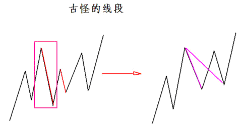

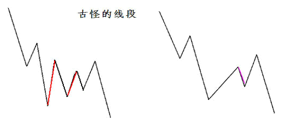

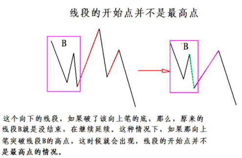

 HYPERLINK "http://photo.blog.sina.com.cn/showpic.html" \l "blogid=6223e8fb0100h53z&url=http://static9.photo.sina.com.cn/orignal/6223e8fbt7b9b6899b968" \t "_blank"

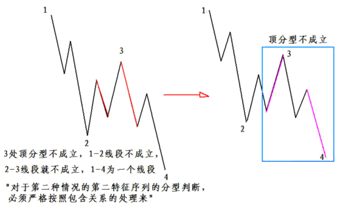

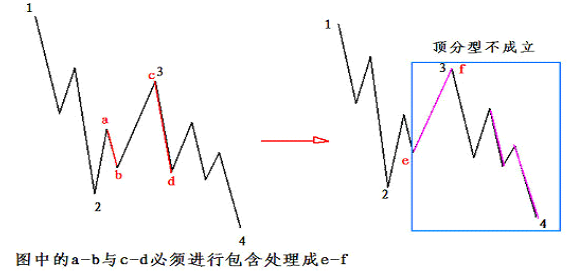

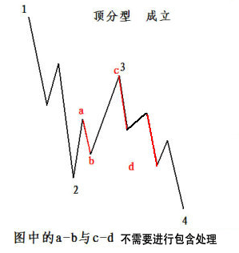

[2007-09-07]值得鼓掌的下跌

(2007-09-07 15:29:09)

今天的准备金本不是大事，但尚老先生的风险提示，可不能说是小事。最近天天报上风险提示，但尚老先生，是力主市场调节的，如果没这老先生，530大概早已不再被提起，因为已经有了更新的被各位口水一番了。

因此，做人要厚道，有人担着，就不能太给脸不是脸的，否则，好人难做，市场调节失效，那就政策调节吧，但对于一些不厚道的垃圾来说，到时候一样会喷粪的。

市场主动调节，那调整就是有限的，是系统可控制的。而市场不主动调节，要人工降雨，那要发生什么，就只有天知道了。

有时候，市场配合一下，那么力主市场调节的分力就更能发挥作用，这点如此显然，但在利益面前，很多人就昏头了，所以，有些事情是人算不如天算，不如不算。

技术上，这里出现一个大一点级别的震荡，那就按中枢震荡来处理，而不会看的，中线可以关注5周均线，从3600点上来，该线从来没有被触及，这是本段行情是否结束进入较大调整的一个最简单的PH试纸。

个股方面，像000938之类站稳530高位后继续走强的技术形态，会在其他股票上复制，对该股的态度，本ID已经说过多次，唯一需要补充的是，在一个清华比北大牛太多的年代，本ID也只能很经济学地去哈清华了，连清华都不哈，真不想在中国混了？

本ID说过的股票，还是要负责到底。600375，在7元时说过，本ID也是那时候进去的，当时的理由已经告诉各位，就是他有新产品，比三一的成本低多了，这是本ID派人实地考察过的，派出的人回来报告说，他连刚进口回来的钢板都亲手摸过了。但这公司，本ID对他信心不大足，就是其关联交易问题。而且很重要的，其一个超大关联公司，由于更多私人利益在里面，实际上接了600375发展起来的，可能最后要有大古怪，那新的玩意，要直接自己上市去实现私人利益的放大。这东西如果按正常直接装到375里，375早该站50元了，但这样搞古怪，这种公司，本ID确实信心不足。

不说了，一到周末，本ID就对股票恶心。下了，各位该干什么是什么，就别股票了。再见。

缠中说禅(2007-09-09 18:34:12)

破例说两句股票，因为周五有事太匆忙，有些事情可能会有误解。

一、目前的状况，说了N遍，就是泡沫的延续阶段，本ID干的所有事情只有一个目的，让泡沫延续得更长时间。任何有碍于这个目的的，本ID都要尽所能去清除。

二、主动调整，并不会引破泡沫，而是让泡沫更长久、甚至有效缩小的最好良方。泡沫延续的双轮，就是中字头和二、三题材，这在3600点时已经反复说了。注意，中字头只是大型国企的统称，虽然他们多数都带中字。

三、目前的环境，没那水平、没那技术的，本ID早就提醒要先把仓位减少，等市场风险减低后再根据自己的条件继续游戏。留下来的，就要“吃得咸鱼抵得渴”，充分利用好各级别的中枢震荡赚取利润。

四、短线技术，5日均线的有效跌破是否确认，以及5周均线的支持，都是最关键的。就算从纯分型的角度，周K线上，下周有极大可能形成3600点以来第一个顶分型结构，一旦这结构形成，在有效破坏该结构之前，走势都最多只能在较大级别的中枢震荡中进行。

至于像600375之类的股票，本ID对目前的公司没什么信心，并不意味着本ID就要完全放弃，本ID说那些只是把该股目前的真实情况说一次，各人根据自己的实际情况进行操作。没有任何建议是适用于任何人的，对于本ID来说，基本面是可以创造的，当然，只是必须的时候。本ID对这些个股，和目前持有的所有个股，首先不再买入，其次，会利用较大级别震荡降低成本、增加0成本筹码，这方针从来没变。

不说了，各位还是开始消费孔二先生吧。

[2007-09-10]市场继续进入530前的怪圈

(2007-09-10 15:58:37)

现在关于风险的提示，级别越来越高，而现在市场里最大的信念是，政策不会制造大幅下跌，因此我们可以继续上涨，无论我们上涨到什么位置，政策都不敢出狠招。市场继续进入530前的怪圈：一方面，由于大盘的做多能量没被耗尽，很多个股还在530高位下徘徊，所以继续上涨的冲动无法消停；另一方面，关于目前市场的判断以及风险的担心，已经在越来越高级别的层次上被明确表达。

由此，明确无误地证明本ID理论中一个最基本的原理，就是走势必然是市场所有当下分力的一个合力呈现。现在的这种情况，就是两种同样强大的分力在互相喷撞。

资金在赌政策不会发飙，这就是目前最大的问题所在。挑战政策底线的后果是什么，18年的中国股市已经一次次呈现过。每一次都有人认为有例外，结果这些人都不存在了，那么，这次如何，就走着瞧。

对于资金面充裕的分力，必然要利用政策面的缝隙去制造行情，无论是整体还是局部的。而游戏政策的结果，往往是被政策所游戏，在这个游戏与反游戏的游戏中，只能用震荡去触及行情塌陷的临界点。而这种行情塌陷，往往呈现非系统性，因此对操作的要求特别高。

现在的行情，具体的操作已经多次声明：

一、水平特差的，就把仓位降低，拿着一些长线品种就算了。

二、水平还可以但看不懂中枢震荡的，就看5日线或5周线，一般来说，只要5周线不破，调整的级别就是有限的。

三、懂得中枢震荡操作节奏的，就按中枢震荡的要求去操作，一般来说，原则是先卖后买，在这些位置，如果你的水平有点问题，卖错了就卖错了，权当把仓位减低。

注意，现在一定是不怕卖错，就怕买错。宁愿卖错，绝不买错。

图形上，76开始的5分钟中枢异常明确了，在该中枢的第三买卖点出现前，中枢震荡将一直延续。

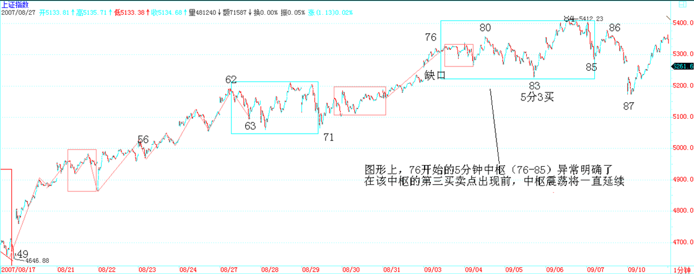

个股方面，前面没怎么动的板块都开始补涨，这是一个明确的信号，就是如果这轮补涨后，前面调整时间比较长的板块没有再次启动，那么大盘的调整不可避免地加大级别，其时间与力度都大为增加。

本周，一定要注意上周高位能否被突破，如果能，那周K线上分型结构不能形成，否则，就是周线上在3600点后第一次出现明确的警示信号。今天可以回答问题到5点。

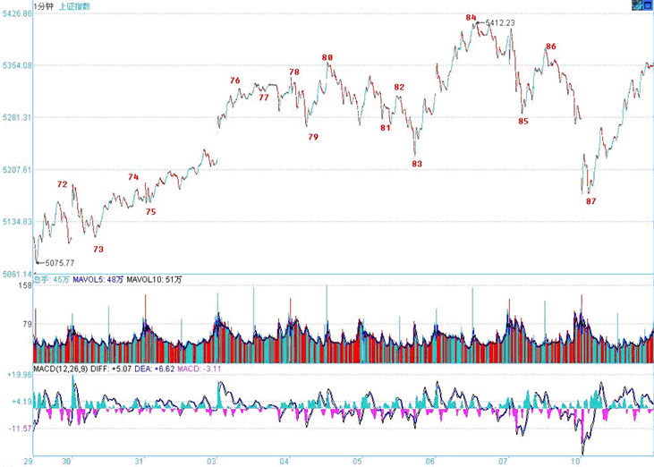

## 教你炒股票79：分型的辅助操作与一些问题的再解答

(2007-09-10 22:37:13)

附录：

2007-09-10 16:25:02

缠ＭＭ，自从开始尝试你那意念呼吸后，不到一周，就开始感冒、咳嗽，搞的得挺难受的，后来咳嗽好了，但这几天忽然间身上冒了不少象蚊子叮的包，又红又痒，几天不消。难道这么快就病根发动了？我站着打坐的时间其实很少，只是中午或晚上躺在床上的时候按你说的意念一番，但是往往坚持不了几分钟就睡着了，会这么快就有效果了吗？接下来应该怎么做？要注意什么呢？

==

每个人的根性不同，这些都是一个准备活动，本质上和打坐没什么关系。只是现代人都太脏，无论心理还是生理，本质上，现代人都是病人。所以有些准备活动，把一些脏东西搞出来，给后面留点方便。有反应，如果心里承受不了，就先停停，该看病的看病，把潜在的病诱发出来，并不是坏事。如果心里能承受，那就该怎么是怎么，出点疮算什么？挺过去，自然就好了。坚持不了几分钟，证明宿业甚重，更要加倍努力。消宿业，最好就念佛号，念《心经》也行，否则，光口头上说宿业本空，那你就慢慢空去吧，看到时候是空还是不空。

首先，发现还有很多人对一些最基本问题犯晕，所以必须在解答一下。然后再说分型的辅助操作。

任何人进入市场，不是要求一个万能的宝贝，然后抱着就想得什么得什么了。本ID的理论，只是其中的因素，利用本ID理论操作的人对理论的把握程度，是一个因素，利用本ID理论操作的人的资金规模以及操作时间，又是一个因素，这些因素加在一起的合力，才是你最终用本ID理论操作的结果。世界上的一切事情，都是各种因素和合而生，没有任何是主宰，是唯一的决定力量，这是必须明确的。

第二个因素，因人而异，无法分析；第三个因素，资金量和操作时间，是可以进行一定的分类分析的。

一、对于很忙，根本没时间操作的人，最好就去买基金。但本ID对基金没有任何信心，而且可以肯定地说，基金肯定会可见的将来内出大事，有些基金要被清盘，最终严重影响市场等，这都是正常的事。美国每年死掉的基金还少吗？中国为什么就不能有基金死掉？证券公司可以死，基金公司凭什么就不能死？

但对基金，是可以对指数基金进行定投，这样等于直接买了中国资本市场这个股票，对该股票，本ID还是有信心的。这样，如果最终牛市上到3、4万点，那么至少你不会丢掉指数的涨幅。

其次，一定要投那些与指数关系不大的成长股。因为如果你投了指数基金，再投和指数关系特别大的基金，就没什么意义了。而成长股，往往在熊市或指数表现不好时有大表现，关键这些成长股有足够的成长性。但唯一不能确定的是，你买的基金的管理者是否有足够的能力去找到有足够成长性的股票组合。

如果很忙，就用这两种方式进行一个基金组合，例如60%买指数基金，40%买高速成长股的基金，这样就别自己搞股票了。采取的方式很简单，就是定投，每个月去投一次。这对于一般的散户投资者，最好了，你至少能买到市场波动的平均。

买基金，等于把自己托付给别人，是生是死，就看你的运气了，不过指数基金稍微好点，毕竟对管理者的要求比较低。

二、对于有充足时间的散户，如果交易通道还行，那就用本ID在前面说过N次的第三买点买卖法，方法再说一次：

1、选定一个足够去反应的级别，例如，30分钟或5分钟的，或者干脆就用日线级别的，这样选择的目标相对少点，不用太乱。

2、只介入在该级别出现第三类买点的股票。

3、买入后，一旦新的次级别向上不能新高或出现盘整背驰，坚决卖掉。这样，只要级别足够，肯定是赚钱的。走了以后，股票可能经过二次回抽会走出新的行情，但即使这样也节省了时间，有时间就等于有了介入新股票的机会。

4、如果股票没出现3的情况，那一定是进入新一轮该级别的中枢上移中，一定要持有到该上移的走势出现背驰后至少卖掉一半，然后一个次级别下来（这里可以回补，但如果有新股票，就没必要了），在一个次级别上去，只要不创新高或盘整背驰，就一定要把所有股票出掉。注意，有一个最狠的作法，就是一旦上移出现背驰就全走，这样的前提是你对背驰判断特别有把握，不是半桶水，这样的好处是时间利用率特别高。

5、尽量只介入第一个中枢的第三类买点。因为第二个中枢以后，形成大级别中枢的概率将急促加大。

6、本方法，一定不能对任何股票有感情，所有股票，只是烂纸，只是用这套有效方法去把纸变黄金。走了以后，股票经过盘整可能还会有继续新的中枢上移，这是否要介入，关键看高一级别中枢的位置，如果该继续是在高一级别中枢上有可能形成第三买卖点，那这介入就有必要，否则就算了。天涯何处无芳草，把所有的草都搞一遍，你自然就从散户变大散户了。

三、资金量比较大的大散户，这时候，用所有资金去追逐第三类买点已经不切实际了，那么就可以对基本面上有长期价值的股票进行附骨抽髓式的操作，例如各种级别的中枢震荡去减低成本增加筹码。这样，资金效率肯定没有第二种散户的高，但资金量不同，操作方法自然不同。

四、专门的猎手，经过三的训练和操作，资金量变得比较庞大了，就可以对选定目标进行猎杀式的攻击。有些人问，把庄家都杀死了，有什么好处？这不是好不好的问题，资金大了，又不坐庄，又要快点把资金效率提高，唯一的办法就是吃大鱼，吃小鱼还不够塞牙缝，有什么意思？

五、就是组织大规模的战役，这必须要有四的良好基础，否则根本做不了。但这种作法，有时候法律的界限比较模糊，例如，对一个或N个板块进行攻击，这和坐庄是什么关系？当然，如果对原来潜伏在一个或N个板块中的所谓大鳄进行围歼式攻击，那么很多时候，解决问题的，就不光是盘面本身了。

六、全局式的战争，这涉及的方面太多，没有一个全局式的战争是光在市场本身就能解决问题的，而且，资本市场的全局战争，更多时候是更大范围的金融战争的一部分，这是全方位的立体战争，主要考虑的，反而不是市场本身了。

本ID的理论，适用于各种层次的游戏，当然，在越高的层次，技术面的因素就越来越不重要，因为技术面不过是合力的结果，而如果你有高超的调节各种分力的能力，那么一切的技术面都可以制造出来的。但必须注意，任何制造出来的技术面，都无一例外，不能违反本ID技术理论中的最基本结论。有人可能会提这样无聊的问题，在背驰的地方让他不背驰继续上涨难道不可以吗？这是一句废话，没有任何地方是该背驰的，背驰是一个合力的结果，如果合力最终的结果把可能的背驰给破坏了，就证明这地方没出现背驰，这也是合力的结果。

注意，任何力量，即使能调节合力结果本身，但绝对调节不了合力结果的结果，除非这是一个完全没有对手的，一个人的交易。

下面再分辨一下两个图：

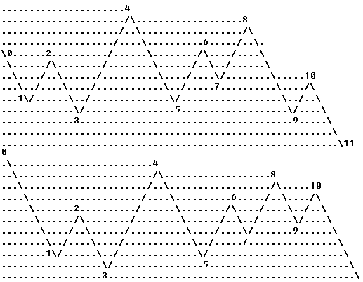

其实，明白了上几节课，这两个图一定都不难分辨，首先，前提是这两个的前面都没有其他走势了，否则这种分析没意义，前面有其他走势，就有这很多不同的可能变化。

这些图形好象很复杂，其实，只要找到其特征序列就可以。由于34都有第一种类型的笔突破，所以后面的特征序列就很清楚了，34、56、78，其中前两者可以进行包含关系处理，因此可以合并为36（指区间），所以78显然和12、36构成底分型，第一种类型笔破坏后延伸出标准的特征序列分型，那显然满足线段破坏的标准。上面的分析，对两个图都是成立的，因此，两者都至少有两个线段。

对于上图，显然89属于第一种情况的笔破坏，后面也延伸出特征序列分型，所以左图的第二线段也被破坏了，所以就是三线段。

下图，由于9-10是78的包含关系，所以可以认为线段二延伸到了10，而后面的10-11，只有一笔，因此必须再看两笔才知道是否满足第一种类型后继续延伸出特征序列分型的基本线段破坏要求，所以该图属于未完成的图。如果9跌破7，而10的位置不变，那么就显然是三线段了。

线段的划分其实一点不难，关键从概念出发就可以。

最后说说如何利用分型进行一些辅助判断的问题。一般，都至少用日线以上K线图上的分型，当然，如果你不觉得麻烦，30分钟也是可以的。但那些变动太快的，准确率就要大大有问题了。

本ID也不避嫌疑，都用本ID持有的股票为例子：000778，20070827，高开后，没有突破前一天高位，一个典型是构成顶分型走势；

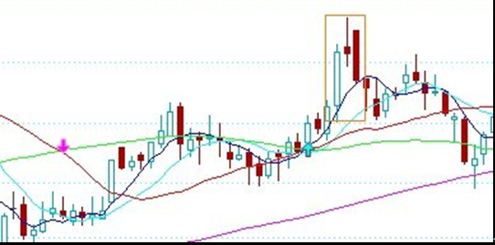

600139：看周线，9月7日这周高开后，没有突破前一周高位，形成典型的顶分型走势。

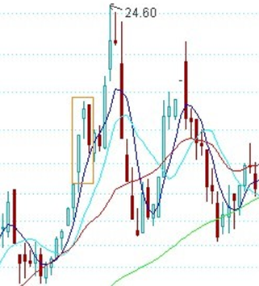

600737：看日线，这属于复杂的，有所谓的包含关系。2007年9月4、5、6三天，是典型的包含关系，然后7日这天，破坏包含关系，并没有创14.28元新高，典型的顶分型结构。

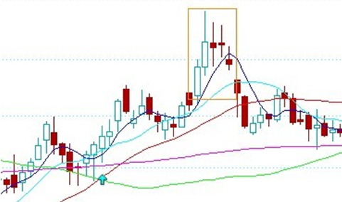

注意，顶分型结构后不一定有底分型结构与顶分型结构有一个非共用的K线，也就是不一定构成笔，但一般来说，如果顶分型后有效跌破5日线，那就没什么大戏了，就算不用搞个笔出来，也会用时间换空间，折腾好一阵子。

000802，日线，200070809，形成典型的顶分型结构，后面没有形成笔，但在5日线上下折腾了好几下，使得几条均线吻起来，才再次兴奋。

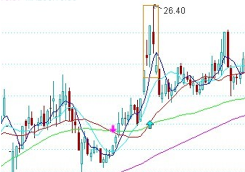

但如果没有有效跌破5日线，那往往只是中继：000938，20070904构成顶分型，然后假突破5日线后继续上攻。

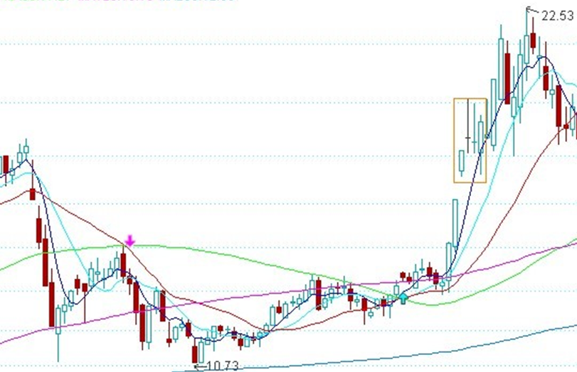

注意，利用顶分型进行操作时，必须配合小级别的图。本质上，分型都是某小级别的第一、二买卖点成立后出现的。用卖点来说，如果第二卖点后次级别跌破后不形成盘整背驰，那么调整的力度肯定大，如果时间一延长，就搞出笔来了，特别日线上的向下笔，都是比较长时间的较大调整形成的，那肯定是要有效破5日线的，而第二卖点后次级别跌破形成盘整背驰，那调整最多就演化成更大级别的震荡，其力度就有限，一般5日线不会被有效跌破。

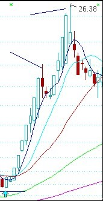

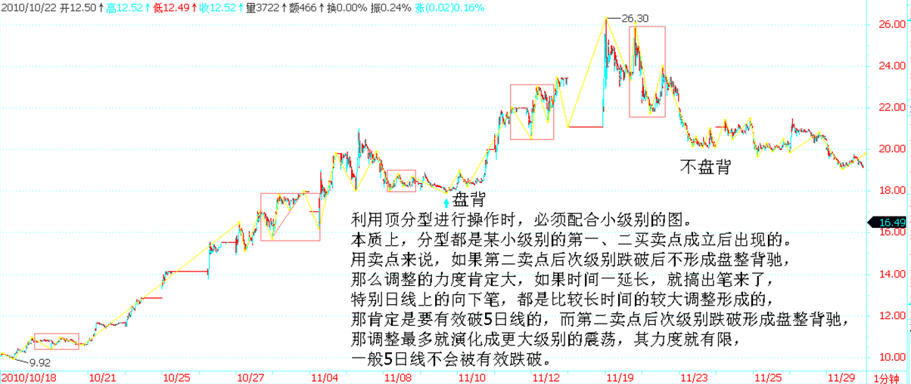

利用上面的性质，实质上并不需要在顶分型全部形成后再操作，例如000938，0904那天，不需要等到收盘，而在在其冲高时，一看在前一天高位下形成小级别卖点，就可以坚决出掉，然后下来形成顶分型，等跌破5日线后，看是否出现小级别的盘整背驰，一旦出现，就回补，所以就有了9月5日的走势，这样，等于打了一个10%多的短差。

注意，操作的难点在于：

一、必须与小级别的第二买卖点配合看，如果小级别看不明白，只看今天冲起来没破前一天高位或没跌破前一天低位，这样操作的效果不会太好。

二、要利用好盘整背驰，这样就不会漏掉回补，或者是非盘整背驰而回补早了，一般来说，非盘整背驰的，一定要等待背驰出现才可以回补。买点的情况反过来就是了。

注意，大级别的分型和某小级别的第一、二买卖点并不是绝对的对应关系，有前者一定有后者，但有后者并不一定有前者，所以前者只是一个辅助。

最后可以看一个综合的例子，600008：

808日，顶分型后跌破5日线，然后调整到均线吻起来再启动。903日，顶分型后没有有效跌破5日线，然后继续上涨，第二天有一个盘整背驰的回补点。

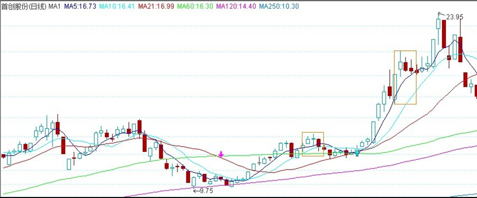

注意，顶分型的时候是形成顶分型那天冲高卖，而不是收盘等顶分型都很明确了再走，例如在600008的903的例子里，只要当天不破20.9，肯定就是顶分型，这不需要收盘才知道，没开盘都知道的。关键是结合小级别的走势，却当下确认这卖点。然后第二天的回补关键看5日线是否有效跌破，而判断的关键，其实不在5日线，而在小级别的是否盘整背驰上。

这些细微的技术问题，都需要不断磨练才能操作自如，现在，最好多找些图来看，先感受一下，否则一点概念都没有，操作什么？

注：高级别顶分型后成为中继，在小级别里发生的情况是，盘整背驰或者出现第三卖点加段背，启码向上的二段确认小级别扩展。

第79课读后感：

1、“这两个图一定都不难分辨，首先，前提是这两个的前面都没有其他走势了，否则这种分析没意义，前面有其他走势，就有这很多不同的可能变化。”这段话很重要，这是一种注解。

2、用这两张图缠师是重点讲包含关系的应用的。

3、利用顶分型进行操作时，必须配合小级别的图。

4、利用分型进行一些辅助判断的问题。一般，都至少用日线以上K线图上的分型，当然，如果你不觉得麻烦，30分钟也是可以的。但那些变动太快的，准确率就要大大有问题了。

[2007-09-11]要来的总要来---为下跌热烈鼓掌

(2007-09-11 15:59:25)

最近反复强调，企图和政策对着干的人，最终的结局就是消失，这已被中国资本市场18年的历史所反复证明。不管任何理由，今天的下跌值得热烈鼓掌。

技术上，本ID已经很明确地说过，本周将有绝大可能构成周K线上的顶分型，这是3600点以来的第一次，而在小级别上，目前依然可以归为5分钟的中枢震荡，操作上先卖后买的原则，足以让你避开今天的下跌。

好了，下跌已经是事实，就不用多说了，问题是后面如何去操作。昨天图上的79在5265点，只要后面的1分钟走势反抽走势不能重新站上该位置，则第三类卖点成立，后面至少要扩张成30分钟的中枢，最恶劣的就是5分钟的中枢下移。

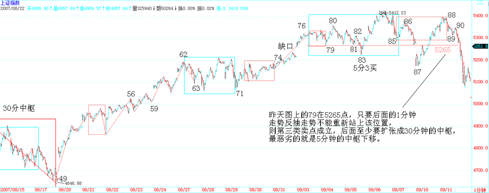

短线上，日线的9月7日，顶分型形成，显然，现在一定要形成至少笔的调整，因此，在形成有效的日线底分型之前，大盘的调整不会有效结束。但短线的震荡反弹机会还是很多的，有没有必要参与，就要根据各人的情况了。

目前5周线在5074点，一般来说，第一次触及和跌破5周线后，都有一次强烈的反抽，因此配合上面的分析，该反抽是否够成5分钟中枢的第三类卖点，将决定整个调整的力度。

另外，由于周线的顶分型除非有特别的意外，已经成立，所以关键要看这顶分型后的调整是两种类型中的哪种，也就是是否有效跌破5周线，一旦有效跌破，那调整就级别大了，至少要形成一个周的底分型才能结束；如果不有效跌破5周线，那么调整的幅度就有限。

本ID在八月下旬就明确说过，任何与2/3线相关的活动，本ID都是支持的，现在又见2/3线，调整将以该线为基准，上下震荡构成，只要最终能站住该线，大盘依然会再次展开中长线的行情。而在站稳该线之前，反复难免，看看3000点下的1/4线、4300点下的1/2线当时是怎么走的就明白了。

市场操作中，最多见、最无聊的，就是上涨的时候就忘了还有调整的事情，一调整就认为世界要末日，这种心态，还是回家买豆腐吧。

所有下跌后就怨这怨那的，都请离开市场。政策面的变化难道是今天的？昨天还不是很牛说要顶着政策上？现在怎么蔫了？这市场的操作，都是自己的，要怨的只有自己的贪婪与恐惧。

万古长空，一朝风月，没有任何走势值得叨唠的，过去的就过去了，关键是后面的操作。无论前面的操作是成功还是失败，只要市场在，人在，股票在，资金在，这游戏就继续运转，没有必然的胜利者和失败者，关键是从此刻起，与自己的贪婪与恐惧说再见，深刻了解自己的能力与可能性，形成一套适合自己的操作原则，这样，失败的可以胜利，胜利的继续胜利，对过去说三道四没什么意义。

今天有事，不能回答问题了，先下，再见。

## 教你炒股票80：市场没有同情、不信眼泪

(2007-09-11 21:38:07)

今天本应该说点别的，但市场一跌，大多数人都没什么心情看别的，所以不妨再说一下股票。而股票又何曾就是股票？把股票只当成股票，那当然会被股票所缠。

股票从来就不是股票，而是你的贪嗔痴疑慢；没有任何的失败相关于股票，而只关于你的贪嗔痴疑慢，股票不过是一个幌子，一个道具。

在西方，真正在资本市场上有成就的，基本都成了哲学家。没有对市场的洞察，靠整天这消息、那题材地折腾，那永远只能在散户的区间中震荡。有此眼界，不一定能达此高度，毕竟眼高手低也是通病；但无此眼界，就一定不可能达此高度。

本ID有时候喜欢用一些刺激性的词语，为什么？就如棒喝，就是要刺痛你，激发你的贪嗔痴疑慢，这样才有醒的一天。所有希望来市场寻找温情、同情、眼泪的，都可以回家磨豆腐，这些玩意，市场里什么时候曾有过？

在市场里要成功，除了比市场还要强悍，别无他法。市场出现卖点，你还幻想着火星，那就回火星去吧，地球需要的是手起刀落的强悍。

这次，提供了一个绝佳的例子，那么，不妨看看所有没有强悍的究竟都犯了什么毛病？注意，这不是批斗会，而是严肃的解剖，无论你现实中具体如何操作，都有解剖的必要。

市场，没有逻辑，本ID的理论给了市场以逻辑。

一、所有的顶点都必然是顶分型。

这是本ID理论的一个最简单的结论。从这可以严格推导出什么？就是一旦出现顶分型，离开就是唯一的选择。至于顶分型后是否形成笔，那是离开后再判断的事情。顶分型后，无非两种选择：1、形成笔，也就是构成一个底分型与顶分型间有不共用的K线。2、不形成笔，也就是构成的底分型与这顶分型之间只有共用的K线。

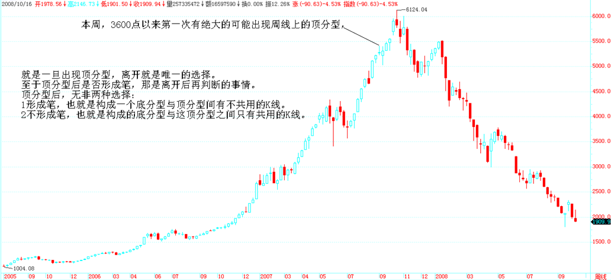

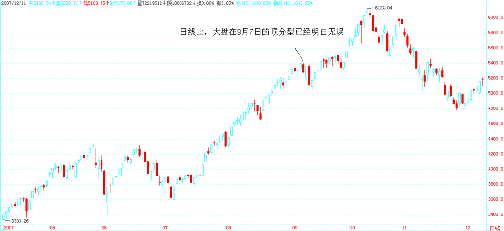

但无论哪种选择，都有足够的空间让你的反应，如果是第一种，那调整是大的，第二种，调整是小的，这，在昨天，本ID专门写的课程里有很多例子反复说明了。为什么？因为本周，3600点以来第一次有绝大的可能出现周线上的顶分型，这可不是今天才说的。

那么，这么明确地知道了这一点，按照市场的逻辑，正如昨天的课程里反复强调的“注意，顶分型的时候是形成顶分型那天冲高卖，而不是收盘等顶分型都很明确了再走”，那么对于周K线，这一点是一样的。

而日线上，大盘在9月7日的顶分型已经明白无误。

二、中枢震荡的卖点都是出现在向上离开中枢时

这也是本ID理论中最简单的结论了，那么，在最近形成的5分钟中枢中，任何向上离开5333点的震荡，最终都将形成卖点，当然，该卖点后回抽如果回不到5333点，可能形成第三类买点，但这是卖点后的事情，没有任何可能比当下的卖点更重要。而且，股票的交易规则，没有规定卖了就不能再买。

现在，我们可以很客观地面对这样一个问题，就是，一个离开5333点的中枢震荡把指数带到了5395点，该震荡对应的线段出现明显的类背驰然后出现明显的破坏，这时候，我们可以很理智地判断当下的形势：

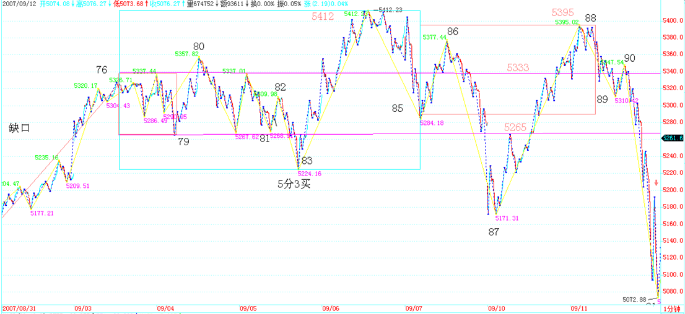

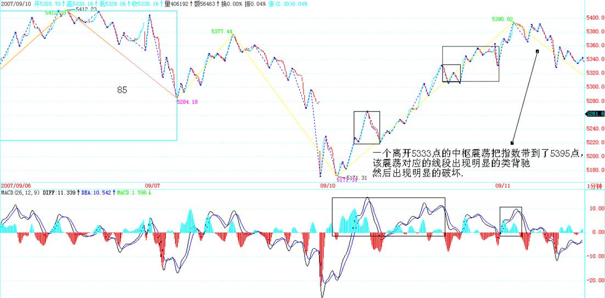

1、周K线顶分型可能不成立，也就是可以突破5412点，和5395点相差的距离就17点。

2、周K线顶分型一旦成立，那么，即使不形成周线图上的笔，也将至少调整到出现一个底分型，至少去碰一次5周均线，而一旦出现笔，那调整的幅度就至少是对3600点以来的总调整，最强势的1/4，也要有450点，更不用说1/3、1/2的比例了。

3、短线中枢震荡已经出现卖点，如果在这个位置卖，就算后面周的顶分型不成立，也有震荡的低点以及第三类买点可以重新介入。

归纳上面三个最严格的判断，那么，该干什么还不是一目了然的事情？

本ID在昨天特别强调，这时候宁愿卖错，绝对不能买错。为什么要强调这，就是本ID知道，很多人，被自己的贪嗔痴疑慢所迷惑，宁愿用十几点去对赌几百点，用1%的可能去对赌99%的可能。如果1%可以换来100倍的收益，那当然没问题，但事实上根本不是这样，那么，为什么还要坚持？说白了，只有五个字：贪嗔痴疑慢。

对于散户来说，本质上没有卖错，只有买错。为什么？卖错又不会亏钱，买错就不同了。卖错了，有钱，这么多股票可以被面首，为什么要一棵树吊死？

而且实际上，只要你不被自己的贪嗔痴疑慢所左右，根本也不存在卖错的问题，很多人，在连日顶分型的雏形都没有的情况下就卖，为什么？不过是贪嗔痴疑慢，觉得高了、觉得恐慌了，觉得惊吓了。而到真正的顶分型出来了，反而要假设这顶分型是假的，调整一下就可以突破的，就不觉得高了，不觉得恐慌了，不觉得惊吓了，人的颠倒，往往如此。

来本ID这里，如果真是想洗心革面，就要首先掌握本ID的理论，然后用该理论去操作，在操作中把自己培养成钢铁战士，钢铁战士的最基本标准是什么：

一、买点总在恐慌的下跌中形成，但只要买点出现，就要义无返顾地买进。

二、上涨总在不同情绪的交织中进行，抵抗住各种情绪的干扰，用钢铁般的意志把股票持住，决不中途给抛下车。

三、卖点总在疯狂的上涨中形成，只要卖点出现，手起刀落，让股票见鬼去。

四、任何的操作失误，只是一次跌倒，跌倒就爬不起来的，绝对不可能是钢铁战士。失误就要总结，绝对不在同一错误上犯上两次。

五、买错比卖错严重，一旦确认买错了，一定要手起刀落，让股票见鬼去。如果市场给你一次改正错误的机会你没把握，也就是第二类买卖点，那就买豆腐回家；如果市场给你第二次改正错误的机会你没把握，也就是第三类买卖点，那就直接回家磨墙。

六、市场只有你才能帮助你，被市场毁掉的是你，战胜市场的也是你，你比市场强悍，市场就是你的；否则，你就是市场的点心。

七、踏准市场的节奏，就可以在刀山火海中逍遥游。

本ID这里，人越少越好，草深三丈也无妨。如果不想成为钢铁战士，那就没必要来这里看任何有关股票的东西，其他东西可以看，别的地方可以去，何必来这里生气？

如果哪一天，你钢铁战士了，你也没必要觉得本ID教了你什么。本ID这里无授无得，本ID无一法给人，你只是你，你钢铁了，自然就战士了，和本ID无关。

但你没成为钢铁战士之前，最好还是有自知自明，本ID反复强调，如果你技术不行的，没有手起刀落的修为，就先把仓位减下来。那么，很多没减的，又没有手起刀落修为的，是不是又被贪嗔痴疑慢？

没到那水平，没到能在刀锋上舞蹈的水平，就别玩悬的，干自己能力范围内的事情。市场中最大的毛病之一，就是杀牛用鸡刀，屠龙用鸭刀，最后都被鸡了鸭了去了。

市场上不是每一笔钱都适合任何人去赚的，面对市场的机会，少点贪嗔痴疑慢，认清自己的能力，这比什么都重要。

市场是连续的，高位走了不是天堂，高位没走不是地狱。大跌，不过是下一买点后大反弹的前戏。这一切，都逃不过本ID的理论，而是否参与，则与你的操作级别相关，也和你的操作能力相关。

没有人天生就是胜利者，也没有人天生就与失败为伍。人人是佛，无一人可度，无一人需救，人人有明珠一颗，照破山河大地，又何必憋屈了自己？

第80课读后感：

1、在市场里要成功，除了比市场还要强悍，别无他法。

2、一、所有的顶点都必然是顶分型。

二、中枢震荡的卖点都是出现在向上离开中枢时。

3、股票的交易规则，没有规定卖了就不能再买。

4、买点总在恐慌的下跌中形成。

5、卖点总在疯狂的上涨中形成。

6、在西方，真正在资本市场上有成就的，基本都成了哲学家。

7、任何的操作失误，只是一次跌倒，跌倒就爬不起来的，绝对不可能是钢铁战士。失误就要总结，绝对不在同一错误上犯上两次。

8、买错比卖错严重，一旦确认买错了，一定要手起刀落，让股票见鬼去。

9、市场只有你才能帮助你，被市场毁掉的是你，战胜市场的也是你，你比市场强悍，市场就是你的；否则，你就是市场的点心。

10、踏准市场的节奏，就可以在刀山火海中逍遥游。

11、人人是佛，无一人可度，无一人需救，人人有明珠一颗，照破山河大地，又何必憋屈了自己？

[2007-09-12]本ID理论的现场教科书演示

(2007-09-12 15:42:13)

今天的走势太技术，简单说，就是昨天说的，跌破5周线后必然有反弹，问题的关键是这个反弹能延续到什么位置，如果不能抽回5265点之上，那么后面的走势依然充满凶险。

但如果了解了本ID理论的一些最简单结论，那今天的走势，简直就是一个现场教科书演示。你可以清楚地看到，走势是如何从线段扩张成一个1分钟中枢的，而其中利用背驰等关系，又是如何能在火海刀山中逍遥游的。

显示，第一个绿箭头的那一笔，没有发生笔破坏，那必然要回落去完成线段的走势，这是理论上100%保证的。

而92这一处，出现线段破坏，但该线段不能拉回85处，那么这就构成了85-88这1分钟中枢的第三类卖点，后面的继续下跌也是理论100%保证的。

93处，标准的线段类背驰，这就意味着92这1分钟第三类卖点，将出现中枢扩展，至少形成一个1分钟中枢，这也是理论100%保证的。

也就是说88-93的下跌已经完成，后面必然有一个针对这下跌的反弹。后面的演化，都如教科书般标准，学过本ID理论的，都知道这一切都可以当下判断，无须事后分析。

那么，现在后面的走势如何，很简单，84-93这个1分钟的走势类型离开76-85这个5分钟中枢后，就要看一个1分钟的走势类型的反抽能否出现回到79这一点，也就是5265点之上。不行，就构成这5分钟中枢的第三类卖点，后面至少要扩展成为30分钟中枢，最恶劣的，就是一个5分钟级别的下跌。

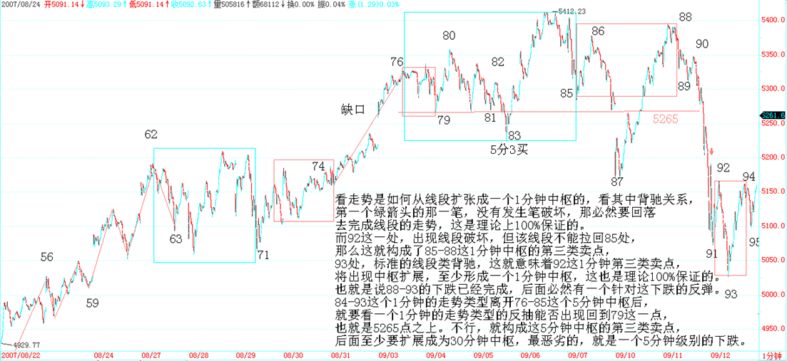

今天在93点按理论要求进去的，以及昨天没按理论要求走的，都要关注这第三类买卖点是否成立，如果不成立，那大盘就继续中枢震荡，那简直是本ID理论的天堂。

个股方面，其节奏不一定和大盘一样，用本ID股票为例子，600578、000099、000999这些，昨天并没有任何构成日顶分型的迹象，而今天很快也破坏了形成日顶分型的可能，这是短线的强势股，就一定要耐心等待日顶分型的出现。

而像000938这些，如果你用本ID的理论去操作，里面的短差机会对于散户来说简直好玩透了。请好好研究一下000938的图，看看昨天的顶分型多么标准，而今天17.59的底背驰又是多么经典，力度比较请看5分钟图。这两者的差价有多少？

别看不起短线，看不起短线的，不过是因为你没这水平。当然，没这水平，就别太短线了，短线可需要战士够钢铁。

本ID的理论可不单单是短线的，各种级别都适合，关键是你能真掌握了。先下，再见。

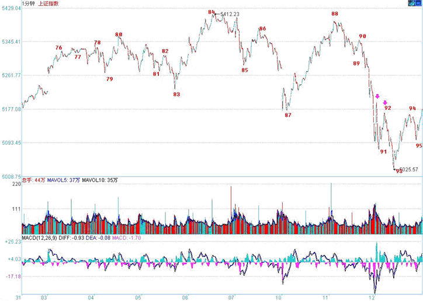

[2007-09-12]刚回来，说两句

(2007-09-12 23:58:00)

刚回来，一个极端无聊的晚上。本ID在西南某省投了一个矿，结果内部的一些事情闹到本ID这里来，搞到本ID用了一晚的时间去折腾这事情。最后，本ID一轮花言巧语，终于把N个属于本ID父辈年龄的老头给说回去，明天一大早飞机，老头们可以和北京说88了。

本ID给他们下的一个套就是，你们好好把你们现在的业务搞好，比矿有前途，你们这是现代服务业，一旦你们在两年内搞出业绩来，本ID一定PE你们，现在这些小事就算了，以后你们前途无量，你们要搞一个最牛的上市公司，本ID就当你们的小股东。

不说了，累了，二级市场就没这些破事，在中国，哪个人斗人起来不都是英明神武的？这些五、六十的老头，也是行内的超级专家了，还斗个不停，知识分子有时候就是该被洗刷洗刷。

废话一大堆，其他东西没时间写了，晚上还有足球，本ID休息一下，3点还要足球。先下，再见。

[2007-09-13]有些钱不是适合每个人赚的

(2007-09-13 16:00:16)

看完下面文章，请务必看  HYPERLINK "http://blog.sina.com.cn/s/blog_486e105c01000cl5.html" \t "_blank" 各位注意，严重更正

首先表扬一下某网友，请看：

[匿名] 新浪网友 删除此人所有评论2007-09-13 11:25:01

呵呵，被我说中了，目前就看破不破5166。不破5166就是1F三买，那就还有机会冲击5265

这就如同下棋，只看一步，肯定高手不了，能知道上午的跳水，其实是去形成92-95的第三类买点，这就不错，为什么？因为一般都关注5265点了，5265点按理论，如期成为大盘的阻力，由此产生的回落，当然可以短差一把，但由于在96时，95-96与93-94的力度对比并没有明显的类背驰，而且一旦回落形成下面1分钟的第三类买点，反而成为反弹继续的动力，能看出这一点，就比光看5265点要更进一步了。

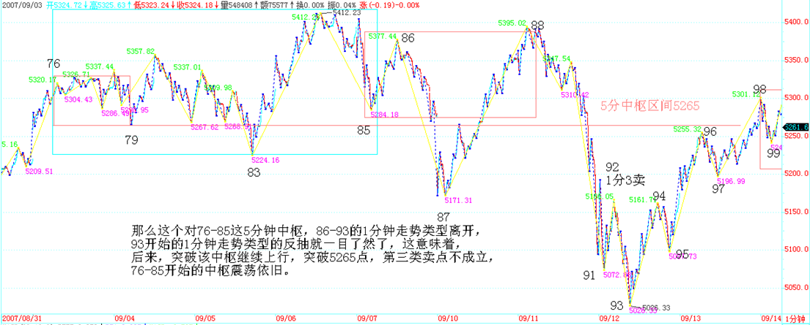

后来，96到99形成一个新的1分钟中枢，那么这个对76-85这5分钟中枢，86-93的1分钟走势类型离开，93开始的1分钟走势类型的反抽就一目了然了，这意味着，后来，突破该中枢继续上行，突破5265点，第三类卖点不成立，76-85开始的中枢震荡依旧。

显然，目前这个93开始的1分钟走势并没有结束，96-99是第一个中枢，如果是盘整走势，那么99开始的向上就要和93-96的形成盘整背驰，如果不形成，这走势就强了，理论上大盘完全可以再创新高。但探讨这个问题没意义，关键是看这盘整背驰是否形成。

不过，对于96-99这1分钟中枢，其第三类买点还没有形成，因此，比上面的盘整背驰还要急迫的，就是要确认这第三类买点，否则，最多只能是这1分钟中枢的震荡，然后由此产生96-99的第三类卖点，转而下跌也是符合理论要求的。

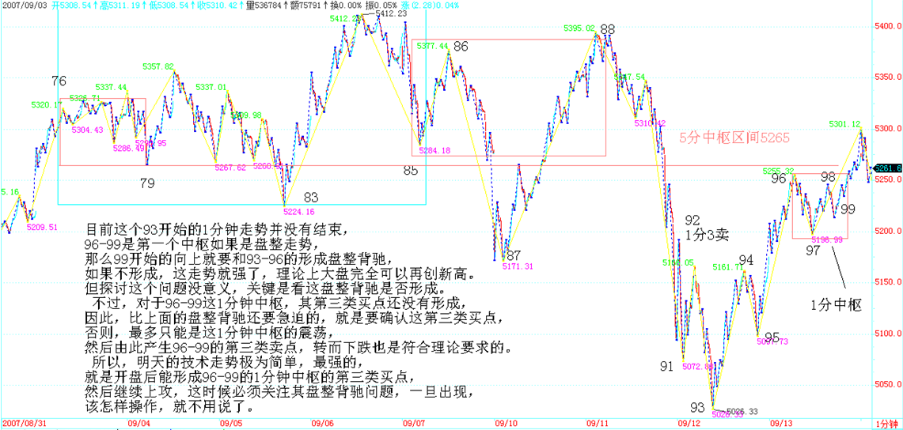

所以，明天的技术走势极为简单，最强的，就是开盘后能形成96-99的1分钟中枢的第三类买点，然后继续上攻，这时候必须关注其盘整背驰问题，一旦出现，该怎样操作，就不用说了。

弱的，就是不能形成第三类买点，然后继续中枢震荡，最弱的当然就是形成第三类卖点，然后再次大幅下跌。

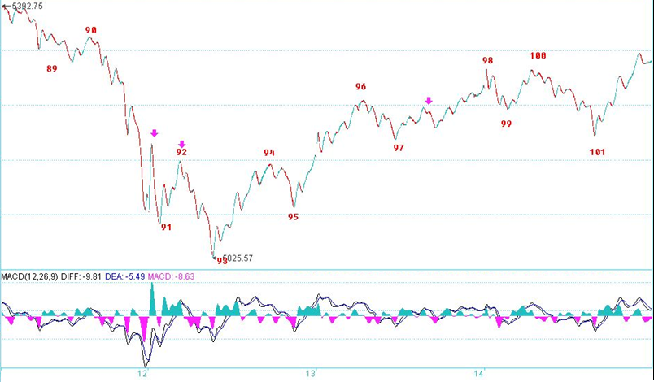

因此，明天的走势，只要看好这几点，一切都在当下把握中。

注意，正确的操作，就是93背驰进入后，现在一直持有着，或者你有技术条件，96-97的震荡的可以对冲一把的，回补或换股后，现在应该是持有状态。

最坏的情况，就是今晚突然有巨大消息，这样明天一开，确定96-99的第三类卖点成立，就手起刀落。当然，这种情况，一百天也碰不到一次，所以一般情况，就可以耐心等待真正卖点的出现。卖点出现干什么，就不用说了。

上面说的都是短线，这对技术要求高，没这理解力与技术的，就算了，把仓位调节好，有些钱不是适合每个人赚的。

当然，只要你对本ID的理论有一定认识，那没有什么钱是不可以赚的，因为所有的赢利机会，本质上都被本ID的理论所把握，唯一的问题是你的理论把握程度与交易通道，反应速度等等。理论保证所有机会，那你的精力与资金不可能参与所有的，所以就只能有所选择了。

个股方面，没什么可说的，像小安子，那些对他不满之人，现在也如同等比一样没什么可说的了。000938，今天提供了一个底分型的买入机会，就算你不关系这股票，那也请从纯技术角度，好好研究其图形。

注意，下面都是梦话，谁信谁有毛病：

这里再说一只股票，注意，这股票风险极大，不适合一般人，本ID先把其前因后果说清楚，这股票是600078。该股的问题是在云南买别的矿的时，突然发现买的地方下面有另外的矿，那矿就是600497搞那种，据说量比600497还大。

注意，因为本ID一直有参与矿的事情，这消息的来源与此有关。但这消息的准确性问题不大，但最大的问题是，该公司去买的时候，不是直接用上市公司，其次，这东西，完全存在可能就是被他们低价倒给自己，因此上市公司最终没什么利益。

因此，建议，对云南熟悉的人，自己去调研一下，看这事情的准确性有多大，千万别只听本ID说，本ID目前也在核实中，并不保证任何问题，而且就算是真的，也有可能不装到上市公司里，所以完全有可能是闹剧一场。

消息就这样了，如果大盘下跌，这股票完全有可能跟着大幅度下跌，所以任何头脑发热就冲进去的，自己负责。马上要去看一个PE，车子在下面等着，先下，再见。

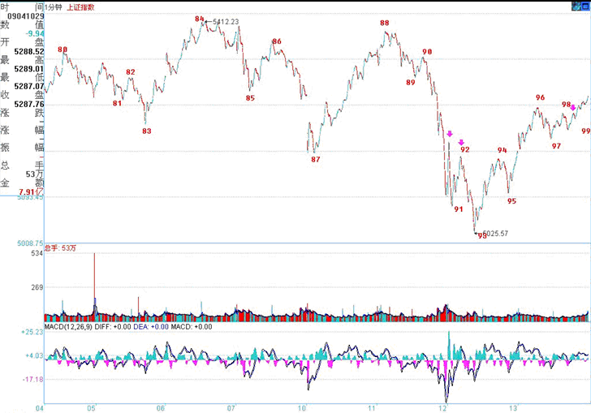

[2007-09-13]各位注意，严重更正

(2007-09-13 20:55:15)

各位注意

严重更正

今天收盘后事情不断、电话不断，后来又要赶去看一公司，司机按时到，本ID是在赶着把文章写好，连复查一遍都没有，导致今天的划分出现严重错误。以后尽量把写帖子的时间安排充裕点，但有时候实在太忙，出现点错误，也请各位原谅。

错误的划分还在今天的收盘分析中，本ID也不更改，把错误的放在那里，好当一个比较，对学习划分有大的帮助。错误就在于错把绿箭头的那一下当成一段了，这是错误的，中间那一折仔细看一下就知道不构成一笔，而一段是至少三笔的。

因此，按照正确的划分，大盘的走势比错误划分中显示出更强的趋势，也就是93开始的回抽，是一个标准的线段类上涨，连1分钟中枢还没构成。当然，明天开盘一跌破96，1分钟中枢就形成，而如果不破，97开始的线段依旧延伸，后面的线段回抽不破96，那这线段类上涨就延伸出3个类中枢了，那当然是超强的表现。

至于其他的分析，依然有效，就是76开始的5分钟中枢震荡没形成第三类卖点，线段类上涨都已经穿越5265点，当然比1分钟走势类型穿越5265点还要强悍。

明天，就要注意这线段类上涨的结束位置，然后下来的线段调整，必然形成1分钟中枢，其后走势，都与该1分钟中枢的演化相关，这太简单，就不要详细说了。

等等，找找有没有发现本ID错误的，都给戴上大红花。

匿名] 赚到了 2007-09-13 17:18:33

[匿名] laowang 2007-09-13 16:23:07疑问：缠MM：98——99并不是一线段啊？只是一笔，各位同学有不同意见吗？

===

同感，97接下来的线段还没走完。

匿名] 新浪网友 2007-09-13 17:10:22

有疑问：98到99应该不是一个线段吧？我的看法从97开始的线段目前还没有走完，请大家讨论。

匿名] 新浪网友 2007-09-13 16:27:34

我觉得98、99段分得有问题。我在分时，仅到97段。请斑竹讲解一些。谢谢

找到不少，可能有漏掉的，一律大红花。

由此可见，如本ID反复所说，本ID的理论如同几何学，是可以100%严密地讨论的，这里没有权威，连本ID都不是，本ID错了也就错了，没有什么可说的。

有人说，错了也没什么，只是把一段给分错了，但这里的差别大了去了，因为这样，市场的真实力度等就分析不对了，原来是一个线段类上涨，搞成1分钟走势，那样，回拉的力度差别就大了。而级别越小，证明回拉力度越大，所以必须绝对准确，这才能真正反映市场的真实情况。

必须用最严谨的态度来对待划分，这样才能真正看清楚市场在干什么。

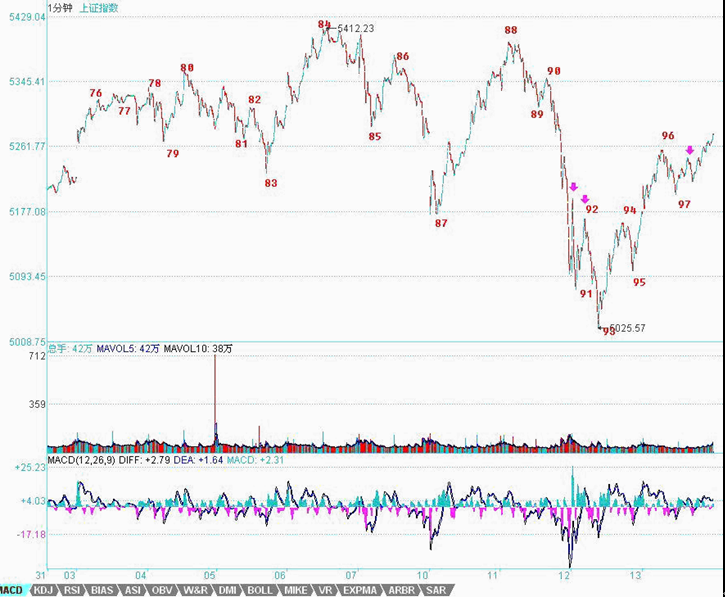

缠中说禅：2007-09-13 21:10:56

补充一句，600078的基本面，在2个月前就有相关传闻，但那时候关于矿的量没有说法，目前有了新进展，不过最终能否实现对上市公司的装入，那是一个远没答案的问题。而且详勘资料本ID还没看到，所以一切都只是一个传闻，就算本ID最近看到了正式的详勘资料，也绝对不能保证这玩意就能放到上市公司里，所以一定不能以此为准。

缠中说禅：2007-09-13 21:15:17

看来明天是个好天气

==

请不要预测，看当下的图。股市不需要愿望，只需要真正的操作。

缠中说禅：2007-09-13 21:16:34

我也发现了啊 老大表扬我下吧　我就是没胆说出来啊

==

有话就请说出来，本ID这里说什么都可以，只要新浪能承载，本ID这里就没有不能承载的。

缠中说禅：2007-09-13 21:17:47

对不起，昨晚熬夜看球，今天要早点休息，先下，再见。

[2007-09-14]下周焦点：能否破坏周K线顶分型

(2007-09-14 15:33:01)

显然，本周如期出现周K线顶分型，而且制造了一次绝妙的短线机会。那么，下周就在于，能否破坏这周K线顶分型。看过本ID课程的都知道，周K线顶分型出现后，如果在5周均线处得到支持不有效跌破，那么，该顶分型只制造一个小级别调整，不会出现周K线上的笔调整那样的大级别调整。因此，下周的走势十分明确，下面就看5周均线的支持度能否制造该顶分型的破坏。

小级别图上，今天的走势在昨天已经明确说过，就是形成1分钟中枢，然后根据该中枢的震荡情况决定行情的发展。今天的走势，其实就干了这样一件事情。下周一的走势最简单，就是98到101这1分钟中枢究竟是先有第三类买点还是先有第三类卖点，如果是前者，那么这个1分钟的向上走势将延续，顶分型的破坏的可能性极大。如果出现后者，那么二次探底就不可避免，5周均线将继续受到考验。

这两天的图形，完美地演绎着本ID的理论，从中可以看出，一个线段上涨如何演化出一个1分钟走势类型，后面，继续看这走势类型如何生长，到最终的完成。如果你真明白本ID的理论，看行情的走势，就如同听一朵花的开放，见一朵花的芬芳，嗅一朵花的美丽，一切都在当下中灿烂。

周末，让股票豆腐、磨墙去吧。先下，再见。

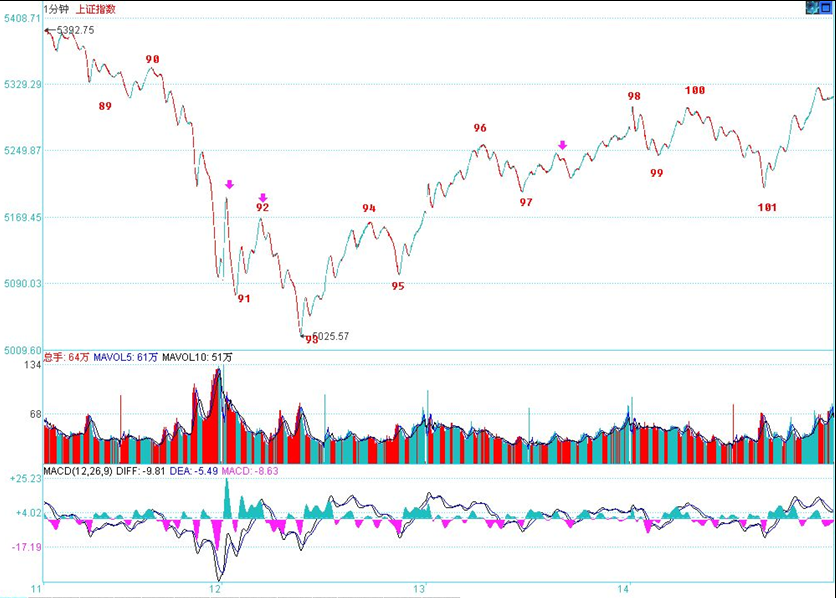

[2007-09-17]2007年末，资金与政策博弈下的走势分析

(2007-09-17 00:41:48)

这轮从2005年中开始的行情，一直受到1992年1429点开始的系列比例线的严格控制。例如，在3000点下，震荡确认的是1/4线，也留下了227暴跌印记；而在4000点上，震荡确认的是1/2线，恰好在5月的180月大周期中，以530暴跌来继续印证这些比例线对大盘走势控制的有效性。而目前大盘的走势，同样没有离开这系列比例线的控制。

9月，2/3线的位置在1429+184*30*2/3=5109；3/4线的位置在1429+184*30*3/4=5569。显然，911的大跌行情，是对2/3线突破后的回抽，但该线最终是否被有效站稳，一般来说，都需要3个月以上的确认周期，这在1/4与1/2线的确认中都得到完美的验证。

由于2/3线与3/4线相差太近，所以今后行情的走势，将受到这两条线同时的控制与确认。由于本月是第三季度K线的收盘月，因此，只要本月收盘不能收到3/4线之上，那么可以肯定地说，2007年的最终收盘，将受制于3/4线，也就是说，即使年收盘位置最终能向上脱离3/4线，但其中必然会出现至少一次类似227、530、911的走势。

可以相当肯定地说，根据交替原则，227是小调整、530是大调整，如果针对2/3线的调整是小调整，那么，针对3/4线的调整，将有极大的机会至少是一次如530走势般的剧烈调整。根据9月收盘相对2/3线的位置，可以将大盘走势进行分类：如果收盘在该线之上，那么大盘是强势，反之是弱势。其强弱程度的绝对值正比于收盘相对2/3线的距离。

最简单的经常是最便利且最有力的，在对行情的分析与操作中，情况同样如此。在技术分析中，没有比均线系统更简单的，但在中长周期的分析中，一条5月或5周均线，就比绝大多数的复杂系统都有效了。从2005年中行情发动以来，大盘从未有效跌破过5月均线，甚至在530大跌中，也没有发生过，任何在5月均线下的走势，最终都被证明是空头陷阱。

但这样一个模式，最终必定会被打破，而打破之时，就是行情进入大级别调整的确立之日。请注意，该调整的级别一定大于530，也就是说一定是2005年中行情发动后最大一次级别的调整。反之，在5月均线被有效跌破之前，大盘的行情依然延续。

由于7、8月的连续月长阳，使得5月均线严重偏离，目前仍在4600点不到的位置，因此，9月的震荡，在技术上，是等待5月均线的上移。因此，第四季度的走势，归根结底只是一条，就是一旦5月均线上移后，能否继续站稳该线。也就是是说，行情是否继续被5月均线的上移惯性所带动？

而从中短线的角度，5周均线极为重要，一旦有效跌破，就意味着类530级别的调整不可避免。根据交替性原则，由于530是以空间换时间，那么，下一次类似级别的调整，有绝大的可能是以时间换空间。当然，这判断成立的前提是，行情没有受到特别的非系统性因素的影响。

由于去年大盘涨幅是130.43%，收盘在2675.47点，按相应比例，6165点成为今年一个标杆式的点位。还有，深圳成分指数在96年的行情中，也如本次上海指数一样略微跌破1000点后展开，而前者最终在6100点上见大顶，因此6100点附近是后者行情一个特别值得留意的位置。

站在对市场发展有利的角度，大盘年内最理性也是最理想的走势是：一、9月收在2/3线之上；二、第四季度以第三季度的长阳为基础进行震荡整理，震荡区间，以绕2/3线至3/4线区间为中枢展开，最终以十字星或者小阴小阳收盘。

但一旦政策面的压力超乎合理的范围，大盘将演化为一种具有压力的走势，即9月收盘在2/3线下，而第四季度最终以中阴线甚至大阴收盘。这种走势，必然使得年K线留下长上影，对明年行情发展的空间产生较大压制。反之，一旦资金面的肆虐超乎合理范围，那么大盘将演化为一种疯狂走势，即在今年内强行突破上面所说的6100点区域，这样，一次超530级别的调整将难以避免。

目前，资金面与政策面逐步走向平衡，一旦这种平衡被其中一面非理性打破，那么将对中国的资本市场中长期的发展制造不必要的困难。资金与政策的博弈，不仅是中国，也是世界资本市场历史发展中永恒的主题。如果这种博弈能在尽可能的理性与系统性范围内展开，那么对中国资本市场的发展将是最大的福音。

[2007-09-17]资金向政策发起新一轮挑衅

(2007-09-17 15:46:13)

今天的走势十分正常，无非就是延续了加息突破的老路子。周五的分析中已经很明确了，只要形成1分钟的第三类买点，那么新高就是绝大可能。今天早上11点多的那个第三类买点，极为教科书，后面的走势，就是本ID理论所100%保证的活动，没什么可说的。

大盘年末的走势分析，已经在今早所贴的“2007年末，资金与政策博弈下的走势分析”里，文章为了照顾大多数人，没有用本ID的理论分析，只是用了些通常的分析方法，因为这种预测性的文章，没多大意思，只是给各位一个大致的方向性。

真能有效战胜市场的，还是要学会用本ID的理论去当下的操作。上周一个绝妙的短差，然后又一个绝妙的回补点，从那5025点的93开始，一个1分钟中枢类型都没完成，但你明白本ID的理论的，就可以看着他按照理论的规范一步步地生长出来，这其中的从容与逍遥，又岂是那些用无数概率化的无聊玩意去争论大盘是新高还是不新高，真突破还是假突破的能明白的？

股票是用来操作而不是用来预测的，必须明白本ID理论知行合一的特点。现在十分简单，就是等待这1分钟走势类型的凋谢，具体的理论与操作，在课程里都反复说了，就不一一重复了。另外，今天的划分太简单，为了节约那可怜的200图空间，今天就不上传图形了。

由于在5000点反复震荡还跳过水，所以本ID对大盘所给予的空间也打开一点，在早上的文章中已经分析过，请过去看。总的来说，只要围绕2/3线到3/4线为中枢的震荡，都是可接受的。

今天，大盘的资金面向政策面发起新一轮挑衅，能否得逞，就看这几天政策面受刺激后的反应了，一般来说，本周没反应，下周反应的机会就越小，毕竟有一个长假期，稳定第一，没人会用这来开玩笑的。

个股方面，中字头的继续逞强，最近开始吹中字头的人越来越多，本ID在3600点开始说，现在就不说了。当然，中字头是本ID组合的一只翅膀，海枯石烂去了。

本ID的事情，都是尽量善始善终的。600569，当时9元说5个涨停，这倒霉孩子，碰上530，剧本只能变，这次从7元开始发力，折腾下来，也达到原来剧本的承诺了。后面当然还有剧本，但，本ID可已不欠任何人的话了。

600078，本ID最近找人去调查，这是最新的结果。该公司的所有在当地的子公司、孙公司都查了一遍，仍没有在当地国土部分申报有关领采矿证的资料，由于该公司在当地乱七八糟的公司特别多，也不知道有没有漏网的。没有采矿证，一切都不能算数。根据情况，大致有以下可能性：

一、一个闹剧

二、这些民营坏蛋想私吞了。

三、想学黄某某，先晾着，等大家都不注意了，再突然装进来。

所以，现在这游戏，已经从PE变成VC了。本ID毕竟离得太远，去企业又太显眼，又不想为这事情到基层兴师动众，只能通过省里某些标准渠道去了解。有在当地的人，如果有可能的，可以到企业进一步了解，看能否把VC再变回PE。

了解这事，顺便还了解了另一件事情，就是有人希望把某驴让美驴来入股，现在中驴很厉害，所以就有人要搞这样的把戏。不过企业相当抵触，所以这事情还真不好说。如果美驴真给放进来了，那些驴们又要疯了。但这只是一个有人在折腾的事情，在实际上，事都是折腾出来的，但折腾并不一定能事，所以，这也只能是一个VC项目，不能太沉迷。

注意，本ID说的是驴，可没说什么股票。

今天踩着刀锋，醉生梦死把上周完成的顶分型给破了，那也不妨醉生梦死一把，回答各位问题到5点。

HYPERLINK "http://blog.sina.com.cn/u/1215172700" \t "_blank" 缠中说禅：2007-09-17 16:06:45  [举报]

有一问题一直无解，100-101对98-99没有出现盘整背驰，其内部也没有线段内类背弛，怎么能当下地在101处判断回补呢

==

比较力度，用盘整背弛一招也不是光比较最近这一段的。以前有课程专门说过中枢震荡中的力度比较问题。你必须从96开始看，101没出来前，只能先看96-99这个中枢的震荡。这震荡没破97这点，就意味着震荡的力度有限，所以一定只是中枢震荡。而且100(注：101)的内部，一个典型的黄线下跌后双回拉后再下跌，而再下跌这段明显比不上第一段黄线。另外，柱子面积也比不上。

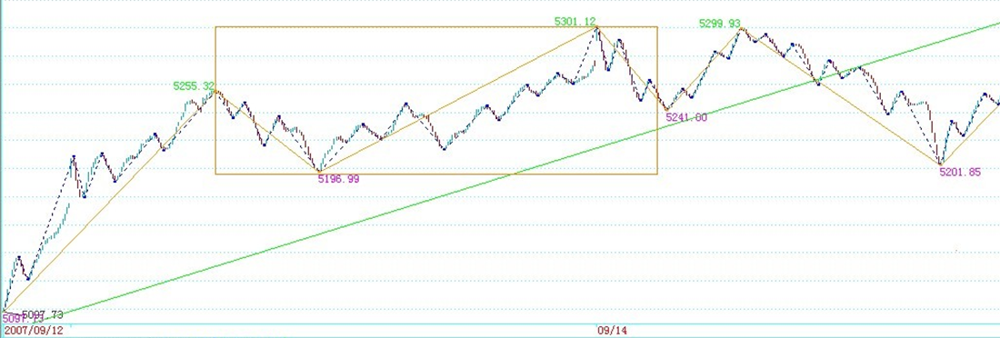

还有，线段下没有中枢，所以不能照套中枢概念，这必须清楚。一般来说，最好不要用线段操作。连中枢都没有，没什么意义，除非你概念特别清楚，对中枢震荡研究得特别明白。

本文由公众号 “三思复盘”  整理
