## 教你炒股票81：图例、更正及分型、走势类型的哲学本质(2007-09-17 22:57:16)

请首先看一个回帖：缠姐，请问图一是几段，图二是几段？？？(快乐vs菜虫2007-09-17 17:24:59)

====

如果５＝７或者５低于７，都是一段，如果５高于７，都是３段。

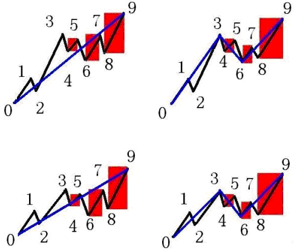

这两种情况，都属于线段破坏的第二种情况，所以必须考虑高点下来走势的特征序列，而且必须考虑包含关系，所以上面这位网友的回答才是完整的。

另外，有人提到71课里最后一个图，那个图显然是错的，问题就在于与这里类似的，把7的位置画高了，应该类似7的位置比类似5的位置低才对，那才是三段，当时画的时候，没特别注意。所以这里必须指出。

所以，一切根据定义来，把定义搞清楚了，一切都好办，就是本ID画错了，你也能一眼看出来。

另外，提一个问题，今天走势的划分，有一些特别的地方，本ID下午说的，有点问题，主要出在，1017的低点5386.47比前一分钟的5386.39点高，所以顶分型的顶在1017那时间，所以那里就是一笔，但图形上粗略看顶在16分那点，下午写东西太快，没有仔细去比较，晚上回来，仔细对比一下数据，才发现那里应该构成一笔，所以整个划分就要有点改变，也就是今天形成1分钟中枢了，该中枢前面一段很简单，关键是第二、三段，究竟怎么划的，能正确划出的，对线段划分也就有点及格了，明天下午再公布答案，可以对比一下。

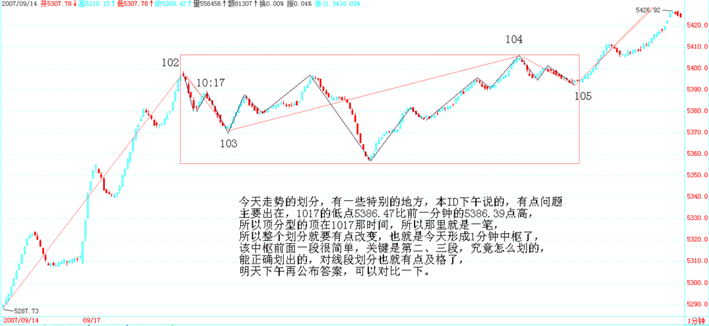

各位以后要吸取本ID下午失误的教训，对那些只有5、6根K线的，一定要看好其中是否有包含关系，这样才不会一时大意，这是最容易出毛病的地方。

有人可能要问，难道就那0.08的差别就可以影响整个大盘？这有什么奇怪的，如果你知道某些物理学的理论，就知道，在那些理论看来，我们的世界之所以这样，就是因为一些极其微小的差别造成了，没有那些差别，世界一定不是这个样子了。另外，请注意，一定要用同一种软件，这样，等于测量的精确度或误差是基本一致的，就保持整个划分是在同一误差或精确的基础上。

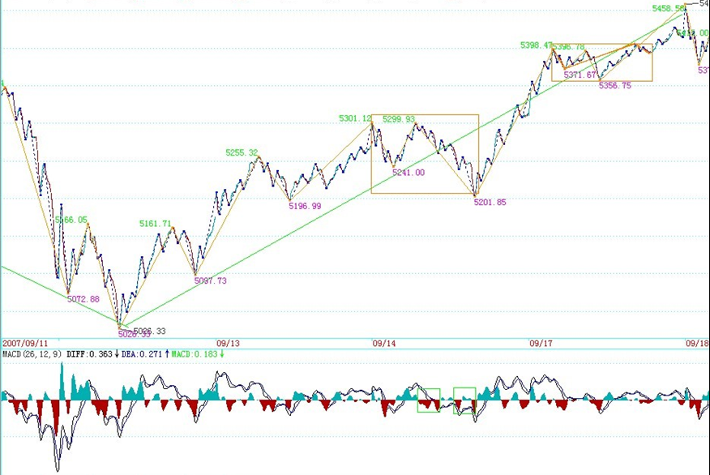

好了，闲话不说，进入新课程。

为什么要研究分型、走势类型等东西，其哲学基础是什么？这就是人的贪嗔痴疑慢。因为人的贪嗔痴疑慢都是一样的，只是跟随时间、环境大小不一，所以，就显示出自相似性。而走势是所有人贪嗔痴疑的合力结果，反映在走势中，就使得走势显示出自相似性。

分型、走势类型的本质就是自相似性，同样，走势必完美的本质也就是自相似性。分型，在1分钟级别是这样的结构，在年线上也是这样的结构，在不同的级别上，级别不同，但结构是一样的，这就是自相似性。同样，走势类型也一样。

正因为走势具有自相似性，所以走势才是可理解的，才是可把握的，如果没有自相似性，那么走势必然不可理解，无法把握。要把握走势，本质上，就是把握其自相似性。

自相似性还有一个最重要的特点，就是自相似性可以自组出级别来。上面的话中，先提到级别，在严格意义上是不对的。级别是自相似性自组出来的，或者说是生长出来的，自相似性就如同基因，按照这个基因，这个图谱，走势就如同有生命般自动生长出不同的级别来，不论构成走势的人如何改变，只要其贪嗔痴疑不改变，只要都是人，那么自相似性就存在，级别的自组性就必须存在。

本ID理论的哲学本质，就在于人的贪嗔痴疑慢所引发的自相似性以及由此引发走势级别的自组性这种类生命的现象。走势是有生命的，本ID说“看行情的走势，就如同听一朵花的开放，见一朵花的芬芳，嗅一朵花的美丽，一切都在当下中灿烂”，这绝对不是孔男人式的矫情比喻，而是科学般的严谨说明，因为走势确实有着如花一般的生命特征，走势确实在自相似性、自组性中发芽、生长、绽放、凋败。

因此，本ID的理论是一种可发展的理论，可以提供给无数人去不断研究，研究的方向是什么？就是走势的自相似性、自组性。这里，可以结合现代科学的各门学科，有着广阔的前景以及可开发性。

所以，本ID的理论，不是一些死的教条，而是一门生命学科。

只是，目前本ID只和各位讲述一些最简单的自相似性：分型、走势类型。

本ID的理论中，有一条最重要的定理，就是有多少不同构的自相似性结构，就有多少种分析股市的正确道路，任何脱离自相似性的股市分析方法，本质上都是错误的。

显然，分型、走势类型是两种不同构的自相似性结构，我们还可以找到很多类似的结构，但现在，还是先把这两个最基础的结构给搞清楚。条条大路通罗马，只要把这两个结构搞清楚，就能达到罗马。而其他结构的寻找、研究，本质上是一种理论上的兴趣。而不同的自相似性结构对应的操作的差异性问题，更是一个理论上的重大问题。

本ID的理论上还有一个暂时没有解决的问题，就是走势中究竟可以容纳多少自相似性结构，还有一个更有趣的问题，就是起始交易条件对自相似性结构生成的影响，如果这个问题解决了，那么，对市场科学的调控才能真正解决。

本ID的理论还可以不断扩展，也可以精细化进行。例如，对于不同交易条件的自相似性结构的选择，就是一个精细化的理论问题。

自相似性结构有什么用处，这用处大了去了。一个最简单的结论：所有的顶必须是顶分型的，反之，所以的底都是底分型的。如果没有自相似性结构，这结论当然不可能成立。但正因为有自相似性结构，所以才有这样一个对于任何股票、任何走势都适用的结论。

反之，这样一个结论，就可以马上推出这个100%正确的结论，就是：没有顶分型，没有顶；反之，没有底分型，没有底。那么，在实际操作中，如果在你操作级别的K线图上，没有顶分型，那你就可以持有睡觉，等顶分型出来再说。

另外，有了自相似性结构，那么，任何一个级别里的走势发展都是独立的，也就是说，例如，在30分钟的中枢震荡，在5分钟的上涨走势，那么两个级别之间并不会互相打架，而是构成一个类似联立方程的东西，如果说单一个方程的解很多，那么联立起来，解就大幅度减少了。也就是级别的存在，使得对走势的判断可以联立了，也就是可以综合起来系统地看了，这样，走势的可能走势的边界条件就变得异常简单。

所以，看走势，不能光看一个级别，必须立体地看，否则，就是浪费了自相似性结构给你的有利条件。

不行，快11点了，今天回来太晚，关于这个问题，以后再陆续说。先下，再见。

读后感：

1、一切根据定义来，把定义搞清楚了，一切都好办，就是本ID画错了，你也能一眼看出来。

2、本ID的理论是一种可发展的理论，可以提供给无数人去不断研究，研究的方向是什么？就是走势的自相似性、自组性。这里，可以结合现代科学的各门学科，有着广阔的前景以及可开发性。

3、本ID的理论，不是一些死的教条，而是一门生命学科。

4、有多少不同构的自相似性结构，就有多少种分析股市的正确道路。

5、所有的顶必须是顶分型的，反之，所以的底都是底分型的。

6、没有顶分型，没有顶；反之，没有底分型，没有底。

7、看走势，不能光看一个级别，必须立体地看。

(2007-09-18 15:53:21)等待那万众期盼的每周一跌

首先，必须声明，本ID昨天说的是驴，和任何股票无关。至于有些无聊股票，走出例如涨停那种很无聊的走势，可和本ID一点关系都没有。本ID这里可从不推荐任何股票，最多就是梦里胡言乱语一把，本ID要推荐，也推荐驴肉火烧实在点。

现在的走势，极端简单，就是真突破还是假突破的问题，一般来说，如果是假的，就是三、四天内见分晓，先来两、三个十字星之类的玩意，然后虚晃一枪向下跳水。如果按这个把戏，周四前后就是田亮一把的日子。而且，现在，每周一跳，跳了，都爽了，就该干嘛干嘛了。

当然，用本ID的理论，就没有这么多麻烦事，而且绝对不用去宣称什么这是世纪大顶之类的无聊事情。如果你是按30分钟操作的，什么顶呀底呀，只要按照节奏来，绝对不参与30分钟级别的下跌，那么这世界在你眼里，就只有三种活动，30分钟级别的上涨、盘整、下跌，世纪大顶、火里刀上也一样可以逍遥游，其他级别的操作也是一样的。

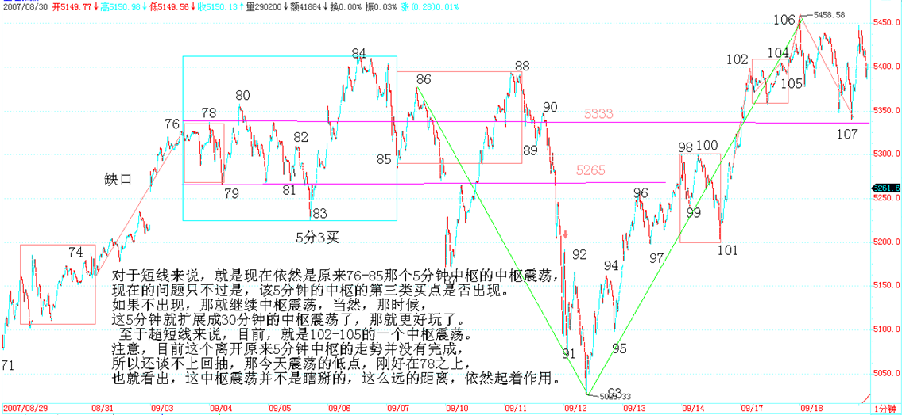

现在的情况十分简单，对于短线来说，就是现在依然是原来76-85那个5分钟中枢的中枢震荡，现在的问题只不过是，该5分钟的中枢的第三类买点是否出现。如果不出现，那就继续中枢震荡，当然，那时候，这5分钟就扩展成30分钟的中枢震荡了，那就更好玩了。

至于超短线来说，昨天问题的答案在图里就有了，分不清楚的，请好好研究一下。目前，就是102-105的一个中枢震荡。注意，目前这个离开原来5分钟中枢的走势并没有完成，所以还谈不上回抽，那今天震荡的低点，刚好在78之上，也就看出，这中枢震荡并不是瞎掰的，这么远的距离，依然起着作用。

个股，没什么可说的，就算是假突破，只要这大的中枢震荡存在，那么个股机会依然汹涌，假期前，又有一个持股持币的无聊问题，关键还是你的操作级别和该级别中的表现。对于完全不了解本ID理论的，就看5日或5周线，特别是5周线，这是中短线的关键。 

马上有一件新疆的什么无聊管道要上市的事情要谈，不能回答问题了，先下，再见。

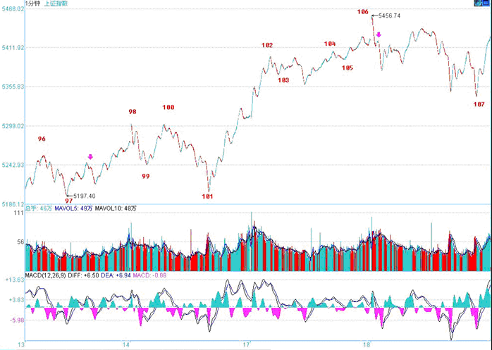

(2007-09-18 22:53:57)忽闻台风可休市，聊赋七律说《风灾》

回来晚了，有点累。听说上海那边，明天有可能因为台风休市，借个话头，写首七律敷衍一下各位。可惜，就算上海休市，深圳也还开，十一将至，真是有点无心恋战了，干脆都放假休息，游山玩水去，不亦快哉？

今天，急着外出，把107写成108，后来是在谈完一轮，去吃饭的路上车里改的。

现在发现各位对那些古怪的分段还是有点乱，那些古怪的分段，经常是因为第一次笔破坏时，延伸不出线段来，例如，今天图里绿箭头所指的地方，顶和底分型经过包含处理后中间没有K线了，这就不能算一笔。

本ID想了想，计算了一下能量力度，觉得以后可以把笔的成立条件略微放松一下，就是一笔必须满足以下两个条件：1、顶分型与底分型经过包含处理后，不允许共享K线，也就是不能有一K线分别属于顶分型与底分型，这条件和原来是一样的，这一点绝对不能放松，因为这样，才能保证足够的能量力度；2、在满足1的前提下，顶分型中最高K线和底分型的最低K线之间（不包括这两K线），不考虑包含关系，至少有3根（包括3根）以上K线。显然，第二个条件，比原来分型间必须有独立K线的一条，要稍微放松了一点，这样，象今天绿箭头所指的地方，就是一笔了，相应那三笔下来就构成一段了，整个划分就不会出现比较古怪的线段。

对线段一直比较晕的人，这个新的条件大概容易处理一点，至少可以避开处理如106到107这样复杂的线段，而这，本ID刚计算过，也不会影响整个线段的动力学能量。但103-104这样的线段，是无法更改的，这类线段必须能够处理。

另外，以前也说明过，现在再说一次，本ID平时交易时不用同花顺，只是本ID用的系统网上没有，所以那里的标记无法搞过来，因此，本ID在同花顺上的标记，都是收盘后才弄的，而两套系统的数据经常有点小出入，有时候偷懒，就照抄过去，偶尔就会出问题。其实，本ID这个示范，只是为了让各位能明白真正的划分，只是一个示范，如果你真明白了划分的原则，不看也可以，根据自己系统的数据，都有唯一正确的答案。分型、笔、线段，都是最基本的准备，关键还是通过这去分别出更高级别的走势类型，那才是操作的关键之处。所以，一定要把这两部分的区别搞清楚。

不说了，本ID写的七律来也，上海的朋友，看看和外面的比怎么样？

风灾

层城飙卷万星帷，昆柱倾摧折纆徽。

天海低昂惊叠错，云山吞吐莽相围。

九重阊阖龙虎散，六道娑婆神鬼饥。

斗碾参磨冰火淬，茫茫三界只灰飞。

(2007-09-19 15:42:03)政策对资金挑衅的反击

今天算不算田亮一把，估计要看了明后两天才知道了。因为，好象田亮参加的项目，有1米板，还有10米台，这玩意，要对比着才知道的。本来，美国减息，全世界喝了一把水井坊，但中国就是中国，不和全世界玩，咱自己玩。

年末行情的判断，在“2007年末，资金与政策博弈下的走势分析”说得很清楚，最理智的走势是怎么样的，也写得很清楚了，如果一方挑衅，肯定会被反击，今天三大报让各位学习，各位也就学习一把，水井坊给英国佬搞去全世界，到时候用英镑卖的，咱就喝王老吉，降降火。

技术上，昨天已经说得最清楚不过了，基本看法一样，首先小的1分钟震荡，今天没震出什么结果，而操作上，当然是冲高震荡时卖，卖了回来看，如果向下破位出第三卖点，咱就不管他，看他跌成王老吉还是水井坊再说，如果不出第三卖点，咱就继续陪他游戏。

不过，从短线政策的压力看，如果资金面上还继续麻辣火锅，火气旺旺的，那么，政策上大概就不是学习学习那么简单了，让你喝王老吉，那是给面子你，哪天让你吃点巴豆、喝点减肥茶，又有什么不可以的？

本ID总是想和稀泥，让双方都能平和点，但良好的愿望，绝不是本ID一个就能实现的，市场是大家的，是合力的。当然，本ID也懒得呼吁什么了，现在只有一个念头，快点放假，游山玩水去吧。

昨天，本ID“欣闻台风可休市，聊赋七律说《风灾》” 可能引起某些敏感，本ID后来就改成了“忽闻”，这就是和稀泥，本ID不想为一个字去坚持什么，没什么可坚持的。虽然原来的话修饰什么，是很明确的，不过，如果一个字能让大家少点争吵，那字又算得了什么？所以，资金与政策目前的困局，也是一样，资金去挣所谓的钱，难道就一定要只争朝夕了？退一步，难道不可以海阔天空？

只是美国一减息，某些如意算盘就难打了，本ID自己从来没什么烦恼，现在唯一的烦恼，就是看得太明白了。

昨天是918，我们补默哀三分钟吧。今天可以回答问题到4点半，不过都请先为918默哀三分钟。

注意 下午技术分析的补充请到今晚帖子里看。

《论语》详解：给所有曲解孔子的人（70）(2007-09-19 21:22:55)

对下午分析补充一句，今天日K线顶分型成立，因此下面的问题，就是该顶分型是否延伸为“笔”的问题了，关于该问题，有了上两周周K线顶分型的经验，如何去处理两种情况，应该不难了。

(2007-09-20 15:40:19)空头完败：必须让预测者出丑

预测是什么，本ID已经很明确说过，不过就是一个概率游戏。那些宣称什么地方是什么大顶的，和街边算命的没什么不同。股票是用来操作的，不是用来预测的，这是所有市场参与者的第一信条。

昨天的顶分型，有两种演化，一种就是破5日线延伸出笔，一种就是不破5日线，反而上破顶分型。今天大盘一开盘，市场就明确给了选择。注意，没有人比市场本身聪明，因为市场是合力的结果，如果你觉得比市场聪明，那么你就是把自己当上帝，上帝就得死。

市场每天都有预测者，根据概率，总有人碰到那最后唯一的馅饼，但这并不能证明市场是可以预测的，反而证明，预测市场只是一个无聊游戏。对了，不过证明那馅饼刚好砸到你了。

本ID昨天说了，短期大盘，就看那1分钟中枢有没有第三类卖点，而我们的眼睛告诉我们，我们没看到，这就足够了。没有第三类卖点，那就让市场继续发展去告诉你下一步的操作，这就是本ID理论的核心问题。

从资金、心理，本ID也可以给各位分析一下。现在，长假前只有最后一周了，中间还有一个中秋，市场做多资金最害怕的政策强力打压，可能出现的几率有多少？过了十一，那最重要的会议期间，还有谁有心思去搞什么政策强力打压？这样一个空挡，就给了做多资金一个好时机，这个时机里，如果能顺利完成诱多，那就有回跌的空间，否则，哪里来的空间？请问，如果没有1000点的回跌空间，对于大资金来说，有做空的吸引力吗？

说句狠话，现在很多做多资金，都是对政策面调控力度失望而再次做多的。现在，越来越多人接受本ID所说的刀锋上的游戏的观念。确实，现在很危险，但最危险的时候反而可能最安全。没有技术、没有胆略的，应该离开或减低仓位；有技术、有胆略的，真是最可疯狂的时机。真有什么硬东西来，就看谁刀下够狠，只要有手起刀落的勇气，谁又怕谁？

再次强调，现在的游戏很危险，一般人，没有那心理与技术，就半仓等待，或者就看本ID反复说的5日或5周线，有效跌破就一刀下去。否则，就继续玩。有人可能问本ID是什么头？本ID什么头都不干，多头抬不动，本ID比空头还砸得狠；空头砸不动，本ID比多头还回补得凶。本ID在刀锋上的操作原则一早就向所有公布，就是不再战略性买入，但战略性持有，并在来回震荡中减低成本、增加筹码。

有人说，今晚就有大利空怎么办？这种问题没意义，你应该问自己，你的刀快吗？

有人又问，你不是政策和资金博弈？是，但本ID不站在任何一方，本ID只会利用这种博弈制造的机会去增加自己的资产，这才是最明智的策略。

所以，各位就应该明白，本ID“2007年末，资金与政策博弈下的走势分析”里并不是对大盘进行预测，而是进行了一个完全分类。虽然，本ID愿意看到市场走成平衡的格局，这样对以后市场的发展有利，但这绝对不会影响本ID的操作。因为一旦资金对政策大面积胜利，大盘完全有可能在年末大面积突破6100点，但这样走势的后果，你必须清楚，因为在中国，政策一定是最后的胜利者，资金的疯狂，最终的结局只能是最大的扼杀。

但结局与利润无关，利润总是在过程中产生。结局很悲惨，但如果在悲惨到来的时候，你能全身而退，悲惨又和你有什么关系？说得更狠一点，任何的悲惨，只是去制造下一次的大机会。

没有失败者的悲惨，哪里有胜利者的辉煌。这就是市场的道理，接受不了就请离开。留下来的，就必须接受。

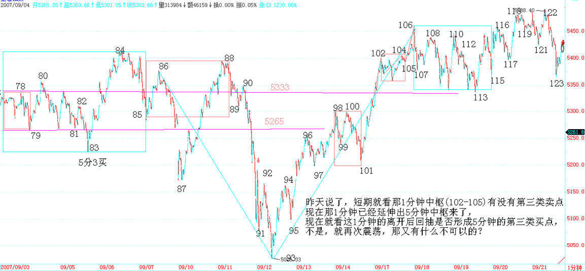

今天的划分太简单，就省下来不帖了，再次说一下，那200图的上传空间也太小了。现在那1分钟已经延伸出5分钟中枢来了，现在就看这1分钟的离开后回抽是否形成5分钟的第三类买点，不是，就再次震荡，那又有什么不可以的？

本ID欢迎市场的任何走势，包括今天晚上就有巨大利空。在市场，就要等待接受一切，关键是你面对一切时，有没有应对一切的技术与策略。

(2007-09-20 19:55:37) 关于博客的一些问题

今天下午，本ID只是用具体的例子告诉各位预测的无聊。决不是告诉各位，明天就一定要红旗满天飞了，一切都要养成看图操作的习惯。听说，某些预测者已经在反口了，其实，这是最无能的一种。例如，用时间之窗预测，还有一个窗口打开、关闭的问题，正负三天，都在其中。站在纯分析的角度，现在无非就是：一、昨天的田亮一米板已经应了该时间之窗；二、后三天才是关键所在。但站在本ID理论的角度，这一切都无须预测，让市场告诉你就是。

如果真说节气的影响，一般中秋前后，都容易有震荡，最出名的，就是94年那次，大概都是月亮惹的祸。这一切，只能作为参考，没必要当真，关键还是图形的信号。

一句话，涨了想卖点；跌了想买点，这才是正确的节奏。

(2007-09-21 16:07:38)迷踪步舞乱多空头

看了一下，似乎喜欢红色的多一点，那么本ID就稍微改进一下，不加粗，且放大字号，这样，觉得刺眼的博友可能会舒服点。另外，将重点加粗，这样也清楚点。

在一般人眼里，主力杀人，似乎就如同无聊股评所说的所谓多空之争。但可以明确告诉各位，真正牛的主力，是多空齐杀，让所有人左右挨巴掌。不明白这个道理，股票是白干了。

别人的迷踪步正好成就本ID理论的凌波微步，今天的图形，如教科书般经典，看不明白，真要补课了。

但是，必须明确，目前的形势十分严峻，对于技术不好又迷恋短线的，现在的走势就是典型的绞肉行情。

请记住本ID一句话：在中国，最后的胜利者一定是政策。因为有技术，所以我们可以在刀锋上凌波微步，但是刀锋依然是刀锋。现在的政策信号已经足够频繁，如果如此大力的密集新股发行都不能平息资金的冲动，那么，更严厉的政策一定会出来。

现在，有人说，公募基金牛，有最大的做多冲动，没人管得了。真是典型的幼稚想法，一个基金黑幕就可以打跨他们，难道他们的头不受党纪国法管吗？难道不可以派调查组下去调查调查吗？现在为业绩以及自己的老鼠仓疯狂的所谓公募们，你们连孙悟空都不是，还想逃出掌心？可笑！

所以，刀锋就是刀锋，虽然这个游戏，我们无所畏惧，但一定要有一根弦紧绷着，对政策的动向，1000%地密切关注。而对于一般的投资者，必须要适当控制好仓位，没那技术的，就把均线看好。

下周，关键是能否破本周的顶，如果不行，大盘就会走出小的头肩顶，后面的震荡就会很大。而且，中秋前后，人心浮动，震荡少不了，现在的问题，不是多空的问题，而是不要左右挨巴掌的问题。记住：不多空通杀的，没资格当主力。

对于个股，本ID说的那10几只股票，对于散户来说，如果你作为股票池进行不断的换股操作，你想想你的收益有多少？难道不记得本ID说过在里面资金不断流动的概念？你看看那十几只股票，此起彼伏，有哪天闲着的，用本ID的理论，难道在10几只里找卖点买点都很难？不要这几天000099涨了，才问能不能介入，这是节奏吗？

还有，对股票不要有感情，本ID反复说，散户最大效率的就是不断换股，卖点卖了，一定要等买点，等的时候就去找别的有买点的，如果有时间，你把本ID那10几股票比较一下，感受一下那此起彼伏的节奏，大概你的操作水平就会有更大的提高。

这里的公众场所，本ID的言论必须符合法律的要求。但本ID已经尽量告诉各位节奏了，请问，前几天，本ID在最高位时，不是告诉你小安子的剧本如何如何了吗？其他股票，有了顶分型，而且还跌破5日线，那么不等到底分型出现，你管他干什么？还有人不断问，636怎么样？一个连半年线都没站住的股票，是散户买的吗？大资金可以在里面打架，散户有必要陪着浪费时间吗？等打完了，图形走好了，自然就动了，这样，关注着，但先去操作别的股票，不更节约时间、提高效率吗？

有时候，本ID都为各位着急，为什么这个节奏这么难把握呢？应该很简单的啊。

算了，周末说股票，没劲。先下，再见。

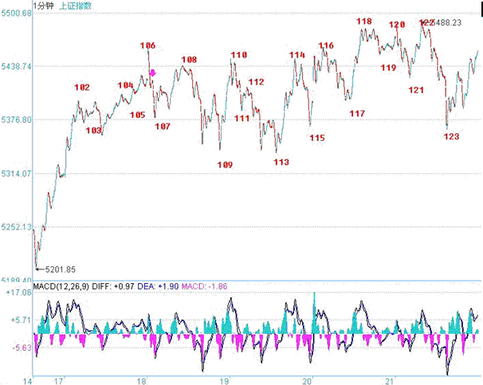

(2007-09-24 08:52:17) “港股直通车”难以背负的使命

最近，“港股直通车”试点吸引广大投资者眼球。随着中国资本市场大发展，中国投资者参与世界上任何资本市场的途径都将越来越便利，个人直接参与港股投资只是一个小序曲。现实问题在于，这本来极为正常的“港股直通车”，却有意无意中背负了一个本不该背负的调控使命，通过“港股直通车”使A股软着路竟成了一剂调控妙药。据说，这剂妙药还能治好流动性过剩，是解决流动性过剩以及股市泡沫的一箭双雕之举。

所有把“港股直通车”炼成包治百病妙药的妙论，都离不开如下假设：在A股与港股同时上市的股票存在巨大价格落差是不合理的。而事实上，这只是一个并不高明的误读。该误读，不过建立在这样一个错误认识上，例如以中国人寿为例，无论在A股还是港股交易，都是同一公司，因此，其每股价格应该一致。但南橘北枳，在市场中能评估的，只能是交易的价值，这是由市场中的众多因素合力而成。A股的中国人寿到了港股，就有不同的价格，这反而是最正常不过的事情。

不妨用一个最简单的模型来评估不同市场中同一品种的交易价值：用在市场中交易的流通总市值代表同一公司，相应地，可以以不同市场中同一品种的总流通市值必须相等来建立相应的价值分析模型。

例如，对于同在A股与港股中交易的中国人寿，就有A股价格XA股流通量=港股价格X港股流通量。目前，中国人寿的A股流通量只有港股流通量的五分之一，因此，即使A股价格是港股价格的5倍，也并没有任何不合理的地方。而事实上，两者之间的差价连1倍都不到。

从另一个方面看，港币的币值由于和美圆挂钩，在人民币升值的大背景下，港币资产自然没有人民币资产保值，而港币的利率比人民币高多了，其能接受的合理市盈率自然要比A股低得多，因此同一品种在A股比在港股里得到高得多的交易价值是极端合理的。

由此可见，那种认为同一股票就该在全世界的任何地方都以同一价格买卖的想法无比幼稚可笑。可以断言，即使是同一群交易者，在不同的市场中交易同一品种，其交易价格也不可能相同。例如，面对流通量大五倍以上的港股中的中国人寿，其价格，即使是同一群人在交易，显然要远低于在A股中的价格。因此，那种以为有了“港股直通车”就可以拉平两地股票价格的幼稚想法极端可笑。除非把A股和港股间的所有基础市场变量都完全调节成基本相同，否则，这背负调控使命的“港股直通车”注定不能直通向其使命所指定的方向。

其实，A股的结症异常明显，根本无须任何形式的直通车就能解决。在上面的模型分析里，只要把港股变成调控达标的A股，那么在这调控达标的A股中，希望其股票价格在一个更合理、更低市盈率的环境下交易，最简单的方法就是把流通量加大。例如，现在只有15亿A股流通量的中国人寿，如果变成75亿，其交易价格显然就不可能如现在一样。

问题的关键还在于，目前被大规模拉抬的所谓漂亮50或大盘蓝筹，站在证券法的角度，都有违法的嫌疑。证券法规定“公司股本总额超过人民币四亿元的，公开发行股份的比例为百分之十以上”，这样，中国人寿的A股流通量应该在28亿以上，而不是目前包括还未上市战略配售在内的15亿。这在所有大盘蓝筹中，都是一个普遍的现象，这恰好是目前一线蓝筹能被轻易泡沫化的一个不可忽视的因素。

没有合理的流通量，就没有合理的价格。目前，蓝筹供应不足问题的解决就应先从严格执行证券法开始，让公开发行股份比例达到百分之十以上标准。有人可能要说，公开发行股份还包括H股。如果是这样，那么该条款就有修正的必要，应明确修正为在A股的公开发行股份比例都必须在百分之十以上。否则，新的超低流通量蓝筹的上市只会让市场又多了能提供杠杆投机的品种，在股指期货迫在眉睫的今天，这点犹为重要。

站在资本市场历史发展的角度，目前国内的资金不是太多，而是太少了。这些宝贵的资金，更应该留在A股中，不能雨季怨水多、旱季怨水小，那么还要水库干什么？中国的资本市场如果蓄水功能不强，不能怪水，而是要怪水库修得还不够合格，因此就应该想方设法尽快把水库修得能够满足经济发展的需要，这才是实事和正事。否则，一味把水引到外面去解一时之急，这种病急乱投医所求回来的药，能成妙药的可能确实太渺茫了。

震荡前行、多空齐杀(2007-09-24 15:26:30)

最近的行情，估计对绝大多数的人都极为困难，不过，不难发现，本ID那些股票已经越来越像喝了水井坊一样。中字头、题材股，两个翅膀，所以能翱翔到现在。在目前这样一个震荡前行、多空齐杀的行情中，有这样的节奏，就是刀锋上的凌波微步了。

那些大海龟，从明天开始，陆续回来了，当然，承销的、摇旗的，都要护着点。以前看不出本ID3600点接石头的妙用，现在也应该明白了。至于联通之类的，等于一个抢劫，你承销中移动的，有本事就别抬联通，有本事就别送钱给本ID，本ID就是收路费的。

当然，这些都是对大资金说的，小资金，一般都可以不管这些大家伙，在题材股上折腾，不是更好玩？600078，请好好研究15、5、1之类的图，看看那区间套是多么教科书。还是那句话，跌的时候，要想买点，涨的时候，要想卖点，这才是搞股票的，否则是被股票搞的。

大盘现在，没什么可说的，106开始的5分钟中枢的1分钟离开已经出现，如果能回抽形成第三类买点，那就继续折腾下去，大不了，就搞出一个30分钟中枢，那就更好玩了。

今天有点事，不能多说了。月亮圆了，注意短线震荡的加大。

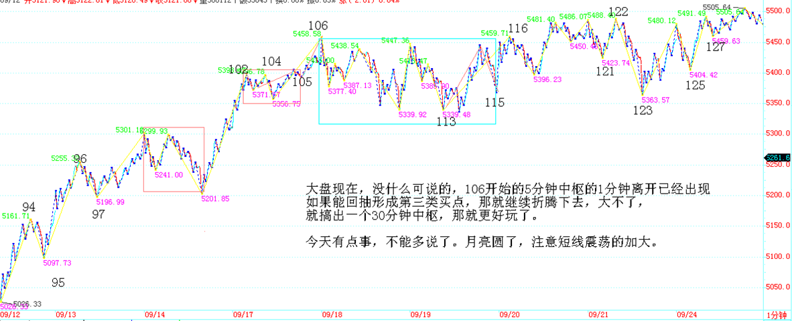

先下，再见。请注意，下面第一个绿箭头处不是笔，为什么？因为顶分型都在底分型下面了，怎么可能？而第二箭头处就是标准是按最新标准的笔了。

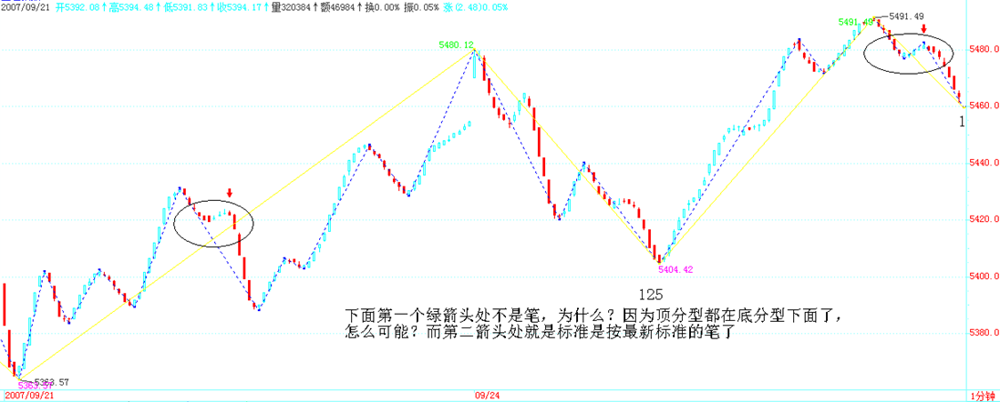

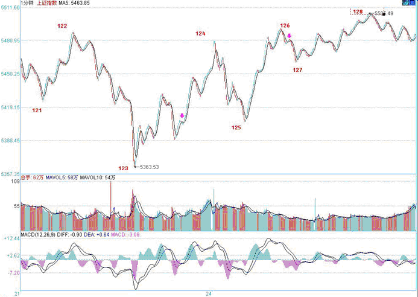

## 教你炒股票82：分型结构的心理因素(2007-09-24 21:31:06)

走势反映的是人的贪嗔痴疑慢，如果你能通过走势当下的呈现，而观照其中参与的心理呈现，就等于看穿了市场参与者的内心。心理，不是虚无飘渺的，最终必然要留下痕迹，也就是市场走势本身。而一些具有自相似性的结构，就正好是窥测市场心理的科学仪器。

注意，分型不是分形，分形理论，是数学的一个分支，有人用这分支的一些研究成果硬套到市场走势上，得出来的结论，没有太大意义。本ID理论的逻辑，是直接来源于市场走势本身，而不是一个先验的，市场之外的数学理论。至于这现实的市场逻辑显现出数学理论的结构，那是另一回事情。

世界，本来就是数学的。但本ID的理论，不是任何原有数学理论的应用，而是市场本身现实逻辑的直接显现，这是一个极为关键的区别。

显然，一个顶分型之所以成立，是卖的分力最终战胜了买的分力，而其中，买的分力有三次的努力，而卖的分力，有三次的阻击。用最标准的已经过包含处理的三K线模型：第一根K线的高点，被卖分力阻击后，出现回落，这个回落，出现在第一根K线的上影部分或者第二根K线的下影部分，而在第二根K线，出现一个更高的高点，但这个高点，显然与第一根K线的高点中出现的买的分力，一定在小级别上出现力度背驰，从而至少制造了第二根K线的上影部分。最后，第三根K线，会再次继续一次买的分力的攻击，但这个攻击，完全被卖的分力击败，从而不能成为一个新高点，在小级别上，大致出现一种第二类卖点的走势。

由上可见，一个分型结构的出现，如同中枢，都是经过一个三次的反复心理较量过程，只是中枢用的是三个次级别。所谓一而再、再而三，三而竭，所以一个顶分型就这样出现了，而底分型的情况，反过来就是。

现在，我们可以深入分析这三根K线的不同情况。首先，一个完全没有包含关系的分型结构，意味着市场双方都是直截了当，没有太多犹豫。包含关系（只要不是直接把阳线以长阴线吃掉）意味着一种犹豫，一种不确定的观望等，一般在小级别上，都会有中枢延伸、扩展之类的东西。

其次，还是用没有包含关系的顶分型为例子。如果第一K线是一长阳线，而第二、三都是小阴、小阳，那么这个分型结构的意义就不大了，在小级别上，一定显现出小级别中枢上移后小级别新中枢的形成，一般来说，这种顶分型，成为真正顶的可能性很小，绝大多数都是中继的。例如，上海日线9月17、18、19这三根K线组成的顶分型结构。

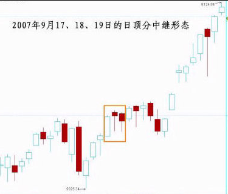

但，如果第二根K线是长上影甚至就是直接的长阴，而第三根K线不能以阳线收在第二根K线区间的一半之上，那么该顶分型的力度就比较大，最终要延续成笔的可能性就极大了。例如上海日线6月18、19、20、21，里面有一个包含关系，但这包含关系是直接把阳线以长阴线吃掉，是最坏的一种包含关系。

一般来说，非包含关系处理后的顶分型中，第三根K线如果跌破第一根K线的底而且不能高收到第一根K线区间的一半之上，属于最弱的一种，也就是说这顶分型有着较强的杀伤力。例如上海日线5月28、29、30。

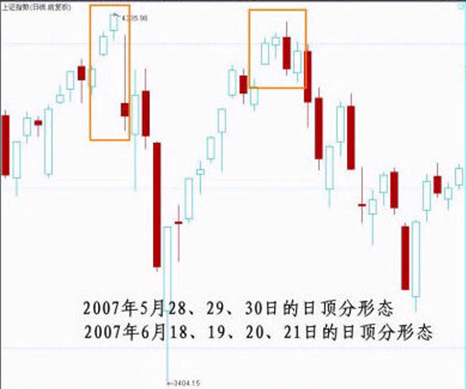

分型形成后，无非两种结构：一、成为中继型的，最终不延续成笔；二、延续成笔。对于后一种，那是最理想的，例如在日线上操作完，就等着相反的分型出来再操作了，中间可以去宠幸别的面首，这是效率最高的。而对于第一种情况，前面说过，可以看是否有效突破5周期的均线，例如对日线上的顶分型，是否有效跌破5日均线，就是一个判断顶分型类似走势很好的操作依据。

不过，还有更精确简单的，就是这分型所对应的小级别中枢里，是否出现第三类买卖点，而且其后是否出现中枢移动。例如，对于一个顶分型，该顶分型成立后，对于该分型区间在小级别里一定形成某级别的中枢，选择其中最大一个，例如日顶分型后，可以找到相应的5、1分钟中枢，一般最大的就是5分钟，30分钟没可能，因为时间不够。如果该5分钟中枢或1分钟中枢出现第三类卖点，并该卖点不形成中枢扩张的情形，那么几乎100%可以肯定，一定在日线上要出现笔了。

可以100%肯定的，要不出现笔并最终有效破坏该顶分型，那一定要出现某级别的第三类买点，否则就算有短时间的新高，也一定是假突破。所以结合小级别的中枢判断，顶分型是否延伸为笔，是可以当下一目了然的。

如果你能有效地分辨中继分型，那么你的操作就会有大的进步。

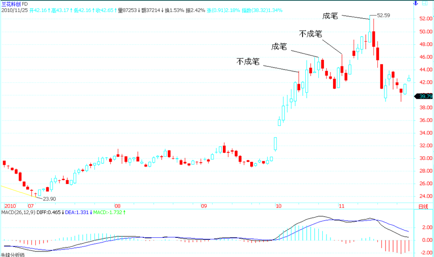

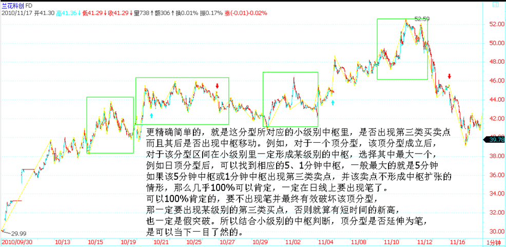

一般来说，可以把分型与小级别走势类型结合操作，例如日线与5分钟的。如果一个小级别的中枢震荡中连日K线都没出现顶分型结构，那么，这个中枢震荡就没必要走了，后者就算打短差也要控制好数量，因为，没有分型，就意味着走势没结束，随时新高，你急什么？而一旦顶分型成立，必然对应着小级别走势的第一、二类卖点，其后，关键看新形成中枢的第三类买卖点的问题：一般情况下，如果是中继的，都是第三类卖点后形成中枢扩展，也就是有一个绝妙的盘整底背驰让你重新介入。这样，利用分型搞了一个美妙的短差，又不浪费其后的走势，这就是一个比较及格的操作了。

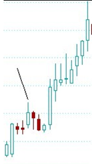

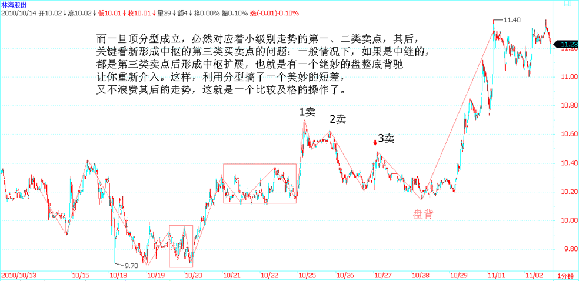

这操作，其实我们都经历过，就是上海周线9月7日前后那个顶分型的操作，一个完美的中继顶分型，在假跌破5周均线以及相应小级别的背驰的共同作用下完成。

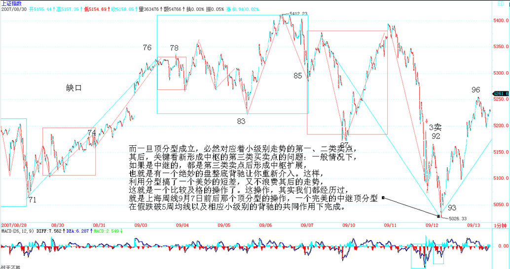

注意，利用分型，例如顶分型，卖了以后一定要注意是否要回补，如果一旦确认是中继的，应该回补，否则就等着笔完成再说。

但一定要注意，中继顶分型后，如果其后的走势在相应小级别出现背驰或盘整背驰，那么下一顶分型，是中继的可能性将大幅度减少。中继分型，有点类似刹车，一次不一定完全刹住，但第一刹车后如果车速已明显减慢，证明刹车系统是有效的，那么第二次刹住的机会就极大了，除非你踩错，一脚到油门上去了。

第82课读后感：

1、一而再、再而三，三而竭。

2、中继型分型的操作意义。

3、分型与小级别三类买点的对应关系。

[2007-09-25]都是月亮惹的祸

(2007-09-25 15:49:49)

从上周就开始告诉各位，月儿圆，有震荡，昨天最后一句还特别强调“月亮圆了，注意短线震荡的加大”，因此，对今天的震荡，如果还把握不住，那只能证明，你确实不适宜短线操作，那就中线点，无所谓的。中线上，大盘的压力越来越大，如果不是有人为了新股护盘，今天可不止跌这么点。

至于本ID的理论有没有用，这个问题根本无须讨论，如果你连今天划分中132（13点46）的第三类卖点都没当下看出来，那就更没资格讨论这个问题。看看132与129（9点47）之间不到半点的差距，就知道这理论的力量有多大。

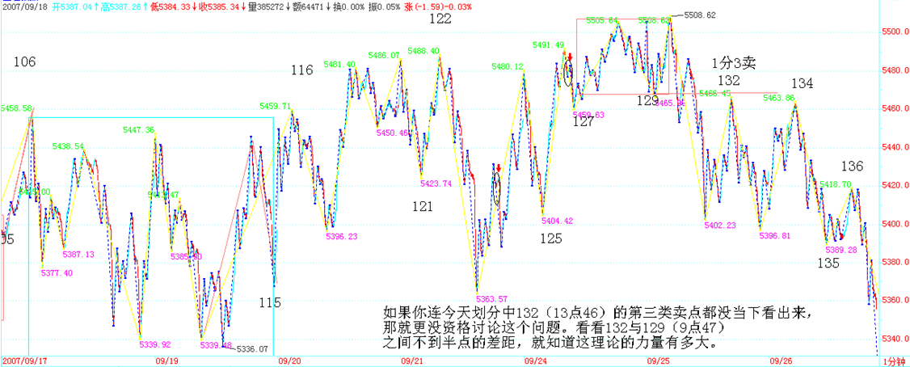

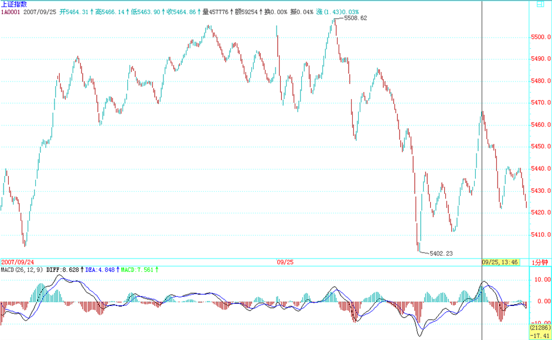

现在的人都很奇怪，似乎全世界的人都欠了他的，你考不上北大，那一定是老师的错，老师欠了你的。你学不会几何，那几何肯定错了，就如同今晚的月亮，都是他的错。本ID对这套逻辑从来没兴趣搭理，本ID又不是卖月饼的，过了今晚，本ID的理论依然框架着所有的股票走势，就如同三角形之和180度框架着欧几里德平面上的图形。

个股方面，说句梦话，千万别信：可以开始关注两只股票600319、000822，这都是基本面上有可能出现重大变化的。不过必须声明：由于目前大盘的位置十分危险，对个股的介入，一定要在大级别的买卖点。有些股票，如果技术好的，可以不断震荡减低成本去介入，例如600078。毕竟现在不是3000点，1000点，没有什么便宜的价位了，如果成本没本事降下来，最好就什么都别介入，等大盘暴跌再说。如果有那本事，那就无所谓了。

无聊的股票，就不说了，这里有本ID的七古旧作一首，祝各位中秋好。补充一句，如果连平水韵都没搞明白，就不要批评本ID的韵不对了，本ID的七古都从来不借邻韵，别说律诗了。

诗(略)。晚上都好好陪父母家人，今晚就不写帖子了。先下，再见。

[2007-09-26]可以不相信月饼，但一定要相信月亮

(2007-09-26 15:56:37)

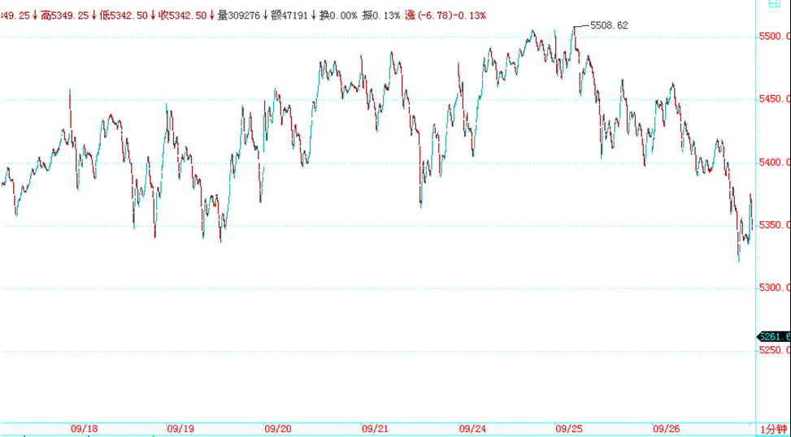

月亮的力量有多大，各位这两天也见识了。可以不相信月饼，但一定要相信月亮。为什么？连地球上的潮汐都要抄袭月亮，那破股票难道比潮汐还要潮汐？昨天已经明确告诉“如果不是有人为了新股护盘，今天可不止跌这么点”，昨天没跌够，今天继续，就这么简单。

今天早上的上攻，一没有突破昨天的第三类卖点，二反而是形成标准的顶分型第三根K线的上冲，不管你相信不相信本ID的理论，反正后面的走势，如教科书般。现在的走势十分简单，一个1分钟的走势正离开前面那5分钟中枢，这1分钟走势什么时候能完成，就看后面的走势了，而完成以后的回拉才是最重要的，是否能形成第三类卖点，这才是最近走势的关键，如果形成，那这两天，最多只能算田亮的1米板，后面是表演3米还是10米的，这对于观众，其实反而已经不重要了。

个股方面，今天水井坊终于像水井坊应该那样水井坊了一把，看看这股票，就知道什么叫折腾。几乎一年，就在这里搞，为什么？就是因为里面有着N伙人，还都看好，所以就互相折腾，这次是真是假？天知道。为什么？因为后面谁只要一先动手，N方又一起开始折腾。其实，这个游戏很好玩，只是浪费了一只质地如此好的股票。

不过，好股票最终都要发光的。就像000999，从本ID在这里开始讲到现在，快10个月了，开始6元抢东西，然后在12元上下和汉奸基金的斗法，后来又涌入一群无聊人在15元上，东搞西搞，中间传闻漫天飞，结果怎么样？请看看新进来的大股东掏了多少钱，一个掏了这么多钱的人，要干什么大事，难道还有什么疑问？本ID反复说要海枯石烂，但真正干起来，估计很多人就会被市场的波动所迷惑了。

每一只股票，都是一个故事，说不完。做完一只股票，你就成了有故事的人了。

再次提醒，昨天说那两只股票，如果大盘有大问题，也会跟着调整的，但由于基本面上潜在大变化，所以市场如果大波动，将提供一个好的介入时机。本ID说的股票，从来都是中长线角度的，有足够的时间让你介入，关键是看好买卖点。今天可以回答问题到4点半。

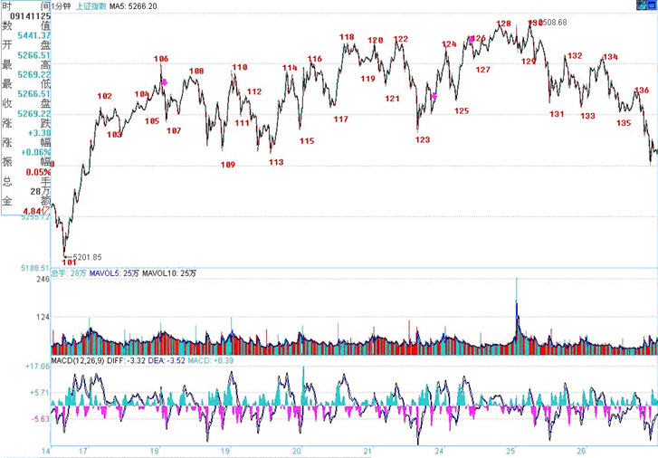

缠中说禅2007-09-26 16:18:17 [举报]

老师好，对今天线段划分有疑问，1346上去那一段并没有破坏130向下段的最后一笔，所以我觉得不应该单独画成一段，也就是131段应该是图上的133的位置，请老师明示

==

这是第二种类型。

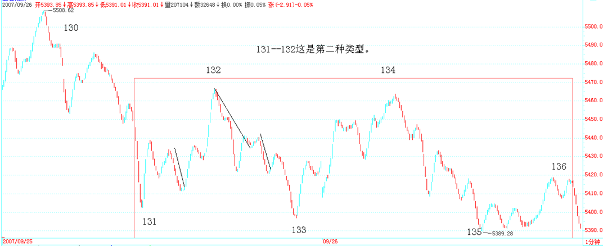

## 教你炒股票83：笔-线段与线段-最小中枢结构的不同心理意义1

(2007-09-26 21:28:05)

一个最简单的问题，为什么不能由笔构成最小中枢？其实，这不是一个问题。为什么？因为实质上，我们是可以设计这样的程序，也就是用笔当成构成最小中枢的零件，但这样构造出来的系统，其稳定性极差。

众所周知，一笔的基础是顶和底分型，而一些瞬间的交易，就足以影响其结构。例如，突然有人打错单，或者有人给老鼠仓送货，那么全天走势的分析就大变样了。而由线段构成最小中枢，则不存在这个问题。为什么？一个线段的改变，不会因为一个偶尔一笔的错误而改变，也就是说，线段受偶尔性的影响比较少，想想要破坏一个线段的麻烦程度，就知道这一点。

从心理上看，偶尔因素是允许发生的，只要不被再次确认，就证明偶尔因素对原来的心理合力没有大影响，反过来确认了该合力的有效性。所以，线段破坏本身，其实就反应着一种微妙的心理结构的变化。特征序列分型的引入，本质上就是去勾勒这种心理结构的变化的。就像一般的分型，三次的确认才能构成，特征序列的分型，本质上也是一样的，这样的确认，其有效性就极大增加了。由此构成最小中枢的零件，才是合适的。

如果说三个K线的折腾就可以决定一笔的转折，那么一个线段的破坏转折，就需要三个特征序列分型的折腾，这样，市场买卖双方都有足够的时间去反应，从而使得体现出的合力痕迹，当然具有了一定的延续性。而一个线段，至少由三笔组成，这也使得转折后的新线段，同样可以让合力得到充分体现，而对比这两个不同方向的线段，买卖双方在相应时间内的心理、实力对比，就一目了然了。

更重要的是，线段破坏的两种方式，是有着很大的心理面不同的。第一种方式，第一笔攻击就直接攻破上一段的最后一次打击，证明这反攻的力量是有力的，再回来一笔，代表着原方向力量的再次打击，但反攻力量抗住并再次反攻形成特征序列的分型，这证明，这反攻至少构造了一个停歇的机会。最坏的情况，就是双方都稍微冷静一下，去选择再次的方向。而这，就恰好构成了最小中枢形成的心理基础。

中枢，其实就是买卖双方反复较量的过程，中枢越简单，证明其中一方的力量越强大。中枢的复杂程度，是考察市场最终动向的一个很重要的依据。一个超复杂的中枢过后，就算一方赢了，其后的走势也是经常反复不断的。

而且，在同一趋势中，相邻两中枢的复杂程度、形态，经常有所区别。为什么？人都有提前量，而提前量，经常就是找最近的模本去抄袭，这样，等于在买卖的合力中，都加了一个提前的变量，从而造成整个结构的变化。这是一个很重要的原理，所谓不会二次跨进同一条河流，这本质上由人的贪嗔痴疑慢造成的。

至于线段的第二种破坏方式，本质上是以时间换空间，反攻开始的力量很弱，需要慢慢积累，这一方面代表原方向的力量很强，另一方面，又要密切关注是否会形成骨牌效应，也就是开始的反攻力量很小，却能迅速蔓延开，这往往证明，市场原方向的分力，其结构具有趋同性，一旦有点风吹草动，就集体转向。这在投机性品种经常能看到，经常是一个小M头就引发大跳水。趋同性，如果对于一般性品种来说，往往意味着庄家控盘程度高。

一些猛烈上涨或下跌的股票，往往甚至由于一个1分钟的小顶分型就引发大跳水或大反弹，其原因，就是这种分力的趋同性所引发的骨牌效应。一般来说，这种第二类的线段破坏，一旦出现骨牌效应，至少要回到前一高、低点范围内，这就是市场上冲顶和赶底时发生的V字型走势。

分力的趋同性所引发的骨牌效应，基本上就是表现为所谓的多杀多、空杀空。特别在一些大的趋势之后，市场的力量一边倒，如果这时候突然来一个加速，一旦逆转，就会发生典型的多杀多、空杀空现象。

叛徒成为叛徒之前，必然是同志，甚至就是同志中的牛人。而最危险的敌人，总是志同道合的所谓同志的背叛，同一阵营内部的塌陷才是最有杀伤力的。无论多头空头，死的时候，沿着那滴血的刀看上去，那双眼睛，一定是你最熟悉的。

第83课读后感：

1、笔中枢存在的问题。

2、中枢的市场意义。“中枢，其实就是买卖双方反复较量的过程，中枢越简单，证明其中一方的力量越强大。中枢的复杂程度，是考察市场最终动向的一个很重要的依据。一个超复杂的中枢过后，就算一方赢了，其后的走势也是经常反复不断的。”

3、趋同性。

4、多杀多、空杀空。

5、“而最危险的敌人，总是志同道合的所谓同志的背叛，同一阵营内部的塌陷才是最有杀伤力的。”

6、中枢是多空双方争夺最激烈的地方，一旦中枢被突破，就表明一方暂是胜出。能否对这种胜出进行确认和巩固，其标志是：第三类买卖点的出现。

[2007-09-27]新蓝筹成多方利器，市场调控彻底失败。

(2007-09-27 15:31:37)

今天的走势，出于对明天大量放出资金的憧憬，走出了应有的回升行情。技术上，昨天特别强调的1分钟结束后的回拉，并没有出现第三类卖点，短线依然继续保持中枢震荡。从中线图上看，大盘目前对于多方最大的危险，就是圆顶，因此，多方如果不希望进入温水煮青蛙的境地，就必须至少在节后迅速突破站稳5500点，否则，这圆顶成立的可能性将极大增加。

从资金与政策的对赌看，资金面取得了决定性的胜利，今天，建行成为多头利器，宣布，以增加所谓蓝筹进行调控的思路彻底失败。目前资金的宣言就是：你来多少，就提供多少拉抬的武器，只要你还是市场调控，有钱就敢顶风搞。

本ID在前面已经明确说过，这资金和政策的对赌，最终的结局，一定是政策举起大棒，而资金这种行为，也无可厚非，资金就是这样的，连权证的末日轮都可以搞得热火朝天，这样的形势下，资金又有什么不可赌的？

中字头、题材股，两只蝴蝶忽悠着飞，能飞多远是多远，管他明天是仙还是灰。

明天最后一天，就看解冻的资金能忽悠进来多少了，这个越来越向30分钟靠的震荡什么时候结束，看图就知道，第三买卖点。

希望这个游戏能延长的时间越长越好，钱是靠折腾出来的，要折腾，哪会没风险？只要看好你附近的刀和那一直在头上的大棒。

今天很忙，下午去看一公司，晚上还有一个会，晚上的帖子可能很晚，明天早上看也一样的，别影响休息。先下，再见。

(2007-09-27 23:18:00)

对不起，刚回到家。今天不错，发现一个特别好的企业，看来中国的企业真是藏龙卧虎，这也是中国20年大牛市真正的基础。

[2007-09-28]资金乘胜追击，破圆顶兵临3/4线

(2007-09-28 15:51:59)

昨天已经明确说了，资金取得决定性胜利，而资金最大的技术危险是圆顶，最迟在节后必须破掉。而今天关于房地产的利空，反而成了股市资金面的大利好，资金这时不发力，那是脑子有水了。因此就上演了一场乘胜追击，破圆顶兵临3/4线的好戏。

注意，本ID已经说过了，在刀锋上舞蹈阶段，是多空皆杀，那些一根筋思维的人，注定要被杀，目前不被杀只是迟早的问题，某种模式反复后，就是相信这种模式的人的死期。

本ID什么都不相信，市场让本ID看到什么就干什么，这就是本ID理论的唯一中心与基本点。例如下图中，132的第三类卖点后，到137的1分钟完成，走势极端标准完美。有兴趣的可以量一下130-131，与136-137，长度基本相等，而力度上，加一下下面对应的柱子面积就知道该干什么。而到了138，就知道这5分钟的第三类卖点肯定没戏了，就算137没反应，139就提供了一个反应的机会。

当然，站在中枢震荡的角度，并不需要预测后面能走多高，让市场告诉你。而今天的走势，强悍到连一个线段都没破坏过，那该干什么还不是很清楚的事情？

节后的走势，十分清楚，就是首先要完成这个1分钟的离开，从目前的情况看，这1分钟的离开走势是首先是线段的类上涨的可能性太大了，除非有特别的大消息，当线段类上涨结束后，必然形成1分钟中枢，该中枢后，1分钟的走势无论是盘整还是上涨，等1分钟走势完成后，关键是看反抽能否形成前面5分钟中枢的第三类买点了，如果形成，大盘将继续攻击上行，否则就继续向30分钟中枢的震荡陷进去。

好了，上面的分析已经十分明确，对本ID理论有点了解的，都应该明白了。至于不了解的，本ID已经反复说过，中线点的就看5周线，你看，昨天的低点，就刚好在上面，和上次5000点那次一样。

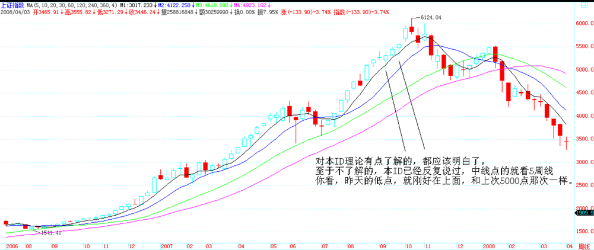

基本面上，很明确地告诉各位，节后最可能出来的消息，就是关于国有股部分划转社保的问题。关于这个消息，本ID和周围的人都有点分歧，这消息意味着，以后卖国有股，就不需要什么通知了，想什么时候卖都可以。但，目前资金充沛，完全有可能出现如此尴尬的事情，就是见一只买一只，全给买光了。毕竟那些国有股都是中字头的，都是中国最好的企业。所以，对这政策的杀伤力，本ID依然表示怀疑。不过，最终要看市场的反应，本ID自己不会有什么太多想法，只关心市场合力本身。

要打跨资金，政策上可能有效的招数有：一、查基金黑幕；二、规定A股流通量不到10%的必须到10%。三、XXXX。

政策必胜，这是无疑的。但本ID对资金与政策都没兴趣，本ID唯一感兴趣的，就是利用他们两者斗法所制造的市场机会去多空皆杀。

个股方面，没什么可说的，中字头、题材股，两只蝴蝶继续忽悠着飞。只要掌握好节奏，就是操作的天堂。如果不明白什么叫节奏，请各位做一作业：从日分型到小的级别走势，好好分析一下000938，里面全部都是教科书。

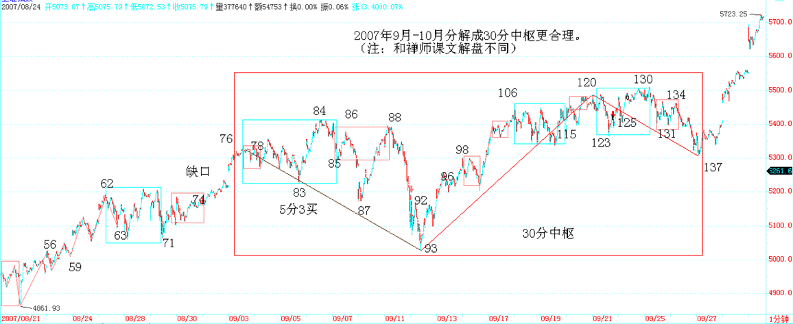

放假了，让股票豆腐去吧。本ID今晚再写一帖子，明天就要外出腐败腐败了，博客关闭到10月7日。10月8日重新开张。祝各位过节好。先下，再见。

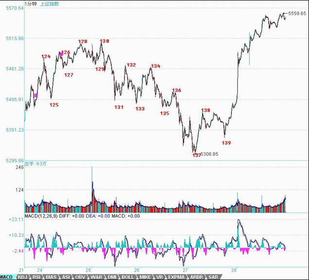

## 教你炒股票84：本ID理论一些必须注意的问题

(2007-10-07 16:09:06)

重新开张，看来停业欠各位课程不少，今天抓紧补充。上午把国庆前就写好的打坐11发出来，这里再把国庆前就写了部分的股票84写完贴出来。

股票走势，归根结底是不可复制的，但股票走势的绝妙之处就在于，不可复制的走势，却毫无例外地复制着自同构性结构，而这自同构性结构的复制性是绝对的，是可以用本ID的理论绝对地证明而不需要套用任何诸如分形之类的先验数学理论。这种同构性结构的绝对复制性的可绝对推导性，就是本ID理论的关键之处，也是本ID理论对繁复、不可捉摸的股票走势的绝妙洞察之一。注意，自同构性结构，在前面不太精确地用了自相似性结构之类的词语，这很容易和数学里的分形以及利用这种先验性理论构造的理论中的一些术语相混淆，所以以后都统一为自同构性结构。

而正因为有了自同构性结构，所以股票走势才可以被技术所绝对分析。而任何有效的技术分析，本质上都是本ID理论的分支，本ID还没看过任何有效的股票操作程序，是外于本ID理论的。

最近似乎很多人举出很多书，说这也和本ID的相通、那也和本ID的相通。其实，这就如同说欧几里德之前或与之独立的，就有很多人知道勾股定理，但那是欧几里德的几何吗？而且，更重要的是，本ID依然没看过任何一本书，达到勾股定理的那种程度，就更不用说欧几里德几何的本ID理论。本ID建议，除了了看本ID的理论，一定要多看别人的，这样才会有比较，本ID的理论不仅集所有技术分析理论的大成，更重要的是，本ID理论完全构建在不同的思维框架下。这就如同中印的古代几何都很牛，但真正逻辑化、推理化、系统化、理论化的是欧几里德的，这是一种完全不同的数学路线，不明白这个，那肯定白学了。

所以，学本ID的理论，一个很关键的一点，就是要找出所有技术分析以及操作程序在本ID理论领域中的具体位置，由于本ID的理论对于任何技术分析以及操作程序具有一个绝对的视角，由此，可以绝对性发现所有分析与程序的优劣与缺陷。

注意，可能会发现，本ID理论中的有些结论，似乎和别的一些理论有类似的地方，这恰好证明了本ID理论的涵盖面。例如，本ID的理论，可以解释波浪理论里一切的细节以及不足之处，但反过来不可能，因为本ID理论是一个更广阔的理论，波浪理论不过是一个有着巨大缺陷的不成熟理论。

同样，可能在其他人的理论中，也有对K线组合定义类似分型的概念，但那些定义，都不过和一般的K线分析一样，是通过某种经验性的归纳而来，而本ID的分型定义，源自K线组合的一个完全分类，是一个纯理论的推导。正因为如此，本ID理论与其他任何理论相比，都有着绝对性与涵盖性，这一点，在以后的课程中会逐步揭示的。

走势的不可重复性和自同构性结构的绝对复制性以及理论的纯逻辑推导，这就构成了本ID理论视角的三个基本的客观支点，不深刻地明白这一点，是很难有真正的理解的。

走势的不可重复性，决定了一切的判断必须也必然是不可绝对预测的；自同构性结构的绝对复制性，决定了一切的判断都是可判断的，有着绝对的可操作性；理论的纯逻辑推导，就证明其结论的绝对有效性。

本ID的理论，是人类历史上第一次用100%理论推导的方式绝对地证明了走势分解的唯一性，这从上面关于笔、线段等分解的唯一性证明就明白，世界有哪种交易理论，是按这种绝对推理的方式构成的？显然没有，这才是本ID理论的最强大力量所在，前两个客观点如果没有最后这第三点，都是瞎掰。

其实，这三点，又何止是与股票走势相关，真明白了，对你的人生与社会操作，有着同样的意义。每个人的生活，世界的变化，诸如此类，本质上，离不开这走势的绝对不可重复性和自同构性结构的绝对复制性以及相应不患的共业的绝对推理性。

什么叫革命？就是打破某种自同构性结构的绝对复制性以及相应不患的共业的绝对推理性。知道为什么本ID说“列宁式社会主义是一个基于民族主义的策略性误读，是一个反资本主义的资本主义过程”吗？就是本质上，资本主义所具有的绝对复制性的自同构性结构从来没被打破过，这种自同构性结构就如同瘟疫，必然全球化，必然一统江湖地忽悠化，这是其不患的共业。由此，就不难理解马克思关于社会主义必然是一个全球事件的意义所在，在资本主义都没全球化之前谈论社会主义，那社会主义，一定不是马克思意义上的。

看资本主义的必须崩溃，就如同看一个日线上涨走势的必然完结一样，本质上没有任何区别。马克思，如同本ID一样，多空通杀。反马克思者如同那些疯狂做多的多头，反资本主义者，如果那些疯狂做空的空头，他们之间的合力，就构成了资本主义的走势本身。这走势，可能不断地中枢上移，但这走势的结束，是可以精确地判断的，其判断的标准，就是背弛，整个社会大结构的背弛。现在，资本主义还在全球化中大发展，哪里有什么背弛的迹象？

但是，正如本ID所说的，多空通杀地去阻击任何的走势，资本主义的上涨，同样是可以阻击的，这方面的内容，以后在捍卫马克思系列里慢慢说。

任何阻击的关键，就是多空通杀地去壮大自己。任何一根筋思维的人，是永远不会明白这个道理的。当然，也没必要让他们明白，否则，没有一根筋思维的人，哪里去找通杀的对象？多头、空头，最终都不过是被杀的猪头。

多空通杀，不是根据自己的喜好，而是如一个零向量那样当下于走势的合力之中。零向量，加多少，都不会改变走势合力丝毫，这样，才能真正去感应市场合力本身，感应其转折，感应其破裂，在电光火石的一下中出手，如风行水，如电横空。不思多、不思空，如零向量般与合力随波逐浪，才可能最终盖天盖地，多空通杀。

所以，最终，比的是人本身。就如都是玩独孤九剑的，和那些所谓五岳剑派的玩，当然见一个搞废一个。但如果最终同玩独孤九剑了，那就要比人本身了。本ID的理论的一章，就是不断的修炼，最终能到什么层次，最终是玩小资金还是大战役，都只能与此相关。但这还不够，光是所谓身心的修炼，只不过是鬼窟里活计，你的身心，非你的身心，所以为你的身心，从此开始，才可以百尺竿头更进一步。

看走势的背驰、转折，不过是第一层次的东西，哪天，能看明白社会经济、政治等等结构的背驰、转折，那才是更高层次的东西。

自从结构与解构哲学的流行，用结构的观点观察，就是一个最基本的思维方式，但问题的关键，很多所谓结构性的思维，不过是一种归纳性的结果，不具有任何的理论系统性与有效性。

这里，本ID必须强调一次，分型与分形有着本质的不同，本ID所说的分型，是建立在一个K线组合的纯粹分类的基础上，任何与这个纯粹分类不同的，都必然是错误的，这一点必须明白。至于所谓的分形，当然也可能是一种结构，但这种结构，本质上都是归纳性的、因此都必然是有缺陷、划分不唯一的，和在一种完全分类基础上给出的绝对结论，有着本质的区别。

其次，分型只是中枢与走势级别递归定义的一个启始程序，甚至可以说，并不是本ID理论中必然需要的东西，其目的，不过是为了中枢等的递归性定义中给出其最开始的部分，完全可以用别的定义去取代。例如，我们可以用收盘的价位去定义顶分型、低分型结构，也可以用成交量给出相应的递归开始部分，只要能保证分解的唯一性，就可以。

本ID关于中枢等的定义，其实一直没有改变过，因为中枢定义的关键，在于定义的递归性。一般的递归定义，由两部分组成，一、f1(a0)=a1；二、f2(an)=an+1；关于第二条的中枢过程规则，是一直没有任何改变的，而关于第一条，其实，可以随意设置任何的，都不会改变中枢定义的递归性。而且，任何有点数学常识的都知道，f1(a0)=a1之前是不需要再有什么递归性的，也就是，一和二之间的f1、f2可以是完全不同的两个函数。

有些人一直还搞不清楚中枢，就是一直都搞不清楚这点。例如，可以用分型、线段这样的函数关系去构造最低级别的中枢、走势类型，也就是一中的a1，而在二中，也就是最低级别以上，可以用另一套规则去定义，也就是有着和f1完全不同的f2。这个问题其实太简单了，有点数学常识都不会有疑问，所以这问题，以后就不再说了。

至于MACD的辅助判别，已经反复说过多次，关键不是MACD，而是走势的分解，这才是关键。如果MACD真有用，那光用MACD就可以，连这问题都没解决，那前面的课程是白学了。

另外，必须再给一种错误的想法敲打一下。级别，本质上与时间无关，级别也不是什么时间结构。级别，只是按照本ID的规则，自生长出来的一种分类方法。而所谓的时间结构，本质上和电脑软件上的K线时间周期选择一样。一个最低级别不到的走势类型，可以生长100年不长成更高级别的，级别与时间，本质上没有太大的关系。级别的关键，就是本ID设计的那套规则。级别，本质上不对任何时间结构有任何绝对的承诺，为什么？因为这里没有任何的绝对的理论推导可以保证这一点，级别被破坏了，就是因为被破坏了，只此而已，并不是因为有什么时间的因素、结构就被破坏了。

还有一个更大的误解，有人见本ID整天说当下，那当下就最重要了。这是绝对的误解。当下之所以被反复提出，就是因为有人企图预测的想法太过根深蒂固，只是一种破的手段。能当下，那只是第一步，而真正要破的，正是当下本身。现在，有很多学口头禅的，整天忽悠什么活在当下，而所谓过去心不可得、现在心不可得，未来心不可得，又有什么当下可得？

学了本ID的理论，去再看其他的理论，就可以更清楚地看到其缺陷与毛病，因此，广泛地去看不同的理论，不仅不影响本ID理论的学习，更能明白本ID理论之所以与其他理论不同的根本之处。本ID看到有人提到《混沌操作法》和《证券新时空》，这样，新的作业就有了，就是如果有时间，请好好研究，然后用本ID理论的眼光，去发现其理论的重大问题与操作程式上的致命毛病。如果你能完成这作业，那么对本ID理论的理解，就更进一步了。

更重要的是，为什么要去了解其他理论，就是这些理论操作者的行为模式，将构成以后我们猎杀的对象，他们操作模式的缺陷，就是以后猎杀他们的最好武器，这就如同学独孤九剑，必须学会发现所有派别招数的缺陷，这也是本ID理论学习中一个极为关键的步骤。

第84课读后感：

1、本文内容在缠论中占有举足轻重的地位。

２、“波浪理论不过是一个有着巨大缺陷的不成熟理论”。

３、“而本ID的分型定义，源自K线组合的一个完全分类，是一个纯理论的推导。”

４、“走势的不可重复性和自同构性结构的绝对复制性以及理论的纯逻辑推导，这就构成了本ID理论视角的三个基本的客观支点”

５、“任何阻击的关键，就是多空通杀地去壮大自己”，“多头、空头，最终都不过是被杀的猪头”

６、“零向量”，“在电光火石的一下中出手，如风行水，如电横空”。

７、“所以，最终，比的是人本身 ”。

８、“光是所谓身心的修炼，只不过是鬼窟里活计，你的身心，非你的身心，所以为你的身心，从此开始，才可以百尺竿头更进一步。”

９、“看走势的背驰、转折，不过是第一层次的东西，哪天，能看明白社会经济、政治等等结构的背驰、转折，那才是更高层次的东西。”

１０、“其次，分型只是中枢与走势级别递归定义的一个启始程序，甚至可以说，并不是本ID理论中必然需要的东西，其目的，不过是为了中枢等的递归性定义中给出其最开始的部分，完全可以用别的定义去取代。”

１１、“中枢定义的关键，在于定义的递归性。”　一、f1(a0)=a1；二、f2(an)=an+1；

１２、“级别，本质上与时间无关，级别也不是什么时间结构。级别，只是按照本ID的规则，自生长出来的一种分类方法　”“级别被破坏了，就是因为被破坏了，只此而已”

１３、“能当下，那只是第一步，而真正要破的，正是当下本身。”

[2007-10-08]与大棒争分夺秒

(2007-10-08 15:35:47)

今天的走势，完全在理所当然之中，节前，在纯技术的角度已经对节后走势进行明确的分析，就是先完成139开始这一线段，然后再完成137开始的线段的类上涨，然后就是1分钟中枢的形成，走势如此正常地按本ID理论所框定的节奏走，所以也没什么可说的了。（今天图就不要帖了，没有任何新的标记）

唯一可说的就是，大盘的走势特别强，所以当今天收盘，139开始的线段依然没有完全确认已经走完，当然，按正常的情况，明天只有一开盘跌破5685点，这140的线段标记就可以弄上去了。然后，一般情况下，接着的1分钟中枢，基本就在目前这个范围上下形成，所以，今后几天，大盘走势如果出现大的震荡情况，是没有任何可值得大惊小怪的。

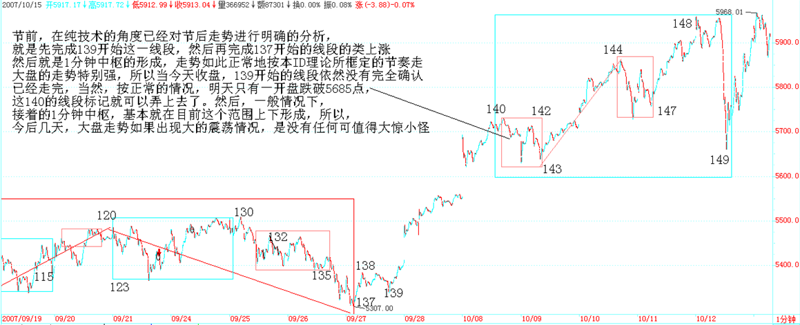

政策面上，那重要的会议后，调控力度必然加大，这是毫无疑问的。因此，周末开始，就进入政策面的危险时间，至于这个时间如何被触发，就看今后几天资金的表现了。对于资金来说，现在是争分夺秒。

至于下面的几个缺口，只是为后面的下跌留下动力。本ID前面已经明确说了，没有1000点的回跌空间，大盘就没有跌的价值。把回跌的空间拉回来，这就是目前走势的关键。

站在中线角度，只要大盘的回跌不破4335点，那么中枢的中线上移就依然保持。所以，目前大盘的上拉，中线的角度就在于，尽量让后面的回跌在最恶劣的情况下也不碰4335点。站在这个角度，目前的上涨确实还不够，但政策是否留下足够的时间让这空间给拉出来，这就不是任何人能打包票的了。

站在中长线的角度，12月是2005年6月上来的30个月，所以，从10月开始，就进入一个标准的时间压力区域，这时候一旦出现政策性共振，其杀伤力不容忽视。

总之，一句话，耐心等待较大级别卖点出现。在本周末之前，如果担心政策压力的，应该把仓位进行调整。目前走势下的中期顶部，不可能是市场自身走出来的，一定会有政策的背影。

现在唯一不太配合的，就是上冲力度还太小，回跌的空间还没有完全打开，和政策争分夺秒把空间拉抬出来，就是目前资金最大的任务。

个股方面，指标股拉动后，会有轮动，如果你对自己的技术有充分信心，可以关注这轮动。但注意，一定不要追高，本ID最不喜欢回答诸如明天还能不能买600078之类的问题，别股票涨起来才关注，那是一个天大的毛病，本ID还专门给作业各位分析该股回跌时的走势，买点怎么可能在上涨中形成？

股票操作其实很简单，就是一个节奏问题。但很多人，包括很多所谓的专家，都喜欢让人突破后追股票，这种人，永远只能是散户一个。

放假后有很多事情要处理，周末还要去某某会一把，要准备些东西。抱歉，不能回答问题了。先下，再见。

[2007-10-08]3600点满江红后首次宣布中期做空

(2007-10-08 21:46:52)

7月初，在3600点下，本ID严正宣布要做多，不允许行情按汉奸的方式运行到2000点去，为什么？因为任何跌破3100点的走势都将导致2年多以来的中枢上移趋势被破坏。

今天，本ID开始宣布，从3600点开始的做多以及持有程序将开始终结，本ID将开始选择性地展开中期做空程序。这里，说明其中的理由。

一、长期牛市的大格局没有改变，但长期牛市并不排除期间的中期调整，以前，所有关于调整的时机都没有完全配合，而现在，这个时机已经逐步成熟。

二、本ID在博客里明确提示政策风险的是“冲动的惩罚，基金将成为毁掉市场的那只手 2007-08-27 20:45:41”，原因很简单，因为当时有些可能的突发事发生，那时刚好在5200点上下，在电光火石中，一场大动荡被化解，当时的微妙，后来应该也有不少人有所耳闻了。

三、但当时，做空的条件不成熟，关键是政策面上有不协调的地方，而技术与资金上，一时还转不过来，特别是，没有足够的下跌空间，因此，后面的一个月的震荡，实际上都没超过6%的空间，这就是一个稳定与转换的过程，这样，不至于让资金如530一样措手不及。

四、目前，政策面上已经不是一方面或一个人的事情了，可以断言，不光针对股市本身，针对经济本身，也将出台更加严厉的政策，原来适度的口径，极有可能继续收紧。而针对股市的，本ID一度希望股市自身调节而不至于被迫出来的政策，也有可能不可逆转了，因此，政策面的压力已经逐步成熟，如果说8月28日只是一叶知秋，那么，在可见的将来，秋天就不需要去知道了，就在眼前。

五、技术上、资金上的松动已经开始发生，这时候，一些适当的引导，就可能发生一些有效的反应。市场是合力的，但合力是由分力开始的，如果3600点的分力曾经起作用，那么，一个新的剧本，也需要开始排演了。

六、现在唯一不配合的，就是回跌的空间还不足够，如果现在已经突破6100点，那更好。因为这次回跌，本ID并不希望破坏2005年上来的中枢上移格局，因此，这次的中期顶部阻击，会采取一种反复折腾、诱敌深入的模式，而不是如3600点那样，一下搞掂。

七、本ID曾经说过，如果快速突破3/4线，将开始阻击。后来因为大盘回跌5000点后一直盘整，所以曾说只要6100点不被快速突破都可以忍受。但现在看来，政策留给的空间已经越来越少，而今天又第一天突破3/4线，已经开始达到本ID对3600点开始行情的最低目标，任何的回跌，本ID都没有任何遗憾了。而能否到6100点，本ID已经没有这个顾虑了。

八、本ID只把自己的操作说出来，没有任何指导的意义。就像3600点的做多，然后一路的持有。现在，本ID只是准备改变中线的操作策略，没什么大事。本ID有可能错了，但本ID说了，就要干。

九、长线行情，本ID依然坚定看好，只是这政策、资金、技术所制造的中线调整，本ID也希望再3600那样玩上一把，如此而已。

十、做空的风险比3600点做多小多了，头部和3600点的底部一样，是合力的，但也是由一分力开始干出来的，本ID就再做一次那分力吧。

十一、别以为做空就是砸，那是最笨的手段，做空的本质，就是让多头自相残杀，因此，做空开始的时候，经常要比多头还要多头。

十二、底部不是一天构成的，顶部也是，一切的构造，都是在逼近那资金、技术、政策的共振点。然后，一切在无声中败落，如那一片片的黄叶。

[2007-10-09]给散户的中期建议

(2007-10-09 08:03:06)

注意，昨晚，本ID只是表明自己的中期态度与操作。但就算本ID，也要遵循本ID的理论。本ID只是分力之一，分力如何最终引导出合力，这就是本ID要干的事情。但并不是说一定就一天就能干成。

请回忆一下3600点，一长阴一长阳的空头陷阱，然后在3900点下坚守出底部突破来。那么这次，并不一定就是上次的倒影，手法当然不可能一样的。如何用一个分力引导出合力，这本来就是本ID理论中一个比较高级的课程。

这个课程能完成的关键，就在于技术、资金、政策的共振点的制造，这里学问不少，但实际中能否成功，关键还是看这几方面的调配点上的把握上。这就如同三个不同方向不同速度的网球，在空中于一点中相会，例如政策这个网球，就不是任何人能控制的，唯一能调节的，就是技术、资金等的结构关系，这里就需要有一个分力出来折腾。底部、顶部都是折腾出来的，折腾需要时间，最终走出相应的形态，然后坚持，最后突破。当然，做空的时候，就是跌破了。

所以，这是一个大的过程，并不是一天就要完成的。但如果政策配合，这个过程可以相当简洁。这次，本ID之所以主动反空，就是不希望再如530那次一样，让技术、资金去配合政策，而是玩一次这样的游戏，让政策去配合技术、资金。这如同先把两个网球的交点先给制造出来，然后让那政策的网球刚好碰到该点，这里的难度有多大，可想而知。

但这种游戏，才有玩的趣味。

站在本ID理论的角度，本ID只是分力，而散户只需要知道最终的合力如何，然后根据该合力去决定自己的进出，其实根本不需要太关心本ID的态度。

一般的散户要进要出，1秒种就可以搞掂，还是耐心等待大卖点的出现。当然，如果你觉得自己没那本事、没那心态，那就逐步分批退出，或者把仓位降到发生任何情况都可以睡着的程度。

如果本ID的行动能最终制造出大级别卖点，那么，本ID就游戏成功，否则本ID就被继续的多头夹空了。当然，如果那时候政策出现新的多头走向，那也不存在夹空的问题，本ID完全可以进入新的板块，或者反手做多。当然，目前没有任何迹象表明政策有转多的可能，上面这只是理论中完全分类的情况，基本没可能出现。

说白了，本ID之所以高调告诉各位，更重要的原因，是希望各位如3600点那样，去体会合力与分力的关系，以及在更高层次上，如何实际分力去合力的引导。不管这次本ID成功与否，都是一个最好的现场教材。

这用N多资金、筹码画出来的教材都不看，那就去看股评去吧，没必要学任何东西了。

[2007-10-09]板块如期轮动

(2007-10-09 15:26:41)

今天，如期出现昨天说的板块轮动，现在，无论多头空头，都需要这个轮动出现。对于空头来说，板块风烟四起，正是消耗多头能量的一种手段。如果一旦出现所有板块都轮动，但没有任何板块能连续上涨的情况，那对多头信心就是一个有力的打击。

昨晚已经说了“做空开始的时候，经常要比多头还要多头”，四处点火，那多头那点柴给烧没了，这就是做空程序的第一步。但多头不会一下死的，必须反复折腾，今天，在技术上，并不必然今天出现的一分钟中枢今天出现了，这对于空头的游戏，有了一个可依靠的平台。

目前，决定多空最后胜负的，还是政策面。因为，纯资金上说，一点都不存在任何一定要在这里或这段时间内见顶的可能，但市场是合力的结果，不是单纯资金分力的结果，所以，单看资金面，没有太大意义。

个股方面，该水井坊的都会水井坊的，当然，有些个股起来，纯粹是为了耗费多方能量，这里有很多微妙的地方。

从纯感情方面，本ID很希望大盘能过6100点，因为本ID有这方面的情结。96年的大牛市，就是在6100点结束的。显然，6100点对于这轮牛市不算什么，但能否在这次，政策面有足够的时间让大盘见一次6100点，本ID没有任何的情结。

大资金做空，其实没有任何风险，本ID可以把底牌都告诉各位。如果政策上没有出现预期中的东西，在11月前后的时间压力区中没有预期中的共振，大不了就再玩一次今年初的游戏，低价革命一次，如此而已。

忙，先下，再见。

[2007-10-09]房地产泡沫，经济发展的真正毒瘤

(2007-10-09 20:57:56)

在经济发展中，希望不出现任何的泡沫，是不切实际的。泡沫是必然的，而泡沫破裂引发经济调整，也是经济发展的必然规律，这个阶段，从本质上是不可逃避的。但不可逃避的泡沫，亦有好坏之分。区分的标准就在于，是否最终影响到实体经济的深层结构与运行。通俗地说，股票市场的泡沫，属于好泡沫；而房地产市场的泡沫，就属于坏泡沫。股票市场，就算泡沫破裂了，但由于不是直接作用在实体经济层面，所以其影响是有限的；而房地产市场的泡沫一旦破灭，整个银行、金融体系就将受到最直接的冲击，其影响是灾难性的。

如果股市泡沫破裂是一场重感冒，那么房地产泡沫就是癌症了。世界经济发展历史上，关于这两种泡沫以及相应破裂后的影响，都有很多经典的例子，而其中最为熟知的，就是美国世纪之交互联网狂潮引发的股市大泡沫和破裂，以及日本上世纪八、九十年代房地产狂潮引发的经济大泡沫和破裂。

有一种错误的观点，认为日本那次的世纪大泡沫是因为股市引发的，而实际上，最终引发其经济大跳水的是房地产泡沫以及泡沫破裂后造成的整个金融体系的严重破损。单纯说股市泡沫，日本那次和美国的互联网泡沫根本无法相比，美国那次连市梦率都炒出来了，纳指更是几个月内就从5000多点崩溃到1000多点，但美国经济并没受到太大的影响。为什么？就是因为房地产泡沫没起来，而银行、金融体系没有受损，实体经济依然健康。

而美国这次的次级债风波之所以危险，就是因为来自房地产，一个如此小的波折就引发银行、金融体系的不少震动，由此可见，房地产的问题绝对不会是小问题，其放大效应与对银行、金融体系的影响都是致命的。美国这次之所以还不会出真正的大乱子，就是因为其房地产还没有形成真正的泡沫，因此，暂时还是虚惊一场，但这已足以引起各方警醒。

比单纯的房地产泡沫更大杀伤力的，就是股市中房地产股票比重太大，在虚实两方面制造房地产泡沫。房地产企业，通过所谓的重估，拉抬自己的股价，从而用极高的价格在市场上圈钱，再去圈地，炒高土地价格与房价，然后再进行重估，开始新一轮恶性循环。没有比这种游戏更能制造恶性经济泡沫的，这绝对是致命的游戏。

因此，当某些公司戴上世界上最大房地产企业的高帽高呼要去冲击万亿市值并借此大肆高价增发圈钱，有些股票只是因为某房地产企业的注入就连拉几十个涨停之时，这房地产与股市的虚实结合所产生的危机就已经到了不可忽视的地步。在股票市场上做庄的，只要资金链不断，那杠铃还不一样能一直举着？那些大面积囤地的房地产商，本质上和庄家没什么不同，如果他们从资本市场、银行体系上不断补充新鲜血液，那房地产的狂潮是不可能得到平息的。

中国房地产行业的发展不是太慢而是太快了，必须在相当长时间内限制房地产企业的上市以及再融资，严格控制房地产企业的信贷规模，严厉打击囤地现象。而对房地产的发展，其战略以及政策、资源等的配置，都应该采取双轨制。世界上绝大多数国家与地区对房地产问题的解决，本质上都采取双轨制，而不是单纯地把房地产问题抛给市场。

面对大多数公民，房子绝对不是奢侈品，而是必须品，必须保证的权利。“居者有其屋”，这就是检验一切房地产政策的最基本标准。对于大多数居民的居住问题，完全市场化的方式是绝对行不通的。而中国的宪法规定土地公有，因此国家的土地必须首先保证所有公民最基本的居住需求，在满足这个需求之后，才谈得上市场化的需求。而对于少数经济能力较强的公民，可以通过市场化方式进行更高标准的房屋消费，其价格可完全由市场供求关系决定。

总之，房地产问题的处理绝对不能实行“拖”字诀，这问题越迟着手解决，积累的风险将越大，而相应化解的手段也将越少，一旦积重难返，那就是病入膏肓、无药可治。而中国经济的希望，不在于有多少世界级房地产企业，而在于有多少领导世界技术发展潮流、真正有自主创新能力的企业。至于那些过多关系能量、过少技术含量的房地产企业，在财富榜中还是不要太多了。

[2007-10-10]空头，熊刀小试

(2007-10-10 15:27:14)

今天没什么大不了的，一切尽在空头主控中。本ID已经说了，在做空开始时，一定是比多头还要多头，为什么？这叫吸精大法，就是要用不断的点火来消耗多头的能量，吸其精气，然后用大幅度的震荡夺其心神，最后将多头变成一具僵尸，在那最后的三面共振中，如风中黄叶般片片飘落。

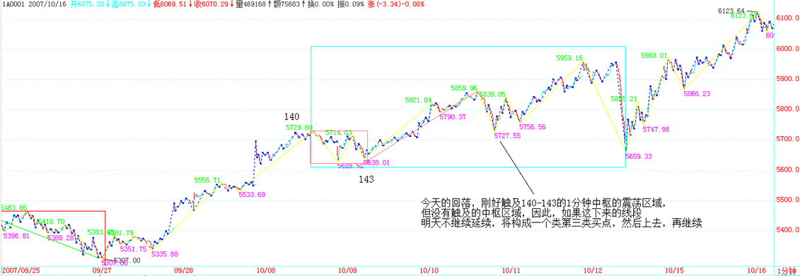

今天的回落，刚好触及140-143的1分钟中枢的震荡区域，但没有触及的中枢区域，因此，如果这下来的线段明天不继续延续，将构成一个类第三类买点，然后上去，再继续。这里有一个微妙的地方，今天留下这个线段不走完，就给明天的运作留下回旋的空间。一旦明天没有特别的东西，那么就继续上攻，继续吸精大法，毕竟多头的能量还在，让多头更快更强更高地套住，以后的杀跌动力才足够，这就举得越高，跌得越惨；如果明天就有足够的政策配合，那么这线段就直接杀下去，让那1分钟中枢扩展开来。

板块上，中字头全面开花，连潜伏许久的中铝都启动了，这火确实有点燎原。而所有的低价股都一路潜伏，为什么？空头明人不做暗事，昨天已经把底牌说了，一旦11月前后没有政策面配合，就算做空失败，大不了重新开始低价革命，这叫两头准备，永不落空。这就是中字头、题材股两个翅膀的妙用。当然，如果时间延续太长，政策都不出来，题材股也要动一下，不可能一直压着。

好，现在技术与资金的大战已经开始，就等待政策的那一轮圆月了，听说，月圆的日子，会鬼哭狼嚎的。

为了不让不学无术的多头太容易看到图形分段，本ID的图就不帖了，这里的人，个个冰雪聪明，有人昨天连中铝要动都能猜到，分段肯定没问题的。

多头不会一下被打死的，最后射死多头的，一定是政策。耐心等待三面一点的时间撞击吧。有技术的，可以按照图形上下折腾，机会多多。没技术的，就把仓位逢高调到任何情况都能睡着的程度，拿好小板凳就看戏吧。忙，先下，再见。

[2007-10-10]一个转帖

(2007-10-10 21:58:41)

对不起，这几天特忙，今天回来太晚，没时间写帖子了，刚好有一个的新文章，回应了本ID前面一个帖子““港股直通车”难以背负的使命”里的类似观点，转帖一下。这加大蓝筹流通量的观点，大概也将逐步燎原，最终成为政策的一部分了。

华生：5000点之上预警A股虚胖

2007年10月10日

华生表示，虽然最近泼了很多冷水，但用心是希望有持续发展的资本市场。

"我不是唱空者，我们泼冷水，发各种警示，目的是为了避免泡沫积聚导致破裂的情况发生。"

当上证指数站上5000点，投资者一片欢呼之时，一篇不太"和谐"的文章--《市值远超GDP的虚胖与警示》在《第一财经日报》刊登后迅速在坊间热议。这篇文章的作者就是华生，燕京华侨大学校长。

2001年7月1日，在股市接近2245最高点时，华生发表文章《漫漫熊市的信号》，预见了未来熊市的来临；在2005年5月10日股指即将逼近1000点时，他再次发表文章《市场转折的信号》。去年6月，他还专门撰文指出中国将《迎接证券市场的新时代》，称中国股市市值将增加10倍。

今年以来迅速增长的市值和股市中出现的一些不正常的现象，开始让这位理性的学者担忧。现在的华生，已经被市场戏称为"空头司令"，近期的几篇文章，无不是在给股市"泼冷水"。

日前，在接受第一财经频道《会见财经界》和《第一财经日报》联合采访时，华生详细阐述了他对于当前股市的看法。

虚胖与警示

刚刚过了2007年"五?一"节，华生突然从一个非常积极乐观的角色转为市场的看空者，并且一写就是两篇文章，题目也很惹眼，一篇叫《市场过热的信号》，另一篇就是《市值远超GDP的虚胖与警示》。

在一般人看来，中国资产证券化的提升应该是一个好事。然而，华生现在却说市值"虚胖"了，这是不是危言耸听呢？

"我从来也不知道市场的高点在什么地方，低点在什么地方。但是作为一个严肃的研究者，一个经济学家，他对市场运行的趋势、规律应该有自己的判断和分析。"华生说，之所以把话说得比较严肃，是因为当时包括垃圾股在内的炒作都非常厉害，"当时炒作的气氛甚至比现在炒到5000点以上的气氛还要浓，我认为这个现象是不正常的。"

由于国家及时出台了一系列政策，"5?30"以后，市场出现了一个大的调整，被认为投机气氛严重的垃圾股炒作在这之后得到了很大抑制。

"虽然很多垃圾股远远没有回到前期高点，但是应该说市值进一步扩张的势头没有停止，而且在加速。"华生说，"我的研究发现，中国证券市场的市值不是刚超过GDP，而是上市公司市值已经是GDP的150%了。"

"为什么呢？我们不能把在香港上市的一些内地企业，以及在纽约、新加坡、伦敦上市的企业，不能把它们忽略了。因为它们也是境内的公司，特别是随着它们的回归，这个市值自然就加进来了。它们没回归，也并不是不存在，仍然是我们境内的公司。"华生说。

按照全球的情况，一般发展中的国家，证券市场的市值是GDP的20%~30%，中等发达国家大概是在50%~60%，发达国家在90%~100%。

"从微观的指标来说，目前我们股市的市盈率已经是世界第一了，我们经济增长是很快，但实际上经济增长快的并不只是我们啊。印度增长也很快，俄罗斯经济增长这几年也很快，但人家并没有这么高的市盈率。另外一个指标，市净率，我们也是世界第一。"华生说，这确实是值得警惕的。

应大大增加流通市值

华生的文章经过媒体发表以后，产生了很大的影响，同时也引来了一些质疑的声音。第一主要是认为，拿中国的情况和当年的日本比，是否具有可比性。因为日本在泡沫期时，宏观经济增长已经很低了，而中国的经济增长还是很高。

第二点就是中国的市场，因为供求结构的关系，所以市值有一定的失真性。比如说一些大蓝筹的市值是在大量股权都不流通的情况下，由于资金量的推动把市值炒高了。

"对于第一点，实际上我们不光是和日本比，包括当时的韩国，都经历过这样的情况。"华生说，我们不希望重复这个历程，所以我们要提前预警。

"对于第二个问题，我认为实际上是支持我的观点的。我说的是'虚胖'，'虚胖'的含义是什么？就是因为你只上市了这么一点，因此你的总市值是被夸大了，所以第二个观点和我的观点有相同的地方。只是角度不同，得出来的结论好像有差异。正因为我们上市的流通比例太少，造成了整个市值的虚估。虚估使得流通股股价太高。这样就会带来一系列的危害。"

"特别要说的，就是我们现在大盘蓝筹股上市的比例太低，这个对马上要搞的股指期货是非常危险的，你想，投资期货主要是跟大盘蓝筹股锁定，如果大盘蓝筹都是一个小盘，用一个几百亿的市值就能撬动一个几万亿的市值的话，这样的指数应该说在全世界是很少见的，几乎没有。它的危险很大。"华生特别提醒说。

"引出来的政策结论是什么呢？为了去掉'虚胖'，就应该大大增加流通市值。"华生说。

虽然在华生眼里，现在的股市已经出现一些不正常的'虚胖'，但华生认为，并不看好政策一下子把股市打压下去，而是希望以更平缓的方式来进行。

"在这点上我和看多派是有相同之处的。我们都高度重视资本市场对于国家，特别是对于我们这样一个正在崛起的大国的意义。所以，虽然最近我泼了很多冷水，但是我们的用心是希望有持续发展的资本市场。"华生说。

"我们的目的绝对不是打击它。所以我说不希望政府用过于剧烈的行政或者经济手段去打压。那么，为什么政府还要发挥作用呢？我们这个市场政府本来就在扮演一个重要的角色，比如说供应多少，一个公司上市是2%还是20%，本来就是政府决定的。本来就不是一个市场行为，我们希望政府用一个更符合国际惯例的、更适合市场经济发展的、更少给市场带来冲击的办法。"

"比如，我觉得像大盘蓝筹股，让它们的上市比例高一些，最低也要像《证券法》规定的那样达到10%。有相当多的公共流通股对于刚才我们说的改善公司治理结构是很有作用的。"华生说。

供需变化失衡

尽管支持市场已经过热的专家和观点越来越多，但包括政府出台的调控手段在内和各路专家的警示，仍然无法按捺住投资者的热情。

华生认为主要是两方面的原因。一方面，政府今年出台的措施，除了印花税以外，其他都不是针对股市的。

再就是从证券市场本身来讲，今年以来，由于需求形势的变化，牛市的赚钱效应，存款负利率，使得大量的资金涌入股市，需求发生了巨大的变化，但供给却没有发生多大变化。一段时期以来，每个月涌进市场的资金都有几千亿元，但股票供给所需资金只有几百亿元。

"任何市场供不应求就是价格上涨，而我们现在证券市场价格上涨的状态从5月份以来，包括证券市场从业人员，大家都分析了，应该说资金过多，追逐有限的股票，在供给不增加或者增加非常有限的情况下，价格上升就很难避免。"华生说，"9月份开始，大盘股的供给开始增加，市场的供求关系马上就有变化，但供给增加有很大的波动性，预期也不明确。现在的问题是，其实大盘蓝筹股不必要上得多快、多急，而是应该成熟一家上一家。但只要上市，至少要有10%~20%的流通比例，使公众公司的名称名副其实。"

"为什么说上市的比例和质量比公司数量更重要呢？我们可以看一看A股和H股的差价。有人说市场不同就应该不一样。其实最主要的原因就是供求关系。H股的流通盘平均是A股的7倍左右。如果A股和H股上市流通量差不多，A股和H股就不会有多少差价。现在A股上市大公司的比例人为地压得很低，很多只有百分之二点多，迫使投资人只能高价入市购买。所谓'虚胖'，就是人为地控制上市比例，造成股价虚高。"

"从今年四五月以来，我没有主动地推荐任何人进入这个市场，但我也不会随便地劝人离开。因为任何一个市场永远都有投资机会，即使在泡沫的时候，仍然还有优秀的股票。"华生说，我只能说现在的证券市场风险很大，每一个投资者要有自己承担风险的能力。

华生　第一财经日报

[2007-10-11]为让多头更高更快更强地替股票站岗而继续努力

(2007-10-11 15:32:44)

今天，即使不为中石头的精彩而鼓掌，到尾盘，连李军人都奋力而起，至此，如果都没有一点感动，那本ID也没什么可和各位说的了。现在，空头正为让多头更高更快更强地替股票站岗而大大地努力着，这一点难道不值得各位眼泪一番吗？

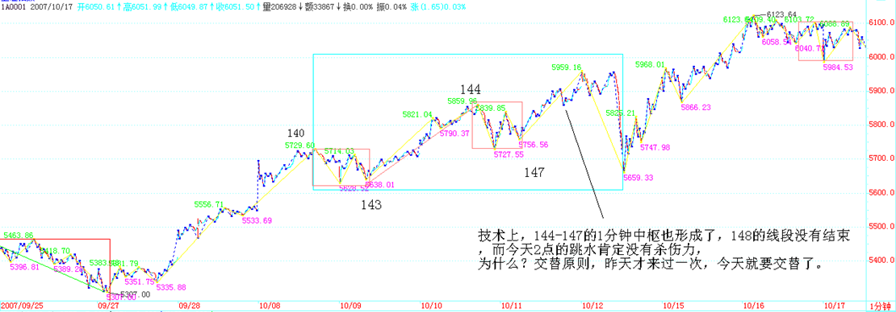

昨天已经超明确地说了：“一旦明天没有特别的东西，那么就继续上攻，继续吸精大法，毕竟多头的能量还在，让多头更快更强更高地套住，以后的杀跌动力才足够，这就举得越高，跌得越惨”，现在的方针，已经十分明确地说过，只要没政策，就沿着目前的速率，一直震荡攻击，把中字头搞得比八、九点的太阳还要太阳，指数比打了鸡血还要鸡血，但一般人，肯定赚不了一分钱，这就是分化的力量。

没有什么比看着指数涨，绝大多数人都亏钱更能打击多头情绪的了，把所有拉指数的都给掀起来，这些东西，都是双刃的玩意，拉的时候快，跌的时候的速率就更快了，把多头的能量转化为势能，最后势能转化为下跌的动能，这从来都是做空的不二法则。

明天，将是一个坎，周末的消息面是仅仅加个0。54的息，还是来一个继续增加印花税或者其他硬玩意，还是什么都没有继续消息真空，就决定了后面游戏的线路。明天走势，消息面的动向决定一切，所以明天消息漫天飞是必然的。

技术上，144-147的1分钟中枢也形成了，148的线段没有结束，而今天2点的跳水肯定没有杀伤力，为什么？交替原则，昨天才来过一次，今天就要交替了。

个股方面，没有参与中字头游戏的，肯定受苦了。中字头、题材股，一拉一压，才能保证做空的绝对安全，一旦政策不兑现，那么反手做多才有好的题材与空间。这是大资金运作的必然选择，没有什么残忍不残忍的。市场就是这样的，又不是吃大锅饭，一定要人人有份。

但如果政策没有立刻兑现，题材股会在超跌后有反弹，也给中字头一个休息的机会。

明天收盘后要出一个短差，去深圳签一个合同，后天再赶回北京，所以明天收盘，没时间写了。

今晚会有一个帖子，先下，再见。

[2007-10-12]谨防A股被挟持，股指期货应缓行。

(2007-10-12 08:20:11)

在股指期货已经呼之欲出时，还写这样的题目，可能确实有点不合时宜。但是，不合时宜的话如果是正确的，为什么不能说呢？因此，问题的关键在于，股指期货在目前情况下推出，是否真的合时宜了？要讨论期货推出是否合时宜，关键又在于，目前现货市场的成熟度是否满足期货推出的基本客观要求，显然，在这一点上，依然有着诸多值得商榷的地方。

虽然已经被人多次引用，但依然不得不再次引用的事例，还是那令人无法忘怀的1995年国债期货悲剧。这一悲剧产生的因素太多，但有一点是不容忽视的，就是当时的国债现货流通量太小，几个机构联手，就足以控制相应期货的走势。至于最终形成两大集团对赌局面，那不过是这种控制走势分化演变的必然结果。

那么，对于现在的A股市场，其可控制性就如同1995年的国债市场，问题的核心就在于，超级大盘股流通比例过小，而该流通量却能控制住一个超大规模的市场，这里的投机收益与风险成本完全不成比例。在本ID前面关于“港股直通车”的文章里已经明确指出，没有合理的流通量就没有合理的价格，目前中国股市最大的问题就是超级大盘股的流通量过小，普遍达不到证券法要求10%的最低流通比例要求，这样条件下的股市必然是一个能被轻易操纵的市场。

一个能被轻易操纵的现货市场一旦出现期货交易，那么，这种交易必然导致极端投机行为的出现。目前没有任何的现货卖空，也就是现货中，本质上只能做多才能赚钱，而实际的流通筹码又极端不足，可以断言，在这样的流通量条件下，指数期货的推出，将极大地有利于疯狂的做多行为，任何在期货中的空头头寸，最终都会被疯狂的逼空走势所吞没。筹码就那么少，资金又那么多，任何的空头头寸最终都是死路一条。而极端的疯狂做多行为，将把A股短时期内推向难以控制的高度，将A股长期发展的精气神耗尽，最终导致难以收拾的局面。

有一种观点认为，目前红筹、H股大量回归后，股指期货所需要的流通量条件就能达到。但这种回归，并没有改变超级大盘股流通比例过小的状况。最近回归的中国神华，其A股流通比例是6.33%，而建设银行更是只有可怜的2.7%，请问，这不等于火上浇油吗？这样低流通比例的超级蓝筹回归，必然是来一个被炒飞一个。至于借助A股的超低流通比例，通过控制A股走势去操纵港股相应股票走势进而两头套利，就更不是新鲜事了。

本ID前面的文章已经指出，要使得A股有一个合理的价格，达到与H股接轨的目的，一个最简单的办法，就是让超级蓝筹的流通量与H股接轨。可以断言，在超级蓝筹的A股流通比例未被调整到合理水平前，股指期货的推出都是不合时宜的，必将蕴藏着巨大的后续风险。甚至不排除这种情况，就是A股因此被挟持，让后续的监管与调控陷入难以解决的困局。

按照最正常的资本市场层次设计，必然是先完善现货市场，再开始期货市场。而目前A股分为深沪两个市场，一个横跨两个市场的现货标的设计，在以后会面临诸多不便。本来，一个最理想的思路，就是先发展创业板市场，等该市场发展到一定规模后，再让主板都合并到沪市，而让深市成为创业板，最后在沪市的基础上开展开指数期货，当然，相应地，深市也可以有创业板的指数期货。

当然，以上思路，在目前已经错过了实施的机会，但并不能因此让期货过早推出而留下严重隐患。一个最简单的道理，期货是现货充分发展后的产物。而目前A股这现货市场，依然有着诸多不完善的地方，急忙推出其指数期货交易，是否有点拔苗助长了？

至于那种认为期货可以对冲风险的说法更不值一驳，世界证券历史一再证明，最大的风险从来都不在现货市场，而是高比例透资以及期货等衍生品。期货能否降低现货风险暂且不论，期货自身的风险如何防范，这绝对是比应付现货风险更为棘手的问题。而这问题，不光对于所有的参与者，更对于市场的监管者。

说白了，现在期货被市场热切期待，不过是现货市场的投机资金有了最终锁定投机利润的绝好机会，更看到了加大这种利润空间的新的投机机会。目前，反而应该逆投机资金的意向而行，釜底抽薪，将主动权把握在监管者自己手里，按照市场健康发展所需要的节奏去完善市场，而不是被国际性投机资金牵着鼻子走，为国际性投机资金的兑现、出逃制造世纪大机会。

[2007-10-13]刚忙完回酒店，就说上两句

(2007-10-13 21:07:14)

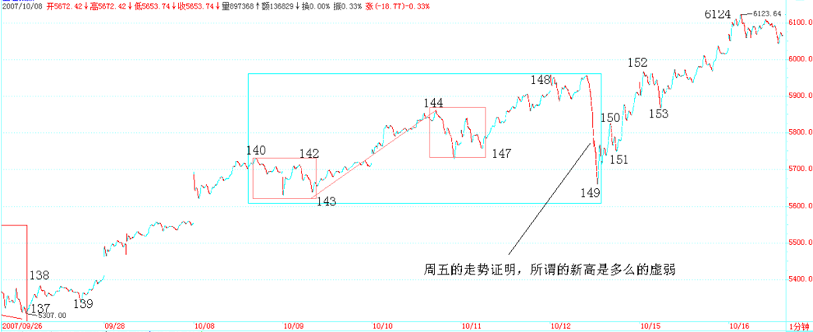

经过一天半的冷静，如果还不能用脑子思考，那就去买国债吧，证明你完全没有自己操作股票的天分。剧本在周初就说过了，实际的走势，一直都是空头主控。今天的震荡，完成一个完美的板块切换，更重要的是，多头的心上，又挨上一刀。

周五的走势证明，所谓的新高是多么的虚弱，本ID已经说了，那些中字头，拉他们很快，砸的时候速率更快，今天可有体会？这个摧残多头心灵的游戏，将一直玩到政策的共振为止，然后就是黄叶飘飘的日子。

不多说了，该说了都说了，自己考虑去吧。最后，再多嘴一下重复一次，如果有本事的，这场对多头的蹂躏，里面的机会多多；如果没那本事，逢高把仓位调到任何情况都能睡着的地步吧。还记得本ID曾用红字把逢高打得大大的吗?

杀人刀，活人剑，自己决定去吧。

[2007-10-14]终于要北大了

(2007-10-14 14:08:03)

谜底揭开了就不是谜底了，终于要北大了，准确说，北大，终于有机会了。说这就足够了，该知道的时候总会时候的。

但不管是北大还是清华南开，中国经济都将面临一个严重的关口。痴人在说梦的时候，秃鹰已经在飞翔。

最后，用一首五律《无题》作结，孔男人如果有兴趣，是可以步韵一首的，前提是能看明白，否则，本ID要继续鄙视中文系。

[2007-10-15]中国经济，已需治理整顿。

(2007-10-15 08:32:52)

现在，中国经济已经到了一个关键的关口，由被动人民币升值带来的诸多问题已经逐步成为不能忽视的问题，而房地产泡沫也到了逐步不能被泡沫的程度。经济的过热，使得通货膨胀已成为一个可能需要面对的情况，这种情况下，是被经济的热度烧焦，还是冷静地进行反思，采取正确的选择，就是最近必须做出的抉择。

实体与虚拟经济的结合，在中国依然是一个试验课题，没有任何有经验，如何能稳步推进，而不最终327化，这同样是一个抉择。

事实证明，一放就热的中国经济陋习，并没有多少改变，现在，需要的是治理整顿。

股市，最终要看的是经济政策的选择，这一切，很快就有谜底。戏，总是要高潮后死去的。制造高潮，不过是为了制造死亡。

选择，总是自己的。自己的命运，自己选择。本ID没什么可说的。

资金、技术都准备好了，就看那政策之窗的打开，如此而已。

[2007-10-15]没有消息，继续把多头哨位架高

(2007-10-15 15:15:15)

显然，周末的准备金不会是空头所等待的那政策共振，周五大震荡配合的板块转换，其实已把空头的计划提前透露。上周，本ID已明确说，没消息，题材股会借机反弹走强，给中字头休息机会。这两天走势，不过是这剧本的现场演绎。看着这两天000777、600343、000600、000807、002149、000822等等的走势，以及这两天的涨幅榜中二、三线个股的大面积增多，这板块的反弹转换一目了然。但注意，除了个别最近有实质题材的，题材股大多目前不具备大幅度启动的时机，只是一种换档式的过渡。

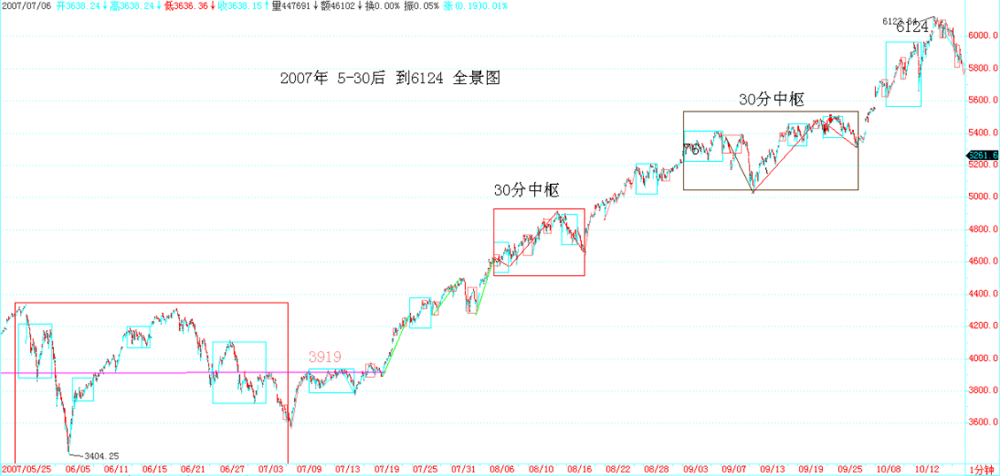

当然，最有味道的，还是中石头和中联通，今天，两者为大盘贡献近160点，没有这两个本ID的支柱股票，今天的大盘是绿色的。两者的意义，本ID已经无数次说过，有中石油、中移动在后面，你说本ID又有什么可担心的？有什么不可以放手大干的？现在，对于空头来说，唯一重要的，就是把多头的动能转化为空头的势能；现在，一切都如空头所设计的步骤，势能在不断积聚；现在，泄洪的那一刻，需要的只是政策面那一轮圆月。

政策方面，有点必须纠正的，很多人还以为上次的印花税是某个部的意思。可笑，一个部能定那么大的事吗？别用脚趾思维可以不？可以明确说，以后关于股市的任何政策，都必然是一个整体的、总的决策下的结果。

个股方面，该反弹的都要陆续反弹，中字头停留休息一下后，如果政策的窗口还没打开，那么就继续上冲，把势能继续提高，如此而已。前面本ID已经说过，本ID有一个情结，就是6100点，至于政策面上是否给这个机会，本ID并没有情结。

今天的报告，没任何意外的地方，里面本不可能有任何直接评论股市的地方。今天最引人注目的，反而是某一直以当学者为荣的老先生，一改在3000点下抨击投机的观点，在6000点竟然称颂起投机的功德来，这也算中国资本市场历史上一大趣闻了。本ID的观点，可从来不会与时俱进，从来不会改变：

1、中国股市的大牛市20年3万点以上；

2、目前依然是牛市的第一阶段；

3、目前需要中级调整，而经济也主要治理整顿。

4、中期调整，发生在资金、技术、政策的共振中，目前，是资金、技术在为政策作铺垫。

5、让分力成为合力，这是一个复杂的过程，动能转化为势能，一切按部就班。

6、如果政策也被热度化，那就意味着第一轮的走势有走到尾声的风险，那么就低价革命，比投机还要投机一把。

本ID只能是分力之一，不是合力，最终，一切决定于合力。而本ID成功与否，就是能否按自己的节奏，把合力引导出来。

对于散户，操作上，技术不好的，逢高逐步把仓位减下来；技术好的，就在震荡中游戏那多多的机会，但必须要注意节奏。那些追涨杀跌的，没资格玩震荡游戏。

一切都按照这八点所界定的逻辑为起点，在纯盈利的角度，本ID愿意出现第6种情况，但从国家经济战略与安全的角度，本ID绝对不希望看到第6种情况。

晚上有事，帖子没法写了，明早有时间补上，抱歉。先下，再见。

[2007-10-16]成老先生，请慎言

(2007-10-16 07:49:06)

昨天，成老先生关于投机有利市场的言论，令人不禁想起3000点下成老先生关于泡沫等等的言论，而昨天的点位是6000点。作为学术观点，这本没什么，而且这种观点宣扬的人多了去了，但成老先生的身份显然比较特别，在目前的环境下，一改几个月前的观点，在公开场合为投机说好话，确实有点让人觉得不妥。

投机，不过是一种市场行为，对市场无所谓好坏，而且，市场充满骗线，例如，以前，某股票，短时间内暴涨100%，然后连续跌停，最终跌到0，给摘掉了，所有为那100%兴奋的，结果发现，即使按那100%的起点算起来，也是一个高高的山顶。前面那100%的做多，不过是总体做空的一部分程序，这就如同目前的大盘，正在赶顶之中，这时候宣扬投机，难道是一个合适的时间？

市场总是很公平的，最终赚钱的总是少数人，80%的人，不过是坐坐电梯，然后坠入深渊。散户的命运，大多如此。这时候宣扬投机，给那些散户是什么印象？什么影响？并不是每个人都适合无限风光在险峰的，不是每个人都适合玩赶顶的游戏的，这时候，作为一个有身份、有影响的老者，似乎更应该对提醒，而不是发表对投机的如此言论。

高潮之后，总是一地鸡毛，这就是投机。高潮是投机的快感，一地鸡毛是投机的代价，而且，至少80%以上的人，鸡毛一地的。现在，一个负责任的人，更应该说的是：没能力的、没那本事的，先离开，没有任何最终的跑道，是可以让所有人通过的，最终通过的，最多20%，首先，投机前，先搞清楚，你的能力，是否能在那20%内。

当然，有能力的，就无限风光在险峰，而如果能利用投机，达到更高层次的目的，那就更好了。由于管理者，大多没有实践经验，一些明显错误的安排，就需要有人把这个错误的后果演示一下，如果这样都不改变，那么，就真是气数如此了，那也没什么遗憾的了。

卖点，总在上涨时，股票如此，经济也如此，难道经济就没节奏？不明白这，经济也难以经济了。人，总是在下跌后才问卖不卖。经济，一旦转折，那卖出的通道在哪里，只有天知道了。

经济的调控，就如同股票的买卖，节奏第一。这个道理，确实需要道理道理了。

[2007-10-16]6100点终破，无憾矣！

(2007-10-16 15:29:29)

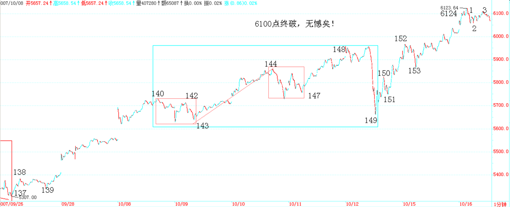

今天站上6100点，终于没什么可遗憾的了。6100点，曾经是96年大牛市的深成指的最高点，当时也是刚破1000点后启动的。相比，这轮牛市并不太猛，走了2年多才达到上次1年多完成的幅度，正因为这个速率比较温和，所以才不会是最终真正的顶部，但中期调整是需要的，只是等待共振点。

今天的大盘，延续上周说的大震荡后的中字头休息、题材股启动。今天糖业大启动，600737不大动，主要是现在，中国最大的糖产还没装进来，今天跟着启动，似乎有点名不正。不过，该股最牛的题材，还不是将有最大的糖，而是其他，这类中长线的股票，短线的走势并不重要。就像000777，从去年12月的7元多到现在的47元多，真正的题材还没出来，这就是中长线股票的走法。

但是，现在个股并不重要，重要的是这个赶顶游戏的节奏，可以把下面的剧本先说一下：题材股轮动一次后，如果还没有特别的消息，那么中字头还要冲一次的。现在，中字头的同伙回归题材，就主要剩下中石油和移动了，神华也没上100，空间都有，关键是政策所给的时间。短线上，一次震荡是逃不掉的，震荡后，如果没什么消息，那中字头又会切换重启。

中字头把同伙回归行情玩烂后，就是指数期货了。但，这里有变数，当然也会有一种努力在行情外进行着，就是让指数期货延后。位置并不总是那位置的，很多位置都可以重新位置的，没有什么事是一定不可以改变的，事在人为。当然，如果努力后还改变不了，那也没什么遗憾，投机，那还是最简单的游戏，谁怕谁？

当然，这都是小问题，关键是总的政策的风向问题，本ID说得很清楚，11月前后，就是这个时间的共振窗，一旦转向，这个赶顶游戏就宣告结束，顶的左边做完，当然就是右边了。

本ID可以很明确地说，最终顶部形成后，最多只有20%的人，能把今天的市值保持下来。不是不报，时候未到。

该说的都说了，今晚有事，写不了帖子，有可能，明早补上。

明天的解盘要在晚上才能进行，因为收盘后马上有会，先说明一下，抱歉了。

[2007-10-17]确实存在全面泡沫化的潜在风险

(2007-10-17 08:44:44)

下午收盘要飞机回北京，解盘在晚上，抱歉。

今天，二大报齐说泡沫的全面化问题，这是在会议期间，可能采取的最大提示之一了。显然，按照中国人的性格，面子比里子大，不是迫不得已，都不会撕破最后那张脸。所谓先礼后兵，中国人从来如此。因此，在530之前，N次的风险提示，已经是仁至义尽；530唯一不好的，就是发布的时间不对，如果是第二天早上发布，那发布应该是完美的。

现在，确实存在全面泡沫化的倾向。一旦全面泡沫破裂，那调整的时间将极为长。目前，如果市场能进行中期的休整，有利的是市场行情的长期发展。所以，本ID已经明确说了，如果11月前后的政策之窗不打开，就展开低价革命，那多头最后的精气神给耗尽，然后就是第一阶段的结束，该怎么死就怎么死。但如果11月份前后的政策之窗适时打开，那么大牛市的第一阶段还没完，将能延续更长的时间。

一切都是所有参与者的共业，如果大家一起合力着要下地狱，那本ID也没意见，对于本ID来说，地狱和天堂没什么区别，熊市一样可以吸血，而且更爽，杀的人更多。嗜血，从来都是市场的本性。

当然，这市场如果能救，能让第一阶段的牛市延长更长时间，本ID也会为此努力的。但成功与否，那就是所有参与者的事情。本ID天堂地狱任来往，无所谓。就是可怜苍生，牛市动力过快耗尽，进入大调整，甚至经济出现大调整，通涨没压住，又有无数人要受苦了。

有时候，人爱死，可能就让他去死更好，本ID确实有时候太多事了。

[2007-10-17]解盘兼北京旅游指南，为奥运贡献一把

(2007-10-17 22:36:22)

对不起，刚回家。今天大盘，继续6124下来的中枢震荡，技术上，能否震荡出5分钟中枢，明天就有分晓，然后就是该中枢的第三类买卖点问题。现在，无论怎么走，都没太大意义，关键是会议结束后基本面的进展速度，这决定该冲顶游戏的结束时间。

个股方面，题材股继续活跃。中字头，由于今天被点名批评，所以休息时间延长点，需要诸如中石油等回归题材的再度明确。这一次的中字头启动，就留给多头吧，本ID就没兴趣了，这就是一个节奏问题，只抬第一波，决不搞第二波，这就是操作的微妙之处。

好了，今天就把两个帖子合一了。飞机上想了想，写了两首五律，就当一个北京旅游的指南。

累了，在外面快一周时间，本来一天的出差延长，不过这个成果大大的，值得。以后，本ID将大大地制造股票，PE一把给市场，也让市场300元买买本ID1元的股票。

先下，再见。请看北京旅游指南，为奥运贡献一把。

[2007-10-18]不费吹灰之力，空头完胜

(2007-10-18 15:39:47)

本ID说过，本ID有一个情结，就是6100点，过了，情结就了了。如果这波大盘真给顶出顶来了，最好不过的点位就是6124.04点，这比6144.44、6124.44点都好。当然，空头从来都是很谦虚的，并没觉得这顶就一定完成顶成，但空头这次的冲顶游戏中，占尽先机，现在，又回到前两次盘中实验跳水的地方，空头已经完全掌握主动，上下自如了。上，大不了再玩一次这几天的游戏；下，那更是空头的拿手好戏，就等着政策配合一下了。

空头，干事情，从来都是光明正大的，宣布做空时已经明确说了，这次是让资金、技术来等待政策，而且说了，有一个情结是6100点，这一点，通过这六天的努力，已经初步达到目的。

但是，由于目前图形依然没有走完，大盘的顶部构造更谈不上破位，所以，这里还有反复，关键是政策的配合，如果政策不配合，那么，没有人会故意压在这个位置，压是压不住的，而是要冲，比多头还要多头。今天，严重鄙视多头，连一个盘中反弹的勇气都没有。空头只好让可怜的600737兴奋一把，盘中最猛烈的反弹，竟然是可怜的小737引领，这么弱小的身躯，竟然成了今天对指数贡献的第七位。多头，你们的名字就是软弱，鄙视你们。

这两天，印度已经举起大棒，中国的大棒，还远吗？

技术上，上面连一个5分钟中枢都没形成就趴下来，所以，现在就看5800点附近的1分钟中枢能否站稳，不行就继续下台阶，一旦有效跌破5600点，就意味着多头彻底完蛋。所以，今后几天，就等着多头反击，希望多头能组织起有效的反击，否则，空头这样就赢了，也太没挑战性了。空头的仓库里，还有N的N次方的阶乘再叠加N的N次方的阶乘次的武器，别采用一种，多头就招架不住了。

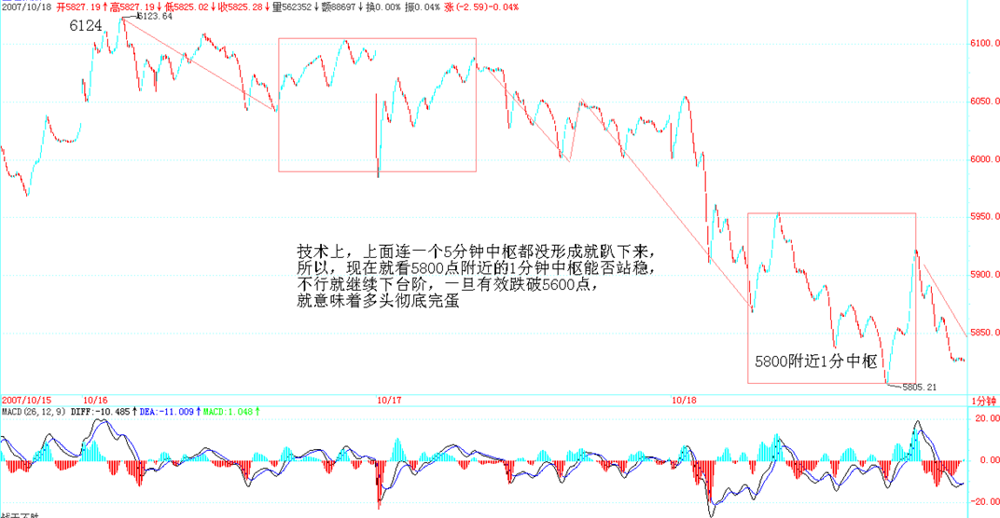

空头现在的策略可以大公开：在震荡中先买后卖，逢反弹必抢，然后再抛出，制造出无穷的抛压，把多杀多的惨剧导演出来。

注意，散户千万别抢小级别的反弹，没那技术，继续看戏，没你们什么事。

本ID已经想好了，万一这次做空失败，除了来次低价革命外，就是多多去PE，制造出无数的股票来给多头。听说，印度有7000多股票，中国现在连2000都不到，看来，太多活需要空头干了。忙，先下，再见。

[2007-10-18]对不起，刚回来

(2007-10-18 23:20:32)

对不起，刚回来。下午、晚上，分别二个关于商业的无聊会面，但今晚的意义不在这上，9点后赶了第三场，一个小聚会，一朋友明天要飞降南方某省去扑火，其事起因，简直比所有滑稽笑话还要笑话，笑话之后，骨头都冰凉，我的中国，哎。

就像看戏，千万别去后台，否则就别看算了。有时候，就当一个观众，傻忽忽地，嘴边流着口水，或者也是挺幸福的。

听过今天铁一样冰冷的、无关股票经济的巨大笑话，而且还有后续的去明天，本ID都有点提不起精神了。多头，明天任你们放烟花，看你们能折腾出一个什么的世界。本ID要好好想想，我的中国。先下，再见。

[2007-10-19]多头，没种，有屁用！

(2007-10-19 15:33:22)

昨天，本ID晚上听了一个很恶心的笑话，无关股票经济，只关于一个苹果，比皇帝的新衣还要皇帝还要新衣。所以本ID回来就说，今天就让多头表演了，本ID要思考一下问题，不操作。而多头不是说前面冲6100点都是他们的干活吗？今天，又辟谣又利好的，怎么冲不起来干活不起来连烟花都起不来。多头，你究竟什么能起来的？

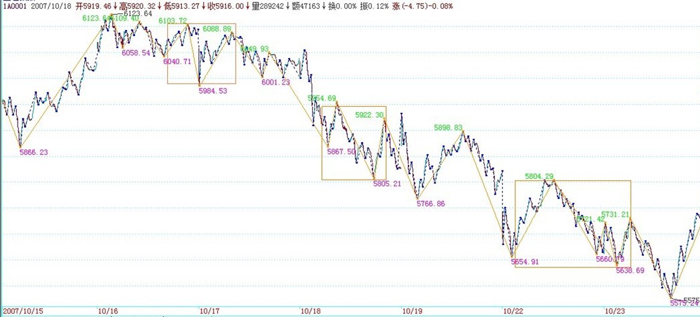

头多没用的，关键要有种。多头，没种，有屁用。

技术上，昨天说得很清楚，就是5800点的1分钟震荡，这震荡形成后，就看其第三买卖点的问题了。

今天，本ID一直在思考一个问题，一个苹果，如果从心里都烂了，是否有必要为此浪费时间？本ID现在还没想清楚，毕竟，救一个心都烂的苹果，就是把自己放到火上烤，本ID生性疏懒，现在，吃喝不愁，天天可以把酒三人，清风明月的，真不想为一个烂苹果浪费时间。但，谁又让本ID对这苹果爱得如此深切？

不多说了，说多了也没什么意思。对于本ID自身来说，确实是一个艰难的抉择。选择了苹果，可能要为此付出余生的安逸，包括现在拥有的一切。

注意，本ID宣布做空后，就不会让任何人对买任何股票了，如果本ID写首诗都被联系上股票，那本ID要考虑不说股票了。股票，对于本ID来说算得了什么。如果股票不是关系到苹果，本ID连看都不看一眼。

可以光明正大地宣布，为什么空头一定要在一定时间内比多头还要多头，就是因为要某些决心能决心，要把一切的风险先演示一把。可以很明确地说，如果这都改变不了什么，那么，一个更大规模地比多头还要多头的行为将要上演，而这，最终，做空的可不是股票本身了。

想想日本、台湾相应的走势，难道还不足以让某些决心决心下来吗？

下周，是关键性的一周，如果消息面不配合，比多头还要多头的行为会再次出现，但这和散户无关。

本ID可以很明确地说，如果期货出来，大部队打仗，就算指数上了10000点，也没散户什么事情，能赚到钱的，不会超过20%，而且是和6100点那天比。想想你自己的技术，有没有这本事，如果这几天的节奏都踏不准，那么，以后更大幅度的震荡，就是更大型的绞肉机。

别以为上涨、下跌才能搞死人，期货出现以后，大幅度的震荡，三方里一定死两方，而无论多头还是空头赢，绝大多数的散户，一定死，就这么简单。

好了，不管谁死，周末，都让股票去死。好好休息，先下，再见。

[2007-10-22]让今天要拉大阳的多头见鬼去

(2007-10-22 15:25:35)

首先，以最热烈的掌声祝贺从此股市北大了。

听说，多头要今天拉大阳，就如同上次有空头说要9月20时间之窗，就要这些人丢脸，世界很北大，后果北大了，本ID高兴ing。

但，本ID没什么可说了，一切尽在把握中的感觉总是没什么可说的。对于空头来说，现在最美妙的掌声，就是多头的漫骂，这一定是世界上最动听的音乐。

从6124.04这样一个绝妙的点位开始的1分钟下跌走势，在中枢的不断下移中延续着，现在刚好收在3600点上来的上升通道下轨上，而那5600点的缺口，就在眼前，一旦这个地方有效跌破，这针对从3600点开始上升行情的调整就得以确认。

技术好的，可以密切留意6124.04点下来的1分钟下跌走势的底背驰出现，然后有一个反弹将可以操作，技术不好的，就算了，没那本事，就继续在小板凳上看戏。

当空头，就是要下跌中还要赚钱，这才是真正的空头，底背驰抄进去，然后上去砸，这是一种令人感觉比较爽的游戏，问题的关键是，你有爽的潜质吗？如果今天市值比6124.04点那天少了的，就要好好反省自己的潜力了。

至于没技术的，今天市值比6124.04点那天少了的，就等机会走吧，虽然有点晚，但这就是没有正确认识自己的结果，如果有机会重新回来6124.04点那天的市值，先出来点吧，这样还可以有机会成为了20%不到的人。

注意，现在政策进入敏感期，虽然有利于空头的可能性较大，但新官上任，其风格暂时没人能把握得准，本ID现在对市场没兴趣，就像本ID在国航跌破发行价时买并到处号召买，实质上对国航一点兴趣都没有，只对李军人有兴趣。

1分钟下跌结束后，极大可能进入一个箱形，一个适合上下吸血的图形，然后等待政策去完成突破，现在本ID也很想知道，究竟在某位先生心里，5000点算不算高，是不是有泡沫。有谁知道的，请告诉本ID。

下午、晚上都是谈判，先下，再见。

## 教你炒股票85：逗庄家玩的一些杂史3

(2007-10-22 21:42:06)

以下都是梦话，千万别相信，相信者脑子有毛病。

说点老皇历，让各位都北大北大。

干这活的手法，就算现在的证券法算来，也是完全没有一点违法的地方，这绝对是一个经典案例，也看看股市里是如何做顶的。

当时要干的事情，就是要把一股票的货出掉，而且还是不是现价，必须在某个位置上。这不算难，关键是持有也就30%多，已经上涨N倍，而且里面有不少小家伙的老鼠仓，多的有10%。由于这游戏最终把一所谓的牛人给套住了，现在这牛人还在市场上混，最重要的是，这股票这么多年都没回到过当年的高位，所以为了不让那被套住的中年男人知道后有磨墙的心，更为了保护北京的文物，本ID就不说当时的价位和股票了。

先把1/2的筹码集中调到一个最多八卦人的证券部，然后，告诉他们，过三周内要陆续调N亿来，很认真地找了人去谈手续费分成问题，而且要求最高的比例，特别强调了对倒时比例要更高，注意，去谈的人也不知道想干什么，只是告诉他要在那边干点活，找一个成本最低的。

然后，该股就从N元开始异动起来，再起来20%后，就在别的证券部开始出，但手法很特别，总是在低位出，出了以后一副给夹空痛不欲生的样子，关于某股票被人抢筹码的消息就此流传。

接着，把出的钱以及部分其他的钱提前划到第一个证券部，然后再告诉他们，更多的钱还要划过来。

很快股价就比开始上涨40%了，继续在其他地方逢低出货，被彻底夹空。这一下戏演得连老鼠仓都知道损失无数筹码，要压盘把货补回来，老鼠仓也开始大幅度增仓。接着，已经不用逢低出货了。只要压单，就给扫掉，好过分呀。

这时候，开始在第一证券部谈透支问题，说要用筹码压钱，希望是1比2，但对方说他们最多只能1比1.5，因为最近这股票涨太多了。所以让人很气愤告诉他们，找了一个可以1比3透支的，马上就把筹码转了一半去别的证券部，然后对方就开始很恐慌地要挽留我们。其实，是别的地方出得差不多了，需要筹码。

最后一天，股票在三周多点上涨了70%多，那一天早上，一开盘，在买盘涌起的那一下，最后的屠刀开始了，所有剩余的筹码，一起涌出，具体过程就不说了，只是当天是跌停的，当然，那天也是巨大无比的量。

最后，派人和那第一家证券部说，不想玩了，你们那里风水不好，不能为客户保密，消息封锁不住，让我们被人砸盘，套住，亏死了，这里的资金要去别的地方救火去，走人了。

只想说最后那股票的命运，就是从最高位下跌了90%以上，至于比最开始的N元下跌了多少，大概不是一个困难的问题了。

注意，这次游戏，之所以经典，就是在整个做顶过程中，根本没拉抬过一笔，都是分批出货，最正常的手法，谁都说不了有任何违规的地方。而且，也没说任何一句影响股价的话，那么为什么成功了？只是因为那些人的贪嗔痴疑慢。

最绝的是，该股后来一直翻不过身来，多杀多的，自从最后一天后就从来没买卖过该股，但该股却一直下来，甚至后来2245点2001年的历史高位，也没靠近过那历史高位。有些傻瓜总是说，什么庄家打压，典型的脑子进水。为什么散户、小庄家、老鼠仓的多杀多就不可以让人死得一点脾气都没有？

当然，做顶的手法千百样，本ID也玩过无数的花招，有时候一顶就是一顶，有时候一顶不做一顶，千变万化。兵者，诡道，股票又何尝不是？

大盘的顶部和个股的顶部不同，要复杂得多，因为集中其中的分力更多，所以其合力当然要更复杂。一般来说，大盘的顶部都不会是简单的图形，都是十分复杂。而且即使真的形成，最后破位前反而要有很多的犹豫，越大型的顶部越是这样。

大盘的顶部都是折腾出来的，所以一般在大盘顶部时，反而机会多多，为什么？因为很多不死心的人，会不断折腾，板块个股，跳来跳去，那些认为大盘顶部一形成就一下死掉的，都是脑子水太多的。

个股的顶部，大多都不复杂，除非是很多人参与的大型股票，原因和大盘的一样，只是相反，就是分力少，对比太明显，所以复杂不起来。

当然，顶部是有级别的，一个中期顶部，中期调整后，就不是顶部了，所以顶部以后，也不一定是世界末日。但顶部以后是否世界末日，这是走势今后的发展决定的，如果你对任何顶部都想长线一把，那么，最终的命运多数是被股票上上下下地面首了，真正解决问题的，还是要通过本ID的理论去分清楚级别，按照买卖点去操作。

必须注意，无论什么花招，最终合力的结果还是买卖点，买卖点是不患，任何庄家、大资金，包括本ID本身，都不可逃避。所以，对于散户来说，其实不需要知道里面的故事，而只要看好走势，一切就尽在把握中了。

第85课读后感：

1、当然，顶部是有级别的，一个中期顶部，中期调整后，就不是顶部了，所以顶部以后，也不一定是世界末日。

2、必须注意，无论什么花招，最终合力的结果还是买卖点，买卖点是不患。

[2007-10-23]上升通道下轨支持如期反弹

(2007-10-23 15:40:39)

昨天说得很清楚，1分钟下跌底背驰后，一轮反弹将展开。今天的技术走势十分标准，更重要的是，这里是3600点上来的上升通道下轨位置，又是缺口位置，因此技术上必须要有这次反弹。

在前面已经明确说了，空头现在的策略，就是逢反弹必抢的，抢了以后，等不死心的涌上去没力时，才有筹码喂饱人。注意，这里本ID又有金针度人，不是任何反弹都可以抢的，只是做顶行情中的反弹可以抢，一旦顶部完全形成，破位后，那么反弹就没必要抢了，让别人去多杀多就可以，除非有特别大级别的买点。这是一个十分微妙的关系，但一般脑子进水的都不大明白。因为在那些人眼里，反弹都是一样，而实际上，在做顶行情中搞反弹，只是为了促进顶部的形成，而且也为一旦顶部形成不了而准备好后手。

做盘就如同下棋，必须有大的想法，而不是看一步走一步。着着有后手，这样才能稳胜不败。

以上的话，都是给现在技术还行的人看的，这里的标准就是，空仓或者目前的市值比6124。04点那天高的人。其他人，根本没资格抄什么反弹，先借反弹把市值恢复上去再说。

这如同跳舞，节奏已经错了，就不能错上加错，先把节奏调整对再说。

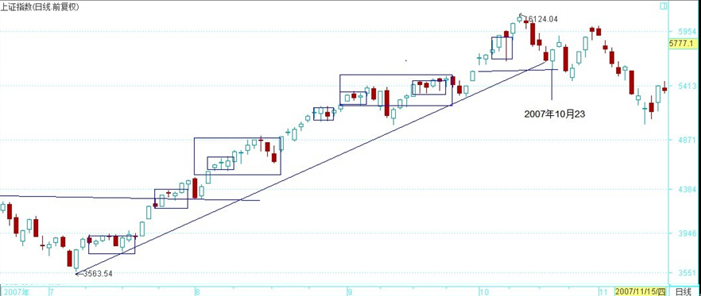

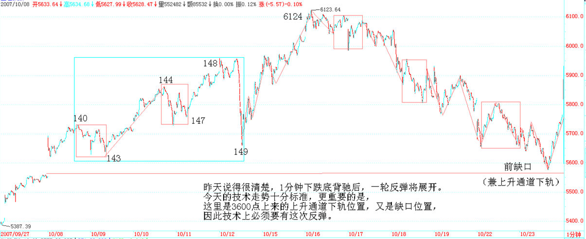

反弹的压力，首先是5日线，然后是10日线，如果这两条线都不能突破，那么这个反弹就将构成第二类卖点，后来是什么就不用说了。

注意，中石油上市，会给市场又一个兴奋的借口。但关键是政策面的趋向能给多少时间，中字头会借此兴奋一下，今天这已经有点表现。另外，二线蓝筹在反弹中也会表现的，例如科技股以及其他题材股之类，因为前面根本没动，所以有所轮动也很应该，但这些股，大面积表现的可能性不大。

本ID已经反复强调，顶不是一天搞成，这里有一个微妙的潜在语：最后破位之前，最终套住谁，现在还没有定呢，所以，6124。04点逃掉的，也不要高兴太早，一旦反弹做错，最后来个站岗大换班，那是常有的事情。

所以，现在的反弹操作，一定要谨慎，请量力而行

最近很忙，刚才一边写东西一边就电话不断，所以没时间回答问题了，抱歉。先下，再见。

[2007-10-23]太累了，没时间写帖子，说两句闲话

(2007-10-23 22:37:58)

太累了，没时间写帖子，说两句闲话。

本来是可以写帖子的，结果晚上谈事回来，看到下面搞的合同，几乎把本ID看晕了，完全不是本ID的意思。本ID只好浪费不少时间，等于重写一遍合同，这种事还要亲自干，真是晕。

那些破事就不说了，说实话，最近本ID是越来越忙，明天下午又是一个谈判，别人专门从香港飞过来，还是一群人，不见不合适，所以，这博客如果有照顾不周的地方，请原谅。

当然，本ID会尽力坚持下去，如果实在太忙，也请各位谅解。下周又有一件剪彩的事情，必须出一次差，不去不行。本ID现在都有点担心，万一铺的事情太多，以后要撒手不干了，可能还不是简单的事情。

人在世上，总难如愿的。想安静，就太与世隔绝。一入红尘，很多事情就身不由己了，毕竟事情要好来好去，不可能干一半就撒手不管。

吃饭时，有一电话又来勾引本ID，说软银投了某某项目，让本ID也投点，明年就上市。一个老熟人，本ID又不好推，只能说先把项目资料发过来，看了资料，如果不错，不投不合适，投了又多一件事，无聊呀。

刚才改合同的时候，突然觉得很累，现在的事情有点收不住了，总之，本ID有一个心愿，40以后完全转向文化的建构，现在到40还有太多年了，怎么熬啊。

对不起，一时无聊，胡乱唠叨，抱歉了。

[2007-10-24]10日线如期阻截

(2007-10-24 15:14:14)

马上要去见香港来的一群无聊人，只能快速说两句。

昨天明确说了，看5、10日线，今天，10日线的阻截明显。不过，由于今天在该线下形成一个1分钟中枢，因此短线走势，就看这1分钟中枢的第三类买卖点情况。如果能有第三类买点，那么将再次冲击6000点。

如果短期没有特别消息，这个反弹应该继续延续，只是以横盘还是以继续上冲的类型选择。由于那资金解冻在后面，这么多资金，不骗点进来太对不起大家了，所以，只要没有突发性消息，反弹至少能延续下去把解冻资金骗点进来站岗。

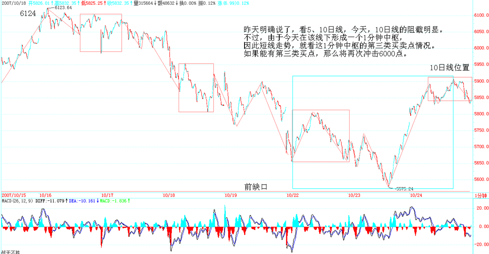

个股没什么可说，都告诉各位中字头了。当然，这种形式是最消磨多头意志的，指数涨，却没有赚钱效应，这就是空头最爱干的事情。

如果特别的消息一直不出来，那么在没什么事干的情况下，空头不排除会再次上演拉指数的好戏，把消息给拉出来。

短线技术，明天就看今天这1分钟中枢的震荡情况，如果出现第三类卖点，那就有二次探底的需要。

就算是反弹，也可以是二次探底后再展开的，所以现在对于反弹类型的选择，是可以有很多种的，判断标准就是这1分钟中枢的震荡情况。

注意，再次强调，最后指数的破位，必须有消息配合，没有的话，最多只能箱体，除非这箱体延长时间太长，把所有搞怕了才可能破位。

对不起，要走了，先下，再见。

## 教你炒股票86：走势分析中必须杜绝一根筋思维

(2007-10-24 21:53:45)

刚回来，下午的事情还没什么，晚上有一个电话，让本ID真有点气愤了，不吐不快。

因为要剪彩，主办方想请某德高望重的人，这老人和本ID不是一路子的，本ID找人去请，得到的答复竟然是：1、加上夫人和秘书的来回机票。（废话，这还用说，这是肯定的，就告诉来几个人，要不要明说呀。）2、劳务费N元。（这是让本ID最气愤的，气愤在于，这个N的数字太小，和这人的身份一点不配合，而且吃惊的是，这德高望重的、人人都知道的人，竟然提这个？而且提的数目一点气派都没有，连第N流的歌星都赶不上。）

本ID很气愤地回答说：1、机票就不用说了，到时候还安排他们住当地最好的宾馆的总统套房，这总可以了吧？2、劳务费不知道怎么给，主要这东西，本ID都没法开口。本ID以个人名义给也不合适，因为这人现在还有高职务，本ID可不想沾行贿的破事。而且最重要的，这样一个数量，本ID都没法转告别人，这样说出去，不是丢他的脸吗？3、如果一定这样，那本ID只好告诉主办方，这人没空。这样是为这人好，保存他的名节。

中国古人，都重一个名节。现在，名节成了什么了？可悲呀，我的中国。

不想说这破事了，刚才发现，有一个课程86，竟然写好了，本ID都不知道什么时候写的，也不知道是否帖过，请各位鉴别一下，本ID这段时间是忙晕了，如果已经贴过的课程，请原谅了。

一根筋思维的心理基础，就是企图找到一个永恒固定的公式，然后不管任何情况，只要套进去，就有一个现成答案。这种思维，把世界看成一个精密的机械，任何的运行，都等价于起点-结果模式，只要起点相同，就有相同的结果。这就是典型的一根筋思维。有些人，学本ID的理论，本质上就是希望找到这样的东西，却不知道，法成则人成，人不成，法何成？

一个很简单的实验，同一批人，同样的资金，同样的股本、同时开始股票运行的实验，显然，这个实验是不可重复的。因为，股票走势，归根结底，是参与者心理合力的痕迹，而心理，是不可重复的。否则，请问，有谁能百分百复制自己9月30日开盘那四小时的心理曲线？这都是一次性的，不可复制。而几千万、上亿人的交易的可复制性，就更没可能了。为什么？每天都是新世界，影响市场的因素，每天都在变化着，而这些因素对市场参与者的心理影响，更是模糊、混沌，由此产生的走势，很显然不具有任何百分百复制的可能性。

因此，从最开始的时候，就必须要有一个大的眼界，如果看1分钟就被锁在1分钟层面里，那搞100年都进步不了。

一个很简单的例子，也是最基础的一步，就是必须动态地把握各种概念。例如，第三类卖点，这在不同的情况下，其操作意义显然是不同的。不妨以此为例子，仔细分析一下：

一、在一个大级别的中枢上移中，一个小级别的第三类卖点，唯一注意的，就是这个卖点扩展出来的走势，是否会改变大级别中枢上移本身，这里，根据大级别的走势，不难发现其界限。因此，这种第三类卖点的操作意义，就不大，关键是警戒的意义。如果是短线的短差，那也是小级别的中枢震荡中来回操作，因此这第三类卖点也只是构成一个震荡意义的操作点。

二、在一个大级别的中枢下移中，这样，一个小级别的第三类卖点，其意义

就是这卖点是否让大级别中枢的下移继续，如果继续，那就意味着这里没有任何的操作价值（当然，如果有卖空的，那是另算了）。这类第三类卖点的操作意义，基本没有，如果说卖，大级别都中枢下移了，好的卖点估计都过去了N的N次方个了，也就是说市场已经给你N的N次方卖的机会，你还没改正，那你大概更适合去卖豆腐了。

三、在一个大级别的中枢震荡中，这样，一个小级别的第三类卖点，其意义就看

这是否延伸出大级别的第三类卖点，如果没有这种危险，本质上不构成大的操作机会，只是一个短线震荡机会。而且，很有可能，一个小级别的第三类卖点后，反而延伸出大级别的买点，这在震荡中太常见了。

第三最后说的这种情况，就是多空通杀中经常用到的一种技巧。通杀，就是要把所有人的舞步搞乱。怎么搞乱？就是买点卖点轮番转折，而且模式不断变化，让不同的操作模式都被破裂一次。而这种舞步错乱的本质，就是要触及不同的突破、止蚀位置，让止蚀的刚卖出的又回头；刚买入追突破的马上给一巴掌。

本ID理论，从来没有任何止蚀之类的无聊概念。有什么可止的？三大卖点，给三次机会，加上不同级别的，机会N多，你都没反应，等到缺胳膊少腿才去止蚀，那是有病，回火星去吧。

而只要把握了本ID的理论，那么第三那种情况，正好适合去凌波微步一番。这里，还可以更精确地分析一把。根据先后已经买卖点的级别，无非以下几种情况。

1、大买点后小买点

这种情况，后面的小卖点，往往构成相对于大买点的第二次介入机会，但不一定是最精确的机会。因为最精确的机会，一定是符合区间套的，而并不是任何的小级别买点，都必然在大级别买点对应的区间套中。也就是说，这种小级别买点，往往会被小级别的波动所跌破，但这种破坏，只要不破坏前面大级别买点所有构造的大级别结构，那就一定会有新的小级别波动，重新回到该买点之上。

大买点后，必然产生相应级别的结构，因为后面的小买点，不过是构造这大结构中的小支架，明白这个道理，相应的操作就很简单了。

2、大卖点后小卖点

和上面那种情况反过来就是。

3、大买点后小卖点

如果两点间有一个大卖点，那么，就可以归到第2种情况去。如果没有，那么这个小卖点后，将有一个小级别的走势去再次考验或者确认这个大买点后形成的大级别结构，只要这个走势不破坏该结构，接着形成的小买点，往往有着大能量，为什么？因为大结构本身的能量将起着重要的力量，一个结构形成后，如果小级别的反过程没有制造出破坏，一种自然的结构延伸力将使得结构被延伸，这是一种重要的力量。

4、大卖点后小买点

和上面反过来就是

5、大中枢中的小买卖点

在一个大中枢里，是没有大买卖点的，因为出现第三类卖买点，就意味着这中枢被破坏了。这种大中枢中的小买卖点，只会制造中枢震荡。因此，这里买卖点通说，就是这类买卖点，一般不具有小级别的操作意义，这是最容易把多空搞乱的。

但是，其中有一种买卖点，往往具有大级别的操作意义，就是大级别中枢震荡中，次级别的买卖点。例如，一个5分钟的震荡里面的1分钟级别买卖点，就具有5分钟级别的操作意义。因为该买卖点后，无非两种情况：1、就是继续5分钟中枢震荡；2、刚好这次的次级别买卖点后的次级别走势构成对原中枢的离开后，回抽出第三类买卖点，这样，原来这个买卖点，就有点类第一类买卖点的样子，那第三类买卖点，就有点新走势的类第二类买卖点的样子了。（注意，这只是比喻，不是说这就是大级别的第一、二买卖点。）

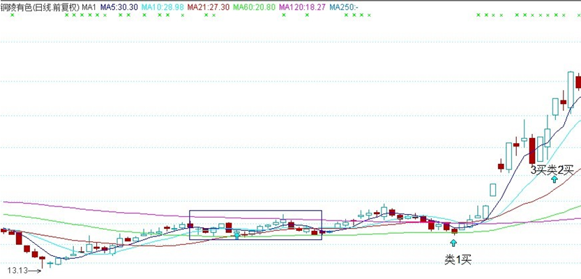

注意，有些买卖点的意义是不大的。例如，一个1分钟的下跌趋势，在第二个中枢以后，相对的中枢的第三类卖点，就没有什么操作意义了，为什么？前面第一个中枢的第三类卖点哪里去了？趋势，本质上就是中枢移动的延续，这种，第一个中枢的第三类买卖点，本质上就是最后一个合适的操作的机会，后面那些如果还需要操作，那是证明反应有大毛病了。到第二个中枢以后，反而要去看是否这趋势要结束了，例如对上面1分钟下跌趋势的例子，跌了两个中枢以后，就要看是否有底背驰了，那时候想的是买点，不是卖点了。

而且，必须注意，对于趋势的转折来说，例如上面的1分钟下跌趋势，最后背驰转折后，第一个上去的线段卖点，很有可能刚好形成最后一个1分钟中枢的第三类卖点，这时候，这个卖点，几乎没有任何的操作意义，反而是要考虑下来的那个第二类买点。很多抄底的人，经常在第一次冲起后就给震掉，然后再追高买回来，就是没搞清楚这种关系。

如果你是抄一个1分钟级别的底，后面最坏有一个1分钟的盘整，连这盘整的格局都没有走势必完美，也就是最基本的三个线段都没形成就跑，不给震出来才怪了。

当然，有一种稳妥的办法，给那些对大级别背驰判断没信心的，就是都在第二类买点介入，当然，实际操作中，你可以完全不管第二类买点形成中的背驰问题，反正第一类买点次级别上去后，次级别回跌，只要不破第一类买点的位置，就介入。这样，只要后面的走势，在下一个次级别不破第一个次级别上去的高点，就坚决卖掉，如果破，就拿着，等待是否出现第三类买点，出现就继续拿着，不出现就卖掉。

按上面的程序，你甚至连背驰的概念都可以不管，所以，分清楚走势类型，其实就可以完美地操作了，其他概念，只是如虎添翼而已。

第86课读后感：

1、“一根筋思维的心理基础，就是企图找到一个永恒固定的公式，然后不管任何情况，只要套进去，就有一个现成答案。”

2、“法成则人成，人不成，法何成？”

3、大买点后，必然产生相应级别的结构，因为后面的小买点，不过是构造这大结构中的小支架，明白这个道理，相应的操作就很简单了。

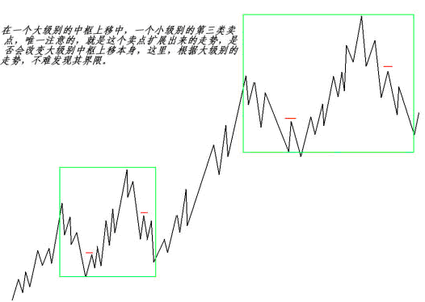

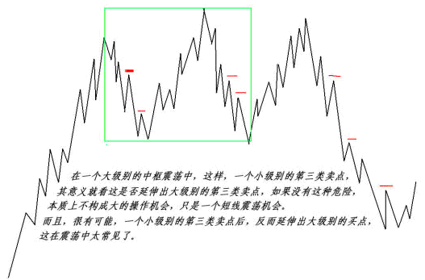

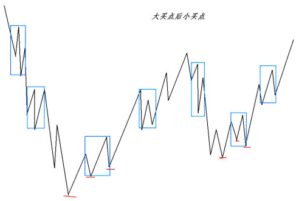

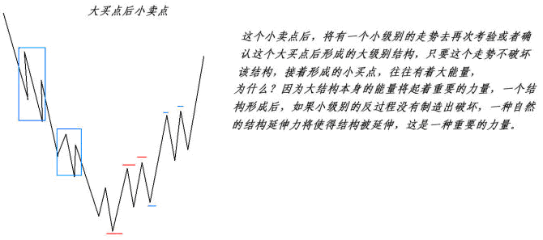

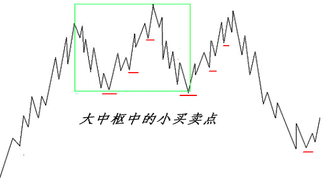

[2007-10-25]终于再次强调宏观调控，中国希望大大的。

(2007-10-25 15:43:22)

请问，今晚的月亮圆吗？

今天最大的消息，就是关于强调宏观调控的，这是本ID最希望看到了。这点，本ID在“中国经济，已需治理整顿。 2007-10-15 08:32:52”中已经强调，很高兴今天看到回应。

经济大局，最终决定市场大局，今天的消息，对所有心里有所希望的人，都是一个很好的提醒。

技术上，昨天已经把可能的情况进行最严密的分析，就是看那1分钟中枢的第三类买卖点情况，今天早上受消息影响低开后，第一小时的反抽刚好构成第三类卖点，这就是本ID理论规范下，短线最后的逃命线，

但必须注意，这个二次探底的过程并不意味着顶部就已经完全成立，等大批资金解冻后，以及周末消息明朗后，一个有力度的反弹过程将可预期。

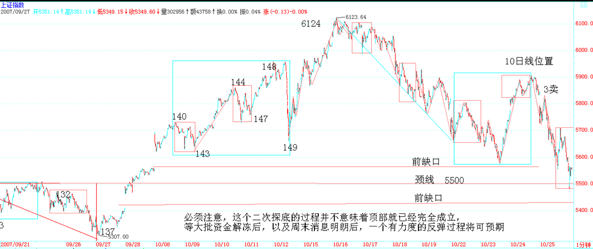

注意，这个反弹，在最恶劣的情况下，就是对跌破颈线后的反抽，目前颈线在5555点一带。这种最恶劣的走势，就是先跌到诸如5300点甚至5000点，然后一个反抽上不了5555点，然后确认顶部，然后继续大幅度下跌，这种走势，最终的调整目标，将在4000点，甚至更低。

当然，最好的走势，就是对颈线假跌破，然后反抽上来，这样，甚至有再冲6000点的可能，当然，这是最好的走势，能否出现，多头答应，空头不一定答应，即使空头答应，政策面可能也不一定答应。

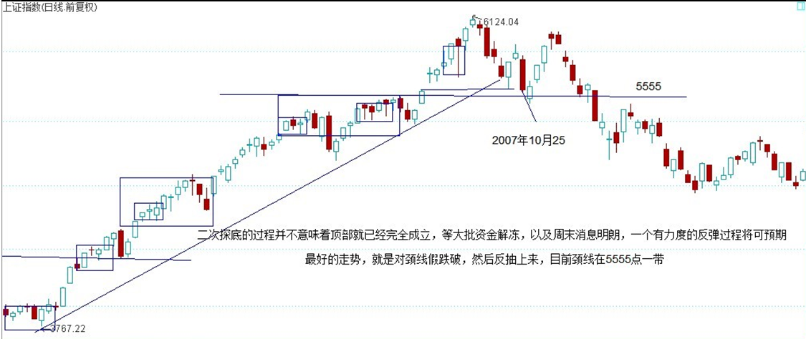

本ID已经说过，反弹的操作，风险极大，如果你连第三类买卖点都分不清楚，那还是继续小板凳吧，这些反弹操作，你没资格参与。

虽然，本ID这一方已经全面大胜，但就像3600点大胜后，本ID要把后面的情况先说明一下。这次下来，为后面的低价股积聚了潜力，年底、明年的，又有不少好股票有好价位了，这才是这轮走势最大的用处。

节奏，有大节奏，也有小节奏。当然，首先必须有大思维、大节奏。这里的道道，自己漫漫体会吧。先下，再见。

[2007-10-25]中国经济和股市的未来依然美好

(2007-10-25 21:04:33)

今天本不想说股票，但在这个月圆之时如期地鬼哭狼嚎的，一幅浮世绘，所以，本ID一早说，不于股市自由，就谈不上自由，因为这是世界上的一大炼狱。别以为股市就是股市，这里，有着最多的贪嗔痴疑慢，确实是一个好的修炼场所。所以，所有在股市中被股市的，都是有福慧的。受其灾，消其灾，三生有幸。

对年末的走势，本ID早有总体的分析。在“2007年末，资金与政策博弈下的走势分析 2007-09-17 00:41:48”里，已经对走势给出最明确的分析，本ID后面的所有判断与行为，都在9月17日把剧本公布了，6100点，在这帖子里明确分析过了，但有多少人能留意？大概都被每天的波动所消磨掉了。

没有大的思路、大的节奏，为每天的波动所折磨，那是被股票面首，而不是面首股票。

请看那9月17日帖子其中的一段：“由于去年大盘涨幅是130.43%，收盘在2675.47点，按相应比例，6165点成为今年一个标杆式的点位。还有，深圳成分指数在96年的行情中，也如本次上海指数一样略微跌破1000点后展开，而前者最终在6100点上见大顶，因此6100点附近是后者行情一个特别值得留意的位置。”

还有最后结论性的一段：“反之，一旦资金面的肆虐超乎合理范围，那么大盘将演化为一种疯狂走势，即在今年内强行突破上面所说的6100点区域，这样，一次超530级别的调整将难以避免。”

该说的，其实早说了，大蓝图都没看明白，盯着每天的盘子有用吗？

那么，现在难道就是世界末日吗？

不是，中国经济和股市的未来依然美好。这里本ID反而要为各位打气，因为中国经济的基本面没有任何实质的改变，人民币升值也在加速中，一切利好的因素依然存在。

但是，正如本ID反复强调的，现在需要的是中级调整，为了中国股市的未来，这调整是必须的。

关于中国股市的最大蓝图，本ID在“神州自有中天日，万国衣冠舞九韶 2007-03-19 08:52:42 ”有着最明确的描画。这帖子发出的当天，大盘就拉出长阳，突破3000点下的震荡，展开了今年波澜壮阔的走势。

当时，大盘还在3000点下风雨飘摇，本ID明确说了：“在总市值超越GDP之前谈论股市的泡沫是可笑的，在中国股市总市值超越其GDP之前，第一阶段行情不会结束。”

后来，这一切都实现了，而且，目前这一阶段的行情其实并没有结束，在中级调整后，这行情依然要展开，依然要新高，这是毫无疑问的。

但是，一个合理的调整去积聚新的能量，让市场走势更加稳健，使得20年大牛市的基础更加牢固，这是必须的。

就像在3600点，本ID站出来说要满江红，因为在中国的市场，散户太多，散户天生就是死多，所以那肯定受欢迎。

而这次，本ID站出来说要做空，而且又刚好在提前说的6100点上阻挡了疯牛，这当然不会招人待见，但，为了中国股市的未来，这必须这样干。

试想，如果中国股市也如台湾、日本式地醉生梦死一次，然后是十几、二十年的大熊市，最终害的是谁？

特别中国，经济的转型还没完全结束，一旦资本市场被毁，经济转型所需要的核心动力就彻底丧失，最终伤害实体经济，而后面就是所有人的生活。

对于本ID这种人，经济好坏都不会影响到个人的风花雪月、99419，但绝大多数的人，特别那些还有住房、医疗、教育等等问题需要解决的人，一旦经济出现问题，将是最大的受害者。

最大的利好，对于任何一个中国经济的关系者来说，就是经济的长期稳定的发展，而不是暴冷暴热。

我们需要的是长牛，而不是疯牛。

中国股市的牛市依然，中国股市的未来依然是世界上机会最多的，有着最远大的前途，必将成为世界上最大的市场。暴风雨，只是让它更健康，如果没有这样的大视野，那么，在市场上注定不可能成功。

中国股市充满机会，未来无限。而这机会、未来如何成为你自己，这才是对每个人最重要的问题。

这市场不怕做错了，只怕死不改错。好好反思一下自己的操作，大概上面这个问题，就能更好地找到正确的答案了。

[2007-10-26]5555点守住，反弹酝酿ing

(2007-10-26 15:13:40)

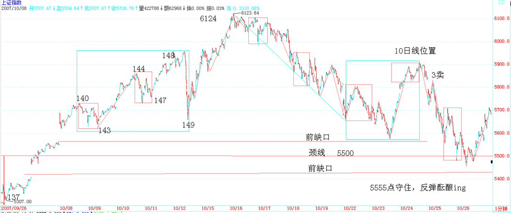

上几天来的香港人的头今天过来了，在工体北他们的总部等着，本ID只能快速说两句，抱歉了。

本ID已经把5555点这个位置告诉各位了，这是颈线位置，守住，那么还有机会来一波有力度的反弹，否则，形势就更恶劣了。

由于股指期货、中石油等的预期，所以中字头依然在反弹中继续扮演最重要的角色，而一些跌到重要均线位置的题材股，也会有一定的表现，但将趋于个股，板块效应不大。

当然，反弹是否能在5555点颈线酝酿成功，还要看周末消息面的情况，如果没有特别的消息，在资金解冻前后，这个反弹将出现并延续，而中石油的上市表现，将决定这个反弹的最终命运。

后面的游戏，关键是考技术，以及一看反弹不行就跑的灵活性，如果技术和灵活上都达不到要求，那就算了，这种活，一旦失手，痛但一定不会快乐着，除非你有受虐倾向。

好了，周末，让股票磨墙去。 先下，再见。

[2007-10-27]今天不得不破例说股票

(2007-10-27 16:44:21)

虽然道理上，那地方不是随便可以住的，但其实，只要认识门道，确实可以很随便就入住，特别今天开那所谓衍生品大会的地方。那地方今天就这么把股指期货如此地随便了一下，难道就为了里面那些别的最高档酒店也没有的古董玩意？

一些外国人或者外地来的，总是以能被带到那地方住为高规格的接待。其实，不妨揭密一下，那地方，如果认识门道，其价格比北京最好那几家酒店都要便宜点。当然，这里指的是标准的房间。而今天的衍生品在这个还算新装修的地方开，不知道是否有点上面那种希望住这种房子人的心态，说得难听点，就是土老冒心态。

土老冒心态，当然不一定是一般认为的土老冒才有。像现在，急着要被期货股指一下的心态，就与此类似。现在推出期货的时间根本就不合适，除非已经把股指期货当成一种住国宾馆显摆的玩意了。

住国宾馆的，特别那些做生意的去住的，往往不过是为了忽悠，真有实力是不用忽悠的。同样，没有股指期货，中国资本市场依然可以辉煌。

竟然有人在会上说，有了期货，就有了做空机制，就可以如何如何，股市就不会单边乱涨之类的玩意。说这话的人难道没经历过327？还有319难道不是一直单边乱涨最后导致国债期货停了？

本ID早把狠话说了，在目前的流通量环境下，期货推出后，主力做空的最后一定死得尸骨无存。连股票的卖空都没有，谈什么做空机制？想推出股指期货，先把流通量增大，卖空给搞了，否则，越期货越死人。

当然，本ID一点都不担心目前的状况，新官都没上任，更谈不上三把火，现在的，想说什么是什么，关键是说了算不算数。

如果目前的流通量与交易机制不变，那么，一旦在近期确认期货推出，本ID将成为最坚定的多头。当然，可能是先诱空再多。

汇丰都N百了，工行为什么不可以？把工行、中行干上200元，又有什么不可以的？

疯狂，谁不会？疯一把，一起死。早死早干净。

[2007-10-28]摸着石头过河辨

(2007-10-28 11:46:06)

“摸着石头过河”，已经成为一些无聊人的口头禅，甚至是为自身愚昧而导致无聊行为的托词。但这话，从来不是放之四海而皆准的真理，对于现在，还特别有害。

首先，需要摸着石头过河的，无非就是这样的人：1、光脚的，没鞋穿的。2、后面跟着追斩的，欠人钱的，或者准备给人抢去当压寨面首的。3、男猿人，没有架桥技术的。4、瞎眼的，不管过河不过河，有石头没石头，都要摸的。5、干了什么见不了人的事，给人扔下河的。6、孔男人类，一根筋思维见河，不管有石头没石头，都要去摸去过的。7、咸猪手，见石头形状的物体都企图摸，不管是否在河里。8、还有3680种，各位可继续列举下去。

其次，能被摸着石头过的河一定不是什么大河，不信，你去壶口那边摸一下看，那里肯定石头不少。还有，这河里一定要有石头，如果这河里净是沙子，或者，即使有石头也都给甩到岸边、埋到沙里，那么，即使有石头，也不可摸，或者要摸也只能在岸边，总之和过河是没多大关系的。

一句话，没有任何上帝规定过河一定要摸石头的。孙猴子可以翻个跟斗就过去，土行孙钻到地里就过去，摩西可以让水分开过去，当然也可以有人，拿一个神奇大馒头，扔到水里，一下把整个河的水吸干，馒头变神奇大蛋糕，唱着祝你生日快乐就过了河。

同样，世界上并不是所有的河都让你去摸着石头过的。有些河，怎么过都可以，就是不能摸着石头过。

还有，并不是什么时刻什么情况都需要摸着石头过河的。如果要过的是13亿人，凭什么要摸着石头过？难道摸着石头过就没有代价？

更重要的是，并不是任何河都需要过的。没有人是上帝，河里有没有石头还且说，关键是，凭什么让别人付出摸石头的代价去过河，谁又能保证河那边就是美丽新世界？谁又保证不会出现这种情况：你带着的橘子到了河那里就永远不能再橘子了，你就要吃又苦又社涩的枳子。

任何忽悠要摸着石头过河的，一个前提都是必须先画一个饼，把河那边的世界口吐莲花地美丽一番。但，能摸着过的河一定不是什么大河，甚至就是一条臭水沟，那边的美丽是一种什么玩意，难道没眼看吗？是不是，就因为没有眼，所以才要摸？

没有眼的，才需要摸。关于摸，一个最重要的词语，是“盲人摸像”。

摸，摸摸石头可以；而洞穿整个世界的，是眼睛和心脑。

摸，对应的只是人的一种低等功能。光能摸的，不是人，最多只能算是猿人。

我们不需要摸着什么石头过什么河，我们可以过世界上任何的河，前提是，我们的眼睛告诉我们，河那边确实是美丽新世界。眼睛不够，我们还有望远镜，不行，还可以是天文的，连银河都给看穿了。

我们早不是光着脚的，我们穿得花枝招展的，我们就算过河，也要香车宝马地跨过河上那道彩虹，谁爱摸石头谁摸去，堂堂中国，就要有堂堂的气派。我们已经是崛起中的大国，我们需要的是洞穿一切的战略，我们需要的是用我们自己的战略去创造一个新的世界。

世界是我们创造的，我们需要河在哪里就改到哪里；世界在我们脚下，世界在堂堂中国的脚下。

[2007-10-29]明天面临下降通道上轨压力

(2007-10-29 15:25:18)

5555点站稳后反弹，这都在预计之中早说了，明天面临下降通道上轨压力，这是技术的话，基本面上，如果指数期货出来，点位根本没意义，特别在形成多空对赌的局面时，那时候，只需要关于如何把对方打爆了，什么点位不点位的，如果夹到100000点才能把空头夹死，那当然也是可以这样操作的。

期货，从来都是你死我活的斗争，没有什么仁慈可说的。拥有相应的筹码，就是拥有市场的发言权，有发言权比什么都重要。

明天一旦冲破上轨压力，反弹的空间将被彻底打开。当然，这个位置出现反复也是很自然的。由于大面积资金被冻，所以没什么消息的情况下，这反弹是不会轻易结束的。

如果期货在年内推出，那么6100点当然不会是什么位置了，这是目前大盘最大的变数。但无论走势到什么位置，其实和大多数人无关，因为真正上涨的股票基本依然是带指数的，其他股票，大多数只能暂时继续反弹然后回跌，最多保持盘整的走势，没什么大戏。

不过短线，超跌股票的反弹还是有一定机会的，但风险同样大。至于中字头，有期货这保护伞，当然是爱多疯有多疯。

期货出来后，个股分化将继续加剧，散户的生存空间进一步减少，事情就是这样了，天要下雨，自己找伞吧。

[2007-10-30]突破上轨，反弹空间如期打开。

(2007-10-30 15:26:44)

昨天说了，突破下降通道上轨后，反弹空间打开。今天走势极端规范，下午那次跳水，就是对上轨突破后的回抽，这些最基本的技术语言，如果都看不明白，就必须补课了。

站在本ID理论的角度，今天早上的绿盘与昨天的尾盘，刚好构成1分钟中枢，而下午的跳水，刚好构成该中枢的第三类买点。也就是说，下午的跳水，有两重的技术含义。

现在的走势十分简单，只要不出现回到这1分钟中枢，而在上面形成新的中枢，那这反弹的级别就至少不小于1分钟的上涨。这样，操作就极为简单，耐心等待背弛出现就可以。

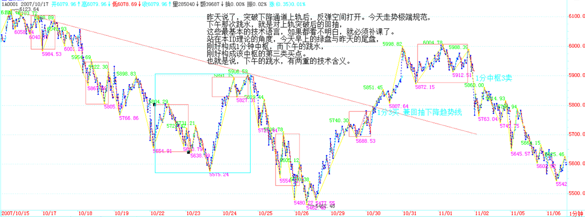

短线总体的节奏，本ID在上周五“5555点守住，反弹酝酿ing 2007-10-26 15:13:40”已经说得很明确了，就是5555颈线站稳后，反弹至少延续到中石油资金解冻前后。就算是最坏的情况，也要先把这些资金骗进来再说，否则太对不住这3万亿资金的热情。

中期走势，本ID已经说得很清楚，如果期货出来，那点位就没什么意义了，6100点也不是大不了的位置，那时候只有疯狂，没什么点位不点位的。而如果期货被阻击出不来，那么，6100点当然还是一个位置，这次的反弹，也就是构成顶部图形的第二个尖。至于这个尖，比前面一个高点还是低点，都问题不大，例如双头，可能就低点；头肩顶，就高点，这都没有太大的影响。

无论什么顶部的最终图形，5555点都是生命线，只要不有效跌破，这图形就没完，而且有变成中继图形的潜力。否则，就是顶部图形成立，中级调整确立。而目前，唯一的变数就是期货的时间。

关于期货，本ID也说得很清楚了，本ID不愿意见到出来，特别是现在。因为这样将会耗尽中国资本市场的那点能量，然后的调整就不是小儿科了。现在，这事的折腾，依然不能说完全定局。有些事，最后一晚还可以改变，没到最后一下，市场外的努力是不会放弃的。

至于现在瞎忽悠的，又不是能拍板的人，本ID连看都不爱看他们的废话。

当然，现在舆论在造势，有一群势力在为自己的利益忽悠着，这事情，就看最后一下的智慧了，但本ID这里放一句狠话：请别像327、319那样，谁拍板、谁负责，这个政治、经济责任，不可能拍拍脑袋就没事。

另外，本ID还要说：所有忽悠这事的，请先说明白，出事了，你们负责吗？如果由此把资本市场和经济搞砸了，你们负责吗？不负责，为了名利而忽悠，这不是中国人该干的事情。

现在，站在本ID的立场，很简单，就是该反弹就反弹，该疯狂就疯狂，在5555跌破之前，进行大幅度的震荡操作去吸血。而在市场之外，该有的努力一定不会少，最终的结果如何，只要心到了、力到了，本ID也无怨无悔了。

但相信，管理层对目前点位风险会有足够的认识，一旦市场进入不可自我调节的状态，管理层一定不会袖手旁观。

好了，最近确实事多，明天要出差，还有很多事要忙，先下，再见。

## 教你炒股票87：逗庄家玩的一些杂史4

(2007-10-30 22:05:40)

下面都是梦话，千万别相信。

明天要出差，没心情写复杂的东西，就说说故事，继续说点老皇历。

前面说了做顶出货的，今天说说做底吃货的。准确说，如果是吸货，无所谓底部。只要有筹码有钱有足够的时间，什么成本拿的货，其实都可以摊下来的。特别是那些对走势有足够影响的分力，后面各级别的顶是自己的、底也是自己的，差价都是自己的，什么成本不能下来？

为什么很多庄家最后都做死，就是没有什么成本概念。说实在，很多，甚至可以说的大多数庄家，都还是散户心态，见到市值起来就晕头，却忘记了，股票只是一个凭证，一个抽血的凭证，能把血抽到才是真本事。

大多数愚蠢的庄家，都希望玩一种收集派发的游戏，但这种游戏经常把自己放到火上去了。实际上，最关键是成本的下降。一般来说，如果成本没有到0，根本没有大力拉抬的必要，就要来回折腾，把筹码成本都洗到0了，才有必要去拉抬。而真正的拉抬，是不需要花钱的。如果拉抬要花钱，证明价格已经高了，资金流入已经跟不上，早该回头砸了。

经常是早砸一天和晚一天，就是两重天地，这里需要的是经验和悟性以及感觉。基本的0成本筹码，然后反复拉抬都变成纯负数的，最后搞出N的N次方倍后，实在不想玩了，满手都是负成本的筹码，再大甩卖，谁要都死，这才是真的最安全的方法。当然，甩卖不一定是跳楼的，还可以是跳高的，甚至是批发的，手法多多，只是不同的故事而已。

因此，要玩这个游戏，关键是要有基本的筹码，这筹码，当然可以抢回来，例如，以前就说过，曾经和别人抢东西，从8元一口气抢到20多，然后一个大平台，最后再飞起一波，然后就该干什么是什么了。这是一种方法，但这种方法过于无聊，一般都不这样干。

当然，最直接的就是能在最低的位置把该拿的全拿了，这是最考功夫的，这里说一个曾经的经典例子。

这例子，还没动手，老鼠仓就抢起来了。因此，后面的任务十分艰巨，首先要抢到足够的东西，其次还有成本不能太高，第三还要把老鼠仓洗出来，最后，这时间还不能太长。这怎么看都是一个不可能完成的任务。

首先，在一个大的压力位上顶着，接了所有的解套盘。老鼠仓是不会接解套盘的，别的小玩意就更不会了。然后在那位置上不断地假突破。一般在强压力位上，一般人不会拼命给你冲关的，而不断的假突破，就让所有技术派的人把筹码交出来了。但这时候，买到的，是最高的成本，除了历史上的高位套牢，所有人的成本都要比这低。

这时候，把帐上所有的钱基本都打光了，还有一部分。当时，有一种透支是需要当天平仓的，用剩下的钱，借了该种透支。然后那天疯狂地买，早上就把所有的钱加透支全买完了，因为前面N次的假突破，突破后根本没人管，需要的就是这种效果。

下午，需要平仓了。不断交涉是否可以不平，结果是不可以。很痛苦状地开始平仓行动，瀑布一样，价格下来了，早上买的，亏损着全砸了出去，结束一天悲惨的交易。价格也砸穿前面一直坚持的平台，收盘后，有人被套被人追债的传闻马上到处流传。

第二天，所有的老鼠仓，所有知道消息的都蜂拥而出，然后是第三天，也是这样。

这时候，在N个别处的遥远的地方，所有的抛盘都被吸到一个无名的口袋里，所有出逃的人都在庆幸，因为第四天依然大幅度低开。

突然，强力的买盘如同地底喷薄的熔岩，任何挂出的筹码都被一扫而光。任何人都没反应时，他们已经没有任何买入的机会了，第二天，依然如此，一开盘，就迅速让任何人失去买入的机会，而前面来不及逃跑的，却依然抛着。

第三天，快回到原来的平台了，在那里，买盘突然没了，仿佛从来没有任何买盘出现过，所有的人都不知道该怎么办好。如果是V型反转，那上面平台的巨大套牢却没人敢去顶破，如果是超跌反弹，那所有的空间都耗尽。经过市场一段的沉寂后，卖盘再次涌出，多杀多又开始了，没人敢接，但价格却永远也回不到反弹第二天的位置，在一个狭窄的空间里，抛掉的人，没空间回补，想买的人，又怕上面不远的巨大套牢区，以及可能的超跌反弹骗线。但价格不跌了，所有的筹码，都掉入一个巨大的口袋。

最后，在一个谁都想不到的时刻，价格迅速地脱离上面的套牢区，所谓技术上的巨大压力区，突破时，连15分钟都不到就过去了。

至于老鼠仓的命运，在砍掉价格N倍的位置，老鼠仓最后又重新进来，那是另一个故事了。

第87课读后感：

1、如果是吸货，无所谓底部。

[2007-10-31]1分钟中枢如期形成ing

(2007-10-31 15:13:50)

马上要去赶飞机，只能快速说两句。

昨天说了，关键看新的1分钟中枢位置，今天，这中枢依然没形成，当然，只要明天有所回落，这中枢就形成了，一旦中枢形成，后面就是第三类买卖点的问题，一个超简单的问题，就不用多说了。

今天资金的流入而出现九一现象，表明资金的进入只是以搏反弹的心态，而中石油出来，指数股还要表现，休息一下并不是太坏的事情。

今天，香港联交所罕见地出现风险提醒，这里有一个更重要的问题，如果香港是一个门面，请问，是不是希望内地的散户出去为40000点香港埋单？能量耗尽，谁都举不了杠铃，管理层真要好好想想了。

市场参与者可以继续疯狂，但管理层不可以，现在就是考验管理层智慧的时候了。借着期货出来，内地、香港一起最后疯一把，然后一地鸡毛，请问，这个局面一旦出现，谁负得起这个责？

现在，已经到了该换刀的时候，本ID边陪着市场玩这最后游戏，边等待这换刀的时刻。

虽然本ID在上周5555点下明确告诉了这个反弹，但依然用绿色字，只是希望各位在反弹中依然要保持最大的清醒。至于中短线的分析，昨天已经说得十分明确，就不重复了。

先下，晚上如果有时间，会写帖子的，再见。

[2007-11-01]震荡等待中石油

(2007-11-01 15:16:39)

今天的走势极端教科书，早上背驰后形成1分钟中枢的第二段，然后回跌构成第三段，这样1分钟的中枢就构成了，紧接着就是围绕这个中枢的震荡，下面需要等待的只是第三类买卖点问题。

大盘在这个位置进入短暂的无方向，更主要的等待是为了中石油。另外，周末消息面也是对心理的一个压力。不过，美国减息，也让国内的利息变动有了更多的顾忌，总之，一步错，步步错，现在只是开头，怎么收场，太让人担忧了。

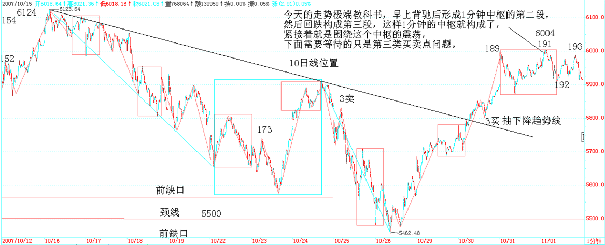

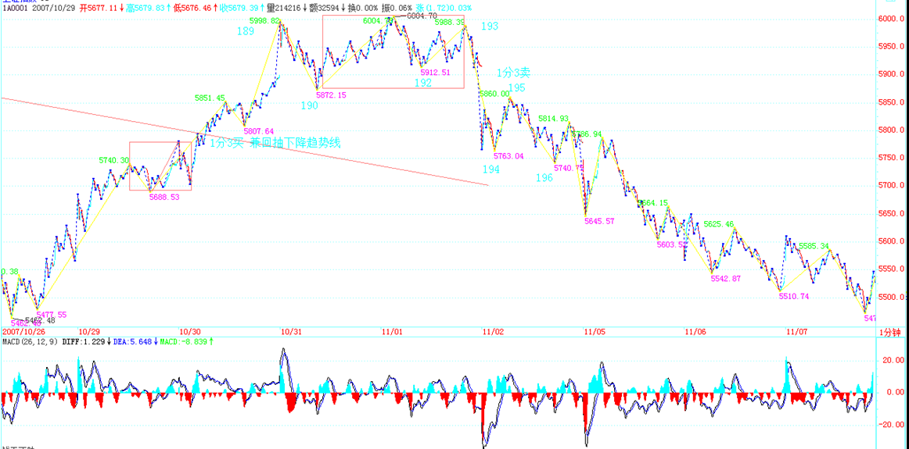

当然，现在除了大的政策面的改变，单纯的利息变动并不足以根本影响市场，中石油的投机性短炒又等着，不过这次估计不会像神华那样顺利了。但一个足以吓死巴菲特的价格是肯定的，不过，这对巴没什么意义，人家面对的是全球市场，自然可以找到更好的机会。

只是，把亚洲最赚钱公司让别人用极低价格给买了，而现在又以极高价格回归，这里面的问题，难道不值得深思？

请问，谁该为此负责？

市场的规范，第一要点就是：谁干的事情谁负责。市场参与者，必须对市场风险的承担负责，而市场管理者，必须对市场的政策后果负责。想想当时建行的贱卖，中石油的贱卖，请问，是不是该论论这个责任问题了？

现在，期货又要被折腾了，请问，有谁敢站出来保证，最后不会是比建行、中石油的贱卖更无聊的闹剧？

晚上有应酬，有时间尽量写帖子，先下，再见。

调整形态保持，震荡级别加大

(2007-11-02 15:25:06)

今天的走势同样极为教科书，因此，复制了图，可以认真研究一下。针对189-192的1分钟中枢，195是第三类卖点，但对于191开始的线段类下跌，194-195是第二个类中枢，所以后面的跌破，力度不够，出现明显背驰，然后就必然要在这个位置出现一个新的1分钟中枢。

下面的走势很简单，这个新的一分钟中枢是否继续向下延伸出新的1分钟下跌走势，也就是这1分钟中枢是否有第三类卖点。而从大的方面看，这次反弹的调整，级别将至少向5分钟级别扩展。

当然，操作上第一个中枢的第三类卖点在该级别中是最后的走人机会，后面的都没意义了，也就是说，对于这次调整的逃避，191是第一类卖点，因为前面线段类上涨走势出现类背驰，而193是第二类卖点，因为站在线段的角度，就是第二类卖点，而站在189-192的1分钟中枢震荡的角度，任何的次级别离开，都将先构成卖点，然后再考虑是否回跌形成第三类买点的回补机会，这是中枢震荡的操作方法。

195以后，针对这个调整来说，任何的卖出，都是太晚了，这意味着随时面临下跌走势的结束。很多人喜欢在第二个中枢才考虑第三类卖点，那是晚之又晚，所以经常卖了，就被反转夹空，那是一点都不奇怪的。当然，很有可能卖了以后继续延续下跌，但这已经是一个概率问题，而不是一个能被理论100%保证的技术问题了。

好了，技术的课程就不说了，今天的大盘，受外围影响，走得还算不太坏，最主要，关于周末加息的消息，也到处传，所以对心理是有压力的。但下周无论加息与否，真正的主角都是中石油。如果该股过分高开，形成比较恶劣的走势，将对大盘有较大影响，此外，今天不少资金出逃，就等着恶炒一把石油，下周，就看这场大戏，最终是喜剧、悲剧还是闹剧了。

周末，好好休息，下周看戏去。是否成为剧中的一员，就看自己的能力了。千万别强求，强求没幸福。

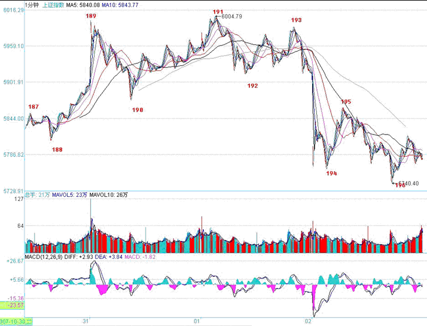

[2007-11-05]宠爱之便宜且昂贵的中石油

(2007-11-05 15:52:07)

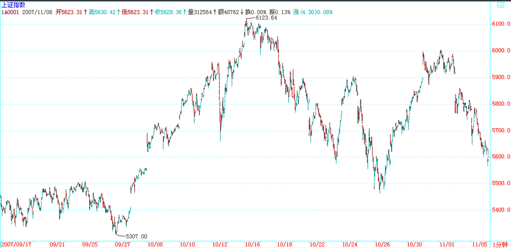

今天大盘走成什么样子，其实都没意义。今天有什么消息，其实也没太大意义。因为有了中石油，一切都没意义了。为什么？你看看中石油的市值，等于中石头加工行、中行还要大，以后的指数，极大地相关于中石油的走势，站在指数的角度，拥有中石油，就拥有一切的控制力。

注：中国石油2009年公司资产为14507亿元（约为2165亿美元）

中石油，世界第一股了，和世界上相同类型的公司比，确实昂贵。但，在中国这个封闭的市场中，特别后面还有众多指数期货等的预期下，这价格，显然是便宜的。这就像N个月前，中国人寿上市，本ID说40多一点不贵，最终100肯定要见的，如果有30给你见到，你当然可以天长地久了。这个位置，并不是说，石油就100%不会下来了，但下来，只是给一个更好的买入机会而已，如同中国人寿从40多到30的过程。

短线看，今天，从48多到41。7，一个标准的线段，然后是新的向上线段，这线段不管能否延伸上45，都使得41。7到43。7与最终形成的1分钟中枢有了密切的关联。从短线的操作上，今天，当然是等下来的下降线段结束后介入，明天很关键，就是上冲回跌震荡后形成的1分钟中枢位置，因此，就不难操作的。

操作步骤上，比较激进的作法，当然是在看41。7的线段结束后就介入，但这样不能保证明天一定没有下跌的线段打穿该位置，毕竟是T+1的操作，线段太短了。比较稳健的，就是今天在线段结束时介入一定仓位，在形成1分钟中枢后，根据相应的位置再介入其他仓位，这样就至少可以用T+0的对冲保证仓位安全的。

注意，以上只是顺便说说新股的操作，这种高开低走的股票，第一笔介入一定要等第一段线段结束，这是一个最基本的要求，今天的走势图，完美地演示了这一点。但这还不行，如果站在安全的角度，必须要分批，因为线段的级别太短，不能保证T+1的绝对安全。

另外，今天那直通车的缓刑，至少让本ID前段对此的反对有了点回应，同时也表明，现在政策的推出，已经有了更复杂的机制，这对股指期货的阻击来说，也是一个很好的消息。

今天，题材股动起来，这很正常，如果期货缓刑，那么，这种动还会更明显，而且很多年末找底的股票，只是为了明年一飞冲天。现在的问题是，期货还没有最终的答案，所以19、91地折腾就少不了了。两个翅膀，中字头、题材股，自从3600点接石头时明说后，到目前还是有效的。

今天写东西时，电话不断，所以晚了，后面还有事情，先下，抱歉。

[2007-11-06]说说大盘中期走势的演化

(2007-11-06 08:38:52)

昨天回来太晚，没法写帖子，抱歉了。主要是突然有一个大的PE项目，对方来人了，一个最初期就要投5亿，最晚后年初上市，一旦成功，绝对比西部矿业要经典N倍。所以，本ID也不能太怠慢了。现在确实有点难，说的是时间安排上，下周又要出差，不过这里，本ID会尽量坚持每天的解盘和帖子，如果偶尔坚持不了，也请原谅了。

本来想写课程的，现在也没时间了，就说说大盘的中期走势。这，本ID其实已经反复说了。只是总结着说一次，让各位更加明确点，免得被行情又给折腾糊涂了。

1、6100点，是大盘中期顶部的一个尖，现在是去形成第二个尖，当然，前两天6004点是不是就是，这需要跌破5555点的颈线才能去确认。

2、在有效跌破5555点的颈线前，一切都以中枢震荡的观点来操作，向上走势背驰就出，就像前两天一样，下来不破5555点，就可以回补，来回折腾，直到大盘选择最终方向。

3、大盘选择向上方向的可能性依然存在，就是期货这个变数，现在中石油回来后，指数上就更没多大意义了。其实，站在别的股票的角度，很多已经完成真正的中级调整的幅度，最近一下跌30%-50%的并不少见，所以指数在期货出现的背景下，将大幅度失真。

4、因为现在指数失真越来越大，所以关心个股更重要。年底，将是三类个股表演的时候：一、还是中字头，或打或拉，反正精彩不断。

二、收集完成或接近完成的题材股，会在震荡中越走越强，率先展开明年的行情。

三、筹码不够，需要继续收集的，就会利用每次震荡不断打压，直到该得到的得到为止。

5、根据不同的股票类型，选择好自己的操作思路。大盘走势需要关心，但更要关心自己面对的股票类型，以及其相对大盘的走势特点。

6、12月是30月的时间之窗，如果前后是出现低点，那么明年的行情将就此展开。如果是高点，那么明年初压力就大了，这也是为什么本ID最近一直希望压制大盘的重要原因。就是希望以低点去触时间之窗，为明年行情做准备。

7、先要有大的思路，再次提醒，由于指数失真开始严重，所以请更关心你自己股票的类型，是上述所说的哪种情况。如果是中字头的，可以更多参照指数的走势。如果是题材股的，就要参照其走势与指数之间的关系，看看里面的人是利用指数吓唬你还是忽悠你，看明白了，你的操作就明白了。

8、操作是自己的，如人饮水，冷暖自知。修炼去吧，多好的市场，多好的修行。

[2007-11-06]5555点争夺战

(2007-11-06 15:37:47)

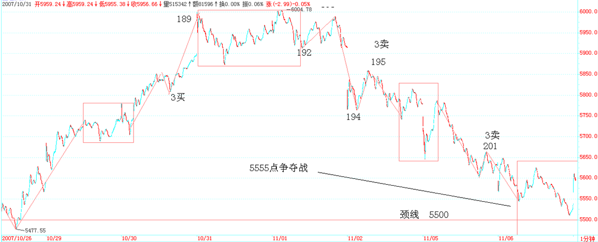

今天的走势，就是一个5555点争夺战，一般这样的战斗，胜负至少看3天，上下还有一个3%的缓冲区域，5555X97%是多少，自己去算吧。

当然，这次下跌，和上次不同，大多数人都没什么感觉，因为这次跌的都是中字头的，其他90%都没怎么跌。但并不意味着这次的可能风险就小，如果真跌破颈线，那么很多这次趁着中字头跌而反弹的股票，也会再次探底的。

所以，5555点争夺战，对于多头来说，是输不起的。空头反而是无所谓，反正后面还是6000点、6100点的防线，其实，站在本ID的空头立场，本ID不大愿意这样就破了颈线，因为这样力度有限，很可能就是一个假跌破。

对于空头来说，对颈线的突破，一定要是致命的，用本ID的理论术语，就是一定要第三类卖点后出现中枢的下移，而不能去构成大的中枢那种无聊玩意，那样杀伤力太小。如何达到那种力度，就是要在颈线上反复磨，如果再冲一次上不去，又一批人开始失望，然后再来一次，反复失望，这样才有杀伤力的。

多头空头，绝大多数都是猪头，都是急功近利的，本ID只是分力，最终是否能如本ID所希望那样，搞得更有杀伤力，那不是本ID一个人能决定的。而且，很有可能，有些傻空头急功近利，企图快速破颈线，最后反而中了多头的埋伏。

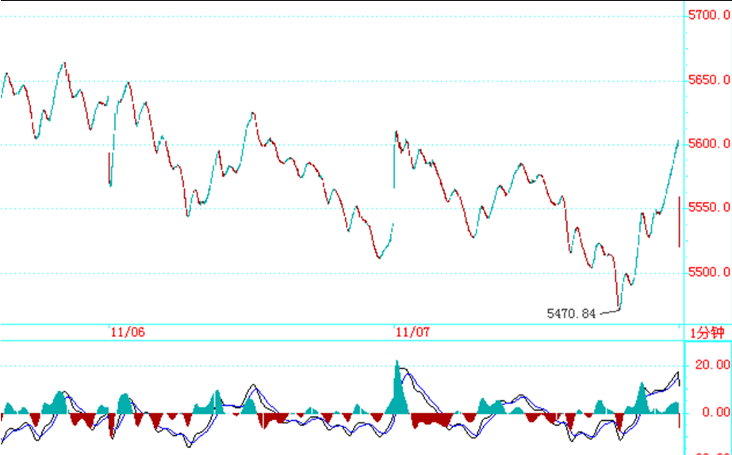

本ID最近心大都在PE上了，没心情没时间去找人开小会协调协调，所以空头爱干什么就干什么吧，本ID有时间，还不如去再造N个西部矿业出来卖给多头，1元的东西，到时候卖了几十上百的，感觉不错。

中石油今天走出了线段下跌的走势，今天早上到41。2的那次反弹，就是对41。7上那类中枢的类第三类卖点，然后就继续下跌，现在就看这个线段下跌的类背驰了，一旦出现，就至少有一个级别更大的反弹，比昨天尾盘那个线段反弹要大，至少是可T+1操作的。昨天说了，有些线段反弹，不一定能T+1赚钱，今天就是一个例子。中石油，最终的走势很有可能和中国人寿类似，这在昨天也说了，当然，不可能完全照抄，但基本模式，估计差不多。

上面说了如何才能杀伤力大，大概又得罪不少人，但市场就是这样的，讲感情就不要在市场混了。本ID说出来，只是把市场可能的残酷一面说出来，有时候，本ID没时间干了，并不意味着别人没时间干。

如果你对市场有了足够的洞察，那么，任何人的鬼把戏，都无效了，这才是最重要的。

市场里，需要的是智慧，而不是煽情。认清自己，冷静再冷静吧。先下，再见。

## 教你炒股票88：图形生长的一个具体案例

(2007-11-06 22:38:43)

本ID的理论，对所有的走势，进行了一个最明确的分解，所有的分解，本质上只有两类，就是延续与转折，用残酷一点的词语，就是生和死。

一个走势类型的死，必然意味着一个走势类型的生，走势，就在这样一个生死的轮回中，如同众生的生命，生死轮回不断。看明白了股票的走势，对人生，也大概应该有点领悟了。

一个走势类型确立后，同时就确认了前一个走势类型的死，同时也开始了自己面向死亡的生存。

如同众生的轮回生死，在死与生之间，有一段被称为中阴身的阶段，股票的走势，同样存在着这个阶段。如果说前一个走势类型的背驰或盘整背驰宣告了前一个走势类型的死亡，那么到新的走势类型确立，这里有一个模糊的如同中阴般的阶段。

要把握这阶段的走势，必须把前一段走势的部分走势结合起来分析。也就是说，前一段走势的业力在发挥着作用，这个业力与市场当下的新合力构成了最终决定市场方向的最终合力。

用一个例子，就很好地能说明这个问题。

下图中，191的背弛宣告前一走势类型的死亡。按道理，新的走势类型，是从191开始分析的，但这时候，新的走势类型连第一段线段都没走出来，甚至走到193的位置，也依然轮廓不明，因此，这时候，就是典型的中阴身阶段，必须借助前面189开始形成的中枢来完成分析与相应的操作。

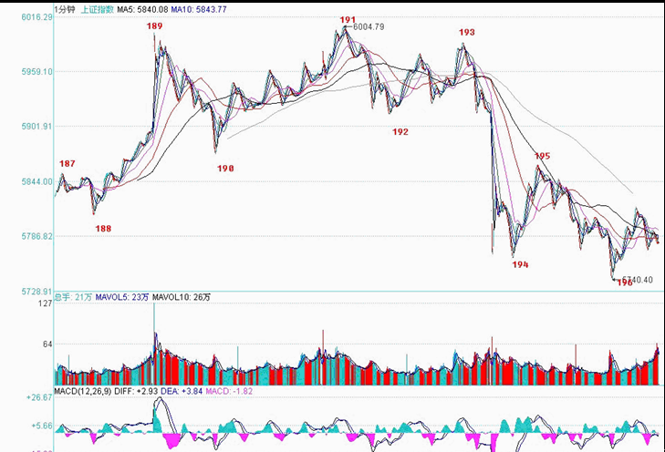

如果从191开始，192、193都很难说有什么可依据的。当然，可以说193就是第二类卖点，这个自然没错，但站在189开始中枢的角度，这就存在一个中枢震荡的问题，这样，这个干瘪的第二类卖点，就有一个更大的可依靠的分析基础。一切关于中枢震荡的分析，都可以利用到关于192、193以及后面走势的分析中，这等于有了双重的分析保证。

当然，后面的195的第三类卖点，也是站在中阴阶段的角度说的。但这一点是一个中阴阶段与新的走势类型确立阶段的分界点，195出来以后，新的走势类型最开始的形态就确立了，也就是至少是一个线段的类下跌走势。这时候，分析的重心，就可以移到191开始的新走势类型上了。这时候，就可以基本在这个线段级别上，不用考虑191之前的事情。

但191之前的走势并不是没有用了，而是在更大级别上，例如在1分钟、5分钟等等级别上发挥作用了。191后面出现的走势，就和191之前的，结合出大级别的走势形态。

因此，当各位熟练以后，标记上就不一定要不断地标记下去了，例如，如果你是按1分钟级别操作的，那么，前面191个线段记号，可能就可以一下简化为10个不到的1分钟级别相关的记号。当191后面的走势演化出的1分钟走势结束后，这1分钟级别的记号才再增加一个，这样，记号的数目就很有限了。当然，如果是5分钟级别、30分钟、日线等等，就更少了。

为了方便明确起见，还是把记号的级别进行分类，例如，用Xn代表线段的记号，用Yn代表1分钟的级别，Wn代表5分钟的记号，Sn代表30分钟记号。日、周、月、季、年，分别也可以用Rn、Zn、Mn、Jn、Nn来表示。其中的n都是具体的数字，这样，所有的走势，都可以被这个标号体系所标记而清楚异常了。

例如，对于191这个点位，站在线段上，就是X191的标号，站在1分钟级别，可能就是某个Yn的标号，而189这个点，就只有线段的标号，这同时也显示了，191这点和189点的重要性是不同的。

什么是最牛的点？就是从线段一直到年，同时都有标号的那个点，如果是顶，那就是百年大顶，当然，是否有幸碰到这样的点，就看各位的运气了。

这个标号体系，不单单为了方便阅读、记号，首先就培养了各位一种综合的、系统的习惯。看一个走势，就要知道，不是单单是一个线段，而是在一个大的多层次系统里，这样才不会被每天的波动所迷失。

其次，这个标记的过程，意味着什么？既然线段有中阴阶段，那么其他级别当然也有。所以无论任何级别，在一个顶点出来后，都有对应级别长度的中阴阶段。

注意，一定要注意。为什么很多人逃了顶，最后还是被套住了；抄了底，最终还是没赚到钱，被震出来了。这就是被相应级别的中阴阶段给搞死的，而且，越大级别转折后的中阴阶段，越能搞死人。

就如同人的中阴，非人非鬼；行情走势的中阴阶段，也是多空齐杀，不断折腾转换。等最后转折确认时，就如同已经重新投胎，饭熟了，还找米，能有戏吗？

有些蠢人，经常在行情转折的中阴阶段，觉得世界又美好了，或者世界又恶劣了，结果都是被业力所牵引。

中阴阶段，无一例外，都是表现为不同级别的盘整（注意，这是只从截取这一阶段的形态说，并不是说新的走势类型一定是盘整）。也就是围绕前一走势的某一部分所构成的中枢震荡，即使是所谓的V型反转，也一样，只是震荡的区域回得更深而已。

其实任何转折，也就是第一类买卖点之后，都对应着某一级别的V型反转，例如，191的转折，190-191与191-192，其实就是一个V型反转，只是级别特别小。这个V型反转的级别，决定了中阴的级别与力度。例如，站在日线图上看6124点前后N天的走势，其实就是某级别的V型反转，然后就同时进入中阴阶段。

注意，中阴阶段结束后，不一定就是真正的反转，也可以是继续延续前一走势类型的方向，例如上涨+盘整+上涨，这样的结构是完全合理的。例如，人的中阴后，不一定就要变鬼之类的，也可以成所谓的神仙，如果你前一世是从鬼来的，鬼到人是上涨，中阴盘整后，从人到神仙，也是上涨。

但，上涨+盘整+下跌，上涨+下跌等等，同样是可能的选择。这时候，唯一正确的操作，只有一点：如果你技术好的，就在这个大的中枢震荡中中枢震荡操作一把，如果技术不好的，就拿着小板凳看戏，看它最后是升天还是下地狱，等市场自己去选择，然后再决定操作。

不过，站在本ID理论的角度，最大效率的，就是利用这个震荡去中枢震荡操作一把，学了本ID理论，就是要把技术练好，练好了，就自然不用整天小板凳了，上台自己票友一把不是更爽？

当然，没这本事的时候，还是别玩这一招，为什么？这就如同，在中阴身的阶段，还是可以去修炼去证悟，但你总不能因此说，我现在就不修炼了，等中阴再说。真等那时候，业力牵引着，你修什么鬼呀。

所以，有真本事，什么情况都不怕，都可以折腾。关键，是要有真本事。

第88课读后感：

1、所有的分解，本质上只有两类，就是延续与转折，用残酷一点的词语，就是生和死。“一个走势类型的死，必然意味着一个走势类型的生，走势，就在这样一个生死的轮回中，如同众生的生命，生死轮回不断。”

2、中阴身阶段：“中阴阶段，无一例外，都是表现为不同级别的盘整（注意，这是只从截取这一阶段的形态说，并不是说新的走势类型一定是盘整）”。

3、“看一个走势，就要知道，不是单单是一个线段，而是在一个大的多层次系统里，这样才不会被每天的波动所迷失。”

4、中阴阶段的处理很关键，这涉及到操作节奏。

[2007-11-07]5555点决战即将进入临界点

(2007-11-07 15:26:47)

这个题目有点名不副实，因为这决战，对于空头来说，只是小战役，结果并不重要；但对于多头来说，就是决定生死存亡的。从6124点开始的行情转折中阴阶段，对于多头是垂死挣扎一下，还是干脆破罐子破摔，早死早投胎，很快，准确地说，最迟下周一前后就有答案了。

站在空头立场，本ID希望多头能挣扎挣扎，这样，会增加很多残忍的快感；当然，站在纯技术探讨的角度，多头最好的招数就是以退为进，用一个空头陷阱，把主动进攻的空头给废了。

由于目前的空头比较蠢，所以本ID不妨提醒，屠杀之前，一定要多点多头色彩，披着多头外衣的空头才是最有杀伤力的，在5555点上制造出一个大点级别中枢，然后再背后来一刀，把多头砍倒，踢下悬崖。

由于目前多头也比较蠢，所以本ID也不妨教教多头招数。从月线上，无非两种可能，就是本月确认顶分型，或者不确认。不确认，就是有包含关系或创新高。而目前5462点，就是这个顶分型是否成立的关键，而跌破成立后，最关键是5月均线，目前在5300点附近。也就是说，多头完全可以在5月均线附近埋伏大部队，让空头先进攻，把分型给搞出来，然后反手把主动进攻的空头给废掉。

请回想一下，本ID在3600点，是如何完美地利用顶分型与5月均线来把空头给灭了。现在多头最完美的策略，依然是照搬本ID的老剧本。

不过，这些蠢蠢的多头，估计抄也抄不成样子，最后，可能还是要和5月均线吻别于狂乱的夜。现在的多头，如果这2年多不被攻破的5月均线竟然给你们弄丢了，那你们也别丢人了。不丢人最好的方法就是：早死早投胎。

有人可能要问：你究竟是多头还是空头，怎么又教多头又教空头如何干？

本ID很明确地说：本ID是那准备杀死空头的空头，一个不准备杀死空头的空头，不是好空头。见顶以后，就是一个空头面向死亡的生存过程。这时候当多头，将被空头蹂躏，而空头的命运，最终都是死。所以，唯一正确的就是，当一个随时准备把空头搞死的空头，里面的道理深着了，明白了，你对市场就有更深一步的了解。

短线技术上，5555点附近的新1分钟中枢形成，因此，这次6004点开始的走势，就明确形成1分钟的下跌形态，因此，短线该位置能否站住，就看这个中枢的表现了，看明白这个中枢后面的发展，也就看明白了这场多空拉锯的短线胜负了。

本ID的观点还是很明确，就是在这样一个中阴阶段，什么事情都可能发生，技术好的，可以充分利用这大型的中枢震荡玩抽血游戏。多空越分歧，意味着震荡的幅度机会越多，就越是本ID理论的天堂。至于没这本事的，就算了。

今天的中石油，如昨天所说，38元上线段底背驰后形成较强反弹，然后形成一个1分钟的中枢在40元上下，这是该股形成的第一个1分钟中枢，因此给后面的操作具有最重要的指导意义。后面的走势无非两种：一、以这1分钟中枢震荡扩展出大的中枢。二、这1分钟中枢不过是1分钟下跌走势的第一个中枢，最终将跌破该中枢形成1分钟中枢下移去完成1分钟级别的下跌。

具体操作，就按实际走势的选择来决定。例如，如果你在今天背驰时介入部分仓位的，就可以开始利用后面走势的波动，把成本逐步降低。

最近天天说石油，主要是以此为基础，从最开始把一个股票的走势的生长是如何演进的给教科书一番，各位顺便就可以看到，个股的分析和大盘的分析没什么不同，都一样的。

今天下午晚上都有事，明天收盘马上有事，解盘要到晚上了，先说明一下。先下，再见。

[2007-11-08]如期决战，多头不堪一击

(2007-11-08 22:21:05)

对不起，回来晚了，把解盘补上。

昨天说，决战进入临界点，最迟周一有结果。结果是，多头如此不堪一击，太令人失望了。这证明了本ID的一个断言：空头是心急的。而昨天，本ID给多头编的5月均线大埋伏剧本，是否如本ID所担心的那样：“这些蠢蠢的多头，估计抄也抄不成样子，最后，可能还是要和5月均线吻别于狂乱的夜”，很快也有答案了。

前几天，还有多头叫嚣，质问本ID不是说要至少跌1000点吗，为什么还不跌？现在，这个本ID布置的任务，确实有点没完成，本ID对演员们的表现也很不满意，那就继续努力吧。别心急，小板凳坐好，别到处跑动，现在，1000点只完成了800点，空头多头演员们，努力！加油！

现在，5462点到5555点颈线位置，将是中线反抽最关键的位置，不能重新上去，那么跌势将持续到这跌的业力耗尽的一天，本ID可从来没说过1000点外就没有空间，本ID只是说，没有1000点的回跌空间，这做空不过瘾，没空间，不好玩。所以，1000点这小康水平达到后，我们还可以有更高的现代化目标，这难道有什么问题？

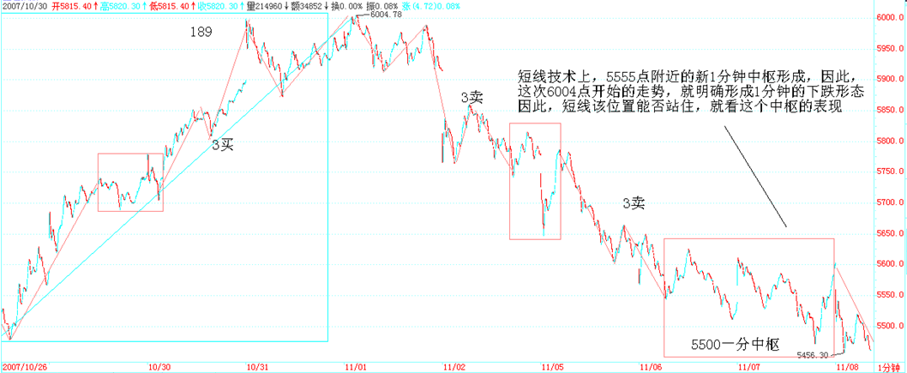

今天不爽的，基本上有两种人：一、牛人，觉得自己很牛，可以短线，有天赋。本ID说认清自己，冷静加冷静。认清什么？就是你是不是牛人。牛人，不在乎什么线，但不是，就别累着自己。本ID不早给了所有非牛人一个最好的选择：小板凳？二、大牛人。这种人，以被套为光荣，号称牛市就要中长线，就要持有。就算那股票从300到3元，也要持有，也要中长线，这种大牛人，本ID没什么可说的。有人喜欢电梯，上上下下享受，本ID一点意见都没有，慢慢享受去吧，还有你爽的时候。

明天、周一，5月均线能否有埋伏，埋伏能否有效，很快就有答案了。如果是本ID搞的，本ID当然有信心，但现在，本ID又不当多头了，和3600点那时候不同了，本ID可不想为任何人担保什么。

现在，多头短线的问题，是这次跌破，是否能尽快拉回去，否则，一旦确认颈线跌破，那么，按照双顶的量度跌幅，你觉得该到哪里呢？

本ID很想仁慈地安慰一下今天受苦的人，但本ID最终决定还是不这样干，因为这样只能害人。市场从来不仁慈，本ID该说的也早说了，既然，今天痛苦的，都是大小牛人，那么就继续梅花香自苦寒来去吧，这大概是牛人爱干的活。

如果想真学点什么的，请复习一下本ID这帖子”

2007年末，资金与政策博弈下的走势分析 2007-09-17 00:41:48”，如果能学点什么，本ID觉得，就没必要学梅花了。股市里，不需要学梅花，不需要苦寒来，股市只需要智慧。

技术高的，可以关注这6004点开始的1分钟下跌的背驰，然后将有一个大反弹；如果技术不高的，还是继续小板凳吧。先下，再见。

[2007-11-09]5月均线大埋伏剧本如期上演

(2007-11-09 15:20:08)

今天行情没什么可说的，就本ID前两天已经公布的5月均线大埋伏剧本的现场版。不过，说老实话，同样的剧本，不同的导演，效果当然是不同。今天这种演出水平，显然不是太令人满意的，所以本ID一早就给了一个定性：“这些蠢蠢的多头，估计抄也抄不成样子”，至于是否会“最后，可能还是要和5月均线吻别于狂乱的夜”，很快也会有答案了。

当然，在这个答案出来之前，无论答案如何，都会有一个对前面5462-5555点颈线位置的反抽确认过程，这是例行手续，能重新上去，就证明多头这次的5月均线大埋伏剧本没演砸，否则，这戏就要退票，重新开始空头的魔兽表演。

空头这头魔兽，最终肯定要被本ID砍了劈了，但如果多头不争气，剧本演砸了，首先被砍被劈的一定就是多头。

本ID这种要砍死空头的空头，目前最爱干的事情就是，多头伏击时，本ID也在后面伏击着，多头掩杀，本ID就跟着呐喊，等多头冲得没力，空头开始反击，本ID就在后面连续绞杀，把多头变成少头。

有人可能说，你这样也太无耻了。本ID只知道，在资本市场里，最无耻的行为就是亏钱、被套，只要你在市场上，远离这种行为，那你自然就是一个高尚的人、脱离了低级趣味的人，可以鄙视所有宣称你无耻的人的人。

这如同打仗，蒋光头就是最无耻的人，占尽优势最终还被赶到岛上洗海水浴去了，这世界上还有比这更无耻的吗？无论多少无耻的人给他找一万条无耻的理由，也改变不了他是最无耻的结论。打仗，最终只看结果，别说任何理由。输了，磨墙去，JJWW没用。

市场比打仗更无情，打仗输了，还会有无耻文人，忽悠点这英雄那豪杰的，蒙骗一下少年儿童。市场输了，连尸骨都不会有人替你收。有人喜欢温情，喜欢有人说软话温暖一下破碎的心，那是有病。这种人，在市场中永远只有一种命运：死。

中石油在38附近又有一个新的1分钟中枢，不过这个中枢与上面一个太近了，极有可能就2合一地扩展成更大级别的中枢，当然，实际走势，由市场决定。

大盘没什么可说的，5月均线埋伏后，就看反抽力度，十分简单，没必要多说了。

个股方面，由于人气涣散，最近能逆市的，更多是小市值的低价股，年未，重组闹剧又到上演的时候，这是可多多关注的。至于，中字头，一定还是市场的重心，不过一定要踏稳节奏才可以去短差，否则就会被人绞杀。

不想说了，一到周末，股票就成了最无趣的东西。周末，腐败去，发展晚上经济去、为吃喝玩乐经济贡献去，千万别股票去了。如果什么都不想干，就打坐吧。先下，再见。

[2007-11-11]略论国家经济意志的市场化体现

(2007-11-11 17:13:00)

在计划经济条件下，国家的经济意志，可以有多种宣示的渠道，惟独缺乏的是市场化。而在市场经济条件下，一味通过行政、政策等硬方式进行调控，显示是不合时宜的。而在市场化手段下，国有股份、外汇储备、社保资金等等国家资产的应用，不可避免地将体现国家的经济意志，而如何处理好其中的关系，确实值得认真探索与研究，这关系到国家的经济安全与经济发展战略的最终实现。

国家的经济意志，不是一时的盲动，也不能基于某种短线利益或道德冲动。国家的经济意志，必须建立在国家战略的前瞻性、全面性与系统性基础上。没有前瞻性，如同散户跟庄的思维，跟着别的大国思路跑，这样是绝对不行的。中国是一个大国，其经济意志必须有着大国的气度，必须能对世界经济与政治格局产生中国式的引力，反映出中国式的声音，最终实现中国式的战略意图。而没有全面性，同样不行。中国的国家经济意志，其战略取向必须是全面的，而不是为了某时某地某人的利益，其最终的经济利益，必须能体现且实现全体国民最大最终的利益。至于系统性，表明了中国的国家经济意志，必须也必然现实地体现为一个有着严密内在联系、多层次建构、具有可操作性、可实现性的有机系统。

目前，单单从具体资产的实际运用上看，国有股份，已经是股市中最大的绝对控制力量，目前的指数，已经完全是中字头股票的天下；而社保基金，最终将在国有股份划转、减持与最终运作中扮演极为重要的角色；而中投公司的成立，使得外汇储备的应用在内外资本市场中的协同性与隐含的战略性至少有了超越波段性质的重要意义。

但国家的经济意志，还不单单反应在具体的股票或市场化操作上。更重要的是，绝不能把国家经济意志的体现，完全退化成如同庄家控盘的操作模式，这是极为危险的。国家的经济意志，应该成为市场中一个重要的甚至是最重要的分力，但不能成为市场合力本身，更不能成为市场的唯一力量。一旦向这种危险的境地演化，那么，所谓国家经济意志的市场化体现，就会成为一句空话。这种所谓的市场化体现，也将会成为摧毁市场基础的力量。

此外，国家的经济意志，还必须体现在对国家经济资源的保护上。国家的经济资源，不单单包括狭义的实体、实物上的资源，还包括在虚拟经济条件下一切能产生市场、资本等效应的资源。例如，中国的优秀公司，就是中国资本市场的最大经济资源。如何合理利用这些资源，而不是让其贱卖、外流以及被短期利益所过分开发，这是一个十分现实且有着诸多教训的重大问题。

而站在资本运用层面，太过市场化、太过老鼠仓化的基金已不可能单独成为国家意志的经济化体现，必须有一种新的绝对性平衡力量来加强调节。既然在实体层面，国家对关系国民生计的产业要绝对控股，那么，在虚拟经济层面，这种绝对控股性是无用质疑的。也就是说，这种绝对控股性，还必然包括对股票总体走势的宏观控制。

国家逐步淡出政策层面的硬调控，必须也必然会在经济层面掌握一个绝对的调控力量，否则，资金对政策的挑战就会出现无法控制的局面，这是完全不符合中国国情的。加强国家对经济的调控，包括实体与虚拟两层面。而国家对虚拟层面经济化调控领导地位的加强，是一个必须尽快解决的问题。

[2007-11-12]1000点小康跌幅胜利完成

(2007-11-12 15:28:57)

本ID宣布做空时说，没有1000点的下跌空间，不爽，所以要先拉出空间来。今天，1000点的基本任务已经胜利完成，本ID在前面已经给了这个跌幅一个名字，叫小康水平的跌幅。请问，各位是希望下一步小康就算了，还是要继续富裕下去？

今天，5月均线大埋伏剧本继续演绎，今天的利空，刚好为6004点下来的1分钟下跌构成底背驰做出最后的贡献。本ID已经早说了，6004点下来的1分钟下跌一旦背驰，会出现较大级别反弹。现在，5月均线大埋伏剧本与1分钟下跌背驰剧本最终两剧合一。

注意，这个1分钟下跌，搞出来了三个中枢，然后在今天一个完美的底背驰。最后的一个1分钟中枢的第三类卖点，就是早上的补缺失败走势，然后继续的下跌构成了线段的类背驰，这和1分钟大走势的背驰段构成完美的区间套，这么教科书的走势，请好好去研究。

1分钟底背驰后，最基本的涨幅，就是拉回原来1分钟下跌的最后一个1分钟中枢的波动区间，这个在今天就达到了，后面就是这个中枢如何扩展出5分钟中枢的问题。技术上，就要关注这个5分钟中枢的位置以及后面相应的中枢震荡结果。

通俗地说，如果大家都觉得短线小康就算了，不要富裕了，就让这5分钟中枢第三买点；否则，大家都急切奔向富裕，那这5分钟中枢将第三卖点；事情就这么简单，各位民主一把，投票吧。

更通俗地说，就是以5月均线陷阱对5462-5555点颈线的例行反抽继续展开，注意，反抽可不一定要一定碰到5462上，最弱的反抽，就是装模作样在颈线下面折腾几天，然后就和5月均线吻别于狂乱的夜。

当然，多头现在也不是完全没希望，多头要成功，首先是要让所有人只要小康、不要富裕；其次，好好利用5月均线大埋伏剧本，绝对不让那狂乱的夜发生，特别不能让狂乱的月圆之夜发生；最后，找准机会，重新回到5462-5555点颈线之上站稳。

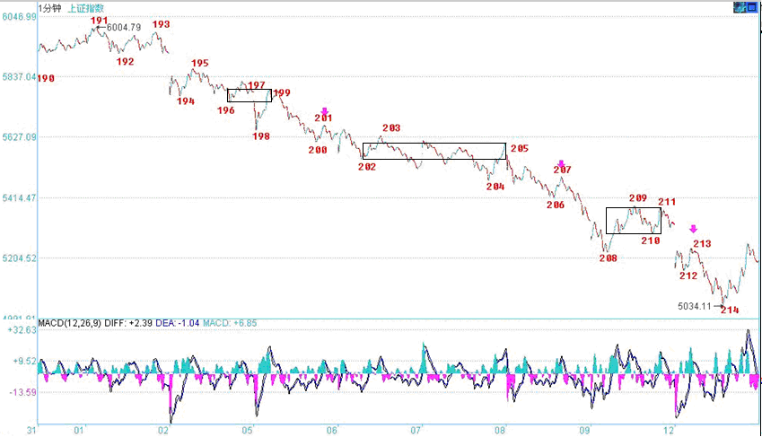

以上，是多头唯一可以走得通的路，鲁男人说，人走多了，就成了路。多头就从这一刻起，如果要活命，就要不断地到处乱踩，把所有板块都踩一遍，看能不能走出路来。

这句话，通俗的意思就是，反弹如果真能延续，必定以板块轮动的方式，这种方式，好听地说，就是为了聚拢人气，不好听地说，就是忽悠蒙骗点新的站岗者。

特别强调，并不是任何反弹都是任何人有资格玩的。站在本ID理论的角度，这个反弹完全可以就已经结束了，为什么？因为最基本的回抽最后一个中枢的幅度已经达到，所以，现在关键是回来那一下能否构成第二类买点，如果不行，那狂乱的夜的吻别就马上上演，不过，更适当的名称应该叫：刎别。

今天的解盘，写得太长了，主要是有趣版本与通俗版本都写了，本ID经常用自己的语言写，其实只是为了有趣与简练，但这世上无趣的人太多，本ID就受累点，夹带上通俗版本。

下面给出了6004下来的分段，请仔细研究，里面用绿箭头把三个1分钟中枢的第三类卖点都给标记出来了。按照本ID的理论，最晚的逃命点195处，从第1个绿箭头开始的所谓第三类卖点，其实都没什么意义，这里，只是显示，第三类卖点后，市场是可以多么狠。按本ID的理论，从195逃命的，在214才真正开始值得考虑是否回补。当然，前提是你的操作可以接受1分钟级别的，如果是5分钟以上级别的操作，那还是继续睡觉吧。

214，从191开始的1分钟下跌走势的底背驰，对应着三重的区间套定位，最后一重是213-214之间的线段内部笔之间的定位，其中的精确性，教科书一般，关键是你能真明白，并且能当下去把握。

好好研究吧，这可能比讨论小康好还是富裕好更有意义。

本ID要出差了，晚上飞机走，晚上的帖子肯定写不了，明天收盘再解盘。不过，在外地，时间上可能不能太准时。另外，后面几天的晚上帖子，估计很难完全保证，因为应酬肯定少不了，又要为茅台、五粮液大大贡献一把了。

最后，一句话，请问：要小康还要富裕？先下，再见。

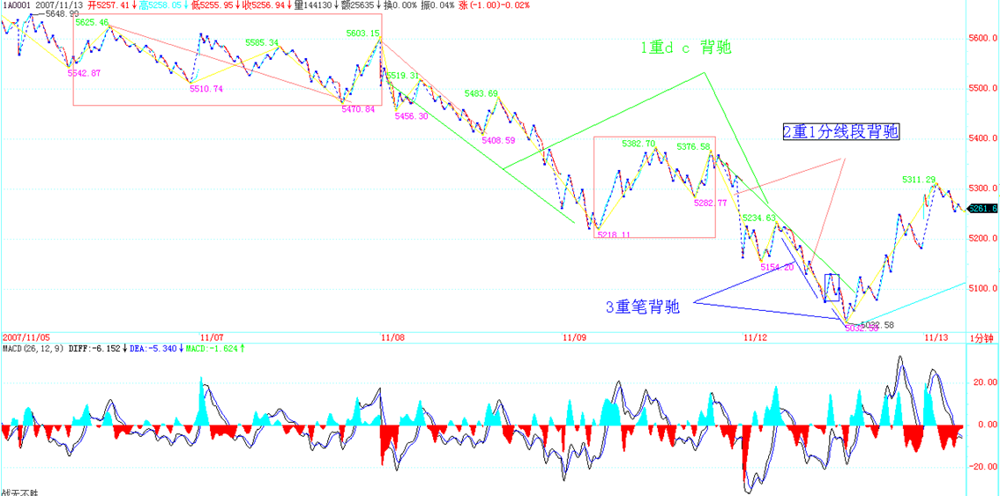

[2007-11-13]市场总是少数人成功

(2007-11-13 08:27:42)

本ID开始课程时，有人还问一个很傻的问题，一旦都掌握了本ID的理论，那理论还有用吗？这种想法，就如同那种同样傻忽忽的逻辑，人人都有共产主义思想，这共产主义就实现了。可惜，共产主义和什么思想没关系，把老马的伟大堕落成培养共产主义新人的可笑，这就是这种逻辑的历史悲剧。

市场总是少数人成功，为什么？因为只有少数人能真正把握自己。征服世界，并不意味着你能把握自己。认识自己、把握自己，这比征服世界更难。

当然，站在市场逻辑的角度，没必要为那些待宰的羔羊而煽情。问题是，最重要的问题是，千万别把自己往羔羊里挤。因此，本ID也只能抱着能惊醒一个是一个的心态。

没有人天生是羔羊，是你的心、你的眼界、你的行为让你羔羊。不修炼自己，不在市场中磨练，羔羊永远只能是羔羊。

一个1000点，10%几的回调，已经让这么多人方寸大乱，以前随便就是50%、60%的调整，那不就真要尸横遍野了？该来的，总要来，市场的重新真正走强，一定是在清理了该清理的之后，就像河道被淤积了，不清理，能行吗？

目前只是大牛市第一阶段的一个中级调整，这一点从来没有任何的疑义。而本ID以前说过的股票，没有一只会放弃的，等中级调整结束，会再度启动，而且有些已经开始预热，这也是很显然的。但调整，首先必须先面对，这是当下的事，先处理好。

按照市场的节奏，6004点跑掉的，昨天开始回补闹一闹反弹，反弹一旦结束，就砸出去，没什么可犹豫的。图形告诉你一切，反弹是否结束，一切尽在走势中。

关键是，你的心能如明镜一样，当下地映射出行情的真实走势吗？

下午收盘，马上有事，有时间再把解盘给出。

在外面，只能如此，尽量在宴会前给出解盘，否则，晚上回来估计也没可能写东西了。

人世皆苦，才有修行的可能。有苦，真好。

[2007-11-13]5日线受阻，多头仍需努力。

(2007-11-13 15:06:24)

快速说几句。今天反弹受阻5日线,这是最简单的走势,按本ID的理论,分型成立后是否能延伸为笔,关键是看5日线,只要不能重上,那么这个底分型就有破坏的可能。当然，一般这底分型即使真的被破坏，也会在不远处形成新的能最终形成笔的底分型，所以，多头还是有短线希望的，只是过程可能有点多灾多难，例如，今天中午传出的CPI，就给早上的多头泼了凉水。

但更精确的分析，还是看昨天1分钟底背驰后的中阴走势，刚好课程说到这里，这是一个标准的现场版本，请好好研究，仔细分析。

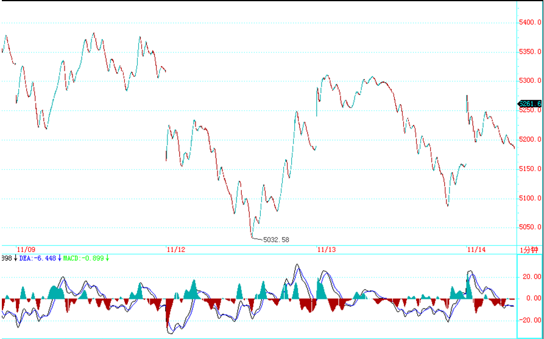

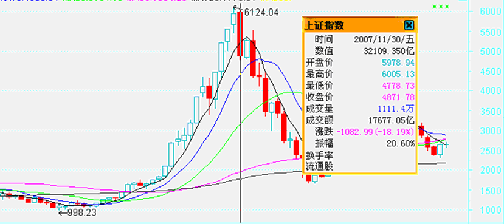

昨天说了，多头会如鲁男人一样狂踩不同板块去找路，今天下午的回落，很多板块并没有破坏反弹的形态，所以多头还有继续努力的资本的。

短线继续关注5日线，以及1分钟图上的中阴走势演化。技术差的，就继续小板凳，等风和日丽再出来撒野吧。

听说北京今天要下雪，如果是也太无聊了，本ID刚离开，难道就让本ID错过这2007年的第一场雪？

拜托，雪还是别下了。

晚上如果酒后还清醒，就再见吧，否则，还是让本ID去见周公算了。抱歉，先下。

[2007-11-14]节奏爽了才是真的爽

(2007-11-14 15:17:22)

对不起，在外面，帖子就不能保证了，请原谅。解盘还是保证的，但也只能快速说说。

昨天说得很明确，就是看5日线，因为昨天刚好构成底分型，所以今天下午一站上5日线，大盘就强烈启动起来，这都是极端教科书的走法，自己好好体会吧。

前两天的1分钟底背驰后，后面是一段中阴走势，各位可以看看本ID的课程里关于为什么很多人抄到了底却拿不住，就是因为不明白中阴走势的处理。更仔细的分析，只能等回北京后写课程时再说了，不过这两天的走势，也很规范，是其中最简单的走势的标准版本，请好好分析一下。

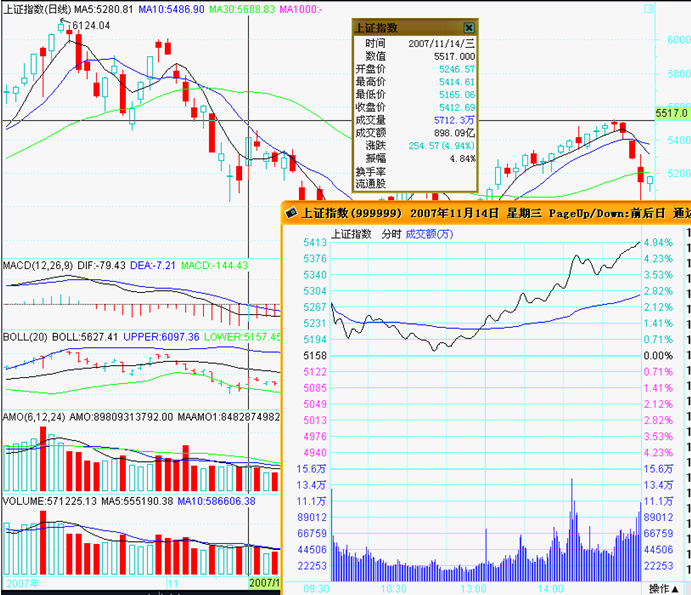

本ID的理论有没有用，从这次下跌到1分钟背驰的把握，到这个反弹的全面处理就是一个很好的例子。这不需要你任何的其他渠道的消息，图形告诉了一切。当然，前提是你看得明白，否则就是对牛弹琴了。

本ID很肯定地给了多头如何利用5月均线对空头进行大埋伏的剧本，看来，多头经过前几天的不熟悉，终于演得有点模样了，给朵大红花。

下面的问题就是5462点重回后能不能站住，站住就有更大的反弹空间。另外，注意期货的消息，如果最近有关于这方面明确的消息，那么指数的走势就会有很大变数，也就是说，指数存在创新高的可能，不过这和绝大多数人无关。

对反弹的把握，如果想懒点的，就看这个日线上的笔最终延伸的结束，如果它有本事延伸到10000点，本ID也没有反对的理由。当它没本事的时候，本ID就把这几天买的拿出来开砸，如此而已。

只要重回5462点上，无论站住与否，都将形成一个大的中枢，所以，中枢震荡一把，折腾一把甚至回来N把，还是很爽的。

个股方面，已经明确说过了，都会被踩一次，但如果期货消息很快出来，那么还是中字头更牛一些。其实，各位看看中驴，就知道方向了，你看这驴，从来都是最聪明的，无论涨跌，哪次不是领先于大盘的？

爽，要有爽的潜质。现在最危险的，反而是这种状况的，就是底部没敢动，反弹N天后忍不住的，站在反弹的角度，反弹往往意味着换岗。本ID现在没什么事，就等着多头没力的时候，把钢枪发给想换岗的了。

所以，节奏是第一位的，节奏爽了，才是真爽。关于利用1分钟走势底背驰进行抄底反弹的操作，已经提醒N天了，不管处理得怎么样，都请好好反省，这样才会有真的进步。先下，再见。

[2007-11-15]对不起，解盘晚了。

(2007-11-15 21:47:45)

对不起，解盘晚了。今天一收盘，就给抓去看企业，书记亲自出面,你说有什么办法?来到下面，个个人都急着，把你当点石成金的圣手，苦呀，没办法，各位也请原谅。

本ID现在可是喝了1斤多五粮液后说的话，虽然相当清醒，但各位也知道，本ID这收盘后的N小时内受到的苦是多么的深切。苦呀,苦。

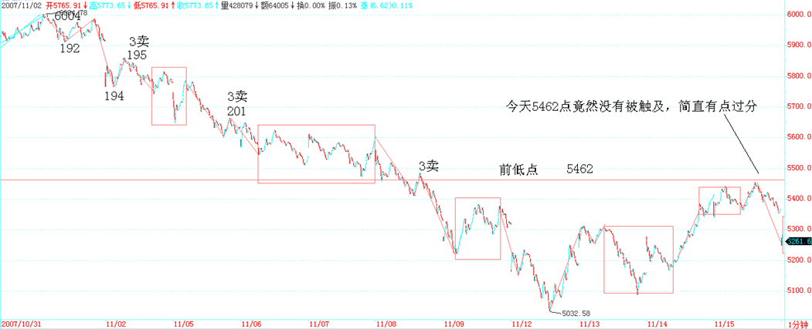

今天5462点竟然没有被触及，简直有点过分。喝了点酒，本ID也真要狂言一句，没有本ID的多头，就是阳痿的货。连5462点都不碰，多头难道想找死吗？本ID现在酒后胡言，但不骂他们也不爽了。

今后几天，首先站上5462点，让本ID觉得多头还有点男人的器官，否则，本ID以后就宣告多头根本没头，都是中关村的货色，多头也没什么可抱怨的。

这里，先说明一个典故，估计北京外的人都不知道。中关村，其实是中官村，中官，就是太监，中国的第一所谓科技村，竟然就是历史上的太监村，你说要哭还是笑？

喝多了，也没必要技术什么了，5462点，多头，想证明你们不是中关村的，就给搞上去，否则，后面本ID的题目就是：多头，都是中关村的货。

对不起，思维混乱，明天估计也没机会解盘了，周六回北京再补上。

北京，不总是中关村的。让中关村的太监太监去吧。北京爷们，请爷们一下，别让本ID看不起你们。

洗洗睡吧，讨厌五粮液，最恶心的酒。下了，周六见。

[2007-11-16]多头，不要争当中关村的货。

(2007-11-16 15:25:28)

快速说两句，明天就回北京了，不知道雪下了没有？

北京有中关村，多头，也不要争当中关村的货，北京可不止中关村。5462点，连这都如此困难重重，本ID都没了骂多头的兴趣了。

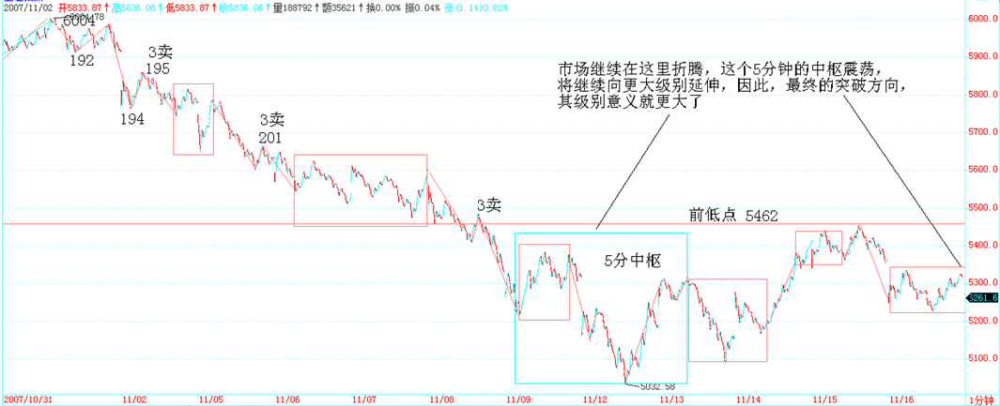

这次出差，本ID还是深切感到了中国企业的创业热情。虽然，有些手段，有点太那个了。例如，本ID这几天考察的企业里，就有从世界性大公司出来，用完全盗用的技术，改头换脸地疯狂发展出来的。虽然本ID并不特反感这种企业，但这毕竟不是长久的办法，中国人有足够的脑子，为什么一定要盗用鬼佬的？

市场继续在这里折腾，这个5分钟的中枢震荡，将继续向更大级别延伸，因此，最终的突破方向，其级别意义就更大了，暂时，估计还需要一定的时间。

个股方面，依然是乱踩走势，暂时不会有太多板块具有持续的走强能力，总之，就是来回折腾。

不说了，周末，本ID还要熬上最后一晚的饯行酒，明天就回北京了。先下，再见。

## 教你炒股票89：中阴阶段的具体分析

(2007-11-18 20:14:06)

一周多没上课程，虽然是周末，也破例上上吧。今天见了好几拨人，等一下8点半还有一拨，没办法，出去这么久，只能当补课了，所以只能快速写写。

大概很多人都想，上次说的中阴阶段也没什么特别的，其实也是一个盘整，和其他的盘整也没什么不同。如果有这种想法，就有大问题了。

中阴阶段能否处理好，关系到操作节奏的连接问题。很多人的操作节奏特乱，就是因为不知道中阴阶段的问题。中阴阶段，虽然表现为中枢震荡，但并不是一般性的中枢震荡。

另外，特别要注意，精确的理论，当然也可以很粗略地说，例如，所有人都知道，市场不是上就是下或者就是盘整，这本质上是废话。但废话的另一面，就是公理。这个废话，刚好表现了市场的本质。

就如同欧氏平面几何里，说两点之间只能有一条直线。这对于常识来说，就是废话。但这废话就是公理，关于欧氏平面几何里的公理，这个公理正好反映了欧氏平面几何的本质特征。同样，市场不是上就是下或者就是盘，这一点，刚好反映了地球上现在所存在的股市的特征。完全有可能在别的星球上的股市，就存在第四种情况，那里有和我们的思维有着完全不同的分类。

但更重要的一点是，知道了公理，其实什么都没知道。这其实也是中国人思维里的一个大弱点。中国人喜欢大而化之地讨论问题，结果最终讨论的都是废话，都是所谓的公理，或者说就是我们的共业所生的东西。

但科学，特别对于具体操作来说，这些大而化之的东西，没有任何意义。例如，市场上的操作，是一就是一，多一分不行，少一分也不行。所以，这里，必须有严密的逻辑思维习惯，而且是精确思维的习惯。

我们从公理出发，并不意味着我们就停留在公理的水平上。否则，欧氏几何就是干瘪瘪的5条公理，那还研究干什么？同样，讨论市场，不是上就是下或者就是盘，那样什么都别研究讨论了，抛硬币就可以。

中阴阶段的存在，就在于市场发展具体形式在级别上的各种可能性。这些可能性的最终选择，并不是预先被设定好的，而是市场合力的当下结果，这里有着不同的可能性。而这些可能性，在操作上并不构成大的影响，因为都可以统一为中阴过程的处理。

例如，这次从6004点开始的1分钟级别下跌背驰后，就进入中阴时段。首先，根据走势分解的基本定理，就知道，其后的行情发展，一定是一个超1分钟级别的走势。但超1分钟级别的走势，存在很多可能，就如同一个人死后在中阴阶段，也存在着多种可能：人、鬼、神、阿修罗、地狱、畜生等等。

这些可能，首先一个最基本的原则是，必须先出现一个5分钟中枢，因为无论后面是什么级别的走势，只要是超1分钟级别的，就一定先有一个5分钟中枢，这没有任何特例的可能。而这个100%成立的结论，就构成我们操作中最大也是100%准确的基本依据。

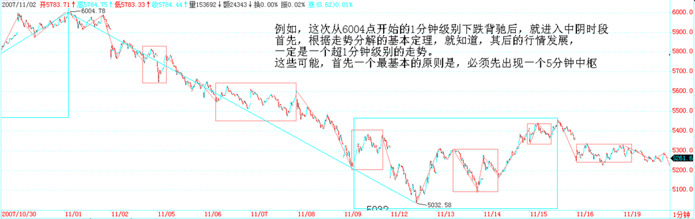

1分钟级别的走势后，你不能说他一定是下还是上还是盘，因为都有可能。但你一定能说，他最终必须先有一个5分钟中枢，这是100%的，而且，只有本ID的理论才能明确给出这样的必然结论。

有了这个结论，一切关于行情后续演化的争论都没有了意义。不管后面是什么，首先把这5分钟中枢给处理好，这才是唯一重要而且有着100%操作性与准确性的事情。

因此，你在操作中，脑子里必须有这样一个100%准备的判断。而5分钟的中枢震荡如何操作，那是最简单的幼儿园问题，如果还不懂，上面有88节课程，请好好再学学。

当然，如果你是按5分钟以上级别操作的，那么这个5分钟中枢的中阴过程对于你来说可以说是不存在的，你可以根本不管。

而这5分钟中枢成立后，就必然100%面临一个破坏的问题，也就是一个延伸或着第三买卖点的问题，而这也是超级幼儿园的问题，不懂就回头学。

当然，如果这中枢不断延伸，搞成30分钟中枢了，那就按30分钟中枢的第三买卖点来处理，如此类推，总要面临某一个级别的第三买卖点去结束这个中枢震荡。

一般性的，我们可以以5分钟中枢后就出现第三类买卖点为例子，那么，这个1分钟的走势，就演化为5分钟的走势类型，至于是只有一个中枢的盘整，还是二个中枢的趋势，那用背驰的力度判断就可以把握，这也是幼儿园问题。

例如现在，如果已经形成的5分钟中枢出现第三类卖点，那么，就算共同富裕的目标达不到，全面小康肯定是没问题了。

从上面就可以看到，本ID的理论是这样把一个看似复杂，没有方向的中枢问题，以100%准确的逻辑链连接成一个可以100%具有准确操作度的简单操作程序，而这，不过是本ID理论的最低级威力而已。

这里，必须再次说明，本ID理论的盘整和一般所说的区间震荡盘整的概念不是一回事，指数从10000点跌到0也可以是一个盘整，只要中间只有一个中枢。另外，盘整和中枢也不是一个概念。中枢如果是苹果，那么盘整就是只有一个苹果的苹果树，而趋势就是可以有两个以上直到无穷个苹果的苹果树。你说苹果和苹果树是一个概念吗？

另外，千万别以为盘整就一定比趋势弱，有些盘整，第一段就杀得天昏地暗的，后面一段，即使力度没有第一段力量，两者加起来，也可以超越所谓的趋势了。还是上面的比喻，只有一个苹果的苹果树，难道一定比有100个苹果的苹果矮？显然不是的。

所以，那些连中枢、盘整、趋势都没搞清楚的，就请虚心点好好去学习。本ID的理论，不会因为多一人学了而多一分准确性，更不会因为少一人学了多一人反对了而少一分准确性，这就如同三角型之和180度，只要在欧氏平面里，你爱信不信，都不会变成179度的。

第89课读后感：

１、“市场上的操作，是一就是一，多一分不行，少一分也不行。”

2、“盘整和中枢也不是一个概念”。

3、“中阴阶段能否处理好，关系到操作节奏的连接问题。”

4、“中阴阶段的存在，就在于市场发展具体形式在级别上的各种可能性。”

[2007-11-19]阶级斗争，打土豪分田地。

(2007-11-19 15:13:40)

本周被安排得满满的，明天解盘要在晚上，后面还要出一次差，所以，有什么照顾不到的，请原谅。

快速说两句。今天就是大搞阶级斗争，把中国神（华）、（石）油为代表的大土豪给狠揍几下，然后像奥运、VC、军工等等的垃圾股票就显摆显摆。

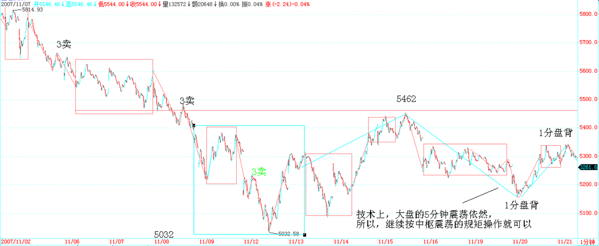

其实这很正常，本ID听说，在男猿人的ED世界里，世界第一名牌是印度神油。中国神油，大概有点水分，所以先挤挤才能成为合格产品，这点，男猿人的认识应该比本ID更清楚，本ID就不敢男猿门说神油了。

但阶级斗争，经常有胡汉三又回来的时候。反正，题材垃圾与中字神油，来回折腾的局面是一时难以改变了，这就构成了最基本的两大阵营的轮流举旗。

技术上，大盘的5分钟震荡依然，所以，继续按中枢震荡的规矩操作就可以，当然，现在指数的意义不断下降，所以可以根据具体板块的图形决定操作。

和谐，从来都不会从天上掉下来，和谐，最终只能是阶级斗争的结果。阶级调和，是不会调和出和谐来的。

打土豪，分田地；然后胡汉三再回来。不断地轮回，世界本来就是如此。怕，也要世界。不怕，也要世界。世界就是世界，关和谐屁事。

在所谓和谐的世界里，反对和谐的，就成了异端，就有了阶级，就有了斗争。

世界是否和谐并不重要，世界的重要性只有一点：无论现实是否血淋淋，现实就是现实，不能装饰，任何的装饰，最终都会成为历史的笑话。

最华丽的裹尸布包裹的尸体，依然只是尸体。当然，尸体是可以用来人肉叉烧包的。抱歉，这话可不是本ID说的，那是施耐庵未被尸体时说的，如果有什么意见，找他鞭尸去，不过前提是，他没被人肉叉烧包了。

上面是解盘与今晚帖子的混合，这样的文体如果不适应，对此产生不良反应，那请原谅，本ID不会写和谐文章。真正的文章，从来都不会是和谐的。

“大凡物不得其平则鸣。草木之无声，风挠之鸣；水之无声，风荡之鸣。其跃野，或激之；其趋也，或梗之；其沸也，或炙之。金石之无声，或击之鸣；人之于言也亦然。”

不和谐才有真文章。今晚无帖子。先下，再见。

[2007-11-20]快点解盘，否则要爽约。

(2007-11-20 23:44:07)

严重对不起，事情太多，忙到现在才回来。还好，赶得上24点，至少今天晚上解盘这个承诺能够实现。

今天的大盘，依然在中阴状态中无方向地震荡，这是一个中阴状态中的常态，目前，这个5分钟的中枢震荡继续维持，如果继续下去，就会延伸出30分钟。抬头刚好看到有点不太圆的月亮，月圆的时候，这中枢震荡是否能结束呢？

其实，现在某种程度上是一个新状态的熟悉过程。由于这中国神油的威力太大，所以如何与前期板块进行指数调控上的配合，总要有一个熟悉的过程。现在是小幅度的试验，然后，当然会有幅度大点的试验，试验力度逐步加大，也是正常的。

板块上，题材股继续表现，但中字股今天也开始有点热身，目前的震荡，有利于MACD的收口，一旦日MACD收口成功，那么大盘的反弹空间将打开。此外，一般图形走成这样，无论这里是否成为短线真正的底部，就算往下跌破，也是空头陷阱为多了，其中的操作，继续以中枢震荡的方法对待，这样就十分简单了。

其实，从中线的角度，反而是这次反弹上去后的走势更关键，如果不能有效突击上去，那么下次调整的压力才是真正严重的，特别不能出现MACD日转头后不能上0轴的情况，一般出现这种情况，后面都意味着更严重的下跌。只要不出现这种情况，问题还不是太严重。

中线的角度，目前5月线依然能被守住，所以本月收盘很重要，只要能守住5月线，多头就算成功了，否则，后面多头被屠杀就不值得任何同情。

目前，中枢震荡中，就是涨不上去杀多头，跌不下来杀空头，两头杀，才是正路。当然，你需要有这工夫，否则连中枢都分不清楚，那还是拿小板凳吧。

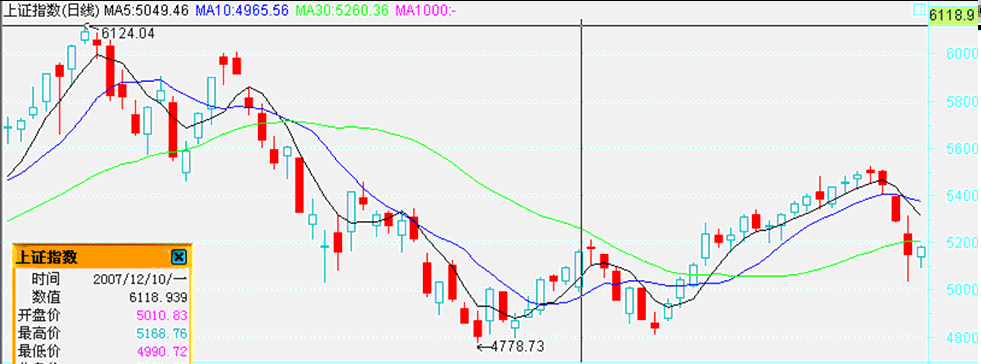

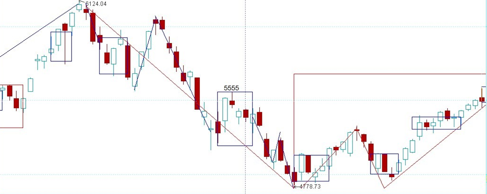

至于个股，本ID说了，本ID说过的个股，站在中长线的角度，现在还没有一只会放弃的，因为中长线的能量都依然充足。只是利用这次调整，该杀点差价的搞点差价、赚点筹码，没筹码的也好好找机会储备点，不能把东西都今年吃了，明年还要开大餐，总不能明年才准备吧。

至于像中国神油之类的东西，肯定也是要储备的，只是如果有更理想的价位就更好了，例如神华，那煤液化的项目一旦投产，明年石油又被搞上150元，你说他有没有价值？不过现在60多，确实有点不爽，不过要太砸下去也会有点困难，那就折腾着搞，震荡着把成本搞低，有机会再搞低点，没机会就算了。其他的铝呀油呀的，都是这种心态：动态回补或动态建仓。当然，如果给一个狠砸的机会，本ID也不会反对的。不过，会有吗？即使有，也只有一次。这一次是否能真出现，那就把现实照进梦想吧：不强求，不放过，大概是目前最合理的原则了。先下，再见。

[2007-11-21]管理层终于又做对了一次

(2007-11-21 15:36:59)

今天，最重要的消息，就是关于AH股上市顺序的问题，今天这个比较官方的表述证明，A股的重要性再次得到加强，以后港股被吸收进来的命运是不可逆转了，只是时间长短的问题。更重要的是，本IDN个月来到处大声呼吁要大幅度提高A股大盘流通比例终于有了一个切实的解决。以后的问题就是，新发行的大盘股，一定要达到流通比例10%的底线，前面这些投机性蓝筹，将不会再出现。

今天这消息，有着正负两面的影响。

正面影响是：

1、A股的重要性将大幅度提高。

2、现在的非法投机性蓝筹，反而成了稀罕货，一旦指数期货出来，这些股票的控盘重要性就更为加大。

反面影响是：

1、原来低比例蓝筹这历史问题如何解决。

2、以后扩容的压力将进一步加大，由于流通比例加大，那么太高的价格将受到影响。

现在的大盘，技术上是中阴阶段，政策上也同样如此。因此，后面中阴阶段的突破方向就很重要了，当然，向下突破，也不是世界末日，只是为明年的行情留出空间。

后面最大变数还是期货问题。

个股方面，今天是神油分裂，所以大盘是上下折腾幅度加大，这也是一个很好的控盘试验。大盘要想真站住，首先要神油合一都站稳。

月亮快圆了，大家都开始烦躁起来，是否又来一次天人合一的闹剧，很快就知道了。

至于其他个股，本ID现在都不想说太小盘的股票，像那个等比股票，这次调整，一下砍下来一半，这就是小盘股的风险。最近，其实本ID新搞了一个等差股票，盘子比等比大点，价格涨起来也就7元多，市值比等比更小，但也又是ST的，所以就一直没说。其他的股票，都等着折腾的机会，不过大盘方向未定，本ID还有把现实照进梦想的想法。

小康了，接着是全面小康，还是更雄伟的富裕，这确实是一个很现实的问题。但有一点是必然的，昨天也说了，即使再次破位，陷阱的可能性也就大了。

又来电话，说人到了，没办法，不能多说了，要走了。先下，再见。

[2007-11-22]又是月亮惹的祸

(2007-11-22 15:32:48)

昨天说“月亮快圆了，大家都开始烦躁起来，是否又来一次天人合一的闹剧，很快就知道了”结果今天就应验了，看来大伙对全面小康真的充满了热情，虽然周六才是十五，但这热情已经要十三就闹剧一把，这也太热情了。

当然，站在纯技术的角度，虽然小的1分钟级别的第三类卖点早上就有了，但目前的破位是否能形成大的5分钟第三类卖点，还是一个未知的事。所以，多头目前也不是完全没机会，面包还是有的，就看能不能把中枢扩展成30分钟的，这样，后面的下跌，不过是一个陷阱。

当然，是否陷阱，用是否出现大的第三类卖点以及出现后背驰出现的位置就很容易判断了。另外，中枢震荡操作的原则，从来都是冲不起来，在次级别上涨背驰的时候卖，跌下来，如果不形成中枢下移，而最多只是中枢扩展，那么就在次级别下跌的背驰时候买。这是最基本的方法，N堂课前就反复说过，这里再提醒一下。

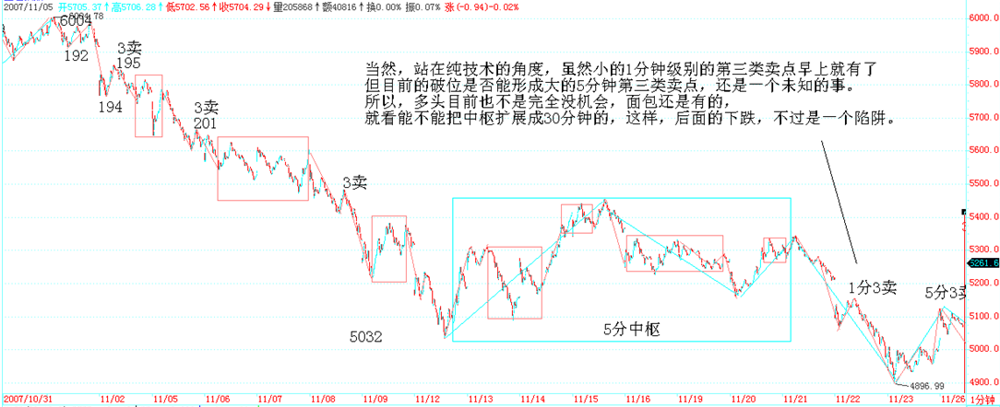

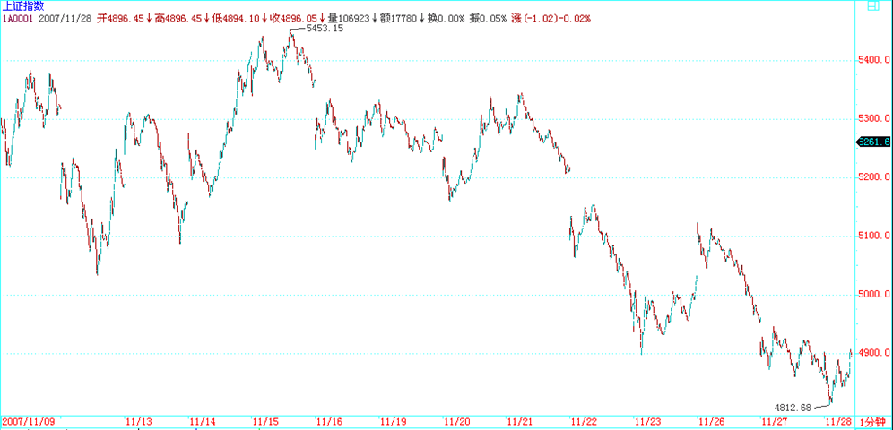

上面说的，都是给有技术，或者对技术已经很清楚的人说的，没技术的，本ID一直给的建议还是小板凳。

中线上，如果这月收盘多头依然过于窝囊，连5月线都确认失手，那么，10月线就是下一个比较靠谱的支持。但站在日线角度，120日的半年线快到了，无论是否有效跌破该线，在该线上下至少有一个大反弹去确认5000点是否有效跌破。

个股方面，有技术的，可以对明年有前途的股票进行动态关注，长期关注一组股票，对熟悉股性是很重要的。你对股性熟悉了，操作起来就更有把握。

现在的操作，都要为明年去打算。对关注的股票，可以在反弹操作中动态介入，熟悉其股性，等中级调整完成后，多野的马也给你驯服了，那时候全面介入完全熟悉的股票，赚大钱还不是天经地义的事情？

其实，股票某种程度和做生意一样，不熟不做，做熟了才能赚大钱。没有点耐心，整天等着天上掉馅饼，那还不把天上做馅饼的都给累着了？

今天比月亮惹祸更高兴的事情，莫过于英格兰队没吃到天上掉下的馅饼。早死早投胎，股市如此，英格兰队也如此，整天中阴也没意思。

最后，先和各位请个假，明天下午收盘解盘后，马上要开车去内蒙，5个小时，千万别下雪，否则还是有点危险。由于去的地方，是个大矿山，手机信号都有问题，所以周六、周日就写不了东西了，抱歉了。先下，再见。

[2007-11-22]过高的股票交易印花税已到必须调整时

(2007-11-22 21:30:42)

本周关于以后内地大型股票上市应以A股为首发地的消息具有重大意义，同时回应了本ID前面反复强调的两个问题：一、A股蓝筹上市比例过低；二、优秀上市公司资源的保护与合理利用。

这个新政策一旦实施，按照《证券法》，像目前A股中超低流通比例的疑似非法蓝筹就将不会再增加了。如果这政策早实施，中石油的流通A股也不会是现在的40亿股，而应该是至少不会少于180亿股。试想，如果目前该股的流通A股数是180亿，还有可能上演48元开盘的闹剧吗？

可以说，蓝筹流通比例过低的问题一旦解决，将使得市场的运行结构有了一个合理的基础。如果最重要的A股都没有一个合理的运行结构基础，那么多层次资本市场的建构基础合理就更谈不上了。在某种意义上，该问题的解决是股权分置改革的一个深化过程，极为重要。不过，这里又有一个遗留问题产生，就是这些已上市的流通比例不足的疑似非法蓝筹如何达标必须限时解决，否则将使得这些品种成为稀缺资源，在指数期货推出后埋下严重投机的巨大隐患。

但这个运行结构基础的解决，只是一个层面的问题。而市场的构成，不单单是那些可交易的股票，一个同样重要的问题是，这些交易的成本是否在一个合理的范围内。无论多好的市场体制、结构设置，如果人为设置一个超高的交易成本，那么这个市场体制、结构设置的运行，最终都将面临危机。世界资本市场的发展历史表明，股票交易印花税的降低是一个总的趋势。市场的设置，本质上就是要让交易便利、成本降低，否则根本没有必要让市场存在。

目前存在一个严重的误区，就是认为目前的流动性泛滥，钱太多因此投机性太强，对这观点的谬误的批驳，在本ID前面的文章里已多有提及。一个结论性的观点可以再次表述如下：针对目前数量庞大的可上市资源，并不存在流动性泛滥问题，站在长远看，反而需要面对流动性不足的巨大考验。试想，目前A股上市企业不到2000家，而印度是我们的三倍以上。那么，A股即使要达到印度的规模，中短期内就至少需要4000家企业上市，请问，我们现在所谓泛滥的流动性能马上承接这4000家企业吗？

交易成本的设置是市场构建中最基础的问题之一，过高的印花税对市场百害而无利，至于其所谓的调控功能，也被事实所证明是完全失败的。5月提高印花税后，市场反而在5个月不到的时间内从3400点上涨到6100点，制造出了危害性更大的蓝筹泡沫，其调控效果如何，事实已经给出答案。

当蓝筹流通比例过低的问题解决后，把股票交易印花税重新恢复5月前的水平应该提到议事日程了。只有合理的交易成本，才有合理的市场环境，才可能使得更大量的上市资源得到更顺利的开发。

有人可能担心，目前降低印花税会引发新一轮投机，这种想法与认为5月印花税的提高能压制市场投机的想法同样荒谬。市场，更重要的是供给与需求，抑制市场投机最有效的方法从来都是加大供给。请问，目前这印花税水平远远超出国际水平，在全球化背景是绝对不能长远的，最终必然要被改变的，那么不趁着调整时改变，就等于错失一个纠错的时机，难道希望在上涨时才火上加油吗？

此外，更加错误的想法是把印花税的降低当成以后救市的手段储存起来。如果还有这种想法，那么就意味着管理思路上依然在过去的旧圈子里。而事实上，A股的历史表明，政策顶与政策底从来都不是真正的顶和底，1996年的社论没有制造最后的高点、今天5月的印花税同样没有，1994年所谓的777点政策底最终跌破后直到325点。所有真正的顶和底，从来都不是某个政策造成的。政策只是分力之一，不是合力本身，对此必须有清醒的认识。

管理市场，必须要有大思路、大眼界。现在市场最重要的事情，就是完善多层次的、有效率的资本市场，然后让更多的企业能通过资本市场成长起来，成为中国经济新的创造力与推动力的源泉。因此，绝对不能因为市场的一些波动而扰乱了思路、局限了眼界。而一个有效率的资本市场，显然不可能是一个交易成本比世界其他市场平均水平高出多倍的市场；一个以印花税的提高来调控投机行为的市场，也显然不可能是一个成熟的市场。过高的股票交易印花税已到必须调整时，这点，应该引起足够的思考与重视了。

[2007-11-23]对不起

(2007-11-23 13:57:18)

对不起，刚接电话，内蒙来接本ID的车已经到了，本ID一收盘就要走，否则那边晚宴等着，不好意思。

解盘周日回来补上，周日没什么特别的事，一定在晚上赶回来。

[2007-11-25]对不起，晚到的解盘

(2007-11-25 22:00:34)

回来了，不过要开打一个股权收购战，虽然和某上市公司有关，但只和其资产有关，不涉及上市公司本身。因此，这几天可能极端忙碌，有时候解盘可能都要推迟，例如明天。请各位原谅。

前面说了，在120天线附近，最坏情况也肯定有至少一次对5000点的反抽，大盘周五走势其实就来自演绎这剧本。问题在于，给多头最后一次机会，多头能否给点勇气，依靠120天线站住5000点，下周就要分晓。

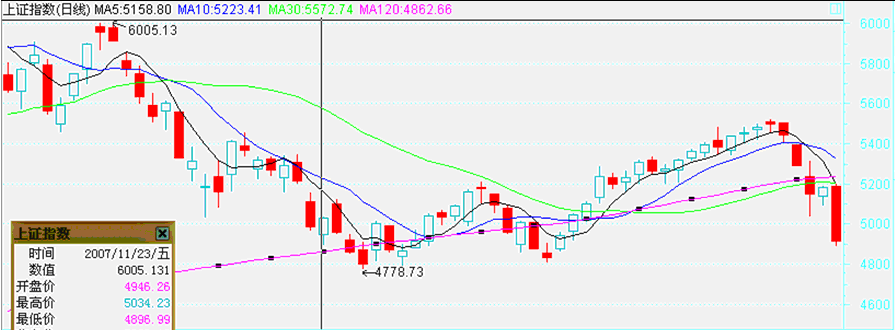

5163点是一个关键的位置，能重新上去，就是继续中枢震荡，否则就要严重考验120天支持。下周，是月线收盘，如果不能收在5月线附近，那么后面将要去考验10月线支持。

注意，从中长线角度，月线的顶分型成立后，唯一重要的事情就是是否延伸为笔，一旦延伸为笔，那么在月的底分型出来之前，大盘不会有任何中长线上实质性的上涨。

个股，题材股已经有些开始骚动了，除了那些特别兴奋的，一般大的骚动，还是在明年。中字头，在中石油完成其本ID在上市当天就说的类中国人寿走势前，都会被反复折腾，毕竟，好多人都怀有残暴的倾向，企图对这些中字头进行打击。

不过，打击只是为了拿到足够多以及足够便宜的筹码，只是在这样一种酷刑下，死扛永远都是痛苦的。本ID对老虎凳之类的玩意没兴趣享用，本ID只知道，在大买点出现后买，不需要享用老虎凳。

没什么时间写了，今天，一轮合同大战估计要通宵进行，本ID要忙去了。

现代战争中，最凶狠的往往是股权之战，往死里杀人吧。先下，再见。

[2007-11-26]抱歉，刚回家，还要忙。

(2007-11-26 23:59:35)

抱歉，刚回家，还要忙。这股权之战开始白热化，无耻招数要开始用上了。其实，最无耻的就是打败仗。胜者为王，丛林法则。别讨论丛林法则如何无耻，如何不应该，在血腥之中，生存是第一位的，丛林中，难道还有比丛林法则更不无耻的？

股市同样是一个丛林，同样有着最伟大的丛林法则，就是这么血腥，怎么了？中石油，就要无耻地继续类中国人寿的走势。多头，站不上5163点，就是要被强暴地打击，没什么可讨论的，也没有可同情的。

不过，120天线应该有足够的弹性。也就是说，在这附近，还会来回折腾。现在的走势，本质上的多空齐杀才能活得很好。也就是说，本质上，任何的急跌都将构成大震荡视角上的空头陷阱，由于下月10月线将快速上移，因此，10月线与120天区间将为震荡留下足够的陷阱制造空间。

对于长线来说，250天是关键的，也就是所谓的牛熊分界，在没有有效跌破该线之前，谈论牛市的结束都是无聊的。

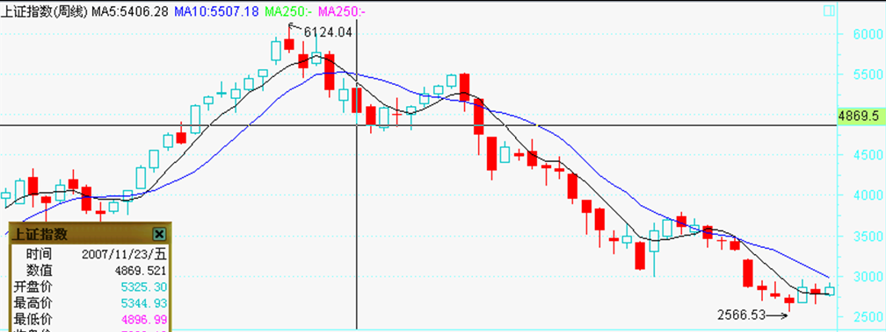

中短线操作，可以多关注120天、10月线等制造的空头陷阱，但必须暂时以反弹的眼光来进行具体的操作。

如果关注周线图的，可以看看6124点那周前后构成的顶分型的威力。那么要化解这个顶分型，必须首先要构造一个底分型，以此来完成一笔的运行。因此，后面的走势，就在一个底分型的探求与构造之中。站在这个视角，就会对后面N周的走势，有一个更大视角的把握。

最近太忙，除了开盘那4小时，基本都忙不过来了。所以解盘都不能准时，但一定都会回来后补上，过了这几天最关键的时间会好一点。抱歉，再见。

[2007-11-27]时间错乱还有两天，抱歉了。

(2007-11-27 23:54:13)

这几天，真是疯狂了，时间也跟着错乱，这种状态还需要两天。写完这帖子，还要修改一个文件，再坚持两天吧。

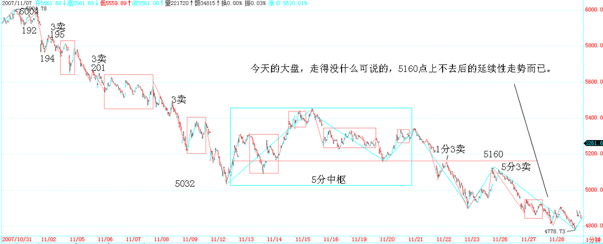

今天的大盘，走得没什么可说的，5160点上不去后的延续性走势而已。站在周K线角度，因为本周肯定新低了，所以这周K线肯定完成不了底分型的构造。站在周线角度，只要5周线不能重新站住，基本可以不看这个盘了，爱跌到多少都行。

跌1000点是小康水平，1500点是全面小康，2000点是初步富裕，2500点中等发达，3000点是实现现代化，3500点叫什么好呢？请建议一下。

不要恨中石油，中石油这种怪物的出现，就是本ID前面反复说的超低比例非法蓝筹的恶果，现在不算什么，如果有指数期货，那才知道什么是非法蓝筹的威力。现在的问题是：为什么用脚趾头都能想明白的问题，怎么会一而再、再而三地出现在国家级的决策中？谁要为这种决策负责？

其实，什么政策都无所谓，关键是有一个负责的最低要求，敢出政策而不敢负责，或胡乱设计却无须负责，这就是最大的问题。

当然，中石油的走势，本ID开盘那天已经明确说了，就是类中国人寿，也就是说先狠砸，再狠拉，现在的问题是，砍仓的人太少了，不见点鲜血，嗜血的市场是难以兴奋的。这话虽然残忍，但这就是市场。

没有砍仓的胳膊大腿横七竖八，哪里会有底部？真相就是如此，该残忍就残忍去吧。

而真正的杀手，就等着那血腥的一刻，如豺狼闻到了猎物伤口散发的气味，好好闻哟。先下，再见。

[2007-11-28]大盘进入基本支持区域

(2007-11-28 23:16:09)

今天稍微早点，因为明天是收购的第一个关键点，写完就要休息。这次收购，绝对是经典中的经典，现在，中国这领域最顶尖的公司都几乎参与其中了，以本ID看来，目前可能还只是戏的序幕，不过已经比其他的收购故事要精彩多了，有空，可以写个剧本了。

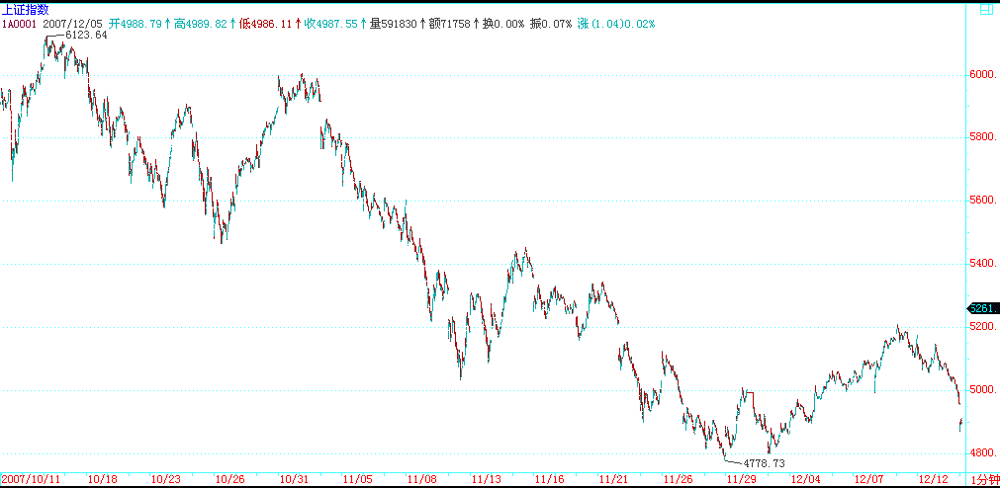

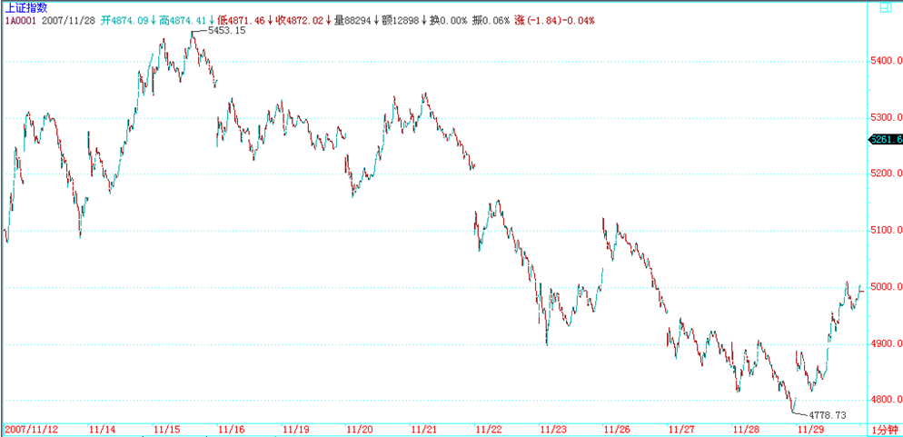

大盘今天继续无精打采的，不过大盘确实已经进入一个基本的支持区域。首先，按双顶的量幅，也基本到位了；其次，周线上一个从2005年开始从来没有跌破的支持线也在不远处，下月开始，10月线也会上移到附近区间，诸如此类的支持因数都在加强。

而本月，一下跌了一个比小康还多的跌幅，因此，无论如何，下月肯定有反抽走势。当然，这月线收的位置也很重要，如果收在目前区间甚至更低，那么反抽后的压力还是很大的。

短线的选择无非是：先反抽还是先全面小康。先全面小康，反抽的油水大点；先反抽，那油水就少点，如此而已。

中线上，下月的走势很关键。如果是先下影后上去，那么走势会好点；否则，如果反抽只构成月线的上影，那么后面的压力就大了，全面小康的目标就太保守了，回补4000点上那缺口，来一个初步富裕，也不是太不正常的事情。

不过，短线可以开始关注这大反抽出现的时点，在这之前，不排除先有一个大的陷阱再上来，如果真如此，那么这反抽的意义就更大点。

请注意，无论多头空头的，没有陷阱的玩意杀伤力都有限。6100点之所以有点杀伤力，就是因为前面有几天精心安排的多头陷阱。这里学问多着了，如果能参透这多头空头陷阱，你的本事也就见长了。不说了，累了，再见。

[2007-11-29]120天支持终显威力

(2007-11-29 23:53:11)

今天的收购小决战出现比较好玩的局面，一场好戏，还要继续唱下去。从明天开始，大概可以逐步正常，这几天的时间错乱，对不起了。

大盘的走势，不太错乱。本ID在前面说了，跌破5000点，只是一个空头陷阱，而120天线有基本支持，即使继续下跌，也不过是继续构造空头陷阱。今天大盘拉回5000点之上，使得一个更大级别的中枢在扩展开来。也就是说，5000点上下，将扩展出30分钟的中枢，后面的走势，就可以用这30分钟震荡的观点来观察，当然，如果这30分钟竟然震荡出第三类卖点，那么全面小康、初步富裕都不是什么奇怪的事情。这里无须预测什么，只要看好这震荡就可以把握了。

不过，如昨天所说，大盘没有选择在120天线下制造更大的空头陷阱，因此反抽的意义将有所减弱，首先看5周均线，如果能站上去，那么力度将大点，否则后面再次探底的压力依然不可小视。

目前的操作很简单，就是继续以中枢震荡的观点处理，只是这次的震荡级别更大而已。操作上，依然是游击战，至于阵地战之类的玩意，就留给多头和空头。本ID的操作思路很简单，就是放冷枪，放暗箭，专挑多头空头没力的时间落井下石。

多空齐杀，找准机会落井下石、突施冷箭，这从来都是震荡行情中的不二法门。震荡中的利润，从来都是在多头空头的尸骸中炼出来的，虽然残忍，但却是震荡行情的生存之道。

市场中，最大的残忍就是把自己送上断头台；市场中，最崇高的道德就是踩着节奏错乱者的尸骸前行。市场就是市场，装道德孙子的，不是早死的就是即将死的，有必要听他们的道德说教吗？

当然，请一定注意。当你还没有成为钢铁战士之前，还有一个最好的全身之道：就是在大级别的调整中紧抱小板凳，不参与一切的反弹。

宁愿错过，绝不过错，伟大光荣正确的小板凳。先下，再见。

[2007-11-30]周末继续效应

(2007-11-30 15:20:29)

今天开始正常。

今天的大盘同样正常，也就是继续周末效应。大的走势上，继续是5000上下的震荡。下周，反复强调的10月线上移，而5周线下移，因此，这构成大盘震荡的两个夹板。所谓夹板，就是上破是多头陷阱，下破是空头陷阱，总之，到处是陷阱，多头空头都没好日子过。

昨天，再次强调小板凳的伟大正确光荣，这是所有技术有问题的人的护身符。这护身符，从6100点就强调到今天。不过，就算小板凳是红宝书，也不能整天拿着跳忠字舞。如果想进步，最终还是要学会抛弃小板凳，学会在震荡中赚钱。

当然，如果真学不会，就不必要学了。并不一定每个人都需要变得英明神武的，如果每个人都这样英明神武，那么小板凳不是就要滞销？

至于震荡的操作技术，是必须磨练出来的，所以如果没有这种磨练的决心，还是买把小板凳，这样更有意义。

什么时候不再用小板凳？等大盘整个风给转过来了，底部经过确认后，才无须小板凳。现在，还在第一次的探底之中，也就是大盘的第一只脚还没有落地。而大的底部构造，往往需要两只甚至两只以上脚落地去确认，站在这个角度，小板凳还要旺销紧俏一段时间。

不过，由于本月大长阴线，因此下月一定有较大反抽去攻击本月阴线的实体部分，所以对于钢铁战士，以及准备成为钢铁战士的，可以密切关注一个大的反抽的准备与介入时机。

个股方面，很多题材股已经压制不住了，指数其实已经反映不了很多股票的走势，所以，如果你是钢铁战士以及准备成为钢铁战士的，更多应该关心个股的走势，指数走势只能成为参考。

技术上，周线、月线上底分型已经构造完成的股票，显然是最值得关注的。当然，如果你的手脚特别麻利，日线上底分型构造完成的也可以注意的。如果再进一步考察个股，就要看他在大的级别中是什么类型的中枢位置，这可以进一步确认较大力度爆发的可能性。

本周太累了，要好好休息一下。先下，再见。

[2007-12-03]短线面临变盘

(2007-12-03 15:26:04)

上周向5000点的反抽，刚好碰到6004点下来的下降通道上轨回头，现在，那上轨已经到4950点附近了，各位打开15分钟图，会看得很清楚，而且10日线也会下移到该位置附近。也就是说，这变盘的时刻马上要到来。

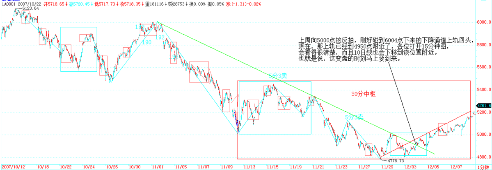

纯技术地说，或者就是突破上轨引发一次对6004点下来的总反抽，或者就是在总反抽之前再来一次空头陷阱，总之，这个反抽的到来已经是眼前的事了，唯一的区别，只是是否再来一次空头陷阱恐吓一下最后熬不住的人。

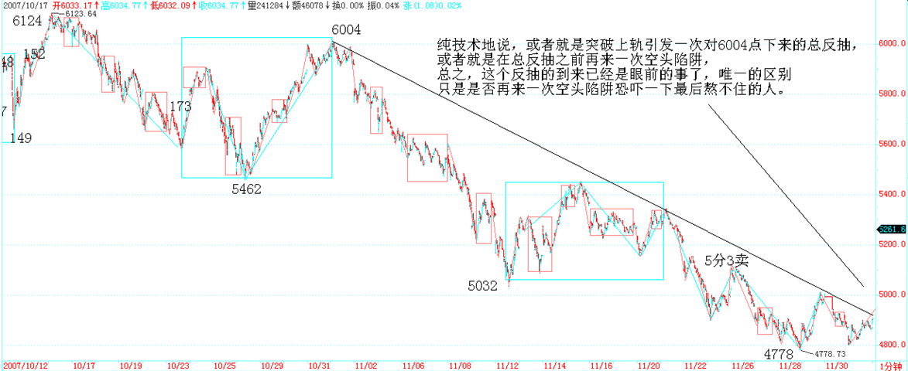

其实，站在个股方面，很多个股已经反抽不少了，指数走成这样，都是神油在做怪。不过那油也快破30了，第一基本目标也基本达到，唯一有变数的只是是否要破一下30恐吓一下最后的不坚定分子，这就对应了大盘是否要再走一空头陷阱的选择。

本ID曾经说过的个股，已经反复说过，一个都不会少地继续折腾下去的，其实有不少已经比大盘要提前走好了。其他个股，一旦大盘走好，都会有所反应的。

不过，这次反抽后，至少还有一次探底确认的过程。10月线，站在中短线角度，应该是比较重要的，至于下面，就是250天线的位置的，在跌破250天线之前，根本没有探讨牛市是否结束的必要。

中长线角度，目前，比较不明朗的是那经济会议是否有比较猛烈的措施，但无论那会议有什么措施，应该不会造成致命的影响，只是会被利用去清洗不坚定分子。

为了那收购的事情，某集团的头专门从香港跑过来，正在下面等着，本ID要去应酬一下，先下，再见。

## 教你炒股票90：中阴阶段结束时间的辅助判断

(2007-12-03 22:33:08)

注意，这里给出的是中阴阶段结束时间的辅助判断，并不是一个绝对性的判断，如同用MACD判断背驰一样，只是一个辅助性，但由于准确率极高，绝对的判断反而因为太复杂而不实用，所以就可以一般性地利用这进行判断。一般来说，这个中阴阶段结束时间的辅助判断的有效性可以达到接近100%，很少有例外。

当然，由于是辅助性判断，所以技巧性与熟练程度就很关键了。这就如同玩杂技，训练有素的上台出错的几率很小，而一个训练都没有的一上台肯定出错。

这个辅助判断，可以利用所有软件都有的一个指标：布林通道。一般在软件上都用BOLL表示。该指标一般都三条线，上、中、下三个轨道。一般性地，在上轨以上和下轨以下运行是超强状态，一般中枢移动时肯定会出现，唯一区别是前者是上涨超强，后者是下跌超强。

注意，用这个指标有一个很好的辅助判断第二类买卖点，有时候也可以用来判断第一类买卖点。一般来说，从上轨上跌回其下或从下轨下涨回其上，都是从超强区域转向一般性区域，这时候，如果再次的上涨或回跌创出新高或新低但不能重新有效回到超强区域，那么就意味着进入中阴状态了，也就是第一类买卖点出现了。

但更有效的是对第二买卖点的辅助判断，一般来说，在进入中阴状态，上轨和下轨都会滞后反应，也就是等第一次回跌或回升后再次向上或下跌时，上轨和下轨才会转向，而这时候转向的上轨和下轨，往往成为最大的阻力和支持，使得第二类买卖点在其下或其上被构造出来。一个例子，就是上海大盘在6004点时构成的第二类卖点，还有一个例子就是6月20日那天的第二类买卖点。

个股方面，000938是一个经典的例子，9月14日的第一类卖点，10月8日的第二类卖点，太教科书了。

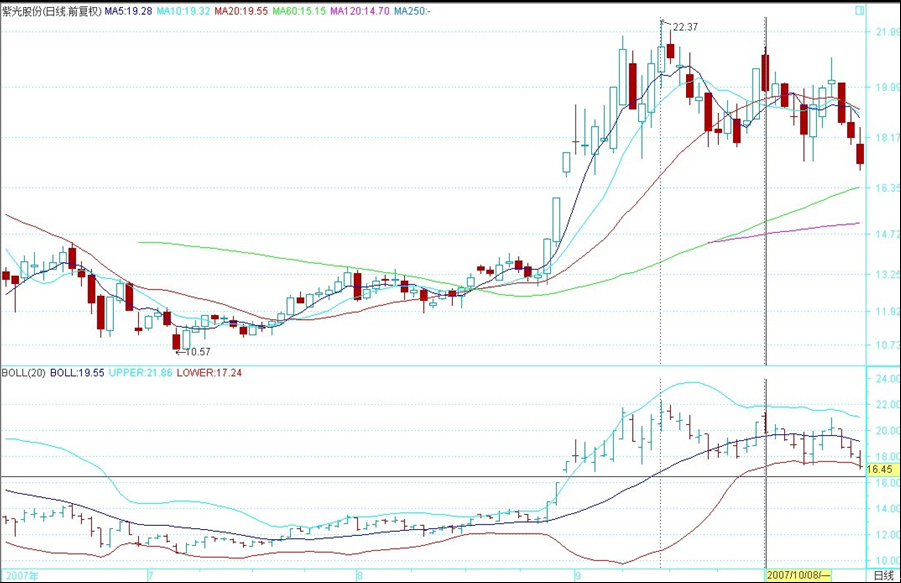

000999的10月10日的第一类卖点以及11月6日的第二类卖点，也同样教科书。这些例子太多，而且在不同的级别中都一样有效。

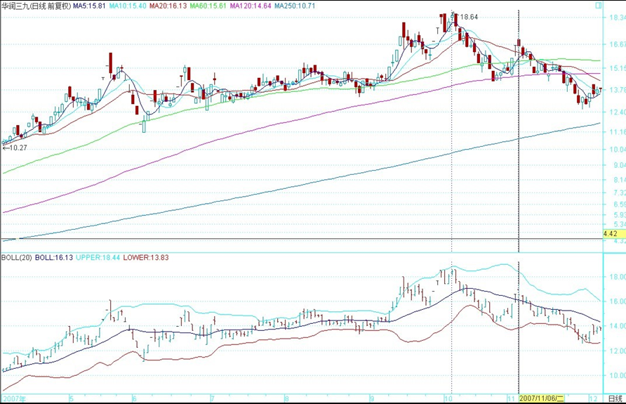

注意，有人可能说本ID上面那两个例子都是自己的股票，那肯定对。其实，别的股票更准确，例如000002，这股票够大众情人了，请看他的周线，40.78元那周，看看究竟发生了什么事竟然构成了周线的第一卖点？

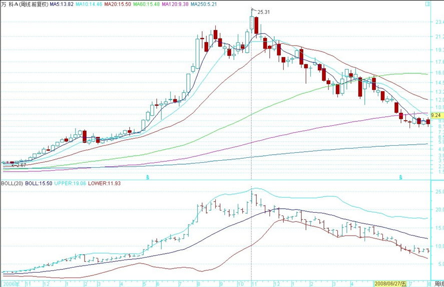

不过，布林通道最有用的，还是关于中阴结束时间的预判上。一般来说，布林通道的收口，就是对中阴结束时间的最好提示。但这里有一定的技巧性，不是1分钟级别就一定要看1分钟的布林通道的，例如下图，一个5分钟的中阴过程，对应的是看30分钟的布林通道。

一般来说，某一级别的布林通道收口，就意味着比这低级别的某个中阴过程要级别扩展或结束了，一般都对应着有相应的第三类买卖点。

INCLUDEPICTURE "http://static6.photo.sina.com.cn/orignal/4aeb5d15n8f6a0e6944f5&690" \* MERGEFORMATINET 

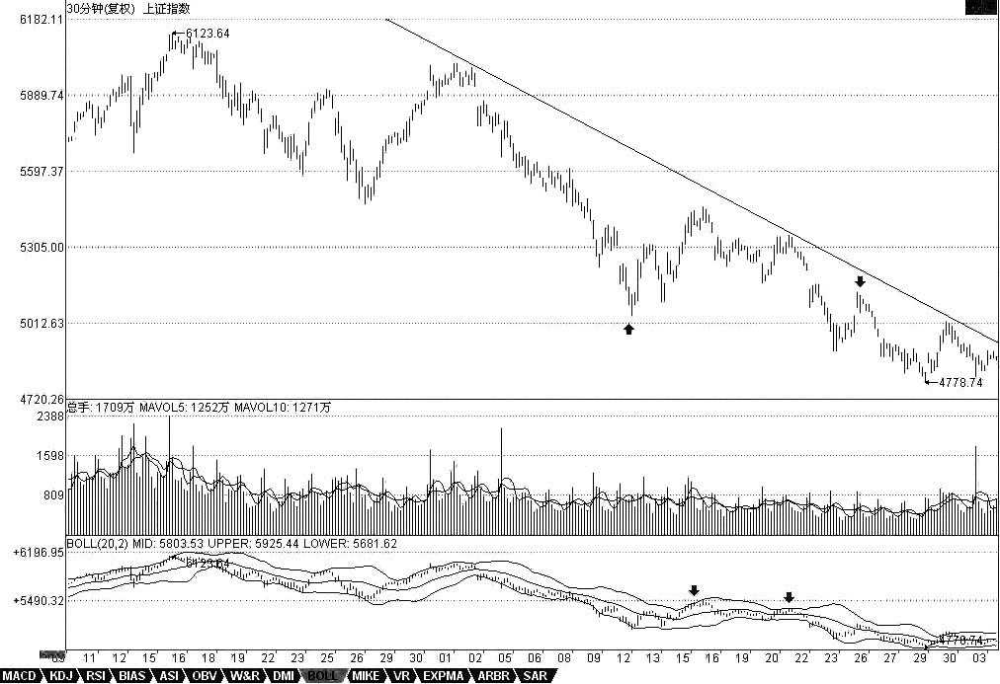

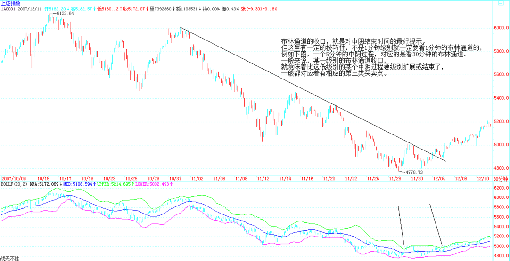

下图这个例子请好好研究一下，里面还有下午说的那条下降通道，可以看到，现在离这个上轨有多接近。

注意，这个辅助判断，比MACD那个技巧性还要高点，必须不断看图，自己去总结自己的经验才会有所得。本ID这里只是把月亮指给各位，要把月亮变成自己的，还需要自己去努力。

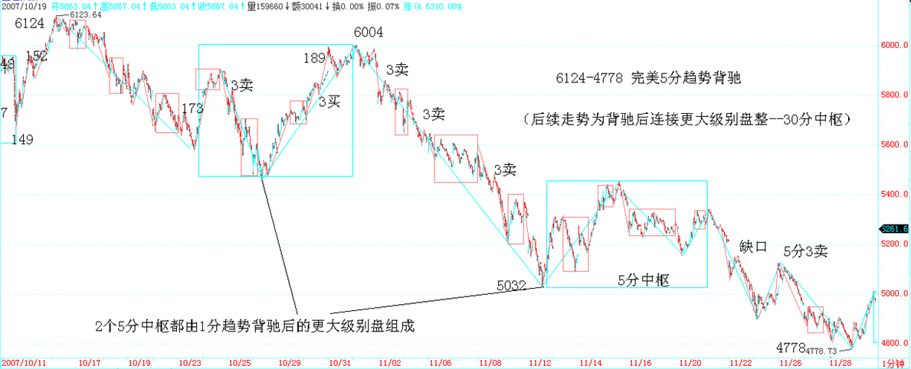

第93课读后感：

1、布林通道，布林通道的收口。

2、“一般来说，某一级别的布林通道收口，就意味着比这低级别的某个中阴过程要级别扩展或结束了，一般都对应着有相应的第三类买卖点。”

3、“本ID这里只是把月亮指给各位，要把月亮变成自己的，还需要自己去努力。”

[2007-12-04]突破回抽，明后是关键

(2007-12-04 15:29:26)

今天大盘略微发了点力，突破6004点下来的下降通道上轨，但受阻于10日线，不过其后的回落并没有跌回上轨之下，因此，暂时还是一个可接受的局面。一般来说，突破后需要3天确认，因此明后就是关键了。

其实，今天大盘之所以比较犹豫，就是因为昨天开始的那经济会议还没有明确的结论性东西，现在贸然发力，万一有什么不招人待见的东西出现，那不是自讨没趣吗？所以在这里突破反抽地耗点时间，并不是太坏的事情。

这会议的精神，很快就会明确，这决定了短线大盘的走势。但无论结论是怎么样，最终都会制造出一波针对6124点下来第一波调整的大反抽，这个结论是必然的。唯一的区别就是昨天所说的是否先有一空头陷阱的问题。

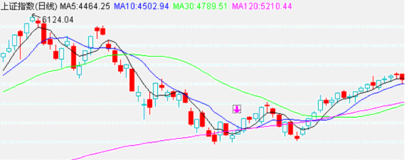

由于目前成交太小，市场本身的合力太弱，而消息的力量在这时候特别容易放大，所以走势上如果要特别细致地判断，不能忽视这会议消息的力量。但如果只需要知道大方向性的东西，那对这会议也无须太过看重，就算有什么特别的东西，也就多制造一个空头陷阱的问题。

大盘大反抽的最终确立，以10日线的站稳为标志。

个股方面，很多中低价格股票都开始启动了，所以指数的意义不太大，不过一旦指数启动，要小心又是9119地折腾。

对这个反抽的定性一直都很明确，就是反抽，其后还需要第二次探底去确认底部。当然，如果这次是先再一个空头陷阱再起来，这样下次的确认就不一定要再破底，因为可以走成所谓的双底，否则，破底并不是太奇怪的事情。先下，再见。

[2007-12-05]长阳突破10日线，大反抽确立。

(2007-12-05 15:20:16)

本来今天该用红字的，但为了让各位冷静点，还是用绿字比较好。毕竟，这本ID反复强调马上要来的大反抽后还至少有一个探底确认的过程，所以冷静是必须的。

不过，现在这反抽刚确认，我们还是先探讨这反抽本身的问题。昨天明确说了“大盘大反抽的最终确立，以10日线的站稳为标志。”今天早上前30分钟，这10日线就被攻克了，然后后面的上涨，就是顺理成章的事情了。

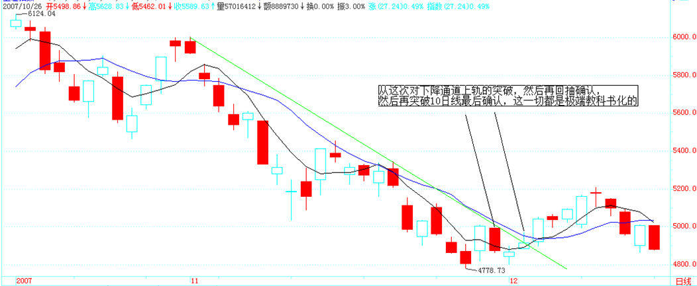

从这次对下降通道上轨的突破，然后再回抽确认，然后再突破10日线最后确认，这一切都是极端教科书化的，这种情况，在以后都会反复遇到。光这次对了没用，还要知道为什么，以后碰到类似情况就会处理了，不需要本ID再废话了。

明天，关键是5010点，这是这次小双底的颈线位置，只要这位置站住，那么就有攻击双底基本升幅的潜力。

站在中枢震荡的角度，前面本ID说5000点下的空头陷阱，最终要形成一个更大级别的中枢震荡，其实在重新站上5032点前，都不能说是事实。而今天，这玩意终于事实了。后面就看这个大级别的中枢如何震荡了。

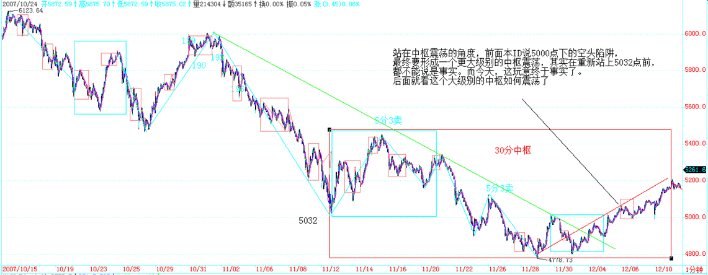

站在缺口的角度，日线上11月21、22日这个向下缺口的回补是必须首先要去完成的事情，如果连这都完成不了，那这反抽的力量就太弱了。

如果站在最好的角度，那么这个反抽如果能先到5462点，然后再回调确认，这样就构成一个小的头肩底形态，这是最有力量的走法了，当然，能否走成这样，需要多方面的配合。

总之，反抽确立后，就看着走势来，没必要事先把自己框在某种走势中，最好的操作，还是先以中枢震荡的观点，只是这次级别比较大，是30分钟的，因此只要次级别5分钟向上背驰了，就可以先出来看看，回来如果还能保持中枢震荡，那就重新进去。（当然，你手脚特麻利的，也可以看1分钟的。）

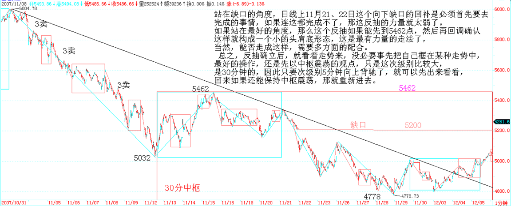

当然，看不明白的，就看5日线，只要5日线不破，那么大盘就继续保持反抽的潜力。

要去那恶心的太监村一趟，忒堵车，必须马上走了，先下，再见。

[2007-12-06]5010点的回抽确认

(2007-12-06 15:17:59)

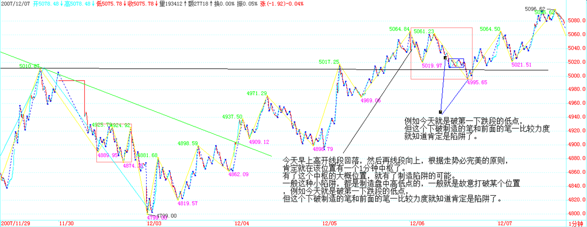

今天按昨天所说的，全天就是对5010点的回抽确认。其实，如果心思缜密的，就知道，今天下午突然下破5010点的走势，就是一个典型的小空头陷阱。

这里顺便上上课，前面说过，明白陷阱，你的技术水平就会高多了。什么是陷阱？陷阱必须由中枢而来，所谓陷阱，归根结底都是中枢震荡的结果。如果不是中枢震荡，而是中枢移动，那就不可能是陷阱，而是真陷进去了。

今天早上高开线段回落，然后再线段向上，根据走势必完美的原则，肯定就在该位置有一个1分钟中枢了。有了这个中枢的大概位置，就有了制造陷阱的可能。一般这种小陷阱，都是制造盘中高低点的，一般就是故意打破某个位置，例如今天就是第一下跌段的低点，但这个下破制造的笔和前面的笔一比较力度就知道肯定是陷阱了。

陷阱与非陷阱最关键的区别，除了是否中枢震荡外，就是力度上的前后比较问题了，这需要好好去研究，真研究明白，变成自己的直观，那才真有用的。

技术不说了，由于明天是周末，因此，那一直的周末心理效应就看有多大了，只要明天以及周一开始都能站住5010点上，走势就没什么问题。

在这个位置停留的最大心理意义在于，让犹疑的人有一个心理转变的时间，争取更多的人。反弹行情，就是一个逐步忽悠的过程，不可能是主力一直拉到底的过程，通俗讲，做反弹，就是要逐步掂上去，在一个新的水平，等足够多的人认同了，再掂高一点，等哪天认同减少或风声不对，就突然过河拆桥，这样，主力才有可能全身而退。否则都是主力自己拉，那不是送死吗？

技术不行的就继续看5日线。先下，再见。

[2007-12-07]5010点站稳，行情继续展开

(2007-12-07 15:17:09)

今天真没什么可说的，早上再次回试5010点，结果在5021点就被拉起，而且还是在周五，说明市场心态还是比较反弹行情的继续展开的，其后的走势，就是理所当然的事情了。

其实现在的走势，根本无须过于细致地看每天的盘，因为日线上一早就确定一定至少走一笔出来了，因此，在一个日线的顶分型确立之前，行情就会一直延续。而且日线上一笔过后，还可以看是否延伸出笔的上涨来，所以，只要行情不走出相应的形态，都可以持股待涨。

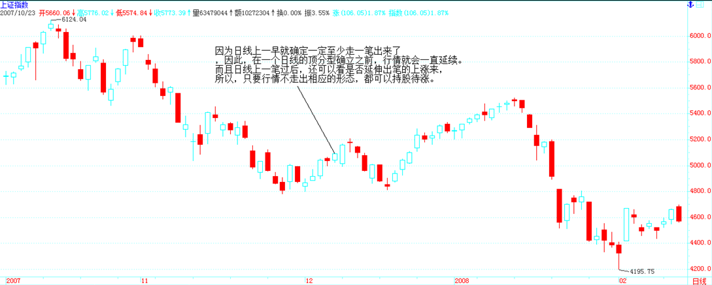

学本ID的理论，一定要学会不同级别的通盘考虑。

下周的关键，就是5周线已经能否制造周线的底分型。由于本周没到上周的高位上，只搞了一个包含关系，所以要底分型，还要看下周。

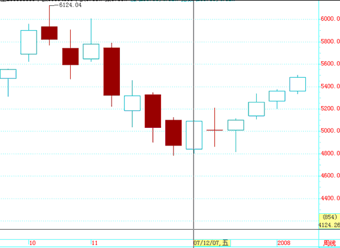

个股方面，没什么可说的，现在基本是普涨状态，因为很多前面做空的，都陆续有点回补，所以就比较平均。关键是突上去以后，就需要领涨板块了。所以普涨后是否形成领涨板块的市场共识，决定了行情最终的高度。

不说了，周末，出去腐败吧。本ID要去山里泡泡温泉，可惜北京一直没有雪，真怀念在雪地里泡温泉数星星的日子呀。先下，再见。

[2007-12-10]今天不是530

(2007-12-10 15:29:40)

今天不是530，为什么？你见过530北京下雪吗？既然北京都下第一场雪了，大盘当然也要放放血，见见红了。

不过，本ID这里还是要继续绿的，这是继续让各位冷静，别一见红的就太兴奋，那就要变成西班牙那被杀的牛了。

走势，没什么可说的，周五已经说了，如果连日线的第一个顶分型都没出现，那就别整天一惊一乍的，所以本ID这样要继续绿色，就是让各位节省点能量，环保点。最节省能量的办法是什么？就是买点介入后，一直持有等待卖点。而日线笔的成立意味着，如果盘中那些一惊一乍的活动不足以制造顶分型，那就继续睡觉，等出现日顶分型再起来看看是否能有效跌破5日线确立。

当然，如果你手脚特麻利，就利用1分钟的走势去换股或打差价操作，不过反弹的第一轮是普涨为主，因此换股操作难度要大点。

后面的任务就是前面已经说过的第一目标，把缺口给补了，今天补了一小部分。完成第一任务，再站稳，然后再看第二任务，饭要一口口吃，人要一拨拨骗，这就是反弹的要点。

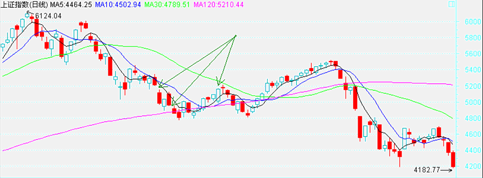

本ID这一年以来说了不少股票，但唯一两只是声明是给各位赚学费的。一只是6元时候的000999，那是去年12月的事情。第二只就是今年下半年的600737，当时价格是8元。现在，000999且不说了，600737现在有谁还能从8元一直拿到现在？

提一个思考题，2008年，本ID继续看好的是有色、钢铁、奥运、环保、农业、中字头、整体上市、军工等等的股票，你说者600737属于哪一类呢？

让梦想继续照进现实，面包会有的。先下，再见。

[2007-12-07]私人股权投资中的一些现实问题

2007-12-7 20:32:38 选自《木子视点》

中华人民共和国《合伙企业法》在6月1日开始实施，其后就有了与私人股权投资相关的有限合伙企业这种新生事物在各地出现，到目前为止，全国大概已经有了10来家类似企业。与本栏目同名的青岛木子创业投资中心属于其中最早的几家之一，如今其业务已取得了重大进展。现将期间遇到的一些现实问题的思考，与对股权投资有兴趣的投资者进行分享。

青岛木子创业投资中心是严格按新实施的《合伙企业法》在2007年8月注册成立、国内第一家严格按照私人合伙企业的国际惯例成立并严格实行市场化运作的有限合伙企业。企业多名有限合伙人都是大型民营企业的董事长，在各自领域都具有领先的行业地位，两名普通合伙人在资本市场都有十几年的具体运作经验，完成了诸多的一、二级市场项目。企业主要业务方向为投资符合IPO上市条件的拟上市企业、投资上市公司定向增发的股票、投资IPO公司的战略投资、参股进行股权投资的政府引导型基金及管理公司等。

为了企业的稳健发展以及能保持长期的发展后劲，我们设计了如下商业模式：以政府引导基金为主要投资平台对当地优势企业进行可控制性的股权投资。这种商业模式的好处在于，当地最优秀的企业都能成为我们的投资对象，并且在当地政府支持下，我们可以根据市场与经济发展的要求稳步培育出大量的符合上市条件的优秀企业。

股权投资，投资只是最简单、最初级的一步，关键是投资后能否有充分的支持，为企业上市条件的准备提供全方位的服务。企业上市，赢利等经营性指标只是一个很基础性的问题，更困难更重大的问题是一些复杂的软性困难。这些困难，如果没有当地政府的支持，都很难得到解决。而我们的商业模式，一次性地解决了这些困难。很多企业入股改制很快，但上市途中问题很多，往往就在众多的软性问题上得不到当地政府的支持而困难重重，而一旦投资了这种企业，将面临很大的投资风险。

但更关键的是，股权投资不能用乱砍乱伐的模式进行掠夺式发展，现在绝大多数的股权投资企业，并没有在上市资源的培育上下功夫，功夫都用在争夺现有上市资源上了。这种掠夺式发展模式是不可持续的，也是我们所不齿的。

目前，我们已经完成了与中国最大的风险投资与股权投资企业深圳市创新投资集团及萍乡市政府共同组建萍乡创新资本创业投资有限公司的所有事宜。萍乡创投首期1亿元，其中我方占30%，深创投占40%，萍乡市政府占30%，三年内将扩展为3亿元。

由于在实际投资中，引导基金只发挥引导的作用，因此对具体企业的投资中，我们实际的投资额将远远超出在引导基金里的投资。

萍创投已与江西永特合金有限公司、江西强联电瓷有限公司、江西永泰化工有限公司签署投资意向，申银万国等中介团队也已进入开展前期的相关工作。另外，萍创投还与江西希尔康泰制药有限公司、江西安源化工填料有限公司、萍乡新安工业有限责任公司、江西联达冶金有限公司达成基本投资意向。

当地的企业，在行业上都很有特色，为这些项目的最终运作成功提供了最基本的保障。我们的目标不是单单把这几家企业运作上市，而是有着更长远的打算。当地还有很多特色行业可以进行培养，因此，这里可以成为一个很有潜力的上市资源储备源而实现可持续发展。

我们下一步的投资重点将是复制萍乡模式，有几个城市的政府引导基金已在探讨与推进中，相信这种模式将为我们企业的长远、可持续发展提供最稳固的保障。

现在股权投资领域存在的最大问题就是急功近利，很多人不希望做切实的企业培养工作，都急于所谓肯定上市股票的倒卖中，很多未上市的股票，都被炒飞了天，本来1元钱拿到的股票，有些甚至被炒高十几二十倍。投资这种企业，股权投资成了一种纯粹的炒卖行为，这里蕴藏着巨大的风险。

站在市场建设的角度，专门从事股权投资的企业，就是要立足于与投资企业的一同成长，发挥自己资金、资源等等方面的优势，共同培育出真正的好企业，这样，上市只是一个顺理成章的结果，而不是一个机关算尽的过程。

中国的资本市场需要好的企业，而专门从事股权投资的企业，就是要立足于为资本市场发现、培育真正优秀的企业，而好企业越多，资本市场的发展才会越健康、前景越远大，而股权投资才能获得更大的收益，这样才能使得股权投资与资本市场的发展有了一个好的良性循环。

[2007-12-10]请中国的经济管理层先学会中医吧

(2007-12-10 21:16:19)

10月的时候，本ID写了这样一个帖子“中国经济，已需治理整顿。”，其实，懒得说的缘故，写的时间已经够晚了，但那时候对于某些人来说还是太超前了。那么，两个月后的今天，这一切已经逐步成为现实。

当然，10月的时候，大家忙着解决的是政治问题，没人有时间搭理这经济问题，能在12月有所反应，其实效率已经相当高了。就像你去医院看病，如果你很不幸需要挂号排队，没有任何后门可走的，那在前门排队，排到不死是你的运气。北京那几个最著名的医院，得急病而能靠挂号找到所谓名医生看病的机会比中国队拿世界杯还要小。

说到医生，不免要说说中医，现在很多傻蛋，连中医是什么，怎么看病，什么机理等等都没搞清楚就喷口水，这种人拿去做人肉包子都嫌太次了。

世界上的一切都是合力的结果，人的病也是。股票是一个简单的系统，其可能的结果无非三种：上平下，而其他的事情，就复杂多了，例如人的身体毛病，从任何一个点开始，其后的可能状态都不会只有三种。你不可以用“上平下”这三种状态来描述人的身体状态，这样太粗略，没有任何的可研究与操作性。

中医，其实和本ID的股票理论有类似的地方，不过，对传统的中医，本ID有诸多修正的地方，以后有时间再说。如果用统一的视角来研究股票和人体，那么，股票就是一个合力后有三种可能状态的系统，而人体是一个合力后有超越三种以上状态的系统。

经济也是和人体是类似的，如果没有中医的视角，那么，连人的毛病都搞不懂，又如何懂国家、经济的毛病？治病、治国，道理是相通的。

本ID股票理论中，第一类买卖点，就是治其未病；第二类买卖点，就是治其欲病；第三类买卖点，就是治其已病，这也是和中医相通的。

那么，这未病-欲病-已病的道理，对于经济也是一样的。以这个标准来衡量国家的经济管理者，究竟是上工还是下工甚至是废物，就有一个很客观的标准，这个标准，不是谁吹牛就可以忽悠的，这标准，客观在那里，十三亿双的眼睛都可以看到。

当然，只要是“治”，就有一个手段问题，所谓的无为而治，其实是狗屁玩意。经济系统，并不是天然完美的，所谓的无为而治的前提是假设一个天生完美的系统，自然地就可以调理、协调，这在所谓的极端自由主义经济原教旨忽悠人才那里，大概现在也不敢说经济系统有如此的神功。

对于人体、经济这样比股票更复杂的系统，就不能把合力简化成单纯的一个方向性的力量。在那些复杂的系统里，合力也是系统性的，有着多维非线性的力量取向。因此，相应的对治，必然也是要多维非线性的。

本ID极端怀疑，一个股票都操作或操纵不好的人，也能当一个国家的经济管理者。因为股票是一个单维线性的系统，就是买和卖两种力量，比起经济和人体简单十亿万倍，连股票都整不明白，还整经济？可笑。

[2007-12-11]反弹剧本第一目标胜利完成

(2007-12-11 15:33:37)

前面4800点说要反弹时，给了一个剧本，第一目标就是回补5200点这个缺口，今天总算胜利完成了。下一个目标是什么，前面可也说了，如果不知道，那是看帖子不认真，本ID可没有义务重复说。

今天完成补缺任务后展开震荡，一个完美的1分钟中枢也就此构成，尾盘在1分钟中枢的第三分线段结束后重新拉回5151点之上，就确认了这个震荡中枢的有效性。后面，5151点是一个关键位置，只要能围绕着震荡，就不会有大问题。

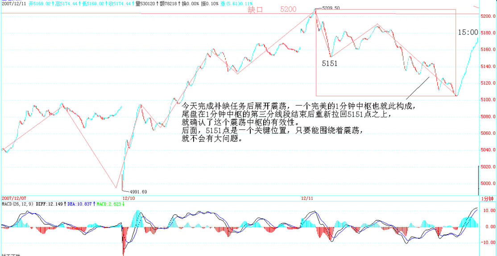

现在的操作，十分简单，大的可以继续看日线上的笔是否结束来决定卖出。手脚麻利的，可以利用这个震荡进行换股或打短差。没感觉的，就继续看5日线。

从稳健的角度，在这个位置震荡长点时间，骗多点人进来，有利于以后走得更高。如果太急，那可能就很快夭折了。

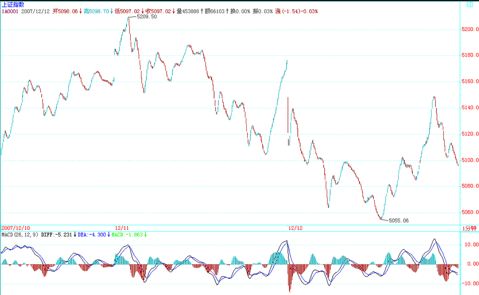

这几天，把本ID曾说过的股票都再分别说一次。注意，本ID说的股票，都是长线角度说的，你要充分理解本ID的理论才能发挥最大的效力。由于本ID现在比较乖，都是组合形式地操作，不会干在一只股票上买个90%筹码之类的活动，所以组合的股票比较多，一般的散户，可以按照股票池的观点来看，没必要在一棵树上吊死，如果能选择好轮动的节奏，那效果是最好的。当然，没这本事的，宁愿来是吊死在000999、600737之类的股票上算了。

600737，当然不会是单纯的农业股，属于什么牛板块，现在还不能说，说了会出毛病，以后就知道了，知道就会明白，8元的600737，简直比冬藏大白菜还便宜。

000999，以后可能牛得不得了，现在，没办法，谁让股改都没完成？就算不相信本ID，也应该相信曾搞掂万科的公司。

600195：垄断性公司，以后的牛闻不断，不过里面无聊人不少，否则怎么会只有现在的价格。

600779：现在的价格绝对是一个悲剧，怪就怪某些人拿得太多。

000915：创出6100点以来新高的股票不多，为什么他是？本ID在这里说的时候，只有3元多点，以后如果能翻10倍以上，并不是太奇怪的事情。

600635：本ID是在除权前的5元说的，等于现在的3元多，这股票当然是要10倍以上的，就一个PE概念已经足够。

000938：这股票当然不只PE一个概念，而且总体涨幅不大，以后会报仇的。在中国，连清华都不相信，你还能相信谁？

000822：该说的很多，但很多都不方便说，说了要出毛病。唯一可以说的，第一次到18元，该拿货的人都没拿着，大盘6100点的大跌，真是缘分哟、谢谢啊。

每天说8只，其他曾说过的都在后两天说上，等等吧。先下，再见。

[2007-12-12]第一目标达到后的例行休整

(2007-12-12 15:33:01)

昨天达到反弹的第一目标后，今天出现例行的休整，本就是天经地义的事情，和外围以及基本面因素都关系不大。

昨天给了一个判别休整强弱的重要点位，就是5151点，显然，今天开盘就跌破且反抽不上，就明白无误地告诉各位休整的弱势性质。5151点依然是后续关键的位置，在站稳该位置之前，大盘不可能重新走强。

由于大盘采取了弱势休整，用本ID的理论语言，就是休整将和前面5010点那次1分钟级别的中枢震荡一起扩展成了5分钟级别的，因此，震荡的区间就自然从这个大的震荡着眼。

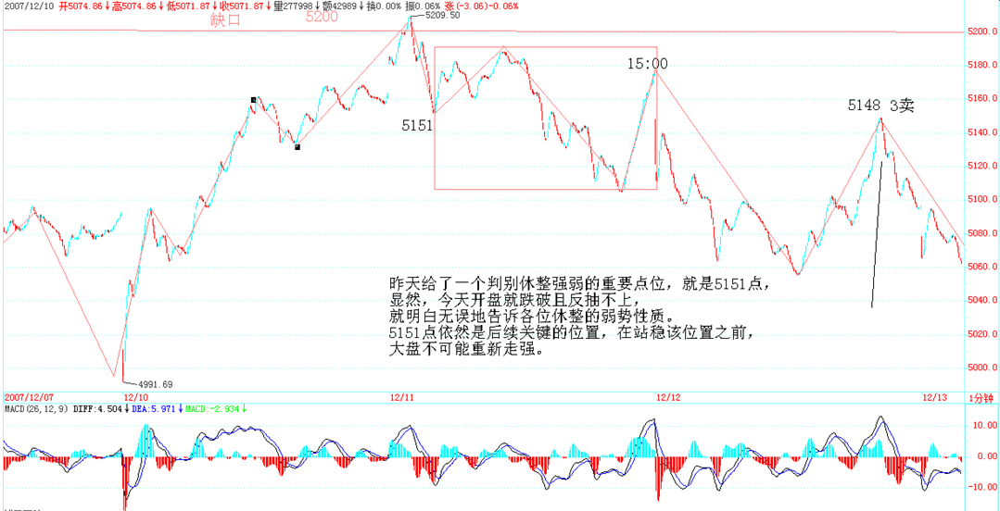

日线上，因为今天顶分型形成，但5日线并没有确认有效跌破，因此，并不能马上断言这个休整必然在日线上留下向下的笔，所以明后两天的5日线是关键，一旦有效跌破，那么休整将至少形成向下的笔，也就是至少要等到底分型出现才会结束。

不过大盘的走势其实已经很不重要，很多个股已经完全和大盘没关系。而且大盘只要能保持这5分钟的震荡，即使再扩展为30分钟的，只要不出现向下的第三类卖点，最终大盘依然要向上继续反弹的。

如果你的股票已经出现周底分型的确认，那么就以5周均线为参照持有就可以，不必太注意大盘的震荡。当然，如果你手脚特麻利，那就可以来回短跑，一般人就算了。

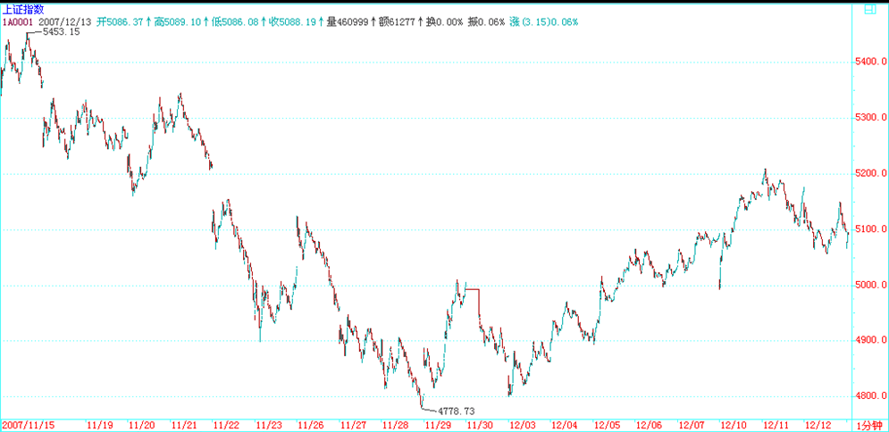

注意，昨天说把原来说过的股票再点评，并不是推荐你现在去买。买与不买，图形会告诉你，本ID只是从长线的角度点评这些股票的基本面情况。由于很多股票都是N个月前推荐的，绝大多数涨幅都很大，所以如果不是一路游戏上来而且胆子比较小容易受刺激的，就观看算了。

600343：也快创历史新高了，军工、整体上市，诸如此类的概念。

600078：这股票关键是地底下的玩意，一个寻宝游戏，首先来回折腾，等地底的宝藏给承认了，才会有大行情。

600777：开始是里面人太多，后面是和上市公司没协调好，不过问题总会解决的，解决了，自然就好起来了。不过一路打架上来，也涨了N倍了。

600649：5元的时候说，现在N个月后，也翻了几倍了。一直在高位之上站着，就一个水资源概念就足以站住了。唯一的风险是，万一大盘反弹后，有补跌的压力，但站在长线看，根本不算什么。

000802：光这个名字就足以让这股票在2008年风光了，这有什么可怀疑的？

600578：环保、整体上市、奥运等等概念，虽然说以后涨了N倍了，不过2008年应该不会差的。

601111：说的时候3元不到，然后李军人李军人地说到今天。2008，你说如果连李军人都没戏的话，那还怎么2008？

000777：说的时候是8元，如果这个故事都能展开，80并不是太过分吧。长线看，如果整体上来，中船可以300，那么这中核两个字，是不是要值800？先下，再见。

[2007-12-14]顶分型确立显威力

(2007-12-14 00:49:00)

刚回家，喝了不少，还行。看看时间，已经是明天了，本想早上起来再说股票，趁着有点酒劲，现在就说说。

昨天早上反抽不上5日线，顶分型确立。当然，顶分型确立，并不一定要拉出长阴线，但更不一定不拉出长阴线，10条短阴线与一条长阴线，只要不出现底分型，最终都只是指向一个向下笔的过程。而站在本ID理论的角度，只关心买卖点的结果，并不关心过程。

一个顶分型跌破5日线，就是未病-欲病-已病模式中的最后一个已病了，既然已病了，就只能等大盘病好，病好的日线标志就是底分型。站在中枢震荡的角度，昨天说了，5010点那次的中枢震荡扩展成一个大的5分钟中枢震荡，今天的下跌，暂时没有把这个中枢震荡的第三类卖点给震出来，所以，只要不出现这个卖点，那么一切依然保持在基本的中枢震荡中，当然，如果出现了，那么大盘跌破上次低点的几率就极大了。

站在中枢震荡的角度，第三类卖点是典型的已病了。第一等的高手，是未病就下手了，第二等的高手是欲病就下手，等到已病，那确实有点不太高明了。

当然，对于这样的反弹，如果操作不过来的、心态跟不上的、手不够狠的，最安全的无疑还是正确光荣伟大的小板凳，有时候，休息几个月并不是什么坏事，这点是反复强调的了。

不过，站在周线的角度，暂时还没有破坏可能形成的周的底分型，而下周5周均线将继续下移，一旦站住，大盘仍将继续反弹。所以，今天的走势很关键，今天只要不跌破4778点，周线上至少还不太坏。上周五已经说了，本周的任务是构造周线的底分型，能否成立，就看今天了。

个股上继续说原来说过的个股。注意，已经反复强调，说这些股票并不是让各位现在还去买，因为买与不买关键是看有没有买点，有多大级别的买点，没有买点去买，那是有毛病。本ID点评这些股票，只是从长线的角度说，别糊涂了。

600139：这股票叫等比，当时的闹剧估计很多人还记得。你可以叫它妖股，但妖总有妖的理由，关键你是否好的猎手。这世界上，很难找到9元多快速上涨到24又快速跌到12的股票了，这才是最好的股票，为什么？震荡够大，差价够狠。没这技术的，请远离。

600569：这也是一只折腾不少人的股票，最大的题材，还是整体上市与收购，股性比较顽皮，没技术的远离。

000998：农业股的问题就是概念好，但业绩跟不上，所以暂时只能大箱型折腾，等待大的业绩、题材突破机会，站在长线角度，总要牛起来的。

000416：这是一个典型的兴奋过度例子，说的时候3元，不到5个月飞奔到了18元，然后就是痛苦的调整，短线关键是业绩关，长线总是要反复被折腾的，为什么？股性在那里，里面折腾的人的个性在那里，当然，大突破需要等待一个时机。

000778：看看股东背景，就知道这股票天生就是要被折腾的。涨了4倍，休息一下也是应该的，中线大箱型整理，等待突破契机。

000099：和000778一样，一个特殊的大股东，一个特殊的行业，总要被折腾的，中线也是大箱型整理，等到突破契机。

600432：从20元不到冲到132，时间也就九个月，休整一下很应该，中长线当然没问题，有色的世界行情只要不倒，这是不用讨论的。

600234：本ID喜欢股票代码好玩的股票，有了600432，当然需要600234，而且一个等差数列，与前面的等比也要有一比。ST的股票，没技术的人别乱碰，这里玩的就是基本面的大改变，这里有不确定因素，因此才有大的投机价值。晚安，再见。

[2007-12-14]周底分型构成待确立

(2007-12-14 15:48:40)

上周给了本周一个任务，就是去构成周底分型，今天早上也特别强调这一点，现在任务算是完成了。下周的任务也先给出，就是去确认周底分型的确立，技术上十分简单，就是5周均线站住。

前面已经明确说过了，现在是5010点扩展出来的5分钟震荡，今天早上，一个完美的5149点下来的下跌段的背驰，然后就开始对5010点在中枢的震荡回抽，这都十分技术化。当然，这些走势的操作，需要比较高的技术把握，如果没这技术的，就算了。

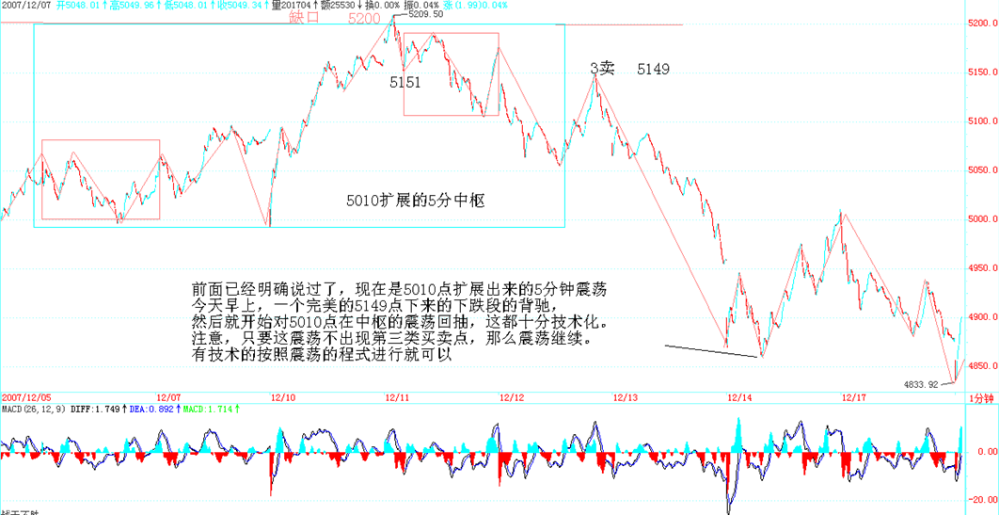

注意，只要这震荡不出现第三类买卖点，那么震荡继续。有技术的按照震荡的程式进行就可以，那程式是什么？课程里反复说过了。

周一，从日线上看是能否形成底分型，如果成立，然后周二以后是对这底分型的确立，也就是能否站住5日线的问题。一旦确立，这向下笔就完成了。然后就看后面的向上笔能否带领出周线的向上笔了。当然，所有的前提都是周一能够构成日的底分型。

本ID对没学会的人，已经很给面子了，600737让那些没学会的一棵树吊死，如果都办不到，那本ID也没办法，自己磨练去吧。不经历点痛苦，怎么能学到好东西？

本ID这里是一个训练场所，本ID更象一个教练，本ID这里其实没什么，密在汝边。

周末，不想说太多股票，把以前说过的股票最后几只都说说。

600594：去年底，本ID说看好医药和钢铁，后来医药股里出了不少黑马，这股票不算黑马，涨幅也一般，还需要努力。

600607：本ID叫这是汉奸股，要吸其血。后来24元上说走人，但中线还要折腾。

600375：这股票震荡也不小，主要问题是公司治理有问题，如果这问题解决，这股票不会比三一差，现在只能耐心等待问题的解决。

600319：这和上面的问题一样，有投机性题材，机会一到，自然爆发。中线暂时箱型震荡。

600636：现在盘子稍微比前几个月干净了点，题材业绩概念都不错，就是盘子太脏，慢慢洗白白，洗干净自然就表现了。

000600：涨了4倍后休息一下，整体上市之类的题材，中长线没问题。

000021：好股票总要表现的，不过科技股不是现在的主流，但70元的历史高位，对于长线角度，并不是特了不起的位置。

000338：中国一个大行业的控制性企业，光这点就决定了其长线的价值。

002149：上市时短炒了几天，然后先走了。后来在答疑的时候描述过这类股票的中长线建仓手法，现在的走势基本按这剧本，当时说最好能到10几，估计有点难度，如果真有这些价位，那肯定是无敌风火轮了。砸的狠，往往是爱之深，想吃到中长线的便宜筹码，如此而已。公司基本面很好，最不好就是中长线的筹码很难买够。

000807：并购题材，这种题材的变数比较大，不过这股票的有色背景，使得业绩是有保障的，可以算是有业绩支持的投机。

中字头：中驴、中国人兽，中石头，中联通等等，这都是本ID两个翅膀中的一个。中联通一旦中移动回来，疯一次是很应该的。另外，整体业务的上市、整个电讯重组，都是很大的题材。其他几只，都是长线的好股票，只是中线上，前面发力过大，如果没有股指期货刺激一下，不会太过疯狂。

周五，累了一周，本ID也要去腐败腐败了。先下，再见。

[2007-12-17]抛弃指数，冰火两重天。

(2007-12-17 15:30:15)

今天，并没有构成日的底分型，只是制造了一个典型的包含关系。由于离周五低位很近，所以只要明天比周五低，那么就意味着5209点开始的下跌笔依然要延续。

其实，根本无须等到收盘才知道底分型不能构成，因为要构成底分型，首要，是要比周五的最高位置还要高，而大盘开盘就低开，因此，只要大盘不红盘，怎么折腾都可以去睡觉，而底分型都不能构成，当然也是一个睡觉的局面。

不过，这只是从大盘来说，个股方面，冰火两重天，本ID前面已经说过，有些真有题材的股票，不会搭理大盘的走势的，大盘越没方向，反而给部分股票以表现的机会。操纵股票的，也需要有点营销手段的，现在快2000只股票，要大家有印象，当然是需要点手段的，而逆势而走，往往就是最省事的办法。现在资金这么多，犯贱追高的人也少不了，现在敢于表现，是不会没有回报的。

由于目前在周线上，周的底分型没有被确认，而日的底分型又没有被构成，所以后面就是首先等日底分型的构成，这是必须首要完成的。当然，周线的底分型如果最终不能确认，那么大盘无疑就必须面对再次的破位，一个必然的事情就是，大盘要走出中级的底部，一个必要的前提就是周底分型的确认，如果这位置确认不了，也会下一台阶却构成并确认，这是技术上的必然要求。

站在5010点上下的中枢震荡来说，现在要面临着出现第三卖点的巨大威胁，一旦第三卖点确认，大盘新低是不可避免的。因此，对于多头来说，后面几天是唯一可以去努力的时间了，否则，将必然面对被再下一城的现实。

当然，对于如本ID一样的，就根本不关心什么破烂指数，抛弃指数，大玩冰火两重天，这并不是太坏的事情。当然，如果大盘跌得太狠，偶尔也需要避避风头，但有一点是肯定的，就是明年的生意都要做的，要做生意，年底开始就要准备了，否则明年的营业额怎么保证？先下，再见。

[2007-12-17]

本文由公众号 “三思复盘”  整理

PAGE - 21 -
