## 教你炒股票91：走势结构的两重表里关系1          (2007-12-17 21:40:15)

判断走势，如同中医看病，未病而治的是第一等的，次之的是对治欲病，到已病阶段，那只能算是亡羊补牢了。但绝大多数的人，病入膏肓了还在幻想，市场里最终牺牲的，总是这种人。

级别的存在，可以比拟成一种疾病的级别，1分钟的可能是一个小感冒，而有时候一个5分钟的下跌就足以是一个小的感冒流行了。至于30分钟、日线的下跌，基本就对应着一些次中级或中级的调整，大概就相当于肺结核之类的玩意。而周线、月线之类的下跌，那是什么就不用说了。如果是季线、年线级别的下跌，就算不是死人一个，也至少是植物人了。

未病-欲病-已病，对应的界限就是相应级别的第一、二、三类买卖点，注意，对于上涨来说，踏空也是一种病，涨跌之病是相对的。

如何诊断出这病所处的阶段，这和中医的道理是一样的。例如，肺和大肠相表里，注意，中医里的肺不单单指西医那叫肺的玩意，而是相应的一个功能系统，例如，鼻子就属于肺这个系统的，因此，鼻子的毛病，可能就和大肠相关系着，而在西医里，这两样东西无论如何都是不搭界的。

而在走势中，当下的走势，就对应着这样类似的两重表里关系。在我们前面所讨论的走势分解的配件中，有两种类型：一、能构成中枢的。二、不能构成中枢的。

第一种，包括线段、以及各种级别的走势类型；第二种，只有笔。笔是不能构成中枢的，这就是笔和线段以及线段以上的各种级别走势类型的最大区别。

因此，笔在不同时间周期的K线图上的相应判断，就构成了一个表里相关的判断。越平凡的事情往往包含最大的真理，一个最简单的笔，里面包含了什么必然的结论？一个最显然又有用的结论就是：

缠中说禅笔定理：任何的当下，在任何时间周期的K线图中，走势必然落在一确定的具有明确方向的笔当中（向上笔或向下笔），而在笔当中的位置，必然只有两种情况：一、在分型构造中。二、分型构造确认后延伸为笔的过程中。

根据这个定理，对于任何的当下走势，在任何一个时间周期里，我们都可以用两个变量构成的数组精确地定义当下的走势。第一个变量，只有两个取值，不妨用1代表向上的笔，-1代表向下的笔；第二个变量也只有两个取值，0代表分型构造中，1代表分型确认延伸为笔的过程中。

例如（1，1）这就代表着一个向上的笔在延伸之中，（-1，1）代表向下的笔在延伸中，（1，0）代表向上的笔出现了顶分型结构的构造，（-1，0）代表向下的笔出现底分型的构造。

任何的当下，都只有这四种状态，这四种状态描述了所有的当下走势。更关键的是，这四种状态是不能随便连接的，例如（1，1）之后绝对不会连接（-1、1）或者（-1，0），唯一只能连接（1，0）；同样，（-1，1）只能连接（-1，0）；而（1，0）有两种可能的连接：（1，1）、（-1，1）；（-1，0）有两种可能的连接：（-1，1）、（1，1）。

有了上面的分析，我们就很容易进行更复杂点的分解。考察两个相邻的时间周期K线，例如1分钟和5分钟的。如果5分钟里是（1，1）或者（-1，1）的状态，那么1分钟里前面的任何波动，都没有太大的价值，因为无论这种波动如何大，都没到足以改变5分钟（1，1）或者（-1，1）状态的程度，这里就对1分钟的波动有了一个十分明确的过滤作用。如果你是一个最少关心5分钟图的操作者，你根本无须关心这些无聊的波动。

此外，如果5分钟是（1，1），1分钟也是（1，1），那么，5分钟是断无可能在其后几分钟内改变（1，1）模式的，要5分钟改变（1，1）成为（1，0），至少要在1分钟上出现（1，0）或（-1，1），而在绝大多数的情况下，都是必然要出现（-1，1）的。

因此，站在病的三阶段判断的角度，对于5分钟的笔状态，1分钟的笔状态的可能导致5分钟笔状态的改变，就是一种未病的状态。例如，对于5分钟的（1，1），1分钟出现（1、0）是一个小的警告，但这个警告如果只出现在1个5分钟的K线里，那么不足以破坏5分钟的结构，所以这个警告不会造成实质的影响，但如果这个1分钟的（1，0）被确认了，那么一个重要的警告就成立了，这就是将向欲病发展了。

但这个1分钟的（-1，1）出现并导致5分钟的（1，0）在形成中，就是一个欲病向已病发展了。当5分钟的（1，0）也确认向（-1，1）发展时，就确认已病了。

这种分析，同样可以应用在日线与周线的关系上，例如最近大盘的走势，在周线上出现（-1，0），而日线上目前是（-1，1），这种状况是下跌里第三恶劣的情况，因为最恶劣的是周线是（-1，1），日线也是（-1，1）；次恶劣的是周线是（-1，1），日线也是（-1，0）。对于第二、三恶劣的情况，技术高的也是可以去操作的，至于对于最恶劣的那种，就算技术高的，也算了。目前，首要等待的就是日线出现（-1，0）的信号，而如果这信号出现时，周线还能保持（-1，0），那么就会出现第四恶劣的情况，也就是有可能出现转机的情况，是否出现，大盘走出来就知道了。而目前的大盘处在最微妙的时候，为什么？因为一旦日线的（-1，1）延续到打破周线的（-1，0），这样就会变成最恶劣的走势状态，也就是周线（-1，1），日线也（-1，1）。换言之，目前的大盘只面临两种选择，第1恶劣还是第4恶劣，如此而已。

为了记录，我们可以随时给大盘开一个即时的病情记录，这个记录是一个矩阵，按1、5、30、日、周、月、季、年的级别分类，这矩阵有8行，每一行就是对应级别的状态数组，这矩阵可能的情况就有4的8次方个，一个相当大的数字，代表了走势所有可能的状态，也就是所有病的状态。

当然，用巨大的计算机，我们可以实时监控所有股票的病情。注意，每一种状态后并不是随机到任何另一种状态的，可变的状态是极为有限的，从中，可以分析出可能变化状态中出现最大可能赢利的转折状态，这种转折是必然的。然后用大型的机器监控所有股票，在相应的状态买入，相应的状态卖出，一部自动赚钱的永动机器就构造成了。

关于那些状态的转折效率是最高的，这是一个纯粹的数学问题，知识是有力量的，这就是一个例子。

当然，对于一般人来说，完全没必要去制造这样的机器，研究这样的问题。因为我们完全可以只关心三个连续的级别，例如，1、5、30分钟，然后这就对应着64种状态，这里，就和易经联系上了，很多人用易经研究股票，都是糊涂一通，其实，真要用易经研究，就从这下手，这才是正道，这个以后慢慢说。

可能不少人对日分型、周分型，这笔那笔地搞得晕，这其实是最简单的情况了，现在很少有好的中医，因为学医的看到这生那克的，那里这表的都晕了，所以中医的前途堪忧。不是中医有什么大问题，而是现在笨人、一根筋的人太多了。

当然，光是笔这重表里关系，不足以精确地诊断市场走势，这就象光搞清楚肺和大肠的关系，是治不好人的。可能在这重关系中的未病，站在别的关系下就看出已病来了。因此，必须再研究另外的表里关系。

更重要的是，不同的表里关系，之间还是有生克关系的，就如同中医里不同系统间的生克关系一样，只有在这个层面上，才能算初步沾了一点诊断的边。

后面这些问题，后面再说，今天累了，睡觉。

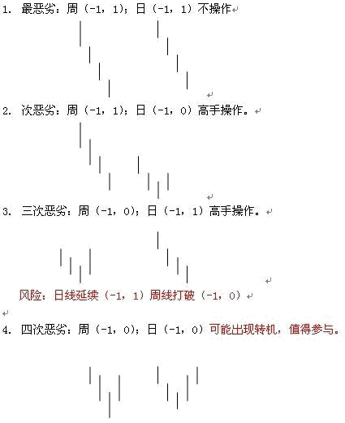

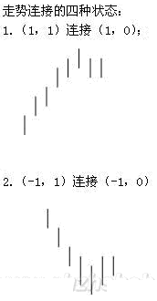

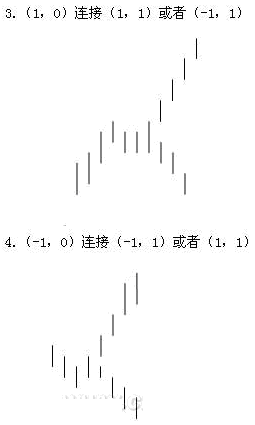

多头，早死早投胎还是背水一战。(2007-12-18 15:31:11)

现在对于多头来说，形势十分明确，就是两个选择：早死早投胎还是背水一战。技术上，本ID已经分析得很清楚，周线上是（-1，0），日线上两种选择，在4778点上制造（-1，0），这样多头还有背水一战的机会，否则就早死早投胎。

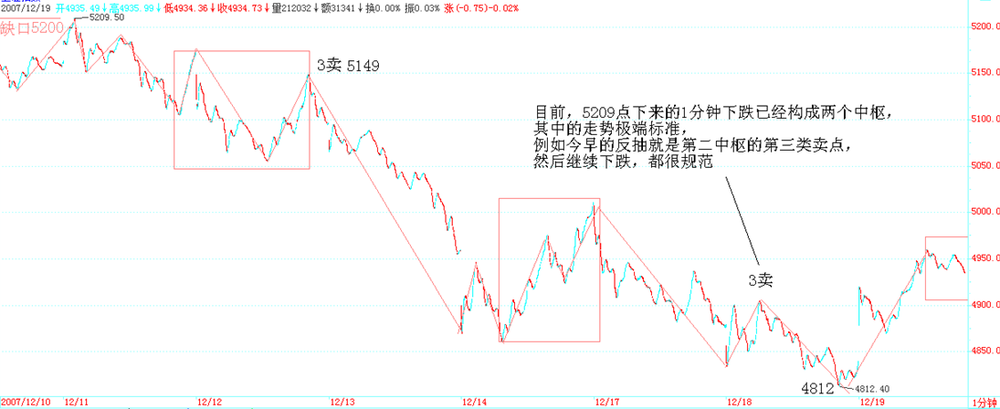

中线上，本ID已经反复强调，反抽以后必然还要探底，而在11月底谈论12月月K线形态时，就明确说过，至少有上影对11月长影实体进行反抽，这点已经做到了。后面的问题其实很简单，就是这月K线是包含关系，还是继续月上的向下笔延伸，也就是4778点是否要在12月被破。一旦被破，也就是月线上要走出向下笔，在月出现新的底分型之前，一切中级的向上都免谈，这在技术上是不需要分析的，是必然的。

如果用更精细一点的分析，就是5209点下来的这个1分钟下跌走势究竟在什么位置结束，如果在4778点上结束，那么最坏的情况还不至于马上发生，也就是说，大盘的反抽最坏也能走成类似三角形之类的收敛形式，否则，这1分钟下跌，将是一轮大级别下跌的第一段，后面至少要等这个级别的下跌结束，才有中线站稳的可能。

目前，5209点下来的1分钟下跌已经构成两个中枢，其中的走势极端标准，例如今早的反抽就是第二中枢的第三类卖点，然后继续下跌，都很规范。下面的问题，就是要关注后面是否能制造出背弛，其实更重要的是，背驰以后的反抽是否就在这第二中枢区间受阻，一旦如此，后面的走势一定大大不利于多头。

说实在的，现在的情况对多头确实是华山一条路，除非走出直接突破5200点颈线的走势，否则早死晚死都是死，还不如早死早投胎。

其实，跌破4778点并不是世界末日，反而必然会构造出走势上的背驰，也就是说，跌破也是空头陷阱，并没有什么大不了的。而在这里死顶，反而会让这陷阱杀人更多，所以，如果多头没有直接突破5200点的能力，还不如早死早投胎，例如这一生没活明白，6100点当多头，投胎回来活明白点，也不是什么坏事。

这里说的是大盘，个股并不一定太关联于大盘。即使大盘破位，那些明年肯定会被大搞的股票，一定会利用陷阱把不坚定分子清洗干净。至于中石油之类的，那天吃饭，有人问本ID，本ID说既然开48，那就到24也很好。48，死都要发的都死了；24，想死反而得活。结果给酒桌上的人声讨，说本ID太残忍，让48的人怎么活。但市场从来都不为任何人的生死而不市场，当然，24的中石油只是一句酒话，说老实话，站在长线利益上，本ID还愿意见到14元的中石油，但估计没人会给。而实际上，中石油在30分钟上也跌出了一个线段的类下跌走势，后面就要开始关心底背驰制造的问题了。

超短线上，明后两天，是给多头最后的机会，如果还发不出力来，就早死早投胎吧。本ID给出的操作原则已经反复说了，没技术的，最好还是继续光荣伟大正确的小板凳，有技术的，就继续折腾那些强势的股票，当然，如果某些股票有大的底背驰，也是可以关心的，不过即使多头能发力，但如果再次反抽不能重上5032点，那么就必须小心被刀子刮伤。先下，再见。

多头绝地反击，仍需努力。(2007-12-19 15:15:39)

昨天说了，多头面临两个选择，如果连背水一战、绝地反击的勇气都没有，干脆早死早投胎。今天，在资金大回笼，利好不少的情况下，多头最终有了点动作，但这远远不够。这就像煮青蛙，多折腾两次，并不意味这青蛙就要成神仙了。

青蛙要成神仙，多头要真正逃出绝地，最基本的位置昨天也说了，就是5032点，这样，基本还是继续保持5000点附近的大级别震荡。当然，光震荡还是没用的，5209点的颈线还是必须攻克，否则最终青蛙还是要变成清炖青蛙。

技术上，今天把日的底分型给折腾出来了，早上第一波冲高就基本确认，因此后面的第一次回调，就构成超短线的一个第二类买点。这次的反抽，就是昨天所说的5209点下来的1分钟下跌背驰后的结果，因此在这里，至少要制造一个5分钟的中枢，该中枢的第三买卖点出现情况决定短线大盘的生死。

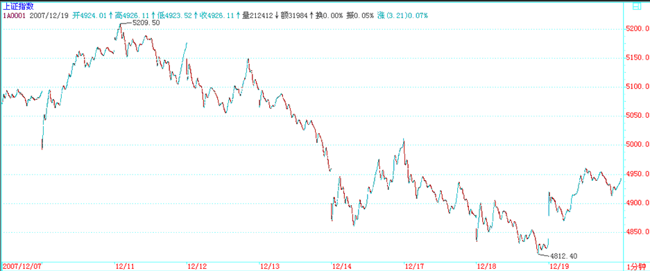

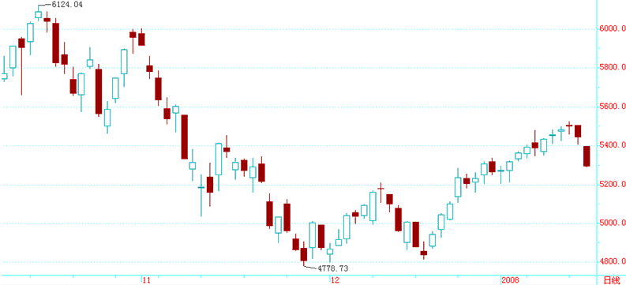

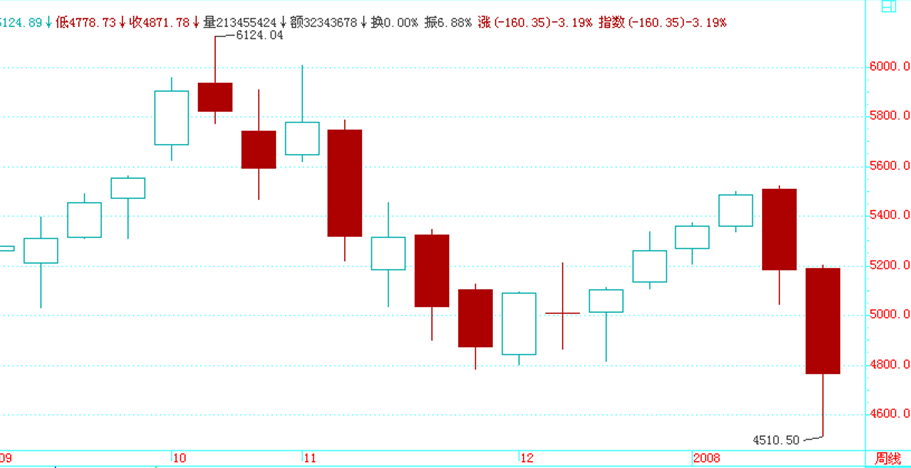

注意，形成底分型并不是万事大吉，关键是要后面连续站住5日线，否则只是一个中继，这配合相应细部的5分钟震荡情况，将一目了然，完全可以全面把握。中枢震荡的操作法则，课程里反复说到，必须多练习才能真正把握。

本ID在这里，只是一个陪练，最终希望各位自己学会去分析。如果你只希望来这里获得一些现成的结论，那就最好别来了，因为这里没有。

希望来这里的人，都是不需要拐杖，自己能走的人。本ID只是陪练，教练都算不上，这个道理必须清楚。

先下，再见。

攻克5032，完成初步任务。(2007-12-20 15:15:02)

因为晚上要出差，所以等一下就把晚上关于明年大盘走势的展望写了，4点左右贴出来。明天收盘尽量解盘，如果没时间，就在周六或周日补上。

今天大盘攻克5032点，初步任务完成，大盘围绕5000点上下震荡的大格局依然保持。下一步，就是要站稳5032点，为攻击5209点颈线的进一步任务打好基础。因此，5032点能否站住，就是判断大盘超短线强弱的关键点位。

今天盘中走势，5032点位置的重要性表现无遗，整个下午基本就是围绕该位置蓄势、突破、回抽的过程。很多人到现在还不大会看盘，例如今天的走势，其实一点可担心的地方都没有，因为整天连一个线段都没有完成，你有什么可担心的？

4812点上来，在4920点附近有一个1分钟的中枢，因此，下面就等待第二个1分钟中枢的出现，看这1分钟的上涨是否确立，最后再看其顶背驰的出现。这和5209点下来的1分钟下跌是一样的，只是反过来而已。

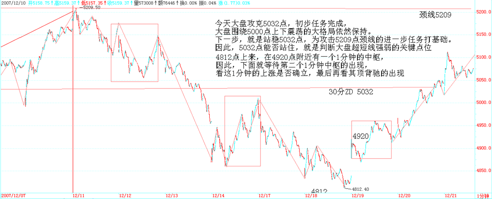

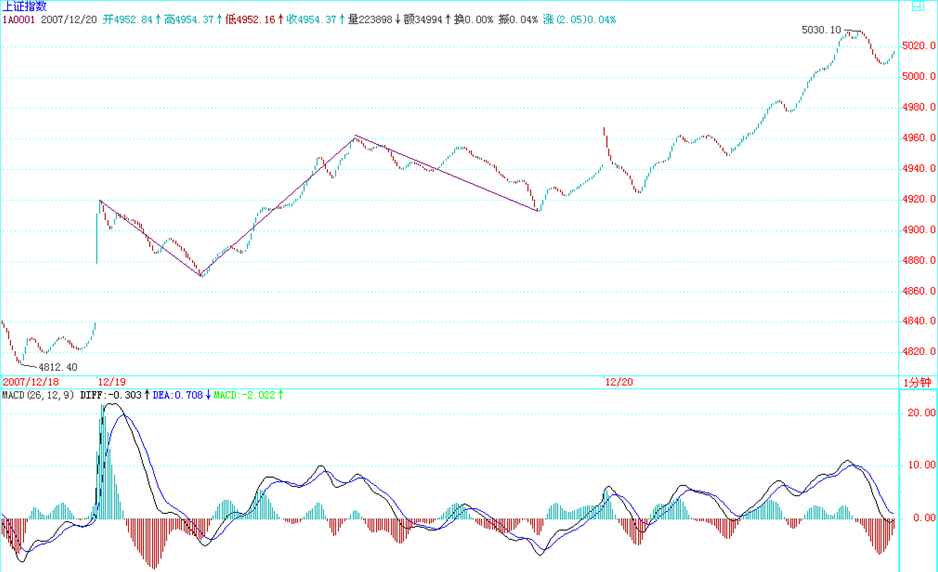

中石油今天终于把底分型给构造出来，后面就是确认的问题。在30分钟上，这个线段的类背驰显然是制造这次回升的关键，这也说明了，中石油在30元附近至少可以构造一个大点级别的中枢，以后是再次破位还是继续上涨，就看这中枢的第三买卖点问题了。

大盘比中石油强点，向笔的延伸已经展开，所以和上次5209点一样，等到顶分型出现再说。当然，会看1分钟上涨的背驰，可以直接看那背驰操作，那更精确。

今天大盘股票的启动，与所谓期货的传闻有关，因为某部门递交了所谓要求期货开的玩意，但这玩意是需要批的，现在谁有时间批？谁负责批？这事情至少在程序上不是一个人的签名就可以批的，只要有签名权的人有一个人有保留意见，估计这东西就需要折腾。

其实，本ID是欢迎这种折腾的。现在的中国资本市场，连小学都没毕业、现货都没有搞好，就想搞期货上大学？谁的脑袋大、脖子粗，就顶吧。如果真出来，本ID是乐于看笑话的。

请先把创业板搞好，先完善多层次的资本市场间架。而最无耻的就是那些利益集团，为了自己的利益，企图在年底抢闸。

中国资本市场目前最大的问题是多层次资本市场的间架、印花税等交易成本的合理化，而不是好高务远（这个成语写成这样可是公开发行的软件制造的，连成语都写错却能发行，请问是谁负责的？我们的期货千万可别是这种水平）的所谓指数期货。

先下，4点再上帖2008年走势展望。

2008年行情展望(2007-12-20 15:59:05)

年末，不可免俗地要对明年的行情展望一番。今年，无论是5月份的180个月时间周期、6100点的顶部以及调整的第一落脚点120天线，都被预先剧本了。不过，现在完全精确剧本明年走势，几乎是不可能的，因为明年市场上的可变分力太多，下面只从纯技术的角度进行一些界定性的分析。

从今年年K线上看，由于还有几个交易日，所以不能完全确认年K线的收盘位置，但年K线将留下较长上影，这点大概不会有太大改变。同样，年K线的实体部分也将相当长。因此，明年的走势，今年的K线上影尖端6124点以及K线实体的一半位置（目前大约在3800点附近）将分别构成明年关键大箱体的上下边沿。目前大盘的位置，大致在这箱体的一半位置。将这箱体进行4等分，那么次级的支持与阻力大概分别在4355点与5555点。

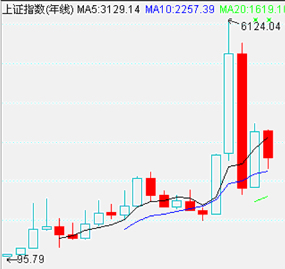

可以断言，即使突破6124点后，明年能突破6124点+该箱体宽度，也就是大概8400点的可能也会极小，就算最终发生了，也肯定是一个将导致巨大灾难的多头大陷阱。同理，将原箱体宽度按4等分划分，那么，可以计算出突破6124点后依次的阻力位置。由于最后的年收盘没有出来，所以精确的计算可以留待今年收盘时，但方法是一样的。

从日线的均线系统上看，250天线将是明年最关键的位置。前面的文章已经说过，本次调整的第一只脚将落在120天线，那么第二只脚就极有可能是在250天线。明年，至少有两次考验250天线的机会，极有可能是，第一次是喜剧，第二次是悲剧。

明年年K线最终是长阳的概率不大，十字星或类十字星的小阴小阳出现的概率极大。无论哪种情况，明年最需要关注年K线上影所制造的多头陷阱，当然，相应也要关注年K线下影所制造的空头陷阱。如果配合上股指期货，明年的陷阱多多，多头空头都不会好过，一旦落到井里，其后果一定比这次6124点这个小井要严重得多。

月K线太多就不分析了，这里只分析一下明年的季K线。由于本季度的K线基本定型，那么明年1季度的K线将最为重要。如果该K线低点比本季度K线低点低，而又不能马上创出6124点新高，那么季度线上的顶分型就构成。然后，后面三个季度，5季度的平均线将成为最重要的线，一旦有效跌破，后果相当严重，其后的调整压力比这次6124点下来的要大得多。因此，5季度均线是明年多头的生命线，就如同这两年5月均线对多头的意义一样。

明年，最理想的走势是先抑后扬再抑，当然，细分起来，也可以是先小扬再抑接着大扬后大抑的走势，很难再出现这两年的单边走势。明年上半年最重要的事情，就是6124点下来的调整究竟最终走成什么形式，按照综合的判断，大平台型与大三角型的可能性最大，但无论哪种情况，其中第一子段走出锯齿型的可能性依然存在。

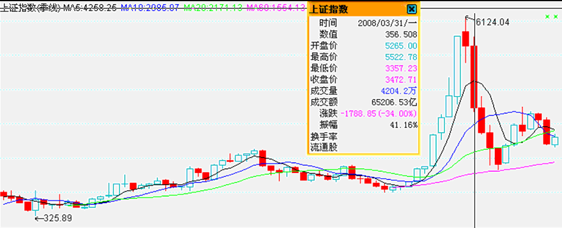

明年，至少有两个顶部是必须注意的，第一个就是6124点大调整的第二段上升所构造的顶部，这是一个小顶，第二个就是如果突破6124点以后制造的那个大顶。底部注意三个，就是6124点下来的第一子段和第三子段的底部以及大顶以后第一段杀跌结束后所构成的底部。当然，如果先是大三角形调整，将还有一个小顶与小底需要注意。另外，在多头运气最好的情况下，6124点的第一子段的底部也有可能在今年年底就完成，但这并不影响总体图形的走势分析。

个股方面，明年是题材股大热，各类的题材会层出不穷，指数可能没多大油水（期货另算），但如果能踏准题材轮动的节奏，明年的收益一点都不会比今年少，但相应的操作难度将急促加大。可以断言，明年超过2/3以上的股票走年K阴线或超长上影K线的概率将极大，而明年能从年头一直牛到年底的股票将极为罕见，更多的股票将为投资者准备的是各种深浅不一的井。明年股票里最流行的行为，就是掉到井里，唯一有点悬念的是，究竟最夸张的投资者，一人能依次掉到多少个井里？

当然，井有多头的，也有空头的，但明年多头的井将更有人气。如果说今年的最流行汉字是“涨”，那么明年最流行的就是“井”。明年投资市场里将出现四类人：一、挖井的；二、落井的；三、挖井不慎落井的；四、利用不同的井大力抽水的。请问，您将要成为哪一种？

明年除了现有的品种所产生的机会，最大的可能将是创业板和指数期货。可以肯定，如果是充分理智的决定，那么创业板必然在指数期货之前。由于本ID一直反对指数期货过快推出，而明年又有如此瞩目的会议，因此，指数期货绝对不适宜明年推出，否则，一旦引发大的指数动荡，其影响将难以承受。站在稳健的角度，明年很可能只有创业板，指数期货将继续是期货而不是现货。

因此，明年的指数完全存在这样一种可能的变数，就是一旦指数期货不能推出，而政策的严厉程度继续加大或外围市场再出现超大震荡，那么甚至明年不能突破6124点或者稍微突破一点就多头陷阱下来的可能性一点都不能排除。当然，如此悲观的局面暂时只能作为一个可能的选项，但却是不能不防的。总之，6124点上，陷阱将逐步多于机会，越往上去，掉到井里的机会急促放大。

站在对资本市场长期发展的角度，明年本ID最期待的政策就是印花税重新回到原有的水平，印花税的问题，是市场最基础的交易成本问题，明年是否有一个走势与政策合适的平衡点去解决这个问题，是站在资本市场长期发展角度上一个最值得关注的问题。

综上所述，明年的市场，将和这两年的有着巨大区别，一些这两年的成功经验与习惯很可能就是明年里的毒药。能否及时调整心态，采取更加实际、灵活的操作策略，将决定明年最终操作的成败。

加息再为市场打鸡血(2007-12-21 15:17:26)

快速说两句。加息的宏观面意义的无聊程度，暂且可以继续讨论。而加息对于市场的作用，就如同鸡血，先别管有效无效，打了再说，而市场也一如既往地鸡飞狗跳起来。

技术上，今天没什么可说的，顶分型在日线上不出现，1分钟的上涨不出现背驰，就可以继续睡觉等卖点。

周末，如果没有什么特别事，加上一阵媒体攻势，周一怎么都能忽悠点人上来，5209点，颈线，多头能否一鼓作气，就看多头周末的嘴上功夫了。

本ID的策略依然是，不顶风、不出头，专门放冷枪，多头还行，我们就呐喊助威，一旦不行，就开枪送行，如此而已。

周末，为了我们的股票能快高快长，咱们一起喊：多头万岁。一边喊，一边把弓箭、大刀、机关枪都擦好了。市场，总是眷顾最卑鄙无耻的，而不是赤膊上阵的。周末，快乐。下，再见。

外面正下着雨，酒店里闲话(2007-12-22 00:17:39)

刚回酒店，南方的冬夜，下着寒雨，和北京真是大不同。外面是这个城市最大的广场，子夜时分，依然灯火璀璨，车流涌动。城市总是令人生厌，特别在这样一个遥远的夜晚，世界如此遥远，城市多余地忙碌着。

年末，基金为了市值排名忙碌；每个人为了自己的梦想忙碌；本ID为了一个情面被扔到这南方冬夜的寒雨中，也忙碌了一晚。没什么可抱怨的，既然选择如此，就如此了；没什么不可抱怨的，既然选择了需要抱怨一番，选择，就如此了。

每个人，背负自己的生死悲欢奔走成如此繁乱的世界，世界繁乱成每个人的牢笼，里面缀满华丽的词语，摇头丸着历史、避孕套着文化。

一千多年以后，会有一堆被历史摇头丸、被文化避孕套的人类精英，对于一样的冬夜、一样的寒雨，围炉夜话着一千多年前的盛世年代。人类，真行。

老老实实做人(2007-12-22 15:26:13)

刚吃完中午饭，酒来酒往，十分中国。

这世界上最可怜的，不是那些酒来酒往中的人，而是那些自以为超凡脱俗，没点人味的人。

人，首先要吃喝拉撒，这就是人。但人总爱那些非人之举，而所有非人之举后面，不过都是虚伪欺骗。

人，当然有特异之事，但不离吃喝拉撒。别以为偷盗了几句佛言佛语，就以为自己非人了。既然呈现人的形态，就是被人的业力所牵引，或者是自愿投身其中，于其中而游戏。

所以，人首先是人，老老实实做人，这就是真修行。

于人的业力而显现，不为这业力所牵引，如雁过空、风行水。

人，贪嗔痴疑慢，多可爱呀。

做账行情，突破颈线待确认(2007-12-24 15:24:04)

自从有了开放式基金，年末这轮做账行情就变得常规性了。多头因此也华山一条路就走出前面给出的唯一活命选择，直接突破5209点的颈线。现在，唯一需要等待的，就是突破有效的确认，确认以后，下一目标就是这双底的基本涨幅，大概就在5600点上下。确认不了，那就回去再震荡震荡等机会。

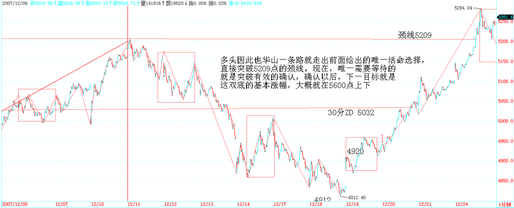

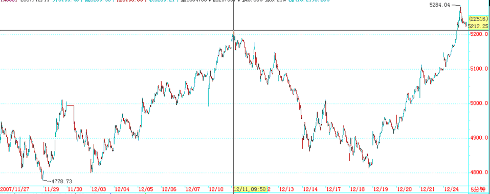

正如周末所说，多头的大喇叭在周末风起云涌，从今天骤然增加的成交量就知道，被忽悠的不在少数。当然，进进出出，都很正常，关键是能把5209点站住，这样，出去的还会进来，因此，今天进来的，也不一定有什么大问题，不过，超短线在5209点站住前被折磨一下，那是很正常的。

技术上，日线的顶分型没有出现，1分钟走势中的第二个中枢也没出现，因此还是一个睡觉局面。当然，由于这次拉升不少，因此这第二中枢有比较大的震荡幅度也是很正常的，因此要有点心理准备。

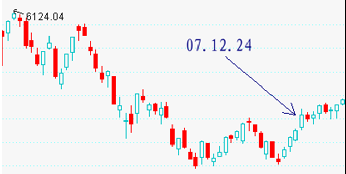

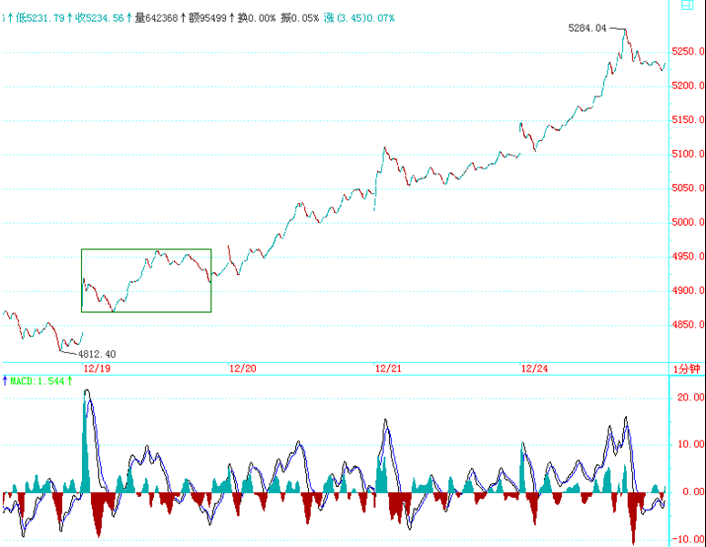

技术上，对多头最理想的走法就是，现在5209点上下震荡出1分钟的第二中枢，然后再上，接着一个大的跳水，确认5209点真的站住，顺便把那第二中枢扩展成5分钟级别的第一个中枢，这样，后面的走势，就有可能向5分钟的上涨发展，这当然是牛且稳健的走法所需要的，能不能走出来，就看多头的能力了。

个股，去年，工行等这时候暴拉，今天，那神油们大有再工行一把的势头，不过这两种情况是有区别的，去年是上涨途中，今天是反弹途中，就算行为、目的类似（毕竟大家伙拉市值快），但力度肯定要差点的。至于其他股票，就看里面人的心情，需要做账好看点的，就用力点，否则，反而会利用这机会洗洗盘，年底了，从来就是这点破事，没什么可说的。先下，再见。

5209点，教科书式震荡(2007-12-25 15:16:24)

今天没什么可说的，该说的昨天都说了。今天就是教科书式地在5209点上下折腾出一个1分钟中枢，就这么简单。而这中枢的中间位置在5210点，比5209点差了一点，这是唯一不完美的地方。

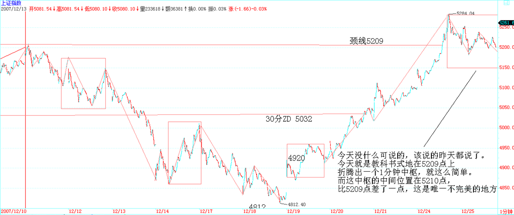

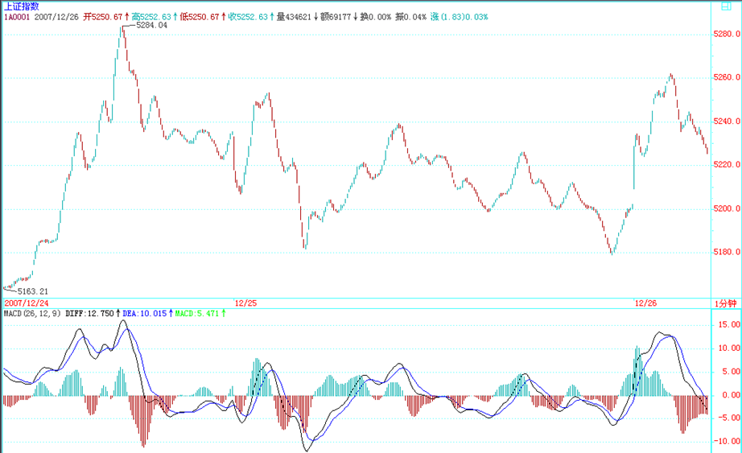

一般来说，这种调整，关键看5日线，只要这线不破，调整的级别就不会高。（思考题：为什么是5日线而不是其他线，用本ID的理论可以很合理地解释，请给出。）

操作上，有本事的，手脚麻利的，就利用这个震荡上下折腾，换股、打差价都可以。没本事的，就张大嘴，给出一副很入迷的样子，看着这上下折腾如何上下地给折腾了。

后面的发展无非三种：最坏的，这里震荡出第三类卖点，然后就形成日向下笔的较大调整；一般的，就是震荡出一个更大级别的中枢，把1分钟级别的走势给扩展成5分钟级别的；最好的，就是走出第三类买点，不过由于已经有了两个中枢，所以后面即使不背驰，也进入该小心的时候，而更可能的情况就是出现背驰，然后再回跌构成更大的中枢。

从上面的分析知道，除了第三种情况中最强势的不形成背驰继续1分钟中枢上移的情况，其他情况都是至少最终要搞出一个更大级别中枢的，所以，中枢震荡的操作，就是更为重要了。

中枢震荡，除了打差价外，对于散户，最好就是不断换股，当然，这需要你对板块的轮动特别有节奏感，因为在上升中途的震荡中，往往个股行情少不了，特别是题材或中小盘的。震荡高点砸出短线钱途不大的，震荡低点买入短线钱途更大的，这样你的效率是最高的。

如何判断一个股票有没有短线钱途？这种问题就没必要问了，你说一个刚顶背驰的股票有钱途还是刚开始第一次中枢上移的股票有短线钱途？你说一个刚进入大阻力区的股票有短线钱途还是刚确认脱离阻力区的股票有短线钱途？其他的情况，可以自己去摸索，归根结底，图形告诉你一切。先下，再见。

面临短线突破选择(2007-12-26 15:12:23)

今天一开盘就受到一个电话严重的嘲笑，什么内容，等一下再说。不过，收盘了，本ID也要先来一个超级简单的问题刁难一下各位，请问：今天的高低点和昨天说的中枢中间位置5210点有什么关系？

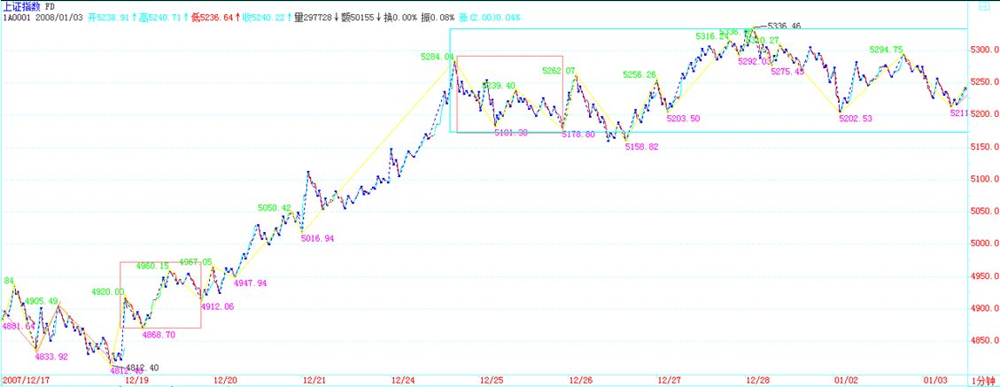

注意，这种关系并不一定这么精确的，只是，这次的震荡确实太标准了，连一点误差都没有，不好玩。显然，利用这种数值关系，知道高点就能预先算出低点大致的位置，反之亦然。不过，这都是参考性的，关键还是看图形本身。

由于今天没什么可说的，所以顺便上一下课。昨天的思考题太简单，绝大多数人都知道和分型的关系，所以就不用多说了。

由于30分钟的布林通道收口，因此短线将面临突破的选择问题，注意，本ID这里说的是昨天那三种选择的选择，不是说一定要突破出一个方向，例如，突破为更大级别的震荡也是一种选择，这是时间换空间的选择。

最后两天，做账的如何选择，就决定了突破的方向与类型。但如何走其实根本没什么特别的意义，关键是把年K线给决定出来，然后明年的走势，就有了一个基本的参照标准，这才是最关键的。

当然，按照基金的品性，以及他们的奖金分配原则，如果没有大的事，你说这群人会自己毁自己吗？

个股不想说了，因为今天一开盘被严重嘲笑。嘲笑对象是一只刚上来的股票，N个月前，今天打电话来的朋友也曾过来，拿着N百万股这股票，要以12元的价格给本ID，本ID当时嫌太少了，又嫌太贵了，说他黑，1元的竟然卖12元，抢呀。

结果，今天被严重嘲笑。

晕，这世界太疯狂，不过本ID也很高兴，因为极端便宜地投了类似的企业，不过要等等才能上。希望这玩意到1000元吧，以后按比价关系，本ID按1500元卖给今天打电话来的坏蛋。

祝各大小坏蛋们都快高快长，万事顺利。先下，再见。

教科书式突破如期而至(2007-12-27 15:15:37)

昨天说了，由于30分钟的布林通道收口，所以短线面临突破选择。今天的突破，在时间上是十分教科书的，一般这种中枢突破，用布林通道来预估是比较有效，这点在课程里已经说过。

当然，当下的中枢选择哪个级别的布林通道，这必须根据中枢的对应图形来选择，不是见任何级别的布林通道收口都是有效的。这就如同MACD在背驰判断的作用。有些人永远整不明白，是走势类型的分解是本，而不是MACD，否则，研究走势类型干什么？还不如直接看MACD就可以。可惜，光看MACD，根本无效。

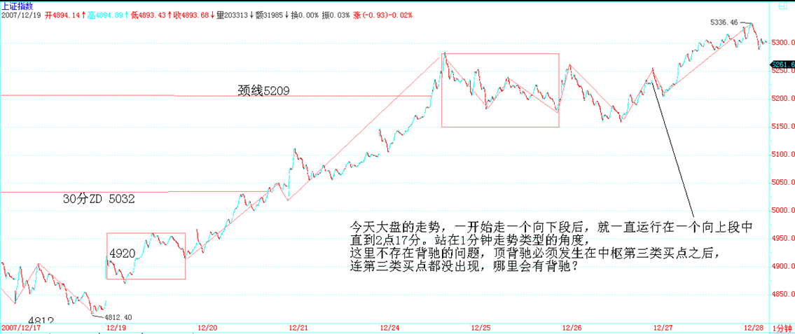

今天大盘的走势，一开始走一个向下段后，就一直运行在一个向上段中，直到2点17分。站在1分钟走势类型的角度，这里不存在背驰的问题，顶背驰必须发生在中枢第三类买点之后，连第三类买点都没出现，哪里会有背驰？

后面的走势，很简单，只要向下笔的回跌不回到5240点下，那么就是第三类买点成立，后面只有两种情况：一、顶背驰回跌构成5分钟中枢；二、没顶背驰，继续中枢上移构成第三个1分钟中枢。

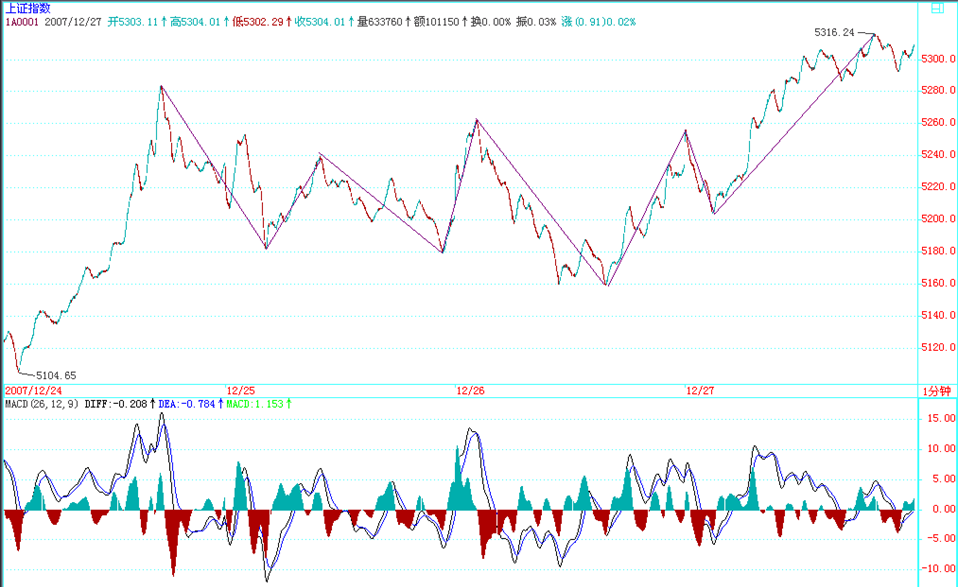

注意，纯理论上说，一般第二个中枢以后的第三类买点都没有介入价值，你只要持有等到整个走势类型完成就可以，因为根据正确的操作，你必须在第一个中枢的第三类买点就完成最后的介入，以后的都是没多大意义的。

由于如果这次又回跌到5240下，那么其实已经有9段线段的震荡了，所以也将扩展成5分钟中枢，所以后面的走势，无论是否形成第三类买点，都只有两种选择：一、继续5分钟震荡。二、继续1分钟中枢上移。

你根本无须预测，让市场自动当下告诉你。当然，如果你看不懂市场的语言，那是你自己的问题，而不是市场的问题。

站在中线角度，其实哪种走势都没大问题。为什么？即使是在这里震荡出5分钟甚至30分钟中枢，最终只要出现第三类买点，就可以延伸出5分钟或30分钟的上涨类型，这在中线上更牛。至于，继续1分钟中枢上移，只不过把最终必然要形成的5分钟中枢位置也同时上移，站在中枢角度，第一个5分钟中枢太高，反而不一定是好事，因为，一旦不能构成第二个，就只能是盘整走势，这样，反而后面回杀的力量更大。

市场，总是在这种各级别的相生相克中前行，一条筋思维注定没戏。

当然，站在日线角度，用分型去判别，现在根本没有任何值得危险的地方，所以，可以继续睡觉。至于，是明天大涨，还是元旦后大涨，这根本没有任何区别。只要图形没有信号，一切继续冬眠中。

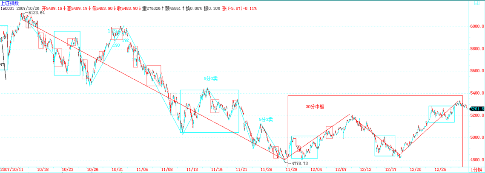

今天某人继续打电话骚扰本ID，看这某股票上市第二天的表现，本ID无话可说，谁让自己给别人好不容易逮着一次，留下一个N个月前送上门12元不要，现在12元的平方看戏的大笑话。现在只能化悲痛为食欲，PE多点玩意搞废这老骚扰本ID的坏蛋。

没有这些好玩的东西，一切都像机器，人生就没乐趣了。先下，再见。

## 教你炒股票92：中枢震荡的监视器(2007-12-27 20:31:33)

这几天解盘时说到关于中枢震荡的一些细节问题，这里先穿插把相应内容说说。

中枢震荡，最终一定以某级别的第三类买卖点结束。但问题是，如何预先给出有参考价值的提示，也就是如何去监控这震荡是在逐步走强，还是逐步走弱，这是一个有操作价值的问题。当然，顺便地，可以为每次的震荡高低点的把握给出一个大致的区间。

一个中枢确立后，中枢区间的一半位置，称为震荡中轴Z。而每一个次级震荡区间的一半位置，依次用Zn表示，当然，最标准的状态，就是Zn刚好就是Z，但这是很特殊的例子。

显然，Zn在Z之上，证明这个震荡是偏强的，反之偏弱。震荡的中枢区间是[A，B]，那么，A、Z、B这三条直线刚好是等距的，Zn的波动连成曲线，构成一个监视中枢震荡的技术指标。

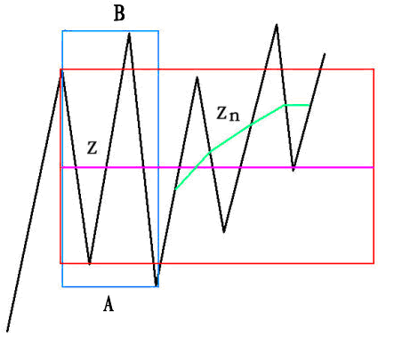

当然，只要有波动，就可以用类似中枢、走势类型之类的手段去分析，不过Zn的数量不会过于庞大，不会超过9个数据，超过了，次级别就要升级了，所以这样的分析意义不大。

一般来说，这个指标是一个监视。这里，存在着一种必然的关系，就是最终，Zn肯定要超越A或B，为什么？如果不这样，就永远不会出现第三类买卖点了，这显然是不可能的。

但必须注意，反过来，Zn超越A或B并不意味着一定要出现第三类买卖点的，也就是，这种超越可以是多次的，只有最后一次才构成第三类买卖点。不过实际上的情况在绝大多数情况下没有这么复杂，一般一旦有这类似的超越，就是一个很大的提醒，也就是这震荡面临变盘了。

一般来说，如果这超越没有构成第三类买卖点，那么一般都将构成中枢震荡级别的扩展，这没有100%的绝对性，但概率是极为高的。

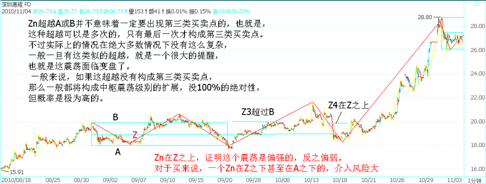

有了这些知识，对于中枢震荡的可介入性，就有了一个大概的范围。对于买来说，一个Zn在Z之下甚至在A之下的，介入的风险就很大，也就是万一你手脚不够麻利，可能就被堵死在交易通道中而不能顺利完成震荡操作。

同时，那些Zn缓慢提高，但又没力量突破B的，要小心其中蕴藏的突然变盘风险，一般这种走势，都会构成所谓的上升楔型之类的诱多图形。这种情况，反着，同样存在下降楔型的诱空，道理是一样的。

另外，中枢震荡中次级别的类型其实是很重要的，如果是一个趋势类型，Zn又出现相应的配合，那么一定要注意变盘的发生，特别那种最后一个次级别中枢在中枢之外的，一旦下一个次级别走势在该次级别中枢区间完成，震荡就会出现变盘。

结合上布林通道的时间把握，这样对震荡的变盘的把握将有极为高的预见性了。

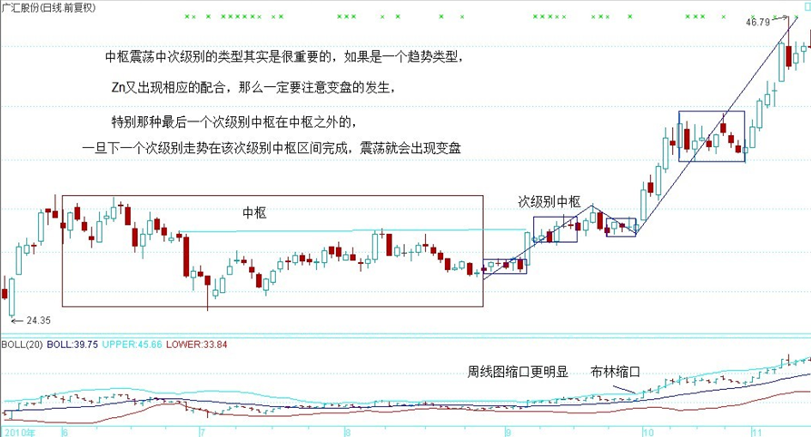

除了特殊的情况，Zn的变动都是相对平滑的，因此，可以大致预计其下一个的区间，这样，当下震荡的低点或高点，就可以大致算出下一个震荡的高低点，这都是小学的数学问题，就不说了。

2007年低调收盘预示明年行情性格(2007-12-28 15:27:45)

其实，这句话是有问题，今天指数虽然低调，但个股并不是都低调，例如本ID说那些股票，大多数就都继续在上攻。这也预示了明年的一个基本特征，指数油水不太大（除非期货很快出来），而个股油水不少。关于明年的分析，一早已经给出，请看“2008年行情展望 2007-12-20 15:59:05”

今天的大盘，技术上十分标准，就是第三买点后出现标准顶背驰，然后就使得走势从1分钟级别向5分钟扩展，现在，一个新的5分钟中枢已经形成，后面就看这5分钟中枢的震荡过程。

估计这次4800点上来的1分钟走势，虽然很标准，但也不一定都能分解对，下面有图，其中286、296是第一、二个中枢的第三类买卖点。297顶背驰后，最少跌回287下，这点已经完成，所以这5分钟中枢的扩展是逃不掉了。

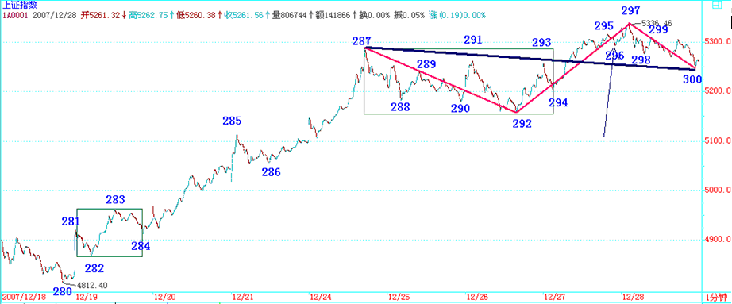

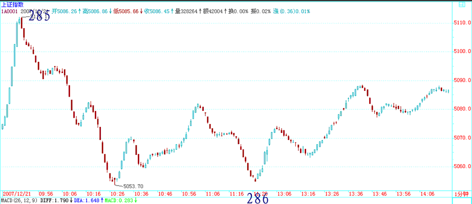

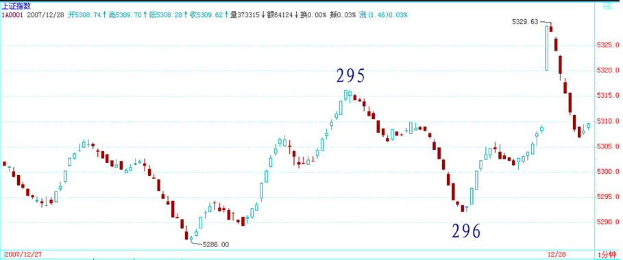

下面的问题，很简单，就是这5分钟的走势类型究竟是一个上涨还是盘整，如果是上涨，这是第一个中枢。明年的第一个问题，就是这5分钟中枢的第三类买卖点问题。

明年，小心“井”，这就是本ID年末最好的忠告。

年末的功课，就是把“2008年行情展望 2007-12-20 15:59:05”提到的箱体给算出来，这是明年走势的一个基本框架指导。

去年年底有6元的000999，今年下半年有8元的600737当各位的学费，但现在没有，因为明年的行情，本ID的原则是把该原有的完成了，新的没有什么好选择，毕竟明年不是前两年，土都耕种了两三年，明年能收割好就是真本事，后面，是该施肥增加肥力的时候了。

说一句有点恶心的话，资本市场里最好的肥料，就是人。这话恶心，却是真相与事实，关键是，不要把自己当成了肥料。

为了让各位不至于成为肥料，明年指数无论到什么地方，这里只有绿色，就是让各位时刻提醒自己，至少可以知道，如果当了肥料，就见不到新苗了。

先下，再见。

注意，下面的300并不是已经完成的。

08年证券市场的头等大事：尚主席，该高升了。(2008-01-01 17:38:18)

本ID是严重反对“中国大妓院”这样的名字的，因为这里存在着严重的男权思维，但这样的称呼，至少在北京私底下已早不新鲜。这么多血汗钱，如果能搞出个真玩意，那还算是个玩意；但连个玩意都没搞太好，那究竟是什么玩意那就不用再玩意了。

新年新气象，那不是玩意的东西就不提了。去年，本ID的几篇文章，事后都达到其效果，至于是否与本ID的文章相关并不重要：

“港股直通车”难以背负的使命 2007-09-24 08:52:17 ”，在那无聊的脑子进水的直通车甚嚣尘上时写的，现在，那车终于还是没开起来，中国经济、市场的大幸；

“中国经济，已需治理整顿。2007-10-15 08:32:52”，后面的经济政策，已经与此相关；

“房地产泡沫，经济发展的真正毒瘤2007-10-09 20:57:56 ”，听说前几天有一姓王装模作样的在CCTV完全对文中这一段类似内容进行了回应：“比单纯的房地产泡沫更大杀伤力的，就是股市中房地产股票比重太大，在虚实两方面制造房地产泡沫。房地产企业，通过所谓的重估，拉抬自己的股价，从而用极高的价格在市场上圈钱，再去圈地，炒高土地价格与房价，然后再进行重估，开始新一轮恶性循环。没有比这种游戏更能制造恶性经济泡沫的，这绝对是致命的游戏。因此，当某些公司戴上世界上最大房地产企业的高帽高呼要去冲击万亿市值并借此大肆高价增发圈钱，有些股票只是因为某房地产企业的注入就连拉几十个涨停之时，这房地产与股市的虚实结合所产生的危机就已经到了不可忽视的地步。在股票市场上做庄的，只要资金链不断，那杠铃还不一样能一直举着？那些大面积囤地的房地产商，本质上和庄家没什么不同，如果他们从资本市场、银行体系上不断补充新鲜血液，那房地产的狂潮是不可能得到平息的。”

类似的文章还有不少，就不列举了。那么今年，本ID第一篇想说点什么？08年证券市场的头等大事：尚主席，该高升了。

用人就如同用药，每个人的能力与思维方式都像一种药性，药性是不容易改变的，药性的发挥与时机相关，这时机对的药，可能在另一个时机就不是好药了。

本ID从尚主席上任之初就一直给他鼓掌，甚至在别人不看好其股改政策时，本ID鼓掌力度更大，为什么？因为那时候药性是对的，这药用的是时候。

现在，尚主席已经为证券市场立下汗马功劳，应该高升了。任何好药，过了时候，反过来变毒药的机会就大增了。因此，无论对中国的资本市场还是尚主席本人，这时候快点高升，都是最好的选择。

多余的话，就不想说了，本ID对证券市场，08年只想看到三件事情：

一、创业板的推出；

二、股指期货的缓行；

三、印花税的纠错。

指数疲软下的个股高潮不断(2008-01-02 15:12:24)

如同这题目，第一天的行情继续预示着本年行情的特点，指数油水不大，个股油水不少，这已经在去年末反复说到了。用句概括性、动感更大的口号，就是：疲软指数，高潮个股。

当然，指数也不会无限制地疲软，指数往往会表现出痉挛式走势，突然抽起来，然后就再抖个不停。抽两下，抖十下，大概就是今年指数上经常会碰到的。哪天指数不痉挛，而是一往无前起来了，那反而要小心。

技术上，指数就是继续去年末那5分钟中枢的震荡，在第三类买卖点出现之前，继续抖个不停。

个股上，没什么可说的，本ID说的那些股票，今天又有好几只创出6124点来的新高，对于个股来说，6124点的高位就是一个强弱分界，突破站稳这位置，行情就会更猛烈。例如，600737就是一个好例子，14元多是6124点下来的高位，突破站稳后，现在已经到20元上了。

当然，对于具体个股，突破那位置后肯定都有反复，对待这种反复，最好的就是顺着做短差，把差价搞出来又不丢失筹码，不过这对操作水平要求高。还有一种就是定好5周线之类的中线位置，只要调整不破就拿着，例如，你看看600737，晃来晃去，把无数人恐吓下去了，你看他突破调整后什么时候有效破过5周均线？

面包会有的，今年是越早越安全，现在，个股机会远大于风险，就算个股年线要收阴，怎么也要先搞一个上影，而越到年中以后，就难说了。今年是先把粮食打足了，如果能有第二次机会最好，没有，也不会饿着了，一年的面包也会有着落了。

千万别追高买任何股票，如果错过了前面的，就在低价与二线中找那些反应迟钝但有资金驻守的。都是人，都要吃饭，只要有资金驻守，总要开张的，否则一年的花费谁给呀？

至于大家伙，技术好的，就等抽筋那几下抽点血，抖的时候就不一定陪着玩了。先下，再见。

向5600高地攻击前进(2008-01-03 15:18:39)

站住5209点颈线，下一位置就是5500-5600一线，这是十分简单的技术问题了。由于这个5分钟的中枢震荡还没有震荡出第三类买点，所以说这颈线突破100%有效是不严谨的。但生活有时候并不太严谨，否则就太无趣了，所以，没有100%的把握已经确认的事情，我们依然可以喊：向5600高地攻击前进。

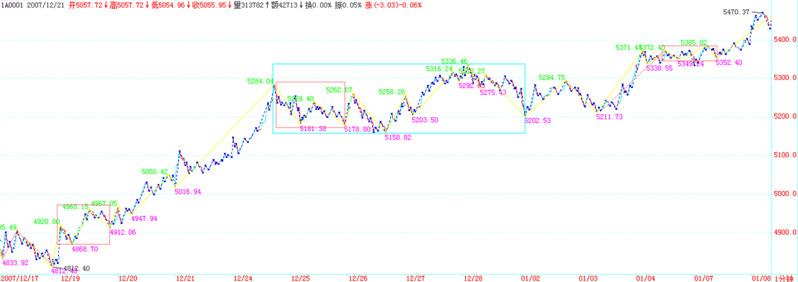

做股票，说白了就是忽悠着冲锋陷阱，只是你去忽悠别人，别让别人忽悠你。既然08年属于早收割早有面包的年份，我们当然要在年初就大力忽悠。说实在，“向5600高地攻击前进”这点小目标，说出来都不好意思，也太低了，不过先忽悠低的，现在的人胆子小，毒药要慢慢喂，不像以前，说年内冲10000点，都有人和你急，他愣要说10000太低，还是12500比较好，50个250呀。

如果要冲指数，当然就轮到大家伙抽风的时间，但一定要认清楚现在他们抽两下抖10下的本性，现在是刚一阳复始，不适宜大家伙们太剧烈的运动的。

其他个股，去年下半年基金牛了一把，私募都憋坏了，今年肯定要报仇的。所以，收集好的，肯定是按节奏继续搞，没收集好的，就加快摩擦速度，不过那些现在都没收集好的，都是有点毛病的，算了，反正每次都要有人最后垫背的，没什么可说的。

个股的大节奏昨天说的，分水岭就是6100点相应的位置，对于中低价的，可能530那次是另一个更高的位置，如果在春节前后都不能有效突破这些位置，那这股票今年的前途就有问题了。当然，不排除有些最后当炮灰的庄家就是这么慢，但这里说的是正常的节奏，不说炮灰。

在那些分水位置上，肯定都要洗洗，如何洗，那是手法问题，看明白了，这股票就是给你送钱的，来这里，希望是真学会点什么。否则，白送股票给你也没用。例如，600737，8元这么明确告诉是送学费的，但估计也没几个能真把钱给挣到，这难道也是本ID的错？

再说一遍，本ID在这里只是陪练，能学到多少，还只能靠自己了。先下，再见。

多头，有了冲动就要喊。(2008-01-04 15:12:12)

今天走势最大的意义是什么？站在本ID理论的角度，就是突破5336使得周线上（1，1）的状态延续，在周线的（1，0）出来之前，也就是周线顶分型出现之前，尽管持股睡大觉。

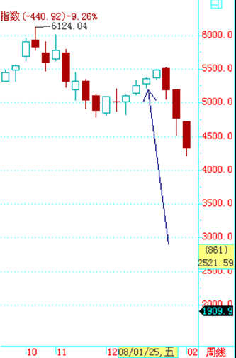

炒股票，对于中短线来说，有什么比周线都出现向上笔的延续更理想的状况？在这种状况下，你的利润就有了一个超稳定的保障系统给于最强有力的保障并使得该利润尽可能地延伸。那些每天如惊弓之鸟一般的，请好好复习一下历史图形，如果那让你每天惊弓之鸟一样的震荡连周的顶分型都震荡不出来，那又有什么可惊弓之鸟的？

请复习一下历史走势，看看从3563点到6124点的走势，按照本ID理论里最低级的周顶分型就足以让所有的利润得到最大的延伸。

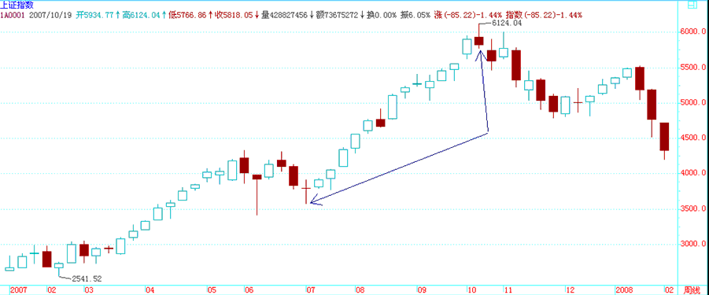

当然，如果技术高的，在周的（1，1）延伸里，也可以利用更低级别的走势搞出不少差价来，或者通过不同级别的震荡换股达到利润最大化。但这是对技术高的说的，如果没那技术，就天天睡觉，顺便可流点口水，每天收盘很无耻地看看周顶分有没有出现，然后继续更无耻地睡大觉，这样就足以让你超无耻地比很多人厉害了。

来本ID这里，关键是学东西。如果太计较自己有没有这股票，是不是赚了，那你的水平永远提不高。还是用本ID的股票为例子，一个最令人深恶痛绝的股票：600636。你是否在里面赚钱并不重要，关键是你能否在这经典走势中学到点什么。看看这经典的走势：一个ABC的下跌，其中的B段在120天线受阻，然后大力挖井后回手在120天突破回试确认，然后迅速回到井的上沿13元附近，一个超完美的井。后面干什么？就是要确认这井的上沿能否站住的问题了，这都是最标准的走势。如果对这类似的走势烂熟于胸，难道你还不能自如地应付类似的走势？

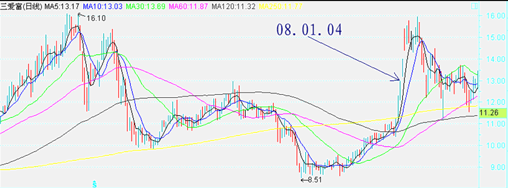

600078、000938等的是另一类型的走势，也是超经典的，请当成作业分析一下。

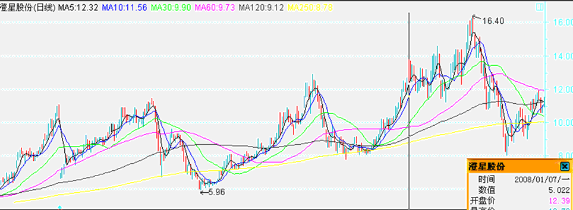

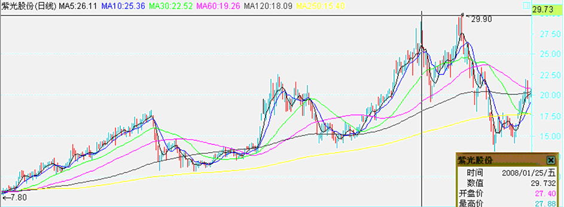

周末，又是多头发挥嘴皮子功夫的时候。多头，有了冲动就要喊。上升行情，本质上是喊出来的。就是上升多头爽了，然后就喊，见人就喊，喊得满大街的人都很冲动，结果就又上又升了。

周末，多头就多喊喊吧，爽了不喊会憋坏的。

至于超短线的技术分析，由于第三类买点还没有整出来，因此今天的突破并没有100%的保证，这突破是否有效，就看多头周末的嘴皮子功夫与喊功的诱惑力了，把大家都喊爽了、都冲动了，大盘自然就有效突破了。

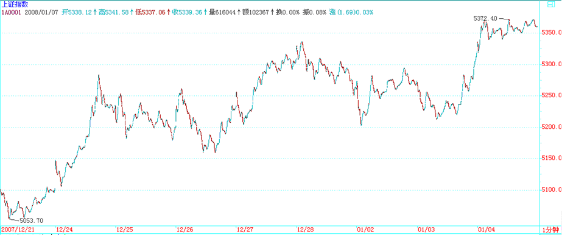

周末，爽去吧。先下，再见。

勇戴金箍大翻筋斗云(2008-01-07 15:12:36)

这题目不是紫霞仙子给那只没良心的死猴子写的情书，而是关于现实股市的现实记录。

就算那死猴子，压在五指山下也要吃点铁丸喝点铜汁，而现在公历新年刚过，农历新年还没到，就算玉帝老儿也没资格让各路资金从此就饿着；就算有那资格，思凡下界妖魔鬼怪一番的，谁也挡不住。

因此，今天因为飞天烤鸭念出的2008第一次紧箍咒，也只能象征性地走了次过场。确实，当鸭子，也应该本分点，人家八戒还没上演飞天大乳猪，你急匆匆地扒光了毛来个鸭子大裸飞，还烤鸭版本的，这就有点过了。

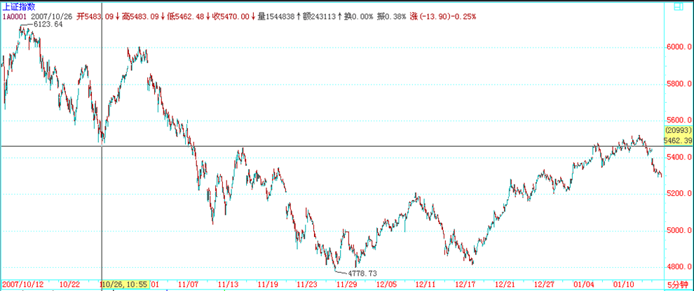

过了就过了，修正了再来。这世界上，最折磨人的就是饿啊，一饿人就变态，资金饿了股票就变态，这点，大概连紧箍咒也只能不断升级才能走过场。

因此，今年的紧箍咒版本，肯定是不断升级的，各路资金，就根据自己的承受能力以及市场的总体状况，选择自己筋斗云的时机与方式。

大概现在没有人会反对本ID一直强调的两点：一、疲软指数，高潮个股，指数让他抽两抽抖10抖；二、先下手才会早点有面包，晚了，等紧箍咒变成大铁笼，我们就啃着面包看笼里的八戒变飞天大乳猪吧。

今天的走势，没什么可说的，周线依然（1，1），看看你自己的股票，他的周线是什么？然后继续睡觉。当然，如果你心特别急，那就看日线的，如果日线都是（1，1），那你还急什么？

不过，本周出现一次有点力度的震荡是很正常的，毕竟6124点下来的所谓双顶颈线5462点已经在面前，震荡一下，身心舒畅。先下，再见。

5462点如期较大震荡(2008-01-08 15:21:47)

昨天已说“本周出现一次有点力度的震荡是很正常的，毕竟6124点下来的所谓双顶颈线5462点已经在面前”，今天早上的跳空以及下午的线段类顶背驰，理所当然地形成对5462点第一次冲击后的必然震荡。

本ID昨天后面还说了：“震荡一下，身心舒畅。”今天收盘后，被震荡一番的诸位大概每个毛孔洋溢的快感都如江水滔滔不绝于掩耳盗铃儿响叮当我们年轻时五月风光正迷人如蚁月如刀削面子曰俺这旮旯贼好。

其实，这些走势都是超技术化的，而5462点，也是一个超技术化的点位，这点位上下震荡一下，不仅必然而且必要。后面的问题只有两个：震荡的形式以及可能的结果。

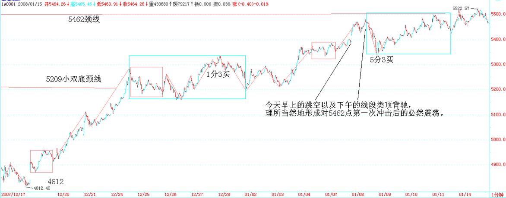

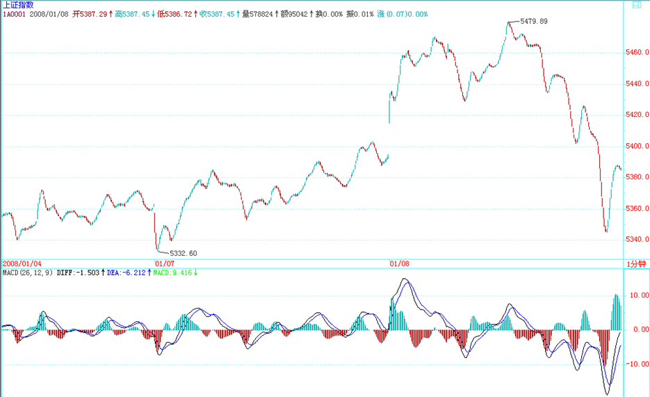

开始上课。（本课堂可以自由出入，绝对不点名，特别是关门点名，对公然离开课堂者也绝对不拳脚相加，各位可以大肆交头接耳、手舞足蹈、谈情说爱、吃葡萄不吐葡萄皮不吃葡萄反吐葡萄皮。）

无论任何情况，首先都可以很教科书化地给出震荡的形式，按强弱分的一个完全分类，对应着相应的结果：

1、如果在今天跳空附近站住，这样，5200点那5分钟上来的1分钟上涨就形成，该1分钟上涨结束后，就是对应那5分钟的第三类买点，然后，就有绝大的可能形成4800上来的5分钟上涨，最坏，也就是一大的30分钟中枢。

2、如果在5360点那1分钟中枢处站住，这样，对原来5分钟中枢的1分钟向上只是一个盘整类型，后面站住形成一个第三类买点，后面形式一个大的5分钟中枢的机会更大，当然也有突破爆发形成继续中枢上移在更高位置形成5分钟中枢的可能，但一般来说，一个盘整类型的次级别偏移后的第三类买点，总是不那么激动人心。

3、如果跌回5200点上那5分钟中枢才站住，那就没什么可说的，一个大的30分钟中枢就此形成。

所以，纯分类化分析，不管是哪种情况，除了最强那种继续1分钟中枢上移，其余的都将面对一个至少5分钟中枢的形成，最坏还要形成一个30分钟中枢，唯一需要确认的，只是这个中枢震荡的位置高点还是低点，这对操作，本质上没有任何影响。

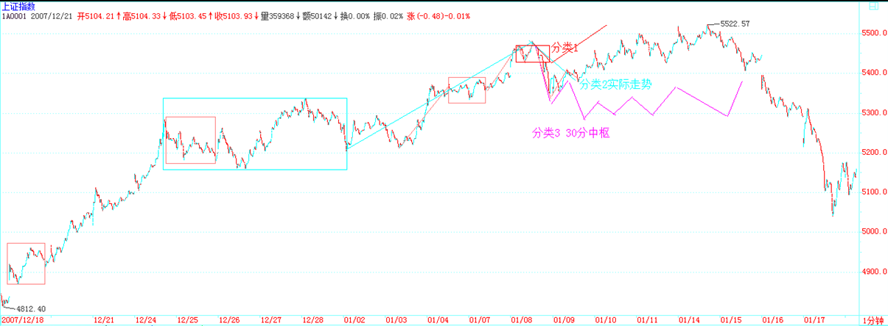

而实际上，大盘今天马上就把第一种情况给否了，所以，只要把第二、三种情况与实际对应好就可以。

以上，只是顺便把思维的方法演示给各位看，而在实际中，这些分类、判断1秒钟就应该预先反应出来，而有了这完全分类的预先操作方案，你还怕什么？

震荡是好事，特别对手脚麻利、技术高强的，最好就荡个千把回，3000%的利润都出来了。当然，对于技术不好的，震荡就是坐电梯，上上下下享受；对于心态更不好的，那震荡就是噩梦，左右被巴掌。

究竟自己属于哪种，请对号入座。

注意，本ID这里，是高低皆应。有些话是对高点的人说的，例如如何买卖点、背驰、震荡操作、换股、板块轮动之类的；有些是对没时间、短线反应慢的说的，诸如周的顶分型、5周线、持有睡觉之类的；所以，也请对号入座，并不是每一种操作都适合任何人的。

甭说本ID最近少写课程，每天解盘的课程的陪练意义可不要小视了。至于课程，写是要有兴致的，本ID最近兴致在和各位陪读历史，股票就先且陪练吧。

股票，陪什么都可以，就是不能陪套。先下，再见。

上涨动力，来自清洗。(2008-01-09 15:12:50)

其实，不仅是股票，这世界游戏的一个基本玩法，就是“上涨动力，来自清洗。”没有清洗，所有人都成功，所有人都吃香喝辣的，那就不是全球化资本的美丽新世界了。

到达顶端的，永远只能是少数人。

当然，股票上涨的动力，更离不开清洗。没有中途下车的，哪里有最后被落井下石的？没有踏空的、被洗的，哪里有最后被套的、接棒的？

藐视技术的，最终只会被技术所藐视。对付震荡、清洗，本ID理论里早给出了最好的办法：分型。请问：如果震荡连（1，1）在日线上都没打破，有什么可说的呢？对于技术高的，震荡后就要回补，如果没这个反应能力，就不做震荡，这个道理说了N的N次方遍了。

震荡，对于有准备的个股与资金，就是给了一个更好的上涨理由，越震越强。抛下一批人，轻装好前进。所以，很多股票，在震荡一下后就开始很无耻地创出新高。

无耻，一定是市场上最荣耀的事情。

本ID反复说了，年初越无耻越有面包，1月10日都没过，就想着逃命，那干脆今年什么都别干了，回家学君子剑吧。

技术上的情况昨天早说了，就是第二、三种情况的选择，5分钟还是30分钟中枢的选择。不管是什么，最终都以是否有效站住5462点为标志，站住，就再狂飙突进一次；站不住，就歇歇等能量聚集够了再来。

而个股并不大关心这些，因为资金很饿，管你站不站住什么傻点位，市场这么多资金，就算指数大跌，个股行情也依然不会含糊。所以，本ID早给了各位一个明示：疲软指数，高潮个股。

今天谁能越早把面包赚到手，就是牛人。年初不大胆，难道等着年底倾家荡产？

慢慢地，锅热了，大家伙也会变只蝴蝶满天飞。

在站住5462点前，震荡依然继续，震荡中会有三种人：随便抽血的、看着周顶分睡觉的、被左右巴掌的。你希望成为哪一种？先下，再见。

把下面的指数剧本告诉你(2008-01-10 15:19:00)

剧本早写好了，本来瓜田李下，不想八卦。但本ID只是想证明一件事情，就是在资本市场里，就算把剧本告诉你了，绝大多数人最后还是要在井里的，好一点的，就是上上下下去为电梯卖广告，不信？走着瞧。

告诉各位一个总原则，牛市里，深圳成分股是一个先头部队，十几年了，从来没改变过。为什么？说白了太简单，因为深圳一大早就爱看成分股，操控几十只股票总比搞1千几百只股票容易吧。自从96年那次把琼民源之类深圳成分股搞得漫天鸡毛以后，这特色就算留下了。这里还有资金方面的一些历史性与结构性原因，具体就不想八卦了，总之，这是一个总原则。

所以，所有关于上涨的有野心的剧本，第一原则，就是先把深圳成分股给挑出一片蓝天，如果深成指都没有蓝天，其他指数就更要一边晾着了。

挑出一片蓝天，关键是测试风向。

至于上海指数，一般都十分技术化。所有人都知道3600的1/8是多少吧？这次从6124点下来，就是3/8的3600，1350点，精确位置是4774点，结果搞了一个4778点，差了4点，真够差劲的。

6124点下来的2/8的位置是5224点，结果第一拨反弹的位置在5209点，差得有点多，都快15点了，太过分啊。

1/8的位置是5674点，这是下一个位置。但由于整个跌幅的一半在5451，而那M头的颈线位置在5462，所以这个点位是任何剧本里都需要折腾的位置。另外，注意，下跌的2/3位置在5675点，是不是和5674点有点类似？

剧本里对5860到5912这个缺口很不满意，已经准备了不少胶水，不过还有点缺货，什么时候把剩余的胶水准备齐了，关键看在5462到5675点时间段内政策面的风向，风向不对，那就先把买胶水的钱换成买棒棒糖的，一人一个棒棒糖，看你要棒还是糖。

风向不变，那就开始倒卖假冒的胶水，一人分一杯，粘只鸟儿就往天上飞。飞着飞着，突然散了架，剧本的一节到此结束。

至于下一节，有心情的时候，再告诉你。

今天大盘，继续折腾这5462点，看着越来越多人接受本ID早折腾早有面包的理念，本ID相当欣慰。先下，再见。

2008年，谨防宏观调控过度(2008-01-10 17:33:22)

按照中医的观点，治人与治国的道理是相通的。而对经济的调控，显然是治国中一个极为重要的方面。经济之病，与人体之病的道理，也是相通的。

中医将病的状态分为三种：未病、欲病、已病。而经济之病，同样有这三种状态。而病，不是一个机械的静止概念，病的状态，是可以不断转化变化的。而很多时候，病是吃药给吃出来的。一个小病，吃药给吃成了大病，这种事情并不是天方夜谈。经济问题，同样如此。

病无常态，药也无常态。站在大的视角上，天下万物，无一不是药，又无一不是毒药。相应了，就是药；不相应，就是毒药；而这相应，没有任何先验的必然法则，一切都是当下现成的，是当下一切分力的合力结果。

但更重要的是，对一切的病，任何外在的药永远都只是辅助性的，人自身自有无上之药，胜于一切外在的药物。真正的用药，最终必须以把人自身的无上之药给激发出来，这样才能真正地治本。当人自身的无上之药激发出来后，才能不治而治，否则，天天吃药，神药也要变毒药。

此外，用药也要因人而异，一个元气充沛的少年与一个油尽灯枯的老者，即使同样的病，用的药也不可能相同。同样，同一个人，在人生的不同阶段、在不同的地理环境下、不同的季节中，同样的病，用的药也不可能相同。

对于中国经济，站在一个大的历史角度，我们依然元气充沛而不是油尽灯枯。在这样的历史大背景下，任何对经济的用药，都必须以激发自身的元气自我修复功能为界限，而不能用药过度伤及元气。

更重要的是，我们的经济元气充沛，但我们的经络系统并不畅通、我们的任督二脉也远没贯通，这也就是为什么我们的经济特别容易发热病的根本原因。热病，光用去热之药是没用的，这甚至连治标都不容易办到，更不用说治本了。而热病不能治本，长期下去，水火不济、热毒相煎，就会淤结其中而化为毒瘤，毒瘤蔓延则成难治之症。

要治本，关键是要通经活络，打通任督，进而全身元气因时周转，生生不息而畅流贯通。任何的系统，都有其成坏住灭，治其本，并不是说就能长生不衰，而是要尽其天年。同样，经济的发展，有其阶段，有其成坏住灭，而合时的治疗与养生，就是尽其天年，让经济系统发展的相应阶段，尽可能地发挥其最大的力量，尽可能地延长其寿命、延长其发展的时间。

中国经济，正处在其历史性大发展的初级阶段，经济结构中一些最基础的单元都没有完全发育起来。我们元气充沛，但我们器官幼稚，各功能系统也处在极端幼稚阶段。因此，我们任何的治疗，都离不开对各功能系统的养育。任何过猛的药，对于极端幼稚的功能系统，其作用都是极端恶劣的。一个经济系统，由于在发育阶段过度用药、胡乱用药，最终导致某些功能系统彻底发育不良进而导致经济的长期畸形发展，这在世界经济历史上并不是罕见的事情。

人身体的健全，首先是各器官、功能系统等的健全；同样，经济系统的健全，如果没有各基础的单元系统的健全，那么是完全不可想象。对于中国这样一个市场经济的青少年，关键是身体发育的健全，离开这一点，任何疾病的治疗都毫无意义。

2008年，谨防宏观调控过度，就是因为我们的经济现在正处在青春期发育的关键时期，但我们很多最基础的单元并没有达到应有的发育水平，这时候，是用猛药把一些病状强行压制，还是用适当的药进行稳定疏导，尽快补课，把该发育好的部分尽快培育，这对中国经济的长远发展有着决定性的意义。

因为饿，所以疯狂。(2008-01-11 15:10:16)

世界上最疯狂的是什么？是饿。这对于资金，也是一样的。

今天的大盘，没什么可说。周末效应了一把，但依然继续对5462点的震荡确认，今天当然只会是试探性质的，完全没必要在指数上干些只争朝夕的事情。

但个股上当然不同了，资金饿啊，春节要买年货啊，年货都在贵ing，除了那些脑子有水的，饿绿了眼的资金，哪里管得了什么周末效应。

站在周线角度，下面两、三周是极为关键的，为什么？因为MACD的绿柱子在收敛，而所有的骗线，最爱的就是这种收敛放红途中的突然转折。

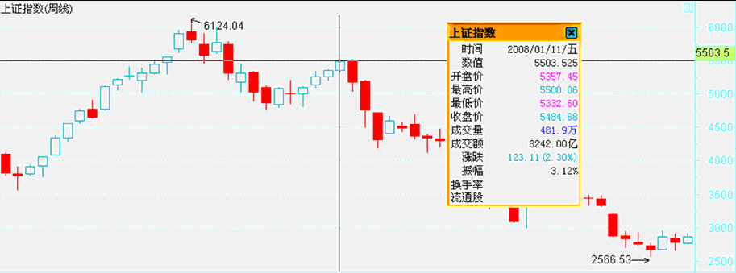

当然，这只是技术的可能陷阱，政策面上，按道理，春节前是不应该有人太干活的。但今天的天气是否如常，没人说得清楚。预测天气这种事情，完全没必要。

唯一必要的，就是大干快上，把自己安放在一个绝对安全的位置。管他刮风下雨，有了足够的利润，什么变化都可以从容面对。

到了5600点上下，政策的因数就会变得极为重要了，新人新思路，市场各方无一不在相互摸索探究中，放个气球，测测风向，大概还不是问题的根本所在。

这些无聊问题，其实都可以安放到周的顶分型、（1，1）里，对于懒人来说，没时间探究这些分力之间的游戏，一切都在走势之中。

看看，周（1、1）依然，日（1，1）依然，你就继续睡觉。周末，放风了。先下，再见。

指数犹疑，个股补涨 (2008-01-14 15:10:28)

到了目前这个位置和时间段，大盘进入敏感阶段。首先，对于多头来说，好不容易到了5600点上下这最重要的阻力跟前，绝对不想一个哆嗦就给震回去。但这个关口确实比较压力大，主要不是技术上的，而是心理与政策面上的。

从政策面的角度，很快就进入春运阶段，因此，对于政策的活动空间，这几天是最敏感的。如果要有什么花样，这几天的可能性最大。到了月底，快春节了，大家都有忙的事，而且没人想给中国足球队当挡箭牌，那群家伙除夕准备给大家添堵，难道还有谁想分担一下被骂的风险？这种人大概是没有的。

所以，指数在这个时间段犹疑一下，并不是太严重的事情，目前技术上，继续是原来说的第二种情况，在5462点附近震荡出一个5分钟中枢，大不了向一个30分钟的延伸去，所以指数依然继续抽两下，哆嗦十下的节奏。

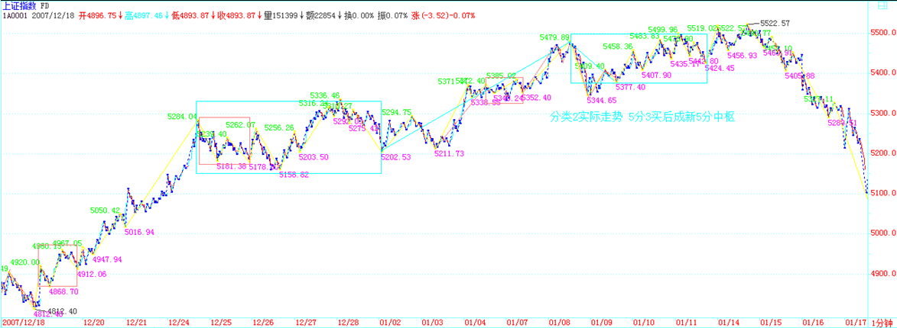

个股上，一些前提幅度较小的板块开始补涨，由于大家伙这时候不适宜集体暴动，因此这些补涨后板块的动向就很关键了。现在市场越来越大，参与的资金成分越来越复杂，只要指数形态不破坏，板块机会还是很多的。

到5600点上下后，震荡的幅度会有所加大，现在最好的策略，就是往上拱，拱一下，震几下，这样心态、技术等压力就会慢慢破解，千万不能急，急了，根基就不稳。

技术不行的，中线上，继续看周的（1，1）保持情况与5周均线，短线看日线的相应指标；技术好的，可以利用5分钟震荡的节奏进行板块操作。先下，再见。

大盘压力期下的多头策略 (2008-01-15 15:09:40)

已经反复说过，目前大盘进入压力期，首先是政策的敏感期，其次，技术上也有相应的重压力区在面前，更重要的是，除了大家伙，板块在基本轮动一次后，很多股票都进入相对的调整期，这时候对多头来说，确实有点压力。

一般来说，碰到这种情况，有两种处理的方法：一、跳一次大水，把压力变动力，把不坚定的赶跑，用空间换时间，加快调整的结束；二、在这里上下震荡继续磨，让成交量慢慢萎缩下来，以时间换空间，最后取得新的上升能量。

不管哪种情况，用本ID理论的角度看，都是扩展出30分钟的中枢，然后再寻求突破。5462点这个位置，反复强调，一直不能有效站住，需要多头努力的事情还很多。

说白了，现在最好有一个不大不小的利空，这是对多头最好的礼物，否则，现在消息面太平静，反而对心理上不是一个好的暗示。大盘究竟采取哪种调整方式，其实从30分钟的震荡走势中不难发现，一般来说，成交量能萎缩下来，就第二种方式；否则，并不排除有一到两天让大家再次想起亮晶晶的机会。

个股的节奏以前已经说过了，一般突破6124点或530高位的股票，都会相应有所调整，如果能站住，就会有第二波，现在很多股票都处在这种状态，等待大盘最终调整的结束。

只要有一点机会，多头都会往上面去挑逗那5600点的重压力，但折腾少不了，必须耐心才有好果子。先下，再见。

## 教你炒股票93：走势结构的两重表里关系2 (2008-01-15 18:08:05)

显然，所有问题都集中在（1，0）或（-1，0）之后怎么办，如果这两种情况后只有一种情形，那当然不错，可惜这世界没有这么简单，（1，0）或（-1，0）之后，都有（1，1）、（-1，1）两种可能。

以（1，0）为例子，（-1，0）的情况反过来就是。（-1，0）这个信号是绝对明确，毫不含糊的，任何人都可以唯一地去确定。那么，一个同一的信号，对于不同的人，处理的方法是不同的，这和每个人的水平相关：

一、如果你震荡操作的水平一般，而又胆子比较小，又没时间、跑道，喜欢落袋为安的，那么，一个足够周期的（1，1）后出现（1，0），例如周的或日的，这意味着已经有足够的获利空间，这时候，最简单的作法就是把成本先兑现出来，留下利润，让市场自己去选择，不费那个脑子了。

剩下的筹码可以这样操作，就是如果出现（-1，1），那么意味着低周期图上肯定也出现（-1，1），那么在这个向下笔结束后回来的向上笔只要不创新高，就可以把剩余筹码扔掉。例如周的，你可以看日或者30分钟周期的低周期。当然，还可以直接就看周的5周均线，只要有效跌破就走，这可能更简单。

二、如果你震荡操作水平比较好，就利用（1，0）后必然出现的震荡进行短差操作，由于都是先卖后买，所以如果发现市场选择了（-1，1），那么最后一次就不回补了，完全退出战斗。

注意，利用短差操作时，一定要分析好这个（1，1）到（1，0）所对应的走势类型，例如一个周线上的（1，1）到（1，0），必然对应着一个小级别的上涨，至于这个级别是1分钟还是5分钟、30分钟，那看具体的图形就一目了然了。

（1，0）的出现，有两种可能的情形，一、该对应的上涨出现明确的背驰完全地确认结束，那么整个震荡的区间，就要以上涨的最后一个中枢为依据，只要围绕着该区间，就是强的震荡，否则，就肯定要变成（-1，1）了，就是弱的震荡了。弱的震荡，一般一旦确认，最好还是不参与。等出现（-1，0）再说了。

三、如果市场最终选择（1，1），那么这个（1，0）区间就有着极为重要的意义。这区间上下两段的（1，1），就可以进行力度比较，一旦出现后一段力度小于前一段，就是一个明确的见顶信号，然后根据对应的走势类型进行区间套定位，真正的高点就逃不掉了。

上面，把可能的操作进行了分类说明，方法不难，关键是应用时得心应手，这可不是光说就行的。最终能操作到什么水平，就看各位自己磨练的工夫了。

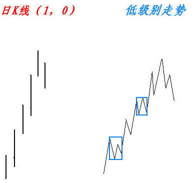

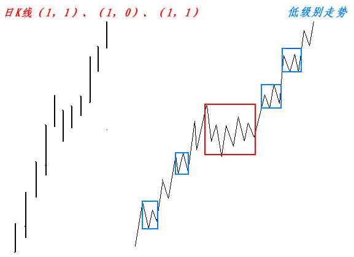

大盘又见亮晶晶 (2008-01-16 15:17:40)

昨天说“并不排除有一到两天让大家再次想起亮晶晶的机会”，结果，今天那花旗参大作广告，使得大盘又见亮晶晶，严重怀疑亮晶晶暗中代理了花旗参的销售。

中投公司，前段时间不是牛哄哄地趁底买这股权那股权，现在花旗参来了，中投公司是不是又想把一千几百亿往里面填数堵窟窿呢？

中国人该干什么，本IDN年前的人民币与货币战争里就说清楚了。中国人根本没必要去美国人的地头玩，中国人要烂也只能烂在自己的锅里，自己创造一个全世界的市场，别人爱来不来，我们就自己玩了，憋死你们。十三亿中国人难道还要请3亿的美国鬼子来才可能开桌打麻将？甚至还要漂洋过海去纽约开麻将桌？可笑！

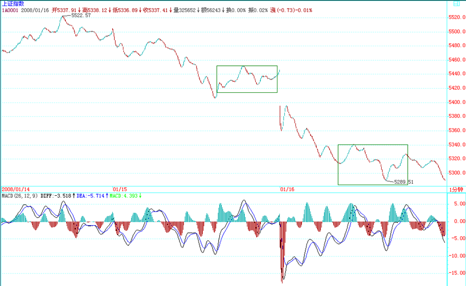

当然，如果你今天把本ID说的股票当成自选股，没看指数，那么，今天好多无耻地放红，不少更无耻地创出新高，完全没美国鬼子什么事。不过，这种情况，如果过分延续，是不好的，太脱离指数也不好，所以下面还是探讨一下指数的问题。

显然，今天的走势对多头来说，并没有什么大不了的，甚至是多头所乐于看到的。这原因，昨天已经说了。技术上，今天的缺口有着极强的技术意义，如果三天之内不回补，那么大盘后面的压力就进一步加大。下面关键是5209点的颈线位置，这位置只要不有效跌破，大盘就依然在多头的控制之中。

短线上，5522点下来的这个线段的类下跌过程十分技术化，两个类中枢也十分明显，下面就是这类下跌的类背驰问题了，一旦出现，就是一次有力度的反弹，关键是这反弹能否突破第二个类中枢的牵制，如果不行，那么缺口的回补就有困难，所以这才是技术上的关键。

日线上，昨天的顶分型后，现在延伸成笔的可能太大了，只要明天有新底就基本确定，所以，稳健的角度，可以等底分型才会有真正的站稳可能，所以这个类背驰能否最终制造出底分型，就是进一步考察的关键。

个股方面，很多股票会继续表现的，当然，如果你觉得心脏受不了，可以先把本拿出来，例如600737之类的，剩下利润在里面继续。有些股票，会涨到你不相信，等你相信了，就是井了。

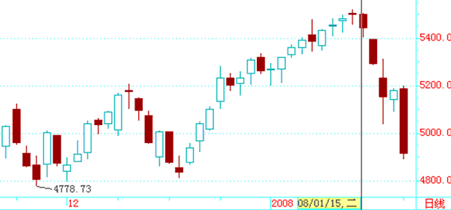

要出一次差，到深圳开一个和PE有关的股东会议，后面几天，晚上的帖子，可能保证不了了，不过解盘还是保证的。先下，再见。

不会享受大震荡的人股票就没入门 (2008-01-17 15:14:57)

亮晶晶一、两天，今天就是第二天，多么优美的节奏，不懂得欣赏，太浪费剧本费、排演、场租了。

当然，享受有不同级别，一种是被动型的，一种是主动型。被动的就不说了，都是电梯广告的最好代言。而主动型的，就要靠技术了。

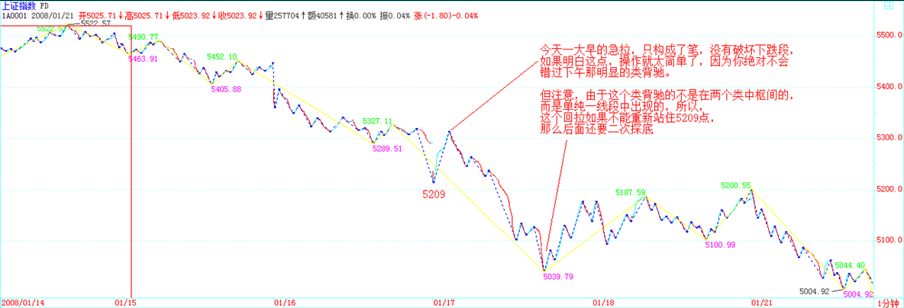

别小看了最基础的分段技术，5522点下来，近500点，就是一个线段的类下跌，你明白了，就主动了，就享受了。为什么？最猛烈的中枢移动中，往往就是一个线段的类趋势，所谓的单边跌势或涨势，就是这玩意，明白了，你说你能不爽吗？

今天一大早的急拉，只构成了笔，没有破坏下跌段，如果明白这点，操作就太简单了，因为你绝对不会错过下午那明显的类背驰。

但注意，由于这个类背驰的不是在两个类中枢间的，而是单纯一线段中出现的，所以，这个回拉如果不能重新站住5209点，那么后面还要二次探底。

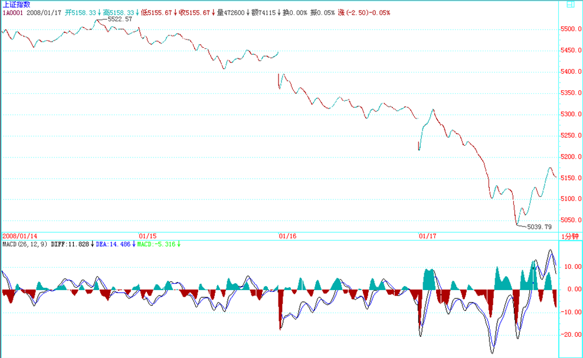

本周开始时已经说了，春节前要出点情况，就是这周了，后面，就要逐步营造点和谐的气氛，但在营造和谐之前，首先要营造的是恐怖，没有恐怖，把不坚定分子彻底清洗，哪来和谐啊？

个股方面，昨天的提示已经足够明确：“这种情况，如果过分延续，是不好的，太脱离指数也不好”、“如果你觉得心脏受不了，可以先把本拿出来，例如600737之类的，剩下利润在里面继续”，今天早上，这些股票都有红盘，000822之类的甚至还有新高让各位去反应，如果你没反应，那本ID也没办法了。总不能举着杠铃让最没反应的人去反应吧，如果这样，这就不是市场，而是童话世界了。

至于600319今天还涨停，那不过是一个态度问题，这里的老人大概都知道，就算是530最恶劣的时候，本ID说的股票里还总有一两只顽强地红盘的，注意，一定要声明这可和本ID无关，那大概是电脑出毛病了，抽筋了。

注意，现在没必要追高买股票，注意调整中洗盘洗干净后准备重新启动的，还有就是前期不动，有新资金介入的，但所有的前提是，大盘的恐怖期过去了。

明天周末效应，震荡肯定还会有，但如果没有什么特别的东西，幅度会逐步小下来的，其他，等过了周末，看看消息面、政策面情况再选择。

技术高的，现在是游戏的黄金期，一个30分钟的震荡，操作好了，收益比单边还要高，特别对资金不大的散户。没这水平的，就把仓位控制在适当范围，也就是可以睡觉睡好的范围，等日的底分型出现再说。

先下，再见。

今年投资者的四种命运 (2008-01-18 11:45:59)

下午一收盘就开始股东会，没时间写解盘，晚上，这群家伙不会放过本ID的，周末有时间再补上，抱歉。

早上走势，和昨天说的一致，就是两天的亮晶晶后，震荡还有，但幅度变小，但由于5209点没重新站住，大盘总体还在一个剧烈震荡后的平复期，依然有较大不稳定因数与情绪需要时间平复，另外，周末的政策消息面以及外围因素，依然有巨大的心理影响。

下面，把写好的一帖子贴上来，算是今天的帖子了。

在去年底的今年展望中，已经明确指出今年走势的多变性与操作难度。

今年“与井同行”，一般来说，没有足够的自我意识，企图靠拐杖的人，今年都会比较麻烦。投资，是一种专门的学问，前提是，你首先是一个有思想的人，而不是一个木偶。

就像在那篇关于剧本的帖子里本ID说的，就算把剧本告诉你，很多人最终还是要落井。为什么？因为，首先很多人大概都是跟着孔男人学的中文，中文理解力几乎为0，剧本可能也读不懂。例如，当时写的这一段：“ 剧本里对5860到5912这个缺口很不满意，已经准备了不少胶水，不过还有点缺货，什么时候把剩余的胶水准备齐了，关键看在5462到5675点时间段内政策面的风向，风向不对，那就先把买胶水的钱换成买棒棒糖的，一人一个棒棒糖，看你要棒还是糖。”

如果你竟然能理解成大盘一定要先到5675点，那么，就去找孔男人追讨中文的学习费用吧。请问，5522点是否5462点到5675点之间？请问，这时候发棒棒糖难道有一丝一毫违反剧本吗？关键是，你在这过程中，是吃棒了还是吃糖了？技术好的，在这个震荡中，早爽呆了；技术不好，心态又不好的，不吃棒那是没天理了。

“一人一个棒棒糖，看你要棒还是糖。”这句话，好好体会吧，全年都有意义。

其次有些人，理解到了，看到5522点后的日顶分型，但就是对自己的判断没信心，一定要一个拐杖。好了，就算本ID提示有1、2天亮晶晶的拐杖，但真来了，估计你也没心情拐杖了。

本ID在日顶分出现的当晚给了”教你炒股票93：走势结构的两重表里关系2 2008-01-15 18:08:05“，很多人看了，觉得是重复，和以前的没什么不同，你现在在去看看这针对性，你选择好了自己的位置没有？你属于什么类型，对应的处理，你处理好没有？

操作，不是一个纯学院的讨论，操作都在细节之中。何谓细节？你自己的水平，就是第一大的细节。然后选择符合自己水平的操作，这就是第二大的细节。最后，按规程操作细节去操作，这就是操作的全部。

在市场中，不首先认识好自己，一切都瞎掰。

本ID之所以写这帖子，是因为现在2008年才过了10几天，如果现在不彻底清醒过来，那么，今年将是很多人的灾难之年。最好的选择，就是现在马上退出吧。

今年，所有人将面临四种命运：

1、技术好、心态好的，将比去年还赚钱，别小看震荡的功夫，回头看看，从6124点下来到今天，也就是走了一个30分钟的盘整，只不过这中枢有点低，在5209点上下。谁只要把线段、1、5、30级别搞清楚，对于散户来说，足够了。按本ID的理论，2005年中开始的行情，到目前为止，最多就算是日线级别的，一个日线级别就走了2年多，你就知道本ID这体系的宽广度。

2、技术好，心态不好的。这种人几乎没有，因为真的技术好了，一切都看明白了，自然心态好。如果真有这种人，那今年的成绩也就赚点小钱了。

3、技术不好，心态好的。今年就做电梯广告，最后，那电梯广告做多，老化了，有出大事故的风险，例如，突然从20楼掉到负18楼。

4、技术不好，心态更不好的。今年将是这种人的灾难年，是最好的绞杀对象了。

今年，给所有技术不好的人一个忠告，就是一旦有足够的利润而有出现不好信号时，一定要先把本给拿出来。

另外，给那些还希望有更大追求的一个提示，你看看本ID说的股票，当成一个投资组合，你就会发现这个组合十分地有意思，就是此起彼伏，几乎没有一天闲着的。为什么？对于大资金来说，这样是效率最好的。资金才可以最大效率地流动，才可以又清洗又发力，动态地膨胀。

其实，去年初本ID就明确告诉过，本ID的股票组合就是这样的，如果你是散户，能左跳右跳地根据组合中的买卖点来轮动，那你的收益就十分惊人了，绝对比追什么黑马股票要牛多了，而且极为安全。当然，能做到这一点，并不容易，但这好像是一个考验，一个提高，现在做不到，也要有这方面的意识才行，否则，资金的高效率，就很难办到了。

注意，你的组合选择不一定按本ID的来，本ID的可以当成一个教学的版本。

不过，一定要注意，没这水平与意识的，就算了。我们总要实际点，不是每个人都能成为高手的，更多人一生的努力，也就是这样了，这是实际的话。

有些话，只是说给相应的人。世界上的山峰，并不是所有人都能或需要会当临绝顶的，先把自己认识清楚，把自己的能量激发出来，如果这样，你就是能会当临绝顶的人了。

在那绝顶之上，万古长空。

多头能否构建缓升通道？ (2008-01-19 10:31:53)

对不起，昨天忙于开会，没时间解盘，现在补上。

周五大盘这种走势，已经在周四解盘中说过了，就是震荡幅度减少，等待消息、心理面的平复。周五，一个标准的箱型震荡，最后高收，由于5209点的跌破，没有到三天的基本限期，所以只要下周初能站上去，就可以了。

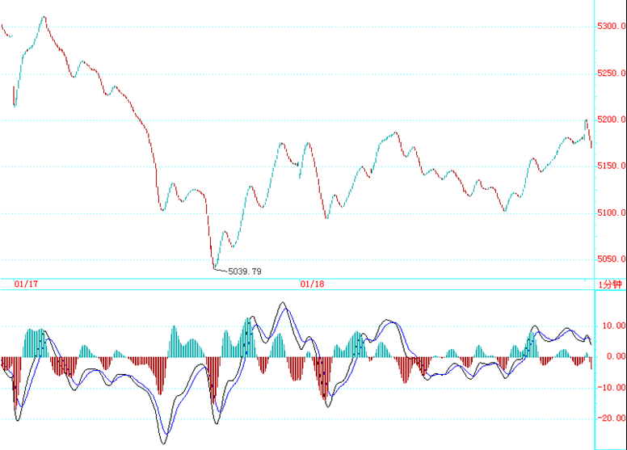

好了，现在，用最明确的语言告诉各位后面大盘的走势。但本ID依然要告诉你，肯定还有很多人，特别是跟着孔男人学中文的，最后还是要到井里去。本ID的语言，从来都是如数学般精确，关键你要明白。

现在，就是一个30分钟的大震荡，按照本ID的理论，30分钟的震荡，最坏的情况，破4778点也是可以的，为什么？这么简单的理论问题，就别问为什么了，去看课程去。

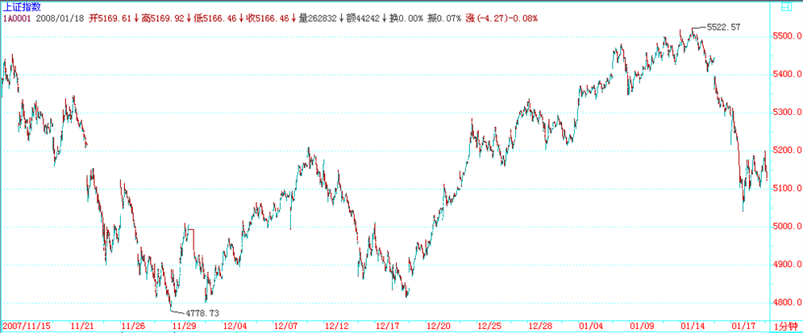

当然，对于多头来说，当然不希望出现30分钟震荡中那种最坏的情况，那么，对于多头来说，化解这30分钟震荡的唯一方法，就是制造一条缓升通道。

现在，你打开日线图，这缓升通道的4个原始支点中的3个早出现了，这次的亮晶晶，如果多头能控制住，那么就是完成第4个原始支点的制造。有了4个点，上面两个，下面两个，这通道就形成了，后面就可以按这通道继续游戏了。

这通道的特点，就是速率比较缓，但幅度比较大，这样，就可以制造出相应的行情，又有足够的回旋余地。是目前多头在如此政策消息技术面下唯一最佳的选择。

通道式上涨，是最不消耗能量的，只要操控得当，就可以把成本震荡得最低而又保持好基本的形态，一旦有一个飞腾的机会，就可以破通道而出，最后挖出了迷绝众生的大井，让所有被通道折腾的都变青蛙去。

本ID已经把坏招都说了，但本ID一定要声明，本ID不是多头也不是空头，本ID只按自己的理论办事，因为，一旦多头失败，陪葬的只能是他们自己，本ID最多会给他们加一把土的，不过，为了今年的面包，在年初的时候，本ID在精神上当然是支持多头的，对多头下手温柔点，目的是为了后面把他们养肥了好下重手。无疑，对多头的缓升通道，本ID是乐见其成的，也会一旁摇旗呐喊一番。

但，本ID对30分钟震荡的所有情况，都会有相应的对策，一旦多头不能显示出足够的信心，本ID会把他们变成青蛙煮粥喝的。

面包不够，只能喝青蛙粥了，好可怜啊。

如果上面的文字都看不明白，就快去追讨孔男人去吧，孔男人，你教的什么中文？

但更重要的，比追讨孔男人更重要的，就是一定要知道，学习本ID的理论后，就永远不会有什么无聊的多头空头滑头的想法，市场只是市场，走势只是走势，如此而已，你需要的，只是倾听。然后，你的心里马上升腾出所有可能走势以及相应的对策，然后，就看着市场的出牌去出牌，如此而已。

市场，不过就是一桌麻将，周末，搓去吧。明晚，北京见。

又被暗算的多头尚能饭否？ (2008-01-21 15:18:54)

刚被花旗参暗算完，周末又被平安保险暗算了一把，多头至少在指数上已经没有任何的回旋余地。技术上，前面已经说了，5209点不能重新站住，就要二次探底，直到出现日的底分型为止。而一个30分钟震荡，4778点在最坏的情况下完全可以被击破。被暗算的多头今天开盘无力站上5209点，就使得后面的走势变得只能以坏的选择去选择了。

站在本ID的角度，并不大关心这类问题。本ID最关心的问题，最近都有了答案。应该记得，去年末时，本ID痛斥了某些人为了某些原因，企图年末抢闸上报所谓的股指期货，现在，事实已经出来了，那企图已经破产，而那些尾随而上资金，不仅失去了一波大的个股行情机会，而且终于忍受不住，落荒而去。

这就是本ID最愿意见到的结果，股票，可不单单是那几条曲线。对于散户，当然可以只关心曲线，但后面的刀光剑影，你又能知道多少？

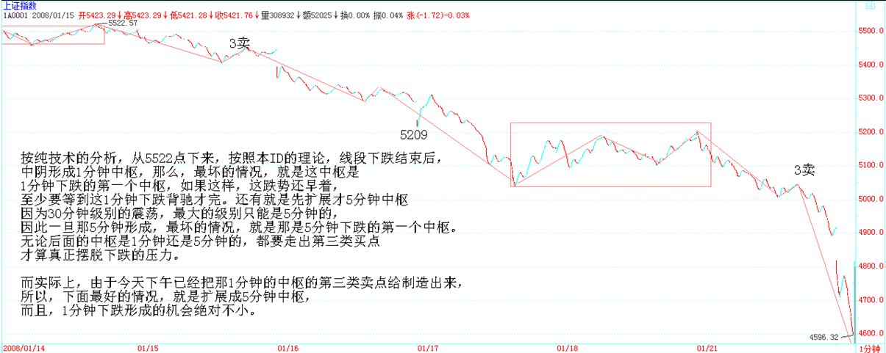

大资金，只有杀大资金才能爽的，那些整天盯着散户的资金，算个屁。

本ID的观点从来都很明确，要烂就都烂在A股，本ID一直的愿望就只有一个，把A股变成全世界最大、中国人自己的麻将桌，让鬼子只有屁颠屁颠的份，任何违背这个目标，本ID都要竭尽全力去阻击，例如上次那无聊的直通车。

回到今天的市场，那平安不平安，石油变瀑布，大家伙当然是有用的，等某些人彻底认输了，大家伙就有用了，如果不认输？那就想想本ID曾说过的关于中石油的一个酒桌上的故事，把话挑白了，如果不投降，那故事里的数字是可以修改的。

不说故事，说技术。按纯技术的分析，从5522点下来，按照本ID的理论，线段下跌结束后，中阴形成1分钟中枢，那么，最坏的情况，就是这中枢是1分钟下跌的第一个中枢，如果这样，这跌势还早着，至少要等到这1分钟下跌背驰才完。还有就是先扩展才5分钟中枢，因为30分钟级别的震荡，最大的级别只能是5分钟的，因此一旦那5分钟形成，最坏的情况，就是那是5分钟下跌的第一个中枢。无论后面的中枢是1分钟还是5分钟的，都要走出第三类买点才算真正摆脱下跌的压力。

而实际上，由于今天下午已经把那1分钟的中枢的第三类卖点（在什么位置和时间，一个简单的题目，如果当时不能正确马上给出的，都要补课）给制造出来，所以，下面最好的情况，就是扩展成5分钟中枢，而且，1分钟下跌形成的机会绝对不小。

从理论上有了这么明确的分类，后面的操作就很简单了。如果你不想烦，就看日的底分型的形成时再说。如果你特爱好换股短线，那么，就根据这个中枢的演化去安排具体的操作，事情就是这么简单，唯一有点复杂的是，你操作的是具体股票，指数是指数，股票是股票，从来就不经常是一回事情。所以，多关心你自己的股票，你的股票池的具体走势。例如，就算今天的走势，依然有股票继续新高。

注意，严重注意，任何股票都不值得追高，本ID也不需要任何散户来抬轿子，没有永远上涨的股票，股票涨多了就要歇歇，有本事的，歇歇也能震荡出利润，没本事的，涨多了，就把本拿出来。

任何持有的股票，都以能吃能睡为最基本的持仓标准。如果你持有一只股票，已经影响到的睡眠与吃饭，请马上退出。

股票，说白了只有四个字：级别、节奏。参透了这一点，就大块吃肉，大碗喝酒，日日好时光，天天419。否则，就被股票节奏去吧。

中线上，又被暗算的多头尚能饭否？本ID在去年末的今年分析中已经明确说过，今年完全有可能创不出6124点的新高，但，今年不是指数的行情，而是板块行情，这点，在那帖子里已经明确说过了，就算指数不创新高，依然有无数机会在等着，关键是你有没有这样的技术和心态。

少坐电梯，多练技术。最简单的一招，见日顶分型走，日底分型再回来，这一招练熟了，今年就能少坐很多电梯。

再次将本ID今年希望的三件事情说一下：想见创业板，不想见股指期货，印花税要降低。不管如何，希望都能实现。先下，再见。

## 教你炒股票94：当机立断 (2008-01-21 17:29:47)

本ID说过，要学本ID的理论，首先要洗心革面。为什么？因为你前面一切关于股票的知识，可能都是后面学习的毒药。在本ID这里，只有严格分类后的不同操作类型，没有其他那么多无聊的不切边际的所谓预测。

一句话，来本ID这里学习，第一层次，就是要达到：当机立断。

机会，是可以预先分析的，但这分析，不是预测，而是建立在完全分类基础上的边界分划，这分划完全来自本ID理论的纯数学构造，这构造的唯一性与精确性保证了这分类与边界的当下确认性。

其实，这问题已经说过，但必须再次说，为什么？因为这是一种完全不同的思维方式，如果你不能明白，就永远与本ID的理论无缘。

例如，在现在，对以后的大盘走势，我们马上可以分析出所有必然出现的机会：1、一个最小的机会，就是大盘线段下移后形成的线段类背驰，这里对应这两个目标，最好的是回拉上面的1分钟中枢从而形成5分钟中枢，剩下的就是形成第二个1分钟的下跌中枢。

2、第一个机会出现后，根据演化的当下选择，马上可以找到下一个必然出现的机会，就是如果是5分钟中枢，那么就有着一个中枢震荡的机会；如果是1分钟的第二中枢，那么就等着后面的底背驰或者这中枢扩展为5分钟后的震荡机会。

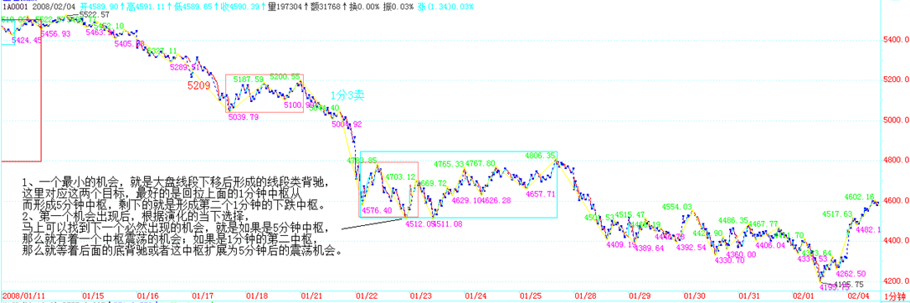

类似地，对任何走势，我们都可以根据理论，马上严格地给出必然出现的机会。市场就是这么贱，虽然折腾无数的人，但就是从来没有任何失误地按照本ID的理论去走，所以，本ID可以把市场叫为面首。

任何一个当下，你都可以根据本ID的理论马上给出后面必然要出现的机会。上面说的是买点，卖点的情况是一样的。

好了，你根据理论，可以罗列出一大堆必然出现的机会。后面面临的，只是选择问题。例如，第1个机会，你会觉得级别太小，不想搞。那么不想搞就不想搞了，就像一个面首，你见了不想搞，难道还需要什么理由？

你真正明白了本ID的理论，操作其实就是这么简单，唯一需要问自己的，就是你现在有没有搞的兴趣，这个机会，这个面首，在这一刻，你想搞吗？

如果你想搞，那么，你就需要一系列的准备，通道的、资金的、一切的安排都要安排好，然后关键要把退出的边界条件也设置好。

例如，对于第1个机会，设置的退出条件，就可以是原来的最后一个类中枢，或者是线段向上走势类型中的类背驰或类盘整背驰。

当然，根据这样的设置条件，在T+1条件下，你完全有可能走不出来，为什么？因为这买卖点可能就在当天完成了，买了卖不掉。所以，在设置时，可能还要参考机会出现的时间，如果在早上，可能要考虑一下。如果在下午，那就胆子可以大点。

当然，这还和你自己实际的情况有关，例如一个中线走势极为良好的股票，如果一个线段下跌就去掉了20%，而你又在高位跑掉了，那这个回补机会当然就可以胆子大点。

更容易的，就是把级别放大点，如果你按周线操作，那么从2005年下半年买了到现在，你根本连一次都不需要操作，谁告诉你本ID的理论只做短线的？是孔男人告诉你的吧？

对于每种机会类型，都需要把各种可能的出现情况都考虑清楚，这样可以判断其力度，从而绝对进出的资金量。这就如同419，你今天想419了，但总要看到真正的货后，才能决定这投入的量。谁告诉你419就一定要奋不顾身的？419难道就不可以见了就撤？从见了就撤到奋不顾身，这里可以有无数的情况出现，当机立断，这就是唯一的。

学了本ID的理论，脑子里必须时刻有两个字：级别。如果连级别都搞不清楚，你还419？被419还差不多。有了级别，就是节奏问题了，419，就是见好要收，而不是天长地久，这都不明白，就等着灾难连连吧。

不会卖出，就等于失去了下次买入的机会。这个节奏之所以难，说白了，就是贪嗔痴疑慢作怪。

对于初学者，一定要机械地给点束缚，等于那死猴子带上个圈圈。这个束缚，就是5周、5日这些线，一旦分型后有效破了，一定走，这就是束缚。当然，对熟练的，就不需要这些了，严格的走势分类自动就给出一切。

练习的第一步，很简单，就是在任何时刻点位，都能马上把后面根据理论把机会第一时间反应出来。

注意，任何的机会，必然在本ID理论的输出中。市场的机会与本ID理论的输出，是严格一一对应的。这就是本ID理论所以厉害的其中一面。

第二步，根据自己当下的心情、资金等等，选择介入的机会，放弃不想介入的机会。

然后就等待机的显现，当机立断，就这么简单。但，这最后一步，足够你修炼N年了。

超短线反弹在即(2008-01-22 15:12:04)

看今天的帖子之前，如果没有看过下面的帖子的，请先看看“2008年行情展望 2007-12-20 15:59:05”

大盘的走势，和昨天晚上课程说的是一致的，就是等待第一个机会，线段下跌的类背驰，显然，在今天早上的反弹后，第二个类中枢已经形成，所以，这个第一个小机会已经在即，这构成短线的一个反弹。

反弹，将至少构造一个1分钟中枢，由于在5100上下已经有1中枢，因此这构成1分钟下跌的第二中枢的可能性极大，除非能线段式地一下重回5100点，否则，只有这种情况。

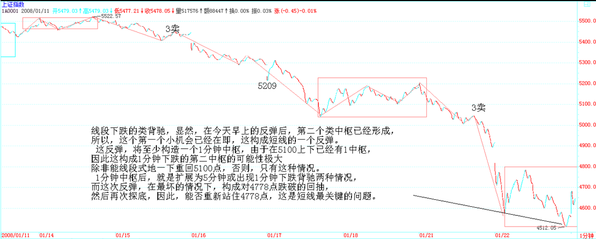

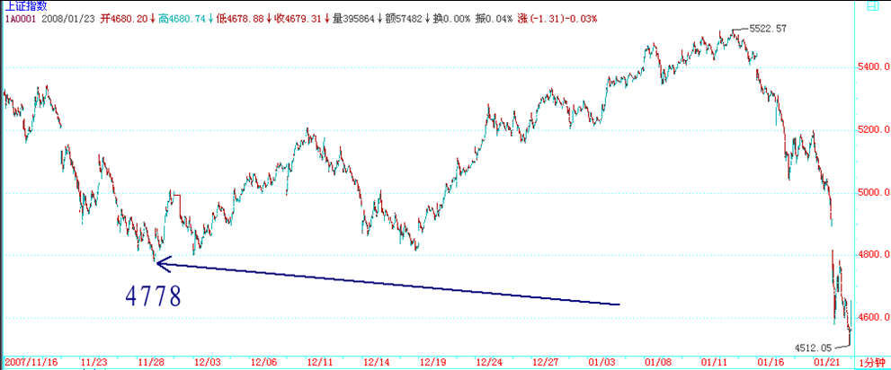

1分钟中枢后，就是扩展为5分钟或出现1分钟下跌背驰两种情况，而这次反弹，在最坏的情况下，构成对4778点跌破的回抽，然后再次探底，因此，能否重新站住4778点，这是短线最关键的问题。

上面这机会的把握，就看你的技术了，没这技术，继续等到日的底分型确认才介入，这样，风险比较小。

注意，这次的回跌，有着很多股票之内之外的因素，站在长远的角度，这样一次走势，是必须的。就算最简单的情况，印花税如果还是现在的，谁都没法混。此外，那些所谓的大家伙，随便就狮子大开口，这样的情况不警戒一下，以后谁都没法混。

市场的游戏规则的维持，有时候是很残酷的，这点没什么可说的。

注意了，今年是井的年份，井可以是上面的，也可以是下面的，今年，只有心态加技术才能够成功。

心态好的，坐一次电梯，那这次电梯后，最好也顺便把技术提高一下；至于心态不好的，那就上面落井，下面再落井，本ID的青蛙粥原料充足了。

当青蛙还是猎手，自己瞧着办吧。先下，再见。

## 教你炒股票95：修炼自己 (2008-01-22 16:10:20)

本ID觉得，当人被刺激后，大概学习的效率会高点，所以就连续写课程了，让有缘人得之。要战胜市场，首先要了解市场的众生。市场是合力的，而合这力的不是机械，而是活生生的人。

市场中，最多数的，都是糊涂蛋，赚钱了不知道为什么，亏钱了不知道为什么，最后变青蛙了，也会说，井上面的天空好大，好复杂，怎么处理啊？哪里有拐杖啊？

几乎绝大多数的人，进市场来时，根本不知道市场是什么，然后就不断投入，最后有些输红眼了，砸锅卖铁也就进来了。

对于市场，本ID有一个观点，大概有点过分，但确实是对的。市场，就是要0投入去赚钱。

很多人很关心ID的投资历史，当然，有很多事情，不能说，因为涉及太多的东西。但有一样事情，本ID是可以说的，就是本ID在市场中，等于没有投入过1分钱。

本ID第一笔钱是90年初新股赚回来的，那时候买新股的钱，很不好意思，不是本ID的，上市后，就把本还了，剩下的利润，就是本ID在市场中的第一笔钱，从此，无论本ID操作的钱有多少，本ID从来没有在市场中投入过1分钱。

当然，现在还按90年代初那种疯狂状态是不行了，但本ID还是觉得，你投入市场的钱，一定不能无限增加。如果你第一笔投入100万，还不能赚到钱，你还投什么啊？你100万都搞不好，难道想搞100万的平方啊？

只要你有稳定的技术和操作，初始投入多少根本不重要。就算你只有1万元，10次翻倍操作后也就1000万了，而即使你开始有1000万元，10次连续的亏损后，你也没有多少钱了。

问题不是投入的多少，而是技术与操作。所有把市场当赌场的，最终的命运都只能是悲惨的。

对于市场上的众生，本ID给的第一忠告就是，把你的第一笔钱运作好，然后把本拿走，最后把这利润变成巨大的数字，这才是市场中的真正操作。

市场上的真正成功，是以十年为单位的，无论你开始有多少钱，10年都足以让你变成上一个足够大的台阶，一笔0成本、0投入的钱，让你在市场中无比轻松。

绝大多数的人，因为贪婪而不断投入，又因为恐惧而落荒而逃。但市场，进来一次，几乎就很难再离开了。落荒而逃的，最终都是在高潮中又被忽悠进来，最终还是青蛙给煮了，这种事情，难道还少见？

还有不少的，以评价别人为事情，市场中，唯一的评价，就是你的操作，有那时间，练习一下操作吧，这才是市场中人干的事情。

市场，不是选秀场，别把自己当超男超女或它们的粉丝。市场里，是刀和血，超男超女和粉丝，只有被煮的份。

市场中，唯一需要考虑的，就是对操作水平的提高，这是一切的根本。别人，最多是你的陪练。

学习理论，一定要彻底穷源，然后在实践中不断升级，工夫是要靠磨练出来的。用你的第一笔钱，一笔绝对不影响你生活的钱，创造一个操作的故事，这就是市场的操作者。

操作的层次很多，这是一个不断修炼的过程，把基础弄好了，你可以不断前行。市场的机会无穷，做一次电梯不怕，关键是电梯之后，你能不再电梯。

修炼自己，市场中生存，别无他法。

如期反弹后的4778点压力 (2008-01-23 15:16:53)

今天没什么可说的，该说的昨天就说了，关于这个反弹点，前两天的课程里已经预先说过，这就是本ID理论输出与实际走势的绝对一一对应性所决定的。

但是，就算是这样，每个人的操作成果肯定相差极大，为什么？这才是问题的关键。根据理论，相应的机会预先就知道，只要等到市场实际走出来。但，一到实际操作，水平就差了去了，为什么？这对于每个人都是最好的问题。

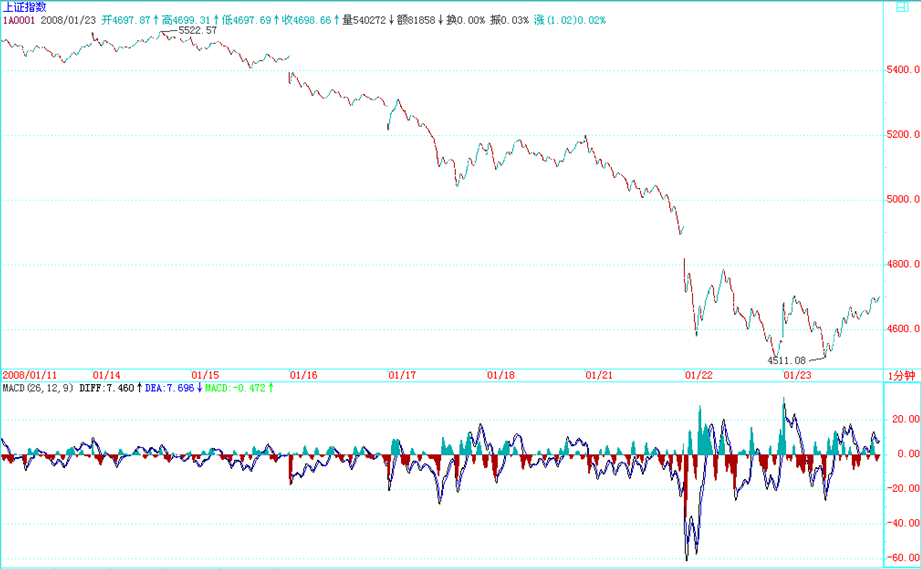

本ID最鄙视一种人，就是从来不看走势，请你自己反省一下，大盘4小时，你都干了些什么？每天的走势，无数的资金在那里画出来的，世界上最昂贵的图画，你不去好好欣赏，从中修炼，想想自己都干了些什么？你有这资格吗？

特别对于初学者，走势中的每一秒种，你都要尽可能学会解读市场的语言，你不从此全身心地和走势合为一体，就想战胜市场？做梦去吧。

本ID的理论，就是市场语言的语法，但光会语法，你能真正学会语言吗？你不每天去练习，有这可能吗？

所有坐电梯的，一跌就又哭又闹的，想想自己都在干些什么，就算把机会列出来了，想想你能操作成什么样子。

市场哪里有便宜而来、不费力气的成功？醒醒吧。

说白了，战胜市场，就是战胜市场的合力，就是战胜那构成合力的绝大多数人，你不成为这所有市场参与者中最顶尖的那一部分，那么，谈论成功都是废话。这是一场人与人智力、体力、资金等等综合的搏杀，是血与血的争斗，你以为是超女比赛八卦一下、走走旁门左道就可以？

偷心不死，永无出期。

你如果要学习，请好好看看诸如600737、600635、000938、000802、600779、600195、000822、600636等等这几天震荡中的每一分钟的图形，看看在震荡中是如何抽出比上涨还要多的血。

注意，本ID这里说的是学习，不是说股票本身。只是股票本身的图形是用钱画出来的，你不尊重图形，图形自然惩罚你。

回到大盘本身，第二个1分钟中枢如期到来，但只要这1分钟不能出现第三类买点，不能有效重新站上4778点，后面的震荡依然少不了，但这将提供更多的短线获利机会。

大盘的走势：

最好的，就是直接形成这1分钟中枢第三类买点，然后形成线段或1分钟式的上涨，重新回到5100点上，这走势的前提就是那第三类买点。

次好的，就是在这里形成5分钟中枢后再出现第三类买点，这里有两种途径，一种是9次级别的震荡扩展出5分钟，一种是先1分钟的第三类卖点后底背驰上来再出来5分钟。这里就构成了N次必然的短线机会。

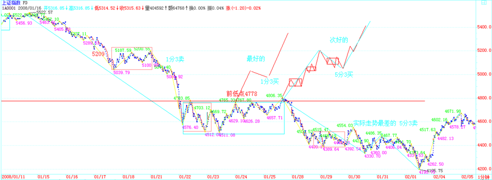

最坏的，就是在这里5分钟后出现其第三类卖点，这甚至构成一个5分钟下跌的第一个中枢，这样，后面的走势就比前面还要恶劣。

由于现在的走势有如下复杂的演化可能，所以操作上必须严格根据图形来，一旦出现5分钟不能重站住4778点的情况，就一定要注意后面可能向最坏情况演化的任何苗头。

正如本ID在5209点说的，站不住5209点就把多头当青蛙煮了。这里一样，在这后面的震荡反弹中，我们用技术赚足钱，然后，一旦多头不行，我们就再次把多头当青蛙煮了当汤喝。

当然，如果多头行，我们不介意陪着多头再到5000点上走一趟，但，我们只看图形，多头有本事画出那样的图形，我们就跟着走，否则，就煮开水等青蛙跳下来。

思维方式，要彻底改变。让所有一根筋的青蛙去，这就是市场。先下，再见。

## 教你炒股票96：无处不在的赌徒心理 (2008-01-23 16:18:38)

市场中，最大的敌人之一，就赌徒心理、赌徒思维。赌，最终的结局就只有一个，如果你以赌徒心理参与市场，那么你的结局就已经注定，你就算还没再锅里，那也只是养肥了再煮而已，没什么区别。

赌徒心理无处不在，除了上一课说的不断加码，还有一些，甚至自己都没注意到。

例如，有人亏钱了，然后就想，等反弹到多少多少一定出来，以后不玩了。这看起来很不赌徒，但其实也是赌徒心理。

赌徒心理一个最大的特点，就是预设一个虚拟的目标，一个想象中的目标，完全无视市场本身。

还有一个特点，就是怕失去机会，怕失去了赚大钱的机会。例如，万一走错了，怎么办？万一还涨，不就亏了？诸如此类。

注意，市场中生存，从来就不是靠一次暴富得到的，一次暴富最后倾家荡产的，本ID见多了。

市场真正的成功，都是严格的操作下完成的。操作失误了有什么大不了的，市场的机会不断涌现，一个严格的操作程序，足以保证你长期的成功。

赌徒心理，一个很经常的行为，就是砍了又追，追了又砍，完全被一股无明的业力牵引，就往那鬼窟里去了。这所谓的杀红了眼，所以就被杀了。

赌徒心理，一个更经常的行为，就是不敢操作，看到机会到来，就是怕，等机会真正起来了，又后悔，然后就追上去，5元不敢买的，过段时间50元都敢买，结果又被杀了。

赌徒心理，还有一种就太常见了，就是听消息，找捷径，以为这世界上就有一个馅饼一定能拍着自己，可能吗？就算能吃到点馅饼，那玩意能当长期饭票吗？

赌徒心理，还有一种大概是最常见的，就是我要赚钱买房子、车子。我投入，要把装修的钱赚回来。可悲呀，你以为市场是慈善场所？那是杀人的地方！

生活，很简单，一天三顿，五谷为养、五果为助、五畜为益、五菜为充，而不是那些古灵精怪的玩意；市场很简单，就如同生活，在一定的韵律中生长出利润。只有那韵律，那平凡但又能长久的赢利模式，才能使得你战胜市场。

你不需要如赌徒一样整天烦躁不安，又期盼又恐惧，折腾不休。你只要平静地按照自己的韵律、按照市场的显现去与日俱增地强大自己。错过了，就错过了，后面有无数的机会等着。

你，不需要把自己设计为超人。超人是不需要设计的，超人是干出来的。你能长期地战胜市场，你就是市场的超人。因为市场的原则就是，只有最少数的人才能长期地战胜市场，你不是超人，谁还是？

你，当然会不时面对不同的危机，危机不能躲，用最快最明确最直面的手段解决，只要还有翅膀，天空就是你的。

前面说，你要用0成本投入。当然，实际上也没必要这样严格。你可以把你完全不影响生活的钱拿出来，告诉自己，这就是你唯一的资本，你没有后援，然后就用这创造你自己的神话。当然，如果你输光了，你可以再给自己一次机会，但在给自己这次机会之前，你必须把自己彻底解剖一次，把你所有失败的根源都挖出来，然后你告诉自己，这是你最后的尝试。

如果你又输光了，那么，你就退出吧，不是每一个人都适合市场的，不是每一个人都要去当市场的高峰的，我们有时候必须面对的最客观的事实就是：我不行。

然后给自己N年的机会，去学习、去历练，在N年以后，你觉得你有足够的信心重新回到市场了，你再给自己一次机会，如果这还不行，那这一生，你就和市场永远再见。买基金，买国债，什么都可以，但还是别亲自到市场来了。

市场，只是生活的一部分，如此而已。

4778点，多空抉择线。 (2008-01-24 15:17:30)

今天，在昨天所说的4778点受到压制产生震荡。4778点，在技术上十分重要，因为这是前期低点，能否出现上去站住，决定了这次下跌的性质与最终完成形式。说句直接的，就是一条多空抉择线。

从日线上，今天早上的下跌反而是为了最终构成日的底分型，这是一个买点。但后面的问题更为关键，就是这底分型能否延伸为笔，还是最终被5日线压制夭折。由于5日线已经下移到4815点，明天大概也就到4778点附近了，因此，这个问题和上面一个问题是同解的，还是4778点能否突破站住的问题。

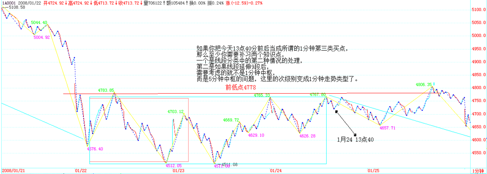

技术上，如果你把今天13点40分前后当成所谓的1分钟第三类买点，那么至少你需要补习两个知识点，一个是线段分类中的第二种情况的处理问题，第二是如果线段延伸9段后，需要考虑的就不是1分钟中枢，而是5分钟中枢的问题，这里的次级别变成1分钟走势类型了。

本ID的理论是纯数学，一就是一，二就二，没有半点可以含糊的地方。不妨再问一个问题，今天究竟走了几个线段？请选择：A、2；B、3；C、4；D、5；E、都不是。

没分清楚的，请去补课。

个股方面，本ID那些股票表现怎么样，都有眼睛，就不用说了。已经有N只创出了新高，而大盘比5522点跌了快1000点。当然，这种走势，最终不能完全脱离大盘，如果大盘站不住4778点而展开新一轮下跌，追高的风险是极大的。

本ID再次强调，本ID不需要任何人抬轿子，如果本ID需要你抬轿子，就不会让各位在8元去买600737了，再次强调，600737这类股票，如果你害怕了，就把本拿出来，留下0成本的继续游戏，没买的就算了。

这世界上N的N次方的股票，不需要买本ID的，而且本ID也不喜欢太多人买，因为本ID杀人的时候，可不管亲疏的，对于本ID来说，股票就是筹码，就是纸，本ID杀的是纸，后面是谁，本ID可没兴趣知道。

来这里，就要学会自己顶天立地，有一天，你能在市场游戏里把本ID杀了，本ID最高兴了。可惜，现在，还没有这个人，好无聊啊。先下，再见。

下周补缺，多头别无选择 (2008-01-25 15:17:34)

4778点，其实就是一张纸，但现在人的心理，比纸都脆弱，看来风险教育还是太少，股灾见得还不够多。看看人家恒生指数，上窜下跳地，A股的投资者还是少历练。

相比，深圳成分指数更有领先性，这点在前面已经反复说过。今天这指数已经把本周下跌的缺口给补了，而上海显然需要补课，这课就是下周的任务了。如果周末没什么不招人待见的消息，这任务应该不算是什么大不了的事，下周补缺，多头别无选择，连这都完成不了，多头也就只有当青蛙的命了。

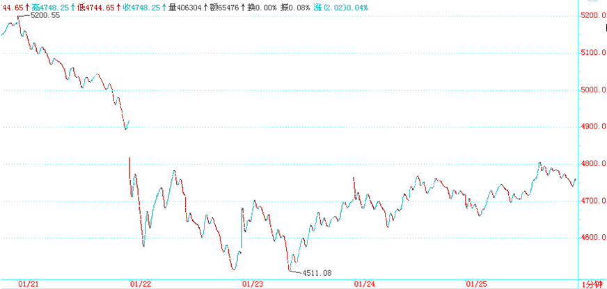

注意，由于目前日线的形态不好，所以，就算这笔延伸出来，后面肯定还有向下的笔来确认的，这个向上笔结束的位置很重要：

一、如果在4818点上下就结束，那么就是最弱的，后面就不亮晶晶了，改10X10米晶晶亮了。

二、如果4918上下结束，这还有较大可能回头形成诸如双底、头肩底之类的形态。

三、冲上5000点后再结束，那么形态上稍微好转了，后面只要回头幅度不大，多头又可以重新架设炮台，再次进攻了。

因此，这个向上笔的结束位置很重要，市场最终的走势，走出来自然就当下辨别了，无须预测。

这两天的走势，对底分型的具体操作是一个很好的锻炼。依据底分型的买卖，不是今天才买，而是昨天探底不创新低时就买，当然，如果你技术好一点，你可以确认这个探低是震荡性质的。注意，分型的操作，不是分型已经确认形成才操作，那时候已经是“已病”状态，就太晚了，这一点必须明确。

例如，昨天买了以后，今天走势继续保持（1，1）形态，所以可以不管，等到出现顶分型时再处理。当然，说起来简单，实际操作，又少不了诸多的练习才能把握。

其实，这底分型的操作，就算是最难搞的认沽也是有效的，你看580989这几天的日线，里面稍微复杂点，有一个包含关系，你看看前面0。739元开始的下跌，最终跌了50%以后有了一个底分型，买入点也就今天早上不创新低的时候。

注意，这只是上课，认沽可不要乱玩，你没这本事，就注定要倾家荡产的，不是开玩笑。这只是说明，本ID的理论，对这么难缠的认沽，也是可以轻松应付的，就别说一般的股票了。

至于昨天问题的答案，很高兴看到大多数人都回答正确，当然就是第三段还没完成了，问题就这么简单。

周末，又是大冬天的，都去补补，大盘下周任务是补缺口，各位就缺什么补什么，补钙、补牙、补肾、补心、补脑、补衣服、补课，诸如此类，选择去吧。先下，再见。

580989完美地达到理论要求的第一目标。 (2008-01-28 15:20:28)

周五说580989，并不是让一般人买，这点说得很清楚，今天继续说580989，主要是两点，这两点都值得所有想学点东西的人学习：1、上周五启动580989，正在于一个消息面上的不稳定性，因此有了一个大面积对冲风险的选择。2、这个启动，完美地体现本ID理论，后面再详细分析。

强烈注意，580989几个月后连纸都不如，特别在上涨这么多以后，任何人都不能再参加了，除非你是在底分型时买入的而且有极高的震荡技术。这东西最后的命运是0，千万注意。

先回到大盘，周末，都是不招人待见的消息，最严重的，就是中石油准备有10亿上来这条，不过这正好完成了本ID说的那个故事所说的目标，当然，那个目标只是一个大概数，就是让最早买的有腰斩的快感，如此而已。等那10亿出来，其活力会有所增加，但只要没有期货，还是折腾的命，暂时没有大戏，而且也不能有大戏，否则我们可爱的题材股怎么办？

大盘今天开盘就选择“ 一、如果在4818点上下就结束，那么就是最弱的，后面就不亮晶晶了，改10X10米晶晶亮了。”一个线段就下来了400点，然后是一个线段的反弹，这反弹只要不能重新回来原来震荡区间，就有逐步扩展成5分钟第三类卖点的风险。

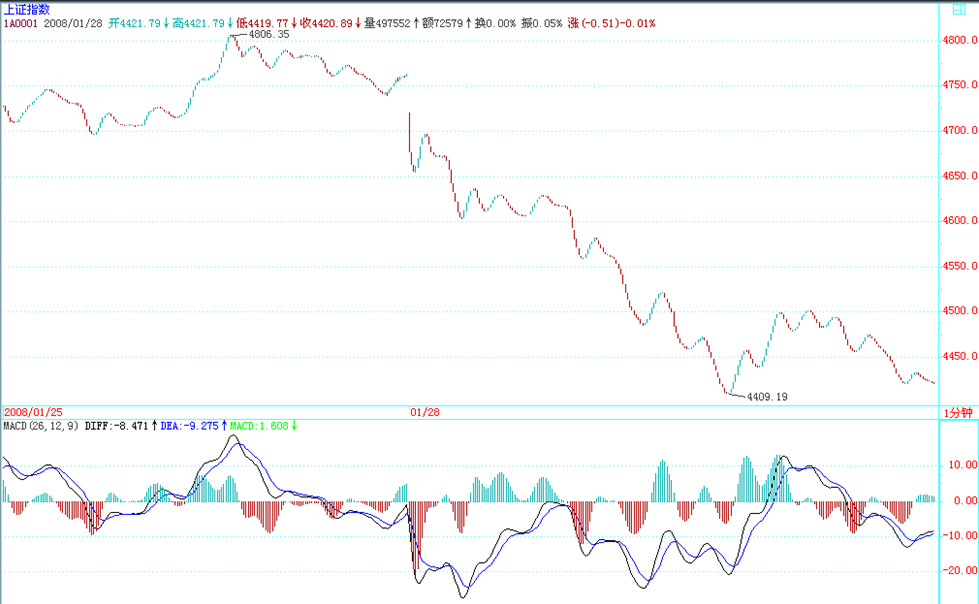

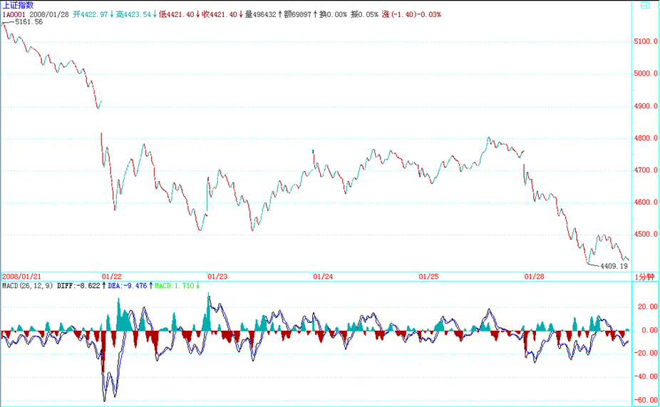

关于目前的情况，前面已经很明确地说过，最坏的情况就是在4778点下形成5分钟下跌的第一个中枢，一旦这种情况出现，后面的下跌可能更加惨烈。

那么，我们可以讨论什么情况才可能出现这种情况，大概唯一的可能就是美国出现1987年那样的崩盘，说实话，本ID特愿意见到这一点，如果在短期里出现这样，估计580989会被爆拉到N元，更重要的，看到美国鬼子不爽本ID总是比较爽的，所以本ID并不介意这种情况的出现。但99.999%都不会出现如此情况，今晚，美国是否继续减息，这点很重要。

一般情况下是不会出现这种最坏走势的，毕竟年线在那里，在关于今年的展望里，本ID已经明确说过，今年至少见两次年线，第一次应该是喜剧。

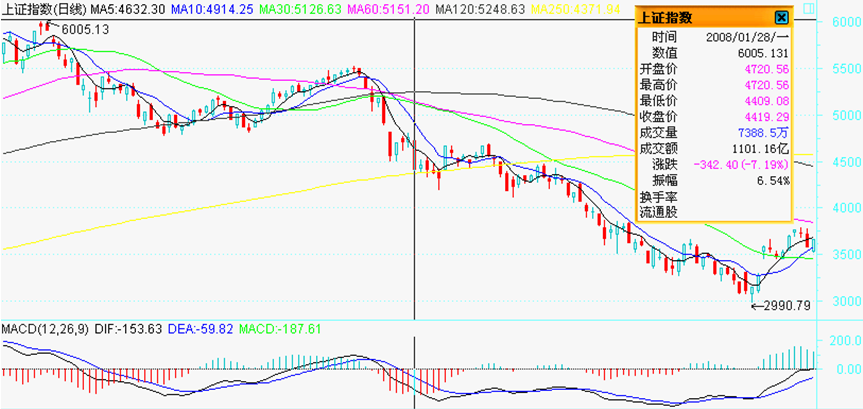

那么次坏的情况，就是这5分钟中枢是盘整类型中的，最终扩展成30分钟的。这种情况，不过依然是震荡局面，没什么大不了的。

最好的情况，就是这5分钟又震回去，最后还震出第三类买点来，但你的思维里千万不能被这种最好的走势完全占据，这样会蒙住你自己的眼睛。

个股方面，今天还有不止一只股票顽强地走出新高，一旦大盘走稳，该爆发的都要爆发，仔细看好借机洗盘的，题材股继续火暴。

下面，请好好分析一下580989的图，里面的标准性一目了然，60分钟上从2。3下来的底背驰，然后今天回拉到第一个红箭头指出的中枢中，完全符合本ID的理论最低回拉幅度的走势。后面很简单，首先是围绕该中枢的震荡，如果有机会，例如美国1987年，那么就一飞冲天，如果到4、5月美国还不1987，那么就清0，如此简单。

注意，这是学习材料，一般人绝对不能介入，否则一切后果自己负责。

INCLUDEPICTURE "http://static15.photo.sina.com.cn/middle/486e105c444c3113b352e&000" \* MERGEFORMATINET 

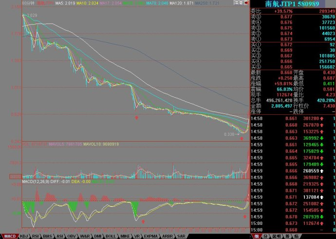

中国，需要的是中国式的全球化 (2008-01-28 15:48:56)

最近，美国次级债，使得那些一度被国内金融投资界当成偶像膜拜的美国大金融机构大丢其脸、大伤其气。金融投资领域，从来就没有偶像，风险对任何人都是公平的，曾经让你辉煌的可能就是让你最后葬身的陷阱，这一点，大概不会有任何中美的差别。

由此不禁想到，如果我们现在这些在糖水中泡大的券商、基金、金融机构，一旦面对如此局面，又有多少能幸免？市场经济，不是伊甸园，类似的事情，又有谁能担保永远不会出现？

现在，都喜欢一窝蜂地全球化、国际化，而我们真的有必要去全球化、国际化吗？肉，烂在自己的锅里，总比烂在别人的锅里强。那些全球化、国际化背后，从来少不了的是国家间的利益分配。而更重要的是，全球化、国际化，从来都有一个主导国家的问题，现在，不用讳言，一直以来的全球化，都是美国所主导的。而我们现在所谓的全球化潮流，说白了，就是美式引导的一种全球经济游戏，一切规则都被别人所主导，这种游戏，我们真有那么必要死皮赖脸地去参加？

中国，需要的是中国式的全球化。中国的市场必然成为全球最大的，有了这个吸引源，我们完全可以整合起东亚甚至整个亚洲的市场，一个亚洲的大经济体，甚至可以包括俄罗斯。这样一个巨大的体系里，大概已经完全没有全球化的必要了，因为全球都会化在这巨大经济体的强大吸引力之中。

全球化，不是让全球把我们自己给化了，而是以我为吸引源，不断震荡整合出更大的吸引源，从而把全球化于其中，这样的全球化，大概才是中国人该真正追求的。一个中俄印日四核发动的大亚洲经济体，笼括了全球半数以上的人口和经济规模，难道还不能改变世界经济的秩序和规则？秩序、规则，从来都不是先验的，而是现实利益合力的结果。一切皆有可能，而可能是实际操作出来的。

说实在话，对我们的企业，特别是金融投资企业，按照美式游戏规则参与全球化的前景，真的很难抱乐观的态度。就像打麻将，上下对台都是别人一伙的，你能赢的可能性基本为0。有人可能反驳，为什么我们的制造业能取得辉煌成就？那不过是别人的游戏重心并不在此。我们那些糖水中泡大的券商等，现在还靠诸如权证增设去抢夺小散户等恶劣伎俩赚钱养肥自己，试想，在如今美式的国际化、全球化市场里，能有这样的好事？靠类似手段长大的机构，一旦出去面对那些大鳄虎狼，能有好果子吃？

所以，最好的策略，还在待在自己家里，家里横并不是什么难听的事情，关键你的家够大。中国经济这个家，确实够大了，只要我们按部就班成为世界最大的市场、最大的吸引源，我们就能将我们的游戏规则给全球化了。这样，我们这些在糖水中泡大的券商等，至少也能在自己家里把最好的位置占住，至少有一个地利人和的优势，如果在自己家里开麻将还输给外来的，那最好的处理，就是先买一块豆腐留给自己撞头去吧。

如此，大概一旦发生类似这次次贷般的危机，我们也能很好的处理，至少全球都可以陪着我们一起分担其压力，如现在的美国；万一我们那些糖水中泡大的券商等出现什么问题，我们还可以让外面的资金来入股填窟窿，如这次美国那几家大名鼎鼎的机构一样。

所以，解决问题，最关键还是让我们的金融市场成为全球老大，把我们的经济规模搞成全球老大，这样，肉无论怎样烂，都烂在我们自己的锅里，那时候，又有什么可值得担心的呢？

这世界，没有谁比谁更聪明，特别在最高端的市场游戏中。关键是规则的制订以及在哪里开牌桌的问题，同样功力的人，输赢其实都在这规则与地利人和之上。我们的战略，不能把自己先假设为超人，别人都是傻子。

我们现在最大的优势，就是中国经济起飞的“势”，这“势”，是国运、也是经济发展规律所必然呈现的，这是谁都夺不去的。得此“势”，则平凡之辈也可一飞冲天，我们只需要借此“势”而成就我们的全球经济战略，而最大的失败，就是把此“势”给自我扼杀了。

我们生在这样的时代，是幸运的，因为我们刚好处在中国经济爆炸性的主升浪中，这里，只需要顺势而为，并不需要超人，因为任何的超人，不过顺其“势”而成就之而已。能顺其“势”而成就之，让全球化成为中国式的，这大概就是我们最该干的事情了。

吃完饭上来说两句 (2008-01-28 18:54:02)

由于每个人的理解能力相差太远，所以有些事情本ID必须再次说说，就是580989不是谁都能玩的，按照理论的最基本回拉，今天也完成了，后面出现任何大的下跌都是一点不奇怪的，千万别见到这两天涨了快100%就追上去。你想想，你连股票都操作不好，怎么可能操作好权证？一定要注意，本ID可不想有人因为一时的贪念而倾家荡产。

当然，如果你技术很好，那么后面震荡的机会很多，但这一切都是合力的，受很多因素的影响，毕竟这玩意还面临可以大量创设，现在用的闪电战，这里对赌的力量太多，没那水平，就别在里面折腾。

股票跌下来，就是把赢利的空间给再次打开，操作关键是纪律，是长期的规范操作。

做股票就如同一个将军率领一支军队，股票的机会就是战机，但战机能不能战，战有多大风险，首先你都要有所预计。例如，这次，跌破4778点，马上根据理论就有那几种情况，那么反弹后将出现什么，都是很明确的，因此，如果你技术不好，你就把最坏的情况作为自己面对的情况，你就问自己，一旦出现这种情况，你能应付否？如果不行，那就不操作，就这么简单。

操作，是一种能力，能力强的，就可以参与更多的战机，这就像打仗，有多大能耐打多大的仗，没能耐的，就在小板凳里待着，等看到可以适合自己能力的机会再出手。

其实，操作就是这么简单，首先你要明白自己的能力，然后判断这机会的难度你能否胜任，你不胜任，就闪开，就这么简单。

事情总是简单的，只是人把事情搞复杂了。人的贪念，总是看到别人抓住机会就不爽，那样，你就永远不可能进步。

对于真正的操作者，只倾听市场与自己的声音，本ID的理论把所有的机会无一遗漏地输出，关键是你能否正确地认识自己，能否去把握这机会是否适合自己。

本ID理论中机会的输出是最基础的，谁只要读懂了都可以做到；但这机会如何进入操作的层面，最终修炼的是人，这才是最关键的。

再把前面说过的重复一次：

首先，你必须能在任何时刻正确无遗漏地给出所有机会的输出，这是最基本的，如果连这都达不到，那么你就根本不适宜用本ID的理论去操作。

很简单，你要考察自己的水平，请回答下面的问题：请列出最近三个必然发生不会遗漏的机会，并说明其必然的级别。

注意，本ID的理论与所有技术分析理论都不同的，就是本ID不关心这些机会的具体点位和时间，因为点位和时间涉及预测。而机会的显发，就如同花的开放，你看到了，就是了，就这么简单。

说得更明白，本ID的理论把所有级别的机会逐一列出，这些机会是必然要出现的，你只需要等待它出现就可以，就这么简单，你何必去预测什么点位时间的废话？

机会出现，你必须会看出来，看不出来，就错过了，就这么简单。能否看出机会，这是第二步的问题，任一个机会如何成立确认的，在课程里都有，你看明白就知道了，然后多看，就不会漏过了。

例如，你知道按理论下一个是1分钟底背驰这个机会，但你连底背驰都不会看，那就不行了。

看，有一个逐步精确的问题，你看的水平有多高，这和你去理论的把握有关。你连如同用MACD去辅助都不知道，以为MACD就等于背驰，那么这种水平，是无论如何看不出背驰来的。

看出来了，就要操作了。要决定操作，就要把下一步给想清楚，就是下一个必然的卖点是什么，一旦这卖点出现后，最坏的情况是什么，每种可能的情况如何去分类，界限在哪里，每种界限触及后如何处理等等。如果你连这个都不明白，事先没搞清楚，心里不是明镜似的，那不被市场搞就怪了。

你能把上面三步搞清楚，熟练了，那么你就算是一个初级的有自我意识的操作者了，否则，你不过是糊涂蛋。

对于糊涂蛋，谁都救不了你，而且，谁又有必要去救一个糊涂蛋？

再说一次，本ID只是陪练，最终要靠自己。不说了，有缘得之吧。

年线支持初显现 (2008-01-29 15:19:24)

首先还是说580989，你看那中枢的力量是多么巨大，早上的远离，后面的回拉，一切如教科书一般，围绕这个原来的中枢进行震荡，这在昨天已经说了，后面震荡逐步减少，由于该中枢大致在0。6一线，依次向下的震荡空间是存在的。想想一个中枢震荡可以从0。4到0。95，这就是震荡的力量。

之所以说这个，是希望以一种强烈的方式表现本ID理论的一些方面，你不需要参与其中的操作，但请你必须学习。另外，早上砸到0。72逐级上台阶回拉0。85，这是一个很典型的骗人图形，这些图形后一般就是制造第二类卖点，然后后面的就是走势必须完美，再杀一波下来，多看这些图形，对你理解中枢的形成与结构十分有用。

你千万别操作，但你必须学习，这就是580989这经典案例的作用。

说大盘，大盘今天碰年线，这是第一次，去年底已经说，今年至少两次，第一次应该是喜剧。不过，年线这里也可以先制造空头陷阱，一切需要各方面的合力配合。

走势不是必然的，例如今天美国不减息，全世界暴跌，那就会选择空头陷阱的形式。否则，就可以直接上去。那么，美国减息与否这个因素，谁都不知道，但今天市场上已经反应出来，就是堵其减了，这就是一种合力的表现，一旦赌错了，市场就会报复性去相反反应。

当然，对这些走势，是可以去参与的。为什么？因为就算是空头陷阱的方式，也不会远离目前的位置太多，只要控制好仓位，当然可以参与。

此外，一定要注意，你不是多头也不是空头，但你一定要知道一旦发生什么情况，多头会干什么，空头会干什么。例如，多头的愿望肯定是想补上面的缺口，这就构成市场的一个潜在力量，这个力量，在其他力量的干扰下，可能一时发挥不出来，但这反而构成我们一个更好的买入点。

请好好品味这句话：你不当多头也不当空头，但一定要知道空头多头想干什么，而走势是最终的结果，他们想干的是否干出来了，这才是关键。干不出来，有什么后果，他们会有什么后续的步骤，这才是该想的东西。

现在的走势很简单，只要不有效破年线，就继续是原来的中枢震荡。中枢震荡怎么样，看看今天的580989。这就是教科书，看明白了，有什么震荡处理不了？先下，再见。

## 教你炒股票97：中医、兵法、诗歌、操作1 (2008-01-29 15:49:06)

世界上，从来不缺乏贪婪，最大的表现之一，就是上帝式思维。有一上帝，你信了他，所有事情就是他的，你就又天国，又永生的，这本质上，就是人类的贪婪所制造的幻象。

在市场中，操作中，这贪婪的最大表现就是希望寻求一种预测性的、一劳永逸的上帝式指标、模式，先验地决定了一切，然后有这东西，在市场中就可以又天国又永生地财源滚滚了。

这是什么？典型的贪婪思维，这种人，佛出世都救不了，最终就是当青蛙的料。而市场中，最多这种人，最下劣的，就是希望找一根万能拐杖，最好这拐杖可以自动给出所有的买卖，这样就什么都不用干地财源滚滚了。

贪字和贫字就差那一点，如此贪婪的想法，不被市场所屠杀，真是笑话了。

市场中操作，最相似的，就是和中医、兵法、诗歌类似。

学中医，你首先要把中医的理论、系统、思维方法，分类原则等等给搞明白，按照中医的系统，所有的病都是有一个对应的理论输出与实际相符合，这就如同本ID的理论，所有的市场机会都会被本ID的理论所一一对应地输出。

但你光知道输出，什么用都没有，你学了一大堆理论，没什么用，因为理论知道和应用是要靠人的，而人的素质、水平等等的不同，在应用中相差就太远了，所以最终都归结于人的修炼。

但是，理论的输出是最基础的，你连理论的分类等等都搞不清楚，那么谈应用就很可笑了。所以，首先你当然要完全吃透理论。

一个中医，学了理论，然后就要开始玩望闻问切之类的游戏，这就等于本ID理论中看市场机会的当下显发。有些人，总是想预测，那么请问，一个医生，他知道下面肯定有一个病人要来，难道他还需要预测一下这病人的性别、什么病，可以开什么药？如果世界上有这样的医生，你敢去看吗？

同样，市场的机会的到来，就如同要来的那个病人，你不需要对他预测什么，点位、时间、什么都不需要，你只需要等他来的时候对他望闻问切就可以了，事情就这么简单，为什么这个思维就拐不过来？

机会必然按理论的要求输出，第二步就是看机会的显发，对之望闻问切，这就是更高的一种要求。这就如同医生，能熟练地望闻问切，那是需要功夫的，需要实践中增长能力。所以，你开始的时候，总是看走眼，这太正常不过了。多看，多练习，这就唯一的渠道。

再说一次，一定要看走势图，那是世界上最昂贵的图画，最昂贵的艺术品，多看，就如同培养你的鉴赏力，为什么玩古董的，很多人总是被假玩意骗，而有人就能专破假玩意，这就是鉴赏力等的问题，但这是需要磨练的。磨练的时候，被骗几次，那不是最正常不过的事情？

为什么很多人在市场中很痛苦，就是他不热爱这走势，走势是最好的艺术品，你站在热爱的角度，才能激发你的鉴赏力。否则，你脑子里总是被赢亏之类的贪婪之念所占据，眼睛怎么可能不被蒙蔽？

望闻问切有成了，后面最难的就是操作了。操作，就如同中医的开药方。会看病，基本就等于中医的1/10，而用药、开药方的难度，就是后面的9/10。而没有最后这开药方，前面的所有东西都是白搭的，同样，操作也是这样。

开药方，就如同行军布阵，所谓用药如同用兵，如何用，这可以用你一生去修炼。这就如同操作，操作是一生的事情，除非你离开市场。

中医开药方、因人、因时、因地等等因素的不同而开，就如同打仗，哪里会有一样的仗？仗仗都不同。中医不同西医，西医就把人当机器，所有的人，只要是所谓同样的病，就给你同样的药，完全的流水线机械化生产，而现在很多人在市场中的思维，就是这种思维。

当然，所有的不同里有这一个共同“不患”的基础，例如，市场的运行的“不患”基础就被本ID的理论所完全描述。同样，所有用药的“不患”基础也被中医的理论所描述。也就是，无论怎么折腾，都出不了这基础。这是不同中的同，患中的不患。

明白这点，操作就有了一个大的不患背景，而这背景之上，就是一个创造充分显法的过程，每个人，按照自己的能力、修养等开出不同的药方，给出不同的操作记录。这里是一个没有止境的过程，不断修炼下去。

具体说，就是在一般程度上，你必须遵守买卖点的原则去买卖。但是，这并不是一定的。例如，本ID就经常愿意在买卖点偏移一点的地方去买卖，为什么？因为那样，可以买卖到更多的数量，或者可以制造出一些特别的东西达到更大的目的。

这就如同写格律诗，你开始的时候，必须严格按格律来，如果没有按格律来，那是你的水平问题，你千万别以自己是写拗体来自我安慰，那将害了你，以后你就永远和真正的格律诗无缘了。但，当你已经自由于格律，得心应手时，你就可能要根据诗歌的内容，自设声律而构成奇响成为所谓的拗体，这时，就是出神入化的过程了。而操作，同样如此。

对不起，还想写，有一坏蛋打电话来说要谈一个项目的事情，这个坏蛋太熟了，不能推，就先写到这里，以后继续。

看别人脸色的日子总是不好过的 (2008-01-30 15:23:08)

这题目说的什么，大家都很清楚。今天的消息，刺激了一个震荡高点，然后再回杀，由于减息的玩意还没出来，所以，尾盘赌消息的又来了，这就是发生在看别人脸色过日子的日子里的一件无聊事情。

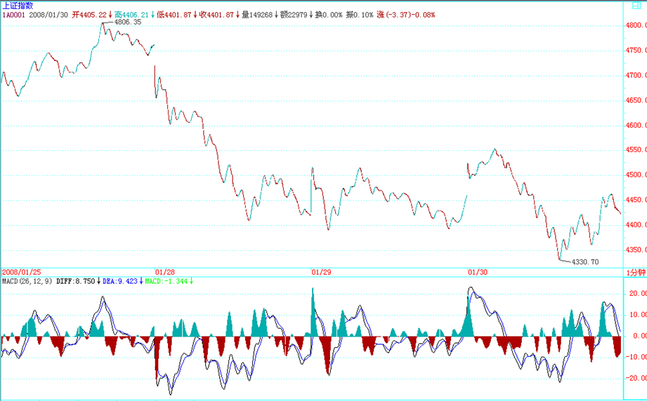

看着600737、600078之类的股票，是否有点感动，这世界是需要不看别人脸色的人的，但，这东西是合力的，光有几个这样的人，成不了气候，如果别人都成了爱看别人脸色的人，那这市场还是别人的，最后，剩下不想看脸色的，可能也转去玩别的不用看别人脸色的活动了。

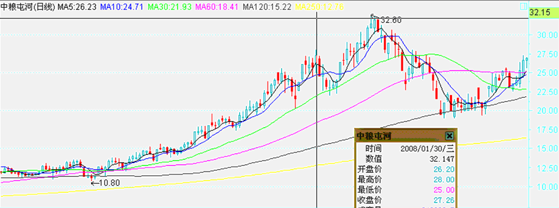

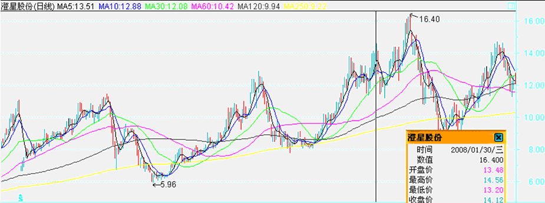

说实话，现在本ID已经没有上次接石头的兴趣，对今年的行情，本ID去年已经给了明确的定位，就是题材股大搞，不管指数，所以才有了跌了1000多点还创新高的品种。

但指数还是会起来的，在那展望里，本ID给出本年的节奏是“扬抑大扬大抑”，所以，多头还是会有面包的，只是多头如果还看别人的脸色，没点自我精神，那本ID宁愿把节奏说错了。

中石油那些玩意出来前后，是一个转机可能出现的时候，这时候也到了，但这东西需要合力，本ID现在确实没兴趣再去折腾大的玩意了，把自己的一亩三分地种好就算了。但呼吁一下总是可以的，合力，需要大家一起来。

说实在话，本ID宁愿A股跌到2500点，也希望见到美国全面破产，让美国再来一次1987年，这是本ID最愿意看到的。

但必须很清楚地说，美国佬这次会用所有的坏招来摆平，问题的关键是，不要当傻子去给美国佬埋单。

大盘，很简单，现在是纯消息主导，明天美国要减息了，这边就又会冲动一下。但这种冲动不是以我为主的，以我为主，还没有找到合适的借口。

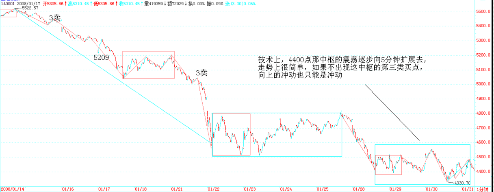

技术上，4400点那中枢的震荡逐步向5分钟扩展去，走势上很简单，如果不出现这中枢的第三类买点，向上的冲动也只能是冲动。

580989，如前所说，震荡幅度减少，但震荡机会依然很多，0.6这个中枢的威力是否够教科书，有眼睛的都会看了。

第一次年线，不出意外，还是如去年底所说，是一个喜剧。问题的关键是，这次喜剧之后，如果没有了自我意识，最终只能是悲剧。先下，再见。

合格政府的第一标准：不给美国佬埋单 (2008-01-30 15:57:44)

这不是针对任何具体的政府的，而是一般性的表述。这句话，显然是武断的，但在这样一个时刻，必须有这样的武断。

美国佬，靠两次世界大战积累的玩意，占据半个多世纪金融霸权所制造的虐夺，支持了其半个多世纪的所谓美国梦。

这梦后面，不过是一个国家对全世界的虐夺与敲诈，是全世界养肥了那美国的金元世界，而美国这玩意，在全世界敲诈了这么多，竟然还大面积赤字，加上美国人超前消费所制造的亏空，这空中楼阁早该崩溃。

其实，这空中楼阁早要崩溃，但所谓新经济以及后进国家的廉价发展，使得这崩溃给大大推迟，但崩溃总要到来。

当然，美国佬肯定又再玩原来的招数，把危机转嫁到全世界去。因为全世界中不缺乏无聊的政府，脑子进水地给美国佬埋单，有一种很可笑的观点，没有美国佬，我们的人民哪里有饭吃，没有美国佬让我们出卖廉价的劳力，我们哪里有饭吃？

当面首的，总会有面首的思维，因为他们认为他们天生就是面首。既然这样，就面首去吧，用你们的血汗继续养肥美国佬。

我们不是对美国佬一定要杀绝，而是希望这次崩溃后，一个新的世界经济秩序能被重建，那一国独大的时代必须结束。美国的经济崩溃，是他们自己造成的，谁都不能为此埋单。

当然，美国崩溃，全世界都要影响，为什么？因为现在的世界经济秩序是一种完全不合理的系统结构，里面有着太不安全的风险传导机制，这必须打破。

而不破，哪里有立？要破，就需要美国来次彻底的崩溃，这样，才能真正立起来，至于这过程中可能的痛苦与震荡，必须承受也只能承受。

可惜，很多事情，该有的都还没有。

例如，如果我们现在已经有一个超大的蓄水池，那么，从美国外逃的资金就会有一个落脚地，可惜，我们没有，我们该建池子的时间都给荒废掉了。但时间还有，我们必须抓紧，否则，这机会一旦失去，一切都晚了。

其他更多的，就不想说了，想了都觉得无聊。

这世界可能就是这样了，这样就这样了，我们今晚喝豆汁。

没有信心，一切瞎掰。 (2008-01-31 15:13:08)

3点半有一无聊人从大连专程过来要谈一香港市场收壳的事情，谈完以后回来会写一篇纯技术分析后面走势的帖子。本ID现在的心情已经完全过年化了，想起还要有事情干就头疼。

大盘今天的走势是一点都不奇怪，看别人的脸色，就是这样的了。减息又怎么样？其实，即使对于美国，减息与否，要死还得死。减息后一旦引发资金大量抛售美圆资产，那死得更难看，可惜，现在接收这大量外逃资金的池子就缺一个中国的，想起就没劲，早干什么去了。

经济是一种专门的学问，管经济的就该至少是学经济或在经济圈里泡大的，否则，打铁的、挖地的、修坝的、卖大饼的，谁都可以经济一下，这经济怎么经济？

一句话，这次下跌，估计把印花税弄下去的可能性还是不大，大概，还需要更猛烈的暴跌，当然，反弹会有的，印花税一日不下，本ID的兴致将继续低迷。

今年，就看三月的会后有什么改变了，如果没有，那该怎么就怎么了，那种接石头的活，本ID肯定是不会再去干了，这么高的交易成本，凭什么啊？

短线技术上，没什么可说的，现在这1分钟的中枢突不上去就继续下台阶。个股方面，很多股票都要先主动回一下了，否则，顶在高位上抬杠铃，没那必要。

现在，关键不是股市本身，而是信心问题，一个最简单的问题，为什么中国的投资者就要忍受全世界最高的交易成本。

有谁能回答这个问题？

本ID在去年底已经明确说过了，今年一定要看到印花税的下降，不管是谁，做错了就要改，不改就不行。

本ID现在根本不担心股市，因为有更担心的，就怕这次经济的对局，一旦应付错了，那比股市更严重的事情还等在后面。

我们能应付对吗？抱歉，本ID没信心。

如果你还有心情，就请读读本ID这个梦：“步老杜《登高》韵记梦 2008-01-26 10:23:21 ”先下，再见。

大盘中线技术分析 (2008-01-31 18:44:04)

谈完了，那人赶飞机去了，专门跑一次，这事情还真没法推，苦啊，又多一件无聊事情。回来先把帖子写了再吃饭吧。本ID就怕答应的事情不完成吃饭都不安心。

收盘的帖子，非技术的纯粹直话直说的，这是走势后面必须的东西。但操作上，还是必须按技术来，所以技术是第一的，我们可以用一些语言对分力进行敲打，但这不能蒙蔽了技术的眼睛。特别，对于一般的散户来说，除了图形，你是最公平地和所有人同时看到的，你还能有什么依靠？

还是和3600相关，为什么？因为上海的指数从一开始就和这相关，例如90年代初的45点，2001年的2245点等等，这次的行情，一样与此相关。

4335点的530，6124点的高位，相差基本就是1800点，下来的第一个位置4778点，就是1800点的3/4，那么，现在，到了1800点这个位置，所以这个位置是很重要的，而且与年线相关。5522点下来的1200点，也在这个位置，所以这个位置是诸多因素所相关，技术上很重要。

由于这次下来，已经把4335点触及，因此，一个日线级别的中枢就已经在形成中，4335点上下就是这个中枢的一个必然部分。这个中枢，是从1000点上来第一个日中枢，所以这个中枢将影响至少很多个月的走势。

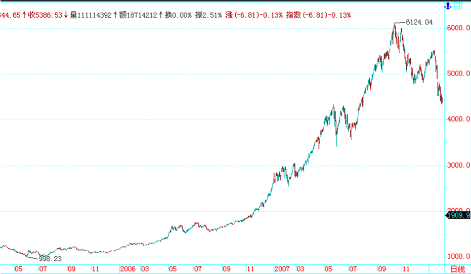

也就是，现在，从中线的角度，一个大的日中枢震荡已经形成。这个中枢震荡的幅度，是以3600点为基础的，上面1800点，下面对称的，也可以有1800点。换言之，现在就算跌到2500点，也不过在这个中枢震荡的范围内。

有了这个中枢震荡的大结构，对后面的市场走势就有了一个很宏观的把握。显然，目前这个中枢的中间位置，会在很长时间内反复见到。像2500点、6100点，都如同580989在0.976的那样的瞬间震荡位置，而目前位置，就如同最近580989的0.6上下，是一个反复可以见到的位置。直到这个中枢被破坏为止。

这个中枢震荡，可以以450点，3600点的1/8为一格，上面，4778是第一线压力，5228点是第二线压力，下面的位置如此类推。当然，在具体的划分中，可以把450再细分，这对短线有一定意义。

由于目前是一个日的中枢，因此，最大的偏移级别就是30分钟的，如果有一个30分钟的向下偏移，那将构成最好的中短线机会。而且，类似5分钟的偏移，也构成好的短线机会。当然，如果你的超短线的，也可以关注相应的1分钟偏移。

在足够长的时间内，所有的市场机会，都会是因为对于该中枢的震荡偏移所引发的，配合30、5、1等的内部结构图，你将在这大型震荡中如鱼得水。

本ID早说过了，今年只要你会震荡，你赚的钱绝对不比去年少。有了这样一个大的震荡图，抽血的机会多了去了，好好把握。

节前后市场，能否依靠年线和中枢中轴制造一次向4778点的中枢偏移，明天就有初步答案，如果能坚守在目前位置震荡上5日线，而周一又不出现前两周一样的坏消息，那么，这种偏移就有基础，否则，绝对需要先砸出空头陷阱再玩这游戏。

注意，本ID对市场从来都是充满信心，但本ID的信心可不是死多头那样一定要向上的信心，本ID的信心是在震荡中抽血的信心，那样一定要单边上涨才赚钱的幼稚行为，本ID没兴趣搭理。

本ID没信心的是市场以外的事情，只要本ID有兴趣，大熊市一样可以玩得很开心，就别说震荡市了。但市场以外的事情，本ID真的没信心，而市场以外的，才是本ID所牵挂的。

本ID一早说过了，对于本ID来说，经济变成怎么样，又有什么影响？但对于大多数人，经济的走势太重要了，比股市的要重要得多。

本ID希望每个中国人都有自己的面包，本ID日夜担心的，是中国三十年的经济大升浪会被某种幼稚的因数所打断，除此之外，本ID没什么可担心的。

大升浪被打断了，本ID照样可以风花雪月花天酒地419，很无耻但很经济地等着在经济大跌势的末端抄大底，但其他人呢？

不说了，吃饭了，该什么是什么，万古云霄一酒杯。

节前连涨三天？就不许！(2008-02-01 15:17:48)

听说有人还在发节前连涨三天的梦，但就不许！类似的梦还有，例如现在砸下来了为了奥运如何如何，简直脑子进水了，别以为股市有什么真正的地位。按照市场经济，股市当然有着绝对高的地位，但是，这不是现实。

请注意一个事情，听说春晚里将有一个节目对所谓的股民进行强烈嘲笑的，如果这节目最终播出，将是对三十年经济大发展的最大讽刺。现代经济，最高级形式就是虚拟化的，100多年前，美国还比不上阿根廷，就是因为美国大力发展了虚拟经济而阿根廷没有，所以，最终阿根廷也就剩下别为她哭泣的歌声。

股民，这个称呼本来就是侮辱性的，应该是投资者，这是构成现代经济最重要结构的伟大人群。一个不尊重投资者的国家，不可能有强大的虚拟经济和真正强大的经济，这就是历史的结论。

如果脑子里还有一丝幻想的，请再把本ID关于今年走势展望的帖子再读一次：“2008年行情展望 2007-12-20 15:59:05”

今年的行情，就是早干早有面包的走势，真正的投资者，在12到1月的题材股走势中，已经赚到了第一笔买面包的钱。有些可笑的人，觉得，4778点到5522点也算行情啊？千万别看不起这一段，如果在大的跌市里，这可能就是全年最大的一轮走势了，而在今年，有极大的可能，这就是第二大幅度的上涨。

在展望中，本ID已经很明确说了，今年的节奏是“先小扬再抑接着大扬后大抑”，而且强调“至少有两个顶部是必须注意的，第一个就是6124点大调整的第二段上升所构造的顶部，这是一个小顶”，5522点就是这样一个顶。

本ID在剧本那次说了：“关键看在5462到5675点时间段内政策面的风向，风向不对，那就先把买胶水的钱换成买棒棒糖的，一人一个棒棒糖，看你要棒还是糖。”显然，5522点后平安、美国之类的因数足以让胶水换棒棒糖了。但后面的剧本依然有效，就如同本ID告诉你至少要见到腰斩的中石油一样。那胶水糊的鸟儿会有的，那就是本年第二波行情，现在，不过是为这行情进行准备。

大概没有人会注意，本ID在1月15日故意给出的这个帖子也被很多人认为是炒冷饭，请现在再去看看这特殊时间里帖子内容的实用性，看看当时日线顶分型刚构成后你是否如课程那样操作了，如果你真认真看了里面的内容，你该怎么操作还用本ID说吗？如果还不明白，请再看一次：“教你炒股票93：走势结构的两重表里关系2 2008-01-15 18:08:05”

注意，本ID只是陪练，陪练的任务，只是在关键的时候把该用的工具放到你眼前，如果你看不到，那就算了。

本ID有时候说的结论会有所修改的，例如，原来对中石油，给出的就是如中人兽，也就是到30筑底上去，那是因为那时候期货这玩意还没被打压住，后来，一明确这玩意被压住了，本ID就把那至少24的酒席故事告诉各位了，这就是有所修改，为什么？一切是合力，有一个重要的分力改变了，当然要有所修改。

但是，有些东西，本ID不提，就是无所修改。例如，对于20年的大牛市，20年后至少3万点的结论，本ID没有任何修改的必要。除非中国经济自废武功，否则，本ID的结论无须修改。

其实，对行情的转折契机之一，本ID前面早就明确说过，只是看的人不注意，就是要等中石油那10亿玩意出来的前后，底部不是一天构成的，是要反复制造恐慌搞出来的。

有人可能觉得很残忍，废话，不恐慌，没人放血，哪里会有底部？

这几天是什么？就是前期强势的题材股补跌，这是所有探底行情中必须有的，强势股补跌后，行情才可能进入真正的筑底。而这点，本ID早就说过，没有人会永远举杠铃的。

那么，行情怎么慢慢点燃？行情的点燃，都需要领头的，也就是有一个傻子，疯狂地裸奔，把大家逐步唤醒兴奋起来。这个先裸奔的，一般只有三类，新股或有突发大题材的，还有就是前次行情崩溃的祸首以及率先被打压调整的。

如果你还没见到裸奔的，那么就意味着，行情还没被点燃，依然在底部构造阶段。现在的问题不过是：睁大你的眼睛，发现那准备或已经率先裸奔的。

其实，行情也简单，有人全球裸奔的，就是大行情；有人全国裸奔的，就是中行情；有人全市裸奔的，就是小行情；有人只能在家里裸奔最多在窗口晃悠两下的，那就是反弹行情。行情，与最开始的裸奔力度相关。当裸奔蔓延了，行情就开始展开。当所有人都习惯于裸奔了，行情就因高潮而死。

今天的走势，不过是先尝试砸一下陷阱并让那些幻想节前连涨三天的丢一下脸。当然，连涨两天还是有希望的，本ID倒不拒绝两这个数字。前提是，请先冀望周末没有什么不招人待见的事情，其次，那石油出来时不要过分变态。

现在，更大的问题是，这么高的印花税，我们搞一波上去，难道就为了让平安能顺利圈走1000亿？想起这个事情，本ID完全没有冲锋打头阵的兴趣了。自由世界的勇士们，你们冲吧，本ID在后面跟着，一看你们不行就放枪给你们送行。

反弹会有的，面包会有的，但在春晚要被严重嘲笑而还要被平安之流上千亿地合法打劫，并且更要继续接受一个最高印花税的奖赏，在这种情况下，谁还愿意当炮灰去发动一轮全球裸奔行情呢？

今年，我们去铁岭裸奔，或者保定也行，各位选择吧。

周末，不妨先在家里练习练习？先下，再见。

没有幽默感与修养成不了好的操作者(2008-02-01 19:17:37)

快过年了，到处繁忙，还是待在家里塌实。一般周五晚上都不写帖子，这次就破例一次。因为在周六、日不谈股票，就抓紧今晚再说说股票。

资本将人异化，其实市场同样让人异化。看看现在市场里的人，很多都变得神经叨叨的，心里就剩下黑马、上涨之类的机械反应与欲望，这样的市场人，真是太悲哀了。

没有幽默感与修养成不了好的操作者，一个看到铁岭、保定只会想到暗示了什么股票的操作者，也不可能有什么长期的操作成功。

铁岭不过是来自赵本山的一个幽默，而保定就是郭德刚的，当然，南方的朋友可能有点不熟悉，这不奇怪，但其实就算你不知道这些幽默的意思，从文中对裸奔的分类就能明白其中好玩的地方。

本ID一本正经地解释这个问题，其实就很搞笑，这只是小事。但有些孔男人的学生，见到本ID说第一次见年线是喜剧，就以为一碰到年线就起来就是喜剧。大概，孔男人类人写的东西都是这样的白开水。知道什么叫以哀景写乐倍增其乐吗？想想，对5日线的回试还要故意砸穿恐吓部分不坚定的，更不用说这250天线了。不把这哀景写足了，哪里会有好的喜剧，连这点修养都没有，还操作什么股票？

很多事情都是相通的，例如在顶部的时候，就是以乐景写哀倍增其哀，文学、艺术和市场是相通的，只不过你有没有这种修养和感触而已。

市场，最终是人的修炼，你的全部修养是否花架子，在市场中一下就检验出来。很多所谓的文化人看不起市场，因为他们不过是些花拳绣腿的玩意而已。

一个真正的成功的操作者，一定是一个哲学家、实干家、艺术家、有幽默感的人，否则，市场中任何的弱点，可能就足以致命。

和平时代，没有比市场更能提高人的地方了，好好珍惜吧。

年线上的中国式喜剧(2008-02-04 15:20:02)

第一次碰年线要上演喜剧，这在去年12月已说。当然，真到上演时，相信的人就不会多了，不相信的人多了自然就更喜剧了，市场总是如此。所以，就算把剧本告诉你，绝大多数还是不行，这点，已说多次。不过，经过这次，大概各位对本ID上周所说的“哀景写乐倍增其乐”应该会有点切实的体会了。

这里，本ID再明确地预先告知各位，这次很中国式地把新基金砸出来了，但这还不是真想要的。前面已说，这次砸出印花税的可能性很小，那么，下次，或者再下次，总之，该改变的总要改变。印花税的改变，是2008年的目标之一，这点已经多次说明。

技术上，十分凑巧的是，周五低点对应的线段刚好是360段，一个圆周。很多人老问3600是什么？为什么和上海指数相关？这问题大概不需要再问了吧。有人还要问，周五有底背驰吗？如果你连周五的背驰都看不出来，那只能重读了。看看15分钟图，想想该是哪两段比较力度？

有些人可能又要问，如果没有周末的利好，那背驰能成立吗？问这话的人，根本就等于没看本ID的课程，背驰成立只保证回到原来最后一个中枢，这点和有没有消息没关系，实际上，上周五收盘前已经达到这一点，而所谓的利好不过是加强其力度而已。

实质上，今天的上涨，并没有脱离最后一个中枢的范围，4500点上下那5分钟中枢的第三类买点并没有制造出来，因此，从技术上，依然还可以看成是该中枢的一个震荡。

而且本ID更要问各位一句，如果没有周五的狠砸，这利好能出来吗？很多事情，都是一环扣一环的博弈，里面的水能浅吗？

不妨再问各位一句，怎么把印花税搞出来，各位有什么建议，请发表。

这次反弹的高度，决定于恶性圈钱最终是否有所收敛，当然，外围因素也有一定的影响。但这次下来，最主要是恶性圈钱闹的，现在已经开始有人折腾这方面的事情，现在，还是进步不少，至少各种声音都能通过某些途径达到应有的分力。所以，这折腾能折腾出什么，也是很重要的。

其实，今天的利好掩盖了一个很大的坏因素，周末央行高层说，大企业应该主要到资本市场解决融资问题，并表达银根绝不放松的观点。当然，这些人不是最后定事的，他们的话也没什么准，不过，这证明某种观点或利益还是很有市场的，这就是后面的不确定因素或者说是大的隐患。

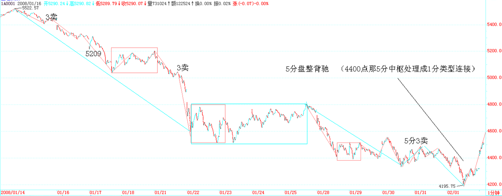

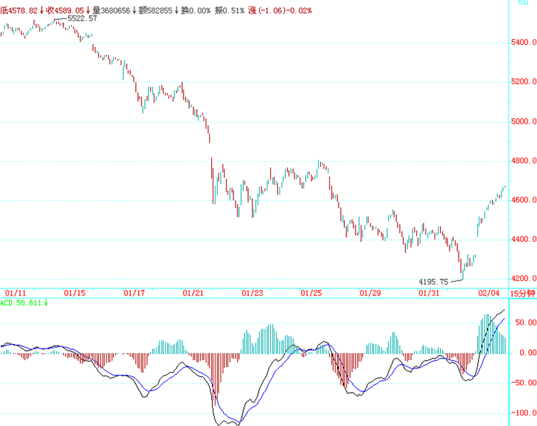

技术上，还是原来分析的，450点一格，4778点破不了，就把前面两5分钟中枢搞成一个30分钟的震荡出来。

个股方面，今天普涨，关键是后续的能力。还是周五说的那三类，一般股票，反弹到阻力位置压力就大了，而一切套牢压力小或有大资金、新题材的股票，反而容易有持续的表现。

注意，今年做股票，就是要跌到位了敢买，涨多了敢抛。那种涨了才追，跌了才砍，来回几次就可以被清理出局了。如果技术不好，宁愿坐电梯也不能追高杀跌的。当然，最好不要坐电梯，要不坐电梯，唯一的办法只能是，涨的时候，就睁大眼睛看有什么大级别的卖点出现，见到日、周的顶分型，就要根据自己的水平去操作。

明天，就看中石油表演了，大盘会有所震荡。

最后，如果有对平安特别熟悉，或有其强力罪证的，可以提供点在跟帖或留言里，节后，要来一次对平安的清算，子弹已经收集了不少，不过如果有更猛的，不妨可以多提供。

有些事情，是需要有人干的。干，就有了分力。如果分力都没有，如何改变合力呢？先下，再见。

## 教你炒股票98：中医、兵法、诗歌、操作2(2008-02-04 19:51:49)

过节前，本不想再写课程，毕竟家里的事也不少，一过节，这总少不了。不过，还是抓紧时间写上两句。

一种思维模式的改变是很难的，因为一种思维模式的存在，往往连自己都不察觉，特别，一出现强烈走势后，那些老的毛病就又出来了。这几天的大盘转折走势，就是一个很好的例子。

一个背驰后，无论是盘整背驰还是真正的背驰，理论只能保证其回拉原来的中枢，这是正确的思维方式，那么，回拉之后如何，这涉及预测。正确的思维是，把回拉后出现的情况进行完全的分类，根据每种分类对应的后果，决定你自己的对策。

例如，上周五下午的背驰是很明显的，任何人都可以当下发现。这个背驰进去后，收盘了，后面面临着继续向中枢上边突进以及再次回探两种情况。第一种情况，意味着362开始的线段要继续延续下去，而第二种情况，首先就要破坏362开始的线段。那么，这两种情况就很简单了，就等周一的开盘当下地决定这线段是否被破坏。

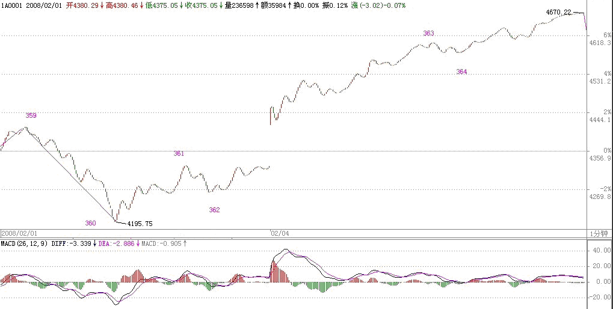

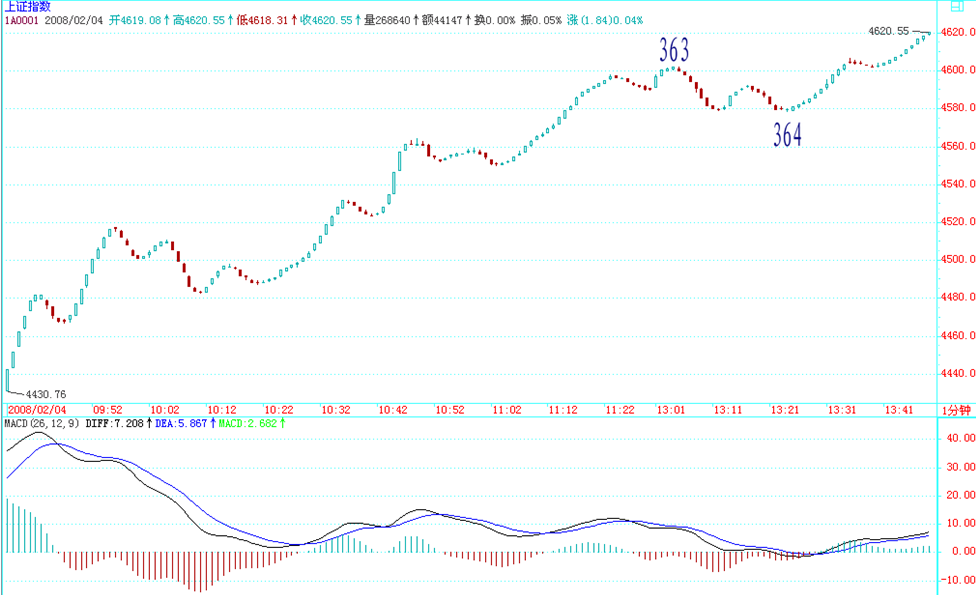

注意，这是严格的理论思维，和周一有没有消息，是否有利好毫无关系。特别地，如果有利好，竟然还走出破坏362开始线段的走势，那么这问题就严重了。当然，实际上，大盘一直到了364才破坏了这线段。但这时候，就不存在走的问题了，为什么？因为理论上，这演化成线段类上涨的可能性极大，除非363开始这线段跌破361这个位置。所以，后面你只要看这着线段是否跌到那位置，显然也没有，所以就继续持有。

等364这出来，展开新的线段后，因为已经的第二个线段类中枢，所以就要注意是否有可能出现类背驰，这就看明天开盘后的情况，如果不能继续保持类似斜率的上涨，那么这线段类上涨结束形成一个1分钟中枢就要情理之中了。

你看，上面所有的分析，都要严格的逻辑关系之中，这是理论的必要结果，也是一种正确的思维方式。当然，一个线段的类背驰是否需要抛点货，这是每个人的爱好问题，你的操作级别问题。

这就如同打仗，你不能假设明天某某山头还在自己手里，然后根据这个假设去安排兵力，山头是否在自己手里，那是当下的。当然，你可以去反复争夺一个山头，但你不可以假设这山头在未来的某一个时刻100%就在自己手里。

这也如同中医，你不能认为你的药一定有什么效果，效果是吃了药以后再望闻问切测出来的，而同一病人的药，要根据这不断地望闻问切进行必要的增减。当然，你也可以保持不变，就如同在一个上涨趋势中，你可以保持持有，但一旦出现超越你的级别，你的操作限度的转折信号，也就是背驰，那么你的药就必须要变了，甚至是大大地改变。

因此，如果周一并没有出现今天的利好，你的操作逻辑并不会有任何改变，还是根据当时的图形是否触及你的操作分类界限进行，这才是正确的思维。

换言之，你在操作时，你后续的所有可能面对的情况与对策都必须了然，否则你就没资格操作。对于一个真正的操作者，没有任何情况是意外的，因为，所有的情况都被完全地分类了，所有相应的对策都事先有了，只是等着市场自己去选择，去触及我们事先给定的开关。

说实在，比起中医、打仗，股票是最简单的，为什么？因为股票的后续走势，因为有了本ID的理论，都可以严格地唯一地给出统一的完全分类，而中医、打仗，要面对的可能就更复杂了，特别打仗，完全的分类，可能只能是一种假设了。

如果你的思维还是转不过来，那么就没有必要再去学习，首先把思维转过来。

有人可能问，如果出现回探的情况，那么可能在背驰买的出不掉。显然，这种情况是很可能的，因为T+1，该反应的时间你可能没资格卖。不过，一个很简单的对策就是，你必须买比大盘要强势的股票，也就是先于大盘的股票，这样，一旦大盘回转，这类的股票走势都会比大盘强，这样自然有足够的空间让你选择。

注意，最好的选择是比大盘稍微先一点的，而不是完全逆于大盘的，因为后者，往往有可能补跌，或者逆着大盘洗盘，例如，今天的600737就是一个很好的例子。当然，新股也是一个很好的选择，不过这需要这类股票开得不太高，而且有明显的新资金介入，在一个有一定级别的向上过程中，这一般都有比较稳定的表现。还有就是先于大盘调整的，例如这次那聪明的驴，就是这种类型。

当然，如何选择股票，这是一个经验问题，必须要反复练习才会有灵感与感应的。其实，股票真没有那么复杂，如果你有了感应后，打开一个股票的图，你一眼就能看出这面首是否在搔首弄姿在等着宠幸，这就如同419时，你选择人难道还需要技术分析吗？那不就是一眼的事情吗？哪天，你看股票就如同419选人一样有感觉，那你就有点靠谱了。

阴线迎春给一根筋上了生动一课(2008-02-05 15:09:59)

本ID前面说了，节前连涨三天是不允许的，而两天要看周末消息和石油的变态程度。昨天，有利好涨了，而今天的石油，有人疯狂地抛出来，似乎那石油是不用钱买的，这么变态，你说能红盘吗？

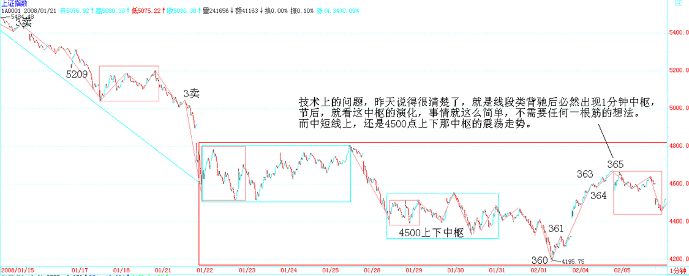

一根筋，不是别有用心就是脑子有水，市场操作，不脱离一根筋，那命运是怎么样，是不用讨论的。

技术上的问题，昨天说得很清楚了，就是线段类背驰后必然出现1分钟中枢，节后，就看这中枢的演化，事情就这么简单，不需要任何一根筋的想法。而中短线上，还是4500点上下那中枢的震荡走势。

请好好看看真正的大资金是如何运作的，大概很多人都忘了580989了吧，看看今天的走势，有什么想法？一个长假期，一个稳健的大资金，当然要这样进行有效的对冲，很多时候，不确定因素是要靠对冲来解决的。这样，不管外围在春节发生什么事情，都可以吃嘛嘛香了。

当然，对于小资金来说，580989这类东西风险太大，没必要参与，而且小资金不一定要对冲了，就要发挥自己机动灵活的特点，看不确定，就先走一部分，有钱在手里，什么都不怕了。

贪婪总是希望行情按自己的欲望发展，那是鸭屁思维，不改变，永无出期。

总结一句，任何不确定时，唯一正确的做法就是控制仓位，你能自如地控制仓位，那你的水平就能上一台阶。控制仓位，并不是说一定要空仓，而是把仓位控制在一旦发生特殊情况能有足够反应的水平。

任何想把最后一分钱赚到的，最终的命运只能是倾家荡产。

大过节的，就不说这些事情了。但市场的残酷，是不分节日的，那种春节一定要红盘，奥运一定要大行情的思维，要好好醒醒了。

大过节的，抛弃股票，享受人生。你的身体、家庭、父母、亲人，比股票重要一亿万倍，好好珍惜吧。

先下，再见。

开门不红又何妨？(2008-02-13 15:15:42)

开门大红包，本ID可给足了，580989的两次启动，都给足提示，第一次，提示后在0。42下随便买到，这次，即使节前你自己没看明白，今天在0。5下随便买，而且还两次机会，操作好了，随便一天50%的利润。

所以，本ID绝对不欠任何人红包了。

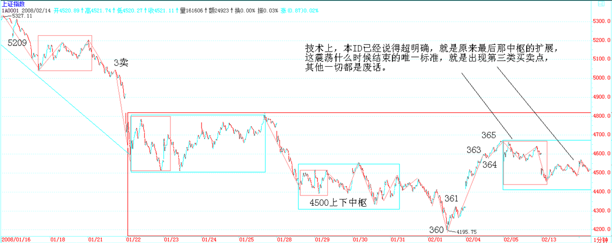

至于大盘没有红，本ID可真没什么兴趣关心，具体的说法，在节前最后的帖子里已经无比清楚了。

580989的中线中枢，本ID在第一次启动时已经明确说过，就是0。6上下，回头再看看，这走势是不是完全的教科书？请好好再看看本ID节前最后的帖子，看看关于如何对冲，如何平衡风险的做法。让那些预测连涨3天的吃西北风去吧，两次580989的礼包，足够连续30涨停的利润了。

强烈注意，本ID再次必须声明，一般人绝对不能买580989，你想，600737在8元说的还有人是亏钱出来的，580989就是你的坟墓，没那本事心态，就继续当教科书演示看看吧。

还是说说这无聊的大盘吧。

只有一根筋的才喜欢开门红，知道1993年开门红以后就从368点的深圳综指跌到94点，大概也只用了1年半不到时间。不开门红，其实真没有什么，至少证明，里面有足够多的资金都没觉得今年是必须在春节一开门就要骗人来埋单的，至少有足够多的资金还有下一步的打算。

技术上，本ID已经说得超明确，就是原来最后那中枢的扩展，这震荡什么时候结束的唯一标准，就是出现第三类买卖点，其他一切都是废话。

个股方面，中石油站不稳，指数要站稳那绝对是没戏的，那10亿的玩意，这两天成交了4亿了，当然，里面还有很多水分，但中石油今天留下的缺口，应该很快就回补，问题还是这24元上下的中枢，最终如何突破，这和大盘中枢的突破是密切相关的。

说实在，今天这样的成交量，说明了这春节假期确实太短了，怎么都该放到15吧，各位在春晚是否看到那讽刺股民的节目了？有这样的现象，你说，这股市能好吗？

中线，就看3月的会能不能搞点什么了，面包会有的，但要靠自己去抢。

后三日是技术上最关键时刻(2008-02-14 15:25:29)

先请个假，今天晚上有事，晚上的帖子，本ID就克扣了，抱歉。

今天的580989，一个经典的走势，不管你是否参加，你都先请搞明白：今天尾盘的拉起故意和昨天是一样的，这就是一种典型的骗人手法，因为一根筋的人最多了，以为什么都是可以克隆，以为有一样的开始就有一样的结果，结果就给克死了。

世界就这么残酷，这一招，用了好几百年了，在中国市场上也用了好十几年了，还继续好用，人就这德行了。不管你参与与否，被骗与否，都要学着点吧，这样以后兴许不会再被骗。

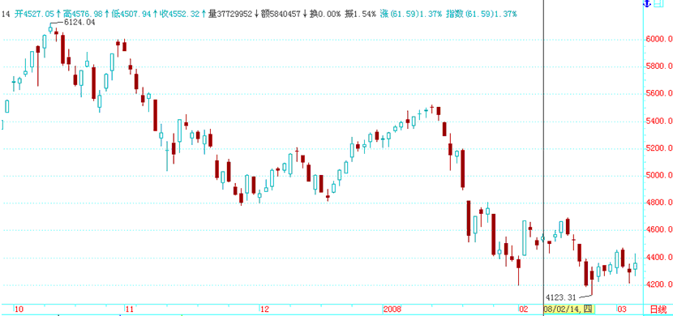

当然，类似骗局有很多变招，因为前N-1次都是一样的，但这N可以不断地变化，用得最气势磅礴的，就是10几年前深圳194点到334点那次大反弹，不断同样的模式后，最后一天大跳水，多少人一直套到100点，可怜呀。

说大盘吧，大盘后三天是技术关键，因为所谓的MACD等指标金叉就要出现，要骗你，也就是这个时候。但这时候有两种骗的方向，一种是骗空头，一种是骗多头，都仔细看好了。

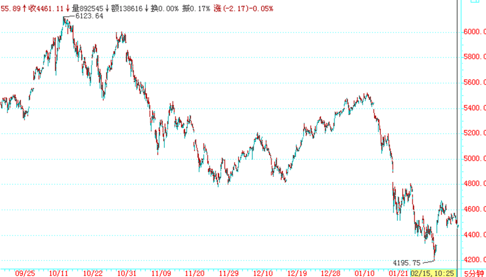

大的方向，本ID说过N次了，但糊涂的人太多，再明确说一次：

一、下面最大的机会，就是6124点下来30分钟走势类型结束后的向上30分钟走势类型，这机会在酝酿中，也就是在中阴阶段。但那30分钟的向上类型，最坏的情况，就是一个盘整，并不一定走出上涨类型，这是必须明确的。如果是盘整，就在这上下搞出一个日的中枢，然后就面临6124下来的日走势类型的第一个中枢，后面无论延伸出下跌或盘整，都是完全可能的，如果是下跌，那当然恐怖无比，比这几个月都要恐怖。所以，3月前后，对中线走势极为关键，要继续全面富裕还是怎么着，就看着办了。

二、个股依然机会不断，新股、高送配的，有各类题材的，都会有机会。当然，从上线角度，本ID看好的类型也说过无数次了，就是环保（包括新能源）、农业、消费类消耗品等等，短线，当然就是高送配中股价特别低的，例如现在不到20，而要送10之类。中线，化工等玩意是值得注意的。

注意，看本ID的文章，你必须连着看，因为有些前面的结论，本ID不可能每次都重复，例如对大盘的总判断。还有，本ID在前面那波中把人分为两类，一类就是坐小板凳的，一类是可以不断参与活动的，你首先要分清楚自己是哪一类。

就象从4778到5522那次，本ID从来没让坐小板凳的起来，为什么？因为那次是30分钟以下级别的活动，既然我们假设小板凳至少要搞30分钟以上的，否则搞不过来，那么当然就一直不用起来。但还是有无数孔男人的学生叫嚷，为什么涨了不让我们从小板凳起来，那你首先问自己，你有搞30分钟以下级别的本事吗？5522点的急促下跌，就是因为上来的级别小，下来的当然也就小，你能反应过来吗？那些下来时不会动的，你认清自己的水平了吗？

认清自己，否则一切瞎掰。就像580989，机会就这么大，但你首先要有这水平，自己都认清不了，那只能等着被屠杀。

认清自己，然后根据实际走势决定自己的操作，就这么简单，还孔男人什么呢？先下，再见。

回试年线暂显支持(2008-02-15 15:39:01)

今天回试年线暂显支持，但问题还是下周初，因为MACD的柱子是否有效放红，这是下周最关键的问题。目前的情况十分明确，就是技术面完全支持行情的展开，但基本面、政策面有太多令人不满意的因素，因此才有如此上下为难的局面。

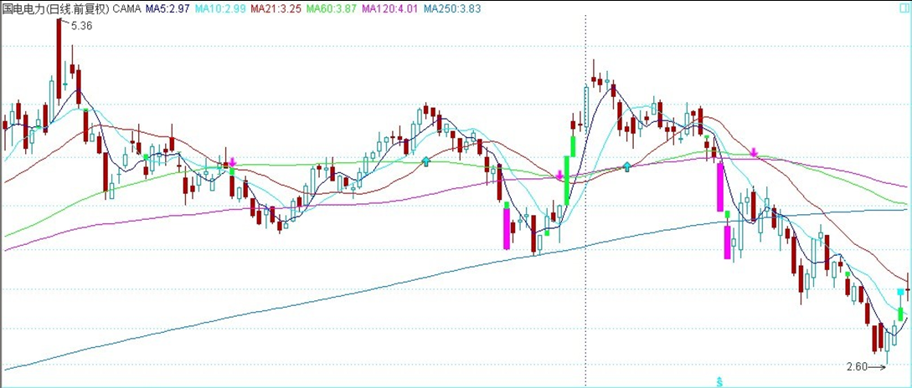

整个政策面的明朗，大概还是要等到三月会后，因此，之前，一个震荡的局面依然。其间，上下尝试，左冲右突一下是很正常的。期间甚至不排除再有一次大的跳水去把最后的盘子洗干净，当然，这涉及最后的底部图形，如果是头肩底，那这次跳水就免不了，如果不是，那就不一定有了。是否头肩底，和后续的消息面相关，技术上反而没有太大的倾向。

但个股行情会继续展开，只要指数稳定筑底中，有题材的个股就不会寂寞。但操作中必须要有严密的布局，例如，昨天说的20以下送10的个股，其实就没几只，本ID没明确说出来，就是不希望养成懒惰的习惯，连自己功课都不想做，那干脆把账号告诉本ID，本ID把钱直接打给你算了。

最符合要求的，只要做点功课，显然不难找到，就是600795。这股票，业绩很好，10送10后就今早算9元，风险度很低。而且，530后大唐电力的送股行情表现，使得这股票的后续走势更有想象力。但这些都是估算，你介入时，就应该知道，这两天的小阴线是在构造一个小的第三类买点，18元上介入，大概的风险有10-15%，所以，你就根据自己的风险能力去决定自己的仓位，然后买入相应仓位，并留下一定的对冲资金去为后面减低成本，有了这一些安排，今天一大早有足够的时间让你去介入了。

注意，这里教的是一种思维操作方法，不是说一定让你去买600795，而且，现在拉起来了，再买就没意思了。

来这里，不是培养懒人的，这点，请一定注意。

580989，今早又给了一次走的机会，没走就不要怪本ID了，当然，大盘只要走不好，这东西还要折腾，但至少这一走，逃过20%的跌幅，这已经足够了。

周末，都好好休息吧，身体最重要。先下，再见。

MACD红柱子终现待确认(2008-02-18 15:18:26)

上周说了，本周最重要的事情就是这MACD的红绿柱子问题，今天，借点利好，终于把这红柱子给弄出来了，但注意，这并不意味着一切无忧，下面就是一个确认的问题。

技术上，一般这种红柱子出来后，如果不能站住今天的位置，那么就会出现出几根红柱子再出绿柱子的情况，这种情况往往对应着新一轮的杀跌，所以这红柱子出来，需要预防的就是这种情况。

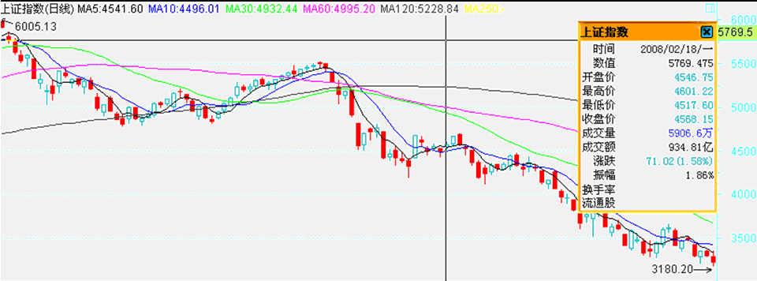

具体操作上很容易处理，也就是红柱子出来后，如果后续能量不能跟上，那么出现以上情况的可能就很大了，那么在冲高无力时，一定要先出来看看，因为后面对应的转折很可能是极为急促的。

技术上，底部的构造有头肩底的可能，这红柱后很快再绿柱的情况，往往就对应这种情况，在最好的情况下，也就对应双底的情况。

当然，以上都是些不精确的分析，如果按本ID的理论来，这些分析都没多大意义。现在就是一个中枢震荡的过程，这点说了多次了，今天并没构成线段类上涨，说明向上动力不足，因为今天构成的4575上下的1分钟中枢就有着重要的技术意义。后面的超短线走势完全由此中枢最终演变所决定。

个股方面，农业、化工、奥运等等都有表现，但板块持续性还是有问题，现在的问题是，一个超级裸奔的板块还没有形成，所以个股行情只能显现零散的局面。要改变这局面，还需要人气的不断培养。600795碰到20的整数关口，需要整理换手，如果高送股的板块都走不出来，其他板块就更难有戏了。

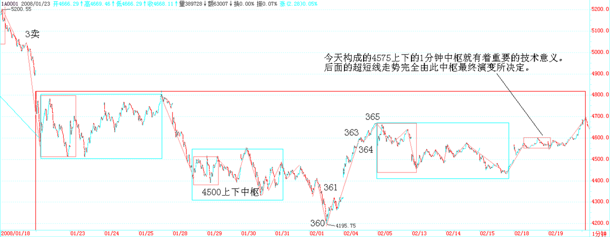

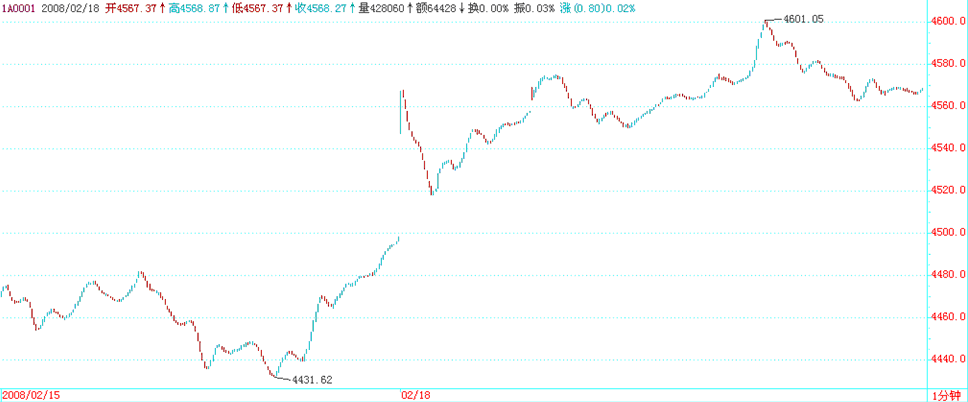

本周能否保持住MACD的红柱，并站稳4575之上，这是对多头最重要的技术要求，明天的CPI是一个考验，能否经受这考验，这是能否完成要求的关键。先下，再见。

## 教你炒股票99：走势结构的两重表里关系3(2008-02-18 16:19:16)

走势结构，最重要的就是有中阴部分的存在。有人可能认为，中阴存在是理论不完善的结果，其实，这是典型的一根筋思维，对于这种思维，世界就是机械的，任何时候都只有一个机械精确的结果，而实际上，世界更多是量子化的，是测不准的，中阴的存在恰好客观地反映了走势的这种特性。

中阴状态的存在，反映了行情走势生长阶段的未确定性，这种未确定性，不会对操作有任何的影响，因为中阴状态都可以看成是一个中枢震荡的整理，根据中枢震荡的操作就可以了。

很多人，一碰到中阴状态就晕，因为这时候，你不能对走势给出明确的划分。注意，这里不是指同级别的划分，而是一般性的划分。例如，一个线段性类上涨类背驰后，必然首先出现一个1分钟的中枢，也同时进入一种中阴状态，但你不能说这走势必然就是1分钟类型的，因为，最极端情况下，两个年中枢之间也可以是一个线段连接，甚至就是缺口连接，这在实际上都是完全可能发生的。因此，理论必须包括这些情况，而且这些情况太常见了，并不是一个古怪的问题。

另外，根据结合律，连接中枢的走势，并不一定是完全的趋势类型，也就是说，一个线段类上涨后，可能第二类类中枢就消融在中阴状态的那个中枢里了。也就是说，a+b+c+d+e+f= a+b+c+（d+e+f），a+b+c+d+e是一个线段类上涨，c+d+e的重合部分构成最后的一个类中枢，f是类背驰后的回调，这时候，就可以马上构成一个1分钟的中枢，然后后面直接继续上涨，构成1分钟的上涨是完全合理的。因为，最终的划分，就必须把a+b+c+d+e给拆开了。

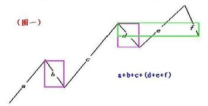

因此，一般划分中，如果中阴状态中从前面的背驰点开始已经构成相应的中枢，例如在a+b+c+d+e+f后又有g\h，f\g\h构成1分钟中枢，那么整个的划分就可以变成a+b+c+d+e+（f+g+h），这样，原来的线段类上涨就可以保持了。

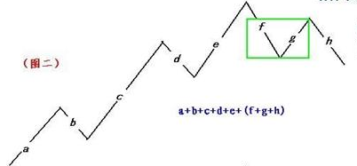

如果后面包括d+e+f延伸出9段，然后又直接上去了，划分中，必须首先保证5分钟中枢的成立。换言之，划分的原则很明确，就是必须保证中枢的确立，在这前提下，可以根据结合律，使得连接中枢的走势保持最完美的形态。

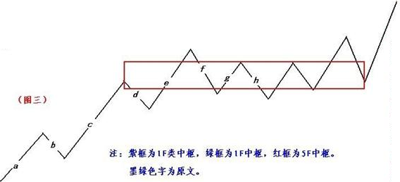

由此可见，因为划分中的这种情况，我们就很明确地知道，走势的最大特点就是，连接中枢的走势级别一定小于中枢，换言之，一个走势级别完成后必然面临至少大一级别的中枢震荡。例如，一个5分钟的上涨结束后，必然至少要有一个30分钟的中枢震荡，这就是任何走势的必然结论，没有任何走势可以逃脱。

有了这个必然的结论，对于任何走势，其后的走势都有着必然的预见性，也就是其后走势的级别是至少要大于目前走势的级别。这里，一个很关键的问题就是，这个大的走势级别的第一个中枢震荡的位置，极为关键，这是诊断行情的关键。

首先，任何一个后续的更大级别中枢震荡，必然至少要落在前一走势类型的最后一个中枢范围里，这是一个必然结论。换言之，只要这中枢震荡落在最后一个范围里，就是正常行为，就是正常的，也就是说，这种中阴状态是健康的。

但，一旦其中枢震荡回到原走势类型的第二甚至更后中枢里，那么，对应的中阴状态就是不健康的，是危险的，而原来走势的最后一个中枢，就成了一个关键的指标位置。

注意，危险是相对的，对于原下跌走势的中阴危险，就是意味着回升的力度够强，对多头意味着好事情。

结合分型，例如，一个日分型的出现，意味着笔中对应的小级别走势里出现大的中枢，因此，这个分型对应的中枢位置，就很关键了，这几乎决定了这分型是否是最后真正的顶或底。

读后感：

1、走势结构中的中阴部分的重要性和必然性。

2、“中阴状态的存在，反映了行情走势生长阶段的未确定性，这种未确定性，不会对操作有任何的影响，因为中阴状态都可以看成是一个中枢震荡的整理，根据中枢震荡的操作就可以了。”但又有别于中枢震荡。

3、“根据结合律，连接中枢的走势，并不一定是完全的趋势类型”

4、“ a+b+c+d+e+f= a+b+c+（d+e+f），a+b+c+d+e是一个线段类上涨，c+d+e的重合部分构成最后的一个类中枢，f是类背驰后的回调，这时候，就可以马上构成一个1分钟的中枢，然后后面直接继续上涨，构成1分钟的上涨是完全合理的。因为，最终的划分，就必须把a+b+c+d+e给拆开了。”

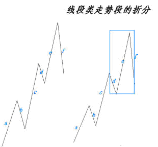

5、“因此，一般划分中，如果中阴状态中从前面的背驰点开始已经构成相应的中枢，例如在a+b+c+d+e+f后又有g\h，f\g\h构成1分钟中枢，那么整个的划分就可以变成a+b+c+d+e+（f+g+h），这样，原来的线段类上涨就可以保持了。”

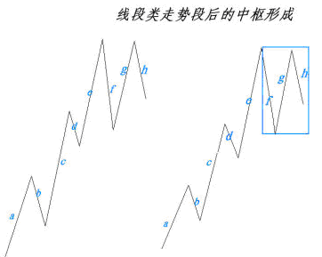

6、“如果后面包括d+e+f延伸出9段，然后又直接上去了，划分中，必须首先保证5分钟中枢的成立。换言之，划分的原则很明确，就是必须保证中枢的确立，在这前提下，可以根据结合律，使得连接中枢的走势保持最完美的形态。”

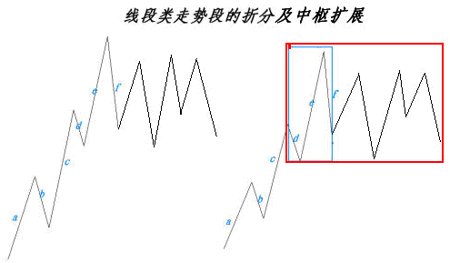

7、“一个走势级别完成后必然面临至少大一级别的中枢震荡。”

8、中枢震荡的正常范围及越界。

CPI公布成突破契机(2008-02-19 15:16:27)

昨天说了，今天要经受CPI公布的考验，结果大盘一直围绕4575的中枢震荡，CPI公布后也依然不变，下午更向上偏移，显示了最近少有的强势，最后一小时，就是中石油的表演，该股也如期回补前几天的缺口，但由于该股最近的大中枢并没有有效突破，所以这个回补只有震荡的意义，暂时不能给予太高的技术评价。

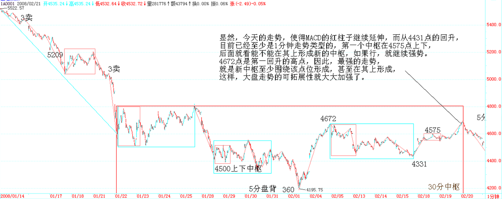

显然，今天的走势，使得MACD的红柱子继续延伸，而从4431点的回升，目前已经至少是1分钟走势类型的，第一个中枢在4575点上下，后面就看能不能在其上形成新的中枢，如果行，就继续强势。4672点是第一回升的高点，因此，最强的走势，就是新中枢至少围绕该点位形成，甚至在其上形成，这样，大盘走势的可拓展性就大大加强了。

当然，站在本ID理论的角度，由于这次的底分型范围的上沿也在4672点，所以4195点上来的走势最终是否延伸为笔，关键也在4672点的站稳。因为笔的最基本条件就是顶和底分型之间必须有不重合的部分，1月23日那个底分型，就是因为后面不能突破站住1月22日高点4818点，所以使得不可能延伸为笔，进而原来的向下笔继续延伸，形成后面的下跌。

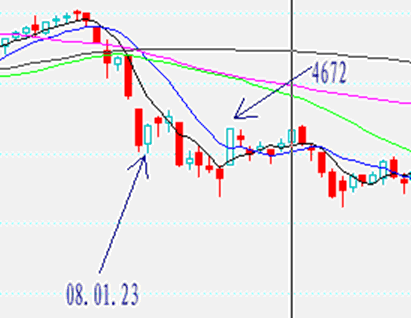

因此，从最技术化的角度，4672点是一个关键的位置。

不过目前短线最大问题，还是板块行情没有被点燃。靠中石油可以突破，但不能把人气激发，所以，后几天能否激发出板块行情，将是行情能否有力度延续的关键。先下，再见。

大规模增发猛于虎(2008-02-20 15:27:33)

5200点那次，平安的增发成了最后的稻草，今天，又来了一个浦发的增发，虽然不是正式的消息，已经足以让大盘回头。

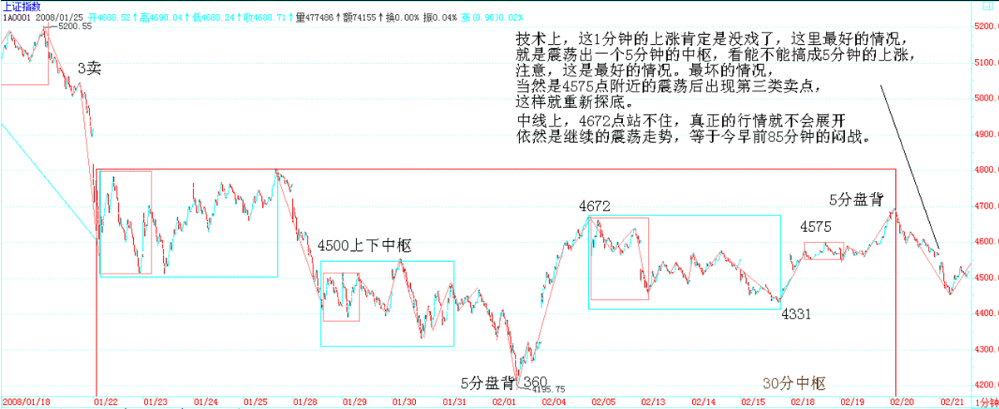

现在的多头，必须如利物浦一样去战斗才行。三个手球不算，熬到最后一刻才把最后的纸给破了。现在，基金的新发，等于把空头一个人给罚下了，但要灭空头，没点耐心是不行的。今天这增发闹剧，等于一个手球不算，估计这不算的手球，还少不了。不熬到85分钟以后，胜利的希望是看不到的。

技术上，这1分钟的上涨肯定是没戏了，这里最好的情况，就是震荡出一个5分钟的中枢，看能不能搞成5分钟的上涨，注意，这是最好的情况。最坏的情况，当然是4575点附近的震荡后出现第三类卖点，这样就重新探底。

中线上，4672点站不住，真正的行情就不会展开，依然是继续的震荡走势，等于今早前85分钟的闷战。

多头需要第一个进球，这进球，必须来自板块的启动。本ID一直强调的农业股，现在已经是整体走强，600737更是无耻地又新高了。这板块能否带动化工等，逐步把热点蔓延，这是后面需要留意的。有时候火点起来了，蔓延不起来，那只好偃旗息鼓，等机会再来，这种事情也是经常发生的。

前面说了农业，环保新能源，化工，这都很好理解。至于消费消耗品类的，这其实是中国最大的优势，就是各种消耗品，例如吃的，包括调味品等等；用的，用的包括很多方面，例如汽车发展了，汽车的配件如轮胎、玻璃之类的，反正是整天要换要用的。中国什么多？就是人多，消耗多，这是永恒的题材。酒类，只是其中很小的部分。

中线真的突破时间，可能真要如前面所说，等到3月那会后了，所以一定要耐心。最主动的做法的，就是追逐最强势的板块；最稳健的做法，就是逢震荡低吸那些有中线潜力且刚启动的，如高送之类。

580989。现在是完全和大盘对冲着搞，中枢上的风险就开始加大了，当然，如果大盘破位，那会有一次冲动的过程，不过风险很大，一般人看看就算了。先下，再见。

平安圈钱闹剧与资本市场的生态平衡2008-2-22 19:16:36  选自《木子视点》

又名：资本市场必须维持生态平衡2008-02-20 16:27

平安圈钱事件之所以是闹剧，就是这事情具备了闹剧所有的特征。狮子大开口式的1600亿级别的大圈钱，就等于一个暴发户突然冲进一个北京炸酱面的馆子，叫嚷着一定要点鱼翅鲍鱼，否则就要大肆闹腾。这闹剧最大的成就之一就是该事件将肯定入选2008年中国资本市场十大事件，当然，顺带地还成为让大盘彻底告别5000点的最后一根稻草。

春节年关之前如此急切地大规模圈钱，大概也只有如下两个合理的解释：一、平安的对外投资出现大规模的亏损，其类型有可能是如中投公司的黑石型或如中航油的期货型，因此需要大规模的资金去填此窟窿；二、由于平安深度介入二级市场，因此如此大规模圈钱计划的推出，即使最后不通过，也可以把市场打下来，从而达到其二级市场的战略目标，如果通过了，那袋袋平安地白来一大笔资金，可谓左右逢源。

本来，如平安般在资本市场有着举足轻重地位的公司，除了自身的经济追求外，更多地还应该自觉地承担应有的市场责任，但这样的要求，对于目前水平的国内大公司来说，有点太高了。那么，换另一个角度来看这个问题。

以目前中国金融机构的水平，例如平安之类的，离开中国的资本市场，能生存的可能性不超过1%，看看那些QDII的全军尽墨，就知道这些平时养尊处优的大机构的实际水平了。那么，最理想的情况，就是继续窝里横，也就是把肉都烂在锅里。但这里有一个前提，肉可以烂，但锅不能烂，锅烂了，谁都吃不上了。

因此，对于如平安之类的机构，如果有点大思维，也应该知道，维持中国资本市场的生态平衡、可持续发展，最终最大的收益者还是他们自己。否则，大家都破罐破摔，你平安能圈1600亿，为什么工行、中行、人寿、中石化、中石油、宝钢等等就不能都来个2000亿、3000亿、5000亿的？这样恶性循环下去，最终的结果就是大家都没水可喝、没饭可吃。

由于目前的国内大机构的水平依然停留在婴儿状态，因此，管理机构的监管就极端重要了。一些本不应该制定的规则也必须要制定了，例如限制每次的增发额度、增发的时间间隔等等，这样才能维护资本市场的生态平衡。

环境保护、生态平衡已经是世界性的大问题，而资本市场，也同样存在一个环境保护、生态平衡的问题。在资本市场上活动的各种力量，之所以能存在一个系统中，就是之间有一个基本的协调关系，而一旦这个关系被打破了，这个资本市场的大系统就会出现生态危机。而一旦出现生态危机，这资本市场要恢复元气，那就不是一朝一夕的事情了。

对于中国这初生的资本市场，其生态系统本来就极为脆弱，因此，期间的生态平衡，必须有些人为的引导，而这种人为的引导，在该系统充分发育后将逐步减少。因此，对于管理层来说，有意识地对资本市场的生态系统进行环境保护，是其目前最为重要的任务。因为对于管理层来说，其业绩的好坏，完全依赖于资本市场系统运行的顺畅与否，一个导致资本市场生态灾难的决策，无论如何都不可能是及格的。

资本市场的生态平衡的维护，是有时间性的，一些决策也因此带有时间性。例如，目前的环境下，一个资本市场中的大力量，通过强力的圈钱活动对资本市场的资源进行过度开发，这样的事情，就绝对是不合时宜的，一旦蔓延，必将造成严重的生态灾难。

环境保护，很重要一点，就是要对资本市场的市场资源进行合理、适度的开发，禁止乱砍乱伐，更不能允许如那些无证小煤窑或受到地方以及其他保护势维护而非法开采的煤老大般到处横行，这些资源是属于全中国人民的，没有人有资格随意浪费或为自己的利益而干苟且之事。

其实，世界上的道理都很简单，资本市场的事情也很简单，不简单的都是利益。有了利益，一切简单的事情就复杂了，现实中的环境保护所遇到的问题如此，资本市场上的问题也是如此。因此，要最终解决问题，就是一定要砍断这利益的背后黑手，这大概才是问题的关键。

在写本文时，市场上又上演了浦发银行的大规模圈钱闹剧，这证明，平安这坏榜样的力量果然是无穷的。就算我们能很善良地认为，其中有某些融资确实有着极大的必要性，但最终的结果可能是，那些确实有必要的融资行为，也被市场认为是平安式的而被唾弃，这里究竟伤害的是谁，不是很清楚了吗？

赚钱是靠个股而不是指数(2008-02-21 15:18:25)

各位元宵好，晚上过节，就没帖子了，抱歉。

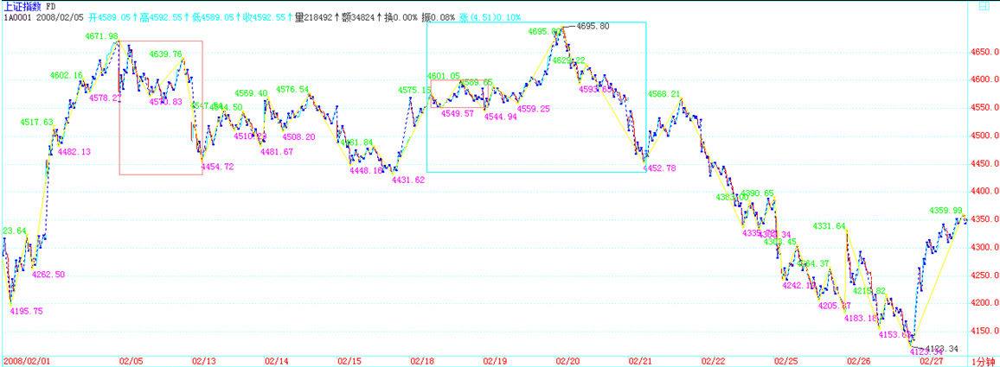

今天，昨天的传闻被证实了，在现代社会，空穴来风的事情很少有，特别在资本市场。指数勉强地维持了4575点的中枢震荡，这5分钟中枢是确定了，后面的关键是第三类买卖点的问题。

由于大家伙都爱狮子开大口，所以大家只好避而远之，指数折腾不出花样，并不意味赚钱的机会少了，赚钱是靠个股而不是指数。在去年的展望中已经明确说过，今年是题材股的天下，而目前，正如昨天所说，就要到处点火，把板块激荡起来。

今天，从创投到化工、医药、新能源等等，都被点了一次，这板块轮动是否能起来，现在还不好说，因为现在人为因素很大，但如果光是点火的人忙乎，最终是燎原不了的。燎原不了，那点火的人就白忙了。

指数，最悲惨的就是再砸一次底，但估计有题材的股票，最多就顺着洗洗，你看，现在又有不少股票新高了。和指数折腾没多大意思，还是折腾个股吧。

注意，个股折腾，要注意轮动，一个板块涨起来了，就没必要去追高，要买也买那些没启动但有新资金关照的。现在的行情，持续性都不高，势头不对就可以跑，跑了依然会有无数股票等着可以去买，现在可没有踏空一说。

当然，没这技术的，就抱死一些中线肯定会涨的股票，死守具体的板块。能轮动起来的，赚500%，轮动不起来的，死守的，赚50%，这世界很公平，技术很重要，没技术就别眼热了。

中枢的作用，在今天的580989上又一次经典了，看看远离中枢后回跌起来多刺激，和上次0.976那次比有些差，但还是有点经典的。先下，再见。

下周初决定大盘中线形态(2008-02-22 15:18:40)

今天继续延续4695点浦发闹剧所制造的线段类下跌，在下午2点后最终出现一个类底背驰。该类下跌出现三个类中枢，类背驰后的回拉如理论所要求的最低幅度回到最后一个类中枢，也就是至少制造了一个1分钟中枢。最坏的情况，这中枢是一个新的1分钟下跌的第一个中枢；最好的情况，就是该1分钟中枢出现第三类买点，然后至少回到类下跌的第二个类中枢范围。因此，下周初该中枢的演化决定了大盘短线的形态。

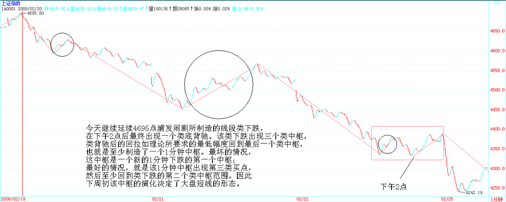

而实际上，大盘下周初的走势还将决定大盘的中线形态。在前几天大盘MACD出红柱子时，已经说过，就是必须注意放几天红柱子后再次放绿柱子的情况，这样就对应着大盘再次破底形成头肩底形态。那么，下周，是否要出现这种情况，马上就要分晓。由于今天依然红柱子，因此还存在不出现绿柱子，红柱子再次伸长的情况，而这一切都将在下周有分晓。

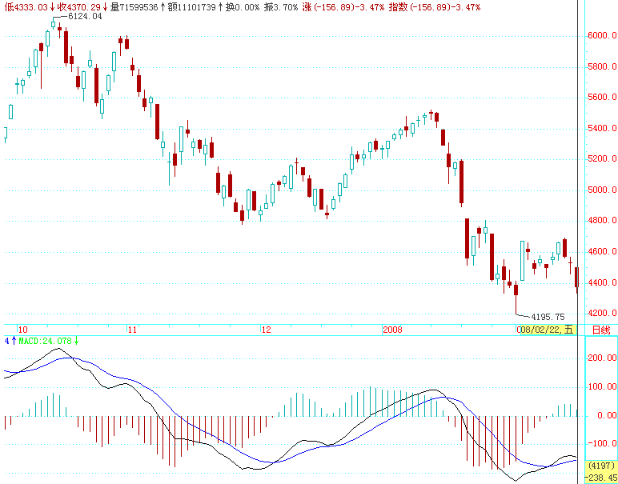

以下的内容，在前面已经多次提过，这里不妨用单纯对MACD柱子可以面临的情况进行最完全的分类再表述一次：

一、再次绿柱子后比前一次更长，面积更大，这对应着原来从6124点下来的30分钟级别下跌不能形成背驰，那么大盘最终的下跌空间完全可以合理地到达2500点，这也是我们所说以4300点为中轴的1800点震荡区间范围内的。

评论：这种情况，在技术上是合理的，但根据大的基本面情况，暂时看不到支持这种走势的可能，当然，就算这走势真的出现，也没什么大不了的，反正在真正破位下跌时，根据技术早走了，真有这样的下跌，等于一次巨大无比的机会在前面招手，那时候，又可以到砸锅卖铁买股票的时候了。

注意，基本面上其实还是完全存在这种可能性的，就是美国再次1987年，本ID已经多次表达希望看到这种情况的意愿，可惜这不是本ID所能决定的，那么我们就默默念多点咒语，把1987年给咒出来吧。

二、绿柱子再出现但比前一次短且面积小，对应着6124点下来的30分钟下跌背驰，也就是最终结束。然后展开一轮30分钟级别的向上过程。

评论：这是从目前基本面角度最合理的走势，本ID反复强调，真的行情可能要等到3月份的会后，主要就是针对这种走势的，从月线的角度，底分型并没有出现，也就是说，2、3月份在月线上的任务，就是把月线的底分型给弄出来，一旦这成功了，就有支持行情展开的最基本技术基础。

三、不再出现绿柱子，红柱子再次延长，大盘直接上去。

评论：由于上次4195点对应的是一个30分钟中枢的盘整背驰，从纯技术的角度，这也可以构成底部，因为a+A+b+B+c里，c并不一定要存在的，可以直接从B就向上反转，这就对应着盘整背驰点的情况。不过，这种情况，一般都需要基本面的支持。这次，能上来，主要是新基金的发行，但后面一系列的圈钱闹剧，使得新基金的发行基本面支持有所动摇，所以，这种情况，作为一种良好的愿望，还是可以努力去实践的，但这样直接的上去，只有一种后果，就是上升的空间会被压制。从纯技术的角度，一旦一个30分钟的直接上冲不能制造有效的突破，那么甚至可能形成一个日下跌的第一个中枢，这反而问题大了。

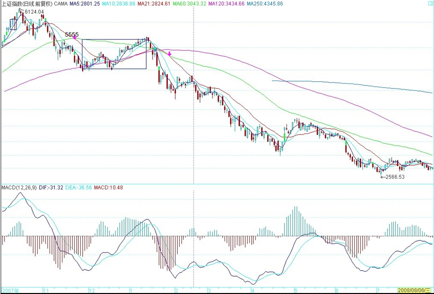

当然，二、三两种情况，都依然存在选择的可能，最终怎么选择，那是大盘自己的事情，我们只需要等大盘自己去选择，然后根据选择操作就可以。

操作上，已经多次反复说过，震荡中，就是要逢向上无力就抛，下来跌不动了再买，这样才是真正操作的节奏，如果你没有这个节奏，那干脆就坐小板凳看着。

对于大盘大的走势，去年展望中曾说过，大盘有很大可能今年创不了新高。从纯技术的角度，无论最后是哪种选择，30分钟的向上最大可能就是形成大的第二类卖点，6124点是第一类卖点，后面至少要回杀形成一个大的日中枢，所以，今年行情的困难程度，去年底已经说得很明确了，还是那句话，今年结束时，大多数股票的年K线都将是阴线，这点必须时刻记住。

所以，各位可以根据自己的情况，决定自己的操作：一、如果觉得自己无法应付日以下级别的折腾，那么全年坐小板凳也是一个很好的选择。二、觉得30分钟的走势还是可以应付的，就好好等待这30分钟向上机会的酝酿、展开，但一定要记住，现在犯点错误问题都不大，但一旦最终这向上开始后，最终一定要在顶背驰时出来，第二类卖点不走，后面是什么结果，看看昨天的580989在2点多0。76上那第二类卖点后，收盘在0。64就知道了。当然，第二类卖点大幅度调整后会有再次上涨的机会，但如果这调整不躲开，其痛苦程度可不是一般人能承受的。

个股方面，已经反复说过，今年除非有期货，否则大盘股都没什么大戏，而期货是本ID所深恶痛绝的，本ID今年的三大任务之一，就是不想看到期货。今年就是题材股的天下，这已经说得太多了。诸如农业、创投、化工、医药、消费品、奥运、低价股投机股甚至军工等等都会反复表现的，而且，最近公布了重组的事情，因此，关于重组的题材将慢慢升温，重组题材的好处，就是熊市也可以炒得热火朝天，这是一个值得关注的方向。

一定要注意，今年行情，就算是个股也不可能像以前单边上去，肯定是反复震荡，来回折腾，除非那30分钟的向上过程最终展开，否则那种连续涨停，一去不回头的走势是很难出现的，操作上一定要见好就收，大力来回折腾，这样才能把利润洗出来。

某种程度上，今年炒股票是一个体力活，要来回跑动，要特别勤快才行，这点必须注意。

周末，还是少点股票吧。先下，再见。

新基金难敌乱增发(2008-02-25 15:23:55)

所谓事不过三，就算是管理层，连续三次用同一的招数，市场也不会领情了。而且，市场甚至会这样以为：连续发新基金，又不制止乱增发，难道是想让新基金去配合完成乱增发？一旦市场有了这样的念头，新基金就算有着良苦用心，也只会被认为良心大大地坏了。因此，今天市场用新低回应管理层的关怀，最恰当不过了。

今天的走势，给那些政策迷好好上了一课，政策从来不是万能的，任何政策不过是市场的分力之一，最终决定市场的是合力。而所有的合力都写在走势之上，所以，今天的市场，如期地就把上周所分析的第三种走势给废掉了，后面，就是第二种走势的演化问题了，这也是我们反复强调的最有可能的走势。

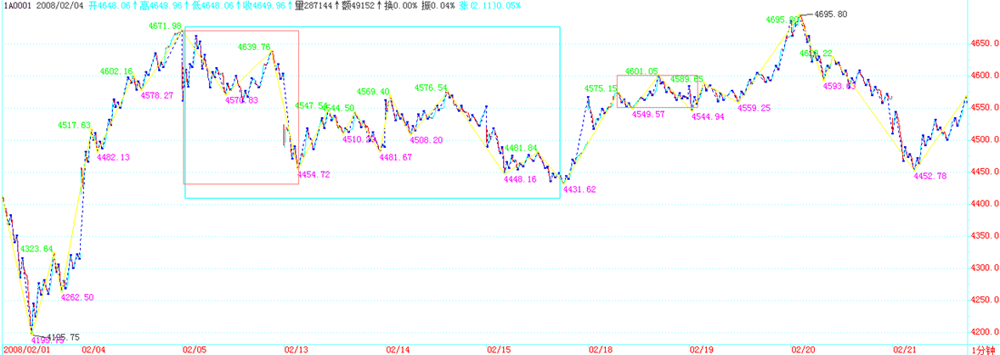

注意，卖出总在向上的过程中，也就是总在红柱子时。在上次刚出红柱子时，本ID已经明确说过了，一旦上冲没力，一定要先走，因此在4695点就算你没看出那5分钟的盘整背驰，里面还包括一个1分钟盘整背驰的区间套，那么，浦发的消息也已经足以让你走人了。至于那些还要问绿柱子出来再走是不是太晚的人，永远不会懂得什么叫节奏。不懂得节奏，那就继续被市场调戏吧。

今天的短线走势是超级教科书的，一开始就跌破上周的1分钟中枢，那中枢，只能回到三个类中枢类下跌的最后一个，超级弱，因此跌破一点都不奇怪。然后早上那最大的反弹构成第三类卖点，然后继续下跌，下午那波反弹完成第二个1分钟中枢的构造，所以，4695点下来的走势，肯定至少是1分钟级别的下跌了。

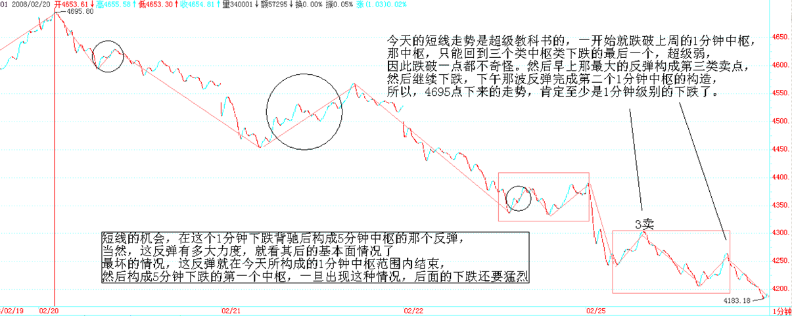

短线的机会，在这个1分钟下跌背驰后构成5分钟中枢的那个反弹，当然，这反弹有多大力度，就看其后的基本面情况了。最坏的情况，这反弹就在今天所构成的1分钟中枢范围内结束，然后构成5分钟下跌的第一个中枢，一旦出现这种情况，后面的下跌还要猛烈。

当然，现在各种因素交织着，政策面方面经过今天很没面子的一天，是否有新的动作，这是决定最终形态的一个很重要的因数。其实，现在最大的利好不是印花税，而是把乱增发给规范，这才是稳定人心的立杆见影之举。现在就算印花税出来，请问，减少的印花税难道都马上给平安之流上供去吗？

现在，要密切注意个股了，赚钱是靠个股不是指数，看好那些趁机洗盘，强力吸纳的股票，技术上最安全的，就是离前期高位有一定距离，最近强力站稳而成交量一直保持一定数量的股票，因为新高的股票怕多头陷阱，而这种在下面横着的股票，有明显的吸纳迹象，就算补跌，也就是洗盘而已，正好继续买。当然，真能站稳新高的股票，只要前期没有暴炒过的，都是有投机价值的。

但一定要注意，底部不是一天构成的，必然会来回折腾，因此，操作上一定要把握节奏，在底部震荡中就把成本降下来，一旦行情真启动，个股刚开始涨，你的成本已经低了30%，这样不是最美妙的事情吗？先下，再见。

## 教你炒股票100：中医、兵法、诗歌、操作3(2008-02-25 16:32:23)

只要是中国人，都知道，诸葛亮曾因为一场雨没把司马懿给灭了，这虽然是小说情节，但还是有分析意义的。打仗，必须要把尽可能的情况完全分类，用火攻，那当然最怕下雨，诸葛亮草船借箭的时候算天气算得那么准，怎么这次就没好好算？此外，既然诸葛亮知道这一次不搞死司马懿就没机会了，那怎么不把所有的可能都想到？其实，就算有雨，如果在峡谷外再安排点兵马，那司马懿也逃不掉了。

当然，其实并不是诸葛亮真想不到，而是历史上司马懿就没被诸葛亮干掉，写小说的总不能编得太离谱了，只好把这一切归于天命，其实，在现实中，所谓的天命，都是在人谋之中，只是你的谋划是否完全，另外，一个很重要的是，完全的谋划是否超越你的能力。

股票比战争要简单得多，因为，对于股票来说，完全的分类或谋划，基本不存在超越能力的问题，只是买卖多少的问题，有能力就多点，没能力就少点，不存在某种分类完全不能执行的情况。因此，所有的重点，都在这完全的分类上了。

这点，前面已经反复说过。但完全的分类，不是单层次的，一定也必须是多层次的。本ID的理论最重要的特点之一，就是自然给出了分类的层次，也就是不同的自然形成的级别。不同的级别，有不同的完全分类，而综合起来，就有了一个立体的完全分类的系统，这才是我们的操作必须依赖的。

当然，对于小资金，你可以完全用一个层次的完全分类进行操作，但对于大一点的资金，这是不合适的。例如，30、5、1分钟的三个层次所构成的系统里，任何的当下状态，都对应着不同层次完全分类中的一个现实状态。

例如，现在的上海指数，从6124点下来，是一个30分钟的下跌，现在处在最近一个中枢的中枢震荡之中，只要不出现第三类卖点，这震荡还是有效的。而5分钟层次上，是离开第一个中枢向下移动中，由于第三类卖点没有形成，所有是否形成5分钟下跌，不能给出100%的确定。而1分钟层次，一个1分钟下跌已经形成。

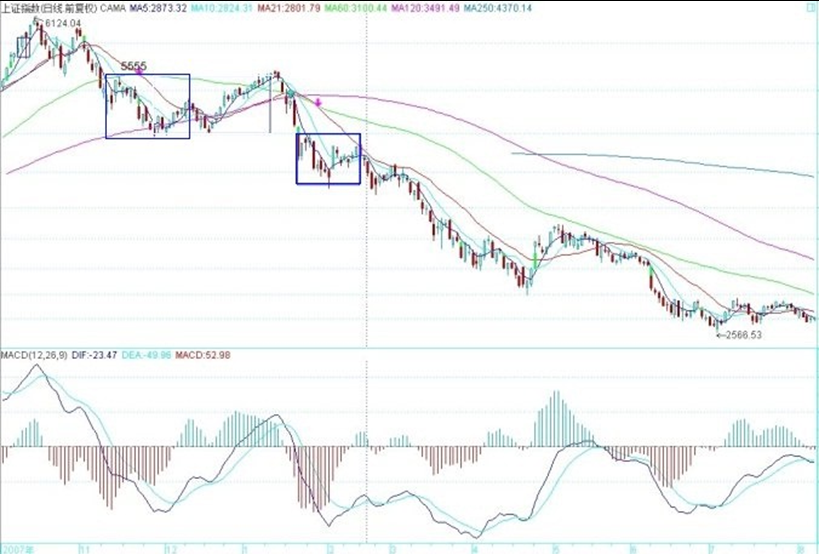

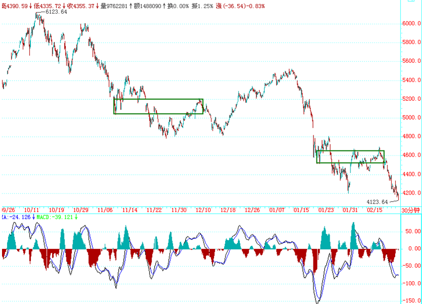

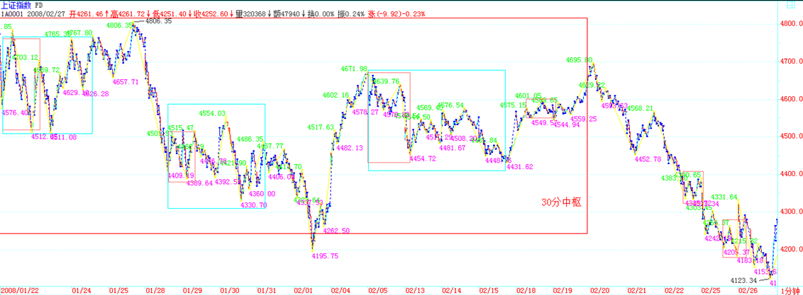

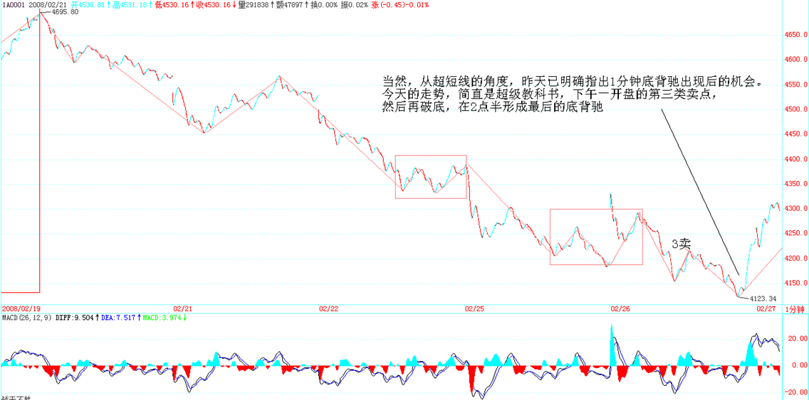

因此，这三层次构成的完全分类就给出了最完美的操作指示。首先，第一个必然且一定是最先出现的变化，就是1分钟层次的底背驰。如果连这都不出现，其他两个层次是不会有任何状态变化的。而这底背驰后，必然出现回拉，这里就面临两个完全分类：一、这回拉构成原来5分钟的第三类卖点；二、回拉不构成原来5分钟的第三类卖点。因此，对应这两种5分钟层次的状态变化：一、第二个5分钟中枢的确认从而确认5分钟的下跌。二、原来5分钟中枢继续震荡的确认。

显然，这两种5分钟的新变化，都不会导致30分钟层次有状态变化。但，其中的其一种，却隐含着30分钟即将可能面临变化，因为5分钟下跌一旦结束回拉构成30分钟第三类卖点，那么30分钟层次就会有所变化了。

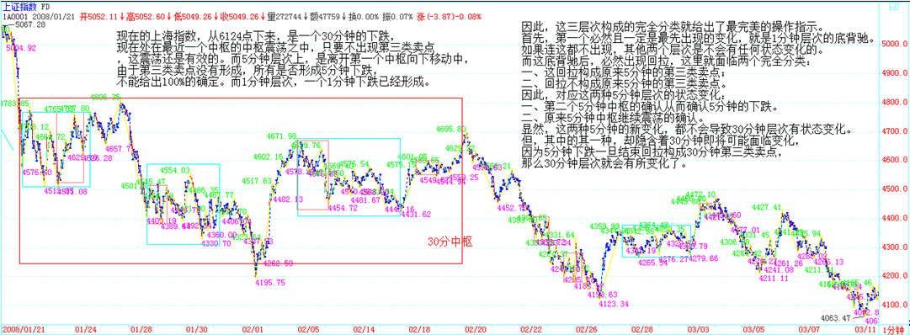

因此，在当下的状态，我们可以很逻辑很严密地推算出后面下一步的系统层次的状态变化，那么这个变化的可能结果，都对应着你可以承受的范围。因此，你只需要把自己可以承受的能力与之相匹配，给出相应的参与资金比例，相应的仓位控制，就可以自如地参与其中了。

例如，你没法应付可能出现的第三类卖点的情况，那么，你就别参与了，为什么？因为这第三类卖点是一个可能的选项。反之，如果你对所有的可能都有面对的技术，那么，就可以参与这1分钟底背驰的活动了。

所以，最终还是那个问题，把市场分析好了，把情况分类好了，然后问一下自己，你有这个处理所有可能情况的能力吗？如果没有，那就算了；如果有，就上。事情就这么简单。

当然，你还可以这样，就是把仓位弄得特别小地去参与，这样，可能培养自己面对相应情况的能力，能力毕竟要干才能培养的，光说不练，那永远还是没能力。关键是知道自己干什么，而不是糊涂蛋瞎蒙就行。

无技术含量救市已审美疲劳(2008-02-26 15:14:39)

今天的所谓救市发言，本质上一点技术含量都没有，除了表现管理层最近对市场的超级关注外，没有其他实质内容。关于恶意圈钱，并没有给出实质的限制措施。何谓根据市场的情况？难道一上5000点，平安就可以继续1600亿的圈钱？所以，这个问题不彻底解决，市场最终的上涨空间一定受到限制。

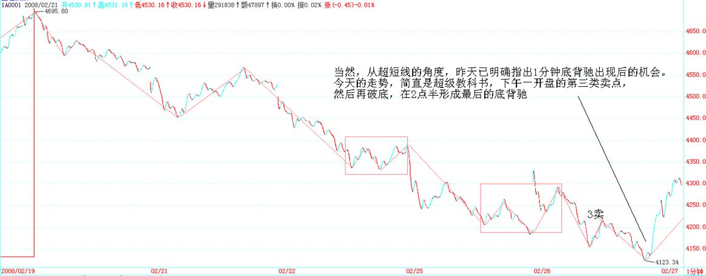

当然，从超短线的角度，昨天已明确指出1分钟底背驰出现后的机会。今天的走势，简直是超级教科书，下午一开盘的第三类卖点，然后再破底，在2点半形成最后的底背驰，如此教科书的走势，如果都不能看明白并操作，那么唯一的办法就是继续读书。

由于1分钟背驰后，最低的回升幅度就是回到最后一个中枢里，所以，明天的关键就是这升幅能否扩大。日线上，今天已经有底分型的雏形，明天只要不破底并比今天最高位高，底分型就成立，后面就是是否延伸为笔的问题，所以，技术上已经初步具备上冲的形态。

但是，目前最大的问题是，政策上需要真正的干货，而不是一些掺水的玩意。如果政策不能给于足够的真正支持，那么，就算上去，也就是继续保持大的震荡而已。

操作上还是那句话，以震荡的思路去操作，一旦上冲没力就先出来。个股上，前面提到的个股都会有所表现的，但现在的问题还是，如果没有真正的政策面支持，持续的行情的展开就有困难，而个股也只能进行线段式的震荡表现。

今天下午晚上都有会，帖子就克扣了，抱歉。先下，再见。

4391点决定短线走势(2008-02-27 15:19:36)

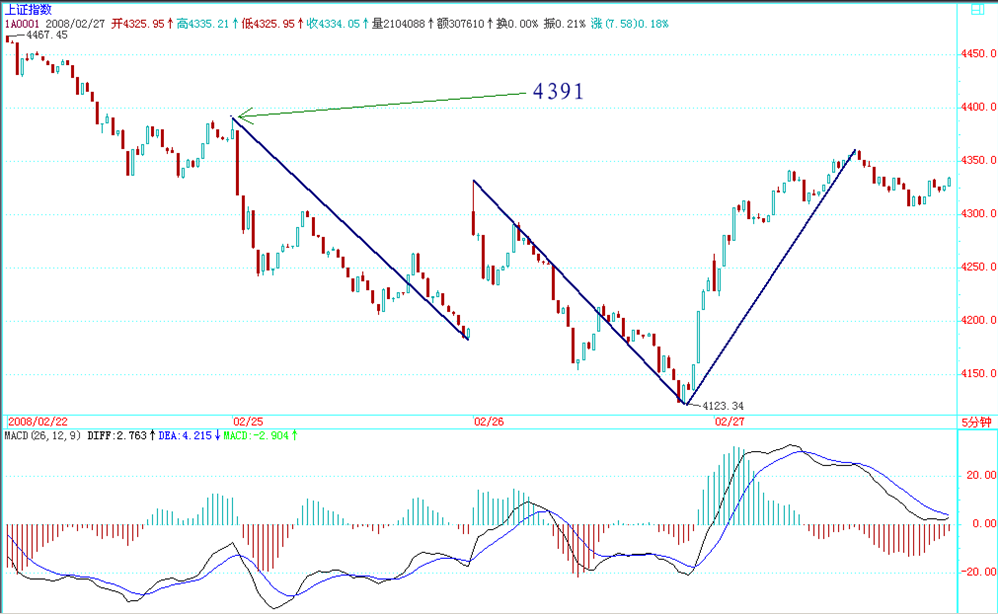

昨天说了，今天不创新低且冲上4331点就构成底分型，今天的走势也很争气地达到了最基本的目标。但是，站在严格的意义上，这不是最强的走势，因为整个底分型的上边沿在4391点，也就是前天的高点，最强的走势就是今天直接攻上这点上。

因为，底分型成立并不意味着上攻走势必然延伸为笔，关键是要站住整个底分型的上边沿，这才是技术上的关键，前面4818点、4672点之所以不能延伸为笔，就是这个原因，因此，4391点成为短线最关键的位置。

由于大盘选择了我们认为最有可能的第二种中线走势（第一种还不能完全排除），因此MACD的进一步变化就可以勾画出大盘中线的可能变化：

一、由于今天MACD的绿柱子开始收短，因此，最好的情况，就是再次放红并创出比上次更大的红柱子，这样，MACD的黄白线至少要回到0轴附近。

注意，所有真正行情的展开，都必要需要MACD的黄白线回到0轴，一旦站住0轴，行情就会展开。这是最好的走势。

二、绿柱子再次放长或放点红后再放绿柱子。

这种情况对应着继续的底部震荡。

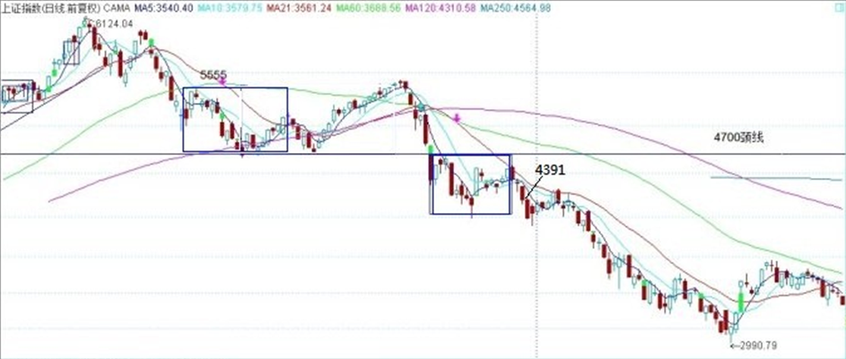

目前，大盘中线的颈线位置在4700点上下，可以给各位一个最明确的技术图象，如果能在MACD黄白线回到0轴同时大盘回到颈线，最后站住，那么突破就不可避免。当然，要完成这技术图象，还需要多方面的配合。而操作上，没必要被这干扰，只要颈线不有效突破，就可以继续按30分钟震荡去操作。

注意，之所以用MACD来描述，主要是这个指标谁都能看见，而且直观，并不是说MACD有什么特殊的地方，如果你对本ID的理论有所把握，这一切都完全没必要的。

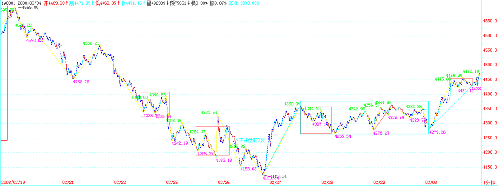

本ID前天明确告诉有1分钟底背驰，昨天一个教科书走势，如果都不能把握，那你就面临两种选择：一、你不需要再来这里了，等你被市场再戏弄N次后再说吧；二、抓紧学习，这是最基本的技能，连这都不能把握，不学习不继续锻炼哪里有更好的办法？

那么，昨天按理论进入的人，今天的操作，在100那课程里其实也早说了。因为这后面无非面对两种情况：一、1分钟回升构成5分钟的第三类卖点；二、1分钟回升不构成5分钟的第三类卖点。无论哪种情况，都对应一个1分钟的走势类型，现在唯一需要市场去确认的，是这类型是盘整还是上涨。

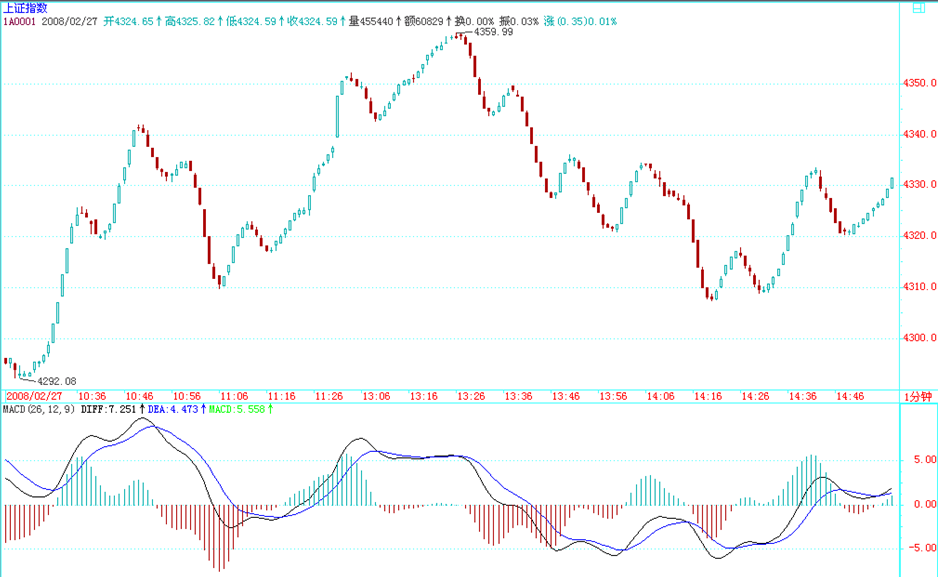

今天的走势，在4331点上下形成第一个1分钟的中枢，因此，后面的走势，就是这中枢的演化，一旦这中枢能形成第三类买点，那么，构成上涨并重新回到原来5分钟震荡的几率就极大了。

操作上，就很简单，你根本不需要慌忙抛出，因为你可以根据这中枢的演化再做决定。当然，如果你的胆子特小，那最稳健的做法，就是今天下午开盘后那线段类背驰先抛出一半，为什么？因为线段类背驰后必然形成1分钟中枢，这表明你不想全仓参加这1分钟的震荡，等其后走势确认再说。

当然，对于一般心态好的，其实没必要如此，1分钟的震荡你都受不了，那还怎么搞股票。不过，对于操作水平有一定的，其实也可以利用那线段的类背驰，进行换股操作，这是效率最高的玩法，不过这对水平要求更高，并不是每个人都可以达到的。

本ID的理论给予的操作指示都是最明确、最精确的，没有任何含糊的地方，关键是你的心态和能力，有什么的心态和能力就参与什么活动。但前提是，基本的操作和分析，你必要彻底明白。

个股还是那句话，让板块轮动起来才是王道，否则，大盘的动力将出现大的问题。先下，再见。

穷疯浦发让大盘再陷彷徨(2008-02-28 15:12:30)

昨天已经说了，这两天本来是大盘短线很关键的时间，也就是MACD红柱子能否再度出现的时间，这时候任何风吹草动都会让脆弱大盘受到惊吓。

今天，曾经在4672点扼杀大盘底分型延伸为笔的浦发又疯狂出招，这次的招数是横着来了，就说自己的资本充足率已经快到红线，现在就是穷疯了，400亿不行那300亿也可以，总之没钱就不行。这种强暴的逻辑，怎能不让大盘再度彷徨？

虽然，在技术上大盘顽强地没有出现昨天所说1分钟震荡的第三类卖点，依然保持了中枢震荡的局面，但这种变化，必然让市场心理再次出现波折。

今天支持大盘没走出真正下跌的，无非是关于印花税将要修改的传闻，因此，今后几天，市场心理将在这种传闻与圈钱压力下挣扎。

技术上，4391点没站住之前，大盘依然存在再度探底的潜在压力，至于这压力是因为传闻没兑现还是其他原因，这并不重要。

前面早说了，现在出印花税修改，其效力将大大减弱，因为现在最大的问题是，圈钱的压力已经远远大于印花税的减少，现在最大的问题是，万一印花税出来，最终又是一日行情，那么市场的信心将最终彻底崩溃。

操作上，依然按照震荡的原则，上冲无力减，下来震荡依旧再回补。

不过今天大盘上还是有亮点，就是个股行情有所升温，这趋势能否延续，决定大盘信心的修复能否实现。先下，再见。

要通胀还是要经济增长(2008-02-28 15:53:15)

现在最大的问题是什么，就是不能让中国经济陷入真正的大调整中。现在的经济无非面临这样一个问题，就是要通胀还是要经济增长。

关于这两个选项，无非有四种完全分类：高通胀高增长、高通胀低增长、低通胀高增长、低通胀低增长。前面，我们一直在低通胀高增长的阳光下幸福着，但这种状态不可能永远存在，也就是说，其余三个选项也有可能成为现实的走势。

那么，我们最怕的是什么？就是高通胀低增长，这才是最可怕的事情，一旦出现这种情况，中国整个社会结构都将面临强大的压力。而低通胀低增长，一般也不会在中国这种发展中国家出现，所以，最好的选择，就是高通胀高增长。

也就是说，万一低通胀高增长的幸福不能延续，那么我们宁愿选择高通胀高增长，也绝对不能陷入高通胀低增长的死局。换言之，保持高增长，是第一重要的事情，只有在保持高增长的基础上调控通胀，才是正确的。

而那种企图牺牲经济增长压制通胀的做法，不但不现实，而且很有可能让中国经济陷入高通胀低增长的死局，一旦经济决策失误，将出现以年为计量的巨大调整，中国的复兴大业也将受到沉重打击。

现在中国的通胀问题，本质上是中国现有经济结构不完整不合理所造成的，而这刚好给国外敌对势力与投机分子以可乘之机，看看现在所有资源类甚至农业类资产的大幅度被炒作，就知道，所有都刚好是中国经济的软肋，而这又能怪谁呢？一个大国，甚至连一些基本的农产品都要大面积依赖进口，别人不搞你投机你有可能吗？

去年，当市场狂热讨论所谓的流动性过剩时，本ID就明确指出，这玩意根本不存在，只是中国经济、资本市场现有结构不完善所造成的假象。完善基本结构才是本，而不是像央行对于风车玩那种幼稚游戏。事实证明，央行大战流动性过剩风车，最终就是一个闹剧，现在，利率已经比美国还高了，就看这闹剧如何收场了。

中国经济的所有问题，归根结底是结构性问题，很多问题的解决，都必须从此下手，否则在一些无关紧要的地方大耍花枪，除了闹剧还是闹剧。

而这种闹剧，我们还经历得少吗？

一句话，只有经济结构理顺了，经济增长保持了，才可能真正解决通胀压力，这才是治本之路。否则，通胀将如去年的流动性过剩一般，大战通胀最终还是风车闹剧，最终的结果将不是任何人能负责的。

大盘已具备上攻的所有技术条件(2008-02-29 15:18:56)

今天，MACD的红柱子终于再度出现，这是黄白线两次缠绕后的结果，所以在技术上特别值得重视。一般情况下，这种走势都将使得黄白线重新回到0轴附近，对应着大盘将有一轮上攻走势。但是，往往是这种情况下，最容易出现骗线，骗线不常出现，一般10次里可能也不到1次，不过这种可能性是存在的。

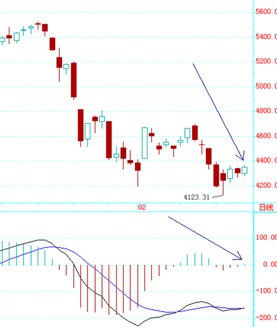

大盘已具备上攻的所有技术条件，最近诸多板块也预热了几天，因此，如果基本面上没有突发性的消息，这大概率的可能性转化为实际走势是很自然的事情。可能的不稳定因素，无非几条：一、外围市场突然大规模下跌；二、又来一个新的平安、浦发的升级版闹剧；一些传闻中的所谓利好被证明是空穴来风。

由于这些因素不是市场能完全控制的，因此，走一步算一步是最好的操作思路。如果按本ID的理论，那这一切都无须考虑，因为，4331上下的震荡已经延伸为5分钟级别的，那么，就看这中枢的第三类买卖点就可以，其他都可以当成中枢震荡处理。

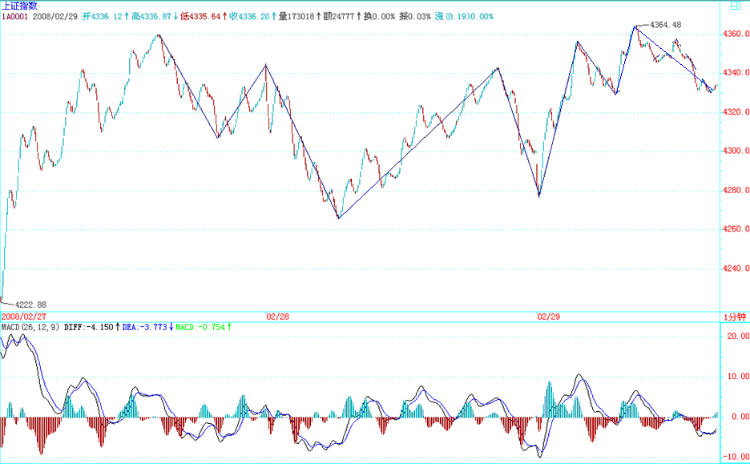

上方的关键点位，前面也早说了，就是4391点，这点位必须有效突破并站稳，否则走势不能延伸为笔。

板块方面，还是前面说那几个：农业、化工、消耗品、环保新能源、军工、创投、奥运、重组等等。如果黄金上1000美圆，资源类的会短线爆发一次。高送的股票，因为大盘不配合，除权前没表现的，那么，表现可能就要到填权中了，例如这几天的002202，就是一个典型例子。

最近大盘多灾多难，往往要真动时，就突然冒点事出来，所有很多力量都被压抑了。但力量总要爆发的，就算这次再来一个突发的东西，不过为再下次的爆发积蓄能量，面包会有的。周末，休息第一。先下，再见。

站稳4391，剑指4695点。(2008-03-03 15:22:53)

大盘今天终于按最通常的方式突破4391点，早上那本年度至今最衰股票中国平安并没有把大盘再次引向下跌，而外围股市的大跌走势也没产生大的影响，究其原因，是我们自己内部基本面有了一些更大的支持，抵消了相应的影响，使得大盘的突破终于如愿。

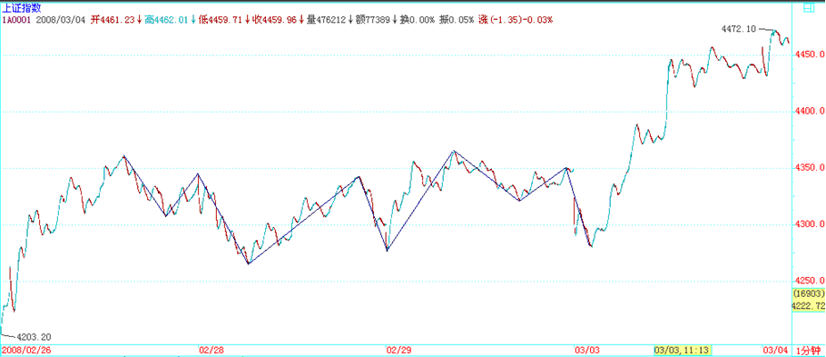

技术上，早上的回跌刚好形成5分钟中枢最后一次的一线段，这样，a+A的走势的a可以完美地进行线段盘整的分解，而A刚好是9个线段的最基本形式。当然，由于真正的第三类买点并没有出现，所以，大盘依然有重新回到该中枢震荡的可能。

这可能对应的基本面情况最大可能目前就是两个：一、外围市场继续大幅度下跌；二、那最衰股票周三继续顶风作案，通过大规模增发计划。

所以，大盘能否最终站住4391点，在基本面上必须注意这两个因素。

由于今天已经突破4391点，那么在周线上，一个底分型已经出现，而这底分型要延伸为笔，必须有效突破4695点，这也是中线行情能否展开的最终关键。

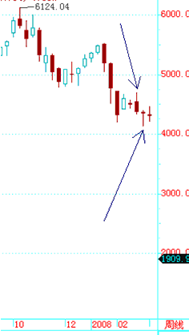

技术上的描述在N天前已经给出，按最正常的情况，这MACD的再次红柱子将使得大盘重新回到0轴附近，这对应着对4695点的冲击，最终站住0轴，突破4695点并有效站住，将展开真正的行情。

当然，这一切能否最终实现，需要这段时间基本面的配合，只要基本面没有重大变化，这一切都将按部就班去实现。

个股方面，本ID已经把该说的都说了。你看看本ID的那些股票，600737就不说了，化工股里的600078、600319；农业股000998、创投600635等等都很无耻地创出6124点以来的新高，显然，只要行情继续延续，很快就有更多地新高，这就不用说了。

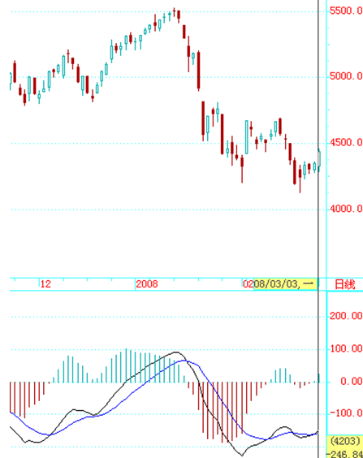

当然，你完全可以不搭理本ID的股票，你可以按本ID提示的板块去找，例如环保新能源，说过无数次了，现在的股票软件都会有相应的分类，在里面随便找找，都能找出不少好股票，你看今天这板块中有多少涨停的？

这世界，就算有面包，也要自己去吃。如果连自己去吃都懒，要人喂着吃，这种人不被市场所消灭，那真是怪事了。先下，再见。

增发再成行情杀手(2008-03-04 15:18:09)

昨天说了，大盘由于没有出现真正的第三类买点，技术依然可以跌回原来4331点中枢，基本面上的相应配合就是平安通过增发。不过今天一开始的消息面，已经等不到明天平安的开会了，深发展的增发传闻使得大盘立刻转折向下，一举实现再回原来中枢的壮举。

看来，金融股都是穷疯的一群，从平安到浦发，已经N次把行情给搞砸了。这些引进所谓国外战略投资者的玩意，都喜欢成为行情杀手，在最关键的时候来一下。浦发没补下跌缺口又再次探底，这市场的态度已经很明确的。

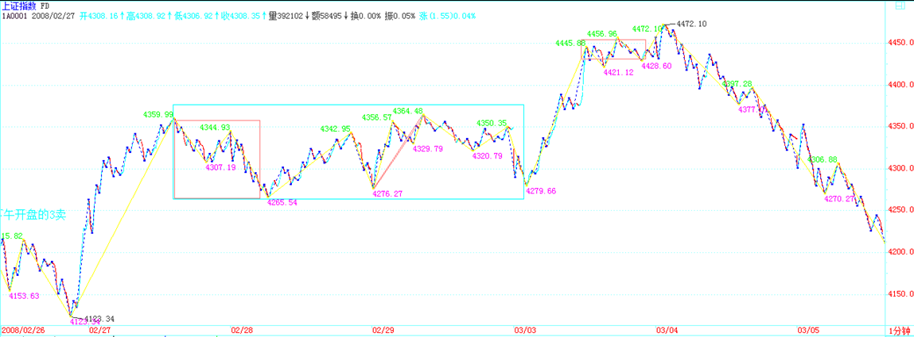

显然，现在最大的变数依然是明天平安的会，但按现在的情况，通过的可能性极大，这样对大盘的冲击有多大，大概不难估计。

现在的大盘，典型的冰火两重天，本ID一直强调的题材股，一直热火朝天，但这些垃圾金融股整天捣乱，确实让人讨厌。而这些垃圾金融股又老高的，又要抢钱，谁都没兴趣接他们的盘，但这些玩意又带指数，所以，就只能继续冰火两重天了。

当然，最干脆的作法，就是把金融股全砸死算了，砸一个惊天动地的，把本ID一直强调的关于增发的新规则给砸出来。让里面出逃的资金都团结到题材股的大旗下来，只要个股，不要指数，指数自己一边玩去。

所以，现在还在金融股里挣扎的，就早投降早解脱，看看题材股，大盘跌那么多，已经走出多大的行情？

当然，等所有人都投降了，这金融股又可以成为新的攻击对象了，8228，一样的游戏。

现在的操作很简单，如果你一直在题材股里混的，其实大盘的每次下跌都是洗盘，等大盘开始回头，题材股就又再次新高，反复折腾，如此而已。所以，就算大盘再次探底，不过给了又一次回补买入的机会。

今天提一个口号：7、8元是金，12、13是银，20以上都是垃圾。你看本ID说的那些股票，说的基本都是10元以下的，600737现在30多了，说的时候是8元，600635现在20几，还送了股，说的时候是送股前的5元，这在那30只股票里几乎都是，这就是一个很好的选股思路。

真正的大牛股，基本都是个位数起步的。所以，现在就是要去找那些个位数的明日之星。

不管平安能搞出点什么，大盘是否再被击毁一次，等待的都是机会，下跌就是爹，送钱来的。先下，再见。

本文由公众号 “三思复盘”  整理

PAGE - 141 -
