## 教你炒股票101：答疑1(2008-03-04 16:14:02)

发现课程到这里，后面还有很多内容，但前面的一些内容，很多人还是没能完全把握。所以，这里不定时答疑，各位有问题的，最好集中一下，本ID有时间可以把其中典型且重要的回答一下。

2.第二类买卖点的问题

简单地，就说第二类买点，卖点的情况反过来就是。

第一类买卖点就是背驰点，第三类买卖点就是中枢破坏点，这都是很清楚的。而这第二类买卖点，好象还是有很多不明白。

其实，所谓第二类买点，就是第一类买点的次级别回抽结束后再次探底或回试的那个次级别走势的结束点。这个定义在前面说得很清楚。例如，一个5分钟底背驰后，第一类买点上去的1分钟走势结束后，回头肯定有一个1分钟的向下走势，这走势的结束点，就是第二类买点。

那么，第二类买点有哪几种可能的情况？

一、最强的情况

第二类买点刚好构成原来下跌的最后一个中枢开始的震荡走势的第三类买点，也就是第二、三类买点合一了，这是最强的走势，这情况，一般都对应V型反转的快速回升，是最有力度的。

二、最弱的情况

第二类买点跌破第一类买点，也就是第二类买点比第一类买点低，这是完全可以的，这里一般都构成盘整背驰，后面对应这从顺势平台到扩张平台等不同的走势，这在后面的课程里会说到。

三、一般性走势

也就是前面两者之间的走势。这种情况下，第一、二、三买点，是依次向上，一个比一个高。

站在原来下跌最后一个中枢的角度，第一、二、三类买点都可以看成是中枢震荡的结果，因此，在第二类与第三类之间，可能会存在着更多的中枢震荡走势，不一定如第一、二之间是紧接的。那第二类与第三类买点之间的震荡买点，一般就不给特别的名称了，当然，也可以看成是第二类买点，这样，并没有多大的影响。

注意，只有在这回升的中阴状态下才有第一、二类买点，中阴状态结束后，所有的中枢震荡只存在第三类买卖点以及中枢震荡的买卖点，就不存在第一、二类买卖点了。

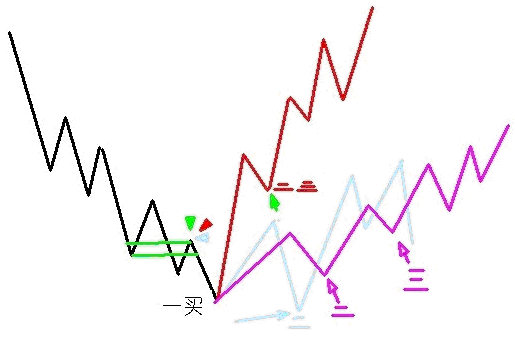

2、走势必完美

这问题，估计没有人能真明白，因为这里学过现代数学的人很少，所以对这样整体性的问题，估计只有糊涂的份。

所谓走势必完美，就是本ID所给出的分型、笔、线段、不同级别走势类型所对应的递归函数，能将行情的任何走势唯一地分解。

唯一分解定理，在现代数学理论的任何分枝中都是核心的问题。一个具备唯一分解定理的理论，都是强有力的。例如，当时在解决费马猜想时，用到分圆域的问题，但分圆域没有唯一分解定理，也就是唯一分解并不是总能成立，这样只能引进理想数，使得在理想数的角度能让唯一分解定理成立，从而展开了代数数论一个全新篇章。

本ID理论最牛的地方，就是把仿佛毫无头绪的股票走势，给出了唯一分解定理，也就是走势必完美，这等于引进理想数，使得代数数论升堂入室一样牛。

数学不行，当然看不明白这些关节。很多人，整天纠缠在分型如何如何上，只能证明这些人根本没看懂本ID的理论。分型等于递归函数的a0，这完全可以随意设计，如何设计都不会影响到唯一分解定理的证明。

但现在这种设计，一定是所有可能设计中最好的，这使得笔出现的可能性最大并把最多的偶然因数给消除了，使得实际的操作中更容易把走势分解。

注意，很多人连分型都没完全搞明白，分型不需要任何假设，只需要符合定义就可以，是否符合，只有唯一的答案，不需要任何假设。

有了走势必完美，就可以把一切关于走势的理论包含其中，所以本ID的理论可以包含所有其他的理论并指出其不足的地方，就在于本ID的理论解决了最根本的理论问题：唯一分解。

当然，对于这个问题，如果有好的现代数学背景，理解得更深一点。当然，如果不明白的，也无所谓，本ID已经把大的背景藏在后面（注：广义相对论），给出了浅的，谁都可以应用的操作方法，把那方法搞明白就可以。

选股首先要讲政治(2008-03-05 15:16:02)

今天平安顶风作案成功都在预料之中，不过尚先生关于将严查巨额融资的表态，暂时抵消平安闹剧的影响。由于平安方面肯定要粉饰太平，所以一定会对自己的股票进行护盘动作以争取管理层的通过，所以，平安的走势将逐步稳定甚至会对大盘短线产生支持。

技术上，一个标准的线段下跌类背驰后回到最后一个类中枢形成新的1分钟中枢，因此，该中枢的最终演化决定大盘短线走势。大点的角度，原来4331上下的5分钟震荡依然没有被破坏，因为第三类卖点没出现。

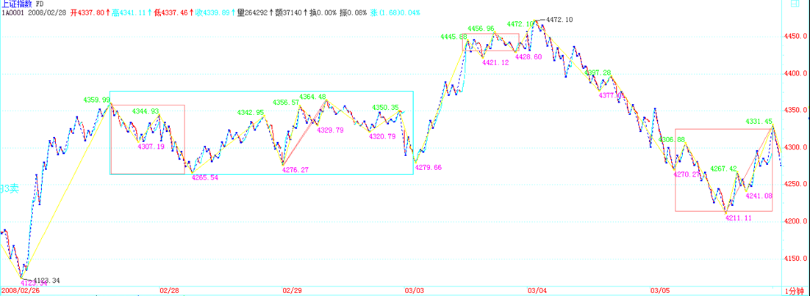

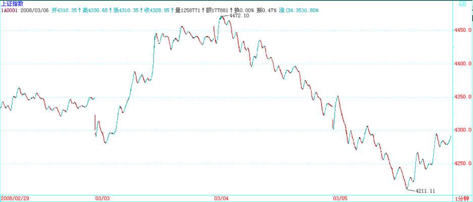

今天最重要的是，MACD的红柱子依然保持，所以，只要该中枢的震荡不被破坏，大盘逐步好转的机会还是极大的，毕竟平安的事情告一段落，但是，平安顶风，会有很坏的示范效应，所以，大盘可能还要不断受到类似消息的影响，最终解决问题，还是要靠管理层切实落实他们公开的承诺，严查巨额融资，而且一定要相应的法规保障。

虽然大盘不断反复，但本ID一直强调的农业、创投、化工、环保新能源、消耗品等等，都一直很无耻地走出强劲行情，今天依然新高不断。连那调味品这两天都可以连续涨停，为什么？因为本ID选股讲政治。

单独的个股行情，当然可以乱搞，但最终大资金，大的安排，对一个板块进行至少中线运作，如果不讲政治，那肯定有大麻烦。

你看本ID布局的那些板块，都是国家的经济发展的方向，今天的报告中，温先生都把创业板当成今天经济工作的重要任务，这是什么？这就是政治。至于农业，一年5000亿的投入，环保新能源，经济发展的最重要方向，这一切都决定了这些板块的无限生命力。

来这里时间长的都知道本ID从来不买贵股票，因为本ID当然不可能给人抬轿子。而所有的大牛股，都是从低价开始的。本ID说20以上是垃圾，并不是说20以上就没机会，但那些机会是第二、三、四中枢以后的机会，为什么在个位的时候不买？

现在，就是要介入那些新的中线未启动的股票，下一个中线大板块是什么？是医药，为什么？因为医疗改革将逐步进入启动，这是一个长期有效的题材，所以那些低价的医药股，将是极为值得关注的。

注意，一个板块的大资金布局不是一天就完成的，所以，你可以先关注，毕竟短线最有力的还是那些已经启动的板块。那么，如果要快赚钱，就要在那些已经启动的板块中找补涨的，一旦前期没怎么动的股票，有新资金介入，并且技术上要相应的买点，那当然就可以介入了。

目前，农业、创投都挖掘得差不多了，正在主升浪阶段。而化工、环保新能源等，热度还没有太猛，所以，可以寻找的好的介入机会会相应多点。这一切，关键自己要去寻找，例如本ID前几天说调味品，就两只股票，你还选择不出来，那就没什么可说的了。

至于高送配，这属于短线题材，只要行情稳定启动，肯定要表现的，只不过是除权和填权的分别而已。

今天，沙特那边有人过来谈一个项目合作的事情，没时间写帖子了，抱歉。先下，再见。

平安粉饰性护盘闹剧如期上演(2008-03-06 15:13:00)

昨天已经明确说了，平安为了得到管理层的认可，肯定要进行相应的护盘制造他们需要的气氛，今天，这护盘闹剧如期上演。唯一的好处，昨天也说了，就是让大盘有了短线的支持，但这样的闹剧，如果最终得逞，中国资本市场的信誉将彻底破产。

技术上，原来4331点上下的5分钟中枢震荡依旧，但4391点依然不能站住，因此，这里的反复依然。站住4391点才有攻击4695点的本钱，目前，这依然需要努力中。MACD的红柱子依然保持，但回拉的力度相当有限，使得夭折的风险完全不能忽略。

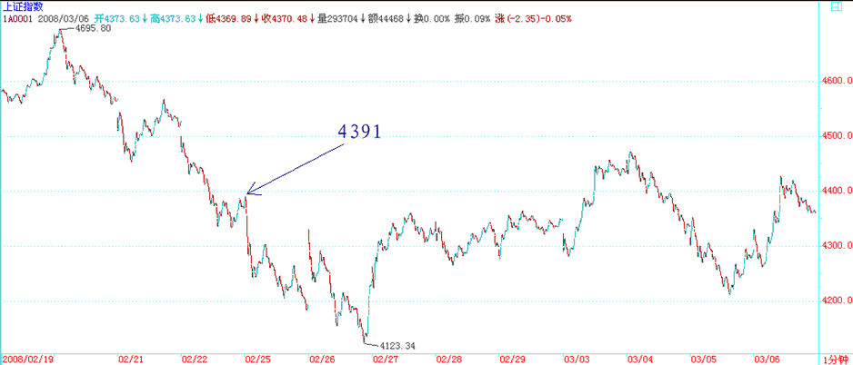

所以，短线4391点依然是最重要的位置，这位置上冲没力都必然导致强力的回拉，这点是超短线操作必须注意的。

个股方面，虽然在平安带动下，指标股有所表现，但都力度有限，而且追高动力没有，暂时很难有持续性走势。从政府工作报告中，很明显地，指数期货并不是今年的工作重点，至于证监会的一相情愿，这在去年底他们企图抢闸推出时本ID已经给予痛斥。指数期货这种事情，哪里是一个小小的部级单位可以决定的？所以应该摆正自己的位置，别给市场制造错觉。

本ID的观点一直明确，今年希望见到三件事：一、创业板推出；二、印花税降低；三、指数期货难产。目前的形势看，完全实现的可能性依然极大。

今天涨幅上，依然是中低价股的天下，只是板块出现轮动，农业、创投等休息，奥运、消耗品中的造纸启动，这都是很正常的板块轮动。总之，还是要跟踪有潜力的板块，如果技术过关，可以参与其中的轮动；如果不行就算了。

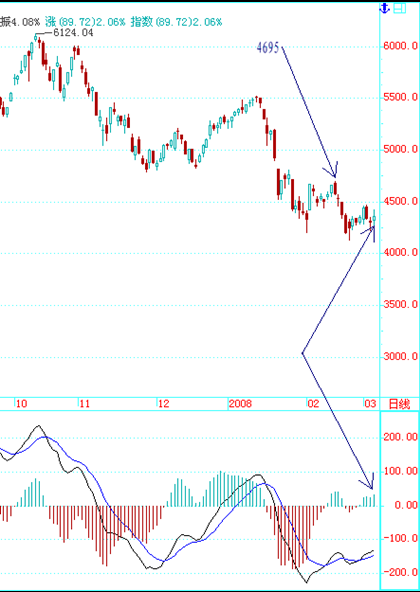

注意，轮动操作一定是把热的冲高时抛，然后吸纳有启动迹象的潜力板块，而不是去追高，如果这节奏把握不好，还是别操作算了。

中线上，如果这次红柱子放大后不能有效站到4695点上，甚至连4391点都站不住，那么，大盘再次破位并不是什么天方夜谈。再次提醒，今年的操作，一定是折腾式的，不要想着单边不回头的操作。先下，再见。

## 教你炒股票102：再说走势必完美(2008-03-06 16:10:18)

如果是单纯地唯一分解，并不能显示本ID理论真正厉害之处，因为走势必完美对应的是一种最特殊、最强有力的唯一分解，这看似毫无规律的市场走势竟然有这样完美的整体结构，这才是最牛的地方。

最完美的系统，肯定是自然数了，为什么？因为自然数具有诸多的唯一分解方式，例如素数的分解，但还有一种最牛的分解，就是对于幂级数的唯一分解，因为有这种分解，所以自然数有记数法。例如，2的幂级数对应的唯一分解就是2进位，而10的就是10进位。如果没有这种分解，我们就不能用记数法记录自然数了。

正因为这分解如此有力，所以我们都会觉得很平常，似乎自然数有记数法是天经地义的，其实，这才是自然数整体结构中最牛的地方。而一般的数系，一般是没有这种性质的。

同样，本ID的理论给出的递归函数，完美地给出市场走势一个类似记数法一样的唯一分解，也就是说，本ID揭示了看似毫无规律的市场走势竟然有着和自然数有着类似的整体结构，完全超越一般的想象，这才是真正最牛的地方。

正因为本ID的理论揭示了看似毫无规律的市场走势有如此完美的整体规律，所以才有了其后一系列的操作可能。这才是走势必完美真正关键的地方。

因此，级别在本ID理论中就极端关键了。为什么？因为本ID的递归函数是有级别的，是级别依次升大的。所以，搞不明白级别，根本就不明白本ID的理论。

那么，这样一个整体结构有什么厉害的结论呢？这可以推演的东西太多了，随便说一个，就是区间套方法的应用。如果市场走势没有本ID所揭示的整体结构，那么区间套是不会存在，也就是没有操作意义的。因此，区间套的方法，就是走势必完美的一个重要的应用。有了区间套，买卖点的精确定位才有可能，也就是说走势必完美的存在导致了买卖点可以精确定位，这显然是操作中最牛的一种方式了。

从1分钟一直到年，对应着8个级别，其实，这些级别的名字是可以随意取的，只是这样比较符合习惯。否则说级别1、2的，容易搞不清楚。

当然，加上线段与笔，可以有更精细的分解，但一般来说没这必要。

任何走势，都可以在这些级别构成的分解中唯一地表达。但一般来说，对于一般的操作，没必要所有分解都搞到年、季、月这么大的级别，因为这些级别，一般几年都不变一下。你看，从6124点下来，N个月了，还在30分钟级别里混，所以，一般来说，1、5、30分钟三个级别的分解，就足以应付所有的走势。当然，对于大点的资金，可以考虑加上日级别的。

也就是说，任何走势，都可以唯一地表示为a1A1+a5A5+a30A30的形式。而级别的存在，一个必然的结论就是，任何高级别的改变都必须先从低级别开始。例如，绝对不可能出现5分钟从下跌转折为上涨，而1分钟还在下跌段中。有了这样一个最良好的结构，那么，关于走势操作的完全分类就成为可能。

完全分类，其实是一个超强的实质性质。学点现代数学就知道，绝大多数系统并不一定存在完全分类的可能，而要研究一个系统，最关键的是找到某种方式实现完全分类，说得专业点，就是具备某种等价关系。

而由于走势必完美，所以走势就是可以完全分类的，而所有的分类，都有明确的界限，这样，任何的走势都成为可控的。这种可控并不需要任何人的预测或干预，而是当下直接地显现的，你只需要根据这当下的显示，根据自己的操作原则操作就可以。

注意，完全分类是级别性的，是有明确点位界限的。而不是粗糙的上下平的无聊概念。也就是说，本ID的理论完全是数量化的，因此而就是精确化的，里面不存在任何含糊的地方。

所以，明白上面这些，这样就有了一个大概的框架，而不至于迷失于理论中了。

平安应停牌以维护市场稳定(2008-03-07 15:12:32)

平安的一天闹剧被揭穿后马上露出本来面目，像平安如此大的动作，而且平安自身又深度介入二级市场，无论如何，在其增发有管理层的最终结论前，都应该停牌。否则，像现在一样，一个股票完全影响市场的走势，对市场的稳定是极大的伤害。

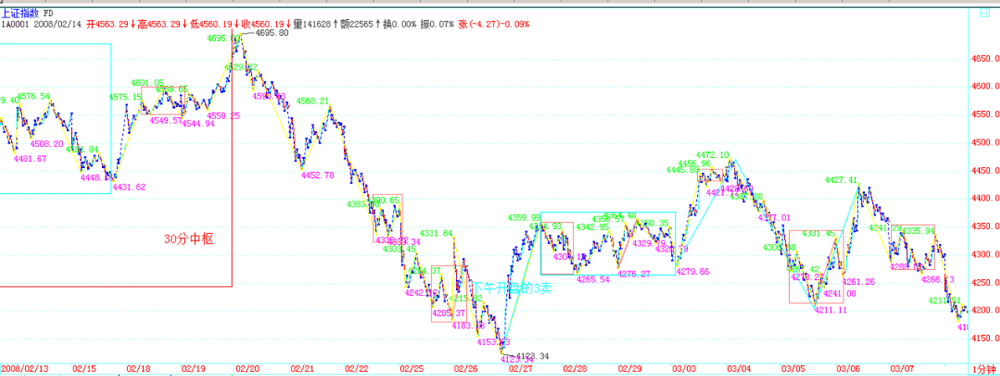

今天的大盘，勉强继续保持原来4331上下5分钟的震荡，但所有股票都有了疲态，股票这东西都要有点连贯性的，经常被一些无聊的突发性事情干扰，那就不仅仅是审美疲劳的问题了。

如果反复冲击4391点都不能站稳，每次刚上去就出些妖蛾子，那么，大盘再次探底就成了必然的选择。现在，给大盘的时间不多了，如果下周初还没有起色，那么再下探甚至破底都不是什么奇怪的事情，毕竟现在离4123点也就一步之遥。

当然，无论大盘怎么走，暂时都可以看成是原来那大的30分钟的震荡。中线上，一个很切实的问题就是，如果两会开过后还没有什么上去的动力从基本面角度给出，那么，一次狠跌的过程砸出大的空头陷阱可能就是一个很正常的选择了。

大盘可能面临的最坏情况就是，这里反复折腾不出结果，然后创业版出来，热钱都跑过去，这里变成一座围城，无聊地在几百点的空间上耗上N个月甚至一年。这种情况并不是不可想象的。

当然，现在给多头的时间还有，多头还有反击的机会，就算创新底，也不是世界末日。现在的问题是，如果一些根本性的问题不解决，就算盘住了，那么上涨的理由呢？难道上涨就为了给平安之流去表演？上涨的空间如何打开，这需要基本面的支持，而这基本面现在又在哪里？

周末，不说股票了。先下，再见。

紧跟平安将破罐破摔进行到底(2008-03-10 15:15:31)

现在最大的问题是什么，用脚指头都能想明白。但管理层那已经成为滑稽表演的基金新发依然如故。那么，大盘也只好紧跟平安将破罐破摔进行到底了，没有比今天创新底更能配合管理层基金连发的滑稽与幽默了。

管理层大概认为，只要他们批准了，那些基民（一个比股民还恶心的名字，让人想起饥民）就会如饥似渴地抢光他们的施舍。但现实是什么？一个过于滑稽的举动，只能让人远离，连唾弃的兴趣都没有。

市场是最现实的，有行情，有上涨理由，资金不请自到，否则，自己画饼自己玩去吧。本ID已经多次说明，就算现在减印花税，也没用。为什么？因为没有上涨的理由，上涨难道是为了再去成就平安之流？

在这如此影响市场的最基本融资规范没有解决前，管理层如此地反应，确实只能让市场寒心。现在市场需要的是明确的法规，一个明确的预期，否则，所有的上涨都不过是短促的反弹，不能构成真正的行情。

技术上，上周已经说了，本周初没东西出来，大盘破低并不是什么奇怪的事情。周五那1分钟中枢有极大的可能成为新的1分钟下跌的第一个中枢，今天早上那微弱的反弹构成该中枢的第三类卖点。

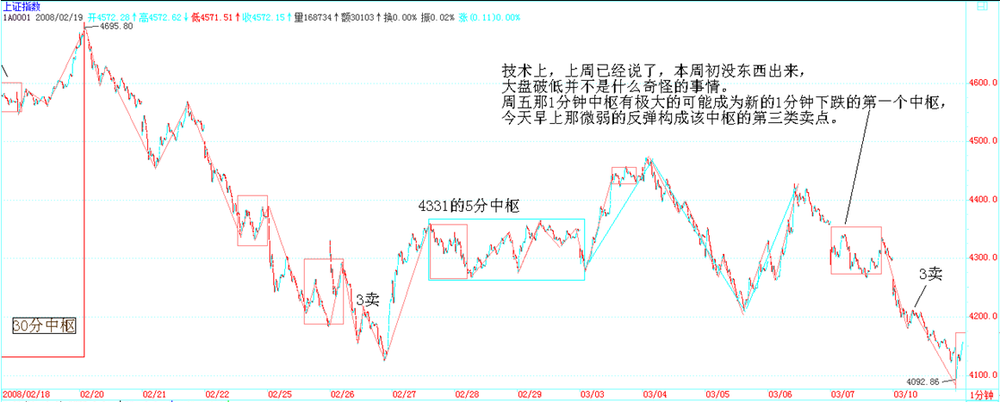

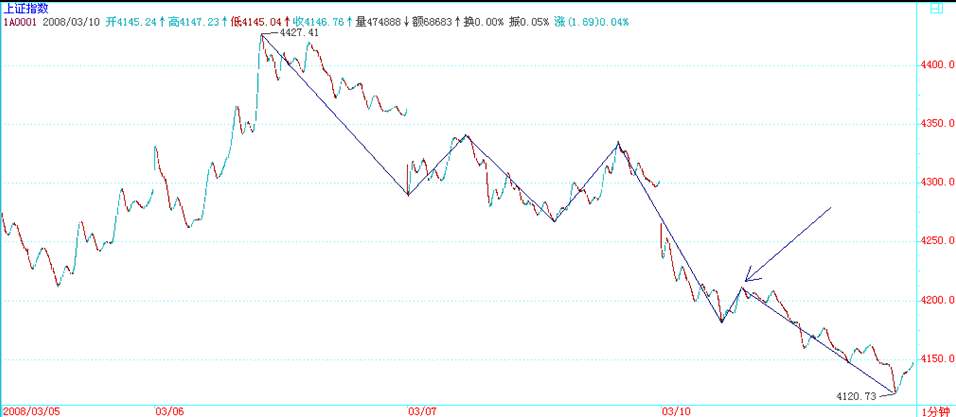

当然，由于资金大量从大盘股抽离，让那些自以为是的大盘股自己牛去，自己圈钱自己玩去，因此，反而成就了中小盘题材股行情的延伸，这中小盘股至少胃口没那么大，而且也更好在各层面上控制。大盘下跌，不过给这些股票一个洗盘或打压吸纳的机会。

鉴于目前这么滑稽的氛围，资金只能以更大的投机去获取更大的利润。大盘股的圈钱投机竟然如此堂而皇之，那么，大中小资金也可以这么玩，选择各自适合的投机品种，让市场继续分裂，让题材投机的风暴来得更猛烈，这只能是还想在场里折腾的资金唯一的选择。

今天，大跌，认购权证一反常态地暗潮涌动，就是这种新的投机行为一个很好的序幕。而今天，又有不少中低价股开始有新资金注入，借指数跌而潜伏进入，本来就是很正常的事情。

一句话，让投机来得更猛烈些。这种游戏当然不适合所有人，没这种投机细胞的，就小板凳看着，等基本面有根本改变再说。有的，当然睁大眼睛，发现一切可投机的机会，选择最适合自己的去投机，劫一票换一地。资金需要收益，资金很饿，总不能一季度没完就不干活吧。

请明白一个最简单的道理，现在那些所谓的黄金股、绩优股、高价股，不过也是从垃圾股的垃圾价起来的，上去了就摆阔圈钱？那就让他们都死去吧。能制造你们，难道就不能从现在的垃圾里搞出黄金来？

题材都是人造的，股票都是人炒的。没人，什么都白搭；有人，有什么不能创造？先下，再见。

夜郎自大的中国大机构(2008-03-10 16:21:13)

本来想写课程，不过还是先写写这个。

中国的大机构，在N年还是很蔫的。但因为出身正，几年光阴，现在都牛得不得了了。世界也500强了不少，个个鼻孔都插上了大葱。

有那样的环境、那样的资源，任何一个只长了一边脑子的，都可以干出这样的成就。但这些机构开始膨胀，插上大葱就满世界晃悠去了。

结果怎么样了？世界期货市场上，最喜欢看到的是谁？当然是中国的大机构们。大家都开心地等着，看，那送钱的又来了；世界的股权市场上，现在最喜欢看到的是谁？当然是中国的大机构们，看，那烧钱的又来了。

真是很难想起，这些大机构们，在世界金融市场上什么时候干过一件让人觉得是人干的事情？一个律师就可以在全世界最大之一的公司中坐阵中军，请问，这位先生，在联办的时候，在后面一系列的资本市场活动中，除了夸夸其谈，有实际操作过任何一个大的市场活动吗？

这市场是干出来的，不是谈出来的，更不是读出来的。

本ID早给这些机构一个最好的定位，就是继续窝里横，别出来丢人现眼了，他们无论从人才到结构，都完全是一个可笑的闹剧。

所以，本ID一直鼓吹，要把中国的窝给做大，让肉烂也烂在自己锅里，就是本ID对这些机构的水平一点信心都没有，去当炮灰，还不如当缩头乌龟。只要乌龟窝够大，成为世界第一大，让全世界的非乌龟都只能往这跑，那缩头乌龟也能成忍者神龟。

可惜，我们的机构们牛惯了，他们竟然还想圈国内的钱去玩他们的全球化游戏。本ID可以断言，去一个死一个。在金融领域，可不是单纯的低级制造业。用中国人民的血汗去让他们自己去爽，去一时炫耀他们所谓的成就，可能吗？

本ID一直旗帜鲜明地反对一切企图把中国的资金往外搞的行为，从那什么无聊直通车到什么搞笑QDII。事实证明，直通车已经成了闹剧，QDII已经成了悲剧，难道我们还希望我们的大机构继续胡闹下去吗？

你们向上爬的水平当然是有的，但你们在国际市场运做资本的水平，不是插上大葱就好使的。这就是中国大机构的现实状况，别插了大葱满世界晃悠了，回圈里去吧。

回补周线缺口引发反弹(2008-03-11 15:22:15)

今天，所有人都盯着那被多空双方惦记了N个月的4062点上的周线缺口，结果，抢跑的不少，造成还差1点没补完。当然，对于短线来说，这并不特别重要。技术上，那1分钟的下跌也形成了，目前唯一需要确定的是，第二个中枢是直接第三类买点反弹上去，还是把a+A+b+B+c的c给走出来再标准背弛上去。

前面，已经有两个类似的底点，今天的底点，基本在前面两个底点的连线上。现在，大盘有初步的倾斜三角形的形态出现，但关键是这两个底点连线不能被破掉。

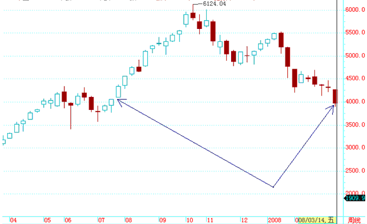

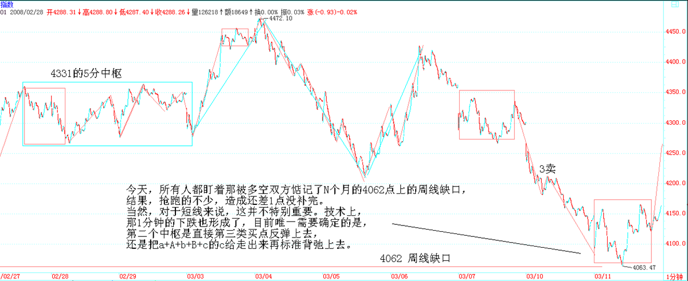

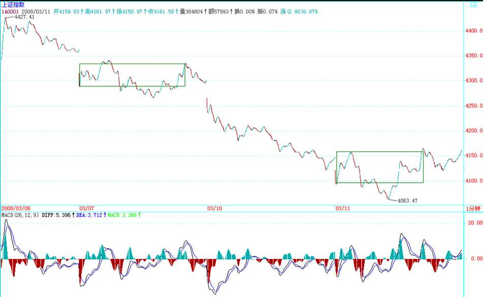

由于这次下跌只是1分钟级别的，对于原来的30分钟震荡并不能制造真正的破坏，所以，站在6124点下来的30分钟下跌角度，真正的背驰并没有出现。当然，盘整背驰也可以制造底点，然后再第三类买点地直接上去，但这需要后面的确认，在确认之前，震荡的格局是不会变的，也就是说，一旦上冲无力，唯一正确的选择，就是把今天抄底进入的退出。

后面，最坏的情况，当然就是反弹后形成5分钟下跌的第一个中枢，然后继续跌破前两个底点的连线，最后去形成真正的30分钟背驰（当然，如果美国1987年那种极端情况，背驰是不会有的。）

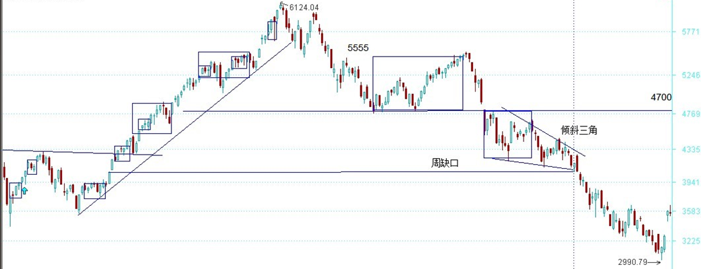

最好的，就是继续30分钟的震荡。因此，对短线走势的大体格局，应该有一个清醒的技术把握。

个股方面，你看，一反弹，冲在前面的基本都是10元上下的所谓垃圾股票，以及前期强势的板块：创投、农业、军工、消耗品等等。所以，市场的资金分布格局并没有变化，这种情况要维持相当时间。

今天的消息面，其实并不好。特别是某副主席，十分不地道地说什么股市不是谁都能来的。这话，在目前这时候说合适吗？对那些已经来了并受到伤害的人，难道不是风凉话吗？这种话，难道应该出自管理层之口？

所以，现在的大盘并不缺乏反弹、震荡，但真正的上涨理由在哪里？管理层首先都不给一个表率，市场能有信心吗？

更重要的一点，一定要知道，这市场不能靠任何人，包括管理层，一定只能靠自己的技术和心态，你足够强，谁都打倒不了你。

本ID最讨厌那些哀求管理层救市的言论，你爱救不救，我们不是你的犯人和奴仆，你们的工资还是我们的税收所支付的，你没教养，对市场真正的主人出言不逊，那只能证明管理层里的人员素质并没有达到我们的税收所供养所应该达到的水平。

有人当官老爷当惯，证监会的人，首先好好去学习，什么叫为民型政府，想想你们这个部门离这个要求有多远。别以为你们是谁，上帝式地施舍全国N亿的投资者，你们配吗？

市场搞不好，谁该给纳税人负责，这才是真正的问题所在！先下，再见。

让人无话可说的管理层(2008-03-11 16:23:53)

有了昨天的帖子，按照本ID的性格，一定要去究底穷源的。今天，我们就用最理性的分析，来说说这让人无话可说的管理层2007年以来的表现。

显然，2007年后的市场表现，完全超越了管理层的想象力，因为他们根本就没有深刻理解这轮所谓流动性过剩制造的大行情的历史性意义。

本ID肯定是最早也是极少数坚决反对有所谓流动性过剩的人，因为，所谓的流动性过剩，不过是针对相应的池子说的。如果你只是一个夜壶，一头猪就可以让你流动性过剩；而如果你是太平洋，又何来流动性过剩？

请问，中国，一个要成为世界最强大资本大国的国家、一个要成为世界经济领导者的国家，难道只有一个夜壶大小的池子对面对所谓的流动性过剩吗？难道不应该把我们池子变成太平洋去吸纳全世界的资金吗？

问题是，我们的管理层有没有把中国的池子变成太平洋的远见和具体的策略。而事实上，面对所谓的流动性过剩，我们的管理层采取了一种最没前途，最没技术含量、最可笑的方式。那连续的加息、调准备金等等，成了一个毫无技术含量的世纪大笑话。

而管理层所有金融手段换来的结果却是，不但投机潮没有被阻止，不想见到的通胀反而不请自来。

更可笑的是，作为管理层重要智囊的某著名经济雪茄，曾不无得意地把他的设计公开，说只要与美国保持多少的息差，人民币升值的速度再保持多少，那就如何如何美好新世界了。而不到两年，事实就如此残酷地摆在面前，那息差鬼使神差地从巨大的正变成负的，而且有继续扩大的趋势。他们一相情愿设计的玩意，被国际金融残酷现实彻底给玩意了。

请问管理层，为什么有时间搞这些可笑的玩意，却没有时间去真正把我们的池子做大？

对付资产价格的过快增长，一个最简单的办法就是增加供应量，这是用脚趾甲都能想明白的道理。而我们的管理层，从530的半夜鸡叫到直通车的闹剧，百般折腾，结果还是没压制住这上涨狂潮，为什么？因为方法根本不对路。而这些无聊招数不仅无效，而且有害。例如，印花税闹剧只维持了几天，最终大盘又从4300点到了6100点，使得530成了一个有着巨大心理破坏却完全无用的闹剧。

至于530的决策过程，更是一个悲剧。但更可悲的是，现在讨论重新把印花税减下来时，却开始大走所谓法律途径，又提案又如何的。请问，530有必要的法律程序吗？难道有法律规定，加税可以一人拍脑袋就决定，而减税就需要层层通过走程序？在任何国家，关于税收的调整都是最重要的民生问题，都必须得到立法机关等等程序才能得以实施，而530我们得到的是什么？

不用讳言，530永远是中国资本市场发展历史中耻辱的一页。

基本温饱住行等当然是重要的民生问题，但如果中国的民生问题的水平就停在这阶段，那是历史的悲剧。必须正视的是，民生问题也是有层次的，更高层次的民生问题，站在历史的角度，更为重要。而我们现在的所谓低级水平的民生问题，归根结底，是在补课。

但在任何国家，最重要的民生问题，归根结底，就是经济的稳定增长。一个经济出现问题的国家，任何的民生问题都是废话。经济发展，才是最重要的民生。

本来，我们有了一个强烈的势，一个强大资金流与信心流制造的趋势，让我们得以快速解决大量的问题。但，我们的管理层并没有驾御这个趋势，而是用了一个相反的错误策略，去扼杀了这个难得的趋势，那些本该解决的问题，一个也没解决，却因此留下了更可怕的问题。

这就是管理层2007年的成绩单。

最可笑的是，用脚趾甲都应该知道，现货没搞好，期货根本没有基础。而我们的管理层，一方面被市场的趋势搞得方寸大乱（想想那些直通车、QDII、530等痉挛式的决策），另一方面又超英赶美式地大力推进所谓的期货，这世界的可笑，大概最高程度也就是如此了。无疑，我们错过了一次轻松解决大问题的机会，因此，我们必须为此付出代价。

但更重要的是，我们现在面临一个更严重的问题。如果说，2007年，我们在虚拟经济层面上错失了点什么，并不至于有太大的影响，那么，这个抉择，在2008年将出现在实体经济的层面。

一旦在实体层面出现错误的抉择，后果是什么，本ID都不想多说了。

说实话，本ID一定信心都没有，本ID希望自己错了，但事实从来都证明，在经济问题上，本ID错的机会很少。

对管理层，本ID无话可说。我的苹果。

美国救市救不了中国股市(2008-03-12 15:20:52)

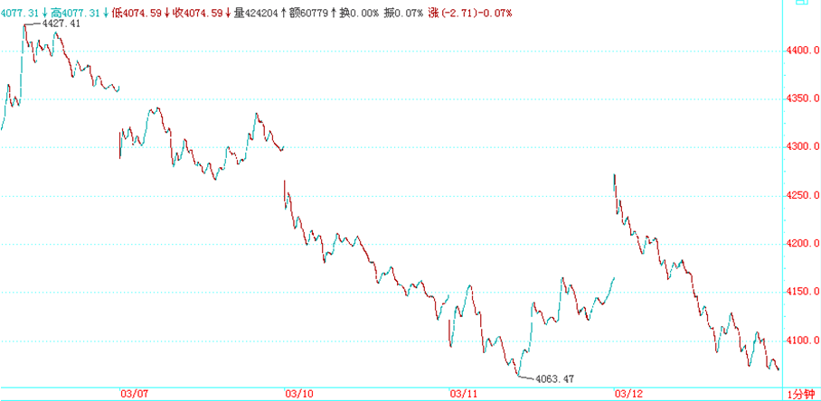

美国救市，大盘自作多情地大幅高开，结果不仅被彻底打回原形，还再次挑战新低，一日闹剧就此结束。

本ID已经多次反复说了，这次下跌的根源在于恶性圈钱问题。5500点，平安圈钱的消息小范围泄露后回头，5200点，该消息证实，然后开始大幅度破位下跌。在平安消息出来前，外围市场一直走得不好，结果中国市场根本没搭理，自己走自己的。而最终让市场转头的，就是这个恶性圈钱。

为什么？因为这恶性圈钱对参与其中的资金是致命的，炒上去，然后圈钱就来，这样谁还会出力。然后，市场资金不断从大盘股出逃，部分直接撤走，部分留下的，就围绕中低价股票进行，这样，至少可以对圈钱有一定的控制。

而要解决这个问题，药方本ID一早就给出，就是一个明确的关于再融资的规定，让市场有一个明确的预期。可惜，我们的管理层一直不作为，而这种不作为给市场信心有着巨大的打击。

现在的问题已经不单单是恶性圈钱的问题了，而是一个对管理层的信心问题。

本ID前面已经把最恶劣的情况说了，就是如果在创业板出来前还没有让市场信心恢复的举动，那么，大量资金将出逃到创业板去，至少那里没有恶性圈钱的短线担忧，而目前的主板，将成为一座死城。

现在，一个短线的问题立刻摆在面前，就是，那些对两会还有期待的资金，一旦在会议结束后没得到他们所需要的东西，是否会再次杀跌出来。而平安的问题，依然如同一个定时炸弹随时引爆。

而对于中线来说，最大的问题已经反复说过，就是，谁给我们一个上涨的理由？恶性圈钱的问题没有一定确定的说法，没人会顶着炸弹往上冲的。

如果管理层有530时1%的效率，这个如此简单的问题早就解决了。从1月拖到现在3月，指数下跌1000多点，请问，都干什么去了？

自然的调整并不可怕，可怕的是这种完全因为人为不作为造成的市场信心的丧失。

至于技术上，昨天已经说得很清楚。今天的走势，并没有脱离昨天的那1分钟中枢，而这中枢后，是走1分钟的c段，然后构成5分钟中枢，还是直接就扩展成5分钟中枢，没有任何实质差异。

最大的问题就在于，如果这5分钟中枢是一个5分钟下跌的第一个中枢，后面面临的短线压力就极为巨大了。

当然，这是最坏的情况。而是否如此，让市场自己去选择。先下，再见。

我们需要怎样的管理层(2008-03-12 16:25:29)

首先，现在讨论这些问题，并不是本ID的个人问题，而是现在的问题，将严重威胁我们的大局，而这个大局，是全体中国人的。

至于本ID的投资情况，其实，这早就说过。6100点前后，本ID就把相当比例的资金调出去作PE去了，这也是公开的秘密了。至于现在市场上的，操作的思路也说过N次，就是来回在不同板块中折腾。不过，本ID从春节后，把每次折腾多出来的资金已经逐步转出，准备创业板去了。现在，就是不增加筹码的折腾活动，因为，本ID觉得现在的主板，也就只有这个价值了。

今天，我们不妨都抛开自己的投资状况，冷静的思考一下这样一个问题，这个问题和你目前投资是否顺利毫无关系，这是一个长期的、全局性的问题。

我们是纳税人，我们当然有权力让管理层具有我们所认为应当具备的水平。我们每年交的税收，给社会做了足够的贡献，对于我们来说，绝对不存在逃税的问题，我们养活了整个行业，我们当然有这样的权力。

管理层，至少应该具备这样的一些素质：

一、真正参与过市场。

我们现在的管理层，基本就是从银行系统出来的，这些人根本就不了解市场本身的一些具体问题，而在办公室里，是折腾不出与市场实际相适应的政策的。否则，挖地、卖大饼的都可以管理一把，那不成了大笑话了？

二、有真正的宏观视野

如果你不真正理解资本市场在市场经济体系里的核心地位，你当然就不可能给市场制定相应的高度的战略，而没有高度的战略，只会成为市场玩弄的对象。

三、具有比市场各方更高的智慧

市场是合力的结果，而一个管理层，如果其智慧还低于市场各方的水平，那么，他们的所有举动，都只能成为市场的阻力。没有真正高于市场的智慧，就没资格管理市场。

四、用管理调控来反映国家的经济意志

资本市场是经济的核心，而国家的经济意志，应该站在全局的、总的国家战略的高度通过资本市场得以体现，这是对管理层一个最基本的要求。

上面四条，只是随手所写，各位可以补充，这毕竟是全中国人的事情，和多空无关，和单纯个人利益无关，只与苹果相关。

信心危机引发多杀多(2008-03-13 15:18:28)

反复强调，现在已经是信心问题。信心危机下，今天引发多杀多，4000点成了纸糊的。不过，下午关于3G的利好引发联通快速上涨冲击涨停，使得大盘不至于收得过分难看。

当然，这多杀多走势一旦出现，意味着短线的底部将逐步来临。不出现多杀多，底部是不会出现的，市场就是这么残酷。每一轮行情，甚至是反弹，都需要一些断胳膊断腿来垫背。

但是，现在的基本面极为微妙：一、平安的事情没有结果，这是一个大地雷；二、两会结束没有特别的东西，将引发新的信心动摇；三、管理层以及经济面的现状，使得大资金不敢真正介入。

所以，短线反弹会有的，中线真正的企稳，还需要诸多的配合。

现在，也有些股票有新资金介入，例如那些新股，离发行价不远的，都有新资金开始关照；此外，3G题材能否成为新的热点，这对大盘短线有一定意义。

操作上，还是那个原则，进入后一看上冲困难就要坚决退出，不能恋战。至于没这技术的，本ID一直给出一个最好的选择，就是小板凳。

中线上，技术上最大的机会就是6124点下来30分钟下跌结束后的那次强力反弹，但由于基本面的诸多乱像，这最终的结束的方式可能会比较复杂。目前，最后一个5分钟下跌依然没有形成，都是1分钟级别的。这在技术上意味着：一、暂时只能形成30分钟的盘整背驰；或者二、后面还有更大的下跌是以这5分钟级别为形式的。

至于哪种情况，让市场自己去选择。先下，再见。

我们需要怎样的投资者(2008-03-13 16:18:46)

显然，注定绝大多数投资者都是被市场愚弄的。而所有被愚弄的，都是陷在市场中，被自己所迷糊。这些人，所有的行为都被分类为多空两种形式，当自己拿着股票时，思维就被多头所控制，反之，就是空头的奴隶。

而市场的情绪，就是由此而积聚、被引导。脱离不了这种状态的，永远成了不真正的市场参与者。

市场，至少分为两个层面。用一个比喻，一个是锅的层面，一个是肉的层面。而大多数的人，就是停留在肉的层面被市场之锅所熬煎。

本ID这几天一直写市场的文章，很多人就是站在肉的层面去理解的，而本ID却是站在锅的层面去写的。本ID所写，只是要去保护并重塑这市场之锅，因为肉可以烂，但锅不可以，否则将是致命的。

这种致命，不是说将让谁亏多少钱，这关系着国家的前途，这和肉的多空毫无关系。而绝大多数人那种屁股决定脑袋的思维，也决定了他们不可能有具有高度的视野。

站在本ID的角度，只有相关于锅的事情才值得本ID去留意，至于肉的层面，本ID的理论给出了最好的操作程序，按照操作就是了，没什么可说的。

当然，只有你自由于肉的层面，才会有心情去关系锅的事情。本ID当然不讳言，对于本ID这种资金来说，锅是最重要的，只要锅在，那肉还不是随意去玩弄的对象。

因此，对于一般的投资者来，首先要从肉的层次上自由，要你去肉别人，而不是相反。但这还不够，应该培养更高的视野，没有大的视野，最终还是被别人所肉。

而这道理，同样相关于国家的层面、全球战略的层面。美国为什么牛了几十年，因为他们有一口锅，全世界用了几十年，而不打破这锅，任何国家不管怎么搞，都是美国人锅里的肉，这才是最为重要的。

我们要用一切的努力，造一个中国资本市场的大锅，这也是本ID写这些文章的出发点；更重要的是，我们更要造一个中国式全球化的大锅，这是更高层次的，也是中华复兴的关键。

信心不是“应该有”就能有的(2008-03-14 15:12:11)

今天，某副主席又发宏论，说应该对市场有信心。但信心不是无条件的，不是想有“应该有”就能有的，市场的信心更不是靠画饼就能有的，市场的信心来自实实在在的市场环境的改善。

请问，管理层为改善市场环境，稳定市场信心，“应该有”的举措有了吗？例如像再融资规定这么简单的问题，早就“应该有”了，但事实却是，该有的都没有。那么，在要求市场“应该有”什么之前，是否也应该反躬自问，对市场“应该有”的基本职责你们都完成了吗？

现在市场信心的丧失，归根结底是对管理层最近无的放失的政策的正常合理反应。最根本的问题不解决，整天搞些没用的玩意，这难道就是管理层“应该有”的？

而且，这市场信心的丧失是会快速传染的，一旦基金持有人的信心也开始大面积崩溃，大规模的挤兑就不可避免，难道一定要出现那种情况，才醒悟吗？一旦出现那种情况，难道用一句“市场炒作不是每个人都可以参与”就能打发的？

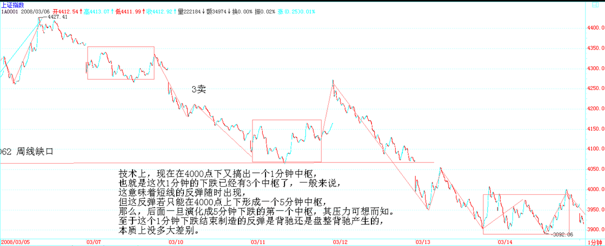

技术上，现在在4000点下又搞出一个1分钟中枢，也就是这次1分钟的下跌已经有3个中枢了，一般来说，这意味着短线的反弹随时出现，但这反弹若只能在4000点上下形成一个5分钟中枢，那么，后面一旦演化成5分钟下跌的第一个中枢，其压力可想而知。至于这个1分钟下跌结束制造的反弹是背驰还是盘整背驰产生的，本质上没多大差别。

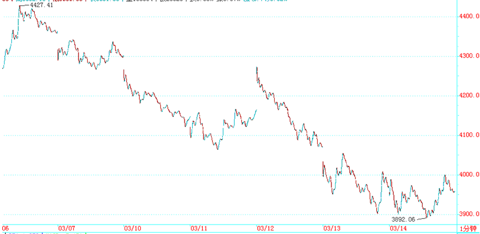

下周，两会结束，这又是一个考验信心的时刻。如果没有什么特别的消息，那么，那些还傻忽忽希望两会有点什么的人，又要信心动摇了。现在，一个很大的问题，如果市场格局还是这样，那么每次反弹只会让信心丧失者不断出逃。

现在，可能这个问题才是最关键的：请给一个留下来的理由。这才是管理层应该干的事情，不要画饼，我们需要的是干货。

周末了，股票就一边去吧。春天来了，天地如此广阔，就没必要还为股票把周末的时间也耗费了。先下，再见。

多杀多蔓延加速短期底部来临(2008-03-17 15:17:29)

画饼救不了市场信心，同样拉中石油粉饰也不行，这顺理成章地导致多杀多的蔓延，不过，这反而导致短期底部的加速来临。

今天，如前期所说，那些对会议还有冀望的人终于也杀出来了，当然，现在还缺一些死多头去献出胳膊和腿，没有这些胳膊和腿，大盘的反弹是不会有力度的。

现在，就纯粹探讨技术上的问题，不说那些已经反复说过的东西。看看下面6124点下来的60分钟图，大的走势就一目了然。这次下来，目前只走了4个线段，连一个1分钟的中枢都没形成，注意，这是60分钟图上的1分钟中枢。

显然，一个标准的跌法，就是这第5线段中，有1笔对3进行反抽，形成一个类的第三类卖点，然后再破底，一旦当下满足区间套，那么真正的底部就可以精确定位。

不过，现在这对3的反抽笔还没有出现。因此，下面的反弹的性质，就是对3的反抽，如果形成类第三类卖点，那么是最好的；如果又上去了，那么证明3、4这个类中枢的震荡依旧，后面还要折腾。

所以，我们说的短线反弹在技术上是超级明确的。各位看，4的位置对应的MACD刚好在0轴，也就是被这压住上不去，然后再次破位，这是很标准的走势。

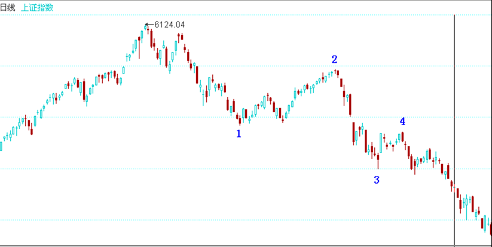

一般来说，看粗略的大趋势，可以用大图，例如，中石油，看日线图，48下来连一个线段都没走完。现在，很有机会走这线段的第4笔。

所以，对这个反弹，我们就有了一个很明确的把握了，具体的，可以针对具体个股去操作。不过这反弹点的更具体的定位，必须结合小图来继续寻找，大图只是给一个大概的轮廓。

明天的新闻发布会很可能是引起震荡的一个时间，如果其间没有什么值得关注的东西，震荡后继续会有新一批人杀出，等这批人也杀出来了，这盘就有点意思了。

现在，市场需要的是更多的断胳膊断腿，即使基本面不会有任何东西，也可以技术地折腾一把，但要技术地折腾，那就还需要更多的断胳膊断腿。

再说得明确点，如果基本面没有干货，那么反弹都只能是技术性的，这需要更充分的杀跌才有反弹的空间；所以，现在的市场选择前提很明确，就是有干货还是没干货。先下，再见。

今天尾盘开始买入股票(2008-03-18 15:16:32)

很多人好象很想知道本ID的操作，今天可以公开宣告，今天尾盘，本ID开始买入股票。

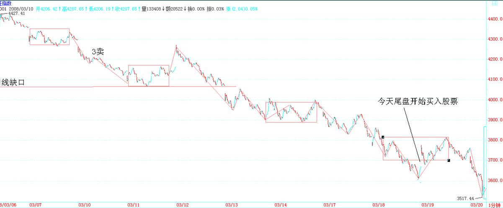

每天的走势，其实本ID都描述得很清楚，例如昨天已经说得很清楚，今天将有对记者会绝望的再杀出来，而记者会其间是一个震荡，这都在今天的走势中很明确的反应了，看看记者会后那杀跌，难道不是吗？

本ID就等这批人杀出来了，这批人杀出来后，所有有幻想的人都幻想破灭了，这时候，如昨天所说，这大盘就开始有意思了。

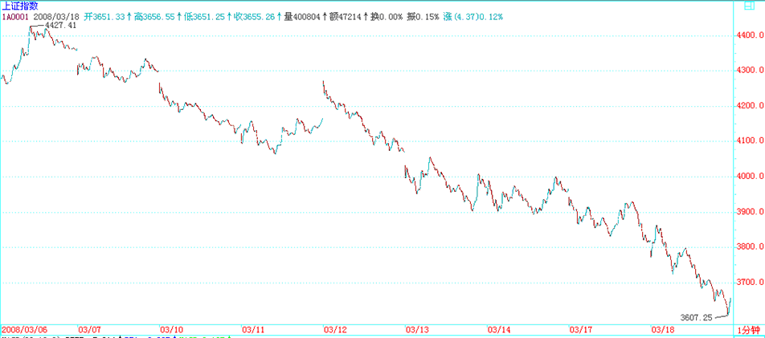

所以，本ID今天尾盘开始买入、回补第一批股票。

但，这个杀跌过程，很有可能会演化出极端非理性的情况，所以，资金大的，可以用分批建仓，震荡操作的方法。也就是，有足够的底仓后，保持这部分仓位不动，其他资金震荡操作，把建仓成本降低下来。

对于小资金，你可以根据技术图表找到更精确的买点。但大资金是做不到的，而现在，对于大资金来说，从今天尾盘最低点开始建仓，已经可以了。

本ID多次说过，今年到处是井，井可能是坟墓，也可能是机会，关键看你的水平，这次这井操作好了，收益少不了。本ID更反复说了，今年的操作是体力活，必须来回折腾，那种死拿股票的人等单边上涨的就等着去死吧。难道不知道本ID去年底就告诉你，今年绝大多数股票都是年阴线或长上影吗？

如果你没来回折腾的本事，本ID一早给你最好的归宿，就是小板凳。如果你自以为自己的水平可以不小板凳，结果给市场戏弄得鼻青脸肿的，那么就好好去学习这成语：自知之明。

建仓的股票，依然是低价股，而且短期跌幅最好超过40%的，这是最好的玩弄对象了，好好去寻找。

好了，逐步进入可以开始干活时间段，有本事的就开始抄家伙，没本事的，就继续小板凳。先下，再见。

自知之明(2008-03-18 16:23:40)

每次大跌，都有人被严重摧残甚至淘汰，这只是市场中最正常的事情，市场不是慈善场所，从来都是铁血游戏，如果能从中获得点什么，大概也不枉被市场折腾一把。

人，一定要自知之明。例如，你必须对你自己的性格有足够的把握。有些性格是绝对不适合在市场中混的，例如，一根筋的、依赖心理的等等。

市场的特点就是千变万化，你不能要求市场如何，因为市场永远正确，错的永远是你。但有些人的性格，就是死不认错，那唯一的归宿就死在市场中了。

我们可以抨击政策如何如何，但我们不能把自己放在火上边烤边抨击，本ID经常惊讶于某些人的忍耐力，一边天天不断亏损，一边就只会骂街，这种人，市场从来就没有给他们留下活的空间。

市场上永远有不合理，如果你为了合理，那就别来市场了。来市场只有一个目的，就是赚钱，如果不合理能赚钱，那就合理了。

太多正义感的人是不适合市场的，只有战胜了市场才有正义，失败者从来没有正义可言。

单边市永远是稀有的，像前两年那种走势，十年都难得一遇。市场归根结底，以震荡为主，而震荡最终产生的利润，绝对不少于单边，不会震荡的人，在市场上就少了一种武器，坐电梯是小事，往往就落在井里上不来了。

所以，对于不会震荡的，那么最好的选择，就是回避，如果10年才会有1次单边的机会，那就10年玩一次，这难道不可以，为什么一定要整天在市场里被市场折腾？

没那本事，就远离，事情本来就是这么简单。可惜人的贪婪蒙蔽了自己，那就种什么得什么，没什么可同情的。

市场的残酷，并不是为了某个人，这是市场的本性，如果对此没有深刻认识，那也只有死路一条。

再说句狠话，这次的下跌其实算是温和的，想见狠的吗？如果这次上去，在60分钟上只能构成一个1分钟中枢，后面再演化为一个60分钟上的1分钟下跌，那时候再看什么叫狠吧。

在市场上混，就要成为钢铁战士，就算国家经济崩溃，1987、1929年，也能在市场上屹立，这才有点象样。像现在这些人，动动不动就求救市，那是没见过苦日子。1929年的时候，美国连政府都无能为力了，政府都救不了自己了，那时候，如果你是钢铁战士，一样能屹立下来。

这世界上，没有一样东西是可以依靠的，即使那东西叫政府。我们只需要正确的操作方法，用这方法，把自己锻炼成钢铁战士，除此之外，都是废话。

3775点决定反弹能否延续(2008-03-19 15:21:35)

我们现在只是纯技术性地探讨走势，那么，3775点能否站稳将决定大盘反弹能否延续。今天一大早高开后回试是一个次佳的买入机会，为什么？看看60分钟图就知道，这刚好构成底分型。而3775点，刚好是这底分型的上边沿。

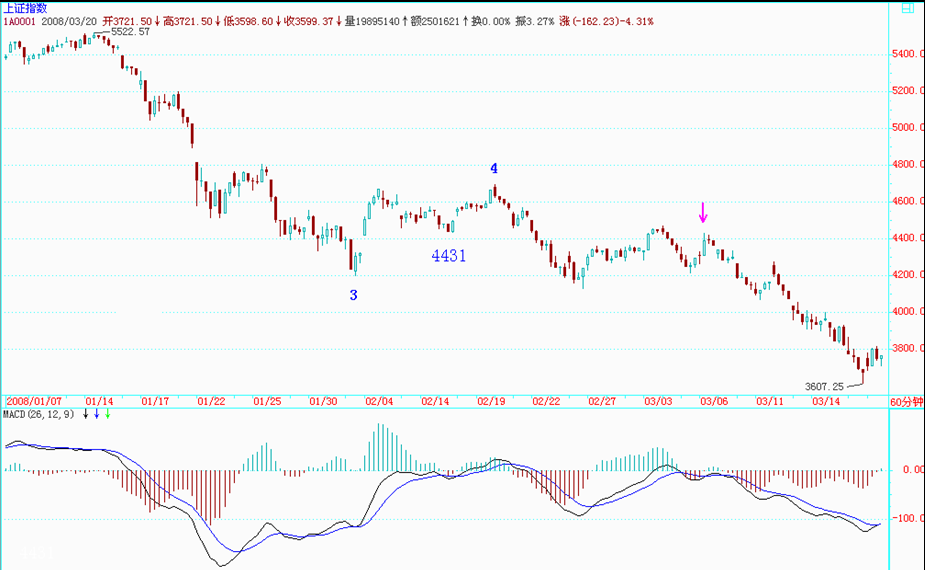

如果你明白这技术上的问题，那就会很放心地在早上第一小时回试时买入，很多股票当时还曾砸出比昨天更低的位置，例如000938，而收盘是涨停的。 

这里，必须有一个纠正，图上绿箭头所指位置其实已经足够构成一笔，而这笔没有回到4431点上，刚好构成类第三类卖点。所以，现在的大盘走势很简单，直接拉回图中3的位置，还是在这里折腾出一个线段来。 

由于目前还没有出现明确的区间套，不能完全确认从4下来的这下跌就一定走完，而单纯从60分钟图看，这显然构成了一个背驰段，只是这背驰段没有得到区间套的精确定位去确认。不过，按通常的情况下，最终回拉图中3的位置是必然的事情，唯一需要选择的，是完美地完成区间套，还是就此直接上去了。 

而这一切，3775点是一个关键，为什么？因为这决定了早上第一小时构成的那底分型能否最终延伸为笔，如果笔都不能延伸出来，那当然需要再探底去完成区间套的完美构造。 

个股方面，一反弹就知道，低价股和题材股依然是最有活力的，这种弹性十足的股性，具有最好的操作性，要好好珍惜。再说一次，今年是低价与题材的天下，但一定要知道，没有单边，只有折腾，而折腾，来回短跑，产生的利润一点都不会比单边的少。

## 教你炒股票103：学屠龙术前先学好防狼术(2008-03-19 15:58:15)

似乎有人嫌本ID的课程太慢，而世界上最多就是这种人，100多课，估计里面任何一课都没真正弄懂，就嫌课程太慢？如果你真正弄懂其中任何一课，也不至于在实际操作灰头土脸了。

学屠龙术前先学好防狼术吧，本ID看现在绝大多数是连防狼术都没过关，大盘稍微来点劲，就会被大盘严重侵犯。

在没彻底下面所说的防狼术之前，你也别研究什么中枢、级别的了。因为有了这防狼术，至少不会被大盘严重侵犯，也不会在大盘大跌时鬼哭男嚎了。

这防狼术，其实在上面的课程都有提及，这里再一次综合地总结。看好了。

就一个最简单MACD指标，0轴分为多空主导，也就是说，一旦MACD指标陷入0轴之下，那么就在对应时间单位的图表下进入空头主导，而这是必须远离的。

各位请自己去看看大盘的60分钟图，5200点MACD跌破0轴并反抽确认后，一直到现在3000多点，一直就在0轴下晃悠，其间产生多大的杀伤力，各位自己难道没有体验吗？

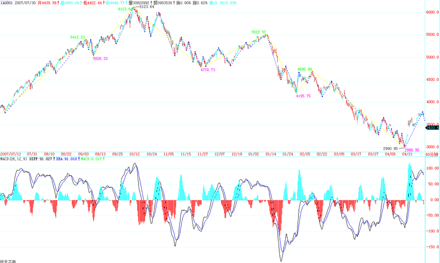

回避所有MACD黄白线在0轴下面的市场或股票，这就是最基本的防狼术。

当然，这涉及时间周期，例如，如果是1分钟，那就经常在0轴下又上的。这里，你可以根据自己的能力，决定一个最低的时间周期，例如：60分钟图上的或30分钟图上的，一旦出现自己能力所决定的最低时间周期的MACD0轴以下情况，就彻底离开这个市场，直到重新站住0轴再说。

当然，如果你技术高点，完全可以在背驰的情况下介入，这是最高的，但这里不能给太高的要求，一切都要傻瓜化，如果你连MACD黄白线是否0轴以下都看不懂，那就彻底离开这个市场吧，地球很危险，回火星去吧。

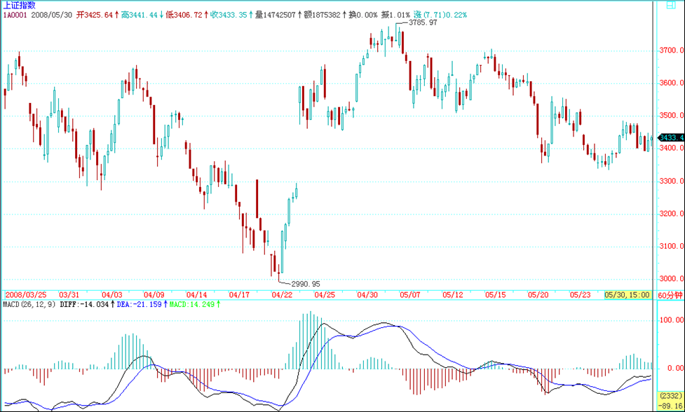

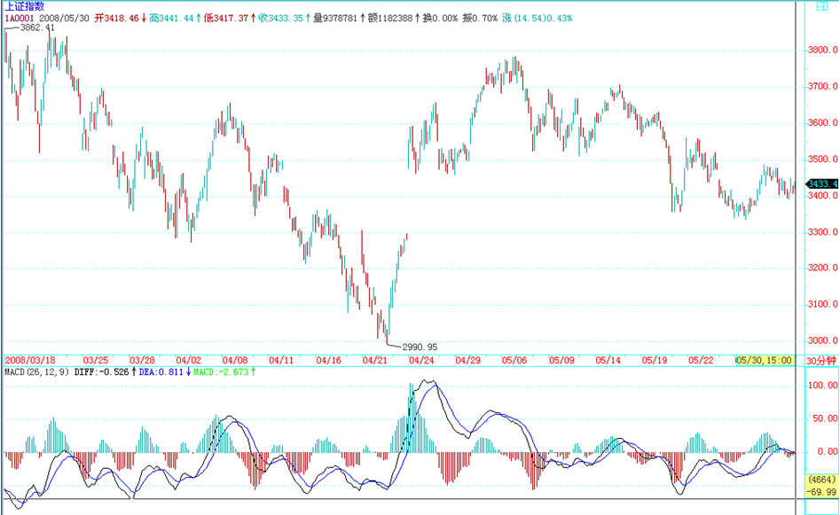

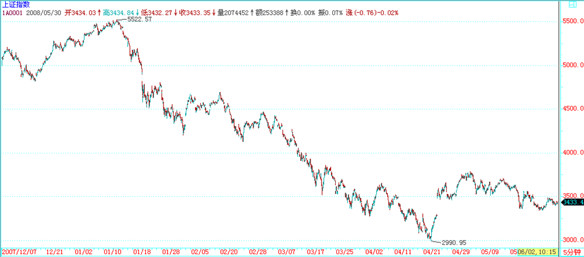

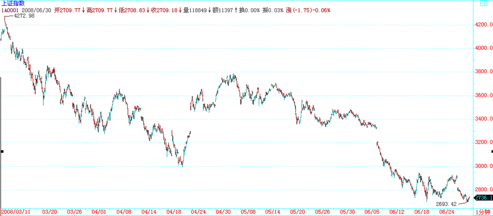

2008年行情再展望(2008-03-20 11:13:56)

抱歉，由于一西南地区上市公司的股权收购问题需要和法院和银行接触，下午可能等不到收盘就要去开会，所以今天的解盘和后面的帖子都没有了。现在用昨天写好的一个行情展望替代，要把握大的方向，请好好研究。

今天的大盘其实也不需要再解盘，由于3775点不过，自然就是继续原来的趋势，而浦发和石油给了一个恐吓性洗盘的机会。但可以明确说，目前已经处在宽幅的底部区域里，任何一个洗盘，都给题材股一个轮动的机会。

看看，今天创投的持续，奥运的崛起，这都十分明确。有时间恐慌、骂街，好不如好好去选择布局，看看N多人骂的天鹅已经两个涨停了，有时间还是看图选股去，市场不是靠嘴生存的。先下，明天见。

2008年行情再展望

去年12月，本ID给出了今年行情的展望，当时的结论，依然都成立，而且很多都正在验证之中。由于今年一季度还没过去，所以最终结果如何，还不能下结论，但有些已经成为定论了，例如，关于今年落“井”机会多多的论断，经过这三个月，大概都应该有所感受了。

由于没有需要修正的地方，所以，本ID还是按原展望的思路根据新的情况进行进一步的拓展，给出一些更精确的提示，以方便后面三个季度的操作。

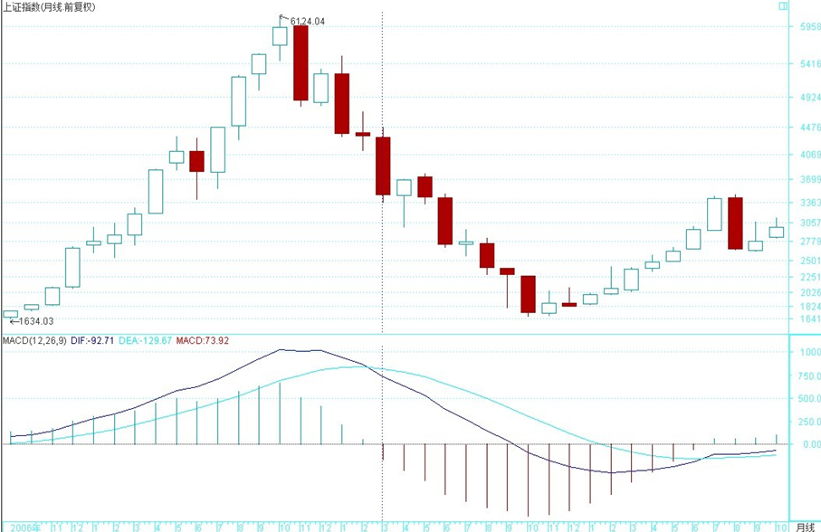

原展望中，本ID给出今年的节奏应该是扬抑大扬大抑，目前，扬抑这个节奏已经走出来，4778点到5522点的“扬”以及其后的“抑”构成了整个一季度行情的节奏。有人可能认为，4778点到5522点算不了扬，那是被前两年的单边上涨思维所迷惑了，在大调整走势中，这种级别的反弹已经足够地“扬”了。

5522点，是6124点下来的600点，3600点的1/6，这是一个值得关注的点位节奏，如果该节奏继续保持，那么4922点就是中线一个强的压力点。而4778点刚好是6124点下来的1345点，3600点的3/8，因此，下一个低点，最值得关注的是其两倍的位置，也就是6/8的位置，相应是3424点，如果没有特殊的全球性崩盘事件，该点位上下最终形成“抑”的底部的可能性极大。

可以断言，在这轮从5522点开始的“抑”走势结束后，将迎来原展望中所说的第三个节奏：“大扬”，这“大扬”的概念在于，这段走势的幅度，一定大于4778点到5522点的“扬”。

为了更准确地预言这个“大扬”走势，我们必须先回到原展望中的另一个预言，就是今年至少两度见年线，第一次是喜剧，第二次是悲剧。显然，这喜剧和悲剧都在一季度中全部上演了，由于浦发银行突然增发的影响，第一次破年线后的向上喜剧，只延续了不到10天，然后第二次破年线，展开了后面的悲剧，其中的3月4日，是最终确认年线不能有效回拉上去的日子。

但由于年线目前依然保持向上的走势，所以，后面这个“大扬”走势必然展开一次对年线的再度反击。一个很重要的技术信号就是，一旦年线走平后，大盘如果还不能重新回到年线上面，那么，一旦年线转头向下，那才是真正的大调整的开始，所以，前面，从某种程度上说，只是大调整的预演阶段，因为毕竟年线还没有转头向下，一旦紧接着的“大扬”走势不能在年线转头前重新站住年线向上攻击从而带动年线继续上扬，那么，其后的“大抑”走势，将让一季度的“抑”彻底失色。

即使紧接着的“大扬”走势能重新站住年线并向上攻击，从而使得年线转头的时间推迟，由于目前的月线MACD刚刚死叉，在这种技术条件下，硬向上攻击的结果，最好的就是制造一个MACD的双头走势，而其后对应的，依然是更大幅度的下跌。MACD双头后的杀伤力，有点技术常识的都应该不陌生，而且这是月线上的，其杀伤力与时间长度可想而知。

从最直观的技术上说，下一轮真正的大行情，必须等到月MACD回到0轴附近才有可能展开，期间，都是一些小打小闹的走势。

基本面上，其实也完全支持以上的技术走势分析。由于目前的估值完全是按前两年的高增长为背景的，而且依然达到很高的水平，一旦经济走平，这些高估值就完全没有支持的空间，赢利水平的大幅度下降在可预见的范围内，因此，目前那些所谓绩优股票，都有极大的中长线业绩压力，目前的价格都过度偏高。

而且，世界经济的经验告诉我们，大的商品投机潮过后，总会一地鸡毛，而美国经济的问题，远未到解决的时候，这些外部的定时炸弹将随时把经济繁荣的幻想炸裂，而真正的调整压力，在那时才会真正显现。

极有可能，我们将要开始面对一个大的世界经济大调整的困难局面，而我们现在的经济结构，由于丧失了太多做大做强的机会，绝对已经不足以独善其外了。因此，后面的困难可能会超出现在一般人的想象，因为历史的经验告诉我们，真正可怕的调整压力，是经济基础方面产生的，而我们现在极有可能将面临如此的危机。

个股方面，在原展望中已经明确指出，就是题材股，各类题材的反复炒作，将是今后很长时间的主题。而在大的调整市道中，历史经验反复证明，低价题材是永远不败的主题。由于目前的资金量，即使在大的调整中，炒作些低价题材永远是富裕的，所以，只要有投机性资金存在，这就是不死鸟，一有机会就要起飞。

一句话，在今后很长时间内，市场都将是长跑选手的坟墓，短跑选手的天堂。

站在20年的角度，这次的调整，依然是超级大牛市中的一个中继性调整，但20年的前提是，你能熬过这个冬天，否则，20年的超级大牛市，对于你来说，毫无意义。

3780点，短线生命线。(2008-03-21 15:29:38)

电话太多，晚点，抱歉。

昨天早上11点就给出的帖子已经给予各位最充分的提示了。众所周知的技术习惯，只要在3%的范围内，都是可以认为目标位触及有效。本ID给出的目标位置是3424点，而昨天的低点已经在其3%的范围内，因此，就此就上去，也已经在技术上十分完美。而昨天，本ID用恐吓性洗盘给出昨天早上的技术实质，这个提示已经足够明确，如果没反应，本ID也没办法了。

现在，当然不能说大盘就没有再次探底的可能，但大盘底部至少有一只脚是落地了，现在唯一需要探讨的只是这底部是独脚的还是双脚的甚至是多脚的。而决定这一切的，就是这3780点，这是60分钟新的底分型的上沿位置，只要站住这个位置，那么，至少在60分钟图上，将延伸出向上的笔，而这意味着这反弹是独脚的。

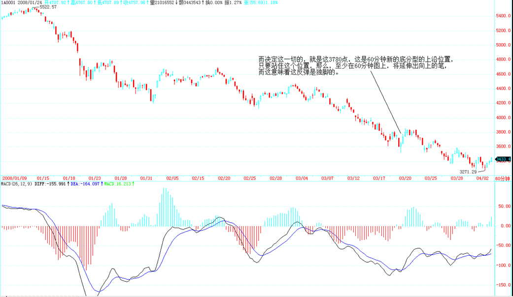

技术上，30分钟的MACD刚好在0轴上受阻，因此，只要下周初能站住3780点，那么这0轴也就会被突破，从而带动60分钟的向0轴冲击，对应这走势上将往上再上攻一段。

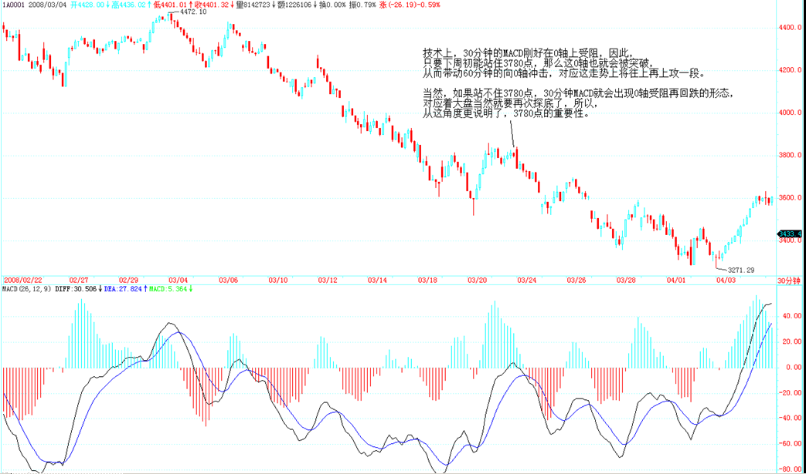

当然，如果站不住3780点，30分钟MACD就会出现0轴受阻再回跌的形态，对应着大盘当然就要再次探底了，所以，从这角度更说明了，3780点的重要性。

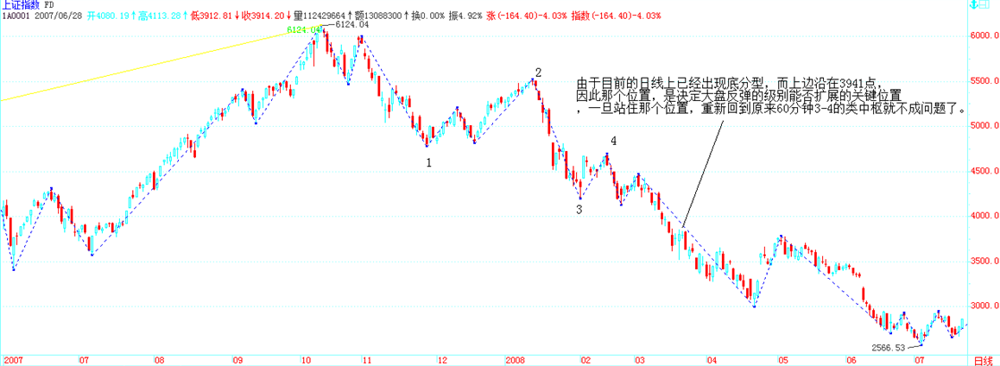

由于目前的日线上已经出现底分型，而上边沿在3941点，因此那个位置，是决定大盘反弹的级别能否扩展的关键位置，一旦站住那个位置，重新回到原来60分钟3-4的类中枢就不成问题了。

个股方面，还是本ID一路给出那几个板块在轮动，最近中小钢铁的走强，是因为重组的预期，这更说明，重组的挖掘是一个长期有效的主题。目前，还是小盘低价更有优势，你看，同样的题材，天鹅就比国电强，为什么？就是因为盘子小，国电30多亿的盘子，要敲动起来当然难度要大点、要慢点。

有些无聊人总是唠叨什么322，那算个鸭屁，难道堂堂大陆人民要为一个破渔村选村长这样的破事看他们的脸色，简直脑子进水了。

本ID给那些什么台港澳的人一句忠告，你们还有几年把自己当回事看的时间，过了这时间，你们什么都不是，别老觉得大陆人民欠了你们什么，你们那些要挟卖乖的筹码越来越没价值，等哪天发现，一个巨大的经济体不可阻挡的融化力时，后悔都没门。

给脸不要脸的最后连内裤都保不住。

有时间看322的无聊戏，还不如看看本ID的七律。先下，再见。

东南

缠中说禅

东南万里海浮天，一裂金瓯百五年。

未葬鱼龙今古血，翻生蛤蜃晓昏烟。华夷衰盛忝唐杰，

风雨苍黄思郑贤。

十亿神州重抖擞，昆仑拔掷浪波填。

3780生命线失守再次探底(2008-03-24 15:16:13)

上周五已经超级明确地说了，3780点是短线生命线，站不住就再次探底。今天早上，跌破3780点后两次反抽上不去，确认跌破有效。然后下午2点那标准的第三类卖点成立后，跌幅明显加大。一切都极端技术化。

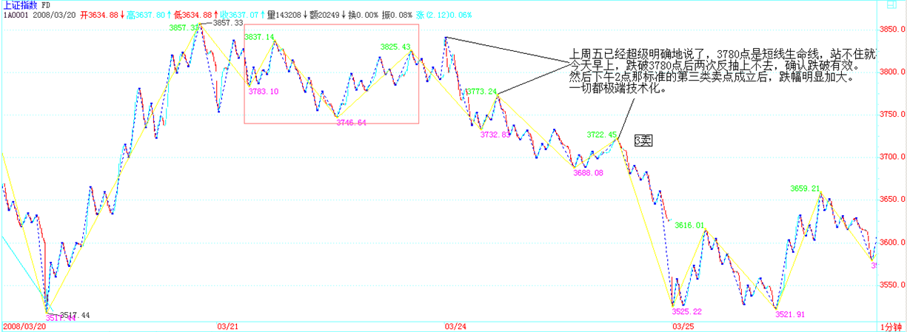

如果你没把握住这先卖等回补的节奏，那就恭喜你，你又要坐一次电梯了。当然，看到3780点失手，或最晚在第三类卖点跑掉的，那么就已经成功把上周抄底的了结，白花花的银两等待下一个买入的机会。

不过，由于目前已经在中线底部的震荡区域里，因此，每次震荡后沉淀一定的底仓是完全可以的。这要根据每人的资金量决定了。

如果你上去不舍得跑，破技术位也不舍得跑，把股票当宝贝，那建议你还是小板凳吧。现在的大盘，依然杀机重重，这样的心态，只有死路一条。

现在，就等平安的事情有一个了结了，管理层不能光说不练，材料报上去这么长时间，怎么都该有说法了。

个股方面，上一次强调的是短线下跌40%以上的中低价中小盘股，例如，已经4个涨停的天鹅就是最典型的例子。下一次，依然是这种股票，但注意能有双底支持的，而且一定要有新资金介入迹象，也就是放量后有一个缩量站住的。

周末有人吹嘘绩优股，但本ID依然要说，题材才是真。低价、重组、题材是今年不变的主题。先下，再见。

抱歉，以后不能保证每天都有帖子(2008-03-24 15:33:03)

最近，本ID写帖子的时候已经有点厌倦的感觉。并不是因为这世界上白眼狼众多，也不为了其他别的原因。只是本ID天生厌倦一切过于重复性的活动，例如上班。至于股票，唯一能让本ID忍受的是每天的行情都不同，这至少可以减轻厌倦感，但每周五都有放风的感觉。

本ID真希望如某些人整天诋毁本ID时说的，本ID是一个小团伙，可惜，本ID只是一个人，每天不变地两个帖子，确实已经超级厌烦。

为了与各位的缘分能持久点，唯一的解决办法就是帖子随意写，不要有一个固定的模式，这样，可能是最好的选择了。

以后就按心情写帖子了，更重要的是，现在其他的事情越来越多，整天有一个要写帖子的事情束缚着，确实不能坚持下去了，抱歉。至于解盘，还是尽量坚持。先下，再见。

万事具备只待平安事了(2008-03-25 15:09:37)

众所周知，这次从5522点开始共2000点的下跌，导火索就是平安，因此，在目前的底部震荡中，其实已经万事具备，但就差这平安破事最后有一个众望所归的结果，这也算是大盘最终走出底部震荡的一个最基本的心理支持。

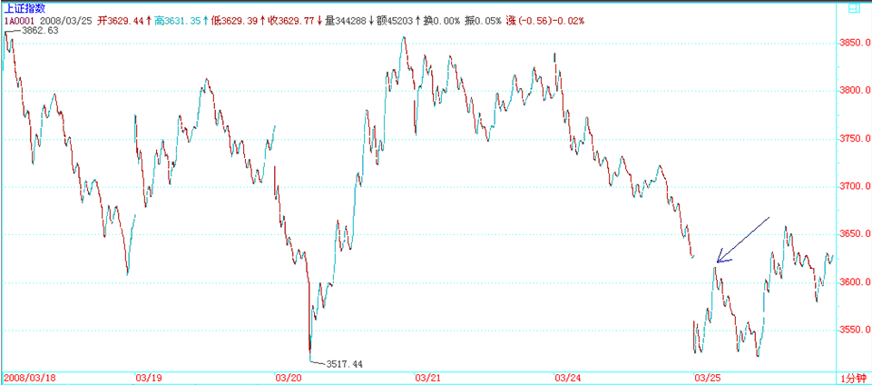

现在，差的就是这一点，但这一点却迟迟不能出现。如果按这样的审查速度，那么管理层的办事效率也太说不过去了。今年的市场犯小人，总是在关键的时刻来些妖蛾子，这次如何，就看这市场的运气了。

今天的大盘依然是中低价题材股的天下，个股方面，已经有很多按捺不住了，但只要大盘不能真正走出底部，这些个股行情的延续性就有问题。

技术的角度，超短线的关键位置在3616点，一旦再次有效跌破，那么破底而下就基本成为必然的选择。

上面的位置，还是和前面的分析一样，首先要面对的是3780点，这点不有效突破，大盘依然只能在底部徘徊。

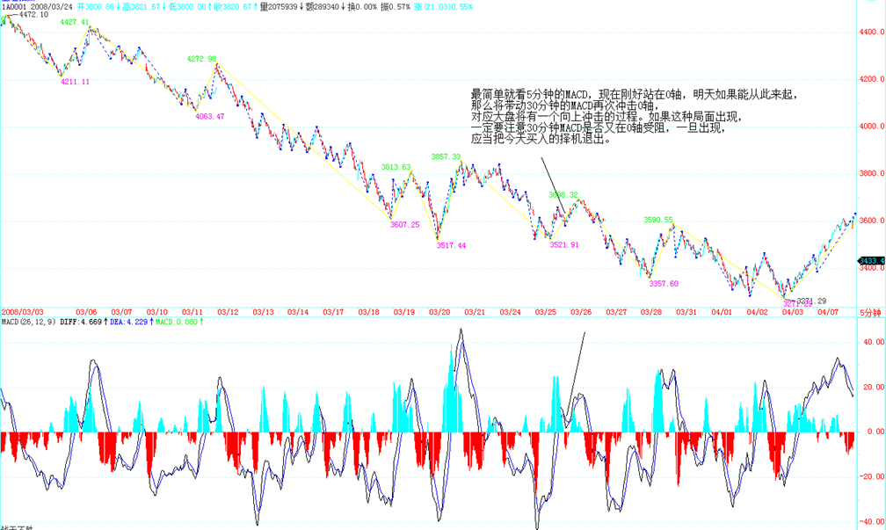

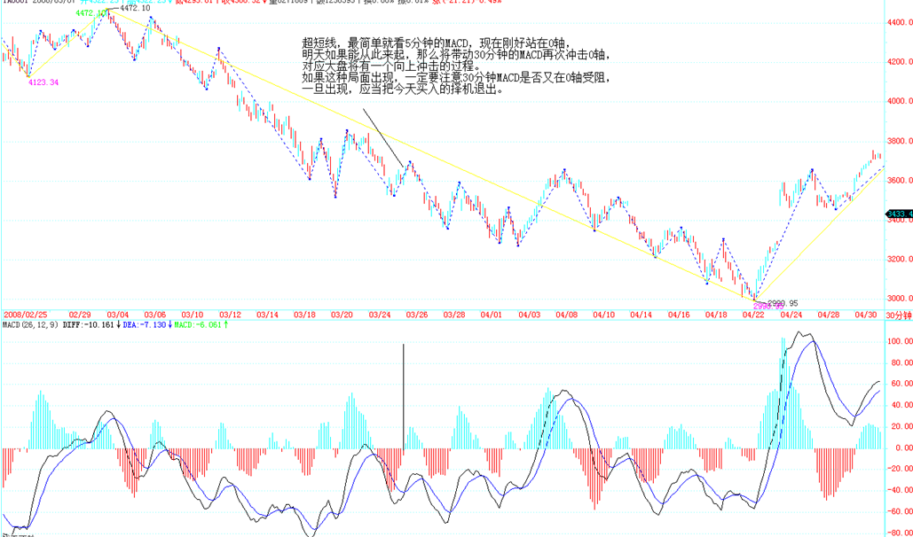

明天，超短线，最简单就看5分钟的MACD，现在刚好站在0轴，明天如果能从此来起，那么将带动30分钟的MACD再次冲击0轴，对应大盘将有一个向上冲击的过程。如果这种局面出现，一定要注意30分钟MACD是否又在0轴受阻，一旦出现，应当把今天买入的择机退出。

但对于大资金，应该把适当筹码进行沉淀。大资金必须是成本不断降低而筹码不断增加的动态建仓，这是一个基本的原则。先下，再见。

3616点，短线关键。(2008-03-26 15:15:26)

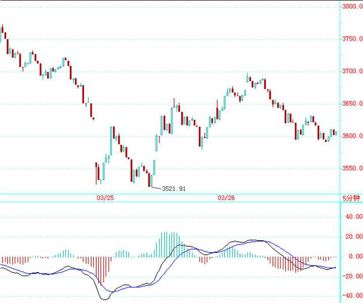

昨天让各位注意5分钟MACD站稳0轴后上攻的情况，结果今天早上走出一个标准的盘整背驰，红柱子小于前面一组，而也只带动了15分钟MACD回拉0轴受阻，因此其后的回落就理所当然了。

当然，如果你看不懂图，看到580989突然启动，也知道大盘要回头了。580989春节前就给了各位一个最基本的原则，0。6为中枢，只要好好把握这原则，你能赚多少钱算都算不过来了。不过，现在收盘已经到0。8附近，已经远离中枢，后面就是风险极大的阶段了，所以，今天没介入的，一定不能介入。该权证今天在0。7上下一个小级别背驰后回到次级别中枢形成大级别的中枢，因此短线0。7上下这中枢是对比关键，是否后面的上涨形成背驰，就以这中枢为基准了。

注意，权证是高度投机活动，而且很明确告诉各位，这是580989最后一大行情，毕竟还有2个多月就到期。

之所以再说580989，是请各位留意，上次580989从0。4下启动，对应了大盘一次快速的破位，这次是否重演，关键看昨天就说的3616点。

现在的问题就是平安，平安没说法，游资只能投机，谁怕谁呀。投机的好处在于，把短线资金的货给震出来都跑去诸如580989之类上，这样，中线的建仓也顺利了。今天，很多新板块已经暗流涌动，即使有再杀跌的过程，也是这些板块最好的介入时机，好好珍惜吧。

580989就看戏，看如何让你目瞪口呆，如何让最后的贪婪者套在高高山上永不超生。先下，再见。

## 教你炒股票104：几何结构与能量动力结构1(2008-03-26 15:47:42)

本不想写东西，看了看中国队的比赛，突然发现还是写东西有点意义。

本ID的理论是一个超级完美的理论，第一是在数学的角度超级完美，其次，是在物理的角度超级完美。物理角度，以前说的不多，因为这需要的思维方式，同样要有一个大的改变。

有些工科或老一代理科的，对现代物理一点概念都没有，以为能量动力，就如同牛顿时代，用各种微积分或各种级数等等无聊算法就是了。

现代物理的一个核心概念，就是物理与几何的高度统一。本质上，现代物理就是一门几何学，只不过是各种不同高深的几何学。而几何学也不是一般认为的那些几何学，几何的领域，可以涵盖并超越你思维的所有方面。

广义相对论是第一种真正意义上的现代物理学，而其基础是几何，一种比较简单的几何学。而后面，到规范场、超弦、膜空间等等，就涉及各种超越一般人直观的几何了。

在那些几何学里，能量、动力等结构对应着一些特殊的几何结构。这才是现代物理的主流。

对于一般人来说，广义相对论可能是最简单的了。那里，物质结构与几何结构是高度统一的，而诸如引力结构等对应着一些特殊的几何结构，如果有兴趣，可以找本广义相对论的课程看看，看看这种几何结构的威力。

而本ID的理论，本质上是站在这种现代物理的角度构建自己的能量动力学结构的。这里，一切都是几何结构说了算，一切的能量动力形态，都变几何化，因此，必须有这种思维上的根本改变，才会有真正的理解。否则，还是牛顿时代那种弱智思维，那就将陷入一种机械化思维的陷阱中。

具体怎么样，以后慢慢说来。好，去看看中国队如何收场，下，再见。

读后感：

1、“现代物理的一个核心概念，就是物理与几何的高度统一。”

破发竞赛宣泄市场情绪(2008-03-27 15:17:41)

今天的走势，昨天已经说得很清楚了，就是上次580989从0。4下启动时的翻版，那次同时带动了大盘的破位，这次如出一辙。各位可以对比一下上次的走势，后面的走势是否继续一样，这是一个很值得关注的问题。

如果走势继续一样，那么惯性下探后，大盘会再次回到破位前的平台。3424点的位置，由于有3%的确认空间，所以目前并不能说这位置就被有效跌破了。当然，这位置如果跌破，那么，下面真正有效的位置就是2500点了。记得当时本ID把震荡空间定到2500点时，有人觉得本ID夸张，现在看来，一点都不夸张。

其实，目前的市场情绪已经开始扭曲，因为管理层的不作为，市场只能以破发竞赛来宣泄情绪，这其实是极端危险的状况，管理层的信誉，在这样的市场情绪宣泄中走向破产，以后如何修复，只有天知道了。

市场现在就是以这样的逻辑来回应管理层的逻辑，管理层不作为让市场的再融资没有规则，那么，市场就让市场本身的融资彻底破产，如果这局面不被控制，那么这场闹剧很可能要演化到有新股一开盘就跌破发行价，让市场完全失去基本功能，一旦这种局面出现，你说2500点很奇怪吗？

当然，作为市场的参与者，都不希望市场各方以这种对抗性的方式进行下去，这样只能损害市场本身。但球在管理层那里，他们不作为，市场也只好如此了。

由于市场重心的下移，我们所需要关注的低价股的价格也需要有所下移。但原则是一样的，就是低价、题材、更重要的是，一定要来回折腾。

至于破发走势制造的破发板块，从纯投机的角度，将蕴藏着一定的市场机会，不过这需要的操作水平以及政策敏感度比较高，没这水平的不一定要关注。

580989，昨天说得很明确，0。7上下的短线中枢是关键，今天冲高后马上30%回头到这中枢，显示的这中枢的强大威力，同时也证明，这次的上冲只是一个中枢，是一个盘整类型，后面的波动就看这中枢的第三类买卖点问题了。注意，580989是最后一波害人行情，一般人一定要远离。先下，再见。

3424点初显威力(2008-03-28 15:12:27)

N周前的再展望，本ID给出了这轮下跌最可能的3424点的下跌结束位置，6124点下来的2700点，3600的3/4，而第一次4778点，刚好是3/8，今天这个位置初步显示其威力。

注意，一个最基本的技术常识，任何技术位置都有一个上下3%的允许空间。由于这世界上脑子有水的人太多，所以必须再说一次。例如，上次从4778点开始的反弹，本ID说结束的位置在900点，3600的1/4处，也就是5678点，最后结束的位置在5522点，完全在5678点的3%空间内，但有些人为了没有最终到5678点祥林嫂了一个月，这是什么人？自己没常识，蠢还要满大街告诉所有的人，这世界多的就是这种人。这种人不死，市场哪里还有天理？

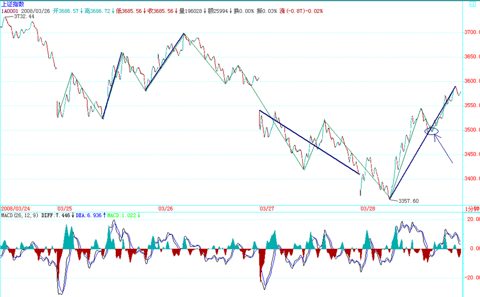

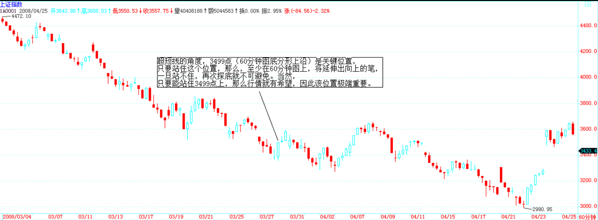

而昨天也说了，和上次580989在0。4下启动那次一样，引领大盘破底后，大盘最终又再次回到破底前的平台，今天的走势证明，这太阳底下，新鲜事并不多。

但一定要更注意的是，由于今天的上扬甚至不足以在日线上制造一个底分型，而今天上扬受到诸多传闻的引诱，一旦这些传闻下周没兑现，就不排除又有一个杀跌回试的过程，因此，3424点最终能否成为底部，现在根本没有任何最终的结论，必须采取灵活的策略应付之，而不是脑子里一根筋。

超短线的角度，3499点是关键位置，一旦站不住，再次探底就不可避免。当然，只要能站住3499点上，那么行情就有希望，因此该位置极端重要。

超短线可以看下周初，5分钟MACD是否最终演化为红柱子不能再伸长而比前一柱子面积小的情况，对应着15分钟MACD的0轴能否被突破，一旦不行，肯定要回试诸如3499点这样位置的支持。当然，高明的并不需要等3499点真跌破再走。

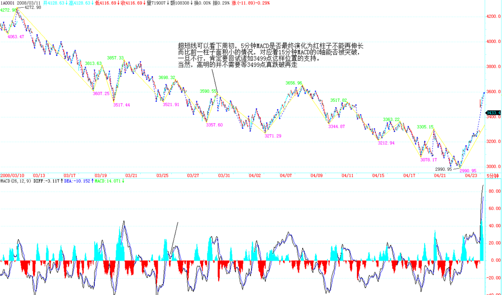

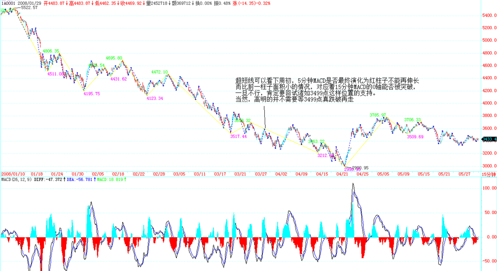

对于小资金，原则已经多次说了，就是抓准机会咬一口，一看不能延续就先跑。这次从5522点下来，用这个原则抄了无数次底，都能按技术把钱赚了又先跑出来，就证明，下跌其实没什么大不了的，关键你能折腾，折腾好了，下跌一样是天堂。

当然，前面说了，对于大资金，现在折腾时一定要注意沉淀筹码，大资金和小资金不同，小资金1秒钟就可以把仓位建好，大资金可没这本事，因此必须有沉淀筹码的动作。注意，从5522点下来，本ID直到最近才给出大资金需要沉淀筹码的要求，为什么？因此以前离底部还远，所以根本不存在沉淀筹码的问题，而到了目前的位置，就算3424点最终不能底部，下面的也不过是空头陷阱了，对于大资金来说，根本不算什么，所以，现在开始沉淀筹码，完全对头。周末，股票一边歇去。先下，再见。

3499点继续决定短线命运(2008-03-31 15:16:35)

在上周都比较兴奋时，本ID已经明确说，一旦传闻不兑现，又是一轮回试。至于给出的3499点，更成为今天震荡的中心，尾盘最终也没站住。

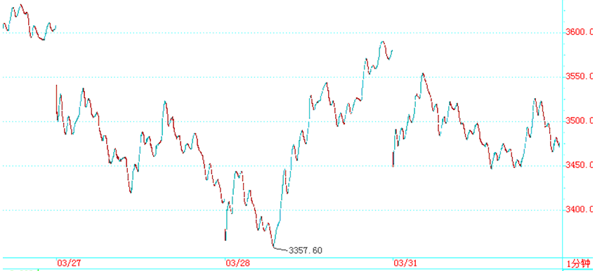

由于该位置今天是震荡中心，所以明天如果能站上去，大盘还有点戏，否则，继续探底就不可避免了。底部不是一天成的，今天显然已经比以前类似的情况走得稍好一点，显示已经有一点新资金介入并对此位置有一定的信心，否则，今天将是单边下跌。因此，明天的走势很关键，如果能回拉上去，证明新资金的信心还是比较足。

但是，多次说了，现在需要的是干货。没有干货，任何信心都会被磨掉。没有干货，谁说话都是废话，市场能领情吗？废话说多了，只能显示自己的无能，这点，有眼睛的人都看得清楚。

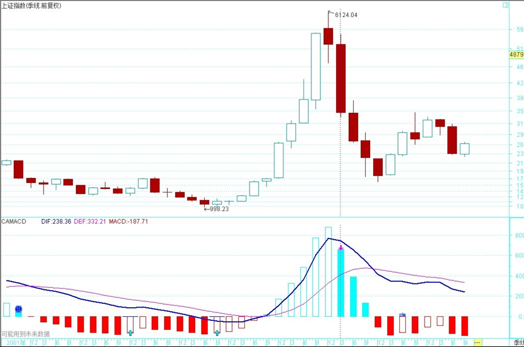

其他也没什么可说的，现在就是等待，今天是月线和季线收盘，有兴趣的自己去看看，中线形势有多恶劣。这里不起来，季线上就有极大机会形成向下的笔，这意味着什么，自己想去。

现在主管金融的人，其办事风格是十分怪异的，这点，本ID有太多了解了。该来的没来，也只好这样了。

天灾不可怕，因此，对非系统性风险，要有时刻的提防。对于散户来说，咬一口就跑，与机会再咬一口，这是最好的策略。先下，再见。

下一个短线机会又将来临(2008-04-01 15:16:38)

别让本ID看不起，每次短线，本ID都把最后的走人位说得一清二楚，就象这次的3499，今天早上连续冲了两次不行，就开始大幅度下行，如果你这你都看不明白，还是去孔男人那里吧，你这样的水平在这里只有丢人的份。或者就自知之明一点，在自己额头上写好永不短线，因为自己无能。

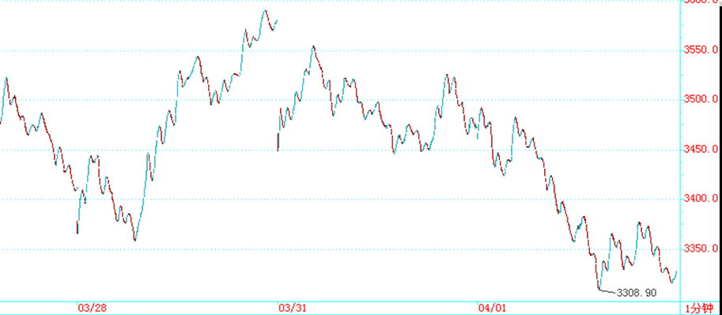

最鄙视那些自己没本事，又要怀疑别人的人。你没本事短线不代表短线在下跌中就不行，为什么每次本ID都能顺利出来？按本ID最后的位置，如果你没更高的本事，你哪一次不能出来的？

现在，有本事的人将要干什么，就是马上迎接新的短线机会。这机会在破底后很快到来。其实，很多股票，回跌10%到20%后，今天尾盘就可以回补，特别资金大的。

现在，一个标准的下降通道，到下轨就可以短线，如果破下轨加速，那就要放爆竹了，大的反弹马上就在眼前，这都是最基本的技术常识，有什么难度？

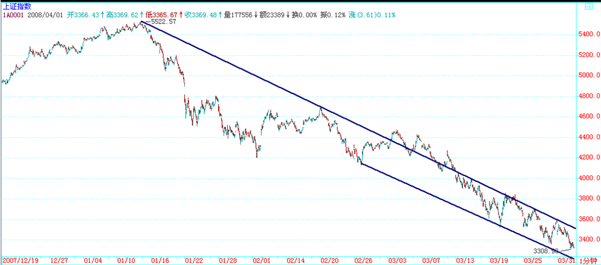

（非标准通道图）

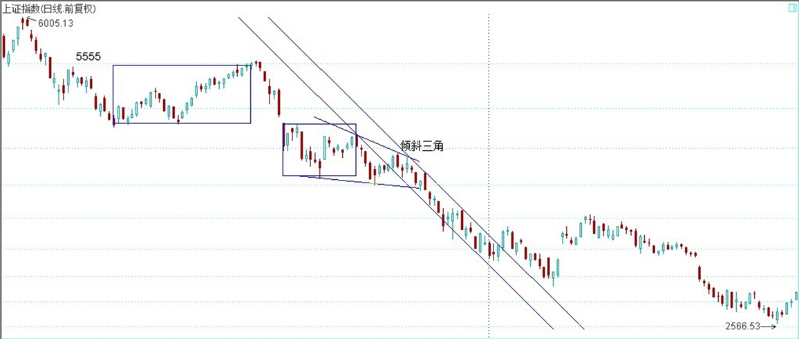

那管理层爱干什么干什么，本ID就陪他们玩到2500，1500也无所谓，反正有本事的人钱就越来越多，到时候再大买便宜货，从1990年和他们玩了快20年了，谁怕谁呀。

这世界，只能靠自己的本事，哀求别人救你，有可能吗？本ID早说了，绝对不能依靠任何东西，即使那玩意叫政府。这就是本ID从1990年开始的最大经验之一。

本ID越来越感觉到，本年度最大的赚钱机会越来越近了，让孔男人哀号去，求政府去，我们开始磨刀霍霍了。先下，再见。

现阶段中国资本市场的地位(2008-04-01 15:59:39)

一个成熟的市场经济，其市场中心地位的就是资本市场，资本市场的任何风吹草动，都是国家级的大事。看看，这次次贷危机，美国股市的实际跌幅度一点都不大，连20%都没有。但已经是朝野倾动而出，用进一切的金融、财政、政府等的资源来稳定资本市场。为什么在美国以及西方所有的成熟市场经济国家，资本市场具有如此举足轻重的地位？因为，这是他们经济结构的核心，后面代表着最大多数人的利益。也就是说，这些成熟的市场经济国家，其经济已经进化到如此的境地，绝大多数公民的经济利益都与资本市场密切相关，而经济基础决定上层建筑，自然，没有任何的政府机构敢对资本市场有丝毫的怠慢。

而现在，中国的资本市场还远远达不到这样的地位，因为中国的市场经济依然在极为落后的阶段，资本市场可以说暂时只是一种点缀，本质上，在经济结构中还没有任何实质的地位。

因为，在中国，目前与资本市场利益相关联的，只是所谓中产阶级以上的阶层人的利益，而目前中国更多数的人，是与资本市场无关的，而他们所代表的是一种与市场经济相对无关的经济结构。而在整体的国家经济利益的取向中，牺牲少数以换取多数，显然是一个最被采纳的选择。

因此，例如在现在CPI与GDP的两难抉择中，资本价格的压制又被人错误地认为是压制CPI的好手段，因此，牺牲资本市场就成为最符合这种经济逻辑的选择了。

可以断言，在中产阶级以上阶层占据社会人口最大部分之前，这种利益的偏向都无可避免，对此没有明确的认识，不仅会对诸多中国特有的经济现象产生迷糊，也会对自身的操作产生重大影响。

其次，按照服务型政府的原则，资本市场的监管机构，本质上是市场的服务者，但现阶段，显然远远达不到如此的要求，否则，例如平安事件，就不会一拖几个月都毫无结果。而对于一个服务型的机构，这是显然的不作为行为，应该受到相应的监督、纠正甚至惩罚的。

看清本质，你才能有真正的力量。

3462点成短线关键位置(2008-04-02 15:17:01)

今天，如期反弹，然后大幅度震荡。一般这种走势，最好就是进行对冲式操作，或者如昨天本ID所说，昨天尾盘就可以先介入。

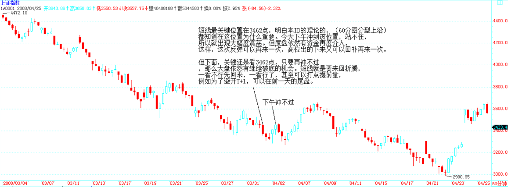

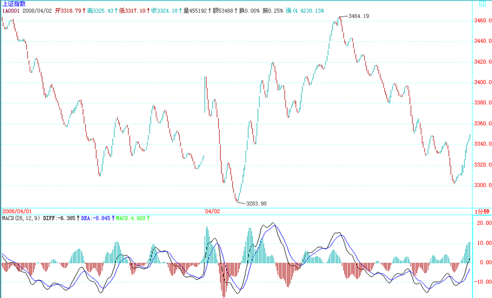

现在，短线最关键位置在3462点，明白本ID的理论的，都知道在这位置为什么重要。今天下午冲到该位置，站不住，所以就出现大幅度震荡。但尾盘依然有资金再度介入，这样，这次反弹可以再来一次，高位出的下来又可以回补再来一次。

但下面，关键还是看3462点，只要再冲不过，那么大盘依然有继续破底的机会。短线就是要来回折腾，一看不行先回来，一看行了，甚至可以打点提前量，例如为了避开T+1，可以在前一天的尾盘。

个股方面，金融股已经率先走强，但这走强是否有延续性，是否能向地产、有色等蔓延，是行情能否延续的关键。题材股经过大洗盘，还会重来，但暂时以反弹为主。

这几天很难打开，系统好象也不稳定，不多写了，先下，再见。

3462点如期发挥神奇作用(2008-04-03 15:24:59)

今天的走势大概出乎很多人的意外，但一定不包括本ID以及昨天看了本ID解盘的人。昨天的解盘很明确地告诉你要再来一次，请问，这一次爽吗？

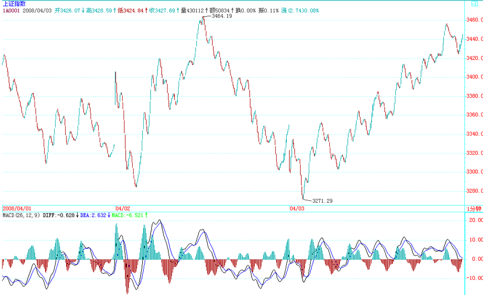

昨天，更说了金融向地产或有色等蔓延的问题，今天，那聪明的驴的表现，请问爽了没有？有人昨天说，不是题材股吗？但难道这些云铝中铝不是本ID股票池子里的？50、60跑的，20下买点回来，难道有罪呀？简直病的不轻。

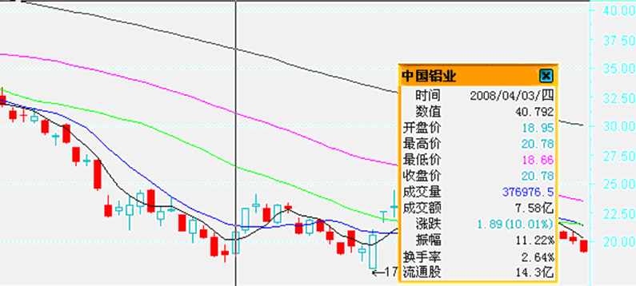

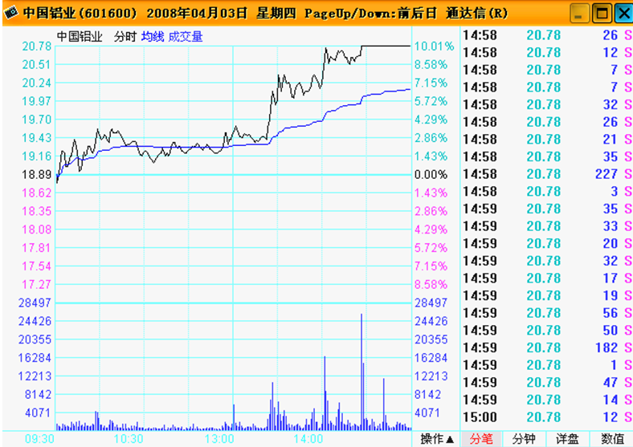

兵无常形，如果要走一波本年度最大级别的向上走势，中字头不启动怎么可能完成？题材股当然要继续，但一波完整的行情，就是一、二、三线的轮动次序，这不最简单的道理，有什么可说的？

当然，这一切暂时还只是蓝图，因为实际的行情并没有走出来，暂时先当成反弹来干是比较靠谱的，一旦形势不对，反手狠砸，不亦快哉？

显然，昨天说的3462点，今天起了明显的作用，大盘最终在该点位前放下步伐。由于今天搏消息的比较多，所以尾盘小跳让人出来也是应该的。

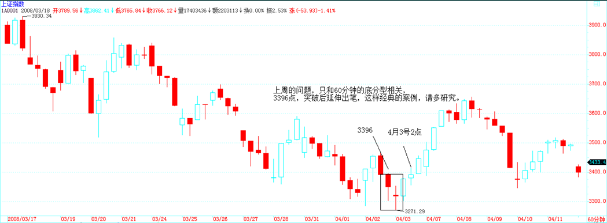

下周是很关键的一周，因为日以及周是否能底分型，就看这了。当然，短线这一切，都可以简化为3462点能否有效站住的问题，一旦能站住，这些分型都不成为问题了。

个股方面，注意一线股的轮动次序，注意新资金流向。另外，如果周一没消息，注意回杀力度，如果力度不大，反而证明这行情真有戏了。

今天的走势图，超级技术化，留一个作业：13点30分到2点这段时间具体什么的技术意义，为什么一站住某位置后，就马上出现大的突破，向上攻击3462点。

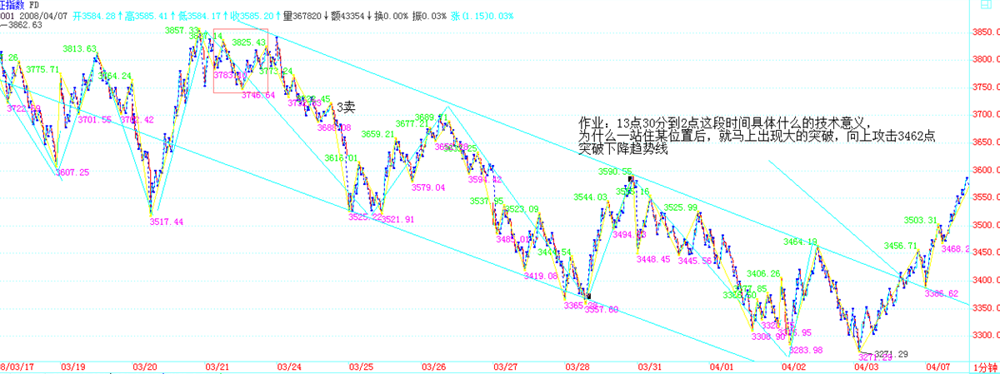

(注：缠师的作业的答案是分型上沿突破，但是趋势线的意义在此图中也很经典，故保留后图）

提前一天收市，简直太美好了，清明时节雨纷纷，水为财。先下，再见。

3613点成中短线关键位置(2008-04-07 15:21:25)

大盘今天突破短线关键位置3462点后一马平川，60分钟上N个月来第一次延伸出向上笔走势，显然了大盘的短线强势。

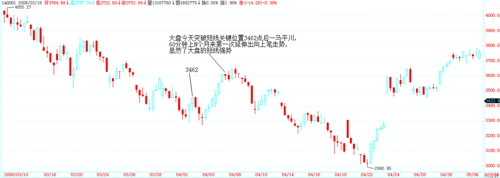

周五解盘已经特别指出，如果周末没消息而大盘反应并不过烈，反而证明大盘行情真有戏了，今天的走势恰好证明了这一点。个股方面，中驴为代表的有色继续驴性大发，但要注意，这次启动的板块，都是回弹20-30%左右进入调整，例如地产、金融等，因此，有色能否改变这局面，暂时是有疑问的。

现在，3613点已经成为中短线关键位置，因为这位置是否突破决定大盘能否延伸出日线上的向上笔，而今天的走势，由于已经突破3555点，因此，周线上形成底分型的可能性极大，除非在本周内出现再破底。因此，中线上，我们一直预言的本年度最大行情成立的几率已经越来越大。

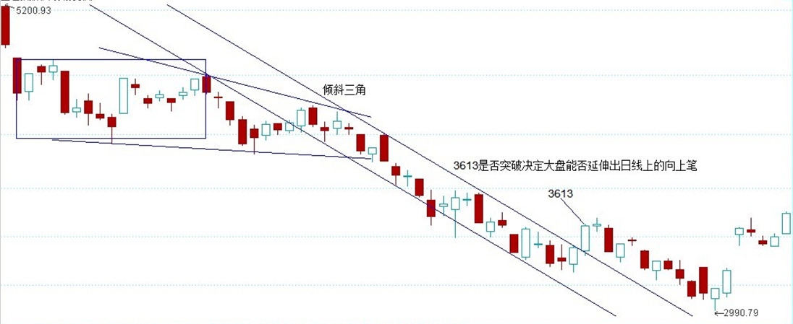

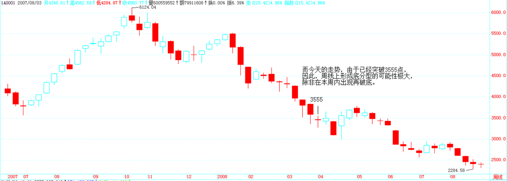

当然，最安全的作法还见一步走一步，只要3613点攻击不破，就可以先对筹码进入相应调整，以应付后面的震荡走势。

虽然本ID一早就明确3424点附近将出现中线底部，但真走出来，我们反而要冷静。不能在操作上留下遗憾。而且，如果真是中线底部，在真正突破之前，洗盘震荡还少不了，所以，一定要按图作业。

上周的问题，只和60分钟的底分型相关，3396点，突破后延伸出笔，这样经典的案例，请多研究。先下，再见。

中国人，不要习惯性当政府的奴才。(2008-04-07 16:05:58)

几千年来，中国人在政府、衙门面前就从来没抬起过头，即使改朝换代，最终这奴才心理还是改不了。

而实质上，政府、衙门是我们的奴才，没有我们，哪里有什么政府、衙门，是我们的血汗供养了这些机构。面对这些机构，任何人都应该腰杆笔直。

可惜，实质上，绝大多数的人还是不自觉地、完全集体无意识地当了政府、衙门的奴才，例如，在资本市场上，例如现在还在叫嚣的救市言论。

本质上，根本不存在政府衙门那种从上而下施舍性的救市，问题的实质，只是要让这些奴才改正他们的错误，当然，如果奴才不好听，那么，我们就用公仆这个词。

没有救市，也无须救市，有的只是纠错。错了就要承认，就要改，就这么简单。

可惜，大多数的人的思维都扭了，都在等待所谓的施舍，这样，中国的资本市场、中国的现代化真是遥遥无期了。

衙门型的管理机构与服务型的管理机构相比，最大的特点就是行为完全脱离实际，所有的应对措施都严重慢几拍。例如，过去两年，面对快速的上涨，最简单的经济学常识都可以提供最简单有效的应对措施，就是快速加大供给。而供给的加大是要有时效性的，过了那时间，这措施就对不上点了。那么，请看实际上管理机构不仅没有加大供给，反而是提供了流通比例极低的疑似非法蓝筹，这难道不是典型的火上加油吗？

衙门型管理机构，甚至可以有这样一种可怕的思维，跌比涨好，跌就是安全，资本市场里的人的行为最好都完全统一到银行存款行为上去，这样就不惹事，不惹事就是最大的好事。正因为这十几年那如此思维的存在，因为中国的资本市场走势都显示出最大的投机性，因为大家都知道上涨的时日无多，一旦有机会就变本加厉地投机，尽量在最短时间内把最大的利润拿到手。

正因为管理层与投资者的心态都在这样一种氛围下，所以，那种稳健的长线行情就不可能真正出现，大起大落成为真正的常态。而这时候，还提防止市场大起大落就成为一件很滑稽的事情，成为衙门型管理机构语言的一个标准范本。请问，一年不到，从3400点到6124点又回到3400点还不是大起大落？一个已经是事实的东西，还能或还需要防止什么？

我们不希望再有类似的无聊衙门言论，我们也希望我们所有的投资者都要站立起来，知道自己的力量，市场是我们创造的，我们是市场的真正创造者，我们才是市场真正的主人，我们必须要用我们的力量彻底改变这一切。

3613点如期发挥神奇作用(2008-04-08 15:19:39)

昨天给了短线的关键位置3613点，今天全天就是围绕着震荡，连收盘就在3612。5就知道，该点确实如期发挥了作用。

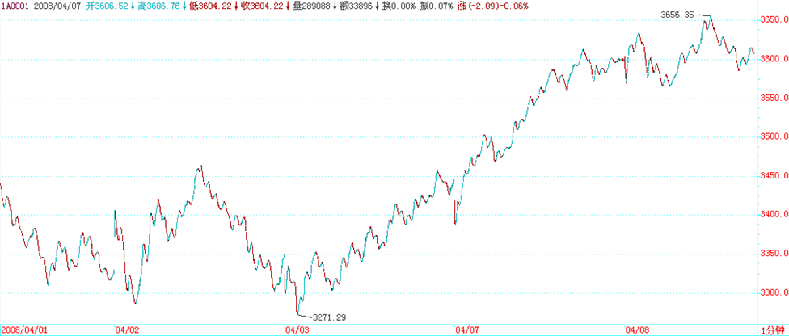

现在的问题很简单，站得住3613点，就继续上攻，否则就出现一个大的调整。所以，本周就看着该点就可以了。

个股方面，板块轮动加速，现在问题的关键是轮动后首先调整的板块能否再次启动，能，那大盘就肯定有戏，否则至少要调整一下。

目前，整个次序大致是地产、金融、有色、券商，然后今天是所有几乎大的题材都动了一下，创投、农业、三通、环保等等，因此，后面还是要看金融地产能否再次启动。

当然，一些小板块的轮动还会继续，但对于大局，这些都没多大的意义。行情，关键要看大角度。

大家应该注意到，本ID最近一直只用给级别的分型来统一进行分析，其实就是想告诉各位，你把一招真学会了，绝大多数的问题都能解决，这就是示范，请把这次整个探底到回升的整个过程好好研究，课程等这个示范以后再写。

不想说了，留点精力今晚熬夜看球，先下，再见。

3613点威力尽显(2008-04-09 15:16:57)

今天的走势极端技术化，前面已经明确说了，只要站不住3613点，就要再次探底。今天低开后，在60分钟刚好跌破顶分型的下边，早上那标准的回抽，极端显然地上不了3613点，因此确认这对顶分型下边的跌破是有效的，因此后面的下跌就顺理成章了，为什么？因为向下要形成笔。

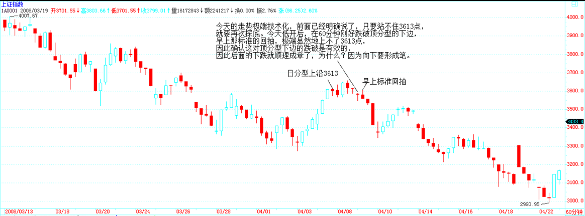

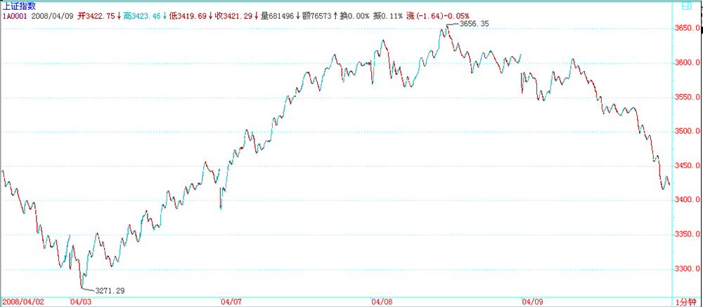

现在的走势很显然了，向上的笔后形成向下笔的调整，也就力度最大那种调整，因此，后面在向下笔结束前，都不适宜再度介入。但一旦向下笔结束，就又有一次美妙的短差机会。

各位，看到没有，就用一个简单的60分钟分型结构是否延伸为笔，我们就能完全把握这样的走势与相应的退出，现在，我们只需要等待新的买点出现，如此简单而已。

个股方面，昨天已经明确说了，只要地产不能重新启动，就有问题，今天万科等的走势，一个标准的短线多头陷阱，因此，引发回跌再正常不过了。

当然，就算有真行情，也需要大的洗盘，但是否洗盘还是继续下跌，其实根本不重要，我们只关心下一个买点，把走势支解了进行操作，我们不废那个脑子。

让脑子有水的人继续争论是否有真的行情，他们负责争论，我们负责挣钱，还有精力的，今晚继续加班看球。先下，再见。

3533点成短线关键位置

(2008-04-10 15:25:06)

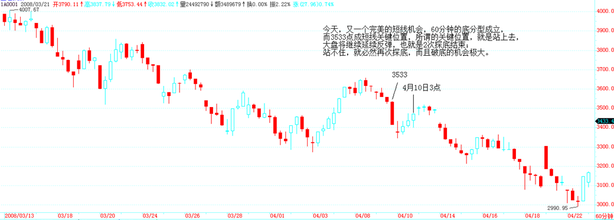

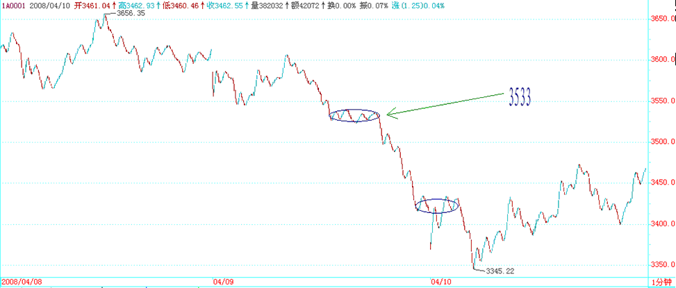

网络超级慢，登陆就用了10几分钟，什么写东西的心情都没有了。随便说两句。

今天，又一个完美的短线机会，60分钟的底分型成立，而3533点成短线关键位置，所谓的关键位置，就是站上去，大盘将继续延续反弹，也就是2次探底结束；站不住，就必然再次探底，而且破底的机会极大。

今天，煤炭、券商、滨海等甚至创出本次反弹的新高，这是好现象，证明至少有部分资金是勇敢做多了。现在，指数上要有大突破，还是要看金融、地产、有色等，不过先有板块裸奔起来，绝对是好现象。

思维要改，今年的行情不会是一条直线的，底部也要震荡个N回才爽的，不明白这点，就痛苦去吧。注意节奏，自然就爽。

这破网，按一下，N久才有反应，简直浪费时间，不想写了，先下，再见。

周底分型成立令3840点成中线关键(2008-04-11 15:10:56)

本周折腾，最后的结果还是把周底分型给折腾出来了，该分型的上边在3840点，因此，该分型是否最终有效，延伸为向上笔，或者最终失败，只构成中继型，3840点就成了周级别的关键位置了。

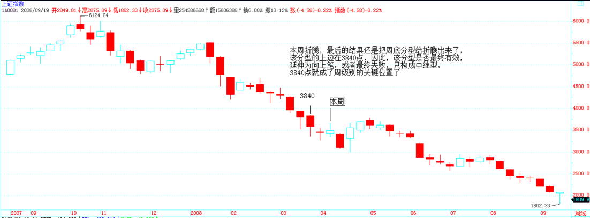

今天，大盘全天在昨天所说的3533点下震荡，显示大盘不强，信心不足，大概是周末的心理压力，因此，下周初，就看这60分钟级别的关键位置能否突破，不行，就再次探底。

日线级别的对应位置在3613点，因此，3533、3613、3840，给出了一个市场运行的密码，由此，超短、短、中的走势都完全把握了。

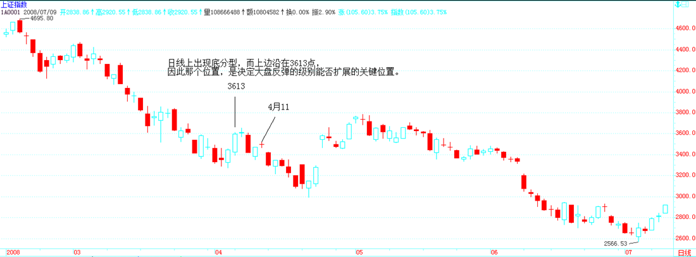

个股方面，板块继续轮动，但力度有所减弱，现在，只要金融、地产等不再次动起来，大盘就不会有大戏。

周末，快点远离股票，好好休息，身体第一。先下，再见。

## 教你炒股票105：远离聪明、机械操作(2008-04-13 21:51:14)

周末不写股票并不是什么天经地义的事情，想写就写了。

股市里死掉的，大半是聪明人，越聪明的，死得越快。要在市场上生存，就必须远离聪明，因为，你的聪明在市场面前一钱不值。

市场就如同一头牛，只有目无全牛，才可能随心解之而合其关节。在本ID的理论中，机械化操作的本质就是目无全牛而合其关节，因为，根据本ID的理论，市场的结构已经被彻底分解，站在本ID理论的角度，哪里有什么市场，不过是一堆的关节。而机械化操作，就是逐步合于其关节的节奏，而不被全牛的繁复所影响。

至于分解这市场的那个标准是什么并不重要，也就是分类的原则并不重要，关键这分类能导致完全分类就行了。那些看不起分类的，永远只能在全牛的迷惘中可怜，咱就不带他们玩了。

本ID可以再次明确地说，全牛纷繁，因此可以口水多多，各有道理，那么，就让这些聪明人去道理去、去争论去；咱不爱聪明，咱不爱全牛，咱只知道关节的节奏，咱不爱争论，咱更不爱预测，咱只负责挣钱。

如果你喜欢道理而不喜欢白花花的银两，喜欢争论而不喜欢挣钱，那么就远离本ID的理论吧，那对你没用。

最近，不写课程，但其实一直都在写，每天，就是用一个最简单的分型以及能否延伸为笔的最基本标准进行分类，就完全可以处理如此震荡的行情，人总爱复杂的东西，看不起简单的，而这才是真工夫。

挣钱，本来就是很简单的事情，不过就是一个良好习惯与操作策略的结果，一点劲都不用费。那些费力才能挣到的钱，也不会待得住。

人总爱贪多，请问，分型这最简单的分类导致的操作，你把握了吗？如果这都没熟练把握，你再学其他又有什么意义？好好总结吧。

又一短线机会扑面而来(2008-04-14 15:22:10)

现在这种行情，本ID一早就给出两种唯一的策略供不同水平的人选择，一是小板凳，二是短跑运动。本ID之所以天天在这里给各位练习短跑，就是假设你有这水平。否则，小板凳的过来看看就可以。

现在，继续和各位练短跑，如果你没这水平，就一边晾着，咱不带你玩。

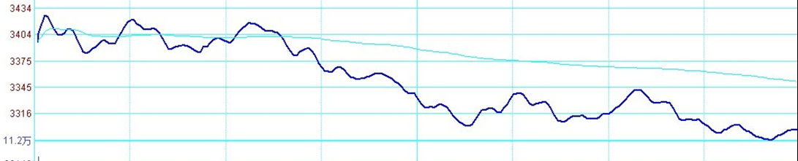

已经明确说了，3533点上不去破底的机会就大大的，所以，今天的走势其实没什么可奇怪的，而且早上连续三次冲高都补不了缺口，如此肾亏，你还能假设这大盘今天不是ED男？

不过，这样的下跌，只是让又一次的短跑机会扑面而来。不管是用背驰还是分型，都很快出现标准的图形。其实，对于一点货都没有的，今天尾盘就不妨在水底捞点。

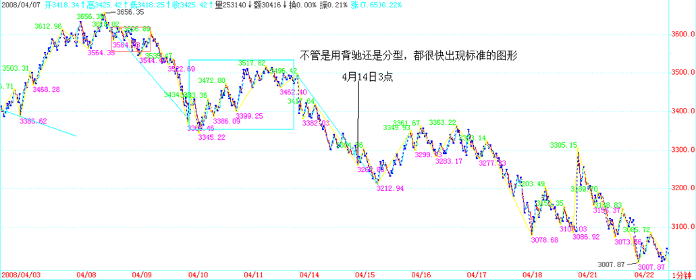

注意了，中线一定要看好地产板块，前几天本ID已经说了地产搞了一个多头陷阱，因此，这几天的大跌很正常，否则就不叫多头陷阱了，现在的关键是，地产是最早启动的，这次下来是第二买点的清洗，还是新一轮的下跌，对大盘具有极大的中线指引意义。当然，同样的包括金融股。

平安那破事一直不出来，对大盘就是一个大的压制，它不出来，大盘就不可能真正走起来，这点也是必须注意的。注意，短跑就是冲刺就完事，千万别搞成长跑。先下，再见。

如约反弹，3311点成短线关键(2008-04-15 15:14:35)

爽了没有？这扑面而来的感觉如何？

你看透市场以后，反弹不过就是一个419的约会。今天，昨天的预约如约而来，4根60分钟线，前三根构造分型，确认后，第四根突破分型上边，3311点成短线关键位置，一切就是本ID理论的活教材，你说有什么可说的？

注意，只要3311点回试站住，那么反弹继续，否则就结束，如此简单。

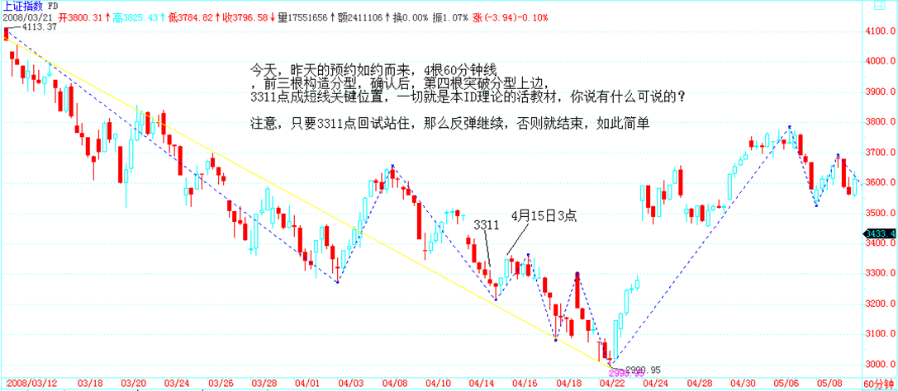

短跑的感觉如何？感觉是跑出来，干出来的。爽是需要真枪真刀来的。本ID这里没有花架子，只有白花花的银两通过技术抢劫回来。

个股方面，创投继续，券商由于可以直投，其实也已经是这个概念了。后面就看能不能轮动起来，房地产能不能止住来个大反弹。另外，新能源、环保、农业等是长线大题材，一定是有机会就会被折腾的。

个股只要能轮动起来，这反弹就能持续。至于中线大盘，过几天有心情再和各位分析，总之，已经在最后的空头陷阱中了。先下，再见。

CPI让多空有了再次较劲的理由(2008-04-16 15:15:02)

今天，大盘全天和CPI震荡较劲，而震荡的中心就是昨天说的短线关键位置3311点。而最终得到的数据，多空双方都能从中找当适合的说辞，空方自不必说了，而多方看到CPI月环比的回落，当然也有了说道的地方。

其实，最终怎么选择，一点都不重要，今晚，各大报纸、专家就会将这些数据分析烂了，但这对实际操作没用。

我们不当专家，我们只当赚家。面对这种围绕关键点位震荡，还没有决定方向的走势，最苯的方法当然就是等关键点位出现第三类卖点之后走，但这确实太无聊了。以前已经多次说过，这种操作其实十分简单，就是在震荡高位利用盘整背驰抛掉，下来不破位就回补，千万别浪费这震荡的短差机会。注意，这样必然是半仓操作，如果真破位，下来不回补就是，然后把半仓也扔了，这样效率最好。

当然，还有一种是最干脆的，就是震荡高位先走了，等真正重新站住关键位置出现第三类买点再介入，这是最安全又有效的作法，就不费心去预测最终是否站住了。

我们的操作，一定要用操作的眼光而不是争论的眼光，来市场是为了赚钱而不是为了表现自己的聪明。

明天，就看这3311点的第三类买卖点问题，如果你已经有正确的操作了，那这就没有任何操作问题了。

我们不较劲，等多空较劲完了，我们跟着胜利者走就是。先下，再见。

破底再给短线机会(2008-04-17 15:05:56)

3311站不住，自然就要破底，这没什么可说的，但这就又成就新一轮419，一个新的短线机会又到面前。

今天，有点脑子的资金都云集到某新股中抢东西，但这反而搞到盘子乱了。明天很关键，就看里面的各种势力会不会互相拆台了。

现在，破底并不是什么坏事，破底反弹再破底再反弹，节奏把握好了，一样赚钱。中线只能等基本面的明朗，不明朗，谁都没有当炮灰的兴趣。 其他没什么可说的，看图操作就是。先下，再见。

告示：以后的帖子可能极端没规律(2008-04-17 20:16:00)

现在这博客已经成为本ID最大的一个负担，本来想关闭一段时间，等把手头的事情忙完再重开。

但现在的人又那么多，关了，对不起太多人，虽然都不认识，也过意不去。

由于最近，家里出了很大的事情，作为成员，本ID必须负责，而这种负责不光是钱的问题，是要亲力亲为的，钱并不能办所有的事情。

所以，已经完全不可能正常写帖子，就象今天的帖子，本来一收盘就要走，为了写，最重要还不是浪费那点时间，而是被一件事情给束缚住了。

以后，解盘之类的不一定收盘就有，晚上回来有时间，尽量给出，太晚就算了。

这不正常的时间，估计至少要几个月时间。本ID也希望能尽快结束这样的情况，但很多事情，并不是一个人能决定的。先下，再见。

后市纯技术分析展望(2008-04-18 15:24:59)

今天是典型的逼宫行情，中石油破发，使得所有人觉得该干的事情给干了，但这种希望把管理层的政策弄出来的想法，显然有点太天真。

由于60分钟底分型没有被构造出来，所以短线出击的时间必须继续看图等待。

周末不想多说，把前面曾经承诺的中线分析给出，一早就写好，正好贴出来当周末礼物。

先下，再见。

最近大盘在本ID前期所指出的3424点上下反复震荡，持续了相当长的时间。由于目前的基本面完全不配合，因此有力度的行情一直不能真正走出来，只能维持一种弱市震荡的局面。这种震荡的局面，最终的结局无非两种，就是逐步震荡走强然后寻机向上突破，或者就是干脆再狠砸一个空头陷阱，快速下跌后进而再迅速回拉重新回到该震荡平台蓄势走强。无论市场最终采取何种选择，最终在根本意义上，不过都是要以目前的平台为基准展开新的行情。因此在这共同点上，反而说明了目前平台的技术意义。现在需要探讨的是，该平台最终确认后走出的行情的级别问题，因为，实质上，根据最严格的技术分析，还存在三种可能的走势变数。

上海指数，从6124点开始，共出现两个不同级别的有技术意义的反弹。第一级别是4778点到5524点的所谓跨年度行情，而第二级别是那次在年线附近进行争夺的走势，具体的范围是4196点到4695点。因此，这三种可能的变数就是：一、第二级别力度的反弹；二、第一级别力度的反弹；三、超第一级别力度的反弹。

显然，这三种反弹的力度是逐级加大的。最弱的就是第一种情况。由于从4695点开始的下跌到目前已经进入尾声，因此，其后至少要出现第一种的情况反弹。而在目前基本面上，国家对市场已经完全受制于所谓CPI情结，因此，资本市场本被当成最终牺牲品的可能性是极大的，一旦这种基本面继续成立，那么，大盘只出现第一种情况反弹的可能性就极大了。

也就是说，后面，我们首先可能只会迎来第一种情况的反弹，其后依然有进一步的下跌去制造新低的必要。而只有当那次新低制造后，大盘才可能出现第二或第三种情况的走势。至于这个新低的范围最终出现在2500点到2700点内甚至更低，都不是一件太奇怪的事情。

其实，以前已经明确说过，上海指数的走势完全可以参照深圳成分指数的历史走势。我们之所以能在去年提前指出6100点的大顶，除了上海指数本身的分析外，一个很重要的原因，就是因为深圳成分指数的历史走势在1996年到1997年就出现从刚破1000点到6100点的历史性走势，该走势与上海这次的走势吻合具有着极大的可能性，而事实上，这种吻合最终就变成了事实。

深圳成分指数的历史走势从6100点开始快速回落到3000点以下，和这次上海的走势又出现惊人的指示作用，因此，上海的走势最终跌破3000点，站在这种历史走势值得关注的对照上是完全合理的。

当然，历史走势的对照并不一定都完全成立，但从目前的情况看，最终成立的可能性越来越大。特别这次，和上次的情况在基本面上完全一样，上次是所谓的亚洲金融风暴，政府为应付之，只能把资本市场当成牺牲品。而这次的所谓的次级贷款，都是外围因素引发内部压力，最终的政策选择也是牺牲资本市场，所以，这一切，都成为很容易理解的事情了。

注意，目前理解当下的资本市场，一定要彻底明白政府最终抉择资本市场一定会被当成牺牲品的必然性，这种必然性在前面已经详细分析过了，这是理解当前资本市场的关键所在。

从目前的基本面看，出现第三种情况的可能性不大，而第二种可能性还是有的。上次，深圳通过两年的调整后才出现第三种情况的走势，如果你相信历史，那么，要出现第三种可能性的走势，怎么都要有1年的时间。

当然。分析在本质上涉及预测，并没有任何100%准确的可能，而实际的操作，一定要根据市场的最终选择进行，不能把分析与预测当成市场本身的走势，而后者才是操作所能真正依据的。

多头版“半夜鸡叫”闹剧收场(2008-04-21 15:09:38)

显然，周五的逼宫兵临3000点，给管理层足够的压力。但现在的管理层，有点葛朗台的味道。把自己兜里那点货都当宝贝了，总想用最小的代价把市场给打发了。因此，一个最没实质内容但又用“半夜鸡叫”模式过度包装的闹剧就此上演。

对此，本ID真是无话可说，各位大爷，为什么总是要低估市场的智慧？大爷们口袋里有什么货色，市场里的人用指甲都能算清楚，又扭捏什么呢？

不是市场不给管理层面子，而是太自以为是是必须受到嘲笑的。当然，由于管理层已经有点压力了，所以，不排除他们来点什么组合拳，因此，过度作空已经面临风险，向下的搏傻游戏也要开始小心。

市场玩的就是心理，不管对象是谁，看穿了对手自然上上下下操作自如。技术上，短线看，今天还折腾出一个小的底分型，能否成立就看3189点了。

操作是双面的，可以先买后卖，可以先卖后买，可以先卖后买再卖，关键是看图操作，不要凭自己的情绪。另外，盘面上一定要注意是否有领涨板块出现，没有这，就像今天，肯定没戏。先下，再见。

小分型顶起大反弹(2008-04-22 18:20:45)

注意，晚上本ID有重要公告，请留意。(癌症晚期确认公告)

今天，60分钟图上出现的小底分型顶出了一个大反弹，3085点的突破确认了分型的成立，后面就是回试能否站住最终形成向上笔的问题。

(注：下图标的3311的位置实为3085）

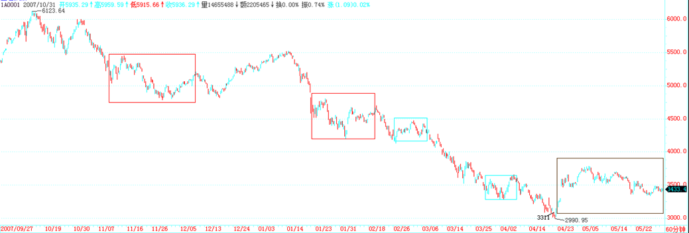

由于今天的涨幅都是最后一小时造成的，因此，明天早上就很关键了。最机械地就看3085点，而中线关键看3305点。

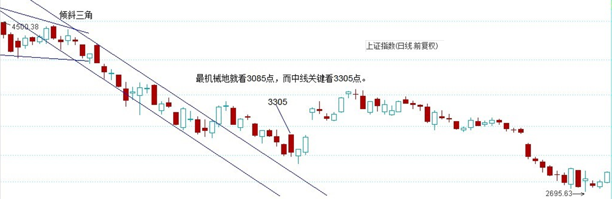

个股方面，金融股，包括银行证券继续走强，这证明长线资金依然坚定认为3300点下的空头陷阱性质，而现在很关键的就是房地产股了，如果能从前期的空头转为多头，则多头成功的几率就大了去了。

政策方面，今天把王大先生也给逼出来了，这次的逼宫行情，骗到了筹码，又把政策冲了冲，效果是显然的，但还是缺少干货，这才是行情迟迟不大动的关键。今天有事晚了，抱歉。先下，再见。

纯技术化的走势如期遭受3305点考验(2008-04-23 17:58:56)

昨天分析给出3085点与3305点，结果今天走势就在这两点演绎。早上对3085点的回试确认极端教科书，下午，最后半小时一直在3305点关前徘徊。

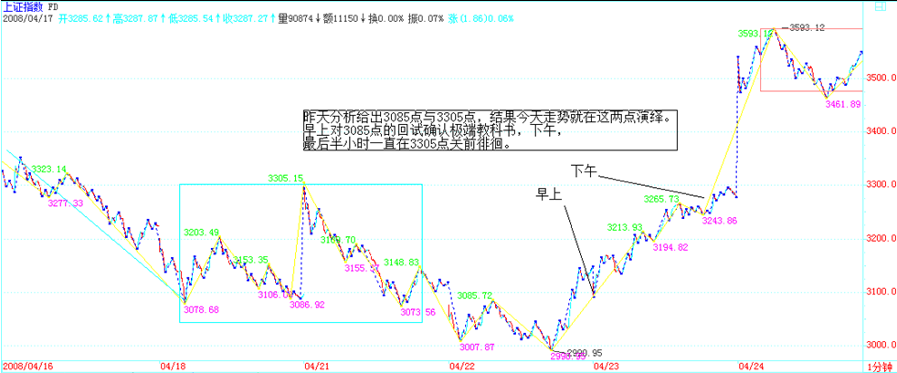

显然，突破3305点，那行情的性质将升级，而不破，那就要出现震荡，因此操作上以此为标准就很容易了。

个股现在普遍回暖，而有些板块已经逐步有中线强势特征，只要真有领头的，行情就有戏。太多就不谈了，看图操作。

大略看了各位昨天的留言，谢谢了，本ID会认真面对的，有空会把相应的事情一一记录，就如同一个股票的操作记录。先下，再见。

正常解盘只是没有值得不正常的(2008-04-23 19:54:24)

十分感谢各位的关心，人非草木，本ID当然能感受到各位的感情，毕竟，喜欢诗歌、音乐的人，本来就感情容易泛滥的。

本ID的病确实是千真万确的，这里没有任何开玩笑的成分，有拿这种事情开玩笑的吗？正因为如此，本ID一定会继续正常地进行解盘，因为，这是一个态度问题，本ID并不觉得多了这病事情就需要任何的不正常了。

本ID一定如同对待一次大规模的操作一样对待这病的操作，当然，操作就有失败的可能，唯一可以努力的，就是让失败远离。

十分高兴今天需要的干货终于出来了，本ID一直强调3300下就是空头陷阱，本来可以更详细的分析的，但最近确实没时间，但没有辜负各位，本ID就心安了。

本ID唯一希望就就各位最终都能独立行走于这凶险的市场，面对一切，就如同本ID现在平静地面对疾病一样。有空再写。

普涨后注意板块分化(2008-04-24 15:15:00)

干货的力量，今天全面呈现。市场不是没有资金，而是没有信心。信心来自干货，有了干货，就有了冲击的能量。

不过，任何事情都不能昏头。今天是普涨，所有前期压抑的发泄，因此，行情能否真正健康地展开，关键是其后的分化，强势领涨板块的继续走强，这才是长远之计。

前面说过，券商由于能直投，所以是真正的创投股票了，而这次减税，肯定对成交量有大的提升，这板块在前期提示后，依然值得关注，不过追高就没必要了，因为毕竟会有一次洗盘的过程。

另外，这次行情的性质，前面也说过，肯定大头的天下，一般的题材股，暂时只能小打小闹。所以一、二、三的节奏，大概会表现得比较明显。

注意领涨板块之间的轮动节奏，以及向二、三线的蔓延节奏。

当然，从纯操作的角度，我们不能一味看好，饭要一口口来，短线的关键位置在3656点，站住继续上，否则进入震荡。先下，再见。

3656点如期发挥神奇作用(2008-04-25 15:15:22)

大盘如此气势汹汹，结果还是在本ID一早提示的3656点（周分型上沿）上被迎头痛击而出现跳水，显然，大盘因此将进入震荡，该震荡平台如果最终只能出现第三类卖点，那么大盘甚至有再次探底的可能。

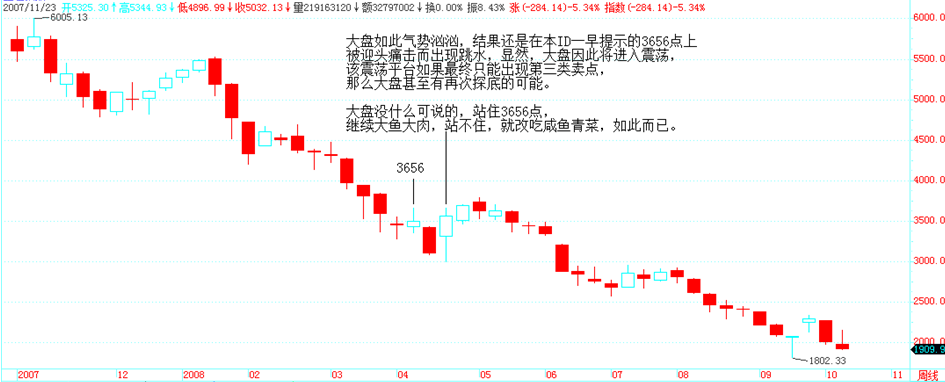

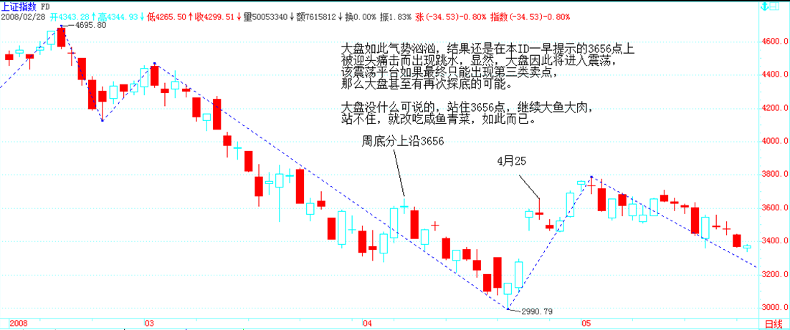

大盘没什么可说的，站住3656点，继续大鱼大肉，站不住，就改吃咸鱼青菜，如此而已。

证券板块继续如所说的强势，显然，这是领头的，只要该板块中线继续走强，那么问题就不大。短线会有震荡。

证券板块继续如所说的强势，显然，这是领头的，只要该板块中线继续走强，那么问题就不大。短线会有震荡。

个股如所说地出现分化，好好观察调整中有新资金介入的，一旦还有新一波，这就是黑马了。

3656点的神奇捍卫技术分析的尊严(2008-04-28 15:06:21)

很多一知半解的人，说什么技术分析没用，那么请问为什么本ID多次事先指出的位置都神奇地逆转了大盘？就象这次的3656点，事先给出，其神奇作用是在基本面强烈变动下发生的，结果怎么样？这两天的走势很无耻地很不给所有人面子地捍卫了技术分析的尊严。

很明确地说了，站住3656点，继续大鱼大肉，站不住，就改吃咸鱼青菜，所以，各位就开始吃咸鱼青菜了。什么时候才可能再大鱼大肉？很简单，等60分钟的向下笔完成。

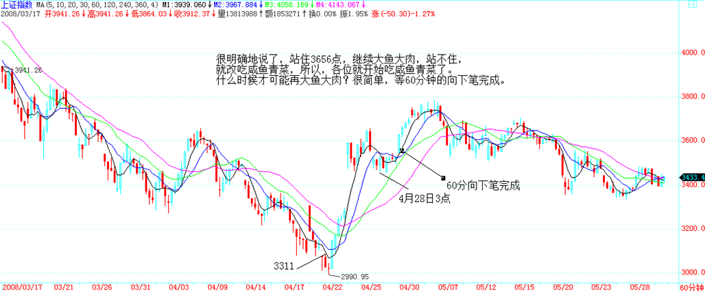

日线上，3656点使得一个向上笔完成了，要在继续延伸，关键还是要重新站住3656点，因此该点已经有了日线级别的技术意义。日线关键看5日线，只要能站住，回探就在可接受的范围内。

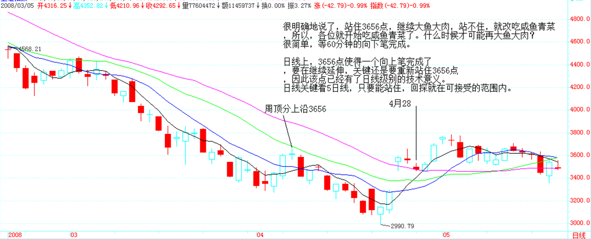

个股上，注意强势股回调时是否有资金承接而有第二波的机会，另外，调整时，老题材股会趁机活跃。

等一下，简单说说本ID病情的最终全面结果。先下，再见。

3656点的神奇捍卫技术分析的尊严(2008-04-28 15:06:21)

很多一知半解的人，说什么技术分析没用，那么请问为什么本ID多次事先指出的位置都神奇地逆转了大盘？就象这次的3656点，事先给出，其神奇作用是在基本面强烈变动下发生的，结果怎么样？这两天的走势很无耻地很不给所有人面子地捍卫了技术分析的尊严。

很明确地说了，站住3656点，继续大鱼大肉，站不住，就改吃咸鱼青菜，所以，各位就开始吃咸鱼青菜了。什么时候才可能再大鱼大肉？很简单，等60分钟的向下笔完成。

日线上，3656点使得一个向上笔完成了，要在继续延伸，关键还是要重新站住3656点，因此该点已经有了日线级别的技术意义。日线关键看5日线，只要能站住，回探就在可接受的范围内。

个股上，注意强势股回调时是否有资金承接而有第二波的机会，另外，调整时，老题材股会趁机活跃。

等一下，简单说说本ID病情的最终全面结果。先下，再见。

5日线支持产生震荡(2008-04-29 15:02:13)

在远离北京的过程中，无线上，只能快速说两句。北京对本ID的病是死地，算了算正向活地转移。3656点是大盘的抉择点位，其下的一切震荡本质上都没多大意义。

当然，如果5日线震荡失败，那么大盘将确立进入向下笔，调整压力将加大。

个股，强者恒强在证券中表现明显，所以一直强回调介入机会。但现在关键看大盘，如果调整加大，将注意相应风险。不能多说了。先下，再见。

3840点成中线关键(2008-04-30 15:17:52)

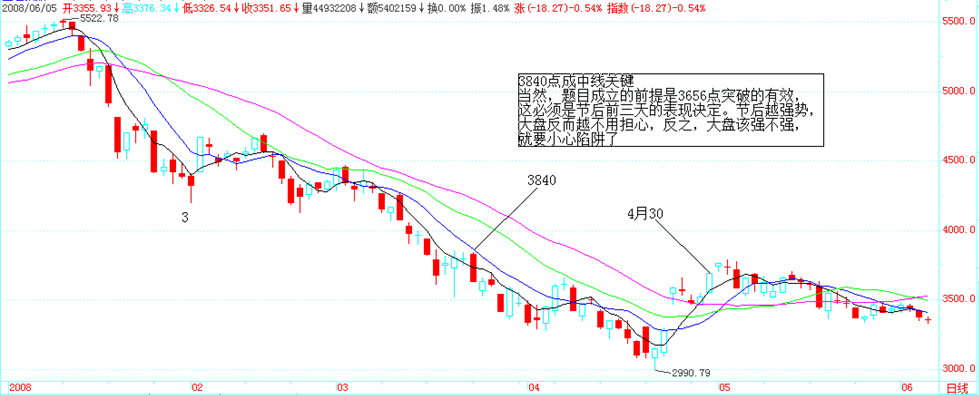

当然，题目成立的前提是3656点突破的有效，这必须是节后前三天的表现决定。节后越强势，大盘反而越不用担心，反之，大盘该强不强，就要小心陷阱了。

现在已经在全亚洲设备、水平最高的地方住下了，各位不用担心。先下，再见。

走势趋弱，小心震荡(2008-05-05 16:54:42)

今天，上攻力度明显趋弱，以板块补涨为主，所以，大的震荡风险已经开始积聚。3840点的中线意义已经早说，注意该点位上下表现。这两天连续检查，活检等真受了大苦，大概平时根本不来医院，少见多怪了。先下，再见。

大盘如期震荡(2008-05-06 13:25:02)

大盘如期震荡，没什么可说的。

今天结论出来了，大致是NP2（T4N M，4期）。

用姑息性治疗，5-FU、TAXOL、DDP组合先化疗。现在正商议中。

该强不强小心陷阱终被验证(2008-05-07 15:06:22)

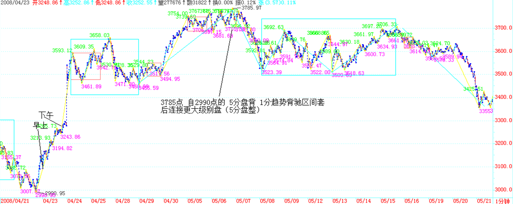

节前已强调，节后该强不强小心陷阱，而周一又再次提醒，因此今天的走势完全在预料之中.现在中线很简单，还是看3656点，强弱分水岭.站不住甚至不排除二次探底.

暂时，可以把操作先以3656点附近新中轴震荡打短差 .

明天开始，可能要开始一次化疗看看效果，这里有最好的针对化疗后果的特效药，因此可以试，也就6天时间，如果没大的效果，会换新的方式.

因此，后几天不一定有帖子.抱歉.

3656点上下的艰苦选择(2008-05-08 14:45:00)

3656上下的重要意义已经反复说，至于如何选择，根本没必要预测，只要保持如此市场节奏，那就3656点下跌不动就买，之上或附近涨不起就抛，不断短差。

市场好操作，但有些选择就很难，现在就碰到一个。紫杉醇（Taxol），最近在这医院竟然出来两次问题，一个10分钟就没了，连救都没时间。而用的都是最好的美国原装，所以就给5-FU、DDP、TAXOL的化疗组合的抉择带来极大困难。

这里的非系统风险太大。所以，还在抉择中。多谢医院能开诚布公，这才是最好医院的表现。先下，再见。

国朝三圣(2008-06-04 15:14:21)

前两天乌鸦嘴了一把，让各位注意布尔通道，小心最近先破位，现在，最坏的情况是走最后一跌，破3000而下，如果大盘足够肾水，那么也可能皆大欢喜一把，双底而起，后面就是如此这般了，散去吧。

该如何评价历史人物(2008-06-05 09:41:51)

昨天还说到股票的事情，本ID的观点十分明确，确实现在暂时没有跌破3000点的理由，而且，由于这次下探没有拉出长阴线，证明下跌力量不足，大盘有足够理由在缺口上方站住，直接回头向上。但是，有时候考虑问题，不一定要这么不留余地，特别是今年，中国历史有一个32年周期的小循环规律，而今年正是最多事的一年循环点，因此，今年那些神秘的、特没预兆的事情特别的多，谁敢保证，你下一秒不会出现些妖蛾子事，特别今年，一出就的全国性质的，世界比我们想象的神秘，多考虑点，没什么坏事。

21世纪依然担心言论自由的中国人是可耻的(2008-06-06 09:52:47)

请注意，以后解盘，没什么特别的，都放到当天文章里，免得像以前，打开博客满眼都是解盘，本ID不介意这里的人多少，草深三尺最好，但那些光知道股票，把本ID这里当成无聊的股票博客的，是走错地方了，光懂得股票的最终不过都是死路一条，来这里也是多余的。

另外，本ID对股票的评论，都是提点性质，并不承诺你什么。例如，本ID无数次说过，今年一定是短跑运动，如果你爱电梯，那谁都救不了你。本ID自己今年的操作，经常持一股票就两三天，到目前为止，持有时间最长的大概就是证券类的，这本ID强调过无数次了，但也是不断来回折腾类型，什么时候会傻拿着？

本ID每次反弹都把最后走的位置说好了，记得这次是多少点吗？3656！就算你没勇猛到3656上盘整顶背驰走，那么有效跌破3656点还不走，那能怪谁？现在大盘爱到多少点是多少点，反正缺口上能站稳，咱们就再进去折腾一把，站不稳，就让它见越南盾去吧！

如果来这里这里久，连这么简单的问题都搞不明白，那还是回火星比较安全，中国的股市好危险呀，火星安全点。

教你股票的课程会继续的，不过要等本ID有那兴趣的时候，本ID暂时兴趣不在那，因为，到了21世纪的今天，还有中国人为本ID的言论觉得太自由而担心，这么可耻的事情竟然还存在，本ID确实没有说股票的兴趣。

关于越南危机，中国责无旁贷该负起应有的大国责任！(2008-06-09 19:50:44)

中国是一个大国，大国就该有大国的样子，一个大国，无论出自什么目的，人道的、责任的、经济的，干出来的事情都应该有大国风范，否则，不仅会被黑社会的大哥大姐耻笑，更会被其他弱小的国家所逐渐抛弃，离心而去了。

由于地缘，一些国家之间自然就有天然的联系，弱小国家，最终都会被吸引到相应的大国周围，除非这大国特别变态，那只能舍u近求远，寻求其他非地缘性的依靠了。而这样的局面，最终只能损害大国本身。

当然，大国本身不一定与面积正相关，但相关程度很高，因为一个面积大的国家，如果没有一些基本的实力，很快就会自然分解，再加上外部的蚕食、分裂，很难以一种稳定的局面存在。这种实力，表面上是经济的，而最终是文化的。而大国的风范与气度，决定了该文化的风范与气度，一个小肚鸡肠的国家，是不可能有什么有力的文化的。而对其他国家的影响，道理是一样的，表面上是经济的，最终还是文化的。

因此，无论对内对外，国家的气度与风范，有着决定性的意义。

中国，担着不领头的遗训已经非大国地憋屈了很多年，但没有任何人的话是永恒的真理。世界永远在变化中，这遗训已经明显地过时了。如果说，现在中国还不应该在全世界领头，那么，在地域性的方面，如果还不领这个头，还很虚伪地告诉全世界，我们还很差、我们还是落后国家、我们不行的、我们只能自搞、不能见外人的，那么，这样不仅是虚伪，而且是无耻了。

套用一句出处很无耻但基本内容并不无耻的话：人不能这样无耻。国家，同样如此。本ID决不愿意看到自己的国家为了不领头而顶上这无耻的很馒头的帽子，而且这无耻的馒头帽子并不能保证国家经济等的安全，反而会加大其中的风险。

本ID在N年前曾专门写文章指出，中国国防现阶段的最大历史任务，就是让以后与中国相关的战争永远出现在国门之外，而与中国相关的经济、金融战争，道理是一样的，就是打就在国门外把炸弹都引爆了，国门是最后的防线，这是所有中国人应有的基本共识。

那么，这种局面是否有完全实现的可能。这是理所当然的，最简单的方法，就是要有多层的防御体系，而所有纵深体系，都要基本依靠与我们相关的邻国体系性地组成。而这就必然要求我们要领头，否则，你不是北斗星，别人凭什么要拱卫你？而拱卫的国家，其实拱卫就是他们基本的生存需要，正因为有了这种拱卫，这一组国家就会组成一个有机的体系，体系内的国家都极大地增强抵御外邪的能力。

要别人最终拱卫，首先就要有基本的大国风范，让事实来向大家宣告，你就是北极。而这次越南的危机，正好是一个机会，中国强大的外汇储备的很小部分，就足以应付所有问题，至少比让中投或其他败家子拿去贱卖乱搞强。出的资和力气，当然可以很合理地商议一个基本的回报，只要不给人以趁火打劫的感觉就可以，以国债的利率为基准给予一定优惠，就是一个很合理的价码。

大哥大姐，就要像大哥大姐，小弟小妹出问题了都不出头，这种人，只能让所有人鄙视。那么。大国呢？

今年诸多灾难与妖蛾子事的历史性解释(2008-06-10 16:40:36)

本ID一直等着股市大跌来写这篇文章，因为这样各位才印象深刻。特别在前面缺口位置，本ID指出要多考虑今年的特殊年份，一些看不出危险的时候，往往会有妖蛾子事潜伏其后，不少人贬本ID为迷信之类。本ID当时暂以世界比我们想象的要神秘作答，就等着这妖蛾子事出现来发这文章，说说这历史的神秘性。

这里首先把盘子解一下。在市场中，第一就要分清楚预测与操作的严重区别：预测是游戏，是茶余饭后的谈资；而操作是真刀真枪去干，是血与火的斗争。绝对的预测归根结底都是笑话，而非绝对的操作归根结底是死路一条。像这次，绝对的操作是怎么样，本ID早已反复说明：3656点站不住走，3300缺口位置不回补可以回补筹码再短差一把，否则就让大盘越南盾去。这里，整个操作的设计是没有任何不确定的地方，都是绝对性的，这才能股票股票而不是被股票股票，而任何预测都只能永远在被股票股票的死路上轮回。

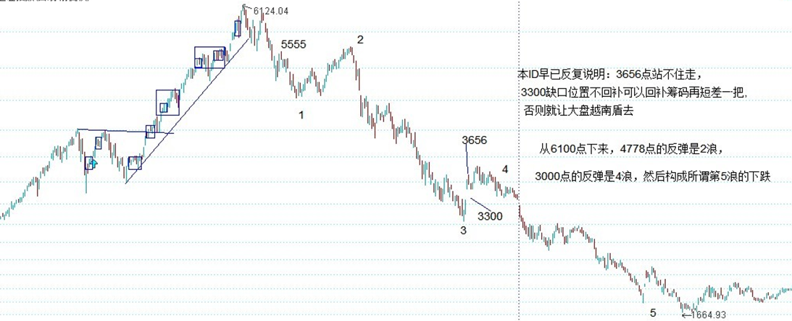

以上的话，反反复复说过无数次了，但如果不成为自己的自然反应，直接烙到骨髓心窝，是没用的，一定会经常犯糊涂。

那么，现在的操作就极端简单了，一个短线的机会在这轮下跌的背弛点上，然后必须看反弹是否能回补今天缺口，只要不能，一定要走掉，因为必然会有再次的下探去构成更好的机会；反之，如果能回补，就看回补后构成的中枢的第三类买卖点情况。这样的操作安排，完全是绝对性的，没有任何含糊的地方，如果你看不懂，觉得很迷糊，就请虚心把课程好好学，里面都有最数学化的精确定义。

至于茶余饭后的预测性谈资，本ID也早就给出，就是一直强调的深圳成分指数的历史性轮回现象。本ID去年一大早就指出，上海指数很可能完全照抄上次深圳的整个走势，从6100点的高点到其后的回跌形态与结束位置，这个预测，早就给出，这也是本ID为什么说3000点的这个反弹很可能后还有最后一跌的一个很重要的理由。如果一定要套用各位更熟悉的所谓波浪理论，那么从6100点下来，4778点的反弹是2浪，3000点的反弹是4浪，然后构成所谓第5浪的下跌，当然，波浪理论是很不精确的东西，这里只是因为各位可能更熟悉其中的语言，借题发挥一下。

而世界的神秘性使得历史出现比上面这种沪深轮回更值得关注的循环现象，今年就是其中32年的循环点，历史的神秘性再次无情地呈现。

首先看看这个历史年份序列：1912、1944、1976、2008。这序列所在年份，都是妖蛾子事情频出，令人极端不安的。大家最熟悉的一定是1976年，三大头的连续离去，大地震等等。不过这些年份过后的第二年，都是中华民族历史上值得关注的历史时刻，1913年的第二次护法以及后面短时间的战争，使得封建复辟的最后希望破灭，中国逐步走向一个全新时代；1945年抗战胜利以及短时间的内战后，国朝成立，中国走向彻底复兴之路；1977年，一个新的时代的开始，经过短时间的思想斗争，1979年终于在国家层面确立了这种改变，使得中华民族在复兴路上一往无前。

各位，应该看到这历史序列后一个统一的规律，就是一个极端恶劣的年份后，迎来一个历史性的转折，而这个转折的最后确立，都需要几年的反复过程，历史1913年后的一系列混战，1945年后的国内战争，1977年后的思想斗争等等，因此，在新的32年周期后，我们有理由预测，2009年是一个历史性的转折点，其后会有一个几年的反复过程，最终方向确立，历史的车轮继续飞旋。

那么，这漫长的2008年，绝对不排除还有很32年周期的事情发生，甚至超越了我们目前的想象，所以在这一年，多想多准备，是一定不会错的。把事情想得细点，把各种可能的因素考虑周全点，这在如此的年份尤其重要。

2008年的第一要务是生存，只有生存才能看到后面光明的转折，死在黎明前那是最悲惨不过的。去年开始，本ID一直在说，今年一定要小心井。当然，往下的井后，就会有相应的机会，例如这次最后一跌后，就至少有一个重回这次印花税反弹高点的行情机会，只要按图操作，这个机会一点都不难把握。但总的方面，今年并不是一个大兴土木的年份，把自己的一分三亩深耕细种，才会有好的收成，才不会倾家荡产而去。

这里再顺带说说，至于有人反对援手越南，说越南是反骨仔，这是绝对地把国家利益的机械化操作与道德评价彻底混淆的想法，国家安全的拱卫式系统构建与里面的构成元素是否有反骨仔无关，是一个纯粹的机械化系统工程，具体的问题，以后有专门的帖子。

救越南无需一兵一钱(2008-06-11 16:25:48)

先说大盘，今天的大盘走出一个小型中枢，由于没破底，因此这种盘整的能量有限，若能走出小的第三类买点，则有向昨天缺口方向攻击的进一步行动，否则将转化为大跌后的休整式盘整，后面还有进一步探底。即使是前面好的情况，由于昨天长阴杀伤过强，人心浮动，如果没有大的消息配合，最终将无功而返，再考验3000点。

大盘要真正找到一个有效的支持，必须在周线上构造出一个标准的底分型，否则继续下探甚至大面积下探的风险将难以解除，而月线、季度线上，同样存在类似问题，中长线走势的压力，看看这几个周期的图形就一目了然。

当然，短线可以看日线分型的构成情况，一旦出现将有短线一定力度的反抽，如果特别心急的就看30或60分钟，太短的就算了。个股方面，都要以短跑为主，现在的情况下，没有什么股票值得长期拥有的，本ID前面早说过，自己今年经常持一只股票就两三天，今年一定要多多419，少想天长地久。因为今年的股票都是追命僵尸，一长一久就要尸变吃人血的。

而越南问题不解决好，美国这僵尸就会来中国继续尸变，这么简单的问题就不用再多说了。

由于以前的外援，经常勒腰带、打肿脸而成，所以一说起外援，很多人都很反感。但那是脑子有水的年代制造出来的无聊外援模式，现在这个年代，我们的外援的最高目的与衡量标准，就是是否完全满足自身的短、中、长期利益，以自身利益为出发点，然后再兼顾各方的利益与实际情况，形成一套系统的操作程序。

如果说，以前的外援是意识形态的狂热，那么现在的外援不过是为保护国家利益的一种有针对性的系统操作，超越一切道德与意识形态的束缚，一切以最终的效果为准。至于被援助方是否反骨，这并无所谓。因为该有的利益在操作中已经达到，如果你的操作设计不能满足这一点，就不要操作，如此而已。

具体到这一次，如果让本ID来，根本就不需要一兵一钱就可以摆平越南问题。因为越南有一个天然的优势，就是该国是全世界第二大的粮食出口国，一个国家，只要粮食充足，就闹不出太大的事，最怕就是连饭都吃不上。此外，从越南的股市走势就知道，目前越南大概相当于中国1993年前后的情形，这种局面的处理，有太多的办法。

解决越南问题，最关键就是四个字：“兵不厌诈”，如果本ID操作，根本不需要什么正面的对攻，那太无聊费劲，太具体的措施，本ID不会说，这是秘密的事情，怎么可能公开说？但有一点可以提示的，就是永远不按美国人的牌理出牌，我的地盘我做主，规则我来定，不服气就磨墙去。

现在，救越南的舆论是必须要做的，必须从网络开始迅速向外扩展，形成一种压力。而且这种舆论还不能因为后面越南出现的暂时好转而停止，因为我们的目的并不是这次，而是要长远打算。

不谋长远谋一时，那就等着被人教训、让僵尸吸血吧。

解盘、治癌及周末与下周本ID动态预告(2008-06-12 15:23:31)

至于股票的运行，在本ID的理论观照下同样是很科学的，该怎么样就怎么样，没有任何含糊的地方。这几天一直没有出现有力度的反弹，而只要你看看30分钟以上图的MACD，就知道这是理所当然的，因为真正大点级别的背驰根本没出现，60分钟上甚至连背驰段都说不上，这样怎么可能有大的反抽？

后面具体的走势，如果你真喜欢预测闹着玩，那也很容易，从3786点下来这最后一跌，显然要走出至少两个中枢，否则这还是前面中枢的震荡，这就还不是最后一跌了。那么。现在在3300点上有一个中枢了，因此，这一轮下跌要完成，最标准的走法，就是先反弹出第二个中枢，这个中枢的波动区间基本没可能回补缺口，然后再一次破位，形成真正的背驰。

当然，上面说的是两中枢的标准下跌情况，如果外围因素恶劣，出现多中枢的下跌，这也是理论所保证的，关键看第二中枢第三类卖点后是否真正背驰，这在当下很容易判别。至于还有不破位，直接小级别转大级别的情况，那是第二中枢出现第三类买点的情况，这种不常见的情况万一出现，都在理论的可观察范围内，所以还是充分把握的。

以上说明，如果有任何看不明白的，请虚心去读书，亏钱是自己的，看不看也是自己的，最后的本事也是自己的，就自己看着办吧。

-------------------

虽然理论是本ID个人发现发明的，但本ID的理念从来都是知识是全人类的，个人不应当藏着掖着，所以本ID把理论逐步公开，只是为了知识是全人类这个信念，和任何的同情或怜悯无关，因此学习得益的也不需要感谢本ID，就像你学会了平面几何，也不需要去感谢欧几里德。至于有人要千方百计去证明平面几何的错误，那也是无所谓的，这总比打麻将和傻忽忽跑到股市中亏钱强，对本ID的理论也是一样的。

至于有人问到癌症的治疗，大概是看到本ID的治疗效果特别好。但这里必须指出，佛教说的是因缘和合，本ID有此因缘，并不是一事一药而成，而是诸多因数和合而成，而且现在本ID并没有完全根治，所以并不能说明以前的效果就真的有效。

但本ID可以指出，一旦这次本ID按自己的思路彻底根治，那么本ID就完全有把握说已经彻底了解了什么是癌症以及相应的治疗方法。癌症其实根本不是什么绝症，最后成为绝症，都是不正确的观点与方法造成的，本ID一旦自己真正根治，就完全有把握像治疗感冒一样治疗癌症。

癌症甚至不是中医所说的痰热郁结之类的东西，那只是表面现象，癌症比所有人想象的都要简单，具体的事情，等机缘成熟，本ID自然和盘托出，本ID没有藏私的习惯。

不过，在公开之前最大的难题，可能不是本ID自己的根治，而是本ID要想办法彻底去学习一门秦朝就失传的技术，因为现在本ID是理论和眼界极高，超越了现在的所有中西医的看法，而且已经被自己的实践所证明，但由于没有精通那门技术，本ID如果想具体去看一个人，就不能准确说出精确位置的病根，只能大概地给一个轮廓，然后让这人找什么什么，大概按什么什么来治疗，这样就没大劲了。

这技术现在会的只有一个人，本ID有缘和这人相识，但这家伙，老说要把这东西带到棺材，本ID这次病好了，一定要动用一切手段把这唯一流传的好东西抢救下来，本ID有知识是全人类的理念，但这家伙只觉得这是他们家族的一脉单传，他现在的后代，没一个能学的，所以就入棺材算了，人的观点分歧如是，确实很棘手，不过本ID一定会努力的。

其实，本ID根本不需要这人把所有的东西教一遍，只要最关键的地方一点，凭本ID对中医的透彻，这技术的改进版都有可能发明出来，是否有这个缘分，决定了以后本ID是否能救治更多的人，希望事随人愿。

由于医生和本ID自己都认为，北京的天气以及饮食习惯很容易引起本ID的病情复发，所以决定这两三年暂时以这边为主要落脚点，因此要购置房子安顿下来，所以周末要去看楼买房子。

说实话，站在本ID私人角度，本ID是彻底欢迎一个大的亚洲金融风暴，至少本ID这次就可以买到比现在便宜一半的房子，而且本ID一直仓位极轻，基本就是空仓，所以本ID并不介意出现一千几百点的位置，想想那时候，60元走的中铝6元买回来，病都马上要好了。但是，站在国家利益的角度，站在全民利益的角度，肯定不能这样的，而现在本ID的所为，其实是损害私人利益的，但这并不是本ID所介意的。

本ID如今在经济上早已无所求，关键是不想看到国家和国民受外国人欺负，这次大病，又有几个人原形毕露，因此与这些人的所有经济业务，都会在本ID病好后彻底了结，本ID在这边，看到这里的金融意识还很差，完全和城市本身不配套，因此有可能在私人股权投资方面点一把火，也算留点火种在这边。

下周，极大可能再化疗一次，其实这次化疗完全没必要，但在这里住了这么久，不治疗一下，连这里的医生都会怀疑这家伙是不是真得癌症了，而且说好量改小，三天水疗后全部口服，这种形式没试过，不妨再玩一次。

而本ID彻底根治，需要有一个治疗的中医手段，发动关系，找到中国南北最厉害的两个人，但都80多了，因此，只能再物色，这些传统的中医手段，失传太快了，有缘遇到，一定要学习过来，否则一旦失去，简直是人类的灾难。

至于现在那些用些中医名词、说点小经络小穴位去卖书的，离真正的中医还远着，茶余饭后忽悠一下没问题，真正的好东西可不在那里。

真诚与谦虚才不会有眼无珠(2008-06-13 16:11:04)

先说大盘，其实该说的前几天都早说了，唯一可以补充的是2524点是6124下来的3600点，附近应该有强力的中线支持，如果6124点下来的第一段跌幅和这次的最后一跌相等，那么1345点的下跌位置大概就在2430点附近，因此，中线的强支持在2500点一带，是否最终跌到这个位置并不重要，关键是昨天说的下跌节奏，下周的首要任务，就是形成这轮下跌的第二中枢，否则，一切免谈。

操作是一种精细的活，那些囫囵吞枣之辈肯定没戏。直到今天，竟然还有人自以为是地拿着自己所理解的所谓“走势必完美”来这里献丑，请好好把课程都先学一遍，看看本ID说的究竟是什么意思，里面有好几个课程专门说这个问题，可惜和这些人理解的无关。

中国的楼市大概真要崩一次盘了(2008-06-16 12:49:59)

周末两天，大肆看房，把城里可看的盘基本都蜻蜓点水了一遍，以后就重点要去有点兴趣的盘子里仔细考察了。这点水不重要，不过确实发现大问题。本ID已经N年没去买房子了，对房子的问题没什么切身感受，这次一走，感受颇深，大概这中国楼市真要劫数难逃了。

看房这两天，在所有的盘子里，基本就没别人看，而且卖房的很容易就给出较大的折扣，本ID去看房的时候怎么说都是周末，按这城市在全国房地产的超前地位以及极高的市场经济活跃度，出现这种现象都是不正常的。这城市，以前惯常是一个楼盘刚开始，就可以第一天卖几百上千套，回几亿甚至十几亿的钱，现在，本ID看这城市每天的销售统计，每天成交几套的盘子，都可以排前几名了。

过一两个月，大概形势会更明朗，特别奥运会之后，连最后的题材都见光死后，大概这楼市才会真正迎来困难的时候。不过本ID是自住，主要是找围绕这城市CBD的盘子，入住时间合适就可以，现在看好的，最早是8月1日入住，晚的有11月底，有马上就可以交房的，但要自己装修，本ID最怕这东西，这东西交给别人是绝对不放心，毕竟自己要每天住着，如果有什么不满意的地方，天天恶心着忒没劲，所以一定要自己来。但自己来，真没这时间。以前买房子，很多都是直接就把样板房买了，这次看这边的水平还比较高，普遍装修的风格都很合本ID胃口，而现在是轻装修重装饰的年代，本ID这次准备在装饰上费点工夫，这样时间比较省。但效果还是要好，毕竟要住几年时间，而且还要预防再复发，一个好的日常生活环境还是很重要的。

有人好象对本ID上一篇问各位找什么人写序跋很有意见，其实，本ID之所以问各位，是把各位当家里人了，例如上面说这些装修的事情，也完全是以家里人的口吻说的，当然，如果有人觉得一定要把本ID捧得高高在上才舒服，那本ID也没意见。对真心的朋友，本ID从来以亲人对待，有事就可以商量。

生活是平凡的，吃了饭就去洗碗，就这么简单，企图在这里显露点什么么，只能是自暴其短。至于一些人一定要表现自己如何愤怒官僚，要把当官的都一棍子打死，本ID也没意见。在本ID眼里，没有这么多无聊的事情，人只是人，任何人都是首先作为个体存在，本ID只关心这个个体本身，而个体，没有切身的接触，就凭是否官了就一棍子下去，除了暴露其狭隘，还能说明什么呢？

很感谢其中的一些建议，例如，可以把书名题字与序跋分开人完成，这样就可以找三个人了。本ID的东西不需要任何人去高抬，而且没有任何东西在历史上是能最终被高抬的。这书就如同一个晚会，如果有些特别的客人，总能让这晚会更有意思，如此而已。

至于这股市，该说的上周末已经说了，就好好操作这次小反弹，并为最后一跌的最终完成做好一切相应的准备。不过，一定要注意，由于6124点下来的第一段已经一定是下跌类型而不是一个中枢的盘整类型，因此，这最后一跌后的反弹也很难有太出色的表现，后面还有极大机会去面临一个更恐怖的锯齿型第二段的下跌，该怎么处理，各位就根据自己能力来设计了。

扯皮给了快速说两句的机会(2008-06-17 10:10:03)

两个科正扯皮究竟让本ID化疗期间住什么地方，他们扯他们的，我们说我们的。

注意，那些龟蟹鱼鳖虾们，千万别自作多情，对你们本ID永远是金刚怒目，永远把你们当成仇敌。而对亲人，本ID当然要菩萨低眉。昨天，本ID和亲人说点悄悄话，这些无耻的龟蟹鱼鳖虾们竟然也在偷听，原来你们领钱执行任务时还有这一项目？自渎去吧。

至于股市，2917点是第一关，如果这都过不去，那么继续探底是不可避免的。过去了，才会有最后一跌第二中枢成立的可能，至于2976点，则决定整个反弹的力度，概念十分清楚，好自为之。估计那皮也快扯完了，本ID也要下了，再见。

阉割(2008-06-23 18:52:18)

股市没什么可说的，具体的判断已经多次说明，这里不妨再说一次：中线已经进入6124点下来大调整的最后阶段，当然也是最惨烈、最杀人的阶段，否则怎么会有大的反弹？短线，3700点上下来的下跌进入第二中枢的震荡，一旦出现背驰将宣告调整结束进而展开对6124点大调整的总修正过程，也就是一个超级大反弹。但必须指出，这个超级大反弹的高度并不一定令人满意，因为其形态一旦走出三角形，那么第一段的向上就是最大的幅度了，最坏的情况下，上次3300点上的第一中枢就足以阻挡这个三角形的进一步向上拓展。这种以时间换空间的反弹当然是最坏的，却是不得不注意的，因为大跌后出现三角形的几率，在中线较大周期从来都不是罕见的。

王先生，能虚竹否？(2008-06-24 17:25:15)

显然，这题目很蠢很无聊，如果还同时说今天本没什么可说的股市，就更蠢更无聊了。因此，还是让我们蠢得专一、无聊得专注，今天就好好八卦一下王先生。

说实在，由于年龄代沟的关系，本ID对王先生没有任何直观性的了解，而王先生又是一个惯于神龙一现然后就潜龙勿用的人，就更难知其真了。其核心圈子里，本ID大概与一位只喝二锅头的老大叔有点交往外，就没有任何的相关，之所以一直对王先生有兴趣，只源于一位与之同龄，从小就与之认识的朋友的一句话，他说他和王先生路子不对。注意，这路子的评价，说的可是40年前的事情了，而人的路子，特别是深层次的路子，大概是一生难改的。这样的回答，当然让本ID有所兴趣了，毕竟，本ID认识的朋友也不是等闲之辈，而该朋友的路子是什么，本ID又如此明了，而本ID又恰好在N年前就看出王先生潜龙勿用工夫的了得，因此，王先生的路子对中国的最终影响，一直是本ID所关注的。

如本ID所预料，大概也如王先生所设计的，这能影响中国的位置，已经被王先生所现实，因此，王先生就更成了本ID关注的对象。

当然，这种预料设计往往最终都很不靠谱。10年前，有一次和某国最大集团的亚洲区总裁一起从上海飞北京，在飞机上，聊到今后N年能影响中国进展的人，他说他们经过仔细研究，找了20位，结果现在看来，大多不靠谱，至少王先生就没在其上。

至于和朋友路子不对而关注的人，可能恰好是废物点心。这里的人大概还关心为什么本ID曾关心过孔男人的事情，其实，原因很简单，因为北大某大教授，年纪也不小了，也是本ID的忘年朋友，有次在我们共同朋友的N婚宴会上，我们刚好坐一起，不知道为什么他突然提到孔男人，然后破口大骂，这一骂就骂出本ID的好奇心，所以才回来折腾了一下孔男人。结果发现竟然是如此货色，本ID真为那朋友不值，以他的学问与见识，N万个孔男人都不值得提，何必如此呢？连菩萨都有入胎之迷，人，多高的学问、修养，大概也有犯糊涂的时候。

当然，N亿万的孔男人也够不上一个王先生，本ID是资本圈子里打滚的人，理所当然只挑有价值的八卦，所以还是继续把时间耗费在对王先生的八卦上。

最近，金融资本圈子里被王先生的投石问路搞出点涟漪，本ID现在是病人，最近和京洛圈子少有联系，本不该饶舌这些事情，但事情出来后，按不住八卦心理，给一些敏感电话打了几个，竟然都关了机，这些人好象和那些事情都不该有什么直接的关系，大概是都觉得风声有点不对，关机了事了，至少不会被如本ID般八卦的人烦，这些人也知道，一接上如本ID这般八卦的人的电话，不被刨根问底地耗上不少电话时间是不可能的，一天来N个，大概早被烦死。

本ID可乐见王先生来真家伙，修理一下那些不懂规矩肆意妄为的家伙，这些家伙，除了为了一己私利，还有什么？北大因此蒙羞是小事，而且，这种事情当然不应该光针对北大的圈子而来，否则，王先生就有玩火的嫌疑。那些什么系什么系的，如果真来真家伙，这次就一次把这些土洋军阀给清了，当然，王先生也知道土洋军阀曾干过什么曾摆平过什么，如何下棋，大概又是一番算计。

但王先生，能虚竹否？真正的死局，大概也只能虚竹一把才能解开，世上会算计的人多了去了，但能否虚竹一把，反而成了是否成事的关键。

不过，世间的事情，不是小说，最滑稽的大概就是虚竹一把而成了乔峰，这样的结局，当然不会是王先生以及看好王先生的人所乐于见到的。如果这样，还不如段誉下去算了，那多滋润啊。

以上的八卦话，很蠢很无聊，王先生如果不看武侠小说的，那这话题就更蠢更无聊了。王先生就是王先生，能否最终把自己的色彩中国一把，王先生大概已经王先生了，那我们也就王先生一把，带上小板凳，王先生吧。

忍着没去桌球，赶回来写帖子。(2008-07-01 22:56:39)

虽然本ID对各位并没有任何的责任与承诺，但这么多日子，毕竟有了感情。说实在，本ID现在应该和朋友在玩桌球的，想着如果今天没有帖子不太好，就匆忙赶回来了。

在医院，没有事干，写帖子的动力比较强。出来了，到处都有好摆弄的东西，本ID爱好又多，但本ID会尽量坚持写帖子的，虽然这样对本ID本身伤害比较大，但这也认了。

大概还有很多人关心市场的走势，其实现在市场的走势，在N周前已经明确说过，而市场也一直按部就班走着。如果不明白的，就多看看课程，就知道什么是第二中枢后再走背驰这种走势为什么是最标准的，现在，这种最标准的走势就如同教科书一样走着，看过本ID课程，都应该对这种按部就班的走势有所了解，所以本ID确实没有太多可说的。

当然，从最严密的分析角度，大盘当然有可能走第三中枢，但这个前提就是这次按部就班的破底不能形成标准的区间套背驰，而这，只要看过本ID课程的，都应该能当下轻松判断，不构成任何的操作困难。

这里，必须把理论上严密确认的最后一跌后最小的反弹幅度事先指出：按照本ID的理论，一旦这次的下跌最终完成，针对6124点下来的最低反弹理论确保幅度是必然回到2990点之上，换言之，只要这反弹以相应级别回到过2990点之上，那么，继续下跌下去，都是理论所允许的。

注意，由于这里文科生理科生太多，对理论的严密性与实践中的经验性分别不清楚，因此本ID必须严重指出，除了上面的理论严密下的2990点的100%确保幅度，还有一个实践中的经验性幅度，就是整个下跌的1/3，这肯定不是100%保证的东西，但实践中确认，一般都有90%以上的准确性，因此，这个幅度，就是一个参考性的幅度，所以，本ID前面说，这个反弹基本可以回到3700点上，但这是在经验性的角度说的，而在本ID理论的确保性上说，只能说是2990点。

本ID的理论就是几何性的，有100%的严密性，因此，上面的分别一定要清晰，否则就白学了。而在具体的操作中，是在2990点还是3700点，或者更高的位置再结束反弹，那是由最终反弹走势的内部结构决定的，而前面中枢对应的中枢角度构成双重独立的判断角度，这两个不同的角度，就构成了一个双确认的理论保证，如同一个联立方程，理论确认的可能结果就只有极少甚至唯一的可能。

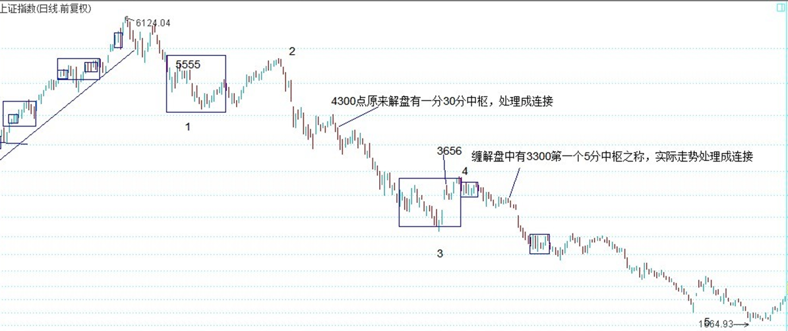

对于看不明白本ID理论或操作熟练程度有问题的人，本ID已经给出了两条路子：小板凳或主动买套并顺势降低成本。目前的大盘的中线判断，本ID已经多次说过，从3700点上开始的这一段下跌就是6124点下来的最后一个下跌（注意，这不是理论100%确保的，因为可以有大的第三中枢，但根据基本面与其他判断，基本可以否定这种情况，用最严密的理论语言，这是一种有99%把握的判断）。因此，主动买套的操作在这个最后一个下跌的内部结构出现第二中枢后，已经十分现实，特别对于大资金，是必须的。

现在主动买套，唯一的风险就是两个：6124点下来的下跌出现第三中枢、3700点上下来的这次下跌出现第三中枢。无论是哪种情况，主动买套的实际风险其实都没有，因为买套是分批的，而且每天的波动都有足够空间去降低成本，更重要的是，无论哪一种第三中枢，都意味着相应力度的反弹，因此有足够的退出余地。

因此，本ID再次用最明确的语言宣告，针对那些对精确应用本ID理论有困难的人，现在已经进入必须主动买套的阶段，特别资金量比较大的，一定要开始分批进入，选择那些已经从高位回落80%而基本面没有出现重大改变的，例如，本ID可以明确告诉各位，在中国铝业跌破12元前后，本ID就开始回补60元上下抛掉的股票，当然，本ID的筹码是不断运动降低成本的，但操作的方式是公开性的。类似的，如600737，来这里的人都知道本ID曾严重拥有，30多元回跌到15元下了，本ID当然没有不回补的理由。

严重声明，本ID之所以回补这些股票，只是本ID比较懒，只爱反复操作曾经操作的股票，只要这些股票基本面依然可以操作。而有更多比中国铝业、6007373更好的股票，各位可以自己去发现，没必要一定要和本ID扎堆，一扎堆，股票就跑不高，这是必然的。

不说股票了，股票这么简单的东西，浪费本ID珍贵的玩乐时间，简直是罪过。本ID在医院憋屈了这么长时间，放肆几天是天经地义的，至于有人对本ID去夜总会有意见，似乎说论语的人就不应该去夜总会，这是脑子有水的想法。

大菩萨，显不同身，在鸡鸭鹅兔，一样有大菩萨在行菩萨行，谁告诉你夜总会里就没有大菩萨？以无聊的分别心去测度无边之佛法，这种人，就让他们去吧，本ID懒得管他们。

如果你只能去天堂而不能下地狱，那就不要谈什么佛法了，没有十地菩萨的修行，你还当不了大魔王，连魔你都魔不了，还想成佛？磨墙去吧。

二元经济结构，中国经济的核心竞争力(2008-07-02 15:35:56)

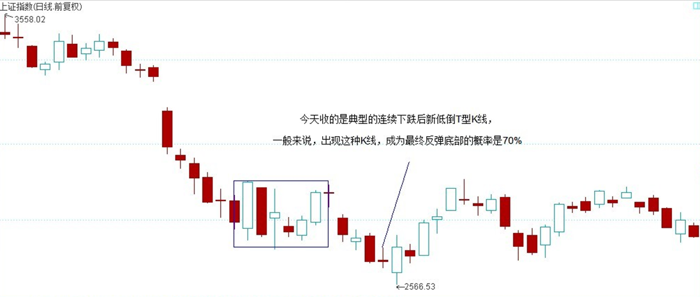

至于今天的大盘，没什么可说的。如果你对技术有点兴趣，本ID可以多说一点，就是今天收的是典型的连续下跌后新低倒T型K线，上次出现这种K线是2007年的12月18日，其后就是6124点下来的第一轮反弹的继续。一般来说，出现这种K线，成为最终反弹底部的概率是70%，这次和上次唯一不同是上次是二次探底中产生的。如果有兴趣的，可以收集一下指数在历史走势中出现这种K线后的走势，对这种技术形态的认识就会深刻点了。 注意，以上的K线方法都是一些经验性的东西，和本ID的理论没什么关系，但可以辅助性应用。一般这种应用就如同一个联立方程解出极少的解，再利用这些辅助性工具，决定其中最大概率的解。但在实际操作中，关键还是要根据当下走势去判别，而不能先入为主地蒙蔽了自己的眼睛。 

至于主动买套的操作，例如今天冲高出现小级别盘整背驰就可以用部分筹码做空，然后回来有差价，就把所有的重新买回来，这样，筹码就会不断增加，当然，如果筹码已经足够多，就可以保持数量不变，只回补固定的筹码。这种操作的原则就是，利用震荡把成本降下来，如果要熟练操作，就要好好研究本ID课程里关于一天8根30分钟线如何构成不同走势形态的章节，里面说得十分清楚，就不多说了。

何谓二元经济结构(后部分内容少儿与外星人不宜)(2008-07-04 16:04:21)

先说股票，今天的低开虽然让昨天的倒T不太标准，但最终的结果是类似的，只是由于今天与昨天构成包含关系，所以使得本来可以标准生成的底分型需要等待明天去构成。目前关键的位置分别是2753、2945、3483(注：依次为日周月的分型上沿），分别构成短中长的关键所在。下周初前，首先要确认的是2753点这个位置，一旦这个位置不能有效攻克，短线技术好的就要短差一把，因为再次探底不可避免。主动买套的，也可以利用这降低成本。当然，如果能有效攻克，那一轮较大级别的反弹就此确认，接着就看2945点的位置，这个位置后是缺口处，然后才是3483点。这一切，都是按部就班进行的，不能超越阶段。

人类共业下的真理及证明（一）(2008-07-08 08:43:12)

今天下午，有N个楼盘需要去看，一收盘车子就过来接，所以写不了帖子，只能一大早起来先把任务完成，也是为了兑现诺言。

之所以要去看楼盘，主要是价格出现很大松动，而更重要的是，最近国家方面大概还是被银行系统给套住了，所以也出现松动，这两个不同方向的松动是否制造出楼市的短线最后一跌，需要去观察观察。不过，有一点不用观察，后一个松动如果真的大面积成为现实，那么，那些最后一口气的炒家就有了救命稻草，而本ID总觉得，这次死的人太少了，教训不够深刻，如果这样喊几下疼就可以让管理层低头，那真是悲剧，有些事情，不从根子上解决，只能是永远的轮回，如果是这样，2008年和1994年是一回事，还是被同一东西套住，这不是悲剧又是什么？

不说那些无聊事，股票走出目前的形态，说少一天也没什么大事，关键看好原来说那些点位就可以。

此外，昨天写的歌唱帖子，必须再提醒一句，很多人唱歌，声区变动一大，位置就变，这主要是发出坚定基音的位置没固定住，例如，随着声音的向上就往上跑了，这是绝对不行的。其实，只要你能在声区变动中把持位置的稳定（注意，声乐界有一个很错误的观念，就是所谓的喉头稳定，稳定的不是喉头，而是那不声而声的位置），那自然就训练了相应器官的灵活性与可调节性，一切都不需要刻意的。

正确的操作，往往就是最简单的方式实现的，股票如此，唱歌也一样。唱歌且不说了，说点貌似高深的问题，这问题，可是最真切地关系到每一个人，时间关系，今天只能写第一部分。

侃侃股票\音乐\房价\病情(2008-07-09 16:06:27)

今天就来个杂谈，先说股票。股票走成这样，应该都在各位的预算之中，今天继续板块轮动，没什么可说的，只是想提一个问题，让各位思考一下，明天专门谈这问题：用最简单的均线方式对现在的股票进行完全分类，从而设计出短线轮动的最佳操作方式。这类问题都是让你终身受益的东西，请好好思考一下，明天继续说。

## 教你炒股票106：均线、轮动与缠中说禅板块强弱指标(20080710)

先说病的事，本ID之所以暂时不打坐根治，首先必须留下一个借口去学那奇人的招数，如果完全好了，那还有什么理由？为法舍身，本就是本ID所乐于奉行的。

其次，世界比傻瓜唯物主义者神秘得多，第一次化疗回来后，本ID说期间有一个奇遇，由于太不唯物主义，本ID一直不说，免得怪力乱神。而实际上，本ID在这里大张旗鼓的，不知道引起多少的愤恨，想想，本ID这里断了多少宗教神秘的门道，而这些玩意都有些怪招数，当然都很不唯物主义，那次，本ID就差点给某恶咒给弄住了，总算是以前有所福德，在最危险的时候，本ID一个学佛修咒的亲戚神奇出现，用某一个咒语把那恶咒给解了，否则那次ID哪可能去海喝山吃又回来和各位见面？

因为本ID当时身体处于接近肝昏迷状态（这是后来那奇人说的），所以才被恶咒缠住，期间，乱打电话给很多朋友，完全处于无意识状态，所以这事情有很多人都可以见证。第二天，当有朋友从北京专门飞过来时，本ID已经被那亲戚解救了。而现在，本ID身体比那时候好多了，一些小把戏肯定害不了本ID，但这世界上坏蛋也有高手的，一句话，本ID打坐是为他们准备的。

本ID这里下一战书，上次玩咒语那玩意，你那工夫就一边去吧，这世界上还有谁想高层次地玩一下，本ID现在就可以奉陪，有点见识的都知道这东西无须见面玩，全世界的牛鬼蛇神，把你们的这咒那咒、这术那术的都一起来，本ID陪你们到底。好了，继续说股票。下午有事，没帖子了，抱歉。

以反弹为例子说本节，调整的只要反过来就是。

任一级别，都有最少的延伸时间，例如，一笔，由于必须有顶与底的分型，因此，必须至少延伸6个基本K线单位，也就是说，如果5日线都不能碰到，那就不会是笔的反弹了。同样的道理，可以给出线段、1、5、30、日、周等等级别的最少延伸时间，以及相应最少挑战的均线。

由此可见，走势级别与均线虽然没有必然的关系，但还是有一个大致的区间对应的。特别地，根据经验，一个趋势中N个中枢对应的压制均线大致都是相同的，例如，第一中枢被89日均线压制了，那后面同趋势中后继的中枢，很有可能就会被同样的均线压制。如果有一个反弹只能达到34日线，那么和前面第一中枢同级别的概率就很小了。

除了最简单的笔，任何走势都是大级别套小级别的，因此，单纯一条均线的意义不大，必须是均线系统。

注意了，均线系统的设置，一定要根据实际的走势来，也就是你设置的均线系统，一定要和实际已有走势相吻合。例如，从6124点下来，我们选择5、13、21、34、55、89、144、233参数构成均线系统，各位可以看看，该系统就完全和走势极端吻合。

例如，4778点就是233日均线支持下产生的，其后在55、89日均线上构成多头陷阱，其后下跌一直受制于21日均线直到3000点下，而其后反弹又被55日均线精确压制，接着的下跌，一直在13日均线下直到这次反弹。

该系统对走势的吻合程度显然是很高的，在后面走势没出现大变化时，当然可以一直沿用。由此可见，55日（89日很快将与之缠绕）是本次反弹真正的试金石，如果不能突破甚至不能触及，就意味着这反弹级别依然不够大，很有可能回试后再构成另一同级别组成更大级别的反弹。而短线来说，34日线就是一个很实际的考验了。

用这个系统，可以给出一个完全的分类去判别走势的强弱与先后。当然，单纯看指数还是不是该分类最有用的地方，那是单一品种终的用法。关键我们还可以打横来用，对所有股票按此进行分类，由此市场轮动的节奏就一目了然了。

分类的原则是本次反弹目前为止未曾攻克的最小周期均线，因此，8条均线就可以分成9类，最差的一类当然就是完全在所有均线下那种。注意，最厉害的不一定完全在所有均线之上的，为什么？（各位思考一下，不要所有答案都依赖本ID，思考一次的效果比本ID说1000次答案都要好。）

还是用本ID长期反复折腾的股票为例子：

000802、000998、600636显然是最厉害的第9类； 600139属于第8类；600578、600607属于第7类，这几天在89日线上的调整极端标准；600195、600343属于第6类；600737、000600属于第5类；而大盘最大周期均线只站上21日，属于从最弱数起的第4类。

从这分类可以看出两点，统计一下，目前被34天线上下压制的股票是最大量的，这就提示我们，34天线对于大盘也是压力很大的，由于大盘还没到该线，因此这提示就有预示的意义了。

此外，由于每类股票一旦在N类调整，要到N+1类，至少有很大一段时间折腾，所以这就给了一个轮动的最好选择，一旦一个趋势级别的走势在N类上出现顶背弛，就可以先出来一下，至少有几天偷欢的时间可以去找找别的已经调整可以再启动的股票或者补涨的。

还有一种更重要的，就是根据板块来，要判别一板块的强弱很简单，就是把类别数平均一下，越大越强，而这个平均类别数，可以叫缠中说禅板块强弱指标。

最强的板块属于领涨板块，该板块的动态就十分关键了，此外，把所有板块的缠中说禅板块强弱指标列在一个图上，其轮动的次序与节奏就一目了然了，根据这并配合具体股票的走势分析来，轮动操作当然就极为简单了。

以上操作，用电脑设计一个程序是很容易解决的，这就不是本ID应该为各位准备的事了。面包的制作方法说了，没理由让本ID还把面包烘好一个个喂吧，各位就自己糕点一把了。

说说股票(2008-07-11 11:46:05)

先说一句梦话：该修理都会被修理，该被王先生的最终都王先生，当然，时候未到，过了该过的无聊节目，真正的修理才会来的。本ID什么都没说，梦话一段，千万不要当真。

下午要去理疗，没时间写帖子，抱歉。

确实，如果你脑子里已经有了期盼，那么什么理论都是白费的，因为你甚至可以把刀子的白光看成了情人桥下那一轮月光。昨天中午就出来的帖子，这么多话，当然主要都是针对长期来说的，都是你终身受益的东西，但例子里也顺便给了短线的重要提示，可惜似乎看到的不多，竟然很多人，在今天明明要构成顶分型的时候还谈论轮动，虽然这顶分型最终不一定延伸为笔，但其中的风险是理论性存在的，因此这时候脑子里风险是第一位的，就算有轮动也可能是刀口舔血的勾当。

股票不是吃饭，一顿不吃就饿得慌，理论是让你心里不受贪婪恐惧影响，别明明是刀子都跑过去大吃一顿。请好好重温这两段：“从这分类可以看出两点，统计一下，目前被34天线上下压制的股票是最大量的，这就提示我们，34天线对于大盘也是压力很大的，由于大盘还没到该线，因此这提示就有预示的意义了。”

“此外，由于每类股票一旦在N类调整，要到N+1类，至少有很大一段时间折腾，所以这就给了一个轮动的最好选择，一旦一个趋势级别的走势在N类上出现顶背弛，就可以先出来一下，至少有几天偷欢的时间可以去找找别的已经调整可以再启动的股票或者补涨的。”

例如在昨天下午，一个品种出现短线顶背驰又接近压力线，应该干什么？如果这品种恰好是大盘指数，应该干什么？注意，帖子可是中午就给出了，这是一个很好的现场例子，不管你如何了，但一定要记住这个例子。

今天，除非下午大幅度起来形成包含关系，否则这顶分型就构成了，因此最关键就是5日线，不有效破就不形成笔，就会再冲一次34天线，否则将形成笔的调整，那就等笔对应的短线出现底背驰再说了。

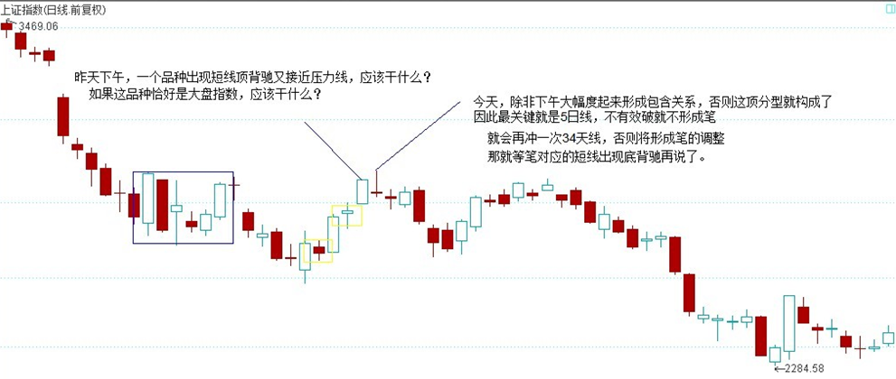

昨天下午正确操作，现在就不用左右为难，左右为难的操作都是因为节奏不对，因此，节奏是一个永远的主题，高手还是低手，最终考验的就是节奏，轮动只是节奏的一种方式，而最重要的节奏，还是买卖点，一切的节奏都必须以此为基础，当然轮动也不例外。

病情、朋友等(2008-07-14 06:40:48)

股票在周五在5日线标准化折腾，结论依旧，站住再冲一次，站不住就延伸为笔的底背驰后再说了。是否节奏一把，就根据自己能力与情况来了。由于T+1，这种情况确实限制了理论化小级别中最精确的操作，本ID的理论如果用来小级别的短线，最好的就是T+0或者期货之类的，所以，没能力的，不一定给自己太高要求。

重温一老帖(2008-07-16 06:12:17)

首先说一句狠话，虽然本ID这里不删帖子，本ID更不介意一些因贪婪而被骗的傻蛋因看某些广告中招，但那些整天上来骗散户入会的废物点心，还是最好自觉一点。

大盘这几天走势的标准程度，有目共睹，上不了5日线，调整必然延伸为笔，所以就等日线图上的笔对应的分时图上下跌走势类型出现底背驰再考虑是否介入了。

股票不说，最近从最高开始，逐步谈论必须保持经济增长的问题，现在才谈论，似乎又晚了，还是重温本ID2月的帖子“要通胀还是要经济增长 (2008-02-28 15:53:15)”，请问，我们的管理层什么时候才能治未病呢？

本ID现在也没时间和这些无聊人折腾，每天都要理疗，所以帖子只能简单了，抱歉。先下，再见。

一堆闲话(2008-08-03 08:25:09)

当然，有些蠢人永远学不好什么是真正的调控。真正的调控，归根结底，就是对人心的调控，这才是真正的宏观调控。不过，这无法教会那些西式蠢人，他们想怎么唯物主义地去死就去死吧，六月可以飞雪，六月也可以大棉被盖头呼呼睡。

打针得一律:尘歌（兼说两句股市）(2008-08-04 15:26:00)

本不想说股市，因为确实没什么可讲的，但这时候发帖子不说两句，好象也不好。不过，说了也白说，例如，周末本ID把之定义为搏消息，结果就很多人不乐意，你说能让本ID说什么好？

大家如果想听好话，本ID这里没有，对不起了。本ID唯一知道的事情是，无论什么理由，别说那无聊的什么运，就是天王老子下凡，走势如果不体现出底部，就没有底部。每个人都企望来一下所谓的奥运行情，然后胜利大逃亡，都这样想，谁埋单？那些说奥运要到8000点的，现在死了多少了？

真正的钢铁战士，只看走势本身，一切都在其中反应，如果连这都遵守不了，就别学什么理论了，买把扫帚去证什么会门口无间道去吧。

本ID也不想再说本ID理论那些高深的道理，就用最简单的均线，5日线都上不去，能有行情？还有，现在最明确的技术提示就是MACD准备0轴破还是不破、破了是否假破这类老哈姆雷特问题，要看清楚行情，只要搞明白这问题就可以，在这没决断之前，你急什么？

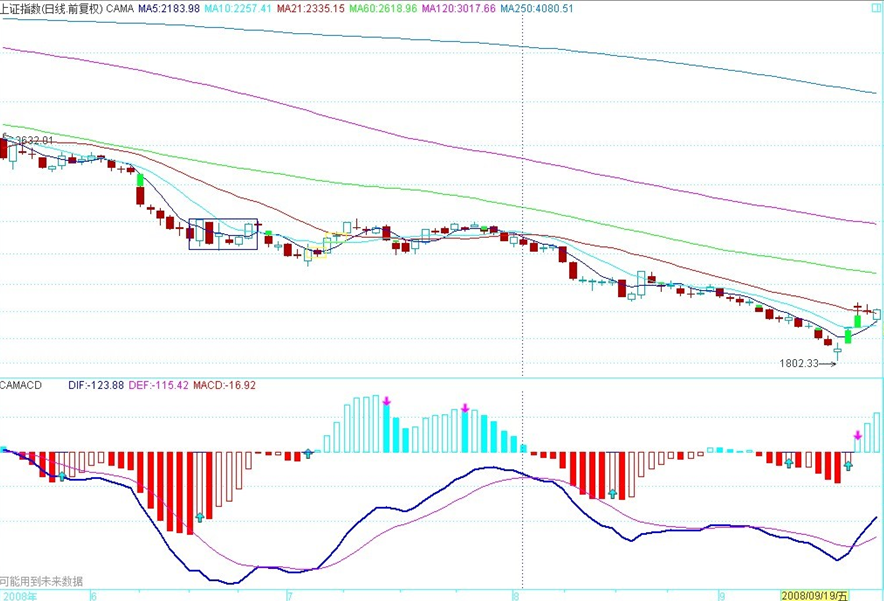

本ID不想培养懒人，MACD的用法说过多次，自己去判别，真明白的，现在一看就知道该怎么安排后面的操作，做不到就学习。

股市简单人难做(2008-08-05 15:40:44)

股市这么简单，还说简直就侮辱智力，昨天的两个回复今天依然有效，抄下来就不说而说了。至于那些脑子不愿意用的，就别股市了，还是无间道扫帚明星吧，那有前途。

股市简单人难做，越亲的人越难处理，有些话都没想好说不说，反正心不爽。都是自作自受，报应。算了，不说了。心情好点再说。

缠中说禅：2008-08-04 15:51:18

对不起，本ID的精力只能保持第一页的干净，只能下了。补充一句，可怜有些人还是糊涂，现在是等买点的时候，等买点不意味着买点就到了，所以才要等到图形告诉你为止。再见。

短线关键2762点(2008-08-06 15:38:08)

短线大盘已经很明确，2924点下来这段至少其第一段在今早的小背驰段区间套完美后就结束了，现在短线的关键点是2762点，只要这点不有效站住，大盘短线依然将面临短线盘整歇息后的第二段下跌；反过来，一旦有效站稳该点，则第一段结束的反弹就至少延伸出日线上的笔，也就是至少是有一定力度与时间度的，至于是否有更大的可能，那是以后图形要告诉你的事情，没必要现在去预测。

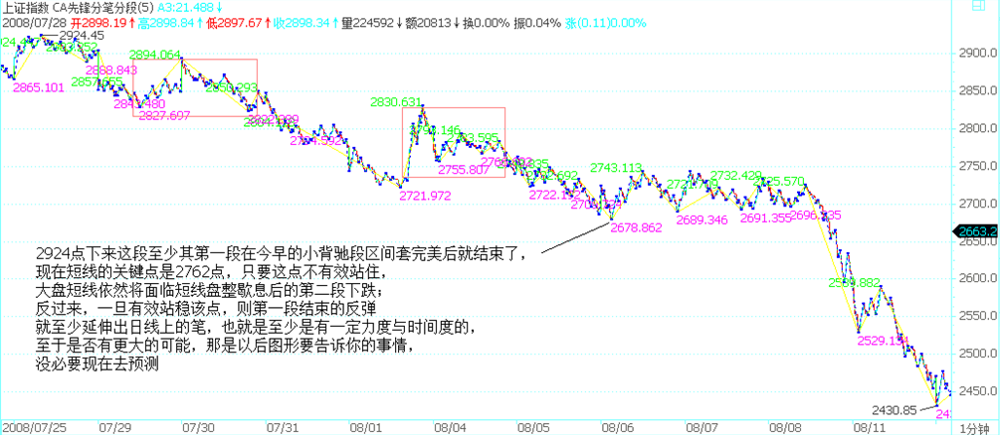

大的角度看，目前依然在7月3日后形成的大中枢中，因此，目前的波动都可以看成是对该中枢的震荡，只要不形成对该中枢的第三类买卖点，该震荡就将一直延续。这一点是本ID理论的最基本常识，就不多说了。至于中枢震荡如何操作，课程了反复说了N遍，就更不再罗嗦了。

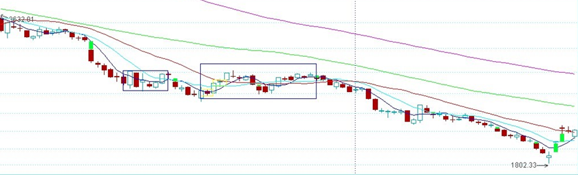

2762点，大盘短线已到临界点(2008-08-08 08:23:58)

昨天，一个包含性K线，构造出短线的第二类买点后回拉到5日线附近，大盘短线已到临界点。当然，最干脆的走势就是今天中长阳突破2762点确认笔走势，而反过来，若大盘依然在2762点下犹疑，那最晚下周初，大盘中继中枢扩展完成后向下延续新一段跌势就理所当然了。所以，今天开始三天内的走势是短线必须密切关注的。

中线来说，已经三次探底，一般性地，即使从概率的角度，如果还有第四次的探底，那破底的概率至少是95%。所以，这基本就是多头的最后一次努力了，就看如何收场了。

操作上，见买点就可以介入，冲不上去就把货倒给多头让多头去死，这就是目前唯一正确的操作。而没这短线本事的，或者就把持仓位每天继续折腾差价降低成本，或者就继续小板凳，自己根据能力选择吧。

本ID现在早对那些什么会审美大疲劳，快点完、别惹事就谢天谢地了。如果一定要让本ID说真话，那就让为资本全球化画眉贴金的末世大铺张见鬼去吧！中华民族的大复兴无须这种恶心的堕落背书！先下，再见。

苦口良药，预演后奥运断崖走势(2008-08-08 15:20:58)

今早，有人企图用为什么深成指四次探底就破底而上海没破之类的烂问题刁难本ID，不知道今天的走势算不算一个回答？本ID也想问，为什么你就不会完成以下的填空：“既然深成指都已破罐破摔，那么还远吗？”

什么叫断崖走势？这几天本ID的长篇文章不断提到这个词，大白话就是破罐破摔，信心一致崩了那还有什么不可以摔的？本ID早上说冲不上去就把货倒给多头让多头去死，有人反问为什么要多头死？多头不死，哪里有大底？问题是，你为什么要站在死多头一边呢，世界如此宽广，你为什么要陪多头死呢？

密切关注买点出现(2008-08-11 07:54:18)

2762点下的三角反弹构成2924点下来的第一个中枢，然后是新一段的下跌，那么，后面的演化无非两种：两段力度对比（30或60分钟），后一段强于前一段，则还需要一个中枢后的下跌背驰才有机会完成2924点开始的下跌；反之，则2924点下来只是盘整走势，只需要一个中枢，其后将快速回到2679点之上。

大的角度，目前7月3日开始的中枢震荡暂时还没出现第三类卖点，依然可以看成是该中枢震荡的延续，除非2924点开始的向下次级别走势类型完成后，其后的次级别反弹不能重回该中枢，才能确认中枢的彻底破坏。

因此，综上所述，目前最大的短线机会，就是2924点下来的走势类型结束点构成的买点，其后至少有一个2924点下来同一级别的反弹。密切关注短线买点，就是本周最大的任务。

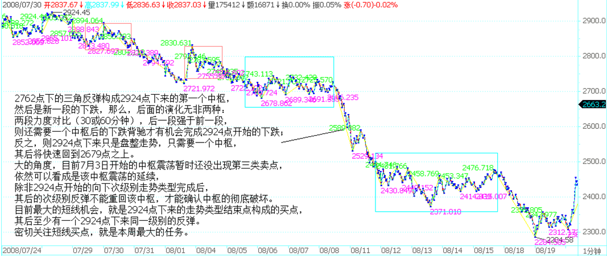

看不明白上面所说的，也有两种途径：一、张某某去吧；二、虚心把课程真正读明白。

本ID可以自豪地宣告，本ID的所有财富都是靠自己的智慧从毁既得利益者手中抢来的，要击毁他们，就是要把他们的血吸光，资本市场是一个最公平的地方，关键你是否有如此的智慧。

没有智慧，就等着陪葬，这有什么可说的？当然，自我有清楚认识，危险之下坚持小板凳，也是智慧之一。自知之明，从来都是最大的智慧。没能力，练能力，没人可以替你。

先下，再见。

断崖走势继续让短线买点逼近(2008-08-11 15:07:35)

今早已经让各位看30或60分钟图判断力度，从那60分钟不断伸长的绿柱子，只要是人，都知道下跌的动能依然强大，因此，早上说的第一种情况成立的可能性越来越演化为必然性了。

最坏的情况，本周只有2700点那中枢破位后的第二中枢反弹（一般来说，这走势明天、最晚后天盘中就出现），这反弹的力度，甚至不能触及今天的高点，然后再继续暴跌；而第二中枢后，一旦出现背驰，就意味着更高一级别的买点出现，这买点，最小是2924点下来第二中枢级别，至少能构成30分钟上的笔走势。（最坏的情况下，最迟下周初就一定出现，一般情况下，如果不是最坏，本周出现的概率很大。）

但这个反弹的出现，如果只是2924点下来的第二中枢级别，那么后面还有下跌去构成背驰完成2924点以来的下跌走势，其后的更大级别就是所谓7月以来大中枢的次级别反弹将是最为重要的，是否构成第三类卖点，就看这次了，一旦构成该卖点，后面还有更断崖的下跌。

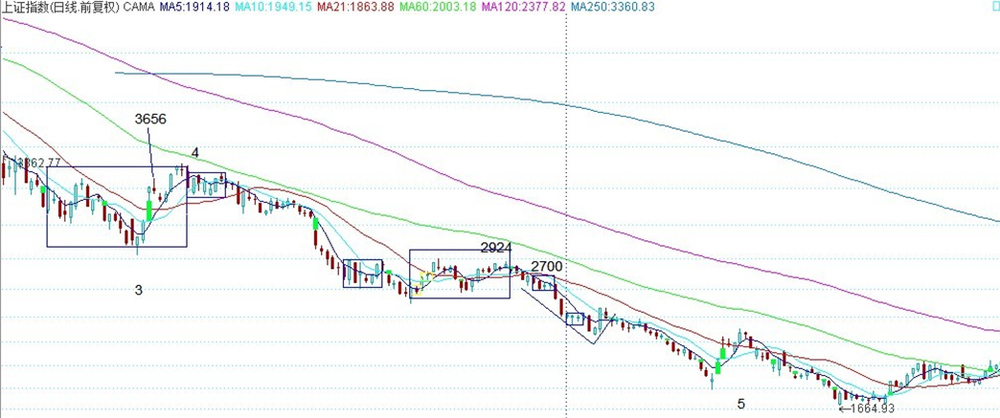

时间上看，要不出现这种第三类卖点，就看政策是否明白事了，如果还幻想，还开幕式，那就如那无聊变态的烟花一样眼花吧，让断脚断腿漫天飞舞，这比烟花好看。

如果要严格分析，本次上海也是典型的四次破底，只是第二底比6月20那第一个要低，这是弱式盘整经常会碰到的。关于盘整形态的问题，以后在课程里再详细说。

股市开幕式地预演着断崖，本ID前段时间反复说的断崖是否蔓延到经济领域，就看某些人的表演了，有本事就如同开幕式那天发1000多支火箭来做假天气，本ID很想开开眼，拜托了。

任何人在市场面前只能低头(2008-08-12 07:58:06)

最近一天两帖，首先当然是本ID现在状态大好，平时谈工作或一些有趣的事，一谈就两三小时也毫无问题；其次，最近行情是大转折的时候，本ID一直说断崖，结果股市也很给面子地表演了一次，本ID当然要多说几句，就当是中央台那无聊旁说也是有趣的；但最重要的是，本ID过两天出院后要有一次较长时间的远足，这样就不能保证每天都有帖子了，当然本ID会尽量做到一天一帖，如果达不到，各位也请原谅，现在也算是预先补偿一下吧。

任何人在市场面前只能低头，今天央行有人出来强调放松信贷，虽然不太诚恳，但也算对市场低了一下头，至于市场是否领情，那就市场检验了。不过，在本ID看来，这还远远不够，但一个开始总会有点羞羞答答的，鼓励一下还是应该的。

但要避免经济的断崖，头必须再低点，最好一次性地完全达到市场的要求，否则，像挤牙膏一样，那最终只能面临市场更严厉的惩罚。任何想用小恩小惠蒙骗市场的，最终的命运都是一样的。前段时间，本ID多次痛批某些人认错如同挤牙膏，对恶意再融资老想敷衍过去，结果如何？后面那些所谓的救市每一天都被市场所严重嘲笑，这就是市场的力量，如果还没试够，尽管再折腾，谁怕谁呀？

本ID当然有更有力的渠道表达意见，这里发出来的，多数都只是随便写的草稿而已。但就算最好的渠道，改变思维都是相当困难的，像上次那破烂直通车如此快的效果，简直是百年一遇。别说如此庞大的决策机制了，就算是一个个人，本ID从去年底开始无数次地强调今年是一个“井”年，是开短跑运动会，甚至多次说就算本ID，经常持股也就是两三天，没技术没本事的就小板凳，那么，请问，究竟又有多少人真正能自知之明呢？是否都认为自己英明神武，能够逆市场趋势而动，都有技术去短跑呢？至于那些整天还要叨唠显摆自己智力问题的，那更是活该了！

市场从来不相信眼泪、叨唠，你爱干什么都可以，本ID说过，即使是本ID，要在市场杀起人来，也是不分敌友的，因为分不清楚，也没时间去分，市场的有效时间如此宝贵，刀光闪去，被杀是活该，吵也没用，只能显示自己的智力问题。要成为钢铁战士，要在刀光丛中自由行走，就练好工夫，除此之外，张某某次方的张某某地手口并用都救不了你。

本ID再废话一次，爱听不听：操作的节奏是最重要的，而节奏来源自对级别的清楚认识，谁说本ID的理论不能预测的？只是本ID所说的预测，是各种级别边界条件的完全分类，是一个操作的完全分类图，这里，最关键的是级别，没有级别，任何的买卖点都是白搭，更别谈什么节奏了，不搞清楚这点，那还是张某某去吧。

好自为之吧，就算最好的拐杖还是拐杖，而一个大写的人，一个钢铁战士，就要学会自己站起来行走，本ID并不想当任何人的老师，本ID最多是你人生的一道风景，你看成什么是你眼睛的事情，和本ID无关，自我修炼去吧。

经济基本面给了调控下台阶的机会(2008-08-12 15:21:43)

大盘今天走得极为规范，如期出现昨天说的盘中反弹以构成2700点那中枢破位后的第二中枢反弹，后面请注意了，这里严格说将有两种演化可能：

一、最规范的就是破该中枢，然后再分两种可能，形成背驰见更大级别底形成更大级别反弹，不形成背驰就继续下跌去形成第三中枢，一般来说，后一种情况出现的概率不会超过10%，而且是否形成背驰，可以很直观地判断，根本没有模糊混淆的可能，除非你根本没搞清楚背驰的判断。

二、不大规范地的，就是直接从该中枢第三类买点扩展成更大级别的反弹。这等于标准的下跌走势a+A+b+B+c中的c不出现，读过课程的都知道，只要有A和B，a、c不出现不改变下跌的性质，趋势与盘整在于中枢数量，这是最基本的常识。

同样地，第二种情况的概率也不超过10%，按中枢震荡的判别原则，第三类买点与第三类卖点都分辨不清楚，那就根本没看明白课程，补课是唯一选择。

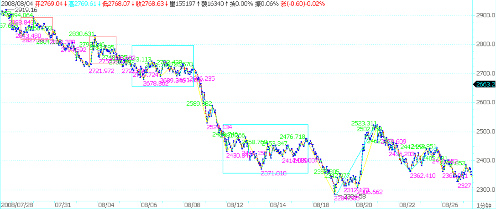

看明白上面的内容，后面的操作就得心应手了。当然，具体个股与指数的节奏可能不同，这也是最基本的常识，那就各自去分析了，本ID不可能把个股也分析了，没那时间。

今天CPI有比较好的数据，油价、汇率都有了有利的变化，这也为某些人准备了台阶，下不下就是他们的事了，不下，市场是不会给面子的。所以，从基本面上看，短线反弹是有了些条件了，但中线的关键还是要低头、下台阶，否则给脸不要脸，只能撕破脸了。

不说了，看着办吧。

确保经济高增长已刻不容缓(2008-08-13 08:28:09)

春节后写了要通胀还是要经济增长 (2008-02-28 15:53:15) ，当时就很尖锐地指出高通涨低增长死局的潜在可能与危害性，在错过了诸多有利时机后，很不幸地，现在这种风险正日益迫近。现在，已经别无选择，当时已经给出了当下最现实的模式，高增长高通涨，然后在此基础上逐步利用有利时机改变经济结构与利益分配机制，使得结构性通涨的压力消解。无论如何，确保经济高增长已刻不容缓，不想死得很难看，这是唯一实际的选择了。最近，对经济增长的再次强调逐渐有了较大的声音，这是好事情，但其中依然有诸多的摇摆，这是十分糟糕的，机会不会无条件地等你觉悟，因为迟疑，多少机会浪费了，而这会有什么报应，难道真想见识吗？

对于像本ID这类人，经济断崖不过提供一次大量买入超廉价资产以提供下次济热潮的筹码而已，但对于绝大多数的国人，那可能面对的就是生存问题了，这不是危言耸听，而是经济变动极可能出现的状况，大难几乎都在兴高采烈之时，这难道还少见？

本ID很希望自己错了，但无数的事实证明，本ID对经济的判断从来没错过，只不过本ID都很早就提醒，而绝大多数人却依然沉浸在梦里，难道一定要经济大地震才醒来？

股市方面，对于超短线，看好30、60分钟形成底分型后上边沿的位置是否能有效站住，一旦站不住，超短线依然要继续下探。这一简单的招数，用在日线上曾经让多少次短线操作最终能胜利大逃亡，这在以前屡次反弹中，本ID用短线关键位置是多少曾演示过多次，一定要把握好。当然，如果你对本ID的理论有很深入的认识，有更精确的方法，但对一般性的操作，这招数简单又有效率，不把握就浪费了。

这两天准备出院，诸多事情，明天开始就不可能一天两帖了，抱歉。

第二级别反弹教科书般降临(2008-08-13 15:23:14)

今天的走势，前面都描述过了，没什么可说的，这极为标准地构成了前面所说那三级别反弹中的第二个，也就是构成2924点下来的第二中枢那一个。今早特别强调了底分型的用法，今天的走势教科书一样，各位如果还闹不明白的，就从15、30、60一直看过来，研究去吧。

最大那个反弹，也就是前面大中枢的次级别反抽，同样有两种可能：更大底背驰或从今天构成的中枢直接上去，分析和昨天说的那小级别的道理是一样的。

从大盘的实际走势，显然并不是最恐怖那种，本周已经出现第二级别的反弹，因此就是一般性走势，后面的操作无非是从这第二级别反弹成功逃掉然后再抄更大级别也就是第三级别那个底，如果你真有本事，这三级别的反弹你完全可以根据本ID的理论按照如此美妙的节奏自如地完成，现在达不到，就继续训练，没有什么东西是可以随意达到的。

至于经济，某些人爱干什么是什么，只要你有本事，越跌越赚钱，既然有人这么乐意送钱给咱们花，为什么要拒绝？

有时候，让大浪自然去淘沙，可能更有意义，浪淘尽千古风流人物，现在又有谁是千古风流人物呢？这和你的官位、财富无关，某些人有点自知之明吧！

最后说句狠话，之所以有人敢于如此，就是没人需要为经济出大问题负责任，因此就占着什么不什么了，那就随它去吧！

什么才是真正的“和”？(2008-08-14 08:03:14)

学东西，必须搞清楚细节。就像现在，依然有N多人把分型上边沿站稳作为最好的买入点，却搞不清楚，恰好相反，这只不过是判断是否延伸为笔的一个简单判断法，如果说买点，必须从走势类型去判别，分型上下边沿之类的东西，最多就类似于第三买卖点，因此以这当成买卖的根据，将不时面临买后第二根K线就是转折的尴尬。道理很简单，如果抛去包含关系，6根K线就可以构成笔，而确认站稳上下边沿的那至少是第4根，而转折在第5根，这意味着什么，不是很简单的问题吗？ 

因此，各种方法，必须知道其使用范围，在什么情况下如何用是最有效率的，否则如此囫囵吞枣，不亏钱真是没天理了。课程里也有单纯用分型的不同级别，用类似区间套的方法确定买卖点的方法，这可不是单纯的上下边沿判别，千万别搞糊涂了。

2484点，短线关键位置。(2008-08-15 15:27:47)

昨天日包含关系，今天构成日底分型，2484点成短线关键，道理说过N遍，不再说了。下周初如果不能站住该点，大盘不可避免再次探底，最坏的情况，下周一就直接低开探底。因此，5日线成了短线的最基本支持判别，一旦有效跌破，探底就确认展开。当然，如果下周初能顶住，更大级别反弹就此扩展的机会就极大了，就看市场选择吧。

今天万分不爽，现在不能坐飞机，怕上升下降时身体出问题，只好坐火车。结果那车竟然没有高包，坐软卧极端不习惯，一晚没睡好。早上到了武昌，一个超级乱的扩建中的车站，又刚好下大雨。本来有朋友说找省里的人接待，本ID怕欠人情就推了，真有点后悔。

送本ID来的朋友，性子特倔，本ID说去西广场出去，他偏要听人说走东广场，结果淋了一通，本ID火已经很大了。更无聊的是，为了三顾茅庐方便，本ID没法去住好酒店，只能就近找酒店，结果打车到目的点一看，几乎晕倒，这武汉也是的，这么多年，汉口竟然还有这么大片没开发的地方，还以为进了荒山野林里，找到那酒店如同老电影里所见的，最可恶的是，吃饭也没地方，附近有吃的地方看都看不见，说可以打车去，出租车在哪里呀？只好在所谓的酒店里将就，说好来湖北菜，随便什么三蒸、莲藕排骨就完了，结果没有，这里是山东师傅搞的四川菜，没辣就不会了，一口都吃不了。后来，去那所谓的小卖部，都是热气的东西，最后只好来了点喝的，今天晚上，听说能专门给我们弄条鱼清蒸，但要专门下午到老远的地方买，晕!

但比最可恶还要无聊的是，一回到房间，电话就上来了，问要不要房间服务，本ID就问，除了鸡，还有鸭有鹅有鸽子吗？一样来一队来挑挑，结果把电话给吓回去了，好无聊的地方呀。

但这里有奇人，这里就是光明之地，为了学会那本事，什么都认了。那奇人似乎特恨与官员有来往的人，本ID无论如何是不能让什么省里的人接待去那些不靠谱的地方，受苦受累也要顶着了。现在还没见到那人，估计真要N顾茅庐了，就看本ID有没有这善缘，奇人是不能强迫也不能利诱的，否则本ID也不会为此受此苦。心只能靠真心感动，本ID就在这里熬下去了。

不多说了，唯一惊喜的是，这里竟然还有光纤上网，这就够了。等天晴了，再想办法解决如何吃好的问题，能吃是福，听说这里的蟹比某某湖的还要好，污染少，不知道是否吹牛，找时间好好验证一下，至于还有什么好吃的东西，只要不是炸的、煎的、烤的之类，都要检验一下，有当地的朋友吗，麻烦介绍一下，哪里有美食？以前来武汉都是来去匆匆，这下要好好武汉一把，谢了。不知道最后结果怎样。

分型上边沿再起神奇作用(2008-08-18 15:09:52)

十分感谢各位的关心，这边的问题，无论多难，本ID都会尽量处理好的，毕竟机会难得，是否最终如愿，就看是否有此善缘了。

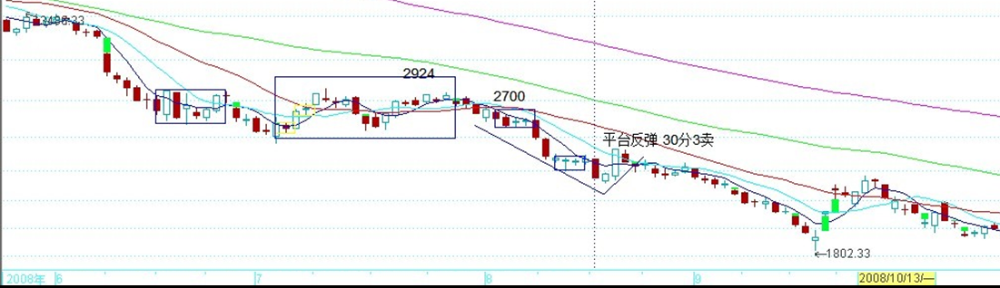

今天大盘值得各位好好研究，周五所给的日底分型上边沿不能站住将继续探底，今天的走势已经给出最好的阐释。而这个探底，在最开始的三级别反弹分析中已经仔细分析过，这一般有90%可能性走势下面预防的走势无非是不能形成背驰从而只能先有第三中枢的问题，因此，明后两天走势极为关键，一旦延续跌势力度，那么第三中枢的可能性就很大了。反之，就那次级别的反弹就将展开。

一定要注意，这次级别反弹可能只构成原来大中枢的第三类卖点，其后将是更猛烈的下跌，第三类卖点后最好也就是构成更大级别中枢，因此，这反弹相面对的风险还是需要留意的。从基本面上看，时间刚好极端配合，这次级别的反弹，最弱的就是平台式的，也就是连2500点都碰不到，然后基本对应上那什么会结束，最后的机会给管理层，如果还如此，后面不第三类卖点才怪了，这点必须有清醒认识，而这在原来三级别反弹的分析中已经明确指出过，市场显然与我们的分析完全合拍。

不说了，本ID现在的任务是学习、治病，顺便看管理层的反应，一切都在分析之中，没什么可继续说了。

先下，再见。

## 教你炒股票107：如何操作短线反弹(2008-08-19 16:10:39)

今天很不顺利，那奇人似乎受到什么影响，突然改变了口风。其中一种可能，是因为前几天本ID的帖子，这里有些本ID的朋友，例如关于肝昏迷后来转医院那事情，这里至少应该有N个以上的人亲眼见证，而且，那天胡乱打电话，后来电脑又被弟弟的同学拿去修理，其中诸多变数，本ID也不想了解，而且那奇人无意中碰进来的机会也少不了。总之，不管什么原因，奇人以怕身体受不了为名，把本是一天一次的治疗间隔给放大了2倍，而且其手机今天也停了，不过本ID有其家里电话以及另一手机的号码，所以这并没有多大影响，但给人的感觉已经不对了，至少表明他最多把关系定位在医患关系上了。

本ID对公开谈论该事情因此而产生的后果其实也早有准备，这次之所以这样，其实也是早点解揭开些东西。如果因为这样就如此，那本ID也没必要见什么奇人了，他的方法，其实本ID早已了然，只是其中具体的细节还希望当面探讨，另外像糖尿病、爱滋病之类的东西，也希望有一个层次高的人探讨一下，互相探讨还可能激发更大的火花，但如果因缘不对，那也就算了，不过本ID暂时还不准备放弃，毕竟层次有的人太难碰到，碰到一个至少这方面不糊涂的，总不能轻易放弃。

奇人当时就说，这绝学到他这里就真绝了，他也不想传下去，如果他真坚持如此，本ID也没办法，只能说共业如此，如此就如此了。

至于本ID的病，说实在，本ID并不想现在就好，因为2002年的结6年还没解开，不解开这，本ID病好了也没意义，反而使得这个结永远解不开，这其实才是本ID迟迟不亲自下重手的原因。至于弟弟那里，这次奇人有缘分，那只是一个好的例子让他去思考，但按本ID对弟弟的了解，就算奇人真治好了本ID，他也不会低头的，这东西，只能靠他自己的慧命，最亲的人，其实也不能真的去解决任何问题。

好了，没活动就继续说股票，今天的走势都在前面的分析中，具体就不用再说了，各自学习把握就可以。这里，再强调一下一些最基本的操作问题。其实，操作没把握，归根结底是对理论没完全彻底地把握。

例如，一个最实际的问题，如果按照理论，至少有一个30分钟级别的反弹，那么具体的操作应该怎么安排？首先，你必须搞清楚反弹可能的具体走势形式，因为同样是30分钟级别，不同形式，对应的对应的操作难度与方式都是不同的，而最大的难点在于，你并不能事先知道反弹究竟用什么的方式，因为这涉及预测，而一切预测都不能纳入操作计划的范围，只能聊天吹牛时使用。所以要解决这难点，必须从绝对性出发，里面不能涉及任何预测。

对一个30分钟的走势类型，我们能绝对性指出的无非有一点，就是这个反弹至少有一个30分钟级别的中枢，而有这就足够了，为此就可以构造出一套绝对性的操作方法。

某级别的中枢都是由三个以上次级别走势类型重叠构成，也就是说，一个30分钟的中枢，一定涉及上下上的三个5分钟走势类型。这就是构成我们操作绝对性的最坚实基础。

显然，没有任何绝对性可以保障上下上中，最后一个上一定有比第一个上有更高的高点，特别那种所谓奔走型的反弹，后上的高点可能只刚好触及前上的低点，因此，如果你一定要等上下上都完成才抛出，那很可能面对这样的尴尬，就是你在第一个上的最低点买的，在上下上的电梯过后，你只有一个可能连手续费都不够、稍纵即逝的卖点。因此，这种操作，注定是只有相对的理论上的绝对安全性，而没有具体操作上的绝对安全性。要解决这个问题，只能从第一上就开始分解操作，也就是说，没必要等待第二个上了，既然每次上之后都必然有一个同级别的下，而这下的幅度又是不可能绝对控制的，所以还不如就把操作分段，让分段提供给你绝对的具体操作安全。

因此，在这种分析下，具体的反弹操作一定是同次级别分解方式进行的，也就是说，30分钟级别的反弹，是按5分钟的节奏去处理的。

注意，这只是统一的处理方法，其实实际操作中，一旦第一上与下出现后，可能的走势形式，就有了很大的绝对性确认了，例如，一个30分钟中枢后接一个第三类买点，然后非背驰力度地强劲拉升，那你就完全可以开始坐轿子，等第二中枢，甚至第三、四、五中枢完成出现背驰后第三类卖点再说了。

其次，更要注意，这绝对性的具体操作还不是平均效率最高的，最高的，就是保持部分仓位，用余下仓位进行换股轮动操作，对于资金少的，这更可以全部仓位进行，不过这技术要求更高，就不多说了。

最后，一定不要去预测什么反弹还是反转，这根本没意义。反弹越搞越大，最后就自然成了反转，而是否如此，根本没必须知道，你唯一需要知道的就是，只要在第一中枢后出现第三类买点并形成非背驰类向上，才可以流着口水地持股睡觉等其余中枢形成，否则，随时都有被反回来的风险。

有人喜欢精确定义，那么这里其实也给出了什么是上升趋势形成的最精确定义，就是在第一中枢后出现第三类买点并形成非背驰类向上。趋势形成，只要趋势没有扭转的信号，当然就可以睡觉，这是太常识的东西了。本ID的理论，并不一定要违反常识，只是本ID的理论可以给正确的常识以合理的理论基础，这才是关键。

后面的课程，将开始具体分析各种可能的反弹类型，这对具体的盘整操作也是有极大用处的。不过必须补充的是，实际的操作效果还是必须靠磨练的，而反弹如此，回调的操作反过来就是，更不用多说。

2455、2656成短线上下关键位置(2008-08-20 15:11:18)

今天大盘死皮赖脸地又教科书了一把，本ID这两周关于三级别反弹的分析，就此被大盘完美演绎。后面走势，其实前面已经分析过了，就是下面要站住今天构成日底分型上边沿2455点，上面要尽快攻破2656点以确认第三类卖点不成立。

当然，以上表述是站在希望大盘涨的基础上说的，而实际操作，一定不能有这种想法，而是根据大盘实际走势进行机械化反应。

再强调一次，没分清级别之前就别谈什么背驰。所谓背了又背是天经地义的事情，但对应的是不同级别，否则，难道一个1分钟背驰就可以让大盘转向1000年，那不乱套了？本ID理论的基础之一是级别，不学会并完全机械化地精确把握，那还是别背驰了，因为这种水平，除了背还是背，还驰什么？

今天上来，主要配合了消息面上关于经济刺激的一些重大传闻，如果真能如此，跟着本ID的思路一把，这管理层还算有药可救，否则，又来假消息忽悠，那只有第三类卖点后更强力地暴跌了。所以，这几天消息面是最关键的，会也快开完，该干点正事，否则，难道还要为残奥会增加点新项目，提供点新选手吗？

不想说了，就看某些人会不会做了，这不是小孩子玩泥沙，千万别意气用事。至于各位，无论你这两周是否如本ID两周前说的完全踏准三级别的节奏，但如此教科书的实际走势，也请好好分析清楚，学会了这，你的水平将提高许多，各位就各自努力吧。先下，再见。

超短线抉择:5天还是13天线(2008-08-21 15:23:00)

今天没消息，大盘回跌就是天经地义的，至于这回跌是否最终构成继续的探底，昨天已经给了一个基本点位：2455点，如果明天还站不住该位置，继续下探就是理所当然了。

当然，实际操作中，根本无须搭理这点位，因为这往往有点晚，本ID最近课程专门讲述如何进行短线操作安排。里面给出了最有效率的方法，而这次第一段的顶背驰极端明确，当然，由于是T+1，所以实际操作中不一定真能在第一类卖点就卖了，而以前说过开盘大幅度低开后，第一次次级别回拉不破顶或盘整背驰将构成最好的第二类卖点，这类卖点往往是突发事件中最好的逃命点，这里的老人都知道，去年530早上开盘前专门强调注意第二类卖点，该点走掉后，虽然不是最高，但后面至少逃过整个跌幅的95%，这已经是突发事件中最好的结果了。

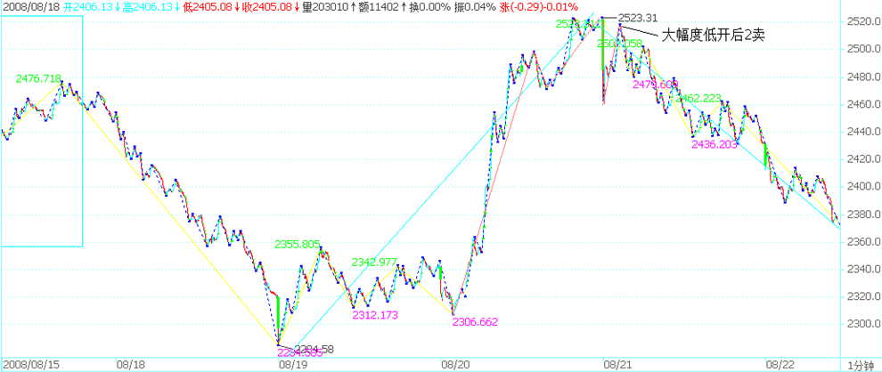

当然，理论水平不够的，就看均线，前面有专门说均线系统级别的，这次标准地在13天线受阻，也就是一个2级力度，能否升级到3或更高，就看13天线了，至于5日线，是超短线的生命线，一旦有效跌破，那该怎么样，张某某都该知道，各位这么英明神武的，就不用废话了。

明天，最后一个搏消息的日子，而下周，是让某些人最后彻底反省的日子，如果一切都落空，你说这市场能不空吗？这第三类卖点还不是天经地义的？让市场赞助点手呀脚呀地残奥会一把，还不是很张某某的？

至于那连笔和线段都没分清楚，在线段上竟然敢大谈什么背驰的，就虚心点去读书。让本ID一个早被判四期绝症的病人每天还分什么笔、线段图放上来的，你好意思，本ID都不好意思。因为，功夫是你自己的，你自己不磨练，万一本ID有什么闪失的，你又去哪里找陪练？可以断言，本ID万一有什么闪失，关于本ID的理论就会被折腾得完全变样，有2 的张某某次方变种，结果，最终能在市场上真磨练成钢铁战士的，能有5个，本ID就含笑九泉了。就像那奇人，他们家里同辈人一起学祖传绝学，9个人，最终只有他坚持下来并完全自如应用了，大概世间很多事情都命该如此，就不说了。

本ID一时还死不了，至少要看到某些人低头才行，这次不低头，总有低头日，但那时候可能就不是主动低头了，要面子可没有，鞋子、袜子、唾沫星子诸如此类的东西张某某的张某某次方飞过来，肯定比某天那天上钞票印出来的脚印有趣。先下，再见。

博消息，于5日线震荡(2008-08-22 15:32:30)

由于前几次周末搏消息都以失败告终，所以这次似乎热情不高，但依然没有死心，所以就构成今天围绕5日线震荡的两难局面，因此，周一开盘就决定短线突破方向，技术上一旦5日线走平再张口向下，那么大盘新低就是理所当然了。

当然，高位走掉的，这消息也可以赌一把，只是周一一旦没兑现，就要动作特别迅速，没这水平的，就算了。就算真有什么消息，如果特别实质的，完全可以在高开回来出现小次级别第二类买点时介入，这和大跌的操作只不过反过来罢了。

目前，从中线的角度，技术上周与月如何能最终构造出底分型才是问题的关键，否则，就算有消息，也是一日几日行情，比比短跑而已。

周末，好好休息吧，这边也有不少事情忙，先下，再见。

以北京奥运为新标杆的面子工程运动会隆重开幕(2008-08-25 15:38:43)

大盘没什么可说，昨天已给了最关键的评价，市场需要更多真家伙。技术上，今天改变了最近周一就大跌的习惯，但由于目前5日线依然在13日线下收口，因此明天，最迟后天是短线分水岭，是5日上穿13，还是再次扩大形成新一轮下跌，很快就有答案。

管理层已经企图想干点什么，但太拖拉了，就怕他们到时候尽来些不到位的东西，反而让市场厌恶。所以，现在，一切都在敏感之中，这段时间，一定要清醒看好，最安全的还是根据技术来，中线的标准很明确，就是首先周底分型，然后是月的，这两个构造出来，大盘才会有大戏，否则也不过是上下折腾一下。

本周很关键，决定了本月能否有可能成为月底分型最下一根，如果本周走不好，那么，一切都将至少轮后一月，如果这样，后面的调整就至少多三月，也就是至少两年以后再谈什么新高行情了。第一轮调整时间越长，正规的走势中，后续最终结束全部调整的时间也将成N倍地延长，这是很关键的。本月是10个月，下一周期是12、13；然后是17、18，当然，具体要看实际走势，这都是经验的分析。

目前，是游资乱搞的时期，所以权证、本地股等小市值品种就会被经常光顾，而真正的大行情，必须中字头股票真正动起来，本ID当然不介意管理层一路昏招，使得本ID类似6元中驴的理想得以实现，但本ID从11元多开始都是见步拆步，冲不上去就砸，有差价就回买，有机会就让它破底，以有更好的价格，而中字头的基本都是这样弄的，没有人会现在全身投进去，但现在完全不介入，以后可能就不一定有发言权，这就是另一个问题了。

所以，再次强调，对于小资金来说，继续短跑运动会，这才是应付如此混乱环境的唯一可行办法，或者干脆就继续小板凳，那更不用烦了。

说起运动会，今天，以北京奥运为新标杆的面子工程运动会隆重开幕了，以后，一切只要打着民族世界交流发展展示等等劳什子玩意的东西都有了新标杆。花吧烧吧，一切时代，如果张某某般以宏大叙事为基础的伪文化得以烧钱化，这个时代一定要反省了，说得难听点，一个破资本主义爆发户，有什么可臭显摆的？

昨天，最精彩的是那伦敦市长以忒加扎的方式上场，给爆发户心态的急于显摆一个极大反讽；另一个，当然是那八分钟，这里，无法讲述，因为懂得当代西方哲学、艺术发展的人毕竟太少，这种以摆脱宏大叙事为基础的、散漫而有机的艺术，是张某某那些弱智的爆发户玩意永远想象不到的。

当老牌资本主义早就开始冷酷的反省与重建时，一切的对比简直太有趣了，当奥运奥运了中国后，就看老牌资本主义的精神家园里，奥运是如何被伦敦所奥运，2012年，值得期待。

本来想写一篇关于那8分钟纯专业的分析，后来一想，本ID又不喜欢废铁、烂切，何必多写又招极端民族主义者不待见，就算了。

要在全球化占主导，文化是最大的难关。其实，伦敦那些也不过糊涂玩意，新的文化建构当然至少是全球视野的，不明白这点，远远不行呀。

任重道远，呜呼--

大盘短期走势纯技术分析(2008-08-26 14:59:52)

从最简单的5\13日线就知道今天最迟明天是大变盘的日子，结果大盘依然很有方向感地向下，明天回拉只要站不上5日线，以后该线就成为最简单短线判别标准。

不过，有一点必须注意，目前大盘往下的承接日益加大，大盘还有一种可能的演化就是不断的下探最终都不构成真正的下跌，而是不断扩展出更大级别的中枢，等待上面均线下来，在目前大致位置形成缠绕后再决定最终突破方向，这是一种很有技术意义的走势演化，具体的分析以后课程里都有。

今天并没最终破坏上周是周底分型最下一根的形态，换言之，只要大盘在本周不破坏这形态，那大盘还有点意思，否则，就继续下探到可安置这周底分型的区域。

话就不多说了，一切看图操作，千万不要一根筋。

谢谢各位的关心，这两天买了点电器回来，自己来吃得舒服，当然，自己来也就是补充一下，大的还要靠外面，毕竟本ID不可能去每天买菜，那事太麻烦，糖水弄了还可以，外面买了冷冻的甜点心，加热可以随时吃，只能将就了，顺便活动一下自己，也算锻炼。

在这里，估计至少还要二个月，熬熬就习惯了。

严重预告:本周开讲缠中说禅中医学(2008-08-27 15:45:46)

大盘没什么可说的，一切都在昨天的分析中，有些自以为是之辈连本ID的理论是什么都没闹明白就断言本ID的理论被目前的走势所破坏，对这种人，唯一的选择就是少管，让愚蠢继续愚蠢下去就是对愚蠢最好的惩罚。至于对于已经有所把握的，当然看得到目前走势的规范。注意，昨天分析提到的那种情况，在底部构造中超经常出现的，一定要注意研究，这个是无上利器，因为反过来，就是顶的构造，这在历史性大顶的构造中太常见了。

等待政策与技术产生共振效应(2008-08-28 15:10:21)

现在，政策与技术，单纯一面，都不足以构造真正的中期底部，而是必须等待两者产生共振效应。政策面上，效率不高；技术面上，最简单的均线系统都没修正好，因此，硬来没多大意义。

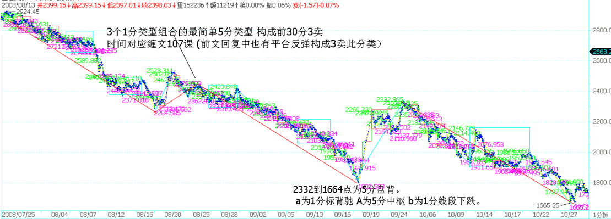

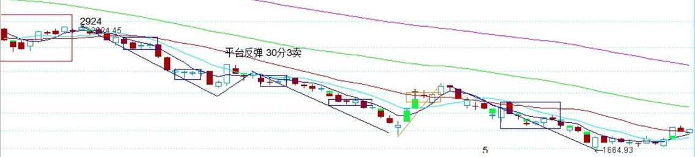

在目前条件下，中线角度，出现各级别中枢不断扩展叠合以完成底部构造的可能性越来越大，也就是说，先横住了，然后再等到那共振时间的出现，产生突破的第一推动力。

明天又进入搏消息日子，上周参与者已经热情不高，本周如何，拭目以待。然后又是一个轮回，有消息，就看其分量决定短线的波动力度，没有，就有了借口往下考验一下，当然，就像本周，最终又一个平衡形态也是一点不奇怪的。

现在，唯一需要的是耐心，而对于短跑选手来说，其实机会不少，特别个股中。如果着眼中线，那还是继续不断短差就降低总成本，这不用太费心。至于，一点感觉都没有的，那就小板凳吧，至少等底部形态彻底摆脱了再说了。

## 教你炒股票108：何谓底部？从月线看中期走势演化(20080829)

何谓底部？这里给出精确的定义，以后就不会糊涂一片了。底部都是分级别的，如果站在精确走势类型的角度，那么第一类买点出现后一知道该买点所引发的中枢第一次走出第三类买卖点前，都可以看成底部构造的过程。只不过如果是第三类卖点先出现，就意味着这底部构造失败了，反之，第三类买点意味着底部构造的最终完成并展开新的行情。当然，顶部的情况，反过来定义就是。

此外，用分型的角度同样可以给出底部的概念，只是这粗糙一点，对一时把握不了精确走势类型分类的，这是一个将就的办法；此外，一般性分析中，这方法也可以用，因为对把握大方向已经足够。

站在分型的角度，底部就是构成底分型的那个区间，而跌破分型最低点意味着底部构成失败，反之，有效站住分型区间上边沿，就意味着底部构造成功并至少展开一笔一上行情。其实，这都不是什么新鲜内容，但这里统一说出来，还是有好处的。同样，顶部反过来就是。

注意了，有了这个定义，就一定要搞明白，不是在底部的区间上买，而是相反，应该和中枢震荡的操作一样，在区间下探失败时买，这才是最好的买点，连这都搞不明白，就白学了。此外，底部是有级别的，日线图上的底分型，当然就对应着分型意义上的日线级别底部。

现在就有一个现成有意义的例子，2008年8月这月K线基本走出来了，显然，9月是否能构造出底分型，关键是看这个区间（2284，2952），其中2284点是绝对不能破的，一旦破了，就马上宣告月底分型至少要到10月后才有戏。因此，即使9月没到，我们已经可以有一个大致的操作强弱分类空间了，只要回2284点不破的任何分型意义上周级别以下走势，都必然成为一个良好的短线买点，而且其中可以充分利用类似区间套的方法去找到最精确的买入位置。

同样，马上可以断言的是，在10月有效确认站住2952点前，月线意义上的行情是没有的，最多都只能看成是分型意义下月线级别的底部构造过程。因此，这对我们操作参与的力度与投入就有了一个很明确的指引。

当然，对于一般投资者，月线图太大了，因此可以看周线图，例如，本周与上周比，到目前为止就是一个包含关系，因此，到下周是关键的能否构成底分型的日子，而真正要走出底部，那还需要对（2284，2601）突破有效的确认，也就说，在中秋前，要确认一个分型意义下的周线行情是不可能的，除非今天，本周最后一天能突然突破2523点，否则就绝对不可能了。

从更短的日线看，目前无非就在8月18日开始那底分型引发的底部构造中，是否最终有效，就看（2284，2455）区间走势的演化了。

操作其实很简单，一个基本的原则就是，任何走势，无论怎么折腾，都逃不出这个节奏，就是底、顶以及连接两者的中间过程，因此，在两头的操作节奏就是中枢震荡，只是底的时候要先买后卖，顶的时候要先卖后买，这样更安全点。至于中间的连接部分，就是持有，当然，对于空头走势，小板凳就是一个最好的持有，一直持有到底部构造完成。

而有技术的，根本就不需要什么小板凳，按操作级别，分清楚目前是三阶段中的哪一段，然后日日是好日，时时是花时，不赚钱那真是脑子有水了。亏钱都是错误操作引起的，不断反省，才会有进步的。

超短线就看周一及2403点(2008-08-29 15:11:47)

今天，继续周末消息市，由于外围造好，就有了比较强的盘面。现在，最基本的，超短线就看周一能否站住2403点，能就极大机会延伸出日线图上的向上笔，2523点是下一个重要位置。更大时间的分析，请看今早的文章。

大盘当然已经暗潮汹涌，你看中信证券，大盘没动，也快上来30%了，没人搞是决无可能的。其他不少中字头的也如此，但是，这搞是有分寸的，就是万一管理层真不给面子，翻脸就可以不玩，成为新的下跌动力。现在的大资金，只要比配合理，都是十分自如的，一有机会可以狂飙突进一次，没机会、不给面子就继续砸出机会，谁怕谁呀？

总之，现在不要一边思维，有能力的要多活动，大盘在大的底部构造中，机会多多，来回几次，比来一次大的都好玩，最后再在大的上面狠咬一口，那又够一年半载消费了。

另外，有一种错误的思维一定要消灭，否则死无全尸。千万别有等下一大级别再如何如何的想法。10000点跌到6000点反弹到8000点，然后到2000点再反弹到4000点，你说相对6000点到8000点，2000点到4000点是不是大扬？但这有什么用？不会分段操作，一味死扛的根本不该到股票中来，股票就是分段操作的，下一段就算有天大的宝贝，都和当下这一段无关，任何的操作只关心当下的苹果，吃到就是英雄，否则就是垃圾。

人，总爱编造一些故事来给自己一个支持的理由，那都是弱者的表现，在本ID这里，只有当下的走势，任何所谓的预测，都是闲谈，活动一下唾液的分泌功能，这已经说过无数次，如果还不明白，那真不能股票了。

而实际上，对于真正的操作者，本ID每天后面写的，等于是一个操作的完全分类，任何操作必须以完全分类为基础，否则，只有死路一条，也说过无数遍了，又有多少人真正机械地做到？

周末中医一把，本ID的绝对前无古人，有时间可以先把抽象代数复习一下，本ID的中医是以抽象代数为基础展开的，当然其中不会用到相关术语，但思路是一样的，这才能构造真正的中医基础。

股票是几何的，医学是代数的，世界就是这么简单，如此地数学了。先下，再见。

退一步海阔天空(2008-09-01 15:56:14)

来本ID这里，首先就要有最基本的科学精神，科学精神你都做不到，还如何能破科学而进入更高的境界？本ID这里一是一、二是二，只看实际效果。

至于股市，周末搏消息的又一次失望，因此就自然有了今天的走势。对消息，不能急，你想大爷们的工作效率，就算真想干点什么，能快得了吗？退一步海阔天空，没什么不好的。

纯技术的角度，已经明确分析过了，就是要有较大行情，必须月线闹出底分型来。如果本月初破上月底，并不是什么世界末日，反而使得这底分型更有力点，行情早一月晚一月其实并没什么大不了的。试想，如果本月不破底而硬搞一个分型，那么本月就需要拉一长阳，你凑在图上看看，总让人感觉不舒服不塌实，现在硬上去，弄成包含关系的可能更大，这样，后面反而会使得真正底分型来临时间更遥远。所以，有时候急了并不是什么好事情。

从纯美学的角度，10月见底是最美的，因为刚好对应一年周期，顶和底一个完美的周期，当然，9月其实也可以，因为周期是可以正负一两个月的。站在这个角度，在月初砸一次破一次，对长期走势来说是件大好事。当然，这只是从美的角度说，至于市场怎么选择，市场说了算，实际操作中，根本可以不搭理这些事情。

5日线控制超短线走势(2008-09-02 15:15:15)

今天差点没破底，然后扭捏了一天，但深圳破了，只要没有半夜鸡叫之类突发事件，破是迟早的事情，快的明天开盘就实现。上海现在的超短线走势就看5日线了，5日线站不住，这轮杀跌就没完。所以，如果懒的，就看5日线足够。

其实，大盘现在走成怎样都没什么意义，因为没量，就算现在一直阴跌下去，一旦回头，很快就可以回到目前的位置。关键还是月底分型的最终结果，其他都没多大意义。

不破不立，反弹可期(2008-09-03 15:14:03)

大盘终于破底，这使得月线底分型最快也要到10月才能构成，但站在短线的角度，反弹反而有了技术基础。当然，这类反弹都是纯技术性质的，属于短跑型，能否参与就看各自的技术了。

2329点是短线关键压力，站不上去将继续弱势，从纯心理的角度，如果反弹前能有一段急促下跌，那么其后反弹的力度将更有操作性，但目前，破底后追杀的动力不足，市场完全进行一种麻木状态，这时候，行情没有太大的稳定性，最终还是归于折腾。

对经济调整的严酷性决不能掉以轻心(2008-09-04 15:30:25)

股市整天说也没意思，今天一个包含关系日K线，基本的分析和昨天是一样的。

说点别的，就有了下面的内容

现在，无论世界还是国内经济，都进入一个较大级别的调整，这点已经是无须讨论的现实。经济有涨有跌，潮起潮落，本是正常的事情，问题的关键在于，如何用最好的策略对应对这不可避免的调整，使得最终的调整痛苦程度减到最低，甚至就此借力达到调整总体经济结构，培育新的经济增长点，为新一轮的经济上升做好充足的准备。而要做到这一点，首要的，必须对经济调整的严酷性有成分清醒的认识，任何的掉以轻心都可能导致灾难性的结果。

现在有一种极为有害的观点，认为现在资产价格已经大幅度调整，其他经济指标也没有进一步恶化，因此本轮调整将很快过去。而事实上，任何的有一定级别的经济调整，最终的资产价格都不是刚好回到所谓合理的水平，而是大幅度地折让，这正如任何一次资产价格的上升热浪，总要把价格抛向远离合理水平的疯狂状态，而下跌时的道理是一样的，市场总是以不理性的行为为其基础，而这种非理性的状态才是最有杀伤力的。任何以资产价格已经充分调整为理由，都不足以说明经济调整的结束，甚至往往意味着一轮更残酷的非理性下跌的开始。

而这轮的经济调整，从走势形态上看，并没有出现加速恶化的状态，而是在不断的犹疑中徘徊，而这种状态，往往意味着更大的风险还在后面，一旦这种状态被打破，经济不可避免地进入加速调整中，在这加速调整还没有出现前，任何对经济调整结束的断言都是可疑的。

更重要的是，一次较大规模的经济调整过后，总是有一段漫长的恢复期，而这恢复期的杀伤力，往往比调整期还要严重，那是一种磨和耗的状态，一种没有边际的、失望与希望交替的煎熬，那才是最为惨烈的，能否耗过这段时期，决定了经济下一轮增长能否顺利起步并占有最有利位置，因此，即使调整结束了，也决不能掉以轻心。

而这轮调整，在世界范围内，越来越显示出其级别之大，甚至有可能是1929年以来最为严重的一次经济调整。而这次调整，同时纠缠了各种政治势力与经济利益的博弈，最终将决定今后数十年世界政治、经济利益的再分配，所以，站在国家战略的层面，是绝对不可以掉以轻心的。经济，从来都是政治的，特别在这全球化的背景下，老的经济格局越来越束缚经济的发展，如何破局、如何在此中谋取最大的国家利益，这才是关键所在。

中国当然有足够的资源与国运在新的世界经济格局中占有更为重要的地位，但这并不是可以不劳而获，这并不是一个已经在天上挂好一定要掉到中国头上的馅饼，要达到此目的，任何的松懈都是不允许的。

而中国整体的经济结构，还远远达不到基本完善的状态，里面还藏有诸多严重影响经济调整顺利过度的结构性弊端，就此，大力调整经济结构，把不合理的结构性弊端清除，理顺整体经济关系，这里有大量的工作需要去完成。

站在资本全球化的大格局中，本次中国经济面临的调整的复杂程度是前所未有的，诸多国际性因素将在其中起着前所未有的作用。而很多因素，并不是中国一国所能控制的，而中国由于完善的整体经济结构并没有完全确立，所以其中存在的诸多漏洞可谓防不胜防，在这种状况下，非系统性风险随时存在，这是最难把控的。

要应付如此复杂的局面，观望、犹豫、甚至随波逐流、坐以待毙都是没有出路的，必须首先确立明确的调整思路，使得调整以尽可能少的代价完成，然后动用一切资源确保调整按照可控的范围内进行，而中国目前的经济状态，完全有能力做到这一点，只是时机不能错失，否则代价极为昂贵。

有足够的理由相信，风雨之后的中国将更有力量，但现在的问题是，必须首先安全平稳地度过风雨，否则光叨唠风雨之后见彩虹，是毫无意义的。而风雨，真正的风雨可能还没真正到来，而我们已经有足够的准备了吗？

本ID彻底击毁坐骨神经痛(2008-09-05 15:08:42)

这文章适合所有人，特别是都市忙碌的一群。不过还是先说股市，外围因素使得前两天强调的加速过程得以实现，因此，下周出现一定力度的反弹极为正常，但这种纯技术反弹的折腾意义更大，就以折腾对折腾，看谁更像牙买加人了。

昨天的文章可不是随便写的，我们现在真的很可能面临1929年最大的经济调整，相应的也就中国30年来最大的调整，道指还在10000点上磨着，一旦这玩意破10000点，你说会发生什么？道指就如同茅台，最终也有挺不住的时候，那时候将发生什么，问菲利普斯吧。

大概本轮调整最终还是以道指的暴跌为最终的高潮，好戏可能还在后头，之前，还是继续牙买加。

2220点决定最终反弹级别高度(2008-09-10 11:18:07)

下午收盘就要走。所以先说两句。

上周已经明确说过，本周值得关注的就是这个反弹了，一个完美的两小中枢构成的下跌后在早上完成最终背驰，恰好配合上CPI的跳水利好，大盘盘中有了较大反弹。显然，后面受阻5日线，因此，下面的任务是5日线的攻关。但最终决定反弹级别与高度的还是2220点，站住，级别就大，否则就将再次回探。

从最恶劣的情况看，最小级别的升幅已经完成，所以5日线能否攻克是这两天的关键。基本面应该有进一步的好转，如果各方面能配合上，最好的9、10月构成月底分型的过程就能实现，但就不知道某些大爷们是否又出妖蛾子了。

看图作业，多想无益。

一切顺利的话，明天再给各位写帖子了，先下。

5日线继续主宰大盘短线(2008-09-11 16:14:14)

终于回到广州，早上5点半到，一到酒店公寓，就知道英格兰队的喜讯，一天心情大好。

股市还是逃不掉5日线，这在昨天中午已经特别强调。这次反弹的技术性由此可见，昨天中午强调最恶劣情况下，最基本升幅已经达到，结果大盘无情选择最恶劣的情况，这是理论所允许，感情所必须接受的。

任何理论允许的情况，就要时刻面对接受，这点是最基本的准则，下面，由于反弹构成较大中枢后继续下跌，因此下一次买点就要站在这新级别上看，各位自己去数数在这级别级别上已经有多少中枢，然后该干什么一目了然。

还是那句话，无欲无求，按图作业。

好了，本ID要找录像或重播了，上次搞德国5比1看了现场，这次刚好错过，一定要补课。先下，再见。

直面更大级别反探(2008-09-12 12:59:29)

住酒店公寓而不是家里真是最正确的选择，这里，一切设备都有，服务又好，省了太多的麻烦，弟弟也专心于本ID的食疗，效果很好，武汉有这里30%的程度，本ID也不至于跑回来了。好事多磨吧。

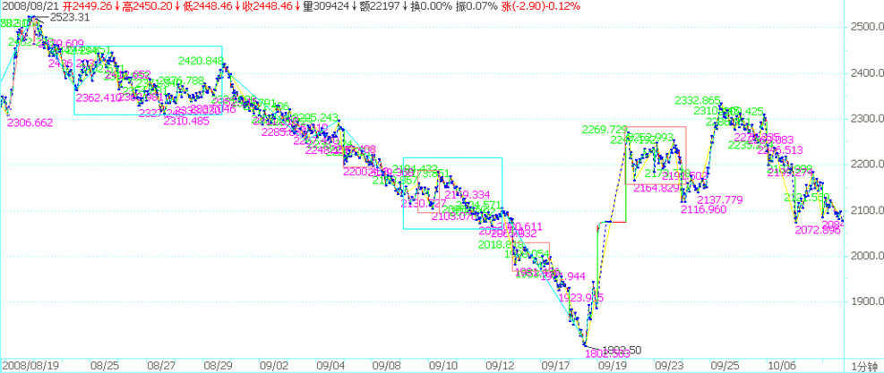

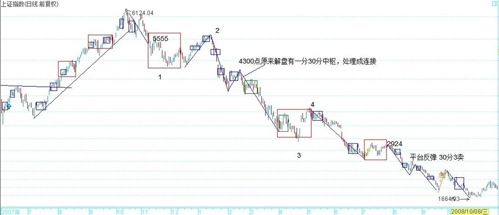

收盘马上有事，先说两句。小反弹后继续下跌，又不是第一个中枢后的下跌，因此，出现更大级别的反弹基本就是必然的，至少90%多以上的把握。所以，下周，无论周末消息面如何，就算还有下跌破点2000点，一个更大力度与级别的反弹将直面，好好看图把握。

好了，开盘了，先下，再见。各位中秋\周末快乐

请记住1987年的股灾发生在10月19日(2008-09-18 10:26:15)

身体没有完全调整过来，但这几天市场风雨飘摇，虽然和本ID没什么关系，正乐见其跌，但还是勉强写两句，让各位心里更明白点。

奥运前，本ID提出断崖论，9月4日又就几位所谓著名经济雪茄的无聊言论给出了对经济调整的严酷性决不能掉以轻心 (2008-09-04 15:30:25) ，这些都请重温。而且反复提出，一旦美股跌破10000点将发生什么？这几天看来，那10000点已不是什么钢板。

请记住，1987年的股灾发生在10月19日，今年恰好21年的神奇数字，这也是为什么本ID对经济一直担忧的一个重要理由。短线反弹很快就有，但关键还要看外围，国内从某种程度上已经被美国所左右，这是本ID反复强调一定要避免的，结果还是没办法，天要下雨，随它去吧。

当然，就算股灾，也没什么大不了的，87年之后还不涨了20年？所以，10月见底依然有可能，只是需要更猛烈的暴跌，否则，真要等17月周期了。

短跑好的，注意很快就有的反弹，抢一口就跑。另外，密切注意世界消息面的变化，看这次老美用尽气力能搞点什么？

中美联手后的潜在陷阱(2008-09-21 14:16:40)

世界经济最大的秘密之一就是共和党收割财富，烂摊子由民主党收拾。这次中美联手的最终命运取决于大选。反正用的纳税人的钱，小布才不心疼。

联手制造的反弹过后，是否一个平台期还是新一次真正毁灭的开始，其实早被老奴隶主所算计。好戏总是情节百转，有钱就赚，有戏就看，关键脚底要牙买加，这样，怎么都可以了。

话说多没意义，该说的都说了，各自领悟吧。

行情级别分析(2008-09-22 15:13:38)

快速说两句。6124点下来只出现过一次周的笔反弹，因此，最大期望就是这次能制造第二个。具体自己去分析。把握了这个级别，后面的操作就很明确了。本周会有一次较大震荡，这是短线需要注意的。

如果中美联手都搞不出第二次周笔反弹，那就成经典笑话了。但具体看图，不要有成见。好了，最关键点已经说了，具体自己操作。

真正的震荡还在后面(2008-09-23 15:40:14)

昨天吃了片安定。没想到困到现在，10年前，一瓶下去，还可以继续去吃喝酒，真是没法比。真正的震荡在后面，有心理准备。5日线是短线关键，否则破了要补第二缺口。不想说了，困。

今天见到了神(2008-09-24 14:38:08)

中国烧钱，美国画饼，这叫中美联手，现在唯一值得看的闹剧是，美国会不会顺便把这些整持的套在这个位置。5日线，股票就这样了。

不当美国佬的刹车片(2008-09-26 10:32:38)

美国佬的把戏在本ID关于联手后陷阱的帖子中已经揭示，显然，王先生这次真的虚竹了一把，不过是太嫩那种，被美国佬耍了把。但美国佬的把戏还是蒙骗不了本ID，美国佬送的钱本ID要了，中国政府以后死顶如十几年前777的闹剧，那种伤心钱就算了。

后面的行情都是777精神的重演，就算继续，也是悲烈的。只要美国佬继续发狠，那闹剧可能就成悲剧，下陷阱后困兽犹斗的感觉不好呀。

这是一场国际性的大棋，自己想去吧，本ID不在其位，残躯一具，休养好了。

美国救市，闹剧一场。(2008-10-05 17:01:24)

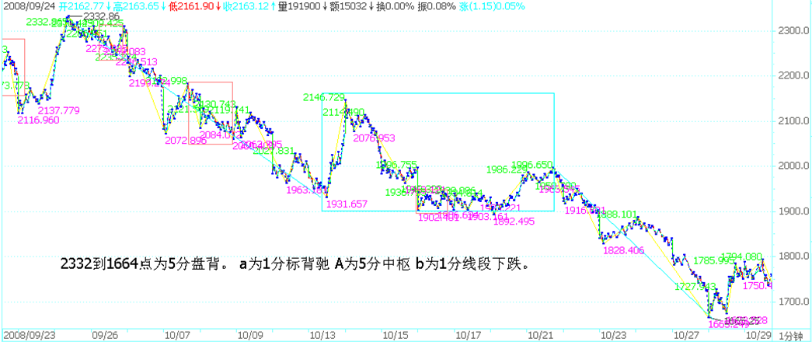

中国放假七天，美国参众两院来回折腾，引得旁观者一惊一乍，终于通过了一个饮鸠止渴的救市方案。但世界金融市场并没有太领情，当天多以暴跌报收，且不管本次救市效益如何，现在必须追问的是这就是说8500亿的救市基金难道是天上掉下来的馅饼？

本次世界经济大调整必须明确的是，最终的任务应该是彻底摧毁几十年来统治世界经济的美元体系，美国经济之所以走到这一步完全是自作自受，以前多次的经济危机都因为美元体系的存在，使美国能够把危机转嫁到全世界去，除了保持绝不正常的超前高消费和高消耗的经济生活模式，而这种模式已超越了地球及世界经济体系的承受力，这种美国消费世界埋单的格局到必须打破的时候。而这次美国故伎重演不过是企图继续维持原有的模式，而美国原有的模式以及这几十年来以美国为主导的世界经济格局不彻底改变，本次世界经济危机将没完没了，终难有解决之时。

现在8500亿的救市方案通过了，但这8500亿绝对不是天山掉下来的馅饼，它归根结底来源于美元泡沫的继续加大，本次世界经济危机的根源归根结底是美元已经彻底泡沫化，最大的风险和危机就是美元本身，而这8500亿不仅使美元的泡沫化加大，使得包括中国在内的其他国家美元资产外汇储备全面爆发危机。更会使得世界金融市场的流动性以乘数效应急速增大，使得石油、粮食、黄金等商品价格面临进一步的疯狂上涨，最终加速美元泡沫的破裂，从而带动商品泡沫的破裂。使得世界经济迅速倒退的危险境地。

面对这种危机的情况，中国应该采取正确态度是不跟风，绝不把自己绑在美国的战车上，而且目前的救市方式是极端错误的。政府不应该直接运用基金方式进入市场本身，而是应该积极培育和领导新的经济热点，使得流动性资金有更多可参与的领域，进而大量吸引外来正欲脱离美元体系的资金进入。只要控制好该类资金的有足够长的投资周期，提供良好的投资环境，使得资金沉淀于比美国更有前途的中国高速发展的潮流之中。那么大的蓄水池一新兴的、以人民币为基础的大的世界火车头才得以确立。美国的危机应该成为我们加速发展的契机。

现在特别要注意的是，目前政府介入股市的局面已经形成，因此必须好好把握好的推出时机，以免重蹈九十年代“七七七”救市的覆辙。

只要我们能以我为主，对美国的闹剧只看绝不参与，只防美国闹剧引发的经济危机对中国经济的伤害，那么我们就有足够的理由和信心在这场世界大风暴里保存实力，调整经济发展模式和结构。使得在风暴过后能迅速以新的姿态快速进入新的经济增长周期。

无话可说(2008-10-10 09:24:36)

继续看图\ 短跑，美国破万确实如期壮观，1019前后还有什么，等着。

顺便问好。

缠师心法汇总

次名称内容备注1真正的心态耐心等待股票成为真正的绩优股。大级别买点的就是最好的绩优股2投资第一要点要养成绝对不追高的好习惯，除非是刚启动。一定要有这样的心态，它爱长多少是多少，权当这股票不存在。3受用一生的思维模式有买点吗？有符合自己操作的级别的买点吗？股票就是分段操作；只投向有买点的股票，关键是看图，看是否有符合操作级别的买卖点。4真正的节奏和思维去找会形成第三类买点的股票，最好就是找有大级别第三类买点的强势股票。不参与任何的中枢震荡，只搞最强势的这才是散户该干的事情。持有到背驰卖点，然后坚决走人，等待新的买点。5最基本的原则在某级别买点买的，就在某级别的卖点卖。买了股票，就一定要从买点一直持有到至少是同级别的第一卖点。要养成完成整个操作的习惯，如果持有的股票没有出现卖出信号，就要一路持有。在日线级别买的，30分钟的调整基本可以不看。6比较安全的原则就是把操作级别放大。1分钟、5分钟的图，一般只能用来每天的对冲操作。真正有意义的隔天操作至少是30分钟图。7如何保证正确操作最好就是一心一意，选好一定的股票，反复操作。如果能把所有该级别的震荡基本把握，其实效率并不低。8最好的操作习惯一定要养成只看图操作的习惯；选定级别，按图操作，买点买，卖点卖。图形的结构才是第一位。市场中不要习惯于问为什么？而要习惯于现在是什么，符合什么，只要符合持有的就持有，符合卖出的就卖出，就这么简单。所有情况都逃不过高位背驰卖，低位背驰买。市场中，成本是最关键的，只要成本不断降低，你将战无不胜。9最安全的弄法任何时候都要集中兵力，而且要有机动的资金，然后用机动的资金不断弄短差把成本降低。一般散户，3只就足够了。10市场中生存的最好办法一定要习惯于在放量突破回调时买股票，这样风险小很多；一定要在调整结束后将启动时介入。个股强者恒强在证券中表现明显。11保存快乐的好办法坚持只选择第一类第二类买点进入。股票是一个快乐的游戏，别把自己搞得那么苦。12最快的方法用第三类买点去操作。（把第3类买点的操作用熟，将终身受益）日线第三类买点突破，都有至少20%以上的涨幅。13如何找日线第三买点看一个30分钟的回抽，而该回抽低点，就看5分钟的背弛，必须三个级别共同来才可以。日线的第三类买点：只要一个30分钟的回抽不破日线中枢就可以。14最好的买点底部都是分级别的，不是在底部的区间上买，而是相反，应该和中枢震荡的操作一样，在区间下探失败时买，这才是最好的买点第一类买点出现后一直到该买点所引发的中枢第一次走出第三类买卖点前，都可以看成底部构造的过程。15股票池的建立方法把一些有潜力的板块，价位不高的，周线还没拉升当成自选，弄个100、几十只的，然后每天在这些股票里选买点，这样就不会太累了。把已经走坏的挑出你的股票池，不断换入有潜力的新板块，这样不断下去，一定会有大成果。16个股加速上涨的时机在周线、或至少在日线上出现第三类买点，然后就进入加速阶段。在牛市里，第三类买点的爆发力是最强的。17效率、节奏与买卖点要有效率，必须有节奏，要有节奏，就首先要把握好买卖点。买点并不一定是一个点，一个价位，级别越大的，可以容忍的区间越大。18真正的长期投资在大级别买点介入，例如年线、季线、月线的买点，然后一直持有到大级别卖点再卖。最佳买点：周线、月线买点；超级大卖点：月线、季线。19买卖的先后次序向下段：先卖后买；向上段：先买后卖。一定要搞清楚向下段、向上段；根据向下、向上段的节奏来。20最有效的顶背离MACD黄白线回到0轴附近再上去，股价新高而两线以及柱子都不新高（创新高或新低才有背驰的可能，其它可以看中枢震荡）黄白线创新高一般都不会是本级别的背驰。21MACD与背驰黄白线刚上0轴的，根本就谈不上背驰，背驰是要上0轴后有一次大拉升，然后回抽0轴，再拉升，才会有背驰。MACD黄白线从0轴下很低的位置回到0轴上然后一个双回试，是典型的启动形态。拉回0轴再上去，都可以先看成是进入背驰段，日线黄白线是否创新高在刚走出了的时候是不可能知道的，就看小级别的内部结构，如果小级别的走势特别强，使得黄白线创出新高，那就不存在背驰的问题。MACD每个红绿柱的一波都象一个小山，山顶就是转折的地方。第一次大洗盘让MACD日线第一次回拉0轴后一定要买回来，就算是背驰的情况，还有创新高的机会，而且还存在不背驰的情况，那就厉害了。要学会用MACD黄白线第一次上0轴以后横在0轴上形成第二类买

点的判断。22操作注意事项一定要记住，只要是赚钱卖的，就无所谓对错，这么多股票，总能找到股票有更好的买点，没必要一棵树吊死。操作，一定要冷静，有钱，什么都有，还怕没有好股票？23大牛市中用最小风险获得最大利益的方法基本翻番后就抛一半，剩下就扔一边不管，就算你不会弄短差把筹码变多，就这一招，就可以在大牛市中用最小风险获得最大利益。要长期胜利，就一定要坚持用最小风险换取最大利润，风险是第一的。25避开大调整的方法看30分钟的第一类卖点。（卖点要看小级别的背驰）对于散户来说，任何一个级别大点的调整都应该避开，没必要参与26投资的大忌在以巨量大阴线构造顶部的下跌反抽中介入。27市场参与者的大忌急着挣钱的心理。（连自己的心都控制不住，对自己的贪婪、欲望都不能控制，是不能在市场中长久成功的）。28最大的错误有卖点不卖就是最大的错误。比有买点不买还要严重。29安全的回补点两个中枢以后出现背驰，那就是很安全的回补点；必须等待真正的背驰才能回补。（如果信心不足，可以分单回补）连中枢都没有形成，意味着趋势很强烈，就一定要耐心等待中枢的出现。30最基本的概念对于趋势，有两个中枢后就可以随时结束。最精确的还是看中枢、背驰。31最基本的概念出现一次较大的调整后，这些股票都会继续有如前面一样的表现（2007.04.24）；这些股票都是中长线，看不清楚中长线就看看月线。机会是可以等待的，千万别追高。32影响反弹力度的主要条件背驰、前期强势板块（资金在里面）、板块对、位置对。进入操作级别的背驰段，就用区间套确定精确的买点。33

短线中线与长线短线是用来摊成本的，要挣大钱，关键是看中线；（至少应该在日线级别的买点介入，这样才有中线运用的价值）。市场只会给耐心者以回报；股票是需要养大的。股票只要中线启动，其升势就不会很简单的改变。牛股中线拉升时一般不会跌破5周均线，一旦跌破就是一个较大的调整。中线是指周线级别（至少有两个月以上的操作期）。中线的顶不是一天炼成的，上升途中的大阴线，只会引发多头更凶猛的反扑。放巨量后就是一个好的短线出手时机。5周线是中线生命线，一旦有效跌破将进入中期调整。围绕120周线（中线生命线）进行中期调整，最终要站稳才有第二波大行情。一般股票从个位到十位都要长期折腾的。以中长线的心态选择股票，短线全部用纯技术把成本变成负数，这才能永远不败。120月线是长线行情展开的最重要关口。34短差程序大级别买点介入的，在次级别第一类卖点出现时，可以先减仓，其后在次级别第一类买点出现时回补。35背驰出货的时机什么时候开始出？除了看两段趋势之间的力度，还要看第二段趋势内部的背弛，特别两段趋势之间是一个狭窄的平台整理，为什么？因为调整有交替关系，一个平台调整后，下一个调整往往是快跌型的，因此必须要配合第二个趋势的内部背弛（5分钟或1分钟）看。背驰出货都是上涨时出的，一路涨一路出。36中枢级别背驰与买卖点围绕中枢（中枢是一个确认概念，必须两次向一个位置确认才构成中枢）的震荡，基本都至少是三波完成的，例如从底背驰到顶背驰，都有上下上的过程。震荡的处理很简单，就是看次级别的背驰弄对冲。背驰是制造底部，制造第一类买点的，而中枢扩展，延伸是制造第二、三类买点。(符合区间套的背驰就要充分注意。)抓住中枢这个中心，走势类型与级别两个基本点。一个周线级别的调整结束，意味着一个向上的波动至少是上次上来波动的级别。卖了是为了买回来，特别对那些大级别在强劲上升的股票。形成一个日线中枢，怎么都至少需要10来根日K线。如果一个上涨，连5日线都不破，肯定是形成不了日线中枢的，最多形成30分钟的中枢。所以这就是强势的表现。对于趋势来说，如果真不形成中枢证明上涨有动力。大盘从06年8月到07年1，就没形成过日线上的中枢，所以才这么强。日线级别的调整就必然在30分钟上有三段走势，想想现在是第几段，意味着什么？这样就能从容地安排操作。大级别进入背驰段，然后级别逐步向下进入，这是最标准的状态。如果大盘已经形成30分钟的中枢，那么就看30分钟的就可以，然后从30分钟的第二个开始，密切关注是否进入背弛段。然后再按区间套来确定精确背弛。按图操作。没有背弛，不能回补（指主跌段）；分清主升段、主跌段或背驰段。如果你的资金量不大，不能短线操作，那看30分的买点就足够了，当然，最好日线不能在背驰段里。对短线走势特别猛的股票，不能看日线，那反应太慢，看30分钟线足矣。30分钟的买点（当然，最好日线不你能在背驰段里），怎么都比1分钟的有吸引力，对于小资金，这点更重要。最好就是在30分钟的背驰段用5分钟找买点，短线这样就比较安全了。站在30分钟级别，回跌后就要回补回来，然后等待30分钟真正背驰的出现。不要当死多，要充分利用自己可以把握的级别震荡去减低成本。15分钟的背驰，对于小资金，足以有10%的短差了，8次这样的机会足以翻番了。离开中枢后的回抽力度越小，后面可以期待越高。在行情的延伸段里，一个30分钟的买点到卖点所产生的利润，比日线启动初期要大多了。所有买点都肯定是调整时出现的。下跌的2-3个中枢之后你考虑的应该是买点，上涨的2-3中枢之后你考虑的应该是卖点。比较安全的原则就是把操作级别放大，因为这样才有足够的时间和空间让你面对一些走势的变化。一般来说，牛市的第一波，一定要出现两个周线中枢后再一次的上涨，这时候才有最后疯狂的可能，（牛市慢涨快跌，熊市快涨慢跌）。没有先验标准是四海皆准的。37走势终完美实质上就是必须形成相应级别的中枢，一旦某级别的中枢形成，该走势就是完美的，可以随时结束，走势必完美：三个次级别是必须的；一定有两次回抽！38板块轮动任何板块的演绎，基本都是一、二、三线节奏的。最后连3类都动起来，就差不多是该板块大调整了。第二龙头的补涨比第一龙头还有力时，往往是该板快要进入调整的标志。牛市其实是最简单的，每一阶段有一个龙头板块，其他都是补涨的。（在牛市里，预测任何股票的顶部都是荒谬的，这是思想方法的根本区别。每次大行情，深发展都上50元。）第一、二、三阶段的龙头板块分别是成分股、成长股、重组股。震荡中新板块借机启动，这就是典型的轮动。前期没动的也会借调整启动的。39常识与经验一定要紧跟大部队，有集团进驻的领域会反复活跃，而没有的，就可能出现长期不动的局面。不要对有规律的走势产生定式，人经常就是这样被杀的。一个标准的下降通道，到下轨就可以短线，如果破下轨加速，那就要放爆竹了，大的反弹马上就在眼前。任何技术位置都有一个上下3%的允许空间。日线不用复权，周/月线可以复权。注意看盘时间，14、14：45，这些都是敏感时间。跳水经常在14：45分。新资金介入迹象：放量后有一个缩量站住的过程。消息跟着走势走，空头主控，当然利空漫天飞，哪天等多头主控了，你想听什么利多消息都有。至于涨幅不大的，买点出现，本ID会回补的。人弃我不一定取，人抢我一定给。亏损是按百分比的，一百亿和一百万，亏了百分百，都是零。不要在所有均线都向下发散时买股票，风险太大。炒股必须有一定的节奏韵律，如果高位没走，低位去回补等于加仓，这样不好，一定要搞清楚向下段与向上段。回补如果信心不足，可以分单回补。只要是先卖的，回补起来就不会害怕了。股票又不是慈善晚会，那些没信心，没耐心的不下来，换手不充分，怎么可能大涨呢？历史密集区就是历史上大多数的人都套在这个地方。调整正是寻找下一次上涨好股票的时机，至少可以利用调整换股或打差价，前期没动的股票也会借调整启动。大盘调整时，关注逆市不跌的股票，下轮的黑马由此产生的可能性很大。破5日线这是通用的不精确方法，按通常的理解，一般是3天拉不回来就是真跌破。翻倍时都要洗盘，短线就按中枢震荡来处理，直到第3类买卖点出现。（一般股票上涨一倍后都有压力，特别是大盘的）。短线涨1倍，又背驰，就要调整。目前的走势无非两种可能，一、演化成三角走势、一、直接突破。如何判断，很简单，就看到前期高位时，次级别的走势是否出现背弛，一旦出现，就要再次回跌，否则就直接突破了。持有要有耐心，除非卖点出现，否则不能乱动，但卖点出现就必须离开。如果是中线持股，除了用部分筹码打短差，就要持得住。在大的调整市道中，历史经验反复证明，低价题材是永远不败的主题；大盘将继续走到资金与筹码的能量平衡位置才能停下来休整，而这个位置是不可预测的，是干出来的。2007.04.10说明：表中的全部内容均是缠师所说，包括备注，采用备注的形式是为了更好的理解。

本文由公众号 “三思复盘”  整理
